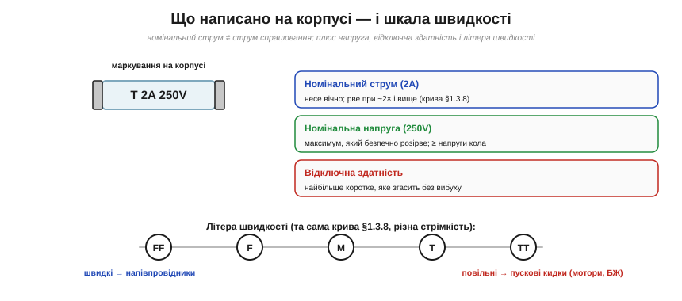

# 🔌 Запобіжник як компонент: корпуси, швидкі/повільні, вибір номіналу

> Компонентна вставка до теми [§1.3.8 «Запобіжники й самовідновні PTC»](resistance-power-heat.md). §1.3.8 пояснив **чому** запобіжник працює (найслабша ланка, що плавиться від I²R) і що таке **часострумова** характеристика. Тут — практичний бік: у яких **корпусах** буває запобіжник, що написано на його тілі, що означають літери **F/T**, і як дібрати правильний номінал, щоб він захищав, а не підводив.

### Форм-фактори: той самий принцип у різних корпусах

*Рис. 1.3.8c.1. Чотири поширені корпуси. Скляний циліндр 5×20 мм — видно перегорілу нитку, але гасить лише невелике коротке. Керамічний (наповнений піском) — велика відключна здатність, для мережі. Ножовий автомобільний (ATO) — колір кодує номінал, для 12 В. SMD — крихітний, прямо на друковану плату.*

- **Скляний циліндр** (5×20 мм, рідше 6×32 мм) — класика електроніки; крізь скло видно, ціла нитка чи ні.
- **Керамічний циліндр** (із піском усередині) — для мережі: пісок гасить дугу, тож **відключна здатність** велика.
- **Ножовий автомобільний** (ATO/mini/maxi) — устромляється в тримач, колір = номінал, світ 12 В.
- **SMD-запобіжник** — для поверхневого монтажу на плату; є й **самовідновні** (PTC із §1.3.8) у тому ж дрібному корпусі.

### Три числа на корпусі (а не одне)

*Рис. 1.3.8c.2. Маркування «T 2A 250V» містить три різні числа: номінальний струм, номінальну напругу й тип швидкості. Знизу — шкала літер швидкості від FF (надшвидкі) до TT (наднеспішні): це практичне обличчя часострумової кривої §1.3.8.*

На корпусі стоїть не один параметр, а **три**:

- **Номінальний струм** — який запобіжник несе **вічно**. Це **не** струм спрацювання: перегорає він не на номіналі, а при перевищенні (приблизно вдвічі й більше — за часострумовою кривою §1.3.8). «2 А» означає «несе 2 А скільки завгодно, рве десь від 4 А».
- **Номінальна напруга** — найбільша напруга, яку він здатен **безпечно розірвати**. Має бути **не менша** за напругу кола. Запобіжник на 32 В у мережі 230 В небезпечний: дуга не згасне.
- **Відключна здатність** (*breaking capacity*) — найбільший аварійний струм, який він перерве, **не вибухнувши**. У скляних вона мала (десятки-сотні ампер), у керамічних із піском — тисячі. Має перевищувати можливий струм короткого замикання.

### Літери швидкості F/T

Перед номіналом стоїть літера — це **швидкість**, практичне обличчя часострумової кривої §1.3.8:

- **FF / F** — надшвидкі / **швидкі**: для чутливих напівпровідників, рвуть від найменшого перевантаження.
- **T / TT** — повільні (із затримкою) / наднеспішні: терплять короткий **пусковий кидок** (мотори, трансформатори, блоки живлення з вхідним конденсатором — згадайте кидок §1.3.4) і не перегорають даремно.
- **M** — середні, між ними.

Той самий номінальний струм, але різна стрімкість: швидкий захищає делікатне, повільний не зважає на законний сплеск.

### Як дібрати: коротко

1. **Струм.** Номінал **трохи більший** за робочий струм, із запасом (запобіжник теж дереться від тепла й не любить працювати «впритик»).
2. **Швидкість.** F — для електроніки й напівпровідників; T — для навантажень із пусковим кидком.
3. **Напруга.** Номінальна напруга ≥ напруги кола (і врахуй, що **постійний** струм гасити важче за змінний).
4. **Відключна здатність** ≥ можливого струму к.з. (мережа → кераміка).
5. **Корпус** — під тримач чи плату.

### Типові граблі

- **Не плутай номінал зі струмом спрацювання** (2 А несе 2 А, рве близько 4 А+).
- **Ніколи не став «жирніший», щоб не перегорав** — це вимикає весь захист.
- **Скляний на мережевому короткому може вибухнути** (мала відключна здатність) — туди потрібна кераміка.
- Перегорілий запобіжник — це **симптом**: спершу знайди причину (коротке, перевантаження), потім став новий **такий самий**.
