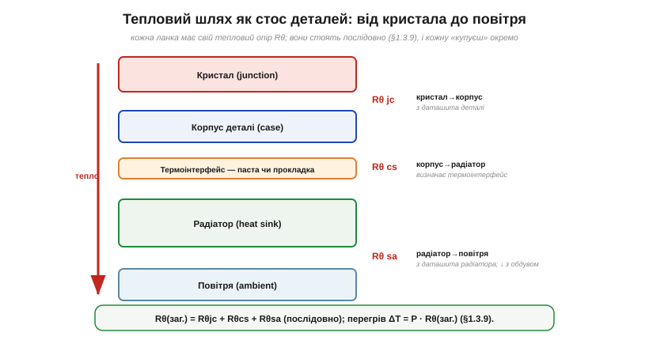
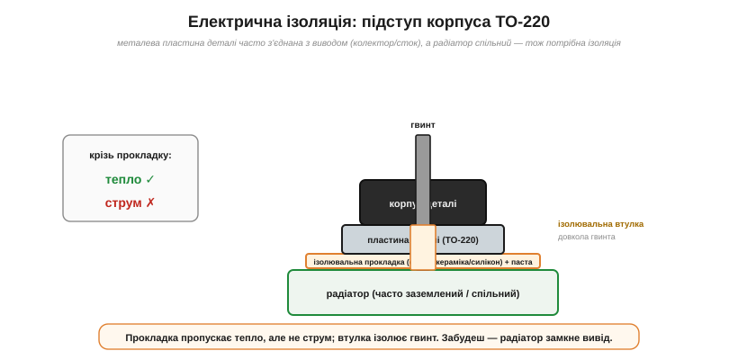

# 🔌 Радіатори, термопаста й термопрокладки: з чого складається тепловий шлях

> Компонентна вставка до теми [§1.3.9 «Тепловий опір і радіатор»](resistance-power-heat.md). §1.3.9 пояснив фізику: тепловий опір Rθ, чому ланки шляху стоять послідовно й навіщо термопаста виганяє повітря зі стику. Тут — практичний бік: тепловий шлях як **стос реальних деталей**, кожну з яких добирають окремо, і **меню термоінтерфейсів** (паста, прокладка, ізолятор) — плюс одна підступна деталь монтажу, про яку легко забути.

### Тепловий шлях — це стос деталей, і кожну купуєш окремо

Від гарячого кристала до повітря тепло долає **стос** ланок, і кожна додає свій тепловий опір — послідовно, як у §1.3.9:

*Рис. 1.3.9c.1. Тепловий шлях як набір деталей. Rθjc (кристал→корпус) береться з даташита деталі; Rθcs (корпус→радіатор) задає термоінтерфейс; Rθsa (радіатор→повітря) — з даташита радіатора й сильно залежить від обдуву. Сума цих опорів дає загальний Rθ, а перегрів ΔT = P·Rθ (§1.3.9).*

- **Кристал → корпус** (Rθjc): зашито в самій деталі, читаєш у її даташиті. Змінити не можна — лише обрати деталь у кращому корпусі.
- **Корпус → радіатор** (Rθcs): його визначає **термоінтерфейс** (про вибір — нижче).
- **Радіатор → повітря** (Rθsa): головне число радіатора; залежить від його розміру **й обдуву**.

Практичний висновок: щоб знизити перегрів, дивись, **яка ланка найгірша**, і працюй саме над нею. Часто це Rθsa — тоді більший радіатор чи вентилятор; іноді Rθcs — тоді кращий інтерфейс або щільніший притиск.

### Радіатор: типи й що читати

Радіатори різняться не лише розміром:

- **екструдований** алюмінієвий профіль — найпоширеніший, дешевий, універсальний;
- **штампований** — зовсім дешевий, для малих потужностей;
- **голчастий** (pin-fin) чи з **тепловими трубками** (heat pipe) — для великих потужностей;
- **мідний** — проводить краще за алюміній, але важчий і дорожчий;
- **активний** (із вентилятором) проти **пасивного**.

Головне паспортне число — **Rθsa** (°C/Вт): що менше, то краще. І пам'ятай: воно дане **за певного обдуву**. Той самий радіатор із вентилятором має Rθ у рази менший, ніж на природній конвекції, — тому в даташиті дивись саме той рядок, що відповідає твоєму обдуву.

### Термоінтерфейс: паста, прокладка чи що

§1.3.9 показав, **навіщо** інтерфейс (вигнати повітря зі стику). А ось **меню** — що коли брати:

- **Термопаста** — найнижчий Rθ, для щільного гвинтового притиску до рівних поверхонь. Мінуси: брудна, з часом сохне й «виповзає» (pump-out). Кладуть **тонко** (товстий шар сам стає бар'єром, §1.3.9).
- **Термопрокладка** (gap pad) — м'яка, заповнює **більші** зазори й нерівності, багаторазова, буває одразу електроізолювальна; зате Rθ вищий за пасту. Для менших потужностей чи нерівних стиків.
- **Ізолювальна прокладка** (слюда, кераміка, силікон) + трохи пасти — коли потрібна **електрична** ізоляція (див. нижче).
- **Фазозмінний матеріал** — твердий при кімнатній температурі, розм'якає при робочій; зручний на конвеєрі.
- **Теплоклей чи теплоскотч** — коли механічного кріплення нема, а радіатор треба просто приклеїти (слабший тепловий контакт — для дрібних деталей).

### Підступ монтажу: електрична ізоляція

Ось важлива річ, якої §1.3.9 не зачіпав. У багатьох силових деталей (класичний корпус **TO-220**) металева монтажна пластина **електрично з'єднана** з одним із виводів — часто з колектором або стоком. Якщо радіатор спільний для кількох деталей чи заземлений, то, прикрутивши **голу** пластину, ти **замкнеш** цей вивід на радіатор — і коло працюватиме не так (або згорить).

*Рис. 1.3.9c.2. Ізольоване кріплення. Між пластиною деталі й радіатором — ізолювальна прокладка (слюда/кераміка/силікон) з пастою, а гвинт проходить крізь ізолювальну втулку. Тепло йде до радіатора, а струм — ні. Забути про це — типова й прикра помилка.*

Рятунок — **ізолювальна прокладка** між деталлю й радіатором плюс **ізолювальна втулка** довкола гвинта: тепло проходить, а струм — ні.

### Типові граблі

- **Забути ізоляцію** — радіатор замикає вивід деталі.
- **Забагато пасти** або стара суха паста — зайвий Rθ замість користі.
- **Слабкий чи нерівний притиск** — між поверхнями знову повітря.
- **Покластися на природну конвекцію**, де насправді потрібен обдув.
- **Сам радіатор гарячий** — це нормально (він на те й є), але можна обпектися.
