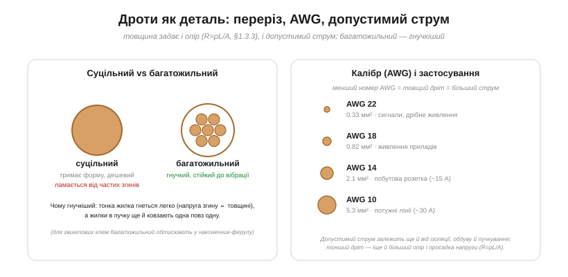

# 🔌 Дроти: переріз, AWG, допустимий струм і чому багатожильний гнучкіший

> Компонентна вставка до теми [§1.3.3 «Від чого залежить опір: матеріал, довжина, переріз»](resistance-power-heat.md). §1.3.3 вивів R = ρL/A і показав калібр AWG. Тут — про дріт як **повноцінну деталь**: скільки струму він стерпить, скільки напруги «з'їсть» на довгій лінії і чому той самий переріз буває суцільним і багатожильним.

### Дріт — теж деталь, а не «ідеальне з'єднання»

Звикли вважати дріт просто лінією на схемі. Та насправді в нього є **опір** (R = ρL/A, §1.3.3) і **межа струму**. На коротких сигнальних з'єднаннях цим нехтують, а от у сильнострумових чи довгих лініях обидва чинники вирішують — аж до пожежі чи «просілого» живлення.

### Допустимий струм (ampacity)

*Рис. 1.3.3c.1. Ліворуч: суцільний дріт (один провідник — тримає форму) проти багатожильного (пучок тонких жилок — гнучкий). Праворуч: калібр AWG — менший номер = товщий дріт = більший допустимий струм (а ампацитет залежить ще й від ізоляції та умов охолодження).*

Головне число дроту — **допустимий струм** (*ampacity*): скільки ампер він понесе, не перегрівшись. Логіка теплова: струм гріє дріт (I²R, §1.3.6), а тепло має встигати стікати; перевищиш — ізоляція плавиться, починається пожежа (§1.3.8). Товщий дріт (менший номер AWG) і опір має менший, і поверхню більшу — тому терпить більший струм.

Та ось важлива пастка: **ампацитет — не одне число**. Він залежить від **ізоляції** (її температурної межі), від **довкілля** (у гарячому місці менший) і, найпідступніше, від **пучкування**: дроти, зібрані в джгут чи прокладені в трубі, гірше віддають тепло, тож кожен треба **дерейтити** (брати запас). Тому таблиці ампацитету завжди дають значення за вказаних умов — і не можна просто «взяти максимум».

### Падіння напруги на довгій лінії

Другий чинник, про який часто забувають, — **падіння напруги**. Довгий тонкий дріт має помітний опір, і на ньому за законом Ома губиться напруга V = I·R. Для 12-вольтового живлення через десяток метрів тонкого дроту це можуть бути цілі вольти — і прилад на кінці голодуватиме. Часто саме падіння напруги, а не нагрів, **диктує** товщину дроту в довгих низьковольтних лініях: беруть товще, ніж вимагає ампацитет, аби напруга доходила.

### Суцільний чи багатожильний

Тепер — чому той самий переріз буває двох видів. **Суцільний** (*solid*) дріт — це один товстий провідник: дешевий, тримає форму (зручно встромляти в макетку), добрий для нерухомого монтажу й плат. **Багатожильний** (*stranded*) — пучок тонких жилок: **гнучкий** і стійкий до вібрації.

Чому багатожильний гнучкіший? Бо напруга згину в провіднику тим більша, чим він **товщий**; тонка жилка гнеться легко, майже не напружуючись, а жилки в пучку ще й **ковзають** одна повз одну, не заважаючи. Суцільний же дріт від частих згинів **наклепується** й зрештою **ламається** від утоми металу. Тому правило просте: усе, що рухається (кабель до рухомого вузла, дріт у робота), — **багатожильне**; нерухомий монтаж — можна суцільне.

### Типові граблі

- **Замалий дріт = пожежа.** Добирай переріз під струм **із запасом** і дерейть у джгутах і теплі (§1.3.8, §1.3.9).
- **Багатожильний у гвинтовій клемі** розпушується, окремі жилки тікають убік, контакт слабшає — обтискай у **наконечник-ферулу**.
- **Довга лінія** — рахуй падіння напруги, а не лише нагрів.
- **Ізоляція має рейтинг** (напруга + температура) — не перевищуй; біля гарячого — бери термостійку (силікон, ПТФЕ).

### Варіації

Суцільний і багатожильний; **стрічковий** (плаский, під роз'єми-«гребінці»); **обмотувальний** (емальований, для котушок); **літцендрат** (багато ізольованих жилок — для високих частот); силіконовий (гнучкий і термостійкий). Калібр позначають у **AWG** або **мм²** — у даташитах трапляються обидва.
