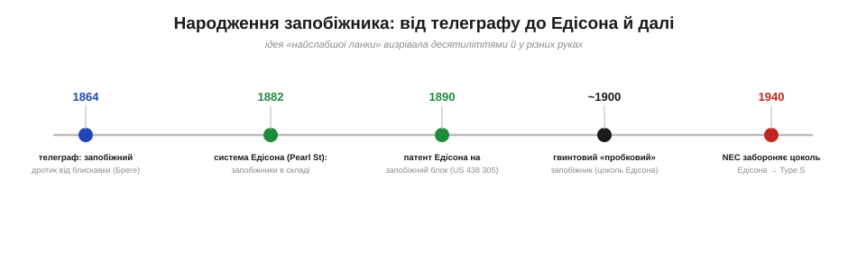
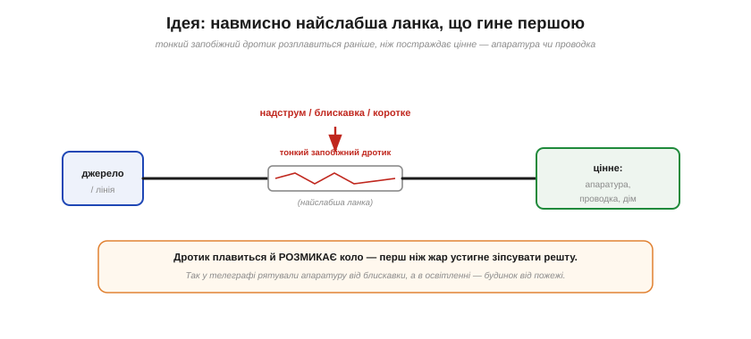
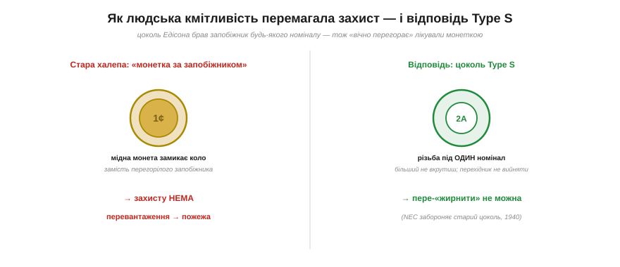

# 📜 Народження запобіжника: телеграфні лінії й освітлювальна система Едісона

> Історична вставка до теми [§1.3.8 «Запобіжники й самовідновні PTC»](resistance-power-heat.md). §1.3.8 пояснив, як працює запобіжник — найслабша ланка, що плавиться від власного тепла й рятує решту кола. А звідки взялася сама ця думка? Виявляється, запобіжник народжувався **двічі**: спершу на телеграфних лініях як захист від блискавки, а потім — у будинках, коли туди прийшло електричне світло й разом із ним загроза пожежі.

Запобіжник — мабуть, найскромніший герой електротехніки. Копійчаний дротик, який існує лише для того, щоб **загинути** в потрібну мить. Ідея настільки проста й природна, що жоден інженер не може назватися її одноосібним винахідником: до неї незалежно дійшли багато людей, щойно електрика почала текти дротами на великі гроші. Та все ж у цієї ідеї є своя історія — з конкретними іменами, датами й однією повчальною людською хитрістю, що мало не звела весь захист нанівець.

*Рис. 1.3.8і.1. Запобіжник визрівав десятиліттями: ідея «найслабшої ланки» з'явилася на телеграфі (1864), стала штатною деталлю освітлювальної системи Едісона (Pearl Street, 1882), дістала патент на запобіжний блок (1890), потім — зручний гвинтовий «пробковий» корпус, а вже у XX столітті — захист від людської винахідливості (Type S, після заборони старого цоколя в нормах 1940 року).*

## Акт перший: найслабша ланка на телеграфі

Перша електрична мережа, що обплела світ, була не освітлювальна, а **телеграфна** (про неї — історія §1.2.4 про атлантичний кабель). Тонкі дроти тяглися на сотні кілометрів просто неба — і збирали на себе **блискавки**. Грозовий розряд, влучивши в лінію, гнав у телеграфну станцію хвилю струму, що спалювала дорогу апаратуру, а часом і саму будівлю.

Рятунок знайшовся в напрочуд простій думці. Французький фізик і конструктор телеграфів **Луї Клеман Франсуа Бреге** (*Louis Clément François Breguet* — онук славетного годинникаря Абрагама-Луї Бреге) запропонував навмисно вставити в лінію **тонший** відрізок дроту. Коли блискавка вдарить, цей відрізок — найслабша ланка — розплавиться **першим** і розірве коло, перш ніж жар дістанеться до апаратури. Цінне врятоване ціною копійчаного дротика.

*Рис. 1.3.8і.2. Уся філософія запобіжника. У коло навмисно ставлять найтоншу, найслабшу ланку. За надструму — від блискавки чи короткого — вона перегрівається й плавиться раніше за все інше, розмикаючи коло. У телеграфі так рятували апаратуру, в освітленні згодом рятуватимуть будинок.*

Думка виявилася такою влучною, що до **1864 року** найрізноманітніші запобіжні елементи — дротики й тонкі металеві стрічки-фольги — вже широко застосовували, щоб захищати телеграфні кабелі та перші освітлювальні установки. Тут варто чесно зазначити **статус** цього факту: запобіжник не «винайшли» в один день в одній голові. Сама ідea жертовної ланки лежала на поверхні, і телеграфні інженери різних країн приходили до неї паралельно; Бреге — лише один із перших, кого історія назвала поіменно. Це класичний приклад **колективного** винаходу, де нема й не може бути єдиного «батька».

## Акт другий: Едісон і страх пожежі

Друге народження запобіжника сталося, коли електрика прийшла з вуличних телеграфних стовпів усередину будинків — разом із **лампою розжарення**. Тут з'явилася нова, по-справжньому смертельна загроза: **пожежа**. Коротке замикання чи перевантаження в схованій у стіні проводці розжарювало дроти (те саме джоулеве тепло I²R з §1.3.6) — і дім спалахував.

**Томас Едісон**, вибудовуючи не просто лампу, а цілу **систему** електропостачання, не міг це знехтувати. Коли 4 вересня **1882 року** запрацювала його знаменита станція на Перл-стріт у Нью-Йорку (перша у світі центральна електростанція, що живила цілий район), запобіжники вже були **штатною частиною** системи — поряд із динамо-машинами, лічильниками, підземними кабелями, патронами й вимикачами. Едісон чудово розумів, що публіка пустить електрику в дім лише тоді, коли повірить у її безпеку: його компанія спеціально домагалася огляду установок **страховими інспекторами** (*fire underwriters*), і саме страх пожежі робив скромний запобіжник незамінним.

Свій конкретний внесок Едісон закріпив і патентом. Заявку на **запобіжний блок** (*fuse-block*) він подав 14 жовтня 1885 року, а патент **US 438 305** дістав рівно через п'ять років — 14 жовтня **1890 року**. Цікаво, що новизна патенту була не в самій ідеї плавкого дротика (вона вже була загальновідома), а в **деталі корпусу**: Едісон додав зовнішні ізоляційні фланці, які подовжували шлях по поверхні між контактами, щоб у вологу погоду потужний струм (зокрема від блискавки в телефонних і телеграфних колах) не «переповзав» по поверхні в обхід запобіжника.

Тож і тут будьмо точні: Едісон **не винайшов запобіжник** — він зробив його **звичною, штатною** деталлю електричного дому й запатентував власну вдалу конструкцію корпусу. Це теж величезна заслуга, але іншого роду: не «перша іскра ідеї», а інженерне доведення її до масової, надійної, безпечної реалізації. Розрізняти ці дві речі — мати ідею і втілити її в систему — узагалі корисна звичка, коли читаєш історію будь-якого винаходу.

## Акт третій: монетка, що перемагала захист

А далі почалася історія, у якій головний герой — не інженер, а **людська винахідливість**, спрямована не туди.

Щоб запобіжник було легко міняти, його вдягнули в зручний гвинтовий «пробковий» корпус (*plug fuse*) з різьбою — так званим **цоколем Едісона**, тим самим, що й у лампочки. Перегорів — викрутив старий, укрутив новий. Зручно. Але в цій зручності крилася пастка: гніздо приймало запобіжник **будь-якого** номіналу. І коли в когось запобіжник «вічно перегорав» (бо коло було по-справжньому перевантажене), господар, замість шукати причину, просто вкручував **товщий** — на більший струм. А найкмітливіші робили ще гірше: підкладали за перегорілий запобіжник мідну **монетку** (горезвісний «penny behind the fuse»), яка намертво замикала коло.

*Рис. 1.3.8і.3. Зворотний бік зручного цоколя Едісона. Оскільки гніздо брало будь-який номінал, «вічно перегорає» лікували товщим запобіжником або мідною монеткою за ним — і захисту не лишалося, а перевантаження вело прямісінько до пожежі. Відповіддю став цоколь Type S із різьбою під один-єдиний номінал, який неможливо «пере-жирнити».*

Наслідок був трагічно передбачуваний: усунувши **симптом** (запобіжник, що перегорає), люди вимикали сам **захист** — і починалися пожежі. Те, що в §1.3.8 звучить як суха пересторога — «ніколи не став жирніший запобіжник, щоб не перегорав», — народилося з десятиліть реальних згарищ.

Відповіддю стала не нова фізика, а **розумна механіка**. Норми (американський National Electrical Code) **1940 року** заборонили старий цоколь Едісона в нових будинках, а на зміну прийшов цоколь **Type S** (Fustat): його різьба підігнана під **один-єдиний** номінал струму, тож більший запобіжник туди фізично не вкрутиш. Перехідник, що вставляється в старе гніздо, замикається в ньому намертво — назад не вийняти. Захист зробили **захищеним від самого користувача** — і це, можливо, найглибший урок усієї історії.

## Що з цього лишилося

Скромний плавкий дротик пройшов шлях від грозозахисту телеграфних станцій до вартового кожної електричної розетки. Його історія — гарна ілюстрація трьох речей. По-перше, **колективності винаходу**: ідея найслабшої ланки була така природна, що належить радше епосі, ніж одній людині, хоч Бреге й Едісон лишили в ній помітний слід кожен по-своєму. По-друге, різниці між **ідеєю та системою**: Едісонова велич тут не в «першості», а в тому, що він зробив безпеку штатною. І по-третє, того, що **найслабша ланка в техніці захисту — людина**: найдосконаліший запобіжник марний, якщо за нього можна підкласти монетку.

Сама ж філософія жертовної ланки виявилася безсмертною. Вона живе і в сучасному плавкому запобіжнику, і в його розумнішому нащадку — самовідновному **PTC** з §1.3.8, який не гине назавжди, а лише «зомліває» від тепла й оживає, коли загроза мине. Але про це — вже не історія, а сьогодення.
