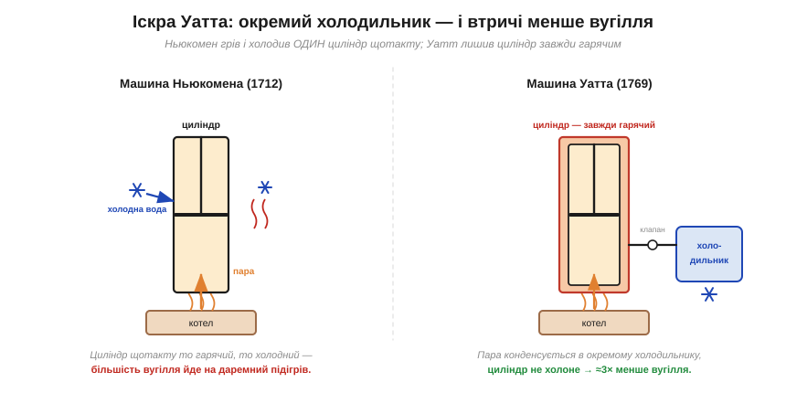
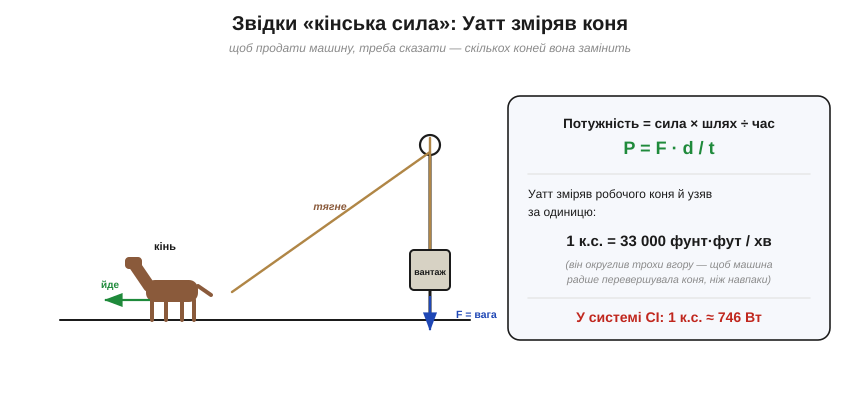
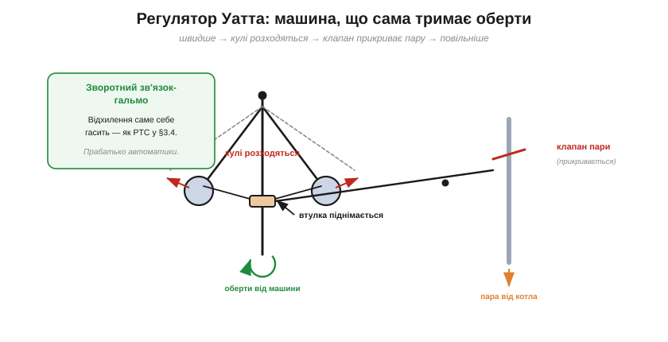

# 📜 Джеймс Уатт, парова машина й «кінська сила»

> Історична вставка до [§1.3.5 «Потужність: P = V·I»](resistance-power-heat.md). У §1.3.5 ми назвали одиницю потужності **ватом** (Вт) — на честь Джеймса Уатта. Але Уатт жив за пів століття до того, як з'явилося електричне P = V·I, і парової машини він **не винаходив**. За що ж тоді така честь? Виявляється, саме він подарував світові дві речі, без яких Розділу 1.3 не було б: **ефективну парову машину**, що розкрутила промислову революцію, і саме поняття **виміряної потужності** — спершу як «кінську силу», а згодом і як ват. Це історія про те, як практична потреба (продати машину, заощадити вугілля) народила глибокі ідеї.

---

## Хто такий Уатт і за що така честь

Потужність — це енергія за секунду, і міряємо ми її у ватах: 1 Вт = 1 Дж/с. Електричну форму P = V·I вивели вже у XIX столітті, через десятиліття після Уаттової смерті. Тож одиницю названо не за формулу — а за те, що **Джеймс Уатт** (*James Watt*, 1736–1819), скромний виготовлювач наукових приладів при університеті Глазго, **зробив потужність вимірюваною величиною** і дав людству машину, яка цю потужність продавала тоннами.

Одразу прибираємо поширену помилку: Уатт **не винайшов** парову машину. Парові насоси працювали в копальнях ще за його дитинства. Уатт зробив інше, не менш велике — він **утричі зменшив** їхній апетит до вугілля й перетворив незграбну помпу на універсальний двигун, що закрутив фабрики цілої епохи. А заразом, щоб ці двигуни продавати, винайшов спосіб **міряти** їхню міць.

---

## До Уатта: машина Ньюкомена, що пожирала вугілля

Щоб оцінити Уаттів стрибок, гляньмо, з чим він починав. Від 1712 року в британських копальнях відкачувала воду **атмосферна машина Ньюкомена** (*Newcomen engine*). Працювала вона хитро: у великий циліндр впускали пару — і поршень ішов **угору** (його тягнула вгору вага насосної штанги на другому кінці коромисла, а пара під низьким тиском лише заповнювала циліндр, майже не штовхаючи). Потім у циліндр **впорскували холодну воду** — пара різко конденсувалася, під поршнем виникало розрідження, і **атмосферний тиск** ззовні гнав поршень униз, роблячи робочий хід. І знову пара, знову холодна вода — такт за тактом.

Машина працювала, але мала згубну хибу: **той самий циліндр щотакту то нагрівали парою, то холодили водою**. Величезна частина вугілля йшла не на роботу, а на те, щоб знову й знову **відігрівати** охолоджений циліндр. Коефіцієнт корисної дії був мізерний — десь близько одного відсотка. Така машина окупалася хіба що просто **на вугільній копальні**, де паливо лежало під ногами й нічого не коштувало. Для решти світу вона була надто ненажерлива.

---

## Уаттова іскра: окремий конденсатор (1765)

1763 року університет Глазго дав Уаттові на ремонт навчальну модель машини Ньюкомена. Лагодячи її, Уатт — людина допитлива й точна — почав міряти й рахувати, **куди дівається пара**. І зрозумів корінь марнотратства: фатально саме те, що циліндр доводиться **холодити й знову гріти** щотакту.

Розв'язок осяяв його, за переказом, під час недільної прогулянки на лузі Глазго-Ґрін навесні 1765 року. Думка була проста й геніальна: а що, як конденсувати пару **не в самому циліндрі**, а у **віддаленій окремій посудині** — **конденсаторі** (*separate condenser*), з'єднаній із циліндром клапаном? Тоді циліндр можна тримати **завжди гарячим**, а холодним буде лише маленький конденсатор. Гріти щоразу величезний циліндр більше не треба.

*Рис. 1.3.5і.1. Ліворуч — Ньюкомен: один циліндр щотакту нагрівають парою й холодять впорскнутою водою, і більшість вугілля йде на даремний підігрів. Праворуч — Уатт: циліндр у паровій «сорочці» лишається **завжди гарячим**, а пара конденсується в **окремому холодильнику**. Результат — приблизно втричі менше вугілля на ту саму роботу.*

Ефект був разючий: на ту саму роботу Уаттова машина палила **приблизно втричі менше** вугілля. Тепер парова сила стала вигідною не лише біля вугільних шахт, а **будь-де** — на млинах, фабриках, у містах.

> 🔧 **Навіщо це.** Уся Уаттова робота — це боротьба за **ефективність**, тобто за більше корисної роботи з меншого палива. Це те саме поняття, що ми зустріли наприкінці §1.3.5: коефіцієнт корисної дії — відношення корисного до витраченого. Ньюкоменова машина майже все паливо «гріла повітря» (як стара лампа розжарення гріє кімнату замість світити); Уаттова спрямувала його в діло. Думати про те, **скільки енергії йде на користь, а скільки марнується**, — звичка інженера й сьогодні, від двигуна до блока живлення.

---

## Від винаходу до промисловості: Болтон і обертовий рух

Геніальна ідея — то лише півсправи; її ще треба **виготовити й продати**. Тут Уаттові пощастило на партнера. Після кількох важких років він об'єднався з підприємцем **Метью Болтоном** (*Matthew Boulton*), і з 1775 року фірма **«Болтон і Уатт»** почала будувати машини на заводі Сохо під Бірмінгемом. Болтонові належить знаменита фраза, кинута гостеві: «Я продаю тут, сер, те, що прагне мати цілий світ, — **силу**».

Уатт тим часом удосконалював машину далі. Він зробив її **двосторонньою** (пара штовхає поршень по черзі з обох боків) і додав два різні механізми, які часто плутають. **Сонячно-планетарна передача** перетворювала хитання коромисла на **рівномірне обертання вала** (її авторство приписують радше помічникові фірми **Вільяму Мердоку** (*William Murdoch*), хоча патент 1781 року дістався Уаттові). А **паралельний механізм** (*parallel motion*, 1784) робив інше — вів шток поршня майже **прямою лінією**, щоб той не хилитався вбік (цим винаходом Уатт особливо пишався). Саме обертання стало вирішальним: машина перестала бути просто помпою «вгору-вниз» і змогла **крутити** — верстати, прядки, млинові жорна, колеса. Саме обертовий паровий двигун і став робочим серцем **промислової революції**.

---

## Як продати машину: порівняти з конем → «кінська сила»

Лишалося питання, на позір приземлене, та насправді глибоке: **як назвати покупцеві міць машини?** Адже доти роботу помп і млинів виконували **коні**, ходячи по колу у воротах (кінному приводі). Власник копальні мислив так: «у мене працює вісім коней». Щоб продати йому машину, Уатт мусив сказати: «вона замінить **стількох-то** коней». А для цього треба було знати — **скільки роботи робить один кінь?**

І Уатт зробив те, що й має робити інженер: **зміряв**. Він спостерігав, як робочий кінь крутить коловорот — з якою силою тягне й який шлях долає за хвилину. Перемноживши **силу на шлях** і поділивши на **час**, він дістав потужність коня й округлив її до зручного числа: **1 кінська сила = 33 000 фунто-футів за хвилину**.

*Рис. 1.3.5і.2. Потужність = сила × шлях ÷ час. Уатт зміряв, яку силу розвиває робочий кінь і який шлях долає за хвилину, і взяв за одиницю 1 к.с. = 33 000 фунто-футів/хв. Він свідомо округлив трохи **вгору**, щоб машина радше перевершувала «свою» кількість коней, ніж не дотягувала. У системі СІ 1 к.с. ≈ 746 Вт.*

Тонкість, гідна доброго інженера й торговця водночас: Уатт округлив значення трохи **вгору** — реальний кінь у тривалій роботі видає дещо менше. Через це його машини на ділі **перевершували** заявлену кількість коней: клієнт отримував більше, ніж очікував, і лишався задоволений. Так народилася **кінська сила** (*horsepower*, hp) — одиниця, що пережила саму парову машину й досі стоїть у паспортах автомобілів.

А головне — у цьому й народилося **поняття виміряної потужності**: робота за одиницю часу, число, яке можна порівнювати. Те саме поняття, яким у §1.3.5 ми міряємо електричне коло через P = V·I, лише там «коня» заступають вольти й ампери.

---

## Машина, що сама себе тримає: відцентровий регулятор

Є ще один Уаттів дарунок, особливо близький нашому курсу. Парова машина мусила крутитися **рівномірно**: навантажиш млин — сповільниться, знімеш навантаження — розженеться без упину. Хтось мав би невпинно підкручувати подачу пари. Уатт доручив це **самій машині**, пристосувавши **відцентровий регулятор** (*centrifugal governor*).

*Рис. 1.3.5і.3. На осі, що крутиться від машини, на шарнірах висять дві важкі кулі. Розженеться машина — кулі відцентровою силою **розходяться** й піднімають втулку; та через важіль **прикриває паровий клапан** — і машина гальмує. Сповільниться — кулі опадають, клапан відкривається, машина прискорюється. Жодної людини: відхилення **саме себе виправляє**.*

Влаштовано просто й красиво: на вертикальній осі, яку крутить машина, на шарнірах сидять дві важкі кулі. Що швидше обертання — то дужче **відцентрова сила** розкидає кулі вбік і вгору. Розходячись, кулі піднімають **втулку** на осі, а та через важіль **прикриває клапан подачі пари** — і машина сповільнюється. Сповільнилася — кулі опали, клапан відкрився, машина знову набирає обертів. Система **сама тримає** задану швидкість.

> 🔧 **Навіщо це.** Упізнаєте? Це той самий **зворотний зв'язок-гальмо**, що й самостабілізація PTC у [§1.3.4](resistance-power-heat.md): будь-яке відхилення **саме себе гасить**. Відцентровий регулятор Уатт не вигадав із нуля, а **пристосував** до парової машини: летючі кулі доти вже регулювали зазор жорен на **вітряках** (ідея конічного маятника походить ще від Гюйгенса). Та саме Уаттів регулятор став одним із найвідоміших **автоматичних регуляторів** і прабатьком теорії керування (згодом Джеймс Максвелл аналізом саме таких регуляторів заклав її математику). Та сама ідея згодом керуватиме й нашими польотними контролерами в Модулі 7: виміряй відхилення — і протидій йому пропорційно. Уатт побудував її з куль і важелів за два століття до мікроконтролерів.

---

## Чим це відгукнулося

Зведімо. Уатт дав світові відразу три речі, що тримають і наш Розділ 1.3, і добру частину сучасної техніки, — хоч, як ми бачили, **не сам-один**: на базі машини **Ньюкомена**, разом із промисловим партнером **Болтоном** і помічником-винахідником **Мердоком**:

- **Ефективну парову машину** — окремий конденсатор (утричі менше вугілля) та обертовий рух, що зробили її двигуном **промислової революції**.
- Саме поняття **виміряної потужності** — спершу як **кінську силу**, народжену з потреби порівняти машину з конем. Потужність як робота за одиницю часу — те саме, що P = V·I у §1.3.5.
- **Зворотний зв'язок** у залізі — відцентровий регулятор (який він **пристосував** до машини), прабатько автоматики, рідний брат самостабілізації §1.3.4.

На його честь 1882 року Британська асоціація назвала одиницю потужності **ватом** (Вт), і назва лишилася в СІ назавжди. Стара кінська сила теж не зникла: 1 к.с. ≈ **746 Вт**. Чи то пара, чи електрика — потужність є потужність, енергія за секунду; і коли в §1.3.5 ми пишемо P = V·I у ватах, ми вшановуємо людину, що навчила світ цю міць **рахувати**.

І останній урок, людський: глибокі поняття — ефективність, потужність, зворотний зв'язок — народилися не з абстрактних роздумів, а з дуже **практичних** потреб: заощадити вугілля, продати машину, утримати оберти. Інженерія й фізика тут живили одна одну — як живитимуть і нас далі в цьому курсі.

> ▶️ Повернутися до [§1.3.5 «Потужність: P = V·I»](resistance-power-heat.md) · далі в розділі — §1.3.6 «Джоулеве тепло» та §1.3.7 «Резистор як компонент».

---

### Пов'язане
- [§1.3.5 Потужність: P = V·I](resistance-power-heat.md) — поняття потужності, яке Уатт зробив вимірюваним; одиниця ват.
- [§1.3.4 Опір і температура](resistance-power-heat.md) — самостабілізація (PTC) як зворотний зв'язок-гальмо, родич регулятора Уатта.
- [§1.2.5 Струм не «витрачається»](../voltage-current-conduction/voltage-current-conduction.md) — різниця між збереженим струмом і перетворюваною енергією; звідси й ідея ефективності, серцевина всієї Уаттової справи.
