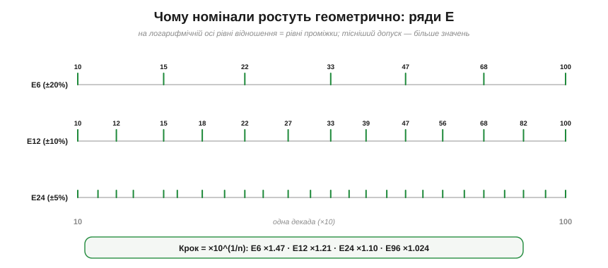
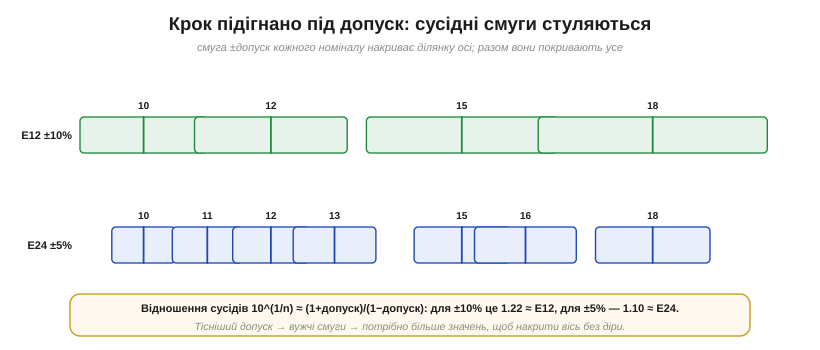

# 🧮 Ряди E12/E24/E96: геометрична прогресія з кроком під допуск

> Числова вставка до теми [§1.3.7 «Резистор як компонент»](resistance-power-heat.md). §1.3.7 згадав, що номінали беруть зі «стандартних рядів E». Тут розберемо, **чому** ці ряди саме такі: чому в каталозі є 22 кΩ і 27 кΩ, а круглих 25 кΩ немає, і чому кількість значень у ряді — не випадкова, а **точно підігнана під допуск**.

### Загадка каталогу

Перегорнімо ряд номіналів в одній декаді: 10, 12, 15, 18, 22, 27, 33, 39, 47, 56, 68, 82 — і знову 100. Дивні числа: не круглі 10, 20, 30, 40, а якісь «нерівні». Це не примха виробників, а наслідок однієї математичної ідеї.

### Геометрично, а не арифметично

Опори в техніці охоплюють велетенський діапазон — від часток ома до мегаомів, багато **декад**. На такому розмаху важить не **різниця** значень, а їхнє **відношення**. Перехід 100 → 120 Ω (на 20 %) — це той самий «крок», що й 1000 → 1200 Ω: обидва на ×1.2. А от перехід 100 → 110 і 10 000 → 10 010 — зовсім не рівноцінні, хоча різниця в омах схожа.

Тому номінали розставляють не через рівні **проміжки** (як 10, 20, 30), а через рівний **множник** — кожне наступне значення дорівнює попередньому, помноженому на сталий коефіцієнт. Це **геометрична прогресія**. На логарифмічній осі така прогресія лягає **рівними інтервалами** — і весь діапазон покривається однаково густо.


*Рис. 1.3.7m.1. Три ряди на логарифмічній осі однієї декади (10…100). На ній рівні відношення дають рівні проміжки, тож геометрична прогресія виглядає рівномірною сіткою. E6 — 6 значень на декаду, E12 — 12 (удвічі густіше), E24 — 24. Що тісніший допуск ряду, то більше значень.*

### Крок ряду: множник ×10^(1/n)

Назва **E-n** означає **n** значень на декаду. Щоб після n кроків якраз набігла ×10 (декада замкнулася на круглому числі), множник одного кроку має бути:

```
крок = 10^(1/n).
E6:  10^(1/6)  ≈ ×1.47      E12: 10^(1/12) ≈ ×1.21
E24: 10^(1/24) ≈ ×1.10      E96: 10^(1/96) ≈ ×1.024
```

Звідси й самі числа: 10 × 1.21 ≈ 12, далі × 1.21 ≈ 15, потім 18, 22, 27… — округлені члени геометричної прогресії. Точні ряди (E48, E96, E192) дають по три значущі цифри й слугують прецизійним резисторам із §1.3.7.

### Чому саме стільки значень — крок під допуск

Ось найкрасивіша частина. Кількість значень у ряді не довільна: її **підбирають під допуск**, щоб смуги «номінал ± допуск» сусідів **якраз стулялися**, накриваючи всю вісь без діри й без зайвого перекриття.


*Рис. 1.3.7m.2. Кожен номінал зі своїм допуском накриває смугу на осі: E12 з ±10 % — широкі смуги, їх досить 12 на декаду; E24 з ±5 % — вужчі, тож щоб накрити ту саму вісь без діри, значень треба вдвічі більше. Тому густина ряду й допуск завжди йдуть у парі.*

Формально: щоб верх смуги одного значення V зійшовся з низом смуги наступного V·r, потрібно V·(1+t) = V·r·(1−t), тобто крок r = (1+t)/(1−t). Підставмо допуски:

```
±10%:  (1.1)/(0.9) = 1.22  ≈ 10^(1/12)  → E12
±5%:   (1.05)/(0.95) = 1.105 ≈ 10^(1/24) → E24
±1%:   (1.01)/(0.99) = 1.020 ≈ 10^(1/96) → E96
```

Тобто **допуск і густина ряду — одружені**: тісніший допуск вимагає більше значень. І навпаки — робити значень більше, ніж дозволяє допуск, **марно**: їхні смуги перекрилися б так, що сусідів усе одно не розрізнити приладом. Ряд містить **рівно стільки**, скільки треба.

### На практиці

Порахували в схемі R = 4.73 кΩ? Округлюйте до найближчого з ряду — для E12 це **4.7 кΩ**. «Негарне» число з каталогу і є правильним вибором: воно існує в природі, його легко купити. Треба точніше — беріть ряд E96 або складіть потрібне значення з двох резисторів (з'єднавши їх послідовно чи паралельно), але **один** номінал зазвичай дешевший і надійніший за два. І не дивуйтеся дрібним історичним округленням (у E24 стоїть 27, а не математично точніші 26.1): ряди усталилися ще в епоху, коли рахували вручну, тож деякі члени трохи «підрівняли».

Підсумок: ряд E — це **геометричні сходи**, чий крок підігнано під допуск. Одна ця думка пояснює і дивні номінали каталогу, і чому їх саме 12, 24 чи 96 на декаду.
