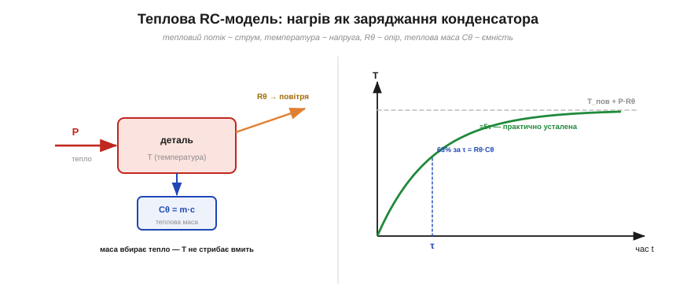
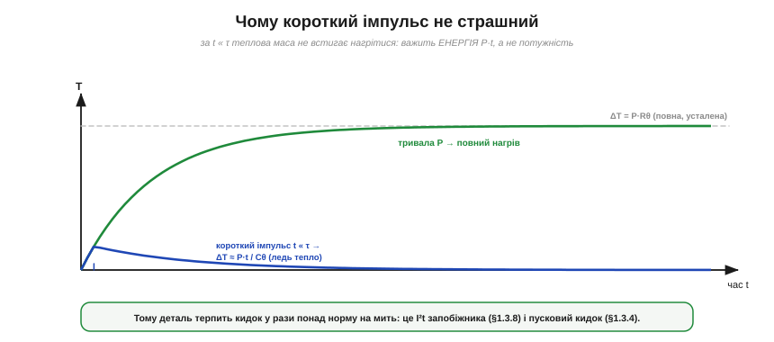

# 🧮 Теплова RC-модель: стала часу нагріву й чому короткий імпульс не страшний

> Числова вставка до теми [§1.3.9 «Тепловий опір і радіатор»](resistance-power-heat.md). §1.3.9 рахував **усталену** температуру: ΔT = P·Rθ, коли все вже прогрілося. Але деталь нагрівається **не миттєво** — у неї є теплова інерція. Тут ми додамо до картини **час**: теплову ємність, сталу часу нагріву й головний практичний висновок — чому короткий потужний кидок деталь переживає, а тривала менша потужність може спалити.

### Аналогія: нагрів — це заряджання конденсатора

§1.3.9 уже провів паралель «тепло ~ електрика»: тепловий потік як струм, перепад температур як напруга, Rθ як опір. Додаймо останню деталь — **теплову ємність**.


*Рис. 1.3.9m.1. Деталь, що гріється, — це RC-коло. Потужність P «вливає» тепло; теплова маса Cθ його накопичує (як конденсатор заряд); крізь Rθ тепло стікає в повітря. Тому температура не стрибає вмить, а росте по експоненті до усталеного ΔT = P·Rθ, сягаючи 63 % за час τ = Rθ·Cθ і майже всього — за ≈5τ.*

Усяке тіло має **теплову ємність** Cθ — скільки джоулів треба, щоб нагріти його на градус (Дж/°C):

```
Cθ = m · c   (маса × питома теплоємність).
```

Cθ — це теплова інерція: великий шматок металу нагрівається й охолоджується повільно, бо вбирає багато тепла на кожен градус. У моделі він поводиться точнісінько як **конденсатор**, що накопичує заряд: температура — це «напруга» на ньому, і вмить вона змінитися не може.

### Стала часу τ = Rθ·Cθ

Як і в електричному RC-колі, добуток опору на ємність дає **сталу часу** — тепер теплову:

```
τ = Rθ · Cθ   (секунди).
```

Вона каже, **як швидко** деталь нагрівається. Якщо ввімкнути сталу потужність P, температура росте по тій самій експоненті, що й напруга на конденсаторі:

```
T(t) = T_пов + P·Rθ · (1 − e^(−t/τ)).
```

За час τ деталь проходить ≈63 % шляху до усталеної температури, за 3τ — близько 95 %, а за ≈5τ практично досягає стелі ΔT = P·Rθ із §1.3.9. Доти вона **холодніша** за усталену — і саме на цьому тримається все цікаве.

### Два режими: коли важить потужність, а коли — енергія

З формули випливають дві протилежні межі.

- **Довго (t ≫ τ): усталений режим.** Усе прогрілося, ΔT = P·Rθ. Вирішує **потужність** P і тепловий опір Rθ — це і є випадок із §1.3.9, найгірший за нагрівом.
- **Коротко (t ≪ τ): адіабатичний режим.** Тепло не встигає нікуди стекти — його цілком вбирає маса. Тоді перепад залежить не від Rθ, а від **енергії** E = P·t і теплоємності:

```
ΔT ≈ P·t / Cθ = E / Cθ.
```

Тут Rθ узагалі ні до чого: радіатор не рятує від наносекундного імпульсу, бо тепло й так не встигло до нього дійти. Важить лише, **скільки енергії** вкинуто й яка маса її вбирає.

### Чому короткий імпульс не страшний


*Рис. 1.3.9m.2. Та сама потужність P, прикладена надовго (зелена) і коротким імпульсом t ≪ τ (синя). Тривала доводить деталь до повного ΔT = P·Rθ; короткий імпульс підіймає температуру лише на крихітне ΔT ≈ P·t/Cθ, бо маса встигає вбрати енергію без помітного нагріву. Тому деталь переживає кидок у рази понад свою сталу норму.*

Ось і відповідь на питання з заголовка. Якщо потужний сплеск триває набагато менше за τ, температура встигає піднятись лише трохи — теплова маса спрацьовує як буфер. Тому деталь спокійно терпить короткі перевантаження **в рази** понад свою усталену межу потужності. Це не виняток, а той самий механізм, що ми вже бачили:

- **часострумова крива** запобіжника й число **I²t** (§1.3.8): велике коротке коло рве запобіжник миттєво, а малий надлишок він терпить довго — бо рахується накопичена енергія, а не сам струм;
- **пусковий кидок** (§1.3.4): мотор чи блок живлення на мить беруть струм у рази більший за робочий — і деталі це переживають, бо кидок короткий;
- **імпульсна потужність** у даташитах: дозволений пік завжди вищий за тривалу норму.

Даташити узагальнюють це **перехідним тепловим опором** Zθ(t): для імпульсу тривалістю t беруть не повний Rθ, а менший Zθ(t), що росте від майже нуля (дуже короткий імпульс) до Rθ (тривалий). Перепад тоді ΔT = P·Zθ(t): чим коротший імпульс, тим менший Zθ і тим менший нагрів.

### Де це працює

Теплова RC-модель потрібна щоразу, коли потужність **не стала**: широтно-імпульсне керування (PWM), пуски моторів, піки звуку, спалахи. Вона підказує, на що рахувати запас — на **пік** чи на **середнє**: для довгих процесів (t ≫ τ) бери усталене P·Rθ, для коротких (t ≪ τ) — енергію E/Cθ. Теплова інерція тут і ворог, і друг: вона сповільнює реакцію, зате дає змогу перетерпіти короткі сплески, які за усталеним розрахунком здавалися б смертельними.
