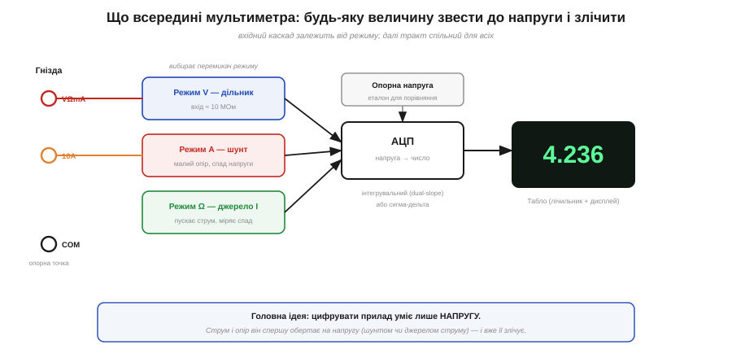
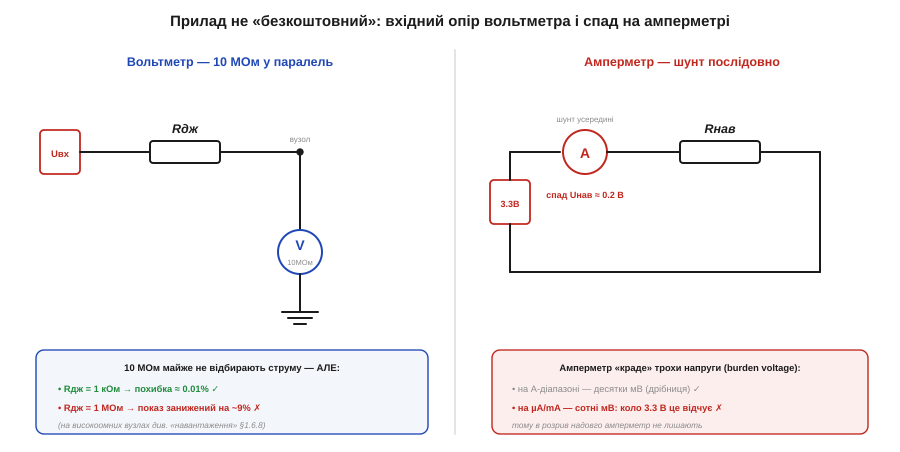
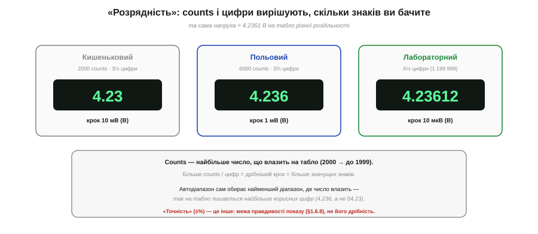

# 🔌 Мультиметр як компонент лабораторії: діапазони, вхідні опори, режими

> 🔌 Компонентна вставка до теми [§1.6.6 «Мультиметр: що і як він міряє»](schematics-measurement.md). Там ми навчилися ним **користуватися** — три правила ввімкнення. Тут глянемо на мультиметр як на **прилад зі своїм паспортом**: що в нього всередині, які цифри стоять у характеристиках і чому вони важать, коли ви обираєте прилад або вирішуєте, чи довіряти показу.

## Клас: цифровий мультиметр (DMM)

Сучасний мультиметр — це **цифровий** прилад (*DMM*, digital multimeter): серце в нього — **аналого-цифровий перетворювач** (АЦП), а табло показує число. Старі **стрілкові** (аналогові) ще трапляються, та правлять бал цифрові. Розрізняють їх насамперед за **роздільністю**: кишенькові «2000-count», польові «6000-count», точні настільні «6½ цифри». Окремий поділ — як прилад міряє **змінне**: дешеві «середньовипрямні» проти точних «true-RMS» (про цю різницю — коли дійдемо до синусоїди далі в курсі).

## Блок-схема: усе зводиться до напруги

Головний секрет приладу: цифрувати він уміє **лише напругу**. Тому будь-яку іншу величину вхідний каскад спершу **обертає на напругу**, а вже її зчитує АЦП.

*Рис. 1.6.6c.1. Блок-схема DMM. Вхідний каскад залежить від режиму — дільник для напруги, шунт для струму, джерело струму для опору, — і зводить величину до напруги; спільний АЦП порівнює її з опорною й видає число на табло.*

- **Напруга** — через **дільник** (атенюатор), що задає діапазон; вхідний опір при цьому ≈ **10 МОм**.
- **Струм** — через **шунт** (малий точний опір): струм створює на ньому спад, і вже цю напругу міряє АЦП.
- **Опір** — прилад **сам** пускає крізь деталь відомий **струм** від внутрішнього джерела й міряє спад напруги (звідси й потреба знеструмити коло, §1.6.6).

Далі — спільний тракт: АЦП (часто **інтегрувальний**, dual-slope, або сигма-дельта) порівнює напругу з внутрішньою **опорною** і виставляє число.

## Гнізда приладу (розпіновка)

Гнізд зазвичай три-чотири, і сплутати їх — найдорожча з помилок:

- **COM** — спільне (чорний щуп); ваша опорна точка кола.
- **VΩmA** — червоний щуп для напруги, опору й **малих** струмів.
- **10A** — для великих струмів, часто окремо й зі своїм запобіжником (а буває, що **без** нього).
- іноді ще окреме **µA·mA**.

Червоний щуп, забутий у струмовому гнізді й потім прикладений до напруги, — це коротке замикання крізь шунт (§1.6.6).

## Два числа з паспорта, які реально впливають на вимір

*Рис. 1.6.6c.2. Ліворуч — вольтметр як 10 МОм у паралель: на низькоомному вузлі непомітний, на високоомному занижує показ. Праворуч — амперметр як шунт у розриві: на ньому падає «напруга навантаження» (burden voltage), яку прилад крадькома відбирає в кола.*

- **Вхідний опір ~10 МОм** (режим V). Вольтметр стає в **паралель** і трохи відбирає струму. На звичайному низькоомному вузлі це непомітно, та на **високоомному** (дільники в десятки МОм, ємнісні входи) ці 10 МОм помітно **занижують** показ. Сюди ж — «фантомні» напруги: високий вхід ловить наводку на відключеному дроті, і табло показує «привид» у кілька вольт, якого насправді нема.
- **Напруга навантаження** (*burden voltage*) у режимі струму. Шунт має малий, але **ненульовий** опір, тож амперметр «з'їдає» частину напруги. На амперних діапазонах це десятки мВ — дрібниця, та на **µA/mA** спад сягає сотень мВ, і низьковольтне коло (3.3 В!) це відчуває — саме тому крихітне споживання мікроконтролера так нелегко виміряти «в лоб».

## Перший вимір: як «заговорити»

Увімкнули → обрали режим (або лишили **автодіапазон**) → приклали щупи → читаєте число. **Автодіапазон** сам бере найменший діапазон, де значення влазить, — щоб на табло лишилося найбільше значущих цифр.

*Рис. 1.6.6c.3. Та сама напруга на приладах різної роздільності. «Counts» — найбільше число, що влазить на табло; більше counts і цифр означає дрібніший крок. Роздільність (скільки знаків видно) — не те саме, що точність (наскільки вони правдиві).*

Тут і криється сенс «**counts**»: це найбільше число, яке влазить на табло. 2000-count покаже «4.23», 6000-count — «4.236», настільний 6½-цифровий — «4.23612». **Більше counts — дрібніший крок.** Тільки не плутайте роздільність із **точністю** (±%): перше — скільки знаків видно, друге — наскільки вони правдиві (§1.6.8).

## Варіації класу

Кишеньковий 2000-count — для побуту; польовий 6000-count **true-RMS** — для роботи з мережею; настільний 6½-цифровий — лабораторний еталон. Окремий рід — **струмові кліщі**: вони міряють струм **навколо** дроту, не розриваючи кола (а отже, без burden voltage); до них дійдемо разом із магнетизмом далі в курсі.
