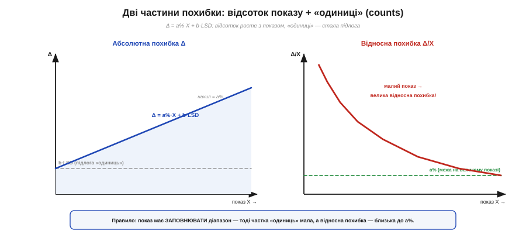
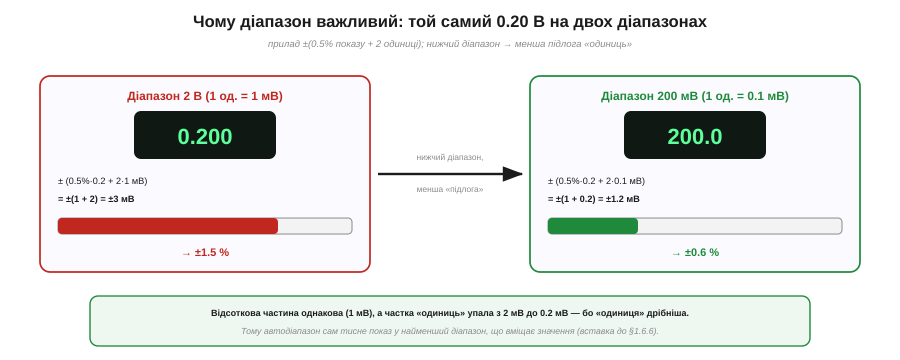
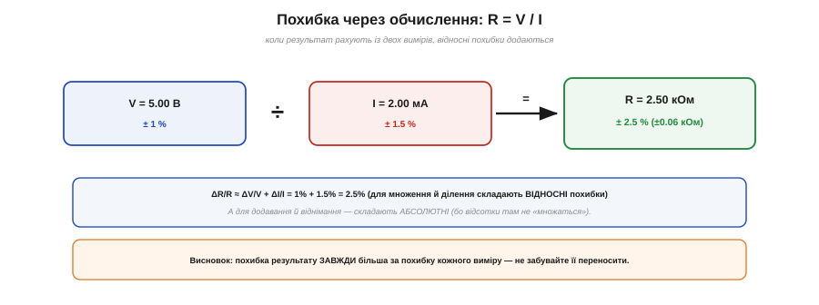

# 🧮 ±(% + одиниці молодшого розряду): арифметика похибок мультиметра

> 🧮 Математична вставка до теми [§1.6.8 «Похибки й безпека вимірювань»](schematics-measurement.md). Там ми вже раз порахували, скільки цифр на табло варті довіри. Тут розберемо **загальний апарат**: чому паспортну точність пишуть саме як «±(відсоток + одиниці)», як із цього дістати справжню межу похибки — і чому той самий прилад на малому показі бреше **дужче**.

## Означення: чому дві частини

Паспорт цифрового мультиметра майже завжди має вигляд **±(a % показу + b одиниць)**. Частин дві, бо й джерел похибки два:

- **a % показу** — **пропорційна** (множинна) частина: похибка підсилення, що **росте разом** із показом. На великому показі вона головна.
- **b одиниць** (англ. *counts*, або *digits*) — **стала** (адитивна) частина: «підлога» завширшки в b молодших розрядів табло, **незалежна** від показу. На малому показі головна вже вона.

«Одиниця» (count) — це **вага молодшого розряду** на поточному діапазоні (вставка до §1.6.6). На діапазоні 2.000 В одна одиниця = 1 мВ; на 200.0 мВ — уже 0.1 мВ.

## Формальний апарат

Абсолютна похибка — просто сума двох частин:

```
Абсолютна похибка показу X:
  Δ = (a/100)·X + b·LSD
      └ пропорційна ┘  └ стала «підлога» ┘
  LSD — вага молодшого розряду (значення однієї «одиниці») на цьому діапазоні
```


*Рис. 1.6.8m.1. Похибка приладу = пропорційна частина (a%·X, росте з показом) плюс стала «підлога» з b одиниць (ліворуч). Тому **відносна** похибка (праворуч) велика на малому показі (панує підлога) і спадає до a% лише на великому.*

А тепер **відносна** похибка — поділимо на показ:

```
Відносна похибка:
  Δ/X = a/100 + b·LSD / X
        └ стала ┘  └ росте, коли X → 0 ┘
```

І ось ключове прозріння: другий доданок **роздувається**, коли показ X **малий**. На дрібному показі (скажімо, кілька одиниць від нуля) частка «одиниць» стає велетенською — і прилад може брехати на десятки відсотків, хоч паспорт у нього «±0.5 %». Відсоткова межа a % — це межа лише **на великому** показі, що заповнює діапазон.

Покажемо, наскільки це боляче. Той самий прилад «±(0.5 % + 2 одиниці)» на діапазоні 2 В читає **0.020 В** (20 мВ): пропорційна частина дає 0.5 %·20 мВ = 0.1 мВ, а «підлога» — ті самі 2·1 мВ = 2 мВ. Разом ≈ 2.1 мВ, тобто аж **10.5 %** від показу! «Підлога одиниць» не змінилась, а показ дрібний — і відносна похибка вистрелила в десятки разів проти паспортних 0.5 %. Висновок прямий: дрібний показ на завеликому діапазоні — це майже навмання.

## Звідси — вибір діапазону


*Рис. 1.6.8m.2. Той самий 0.20 В приладом ±(0.5%+2 одиниці): на діапазоні 2 В одиниця = 1 мВ → ±3 мВ (1.5%); на 200 мВ одиниця = 0.1 мВ → ±1.2 мВ (0.6%). Дрібніша одиниця — менша підлога; тому автодіапазон тисне показ донизу.*

Звідси й практичний наслідок. Поміряймо **0.20 В** приладом «±(0.5 % + 2 одиниці)» на двох діапазонах:

```
0.20 В на діапазоні 2 В    (1 одиниця = 1 мВ):
  Δ = 0.5%·200мВ + 2·1мВ   = 1 + 2   = 3 мВ   →  1.5 %
0.20 В на діапазоні 200 мВ (1 одиниця = 0.1 мВ):
  Δ = 0.5%·200мВ + 2·0.1мВ = 1 + 0.2 = 1.2 мВ →  0.6 %
```

Відсоткова частина однакова (1 мВ), а от «підлога одиниць» **упала вдесятеро** (з 2 мВ до 0.2 мВ), бо на нижчому діапазоні дрібніша й сама одиниця. Тому точність **покращилась**, хоч прилад той самий. Це й є причина, чому **автодіапазон** завжди тисне показ у **найменший** діапазон, що його вміщає.

## Де ще це працює: похибка через обчислення


*Рис. 1.6.8m.3. Коли R рахують як V/I, відносні похибки **додаються**: ±1% і ±1.5% дають ±2.5%. При множенні/діленні складають відносні похибки, при додаванні/відніманні — абсолютні; результат завжди менш точний за виміри.*

Часто результат не міряють прямо, а **рахують** із кількох вимірів — і похибки треба [**переносити**](book:math/error-budget). Правило просте:

```
Перенесення похибок (груба, безпечна оцінка — «найгірший випадок»):
  множення / ділення     →  складають ВІДНОСНІ:  Δ(X·Y)/(X·Y) ≈ ΔX/X + ΔY/Y
  додавання / віднімання →  складають АБСОЛЮТНІ: Δ(X ± Y) ≈ ΔX + ΔY
```

Скажімо, опір рахуємо як R = V / I. Виміряли V = 5.00 В (±1 %) та I = 2.00 мА (±1.5 %); тоді R = 2.50 кОм, а його відносна похибка ≈ 1 % + 1.5 % = **2.5 %**, тобто R = 2.50 ± 0.06 кОм. Зверніть увагу: похибка результату **завжди більша** за похибку кожного окремого виміру. Особливо підступне **віднімання близьких чисел** (два майже однакові покази): абсолютні похибки додаються, а сам результат дрібний — і відносна похибка може вибухнути.

І ще одне, що випливає з цієї формули: **більше цифр на табло — не означає точніше**. Роздільність (скільки знаків видно) і точність (a % + одиниці) — різні речі (§1.6.8, вставка до §1.6.6): прилад на 6½ цифри з кепським класом точності збреше так само, лише з більш переконливим виглядом. Дивляться не на кількість розрядів, а на паспортну формулу.

Підсумок: паспортна «точність» — це **формула**, а не одне число. Дві частини, ±(% + одиниці); на малому показі панує «підлога», тому показ тримають ближче до верху діапазону; а коли результат рахують із вимірів — похибки переносять (відносні множаться, абсолютні додаються). Саме це відрізняє свідоме вимірювання від сліпого переписування цифр (§1.6.8).
