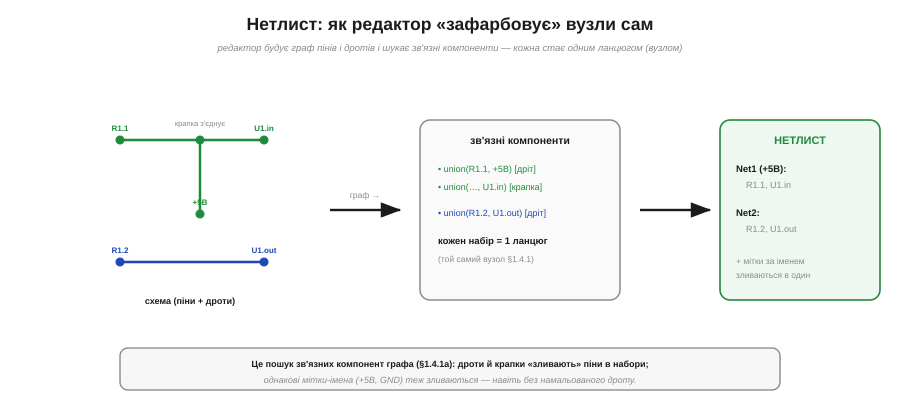
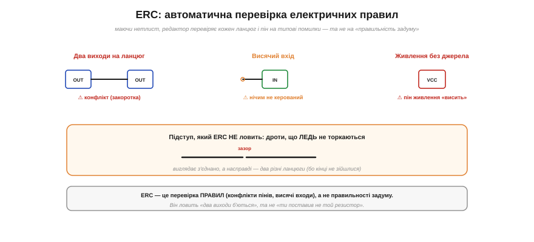

# ⚙️ Нетлист і ERC: як редактор схем «бачить» вузли

> Алгоритмічна вставка до теми [§1.6.3 «Вузли, з'єднання й перетини»](schematics-measurement.md). §1.6.3 радив, читаючи схему, подумки «зафарбовувати кожен вузол» — простежувати, що з чим сполучено дротом. А коли ви креслите схему в редакторі (KiCad, EAGLE…), цю саму роботу за вас робить **програма**: будує **нетлист** і перевіряє його на помилки (**ERC**). Розберімо, як саме — бо в основі лежить уже знайомий нам алгоритм.

### Задача

Ви намалювали символи деталей і з'єднали їхні **піни** дротами та крапками. Тепер комп'ютерові треба самотужки з'ясувати, **які піни електрично сполучені** — тобто згрупувати їх у **ланцюги** (*nets*). Кожен ланцюг — це один **вузол** із §1.6.3: усі піни в ньому мають спільний потенціал. Список усіх ланцюгів і пінів у кожному й називають **нетлистом** — і саме він, а не картинка, є справжнім описом схеми для програми (а далі — і для розведення плати).

### Ідея: ланцюг — це зв'язна компонента графа


*Рис. 1.6.3a.1. Редактор будує граф: піни й кінці дротів — вершини, дроти й крапки — ребра. Потім шукає **зв'язні компоненти** — групи, усе всередині яких сполучене. Кожна компонента стає одним ланцюгом (вузлом §1.4.1). Праворуч — готовий нетлист: перелік ланцюгів і пінів у кожному.*

Те «зафарбовування вузлів» — насправді класична задача на графах. Уявімо схему **графом**: піни й кінці дротів — це вершини, а кожен дріт (і кожна крапка-з'єднання) — ребро, що сполучає дві вершини. Тоді «всі точки, сполучені суцільним дротом» — це **зв'язна компонента** графа, а знайти всі ланцюги означає знайти всі зв'язні компоненти — той самий обхід графа, що ми вже бачили у вставці про DFS/BFS (§1.4.1a).

Найзручніший інструмент тут — **система неперетинних множин** (*union-find*). Спершу кожен пін — окрема множина; далі проходимо всі дроти й крапки й **зливаємо** (`union`) множини тих пінів, що сполучені; наприкінці кожна множина, що лишилась, — це один ланцюг. Окремо обробляють **іменовані** ланцюги з §1.6.3: усі піни з однаковою міткою («+5В», «GND») теж зливають в один ланцюг — навіть якщо дроту між ними не намальовано.

### Псевдокод

```
для кожного піна й кінця дроту:        makeset(точка)
для кожного дроту (a — b):             union(a, b)
для кожної крапки-з'єднання (p₁…pₖ):   union(p₁, …, pₖ)
для кожної мітки-імені:                union(усі піни з цим іменем)
# тепер кожна неперетинна множина — один ланцюг
нетлист = згрупувати піни за find(корінь)

# ERC: маючи нетлист, перевіряємо правила
для кожного ланцюга:  глянути типи пінів (вхід/вихід/живлення/пасив)
   два ВИХОДИ в одному ланцюгу        → конфлікт (закоротка джерел)
   ВХІД, якого ніхто не «жене»        → висячий вхід
   пін ЖИВЛЕННЯ без джерела           → не запитано
   ланцюг з одного піна               → нікуди не під'єднано
```

### Складність і пастки

**Складність.** Union-find зі стисненням шляхів працює майже **лінійно** від числа пінів і дротів, тож нетлист будується миттєво навіть для величезних схем; ERC — це ще один лінійний прохід по ланцюгах.

А ось пастки — суто **схемотехнічні**, і про них варто знати:

- **Дроти, що ЛЕДЬ не торкаються.** Якщо кінці двох дротів розійшлися на піксель, граф їх **не** з'єднає — вийдуть два різні ланцюги, хоч на око «все сполучено». Це класичний прихований баг; редактори тому **притягують** кінці до сітки.
- **Забута крапка.** Перетин без крапки — це **не** з'єднання (§1.6.3), і це **коректна** топологія, тож ERC помилки не побачить. Забули крапку там, де хотіли з'єднати, — матимете тихий обрив, якого перевірка не зловить.
- **Випадково однакове ім'я.** Дали двом незв'язаним ланцюгам одну мітку — і union злив їх в один: закоротка, якої ви не малювали.
- **ERC — це перевірка ПРАВИЛ, а не задуму.** Він ловить «два виходи б'ються за один ланцюг» чи «вхід висить», але **не** скаже, що ви поставили не той резистор чи переплутали логіку. Це радше орфографічний контроль, ніж коректор змісту.


*Рис. 1.6.3a.2. ERC перевіряє електричні правила: два виходи на ланцюг (конфлікт-закоротка), вхід, якого ніхто не жене (висячий), пін живлення без джерела. Але «дроти, що ледь не торкаються» він не ловить — то окремі ланцюги, що виглядають з'єднаними. ERC стереже правила, а не задум.*

Отож програма робить ту саму роботу, що й ви оком, — лише алгоритмічно: зводить схему до графа, знаходить вузли як зв'язні компоненти й перевіряє правила. Знаючи це, ви розумієте і чому варто слухатись ERC, і чому він **не** замінює уважного читання схеми вузол за вузлом.
