# Розділ 1.2 — Напруга, струм і провідність

У Розділі 1.1 заряди здебільшого **стояли**: ми вивчили заряд, поле, потенціал і напругу — «висоту», що штовхає. Тепер заряд **рушає**. Цей розділ — про сам **рух** заряду: що таке струм, куди він «тече» й чому, що насправді біжить у металі, чому одні матеріали проводять, а інші ні, і звідки береться опір рухові. Це місток від статики Розділу 1.1 до живих кіл, з якими працює інженер.

> 📜 **Перед матеріалом — історія:** [що тече в дроті — від Ома до електрона й моделі Друде](hist-conduction.md). Вона пояснює, звідки взялися закон Ома, поняття електрона й образ «електронного газу», яким ми користуватимемося.

---

## 1.2.1 Струм — це потік заряду

Увесь Розділ 1.1 говорив про заряд, що **перебуває** десь — на тілі, на пластині, у точці простору. Та сама лише напруга нічого не «робить», поки заряд не **рухається**: лампа світить, мотор крутиться, чип рахує — усе це потребує **потоку** заряду. Величину цього потоку й називають **струмом** (*current*, позначають *I*). Це перша й найголовніша «динамічна» величина курсу — тож означмо її якнайточніше.

### Означення: заряд за одиницю часу

Струм — це **скільки заряду проходить через провідник за одиницю часу**. Уявімо в дроті уявну площину поперек (переріз) і рахуймо, скільки кулонів перетинає її щосекунди:

```
I = ΔQ / Δt
```

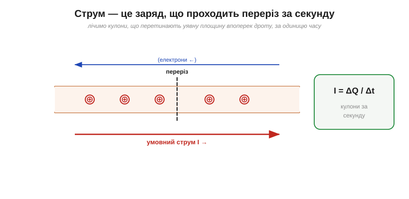
*Рис. 1.2.1.1. Струм — це потік заряду крізь переріз дроту: лічимо кулони, що перетнули уявну площину за секунду. Умовний струм I напрямлений за рухом **додатного** заряду; реальні електрони в металі біжать назустріч (про це — у §1.2.2).*

Зверніть увагу: струм — це **темп**, швидкість переносу заряду, а не сам заряд. Так само, як «літрів за секунду» — це не «літри», а швидкість потоку. Заряд (кулони) — це **скільки** перенесено всього; струм (кулони за секунду) — це **як швидко**.

Строго кажучи, I = ΔQ/Δt дає **середній** струм за проміжок Δt. Якщо струм сталий — цього цілком досить. А коли він **змінюється** в часі (як у звукових чи радіосигналах), беруть миттєвий струм — границю ΔQ/Δt за дедалі коротший проміжок (математично — похідну dQ/dt). Поки що ми всюди розглядаємо **сталий** струм; змінний з'явиться у §1.2.12.

> 🧮 Що таке та похідна dQ/dt — і чому це просто **нахил графіка** Q(t): [I = dQ/dt: похідна як миттєва швидкість зміни](math-derivative.md).

### Одиниця — ампер

Одиниця струму — **ампер** (*ampere*, **А**), і означена вона якраз як кулон за секунду:

```
1 А = 1 Кл / с
```

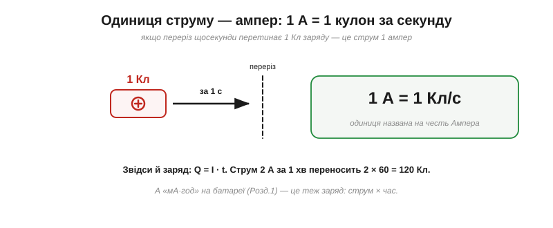
*Рис. 1.2.1.2. Якщо переріз щосекунди перетинає рівно 1 кулон заряду — це струм в 1 ампер. Одиницю названо на честь Андре-Марі Ампера, що першим описав взаємодію струмів.*

Цікава тонкість метрології: у системі СІ саме **ампер** належить до семи **основних** одиниць, а кулон — **похідна** від нього (1 Кл = 1 А·с). Тобто формально первинним беруть струм, а заряд означують через нього — хоча за змістом, як ми бачили в Розділі 1.1, первиннішим відчувається заряд. Причина суто практична: відтворити еталон струму виявилося легше, ніж еталон заряду.

> 📜 А хто такий Ампер і чому одиницю струму названо саме на його честь — драматична історія 1820 року, коли за одну осінь народилася електродинаміка (а данець Ерстед побачив, як струм крутить стрілку компаса): [Ампер і 1820 рік](hist-ampere.md).

З означення одразу випливає й зворотна, дуже корисна формула для **заряду**, перенесеного струмом за час:

```
Q = I · t
```

Тут варто згадати §1.1.5: ємність акумулятора в **ампер-годинах** (А·год) чи мілі-ампер-годинах (мА·год) — це насправді **заряд** (струм × час). Кільце замкнулося: те, що в Розділі 1.1 ми міряли в кулонах, тут постає як «струм, помножений на час».

**Приклад (заряд і електрони).** Дріт несе струм I = 2 А протягом однієї хвилини. Скільки заряду перенесено й скільки це електронів?

```
Q = I · t = 2 А × 60 с = 120 Кл
N = Q / e = 120 / (1.602 × 10⁻¹⁹) ≈ 7.5 × 10²⁰ електронів
```

Сімсот мільярдів мільярдів електронів — за якусь хвилину звичайного струму. Ось чому окремий електрон і його крихітний заряд e на практиці непомітні: у будь-якому відчутному струмі їх задіяно астрономічно багато.

### Знак носія не міняє струму

Тут варто прояснити одну тонкість. Ми домовилися рахувати струм за рухом **умовного додатного** заряду (звідси й стрілка I на Рис. 1.2.1.1). Та в металі рухаються **від'ємні** електрони — у протилежний бік. Чи не плутанина це?

Ні — і ось чому: **від'ємний заряд, що рухається ліворуч, дає точно такий самий струм, як додатний, що рухається праворуч**. В обох випадках через переріз щосекунди «переноситься» однакова кількість додатного заряду в той самий бік. Тому для величини й напрямку струму геть **байдуже**, носій якого знаку насправді біжить, — результат однаковий. Це нас звільняє: можна спокійно рахувати струм як потік додатного заряду, не переймаючись фізикою носіїв. А чому конвенцію взято саме такою (попри «неправильний» напрямок електронів) — докладно в §1.2.2.

### Струм як «витрата» — водяна аналогія

Образ із §1.1.5 тепер працює повною мірою. Якщо напруга — це **висота** (енергія на заряд), то струм — це **витрата потоку**: скільки «води» (заряду) проходить трубою за секунду.

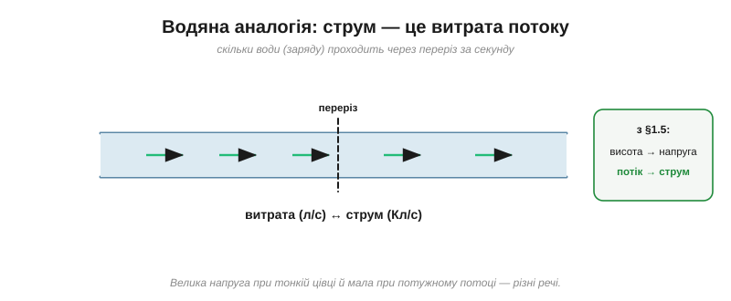
*Рис. 1.2.1.3. Струм — як витрата води (літрів за секунду) через переріз труби, тільки замість літрів — кулони. Це доповнює §1.1.5: там висота баку давала **напругу**, а тут потік крізь трубу — **струм**. Дві різні величини, які не можна плутати.*

Підкреслимо ще раз різницю, бо її плутають найчастіше: висока напруга з тонкою цівкою й низька з могутнім потоком — геть різні ситуації. Напруга каже, **з якою силою** штовхає кожен кулон; струм — **скільки** тих кулонів проходить за секунду.

### Відчути масштаб

Щоб ампер став відчутним, прив'яжімо його до знайомих пристроїв.

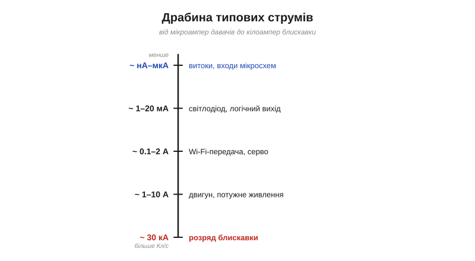
*Рис. 1.2.1.4. Від нано- й мікроампер (входи мікросхем, витоки) через міліампери (світлодіод ~10–20 мА, логічні виходи) і одиниці ампер (двигуни, потужне живлення) — аж до десятків кілоампер блискавки. Кожна сходинка — це кулони за секунду.*

> 🔧 **Навіщо це.** Струм — це те, що ви щодня **задаєте й обмежуєте**. Світлодіод світить за ~10–20 мА (більше — згорить), логічний вихід може віддати кілька міліампер, мотор тягне ампери, а запобіжник саме й стежить, щоб струм не перевищив безпечну межу. А «мА·год» на акумуляторі підказує, **як надовго** його вистачить: поділіть заряд на струм споживання — і дістанете час роботи. І ще: струм **гріє** провідник (через ті самі зіткнення Друде з історії розділу), тож кожен дріт має свій **допустимий струм** — тонка жила від завеликого струму просто перегріється. Тому переріз дроту й номінал запобіжника добирають під очікуваний струм.

### Струму потрібен повний шлях

Ще одна властивість, без якої струм не буває **сталим**: заряд не може без кінця накопичуватися в одному місці. Якби струм тік у глухий кут, заряд там швидко б нагромадився, його поле відштовхнуло б наступні порції — і потік за мить захлинувся б. Тому тривалий струм можливий лише по **замкненому шляху**: скільки заряду витекло з джерела, стільки ж має до нього й повернутися. Один обірваний дріт струму не несе — потрібне ціле **коло**. Цю думку та її наслідки (струм однаковий уздовж кола; чому потоку потрібна петля) ми розгорнемо у §1.2.5 і §1.2.7; поки що досить запам'ятати: **струм тече тільки по колу**.

### Як виміряти струм: амперметр — послідовно

Є важлива практична відмінність від вимірювання напруги. Щоб дізнатися струм, прилад мусить його **пропустити крізь себе** — тож **амперметр** вмикають **послідовно**, у розрив кола.

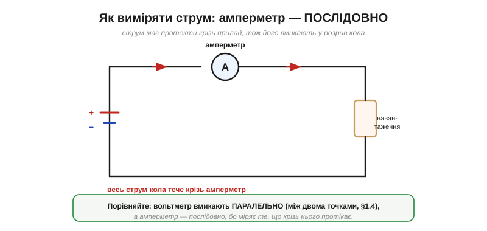
*Рис. 1.2.1.5. Амперметр ставлять у **розрив** кола, щоб увесь струм протік крізь нього. Це протилежність вольтметру, який вмикають **паралельно**, між двома точками (§1.1.4): вольтметр міряє різницю «збоку», а амперметр — потік «наскрізь».*

> 🔧 **Навіщо це.** Звідси й головне правило безпеки з амперметром: **ніколи не під'єднуйте його просто до клем джерела**. Амперметр має дуже малий власний опір (щоб не заважати струму), тож, приєднаний прямо до батареї, він стане майже **коротким замиканням** — потече величезний струм, і прилад (чи джерело) постраждає. Вольтметр, навпаки, вмикають куди завгодно паралельно без шкоди, бо його опір великий.

До слова, як амперметр узагалі міряє струм? Найчастіше — хитро, **через напругу**. Струм пропускають крізь маленький точний резистор (**шунт**, *shunt*), вимірюють крихітну напругу, що на ньому падає, і за законом Ома (I = V/R) перераховують її в струм. Тобто всередині багатьох «вимірювачів струму» насправді ховається вимірювач напруги — ще один доказ того, як тісно сплетені струм, напруга й опір, до яких ми переходимо в наступних підрозділах.

**Приклад (як надовго вистачить заряду).** Світлодіодний індикатор споживає 20 мА. Скільки заряду він візьме за 2 години і яка це ємність?

```
Q = I · t = 0.02 А × 7200 с = 144 Кл
ємність = I · t = 20 мА × 2 год = 40 мА·год
```

Тобто акумулятора на 2000 мА·год вистачило б такому індикаторові приблизно на 2000 / 20 = 100 годин безперервної роботи. Так проста формула Q = I·t стає інструментом оцінки часу живлення.

Наостанок — питання, що напрошується: а **як швидко** ті заряди насправді біжать? Інтуїція підказує «майже зі швидкістю світла, бо ж лампа спалахує миттєво». Та насправді окремі електрони в металі повзуть **вражаюче повільно** — і це аж ніяк не суперечить миттєвому ввімкненню. Цей парадокс — одна з найцікавіших тем розділу (§1.2.3 і §1.2.4); тут лише занотуємо, що «потік заряду» і «швидкість окремого заряду» — зовсім не те саме.

---

Підсумок §1.2.1: струм — це **потік заряду**, заряд за одиницю часу, I = ΔQ/Δt, в **амперах** (кулон за секунду); звідси Q = I·t зв'язує струм із зарядом і ємністю (мА·год) із Розділу 1.1. Струм — це «витрата», а не «висота»: його не можна плутати з напругою. Міряють його амперметром **послідовно**. Ми сказали, що заряд «тече», і навіть домовилися про напрямок умовного струму — та реальні носії в металі біжать **навпаки**. Розберімося з цим уявним протиріччям детально.

---

## 1.2.2 Куди «тече» струм: умовний напрямок проти руху електронів

У §1.2.1 ми мимохідь зронили дивну річ: умовний струм напрямлений від «плюса» до «мінуса», а електрони — реальні носії в металі — біжать **навпаки**, від «мінуса» до «плюса». Це здається помилкою або плутаниною — і чи не найчастіше збиває з пантелику новачка. Розберімося раз і назавжди: звідки взялося це «протиріччя», чому воно нікому не заважає і коли все-таки важливо памʼятати, куди насправді рухаються електрони.

### Дві стрілки одного струму

Спершу чітко розкладімо обидва напрямки.

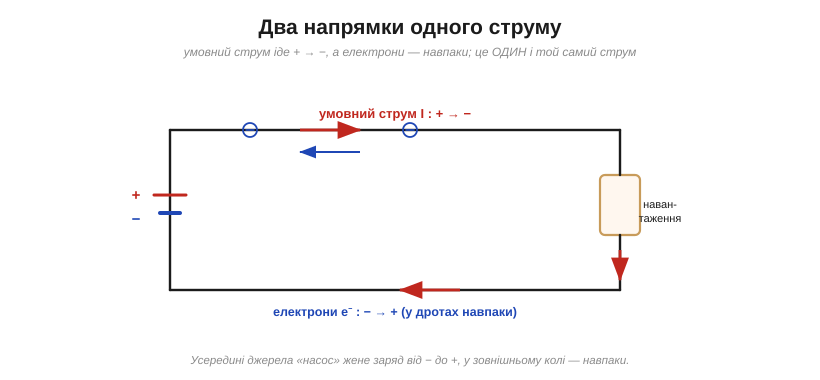
*Рис. 1.2.2.1. **Умовний струм** (*conventional current*, червоний) у зовнішньому колі йде від «+» до «−». **Електрони** (сині) рухаються протилежно — від «−» до «+». Усередині джерела «насос» жене заряд навпаки (від «−» до «+»), щоб підтримувати потік. Це не два струми, а **один**, описаний двома способами.*

Обидві стрілки описують ту саму фізичну подію — потік заряду колом. Просто одна стежить за **уявним додатним** зарядом (умовний струм), а друга — за **реальними електронами**. Питання лише в тому, чому стандартом став перший, «неправильний» опис.

### Звідки мішанина: здогад Франкліна

Відповідь — історична, і ми вже зустрічали її в Розділі 1.1. Знаки «+» і «−» та напрямок струму запровадив **Бенджамін Франклін** близько 1750 року — за **півтора століття** до відкриття електрона (Томсон, 1897). Франклін мусив навмання обрати, який стан заряду назвати додатним, і вирішив, що струм — це потік **додатного** флюїду від «+» до «−». Шанс був 50/50 — і щодо того, що реально рухається в металі (від'ємні електрони), він **не вгадав**.

Коли через 145 років з'ясувалося, що носії від'ємні, перевчати весь світ було пізно — та й, як побачимо, **непотрібно**. Тож домовленість Франкліна лишили; саме тому й донині умовний струм «тече» проти руху електронів. (Докладніше про цей здогад — в [історії Розділу 1.1](../charge-field-potential/hist-electricity.md).)

### Чому це нікому не заважає

Найважливіше: ця «неправильність» **взагалі не впливає** на жоден розрахунок. Причину ми вже бачили у §1.2.1 — і вона варта окремої картинки.

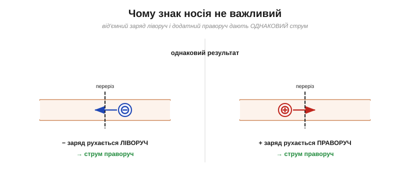
*Рис. 1.2.2.2. Від'ємний заряд, що рухається ліворуч, і додатний, що рухається праворуч, дають **однаковий** струм (праворуч). Тому байдуже, носій якого знаку насправді біжить: для величини й напрямку струму результат той самий.*

Раз від'ємний заряд, що йде в один бік, тотожний додатному, що йде в протилежний, то **уявити струм як потік додатного заряду — цілком законно**. Усі формули (закон Ома, потужність, закони Кірхгофа далі) виходять однаковими, хоч би що ми взяли за носія. Тому міняти усталену конвенцію — означало б переписати всі підручники, схеми й даташити світу заради нуля практичної користі. Простіше памʼятати один раз: **рахуємо струм як рух додатного заряду, від «+» до «−»**.

Щоб це не звучало як просте «повірте на слово»: у кожній формулі, якою ми користуватимемося, знак носія **скорочується**. У законі Ома струм пов'язаний з напругою через опір — і байдуже, що фізично рухається. У законах Кірхгофа (Розділ 1.4) ми рахуватимемо суми струмів у вузлах — і якщо послідовно вважати струм рухом додатного заряду, усі баланси сходяться: електрон, що входить у вузол ліворуч, рівноцінний умовному струму, що виходить праворуч. Конвенція напрямку — це просто вибір «додатного боку», як стрілка на числовій осі: важить не сам вибір, а **послідовність** його дотримання.

### Конвенція — всюди: як читати схему

Умовний струм — не примха підручника, а **універсальний стандарт**, на якому збудовано всю схемотехніку. У будь-якій схемі та даташиті струм мається на увазі **умовний**.

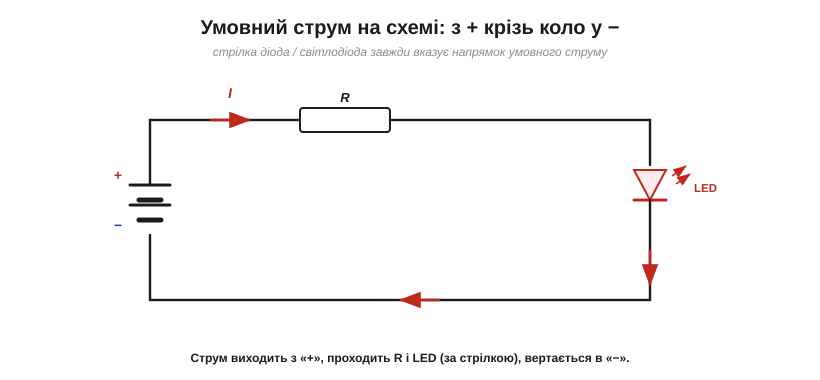
*Рис. 1.2.2.3. Струм виходить із «+» джерела, обходить зовнішнє коло (через резистор і світлодіод) і вертається в «−». Зверніть увагу: **стрілка-трикутник світлодіода (і будь-якого діода) вказує напрямок умовного струму** — від анода до катода. Так символ сам підказує, куди «тече».*

Це дає просте правило читання схеми: подумки пускайте струм **з «плюса» джерела**, ведіть його дротами через компоненти й повертайте в «мінус». Трикутники діодів і світлодіодів показують дозволений напрямок цього струму; стрілка на символі транзистора — теж. Якщо подумки «течете» проти стрілки діода — десь помилка: туди струм не піде.

Простежмо коло на Рис. 1.2.2.3 крок за кроком. Струм виходить із плюсового виводу елемента, тече верхнім дротом і входить у **резистор** — той напрямку не розрізняє, пропустить струм у будь-який бік. Далі струм доходить до **світлодіода**, і ось тут орієнтація критична: він пройде, лише якщо ввімкнути його **анодом до плюса**, тобто за стрілкою-трикутником. Перевернеш світлодіод — і коло «не пустить» струм, він не засвітиться (хоч резистор «не заперечував би»). Нарешті струм вертається в мінусовий вивід. Звідси практичне правило монтажу: діод чи світлодіод має «дивитися» трикутником **у напрямку струму** — від плюса до мінуса.

> 🔧 **Навіщо це.** У 99% роботи з колами думайте **умовним струмом** — так намальовані всі схеми й написані всі формули. Орієнтир простий: струм входить у компонент там, куди показує стрілка на його символі. Про реальний рух електронів згадують лише там, де він справді змінює суть справи (нижче).

### Коли реальний напрямок усе-таки важить

Є випадки, де знати, що рухаються саме **від'ємні електрони**, принципово:

- **фізика напівпровідників** — поведінка діодів і транзисторів залежить від того, електрони чи «дірки» (див. нижче) несуть струм;
- **електроліз і гальваніка** — на якому електроді осідає метал, визначає реальний рух зарядів (звідси терміни анод/катод Фарадея, історія [Розділу 1.1](../charge-field-potential/hist-volta.md));
- **ефект Холла, електронні лампи, давачі** — там знак носія прямо проявляється у вимірюваннях.

Найнаочніший із цих випадків — **гальваніка**. У ванні для нанесення покриття реальні носії — це **іони** в розчині, і рухаються вони цілком фізично: додатні іони металу пливуть до від'ємного електрода (катода) й осідають на ньому шаром покриття. Тут уже не сховаєшся за умовністю — щоб деталь укрилася сріблом чи хромом саме там, де треба, її слід під'єднати правильним боком. Такі задачі й вимагають памʼятати, хто куди рухається насправді.

Тобто для **кіл** вистачає умовного струму, а для **приладів зсередини** треба памʼятати про електрони (та іони). Гарне правило: рахуєш коло — думай умовно; розбираєшся, що коїться в кристалі чи електроліті, — згадуй носіїв.

### Несподіваний бонус: дірки

І наостанок — приємний поворот. Виявляється, конвенція Франкліна подекуди **буквально правильна**. У напівпровідниках струм несуть не лише електрони, а й **дірки** (*holes*) — вакантні місця, звідки електрон пішов. Коли сусідній електрон перестрибує у дірку, вона ніби **зсувається** в протилежний бік — і поводиться точно як рухомий **додатний** заряд.

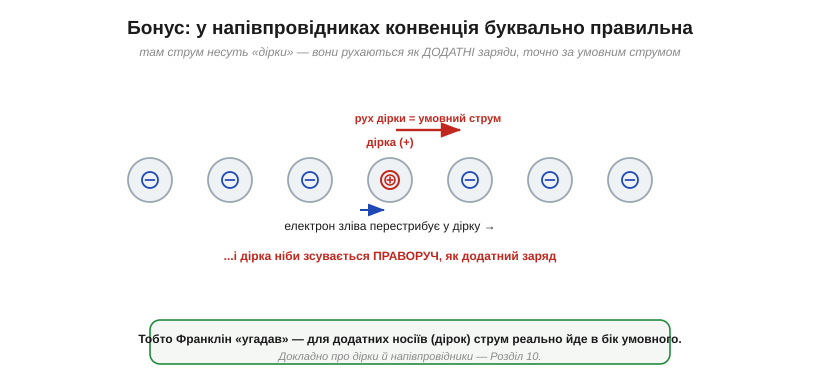
*Рис. 1.2.2.4. Дірка — це відсутність електрона. Електрон зліва перестрибує в неї — і дірка «зсувається» праворуч, мов додатний заряд, точно за напрямком умовного струму. У матеріалах p-типу саме дірки є головними носіями — отже, там струм реально тече так, як «угадав» Франклін.*

Тобто там, де носіями є дірки (матеріали p-типу, Розділ 2.5), умовний струм збігається з реальним рухом зарядів. Франклінів «промах» обернувся напівправдою: для додатних носіїв його конвенція точна. Природа, як завжди, складніша за прості «правильно/неправильно».

Варто підкреслити: дірка — не справжня частинка, а зручний **образ** відсутності електрона, що поводиться як додатний заряд (має і додатний «знак», і навіть власну ефективну масу). Та образ настільки робочий, що вся напівпровідникова техніка говорить мовою «електронів і дірок» нарівні. Який носій переважає — електрони (матеріал n-типу) чи дірки (p-типу) — визначає роботу діодів і транзисторів, із яких складено всю цифрову електроніку. Тож невинне питання «куди тече струм» — це насправді ще й перший крок до розуміння транзистора.

> 🔧 **Навіщо це.** Терміни **анод** і **катод** (від Фарадея) визначають саме через напрямок **умовного** струму: струм входить у пристрій через анод і виходить через катод. Це працює однаково для діодів, акумуляторів і ванн гальваніки — і не залежить від того, електрони там чи дірки. Корисний мнемонічний гачок: **струм входить в Анод**. Памʼятаючи це одне правило, ви не переплутаєте полярність ні діода, ні акумулятора, ні гальванічної ванни. Орієнтуючись на умовний струм, ви правильно під'єднаєте і світлодіод, і зарядку.

---

Підсумок §1.2.2: умовний струм іде від «+» до «−», електрони в металі — навпаки; це наслідок **історичного здогаду Франкліна**, зробленого до відкриття електрона. Та оскільки від'ємний заряд в один бік тотожний додатному в інший, конвенція **нічого не псує** — і саме нею послуговуються всі схеми, формули й даташити. Реальний напрямок електронів важить лише в фізиці приладів; а для додатних носіїв-дірок умовний струм узагалі точний. Ми розібралися, **куди** тече струм. Час зазирнути глибше — **що саме** і **як швидко** рухається в металі.

---

## 1.2.3 Що рухається в металі: море електронів і повільний дрейф

Ми вже знаємо, що струм — це потік заряду (§1.2.1) і що рахуємо його за умовним напрямком (§1.2.2). Та що ж **фізично** відбувається всередині мідного дроту, коли ним «тече струм»? Відповідь напрочуд несподівана, і в ній ховається один із найкрасивіших парадоксів електрики. Зазирнімо в метал.

### Море вільних електронів

Метал улаштований особливо. Його атоми віддають по одному-два зовнішні (валентні) електрони у **спільний фонд** — і ті більше не належать жодному атому конкретно, а вільно блукають по всьому шматку металу. Лишаються нерухомі **додатні іони**, закріплені у вузлах кристалічної решітки, а між ними плещеться **«море» (газ) вільних електронів** — саме та картина, що її дав Друде (історія розділу).

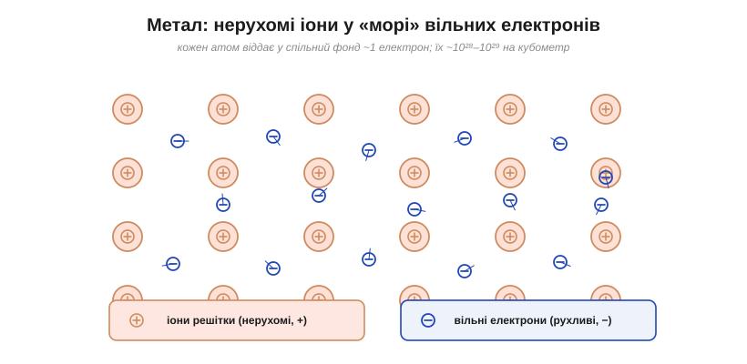
*Рис. 1.2.3.1. У металі важкі додатні іони нерухомо стоять у вузлах решітки, а відірвані від атомів електрони утворюють спільне рухливе «море». Саме ці вільні електрони й переносять струм.*

Чому саме метали так влаштовані? Це наслідок **металевого зв'язку**: у металів зовнішні (валентні) електрони слабко тримаються за свої атоми, тож воліють «усуспільнитися». Цей спільний електронний клей водночас і тримає іони разом, і робить метал блискучим, ковким та — головне для нас — добрим **провідником**. У діелектриках (скло, пластик) усе навпаки: там електрони міцно прив'язані до своїх атомів, спільного «моря» немає, і проводити струм нічим (докладніше — у §1.2.8).

Цих вільних електронів **неймовірно багато**. Прикиньмо їхню густину для міді.

**Приклад (скільки вільних електронів у міді).** Міркуємо так: у кожному кубометрі — стільки атомів міді, скільки вкладається за її густиною, і кожен дає ~1 вільний електрон.

```
густина міді       ρ = 8960 кг/м³
молярна маса       M = 0.0635 кг/моль
число Авогадро     Nₐ = 6.02 × 10²³ /моль

атомів у м³:  N = ρ/M · Nₐ = (8960 / 0.0635) · 6.02×10²³ ≈ 8.5 × 10²⁸
```

Тобто **n ≈ 8.5 × 10²⁸ вільних електронів на кубічний метр**. Це число завбільшки з кількість піщинок у багатьох пустелях — у крихітному об'ємі дроту. Запам'ятаймо його: саме гігантське *n* зробить наступний результат таким разючим.

Тут і криється розгадка, чому метали — добрі провідники: носіїв так багато, що навіть кволий, ледь відчутний дрейф цього моря дає значний струм. Не треба гнати електрони швидко — їх просто **дуже багато**. Це принципово інша ситуація, ніж у напівпровіднику, де вільних носіїв на багато порядків менше, а тому й провідність набагато нижча.

### Швидкий хаос — і повільний дрейф

Тепер найважливіше. Навіть **без** жодного струму ці електрони **не спочивають**: вони шалено снують у всіх напрямках із величезними **тепловими** швидкостями — порядку 10⁵–10⁶ метрів за секунду (сотні кілометрів за секунду!). Звідки ця скажена швидкість? Це просто **теплота**: за будь-якої температури вище абсолютного нуля частинки речовини мають хаотичну кінетичну енергію, і легкі електрони розганяються нею до величезних швидкостей. Але рух цей **безладний**: скільки електронів летить ліворуч, стільки ж праворуч, і в середньому заряд **нікуди не зміщується**. Струму немає.

Прикладімо тепер поле (під'єднавши джерело напруги). Кожен електрон і далі несамовито метається — та поверх хаосу з'являється ледь помітний **спільний знос** усіх електронів в один бік. Цей напрямлений зсув і називають **дрейфом** (*drift*).

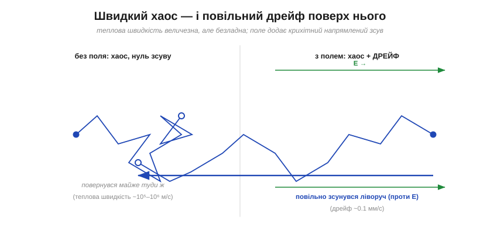
*Рис. 1.2.3.2. Без поля електрон описує хаотичну ламану й повертається майже туди ж — нульовий зсув. З полем та сама хаотична метушня лишається, але до неї додається повільний **дрейф** проти поля (електрон від'ємний). Саме цей дрейф і є струм.*

Ключова думка: **теплова швидкість величезна, а дрейфова — мізерна**. Хаотичний рух у тисячі разів швидший за напрямлений; дрейф — це лише тонесенький «нахил» у морі бурхливого безладу. Гарна аналогія — натовп у переповненому залі: усі штовхаються туди-сюди швидко й безладно, але весь натовп помалу-помалу суне до виходу.

> 🧮 Наскільки ж мізерна та дрейфова швидкість? Прикиньмо її «на серветці» — і вийде близько 0.06 мм/с, повільніше за равлика: [Оцінки порядків величин](math-estimation.md).

### Чому дрейф сталий — і звідки закон Ома

Виникає природне питання: якщо поле весь час штовхає електрон, чому той не розганяється **дедалі швидше**? Бо його раз у раз **збивають зіткнення**. Між двома зіткненнями з іонами решітки електрон трохи прискорюється полем у потрібний бік — а тоді, налетівши на іон, втрачає набуту напрямлену швидкість і відлітає навмання. Далі все повторюється: коротенький розгін — зіткнення — скидання. Усередненим підсумком цих незліченних циклів і є **стала** дрейфова швидкість: розгін якраз урівноважує гальмування зіткненнями.

Звідси випливає й щось глибше. Що сильніше поле — то більший розгін між зіткненнями, а отже, і більша дрейфова швидкість: **v пропорційна E** (а поле, своєю чергою, напрузі). А раз струм I = n·A·v·e пропорційний *v*, то він пропорційний і напрузі — і це не що інше, як **закон Ома** (I ∝ V) у його мікроскопічному корінні. Закон, який Ом здобув із дослідів (історія розділу), тут постає сам собою з простої картинки «розгін — зіткнення». А самі зіткнення, що обмежують дрейф, — це і є фізична природа **опору**, до якої ми дійдемо у §1.2.9.

### Струм зсередини: I = n·A·v·e

Зв'яжімо мікроскопічну картину з макроскопічним струмом §1.2.1. За секунду через переріз дроту проходять усі електрони, що встигли до нього додрейфувати, — а це всі, хто був у «стовпчику» завдовжки в одну дрейфову швидкість *v*. Звідси струм:

```
I = n · A · v · e
```

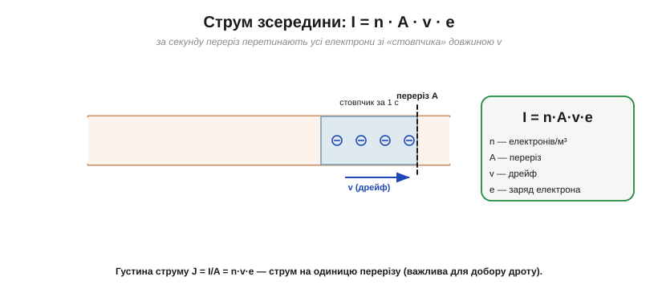
*Рис. 1.2.3.3. За секунду переріз A перетинають усі електрони зі «стовпчика» довжиною v (дрейфова швидкість). Тож струм I = n·A·v·e: густина носіїв × переріз × швидкість дрейфу × заряд. Поділивши на переріз, дістаємо **густину струму** J = I/A = n·v·e.*

Ця формула — місток між «що рухається» і «скільки тече». А тепер скористаймося нею, щоб виміряти ту саму дрейфову швидкість — і отримаємо приголомшливе число.

**Приклад (наскільки повільний дрейф).** Мідний дріт перерізом A = 1 мм² несе струм I = 1 А. Знайдімо швидкість дрейфу:

```
v = I / (n · A · e)
v = 1 / (8.5×10²⁸ · 1×10⁻⁶ · 1.602×10⁻¹⁹)
v ≈ 7.4 × 10⁻⁵ м/с ≈ 0.07 мм/с
```

Сім сотих міліметра за секунду — **повільніше за равлика**. Щоб подолати один метр такого дроту, окремому електронові знадобилося б:

```
t = 1 м / (7.4×10⁻⁵ м/с) ≈ 13500 с ≈ 3.7 години
```

**Приклад (густина струму).** Для того самого дроту (1 А у перерізі 1 мм²):

```
J = I / A = 1 А / (1×10⁻⁶ м²) = 1×10⁶ А/м² = 1 А/мм²
```

Це помірне навантаження: мідь зазвичай витримує кілька ампер на квадратний міліметр тривало, перш ніж перегрітися.

### Майже непорушні носії — і миттєва лампа

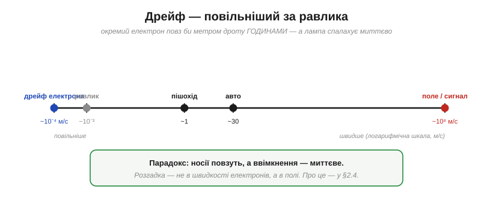
*Рис. 1.2.3.4. Дрейф (~10⁻⁴ м/с) на логарифмічній шкалі швидкостей лежить нижче за равлика, тоді як «сигнал» (поле) поширюється дротом зі швидкістю ~10⁸ м/с. Окремий електрон повз би годинами — а лампа спалахує миттєво.*

І ось він, парадокс, заради якого все це рахувалося. Якщо електрони повзуть **годинами** на метр, то чому лампа спалахує **тієї ж миті**, щойно ти клацнеш вмикачем за кілька метрів від неї? Невже сигнал чекає, доки якийсь електрон добіжить? Звісно, ні. Розгадка не в швидкості електронів узагалі — і вона така гарна, що їй присвячено окремий підрозділ.

Перш ніж розгадувати (це §1.2.4), відкиньмо хибні здогади. Ні, електрони не «прискорюються до світлової швидкості», коли вмикаєш живлення. Ні, перший електрон не «пробігає весь дріт» до лампи. І ні — річ не зовсім у тім, що «дріт уже повний електронів», хоча це вже ближче до правди. Тримаймо в голові точне число — дрейф ~0.07 мм/с — і подивімося, як попри нього сигнал долітає майже миттєво.

> 🔧 **Навіщо це.** Величина J = I/A (**густина струму**, А/мм²) — щоденний інструмент проєктувальника. Саме вона, а не сам струм, вирішує, чи перегріється провідник: тонка доріжка на платі з великим струмом має високу J і гріється, товста жила з тим самим струмом — низьку J і лишається холодною. Тому переріз дротів і ширину доріжок добирають під допустиму густину струму (типово одиниці А/мм²). А за надмірної J у мікросхемах виникає навіть **електроміграція** — струм буквально «зносить» атоми металу, руйнуючи провідник.

---

До слова, у **змінному** струмі (§1.2.12) спрямований дрейф **не накопичується**: електрони лише **тремтять** туди-сюди на місці, бо поле раз у раз міняє напрямок. Дрейф є щомиті, але щопівперіоду розвертається, тож **у середньому за період** жоден електрон нікуди не йде — а енергія все одно передається й лампа світить. Це ще один натяк: переносить енергію не марш електронів, а **поле**, що їх гойдає.

Підсумок §1.2.3: струм у металі — це **дрейф** електронів зі спільного «моря» вільних зарядів серед нерухомих іонів. Теплова метушня електронів величезна (~10⁵ м/с) і безладна, а напрямлений дрейф — мізерний (~0.1 мм/с); струм зв'язаний із ним формулою I = n·A·v·e. Через гігантську густину носіїв *n* навіть такий повільний дрейф дає відчутний струм. Лишилося розгадати дивовижу: як при такому повільному дрейфі лампа спалахує **миттєво**?

---

## 1.2.4 Парадокс: чому лампа спалахує миттєво, хоч електрони повзуть

У §1.2.3 ми дістали приголомшливе число: електрони дрейфують повільніше за равлика — сім сотих міліметра за секунду. І відразу постало питання, що бентежить кожного, хто вперше це усвідомлює: **як же лампа спалахує тієї ж миті**, щойно ти клацнеш вмикачем за кілька метрів від неї? Якби сигнал чекав, доки електрон добіжить від вмикача до лампи, світла довелося б чекати **годинами**. А його нема — лампа загоряється практично миттєво. Розгадка цього парадоксу — одна з найкрасивіших у всій електриці, і вона остаточно прояснює, що ж таке струм. Заразом вона показує дещо більше: що «струм» і «рух електронів» — не зовсім те саме, і що головний герой тут, як і в Розділі 1.1, — **поле**.

### Корінь плутанини: три різні швидкості

Уся загадка народжується з того, що **сплутують три зовсім різні швидкості**. Розкладімо їх по поличках.

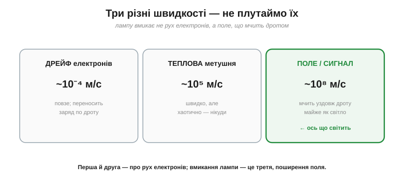
*Рис. 1.2.4.1. **Дрейф** електронів (~10⁻⁴ м/с) — повільний; **теплова** метушня (~10⁵ м/с) — швидка, та хаотична й нікуди не веде; а **поле/сигнал** (~10⁸ м/с) — мчить уздовж дроту майже як світло. Лампу вмикає саме **третя** швидкість, а не рух електронів.*

Помилка інтуїції в тому, що ми уявляємо, ніби світло лампи має «принести» якийсь конкретний електрон, що добіг від вмикача. Але струм запускає не подорож окремого електрона, а **поширення поля**. Щойно розрізнити ці три швидкості — парадокс зникає.

### Чому миттєво: дріт уже повний

Ключ ось у чому: **дріт не порожній — він по всій довжині вже повний вільних електронів** (§1.2.3). Тож не треба, щоб електрон від вмикача доплив до лампи. Біля лампи свої електрони стоять напоготові — і їх лише треба **підштовхнути**.

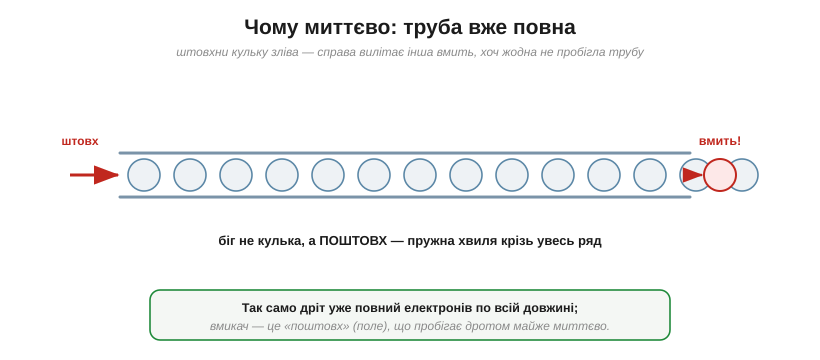
*Рис. 1.2.4.2. Уявіть трубу, вщерть набиту кульками. Штовхніть кульку зліва — і справа майже **миттєво** вилітає інша, хоч жодна кулька не пробігла всю трубу. Бігла не кулька, а **поштовх** — пружна хвиля крізь увесь ряд. Дріт працює так само: вмикач посилає «поштовх», що пробігає рядом електронів майже без затримки.*

Це чудова й точна аналогія. У трубі, повній води чи кульок, тиск на одному кінці передається на інший зі швидкістю **звуку в середовищі**, а не зі швидкістю окремої кульки. Так і в дроті: «поштовх» — це електричне поле, і воно пробігає від вмикача до лампи зовсім не з дрейфовою швидкістю.

Те саме пояснює, чому **будь-яке** коло реагує практично відразу: натиснув кнопку — спрацювало реле, перемкнувся логічний вентиль, озвався давач. Ніде ми не чекаємо, доки електрони кудись «доїдуть», бо провідники вже ними наповнені, а поле розносить зміну майже миттєво. Уся жвавість електроніки тримається саме на цій різниці між повзучим дрейфом і блискавичним полем.

### Що насправді біжить: фронт поля

Коли ти замикаєш вмикач, на кінцях дроту встановлюється напруга — і вздовж провідника зі швидкістю, близькою до **швидкості світла**, мчить **фронт електричного поля**. Цей фронт, докотившись до кожної ділянки дроту, відразу «вмикає» там дрейф: усі електрони по всій довжині — і ті, що біля лампи теж — починають дрейфувати майже **одночасно**.

А що означає «встановлюється поле»? У перші миті після замикання заряди трохи перерозподіляються по **поверхні** дротів — і саме цей тонесенький шар поверхневого заряду створює всередині провідника поле потрібного напрямку, яке й жене дрейф. Перебудова поверхневих зарядів пробігає вздовж лінії з майже-світловою швидкістю, ведучи за собою фронт. Тобто «команду рушити» розносять не глибинні електрони, а швидка перебудова поля на межах провідника.

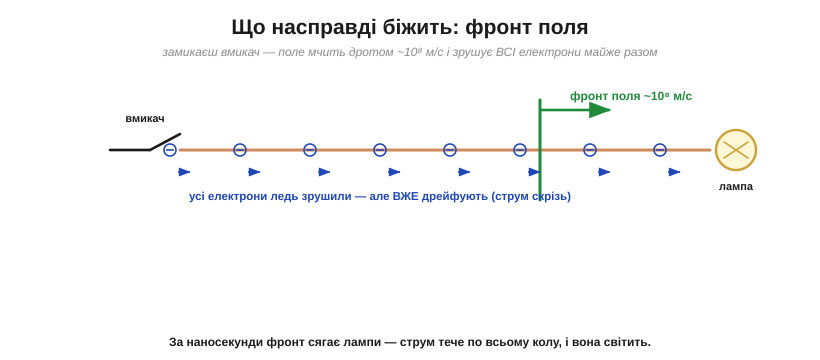
*Рис. 1.2.4.3. Замикання вмикача посилає вздовж дроту фронт поля (~10⁸ м/с). Позаду фронту електрони **скрізь** одразу починають свій повільний дрейф — тож струм виникає по всьому колу майже миттєво, і лампа світить. Самі електрони при цьому ледь зрушили з місця.*

Тепер прикиньмо час. Якщо сигнал біжить дротом зі швидкістю порядку 2×10⁸ м/с, то на типові 3 метри до лампи:

```
t = відстань / швидкість сигналу
t = 3 м / (2 × 10⁸ м/с) = 1.5 × 10⁻⁸ с = 15 наносекунд
```

П'ятнадцять **наносекунд** — ось чому «миттєво». А той самий шлях дрейфом електрон долав би ~14 годин (§1.2.3). Різниця — у трильйони разів, бо це **різні фізичні процеси**: дрейф несе заряд, а фронт поля несе **команду рушити**.

Від чого ж залежить ця швидкість сигналу? Несподівано — **не від металу**, а від **середовища навколо** дроту: ізоляції й геометрії, тобто простору, де живе поле. Що більша діелектрична проникність εr ізоляції (пам'ятаєте її з §1.1.2?), то повільніший фронт: приблизно швидкість ≈ c / √εr. Тому в реальних кабелях сигнал біжить не на повній швидкості світла, а на її частці — типово 0.5–0.7 c (для коаксіалу ~0.66 c). Цю частку так і звуть — **коефіцієнт укорочення** (*velocity factor*). І знов підтверджується головна думка розділу: темп задає поле в **діелектрику**, а не дрейф електронів у міді.

> 🔧 **Навіщо це.** Для звичайних кіл «15 наносекунд» — це справді «миттєво», тож про швидкість сигналу не думають. Але в **швидкій цифровій техніці** — тактах на сотні мегагерц, довгих шинах даних — ці наносекунди вже важать: сигнал не встигає скрізь одночасно, доріжки доводиться вирівнювати за довжиною, а довгі лінії рахувати як **лінії передачі** (Розділ 6.8). Практичний орієнтир: сигнал у доріжці на склотекстоліті (FR4) повзе приблизно 6 наносекунд на метр (≈15 см за наносекунду) — на швидких платах це прямо закладають у розрахунок таймінгу. Тобто скінченна швидкість поля — не абстракція, а цілком земне обмеження високих частот.

> 📜 А коли «дріт» завдовжки 3000 км ліг на дно океану, ця скінченність вилізла назовні драматично: перший трансатлантичний кабель 1858 року ледь не загинув саме тому, що сигнал швидкий, але **не миттєвий** (і над довгою лінією ще й розмазується): [Трансатлантичний кабель 1858 року](hist-atlantic-cable.md).

### Глибша правда: енергію несе поле

І нарешті — найдивовижніше, що варто почути бодай раз. Якщо не електрони «приносять» світло, то **що** доставляє лампі енергію? Відповідь, яка спершу здається неймовірною: енергія тече **не всередині дроту з електронами**, а в **полі** — у просторі **навколо** провідників. Дроти лише **спрямовують** цей потік енергії, як береги спрямовують річку.

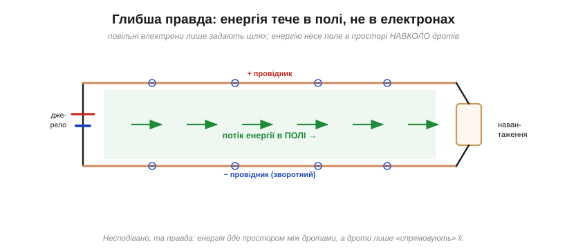
*Рис. 1.2.4.4. Енергія від джерела до навантаження тече в електромагнітному полі — у просторі **між** провідниками й навколо них (зелене), а не з повільними електронами всередині міді. Провідники задають шлях, але переносить енергію поле. Це строгий результат електродинаміки, хоч і суперечить наївній картинці.*

Повільні електрони — лише «рейки», якими поле веде енергію; самі вони майже не рухаються, а у змінному струмі (§1.2.12) взагалі тільки тремтять на місці. Цей погляд єднає весь розділ з Розділом 1.1: **поле**, яке ми там увели як посередника сили, виявляється ще й посередником, що **переносить енергію**. Те, що вмикає лампу, — не марш електронів, а поле, народжене напругою.

Звучить дико — мовляв, енергія йде «повз» дроти, а не крізь них? Та це не лише теорія. Саме тому навколо потужних ліній існує відчутне поле; саме тому форма й взаємне розташування провідників впливають на передачу; і саме тому високочастотну енергію взагалі можна гнати **хвилеводом** — порожньою металевою трубою без жодного дроту всередині. Енергія в полі — не курйоз, а фундамент усієї радіо- й НВЧ-техніки, до якої курс іще дійде.

> 🔧 **Навіщо це.** Звідси й практичний висновок про **змінний струм**: у розетці електрони лише гойдаються туди-сюди 50 разів на секунду, нікуди сумарно не йдучи, — а енергія (кіловати!) однаково доходить до приладу, бо її несе поле. Тому й працює вся енергетика на змінному струмі: «доставляти» електрони туди-сюди не треба, треба лише гойдати поле.

---

Підсумок §1.2.4: парадокс «повільні електрони — миттєва лампа» розв'язується розрізненням **трьох швидкостей** — повільного дрейфу, швидкої теплової метушні й майже-світлового поширення **поля**. Дріт уже повний електронів, тож вмикач лише посилає вздовж нього фронт поля, що за наносекунди запускає дрейф **скрізь** одночасно. А енергію до навантаження несе взагалі не рух електронів, а **поле** в просторі навколо дротів. Ми багато сказали про **рух** заряду в одному дроті. Час глянути на ціле коло — і побачити, що струм у ньому **ніде не «витрачається»**.

---

## 1.2.5 Струм не «витрачається»: він однаковий уздовж кола

Є одна напрочуд уперта хибна думка, яку варто викорінити негайно, бо вона псує все подальше розуміння кіл. Здається природним, що струм, проходячи крізь лампу чи резистор, частково «з'їдається»: мовляв, у лампу входить більше струму, ніж із неї виходить, — вона ж «споживає». Це **неправильно**. У простому колі-петлі струм **однаковий усюди**: скільки заряду за секунду входить у будь-який елемент, рівно стільки й виходить. Зрозуміти це — означає раз і назавжди розвести два поняття, які початківець постійно змішує: що в колі **циркулює** (заряд, струм) і що в ньому **витрачається** (енергія, напруга).

### Той самий струм — до й після

Поставмо подумки амперметри в кількох місцях кола й порівняймо покази.


*Рис. 1.2.5.1. У простій петлі амперметр показує **те саме** значення до лампи, після лампи й у зворотному дроті. Лампа не «з'їдає» струм: скільки заряду за секунду в неї входить, стільки ж виходить.*

Чому так? Це пряме веління **збереження заряду** з Розділу 1.1. Заряд не виникає й не зникає, а в усталеному струмі ще й не може **накопичуватися** в жодній точці (інакше там росло б поле й гальмувало потік, §1.2.1). Отже, потік заряду крізь будь-який переріз кола однаковий — інакше десь заряд або зникав би, або громадився. Лампа світить не тому, що «ловить» частину струму, — крізь неї проходить увесь струм, до останнього кулона.

### Заряд кружляє, а не споживається

Звідки ж береться оманливе відчуття, що струм «з'їдається»? З побуту: у житті майже все **витрачається** — пальне згоряє, вода з відра виливається, гроші йдуть. Тож мозок за звичкою переносить це й на струм. Але заряд поводиться інакше — він не **витікає** з кола, а **кружляє** ним по замкненій петлі, знову й знову проходячи ті самі точки.

Найточніший образ — **велосипедний ланцюг** (чи конвеєр). Ланцюг біжить по колу як єдине ціле: педалі (джерело) штовхають його, зірочка на колесі (навантаження) забирає в нього зусилля — та сам ланцюг нікуди не дівається й не коротшає. Так і заряд: джерело розганяє його, навантаження відбирає енергію, а заряд циркулює далі, цілий і незмінний. Витрачається не ланцюг, а **зусилля**, що ним передається.

### Як нестислива вода в петлі

Найкраще це відчути на воді. Уявіть замкнену петлю труб із насосом і однією **вузькою** ділянкою.


*Рис. 1.2.5.2. У замкненій водяній петлі витрата (літрів за секунду) **однакова скрізь** — навіть у вузькому місці. Вода нестислива: скільки її входить у звуження, стільки й виходить. У вузькому місці падає **тиск**, а не витрата. Так само в колі: струм усюди той самий, а на навантаженні падає **напруга**.*

Звуження труби — це наша лампа чи резистор: вода долає його важче (потрібен більший перепад тиску), але **витрата** від цього не меншає — крізь вузьке місце проходить рівно стільки ж літрів за секунду, скільки й деінде. Перенесімо на коло: струм (= витрата) скрізь однаковий, а на «вузькому місці» — навантаженні — падає **напруга** (= тиск). Ось і вся таємниця.

### Що ж тоді витрачається? Енергія

Якщо струм не зменшується, то що ж «споживає» лампа? **Енергію**, а не струм. Це принципова відмінність, яку плутають найчастіше.

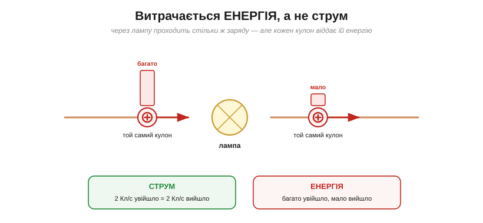
*Рис. 1.2.5.3. Той самий кулон входить у лампу «повним» енергії (високий потенціал) і виходить «порожнім» (низький), але це **той самий** кулон — він прямує далі. Заряду проходить стільки ж (струм незмінний), а от **енергію** він віддає лампі. Витрачається напруга/енергія, не струм.*

Згадаймо §1.1.5: кожен кулон несе енергію qV. Проходячи крізь лампу, кулон **віддає** їй свою енергію (вона стає світлом і теплом) — і виходить з протилежного боку з меншою енергією, тобто на нижчому потенціалі. Але **сам кулон нікуди не дівся** і рушає далі по колу. Тому через лампу проходить незмінний струм, а «втрачається» на ній **напруга** (різниця потенціалів між входом і виходом) — і саме ця втрачена напруга, помножена на струм, і є спожита енергія. Запам'ятаймо формулу-розрізнення: **струм проходить наскрізь, напруга — падає**.

Корисно простежити енергію по всьому колу. Джерело піднімає кожен кулон на свою напругу, вкладаючи в нього енергію (§1.1.5). Далі кулон обходить петлю й **роздає** цю енергію навантаженням — по шматочку на кожному падінні напруги. Коли він вертається до джерела, енергії в ньому вже не лишається: скільки джерело дало, рівно стільки він і віддав колу. Тобто сума всіх падінь напруги вздовж петлі дорівнює напрузі джерела — енергія, як і заряд, зводиться в замкненому колі без залишку. Цей баланс згодом постане як **закон напруг Кірхгофа** (Розділ 1.4), пара до закону струмів.

> 🔧 **Навіщо це.** Звідси й розвінчання поширеного міфу: батарея **не «віддає струм»** як щось, що в ній зберігається. Батарея зберігає **енергію** (і заряд — ті самі мА·год із §1.2.1); а струм — це лише те, з якою швидкістю коло цей заряд забирає. «Сів акумулятор» означає, що скінчилася запасена **енергія/заряд**, а не якийсь окремий «запас струму». Скільки струму потече — вирішує не батарея сама, а ціле коло (напруга й опір, §1.2.6 і Розділ 1.3).

### Послідовне коло: один струм на всіх

Найпряміший наслідок: якщо з'єднати кілька елементів **послідовно** (ланцюжком, один за одним), крізь усіх них тече **той самий** струм.


*Рис. 1.2.5.4. У послідовному колі струм однаковий у резисторі й у кожному світлодіоді — бо їм нема куди «розгалузитися». Тому один струмозадавальний резистор визначає струм одразу для всієї гірлянди; а розрив у будь-якому місці гасить усе коло.*

**Приклад (струм скрізь той самий).** Батарея жене крізь послідовне коло з лампою струм 0.2 А. Який струм у дроті до лампи, у самій лампі та в дроті після неї?

```
скрізь однаковий:  I = 0.2 А
заряду за хвилину: Q = I·t = 0.2 × 60 = 12 Кл — теж однаково в кожній точці
```

Це й легко перевірити приладом: увімкніть амперметр (§1.2.1) у будь-яке місце послідовного кола — до резистора, між світлодіодами чи у зворотний дріт — і він щоразу покаже **те саме** число. Саме так на практиці й переконуються, що струм по колу один: він не «слабшає» від лампи до лампи, хоч би скільки їх стояло послідовно.

> 🔧 **Навіщо це.** Тому в гірлянді світлодіодів, з'єднаних послідовно, **один** резистор задає яскравість усіх одразу — струм же спільний. І тому стара ялинкова гірлянда гасла повністю, варто було перегоріти **одній** лампочці: розрив послідовного кола зупиняє струм скрізь. А коли елементи треба живити **незалежно**, їх вмикають інакше — паралельно (Розділ 1.4), і там уже струми розгалужуються.

І ще: раз струм спільний, його диктує **все коло** разом (напруга джерела й сумарний опір), а не котрийсь один елемент. Слабша ланка, розрахована на менший струм, тоді обмежує весь ланцюг — як найвужче місце труби обмежує потік усієї магістралі.

Чесна засторога: «однаковий струм усюди» строго справджується для **усталеного** струму в простій петлі. Є компонент, що тимчасово це порушує, — **конденсатор**: заряджаючись, він на якийсь час накопичує заряд на пластинах, тож на короткій миті струм «до» і «після» нього може різнитися. Але це окрема історія (Розділ 2.1); у звичайних резистивних колах з постійним струмом правило «струм скрізь однаковий» діє беззастережно.

Зауважмо й місток уперед. Поки що йшлося про прості петлі без розгалужень. А що в **вузлі**, де сходяться кілька дротів? Та сама логіка збереження заряду: скільки струму втікає у вузол, стільки ж і витікає. Цей принцип згодом постане як **закон струмів Кірхгофа** (Розділ 1.4) — але корінь його вже тут, у простій думці «заряд не береться нізвідки й не зникає».

---

Підсумок §1.2.5: струм **не витрачається** — у нерозгалуженій петлі він однаковий до й після будь-якого навантаження (збереження заряду). Витрачається не струм, а **енергія/напруга**: кожен кулон проходить наскрізь, але віддає на навантаженні свою енергію. У послідовному колі струм спільний для всіх елементів; розрив зупиняє все. Ми багато з'ясували про сам струм — час повернутися до того, що його **спричиняє**.

---

## 1.2.6 Напруга — причина струму

Дотепер ми описували, як струм **поводиться**: тече, не витрачається, дрейфує повільно, реагує миттєво. Та лишилося головне питання: **що його спричиняє**? Чому заряд узагалі рушає? Відповідь коротка й фундаментальна: струм породжує **напруга**. Без різниці потенціалів сталого струму не буває — а є вона, і заряд тече. Розберімо цей причинний зв'язок до кінця, бо саме він — серце всієї електротехніки.

### Ланцюг причин: від напруги до струму

Напруга й струм пов'язані не «на рівних» — між ними є чіткий напрямок **причинності**: напруга є **причиною**, струм — **наслідком**.

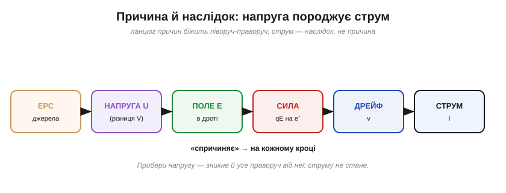
*Рис. 1.2.6.1. Ланцюг причин: ЕРС джерела підтримує **напругу** (різницю потенціалів), та створює **поле** в дроті, поле діє **силою** qE на вільні електрони, ті набувають **дрейфу** — і це є **струм**. Прибери напругу — і все праворуч від неї зникне: струму не стане.*

Цю послідовність варто закарбувати: **ЕРС → напруга → поле → сила → дрейф → струм**. Вона єднає весь Розділ 1.1 (поле, потенціал) із Розділом 1.2 (дрейф, струм) в один причинний ланцюжок. І вона однонапрямлена: ми **прикладаємо напругу**, а коло **відповідає струмом** — не навпаки.

Звідси корисна асиметрія: **напруга може існувати без струму, а струм у звичайному провіднику без напруги — ні**. Батарея на полиці має повну напругу на клемах (свою ЕРС), та поки до неї нічого не під'єднано, струму нема — є лише готовність, «висота» без потоку (як піднята вода в баку із закритим краном, §1.2.5). А струм без причини-напруги не потече: забери різницю потенціалів — і дрейф згасне за мить. (Єдиний виняток — **надпровідник**, де опору взагалі нема: раз запущений струм тече в ньому роками без жодної напруги, §1.3.4.) Тому в діагностиці першим ділом перевіряють саме напругу: є вона — шукають, чому не йде струм; нема — шукають, куди поділася напруга.

### Як саме напруга діє: поле в дроті

Найцікавіша ланка — друга: яким чином «напруга на кінцях» дотягується до електронів усередині дроту? Через **поле**. Різниця потенціалів між кінцями провідника створює вздовж нього електричне поле E, а воно, за §1.1.4, штовхає кожен вільний електрон силою qE — і жене дрейф.

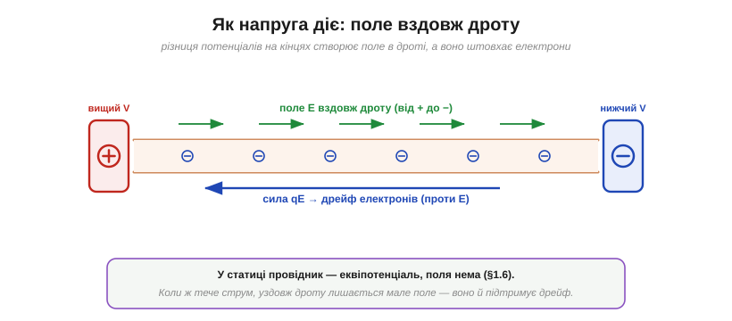
*Рис. 1.2.6.2. Напруга на кінцях провідника породжує поле E вздовж нього (напрямлене від «+» до «−»). Це поле діє силою qE на вільні електрони, спричиняючи їхній дрейф (проти E, бо вони від'ємні). Так «напруга на клемах» перетворюється на рух електронів усередині.*

Тут уважний читач помітить уявну суперечність із §1.1.6, де ми казали: **усередині провідника поля немає** (він — еквіпотенціаль). Розв'язання просте, але важливе. Те твердження стосувалося **статичної рівноваги** — коли струму немає. А коли струм **тече**, провідник уже не в рівновазі: уздовж нього лишається невелике поле, яке й підтримує дрейф проти зіткнень (§1.2.3). Для гарного провідника це поле (а отже, й напруга вздовж нього) мізерне — тому дроти й вважають «безвтратними»; а от на навантаженні (резисторі, лампі) поле й падіння напруги вже значні. Інакше кажучи: де тече струм і є опір — там уздовж шляху неодмінно є поле, бо саме воно й жене заряд.

А звідки взагалі береться це поле **рівно вздовж** дроту, хоч би як його зігнули? Його «ліплять» **поверхневі заряди** — тонкий шар заряду, що сам собою розподіляється по поверхні провідника так, аби всередині поле скрізь ішло вздовж русла дроту й мало потрібну величину (це та сама перебудова, що несе фронт сигналу з §1.2.4). Дріт неначе сам прокладає поле своїм руслом: куди завернув провідник, туди завертає й поле, що жене електрони.

**Приклад (поле, що жене струм).** На резисторі довжиною 1 см падає напруга 3 В. Яке поле всередині нього жене електрони?

```
E = U / d = 3 В / 0.01 м = 300 В/м
```

Це поле тисне на кожен вільний електрон силою qE і підтримує його дрейф крізь резистор — попри безперервні зіткнення з решіткою.

### Чому струму потрібна *підтримувана* напруга

Чому ж недостатньо просто **один раз** розділити заряди? Бо тоді струм буде лише коротким спалахом. Уявімо заряджений конденсатор (дві пластини з + і −): з'єднай їх дротом — заряд ринеться вирівнювати різницю, та щойно потенціали зрівняються, **усе спиниться**. Різниця зникла — зник і струм.

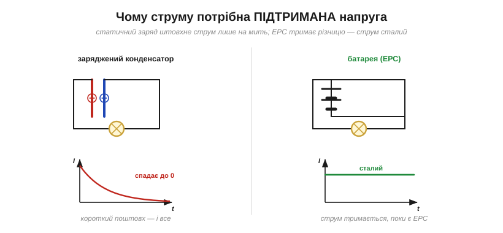
*Рис. 1.2.6.3. Зліва: заряджений конденсатор дає лише **короткий** струм, що швидко спадає до нуля, тільки-но заряди зрівняються. Справа: батарея своєю ЕРС **тримає** різницю потенціалів попри відтік заряду — тому струм **сталий**, поки джерело живе.*

Щоб струм був **тривалим**, різницю потенціалів треба **безперервно поновлювати** — хтось має невпинно «піднімати» заряд назад на висоту, поки коло його «спускає». Цю роботу й виконує джерело.

### ЕРС: джерело як невтомний насос

Здатність джерела підтримувати напругу, женучи заряд проти його природного спаду, називають **електрорушійною силою** (*EMF*, ЕРС). Назва історична й трохи оманлива: ЕРС — це **не сила** в ньютонах, а **енергія на одиницю заряду** (ті самі вольти, §1.1.5), яку джерело **додає** кожному кулону.

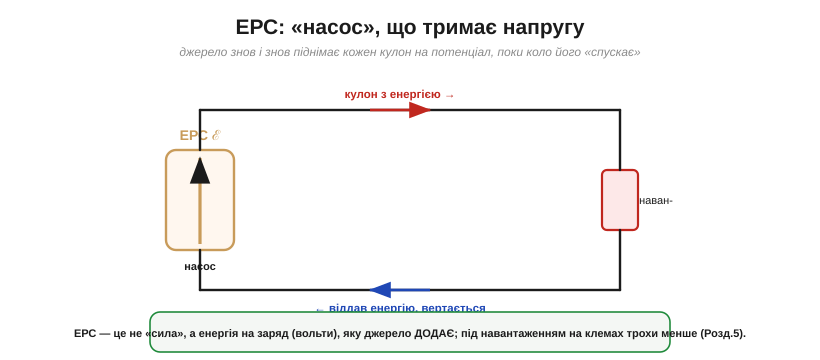
*Рис. 1.2.6.4. Джерело працює як насос: знов і знов піднімає кожен кулон на потенціал (вкладає в нього енергію — ЕРС ℰ), поки зовнішнє коло цей кулон «спускає», відбираючи енергію. Так підтримується стала напруга, а отже, і сталий струм.*

Звідки джерело бере силу на це «піднімання»? Залежно від типу: батарея — з **хімічної** реакції (історія §1.1.5), генератор — з **механічного** обертання, сонячна панель — зі **світла**. Усі вони роблять одне: перетворюють якусь енергію на електричну, підтримуючи різницю потенціалів. ЕРС — це міра того, **скільки джоулів на кулон** джерело здатне додати.

Водяна аналогія тут особливо влучна: джерело — це насос, що безперервно піднімає воду нагору, звідки вона знову може стікати вниз через коло. Без насоса вода один раз стекла б, рівні зрівнялися б — і потік спинився (точно як той конденсатор). Насос же не дає рівням зрівнятися, тож вода (заряд) кружляє знову й знову. ЕРС — це і є «висота підйому» цього насоса, виміряна у вольтах.

> 🔧 **Навіщо це.** Звідси правильна робоча картина: батарея чи блок живлення — це **джерело напруги**. Ви **задаєте напругу**, а струм — це вже **відповідь** кола на неї (скільки потече, вирішують напруга й опір разом — закон Ома, Розділ 1.3). Тому й кажуть «подати 5 В», а не «подати струм»: напругу прикладають, струм виникає. А розімкнений вмикач рве шлях для заряду — ЕРС лишається, та кола нема, тож і струму нема.

> 🔧 **Навіщо це.** Тонкість на майбутнє: напруга на клемах реального джерела під навантаженням трохи **менша** за його ЕРС — частина «з'їдається» на внутрішньому опорі самого джерела (чому акумулятор «просідає» під великим струмом — Розділ 1.5). Тому ЕРС — це напруга джерела «на холостому ходу», а під навантаженням маємо трохи менше.

Варто наголосити й на зворотному боці причинності: якщо напрузі **не чинити опору**, струм може стати небезпечно великим. З'єднай клеми джерела товстим дротом майже без опору — і та сама напруга пожене крізь нього велетенський струм (за законом Ома I = V/R при R → 0 струм прямував би в нескінченність — це ідеалізація: насправді його обмежують внутрішній опір джерела, опір дротів і захист, §1.5.1). Це **коротке замикання**: джерело й дроти перегріваються, бо вся енергія виділяється на мізерному опорі. Саме тому ланцюжок «напруга → струм» завжди мусить мати в собі опір, що його обмежує, — а від необмежених струмів коротких замикань рятують запобіжники.

---

Підсумок §1.2.6: струм спричиняє **напруга** — і причинність тут однонапрямлена (ЕРС → напруга → поле в дроті → сила qE → дрейф → струм). Напруга діє на електрони через **поле** вздовж провідника (а уявна суперечність із «провідник-еквіпотенціаль» знімається тим, що то було про статику, а тут тече струм). Щоб струм був тривалим, напругу треба **підтримувати** — це й робить **ЕРС** джерела, додаючи кожному кулону енергію, наче невтомний насос. Ми бачили, що струму потрібні і причина (напруга), і шлях. Придивімося до другої умови: чому без **замкненої петлі** струму не буде.

---

## 1.2.7 Замкнене коло: чому струму потрібна петля

У §1.2.6 ми з'ясували першу умову струму — **причину** (напругу). Та сама напруга ще нічого не гарантує: потрібна й друга умова — **шлях**. І не просто шлях, а **замкнена петля**, неперервна дорога від «плюса» джерела через усе коло й назад до «мінуса». Недарма саме слово **коло** (англ. *circuit*, від лат. *circuitus* — «обхід по колу») означає **замкнений контур**. Розберімо, чому без петлі струму не буває, навіть коли напруга є.

### Замкнене проти розімкненого

Найпростіший дослід усе показує.


*Рис. 1.2.7.1. Ліворуч коло **замкнене** — петля неперервна, струм тече, лампа світить. Праворуч його **розірвано** (вмикач розімкнено) — і струму нема по **всьому** колу, лампа темна. Один-єдиний розрив де завгодно зупиняє струм усюди.*

Зверніть увагу: розрив **в одному** місці гасить струм у **всьому** колі — бо петля єдина (це ми вже бачили на послідовній гірлянді §1.2.5). Саме так працює **вмикач**: він не «вмикає електрику», а просто **замикає або розриває** петлю. Замкнув — дав струмові дорогу; розімкнув — обірвав її.

І це робить вмикач куди важливішою деталлю, ніж здається. Будь-який **ключ** — від побутового тумблера й кнопки до реле та транзистора — це просто **керований розрив** петлі. Уся цифрова техніка, по суті, — мільярди мікроскопічних ключів, що блискавично замикають і рвуть крихітні кола (саме так працює транзистор, Розділ 2.7). Тож «замкнути чи розімкнути петлю» — не дрібниця, а основа всього: від вимикача світла до процесора.

> 🔌 Самі вимикачі й кнопки бувають дуже різні — їх класифікують за **полюсами й напрямками** (SPST, SPDT…), а кнопки ще й за тим, замкнені вони в спокої чи ні (**NO/NC**): [Вимикачі й кнопки](comp-switches.md).

### Чому саме петля: заряду нема куди дітися

Чому ж дорога мусить **вертатися** до джерела? Бо заряд не може просто витекти в нікуди й там лишитися. Згадаймо §1.2.1 і §1.2.5: заряд зберігається й не може **нагромаджуватися**.


*Рис. 1.2.7.2. У **глухому куті** заряд, дотікши до кінця, нагромаджується там; його власне поле дедалі дужче відштовхує наступні порції — і потік захлинається майже миттєво. У **петлі** ж заряд вертається до джерела, нічого не накопичується — і струм тече безперервно.*

Якби дріт обривався глухим кутом, перші ж електрони, дотікши до кінця, скупчилися б там — і їхнє зростальне поле відштовхнуло б тих, хто йде слідом, аж доки потік не спинився б (фактично кінець дроту повівся б як крихітний конденсатор, що миттю зарядився). Лише **замкнена петля** дає заряду повернутися, звідки він вийшов: джерело-насос (§1.2.6) піднімає заряд, коло проводить його по колу й повертає на вхід насоса — і так без кінця. **Немає зворотного шляху — немає сталого струму.**

Зауважмо й розгалуження. Петля не конче одна: якщо доріг кілька, на вузлах струм **розділяється** на гілки, та кожна гілка все одно є замкненою петлею до джерела й назад. Як саме струм розподіляється між паралельними шляхами — тема Розділу 1.4; тут важливо лиш, що **кожна** ділянка, де тече струм, неодмінно входить у якусь замкнену петлю.

### Три стани кола: норма, розрив, коротке

Доля кола залежить від того, який **опір** трапиться струмові на петлі. Три характерні випадки варто розрізняти від самого початку.

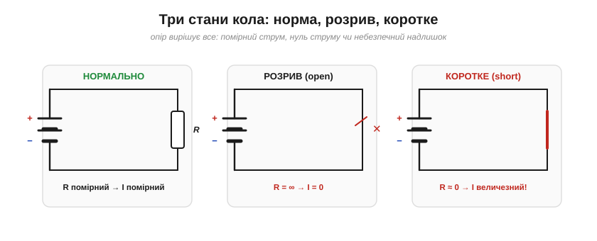
*Рис. 1.2.7.3. **Норма**: у колі є помірне навантаження (опір) — тече помірний струм. **Розрив** (*open*): петля обірвана, опір нескінченний, струм нульовий — але вся напруга джерела «висить» на розриві. **Коротке** (*short*): петля майже без опору — струм велетенський і небезпечний.*

Ці три стани — абетка діагностики. **Розрив** (розімкнене коло, *open circuit*): десь обрив, опір нескінченний, струму нема — зате на місці розриву прикладена **вся** напруга джерела (бо коло більше ніде її не «спадає»). **Коротке замикання** (*short circuit*): навпаки, петля замкнулася майже без опору, і напруга жене крізь неї величезний струм (§1.2.6) — звідси перегрів і небезпека.

> 🔧 **Навіщо це.** Звідси два щоденні прийоми. Перший: щоб знайти **обрив**, мультиметром міряють напругу впоперек підозрілого місця — на справному (замкненому) елементі падіння майже нема, а на **розриві** з'явиться повна напруга джерела (ось вам і «винний»). Другий: режим **продзвонювання** (continuity) перевіряє, чи петля взагалі неперервна — чи «дзвониться» коло від кінця до кінця. Обидва — про те саме: ціла петля чи розірвана.

> 🔧 **Навіщо це.** А коротке замикання — головна причина пожеж і зіпсованих джерел: петля без навантаження пропускає струм, обмежений лише крихітним опором дротів, тож виділяється лавина тепла. Саме від нього й ставлять **запобіжники** та автомати: вони навмисне рвуть петлю, щойно струм перевищить безпечну межу.

### Зворотний шлях буває спільним: «земля»

Петля мусить замкнутися — але обидва її проводи **не обов'язково** окремі. Дуже часто зворотну половину шляху виконує спільний провідник — корпус, шасі, шар міді на платі, який звуть **«землею»** (*ground*, GND).

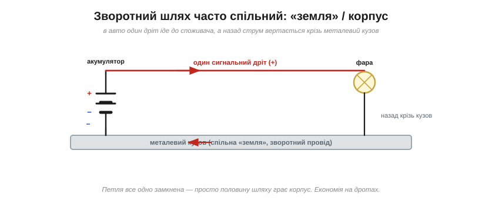
*Рис. 1.2.7.4. В автомобілі до кожного споживача йде лише **один** сигнальний дріт (+), а назад струм вертається крізь металевий **кузов**, що служить спільним зворотним проводом («землею»). Петля все одно замкнена — просто половину дороги грає корпус. Це заощаджує кілометри дроту.*

Це та сама «земля», яку ми ввели в §1.1.4 як опорний нуль потенціалу: вона водночас і **точка відліку** напруг, і **спільний зворотний шлях** для струмів. На платі роль такого спільного проводу грає мідний полігон GND, в авто — кузов, у домашній проводці — **нейтраль** (робочий «нульовий» провід; а захисний провід заземлення PE — то інше: у нормі він струму не несе, лише в аварії, див. нижче). Головне пам'ятати: навіть коли «видно» лише один дріт, петля десь усе одно замикається — інакше струму б не було.

> 🔧 **Навіщо це.** Тому на схемах стільки символів «землі»: усі вони — одна спільна точка, до якої вертається струм і від якої міряють напруги. Якщо два пристрої «не бачать» спільної землі, струм між ними не замкнеться — класична причина, чому щось «не працює», хоч живлення є. Перше правило монтажу: подбай про спільний зворотний провід.

Тут варто застерегти від поширеної плутанини. «Земля» в колі (*signal/circuit ground*) — це **спільний нуль і зворотний провід** схеми; вона **не обов'язково** з'єднана з фізичною землею під ногами. А «земля» в розетці (*earth*, захисне заземлення) — окремий, справді закопаний у ґрунт провід для **безпеки**. Часто їх позначають схоже й навіть з'єднують, та плутати поняття не варто: одне — опорний нуль електроніки, інше — захист від ураження струмом (про це — у розділах про вимірювання й безпеку).

І зворотний бік медалі: іноді петля замикається там, де ми **не хотіли**. Волога, бруд чи пил утворюють небажаний провідний місток, і струм тече «в обхід» — це **витік** (*leakage*). Через нього схема поводиться дивно, тихо розряджається батарея чи навіть б'є струмом корпус. Тож про петлі думають у два боки: щоб **потрібна** замкнулася, а **непотрібна** — ні.

Насамкінець — чесна заувага. Усе сказане стосується **сталого** (постійного) струму: йому конче потрібна суцільна провідна петля. У колах зі **змінним** струмом петлю може «замкнути» навіть конденсатор чи простір між провідниками — через поле, без прямого дроту (Розділи 2.1 і 2.3). Але це вже наступні теми; для постійного струму правило незрушне: **немає петлі — немає струму**.

---

Підсумок §1.2.7: окрім причини (напруги, §1.2.6), струмові потрібен **шлях** — замкнена **петля** від «+» джерела назад до «−». Розрив будь-де зупиняє струм у всьому колі (бо заряд не може накопичуватися в глухому куті); вмикач саме й замикає чи рве цю петлю. Три стани — норма (є навантаження), **розрив** (опір ∞, струм 0, повна напруга на місці обриву) і **коротке** (опір ≈ 0, струм велетенський). Зворотний шлях часто спільний — **«земля»**. Ми не раз згадували слово «опір» як те, що визначає струм. Час нарешті спитати: **чому** взагалі одні матеріали проводять, а інші — ні?

---

## 1.2.8 Чому одні матеріали проводять, а інші ні: механізм провідності

У §1.2.3 ми сказали, що метал має «море» вільних електронів, а ізолятор — ні, і користувалися цим як даністю. Та чому, власне, в одних речовинах електрони вільні, а в інших — намертво прив'язані? Це не дрібниця, а **головне** питання матеріалознавства електроніки: відповідь на нього пояснює, чому дроти роблять із міді, ізоляцію — з пластику, а мікросхеми — з кремнію.

### Усе вирішує кількість вільних носіїв

Провідність зводиться до однієї простої умови: **щоб матеріал проводив струм, у ньому мають бути вільні заряди, яким є куди рухатися**. Що більше таких вільних носіїв, то краще речовина проводить. За цією ознакою всі матеріали діляться на три класи.


*Рис. 1.2.8.1. **Провідник** (мідь, срібло) — повний «океан» вільних електронів. **Ізолятор** (скло, пластик, гума) — вільних носіїв практично нема. **Напівпровідник** (кремній, германій) — їх мало, але, на відміну від перших двох, їхню кількість можна **керовано змінювати**. Уся різниця — у числі вільних носіїв.*

**Провідники** (метали) повні вільних електронів — звідси чудова провідність. **Ізолятори** (діелектрики) їх майже не мають — тому й не проводять (скло, кераміка, пластик, суха деревина, гума). А **напівпровідники** сидять посередині: вільних носіїв у них мало, але — і це ключове — їхнє число можна **збільшувати** теплом, світлом чи домішками. Саме ця **керованість** і зробила напівпровідники основою всієї електроніки.

### На рівні атомів: відірвані чи зв'язані

Звідки ж беруться (чи не беруться) вільні електрони? Усе залежить від того, **наскільки міцно** атоми тримають свої зовнішні (валентні) електрони.

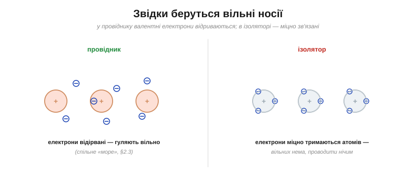
*Рис. 1.2.8.2. У **провіднику** металевий зв'язок такий, що валентні електрони **відриваються** від атомів і гуляють по всьому об'єму — утворюючи спільне «море» (§1.2.3). В **ізоляторі** електрони **міцно зв'язані** зі своїми атомами (чи парами атомів у хімічному зв'язку) — відірватися й мандрувати нікому.*

У металі зовнішні електрони тримаються так слабко, що з радістю «усуспільнюються». В ізоляторі ж — навпаки: всі електрони задіяні в міцних зв'язках між атомами, вільних не лишається, і прикладеному полю просто **нема кого** штовхати. Тому ізолятор може витримувати напругу без струму (саме за це ми його й цінуємо).

Чому ж метали тримають валентні електрони так слабко? Бо для відриву зовнішнього електрона їм треба зовсім мало енергії (низька **енергія іонізації**) — атому «вигідніше» віддати його у спільний фонд. А в ізоляторах електрони сидять у міцних спрямованих зв'язках між сусідніми атомами, де кожен потрібен «на своєму місці», — відпускати нема кого й нема куди.

### Глибше «чому»: енергетична щілина

Та чому в одних речовин зв'язок слабкий, а в інших — міцний? Найглибша відповідь — у квантовій картині **енергетичних зон**. Електрони в твердому тілі можуть мати енергію не будь-яку, а лише в дозволених «зонах», розділених забороненими **щілинами**. Нижча зона (валентна) заповнена електронами; щоб електрон став **рухливим**, він мусить піднятися у вищу, порожню зону (провідності) — перестрибнувши щілину.

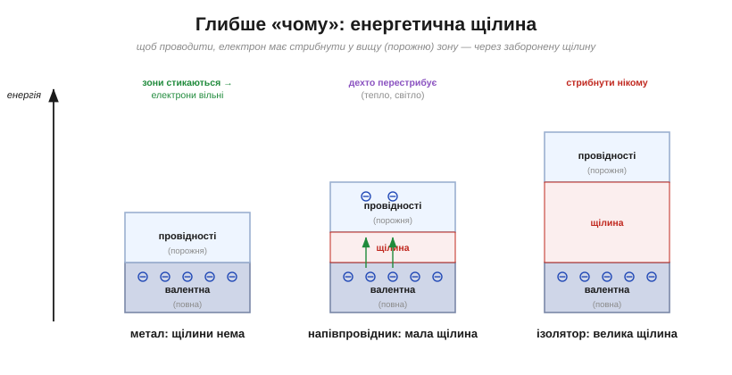
*Рис. 1.2.8.3. **Метал**: зони стикаються, щілини практично нема — електрони вільно переходять у зону провідності, тож завжди рухливі. **Напівпровідник**: щілина **мала** — частина електронів перестрибує її від тепла чи світла, даючи трохи носіїв. **Ізолятор**: щілина **велика** — стрибнути нікому, носіїв нема.*

Ось і вся таємниця трьох класів, в одній картинці. У металі щілини фактично немає — електрони завжди рухливі. В ізоляторі щілина така широка, що жодному електронові звичайних умов її не подолати — провідності нема. А **напівпровідник** — це матеріал із **вузькою** щілиною: за абсолютного нуля він був би ізолятором, та за кімнатної температури теплової енергії вистачає, щоб дещиця електронів перестрибнула щілину й стала носіями. Тому-то нагрівання чи освітлення помітно **збільшує** провідність напівпровідника — на цьому працюють терморезистори й фотодавачі.

Щоб ці слова стали конкретними — ось числа (у зручних електронвольтах із §1.1.4). У металів щілина практично нульова. У кремнію вона ≈ 1.1 еВ — невелика, тож дрібка теплової енергії вже закидає окремі електрони нагору. А в типового ізолятора (як алмаз) щілина ≈ 5.5 еВ — настільки широка, що подолати її майже неможливо. Різниця всього в кілька електронвольтів — а матеріали по різні боки прірви: один проводить, інший ні.

З цього випливає разюча відмінність у поведінці з **температурою**. Нагрій метал — і він проводить **гірше**: вільних електронів від тепла не більшає (їх і так повний океан), зате решітка дужче коливається, зіткнень стає більше, і дрейф гальмується (§1.2.3). А нагрій напівпровідник — і він проводить **краще**: тепло закидає через щілину **нові** носії, і їх помітно прибуває. Метал і напівпровідник реагують на тепло **протилежно** — і це не курйоз, а робочий факт: на ньому ґрунтуються терморезистори різних типів (PTC у металах, NTC у напівпровідниках). До цієї залежності повернемося у §1.2.10 і Розділі 1.3.

> 🔧 **Навіщо це.** Звідси прямий практичний поділ матеріалів у будь-якому пристрої: **мідь** (провідник) — для дротів і доріжок, де струм має текти вільно; **пластик, лак, кераміка** (ізолятори) — для ізоляції, корпусів, прокладок, де струм текти не повинен; **кремній** (напівпровідник) — для самих «мізків», бо лише ним можна **керувати**. Дивлячись на будь-яку плату, ви бачите всі три класи разом, кожен на своєму місці.

### Розмах, якого нема в жодної іншої властивості

Наскільки ж різняться ці класи в числах? Вражаюче.


*Рис. 1.2.8.4. Питомий опір речовин (Ом·м) тягнеться приблизно на **24 порядки** — від ~10⁻⁸ у срібла й міді до ~10¹⁶ у кварцу. Це найширший діапазон з усіх звичайних фізичних властивостей матеріалів. Напівпровідники лежать посередині — і їхнє місце на шкалі можна керовано зсувати.*

Жодна інша звична властивість речовини — ні густина, ні міцність, ні теплоємність — не змінюється між матеріалами так колосально, як **електропровідність**. Між найкращим провідником і найкращим ізолятором — двадцять із гаком порядків величини. Саме ця прірва й дає змогу так чітко розділяти «дроти» й «ізоляцію»: різниця між ними не у відсотках, а в трильйони трильйонів разів.

А на самому краю діапазону чекає диво: деякі матеріали, охолоджені до дуже низьких температур, втрачають опір **геть повністю** — стають **надпровідниками**, у яких струм може текти роками без жодних втрат. Це окрема дивовижна історія, до якої курс іще дійде (Розділ 1.3).

### Чому напівпровідники змінили світ

Окремо варто наголосити на середньому класі. Сама по собі помірна провідність кремнію не була б цікавою — цінне інше: її можна **навмисно й точно змінювати**. Додавши до надчистого кремнію дрібку домішок (**легування**, *doping*), у нього «підсаджують» зайві вільні носії — електрони або дірки (§1.2.2). Так із керованого матеріалу будують діоди й транзистори, де провідність **вмикають і вимикають** напругою. Уся цифрова й аналогова електроніка — це мистецтво керувати числом носіїв у напівпровіднику. Докладно — у Розділі 2.5; тут важливо відчути: напівпровідники цінні не тим, що проводять, а тим, що проводять **рівно настільки, наскільки ми скажемо**.

> 🔧 **Навіщо це.** Залежність провідності напівпровідника від тепла й світла — це не вада, а основа цілого класу давачів: **терморезистор** (NTC/PTC) міняє опір від температури, **фоторезистор** і фотодіод — від освітлення. А головне — керованість легуванням дала транзистор, тобто весь сучасний світ обчислень. Один матеріал посередині шкали виявився важливішим за обидва її кінці.

Наостанок — ізолятори не такі вже й абсолютні. Якщо поле стає **дуже** великим (згадаймо пробій із §1.1.3), воно здатне силою відірвати електрони навіть від атомів, що міцно їх тримають — і тоді ізолятор раптом «проб'є» й пропустить струм (іскра, пробій діелектрика). Тобто «не проводить» означає «не проводить **за звичайних** полів»; досить сильне поле здолає будь-яку щілину.

---

Підсумок §1.2.8: провідність визначається **кількістю вільних носіїв** заряду. У **провідниках** (метали) валентні електрони відірвані й утворюють «море» — носіїв безліч; в **ізоляторах** електрони міцно зв'язані — вільних нема; **напівпровідники** мають вузьку енергетичну **щілину**, тож носіїв мало, зате їхнє число **керовано** змінюють теплом, світлом і легуванням — на цьому стоїть уся електроніка. Розмах питомого опору — ~24 порядки, найбільший серед властивостей речовини. Ми зрозуміли, **чому** метал проводить. Тепер придивімося, **що** заважає рухові навіть у доброму провіднику, — звідки береться опір.

---

## 1.2.9 Зіткнення й нагрів: звідки береться опір руху

У §1.2.8 ми побачили, **чому** в металі є вільні електрони. Та навіть у найкращому провіднику струм не нескінченний: щось руху опирається. Якби нічого не заважало, поле розганяло б електрони **дедалі швидше**, струм ріс би лавиною — а цього не буває. Отже, є **опір** (*resistance*) — спротив рухові. Звідки він і чому через нього провідник **гріється** — тема цього підрозділу. (Рахувати опір у числах будемо в Розділі 1.3; тут — сам механізм.)

### Опір — це зіткнення

Корінь опору ми вже намацали в §1.2.3: дрейфові електрони раз у раз **стикаються** з решіткою. Тепер розгляньмо це уважніше.

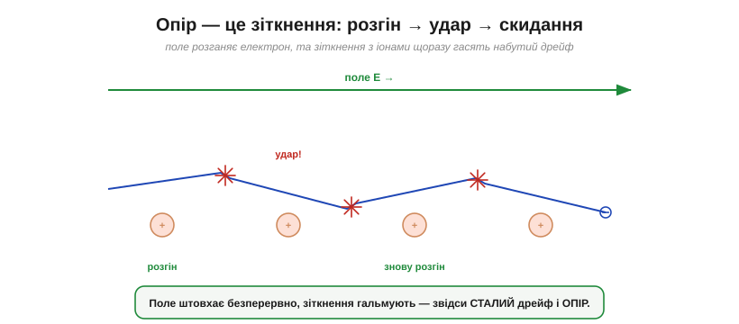
*Рис. 1.2.9.1. Поле розганяє електрон у потрібний бік — та невдовзі він налітає на перешкоду в решітці, втрачає набуту напрямлену швидкість і відлітає навмання. Потім знову розгін — і знову удар. Ці безперервні **зіткнення** й не дають електронам розігнатися; вони ж і є **опір**.*

Картина — циклічна: коротенький розгін під дією поля, потім зіткнення, що **скидає** набутий дрейф, і все спочатку. Поле штовхає без упину, зіткнення без упину гальмують — і встановлюється **стала** дрейфова швидкість (§1.2.3), а не нескінченний розгін. Що **частіші** ці зіткнення (що коротший вільний пробіг електрона між ними), то важче струмові — то більший опір. Опір — це, по суті, **міра того, як часто електрони збиваються** на своєму шляху.

Щоб відчути масштаб: попри шалену теплову швидкість (~10⁶ м/с, §1.2.3), електрон у міді пролітає між двома зіткненнями лише **десятки нанометрів** — і встигає це за якісь ~10⁻¹⁴ секунди. Тобто за секунду кожен електрон зазнає **десятків трильйонів** зіткнень. Саме ця карколомна частота ударів і робить дрейф таким повільним, а опір — відчутним навіть у чудовому провіднику.

Корисна, хоч і неточна, аналогія — **тертя** чи опір повітря. Парашутист під силою тяжіння не розганяється без кінця, а виходить на сталу швидкість, бо опір повітря зрівноважує тяжіння. Так само електрон під полем виходить на сталий дрейф, бо зіткнення його «гальмують». Але пам'ятаймо межу образу: справжнього тертя тут немає — є дискретні удари об решітку, а «тертя» — лише зручна назва їхнього усередненого ефекту.

### На чому насправді розсіюються електрони

Тут ховається тонкість, без якої картина була б неповною. Здавалося б, електрони мають битися об щільні ряди іонів решітки — то чим щільніша решітка, тим гірше? Насправді **ні**. Квантова механіка дає несподіваний результат: **ідеальна, нерухома, бездоганно періодична решітка електрон узагалі не розсіює** — він проходив би крізь неї без жодного опору, як хвиля крізь ідеальний кристал.

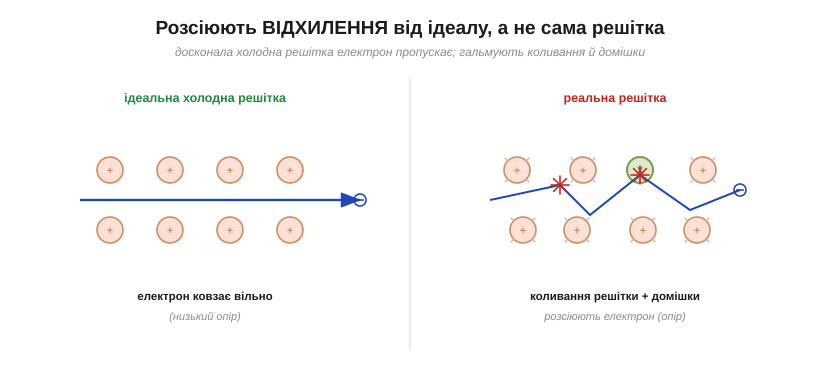
*Рис. 1.2.9.2. Досконала холодна решітка електрон **не гальмує** — він ковзає вільно. Опір створюють **відхилення** від ідеалу: теплові **коливання** іонів (решітка тремтить) і **домішки та дефекти** (чужі атоми, межі зерен). Саме на них електрон і розсіюється.*

Отже, опір створює не сама решітка, а її **недосконалість**: по-перше, **теплові коливання** (іони ніколи не стоять ідеально — вони тремтять, і що гарячіше, то дужче); по-друге, **домішки й дефекти** — чужі атоми, вакансії, межі кристалічних зерен. Електрон спокійно мине ідеальний ряд, але спіткнеться об кожне «викривлення» цього порядку. Звідси й увесь опір.

> 🔧 **Навіщо це.** Ось чому **чисті метали проводять краще за сплави**: у сплаві повно «чужих» атомів, що розсіюють електрони, тож опір вищий. Тому дроти роблять із **чистої міді** (мало домішок — малий опір), а нагрівальні елементи — навпаки, зі **сплавів** на кшталт ніхрому (багато розсіювання — великий опір, що нам тут і потрібен, бо мета — саме грітися). Вибір «чистий метал чи сплав» — це прямий вибір «менше опору чи більше».

### Куди дівається енергія: у тепло

Тепер найважливіший наслідок зіткнень. Між ударами поле виконує над електроном **роботу**, надаючи йому енергії руху (§1.1.4). А під час зіткнення електрон цю набуту енергію **віддає решітці** — від удару іон починає коливатися сильніше. А сильніші коливання решітки — це і є **тепло**.

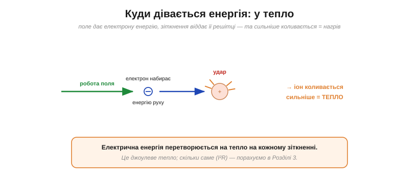
*Рис. 1.2.9.3. Поле дає електронові енергію руху; при зіткненні він передає її іонові решітки, і той коливається дужче — тобто **нагрівається**. Так електрична енергія на кожному зіткненні перетворюється на **тепло**. Це джоулеве тепло; скільки саме (формула I²R) — у Розділі 1.3.*

Звідси — фундаментальний факт: **струм у провіднику з опором завжди виділяє тепло**. Енергія, яку джерело вкладає в електрони, не зникає (§1.2.5) — вона безперервно «осідає» в решітці у вигляді тепла. У сталому режимі це навіть точний баланс: скільки потужності поле передає електронам, стільки ж іде в нагрів решітки. Це явище — **джоулеве тепло** (*Joule heating*) — ми кількісно опишемо в Розділі 1.3; тут головне зрозуміти його **механізм**: тепло народжується зі зіткнень дрейфових електронів.

Кожне окреме зіткнення віддає решітці мізерну крихту енергії. Та електронів астрономічно багато (≈10²⁸ на кубометр, §1.2.3), і кожен зазнає десятків трильйонів ударів за секунду. Помножене на такі числа, «непомітне» тепло одного зіткнення складається в цілком відчутні **вати**, що гріють резистор чи дріт. Велике тепло — це сумарний підсумок безлічі крихітних.

### Чому гарячий провідник опирається дужче

Тепер усе складається в одну струнку відповідь на питання з §1.2.8 — чому опір металу **росте** з температурою.

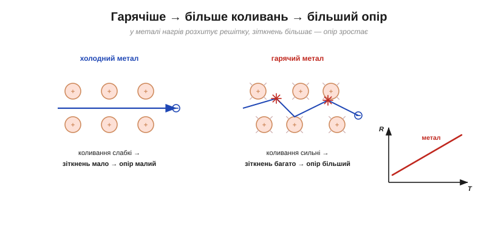
*Рис. 1.2.9.4. У холодному металі іони коливаються кволо, електрон довго летить між зіткненнями — опір малий. У гарячому решітка тремтить шалено, електрон натикається на неї куди частіше — опір більший. Тому для металу опір росте з температурою (права крива R(T)).*

Логіка проста: нагрівання посилює теплові коливання решітки → коливання — головне джерело розсіювання → більше зіткнень → більший опір. Тому в металі опір **зростає** з температурою (і навпаки — холодний метал проводить краще). Це протилежно напівпровідникам (§1.2.8), де нагрів **додає носіїв** і опір падає; різниця в тому, що в металі носіїв і так удосталь, а вирішують саме зіткнення. До кількісного боку цієї залежності (температурний коефіцієнт) повернемося у §1.2.10 і Розділі 1.3.

А якщо охолоджувати далі, до дуже низьких температур? Теплові коливання решітки **завмирають**, розсіювання слабшає, опір падає. У деяких матеріалів він спадає не просто до малого, а **до точного нуля**: за особливим квантовим механізмом електрони починають текти зовсім без зіткнень — це **надпровідність** (§1.2.8). Струм у надпровідному кільці може кружляти роками без жодного джерела. Щоправда, для цього потрібен холод у сотні градусів нижче нуля — тож у звичайній техніці опір завжди з нами.

> 🔧 **Навіщо це.** Запам'ятайте намертво: **там, де є струм і опір, завжди виділяється тепло**. Це і благо, і клопіт. Благо — коли тепло є метою: електрообігрівачі, праска, спіраль чайника, нитка лампи розжарення, дротяний запобіжник, що плавиться від перегріву. Клопіт — коли тепло паразитне: дроти й доріжки гріються, потужні транзистори й резистори потребують **радіаторів**, а перегрів — головна причина виходу електроніки з ладу. Уміння прикинути, скільки чого нагріється (Розділ 1.3), — одна з найпрактичніших навичок інженера.

І ще одне, що знадобиться далі. Скільки всього зіткнень зазнає струм, залежить не лише від **матеріалу**, а й від **геометрії** провідника: довшим дротом електрони долають більше решітки (більше ударів), а вужчим — тісніше тиснуться. Тому опір конкретного дроту визначають і матеріал, і форма. «Матеріальну» частину — питому провідність — узагальнимо вже в наступному підрозділі, а повну формулу опору R = ρ·L/A складемо в Розділі 1.3.

---

Підсумок §1.2.9: опір — це **зіткнення** дрейфових електронів із недосконалостями решітки. Ідеальна періодична решітка електрон не розсіює; гальмують **теплові коливання** та **домішки/дефекти**. Кожне зіткнення віддає набуту від поля енергію решітці — тобто перетворює електричну енергію на **тепло** (джоулеве). А що гарячіша решітка, то дужче вона тремтить і то частіші зіткнення — тому опір металу **росте** з температурою. Ми зрозуміли механізм опору й нагріву. Тепер узагальнимо опір у **властивість матеріалу** — провідність — і докладніше глянемо на її залежність від температури.

---

## 1.2.10 Провідність як властивість матеріалу і вплив температури

У §1.2.9 ми зрозуміли механізм опору — зіткнення. Та опір **конкретного дроту** залежить і від матеріалу, і від форми (товстий чи тонкий, довгий чи короткий). Щоб порівнювати самі **матеріали**, треба відділити «характер речовини» від «розмірів деталі». Це і робить поняття **питомого опору** — а заразом ми нарешті дамо число тому, як на провідність впливає **температура**.

### Опір деталі проти питомого опору матеріалу

Розрізняймо дві різні величини. **Опір** (*resistance*, R, в омах) — це властивість **конкретного предмета**: цього дроту, цього резистора. А **питомий опір** (*resistivity*, ρ, в Ом·метрах) — це властивість самого **матеріалу**, незалежна від форми й розміру.

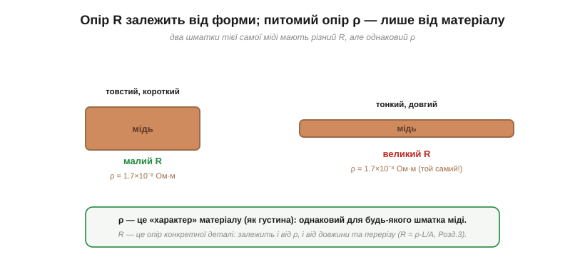
*Рис. 1.2.10.1. Два шматки **тієї самої** міді: товстий короткий має малий опір R, тонкий довгий — великий. Але **питомий опір ρ в обох однаковий** — це «характер» міді, як її густина. Опір деталі R залежить і від ρ, і від геометрії (R = ρ·L/A — формулу складемо в Розділі 1.3).*

Аналогія з **густиною** тут точна: густина — властивість речовини (залізо щільніше за дерево незалежно від того, цвях це чи балка), а маса — властивість конкретного предмета (залежить і від матеріалу, і від розміру). Так само ρ характеризує матеріал, а R — деталь. Часто зручніше говорити про обернену величину — **питому провідність** (*conductivity*, σ = 1/ρ, в сименсах на метр): що більша σ, то краще матеріал проводить.

(Для тонких плівок і доріжок на платі в обіг беруть ще проміжну величину — **поверхневий опір** в омах «на квадрат»: він уже враховує товщину плівки, тож опір смужки рахують просто за числом «квадратів» у її довжині. Та це деталь для конкретних задач; основне розрізнення — між матеріальним ρ і деталевим R.)

**Приклад (провідність міді).** Питомий опір міді ρ ≈ 1.7×10⁻⁸ Ом·м. Яка її питома провідність?

```
σ = 1/ρ = 1 / (1.7 × 10⁻⁸) ≈ 5.9 × 10⁷ См/м
```

### Скільки в кого: таблиця матеріалів

Питомий опір — це число, яке шукають у довідниках, добираючи матеріал.

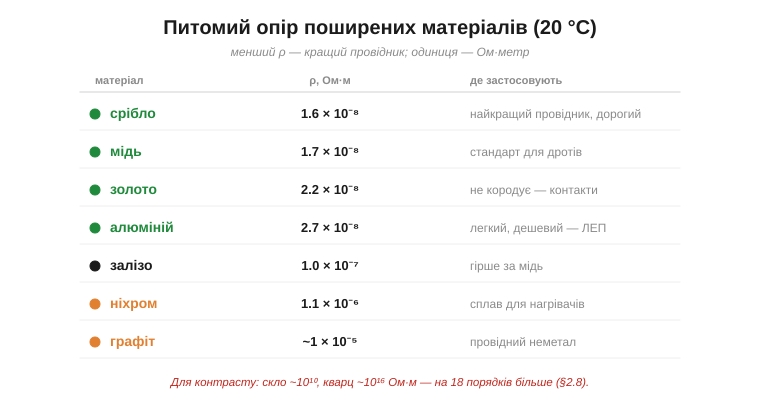
*Рис. 1.2.10.2. Срібло й мідь — найкращі звичайні провідники (ρ ≈ 1.6–1.7×10⁻⁸ Ом·м); алюміній трохи гірший, зате легкий і дешевий; ніхром (сплав) має на два порядки більший ρ — саме тому з нього роблять нагрівачі. А скло й кварц — на 18 порядків «гірші», тобто чудові ізолятори (§1.2.8).*

Звідки ці числа беруться з механізму §1.2.9? Питомий опір тим менший, чим **більше носіїв** (n) і чим **рідші зіткнення** (довший час τ між ними): грубо ρ ∝ 1/(n·τ). Точніше модель Друде дає **ρ = m/(n·e²·τ)** — у знаменнику стоять і густина носіїв n, і час вільного пробігу τ. Це робить наочним усе, що ми вивели: більше носіїв або рідші зіткнення — менший опір. Метали виграють завдяки величезному n; найкращі провідники серед них — ще й завдяки великому τ (чиста, гладка решітка). У сплавах (ніхром) чужі атоми частять зіткнення, τ падає — і ρ зростає.

Цікаво, що ρ залежить навіть від **обробки** того самого металу: коли дріт гнуть і клепають, у ньому з'являються дефекти, і ρ трохи росте; а відпал (нагрівання) «загоює» решітку — і ρ знову падає. Тому дроти й контакти іноді спеціально відпалюють, щоб поліпшити провідність.

> 🔧 **Навіщо це.** Звідси інженерний вибір матеріалу провідника. **Мідь** — стандарт (чудовий ρ за помірну ціну). **Срібло** — там, де треба найкраще (ВЧ-контакти), але дороге. **Алюміній** — у ЛЕП і великих шинах: він гірший за мідь, зате втричі легший і дешевший, тож на довгих лініях виграє. **Золото** — для контактів, бо не кородує. А **ніхром/константан** — навпаки, коли потрібен великий опір (нагрівачі, дротяні резистори). Дивлячись на ρ, ви відразу бачите, для чого матеріал годиться.

### Вплив температури: метал нагору, напівпровідник униз

Тепер — те, що ми двічі обіцяли (§1.2.8, §1.2.9): як ρ залежить від температури. І тут два класи матеріалів поводяться **протилежно**.

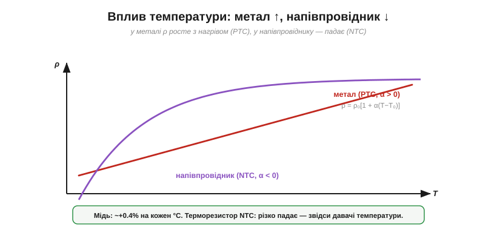
*Рис. 1.2.10.3. У **металі** ρ майже лінійно **росте** з температурою (більше коливань решітки → більше зіткнень, §1.2.9) — це додатний температурний коефіцієнт (**PTC**). У **напівпровіднику** ρ **падає** (нагрів додає носіїв, §1.2.8) — від'ємний коефіцієнт (**NTC**). Криві йдуть у різні боки.*

Для металів залежність у робочому діапазоні описують простою формулою з **температурним коефіцієнтом** α (*temperature coefficient*):

```
ρ(T) = ρ₀ · [1 + α·(T − T₀)]
```

де ρ₀ — питомий опір за опорної температури T₀. Для міді α ≈ 0.004 на градус — тобто опір росте приблизно на **0.4% на кожен °C**. Те саме стосується й опору самої деталі R (бо R ∝ ρ).

**Приклад (як «розбухає» опір від нагріву).** Мідний провід має опір 10 Ом за 20 °C. Який його опір, коли він нагріється до 80 °C?

```
R(T) = R₀ · [1 + α·(T − T₀)]
R = 10 · [1 + 0.004·(80 − 20)]
R = 10 · [1 + 0.24] = 12.4 Ом
```

Опір зріс на 24% — і це не дрібниця: гарячий провід проводить помітно гірше за холодний.

### PTC і NTC на практиці: давачі й кидки струму

Цей знак коефіцієнта — не абстракція, а робочий інструмент. **NTC-терморезистори** (напівпровідникові, опір різко падає з нагрівом) — найпоширеніші **давачі температури**: міряєш опір — знаєш температуру. А **PTC-елементи** (опір росте з нагрівом) самообмежують струм: нагрілися — підвищили опір — пригасили струм; так працюють самовідновні запобіжники й обмежувачі пускового струму.

А там, де метал поводиться передбачувано, його PTC теж ставлять на службу: **платиновий термоопір** (RTD, як-от Pt100) використовує рівний, добре відомий ріст опору платини, щоб міряти температуру **точно** — у промисловості й лабораторіях. Тож обидва знаки коефіцієнта дали свій тип давача: NTC-термістор — дешевий і чутливий, RTD — точний і стабільний.

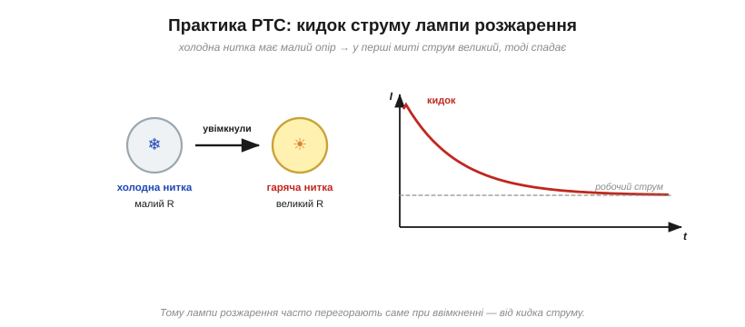
*Рис. 1.2.10.4. Нитка лампи розжарення холодною має **малий** опір, тож у першу мить після ввімкнення крізь неї б'є великий **кидок струму** (*inrush*). Нитка миттю розжарюється, її опір зростає (метал, PTC) — і струм спадає до робочого. Тому лампи розжарення найчастіше й перегорають саме в мить увімкнення.*

> 🔧 **Навіщо це.** Температурний коефіцієнт треба тримати в голові постійно. У **точних** колах резистори добирають із **малим** tempco (спецсплави на кшталт константану), щоб номінал не «плив» від нагріву. Навпаки, **NTC-термістор** — це готовий копійчаний термометр (у кожному зарядному, термостаті, акумуляторі він стежить за температурою). А **кидок струму** холодних ниток і обмоток ураховують, добираючи запобіжники й ключі: пусковий струм буває в рази більший за робочий, і коло має його витримати.

Насамкінець — натяк на майбутнє. Усе сказане про ρ і R стосувалося **постійного** струму. На **високих частотах** з'являється новий ефект: струм перестає текти рівномірно по перерізу й тісниться до **поверхні** провідника (**скін-ефект**), через що ефективний опір помітно зростає. Тому для радіочастот важлива не лише площа дроту, а й площа його **поверхні**; докладніше — у розділах про радіо.

---

Підсумок §1.2.10: **опір R** — властивість деталі (залежить від матеріалу й форми), а **питомий опір ρ** (і обернена йому **провідність σ = 1/ρ**) — властивість самого матеріалу, як густина. Менший ρ — кращий провідник: срібло й мідь — чемпіони, ніхром — для нагрівачів. З температурою ρ металів **росте** (PTC, ~0.4%/°C у міді), а напівпровідників — **падає** (NTC); на цьому стоять терморезистори-давачі й ефект пускового кидка струму. Досі ми говорили лише про метали. Та струм буває не лише в них — рушаймо до іонів, електролітів і навіть тіла людини.

---

## 1.2.11 Не лише метали: іони, електроліти, плазма, тіло людини

Увесь цей розділ ми говорили про струм у металах — дрейф вільних електронів. Та згадаймо означення з §1.2.1: струм — це **рух заряду**, і нічого більше. А заряд можуть нести не лише електрони. Розширмо картину: побачимо, що струм буває там, де метала й близько немає, — у солоній воді, у полум'ї блискавки, навіть у нашому власному тілі.

### Зоопарк носіїв заряду

Носієм струму може бути будь-яка заряджена частинка, що здатна рухатися. Звідси кілька різних «способів проводити».


*Рис. 1.2.11.1. У **металі** струм несуть вільні електрони (−). В **електроліті** — **іони** обох знаків. У **плазмі** — і вільні електрони, і іони. У **напівпровіднику** — електрони й «дірки» (§1.2.2). Скрізь це той самий струм (кулони за секунду), просто «вантажники» заряду різні.*

Об'єднавча думка проста й важлива: **струм — це рух заряду, хоч би що його несло**. Усі закони, які ми вивели (струм як темп, збереження заряду, потреба петлі, напруга як причина), працюють однаково для електронів, іонів і дірок. Змінюється лише, **хто саме** возить заряд. (Випадок напівпровідників — носії-електрони й дірки — ми вже розглянули окремо в §1.2.8; тут зосередимося на трьох інших.)

### Іони: струм у розчинах

Найпоширеніший «неметалевий» провідник — **електроліт** (*electrolyte*): розчин, у якому розчинена речовина розпалася на **іони** (*ions*) — заряджені атоми чи групи атомів. Кухонна сіль NaCl у воді розходиться на іони Na⁺ і Cl⁻; кислоти, луги, солі — так само.


*Рис. 1.2.11.2. Розчинена сіль розпадається на іони. Під дією поля **додатні** іони (Na⁺) пливуть до від'ємного електрода, **від'ємні** (Cl⁻) — до додатного. Рухаються вони в **різні** боки, але обидва дають струм **в один** бік (бо − ліворуч ≡ + праворуч, §1.2.2). Зовні, по дроту, струм несуть уже електрони.*

Тут одразу видно дві особливості. По-перше, струм несуть **обидва** знаки заряду водночас, рухаючись назустріч, — і їхні внески **додаються** (§1.2.2). По-друге, **чистота** розчину вирішує все: дистильована вода майже не проводить (вільних іонів у ній мало), а варто кинути дрібку солі чи кислоти — і провідність злітає. Саме іонна провідність працює всередині кожної **батареї** (іони переносять заряд крізь електроліт, поки електрони біжать зовнішнім колом), у **гальваніці** й **електролізі** — пригадаймо Фарадея й Вольту з історій Розділу 1.1.

Дві важливі відмінності від металів варто відзначити. Перша: іони — це цілі атоми, у тисячі разів важчі за електрон, тож дрейфують вони куди **повільніше**, і провідність електролітів зазвичай помітно гірша за металеву. Друга, принципова: проходячи крізь електроліт, струм **змінює речовину** на електродах — там осідає метал, виділяється газ, іде хімічна реакція. У металі струм просто тече, нічого не перетворюючи; в електроліті він **працює хімічно** — на цьому й стоять гальваніка, електроліз і самі акумулятори (тому вони з часом «спрацьовуються»).

> 📜 Як узагалі дійшли думки, що в розчині плавають заряджені іони (і чому з цієї ідеї спершу сміялися), — у вставці [Арреніус та іони](hist-arrhenius.md).

> 🔧 **Навіщо це.** Звідси проста, але рятівна обачність: **електроніка й вода не дружать** саме через іони. Чиста вода ще півбіди, але будь-яка реальна (з потом, брудом, сіллю) — непоганий провідник, що замикає доріжки й роз'їдає контакти. На цій же провідності працюють **кондуктометри** — прилади, що міряють чистоту води за її провідністю (більше розчинених солей — більший струм). А ще — давачі вологості й дощу.

> 🔌 А коли в тій воді стикаються **два різні метали** (як мідь і алюміній), електроліт перетворює стик на крихітну батарею — і менш шляхетний метал роз'їдається. Чому через це не можна просто скручувати мідь з алюмінієм: [Гальванічна корозія](comp-galvanic-corrosion.md).

### Плазма: провідний газ

Гази зазвичай — чудові ізолятори (повітря не проводить). Та якщо газ **іонізувати** — відірвати від його атомів електрони — він стає **плазмою** (*plasma*): сумішшю вільних електронів і додатних іонів, що чудово проводить струм. Плазму звуть **четвертим станом речовини**.


*Рис. 1.2.11.3. У плазмі електрони відірвані від атомів, тож рухливі і вони, і додатні іони — газ проводить струм. Плазма — навколо нас частіше, ніж здається: блискавка, неонова й люмінесцентна лампа, електрична дуга, іскра, полум'я, і вся речовина Сонця та зір.*

Плазма пояснює багато знайомого. **Іскра** й **блискавка** — це раптова іонізація повітря сильним полем (пробій, §1.1.3), яка робить його провідним на мить. **Неонова** й **люмінесцентна** лампи світяться завдяки розряду в іонізованому газі. **Електрична дуга** зварювання — стійка плазма між електродами. І хоч на Землі плазма здається екзотикою, у Всесвіті це **найпоширеніший** стан речовини: зорі цілком із неї.

Як газ стає плазмою? Треба відірвати електрони від атомів, а на це потрібна енергія: або сильне **поле** (пробій), або високе **тепло** (полум'я, зорі). Тому плазма й **світиться**: коли відірваний електрон знову возз'єднується з іоном (рекомбінує), надлишок енергії випромінюється як **фотон** світла — рівно та сама ідея, що й у §1.1.1. Колір залежить від газу: неон дає характерне червоне світіння, інші гази — свої барви. Тож кожна неонова вивіска — це, по суті, маленька приручена блискавка.

### Тіло людини: ми — солоний провідник

І найважливіший для безпеки випадок. Людське тіло всередині — це, по суті, **солона вода**: кров, лімфа, міжклітинна рідина повні іонів. А отже, тіло **проводить струм** — іонно.

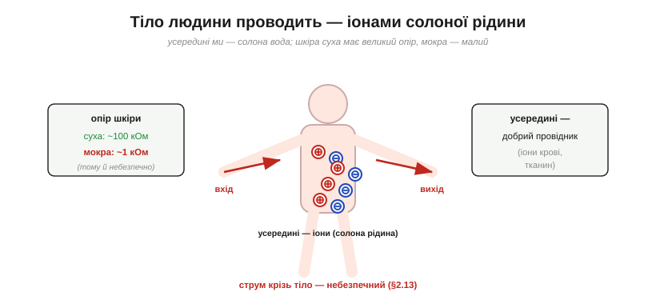
*Рис. 1.2.11.4. Усередині тіло — добрий іонний провідник (солоні рідини). Головний бар'єр для струму — **шкіра**: суха має опір порядку сотень кілоом, але волога (піт, вода) — лише близько кілоома. Тому струм, що пройшов крізь тіло, небезпечний, а мокрі руки роблять його значно небезпечнішим.*

Це не абстракція, а питання життя. Зовнішній бар'єр — **шкіра**: суха, вона має чималий опір (сотні кілоом) і трохи захищає; але варто їй намокнути (піт, вода) — опір падає в сотні разів (до ~кілоома), і той самий дотик пропускає куди більший, уже небезпечний струм. Саме тому електрику особливо небезпечно чіпати **мокрими руками** чи у ванній.

Варто додати ще два факти. Коли шкіра подолана (поранення, вологість, голка), **внутрішній** опір тіла невеликий — лише кілька сотень ом, тож головним захистом є саме суха шкіра. А ще небезпека залежить від **виду** струму: побутовий змінний струм 50 Гц особливо підступний — він здатний збити серце з ритму (фібриляція) навіть за порівняно невеликих значень. Тому питання «скільки вольтів» — неповне: що саме станеться, вирішують **струм**, його **шлях** крізь тіло й **тривалість**. Чому шкідливий саме струм і які значення небезпечні — окрема важлива тема §1.2.13.

> 🔧 **Навіщо це.** Запам'ятайте з цього головне правило безпеки: **небезпечний струм через тіло, а тіло проводить іонами й тим краще, чим воно вологіше**. Звідси — не працювати з електрикою мокрими руками, у вологих приміщеннях ставити пристрої захисного вимкнення, а виміри під напругою робити «однією рукою», щоб струм не пішов через груди. Розуміння, що ми самі — електроліт, рятує життя.

---

Підсумок §1.2.11: струм — це **рух заряду, незалежно від носія**. Окрім електронів у металах, заряд несуть **іони** в електролітах (обидва знаки, назустріч, обидва додають струм; чистота розчину вирішує провідність), **електрони й іони** в **плазмі** (іскра, блискавка, неон, зорі) та **іони** в тканинах живого тіла — через що ми й вразливі до струму. Ми розглянули, **що** і **в чому** тече. Лишилося одне велике розрізнення про сам характер потоку: чи тече він **весь час в один бік**, чи **гойдається** туди-сюди.

---

## 1.2.12 Постійний і змінний струм (DC vs AC): напрямок руху

Дотепер ми мовчки малювали струм як потік, що тече **весь час в один бік**, — від «плюса» до «мінуса». Так поводиться струм від батареї. Та є й інший, не менш важливий вид струму, у якому напрямок **періодично змінюється** на протилежний. Розрізнення цих двох — постійного й змінного струму — фундаментальне: на ньому збудовано весь поділ між «електронікою» та «електрикою мережі».

### Два види струму — і як рухаються електрони

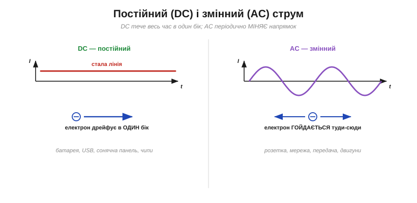
*Рис. 1.2.12.1. **Постійний струм** (*DC, direct current*) тече весь час в один бік — на графіку це стала лінія, а електрони **дрейфують** в одному напрямку. **Змінний струм** (*AC, alternating current*) періодично міняє напрямок — графік це синусоїда, а електрони лише **гойдаються** туди-сюди, нікуди сумарно не зміщуючись.*

**Постійний струм** (*DC*) — це те, що дає батарея: напрямок і (зазвичай) величина сталі. Електрони дрейфують в один бік, як ми й вивчали у §1.2.3. **Змінний струм** (*AC*) — інший: його напрямок раз у раз обертається, тож електрони не йдуть кудись, а **тремтять** на місці вперед-назад (пригадаймо §1.2.4 — енергію все одно переносить поле, а не марш електронів). Більшість змінних струмів мають форму **синусоїди**, бо саме її природно дають обертові генератори.

Звідси цікавий наслідок: у змінного струму **середній перенесений заряд за період дорівнює нулю** — скільки електронів пройшло «туди», стільки ж вернулося «назад». Здавалося б, нічого й не сталося? Та енергію змінний струм передає чудово: важливий не сумарний зсув зарядів, а їхній **рух** і поле, що його супроводжує. Тому розетка живить прилад, хоча жоден електрон із неї нікуди не «доходить».

### Частота й період

Найважливіша характеристика змінного струму — як **швидко** він міняє напрямок.

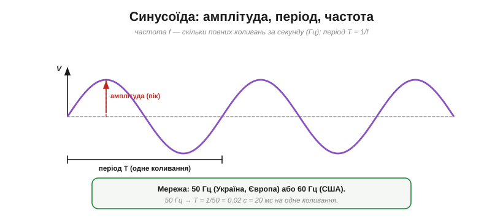
*Рис. 1.2.12.2. Одне повне коливання — це **період** T. Скільки таких коливань уміщається в секунду — це **частота** f (у герцах, Гц), і f = 1/T. Висота синусоїди — **амплітуда** (пікове значення).*

**Частота** (*frequency*, f) міряється в **герцах** (Гц = коливань за секунду) і пов'язана з **періодом** просто: f = 1/T. Побутова мережа в Україні та Європі працює на **50 Гц**, у США — на **60 Гц**.

**Приклад (період мережі).** Яка тривалість одного коливання в мережі 50 Гц?

```
T = 1/f = 1/50 = 0.02 с = 20 мс
```

Тобто струм у вашій розетці п'ятдесят разів за секунду тече «туди» й п'ятдесят разів «назад».

### Скільки це «в DC»: діюче значення (RMS)

Якщо напруга змінного струму весь час коливається від плюса до мінуса, то що означає «230 вольтів» у розетці? Адже миттєве значення то нуль, то максимум, то від'ємне. Відповідь — **діюче (середньоквадратичне) значення** (*RMS*).

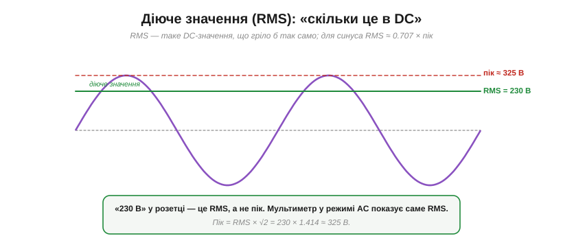
*Рис. 1.2.12.3. RMS — це таке **постійне** значення, яке гріло б навантаження так само, як цей змінний струм. Для синусоїди RMS ≈ 0.707 від піку. Тому «230 В» мережі — це RMS; справжній **пік** сягає ≈ 325 В.*

RMS відповідає на питання «скільки корисної роботи (тепла) дає цей змінний струм — як еквівалентний постійний». Саме RMS пишуть на приладах і показують мультиметри в режимі AC. А пік помітно вищий:

**Приклад (пікова напруга мережі).** Який пік у мережі 230 В (RMS)?

```
V_пік = V_RMS × √2 = 230 × 1.414 ≈ 325 В
```

Це важливо для практики: ізоляція й деталі мають витримувати саме **пік** (~325 В), а не лише «230».

### Чому світ обрав AC

Постає природне питання: якщо електроніка все одно працює на постійному струмі, навіщо вся мережа — змінна? Відповідь — в одному вирішальному слові: **трансформація**.

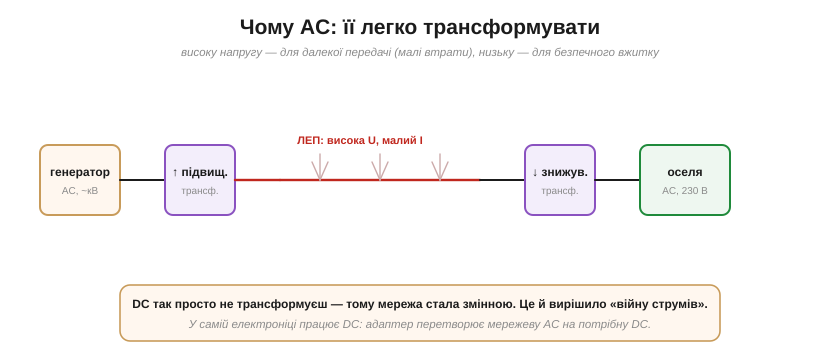
*Рис. 1.2.12.4. Змінну напругу легко **підвищити** трансформатором для далекої передачі (висока U, малий струм → малі втрати в дротах) і **знизити** наприкінці до безпечної. Постійний струм так просто не трансформується — тому енергомережі всього світу стали змінними.*

Передавати енергію на сотні кілометрів вигідно **високою напругою й малим струмом** (бо втрати на нагрів дротів ростуть зі струмом — Розділ 1.3). А наприкінці напругу треба знизити до безпечної. Змінний струм дозволяє це робити легко й майже без втрат — **трансформатором** (Розділ 2.2), який працює лише на змінному струмі. Постійний струм у ті часи трансформувати не вміли — і саме це вирішило знамениту **«війну струмів»** наприкінці XIX століття.

До слова, велика енергетика користується не одним, а **трьома** змінними струмами одразу — **трифазною** системою, де три синусоїди зсунуті на третину періоду. Так ефективніше передавати потужність і зручніше живити могутні двигуни; саме тому в промислових мережах не два дроти, а більше.

Втім, у DC свої переваги, і там, де трансформація не потрібна, він часто кращий: батареї дають саме постійний струм, уся логіка й чипи живляться ним, а ще в DC немає ні скін-ефекту, ні «реактивних» втрат. Головна ж сила AC поза трансформацією — прості й надійні **двигуни**: асинхронний мотор на змінному струмі не має щіток, що зношуються, тож десятиліттями крутить верстати й насоси. Тож вибір «AC чи DC» — завжди компроміс під конкретну задачу.

> 📜 Драматичну історію протистояння Едісона (за DC) проти Тесли й Вестінгауза (за AC) — у вставці [Війна струмів](hist-war-of-currents.md).

> 🔧 **Навіщо це.** Тримайте в голові поділ: **мережа — змінна (AC), електроніка — постійна (DC)**. Тому в кожного пристрою є **адаптер** (зарядка, блок живлення), що перетворює мережеву AC на потрібну DC. Звідси й практичні наслідки: прилад на 60 Гц не завжди правильно працює від 50 Гц (старі двигуни, годинники «пливуть»); а «230 В» означає пік ~325 В, на який і має бути розрахована ізоляція.

Перетворення між двома видами струму — окрема важлива техніка. **Випрямляч** (*rectifier*) робить із AC постійний струм — він є в кожному блоці живлення (його серце — діоди, Розділ 2.5). Зворотне роблять **інвертором** (*inverter*): він творить AC із DC, щоб живити мережеві прилади від акумулятора чи сонячних панелей. Тож стрілка «AC ↔ DC» ходить в обидва боки, залежно від потреби, а перетворювачі — одні з найпоширеніших вузлів сучасної техніки.

### AC — це не лише синусоїда

Варто уточнити: класичний «змінний струм» мережі — синусоїдальний, але в ширшому сенсі **будь-який струм, що змінюється в часі**, теж «змінний». Прямокутні імпульси цифрових сигналів, ШІМ для керування потужністю (Розділ 4.7), звукові та радіосигнали — усе це різновиди змінних у часі струмів. Синусоїда ж особлива тим, що її природно дають генератори й що з неї, як з цеглинок, складається будь-який інший сигнал (це окрема велика тема — Розділ 5.5).

> 🔧 **Навіщо це.** Цікаво, що сьогодні постійний струм бере реванш: надвисоковольтні лінії **HVDC** (постійного струму) вже вигідніші за змінні на наддовгих відстанях і під морем — бо сучасна силова електроніка нарешті навчилася перетворювати й високовольтний DC. «Війна струмів» триває, просто на новому технічному рівні; а всередині кожного гаджета незмінно панує DC.

---

Підсумок §1.2.12: струм буває **постійний** (DC — тече в один бік, як від батареї; електрони дрейфують) і **змінний** (AC — періодично міняє напрямок, як у мережі; електрони гойдаються). Змінний описують **частотою** (Гц, f = 1/T; мережа 50/60 Гц) і **діючим значенням RMS** (те, що показує прилад; «230 В» — це RMS, а пік ≈ 325 В). Світ обрав AC для енергомереж, бо її легко **трансформувати**, тоді як електроніка живиться DC через адаптер. Ми майже завершили розмову про струм. Лишилося найважливіше для життя: чому струм **небезпечний** — і чому винна саме його величина.

---

## 1.2.13 Струм і безпека: чому небезпечний саме струм

Завершимо розділ темою, від якої залежить життя. Поширене запитання «скільки вольтів небезпечно?» поставлене **неправильно** — і нерозуміння цього коштувало людям здоров'я. Бо шкодить тілу не напруга сама по собі, а **струм**, що крізь нього пройшов. Напруга лише **жене** цей струм; а скільки його потече — і чи стане воно смертельним — залежить ще й від опору тіла. Розберімо це чітко, спираючись на все, що ми вже знаємо про струм.

### Небезпечний саме струм — і ось скільки

Те, що руйнує тіло, — це **струм крізь нього**, у міліамперах. Він діє двояко: гріє тканини (джоулеве тепло, §1.2.9) і — головне — **перебиває власні іонні сигнали** тіла (§1.2.11), якими керуються м'язи й серце.


*Рис. 1.2.13.1. Приблизні пороги для змінного струму 50 Гц, що пройшов крізь людину: ~1 мА — ледь відчутно; 10–20 мА — м'язи зводить так, що **не відпустити** дроту; 100–200 мА — **фібриляція** серця (смертельно); понад ампер — важкі опіки. Вирішують саме міліампери, а не вольти.*

Особливо підступний поріг — «не відпустити» (10–20 мА): струм змушує м'язи руки судомно стиснутися, і людина **не може розтиснути** долоню, що схопила дріт, — а отже, лишається під струмом, аж поки не станеться найгірше. А близько 100 мА струм збиває з ритму серце (**фібриляція**), і це вже смертельно. Усі ці значення — **міліампери**: тілу не треба багато.

> 📜 Звідки взялися саме ці числа? Їх виміряла конкретна людина — Чарльз Далзіел. А «винайшов ПЗВ» — поширений міф (диференційні пристрої старші за нього): [Чарльз Далзіел](hist-dalziel.md).

### Струм задає опір: I = V/R

Чому ж тоді кажуть про «вольти»? Бо напруга задає струм через **закон Ома**: I = V/R, де R — опір тіла. А опір тіла шалено залежить від стану **шкіри** (§1.2.11): суха — сотні кілоом, мокра — лише кілоом. Звідси й уся підступність.

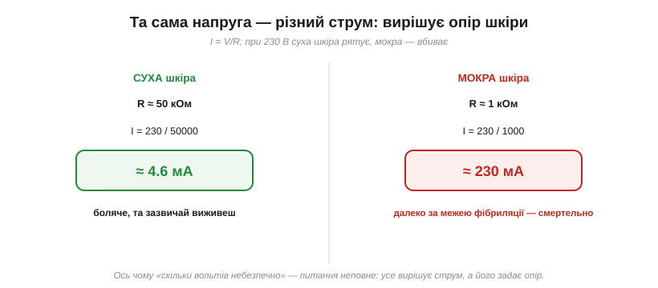
*Рис. 1.2.13.2. За однієї й тієї самої напруги 230 В суха шкіра (≈50 кОм) пропускає лише ~4.6 мА — боляче, та за сухого контакту зазвичай не смертельно (гарантій, утім, нема); а мокра (≈1 кОм) — аж ~230 мА, далеко за порогом фібриляції. Напруга та сама, а наслідок — від «струсонуло» до загибелі.*

**Приклад (чому мокрі руки вбивають).** Дотик до 230 В мережі:

```
суха шкіра:  I = V/R = 230 / 50000 ≈ 4.6 мА   → боляче, зазвичай не смертельно
мокра шкіра: I = V/R = 230 / 1000  ≈ 230 мА   → смертельно
```

Той самий контакт, та сама напруга — а струм відрізняється в **п'ятдесят разів**, бо змінився лише опір шкіри. Ось чому однозначної відповіді «скільки вольтів небезпечно» немає: усе вирішує струм, а його — опір.

Грубий орієнтир усе ж є: напруги приблизно **до 50 В** змінного струму (чи ~120 В постійного) вважають порівняно безпечними («наднизька напруга», SELV) — за нормальних сухих умов вони рідко проганяють небезпечний струм крізь цілу шкіру. Та це не індульгенція: у вологості, при пораненні чи поганому контакті небезпечним буває й менше. «Безпечно» завжди залежить від умов.

> 🔧 **Навіщо це.** Звідси практичні висновки. **Мокрими руками чи у ванній** електрику чіпати смертельно небезпечно — опір падає, струм злітає. **Низьковольтні батареї** (1.5–12 В) зазвичай безпечні на дотик: навіть мокра шкіра дає невеликий струм (12 В / 1 кОм = 12 мА — неприємно, та не смертельно), а суха його майже не пропустить. Але навіть низька напруга стає небезпечною там, де опір малий (наскрізна рана, занурення), а великий **струм** низької напруги — це опіки й пожежа.

### Шлях і тривалість теж важать

Однакового струму замало, щоб судити про небезпеку, — важить, **яким шляхом** він пройшов і **як довго**.

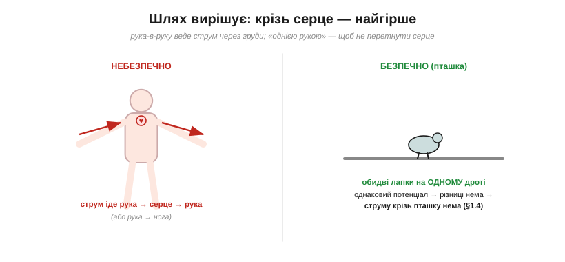
*Рис. 1.2.13.3. Найгірший шлях — **рука в руку** (чи рука в ногу): струм перетинає груди, де серце. Звідси «правило однієї руки»: працювати під напругою по змозі **однією** рукою, щоб струм не пішов через серце. А пташка на дроті ціла, бо обидві лапки на **одному** проводі — між ними нема різниці потенціалів (§1.1.4), отже, й струму крізь неї нема.*

Найнебезпечніший шлях — через **груди**, тому й існує **правило однієї руки**: торкатися можливо-живого однією рукою (а другу тримати в кишені), щоб у разі удару струм не пройшов «рука → серце → рука». А пташка на лінії електропередачі ціла саме тому, що сидить на одному дроті: її лапки на **однаковому потенціалі**, різниці нема — нема й струму (пряме застосування §1.1.4). Небезпека з'явилася б, якби вона торкнулася водночас двох дротів або дроту й землі.

Тривалість додає: що довше тіло під струмом, то гірше (накопичується нагрів, зростає шанс фібриляції). А ще згадаймо §1.2.12: побутовий **змінний** струм 50 Гц особливо небезпечний — він і викликає «не відпустити», і легше зриває серце в фібриляцію, ніж постійний. Чому саме 50–60 Гц так зловісно діють? **Не** тому, що ця частота «збігається з ритмом серця» — пульс це лише близько одного удару за секунду (~1 Гц). А тому, що низькочастотний змінний струм, по-перше, **щопівперіоду** наново смикає м'язи, аж долоню не розтиснути; а по-друге, якщо триває довше за один серцевий цикл і йде крізь груди, майже неминуче влучає у **вразливу фазу** серцевого ритму й збиває злагоджені скорочення у фібриляцію. Постійний і високочастотний струм у цьому сенсі менш підступні. Прикра іронія: частота, найзручніша для енергетики, виявилася однією з найнебезпечніших для серця.

Окрема загроза — **крокова напруга**: біля обірваного дроту чи місця удару блискавки сама земля має різний потенціал у різних точках, і струм може пройти **між ногами**. Тому з небезпечної зони відходять дрібними кроками, не розставляючи ноги широко.

### Як захищаються

На щастя, фізику небезпеки давно приборкали кількома рівнями захисту. Головний для **життя** — пристрій захисного вимкнення.


*Рис. 1.2.13.4. **ПЗВ** (*RCD/GFCI*) стежить, чи стільки ж струму **повертається**, скільки пішло в прилад. Якщо частина «витекла» кудись убік — наприклад, крізь людину в землю — баланс порушується, і ПЗВ **рве коло за мілісекунди**. Спрацьовує вже на ~30 мА (європейський/український стандарт; у США персональні GFCI — на ~5 мА) — раніше, ніж струм устигне вбити.*

Ключова ідея ПЗВ (пристрою захисного вимкнення) — **порівняння струмів**: у справному колі скільки струму пішло «туди», стільки ж вертається «назад» (§1.2.5). Якщо ж частина струму **витікає** повз — крізь тіло людини на землю, — туди й назад уже не рівні, і ПЗВ миттю вимикає живлення. Він реагує на крихітні ~30 мА за мілісекунди — тобто **рятує людину**, а не прилад. (Це європейський/український поріг персонального захисту; американські GFCI спрацьовують ще чутливіше — ~5 мА.) Але майте на увазі межу: ПЗВ ловить лише **витік** повз коло; якщо ж торкнутися водночас **фази й нейтралі**, струм крізь тіло «збалансований» — і ПЗВ його не помітить. Тож він не скасовує обережності.

> 🔌 Як ПЗВ улаштований усередині (кільце-давач і розчіплювач), що означають **типи AC/A/B** та пороги 10/30/100/300 мА, навіщо кнопка «ТЕСТ» і чому він іноді «вибиває» сам: [ПЗВ (RCD)](comp-rcd.md).

> 🔧 **Навіщо це.** Запам'ятайте різницю, що рятує життя: **запобіжник і автомат захищають коло** (від надструму й пожежі), а **ПЗВ захищає людину** (від витоку крізь тіло). Тому у вологих місцях (ванна, кухня, вулиця) ПЗВ обов'язковий. Інші рівні захисту: надійна **ізоляція**, **заземлення** корпусів (щоб пробій ішов у землю, а не крізь вас), правило **однієї руки**, не працювати під напругою без потреби — і пам'ятати, що **конденсатори** тримають заряд навіть після вимкнення (їх розряджають перед роботою). Повага до струму — головна навичка безпеки.

Варто пояснити роль **заземлення корпусів** докладніше. Якщо живий провід усередині приладу торкнеться металевого корпусу, незаземлений корпус сам стане «під напругою» й чекатиме, поки до нього доторкнеться людина. Заземлений же корпус відразу відведе цей струм **захисним проводом (PE)** — низькоомним шляхом назад **до джерела** (а не «в ґрунт», як у стік: земля для цього надто високоомна). Через малий опір потече великий струм, миттю спрацює автомат чи ПЗВ, і небезпека зникне, перш ніж хтось постраждає.

І найважливіше — **перша допомога**. Якщо людину «тримає» струм, **не хапайте її руками**: ви самі станете частиною кола й постраждаєте обоє. Спершу **вимкніть живлення** (вимикач, пробки) або відштовхніть потерпілого сухим ізолятором — дерев'яним держаком, пластиком. І лише знеструмивши — надавайте допомогу. Це правило з історій про струм важить найбільше.

---

Підсумок §1.2.13: шкодить **струм** через тіло (міліампери!), а не «вольти»: ~10–20 мА вже «не відпустити», ~100 мА — фібриляція. Струм задає закон Ома I = V/R, тож за тієї самої напруги **мокра шкіра** (малий опір) у десятки разів небезпечніша за суху. Важать також **шлях** (найгірше — крізь серце; звідси правило однієї руки й чому пташка на дроті ціла) і **тривалість**, а змінний 50 Гц підступніший за постійний. Рятують **ПЗВ** (захищає людину), заземлення та ізоляція.

На цьому завершуємо розділ про струм. Ми дізналися, **що** тече (заряд, носії), **куди** й **за яким законом**, **чому** проводить чи опирається, і **чим** небезпечне. Один бік медалі — опір — ми багато разів називали, та досі не порахували. Час зробити це: ввести закон Ома в числах, потужність і тепло.

> ▶️ Далі: [Розділ 1.3 — Опір, потужність і тепло](../resistance-power-heat/resistance-power-heat.md)