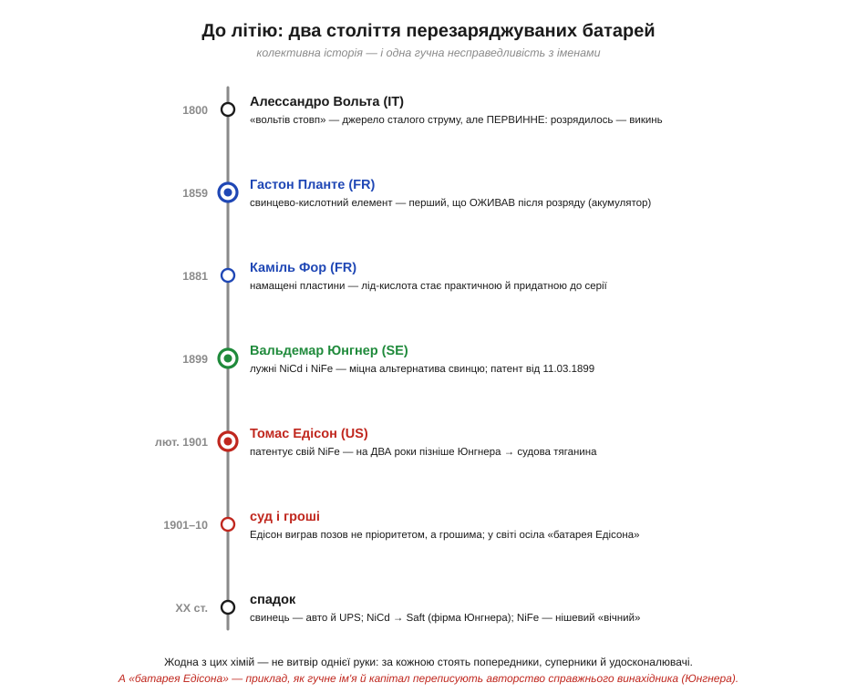
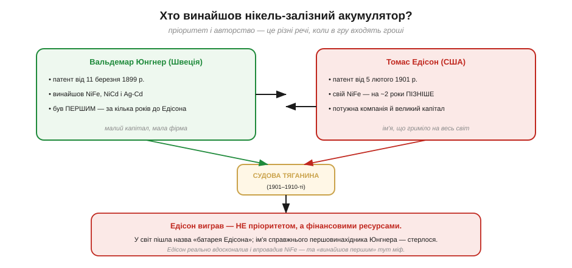
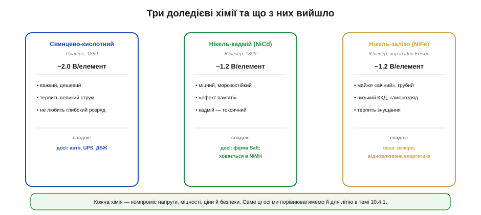

# 📜 До літію: свинець, нікель і забута патентна боротьба

> Історична вставка до [Розділу 10.4 «Батареї і заряд»](batteries-charging.md). Літієву хімію, що живить сучасні пристрої, ми вже зачепили в §7.4; тут — про два століття **до** неї, коли народилася сама ідея перезаряджуваного джерела, і про те, як найвідоміший акумулятор XX століття дістав чуже ім'я.

Сьогодні ми звично кажемо «зарядити батарею», ніби це очевидно. Але впродовж усієї першої половини XIX століття електрика з хімічного джерела була **одноразовою**: попрацювало — і на смітник. Думка, що те саме джерело можна *оживити*, прогнавши крізь нього струм у зворотний бік, була зовсім не очевидною — і коли її нарешті втілили, вона змінила все: від першого телефонного вузла до сучасного дрона. Ця історія — про людей, які цю думку виборювали, і про те, що винахід батареї, як майже все у техніці, виявився **колективним**, а слава розподілилася геть несправедливо.

### Проблема, якої не знав Вольта

Точкою відліку всієї електрохімії був **вольтів стовп** Алессандро Вольти (*Alessandro Volta*, італієць) 1800 року — стос мідних і цинкових кружалець, перекладених мокрим сукном. Уперше людство дістало джерело **сталого** струму, а не миттєвої іскри, — і це був переворот. Але стовп Вольти мав вади, яка тоді здавалася законом природи: він був **первинним** (*primary*). Цинк у ньому необоротно роз'їдався, і коли реакція завершувалась, елемент годився хіба що викинути. Перезарядити його було неможливо в принципі.

Десятиліттями це сприймали як належне. Аж тут визріло зухвале питання: а що, як підібрати таку пару речовин, у якій реакція **оборотна**? Щоб під час розряду вони перетворювались одне в одне в один бік, а під час заряду — у протилежний, повертаючись у початковий стан? Така комірка не «витрачалася» б, а служила сотні циклів. Саме цю ідею — **вторинного** (*secondary*), тобто перезаряджуваного, елемента — і втілив молодий французький фізик.

Варто додати, що перезаряджуваність не впала з неба. Їй передувала ціла родина **первинних** елементів XIX століття, на яких хіміки навчилися керувати реакцією: стабільний елемент Даніеля (*Daniell*), елемент Гроува (*Grove*), цинк-вугільні комірки. Усі вони лишалися одноразовими, але саме на них відпрацювали матеріали, електроліти й саму мову електрохімії, без якої Планте не мав би на що спертися. Це теж бік «колективності»: винахід стоїть не лише на плечах сучасників-суперників, а й на десятиліттях попередників, чиїх імен підручник зазвичай навіть не згадує.

*Рис. 10.4.0.1. Шлях від первинного стовпа Вольти (1800) до доледієвих акумуляторів. Свинець Планте (1859) уперше «оживав» після розряду; Фор (1881) зробив його придатним до серії; Юнгнер (1899) відкрив лужну гілку — NiCd і NiFe; Едісон (1901) запатентував свій NiFe пізніше за Юнгнера, але виграв суд грошима. Жодна хімія — не витвір однієї руки.*

### Свинець Планте: акумулятор, що оживає (1859)

**Гастон Планте** (*Gaston Planté*, француз, 1834–1889) 1859 року побудував перший у світі **свинцево-кислотний** акумулятор. Конструкція була чарівно простою: два листи свинцю, розділені смужками каучуку, скручені в спіраль і занурені в розчин приблизно десятивідсоткової сірчаної кислоти. Під час розряду поверхні пластин хімічно змінювалися, під час заряду — поверталися назад. Уперше джерело струму можна було **відновити**, а не викинути.

Була в його винаході одна загадкова й мудра деталь — **формування** (*forming*). Свіжозібраний елемент Планте був майже порожній; щоб «розбудити» його ємність, доводилося багато разів поспіль заряджати й розряджати його, і з кожним циклом активний шар на пластинах нарощувався, а ємність зростала. Те, що спершу здавалося вадою (батарея «не працює одразу»), насправді було ключем до її довговічності. 1860 року Планте представив Паризькій академії наук (*Académie des sciences*) збірку з дев'яти таких елементів у захисному ящику — по суті, першу акумуляторну батарею в сучасному сенсі.

Варто зазирнути, що саме там оборотно перетворюється, бо ця хімія лишилася з нами на півтора століття. На одній пластині — діоксид свинцю (PbO₂), на іншій — губчастий свинець (Pb), а між ними сірчана кислота, що не просто «розчин», а **активний учасник** реакції. Під час розряду обидві пластини перетворюються на сульфат свинцю (PbSO₄), а кислота **слабшає** — її густина падає. Звідси чудовий побічний дарунок: за густиною електроліту (ареометром) можна напряму прикинути, наскільки батарея заряджена, — прийом, яким досі користуються з автомобільними акумуляторами. Те саме перетворення дає ~2.0 В на елемент. А головний ворог свинцю — **сульфатація**: лишиш батарею глибоко розрядженою — і м'який PbSO₄ перекристалізується у твердий, ємність уже не повертається. Цю вразливість до глибокого розряду варто запам'ятати: вона ще постане, коли проєктуватимемо захист.

> 🔧 **Звідки слово.** Саме від цієї здатності *накопичувати* й зберігати заряд походить слово **акумулятор** (*accumulator*, від лат. «накопичувати»). А поділ на «елемент» (одну комірку) і «батарею» (кілька з'єднаних елементів) — теж звідси: автомобільна 12-вольтова батарея — це шість свинцевих елементів по ~2 В, з'єднаних послідовно.

### Фор і намащені пластини: від досліду до серії (1881)

Винахід Планте був геніальний, але непрактичний для масового світу: повільне формування забирало тижні, а ємність на одиницю ваги була скромна. Тут історія робить те, що робить майже завжди, — додає **другого героя**. 1881 року інший француз, **Каміль Альфонс Фор** (*Camille Alphonse Faure*), запропонував **намащені пластини**: замість чекати, поки активний шар наросте сам, його одразу наносили на свинцеву основу у вигляді пасти зі свинцевих оксидів. Ємність з'являлася відразу й була значно більшою, а головне — такі пластини можна було робити **серійно**, на фабриці.

Це і зробило свинцево-кислотний акумулятор тим, чим він став. На зламі століть він живив перші телефонні станції, перші електричні авто, аварійне освітлення. Звернімо увагу на мораль: «свинцева батарея» — це не винахід однієї людини, а **сума двох ідей** — принципу Планте (оборотна комірка) і технології Фора (придатність до виробництва). Без першого не було б що масштабувати, без другого винахід лишився б музейним дослідом.

Намащені пластини відчинили двері цілій епосі. На зламі XIX і XX століть **електромобілі** були не дивиною, а серйозним суперником бензину, і котилися вони саме на свинцево-кислотних батареях. Згодом свинець знайшов свою вічну нішу — **пусковий акумулятор** авто (англійці кажуть *SLI*: starting, lighting, ignition), бо жодна інша дешева хімія не віддає такого скаженого струму на стартер у першу секунду. Той факт, що під капотом і досі стоїть саме 12-вольтова свинцева батарея, — пряма спадщина Планте й Фора, а не випадковість: шість елементів по ~2 В, зібраних послідовно, дають ту звичну дюжину вольтів.

### Лужний шлях: Юнгнер і нікель (1899)

Свинець мав уроджені вади: він важкий, боїться **глибокого розряду** (пластини «засульфатовуються» й деградують) і не дуже любить мороз. Наприкінці XIX століття інженери шукали міцнішу, легшу, витривалішу хімію — і знайшли її не в кислоті, а в **лугу**.

Швед **Вальдемар Юнгнер** (*Waldemar Jungner*, 1869–1924) 1899 року створив одразу кілька **лужних** акумуляторів: нікель-кадмієвий (**NiCd**), нікель-залізний (**NiFe**) і навіть срібно-кадмієвий. Свій патент на електроліт він зареєстрував 11 березня 1899 року, а повний патент, що описував роботу NiCd і NiFe, оформив у січні 1901-го. Нова хімія давала близько 1.2 В на елемент — менше за свинцеві 2 В, — зате була разюче **міцною**: терпіла глибокий розряд, мороз, струси й перевантаження, які вбили б свинцеву батарею. Юнгнер заснував власну фірму — *Ackumulator Jungner* — і взявся виводити винахід на ринок.

Вело Юнгнера конкретне інженерне невдоволення: він хотів **тягову** батарею для транспорту, міцнішу за вразливий свинець. Лужні елементи у сталевих корпусах це й дали. Платою за витривалість були нижча напруга (~1.2 замість 2 В), нижчий ККД і вища ціна — класичний компроміс, де за надійність розраховуються ефективністю. Зате така комірка пробачала те, що свинцеву вбивало: розряд у нуль, тривале зберігання розрядженою, мороз і трясіння. Цю саму вісь — «**міцність проти щільності енергії**» — ми ще не раз зустрінемо, обираючи хімію під задачу. А далі на сцену вийшов набагато гучніший суперник.

*Рис. 10.4.0.2. Юнгнер запатентував NiFe ще 1899 року — на ~2 роки раніше за Едісона (патент від 5 лютого 1901-го). Та в довгій судовій тяганині переміг не той, хто був першим, а той, у кого було більше грошей. У світ пішла назва «батарея Едісона», а ім'я справжнього першовинахідника стерлося. Едісон реально вдосконалив NiFe — але «винайшов першим» тут міф.*

### «Батарея Едісона», якої він не винайшов першим

**Томас Едісон** (*Thomas Edison*, американець) запатентував свій нікель-залізний акумулятор 5 лютого 1901 року — тобто **на два роки пізніше** за Юнгнера. Між двома винахідниками спалахнула довга патентна війна. І ось ключовий, незручний факт: **Едісон виграв її не пріоритетом, а капіталом**. У нього були потужна компанія, армія юристів і світова слава; у Юнгнера — мала шведська фірма й хронічний брак коштів. Тяганина й конкуренція підкосили фінанси *Ackumulator Jungner*, а 1905 року справу погіршила ще й пожежа на фабриці. У підсумку в історію нікель-залізний акумулятор увійшов як **«батарея Едісона»**, а ім'я людини, яка справді зробила це першою, опинилося на маргінесі.

Будьмо точні й справедливі — у двох напрямках одразу. З одного боку, **пріоритет належить Юнгнерові**: це не питання думки, а питання дат у патентних реєстрах. Теза «Едісон винайшов нікель-залізну батарею» — **історичний міф**, з тих, що народжуються, коли гучне ім'я й гроші переписують авторство. З іншого боку, Едісон — **не самозванець**: він незалежно працював над лужною хімією, серйозно **вдосконалив** NiFe як інженер і, головне, **впровадив** його — зробив надійним промисловим продуктом, активно просував для електромобілів і резервного живлення. Його внесок реальний, просто він інший: не «винайшов перший», а «довів до масового продукту й гучно продав». Саме розрізнення цих ролей — *мати ідею*, *запатентувати*, *збудувати робочий зразок*, *створити придатний продукт* — і відокремлює історію від легенди.

Едісонова частина цієї історії повчальна сама собою — як приклад того, чого варте **впровадження**. Він вірив, що майбутнє за електромобілями, і вклав у нікель-залізну батарею понад десять років завзятої праці: перші партії виявилися ненадійними, він відкликав їх, переробив конструкцію — і лише близько 1910 року дістав справді міцний промисловий продукт, який десятиліттями потім працював у вагонетках, на маяках і в резервному живленні. Тобто Едісон зробив роботу, яку Юнгнерова мала фірма просто не потягнула б фінансово, — довів сирий винахід до надійного товару. Біда тільки в тому, що в масовій пам'яті це згорнулося до «Едісон винайшов», тоді як чесне формулювання звучить інакше: «Едісон удосконалив і продав те, що першим запатентував Юнгнер».

> 🔧 **Чому це не дрібниця.** Історія «батареї Едісона» — навчальний приклад того, як працює технічна слава: публіка запам'ятовує **одне ім'я й одну дату**, хоча за винаходом майже завжди стоїть кілька людей, країн і років. Інженерові варто тримати цей скепсис напохваті — і коли читає, «хто винайшов» транзистор, радіо чи акумулятор, питати не «чиє ім'я на табличці», а «хто що конкретно зробив і коли».

### Що з цього лишилося — і навіщо нам це знати

Минуло століття, а всі три доледієві хімії досі живі — кожна у своїй ніші, і знати їх корисно, бо вибір акумулятора й сьогодні починається з цього розгалуження.

*Рис. 10.4.0.3. Свинцево-кислотний (Планте) — важкий, дешевий, терпить великий струм: досі цар у автостартерах і ДБЖ. Нікель-кадмій (Юнгнер) — міцний і морозостійкий, але з «ефектом пам'яті» й токсичним кадмієм; фірма Юнгнера дожила до наших днів як Saft. Нікель-залізний (Юнгнер, впровадив Едісон) — майже «вічний», грубий, з низьким ККД: нішевий резерв.*

**Свинцево-кислотний** акумулятор і донині — найпоширеніший у світі за сумарною ємністю: він дешевий, віддає величезний пусковий струм і чудово стоїть резервом. Тому він живе під капотом майже кожного авто й у кожному великому ДБЖ. **Нікель-кадмій** уславився витривалістю: десятиліттями він живив інструмент, аварійне світло й авіоніку, поки токсичність кадмію та «ефект пам'яті» не відсунули його на користь спорідненого нікель-метал-гідридного (NiMH). А фірма Юнгнера, попри програний суд, вижила, змінила назву й існує дотепер як **Saft** — нині один із відомих виробників саме нікелевих акумуляторів. **Нікель-залізний** — найдивніший: його ККД низький, саморозряд великий, зате він майже незнищенний і витримує знущання, від яких гине будь-яка інша хімія, тож знаходить друге життя в резервному й відновлюваному живленні.

Окрема легенда тягнеться за нікель-кадмієм — горезвісний **«ефект пам'яті»**: якщо такий акумулятор раз за разом недорозряджати, він мовби «запам'ятовує» меншу ємність. Навколо цього наросло чимало міфів і ритуалів «тренування» батарей, частина з яких перекочувала — вже геть безпідставно — на сучасні літієві елементи, яким таке «тренування» лише шкодить. Це ще один корисний урок історії: властивість однієї хімії легко стає хибним «правилом для всіх батарей». А пряма спадкоємиця NiCd, менш токсична нікель-метал-гідридна хімія (NiMH), і досі живе в гібридних авто та якісних акумуляторних «пальчиках», тож Юнгнерова лужна гілка нікуди не зникла — вона лише змінила обличчя.

Звідти ж, із цієї доледієвої доби, прийшли й звичні нам **одиниці та конвенції**. Ємність почали міряти в ампер-годинах (А·год) — скільки струму, помножене на час, батарея здатна віддати; швидкість заряду й розряду — у частках цієї ємності за годину (звідси сучасне поняття *C-rate*). А поділ на «первинні» (одноразові) і «вторинні» (перезаряджувані) елементи, яким ми досі послуговуємось, бере початок саме з протиставлення стовпа Вольти й акумулятора Планте — і саме цей словник ми понесемо далі в розділ.

Не варто й недооцінювати, наскільки глибоко ця доледієва трійця в'їлася в інфраструктуру. Свинцеві батареї стали першим у світі **резервом** телеграфних і телефонних мереж, а згодом — буфером ранніх електромереж, що згладжував добові піки споживання: по суті, перше «мережеве накопичення» енергії працювало на хімії Планте. Лужні елементи Юнгнера й Едісона тим часом оселилися там, де головне — пережити роки без обслуговування: сигнальні вогні, шахтні лампи, залізнична автоматика. Тобто більшу частину XX століття автономна електроніка спиралася саме на ці три хімії — і лише під його кінець їх почав тіснити літій.

Для нас ця історія — не лише цікавий епізод, а **карта осей**, якими ми міритимемо будь-яку батарею далі в розділі: напруга елемента, питома енергія (скільки ват-годин на грам), стійкість до глибокого розряду, поведінка на морозі, ціна циклу й безпека. Ці самі осі ми застосуємо вже в наступній темі, додавши до трьох старих хімій сучасну літієву (а її витоки — у §7.4). Бо головний урок Планте, Фора та Юнгнера простий: **ідеальної батареї не існує** — є лише розумний компроміс під конкретну задачу, і вибрати його свідомо можна, лише розуміючи, звідки кожна хімія прийшла і чим за свої переваги платить.
