# Розділ 10.1 — Топології перетворювачів

Ще у [§7.4.2](../../block-7-systems/power-systems/power-systems.md) ми вперше побачили, як працює імпульсний перетворювач — на прикладі знижувального (*buck*): дві фази, трикутна хвиля струму котушки й формула Vвих = Vвх × D. Це був перший, оглядовий захід. Тепер ми пройдемо весь сімейний альбом топологій **систематично**: знайдемо спільний для них усіх закон, а тоді одну за одною розберемо buck, boost, buck-boost, зарядні помпи та ізольований flyback — і навчимося не лише впізнавати їх на платі, а й проєктувати вузол живлення під своє ТЗ.

> 📜 **Звідки це все взялося:** [від дзижчання в радіо до DC-DC](hist-smps.md) — як вібратор автомобільного приймача, космос і дешевий швидкий транзистор зробили імпульсне живлення нормою, і чому «імпульсний БЖ винайшла Apple» — маркетинговий міф.

---

## 10.1.1 Чому ключ + котушка: принцип усіх топологій

У попередньому модулі ми розібрали **один** перетворювач і могло скластися враження, що кожна наступна топологія — це окремий фокус, який доведеться завчати напам'ять: buck — так, boost — інакше, buck-boost — ще якось, а далі ж іще SEPIC, Ćuk, flyback… Якби це справді були десятки незалежних трюків, розділ перетворився б на зубріння схем.

На щастя, усе навпаки. Під усім цим «зоопарком» лежить **одна машина** й **один закон**. Машина — це незвідна пара «ключ + котушка». Закон — **вольт-секундний баланс**, який за півхвилини дає коефіцієнт перетворення будь-якої топології, без вивчень напам'ять. Ця тема — саме про них. Коли ми її закінчимо, кожен наступний перетворювач буде для вас не новою загадкою, а тією самою котушкою, під'єднаною інакше, і ви читатимете його вихідну напругу прямо зі схеми.

### Незвідна пара: ключ і котушка

Роздягнімо будь-який імпульсний перетворювач до голого мінімуму. Що лишиться, без чого він перестане бути собою? Три речі: **ключ** (*switch* — один чи кілька), **котушка** (*inductor*, L) і **конденсатор** (*capacitor*, C) на виході. Усе інше — обв'язка.

Розподіл ролей між ними строгий і незмінний від топології до топології:

- **ключ** рубає вхід на імпульси — і більше нічого; він лише вмикається й вимикається, ніколи не «пригальмовує» струм у проміжному стані (бо саме на цьому економиться тепло — §7.4.1);
- **котушка** переносить енергію — приймає її порціями, поки ключ відкритий, і віддає далі, поки закритий;
- **конденсатор** тримає вихідну напругу рівною, згладжуючи порційну роботу котушки в гладкий постійний струм для навантаження.

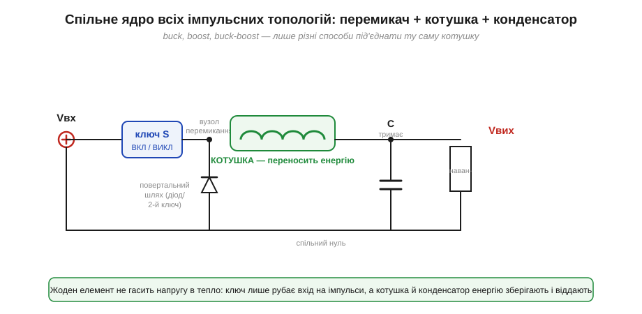
*Рис. 10.1.1.1. Незвідне ядро будь-якого імпульсного перетворювача: ключ рубає вхід, котушка (зелена — серце схеми) переносить енергію, конденсатор тримає вихід. Уся «мережа ключів» робить лише одне — по черзі під'єднує котушку до двох різних напруг. Топології (buck, boost, buck-boost) різняться тільки тим, **до яких саме** двох напруг.*

Чому саме **котушка**, а не просто ключ із конденсатором? Бо потрібен елемент, який **переносить енергію, не спалюючи її**, і водночас згладжує рубаний потік у рівний струм. Резистор енергію б палив; голий конденсатор без котушки на перемиканнях давав би жахливі стрибки струму. Котушка ж робить і те, й те: запасає енергію в магнітному полі й не дає струму смикатися. Вона — **енергетичний пором** перетворювача, і саме навколо неї будується вся конструкція.

А вся «мережа ключів», хоч би якою хитрою вона виглядала, виконує єдину функцію: **по черзі під'єднує котушку то до однієї напруги, то до іншої**. Ось і весь принцип. Різні топології — це різні пари напруг, між якими гойдається котушка. Зрозумівши це, ви вже наполовину зрозуміли їх усі.

### Котушка — маховик для струму

Раз котушка — серце, придивімося до неї уважніше. З Розділу 2.2 і §7.4.2 ми вже знаємо дві її властивості, і зараз обидві стануть на свої місця.

Перша: котушка **опирається зміні струму**. Напруга на ній пропорційна не самому струму, а **швидкості його зміни**:

```
Vл = L · (di/dt)
```

Прикладіть до котушки сталу напругу — і струм не стрибне, а почне наростати **лінійно**, з нахилом Vл/L. Це принципово інша поведінка, ніж у резистора (де струм слухняно дорівнює V/R миттєво). Котушка має інерцію.

Друга: котушка **запасає енергію** в магнітному полі, і запас цей залежить від струму квадратично:

```
E = ½ · L · I²
```

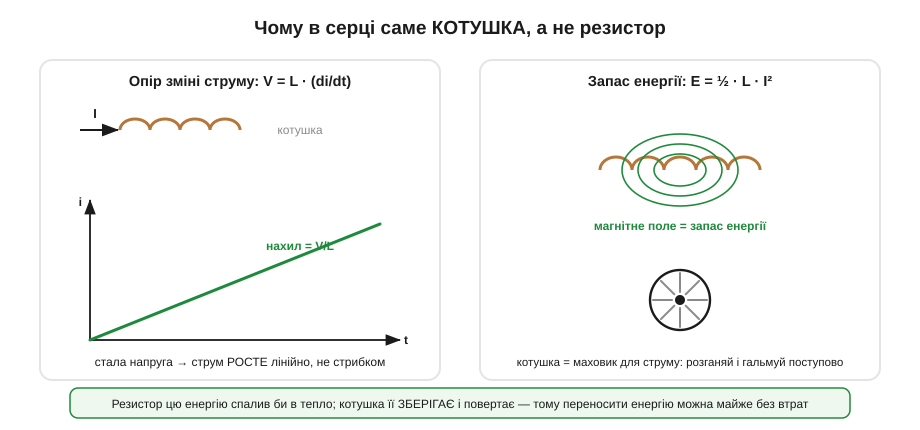
*Рис. 10.1.1.2. Дві властивості котушки, на яких стоїть усе. Ліворуч: стала напруга наганяє струм лінійно (нахил Vл/L) — струм не стрибає. Праворуч: енергія живе в магнітному полі (½LI²). Точна аналогія — **маховик**: струм як швидкість обертання, його не змінити миттєво, а кінетичну енергію можна запасти й повернути. Резистор цю енергію спалив би; котушка її зберігає.*

Аналогія з **маховиком** (*flywheel*) тут не махання руками, а точна. Струм через котушку — як швидкість обертання маховика: щоб її змінити, треба прикласти зусилля протягом часу, миттєво не вийде. Енергія маховика — кінетична (½·m·v²), енергія котушки — магнітна (½·L·I²); обидві квадратичні за «швидкістю». І маховик, і котушку можна розганяти, а можна гальмувати, забираючи назад запасене. Де аналогія ламається: маховик зберігає енергію довго, а реальна котушка має опір дроту й потроху її розсіює — тому в перетворювачі енергію в ній **не зберігають, а лиш транзитом переносять**, тримаючи там лічені мікросекунди.

Найважливіший наслідок цих властивостей — **струм через котушку не може урватися миттєво**. Якщо різко розімкнути коло з котушкою, di/dt прямує до нескінченності, а з ним і напруга Vл = L·(di/dt) — це те саме «брикання» (*flyback kick*), що псувало нам ключі в §2.2.5. У перетворювачі цю впертість струму **ставлять на службу**: коли ключ закривається, котушка все одно жене струм далі — через діод (або другий ключ) у навантаження. Саме безперервність струму котушки й змушує енергію текти у фазі «ВИКЛ».

> 🔧 **Навіщо це.** На платі котушка — це і є перетворювач (його впізнавана прикмета). А правило «струм котушки не уривають раптово» — практичне: ніколи не розривайте навантажений дросель наживо й не лишайте ключ без діода-чергового, інакше викид напруги проб'є його. Цю саму фізику ми ще зустрінемо у захистах живлення (Розділ 10.7).

### Дві фази: котушка під «+», тоді під «−»

Тепер узагальнімо ту двофазну роботу, яку в §7.4.2 ми бачили лише для buck. Принцип однаковий для **всіх** топологій:

- **Фаза ВКЛ** (ключ замкнено): мережа ключів під'єднує котушку так, що та бачить якусь напругу **Von** одного знаку. Струм у ній **наростає**, котушка **запасає** енергію.
- **Фаза ВИКЛ** (ключ розімкнено): мережа перемикає котушку — тепер через діод-черговий — так, що та бачить напругу **Voff протилежного знаку**. Струм **спадає**, котушка **віддає** запасене у вихід.

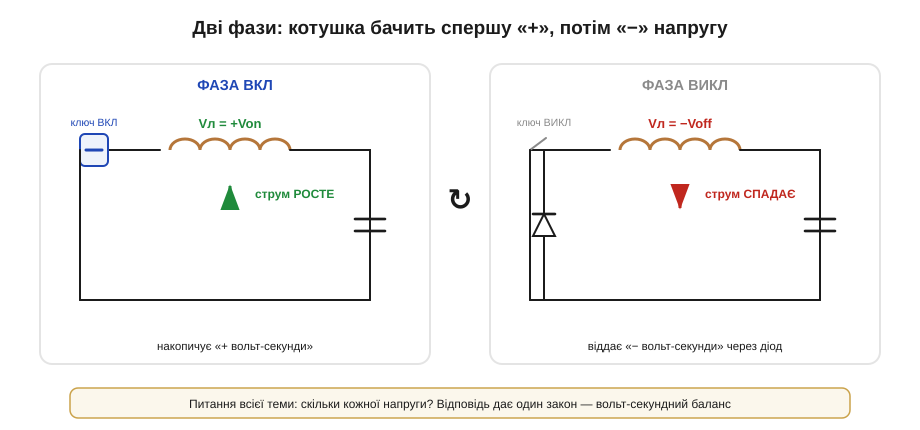
*Рис. 10.1.1.3. Універсальний ритм будь-якого перетворювача. У фазі ВКЛ котушка під додатною напругою — струм росте (запасає «+ вольт-секунди»). У фазі ВИКЛ її струм не уривається, а тече далі через діод, тепер під напругою протилежного знаку — струм спадає (віддає «− вольт-секунди»). Конкретні значення Von і Voff залежать від топології, але сам ритм «+ потім −» — спільний.*

Конкретні Von і Voff у кожної топології свої (для buck, як побачимо, Von = Vвх − Vвих, а Voff = Vвих) — але **ритм** однаковий скрізь: спочатку котушка під напругою одного знаку, потім протилежного; струм гойдається вгору-вниз навколо середнього, що й живить навантаження.

Введімо тут ключову величину. «Кількість магнітного поштовху», яку котушка отримує за фазу, — це не просто напруга й не просто час, а їхній **добуток**: напруга × тривалість, тобто **вольт-секунди** (*volt-seconds*, В·с). Поки ключ відкритий, котушка набирає Von·tвкл вольт-секунд; поки закритий — віддає Voff·tвикл. Уся подальша магія — про баланс цих двох добутків.

### Закон: вольт-секундний баланс

Тепер — головна ідея теми, заради якої все й затівалося. Вона коротка й могутня.

Перетворювач у роботі — **періодичний**: щоцикл повторюється те саме. А якщо процес періодичний, то струм котушки наприкінці кожного циклу мусить дорівнювати струмові на його початку — інакше це був би не той самий цикл. Отже, **зміна струму за повний період дорівнює нулю**: Δi = 0.

А тепер згадаймо, що зміна струму котушки — це накопичені вольт-секунди, поділені на L (бо di = Vл·dt / L). Якщо за повний цикл Δi = 0, то й сума вольт-секунд за цикл дорівнює нулю. Розписавши на дві фази:

```
Δi за період = 0
  ⇒  (вольт-секунди «+»)  =  (вольт-секунди «−»)
  ⇒  Von · tвкл  =  Voff · tвикл
  ⇒  середня напруга на котушці за цикл = 0
```

Це і є **вольт-секундний баланс** (*volt-second balance*, або *inductor volt-second balance*) — фундаментальний закон усіх імпульсних перетворювачів у сталому режимі.

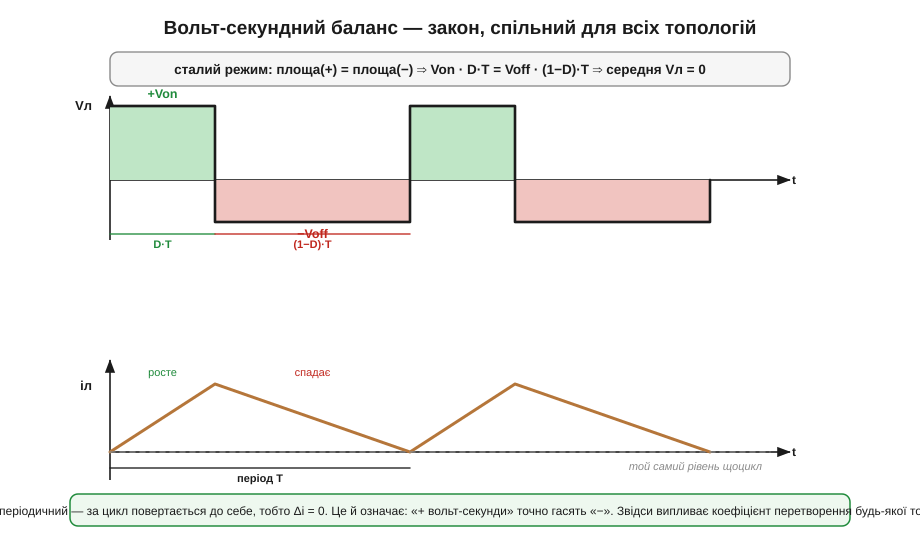
*Рис. 10.1.1.4. Центральний закон. Угорі — напруга на котушці: вузький високий додатний імпульс (Von протягом D·T) і широкий низький від'ємний (Voff протягом (1−D)·T). У сталому режимі **зелена площа = червона площа**, тобто середня напруга на котушці нульова. Унизу — струм котушки: трикутник, що **повертається до того самого рівня щоцикл** (Δi = 0). Це дві сторони однієї медалі: періодичність струму ⇔ баланс вольт-секунд.*

Інтуїтивно це як **гойдалка**, що повертається до тієї самої висоти: якби сумарний поштовх за повний розмах не був нульовим, вона б щоразу залітала вище або нижче — і це вже не усталене гойдання. Так само й струм котушки: рівно настільки, наскільки його піднімають вольт-секунди фази ВКЛ, його опускають вольт-секунди фази ВИКЛ. Не більше й не менше.

Зверніть увагу на форму імпульсів напруги на Рис. 10.1.1.4: додатний — **високий і вузький**, від'ємний — **низький і широкий**, а площі рівні. Це не випадковість, а пряме прочитання балансу: якщо одна напруга більша, то діяти вона мусить **коротше**, щоб вольт-секунди зійшлися. Уся «арифметика» перетворювача захована в цій рівності площ.

> 🧮 **Глибше — у вставці.** Формальне виведення «на пів сторінки», як саме з балансу випливає D = Vвих/Vвх для buck (з інтегралом ⟨Vл⟩ = 0 і акуратними знаками), винесено в математичну вставку [🧮 Вольт-секундний баланс](math-volt-second.md). Тут нам досить самого закону й уміння ним користуватися.

> 🔧 **Навіщо це.** Це найкорисніша одна формула розділу. Вона звільняє від зубріння: щоб знайти вихідну напругу **будь-якого** перетворювача, не треба пам'ятати його «фірмову» формулу — досить написати Von і Voff для двох фаз і прирівняти їхні вольт-секунди. Один закон замінює таблицю формул.

### Чому баланс — закон, а не припущення

Тут легко піддатися думці, що баланс — це зручне припущення, яке ми **накладаємо**. Насправді його **накладає сама фізика**, і варто побачити, чому, — бо це пояснює, як перетворювач узагалі тримається купи.

Уявімо, що баланс **порушено**: скажімо, вольт-секунд фази ВКЛ трохи більше, ніж фази ВИКЛ. Тоді за кожен цикл Δi не нульове, а трішки додатне — струм котушки **не повертається** до старого рівня, а закінчує цикл вище. Наступний цикл стартує з вищого рівня й знову додає — і так струм **повзе вгору щоцикл**, сходинка за сходинкою.

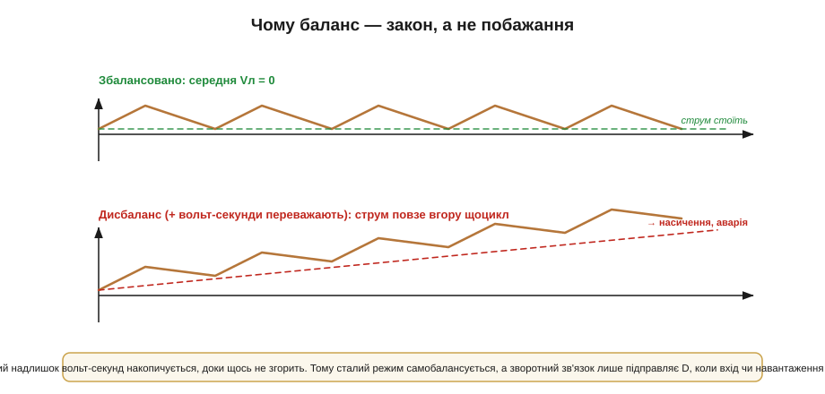
*Рис. 10.1.1.5. Збалансований режим (угорі): струм гойдається навколо сталого середнього — перетворювач «стоїть». Незбалансований (унизу): надлишок вольт-секунд однієї фази накопичується, і середній струм повзе вгору щоцикл — аж доки котушка не **насититься** (втратить індуктивність), а ключ не згорить від струму. Тому сталий режим можливий **лише** як збалансований.*

Довго так тривати не може: котушка має межу струму, за якою її осердя **насичується** (*saturation*) — індуктивність обвалюється, струм підскакує лавиною, ключ вигорає. Тобто незбалансований стан **сам себе знищує**. Вижити може лише той режим, у якому вольт-секунди зійшлися. Ось чому сталий режим — це **завжди** збалансований режим: не тому, що ми так захотіли, а тому, що інших стійких станів просто немає.

А що ж тоді робить **зворотний зв'язок** (той самий контур із §7.4.2)? Він не «створює» баланс — баланс настає сам. Зворотний зв'язок лише **підбирає шпаруватість D** так, щоб точкою балансу виявилася саме потрібна нам вихідна напруга. Просіла батарея чи стрибнуло навантаження — баланс на мить порушується, струм поповз, контур це помічає й підправляє D, і система осідає в новій точці балансу. Перехідні процеси (про них — у Розділі 10.2) — це і є подорож від однієї збалансованої точки до іншої.

### Один закон — усі топології

Перевіримо силу закону на знайомому випадку — на buck, для якого ми вже знаємо відповідь з §7.4.2, тож можемо звірити.

У buck котушка ввімкнена між вузлом перемикання й виходом. Розпишемо, яку напругу вона бачить у кожній фазі, і прирівняємо вольт-секунди:

```
buck, фаза ВКЛ (частка D):   Vл = Vвх − Vвих   (ключ з'єднав котушку з входом)
buck, фаза ВИКЛ (частка 1−D): Vл = −Vвих        (діод з'єднав котушку із землею)

баланс:  (Vвх − Vвих) · D · T  =  Vвих · (1 − D) · T
         Vвх·D − Vвих·D        =  Vвих − Vвих·D
         Vвх·D                 =  Vвих
   ⇒     Vвих = D · Vвх
```

Формула з §7.4.2 випала з закону в один рядок — і це найкраща перевірка, що закон правильний. Але тепер ми не **запам'ятали** її, а **вивели**, і тим самим інструментом виведемо решту.

**Приклад (звірка закону на buck).** Робимо 5 В із 16 В. Знайдемо D і переконаймося, що вольт-секунди справді сходяться:

```
ціль: Vвих = 5 В,  Vвх = 16 В
з балансу:  D = Vвих / Vвх = 5 / 16 ≈ 0.31   (ключ відкритий 31% циклу)

звірка площ (на 1 період T):
  «+» вольт-секунди (ВКЛ):  (Vвх − Vвих) · D     = (16 − 5) · 0.31 = 11 · 0.31 ≈ 3.4  (В·частка T)
  «−» вольт-секунди (ВИКЛ):  Vвих · (1 − D)       = 5 · 0.69                  ≈ 3.4  (В·частка T)
  3.4 ≈ 3.4  ✓  площі рівні — баланс зійшовся
```

Зелена й червона площі на Рис. 10.1.1.4 — це саме ці 3.4 В·частки T, і вони рівні. Закон працює.

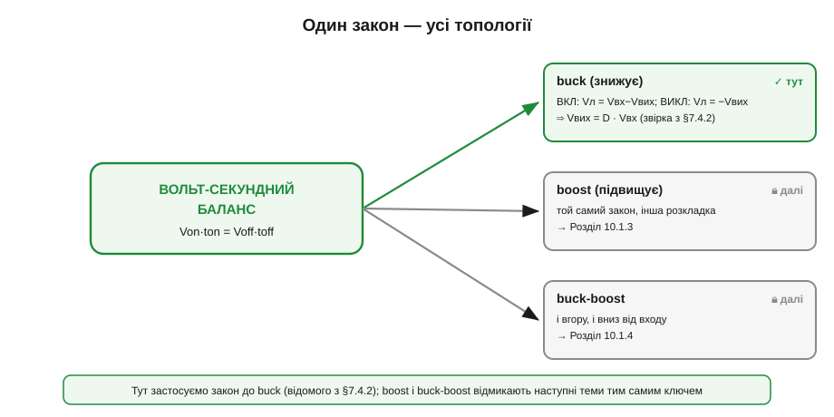
*Рис. 10.1.1.6. Вольт-секундний баланс — спільний ключ. Тут ми відімкнули ним buck (Vвих = D·Vвх, звірка з §7.4.2). Тим самим ключем — написати Von, Voff і прирівняти вольт-секунди — наступні теми відімкнуть boost (Розділ 10.1.3) і buck-boost (Розділ 10.1.4): інша розкладка тих самих деталей, але закон той самий.*

Підкреслимо межу: тут ми **не** виводимо boost чи buck-boost — це робота наступних тем, де ми побачимо, як саме там перемикається котушка. Важливо інше: ви вже маєте **універсальний інструмент**. Хоч би яку топологію вам показали далі — рецепт незмінний: розпишіть, яку напругу бачить котушка у фазі ВКЛ і у фазі ВИКЛ, прирівняйте їхні вольт-секунди — і коефіцієнт перетворення сам випаде з рівняння.

### Підсумок теми

Під усім «зоопарком» топологій лежить одна машина — **ключ + котушка + конденсатор**: ключ рубає вхід на імпульси, котушка переносить енергію (не палить, а запасає й віддає, мов маховик), конденсатор тримає вихід рівним. Уся мережа ключів робить єдине — по черзі під'єднує котушку до двох різних напруг. У сталому режимі струм котушки періодичний (Δi = 0 за цикл), а отже, її **вольт-секунди мусять балансуватися**: Von·tвкл = Voff·tвикл, тобто середня напруга на котушці нульова. Цей баланс не припущення, а самозабезпечений закон: дисбаланс накопичується й нищить себе насиченням, тож вижити може лише збалансований режим, а зворотний зв'язок лише наводить точку балансу на потрібну напругу. З цього одного закону випливає коефіцієнт перетворення будь-якої топології — для buck він дає знайоме Vвих = D·Vвх. Озброївшись цим інструментом, перейдімо до першої топології впритул — знижувального перетворювача в усій глибині: безперервний і переривчастий режими, пульсації, синхронний випрямляч.

---

## 10.1.2 Buck глибоко: CCM/DCM, пульсації, синхронний випрямляч

Знижувальний (*buck*) перетворювач ми вже знаємо в загальних рисах: дві фази, формула Vвих = D·Vвх, яку щойно вивели з вольт-секундного балансу. Цього досить, щоб **зрозуміти принцип**, але замало, щоб **спроєктувати вузол**, який не гріється, не свистить і не плаває. У цій темі ми спустимося в деталі, від яких залежить, добрий ваш buck чи поганий: наскільки великі **пульсації**, що коїться на **легкому навантаженні** (режими CCM і DCM), і що таке **синхронний випрямляч**, на якому стоять майже всі сучасні перетворювачі. Це найважливіша тема розділу для практика — саме тут абстрактний принцип стає інженерією.

### Пульсація струму: трикутник, який усе визначає

Повернімося до трикутної хвилі струму котушки. Її розмах — **пульсація** (*current ripple*, ΔI) — не дрібниця, а величина, що тягне за собою половину рішень у схемі: розмір котушки, пульсацію виходу, межу між режимами. Знайти її легко, бо ми вже все для цього маємо.

Поки ключ відкритий, котушка під напругою Vвх − Vвих, і струм наростає зі швидкістю (Vвх − Vвих)/L (це той самий V = L·di/dt з §2.2.2). Помножимо швидкість на час фази ВКЛ (tвкл = D·T = D/f) — і дістанемо весь приріст струму за фазу, тобто розмах пульсації:

```
ΔI = (Vвх − Vвих) · tвкл / L = (Vвх − Vвих) · D / (L · f)
```

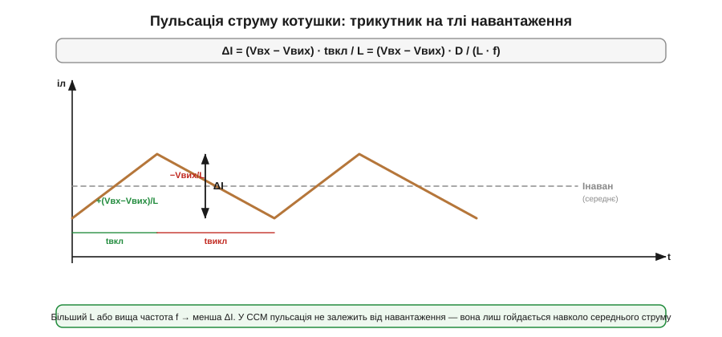
*Рис. 10.1.2.1. Струм котушки — трикутник, що гойдається на ±ΔI/2 навколо середнього (= струму навантаження). Розмах ΔI задають індуктивність L і частота f: чим вони більші, тим вужчий трикутник. У безперервному режимі пульсація **не залежить від навантаження** — вона лише «їде» вгору-вниз разом із середнім струмом.*

Звідси два важелі, якими керують пульсацією: **індуктивність** L і **частота** f. Більший L або вища f — менша ΔI. Але обидва мають ціну: велика котушка громіздка, дорога й має більший опір дроту; висока частота збільшує втрати на перемиканні (кожне ввімкнення MOSFET — маленька втрата, §2.7.7). Тому ΔI не женуть у нуль, а **цілять у розумну частку** середнього струму — класичне правило **30–40 % від максимального навантаження**. Це компроміс: надто велика пульсація розгойдує вихід і перевантажує конденсатори, надто мала вимагає велетенської котушки.

> 🧮 **Глибше — у вставці.** Як із цього правила (ΔI ≈ 30–40 %) покроково вибрати індуктивність — у математичній вставці [🧮 Пульсації струму котушки](math-inductor-ripple.md): підставляємо найгірший Vвх, цільову ΔI — і дістаємо мінімальний L.

**Приклад (пульсація струму).** Buck 16 В → 5 В, частота f = 500 кГц, котушка L = 10 мкГ. Яка пульсація?

```
D = Vвих / Vвх = 5 / 16 ≈ 0.31
ΔI = (Vвх − Vвих) · D / (L · f)
   = (16 − 5) · 0.31 / (10·10⁻⁶ · 500·10³)
   = 11 · 0.31 / 5
   = 3.41 / 5 ≈ 0.68 А (розмах)
```

Якщо цей вузол розрахований, скажімо, на 2 А навантаження, то 0.68 А — це ≈ 34 % від нього: акурат у цільовому вікні. Якби котушку взяли вдвічі меншу (5 мкГ), пульсація стрибнула б до ≈ 1.4 А (70 %) — забагато; вдвічі більшу — впала б до 0.34 А, але котушка стала б громіздкою.

### Коли струм торкається нуля: CCM і DCM

Дотепер ми мовчки припускали, що струм у котушці тече **завжди** — трикутник гойдається десь високо над нулем. Це **безперервний режим** (*continuous conduction mode*, **CCM**), і саме для нього діє чисте Vвих = D·Vвх. Та що буде, якщо навантаження зменшувати?

Середній струм (а він дорівнює струмові навантаження) **сповзає вниз**, а розмах пульсації ΔI лишається тим самим. Трикутник опускається — і настає мить, коли його нижній край **торкається нуля**. Це **межовий режим** (*boundary conduction mode*, BCM), і настає він рівно тоді, коли:

```
Iнаван = ΔI / 2     (нижній край трикутника = 0)
```

А якщо навантаження ще менше? Тут вступає в дію природа **діода**: він не пропускає струм назад. Щойно струм котушки спадає до нуля, діод закривається — і струм **лежить на нулі** до наступного циклу. Трикутник перетворюється на «острівці» з паузами: росте, спадає до нуля, чекає. Це **переривчастий режим** (*discontinuous conduction mode*, **DCM**).

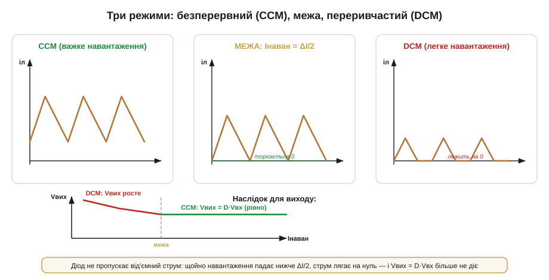
*Рис. 10.1.2.2. Зі зменшенням навантаження трикутник струму опускається. У CCM (важке навантаження) він увесь над нулем; на межі (Iнаван = ΔI/2) торкається нуля; у DCM (легке) лягає на нуль на частину циклу. Унизу — наслідок для виходу: у CCM напруга строго дорівнює D·Vвх, а в DCM вона **росте** й починає залежати від навантаження.*

DCM — не просто «той самий buck, але слабший». У ньому **ламається** наша чиста формула: Vвих більше не дорівнює D·Vвх, а **піднімається** й починає залежати від струму навантаження. Причина в тому, що з'явилася **третя фаза** (усі ключі зачинені, струм нульовий), і баланс вольт-секунд тепер ділиться інакше. На щастя, зворотний зв'язок це бачить і **зменшує D**, щоб утримати потрібний вихід, — тож зовні перетворювач і далі тримає 5 В. Але поводиться він у DCM інакше: інша динаміка контуру, інший спектр завад, інша ефективність.

> 🔧 **Навіщо це.** Той самий перетворювач на повному навантаженні (CCM) і в режимі очікування (DCM) — наче два різні пристрої. Тому, рахуючи живлення «на холостому», не дивуйтеся, що ККД і поведінка інші: ви перейшли в DCM. А коли побачите, що вихід раптом «підріс» на дуже малому струмі, — це класична прикмета DCM.

### Пульсація вихідної напруги

Пульсація струму неминуче дає й **пульсацію напруги** на виході — адже змінна частина струму котушки тече у вихідний конденсатор, а той заряджається-розряджається. Розмах ΔVвих складають **дві** складові, і важливо розрізняти їх.

Перша — **ємнісна**: конденсатор має скінченну ємність, тож, ковтаючи трикутник струму, він трохи міняє напругу. Її оцінюють як:

```
ΔVвих (ємнісна) ≈ ΔI / (8 · f · C)
```

Друга — **на ESR**: реальний конденсатор має паразитний послідовний опір (*equivalent series resistance*, ESR), і пульсуючий струм створює на ньому пряме падіння:

```
ΔVвих (на ESR) = ΔI · ESR
```

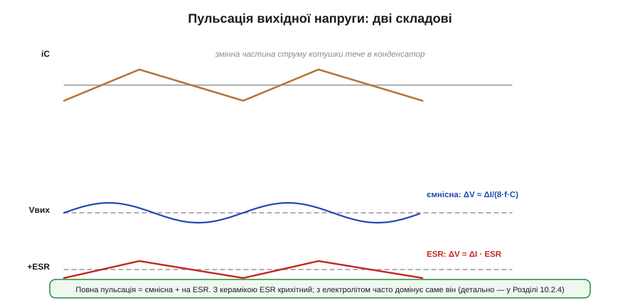
*Рис. 10.1.2.3. Змінна частина струму котушки тече в конденсатор і дає пульсацію напруги з двох складових: плавну **ємнісну** (∝ 1/C) і гостру **на ESR** (∝ ESR, у фазі зі струмом). Повна пульсація — їхня сума; форма залежить від того, хто домінує.*

Який доданок більший — залежить від типу конденсатора. У старих **електролітичних** ESR великий, і саме він зазвичай домінує: пульсація напруги повторює трикутник струму. У сучасній **кераміці** ESR мізерний, тож лишається переважно ємнісна, плавна складова. Це одна з причин, чому на виходи перетворювачів ставлять кераміку. Детальніше про вибір конденсатора за ESR і пульсацією — далі, у Розділі 10.2.4; тут досить розуміти, що пульсація виходу — це здебільшого пульсація струму, помножена на ESR (плюс трохи ємнісної).

### Синхронний випрямляч: діод геть, MOSFET натомість

Тепер — найбільше практичне вдосконалення buck. Згадаймо діод-черговий, що замикає струм котушки у фазі ВИКЛ. У нього є вада: він **завжди падає** 0.4–0.7 В (Шотткі — менше, але теж відчутно). А струм навантаження тече крізь нього більшу частину циклу. Помножимо падіння на струм — і дістанемо втрату P = Vf · Iсер, що цілком стає теплом.

При низькій вихідній напрузі це катастрофа. Робимо 1.2 В для процесора за струму 5 А: діод із падінням 0.5 В палить 0.5 × 5 ≈ 2.5 Вт, тоді як корисна потужність — 1.2 × 5 = 6 Вт. Діод сам із'їдає третину! Рятунок — **синхронний випрямляч** (*synchronous rectifier*): замінити діод **нижнім MOSFET** (§2.7.6), який вмикається саме тоді, коли мав би провідником бути діод.

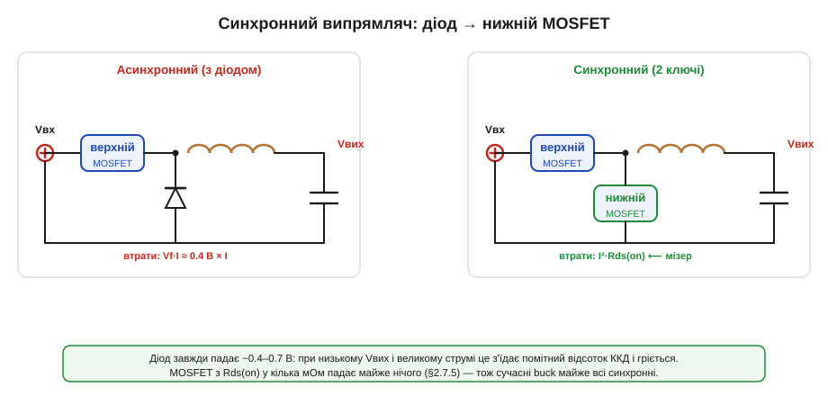
*Рис. 10.1.2.4. Уся різниця — у нижньому елементі. Зліва діод палить Vf·I (≈0.4–0.7 В × струм). Справа його місце займає нижній MOSFET: падіння тепер I·Rds(on), а Rds(on) у кілька міліом дає мізерну втрату (§2.7.5). Перетворювач стає двоключовим: верхній і нижній MOSFET перемикаються по черзі.*

Тепер падіння на нижньому елементі — це I · Rds(on), а Rds(on) силового MOSFET — лічені міліоми. У нашому прикладі замість 0.5 В падіння буде 5 А × 5 мОм = 0.025 В, а втрата — 0.125 Вт замість 2.5 Вт. Тому **майже всі сучасні buck-перетворювачі — синхронні**: на платі ви побачите два транзистори (або мікросхему з обома всередині) замість «котушка + діод».

> 🔧 **Навіщо це.** Побачили в перетворювачі діод Шотткі на виході — це **асинхронна** схема, простіша й дешевша, але з втратою на діоді; добра для малих струмів. Два MOSFET (чи інтегрований «power stage») — **синхронна**, ефективна на великому струмі й низькому Vвих. Вибір між ними — це компроміс «ціна проти ККД».

> 🔌 **ККД у числах — у вставці.** Наскільки саме діод поступається MOSFET (3.6 Вт проти 0.45 Вт, ~77 % проти ~96 % на 12 В → 1.2 В / 10 А), коли асинхронний усе ж доречний і які граблі в кожного — у компонентній вставці [🔌 Синхронний buck проти асинхронного](comp-sync-vs-async.md).

### Мертвий час: щоб не спалити вхід

За синхронний випрямляч доводиться платити новою турботою. Верхній і нижній MOSFET стоять **послідовно** між Vвх і землею. Якщо вони **обидва** відкриються бодай на мить — це пряме коротке замикання входу на землю крізь них, **наскрізний струм** (*shoot-through*). Він б'є лавиною й випалює ключі.

Щоб цього не сталося, драйвер лишає між їхніми імпульсами крихітну паузу, коли **обидва зачинені** — **мертвий час** (*dead time*).

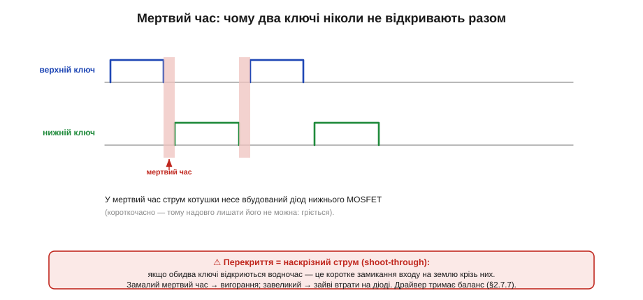
*Рис. 10.1.2.5. Імпульси верхнього й нижнього ключів — майже взаємодоповняльні, але між ними лишають мертвий час (рожеві зони), коли вимкнені обидва. У цей короткий проміжок струм котушки несе вбудований діод нижнього MOSFET. Перекриття імпульсів неприпустиме: це shoot-through — КЗ входу на землю.*

У мертвий час струм котушки нікуди не дівається (він не вривається миттєво — §2.2.5), тож його короткочасно несе **вбудований діод** (*body diode*) нижнього MOSFET — той самий p-n перехід, що завжди є в структурі транзистора. Звідси компроміс у налаштуванні мертвого часу: **замалий** — ризик shoot-through і вигорання; **завеликий** — вбудований діод працює довше, а він падає ті самі 0.7 В, що повертає нам втрати, яких ми позбувалися. Тому драйвери й мікросхеми ретельно дозують мертвий час, а швидкість перемикання впирається в заряд затвора (§2.7.7).

### Легке навантаження: гойдалка назад і пропуск імпульсів

Синхронний ключ дав ще один несподіваний наслідок — і добрий, і поганий. На відміну від діода, MOSFET проводить струм **в обидва боки**. У CCM на нормальному навантаженні це не проблема. Але на **легкому** навантаженні, коли струм котушки мав би впасти до нуля й зупинитися (як у діода в DCM), синхронний нижній ключ дозволяє йому піти **в мінус** — струм починає **даремно циркулювати** туди-сюди, ганяючи енергію по колу й гріючи ключі. Перетворювач у режимі «forced-PWM» чесно тримає сталу частоту, але марнує енергію саме там, де її найменше.

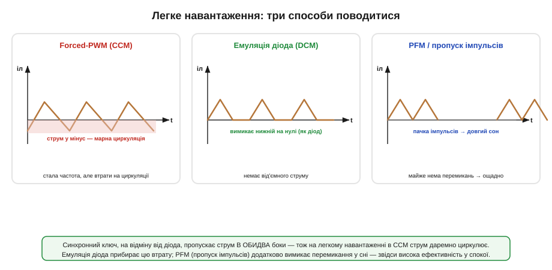
*Рис. 10.1.2.6. Forced-PWM (ліворуч): струм заходить у мінус — марна циркуляція. Емуляція діода (центр): нижній ключ вимикають, щойно струм досяг нуля, — як справжній діод, без від'ємного струму. PFM (праворуч): на дуже малому навантаженні перетворювач видає пачку імпульсів і засинає, поки конденсатор тримає вихід.*

Звідси два розумніші режими для легкого навантаження:

- **Емуляція діода** (*diode emulation*, форсований DCM): схема стежить за струмом і **вимикає нижній ключ, щойно струм дійшов нуля**, — точно імітуючи діод. Від'ємного струму немає, циркуляційна втрата зникає.
- **Пропуск імпульсів / PFM** (*pulse-frequency modulation*): на зовсім малому навантаженні перемикання саме по собі стає головною втратою (заряджати затвори, гойдати вузол перемикання — усе коштує енергії). Тож перетворювач видає **пачку** імпульсів, підзаряджає конденсатор — і **засинає**, доки вихід трохи просяде; тоді прокидається на нову пачку. Перемикань у рази менше — ефективність у спокої злітає.

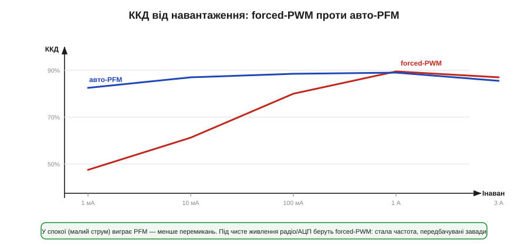
*Рис. 10.1.2.7. На середньому й великому навантаженні обидва режими тримають високий ККД. Але на малому струмі forced-PWM провисає (перемикання й циркуляція з'їдають усе), а авто-PFM лишається високим, бо майже не перемикає. Ціна PFM — змінна частота й більша пульсація.*

Здавалося б, PFM завжди кращий — але ні, і тут криється інженерний вибір. PFM має **змінну частоту** й більшу пульсацію виходу, а отже, «брудніший» спектр завад, що може зіпсувати радіо чи покази АЦП. Forced-PWM натомість тримає **сталу, передбачувану частоту** — його завади легко відфільтрувати. Тому багато мікросхем мають вивід вибору режиму: **авто-PFM** для максимальної автономності в спокої або **forced-PWM** для чистого живлення чутливих вузлів.

> 🔧 **Навіщо це.** Це прямий компроміс «час роботи від батареї проти чистоти живлення». Пристрій, що довго дрімає, виграє від PFM (менше з'їдає в спокої). А ось шину для радіоприймача чи аналогового давача варто тримати у forced-PWM — стала частота завад передбачувана й тиха після фільтра. Один вивід мікросхеми вирішує, що вам важливіше тут.

### Підсумок теми

Знижувальний перетворювач у деталях — це чотири практичні питання. **Пульсація струму** ΔI = (Vвх−Vвих)·D/(L·f) задається котушкою й частотою; її цілять у 30–40 % навантаження. На **легкому навантаженні** перетворювач переходить із безперервного режиму (CCM, де Vвих = D·Vвх) у переривчастий (DCM, де струм лягає на нуль і чиста формула ламається) — межа на Iнаван = ΔI/2. **Пульсація виходу** — це переважно ΔI на ESR конденсатора плюс ємнісна складова. **Синхронний випрямляч** міняє лосівний діод на нижній MOSFET (втрата I²·Rds(on) замість Vf·I), але вимагає **мертвого часу** проти наскрізного струму, а на легкому навантаженні — режимів **емуляції діода** чи **PFM**, щоб не марнувати енергію на циркуляцію та перемикання. Тепер, знаючи buck до дна, перейдімо до його дзеркального брата — підвищувального перетворювача (boost), де та сама котушка віддаватиме напругу **вищу** за вхідну.

---

## 10.1.3 Boost: підняти напругу

Buck знижував напругу — це інтуїтивно: рубаємо вхід на шматочки й усереднюємо менше. А тепер протилежна, на перший погляд парадоксальна задача: дістати на виході напругу **вищу**, ніж на вході. З однієї батарейки 3.7 В зробити 5 В для USB; з 5 В — 12 В для давача. Звідки взятися «зайвим» вольтам?

Одразу заспокоїмо інтуїцію: дарма́ нічого не береться. Енергію не порушено — boost **міняє струм на напругу**: піднімаючи напругу вдвічі, він удвічі зменшує доступний струм (потужність на вході ≈ потужність на виході). А механізм цього обміну — старий знайомий: **«брикання» котушки** (§2.2.5), той самий викид, що колись псував нам ключі. У boost його приборкано й поставлено на службу. Але разом із корисним трюком boost несе й підступну ваду, яку мусить знати кожен, хто його ставить, — тож дійдемо й до неї.

### Дві фази: накопичити, тоді «підкинути»

Розкладка boost інша, ніж у buck: котушка стоїть **першою**, одразу за входом, а ключ кидає її вільний кінець на землю. Дві фази працюють так:

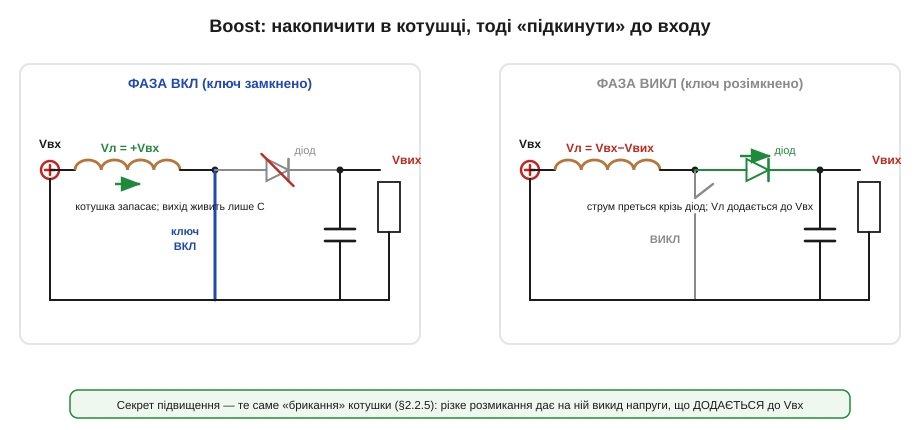
*Рис. 10.1.3.1. Фаза ВКЛ: ключ замикає кінець котушки на землю, до неї прикладено всю Vвх — струм наростає, котушка запасає енергію; діод при цьому закритий, а вихід живить лише конденсатор. Фаза ВИКЛ: ключ розмикається, та струм котушки не уривається — він преться крізь діод у вихід, і напруга котушки тепер додається до Vвх, тож вихід бачить більше за вхід.*

- **Фаза ВКЛ** (ключ замкнено): вільний кінець котушки сидить на землі, тож до неї прикладено всю вхідну напругу, Vл = +Vвх. Струм лінійно наростає, котушка **запасає** енергію магнітного поля (§2.2.3). Діод у цей час **закритий** (вихід стоїть вище, ніж вузол перемикання), і навантаження живиться самим вихідним конденсатором.
- **Фаза ВИКЛ** (ключ розімкнено): струмові котушки нема куди подітися, окрім як крізь **діод** у вихід. Тепер котушка ввімкнена **послідовно** з джерелом, і її викид напруги **додається** до Vвх — вихід отримує Vвх плюс «брикання». Напруга на котушці стала від'ємною: Vл = Vвх − Vвих (бо Vвих > Vвх).

Образно: у фазі ВКЛ ми **розганяємо** струм у котушці, запасаючи в ній енергію; у фазі ВИКЛ — різко «відпускаємо» його туди, де він додається до входу. Котушка працює помпою, що накачує енергію на вищий рівень порціями.

Звідки ж беруться «зайві» вольти? Ключ у тому, що у фазі ВИКЛ котушка перетворюється на **джерело напруги, увімкнене послідовно з батареєю**. Згадаймо §2.2.5: котушка так чинить опір зміні струму, що готова сама створити будь-яку напругу, аби струм не урвався. Коли ключ розмикається, вона «бачить» спробу обнулити струм — і виставляє рівно таку напругу свого «брикання», щоб проштовхнути той самий струм далі, у вихід. Ця напруга додається до Vвх послідовно, як дві батарейки в ряд, — і вихід піднімається вище за вхід. Вищий вихід вимагає більшого «брикання», тобто крутішого спаду струму, — а його забезпечують довшою фазою ВКЛ (більшим D). Ось чому що більший D, то вища напруга.

### Закон дає коефіцієнт: Vвих = Vвх/(1−D)

Жодних нових формул запам'ятовувати не треба — застосуймо вольт-секундний баланс із §10.1.1. Напишемо напругу на котушці у двох фазах і прирівняймо вольт-секунди до нуля:

```
фаза ВКЛ (частка D):    Vл = Vвх
фаза ВИКЛ (частка 1−D): Vл = Vвх − Vвих

баланс (сума вольт-секунд = 0):
   Vвх · D  +  (Vвх − Vвих) · (1 − D)  =  0
   Vвх · D  +  Vвх − Vвих − Vвх·D + Vвих·D  =  0
   Vвх − Vвих · (1 − D)  =  0
   ⇒  Vвих = Vвх / (1 − D)
```

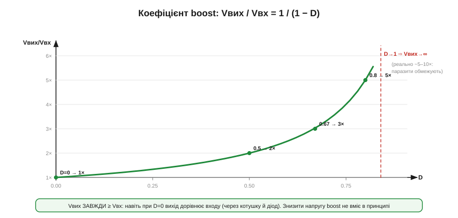
*Рис. 10.1.3.2. Vвих/Vвх = 1/(1−D). При D=0 вихід дорівнює входу, при D=0.5 — подвоюється, при D=0.8 — уп'ятеро, а коли D наближається до одиниці, коефіцієнт теоретично злітає в нескінченність. На практиці паразитні опори обмежують реальне підвищення приблизно 5–10 разами. Головне: Vвих **завжди ≥ Vвх** — нижче входу boost не вміє.*

Формула одразу пояснює характер boost. При D=0 (ключ ніколи не вмикається) Vвих = Vвх — тобто навіть «нічого не роблячи», boost пропускає вхід на вихід. Зі зростанням D вихід росте, а біля D→1 теоретично прямує в нескінченність — насправді ж паразитні опори котушки й ключа зрізають реальну стелю до ~5–10×.

**Приклад (boost із літію в USB).** Одна банка LiPo (3.7 В номінал) → 5 В:

```
Vвих = Vвх / (1 − D)   ⇒   1 − D = Vвх / Vвих = 3.7 / 5 = 0.74
   D = 0.26   (ключ відкрито 26% циклу)

струм: при ККД ≈ 90% віддати 5 В × 1 А = 5 Вт
   треба з входу  ≈ 5 / 0.9 / 3.7 ≈ 1.5 А
   тобто вхідний струм у ~1.5 раза більший за вихідний
```

Останній рядок — важливий: boost **піднімає напругу, але опускає струм**. Котушка несе весь цей більший **вхідний** струм (Iвх = Iвих/(1−D)), і саме під нього її добирають, а не під вихідний.

Це знайома логіка «перетворювача як DC-трансформатора», яку ми вже бачили для buck (§7.4.2), лише обернена. Buck був схожий на трансформатор, що знижує напругу й піднімає струм; boost — на той, що **підвищує напругу й знижує струм**. В обох потужність майже не змінюється (енергію ж не порушено), просто перерозподіляється між «вольтами» й «амперами». Тому, проєктуючи boost, завжди звіряйтеся з боку входу: щоб віддати скромні 5 Вт на підвищеній напрузі, перетворювач може смоктати з низьковольтної батареї помітно більший струм — і це б'є по дротах, роз'ємах і самій батареї (просадка під навантаженням — §7.4.5).

Звідси й практична стеля коефіцієнта. Теоретично D→1 дає нескінченне підвищення, та в житті вище ~5–10× boost ідуть рідко, і ось чому. По-перше, зі зростанням D вхідний струм Iвх = Iвих/(1−D) злітає — а на ньому паразитні опори (котушки, ключа, дроту) палять усе більше, тож ККД помітно падає. По-друге, ключ і діод мусять витримувати повну вихідну напругу, яка тим часом росте. По-третє, чим ближче D до одиниці, то менше лишається часу фази ВИКЛ, щоб устигнути перекинути всю накопичену енергію у вихід. Тому глибоке підвищення роблять не одним boost, а інакше — двокаскадно або іншою топологією.

> 🔧 **Навіщо це.** Boost усюди, де джерело нижче за потрібну напругу: одна банка літію (3.0–4.2 В) → стабільні 5 В; живлення ланцюжка світлодіодів, яким сумарно треба десятки вольт; підсвітка, біас давачів, невеликі високовольтні шини. Скрізь тут діє те саме правило: дивіться на **вхідний** струм і пам'ятайте, що такий вузол не знизить напругу й не захистить себе від КЗ — це визначає і добір котушки, і потребу в зовнішньому роз'єднувачі.

### Вхід гладкий, вихід рваний

У boost є ще одна риса, дзеркальна до buck, і її варто бачити. Котушка тут стоїть на **вході** й проводить струм **безперервно** — тож вхідний струм гладкий, що добре для джерела й для завад. А от **вихід** дістає струм лише у фазі ВИКЛ, коли відкривається діод, — імпульсами.

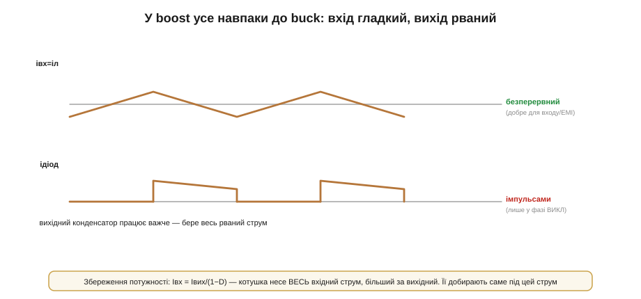
*Рис. 10.1.3.3. У buck безперервним був вихідний струм, а вхідний — рваним; у boost усе навпаки. Вхідний (він же котушковий) струм гладкий, а у вихід енергія йде ривками — лише поки відкритий діод. Тому вихідний конденсатор у boost працює важче й має ковтати весь цей рваний струм.*

> 🔧 **Навіщо це.** Дві практичні поради добору. Котушку boost рахують під **вхідний** струм (він більший за вихідний — Iвх = Iвих/(1−D)), інакше вона насититься. А вихідний конденсатор боїться рваного струму — туди ставлять якісну кераміку з низьким ESR і добрим запасом за пульсаційним струмом, бо весь діодний імпульс лягає на нього.

### Чому boost вредніший у керуванні

Є в boost і тонкість, через яку його зворотний зв'язок налаштовувати важче, ніж у buck, — і зрозуміти її можна суто на пальцях, без жодної теорії керування. Уявіть, що навантаження зросло й вихід просів — контролер хоче його **підняти**. Природний хід: збільшити шпаруватість D. Але згадаймо, що каже довша фаза ВКЛ: довше ключ тримає котушку на землі, а в цей час вихід **відрізаний** від котушки й живиться **лише конденсатором**. Тобто, збільшивши D, контролер у перший момент не підняв вихід, а **ще дужче його просадив** — і аж потім, коли накопичена в котушці енергія ринула у вихід, напруга пішла вгору.

Виходить «зворотна реакція»: правильна дія дає спершу неправильний, протилежний результат, а потрібний — із запізненням. Така система схильна **розгойдуватися**, тож контур boost навмисно роблять повільнішим і обережнішим, ніж у buck. Нам не доведеться це рахувати (класичні діаграми стійкості свідомо поза курсом — повернемося до здорового критерію «реакція на стрибок без дзвону» у Розділі 10.2.5), але корисно знати причину: якщо boost на платі схильний дзвеніти на перехідних, винна саме ця вроджена «вредність» підвищувальної топології, а не лише погані номінали.

### Чому boost не можна вимкнути: прозорість для КЗ

А тепер — найважливіша практична засторога цієї теми, та сама вада. Придивіться до схеми boost: від входу до виходу веде ланцюжок **Vвх → котушка → діод → вихід**. І цей ланцюжок існує **завжди** — він не проходить крізь ключ. Хоч би що робив контролер зі своїм транзистором, котушка з діодом лишаються прямим дротом від входу до виходу.

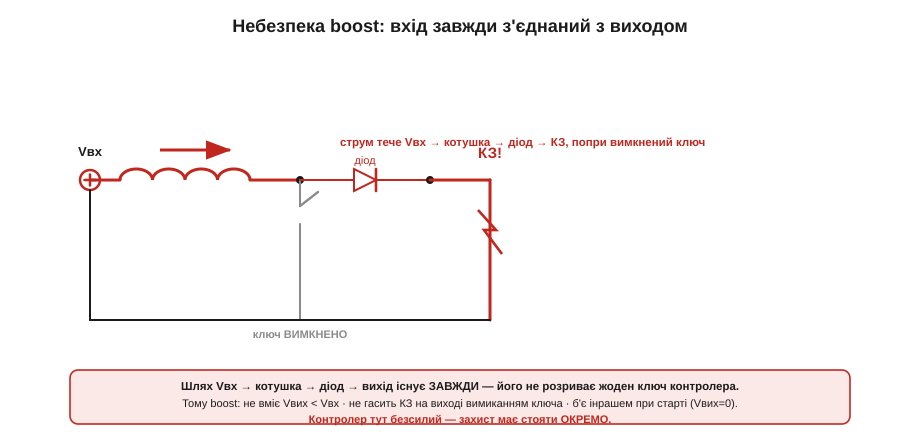
*Рис. 10.1.3.4. Шлях Vвх → котушка → діод → вихід не розриває жоден ключ контролера. Тому замкніть вихід — і струм поллється просто з входу крізь котушку й діод у коротке замикання, навіть коли ключ вимкнено. Контролер не може цьому зарадити: його транзистор стоїть збоку від цього шляху.*

З цього випливають **три** наслідки, кожен із яких кусає на практиці:

1. **Boost не вміє знизити напругу.** Навіть при D=0 вихід дорівнює входу (через ту саму котушку й діод). Якщо вхід раптом підскочив вище за ціль — boost безсилий його опустити.
2. **Boost не гасить КЗ на виході.** Замкнули вихід — і вимикання ключа **нічого не дає**: вхід жене струм крізь котушку й діод у коротке замикання, обмежений лише опором джерела й дроту. Прикиньмо в числах: джерело 5 В, а весь шлях (опір котушки + діод + дроти) — якісь 0.1 Ом. Тоді струм КЗ ≈ 5 / 0.1 = **50 А** — у рази понад розрахунок діода й котушки, тож вони згоряють за мить. Контролер тут безсилий: його транзистор стоїть осторонь цього шляху.
3. **Boost б'є інрашем при старті.** У момент увімкнення вихід ще на нулі, тож вихідний конденсатор заряджається крізь котушку й діод одним великим кидком струму.

> 🔧 **Навіщо це.** Запам'ятайте як аксіому: **boost не захищає власний вихід**. Ніколи не розраховуйте, що «контролер вимкне ключ і врятує від КЗ» — він не врятує. Якщо вашому пристрою потрібен захист виходу від замикання чи можливість його знеструмити — це доведеться будувати окремо.

### Що з цим робити

Раз сам boost вихід не захистить, захист **додають зовні**:

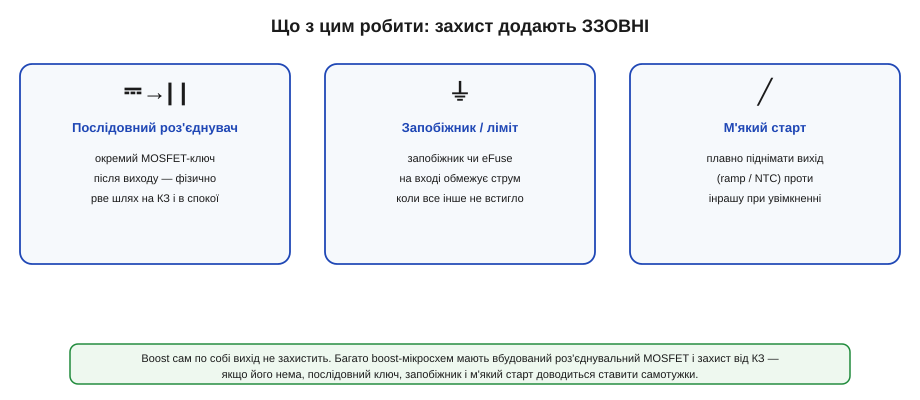
*Рис. 10.1.3.5. Три типові засоби: послідовний ключ-роз'єднувач (окремий MOSFET, що фізично рве шлях на КЗ і в режимі спокою), запобіжник чи eFuse на вході (обмежує струм, коли все інше не встигло), і м'який старт проти інрашу. Багато boost-мікросхем уже містять роз'єднувальний MOSFET — варто перевірити даташит.*

- **Послідовний роз'єднувач** (*disconnect / load switch*): окремий MOSFET після виходу, який можна **фізично розімкнути** при аварії чи в режимі спокою — він і рве шлях для КЗ.
- **Запобіжник чи eFuse на вході**: остання лінія, що обмежує струм, коли захист не встиг.
- **М'який старт** (*soft-start*): плавно піднімати вихід при ввімкненні (ramp, NTC чи поступове відкривання послідовного ключа), щоб прибрати інраш.

Багато сучасних boost-мікросхем уже містять вбудований роз'єднувальний MOSFET і захист від КЗ — тоді половина цих турбот знята. Але якщо чип «голий», усе перелічене лягає на плечі розробника.

### Підсумок теми

Boost підвищує напругу, ставлячи собі на службу «брикання» котушки: у фазі ВКЛ котушка запасає енергію під напругою Vвх, у фазі ВИКЛ її викид додається до входу й преться крізь діод у вихід. Вольт-секундний баланс дає Vвих = Vвх/(1−D) — вихід завжди не нижчий за вхід, а коефіцієнт злітає при D→1 (реально до ~5–10×). Boost міняє напругу на струм (Iвх більший за Iвих, котушку рахують під вхідний струм), має гладкий вхідний струм і рваний вихідний. Але через постійний шлях Vвх → котушка → діод → вихід він **не вміє знизити напругу, не гасить КЗ на виході й б'є інрашем** — тож роз'єднувач, запобіжник і м'який старт додають зовні. Маючи buck (вниз) і boost (вгору), напрошується питання: а що, коли вхід **гуляє навколо** виходу — то вище, то нижче? Це робота наступної топології — buck-boost.

---

## 10.1.4 Buck-boost і інвертування: коли вхід «гуляє» навколо виходу

Buck знижує, boost підвищує — а що робити, коли вхідна напруга то **вища**, то **нижча** за потрібну? Це не надуманий випадок, а найпоширеніша ситуація в портативній техніці.

### Проблема однієї банки

Уявіть найзвичайніше: пристрій живиться від **однієї банки** літій-полімерного акумулятора, а його логіці потрібні стабільні **3.3 В**. Свіжозаряджена банка дає ≈ 4.2 В, розряджена — ≈ 3.0 В (§7.4.4), і за час роботи її напруга повільно сповзає крізь увесь цей діапазон.

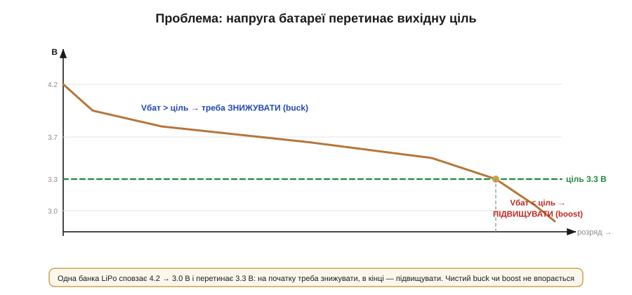
*Рис. 10.1.4.1. Напруга банки LiPo сповзає 4.2 → 3.0 В і десь посередині перетинає цільові 3.3 В. На початку розряду вхід вищий за ціль — треба **знижувати** (buck); під кінець нижчий — треба **підвищувати** (boost). Чистий buck відмовить, коли банка сяде нижче 3.3 В; чистий boost — поки вона ще свіжа. Потрібен перетворювач, що вміє і те, й те.*

Ось і вся проблема: на початку 4.2 В треба **знизити** до 3.3, а під кінець 3.0 В треба **підняти** до тих самих 3.3. Десь посередині вхід проходить рівно через ціль. Жоден чистий buck (він не підніме) і жоден чистий boost (він не опустить) не покриє весь розряд. Потрібна топологія, що робить **обидва** напрямки — **buck-boost**.

Чи не можна цю проблему обійти? Спокуса є, але всі обхідні шляхи погані. Живити логіку **прямо від банки** не вийде: її напруга не лише сповзає, а й просідає під навантаженням (§7.4.5), і на кожній просадці нижче порога контролер ловив би brownout. **Лінійний стабілізатор** (LDO) теж не рятує — він уміє лише знижувати, тож відмовить, щойно банка сяде до ≈3.3 В, відрізавши всю нижню половину розряду. **Тільки buck** змарнує всю енергію, що лишилася в банці нижче 3.3 В, — а на пласкій кривій LiPo це чималий запас, тобто помітно коротший час роботи. Buck-boost же **вичавлює банку до кінця**: тримає 3.3 В і коли вона свіжа, і коли майже сіла. Тому в портативній техніці це робоча конячка, а не екзотика.

### Інвертувальний buck-boost: класика з підступом

Найпростіший buck-boost будують усього з одного ключа, котушки й діода — але з'єднаних так, що котушка стає **єдиним містком** між входом і виходом: напряму вони не з'єднані ніколи.

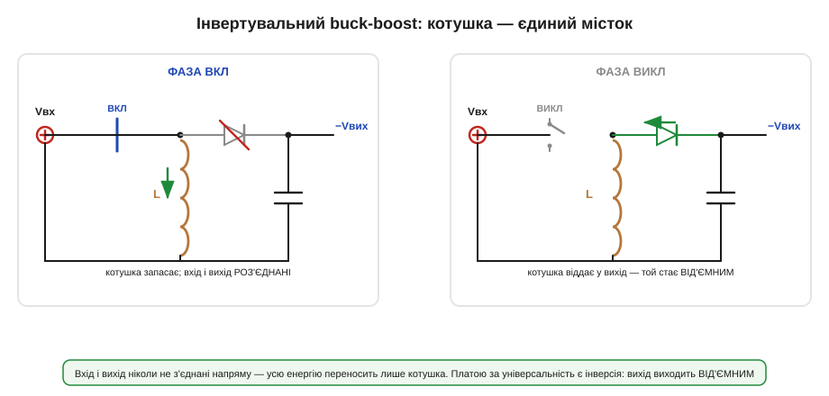
*Рис. 10.1.4.2. Фаза ВКЛ: ключ під'єднує котушку прямо до Vвх — вона запасає енергію, а вихід відрізаний (діод закритий) і живиться конденсатором. Фаза ВИКЛ: ключ розмикається, і струм котушки, не маючи куди подітися, тече крізь діод у вихід — але в такому напрямку, що вихідний вузол стає ВІД'ЄМНИМ. Вхід і вихід ніколи не з'єднані напряму: усе переносить котушка.*

Працює це так. У фазі ВКЛ ключ кладе котушку прямо на вхід (Vл = +Vвх), вона запасає енергію, а вихід тим часом відрізаний діодом і живиться конденсатором. У фазі ВИКЛ ключ розмикається, і струм котушки преться крізь діод у вихід — але через спосіб під'єднання він заганяє у вихідний вузол **від'ємний** заряд.

Звідки інверсія? Уся справа в **напрямку струму котушки**, який, ми пам'ятаємо, миттєво не змінюється. У фазі ВКЛ струм тече крізь котушку «згори вниз», із вузла перемикання на землю. Коли ключ розмикається, цей струм мусить текти в тому ж напрямку — а єдиний шлях для нього тепер веде крізь діод **із виходу** до котушки. Тобто струм **витікає** з вихідного вузла, висмоктуючи з нього заряд, — і вузол стає від'ємним відносно землі. Котушка тут — справді єдиний місток: у фазі ВКЛ її «заряджає» вхід, у фазі ВИКЛ вона «розряджається» у вихід, і ці два кола ніколи не з'єднані прямо, тому вихід вільний стати будь-якої полярності — а геометрія робить його від'ємним.

Застосуймо вольт-секундний баланс (§10.1.1): Vвх·D + Vвих·(1−D) = 0, звідки:

```
|Vвих| = Vвх · D / (1 − D)
```

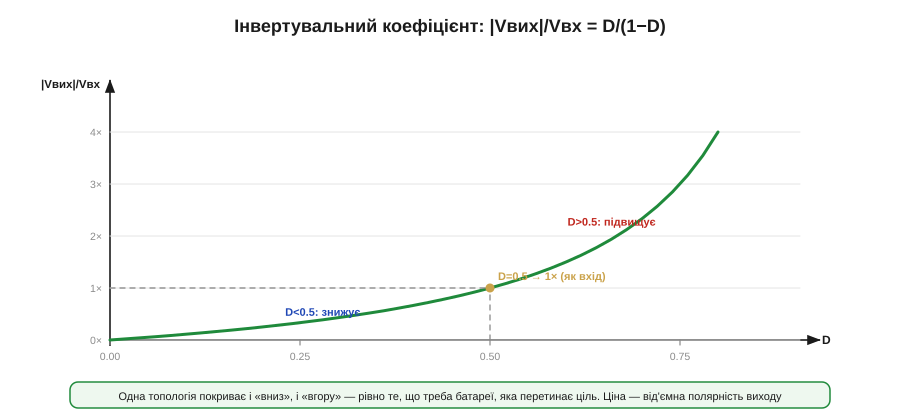
*Рис. 10.1.4.3. |Vвих|/Vвх = D/(1−D). При D < 0.5 модуль виходу менший за вхід (знижує), при D = 0.5 дорівнює входу, при D > 0.5 більший (підвищує). Одна топологія покриває обидва напрямки — рівно те, що треба батареї, яка перетинає ціль.*

Ось і універсальність: при D < 0.5 перетворювач знижує, при D > 0.5 підвищує, а на D = 0.5 віддає рівно вхід. Одна схема — обидва напрямки. Але є **підступ**, схований у назві: вихід виходить **від'ємним**. Для додатних 3.3 В з батареї це не годиться напряму.

За простоту однієї схеми платять напругою на деталях. У цій топології ключ і діод мусять витримувати **суму** напруг — Vвх + |Vвих| (у фазі, коли вони закриті, до них прикладено і вхід, і вихід одразу). Тому вже за помірних напруг компоненти треба брати з добрим запасом. Та й струм тут рваний з **обох** боків (ні вхід, ні вихід не мають котушки, що проводить безперервно), тож конденсатори потрібні і на вході, і на виході. Це ціна того, що вся енергія йде через єдину котушку «транзитом».

**Приклад (від'ємна шина).** Зробити −12 В із 5 В (живлення, скажімо, аналогового вузла):

```
|Vвих|/Vвх = D/(1−D) = 12/5 = 2.4
   D/(1−D) = 2.4  ⇒  D = 2.4/3.4 ≈ 0.71
```

> 🔧 **Навіщо це.** Інвертувальний buck-boost — класичний спосіб дістати **від'ємну** шину (−5 В, −12 В для операційних підсилювачів, давачів, дисплеїв) одним ключем і однією котушкою. І, на відміну від boost, вхід із виходом тут не з'єднані напряму — тож така схема **вміє** розірвати шлях і захиститися від КЗ. А для додатної шини з батареї потрібен інший варіант.

### Неінвертувальний 4-ключовий: відповідь батареї

Щоб дістати **додатний** вихід і вгору, і вниз, сучасні перетворювачі ставлять **чотири** ключі (два півмости) довкола однієї котушки.

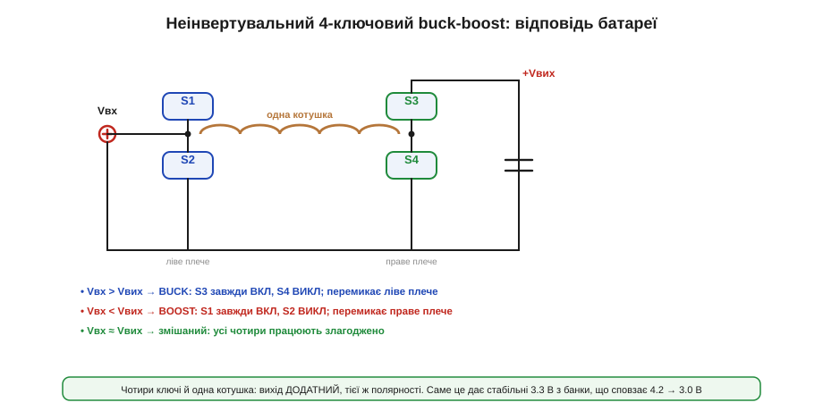
*Рис. 10.1.4.4. Чотири ключі й одна котушка. Залежно від співвідношення Vвх і Vвих схема працює у трьох режимах: як buck (перемикає ліве плече, праве тримає прохід), як boost (перемикає праве плече, ліве тримає прохід) або у змішаному режимі, коли вхід близький до виходу. Вихід при цьому ДОДАТНИЙ, тієї ж полярності, що й вхід.*

Хитрість у тому, що ці чотири ключі **перевзуваються** залежно від ситуації:

- **Vвх > Vвих** (банка свіжа): права пара тримає наскрізний прохід, а ліве плече перемикає — і схема працює чистим **buck**, знижуючи напругу.
- **Vвх < Vвих** (банка сіла): ліва пара тримає прохід, а праве плече перемикає — це чистий **boost**, що підвищує.
- **Vвх ≈ Vвих** (банка проходить ціль): усі чотири ключі працюють злагоджено в **змішаному** режимі.

Саме це й дає стабільні 3.3 В із банки, що сповзає 4.2 → 3.0 В. Тонке місце — **перехідна зона** біля Vвх ≈ Vвих: контролер мусить плавно передати естафету від buck-режиму до boost-режиму, бо різкий стрибок дав би провал чи дзвін на виході. Добрі мікросхеми роблять цей перехід непомітним; нам досить знати, що ця зона — найделікатніша.

Є тут і плата за універсальність — **ефективність**. Що більше ключів водночас перемикається, то більше втрат на перемиканні (§2.7.7). Тому в чистих buck- чи boost-режимах, де працює лише одне плече, 4-ключовий перетворювач майже не поступається звичайному buck чи boost; а от у змішаній зоні, де клацають усі чотири ключі, його ККД найнижчий. Тому добрі контролери намагаються **проскочити** цю зону якнайшвидше й не сидіти в ній без потреби.

> 🔧 **Навіщо це.** 4-ключовий buck-boost — стандартна відповідь там, де вхід широкий, а вихід фіксований і **додатний**: одна банка → 3.3 чи 5 В; бортова мережа 5–15 В → стабільні 12 В. Платиться за це чотирма ключами замість одного й складнішим контролером — але інакше додатну шину «крізь ціль» не зробити.

### SEPIC якісно: вгору/вниз, додатний — і вмикається-вимикається

Є й третій шлях до «вгору-вниз із додатним виходом» — **SEPIC** (single-ended primary-inductor converter). Його варто знати **якісно**, бо він закриває слабке місце boost.

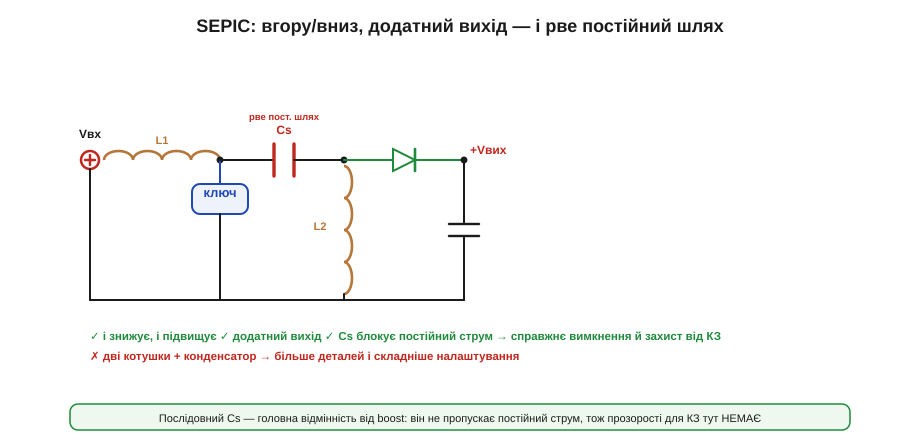
*Рис. 10.1.4.5. SEPIC: дві котушки (L1 на вході, L2 на землю) і **послідовний звʼязувальний конденсатор Cs** між ними, плюс ключ і діод. Вихід додатний, схема і знижує, і підвищує. Головне: Cs не пропускає постійний струм — тож, на відміну від boost, прямого шляху від входу до виходу НЕМАЄ.*

Ключова деталь SEPIC — **звʼязувальний конденсатор** Cs, увімкнений **послідовно** в шлях сигналу. Конденсатор не пропускає постійний струм (§2.1), а отже, того самого наскрізного шляху «вхід → котушка → діод → вихід», що робив boost прозорим для КЗ, тут **немає**: Cs його розриває. Тому SEPIC, на відміну від boost, **по-справжньому вимикається** й **переживає коротке замикання** на виході. До того ж вхідний струм у нього безперервний (котушка на вході), як у boost, — добре для завад. Коефіцієнт — boost-подібний, Vвих = Vвх·D/(1−D), але вихід **додатний** і розв'язаний по постійному струму.

Платою є складність: **дві** котушки (часто на спільному осерді) плюс конденсатор, що мусить витримувати весь робочий струм, — більше деталей і тонше налаштування, ніж у простих топологій. Спарені котушки на одному осерді — поширений варіант: вони економлять місце й допомагають «вести» пульсацію, але вимагають узгоджених обмоток. А звʼязувальний Cs пропускає крізь себе весь змінний струм, тож його беруть із добрим запасом за пульсаційним струмом, інакше він грітиметься й деградуватиме.

> 🔧 **Навіщо це.** SEPIC беруть, коли треба і вгору, і вниз, **додатний** вихід — і при цьому **захист виходу**, якого boost дати не може (широкий вхід, де КЗ на виході неприпустиме). Якщо ж захист не критичний, простіший boost чи 4-ключовий buck-boost зазвичай дешевші.

### Чотири топології поряд

Перш ніж зводити карту, помітьмо красиву річ. Коефіцієнти всіх чотирьох топологій — D у buck, 1/(1−D) у boost, D/(1−D) у buck-boost — ми **не вчили окремо**, а щоразу діставали з **одного** вольт-секундного балансу §10.1.1: писали напругу на котушці у двох фазах і прирівнювали площі. Один закон — і всі формули випадають самі. Це найкраще підтвердження того, навіщо ми починали розділ саме з нього: маючи цей інструмент, ви виведете коефіцієнт і незнайомої топології, не шукаючи його в довіднику.

Звівши все докупи, отримаємо карту, якою зручно вибирати:

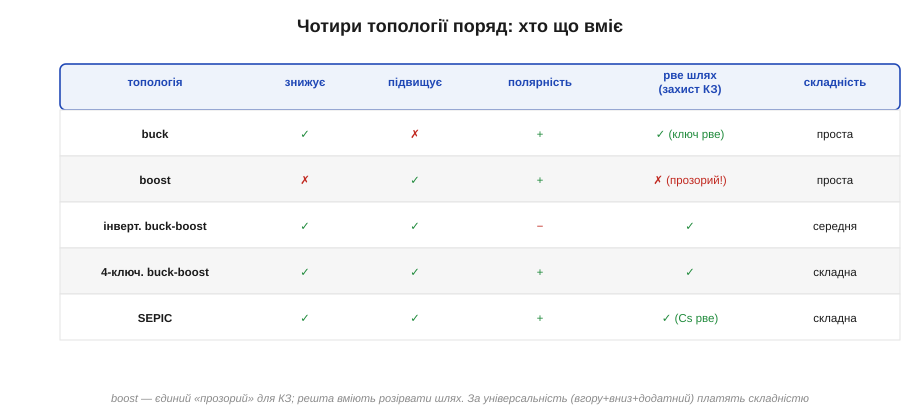
*Рис. 10.1.4.6. Buck знижує (додатний, захищає вихід); boost підвищує (додатний, але прозорий для КЗ); інвертувальний buck-boost робить обидва напрямки, та з від'ємним виходом; 4-ключовий — обидва з додатним виходом, але складний; SEPIC — обидва, додатний, із захистом завдяки Cs, теж складний. Видно головне: за універсальність платять складністю, а boost — єдиний, хто не вміє розірвати шлях до власного виходу.*

Як вибрати між трьома «універсалами»? Орієнтир простий. Якщо потрібна **від'ємна** шина — інвертувальний buck-boost: одна котушка, один ключ, дешево. Якщо потрібна **додатна** шина з широкого чи «гуляючого» входу, а захист виходу не критичний, — **4-ключовий** buck-boost: найкращий ККД у краях діапазону й найрозповсюдженіші готові мікросхеми. А якщо до додатного виходу додається вимога **справжнього вимкнення й захисту від КЗ** (наприклад, вхід від довгого кабеля чи бортмережі, де замикання на виході неприпустиме) — тоді SEPIC, попри зайві деталі, виправдовує себе. Часто рішення диктує не сам перетворювач, а **те, що навколо**: чи є де взяти захист, скільки місця на котушки, яка ціна.

### Підсумок теми

Коли вхід гуляє навколо виходу — класика тут одна банка LiPo, що сповзає 4.2 → 3.0 В крізь ціль 3.3 В, — потрібна топологія, здатна і знижувати, і підвищувати. Найпростіший **інвертувальний buck-boost** робить це одним ключем і котушкою (|Vвих| = Vвх·D/(1−D), D=0.5 — межа вниз/вгору), але дає **від'ємний** вихід — добре для негативних шин. Для додатної шини стандартом є **4-ключовий неінвертувальний** buck-boost, що перемикається між buck-, boost- і змішаним режимами, ціною чотирьох ключів і делікатної перехідної зони. **SEPIC** теж робить вгору/вниз із додатним виходом і, завдяки послідовному конденсатору Cs, навіть зберігає захист від КЗ — платою є дві котушки й конденсатор. Усі топології з котушкою ми пройшли; далі — несподіванка: перетворювач **узагалі без котушки**, на самих конденсаторах (charge pump).

---

## 10.1.5 Charge pump: перетворювач без котушки

Усі топології, які ми пройшли, трималися на котушці — енергетичному поромі, що приймав енергію порціями й переносив її на інший рівень напруги. Здавалося б, без неї перетворювача не буває. Та є ціла родина, яка обходиться **взагалі без котушки**, самими конденсаторами й ключами, — **зарядна помпа** (*charge pump*, конденсаторна помпа).

Навіщо відмовлятися від котушки, якщо вона так гарно працювала? Бо в неї є вади. Котушка — це **магнетика**: вона займає місце, коштує, має осердя, що може насититися, і випромінює магнітні завади. Для маленьких допоміжних шин усе це зайве. Кілька конденсаторів — дрібні, тихі, дешеві, без жодного витка дроту. За цю простоту платять двома обмеженнями, які ми й розберемо: помпа дає лише **малий струм** і ефективна лише поблизу свого «рідного» коефіцієнта. Але там, де ці обмеження не муляють, вона незамінна.

Помпи довкола нас частіше, ніж здається, — просто вони ховаються. Драйвер послідовного порту робить собі ± шини на десяток вольт саме помпою; flash-пам'ять піднимає помпою напругу стирання; дрібні екрани живлять із неї підсвіт і зсув. Усе це — тихо, без жодної котушки, на кількох конденсаторах розміром із рисове зерня. Розберімо, як це влаштовано.

### Летючий конденсатор: помпа без магнетики

Серце помпи — **летючий конденсатор** (*flying capacitor*), Cf. Ідея проста до краси: зарядити його в одній фазі, а в іншій **переставити** так, щоб його напруга додалася до входу або перевернулася. Розгляньмо найнаочніший приклад — **подвоювач** (*voltage doubler*).

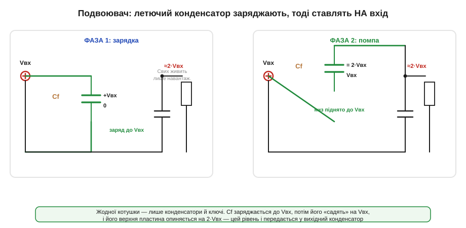
*Рис. 10.1.5.1. Фаза 1: летючий конденсатор Cf під'єднують до входу й заряджають до Vвх (нижня пластина на землі, верхня на Vвх). Фаза 2: нижню пластину «піднімають» до Vвх — і верхня, що тримає на собі ще Vвх, опиняється на 2·Vвх. Цей рівень передається у вихідний конденсатор. Жодної котушки — лише ключі перекидають конденсатор.*

Працює це у дві **неперекривні фази**, як і в перемикальних перетворювачів, тільки заряд тут гуляє між конденсаторами, а не крізь котушку:

- **Фаза 1 (зарядка):** Cf під'єднують паралельно входу — нижня пластина на землі, верхня на Vвх. Конденсатор заряджається до Vвх. Вихід тим часом живиться окремим вихідним конденсатором.
- **Фаза 2 (помпа):** нижню пластину Cf від'єднують від землі й **піднімають до Vвх**. А що на самому Cf напруга лишилася Vвх (заряд миттєво не зникає), його верхня пластина тепер сидить на Vвх + Vвх = **2·Vвх**. Її під'єднують до вихідного конденсатора — і той заряджається до подвоєної напруги.

Перекидаючи Cf туди-сюди десятки-сотні тисяч разів на секунду, помпа безперервно «накачує» вихід до 2·Vвх. Уся механіка — у ключах, що міняють під'єднання конденсатора; ніякого магнітного поля.

Є тут і своя тонкість, дзеркальна до мертвого часу синхронного buck (§10.1.2). Дві фази мусять бути **неперекривні** (*break-before-make*): спершу всі ключі однієї фази розмикаються, і лише потім замикаються ключі іншої. Інакше на мить виник би шлях, що замкнув би заряджений конденсатор просто на вхід чи землю, — марний струмовий удар і втрати. Тому контролер помпи, як і драйвер синхронного ключа, стежить, щоб фази не налазили одна на одну.

### Інверсія: −Vвх із кількох конденсаторів

Та сама ідея дає й **інверсію** — від'ємну напругу з додатної. Замість «підняти» заряджений Cf, його **перевертають**.

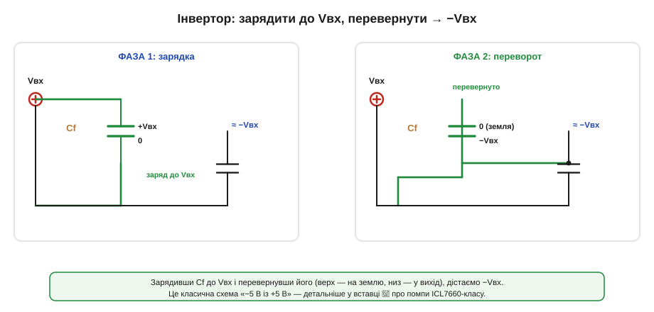
*Рис. 10.1.5.2. Фаза 1: Cf заряджається до Vвх. Фаза 2: його перевертають — верхню пластину садять на землю, і тоді нижня (що була на 0) опиняється на −Vвх. Цей від'ємний рівень передається у вихід. Так із +Vвх роблять −Vвх без жодної котушки.*

Логіка дзеркальна до подвоювача. У фазі 1 Cf набирає Vвх. У фазі 2 ту пластину, що була під напругою (+Vвх), з'єднують із **землею** — і оскільки на самому конденсаторі лишилася різниця Vвх, його друга пластина «провалюється» на **−Vвх**. Під'єднавши її до виходу, дістаємо від'ємну шину. Це і є знаменита схема **«−5 В із +5 В»**, яку колись зробив популярною чип ICL7660 — лиш кілька конденсаторів і жодної котушки.

> 🔌 **Готовий чип у вставці.** Як це виглядає на практиці — обв'язка, два-три конденсатори, типова розпіновка й «перший байт» помпи ICL7660-класу, що робить −5 В із +5 В, — розібрано у компонентній вставці [🔌 Помпи ICL7660-класу](comp-charge-pumps.md).

> 🔧 **Навіщо це.** Коли треба невелика **від'ємна** шина (живлення операційного підсилювача, зсув ЖК-дисплея) або **подвоєна** напруга для дрібної потреби, а тягнути заради цього котушку не хочеться — зарядна помпа дає це кількома конденсаторами. Її прикмета на платі: мікросхема без котушки, але з двома-трьома однаковими конденсаторами поруч.

### Дробові й інші коефіцієнти

Помпа не прив'язана до ×2 чи −1. Зарядивши **два** конденсатори послідовно (кожен набере по Vвх/2), а тоді переставивши їх **паралельно**, дістанемо Vвх/2 — знижувач. Складніші «драбини» дають ×1.5, ×3 та інші. Для великих кратностей конденсатори вмикають **каскадом**: класична схема Діксона (*Dickson*) передає заряд ланцюжком конденсаторів, додаючи по Vвх на кожному щаблі, — так роблять високу напругу програмування flash чи живлення дрібних дисплеїв із кількох вольт. Але є принципова відмінність від котушкових топологій: помпа має **дискретний набір** фіксованих коефіцієнтів (½, 1, 1.5, 2, 3, −1…), а не плавне регулювання шпаруватістю. Хочете рівно проміжне значення — доведеться або миритися з найближчим коефіцієнтом, або регулювати з втратами.

Регульовані помпи все ж існують: вони тримають заданий вихід, **пропускаючи** зайві такти перекидання (як пропуск імпульсів у §10.1.2) або плавно міняючи силу підкачки. Це дає стабільну напругу нижчу за кратне — ціною тієї самої «лінійної» втрати на різниці, про яку — нижче.

### Скільки струму: заряд пакетами

Тепер — перше з двох головних обмежень, те саме «межі за струмом». Скільки струму помпа може віддати? Подивімося, що вона фізично робить: щоцикл переносить **пакет заряду** з входу у вихід. Розмір пакета — це заряд, що вміщається в летючому конденсаторі за рахунок зміни напруги на ньому: Q = Cf·ΔV (згадаймо §2.1, Q = C·V). А пакетів за секунду стільки, яка частота перемикання, f. Отже, середній вихідний струм:

```
Iвих = Q · f = Cf · ΔV · f
```

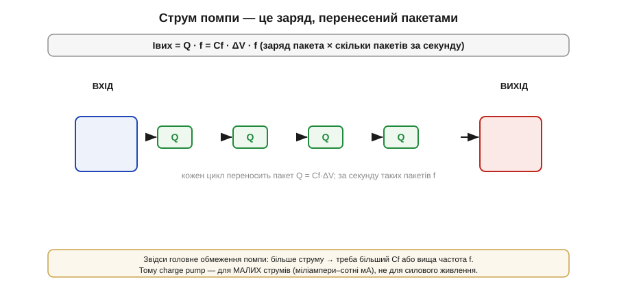
*Рис. 10.1.5.3. Помпа переносить заряд дискретними пакетами Q = Cf·ΔV, f разів на секунду. Тому її струм — це Cf·ΔV·f: щоб віддати більше, потрібен більший летючий конденсатор або вища частота. Це фундаментальна стеля, через яку помпи лишаються для малих струмів.*

Звідси видно, чим обмежений струм і як його піднімати: **більший Cf** або **вища f**. Але обидва важелі мають стелю — конденсатор не зробиш безмежно великим (місце, ціна), а частоту — безмежно високою (втрати на перемиканні зростають). Тому помпи живуть у діапазоні від міліампер до щонайбільше сотень міліампер. Для силового живлення вони не годяться — там панують котушкові топології.

**Приклад (струм помпи).** Летючий конденсатор Cf = 1 мкФ, припустима просадка напруги на ньому ΔV = 0.5 В, частота f = 100 кГц:

```
Iвих = Cf · ΔV · f = 1·10⁻⁶ · 0.5 · 100·10³
     = 1·10⁻⁶ · 0.5 · 1·10⁵ = 0.05 А = 50 мА
```

Хочете 100 мА — подвойте Cf або f. Хочете 5 А — забудьте про помпу, беріть buck чи boost.

### Чому в помпи взагалі є вихідний опір

Звідки береться той опір, через який помпа просідає? Відповідь глибша, ніж «опір ключів», і вона — найважливіше, що варто зрозуміти про помпи. Винна сама природа **перерозподілу заряду між конденсаторами**.

Згадаймо просту річ із §2.1: коли ви з'єднуєте заряджений конденсатор із незарядженим, заряд перетікає, доки напруги не зрівняються, — але частина енергії при цьому **неминуче втрачається**, і, що дивовижно, її кількість **не залежить** від опору з'єднання. Порахуймо ідеальний випадок: два однакові конденсатори C, один заряджений до V, другий на нулі. З'єднуємо — заряд ділиться, на обох встановлюється V/2. Енергія до: ½·C·V². Енергія після: два конденсатори по ½·C·(V/2)², разом ¼·C·V². **Половина енергії зникла** — розсіялася на струмовому сплеску, хоч би яким малим був опір.

```
до:    E = ½·C·V²
після: E = 2 · ½·C·(V/2)² = ¼·C·V²
втрата = ½·C·V² − ¼·C·V² = ¼·C·V²   (половина! — і не залежить від R)
```

Ось чому навіть «ідеальна» помпа з нульовим опором ключів усе одно поводиться так, ніби має вихідний опір: щоразу, перекидаючи летючий конденсатор на інший рівень, вона **зіштовхує** його з вихідним конденсатором, і на кожному такому зіткненні частина енергії згоряє. Чим більший Cf і вища f, тим менші **перепади** напруги на кожному зіткненні (заряд переносять дрібнішими порціями частіше) — тому й Rвих ≈ 1/(Cf·f). А головне — стає ясно, **чому котушка краща для потужності**: вона переносить енергію плавно крізь магнітне поле, без цих ударних зіткнень конденсаторів, і тому не має цієї вродженої втрати.

### Просадка й ефективність: помпа як джерело з опором

Друге обмеження — **ефективність**, і воно тонше. Через ту саму порційну природу помпа поводиться, як **ідеальне джерело n·Vвх із послідовним вихідним опором** Rвих ≈ 1/(Cf·f) (плюс опір ключів). Тобто під навантаженням її вихід **просідає**:

```
Vвих = n·Vвх − Iвих · Rвих,   де Rвих ≈ 1/(Cf·f)
```

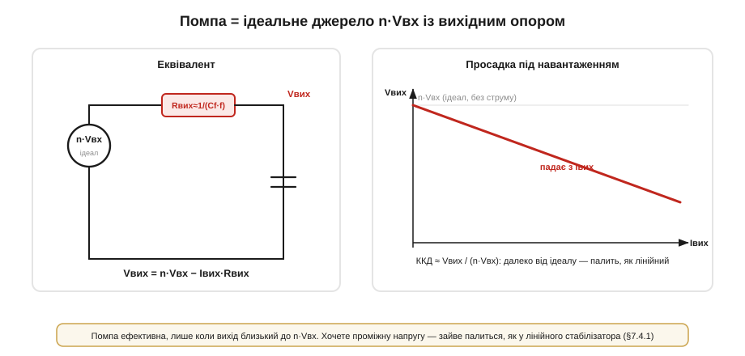
*Рис. 10.1.5.4. Помпу моделюють ідеальним джерелом n·Vвх із послідовним опором Rвих ≈ 1/(Cf·f). Тому під навантаженням вихід просідає тим сильніше, чим більший струм. А ефективність ≈ Vвих/(n·Vвх): коли вихід близький до ідеального кратного — добре; коли далеко — зайве палиться, як у лінійного стабілізатора.*

І ось ключовий наслідок для ККД. Ефективність помпи приблизно дорівнює **Vвих/(n·Vвх)** — відношенню реального виходу до ідеального кратного. Поки вихід близький до n·Vвх (помпа віддає рівно стільки, скільки «вміє»), вона ефективна. Але щойно ви хочете **проміжну** напругу — скажімо, регульовані 1.5·Vвх із подвоювача, що дає 2·Vвх, — різницю помпа гасить **так само, як лінійний стабілізатор** (§7.4.1), у тепло. У цьому прикладі чверть енергії — в нікуди.

Тому нерегульовані помпи працюють на **фіксованому** коефіцієнті (там вони ефективні), а регульовані додають керування (пропуск пакетів, модуляція), але платять ефективністю, коли вихід далекий від рідного кратного.

> 🔧 **Навіщо це.** Підбираючи помпу, **узгоджуйте її коефіцієнт із потребою**. Подвоювач, що робить рівно 2× для дрібного навантаження, — ефективний і доречний. А ось змушувати помпу видавати регульовані 1.5× — означає палити 25% дарма; там, де треба точна проміжна напруга з пристойним ККД, краще котушковий перетворювач.

### Де брати, а де ні

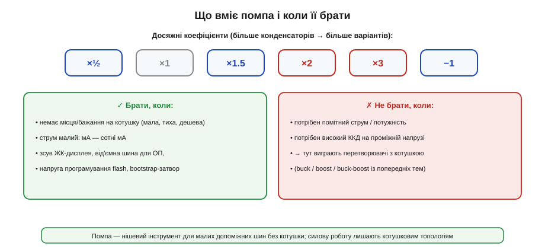
*Рис. 10.1.5.5. Помпа дає невеликий набір фіксованих коефіцієнтів (×½, ×1, ×1.5, ×2, ×3, −1). Брати її варто, коли немає бажання на котушку, струм малий, а потреба допоміжна (зсув ЖК, від'ємна шина для ОП, напруга програмування flash, bootstrap затвора). А де потрібен помітний струм чи високий ККД на проміжній напрузі — там виграють котушкові перетворювачі з попередніх тем.*

Звідси й чітка ніша. **Беріть помпу**, коли немає місця чи бажання на котушку (вона мала, тиха, дешева), струм малий (міліампери), а шина допоміжна: зсув ЖК-дисплея, від'ємна шина для операційного підсилювача, напруга програмування flash/EEPROM (VPP), дрібний підсвіт. Окремо варто згадати **bootstrap** — підкачку затвора верхнього MOSFET: щоб повністю відкрити верхній n-канальний ключ, на його затвор треба напругу **вищу** за шину, і крихітна вбудована помпа якраз її й робить. Тобто помпа часто ховається всередині інших перетворювачів — тих самих синхронних buck, де треба «підняти» затвор верхнього ключа над входом. **Не беріть помпу**, коли потрібен помітний струм, потужність або високий ККД на проміжній напрузі — там вона або не витягне струм, або палитиме зайве; це робота buck, boost і buck-boost із попередніх тем.

### Підсумок теми

Зарядна помпа — це DC-DC **без котушки**, на самих конденсаторах і ключах. Летючий конденсатор, заряджений в одній фазі й переставлений в іншій, дає подвоєння (×2), інверсію (−1), а складнішими драбинами — ½, 1.5, 3 та інші **фіксовані** коефіцієнти. Струм фундаментально обмежений переносом заряду пакетами, Iвих = Cf·ΔV·f, тож помпа — для міліампер, не для потужності. Поводиться вона як ідеальне джерело n·Vвх із вихідним опором ≈ 1/(Cf·f): просідає під навантаженням і ефективна лише поблизу свого рідного коефіцієнта, а на проміжній напрузі палить зайве, як лінійний стабілізатор. Тому помпа — нішевий інструмент для малих тихих допоміжних шин, де котушка зайва; силову роботу лишають котушковим топологіям. А далі ми повертаємося до котушки — але вже з **двома обмотками**: трансформатор додасть перетворювачу гальванічну розв'язку, і так народиться flyback.

---

## 10.1.6 Ізольовані топології: flyback

Усі перетворювачі, які ми пройшли, мали одну спільну рису: вхід і вихід ділили **спільну землю**. Струм заходив з одного дроту, виходив іншим, а опорний «нуль» був той самий по обидва боки. Для більшості вбудованих задач цього досить. Але часом цей спільний дріт треба **розірвати повністю** — і саме тут починаються ізольовані топології, а їхній головний представник — **flyback**.

Найгостріша причина розірвати землю — **мережа**. Уявіть зарядку телефона: з одного боку 230 вольт із розетки, з іншого — 5 вольт, до яких людина торкається пальцями й увіткненим роз'ємом. Якби ці 5 В ділили землю з мережею, будь-яка несправність могла б штовхнути смертельний струм у руки користувача. Між «брудними» 230 В і «чистими» 5 В має стояти стіна, крізь яку не пройде жоден електрон, — а енергія все одно мусить перетекти. Цю стіну й будує трансформатор: він зчіплює дві сторони **лише магнітним полем**, не маючи між ними жодного дроту.

### Навіщо розривати землю: гальванічна розв'язка

**Гальванічна розв'язка** (*galvanic isolation*) — це відсутність будь-якого електричного (струмопровідного) з'єднання між входом і виходом; зв'язок лишається тільки магнітний чи оптичний.


*Рис. 10.1.6.1. Дві сторони перетворювача мають **різні**, не з'єднані «землі», а між ними — бар'єр ізоляції. Енергію крізь нього передає лише магнітне поле трансформатора. Жоден дріт сторони не перетинає: фаза на первинній не може штовхнути струм у людину, що торкається вторинної.*

Розв'язка потрібна з трьох головних причин. **Перша — безпека:** зробити доступні 5 В із небезпечної мережі так, щоб несправність на первинному боці не дісталася користувача (саме тому в кожного адаптера всередині стоїть трансформатор, а не самий лише знижувач). **Друга — розрив контурів землі:** коли два пристрої з'єднані й сигнальними, і силовими дротами, по «землі» можуть текти паразитні струми та шуми; ізоляція рве це коло. **Третя — різні опорні рівні:** іноді вторинна сторона працює відносно зовсім іншого «нуля», ніж первинна, і з'єднати їхні землі просто не можна.

### Трансформатор як спарена котушка

Тут криється поширене непорозуміння. Трансформатор flyback — це **не** звичайний трансформатор, що передає енергію миттєво (як у мережевому трансформаторі на 50 Гц). Це **спарена котушка** (*coupled inductor*, §2.2.6): дві обмотки на спільному осерді, яке **запасає** енергію в одній фазі й **віддає** в іншій. По суті, це той самий buck-boost із §10.1.4, у якого єдину котушку розрізали на дві обмотки — і цим розрізом дістали ізоляцію.

Щоб осердя могло запасати помітну енергію, у нього навмисно роблять **повітряний зазор** (звичайний трансформатор зазору не має). А обмотки намотують у певному взаємному напрямку — за **конвенцією точок**, — так, щоб у фазі накопичення діод вторинної був замкнений і не випускав енергію передчасно.

Зазор тут — не дефект, а суть приладу, і варто зрозуміти чому. Звичайний трансформатор енергію передає миттєво й сам її майже **не запасає** — а якби запасав, його осердя швидко **насититься** (та сама межа, що псувала нам котушку при дисбалансі вольт-секунд у §10.1.1), індуктивність обвалиться, і струм піде врозніс. Flyback же мусить робити прямо протилежне — **накопичувати** енергію щоцикл. А щоб магнітне осердя могло запасти багато енергії, не насичуючись, у нього вставляють зазор: парадоксально, але більшість енергії «спареної котушки» живе саме в **повітряному проміжку**, а не в залізі. Тому без зазору flyback-трансформатор насправді не працював би як накопичувач — він би просто насичувався. Зазор перетворює трансформатор на котушку з двома обмотками.

### Дві фази: запасти, тоді відпустити


*Рис. 10.1.6.2. Фаза ВКЛ: ключ первинної замкнено, до первинної обмотки прикладено Vвх, струм наростає — осердя НАБИРАЄ енергію; діод вторинної закритий (точки обмоток протилежні), вихід живиться конденсатором. Фаза ВИКЛ: ключ розмикається — і запасена в осерді енергія «відлітає» у вторинну обмотку, відкриває її діод і вливається у вихід. Звідси й назва: flyback — «відліт».*

Робота — знову у дві фази, але тепер енергія тече між обмотками:

- **Фаза ВКЛ** (ключ первинної замкнено): до первинної обмотки прикладено Vвх, струм у ній лінійно наростає, а осердя **запасає** енергію магнітного поля (§2.2.3). Завдяки конвенції точок діод вторинної в цей час **закритий** — енергія накопичується, не виходячи; навантаження живить вихідний конденсатор.
- **Фаза ВИКЛ** (ключ розімкнено): струм первинної урвано, але запасена в осерді енергія мусить кудись подітися — і вона **«відлітає»** у вторинну обмотку. Там вона відкриває діод і вливається у вихідний конденсатор та навантаження. Це і є «flyback» — енергія вилітає у вторинну, коли первинну вимикають.

Це той самий принцип «запасти → віддати», що й у buck-boost, тільки накопичувач — спарена котушка, а вхід і вихід розведені по різні боки бар'єра. І керує всім, як завжди, вольт-секундний баланс §10.1.1: середня напруга на намагнічувальній індуктивності за цикл нульова.

### Важіль витків: майже будь-яке відношення

Розрізавши котушку на дві обмотки, ми задарма дістали **новий важіль**, якого не мали buck і boost, — **коефіцієнт витків** Ns/Np. Вихідна напруга flyback:

```
Vвих = Vвх · (Ns/Np) · D/(1−D)
```


*Рис. 10.1.6.3. У flyback напругою керують ДВА важелі. Коефіцієнт витків Ns/Np — груба шкала, задана конструкцією трансформатора: мало витків вторинної дає велике зниження (325 В мережі → 5 В одним трансформатором). Шпаруватість D — тонке підстроювання від контролера, що тримає вихід сталим. Разом вони дають майже будь-яке відношення напруг.*

Це величезна перевага. У buck коефіцієнт визначався самою лише шпаруватістю й не міг вийти за «вниз»; у boost — за «вгору». А тут **витки** беруть на себе основне відношення — хоч ×16 униз від мережі, хоч багатократне підвищення, — а шпаруватість лиш підправляє й стабілізує вихід. Тому flyback робить майже будь-яке перетворення: 325 В → 5 В, 12 В → 400 В, що завгодно — досить намотати потрібне число витків.

> 🔧 **Навіщо це.** Саме поєднання «велике відношення напруг + ізоляція в одному трансформаторі» зробило flyback королем мережевих адаптерів. Один компонент дає і зниження з сотень вольт до одиниць, і безпечний бар'єр. Конкуренти без трансформатора так не вміють.

### Зворотний зв'язок крізь бар'єр

Ізоляція створює тонку проблему, про яку легко забути. Контролер, що крутить шпаруватість, сидить на **первинній** стороні (там, де ключ і висока напруга). А напругу, яку треба стабілізувати, видно на **вторинній** стороні. З'єднати їх дротом — означало б **зруйнувати** ізоляцію, заради якої все й затівалося.

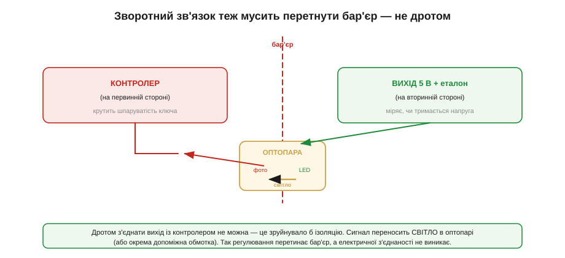
*Рис. 10.1.6.4. Контролер на первинній стороні мусить знати напругу з вторинної — але не дротом. Сигнал переносить ОПТОПАРА: світлодіод на вторинній світить на фототранзистор на первинній, і крізь бар'єр летить світло, а не струм. Так регулювання перетинає ізоляцію, не порушуючи її.*

Тому зворотний зв'язок переносять **без дроту** — найчастіше **оптопарою** (*optocoupler*): на вторинній стороні світлодіод світить тим яскравіше, чим вищий вихід, а на первинній фототранзистор ловить це світло. Крізь бар'єр летить **світло, а не струм** — електричної з'єднаності не виникає, ізоляція ціла. Інший спосіб — окрема **допоміжна обмотка** того ж трансформатора, що дає контролеру приблизну копію вихідної напруги.

> 🔧 **Навіщо це.** Оптопара поряд із трансформатором — вірна прикмета **ізольованого** перетворювача. Якщо бачите її на платі адаптера, знаєте: це канал зворотного зв'язку, яким вторинна сторона «доповідає» контролеру про напругу, не порушуючи бар'єра.

### Головний приклад: мережевий адаптер

Зберімо все в найвідоміший пристрій — зарядний «кубик».


*Рис. 10.1.6.5. Шлях у кожному адаптері: мережу 230 В випрямляють мостом і згладжують у ≈325 В постійних; flyback переганяє їх крізь трансформатор в ізольовані 5 В; вихідний діод і конденсатор згладжують; оптопара тримає рівень. Бар'єр ізоляції проходить крізь трансформатор і оптопару, розділяючи небезпечну й безпечну сторони.*

Ланцюг такий: змінні 230 В випрямляються мостовим випрямлячем і згладжуються великим конденсатором у приблизно 325 В постійних; flyback рубає їх ключем, переганяє крізь трансформатор і на вторинній стороні дістає ізольовані 5 В; вихідний діод і конденсатор згладжують; оптопара повертає сигнал контролеру. Уся ця схема вміщається на нігтик і важить десятки грамів — пряма спадкоємиця того дзижчливого вібратора з історії розділу, тільки ключ тепер транзистор, а частота — десятки-сотні кілогерц.

> 🔌 **Готова плата у вставці.** Як виглядає мережевий адаптер зсередини — flyback на одному чипі, оптопара зворотного зв'язку, міжобмоткова ізоляція й типові граблі — розібрано у компонентній вставці [🔌 Мережевий адаптер зсередини](comp-wall-adapter.md).

### Платня: індуктивність витоку й снабер

За ізоляцію та універсальність flyback бере свою ціну, і про неї мусить знати кожен, хто його будує. Реальні обмотки зчеплені **не на 100 %**: частина магнітного потоку первинної не доходить до вторинної. Ця «незчеплена» частина поводиться як окрема маленька котушка — **індуктивність витоку** (*leakage inductance*).


*Рис. 10.1.6.6. При вимиканні ключа основна енергія йде у вторинну, але енергії індуктивності витоку дітися нема куди (вторинна її не приймає) — і вона б'є гострим викидом напруги на стоку ключа, здатним його пробити. Снабер (RCD-ланка чи TVS) поглинає цей викид і підрізає пік до безпечного рівня.*

Проблема в тому, що при вимиканні ключа енергія витоку **не може** перейти у вторинну (вона ж незчеплена) — і, як будь-яка котушка, чий струм рвуть (§2.2.5), вона викидає різкий **сплеск напруги** на стоку ключа. Цей сплеск легко перевищує допустиму напругу транзистора й пробиває його. Рятунок — **снабер** (*snubber*): невелика RCD-ланка (резистор-конденсатор-діод) або захисний діод TVS, увімкнені так, щоб поглинути енергію викиду й підрізати пік. Снабер у flyback не розкіш, а **обов'язкова** деталь: без нього ключ живе лічені цикли.

Тут варто згадати ще одну напругу, що визначає вибір ключа. У фазі ВИКЛ, поки вторинна віддає енергію, її напруга **відбивається** назад на первинну через коефіцієнт витків — як Vвих·(Np/Ns). Тому ключ первинної бачить на стоку **не лише** Vвх, а Vвх плюс цю відбиту напругу (а ще зверху сідає сплеск витоку). У мережевому flyback, де Vвх ≈ 325 В, це означає, що транзистор має витримувати 600–700 В — недарма там стоять саме високовольтні MOSFET. Тобто, обираючи ключ для flyback, рахують не вхідну напругу, а суму «вхід + відбита + викид».

### Інші ізольовані топології — коротко

Flyback — король **малої** потужності (приблизно до сотні ват): він простий, дешевий і запасає енергію прямо в трансформаторі. Саме це й обмежує його потужність: осердя мусить вмістити **всю** передану за цикл енергію, а отже, на великій потужності трансформатор швидко стає громіздким і важким. Для більших потужностей беруть інші ізольовані топології, де трансформатор передає енергію **прямо** (а не запасає, тож осердя менше): **прямоходовий** (*forward*) перетворювач із власною вихідною котушкою — на сотні ват; **двотактний** (*push-pull*), **напівмостовий** і **мостовий** — на кіловати. Усі вони складніші за flyback, зате тягнуть більшу потужність. Принцип ізоляції в них той самий: бар'єр-трансформатор плюс зворотний зв'язок крізь оптопару; різниться лише те, як саме обмотки передають енергію. Нам досить знати, що flyback — це **низьковольтний масовий** випадок цієї родини, а для серйозної потужності існують його старші, складніші родичі.

### Підсумок теми

Коли вхід і вихід треба **електрично розв'язати** — насамперед заради безпеки в мережевих пристроях — беруть ізольовану топологію, а на малій потужності це **flyback**. Його трансформатор насправді є спареною котушкою (§2.2.6): осердя **запасає** енергію у фазі ВКЛ і **віддає** її у вторинну обмотку у фазі ВИКЛ — по суті, buck-boost, розрізаний навпіл заради ізоляції. Коефіцієнт витків Ns/Np дає потужний додатковий важіль напруги (Vвих = Vвх·(Ns/Np)·D/(1−D)), яким беруть майже будь-яке відношення. Зворотний зв'язок мусить перетнути бар'єр **без дроту** — оптопарою чи допоміжною обмоткою. А неминуча індуктивність витоку змушує ставити снабер. Усе разом — це нутрощі кожного зарядного адаптера. Топології ми пройшли всі — від buck до flyback; лишилося звести їх у **карту вибору**: за входом, виходом, струмом, потребою в ізоляції та ціною — яку топологію брати.

---

## 10.1.7 Карта вибору топології

Ми розібрали шість способів перетворювати постійну напругу: buck, boost, інвертувальний і 4-ключовий buck-boost, зарядну помпу й flyback. Але в реальній роботі питання не «як працює buck», а інше: **дано конкретне ТЗ — яку топологію брати?** І відповідь має приходити за секунди, упевнено, а не методом спроб. Ця тема — саме про вибір: дерево питань, карта, таблиця випадків і перелік пасток. Це не переказ пройденого, а **новий навик** — швидко перетворювати вимоги на рішення.

Зразу про те, що **не** рахуватимемо. Точне проєктування вузла — номінали котушки й конденсаторів, контролер, компенсація — це робота наступного розділу. Тут ми вчимося лише **обрати клас** перетворювача; це перше й найважливіше рішення, бо помилка тут робить усі подальші розрахунки марними.

### П'ять питань, що ведуть до рішення

Вибір зводиться до короткого ланцюжка питань, які варто ставити **саме в цьому порядку** — від найжорсткіших обмежень до тонших.


*Рис. 10.1.7.1. Дерево рішення. Спершу — ізоляція (для мережі це не вибір, а вимога безпеки). Тоді — напрямок: вихід завжди нижче, завжди вище чи гуляє навколо входу. Окрема гілка — зарядна помпа для малих струмів без котушки. Унизу — нагадування про захист: boost власний вихід не стереже.*

- **Питання 1 — ізоляція.** Чи потрібно електрично розв'язати вхід і вихід? Для всього, що живиться **від мережі** й до чого торкається людина, відповідь — так, і це **не обговорюється**: беремо flyback (до ~100 Вт) чи його старших родичів (forward, міст) для більшої потужності. Якщо ізоляція не потрібна — йдемо далі.
- **Питання 2 — напрямок.** Як вихід стоїть відносно входу? **Завжди нижче** — buck. **Завжди вище** — boost. **Гуляє навколо** (вхід то вищий, то нижчий за ціль — класична банка LiPo) — buck-boost; для додатного виходу 4-ключовий, для від'ємного — інвертувальний.
- **Питання 3 — малий струм без котушки.** Окрема гілка: якщо струм малий (міліампери), кратність проста (×2, −1, ½), а котушку ставити не хочеться — зарядна помпа.
- **Питання 4 — захист виходу.** Якщо обрали boost, згадайте: він **прозорий для КЗ**. Потрібен захист виходу чи можливість його знеструмити — додайте послідовний роз'єднувач або візьміть SEPIC.
- **Питання 5 — полярність і дрібниці.** Потрібен від'ємний вихід — інвертувальна гілка; потрібна гранична простота при дрібному струмі — помпа.

Порядок питань не випадковий: спершу йдуть **жорсткі** обмеження, які взагалі викреслюють цілі сім'ї. Ізоляція стоїть першою, бо це питання **безпеки**, а не оптимізації: якщо пристрій від мережі, жодні переваги buck по ККД не зроблять його придатним — він просто небезпечний. Лише прибравши жорсткі обмеження, переходять до тонших — напрямку, струму, ціни.

### Приклад вибору: від ТЗ до рішення

Покажемо метод у дії на двох реальних ТЗ — саме так його застосовують щодня.

**Приклад 1 (дрон на 4S).** Дрон живиться від чотирибаночного LiPo (12.0–16.8 В), і треба дві шини: **5 В / 3 А** для логіки та **12 В / 0.5 А** для підвісу камери.

```
шина 5 В:
  1) ізоляція?  ні (одна батарея, спільна земля)
  2) напрямок?  вхід 12–16.8 В завжди ВИЩЕ 5 В → завжди зниження → BUCK
  3) струм 3 А — помітний → синхронний buck (ККД, менше тепла)
  → рішення: синхронний buck, forced-PWM (поряд радіо — чисті завади)

шина 12 В:
  1) ізоляція?  ні
  2) напрямок?  вхід гуляє НАВКОЛО 12 В (повна 16.8 — вище, сіла 12.0 — рівно/нижче)
                → перетинає ціль → BUCK-BOOST (4-ключовий, додатний вихід)
  → рішення: 4-ключовий buck-boost (або buck, якщо змиритися з провалом 12 В на сівшій батареї)
```

Зверніть увагу на тонкість другої шини: «12 В з 4S» виглядає як просте зниження, та коли батарея сідає до 12 В, вхід падає **до самої цілі** — і чистий buck уже не втримає 12 В. Дерево це ловить на питанні 2: вхід **гуляє навколо** виходу, отже потрібен buck-boost. Помилка тут коштувала б мерехтіння підвісу під кінець польоту.

**Приклад 2 (давач від монетної батарейки).** Бездротовий давач живиться від CR2032 (≈3.0 В, із розрядом сповзає до 2.6 В), а радіо хоче 3.3 В короткими сплесками по кілька міліампер.

```
  1) ізоляція?  ні
  2) напрямок?  вхід 2.6–3.0 В нижчий за 3.3 В → підвищення → BOOST
  3) струм малий, але СПЛЕСКАМИ — монетна батарея має великий внутрішній опір (§7.4.5)
  → рішення: boost із добрим вхідним конденсатором, що тримає сплески радіо,
     щоб батарея не просідала; помпа тут не годиться — радіо просить мА пачками
```

Два ТЗ — і за п'ять питань кожне дало рішення без жодного перебору варіантів. Саме так дерево й економить час: воно не лишає простору вгадувати.

### Карта: де живе кожна топологія

Ті самі рішення зручно покласти на дві осі — **потужність** і **тип перетворення**.


*Рис. 10.1.7.2. Кожна топологія має свою область. Зарядна помпа сидить у лівому нижньому куті (мала потужність, фіксовані кратності). Котушкові buck, boost і buck-boost займають широку середину. Ізольовані тягнуться праворуч: flyback на малій-середній потужності, а forward і мости — на великій. Підбираючи топологію, ви фактично шукаєте, у чию область потрапляє ваша точка (потужність; відношення Vвих/Vвх).*

Карта корисна тим, що відразу показує **межі**: помпу не потягнеш у праву частину (велика потужність), boost сам по собі не зайде в зону ізоляції, а flyback не вартий заходу в ліву нижню область, де вистачить копійчаної помпи. Спробуйте знайти на ній наші типові шини: «5 В / 3 А з бортової мережі» сідає в зону buck посередині; «−5 В кілька мА» падає в лівий нижній кут помпи; «5 В із розетки» стрибає далеко праворуч, у смугу ізоляції до flyback. Що далі точка праворуч (більша потужність) і що ближче до смуги ізоляції — то дорожчим і складнішим стає рішення. Тому добрий інженер ще на етапі ТЗ намагається **не заганяти** себе в правий верхній кут без потреби: чим скромніша вимога, тим простіший і дешевший перетворювач.

### Таблиця типових embedded-випадків

Найшвидший шлях — упізнати своє ТЗ серед типових. Ось карта найчастіших випадків:

| Випадок | Vвх | Vвих | Брати | Чому |
|---|---|---|---|---|
| Логіка з шини 5 В | 5 В | 3.3 В | синхронний **buck** | малий перепад, помітний струм, ККД |
| 1 банка LiPo → логіка | 3.0–4.2 В | 3.3 В | 4-ключ. **buck-boost** | вхід перетинає ціль |
| 1 банка → USB | 3.0–4.2 В | 5 В | **boost** | завжди підвищення |
| Від'ємна шина для ОП (мА) | 3.3/5 В | −5 В | **charge pump** (інвертор) | малий струм, без котушки |
| Бортова мережа → сильний 5 В | 9–16 В | 5 В | синхронний **buck** | потужність, ККД, тепло |
| Мережа → 5 В (зарядка) | 230 В ~ | 5 В | **flyback** | ізоляція + велике зниження |
| Світлодіодна гірлянда | 5–12 В | десятки В | **boost** (LED-драйвер) | підвищення, керування струмом |
| Широкий вхід, +вихід, захист КЗ | 5–15 В | 12 В | **SEPIC** | вгору/вниз + захист |
| Напруга програмування flash | 3.3 В | ~12 В (мА) | **charge pump** (Dickson) | малий струм, без котушки |

Більшість реальних задач — це варіації цих дев'яти рядків. Якщо ваше ТЗ схоже на котрийсь — починайте з тієї рекомендації, а тоді уточнюйте дрібниці.

### Порівняння за компромісами

Коли кілька топологій підходять за функцією, вибір вирішує **зв'язне обмеження** — те, чого у вас найменше: місце, гроші, ват-години чи тиша.


*Рис. 10.1.7.5. Грубе порівняння: помпа виграє в простоті й розмірі, але програє в потужності та ККД; flyback дає ізоляцію ціною складності; buck — універсальна робоча конячка з добрим балансом. Дивіться на свою найвужчу вісь: якщо тисне розмір — це одне рішення, якщо ват-години — інше.*

Користуватися матрицею просто: знайдіть свою **найвужчу** вісь і рухайтеся вздовж неї. Робите носимий пристрій — тиснуть розмір і ват-години, отже важать стовпці «розмір» і «ККД», і дрібний синхронний buck чи помпа виходять наперед. Робите дешеву масову іграшку — головне ціна й простота, тут асинхронний buck або boost поза конкуренцією. Промислова шина від мережі — байдуже до розміру, головне надійна розв'язка, отже flyback попри всю складність. Матриця не каже «оце найкраще взагалі» — вона каже «оце найкраще під **ваше** обмеження». Тому перший крок завжди той самий: чесно назвати, чого у вас найменше — місця, грошей, заряду чи тиші, — і вже тоді читати таблицю.

> 🧮 **Каскади з'їдають ККД — у вставці.** Коли перетворювачі стоять ланцюгом (buck → LDO, кілька шин одна з одної), їхні ККД **множаться**, а не додаються: 0.92 × 0.66 = 61 %, і один добрий перетворювач легко б'є два посередні. Як рахувати ланцюг і де зникають відсотки — у математичній вставці [🧮 ККД ланцюга перетворень](math-efficiency-chain.md).

### Сім'ю обрано — лишаються вторинні осі

Вибір класу — лише перше рішення. Усередині кожної сім'ї лишаються **вторинні** осі, кожна зі своїм компромісом:

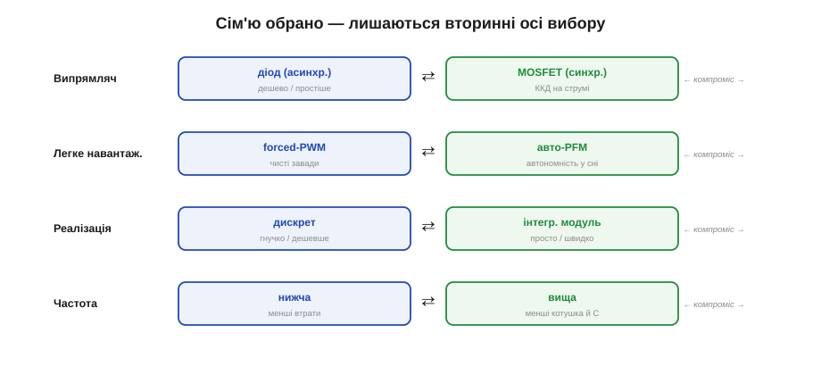
*Рис. 10.1.7.4. Після вибору класу: випрямляч — діод (дешево) чи MOSFET (синхронний, ККД); легке навантаження — forced-PWM (чисті завади) чи авто-PFM (автономність); реалізація — дискрет (гнучко, дешевше) чи інтегрований модуль (просто, швидко); частота — нижча (менші втрати) чи вища (менші котушка й конденсатори).*

> 🔧 **Навіщо це.** Ці вторинні рішення часто важать не менше за вибір класу. Той самий buck можна зробити дешевим асинхронним для іграшки або синхронним із PFM для пристрою, що місяцями живе на батарейці. Тож, обравши «buck», не зупиняйтеся — пройдіть і ці осі під своє ТЗ.

### Упізнати топологію на чужій платі

Зворотний навик не менш корисний: подивитися на готову плату й **прочитати**, що за перетворювач там стоїть.

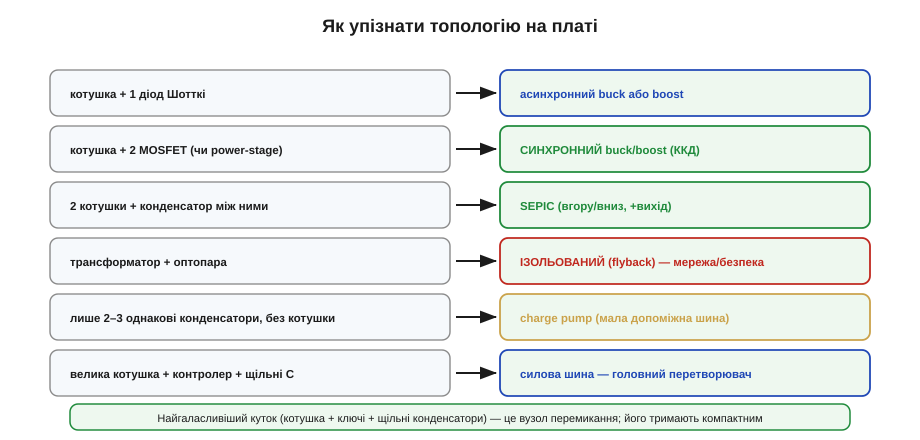
*Рис. 10.1.7.3. Прикмети: котушка з одним діодом Шотткі — асинхронний buck/boost; котушка з двома MOSFET (чи інтегрованим power-stage) — синхронний; дві котушки з конденсатором між ними — SEPIC; трансформатор з оптопарою — ізольований flyback (мережа, безпека); лише два-три однакові конденсатори без котушки — зарядна помпа.*

> 🔧 **Навіщо це.** Цей навик економить години при ремонті, рев'ю чужої плати чи виборі готового модуля. Велика котушка біля контролера зі щільними конденсаторами — головна силова шина; трансформатор з оптопарою — небезпечна первинна сторона, до якої не лізуть під напругою. Прочитавши топологію, ви вже знаєте і її сильні місця, і слабкі. Приклад: бачите на платі дросель, поруч мікросхему й діод Шотткі, а на виході давач «гуляє» — це асинхронний buck, і діод Шотткі підказує, де шукати втрати й тепло; помітили дві котушки з конденсатором між ними — це SEPIC, отже хтось навмисно хотів і вгору-вниз, і захист виходу. Топологія — як підпис інженера: вона розповідає, чого він боявся і що оптимізував.

### Типові пастки

Наостанок — помилки вибору, що повторюються найчастіше. Кожна вже траплялася нам у відповідній темі; тут вони зведені як застереження. І варто побачити їхній **спільний корінь**: усі вони народжуються зі ставлення до перетворювача як до чорної скриньки, що «просто робить напругу». Щойно ви пам'ятаєте, **як** він її робить — boost має наскрізний діод до виходу, помпа возить заряд пакетами, flyback рве струм у витоку, котушка boost несе більший вхідний струм, — кожна пастка стає очевидною ще до того, як ви припаяли першу деталь. Тому ці шість помилок не дрібні недогляди, а наслідок пропущеного розуміння механізму — і саме заради нього ми витратили шість тем на «як воно працює», перш ніж дійти до «що брати».

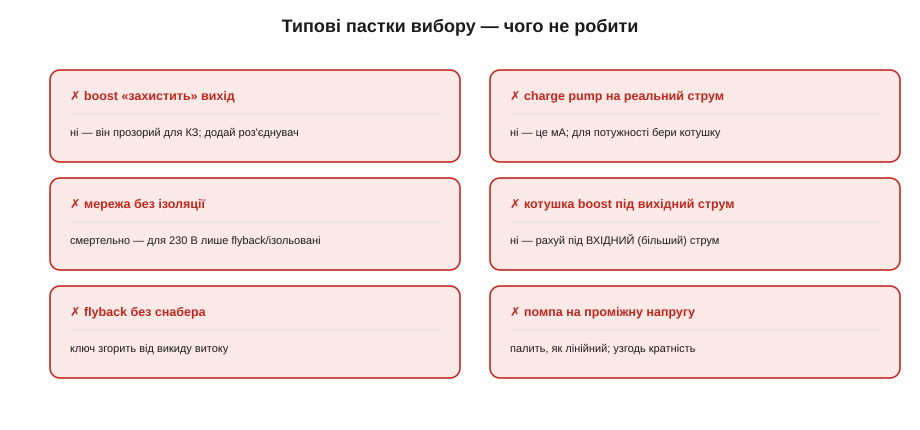
*Рис. 10.1.7.6. Шість найчастіших пасток: покладатися на boost у захисті виходу (він прозорий для КЗ); тягнути помпою реальний струм (це міліампери); живити пристрій від мережі без ізоляції (смертельно); рахувати котушку boost під вихідний струм замість більшого вхідного; ставити flyback без снабера (ключ згорить); гнати помпу на проміжну напругу (палить, як лінійний).*

### Підсумок розділу

Вибір топології — це не вгадування, а короткий ланцюжок питань: спершу **ізоляція** (для мережі — обов'язкова, тоді flyback), тоді **напрямок** (вниз — buck, вгору — boost, гуляє — buck-boost), тоді особливі випадки (малий струм без котушки — помпа; потрібен захист виходу — роз'єднувач чи SEPIC). Карта «потужність × перетворення» показує область кожної топології, таблиця типових випадків дає готову відправну точку, а компроміси (ціна, розмір, ККД, тиша) і вторинні осі (синхронність, PFM, інтеграція, частота) уточнюють рішення. І не менш корисно — упізнавати топологію на платі за її прикметами та обходити шість типових пасток. Тепер ви не лише знаєте, **як** працює кожен перетворювач, а й **який** брати під конкретну задачу. Лишилося навчитися довести обраний вузол до робочого стану — спроєктувати його під ТЗ і виміряти, що він справді тримає напругу, ккд і пульсації. Це — наступний розділ.

> ▶️ Далі: [Розділ 10.2 — Спроєктувати і виміряти перетворювач](../converter-design/converter-design.md)
