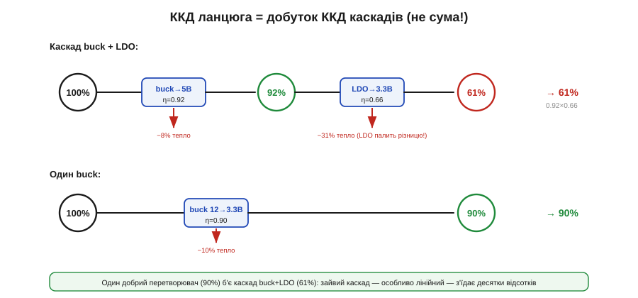

# 🧮 ККД ланцюга перетворень: де зникають відсотки

> Математична вставка до теми [10.1.7 «Карта вибору топології»](converter-topologies.md). Коли перетворювачі стоять каскадом, їхні ККД не додаються, а **множаться** — і відсотки зникають швидше, ніж здається.

### Означення

Якщо живлення йде через **ланцюг** перетворювачів (один за одним), повний ККД дорівнює **добутку** ККД усіх каскадів:

```
ηланцюга = η₁ · η₂ · η₃ · …
```

Не сумі, не середньому — саме добутку. Кожен каскад пропускає лише свою частку потужності, а частки перемножуються.

### Інтуїція: чому добуток

Уявіть потужність як воду, що тече крізь кілька фільтрів. Перший пропускає 92 % — далі тече 0.92 від початку. Другий пропускає 66 % — але вже від тих 0.92, тобто 0.92 × 0.66 = 0.61 від початкового. Кожен наступний «відкушує» свій відсоток **від того, що лишилось**, тому втрати **накопичуються мультиплікативно**. Звідси неінтуїтивне: два каскади по 90 % дають не 90 % і не 80 %, а 0.9 × 0.9 = **81 %**; три — вже 73 %. Відсотки зникають тихо, але швидко.


*Рис. 10.1.7m.1. Угорі — каскад buck (92 %) + LDO (66 %): сумарно 0.92 × 0.66 = 61 %, причому лінійний LDO палить різницю напруг у тепло. Унизу — один buck 12 → 3.3 В (90 %). Один добрий перетворювач легко б'є два посередні: 90 % проти 61 %.*

### Формальний апарат: наскрізний приклад

Хай треба 3.3 В для логіки з 12-вольтової шини. Спокуса — зробити «як завжди»: buck на 5 В, а тоді тихий LDO на 3.3 В (для чистоти). Порахуймо:

```
buck 12 В → 5 В:   η₁ ≈ 0.92
LDO 5 В → 3.3 В:    η₂ = Vвих/Vвх = 3.3/5 = 0.66   (лінійний палить різницю!)

ηланцюга = 0.92 · 0.66 ≈ 0.61   → лише 61 %

на 3.3 В × 1 А = 3.3 Вт навантаження:
   з 12-В шини береться 3.3 / 0.61 ≈ 5.4 Вт
   у тепло йде 5.4 − 3.3 ≈ 2.1 Вт
```

А тепер альтернатива — **один** buck одразу 12 → 3.3 В:

```
buck 12 В → 3.3 В:   η ≈ 0.90   → з 12-В шини: 3.3/0.90 ≈ 3.67 Вт
у тепло: 3.67 − 3.3 ≈ 0.37 Вт   (проти 2.1 Вт у каскаді!)
```

Той самий результат на виході, але каскад марнує **в шість разів** більше потужності. Уся різниця — у лінійному LDO, що з'їв 34 % саме тому, що стояв **другим**, на повному струмі.

### Де в курсі це працює

Звідси кілька правил для **дерева живлення** (до них повернемося в Розділі 10.6):

- **Менше каскадів — вищий ККД.** Один добрий перетворювач під потрібну напругу майже завжди кращий за два «зручні».
- **Лосівний каскад — туди, де струм малий.** Якщо LDO потрібен для чистоти (давач, АЦП), ставте його на **маленький** струм, де його втрата Vвих/Vвх у ватах мізерна, а не на головну шину.
- **Рахуйте LDO як «×Vвих/Vвх».** ККД лінійного дорівнює відношенню напруг (§7.4.1), тож у ланцюгу він множить загальний ККД саме на це число — і чим глибший його перепад, тим дорожчий каскад.

Коротко: проєктуючи живлення, не дивіться на ККД кожного вузла окремо — **перемножте** їх уздовж усього шляху від батареї до навантаження, і побачите, скільки заряду насправді йде в роботу, а скільки — в тепло.
