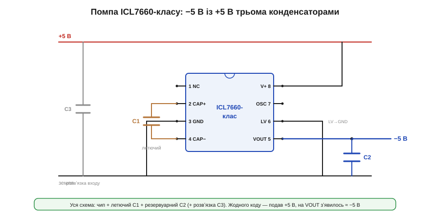

# 🔌 Помпи ICL7660-класу: −5 В із +5 В трьома конденсаторами

> Компонентна вставка до теми [10.1.5 «Charge pump»](r01-converter-topologies.md). Як виглядає зарядна помпа на практиці — на прикладі канонічного інвертора напруги.

### Клас пристрою

**ICL7660-клас** (пін-сумісні LMC7660, MAX1044, ICL7660S та інші) — це класична інтегрована **помпа-інвертор**: вона робить із +Vвх приблизно **−Vвх** на невеликий струм (десятки міліампер). Усередині — ключі й генератор; зовні потрібні лише **конденсатори**, жодної котушки. Той самий чип у іншій обвʼязці працює і **подвоювачем** (+2·Vвх).

### Блок-схема плати: «трьома конденсаторами»

Уся схема −5 В складається з чипа й трьох конденсаторів:

- **C1 — летючий** (*flying*): між виводами CAP+ і CAP−; його чип заряджає й перекидає;
- **C2 — резервуарний** (*reservoir*): на виході VOUT, тримає −5 В і згладжує пульсацію;
- **C3 — розвʼязувальний**: на вході +5 В (гігієна живлення).

Типові номінали C1 і C2 — близько 10 мкФ.


*Рис. 10.1.5c.1. Вісім виводів і три конденсатори. Летючий C1 висить між CAP+ (2) і CAP− (4); резервуарний C2 — на VOUT (5); V+ (8) до +5 В, GND (3) на землю, LV (6) на землю. На VOUT зʼявляється ≈ −5 В. Жодного цифрового інтерфейсу.*

### Типова розпіновка (8 виводів)

```
1  NC     (не задіяний; на 7660S — BOOST)
2  CAP+   верхня пластина летючого C1
3  GND    земля
4  CAP−   нижня пластина летючого C1
5  VOUT   вихід ≈ −Vвх
6  LV     низька напруга: на землю, якщо Vвх < 3.5 В
7  OSC    генератор (зовнішній конденсатор міняє частоту)
8  V+     вхід живлення (+5 В)
```

### Підключення

V+ (8) — до +5 В, GND (3) — на землю. Летючий C1 — між CAP+ (2) і CAP− (4). Резервуарний C2 — від VOUT (5) до землі; на VOUT і знімаємо −5 В. Вивід LV (6) садять на землю при низькій вхідній напрузі. OSC (7) зазвичай лишають вільним (стандартна частота ≈ 10 кГц).

### «Перший байт»: як заговорити

Жодного коду чи шини тут немає — помпа **аналогова**. «Заговорити» з нею — це просто **подати живлення**: ввімкнули +5 В на V+ із підключеними конденсаторами — і на VOUT одразу зʼявляється ≈ −5 В (трохи менше за модулем під навантаженням). Уся «комунікація» — подав вхід, виміряв вихід.

### Типові граблі

- **Малий струм.** Це десятки мА, не більше. Перетягнете — вихід просяде (помпа має вихідний опір, тема 10.1.5).
- **Вихід не регульований.** Це приблизно −Vвх мінус падіння, а не точні −5.00 В; під навантаженням «попливе».
- **Пульсація на частоті генератора** (~10 кГц за замовчуванням). Якщо заважає — підняти частоту (конденсатор на OSC або пін-сумісний високочастотний варіант) і/або збільшити C2.
- **Конденсатори.** Замалі C1/C2 — більший вихідний опір і пульсація; стежте за полярністю електролітів (на VOUT напруга **відʼємна**).
- **LV.** Неправильне поводження з LV на низькій напрузі — помпа не запуститься.

### Варіації класу

Той самий клас уміє **подвоювати** (+2·Vвх) в іншій обвʼязці. Пін-сумісні **високочастотні** версії (MAX1044/660-клас) працюють на десятках-сотнях кГц — менші конденсатори й тихіша пульсація. Є й **регульовані** помпи (тримають заданий вихід пропуском тактів) та **багатокаскадні** (схема Діксона) для більших кратностей. Спільне в усіх: кілька конденсаторів, жодної котушки — і ніша малих допоміжних шин.
