# Розділ 10.2 — Спроєктувати і виміряти перетворювач

У [Розділі 10.1](../r01-converter-topologies/r01-converter-topologies.md) ми навчилися розуміти топології й **вибирати** потрібну під задачу. Та між «обрав buck» і «маю робочий вузол живлення» лежить ціла інженерна робота: скласти специфікацію, дібрати контролер і частоту, котушку й конденсатори, правильно розвести плату — і виміряти, що воно справді тримає напругу, ккд і пульсації. Цей розділ — про те, як довести обраний перетворювач до робочого стану й переконатися, що він працює.

> 📜 Історичного екскурсу цей розділ не має — він суто інженерний; теорію походження імпульсного живлення дивись в [історії Розділу 10.1](../r01-converter-topologies/r01-history-smps.md).

---

## 10.2.1 ТЗ перетворювача: діапазони, пульсації, перехідні процеси

Перш ніж паяти, малювати плату чи навіть вибирати мікросхему, інженер пише **технічне завдання** (ТЗ) на перетворювач — специфікацію того, що вузол має робити. Це нудна на вигляд, але найважливіша сторінка проєкту: перетворювач, побудований без ТЗ, майже завжди побудований **не так**. Уся ця тема — про те, як перетворити рядок бюджету живлення на конкретну, придатну до реалізації специфікацію.

Чому саме **перед** вибором деталей? Бо вартість виправлення росте лавиною з кожним етапом. Невказана вимога, помічена на стадії ТЗ, коштує рядка тексту; помічена після розводки — нової плати; помічена в полі — відкликання партії й репутації. Контролер, котушка, конденсатори, розводка — усе це похідні від ТЗ, тож змінена наприкінці вимога тягне за собою перероблення всього ланцюга. Година, витрачена на чесне ТЗ, економить тижні переробок.

### Від бюджету до ТЗ

Відправна точка — **бюджет живлення** (його складають у §8.1.4): перелік усіх шин апарата, їхні напруги й потрібні струми. Бюджет каже, наприклад: «потрібна шина 5 В на 3 А». Здавалося б, цього досить — бери buck та й роби 5 В. Але рядок бюджету — це ще **не** ТЗ.

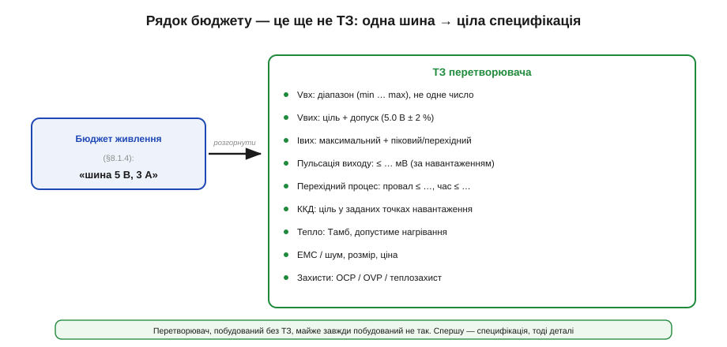
*Рис. 10.2.1.1. Один рядок бюджету («5 В, 3 А») розгортається в цілу специфікацію: діапазон входу, ціль і допуск виходу, максимальний і піковий струм, пульсація, перехідний процес, ККД, тепло, ЕМС, захисти. Кожен із цих пунктів — окреме рішення, без якого вузол неповний.*

Чому одного рядка мало? Бо «5 В, 3 А» не каже, **з чого** робити ці 5 В (вхід же плаває), **наскільки точно** їх тримати, **як чисто**, **як швидко** реагувати на стрибки навантаження, **скільки** тепла можна відвести й **що** робити при аварії. Усе це — окремі осі ТЗ, і пройдімо їх по черзі.

### Діапазон входу: Vвх — це не число

Найперша й найчастіше забута річ: **вхідна напруга — це діапазон**, а не одне значення. Батарея сповзає під час розряду й просідає під навантаженням (§7.4.5); мережа гуляє ±10 %; USB просідає на тонкому кабелі. Тому ТЗ задає Vвх **від мінімуму до максимуму**, і проєктувати треба на **весь** діапазон, причому кожен край диктує своє.

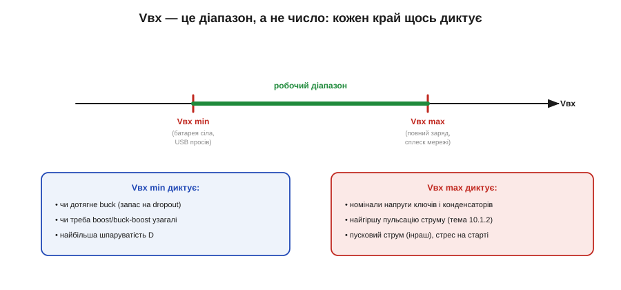
*Рис. 10.2.1.2. Vвх — це смуга min…max. Нижній край (батарея сіла) диктує, чи дотягне buck і чи не потрібен boost, та задає найбільшу шпаруватість. Верхній край (повний заряд, сплеск мережі) диктує номінали напруги ключів і конденсаторів, найгіршу пульсацію струму й пусковий струм.*

**Vвх мінімальний** вирішує саму **здійсненність**: чи зможе buck іще знизити до виходу із запасом на падіння (dropout), чи вже потрібен boost або buck-boost (згадайте проблему банки LiPo з §10.1.4). **Vвх максимальний** вирішує **стрес**: на яку напругу брати ключі й конденсатори (з запасом!), де буде найгірша пульсація струму (для buck вона максимальна саме за макс. Vвх — §10.1.2) і який буде пусковий кидок. Пропустите діапазон — і вузол, що чудово працює на столі за 12 В, відмовить у полі, коли батарея сяде до 12 В або підскочить до 16.8.

Тут криється тонкість із **запасом на падіння** (*dropout*). Buck не може зробити вихід, рівний входу: на ключі, котушці й доріжках завжди губиться частка вольта, тож потрібен запас Vвх − Vвих хоча б у кілька десятих. Якщо ваш вихід 5 В, а вхід може сісти до 5.1 В, чистий buck **не дотягне** — і це видно лише тоді, коли в ТЗ чесно вписано Vвх мінімальний. Звідси загальне правило проєктування живлення: рахувати **кожен край у найгіршу сторону** — здійсненність за мінімумом входу, стрес за максимумом, найбільший струм за повним навантаженням. Вузол, спроєктований лише «на номінал», ламається на краях, яких ніхто не порахував.

### Вихід: ціль, допуск і пульсація

Вихід задають **двома** різними числами, які легко сплутати. Перше — **ціль із допуском**: скажімо, 5.0 В ± 2 %. Це про **середню** напругу — наскільки точно вузол її тримає попри дрейф входу, навантаження й температури. Друге — **пульсація**: дрібне швидке коливання навколо середнього, що його залишає перемикання (§10.1.2).

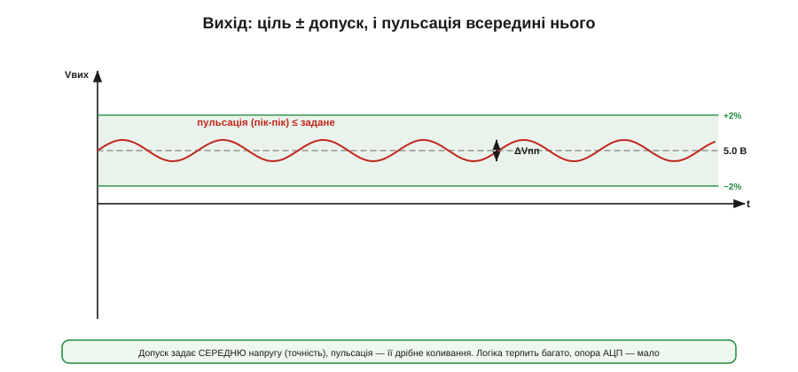
*Рис. 10.2.1.3. Дві різні вимоги до виходу. Смуга допуску (5.0 В ± 2 %) обмежує СЕРЕДНЮ напругу — точність. Пульсація (пік-пік) — це дрібна хвиля всередині цієї смуги. Скільки пульсації терпимо — залежить від навантаження: цифрова логіка ковтає десятки мВ, а опорна напруга АЦП чи радіо хочуть одиниці.*

Скільки пульсації дозволити — питання не перетворювача, а **навантаження**. Цифрова логіка незворушна до десятків мілівольт; а ось опора аналого-цифрового перетворювача чи живлення радіоприймача хочуть чистоти на рівні одиниць мілівольт, інакше пульсація просочиться в покази чи ефір. Тому пульсацію в ТЗ беруть **від вимог споживача** цієї шини — і вже вона потім задасть котушку, конденсатори та їхній ESR.

### Перехідні процеси: реакція на стрибок

Статика — це ще не все. Реальне навантаження **стрибає**: процесор прокинувся, мотор смикнув, радіо ввімкнуло передавач — і струм за мікросекунди підскочив з 0.5 до 3 А. Перетворювач не встигає зреагувати миттєво, тож вихід на мить **провалюється**, а тоді відновлюється. ТЗ мусить обмежити і **глибину** цього провалу, і **час** відновлення.

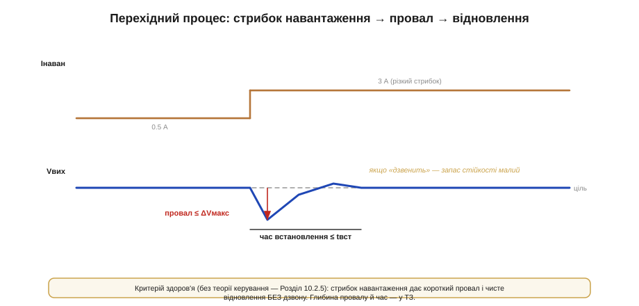
*Рис. 10.2.1.4. Стрибок навантаження (0.5 → 3 А) дає короткий провал виходу, після чого контур повертає напругу до цілі. ТЗ задає максимальний провал (ΔVмакс) і час встановлення (tвст). Здоровий перетворювач відновлюється чисто; якщо вихід «дзвенить» — запас стійкості малий.*

Це той самий **критерій здоров'я**, який ми навмисно тримаємо без теорії керування: стрибок навантаження має дати короткий провал і **чисте відновлення без дзвону**. Глибокий провал означає, що контур повільний або конденсаторів замало; дзвін означає, що запас стійкості на межі (повернемося до цього в Розділі 10.2.5). Поряд із навантаженням ТЗ часом обмежує й реакцію на **стрибок входу** (line transient) — коли, скажімо, підмикають свіжу батарею, і вхід підскакує: вихід має лишитися в допуску.

Глибину провалу задають дві речі. Перша — **вихідний конденсатор**: у перші миті стрибка, поки контур ще не відреагував, увесь зайвий струм віддає саме він, і чим більше в ньому запасеної енергії, тим менший провал. Друга — **швидкість контуру**: як скоро перетворювач підніме шпаруватість і добере струм. Тому жорстка вимога на перехідний процес у ТЗ наперед визначає і ємність вихідних конденсаторів (тема 10.2.4), і потрібну смугу контуру (10.2.5). Це ще один приклад, як рядок ТЗ тягне за собою конкретні деталі: «провал ≤ 150 мВ» — це не побажання, а майбутній номінал конденсатора.

> 🔧 **Навіщо це.** Більшість «незрозумілих» збоїв живлення — це пропущений перехідний процес у ТЗ. Логіка перезавантажується не тому, що середня напруга погана, а тому, що на стрибку струму вихід на мить провалився нижче порога brownout. Тому провал і час відновлення — не дрібниця, а часто найжорсткіша вимога всього ТЗ.

### Решта осей: ккд, тепло, ЕМС, захисти

Кілька осей лишаються, і пропуск кожної — прихований ризик.

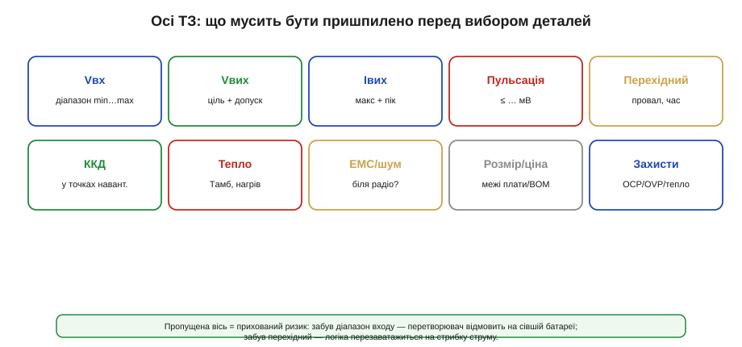
*Рис. 10.2.1.5. Десять осей, які мусять бути пришпилені перед вибором деталей. Пропущена вісь = прихований ризик: забув діапазон входу — відмова на сівшій батареї; забув перехідний — перезавантаження на стрибку; забув тепло — термозахист вимикає вузол у спеку.*

- **ККД** — і не одним числом, а **в точках навантаження**: ≥ 90 % на повному струмі (де важить тепло) і пристойно на малому (де важить автономність — крива ККД залежить від навантаження, §10.1.2).
- **Тепло** — за якої температури довкілля (Tамб) працює вузол і скільки він сміє нагрітися; це вирішує, чи потрібен радіатор і який запас за струмом.
- **ЕМС / шум** — чи стоїть перетворювач поряд із радіо або чутливим давачем; якщо так, у ТЗ йде стала частота (forced-PWM) і вимоги до фільтрації.
- **Розмір і ціна** — межі плати й BOM, що часто й вирішують між дискретом та інтегрованим модулем (§10.1.7).
- **Захисти** — які саме потрібні: від перевантаження струму (OCP), перенапруги (OVP), перегріву, обмеження пускового струму. Краще вирішити це в ТЗ, ніж дізнатися про потребу після згорілої плати.

### Запас: не проєктуйте на межі

Усе ТЗ пронизує одна інженерна звичка — **запас** (*margin*, derating). Жоден компонент не ставлять працювати на його паспортній межі: ключ на 20 В не беруть на шину, де буває рівно 20 В; конденсатор на 25 В не ставлять на 25-вольтову лінію; котушку з насиченням 4 А не вантажать піком 4 А. Беруть із запасом — типово 20–50 % за напругою й струмом, а біля тепла й поготів. Причини прості: реальні сплески перевищують номінал, параметри деталей плавають із температурою та старінням, а близька до межі деталь гріється й деградує швидше.

Тому ТЗ — це не лише цілі, а й **умови найгіршого випадку**, у яких ці цілі мусять триматися: найвищий вхід, найбільший струм, найгарячіше довкілля — одночасно. Перетворювач, що ледь проходить ТЗ за ідеальних умов, у полі відмовить; той, що проходить його із запасом за найгірших, — працюватиме роками. Запас коштує трохи грошей і місця, але економить згорілі плати й нічні дзвінки з поля.

### Приклад ТЗ: шина 5 В на дроні

Зведімо все в конкретну специфікацію — для шини 5 В логіки на апараті з 4S-батареєю:

| Параметр | Значення |
|---|---|
| **Vвх** | 12.0 – 16.8 В (4S LiPo), сплеск до 18 В |
| **Vвих** | 5.0 В ± 2 % |
| **Iвих** | 3 А тривало, 4 А пік |
| **Пульсація** | ≤ 50 мВ пік-пік |
| **Перехідний** | 0.5 → 3 А: провал ≤ 150 мВ, відновлення ≤ 50 мкс, без дзвону |
| **ККД** | ≥ 90 % @ 3 А, ≥ 80 % @ 0.3 А |
| **Тепло** | Tамб 60 °C, нагрів ≤ +40 °C |
| **ЕМС** | поряд радіо → стала частота (forced-PWM) |
| **Захисти** | OCP, теплозахист, обмеження інрашу |

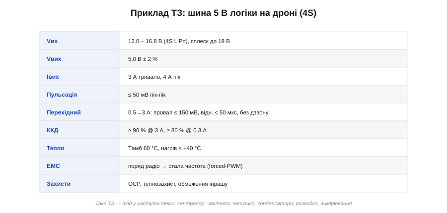
*Рис. 10.2.1.6. Готове ТЗ вузла. Це і є вхід у всі наступні теми розділу: за цими числами добиратимуть контролер і частоту (10.2.2), котушку (10.2.3), конденсатори (10.2.4), а тоді розводитимуть і вимірюватимуть. Кожен рядок ТЗ перетвориться на інженерне рішення.*

Зверніть увагу, як кожен рядок **вже містить** напрямок рішення. Діапазон входу 12–18 В і вихід 5 В → це чисте зниження, отже buck; великий струм і вимога ККД → синхронний; «поряд радіо» → forced-PWM; пульсація ≤ 50 мВ і провал ≤ 150 мВ → ємність і ESR вихідних конденсаторів; сплеск входу до 18 В → ключі щонайменше на 25–30 В із запасом. ТЗ не просто описує мету — воно наполовину диктує реалізацію. Тому добре написане ТЗ — це вже половина проєкту, і кожна наступна тема розділу просто **перетворює один його рядок** на конкретну деталь чи число.

> 🔧 **Навіщо це.** Складаючи ТЗ, ставте собі по черзі ці десять питань — і не пропускайте жодного. Найдорожчі помилки живлення народжуються не з поганого розрахунку, а з **невказаної** вимоги: ніхто не задав діапазон входу, перехідний процес чи робочу температуру — і вузол відмовив там, де про нього просто не подумали.

### Підсумок теми

Рядок бюджету («5 В, 3 А») — лише відправна точка; робочий вузол потребує повного **ТЗ**. Вхідна напруга — це **діапазон** (мінімум диктує здійсненність, максимум — стрес і номінали). Вихід задають **двома** числами: ціллю з допуском (точність середньої напруги) і пульсацією (чистота, від вимог навантаження). Окремо — **перехідні процеси**: глибина провалу й час відновлення на стрибку навантаження, із чистим відновленням без дзвону. Решта осей — ккд у точках навантаження, тепло за Tамб, ЕМС біля радіо, розмір, ціна й захисти — кожна пропущена вісь стає прихованим ризиком. Готове ТЗ уже наполовину диктує реалізацію — і з ним ми переходимо до першого інженерного вибору: контролера й частоти комутації.

---

## 10.2.2 Вибір контролера і частоти комутації

Маючи ТЗ, робимо два перші великі рішення, що задають каркас усього вузла: **як** його побудувати (на якому рівні інтеграції) і на **якій частоті** перемикати. Обидва прямо випливають зі специфікації — зі струму, ккд, розміру й вимог ЕМС, — і обидва тягнуть за собою все подальше: котушку, конденсатори, розводку, тепло.

### Рівні інтеграції: контролер, switcher, модуль

Перше рішення — наскільки «готовим» брати перетворювач. Є три рівні, від найгнучкішого до найпростішого.

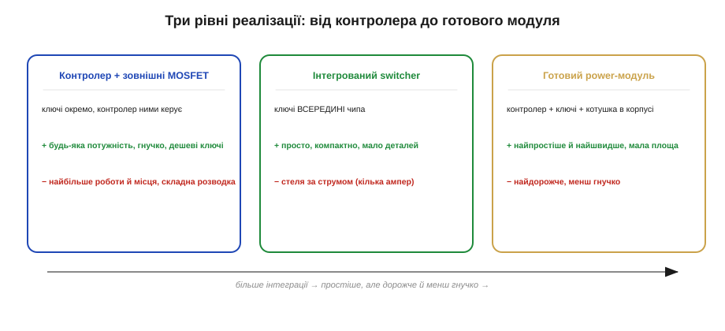
*Рис. 10.2.2.1. Контролер + зовнішні MOSFET: ключі окремо, будь-яка потужність і гнучкість, але найбільше роботи й складна розводка. Інтегрований switcher: ключі всередині чипа — просто й компактно, та зі стелею за струмом. Готовий power-модуль: контролер, ключі й котушка в одному корпусі — найшвидше, але найдорожче й менш гнучко.*

- **Контролер + зовнішні MOSFET.** Мікросхема лише **керує**, а силові ключі стоять окремо. Це дає будь-яку потужність (ключі добирають під струм), гнучкість і дешеві компоненти — ціною найбільшої роботи: розводка силових петель, добір ключів, драйвер. Так роблять потужні шини.
- **Інтегрований switcher.** Силові ключі **всередині** чипа. Просто, компактно, мало зовнішніх деталей — але є **стеля за струмом** (кілька ампер), бо великий ключ у корпус не влізе й не охолодиться. Це робоча конячка для більшості шин апарата.
- **Готовий power-модуль.** Контролер, ключі й навіть **котушка** — в одному корпусі. Найпростіше й найшвидше в розробці, мала площа, передбачуваний результат — але найдорожче за штуку й менш гнучко.

Обираючи зовнішні ключі, не забувають про **драйвер затвора**: контролер (чи окрема мікросхема-драйвер) мусить швидко заряджати й розряджати ємність затвора (§2.7.7), бо саме швидкість переходу задає перемикальні втрати — кволий драйвер розтягує перехід, і ключ гріється на перекритті. Для верхнього ключа потрібен ще й **bootstrap** — підкачка затвора над шиною (та сама помпа з §10.1.5). У switcher і модулі драйвер уже всередині й узгоджений із ключами; беручи зовнішні MOSFET, ви берете на себе й цю турботу.

> 🔧 **Навіщо це.** Вибір рівня — це компроміс «час інженера проти ціни штуки». Прототип чи мала серія, де дорогий час, — беріть модуль чи switcher. Велика серія, де кожна копійка на штуці множиться на мільйон, — окупиться контролер із зовнішніми ключами. ТЗ (струм, площа, бюджет) майже однозначно підкаже рівень.

> 🔌 **Готовий модуль у вставці.** Що саме сидить усередині power-модуля «все в одному», його розпіновка (VIN/EN/FB/PG), «перший байт» і за що платимо ціною та гнучкістю — у компонентній вставці [🔌 Power-модулі «все в одному»](r02-s2-c-power-modules.md).

### Частота: центральний компроміс

Друге рішення — **частота комутації** (*switching frequency*, fsw), і це найважливіший компроміс усього проєктування. Він простий за формулюванням і глибокий за наслідками.

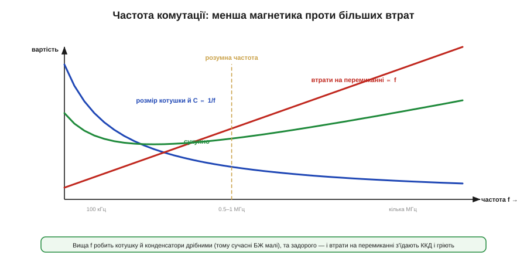
*Рис. 10.2.2.2. Дві протилежні тенденції. Вища частота робить котушку й конденсатори **дрібнішими** (за цикл переноситься менша порція енергії, ΔI ∝ 1/f — §10.1.2), тож магнетика дешевшає й зменшується. Але вища частота **збільшує втрати на перемиканні** (∝ f) — а отже, гріє й знижує ккд. Сукупна «вартість» має долину — розумну частоту, типово сотні кГц — одиниці МГц.*

З одного боку, **висока частота — це мала магнетика**. Що частіше «качаєш», то менші порції енергії за цикл, то менші потрібні котушка й конденсатори (пульсація ΔI ∝ 1/f, §10.1.2). Саме тому сучасні перетворювачі такі дрібні — їх ганяють на сотнях кГц і вище, де котушка завбільшки з горошину. З іншого боку, **висока частота — це втрати**: кожне ввімкнення-вимкнення ключа коштує енергії, і за секунду таких подій тим більше, чим вища f. Між «менша котушка» і «менше втрат» і лежить розумна частота — зазвичай від сотень кілогерц до кількох мегагерц.

### Звідки втрати на перемиканні

Щоб відчути цей компроміс у числах, погляньмо, **звідки** беруться втрати перемикання. Їх дві складові, і обидві ростуть із частотою.

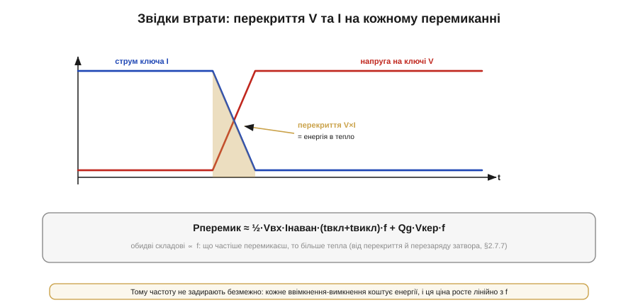
*Рис. 10.2.2.3. Ключ перемикається не миттєво: під час переходу напруга на ньому вже росте, а струм ще тече (і навпаки). У це коротке **перекриття** V×I ключ розсіює енергію — щоразу. Друга складова — перезаряд ємності затвора (Qg·Vкер). Обидві помножені на f, тож утричі піднявши частоту, утричі піднімаєш ці втрати.*

Перша складова — **перекриття**. Реальний ключ перемикається за наносекунди, а не миттєво: на якусь мить напруга на ньому вже висока, а струм ще не впав (чи навпаки). У цьому перекритті V×I він розсіює енергію, і так двічі за цикл. Друга — **перезаряд затвора**: відкрити MOSFET означає зарядити його вхідну ємність (§2.7.7), а закрити — розрядити; цей заряд Qg щоразу губиться. Разом:

```
Pперемик ≈ ½·Vвх·Iнаван·(tвкл+tвикл)·fsw  +  Qg·Vкер·fsw
```

**Приклад (втрати перемикання).** Вузол 16.8 В → 5 В / 3 А, сумарний час переходів ≈ 20 нс, Qg ≈ 20 нКл, Vкер = 5 В:

```
при fsw = 500 кГц:
  перекриття: ½·16.8·3·20·10⁻⁹·500·10³ ≈ 0.25 Вт
  затвор:     20·10⁻⁹·5·500·10³        ≈ 0.05 Вт
  разом ≈ 0.30 Вт

при fsw = 1 МГц (удвічі вища): ≈ 0.60 Вт — рівно вдвічі більше
```

Ось чому частоту не задирають безмежно: подвоївши її заради вдвічі меншої котушки, ви **подвоюєте** втрати перемикання й тепло. Інженер шукає точку, де і котушка прийнятна, і ккд тримається.

Щоб зрозуміти, де ця точка, корисно бачити **дві сім'ї втрат** разом. Окрім перемикальних (∝ f), є ще **провідні** — на опорах відкритих ключів, котушки й доріжок (I²·R), і вони від частоти майже не залежать. На **низькій** частоті перемикальні втрати малі, тож ккд визначають провідні; на **високій** — навпаки, перемикальні беруть гору. Оптимум сидить там, де ці дві сім'ї приблизно врівноважені: нижче — даремно велика котушка майже без виграшу в ккд, вище — котушка вже мала, а ккд починає падати. Саме цей баланс і робить «розумну частоту» не однією цифрою, а вікном, що зсувається залежно від струму, ключів і вимог до розміру.

### Підлога й стеля частоти

У частоти є й жорсткі межі, поза якими її просто не беруть. **Знизу** — чутність: на частотах до ~20 кГц котушка й кераміка починають **співати** (магнітострикція й п'єзоефект перетворюють пульсації на звук), тож робочі частоти тримають вище звукового діапазону — звідси й типова «підлога» в десятки-сотні кілогерц. **Згори** — втрати й здатність ключів: за одиницями мегагерц перемикальні втрати й вимоги до драйвера стають надто дорогими для більшості силових задач. А всередині цього вікна частоту ще й посувають, щоб гармоніки минали чутливі смуги.

**Приклад вибору.** Для нашого вузла 5 В / 3 А поряд із радіо: беремо частоту в районі **0.5 МГц** — досить високу для дрібної котушки й тиху для вуха, із прийнятними втратами (≈0.3 Вт, як порахували вище), і перевіряємо, що ні вона, ні її гармоніки не падають у смугу приймача; якщо падають — зсуваємо на сусіднє значення або вмикаємо спред-спектрум. Часто, втім, частоту й не обирають: інтегрований switcher має її **фіксованою** всередині, і тоді «вибір частоти» зводиться до вибору самого чипа з потрібною fsw. А остаточну перевірку дає не формула, а **крива ккд із даташита**: у ній уже враховано і провідні, і перемикальні втрати конкретного чипа на його частоті, тож зчитавши ккд у ваших точках навантаження, ви відразу бачите, чи влучили в розумне вікно.

### Частота й завади

Частота має й третій бік — **електромагнітні завади** (ЕМС). Перемикання породжує не лише основну частоту fsw, а й цілий гребінь **гармонік** (2·fsw, 3·fsw…), і всі вони випромінюються й наводяться.

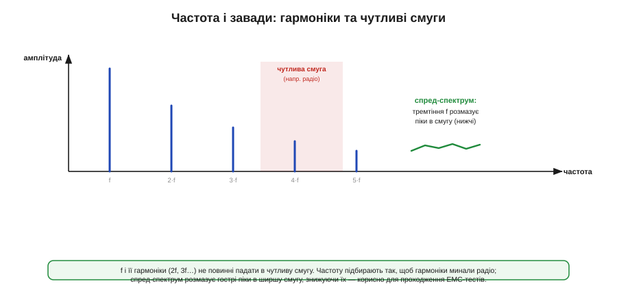
*Рис. 10.2.2.4. Перемикання дає основну частоту й гармоніки. Їх підбирають так, щоб вони **минали** чутливі смуги (радіо, GPS, AM). Спред-спектрум — навмисне тремтіння частоти — розмазує гострі піки в ширшу смугу, знижуючи їх; це часто рятує на сертифікаційних ЕМС-тестах.*

Звідси два прийоми. По-перше, частоту **підбирають під спектр**: щоб ні fsw, ні її гармоніки не падали в чутливу смугу (скажімо, в діапазон GPS-приймача чи AM-радіо поряд). По-друге, багато контролерів уміють **спред-спектрум** (*spread spectrum*) — навмисно злегка тремтіти частотою, розмазуючи гострі піки спектра в ширшу смугу й знижуючи їхню висоту. Це не прибирає енергію завад, але часто рятує на сертифікаційних вимірах і поряд із чутливим радіо.

Є й третій прийом, коли на платі кілька перетворювачів. Дві близькі, але **не однакові** частоти дають **биття** (різницеву частоту), що може потрапити в чутливу смугу, навіть якщо кожна окремо її минає. Тому перетворювачі часто **синхронізують** від спільного такту — або ще й **зсувають по фазі** (interleaving), щоб їхні кидки струму не збігалися й менше навантажували спільні вхідні конденсатори. Якщо вузол стоятиме поруч із радіо, ці дрібниці вирішують, пройде пристрій ЕМС чи ні; а сама розводка (Розділ 10.2.6) важить тут не менше за частоту.

### Скільки струму: стеля інтегрованого

Рівень інтеграції й струм пов'язані. Інтегрований switcher має **стелю за струмом** — великий ключ просто не влізе в дрібний корпус і не відведе тепла. Перевищуєте її — переходите на зовнішні ключі.

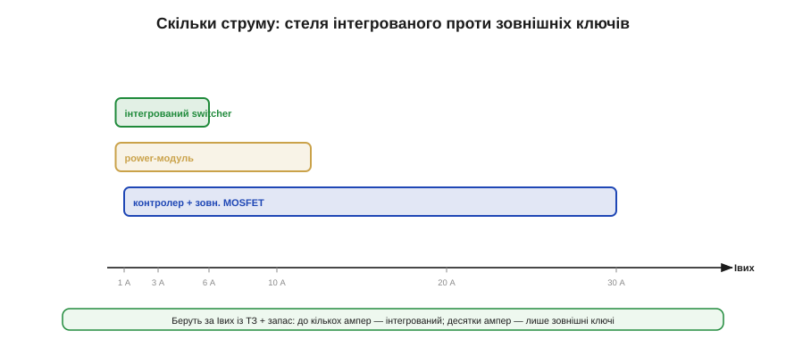
*Рис. 10.2.2.5. Інтегрований switcher тягне до кількох ампер, power-модуль трохи більше, а контролер із зовнішніми MOSFET — десятки ампер. Беруть за Iвих із ТЗ плюс запас: якщо ваш струм близький до стелі інтегрованого — або беріть наступний клас, або одразу зовнішні ключі.*

Чому саме тепло, а не «розмір ключа» ставить стелю? Бо втрати (і провідні I²·R, і перемикальні) виділяються **всередині** чипа, а відвести їх можна лише через його крихітний корпус у плату. За якихось кількох ампер цього тепла стає більше, ніж корпус здатен розсіяти, і чип іде в термозахист. Зовнішній MOSFET натомість має власний корпус із тепловою площадкою й розводку-радіатор, тож відводить у рази більше. Тому стеля інтегрованого — це не «не вліз кремній», а «нічим охолодити».

> 🔧 **Навіщо це.** Звіртеся з Iвих із ТЗ (плюс запас на пік і на майбутнє зростання). До кількох ампер — інтегрований switcher закриє задачу одним чипом. Десятки ампер — лише контролер із зовнішніми ключами, бо інакше нічим відвести тепло. Це рішення тягне за собою й рівень інтеграції з попередньої фігури.

### Режим керування: за струмом

Наостанок — тонше рішення, яке зазвичай уже «зашите» в обраному контролері, але знати його варто. Перетворювач можна керувати **за напругою** (стежити лише за виходом) або **за струмом** (стежити ще й за струмом котушки).

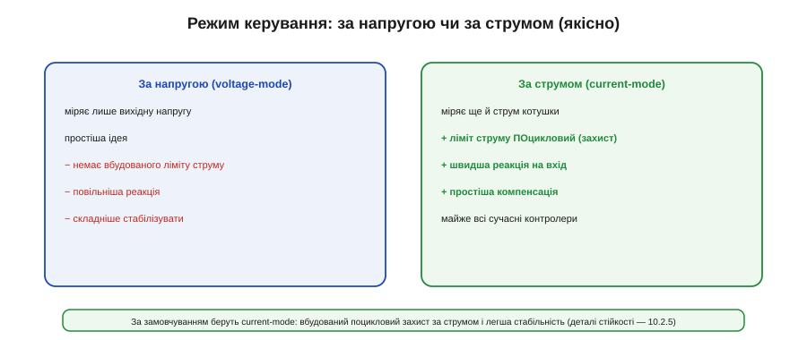
*Рис. 10.2.2.6. Керування за струмом міряє ще й струм котушки — і дістає вбудований **поцикловий** ліміт струму (готовий захист), швидшу реакцію й простішу стабілізацію. Тому майже всі сучасні контролери — саме струмові. Деталі стійкості — у Розділі 10.2.5.*

Майже всі сучасні контролери — **струмові** (*current-mode*), і недарма: знаючи струм котушки щоцикл, контролер дістає **поцикловий захист за струмом** задарма (перевищив межу — обрізав цей же цикл), швидше реагує на стрибки входу й легше стабілізується. Керування за напругою простіше за ідеєю, але без вродженого ліміту струму й важче в налаштуванні. Деталей стійкості ми тут не чіпаємо (вони — у Розділі 10.2.5); досить знати, що «за струмом» — розумний типовий вибір. На практиці це рішення зазвичай уже зроблене за вас: даташит контролера прямо пише «current-mode» чи «voltage-mode», і для звичайної шини живлення перше — те, що треба, а на друге свідомо переходять лише в особливих випадках.

### Підсумок теми

Два перші рішення задають каркас вузла. **Рівень інтеграції**: контролер із зовнішніми ключами (потужно, гнучко, дешево в серії, але багато роботи), інтегрований switcher (просто й компактно, та зі стелею струму) чи готовий модуль (найшвидше, але найдорожче) — вибір між часом інженера й ціною штуки. **Частота комутації** — центральний компроміс: вища f дає дрібнішу котушку (ΔI ∝ 1/f), але більші втрати на перемиканні (∝ f, з перекриття V×I і перезаряду затвора), тому її тримають у розумному вікні сотень кГц — одиниць МГц, ще й уникаючи чутливих смуг (а спред-спектрум розмазує піки). Струм із ТЗ задає стелю — до кількох ампер інтегрований, далі зовнішні ключі. А режим керування за замовчуванням беруть струмовий — за поцикловий захист і легшу стабільність. Усі ці рішення, як і в темі про ТЗ, не існують окремо: рівень інтеграції тягне за собою струмову стелю й драйвер, частота — розмір котушки, втрати й завади, а режим керування — захист і стійкість. Маючи контролер і частоту, переходимо до котушки — серця перетворювача, яку тепер добиратимемо за даташитом.

---

## 10.2.3 Котушка для перетворювача: Isat, Irms, втрати

Котушка — серце імпульсного перетворювача (§2.2): саме вона переносить енергію. У Розділі 10.1 ми вибрали її **індуктивність** із пульсації; тепер настав час відкрити **даташит** реальної котушки й переконатися, що вона витримає наш режим. А там не одне число, а ціла родина параметрів, і кожен ставить свою межу. Найпідступніше — що дві з цих меж за струмом легко сплутати, хоч вони про геть різні фізичні явища.

### Що каже даташит котушки

П'ять чисел вирішують, годиться котушка чи ні.

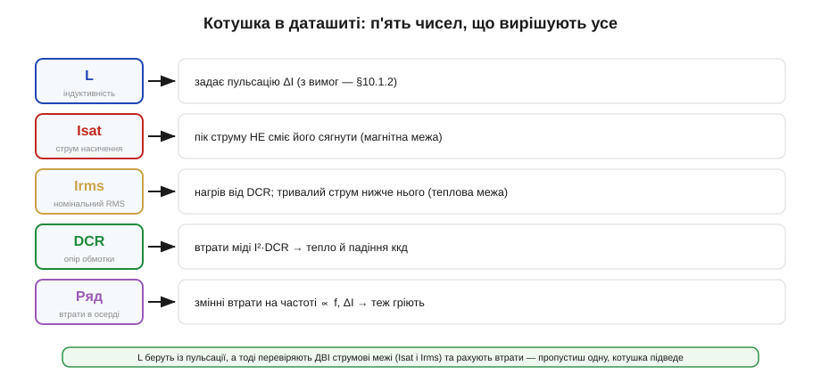
*Рис. 10.2.3.1. L задає пульсацію (її ми вже вибрали). Isat — струм насичення (магнітна межа на пік). Irms — номінальний RMS-струм (теплова межа на тривалий струм). DCR — опір обмотки (втрати міді). Pяд — втрати в осерді на частоті. L беруть із пульсації, а тоді перевіряють обидві струмові межі й рахують втрати.*

Коротко про кожен: **L** (індуктивність) — задає пульсацію ΔI, і її ми вже визначили з вимог (§10.1.2). **Isat** (струм насичення) — поріг, за яким осердя насичується. **Irms** (номінальний струм) — тривалий струм, що дає допустимий нагрів. **DCR** (опір обмотки постійному струму) — мідні втрати. **Втрати в осерді** — змінні втрати на частоті комутації. L ми маємо; решту розберімо по черзі.

### Насичення: коли індуктивність зникає

Найдраматичніший параметр — **Isat**. Щоб його відчути, згадаймо, що індуктивність котушки тримається на магнітній проникності осердя (§2.2): осердя «підсилює» магнітне поле, даючи велику L у малому об'ємі. Але осердя має межу — більше певного поля воно намагнічується **до краю** й більше не реагує. Це **насичення**: проникність падає, а з нею падає й **сама індуктивність**.

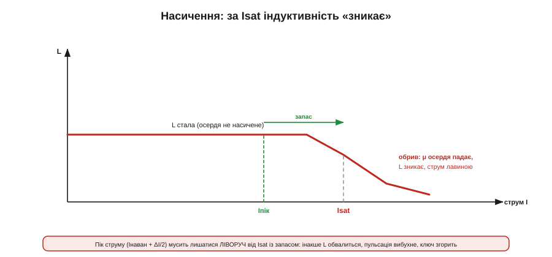
*Рис. 10.2.3.2. Залежність L від струму: спершу стала, а біля Isat — різкий обрив. Це не плавне погіршення, а «зникнення» індуктивності: проникність осердя падає, L обвалюється. Пік струму (Iнаван + ΔI/2) мусить лишатися ЛІВОРУЧ від Isat із запасом, інакше котушка перестає бути котушкою.*

Чому це катастрофа? Бо котушка, що втратила індуктивність, перестає **опиратися зміні струму** (§2.2.2). Згадайте: струм у ній росте зі швидкістю V/L. Якщо L раптом упала вдесятеро, струм підскакує вдесятеро швидше — за лічені наносекунди він злітає, ключ не встигає вимкнутися, і вся енергія йде в нього. Насичена котушка вбиває перетворювач майже миттєво. Тому **Isat — це жорстка магнітна межа на ПІКОВЕ значення струму**: пік (Iнаван + ΔI/2, §10.1.2) мусить лишатися нижче Isat із запасом 20–30 %.

Зверніть увагу: Isat у даташиті часто визначають як струм, за якого L впала на 20–30 % від номіналу, — тобто це вже **початок** обриву, а не його дно. Тому запас тут не примха, а необхідність: працювати треба в пласкій частині кривої, а не на схилі.

І ще одна пастка: Isat **падає з температурою**. Осердя насичується легше, коли гаряче, тож паспортний Isat при 25 °C на робочих 85 °C буде відчутно нижчим. Якщо ваш вузол працює в спеку (а наше ТЗ — Tамб 60 °C, §10.2.1), беріть Isat за **гарячим** значенням, а не за кімнатним; інакше котушка, що проходила на столі, насититься в нагрітому корпусі.

### Дві струмові межі: Isat і Irms

А тепер — найчастіша пастка початківця. У котушки **дві** межі за струмом, і вони про **різні** речі.

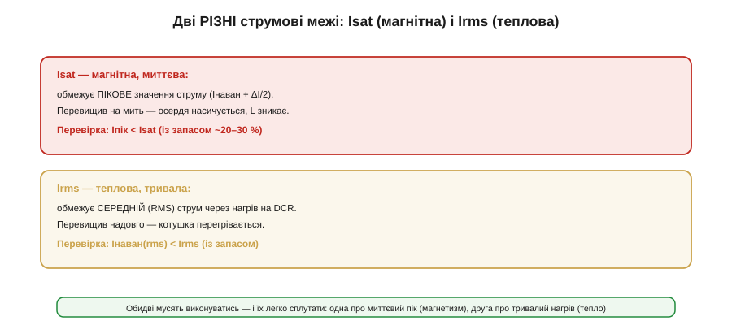
*Рис. 10.2.3.3. Isat — магнітна, миттєва: обмежує пік струму (перевищив на мить — осердя насичується). Irms — теплова, тривала: обмежує середній (RMS) струм через нагрів на DCR (перевищив надовго — котушка перегрівається). Обидві мусять виконуватись, і їх легко сплутати.*

**Isat** — **магнітна** межа: вона про **миттєвий пік**. Перевищили хоч на мить — осердя насичується, L зникає. Тут важить найбільше значення струму, навіть короткий сплеск.

**Irms** — **теплова** межа: вона про **тривалий нагрів**. Струм тече крізь опір обмотки DCR і гріє її (I²·DCR — те саме джоулеве тепло з §1.3). Irms — це той RMS-струм, за якого котушка нагрівається на допустиму величину (часто +40 °C). Перевищили надовго — котушка перегрівається, ізоляція дерадує, у крайньому разі осердя втрачає властивості.

Різниця критична. Можна мати котушку, що легко тримає пік 4 А (Isat великий), але перегрівається на тривалих 3 А (Irms малий) — чи навпаки. Тому перевіряють **обидві**: Iпік < Isat (із запасом) **і** Iнаван(rms) < Irms (із запасом). Пропустиш одну — і котушка підведе або миттєво (насичення), або згодом (перегрів).

> 🔧 **Навіщо це.** Перше, що роблять із даташитом котушки, — знаходять **обидва** струмові числа й не плутають їх. «Котушка на 5 А» нічого не каже, поки не уточнено, це Isat чи Irms. Для нашого вузла потрібні **і** Isat ≥ 4.5 А (на пік 3.5 А), **і** Irms ≥ 3.5 А (на тривалі 3 А) — і це можуть бути різні рядки даташита. Практичне правило: спершу беруть більше з двох потрібних значень, а тоді шукають котушку, у якої **обидва** паспортні струми його перекривають із запасом.

### Чому котушка фізично велика

Тут варто зрозуміти, чому котушку не можна зробити як завгодно малою. Вона мусить **запасати енергію** ½·L·Iпік² щоцикл (§2.2.3), а запасти магнітну енергію можна лише в певному **об'ємі** осердя (та зазору — згадайте flyback, §10.1.6). Більший струм чи більша L — більше енергії — більший потрібний об'єм. Тому котушка на 6.8 мкГ / 4.5 А неминуче більша за котушку на 1 мкГ / 1 А: фізику не обдуриш, енергії треба де поміститися. Звідси й зв'язок із частотою: піднявши f, ми зменшуємо потрібну L (а отже, запасену енергію), і котушка дрібнішає — рівно та логіка «менша магнетика», що ми бачили в §10.2.2.

Звідси й **трикутник компромісів** котушки: малий розмір, малий DCR, високий Isat — одночасно всі три не бувають. Хочете дрібну з високим Isat — матимете товще осердя й менше міді, тобто вищий DCR (більше втрат). Хочете дрібну з малим DCR — пожертвуєте Isat. Хочете і високий Isat, і малий DCR — котушка буде велика. Реальний добір — це завжди вибір **двох із трьох** під ваше ТЗ. На практиці саме котушка часто виявляється найбільшим і найвищим компонентом перетворювача — тож її розмір диктує і висоту складання, і площу плати, і нерідко стає тим обмеженням, заради якого підіймають частоту.

### Втрати: мідь і осердя

Чому взагалі котушка гріється? Через дві сім'ї втрат.

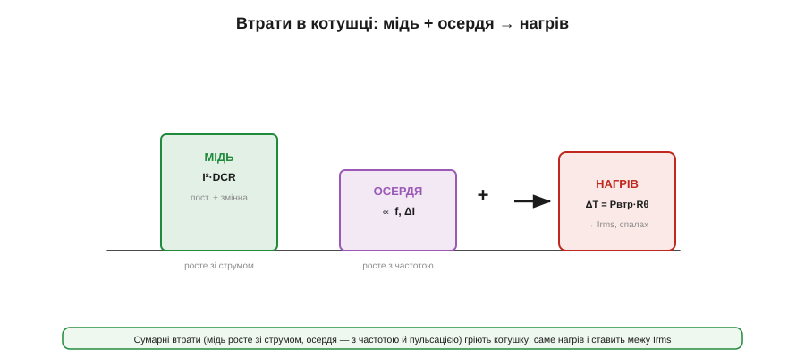
*Рис. 10.2.3.4. Мідні втрати (I²·DCR) ростуть зі струмом — це нагрів обмотки. Втрати в осерді ростуть із частотою й пульсацією (∝ f, ΔI) — це перемагнічування матеріалу. Разом вони дають сумарне тепло, а воно через тепловий опір Rθ підіймає температуру котушки — і саме нагрів ставить межу Irms.*

**Мідні втрати** — на опорі обмотки: Pмідь = I²·DCR. Вони ростуть зі струмом і складають головну частину на великому навантаженні. Менший DCR — менше втрат і нагріву, але менший DCR зазвичай означає товщий дріт, а отже **більшу** котушку. Це прямий компроміс «DCR проти розміру». Тонкість: для змінної складової струму (пульсації) дріт чинить **більший** опір, ніж постійному, — через поверхневий ефект (струм тисне до поверхні дроту на високій частоті). Тож реальні мідні втрати трохи вищі за просте I²·DCR, і на високих частотах це варто пам'ятати.

**Втрати в осерді** — на перемагнічуванні матеріалу змінним полем: вони ростуть із **частотою** комутації й розмахом **пульсації** (∝ f, ΔI). На високій частоті чи великій пульсації осердя може гріти не менше за мідь, і саме тому матеріал осердя добирають під робочу частоту.

Сума цих втрат через тепловий опір котушки Rθ і дає нагрів ΔT = Pвтр·Rθ — той самий, що ховається за параметром Irms. Тобто Irms — не магія, а просто струм, за якого мідні втрати нагрівають котушку рівно на паспортну межу.

### Тверде проти м'якого насичення

Останній штрих — **матеріал осердя**, бо від нього залежить **характер** насичення.

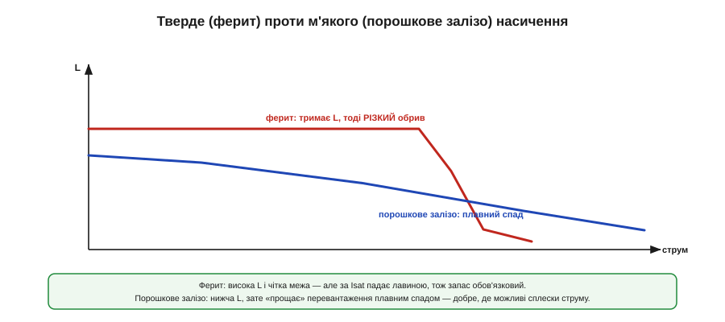
*Рис. 10.2.3.5. Ферит тримає високу L аж до Isat, а тоді падає різко («тверде» насичення) — потужно, але потребує запасу. Порошкове залізо насичується плавно («м'яке»): L нижча й спадає поступово, зате котушка «прощає» перевантаження, не обвалюючись миттєво.*

**Ферит** дає високу індуктивність і тримає її до самого Isat, але за порогом падає **лавиною** («тверде» насичення). Це ефективно, та небезпечно: ступиш за межу — і L зникає миттєво, тож запас обов'язковий. **Порошкове залізо** (та подібні розподілені осердя) насичується **плавно**: індуктивність нижча й спадає поступово зі струмом. Така котушка «прощає» короткі перевантаження — на сплеску L просто трохи зменшиться, а не обвалиться. Тому де можливі несподівані кидки струму, м'яке насичення додає безпеки, хоч і ціною трохи більшої котушки на ту саму L.

Окремо варто згадати **екранування**. Котушка випромінює магнітне поле зі свого зазору, і це поле — джерело завад. **Екранована** (*shielded*) котушка замкнена в магнітний корпус, що утримує поле всередині: менше завад, добре поряд із радіо чи чутливими давачами (згадайте ЕМС-турботи §10.2.2). **Неекранована** дешевша й часом дрібніша, зате «світить» полем навсібіч. Біля приймача чи аналогового вузла беруть екрановану, навіть якщо вона трохи дорожча, — інакше її поле наведеться куди не треба.

### Наскрізний вибір котушки

Зведімо все в покрокову процедуру — на нашому вузлі 5 В / 3 А.

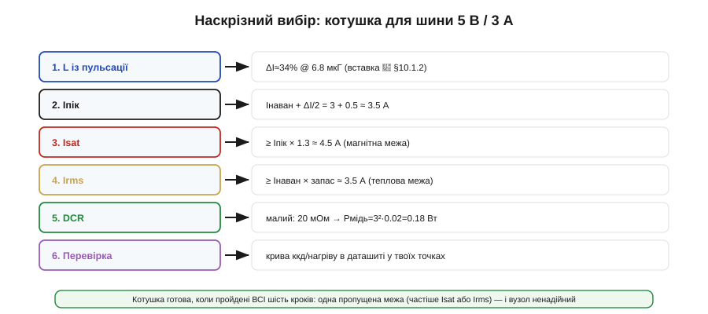
*Рис. 10.2.3.6. Шість кроків: L із пульсації → пік струму → перевірка Isat (магнітна) → перевірка Irms (теплова) → DCR і мідні втрати → звірка з кривими ккд/нагріву в даташиті. Котушка готова, коли пройдені всі шість.*

```
1. L із пульсації:   6.8 мкГ  (ΔI ≈ 34 % @ 3 А — вставка 🧮 до §10.1.2)
2. Пік струму:        Iпік = Iнаван + ΔI/2 = 3 + 1.03/2 ≈ 3.5 А
3. Isat (магнітна):   ≥ Iпік × 1.3 ≈ 4.5 А
4. Irms (теплова):    ≥ Iнаван із запасом ≈ 3.5 А
5. DCR:               малий, напр. 20 мОм → Pмідь = 3²·0.02 = 0.18 Вт
6. Перевірка:         крива нагріву/ккд у даташиті в наших точках
```

Шукаємо в каталозі котушку 6.8 мкГ, у якої Isat ≥ 4.5 А **і** Irms ≥ 3.5 А **і** DCR близько 20 мОм у прийнятному корпусі. Якщо такої немає в потрібному розмірі — це сигнал перепродумати: підняти частоту (менша L, менша котушка — §10.2.2), пом'якшити вимогу до пульсації або змиритися з більшим корпусом. Котушка готова лише тоді, коли пройдені **всі шість** кроків.

> 🧮 **Повний розрахунок у вставці.** Той самий шестикроковий добір, проведений від першого числа до готового рядка специфікації на іншому вузлі (buck 5 В → 3.3 В, 2 А) — у математичній вставці [🧮 Вибір котушки покроково](r02-s3-m-inductor-selection.md).

І остання порада з практики: різні виробники визначають «номінальний струм» **по-різному** — хтось за нагрівом на +40 °C, хтось на +20 °C, хтось дає Isat за падінням L на 10 %, а хтось на 30 %. Тому **порівнювати котушки за самим лиш заголовним числом не можна** — треба відкрити **криві**: L від струму (де насправді починається обрив) і нагрів від струму (де насправді теплова межа). Дві котушки «на 4 А» від різних фірм можуть поводитися геть по-різному; правду кажуть лише графіки, а не рядок у таблиці порівняння.

> 🔧 **Навіщо це.** Найчастіша помилка добору котушки — узяти потрібну індуктивність, але проґавити одну зі струмових меж. Котушка 6.8 мкГ із Isat 3 А «працюватиме» на столі за малого навантаження — і насититься на повному газі, спаливши ключ. Тому L — лише перший крок; межі Isat та Irms не менш обов'язкові.

### Підсумок теми

Котушку перетворювача добирають за даташитом, і одного числа замало. **L** беруть із пульсації (§10.1.2). Далі — дві **різні** струмові межі, які легко сплутати: **Isat** (магнітна, миттєва) обмежує пік струму — за нею осердя насичується й індуктивність «зникає», вбиваючи ключ; **Irms** (теплова, тривала) обмежує середній струм через нагрів на DCR. Обидві перевіряють із запасом. **Втрати** — мідні (I²·DCR, ростуть зі струмом) і в осерді (∝ f, ΔI, ростуть із частотою) — дають нагрів, що й ховається за Irms. **Матеріал** осердя задає характер насичення: ферит — потужно, але різкий обрив; порошкове залізо — плавно й «прощає» сплески. Пройшовши шість кроків добору (L → пік → Isat → Irms → DCR → звірка), маємо надійну котушку. І не забуваймо про конструкцію: екранована проти неекранованої (поле й завади) та матеріал осердя (характер насичення) — це теж частина вибору, а не дрібниця. Тепер до пари котушки — вхідних і вихідних конденсаторів, де головним героєм стане ESR.

---

## 10.2.4 Конденсатори входу й виходу: ESR і пульсації

Котушка не працює сама — обабіч перетворювача стоять конденсатори (§2.1), і їх **двоє різних**, із геть різними завданнями. Вихідний бореться з пульсацією **напруги**; вхідний — із ривками **струму**, і саме він, усупереч інтуїції, опиняється в найважчому режимі. А спільний лиходій обох — паразитний опір ESR.

### Дві ролі: вхідний і вихідний


*Рис. 10.2.4.1. Вхідний конденсатор: перетворювач смикає вхід імпульсами, і кондер віддає ці ривки, щоб джерело бачило гладкий струм (інакше дзвін на дроті й завади). Несе великий RMS-струм — найважчий режим. Вихідний конденсатор: згладжує трикутник струму котушки в маленьку пульсацію напруги й тримає вихід під час стрибка навантаження.*

Ці дві ролі легко сплутати, бо «конденсатор для згладжування» звучить однаково. Та **вихідний** конденсатор працює з **напругою**: він приймає змінну частину струму котушки й перетворює її на дрібну пульсацію вихідної напруги, а ще тримає вихід у перші миті стрибка навантаження. **Вхідний** же працює зі **струмом**: buck смикає з входу різкі імпульси (повний струм, поки ключ відкритий, і нуль, поки закритий), і вхідний кондер мусить ці імпульси віддавати локально, щоб батарея чи джерело бачили гладкий струм. Розберімо кожен.

### Вихідний: ESR і пульсація напруги

Вихідну пульсацію (з §10.1.2) задають **дві** складові, і ESR — ключ до розуміння, яка домінує.


*Рис. 10.2.4.3. Повна пульсація = ємнісна (ΔI/8fC, плавна, спадає з більшою C) + на ESR (ΔI·ESR, гостра, у фазі зі струмом котушки). З електролітом ESR великий і домінує гостра складова; з керамікою ESR мізерний і лишається плавна ємнісна. Тому на виходи перетворювачів ставлять кераміку.*

```
ΔVвих = ΔI/(8·f·C)   [ємнісна]   +   ΔI·ESR   [на ESR]
```

Перша складова спадає з більшою ємністю, друга — з меншим ESR. У старих **електролітичних** конденсаторах ESR великий (десятки-сотні міліом), тож пульсація напруги майже повторює трикутник струму — домінує доданок на ESR. У сучасній **кераміці** ESR мізерний (одиниці міліом), і лишається переважно плавна ємнісна складова. Саме тому на виходи перетворювачів ставлять кераміку: вона прибирає гостру складову майже повністю.

**Приклад (вихідна пульсація).** Наш вузол: ΔI ≈ 1.03 А, f = 500 кГц, кераміка з ESR ≈ 3 мОм:

```
на ESR:   ΔV = ΔI·ESR = 1.03·0.003 ≈ 3 мВ        (крихітна!)
ємнісна:  щоб ΔVємн ≈ 20 мВ:  C = ΔI/(8·f·ΔV)
          = 1.03 / (8·500·10³·0.02) ≈ 13 мкФ
```

З керамікою доданок на ESR (3 мВ) майже не видно, а пульсацію визначає ємність: ~13 мкФ дають ~20 мВ — у межах ТЗ (≤50 мВ).

> 🧮 **Числове порівняння у вставці.** Наскільки по-різному поводяться кераміка й електроліт (7.7 мВ ємнісної проти 136 мВ на ESR — попри ×10 ємності!) і яку стратегію зменшення пульсації обрати для кожного — у математичній вставці [🧮 Дві складові пульсації](r02-s4-m-ripple-esr.md).

### Вихідний і перехідний процес

Та пульсацією добір вихідного кондера не закінчується. Згадаймо ТЗ (§10.2.1): на стрибку навантаження вихід не сміє провалитися глибше за ΔVмакс. У перші миті стрибка, поки контур ще не відреагував, **увесь** додатковий струм віддає саме вихідний конденсатор — за рахунок запасеної енергії. Тому вимога на перехідний процес часто диктує **більшу** ємність, ніж сама пульсація.

Прикиньмо: стрибок 0.5 → 3 А (ΔIнаван = 2.5 А), контур реагує за ~10 мкс, провал ≤ 150 мВ. Грубо конденсатор має віддати цей струм за час реакції, не просівши понад межу:

```
C ≳ ΔIнаван · Δt / ΔV = 2.5 · 10·10⁻⁶ / 0.15 ≈ 167 мкФ
```

Це **на порядок** більше за 13 мкФ, потрібні для самої пульсації. Отже, вихідну ємність визначає **жорсткіша** з двох вимог — і тут це перехідний процес, а не пульсація. Звідси й практика: кілька керамічних конденсаторів у паралель, щоб набрати і ємність для перехідного, і низький ESR для пульсації.

> 🔧 **Навіщо це.** Рахуючи вихідний конденсатор, перевірте **обидві** вимоги — пульсацію й перехідний процес — і візьміть більшу ємність. Найчастіша помилка: підібрати C лише за пульсацією, а тоді ловити просадки й перезавантаження на стрибках навантаження, бо запасеної енергії забракло.

### Вхідний: найважчий режим

Тепер — несподіванка цієї теми. Найбільш навантажена деталь живлення — часто саме **вхідний** конденсатор. Чому?

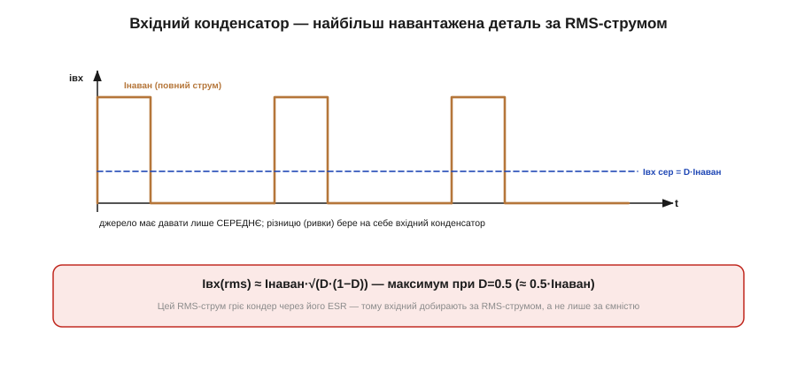
*Рис. 10.2.4.2. Buck смикає з входу струм ІМПУЛЬСАМИ: повний струм навантаження, поки ключ відкритий, і нуль, поки закритий. Джерело має давати лише середнє (D·Iнаван), а всю різницю — гострі ривки — бере на себе вхідний конденсатор. Він несе великий RMS-струм Iнаван·√(D(1−D)), і цей струм гріє його через ESR.*

Buck бере з входу **рваний** струм, а батарея чи джерело з довгим дротом такого не люблять (дріт має індуктивність — §2.2, і на ривках виникає дзвін і завади). Тому вхідний кондер ставлять **локально**, щоб він віддавав ці імпульси сам, а джерело бачило гладкий середній струм. Платою є великий **RMS-струм пульсації**, що тече крізь кондер:

```
Iвх(rms) ≈ Iнаван · √(D·(1−D))   — максимум при D=0.5 (≈ 0.5·Iнаван)
```

**Приклад (RMS вхідного).** Vвх = 16.8 В, Vвих = 5 В, D = 0.30, Iнаван = 3 А:

```
Iвх(rms) ≈ 3 · √(0.30·0.70) = 3 · √0.21 ≈ 3 · 0.46 ≈ 1.4 А
```

Цей струм тече крізь ESR конденсатора й **гріє** його (Irms²·ESR), тож вхідний добирають **за RMS-струмом**, а не лише за ємністю. Конденсатор із замалим рейтингом RMS-струму перегріється й помре першим — і це найчастіша причина «несподіваної» відмови живлення. Часто доводиться ставити **кілька** конденсаторів у паралель, щоб розподілити цей струм.

Є й друга причина, чому вхідний кондер критичний, — **швидкість** цих ривків. Струм перемикається за наносекунди, а будь-який дріт чи доріжка має індуктивність (§2.2); різкий di/dt на цій індуктивності дає викид напруги (V = L·di/dt) і **дзвін** на вході. Якщо вхідний кондер далеко від ключів, петля струму довга, її індуктивність велика — і дзвін б'є по входу й випромінюється завадами. Тому вхідну кераміку тулять **впритул** до ключів, замикаючи цю гарячу петлю якомога коротше (про що — у §10.2.6). Вхідний кондер — це не лише запас заряду, а й глушник високочастотного дзвону.

> 🔧 **Навіщо це.** Не недооцінюйте вхідний конденсатор: за RMS-струмом він нерідко найважче навантажена деталь усього вузла. Дивіться в даташит не лише ємність, а й **допустимий пульсаційний струм** (та ще й при робочій температурі — у спеку він нижчий), і беріть із запасом. Згоріла «на рівному місці» зарядка — часто це засохлий чи перегрітий вхідний кондер.

### Типи: кераміка, полімер, електроліт, тантал

Який конденсатор куди — залежить від типу.

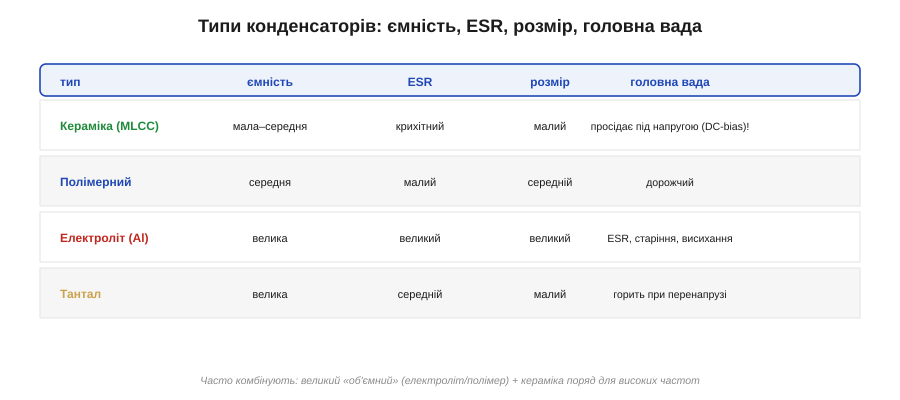
*Рис. 10.2.4.4. Кераміка (MLCC): крихітний ESR і розмір, але просідає під напругою. Полімерний: малий ESR, стабільний, дорожчий. Електроліт: велика ємність, але великий ESR і старіння. Тантал: компактний, та горить при перенапрузі. Часто комбінують об'ємний (електроліт/полімер) із керамікою поряд.*

- **Кераміка (MLCC)** — крихітний ESR, малий розмір, дешева; ідеальна для пульсації й високих частот. Вада — просідання ємності під напругою (про це нижче) і схильність до мікротріщин і «співу».
- **Полімерний** — малий стабільний ESR, велика ємність, не висихає; чудовий, але дорожчий. Часто заміняє електроліт там, де важить ESR.
- **Електролітичний (алюмінієвий)** — велика ємність дешево, але **великий ESR**, старіння й висихання (особливо в спеку). Для об'ємного накопичення, не для високих частот.
- **Тантал** — компактний за ємністю, середній ESR; небезпечний тим, що при перенапрузі може **загорітися**, тож вимагає запасу за напругою.

Як і з котушкою, тут діє правило **запасу за напругою** (§10.2.3): конденсатор на 25 В не ставлять на 25-вольтову шину — беруть із запасом, типово ×1.5–2, бо реальні сплески перевищують номінал, а близька до межі деталь старіє швидше (тантал так і поготів). Окрема історія — **ресурс електроліта**: він поступово **висихає**, і то швидше, що гарячіше (кожні +10 °C приблизно вдвічі коротять життя). Тому в гарячому вузлі електроліт — слабка ланка надійності, і там, де можна, його заміняють полімером чи керамікою.

Звідси поширена практика — **комбінувати**: великий об'ємний конденсатор (електроліт чи полімер) тримає низькочастотну енергію, а дрібна кераміка поряд гасить високочастотну пульсацію й ривки. Так дістають і ємність, і низький ESR на всіх частотах.

Чому саме разом? Бо в кожного конденсатора **імпеданс залежить від частоти**, і жоден не добрий на всьому діапазоні. Великий електроліт має багато ємності, але його власна індуктивність і ESR роблять його «глухим» на високих частотах — швидкий ривок він не встигає віддати. Дрібна кераміка навпаки: ємності мало, зате імпеданс малий аж до десятків мегагерц — вона миттєво гасить гострі фронти. Поставивши їх **у паралель**, дістають низький імпеданс і на низах (об'ємний тримає енергію), і на верхах (кераміка ловить фронти) — рівно те, що треба перетворювачу, який працює одразу на багатьох частотах.

### Підступ кераміки: просідання під напругою

Кераміка має одну пастку, на якій спотикаються всі новачки, — **просідання ємності під напругою** (*DC bias*).

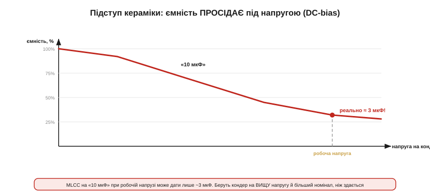
*Рис. 10.2.4.5. Ємність MLCC падає зі зростанням прикладеної напруги: конденсатор, маркований «10 мкФ», при робочій напрузі може дати лише ~3 мкФ. Тому беруть кераміку на ВИЩУ номінальну напругу й більший номінал, ніж потрібно «на папері».*

Маркована ємність MLCC — це значення при **нулі** вольт. Прикладіть робочу напругу — і ємність **обвалюється**: «10 мкФ» при напрузі, близькій до номінальної, можуть стати 3–4 мкФ. Причина — у властивостях діелектрика, що змінюється під полем. Наслідок жорсткий: якщо ви порахували, що треба 13 мкФ, і поставили один «10 мкФ» — реально матимете втричі менше, і пульсація вийде поза ТЗ.

Рятунок — **запас**: брати кераміку на **вищу** робочу напругу (де просідання менше) і **більший** номінал, ніж потрібно за розрахунком (типово ×2–3). І завжди звіряти не з маркуванням, а з **кривою ємність-напруга** в даташиті — як і з котушкою (§10.2.3), правду кажуть лише графіки.

У кераміки є й дрібніші підступи. По-перше, **спів**: MLCC п'єзоелектрична, тож пульсація напруги змушує її механічно вібрувати, і на чутних частотах конденсатор тоненько **пищить** — той самий ефект, що й «спів» котушки. По-друге, **тріщини**: керамічне тіло крихке, і згин плати (від кріплення, удару, теплового розширення) може його надламати — а тріщина в конденсаторі живлення дає або обрив, або поступове коротке замикання. Тому крупні MLCC ставлять подалі від країв і отворів плати, а часом беруть варіанти з гнучкими виводами. По-третє, кераміка **стабільна з роками** (на відміну від електроліта, що висихає в спеку), та її параметри плавають із температурою — що теж дивляться в даташиті.

### Наскрізний вибір конденсаторів


*Рис. 10.2.4.6. Вихідний добирають за пульсацією (ємність + ESR) і за перехідним процесом (бере більше); вхідний — за RMS-струмом пульсації; кераміку рахують з урахуванням DC-bias; і все це розміщують щільно до ключів (коротка гаряча петля — §10.2.6).*

Зведімо процедуру для нашого вузла 5 В / 3 А: **вихідний** — кераміка, ємність за жорсткішою з вимог (тут ~167 мкФ за перехідним, не 13 за пульсацією), низький ESR; набираємо кількома MLCC з урахуванням DC-bias. **Вхідний** — кераміка з сумарним RMS-рейтингом ≥ 1.4 А (із запасом — кілька штук у паралель), на робочу напругу 16.8 В + запас. **DC-bias** — номінали кераміки беремо із запасом ×2–3. А **розміщення** (про нього — далі, у §10.2.6) не менш важливе за номінали: кераміку тулять щільно до ключів, бо саме там біжать найгарячіші імпульсні струми.

### Підсумок теми

Обабіч перетворювача — два конденсатори з різними завданнями. **Вихідний** бореться з пульсацією напруги (ΔV = ємнісна ΔI/8fC + на ESR ΔI·ESR; з керамікою домінує ємнісна), але його розмір частіше диктує **перехідний процес**, що вимагає більшої ємності, ніж сама пульсація. **Вхідний** — несподівано найважча деталь: buck смикає вхід імпульсами, і кондер несе великий RMS-струм Iнаван·√(D(1−D)) (для нас ≈ 1.4 А), що гріє його через ESR, — тож його добирають за пульсаційним струмом, а не ємністю. **Типи** різняться: кераміка (низький ESR, але DC-bias-просідання), полімер (стабільний), електроліт (об'ємний, але ESR і старіння), тантал (компактний, та горючий); часто їх комбінують. І головний підступ кераміки — **просідання ємності під напругою**, через що беруть запас ×2–3 і вищу робочу напругу; до цього додаються спів, тріщини, запас за напругою й висихання електролітів у спеку. Через ці компроміси конденсатори часто **комбінують** — об'ємний плюс кераміка — щоб дістати низький імпеданс на всіх частотах. Маючи котушку й конденсатори, лишилося правильно їх з'єднати: наступна тема — розводка перетворювача, де гаряча петля стане головним героєм, а близькість вхідної кераміки до ключів — критичною.

---

## 10.2.5 Зворотний зв'язок і стабільність якісно

Ми вже знаємо (§7.4.2), що перетворювач тримає вихід сталим **зворотним зв'язком**: міряє свою напругу, порівнює з ціллю й підкручує шпаруватість. Тепер — як цей контур влаштований на практиці й що робить його **стійким** чи нестійким. І одразу домовимося про межу: **класичну теорію керування** (передатні функції, діаграми Боде, запас фази) ми свідомо лишаємо поза курсом. Замість рахувати стійкість формулами, ми навчимося **перевіряти** її на осцилографі — простим тестом, якого вистачає інженеру-практику.

### Контур: виміряти → порівняти → виправити

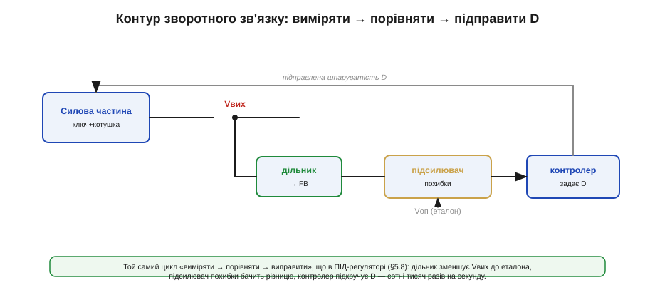
*Рис. 10.2.5.1. Той самий цикл «виміряти → порівняти → виправити», що в ПІД-регуляторі (§5.8). Дільник зменшує Vвих до рівня еталона; підсилювач похибки бачить різницю між цим сигналом і опорною напругою; контролер за цією різницею підкручує шпаруватість D — і так сотні тисяч разів на секунду.*

Контур складається з чотирьох ланок. **Силова частина** (ключ із котушкою) робить вихідну напругу. **Дільник** зменшує Vвих до зручного рівня. **Підсилювач похибки** порівнює його з **опорною** напругою (еталоном) і бачить, наскільки вихід відхилився. **Контролер** за цією похибкою підправляє шпаруватість D — і коло замикається. Це той самий «виміряти → порівняти → виправити», що крутиться в будь-якому регуляторі зі зворотним зв'язком (§7.3.6); просто тут він працює на сотнях кілогерц і керує енергією.

### Дільник задає напругу

Найперше практичне: **звідки береться саме 5 В**, а не 3.3 чи 12. Відповідь — у дільнику.

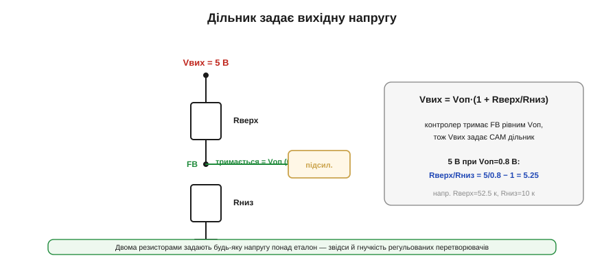
*Рис. 10.2.5.2. Контролер тримає вузол FB рівним внутрішньому еталону (часто 0.8 В). Два резистори дільника від Vвих до FB і від FB до землі задають, якій Vвих відповідає цей еталон: Vвих = Vоп·(1 + Rверх/Rниз). Двома резисторами задають будь-яку напругу понад еталон.*

Усередині контролер має точну **опорну напругу** (Vоп), типово 0.8 В, і всю свою роботу зводить до одного: тримати вузол **зворотного зв'язку** (FB) рівним цьому еталону. А якій вихідній напрузі відповідатиме FB = Vоп — задаєте ви, дільником із двох резисторів:

```
Vвих = Vоп · (1 + Rверх/Rниз)

для 5 В при Vоп = 0.8 В:
   Rверх/Rниз = 5/0.8 − 1 = 5.25
   напр.  Rверх = 52.5 кОм,  Rниз = 10 кОм
```

Контролер «не знає», що робить 5 В, — він тупо тримає FB на 0.8 В, а дільник перекладає це в потрібний вихід. Звідси й гнучкість: міняючи два резистори, дістаєте будь-яку напругу понад еталон з тієї самої мікросхеми. (А в перетворювачах із фіксованим виходом дільник уже зашитий усередину.)

Вузол FB при цьому **дуже чутливий**: це високоомна точка, де живе крихітний сигнал похибки, тож будь-яка наведена завада «обманює» контролер і гуляє по виходу. Тому дільник ставлять **близько** до мікросхеми, доріжку FB ведуть короткою й подалі від гарячого вузла перемикання, а «землю» дільника беруть із тихої точки — усе це вже частина розводки (§10.2.6), та починається з розуміння, що FB чіпати завадою не можна.

### Напруга швидкості й стабільності

Тепер — серце теми. Контур хочеться зробити **швидким**, щоб на стрибку навантаження вихід ледь просідав (згадайте перехідний процес із §10.2.1). Але надто швидкий, агресивний контур має ваду: він **перестарається** і почне розгойдувати вихід. У цьому й уся напруга — між швидкістю й стійкістю.

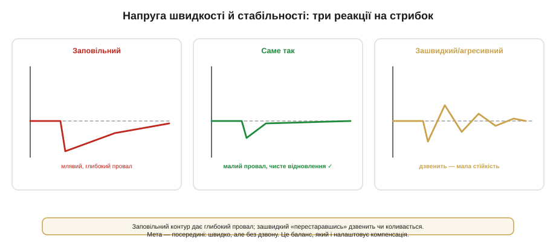
*Рис. 10.2.5.3. Три реакції на той самий стрибок навантаження. Заповільний контур: глибокий, млявий провал. Саме так: малий провал і чисте відновлення. Зашвидкий/агресивний: вихід «дзвенить» — кілька циклів перельотів, бо контур щоразу перекориговує. Мета — посередині.*

**Заповільний** контур реагує мляво: вихід глибоко провалюється й довго вертається — погано, бо порушує ТЗ на провал. **Зашвидкий** — інша крайність: він реагує так різко, що перестрибує ціль, потім перестрибує назад, і вихід **дзвенить** загасаючими коливаннями (а в найгіршому разі — не загасаючими, тобто стає **нестійким**). Здоровий контур — **посередині**: досить швидкий, щоб провал був малим, але не настільки агресивний, щоб дзвеніти.

### Чому контур дзвенить

Звідки беруться ці перельоти? Із **запізнення**. Контур реагує не миттєво — між «вихід просів» і «контролер додав D, і енергія дійшла до виходу» минає час. Якщо за цей час контур устиг скоригувати **надто сильно**, то, коли його корекція нарешті подіє, вихід уже не просто повернувся, а **перескочив** угору. Контур бачить новий перебір — і різко коригує назад, аж до недольоту. І так гойдається.

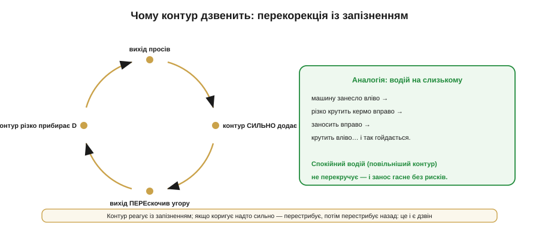
*Рис. 10.2.5.4. Перекорекція із запізненням: вихід просів → контур СИЛЬНО додав D → вихід перескочив угору → контур різко прибрав D → недоліт… і так по колу. Точно як водій на слизькій дорозі: занесло вліво — різко крутить вправо — заносить вправо — крутить вліво, розгойдуючи машину. Спокійніший (повільніший) водій не перекручує — і занос гасне.*

Аналогія з **водієм на слизькому** тут точна. Перелякавшись заносу, водій-новачок шарпає кермо надто сильно в інший бік — і машину заносить туди, потім він шарпає назад, розгойдуючи її дедалі дужче. Досвідчений водій коригує **м'якше** й із випередженням — і занос гасне. Так само й контур: надмірна «сила» реакції із запізненням породжує розгойдування; стійкий контур реагує енергійно, але не настільки, щоб переганяти сам себе.

Звідки ж саме береться запізнення? Із кількох місць одразу. По-перше, **сама силова частина** інертна: щоб змінити вихід, треба змінити струм котушки, а той міняється не миттєво (V = L·di/dt), та ще й конденсатор згладжує — енергія повзе до виходу з затримкою. По-друге, перетворювач може правити шпаруватість лише **раз за цикл** комутації, тож на дуже швидкі події він реагує з кроком у такт. По-третє, дрібну затримку додають вимірювання й порівняння. Усі ці запізнення складаються — і саме тому надто «сильна» реакція встигає перестрибнути ціль, перш ніж контур побачить результат. Стійкість — це мистецтво реагувати рівно настільки, наскільки система встигає відгукнутися.

А деякі топології запізнюються особливо підступно. Згадаймо boost (§10.1.3): коли він хоче **підняти** вихід, то спершу довшою фазою ВКЛ на мить його **просаджує** — «зворотна реакція». Через цей вроджений виверт контур boost доводиться робити **повільнішим** і обережнішим, ніж у buck, щоб не зірватися в коливання. Тому, якщо вже знайомий buck інколи дзвенить, то boost вимагає ще більшої поваги до запасу стійкості.

### Компенсація: приборкати контур

Як зробити контур і швидким, і спокійним водночас? Цим займається **компенсація** (*compensation*) — навмисне формування реакції контуру кількома резисторами й конденсаторами навколо підсилювача похибки (або наперед зашите всередині контролера). Не вдаючись у математику, скажемо, **що** вона робить: вона **притлумлює** реакцію контуру там, де той схильний перестаратися (на швидких частотах), лишаючи його енергійним там, де треба. Образно — це «м'якша рука на кермі»: компенсація не дає контуру шарпатися, зберігаючи його загальну швидкість.

На практиці компенсація буває двох видів. **Внутрішня** — коли контролер уже скомпенсований всередині під типовий вихід; тоді вам нічого рахувати, лише дотриматися рекомендацій даташита щодо котушки й конденсаторів. **Зовнішня** — коли ви самі ставите R та C компенсації; тоді беруть готову процедуру з даташита (чи фірмовий калькулятор) — саме щоб **не** виводити передатних функцій вручну. У сучасних інтегрованих перетворювачах майже завжди перший випадок, і це ще одна причина їх любити.

> 🔧 **Навіщо це.** Вам майже ніколи не доведеться рахувати компенсацію з нуля: беріть перетворювач із внутрішньою компенсацією або дотримуйтесь даташита для зовнішньої. Головне — **не відступати** від рекомендованих діапазонів котушки й конденсаторів: саме під них контур і скомпенсовано, і самовільна заміна легко робить стійкий контур нестійким.

### М'який старт: перший стрибок — увімкнення

Окремий, але споріднений з контуром механізм — **м'який старт** (*soft-start*). При ввімкненні вихід стоїть на нулі, а ціль — далеко вгорі; якби контур ринув туди на повну, він би і вихід перекинув з перельотом, і вхід ударив пусковим струмом (інраш, §10.1.3), бо вихідні конденсатори заряджаються ривком. Тому контролери **плавно піднімають опорну напругу** від нуля до робочої за кілька мілісекунд: вихід слухняно йде за нею вгору гладко, без перельоту й без кидка струму. М'який старт — це той самий контур, тільки з ціллю, що повільно «під'їжджає» до місця; майже всі сучасні перетворювачі мають його всередині або дозволяють задати час старту одним конденсатором.

### Критерій здоров'я: тест стрибком навантаження

А як **переконатися**, що контур здоровий, не рахуючи запасу фази? Подати **стрибок навантаження** й подивитися на вихід осцилографом. Це і є наш критерій здоров'я.

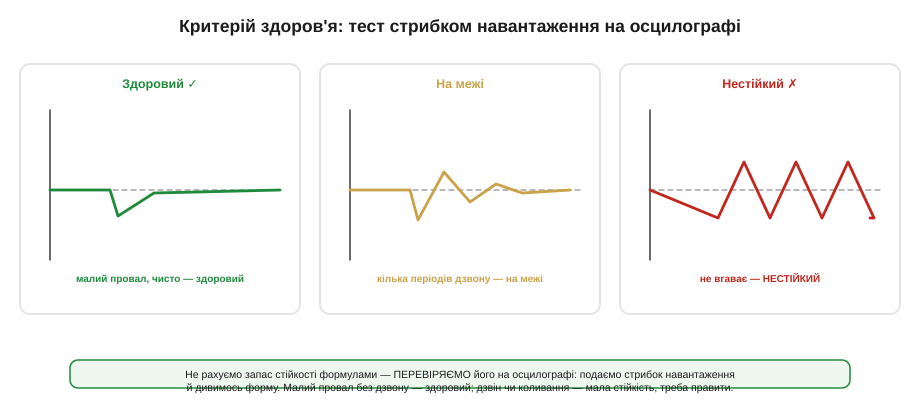
*Рис. 10.2.5.5. Замість формул — осцилограф. Подаємо різкий стрибок навантаження (електронним навантаженням — §1.6.10) і дивимось форму виходу. Здоровий: малий провал і чисте відновлення. На межі: кілька періодів дзвону — стійкість мала. Нестійкий: коливання не вгавають — контур треба правити.*

Методика проста: різко перемкнути навантаження (скажімо, з 10 % на повне) і подивитися на вихідну напругу. **Здоровий** контур дає короткий неглибокий провал і чисте повернення — без дзвону. **На межі** — провал плюс кілька періодів загасаючого дзвону: формально працює, та запас стійкості малий, і за зміни температури чи деталей може зірватися. **Нестійкий** — коливання, що не вгавають: так працювати не можна. Цей тест замінює нам усю діаграму Боде: око бачить дзвін одразу, і чим його менше, тим більший запас стійкості.

> 🧮 **Провал і дзвін у числах — у вставці.** Як прикинути глибину провалу (ESR-крок + просадка ємності) і чому кількість циклів дзвону замінює запас фази — у математичній вставці [🧮 Load step «на пальцях»](r02-s5-m-load-step.md).

Одного виміру, втім, замало: стійкість треба перевіряти **на всьому діапазоні**, а не в одній зручній точці. Контур, чистий на повному навантаженні за 12 В входу, може задзвеніти на легкому навантаженні чи на краю діапазону Vвх (а в DCM, §10.1.2, динаміка взагалі інша). Тому тест load-step проганяють у кутах робочого вікна: мінімальний і максимальний вхід, мале й повне навантаження, гарячий і холодний стан. Корисно перевірити й реакцію на **стрибок входу** (line transient) — різко змінити Vвх і глянути, чи вихід лишився рівним. Запас стійкості, що тримається в усіх кутах, — оце і є по-справжньому здоровий контур.

### Підступ: конденсатор впливає на стійкість

Наостанок — пастка, що ловить багатьох. Стійкість — властивість **усього контуру разом із виходом**, а не лише контролера. І найсильніше на неї впливає **вихідний конденсатор** — точніше, його ємність і ESR.

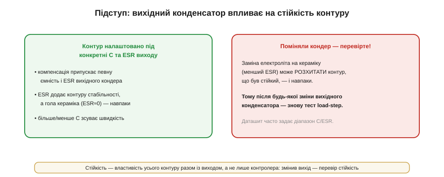
*Рис. 10.2.5.6. Компенсацію налаштовано під певні C та ESR виходу. Цікаво, що ESR часто **додає** контуру стійкості, а гола кераміка з майже нульовим ESR — навпаки, може його розхитати. Тому заміна електроліта на кераміку (чи навпаки) здатна зробити стійкий контур нестійким — і після будь-якої зміни вихідного конденсатора тест load-step повторюють.*

Ось чому це підступно: ESR конденсатора, який у темі про пульсацію був **ворогом** (давав зайву пульсацію), для контуру часто **друг** — він додає стійкості. Тому, замінивши електролітичний конденсатор на «кращу» кераміку з мізерним ESR, можна несподівано **розхитати** контур, що був стійким. Працює й навпаки. Через це даташити перетворювачів часто задають **діапазон** допустимих C та ESR виходу — не для пульсації, а саме для стійкості.

> 🔧 **Навіщо це.** Правило просте: **змінив вихід — перевір стійкість**. Будь-яка заміна вихідного (а часто й вхідного) конденсатора — інша ємність, інший тип, інший ESR — може зачепити контур. Не довіряйте «воно ж більше/краще»: після зміни проганяйте тест load-step знову. І не виходьте за діапазон C/ESR, який радить даташит.

### Підсумок теми

Перетворювач тримає вихід **контуром зворотного зв'язку**: дільник зменшує Vвих до еталона (Vвих = Vоп·(1+Rверх/Rниз)), підсилювач похибки бачить відхилення, контролер підправляє D. Головна напруга — між **швидкістю** (малий провал на стрибку) і **стійкістю** (без дзвону): надто агресивний контур перекориговує із запізненням і розгойдує вихід, як водій-новачок на слизькому. Приборкує це **компенсація** — найчастіше вже зашита в контролер, інакше — за процедурою даташита, без ручних передатних функцій. А **перевіряють** здоров'я не формулами, а **тестом стрибком навантаження** на осцилографі: малий провал без дзвону — здоровий, дзвін — мала стійкість. І пам'ятаймо підступ: стійкість залежить від вихідного конденсатора (особливо ESR), тож після будь-якої його заміни тест повторюють — і не в одній точці, а в усіх кутах діапазону входу й навантаження. Окремо контролер забезпечує **м'який старт**, аби увімкнення не дало ні перельоту, ні кидка струму. Тепер усі вузли пораховані — лишилося їх правильно **розвести** на платі, де навіть бездоганна схема може загинути від поганої топології.

---

## 10.2.6 Розводка перетворювача: гарячі петлі

Усі деталі пораховані, схема бездоганна — і тут починається найважливіше й найнедооціненіше. Бо в імпульсному перетворювачі **розводка плати — це частина схеми**, а не оформлення. Доріжки мають індуктивність і опір, які на високих частотах і різких струмах стають **реальними компонентами**, що їх немає в принциповій схемі. Тому ідеальна схема з поганою розводкою працює погано або не працює зовсім — а це означає, що креслення плати тут не менш важливе за вибір деталей. Недарма цю тему ми звемо **найважливішим прикладом курсу**: саме на ній видно, як геометрія міді перетворюється на електроніку.

### Гаряча петля: коло різаного струму

Головне поняття всієї теми — **гаряча петля** (*hot loop*, power loop): замкнене коло, яким біжить різко перемикуваний струм.


*Рис. 10.2.6.1. У buck гаряча петля — це коло Cвх → Q1 → Q2 → Cвх. Саме в ньому струм РІЖЕТЬСЯ (повний, поки Q1 відкритий, і нуль, поки закритий), тобто має величезне di/dt. Площа цієї петлі — її паразитна індуктивність L; на ній різкий струм дає викид V = L·di/dt, а з ним дзвін на ключах і завади в ефір.*

Розгляньмо buck. Коли верхній ключ Q1 вмикається, струм миттєво кидається з вхідного конденсатора крізь Q1; коли вимикається — так само різко обривається (підхоплює нижній Q2). Цей струм біжить колом **Cвх → Q1 → Q2 → Cвх**, і він **різаний** — стрибає від повного до нуля за наносекунди. Саме тому вхідний конденсатор тут — не просто запас енергії (§10.2.4), а **локальне джерело** цих різких імпульсів: він мусить віддавати їх сам, прямо тут, бо до батареї через довгі доріжки різаний струм «не добіжить» без величезного викиду. А будь-яке коло має паразитну **індуктивність**, пропорційну до його **площі** (§2.2). Помножте величезне di/dt на цю індуктивність — і дістанете різкий **викид напруги** (V = L·di/dt) на ключах щоразу при перемиканні. Цей викид б'є по ключах (аж до пробою), дзвенить, гріє й випромінюється завадами. Уся подальша тема — про те, як цей викид приборкати, і відповідь одна: **зменшити площу гарячої петлі**.

### Правило №1: гаряча петля має бути маленькою

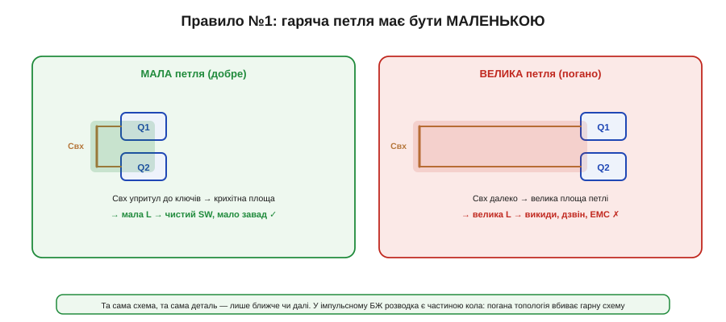
*Рис. 10.2.6.2. Та сама схема, та сама деталь — лише вхідний конденсатор ближче чи далі від ключів. Близько: крихітна площа петлі, мала паразитна L, чистий вузол перемикання, мало завад. Далеко: велика площа, велика L, викиди, дзвін, ЕМС. Розводка є частиною кола — погана топологія вбиває гарну схему.*

Звідси найголовніше правило розводки імпульсних БЖ: **вхідний конденсатор ставлять упритул до ключів**, щоб гаряча петля Cвх → Q1 → Q2 була якомога **меншою за площею**. Мала площа — мала паразитна індуктивність — малі викиди й завади. Це не косметика: та сама схема з конденсатором за сантиметр від ключів і за міліметр від них поводиться **по-різному**, бо площа петлі (а отже, паразитна котушка в ній) відрізняється в рази. Тому вхідну кераміку (§10.2.4) тулять до самих виводів ключів першою, ще до решти розводки — це рішення №1.

Навіть із крихітною петлею частина шуму перемикання все ж проситься на вхідну шину — і там, де її чистота важлива (поряд із радіо чи спільна з чутливими вузлами), на вході ставлять **фільтр**: невелику LC-ланку (або феритову бусину з конденсатором), що не пускає високочастотний шум назад у живлення. Це продовження тих самих ЕМС-турбот із §10.2.2: гаряча петля локалізує шум, а вхідний фільтр доловлює рештки, щоб вони не розповзлися дротами по всьому пристрою.

> 🔧 **Навіщо це.** Якщо запам'ятати з цієї теми одне — нехай це буде: **знайди гарячу петлю й зроби її крихітною**. Конденсатор, поставлений за правилами схеми, але далеко від ключів, дає дзвінкий, гарячий, шумний перетворювач — при бездоганній принциповій схемі. Це причина №1, чому «та сама» плата в одного інженера працює, а в іншого ні.

### Яка петля гаряча: шукай різаний струм

Але петель у перетворювачі кілька — яку саме мінімізувати? Правило просте: гаряча та, де струм **різаний** (переривчастий), а не та, де він безперервний.


*Рис. 10.2.6.3. У buck вхідна петля несе різаний струм (повний/нуль) — вона ГАРЯЧА. Вихідна петля (котушка → Cвих) несе безперервний струм котушки, що міняється плавно, — вона холодна, менш критична. У boost усе навпаки: різаний струм на виході, тож гаряча — вихідна петля.*

У buck **вхідна** петля несе різаний струм (ми щойно бачили), а **вихідна** (котушка → Cвих → назад) — струм котушки, що тече **безперервно** й міняється плавно (трикутником). Тому вихідна петля «холодна»: її геометрія важить менше. А от у **boost** усе дзеркально (§10.1.3): там безперервний струм на вході (котушка перша), а різаний — на виході, де діод рве струм; отже, гаряча петля boost — **вихідна**. Звідси універсальний рецепт: знайдіть, **де струм рветься** (де стоїть ключ, що комутує повний струм), — і саме ту петлю зробіть крихітною. Це працює для будь-якої топології.

### Вузол перемикання: найгаласливіша мідь

Поряд із петлею є ще одна гаряча точка — **вузол перемикання** (*switch node*, SW): мідь між ключем і котушкою. Її напруга стрибає **всім розмахом Vвх** за наносекунди — це найшвидше змінна напруга на всій платі.

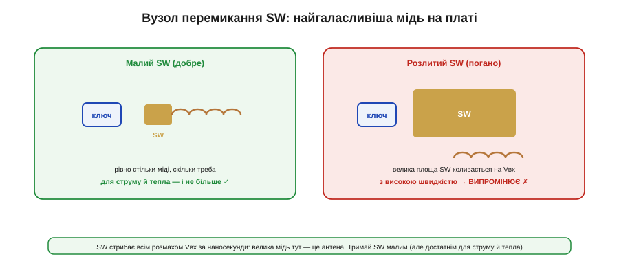
*Рис. 10.2.6.4. SW коливається на повний Vвх із величезною швидкістю. Велика площа міді тут перетворюється на **антену**, що випромінює завади. Тому SW роблять малим — рівно стільки міді, скільки треба для струму й тепловідводу, і не більше. Це компроміс: достатньо для струму, але не настільки, щоб світити в ефір.*

Тут компроміс зворотний до звичайного. Зазвичай більше міді — краще (менший опір, кращий тепловідвід). Але SW — виняток: велика площа міді, що швидко коливається на повний Vвх, стає **антеною** й випромінює завади. Тому SW тримають **малим** — рівно таким, щоб провести струм і відвести тепло від ключа, але не більшим. Це одне з небагатьох місць, де мідь **обмежують** навмисно.

### Земля: суцільний полігон і розділення

Третій стовп розводки — **земля**. Зворотні струми (і силові, і сигнальні) повертаються через «землю», і якщо вона погана, ці струми наводяться одне на одного. Тому під перетворювачем тримають **суцільний полігон землі** (ground plane): він дає кожному струмові короткий тихий шлях назад і екранує.

Та найважливіше — **розділення силового й сигнального**. Гучні силові струми (та сама гаряча петля) не повинні текти крізь ту ділянку землі, до якої під'єднані тихі сигнали — еталон, FB-дільник, давачі. Інакше падіння напруги від силового струму на спільній землі «підмішається» в сигнал, і контролер бачитиме хибну напругу. Силову й сигнальну землю зводять разом в **одній точці** (біля контролера), щоб гучні струми не текли крізь тиху зону.

Тут у пригоді стає **багатошарова** плата. Силові доріжки кладуть на верхній шар, а **прямо під ними** — суцільний полігон землі на сусідньому шарі. Тоді зворотний струм біжить у землі точно під своєю доріжкою, і площа петлі (а отже, паразитна індуктивність) стає мінімальною **сама собою** — земляний шар «віддзеркалює» силове коло й стискає його. Це одна з причин, чому серйозні перетворювачі не роблять на односторонніх платах: без землі під низом гарячу петлю годі стиснути. Сигнальні ж доріжки ховають на внутрішні чи нижній шари, подалі від силового верху.

### Зворотний зв'язок: Kelvin до справжнього виходу

Ми вже знаємо (§10.2.5), що вузол FB чутливий. Розводка вирішує, чи побачить контролер **справжню** вихідну напругу, чи спотворену.

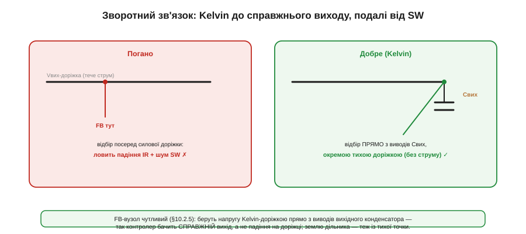
*Рис. 10.2.6.5. Погано: відбір FB посеред силової доріжки — там тече струм, і контролер ловить падіння IR на доріжці плюс шум від SW. Добре: відбір **Kelvin** — окрема тиха доріжка просто з виводів вихідного конденсатора, якою струм не тече. Так контролер міряє напругу саме там, де її бачить навантаження.*

Прийом зветься **відбір Kelvin** (*Kelvin sense*): сигнальну доріжку FB ведуть **окремо** від силової й під'єднують прямо до виводів вихідного конденсатора — у точку, де напруга найближча до тієї, що бачить навантаження. Якщо ж відібрати FB посеред силової доріжки, контролер «прочитає» ще й падіння IR уздовж неї (а воно міняється зі струмом) і наведений шум від SW — і триматиме хибну напругу. Доріжку FB ведуть короткою, подалі від SW і гарячої петлі, а землю дільника беруть із тихої сигнальної точки. Дрібна сигнальна доріжка — а вирішує точність усього виходу.

### Тепловідвід: куди подіти втрати

Останнє — **тепло**. Втрати на ключах, котушці й діоді (теми 10.2.2–10.2.3) треба кудись відвести, а єдиний шлях на платі — мідь. Тому під гарячими деталями роблять **мідні полігони** й «зашивають» їх **перехідними отворами** (via) на внутрішні й нижній шари, розмазуючи тепло по більшій площі. Це той випадок, коли більше міді справді краще (на відміну від SW). Добрий тепловідвід дозволяє тримати менший радіатор або взагалі без нього — а отже, і менший, дешевший вузол.

### Карта доброї розводки

Зведімо все в контрольну карту.

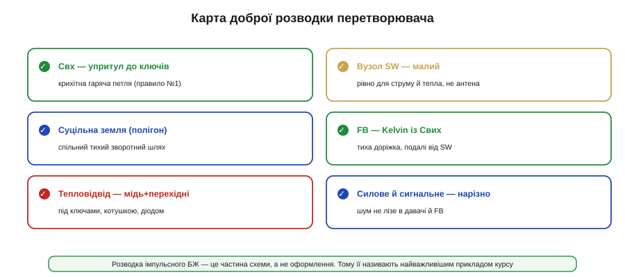
*Рис. 10.2.6.6. Шість правил: вхідний конденсатор упритул до ключів (крихітна гаряча петля), малий вузол SW, суцільна земля-полігон, FB-відбір Kelvin із Cвих, тепловідвід міддю з перехідними отворами під гарячими деталями, і розділення силового й сигнального. Дотримай їх — і навіть проста схема працюватиме чисто.*

Порядок дій на практиці: спершу розмістити **гарячу петлю** (вхідний конденсатор і ключі) якнайщільніше; тоді короткий малий **SW** до котушки; під низ — **полігон землі**; **FB** — окремою тихою Kelvin-доріжкою з виходу; під гарячі деталі — **мідь із via** для тепла; і весь час тримати **силове осторонь сигнального**. Це не прикраси, а схема, продовжена в мідь.

> 🔧 **Навіщо це.** Розводку роблять **до**, а не **після** того, як «схема готова»: вона і є частина схеми. Класична пастка новачка — намалювати бездоганну принципову схему, а тоді абияк розкидати деталі по платі — і дістати дзвінкий, гарячий, шумний вузол, що валить ЕМС-тести й перегрівається. Тому хороший інженер живлення думає про гарячу петлю вже тоді, коли тільки малює схему.

### Як упізнати погану розводку на столі

Погану розводку видно ще до ЕМС-лабораторії — за симптомами на столі. **Дзвін на вузлі SW**: причепили щуп до SW (правильно — пружинкою, §1.6.7, щоб не додати своєї петлі) і бачите гострі викиди й затухаючі коливання на кожному фронті — це гаряча петля завелика. **Гарячі точки**, яких не пояснюють розрахункові втрати, — це поганий тепловідвід або зайвий опір доріжок. **Завади в радіо чи давачах** поряд — велика гаряча петля чи розлитий SW світять в ефір. **Несподівана нестійкість** чи хибна напруга — шум проліз у FB або силовий струм тече крізь сигнальну землю. Усі ці симптоми лікуються не заміною деталей, а **переробкою розводки** — і саме тому її варто зробити правильно з першого разу.

### Підсумок теми

У імпульсному перетворювачі **розводка — це частина кола**, бо паразитні індуктивність і опір доріжок стають реальними компонентами. Центральне поняття — **гаряча петля**, коло різаного струму (у buck: Cвх → Q1 → Q2): її площа є паразитною котушкою, на якій різке di/dt дає викиди, дзвін і завади, тож **правило №1** — зробити цю петлю крихітною, поставивши вхідний конденсатор упритул до ключів. Гарячу петлю знаходять за **різаним струмом** (у buck — вхідну, у boost — вихідну). **Вузол SW** тримають малим, щоб не світив антеною; **землю** роблять суцільним полігоном і розділяють силове від сигнального; **FB** відбирають **Kelvin** просто з виводів вихідного конденсатора; під гарячі деталі кладуть **мідь із перехідними отворами** для тепла. А впізнати погану розводку можна ще на столі — за дзвоном на SW, гарячими точками, завадами й нестійкістю, що лікуються не заміною деталей, а переробкою плати. Усе разом — це найважливіший приклад курсу: місце, де бездоганна схема живе або вмирає від геометрії міді. Лишилося останнє — навчитися **виміряти** готовий перетворювач: пульсації, ккд, теплову карту — щоб переконатися, що він справді відповідає ТЗ.

---

## 10.2.7 Вимірювання: пульсації правильно, ККД, теплова карта

Перетворювач зібрано — час **довести**, що він відповідає ТЗ (§10.2.1). Та вимірювання живлення підступне: поміряєш неправильно — і обдуриш сам себе, побачивши або неіснуючу проблему, або неіснуюче благополуччя. Розберімо три головні виміри — пульсацію (її найлегше зміряти хибно), ккд (його міряють сіткою, а не однією точкою) і теплову карту — а тоді **замкнемо коло**, звіривши кожне число з відповідним рядком ТЗ.

### Пульсація: пастка «хвоста» щупа

Найчастіша помилка всього курсу вимірювань — міряти пульсацію виходу звичайним щупом з довгим **«хвостом»** землі (тим дротиком із крокодилом).


*Рис. 10.2.7.1. Довгий земляний «хвіст» щупа утворює велику петлю просто в полі перемикання. Ця петля ловить магнітне поле гарячого вузла (§10.2.6) — і на екрані з'являється величезний «дзвін». Та це не пульсація виходу, а шум, наведений у петлю **самого щупа**. Класична хибна «пульсація на 200 мВ».*

Механізм такий самий, як гарячої петлі з §10.2.6, тільки тепер петлю робите **ви** своїм щупом. Довгий хвіст плюс вістря утворюють велику рамку; ви підносите її до перетворювача, де гуляє потужне змінне магнітне поле перемикання, — і це поле наводить у рамці напругу (закон індукції). На екрані — гострий дзвін на десятки чи сотні мілівольт, який лякає новачка. Та якщо прибрати щуп подалі від плати, «пульсація» зменшиться — певна ознака, що ви міряли не вихід, а власну антену.

### Правильно: пружинка просто на виводах

Лік один — **прибрати петлю щупа**. Замість крокодила на хвості беруть **пружинку** (*spring tip*, §1.6.7): знімають пластиковий обідок щупа, оголюючи кільце землі поряд із вістрям, і притискають вістря та пружинку **прямо до двох виводів** вихідного конденсатора.

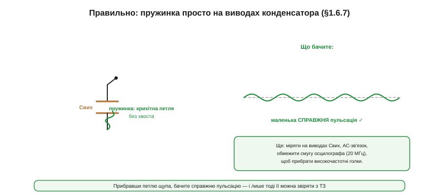
*Рис. 10.2.7.2. Пружинка робить петлю щупа крихітною й притискає його прямо до виводів Cвих — туди, де живе справжня пульсація. На екрані лишається маленька правдива хвиля. Додатково: міряти на самих виводах конденсатора, увімкнути AC-зв'язок (прибрати постійні 5 В) і обмежити смугу осцилографа (≈20 МГц), щоб голки фронтів не маскували пульсацію.*

З крихітною петлею наведення зникає, і ви бачите **справжню** пульсацію — ту маленьку хвилю, що її задають ємність і ESR (§10.2.4). Кілька додаткових правил: міряти саме на **виводах** вихідного конденсатора (а не десь на доріжці); увімкнути **AC-зв'язок** осцилографа, щоб прибрати постійні 5 В і розтягнути дрібну пульсацію на весь екран; і **обмежити смугу** осцилографа (типово 20 МГц), щоб гострі високочастотні голки фронтів перемикання не маскували саму пульсацію.

Чому саме обмеження смуги, а не «що ширша, то правдивіша»? Бо справжня пульсація, яку бачить навантаження, живе на частоті комутації (сотні кГц) і її перших гармоніках — це повільна хвиля. А гострі голки на фронтах перемикання сягають сотень мегагерц і навіть гігагерців; на повній смузі осцилограф покаже їх велетенськими, і вони замаскують саму пульсацію, хоч навантаженню до них байдуже (вони не «доходять» крізь індуктивності й гасяться локально). Тому стандарт виміру пульсації — смуга ≈20 МГц: вона лишає реальну хвилю й відрізає оманливі голки. Лише після всього цього виміряне число можна чесно звіряти з ТЗ.

> 🔧 **Навіщо це.** Якщо ваша «пульсація» залежить від того, як ви тримаєте щуп, — ви міряєте щуп, а не схему. Перш ніж лякатися дзвону на виході, поставте пружинку й приберіть хвіст: дев'ять із десяти «жахливих пульсацій» зникають разом із петлею щупа. Це перше, що перевіряють, побачивши підозріло великий шум.

### ККД: чотири величини й Kelvin

Другий вимір — **коефіцієнт корисної дії**. Тут формула очевидна, а пастка — у точності.


*Рис. 10.2.7.3. ККД = (Vвих·Iвих)/(Vвх·Iвх). Потрібні чотири точні виміри — напруга й струм з обох боків. Напругу беруть **окремими** дротами (Kelvin) прямо на клемах, а не на силових, де є падіння: інакше втрати на дротах вліплять у результат і ккд вийде хибним. Навантаження задає електронне навантаження (§1.6.10).*

```
η = Pвих / Pвх = (Vвих · Iвих) / (Vвх · Iвх) × 100 %
```

Потрібні **чотири** виміри: Vвх, Iвх, Vвих, Iвих. І головна тонкість — **Kelvin-відбір напруги** (як у §10.2.6 для FB): напругу міряють окремими тонкими дротами **прямо на клемах** перетворювача, а не на тих самих товстих дротах, що несуть струм. Бо на силових дротах є падіння (I·R), і якщо зміряти напругу на них, ви приплюсуєте втрати **дротів** до втрат перетворювача — і ккд вийде заниженим і неправдивим. Струм же задають **електронним навантаженням**, що вміє тримати точний струм у заданій точці.

Є й тонші пастки ккд. По-перше, **прогрів**: гарячий перетворювач має інший ккд, ніж холодний (опори ростуть із температурою), тож читають усталене значення, давши вузлу прогрітися, а не одразу після ввімкнення. По-друге, **власне споживання** контролера (струм спокою, Iq): на малому навантаженні навіть кілька міліампер, що чип їсть на себе, помітно з'їдають ккд — і це чесна частина виміру, а не похибка. По-третє, **точність приладів**: ккд — це різниця двох близьких потужностей, тож похибка вимірювача струму прямо лягає в результат; для пристойного виміру беруть точні шунти чи ватметри, а не «приблизний» мультиметр.

> 🔌 **Інструмент у вставці.** Що таке електронне навантаження, його режими (CC/CR/CP) і навіщо воно поруч із лабораторним БЖ — у компонентній вставці [🔌 Електронне навантаження](r02-s7-c-electronic-load.md).

### Сітка точок навантаження

Одне число ккд нічого не варте: ккд **залежить від навантаження** (§10.1.2). Тому міряють **сітку**.

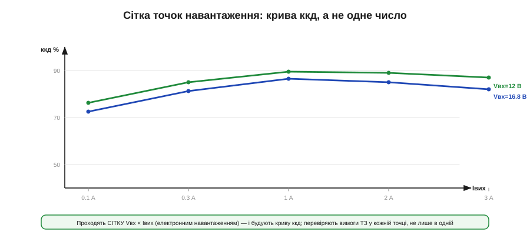
*Рис. 10.2.7.4. Електронним навантаженням проходять сітку струмів (і кілька значень Vвх) — і будують криву ккд від навантаження. Видно і провал на малому струмі, і максимум посередині. Кожну вимогу ТЗ перевіряють у відповідній точці, а не лише в одній зручній.*

Беруть кілька значень Iвих (скажімо, 0.1, 0.3, 1, 2, 3 А) і для кожного — кілька значень Vвх (мінімум, номінал, максимум), у кожній точці заміряючи ккд. Виходить **крива** (чи родина кривих), що показує і провал ефективності на малому навантаженні, і максимум посередині, і поведінку на краях входу. Лише така карта дозволяє чесно сказати «ккд ≥ 90 % @ 3 А і ≥ 80 % @ 0.3 А» — обидва числа з ТЗ перевірені у своїх точках. Прогнати таку сітку вручну марудно, тому її **автоматизують**.

> ⚙️ **Автоматизація у вставці.** Як скриптом прогнати сітку Vвх × Iвих програмованим навантаженням і зібрати криву ккд автоматично — в алгоритмічній вставці [⚙️ Автоматизація вимірів ККД](r02-s7-a-efficiency-sweep.md).

### Теплова карта

Третій вимір — **тепло**. Усі пораховані втрати (ключі, котушка, конденсатори) десь виділяються, і треба переконатися, що жодна деталь не перегрівається.

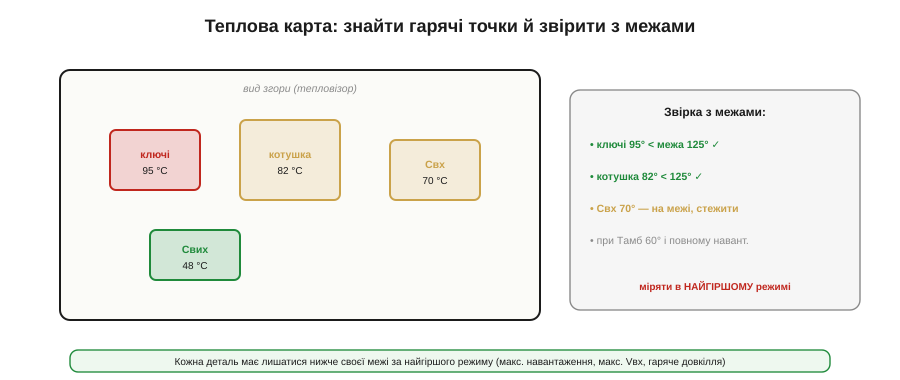
*Рис. 10.2.7.5. Тепловізором (чи термопарою по точках) знімають карту нагріву: видно гарячі ключі, теплу котушку, вхідний конденсатор. Кожну деталь звіряють із її межею — і обов'язково в НАЙГІРШОМУ режимі: максимальне навантаження, максимальний Vвх, гаряче довкілля (Tамб із ТЗ).*

**Тепловізор** дає карту відразу: видно, що найгарячіше (зазвичай ключі), що тепле (котушка, вхідний конденсатор), що холодне. Де тепловізора нема — міряють **термопарою** по точках. Два нюанси самого виміру: по-перше, дати вузлу вийти на **усталений** тепловий режим (нагрів сповзає кілька хвилин, поки не врівноважиться), а не читати одразу; по-друге, тепловізор бреше на блискучих металевих корпусах (низька випромінність), тож ключі чи екран котушки інколи здаються холоднішими, ніж є, — тоді покривають їх матовою фарбою чи звіряють термопарою. Головне — два правила. По-перше, кожну деталь звіряють із **її** межею: ключі проти своєї максимальної температури, котушка проти своєї, конденсатор проти своєї (а електроліт у спеку — слабка ланка, §10.2.4). По-друге, міряти треба в **найгіршому режимі**: максимальне навантаження, максимальний Vвх (де найбільші втрати), за максимальної температури довкілля з ТЗ. Деталь, що ледь тепла на столі за 25 °C і малого струму, може перегрітися в закритому корпусі за 60 °C на повному газі.

### Перехідний процес і пуск: що ще зняти

Три головні виміри — не все. **Перехідний процес** (§10.2.5) знімають так: електронне навантаження з швидким фронтом (або MOSFET, що вмикає резистор) різко стрибає зі скромного струму на повний, а осцилограф ловить провал виходу. Дивляться глибину провалу й час відновлення — і чи нема дзвону. **Пуск** перевіряють окремо: вмикають живлення й дивляться, як вихід плавно піднімається (м'який старт, §10.2.5) без перельоту, а вхід — без надмірного кидка струму (інраш). Корисно глянути й **вимкнення**: чи не дає вузол викидів, коли його знеструмлюють.

І ще один вимір — **здоров'я розводки**. Той самий щуп із пружинкою чіпляють до вузла перемикання SW і дивляться на фронти: помірний викид — норма, а величезний дзвін видає завелику гарячу петлю (§10.2.6). Так осцилограф стає не лише приладом звірки з ТЗ, а й діагностом самої плати: за формою на SW видно, добре чи погано вона розведена.

### Замкнути коло: звірка з ТЗ

І ось навіщо все це: вимірювання має сенс лише як **звірка з ТЗ**. Кожен рядок специфікації, з якого ми починали розділ, має бути підтверджений числом.

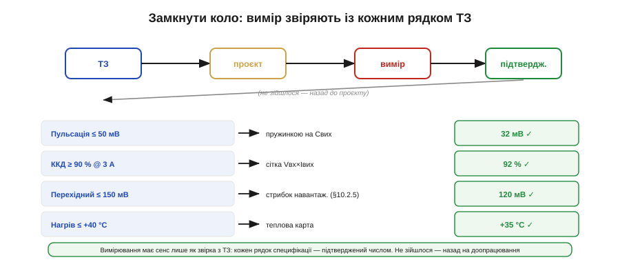
*Рис. 10.2.7.6. Коло проєктування замикається: ТЗ → проєкт → вимір → підтвердження. Пульсація ≤ 50 мВ — зміряна пружинкою (32 мВ ✓); ккд ≥ 90 % — із сітки (92 % ✓); перехідний ≤ 150 мВ — стрибком навантаження (§10.2.5) (120 мВ ✓); нагрів ≤ +40 °C — з теплової карти (+35 °C ✓). Не зійшлося — назад на доопрацювання.*

Так замикається все коло проєктування, з якого почався розділ: **ТЗ → проєкт → вимір → підтвердження**. Беремо специфікацію (§10.2.1) рядок за рядком і ставимо проти кожного виміряне число: пульсація — пружинкою, ккд — сіткою, перехідний процес — стрибком навантаження (§10.2.5), нагрів — тепловою картою. Якщо всі рядки зійшлися — вузол готовий. Якщо якийсь ні — повертаємося на доопрацювання (інша котушка, більший конденсатор, краща розводка) і міряємо знову. Без цієї звірки проєкт не завершено: «начебто працює» — це не «відповідає ТЗ».

І останнє, що вирізняє інженера, — **чесність виміру**. Спокусливо знайти зручну точку, де все добре, і відзвітувати нею; але ТЗ задає **найгірший** випадок, тож і міряти треба там, де найважче: максимальне навантаження для нагріву, максимальний Vвх для пульсації струму, мінімальний — для здійсненності, гаряче довкілля для теплової карти. Вузол, що проходить ТЗ у найгіршому куті, працюватиме скрізь; вузол, «перевірений» лише в зручній точці, підведе в полі. Міряйте те, що є, а не те, що хочеться побачити, — і записуйте чесно, навіть коли число не подобається.

> 🔧 **Навіщо це.** Вимір без ТЗ — це цифри в нікуди. Завжди міряйте **проти специфікації**: не «яка тут пульсація?», а «чи ≤ 50 мВ, як вимагає ТЗ?». Так ви одразу бачите, готовий вузол чи ні, і де саме він не дотягує. Це й перетворює купу осцилограм на інженерний висновок «придатний / непридатний».

### Підсумок теми

Зібраний перетворювач **вимірюють**, щоб довести відповідність ТЗ, — і самі виміри мають пастки. **Пульсацію** міряють пружинкою прямо на виводах Cвих (а не довгим хвостом щупа, що ловить власну петлю в полі перемикання), з AC-зв'язком і обмеженою смугою. **ККД** = (Vвих·Iвих)/(Vвх·Iвх) рахують із чотирьох точних вимірів і Kelvin-відбором напруги, а беруть його **сіткою** точок Vвх × Iвих (електронним навантаженням), будуючи криву, а не одне число. **Теплову карту** знімають тепловізором у найгіршому режимі й звіряють кожну деталь із її межею. Окремо знімають перехідний процес, пуск і навіть здоров'я розводки (за дзвоном на SW), а міряти все це належить **чесно й у найгіршому куті**, а не в зручній точці. А головне — усе це **звіряють із кожним рядком ТЗ**, замикаючи коло «ТЗ → проєкт → вимір → підтвердження»: не зійшлося — назад на доопрацювання. Тепер ми вміємо і спроєктувати перетворювач, і довести його придатність; лишилося навчитися впізнавати його **типові хвороби** — свист, нестабільність, просідання, — коли щось таки пішло не так.

---

## 10.2.8 Типові хвороби: свист, нестабільність, просідання

Навіть ретельно спроєктований перетворювач інколи «хворіє»: свистить, дзвенить, просідає чи гріється. Ця тема — про **діагностику**: типові хвороби, їхні підписи на осцилографі та лік. Добра новина в тому, що майже кожна хвороба зводиться до причини, яку ми вже зустріли в цьому розділі, — тож діагностика здебільшого не вимагає нового знання, лише вміння **прочитати симптом**. Це окремий навик, корисніший за будь-яку формулу: відрізнити, що саме не так, за формою на екрані.

### Карта хвороб

Почнімо з оглядової карти — симптом, ймовірна причина, лік.

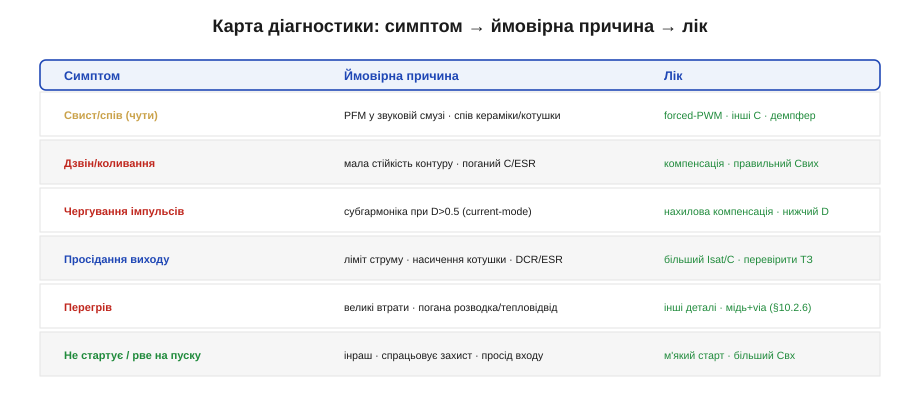
*Рис. 10.2.8.1. Шість найчастіших хвороб і їхні причини: свист (PFM у звуковій смузі чи спів кераміки), дзвін (мала стійкість контуру), чергування імпульсів (субгармоніка), просідання (ліміт струму, насичення, падіння DCR/ESR), перегрів (втрати чи розводка), проблеми пуску (інраш, захист). Майже всі причини — вже знайомі з цього розділу.*

Зверніть увагу: у стовпці «причина» нема нічого нового — це все ті самі поняття, що ми розбирали (режим керування, стійкість, насичення, ESR, розводка). Діагностика лише **зіставляє** симптом із відомою причиною. У цьому й уся таємниця: інженер, що пройшов проєктування, уже знає всі причини — лишається навчитися впізнавати їх з іншого боку, за наслідком. Тому ця тема не додає нового знання про схему, а вчить **дивитися назад**: від симптому до того місця, де воно народилося. Пройдімо найцікавіші хвороби докладніше — і побачимо, як кожна вказує на знайому главу розділу.

### Свист і спів

Перетворювач, що **свистить** (чути вухом), бентежить новачка — електроніка ж має бути тихою. Та причин дві, і обидві прості.

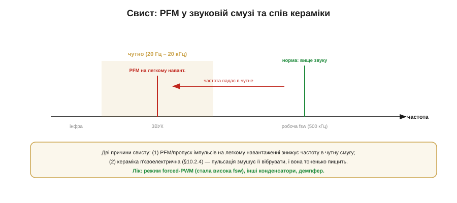
*Рис. 10.2.8.2. Робоча частота (сотні кГц) — вище звуку, її не чути. Але на легкому навантаженні режим PFM (пропуск імпульсів, §10.2.2) знижує частоту — і вона падає у чутну смугу (20 Гц – 20 кГц). Друга причина — п'єзоефект кераміки (§10.2.4): пульсація змушує конденсатор вібрувати, і він тоненько пищить. Лік — forced-PWM, інші конденсатори, демпфер.*

Перша причина — **PFM**. На повному навантаженні перетворювач працює на високій сталій частоті, вище за поріг чутності. Але на легкому навантаженні (§10.2.2) він переходить у режим пропуску імпульсів, і ефективна частота **падає** — інколи прямо в чутну смугу. Тоді ви чуєте тихе цвірчання, що міняється з навантаженням. Друга причина — **спів кераміки** (§10.2.4): MLCC п'єзоелектрична, і пульсація напруги змушує її механічно вібрувати; на чутних частотах вона пищить. Лік: для PFM — перемкнути у forced-PWM (стала висока частота); для співу — інші конденсатори, м'якші виводи чи демпфер. Свист майже завжди нешкідливий для роботи, та дратує — і псує враження про якість пристрою.

### Субгармоніка: чергування імпульсів

Найхитріша нестабільність — **субгармонічні коливання**. Її легко не впізнати, бо вихід може здаватися майже нормальним, а підпис ховається в **формі імпульсів**.

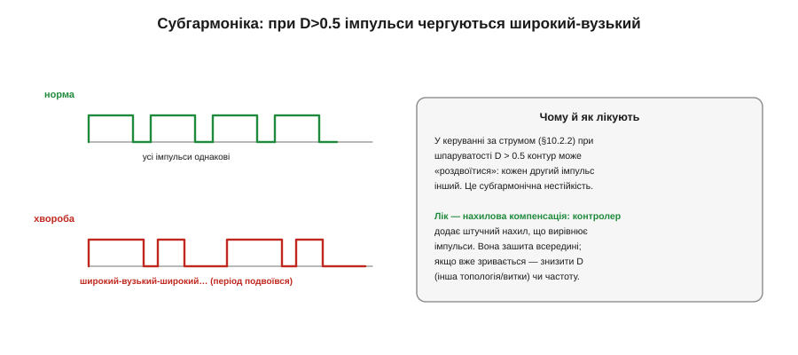
*Рис. 10.2.8.3. У нормі всі імпульси однакові. При субгармоніці імпульси **чергуються**: широкий-вузький-широкий-вузький (період подвоївся). Виникає вона в керуванні за струмом (§10.2.2) при шпаруватості D > 0.5. Лік — нахилова компенсація: контролер додає штучний нахил, що вирівнює імпульси (вона зашита всередині; якщо вже зривається — знизити D чи частоту).*

Описати її можна суто якісно, без жодної математики. У перетворювачі з керуванням **за струмом** (§10.2.2) при шпаруватості **D понад 0.5** контур схильний «роздвоюватися»: замість однакових імпульсів він видає широкий, тоді вузький, тоді знову широкий — період роботи **подвоюється**. На виході це дає дрібний дзвін на половині частоти комутації, а на струмі котушки — характерне чергування. Лік відомий: **нахилова компенсація** (*slope compensation*) — контролер навмисно додає до сигналу струму невеликий штучний нахил, що вирівнює імпульси. Її майже завжди зашито всередину; та якщо ви заганяєте перетворювач у дуже високу D (близько до межі), субгармоніка може прорватися — і тоді рятують нижча D (інша топологія чи витки) або нижча частота.

> 🔧 **Навіщо це.** Якщо вихід ледь чутно дзвенить на **половині** частоти комутації, а імпульси на струмі котушки чергуються широкий-вузький — це субгармоніка, а не звичайна нестійкість контуру. Лік інший: не компенсація петлі, а зменшення D або опертя на нахилову компенсацію. Упізнати її — половина справи.

### Просідання: чотири причини, чотири підписи

**Просідання** виходу під навантаженням має аж чотири різні причини — і, на щастя, кожна лишає свій підпис.

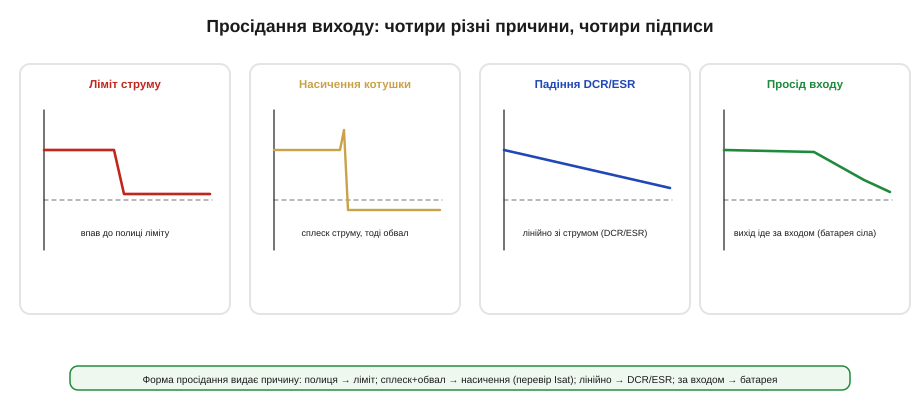
*Рис. 10.2.8.4. Форма просідання видає причину. Вихід упав на **полицю** й не падає далі — спрацював ліміт струму (foldback). Струм дав **сплеск і обвал** — котушка насичується (§10.2.3): перевір Isat. Вихід падає **лінійно** зі струмом — це падіння на DCR/ESR. Вихід **іде за входом** униз — просідає сама батарея (§7.4.5), перетворювач ні до чого.*

Розрізняти їх просто за формою. **Полиця**: вихід упав до певного рівня й тримається — спрацював **захист за струмом** (перевантаження; інколи з «foldback», коли ліміт ще й знижується). **Сплеск і обвал**: струм котушки різко стрибнув, тоді вихід обвалився — котушка **насичується** (§10.2.3), пік перевищив Isat; лік — котушка з більшим Isat. **Лінійне** падіння зі струмом — це просто **омічні втрати** на DCR котушки й ESR/опорах; лік — товщі доріжки, менший DCR/ESR. І **вихід іде за входом** униз — це не перетворювач винен, а **батарея просіла** (§7.4.5): дивіться на вхід, а не на вузол. Один симптом — чотири різні діагнози, і форма їх розводить.

### Завади: коли вузол «світить» в ефір

Ще одна хвороба не видна на власному виході, зате чути сусідам — **електромагнітні завади**. Симптоми: пристрій валить сертифікаційний ЕМС-тест, або поряд тріщить радіо, плавають покази давачів, «глючить» бездротовий зв'язок. Причина майже завжди та сама трійця: завелика **гаряча петля** (§10.2.6), що випромінює; розлитий **вузол SW**, що працює антеною; брак **вхідного фільтра**, через що шум перемикання розповзається дротами живлення по всьому пристрою. Лік — туди ж: стиснути петлю, зменшити SW, додати вхідний LC-фільтр чи спред-спектрум (§10.2.2). ЕМС — не окрема магія, а наслідок тих самих рішень розводки; зробив петлю малою — і половини завад нема.

### Перегрів: яка деталь гаряча — та й винна

**Перегрів** діагностують тепловою картою (§10.2.7), і тут підказка — **яка саме** деталь найгарячіша. Гарячий **ключ** — це втрати на перемиканні (зависока частота, кволий драйвер) або великий Rds(on) на струмі; лік — нижча частота, кращий драйвер, ключ із меншим Rds(on). Гаряча **котушка** — мідні втрати (DCR) чи втрати в осерді (висока частота/пульсація); лік — менший DCR, інше осердя. Гарячий **вхідний конденсатор** — завеликий RMS-струм пульсації (§10.2.4); лік — конденсатор із більшим струмовим рейтингом чи кілька в паралель. А якщо все гаряче «рівномірно» понад розрахунок — винна **розводка**: тонкі доріжки, поганий тепловідвід (§10.2.6). Тобто перегрів — не одна хвороба, а вказівник: дивіться, **що** гріється, і причина майже названа.

### Не стартує: пуск і «гикавка»

Окремий клас — **проблеми пуску**. Перетворювач **не стартує** або **перезапускається** циклічно. Часта причина — **інраш**: при ввімкненні вихідні (а в boost — і прохідні) конденсатори заряджаються кидком струму, той спрацьовує захист, перетворювач вимикається, пробує знову — і так по колу. Це **режим «гикавки»** (*hiccup*): вузол тихо «цокає» чи цвірчить із періодом у частки секунди, раз по раз пробуючи стартувати. Інша причина — **просідання входу** на пуску: слабке джерело не тягне пусковий струм, вхід падає, контролер скидається. Лік — **м'який старт** (§10.2.5), що розтягує заряд конденсаторів у часі; більший вхідний конденсатор; і перевірка, що захист за струмом не спрацьовує на штатному інраші. Гикавка, до речі, — це **захист, який працює**: він не дає вузлу згоріти при КЗ, лиш періодично перевіряючи, чи коротке ще там.

### Осцилограф — головний діагност

Спільне в усіх хворобах одне: їхній **підпис** видно на осцилографі, треба лише знати, куди чіпляти щуп (пружинкою, §10.2.7) і що шукати.

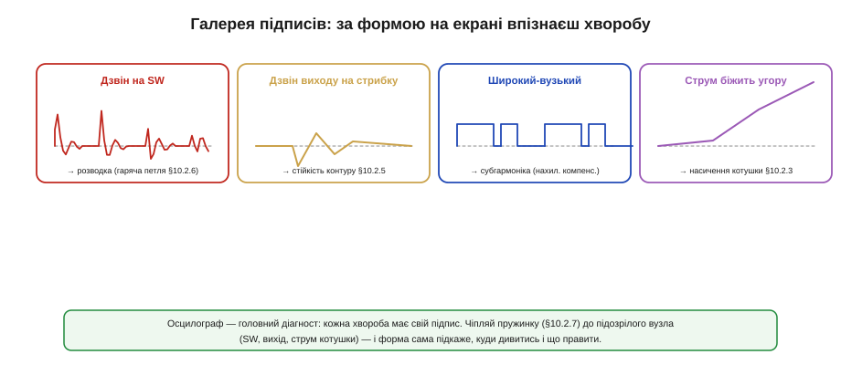
*Рис. 10.2.8.5. Кожна хвороба має форму. Дзвін на вузлі SW — завелика гаряча петля (розводка, §10.2.6). Дзвін виходу на стрибку навантаження — мала стійкість контуру (§10.2.5). Чергування широкий-вузький — субгармоніка. Струм котушки біжить угору без упину — насичення (§10.2.3). Прочитав форму — знаєш діагноз.*

Це і є головний інструмент діагностики. **Дзвін на SW** на кожному фронті → гаряча петля завелика (розводка). **Дзвін виходу** після стрибка навантаження → контур на межі стійкості. **Імпульси широкий-вузький** → субгармоніка. **Струм котушки, що не повертається, а повзе вгору** → насичення (а далі захист обріже). Звикнувши до цих чотирьох-п'яти підписів, ви діагностуєте більшість проблем живлення за секунди — не гадаючи, а **читаючи** екран.

Варто знати й **куди** чіпляти щуп. Три точки розповідають майже все. **Вузол SW** (пружинкою, з обмеженням смуги) — про розводку й перемикання: форма фронтів, викид, дзвін. **Вихід** (пружинкою на Cвих, AC-зв'язок) — про пульсацію й перехідні процеси. А **струм котушки** — найцінніше: його знімають струмовими кліщами чи по падінню на шунті, і саме він видає і насичення (повзе вгору), і субгармоніку (чергування), і режим (CCM/DCM). Хто навчився читати струм котушки, той бачить нутро перетворювача наживо — і більшість діагнозів стають очевидними з одного погляду.

### Діагностичний потік

Зведімо в простий потік: симптом → куди дивитись → причина → лік.

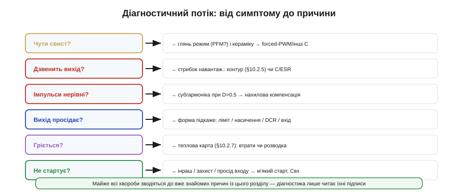
*Рис. 10.2.8.6. Від симптому до причини: чути свист → режим і кераміка; дзвенить → контур чи C/ESR; нерівні імпульси → субгармоніка; просідає → форма підкаже (ліміт/насичення/DCR/вхід); гріється → теплова карта; не стартує → інраш/захист/вхід. Майже все зводиться до знайомих причин розділу.*

Кілька слів про **підхід** до пошуку несправності, бо він важить не менше за знання хвороб. По-перше, **міняйте одне за раз**: підмінили відразу котушку, конденсатор і частоту — і навіть як полегшало, не знаєте, що саме допомогло (а могло й нашкодити в іншому місці). По-друге, тримайте **еталон**: якщо є плата, що працює, порівняйте з нею осцилограми у тих самих точках — різниця одразу вкаже на проблему. По-третє, коли схема бездоганна, а вузол усе одно хворіє, — **підозрюйте паразити**: розводку, гарячу петлю, землю, наведення (саме тому розводка — найважливіший приклад курсу, §10.2.6). Здорове живлення — це не лише правильна схема, а правильна схема **в правильній міді**.

> 🔧 **Навіщо це.** Не лагодьте навмання, міняючи деталі по черзі. Спершу **зніміть підпис** осцилографом і зведіть його до причини за цією картою — а тоді міняйте саме те, що треба. Дев'ять із десяти «загадкових» проблем живлення мають чіткий підпис і відому причину; загадковими вони здаються лише тому, що на них не подивилися як слід.

### Підсумок теми й розділу

Типові хвороби перетворювача — **свист** (PFM у звуковій смузі чи спів кераміки → forced-PWM, інші C), **нестабільність** (дзвін від малого запасу контуру → компенсація, правильний Cвих/ESR), **субгармоніка** (чергування імпульсів при D>0.5 → нахилова компенсація, нижча D), **просідання** (ліміт струму, насичення, DCR/ESR чи просід входу — розрізняються за формою) та **перегрів** і **проблеми пуску**. Майже кожна причина — вже знайома з цього розділу, тож діагностика зводиться до **читання підпису** на осцилографі: знімаєш форму на SW, виході чи струмі котушки — і вона сама вказує на главу, де про цю причину йшлося. Це вміння «дивитися назад» — від наслідку до причини — і відрізняє інженера, що швидко лагодить, від того, хто навмання міняє деталі.

На цьому Розділ 10.2 завершено: ми пройшли весь шлях інженера живлення — від **ТЗ** через вибір контролера, частоти, котушки й конденсаторів, **розводку** з її гарячими петлями, **зворотний зв'язок**, **вимірювання** й аж до **діагностики хвороб**. Тепер ви не лише розумієте топології (Розділ 10.1), а й умієте довести конкретний вузол до робочого стану й полагодити, коли щось пішло не так. Далі — конкретні застосування цього вміння, починаючи з найпоширенішого джерела живлення сучасності: USB.

> ▶️ Далі: [Розділ 10.3 — USB-живлення і розумна зарядка](../r03-usb-power/r03-usb-power.md)
