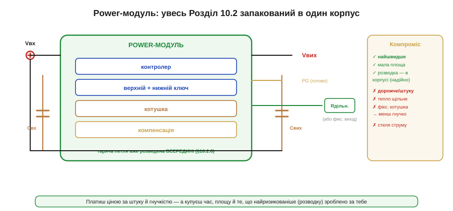

# 🔌 Power-модулі «все в одному»: за що платимо

> Компонентна вставка до теми [10.2.2 «Вибір контролера і частоти комутації»](r02-converter-design.md). Найвищий рівень інтеграції — коли цілий перетворювач уже зібрано в один корпус.

### Клас пристрою

**Power-модуль** (часто *μModule*, *POL-модуль*) — це готовий перетворювач у єдиному корпусі: усередині вже є **все**, що ми проєктували в Розділі 10.2 — контролер, обидва силові ключі, **котушка** й навіть компенсація. Зовні лишається додати кілька конденсаторів і (якщо вихід регульований) пару резисторів. По суті, виробник продав вам не мікросхему, а **готову шину живлення**.

### Блок-схема плати


*Рис. 10.2.2c.1. Усередині корпусу — контролер, верхній і нижній ключі, котушка й компенсація; гаряча петля (§10.2.6) розведена прямо в модулі. Зовні — лише вхідний і вихідний конденсатори, опційний дільник зворотного зв'язку та сигнали EN/PG. Праворуч — компроміс: швидко й надійно, але дорожче й менш гнучко.*

Уся складна частина — силова петля, драйвери, узгодження котушки з контролером — уже всередині й перевірена виробником. Ваша плата зводиться до «причепити живлення й конденсатори».

### Типова розпіновка

```
VIN    вхідне живлення
GND    спільний нуль
VOUT   стабілізований вихід
EN     дозвіл (enable): підтягнути високим, щоб увімкнути
FB     зворотний зв'язок (дільник задає Vвих) — або VSEL/фіксований
PG     power good: «вихід у нормі» (сигнал готовності)
```

### Підключення

VIN — до входу з вхідним конденсатором поруч; VOUT — до навантаження з вихідним конденсатором; GND — на полігон землі. EN підтягують високим (або керують ним від МК для ввімкнення на вимогу). FB — через дільник (Vвих = Vоп·(1+Rверх/Rниз), §10.2.5) або, у версії з фіксованим виходом, прямо до VOUT чи до виводу вибору напруги. PG зручно завести в МК — він скаже, коли шина піднялася.

### «Перший байт»

Коду немає — модуль аналоговий. «Заговорити» з ним просто: подати VIN, підтягнути EN високим — і на VOUT з'явиться стабілізована напруга, а PG підскочить, коли вона ввійде в норму. Усе налаштування виходу — це один-два резистори дільника (чи взагалі нічого у фіксованій версії).

### Типові граблі — «за що платимо»

- **Ціна за штуку.** Модуль помітно дорожчий за контролер із зовнішніми деталями: ви платите за інтеграцію й за вбудовану котушку. У великій серії це множиться на тираж.
- **Щільне тепло.** Усе в одному малому корпусі — отже, втрати концентровані; модуль гріється сильніше «на грам», тож тепловий запас і відведення тепла (§10.2.7) критичні, а струм часто доводиться **знижувати** проти паспортного в гарячому середовищі.
- **Менша гнучкість.** Котушка й частота **зашиті** — ви не можете підправити пульсацію чи частоту під свій випадок, як із дискретною схемою.
- **Стеля струму.** Як і в інтегрованого switcher (§10.2.2), велику потужність модуль не тягне — нічим відвести тепло.

Натомість виграш великий: **найшвидша розробка**, мінімальна площа й — головне — те, що найризикованіше (розводка гарячої петлі, §10.2.6), зроблено **за вас** і перевірено. Для прототипу, малої серії чи там, де дорогий час інженера, це часто найрозумніший вибір.

### Варіації класу

Є кілька рівнів «готовості». Повний **μModule** містить навіть котушку (як на рисунку). **Power-stage / DrMOS-клас** інтегрує лише обидва ключі з драйвером, а котушку й контролер лишає зовні — компроміс між гнучкістю й простотою на більших струмах. **POL-модулі** (*point-of-load*) ставлять прямо біля споживача. А кожен буває з **фіксованим** виходом (зовсім без дільника) або **регульованим** (дільником під будь-яку напругу).
