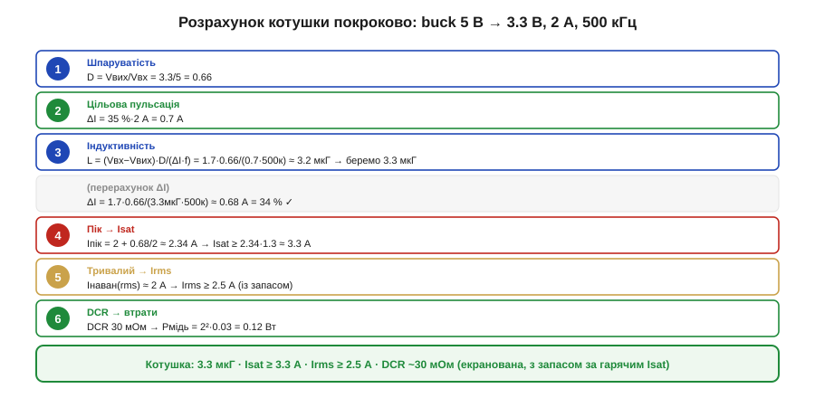

# 🧮 Вибір котушки покроково: наскрізний розрахунок buck 5 В → 3.3 В

> Математична вставка до теми [10.2.3 «Котушка для перетворювача»](r02-converter-design.md). Там — метод і параметри; тут проганяємо весь розрахунок на конкретному вузлі від першого числа до готового рядка специфікації.

### Означення

Добір котушки — це шість кроків, кожен дає одне число специфікації: **L** (з пульсації), **Isat** (з піка струму), **Irms** (з тривалого струму), **DCR** (з допустимих втрат). Пройдімо їх для типового вузла: buck **5 В → 3.3 В**, навантаження **2 А**, частота **500 кГц**, цільова пульсація **35 %**.

### Інтуїція

Логіка ланцюжка така: спершу з вимоги до пульсації (ΔI) дістаємо **індуктивність**; вона задає форму трикутника струму, а отже — **пік** (звідки Isat, магнітна межа) і **середній** струм (звідки Irms, теплова межа); нарешті опір обмотки **DCR** дає мідні втрати. Жоден крок не пропускають — одна забута межа (частіше Isat чи Irms) робить котушку ненадійною (§10.2.3).

### Формальний апарат: шість кроків


*Рис. 10.2.3m.1. Наскрізний розрахунок: шпаруватість → цільова пульсація → індуктивність (із перерахунком на стандартний номінал) → пік і Isat → тривалий струм і Irms → DCR і мідні втрати. Унизу — готовий рядок специфікації котушки.*

```
1) Шпаруватість:
     D = Vвих / Vвх = 3.3 / 5 = 0.66

2) Цільова пульсація (30–40 % від навантаження):
     ΔIціль = 0.35 · 2 А = 0.7 А

3) Індуктивність:
     L = (Vвх − Vвих) · D / (ΔIціль · f)
       = (5 − 3.3) · 0.66 / (0.7 · 500·10³)
       = 1.122 / 350000 ≈ 3.2 мкГ      → беремо стандартні 3.3 мкГ
   перерахунок реальної ΔI при 3.3 мкГ:
     ΔI = 1.122 / (3.3·10⁻⁶ · 500·10³) ≈ 0.68 А  (34 % — у вікні ✓)

4) Пік струму → Isat (магнітна межа):
     Iпік = Iнаван + ΔI/2 = 2 + 0.68/2 ≈ 2.34 А
     Isat ≥ Iпік · 1.3 ≈ 3.0 А          → беремо Isat ≥ 3.3 А

5) Тривалий струм → Irms (теплова межа):
     Iнаван(rms) ≈ 2 А                   → беремо Irms ≥ 2.5 А

6) DCR → мідні втрати:
     DCR ≈ 30 мОм
     Pмідь = Iнаван² · DCR = 2² · 0.03 = 0.12 Вт
```

**Результат:** котушка **3.3 мкГ**, **Isat ≥ 3.3 А**, **Irms ≥ 2.5 А**, **DCR ~30 мОм** — і екранована, якщо поряд радіо (§10.2.3).

### Де в курсі це працює

Кілька зауваг, що роблять розрахунок чесним. По-перше, **найгірший Vвх**: тут Vвх ≈ 5 В фіксований (USB), але якщо він має розкид (5 В ± 5 %), пульсацію рахують за **максимальним** Vвх, де вона найбільша (§10.2.1). По-друге, **гарячий Isat**: паспортний Isat при 25 °C на робочій температурі нижчий, тож запас 1.3 беруть саме від гарячого значення (§10.2.3). По-третє, **перевірка кривими**: остаточно котушку звіряють не із заголовним числом, а з кривими L(I) і нагріву в даташиті, бо різні виробники визначають «номінальний струм» по-різному.

Цей самий шість-кроковий розрахунок повторюють для будь-якого buck — міняються лише числа. Формула пульсації (крок 3) — з теми 10.1.2 та її вставки [🧮 про вибір L](../r01-converter-topologies/r01-s2-m-inductor-ripple.md); пік і дві межі — з §10.2.3; а DCR-втрати ведуть до теплової перевірки, яку зніматимуть тепловою картою (§10.2.7). Так одна котушка проходить шлях від рядка ТЗ до перевіреного компонента.
