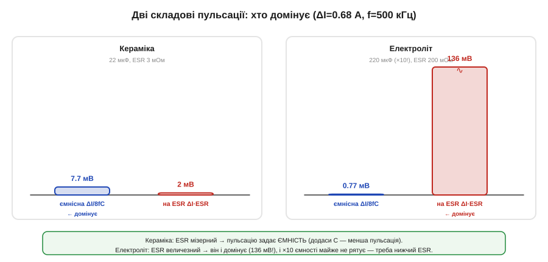

# 🧮 Дві складові пульсації: ємність проти ESR

> Математична вставка до теми [10.2.4 «Конденсатори входу й виходу»](r02-converter-design.md). Розкладаємо вихідну пульсацію на два доданки й числами показуємо, хто з них головний — і чому з керамікою та електролітом відповідь різна.

### Означення

Пульсація вихідної напруги складається з **двох** доданків, що мають різну природу:

```
ΔVвих = ΔVємн + ΔVesr
   ΔVємн = ΔI / (8 · f · C)     [ємнісна: конденсатор міняє напругу, ковтаючи струм]
   ΔVesr = ΔI · ESR             [на ESR: пряме падіння струму пульсації на опорі]
```

Перша спадає з більшою **ємністю** C, друга — з меншим **ESR**. Який доданок домінує — залежить від **типу** конденсатора, і це визначає, що робити для зменшення пульсації.

### Інтуїція

Ємнісний доданок — це «повільна» хвиля: конденсатор не встигає миттєво поглинути трикутник струму, тож трохи міняє напругу. Доданок на ESR — «гострий»: пульсуючий струм просто падає на паразитному опорі (закон Ома) і повторює форму струму. У кераміки ESR мізерний, тож лишається ємнісна хвиля; в електроліта ESR великий — і він заглушує все інше.

### Формальний апарат: числове порівняння

Візьмемо ΔI = 0.68 А (з розрахунку котушки, [🧮 §10.2.3](r02-s3-m-inductor-selection.md)) і f = 500 кГц та порахуємо обидва доданки для двох конденсаторів.


*Рис. 10.2.4m.1. З керамікою (22 мкФ, ESR 3 мОм) пульсацію задає ємнісна складова (7.7 мВ проти 2 мВ на ESR). З електролітом (220 мкФ — удесятеро більше! — але ESR 200 мОм) усе навпаки: на ESR аж 136 мВ, і десятикратна ємність майже не рятує.*

```
Кераміка:  C = 22 мкФ,  ESR = 3 мОм
   ΔVємн = 0.68 / (8 · 500·10³ · 22·10⁻⁶) = 0.68 / 88   ≈ 7.7 мВ
   ΔVesr = 0.68 · 0.003                                 ≈ 2.0 мВ
   → домінує ЄМНІСНА; щоб зменшити пульсацію — додай C

Електроліт:  C = 220 мкФ (×10!),  ESR = 200 мОм
   ΔVємн = 0.68 / (8 · 500·10³ · 220·10⁻⁶) = 0.68 / 880 ≈ 0.77 мВ
   ΔVesr = 0.68 · 0.2                                    ≈ 136 мВ
   → домінує ESR; десятикратна ємність майже не допомогла!
```

Результат разючий: електроліт із **удесятеро** більшою ємністю дає пульсацію **в десятки разів гіршу** за кераміку — бо весь виграш від ємності з'їдає його величезний ESR. (Точна сума двох доданків не проста — у них різна форма й фаза, тож беруть зазвичай більший із них чи корінь із суми квадратів; але домінантний і так визначає результат.)

### Де в курсі це працює

Звідси — **дві різні стратегії** зменшення пульсації, і обрати правильну критично. Якщо ви на **кераміці** (ESR мізерний) — ви **обмежені ємністю**: пульсація завелика → додайте ємності (більший номінал чи паралельні MLCC, не забуваючи про DC-bias, §10.2.4). Якщо ж на **електроліті** — ви **обмежені ESR**: тут нарощувати ємність майже марно, треба знижувати **ESR** — ставити паралельно кілька конденсаторів (їхні ESR діляться), брати полімерний чи додати поряд кераміку, що зб'є високочастотну частину. Саме тому в сучасних перетворювачах на виході майже завжди кераміка чи полімер: вони прибирають той самий доданок на ESR, що псував картину в електроліта. А коли поєднують об'ємний електроліт із керамікою (§10.2.4) — електроліт дає ємність, кераміка збиває ESR, і пульсація виходить малою на всіх частотах.
