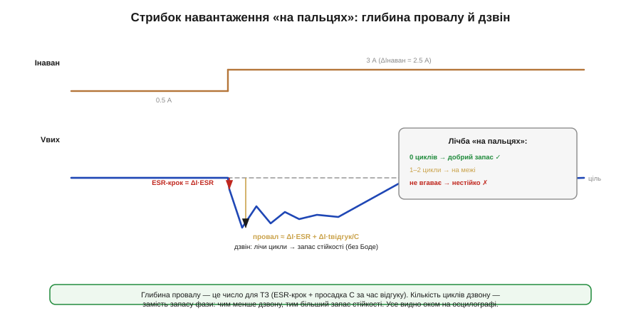

# 🧮 Load step «на пальцях»: провал і дзвін як міра стійкості

> Математична вставка до теми [10.2.5 «Зворотний зв'язок і стабільність якісно»](r02-converter-design.md). Оцінюємо реакцію на стрибок навантаження простими прикидками — **без** діаграм Боде й запасу фази, як і годиться цьому курсу.

### Означення

Реакцію перетворювача на різкий стрибок навантаження описують **двома** числами, що їх знімають прямо з осцилографа: **глибина провалу** (наскільки впала напруга) і **кількість циклів дзвону** (наскільки коливається відновлення). Перше зіставляють із ТЗ, друге — це наша заміна «запасу фази»: чим менше дзвону, тим більший запас стійкості.

### Інтуїція: звідки провал

У перші миті стрибка контур ще не встиг зреагувати (запізнення, §10.2.5), тож увесь додатковий струм віддає **вихідний конденсатор**. Провал складають дві частини. **Миттєвий ESR-крок**: новий струм одразу падає на ESR конденсатора, даючи стрибок ΔI·ESR. **Просадка ємності**: далі конденсатор розряджається струмом ΔI, поки контур не наздожене, і за час відгуку tвідгук просідає на ΔI·tвідгук/C. Разом:

```
ΔVпровал ≈ ΔI · ESR  +  ΔI · tвідгук / C
            └ миттєвий ┘   └ просадка за час реакції ┘
```

### Формальний апарат: прикидка


*Рис. 10.2.5m.1. Стрибок струму дає миттєвий ESR-крок, тоді просадку ємності — разом це глибина провалу (число для ТЗ). А дзвін, що йде далі, лічать у циклах: 0 циклів — добрий запас, 1–2 — на межі, не вгаває — нестійко. Це й замінює нам діаграму Боде.*

Візьмемо стрибок 0.5 → 3 А (ΔI = 2.5 А), вихідний конденсатор C = 167 мкФ (з [§10.2.1](r02-converter-design.md)), час відгуку контуру ≈ 10 мкс.

```
з керамікою (ESR = 3 мОм):
   ESR-крок:  2.5 · 0.003          = 7.5 мВ
   просадка:  2.5 · 10·10⁻⁶ / 167·10⁻⁶ = 150 мВ
   провал ≈ 7.5 + 150 ≈ 158 мВ   (домінує просадка ємності)

з електролітом (ESR = 200 мОм):
   ESR-крок:  2.5 · 0.2            = 500 мВ   ← сам ESR-крок завалює ТЗ!
```

Видно одразу два уроки. По-перше, з керамікою провал визначає **просадка ємності**, тож щоб зменшити його — додають C або прискорюють контур (менший tвідгук). По-друге, з електролітом миттєвий **ESR-крок** сам по собі може перевищити ТЗ (500 мВ!), хоч би яка велика була ємність, — ще одна причина брати на вихід низько-ESR кераміку (§10.2.4).

### Де в курсі це працює: дзвін замість запасу фази

Глибина провалу — це число для звірки з ТЗ. А **дзвін** після провалу — наш практичний вимір запасу стійкості, що замінює діаграму Боде. Лічба «на пальцях» проста: **нуль** циклів дзвону (провал і чисте повернення) — добрий запас; **один-два** загасаючі цикли — запас малий, система на межі (за зміни температури чи деталей може зірватися); **дзвін, що не вгаває**, — нестійко, треба правити (компенсація, інший Cвих/ESR — §10.2.5).

Тут і криється головний компроміс §10.2.5 у числах: **прискорити** контур (зменшити tвідгук) — провал меншає; але **задто** швидкий контур починає дзвеніти. Тому інженер дивиться на **обидва** числа разом: малий провал **і** без дзвону — ось здоровий вузол. Маленький провал ціною дзвону — оманливе благополуччя; глибокий провал без дзвону — просто повільно, додай ємності чи прискор контур. Усе це видно оком на осцилографі — без жодної передатної функції.
