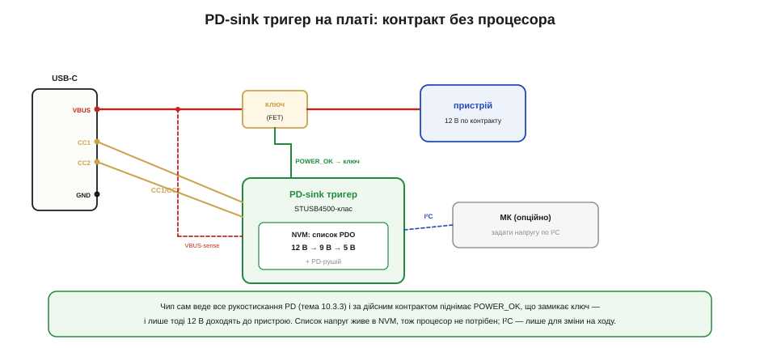

# 🔌 PD-sink STUSB4500-класу і «тригери»: контракт без коду

> Компонентна вставка до теми [10.3.4 «PD у власному пристрої»](r03-usb-power.md). Там ми назвали «тригер» найпростішим шляхом дістати з PD сталу напругу; тут — як така мікросхема виглядає на платі.

### Клас пристрою

**PD-sink тригер** (*STUSB4500-клас*) — це автономний контролер приймача, що сам проводить усе рукостискання PD (тема 10.3.3) і видає одну наперед задану напругу, **не потребуючи процесора**. Особливість саме STUSB4500-класу — вбудована незалежна пам'ять (**NVM**): ви один раз записуєте в неї список бажаних профілів (наприклад, «хочу 12 В, як нема — 9, як нема — 5»), і далі чип робить усе сам на кожному під'єднанні. Простіші «тригери» задають напругу не пам'яттю, а перемичками чи резисторами, але ідея одна: домовитися про вольти без жодного рядка коду.

### Блок-схема плати


*Рис. 10.3.4c.1. Лінії CC1/CC2 з роз'єму йдуть у чип — він веде переговори; VBUS чип і живить, і вимірює. У NVM лежить список бажаних PDO за пріоритетом. Отримавши контракт, чип піднімає сигнал POWER_OK, що замикає зовнішній ключ (FET) у силовій лінії, — і лише тоді напруга доходить до пристрою. I²C та МК — опційні, лише якщо хочете міняти напругу на ходу.*

### Типова розпіновка

```
CC1, CC2     до роз'єму Type-C — переговори PD
VBUS         вимір (і часто живлення чипа) напруги шини
VDD / GND    живлення й нуль
SDA, SCL     I²C — опційно: задати/прочитати профілі (або зашити в NVM)
POWER_OK     «контракт є» — керує зовнішнім ключем навантаження
ALERT/ATTACH події (під'єднання, зміна) — у МК, опційно
RESET        апаратний скид логіки
```

### Підключення

CC1 і CC2 — прямо на однойменні піни роз'єму. VBUS — на шину (звідти ж чип зазвичай і живиться). Найважливіше — **POWER_OK**: він керує затвором зовнішнього ключа (P-MOSFET чи load switch), увімкненого в розрив VBUS перед пристроєм. Доки контракту нема, ключ розімкнений, і пристрій від високої напруги відрізаний. I²C заводять у МК, лише якщо потрібно міняти напругу динамічно; для сталого живлення лінії I²C можна не чіпати — усе вже в NVM.

### «Перший байт»

У ролі чистого тригера **першого байта немає**: профілі заздалегідь у NVM, чип сам домовляється на під'єднанні й сам піднімає POWER_OK. Якщо ж керуєте по I²C — «перший байт» це запис у регістри бажаної напруги й струму (або одноразове прошивання NVM на етапі виробництва). Тобто або нуль коду, або один невеликий блок ініціалізації — і більше нічого.

### Типові граблі

- **Забули задіяти POWER_OK.** Якщо повести VBUS прямо в пристрій, він побачить стартові 5 В (а потім стрибок до 12) без жодного захисту. Ключ за POWER_OK — не опція, а суть схеми (тема 10.3.4).
- **Не запрограмували NVM.** «З коробки» чип часто просить лише 5 В — без прошивання своїх профілів омріяних 12 В не буде.
- **Нема запасного профілю.** Задали тільки 12 В — на джерелі без нього лишитесь на 5 В. Список у NVM має містити **відкат** (9/5 В).
- **Це лише sink.** STUSB4500-клас тільки **бере** живлення; зробити з нього джерело чи павербанк (тема 10.3.6) не вийде — потрібен інший чип.
- **Без PPS.** Фіксований тригер дає лише фіксовані щаблі; для плавної PPS-зарядки батареї потрібен повноцінний контролер.

### Варіації класу

Найпростіші **тригери на перемичках** задають одну напругу резистором чи паянням джампера — без NVM та I²C взагалі: «припаяв — обрав 9/12/15/20 В». Повноцінні **PD-контролери** (TCPC-класу) під керуванням МК уміють усе — PPS, зміну напруги на ходу, обмін ролями, — але потребують прошивки й тієї самої машини станів, що в ⚙️-вставці цього розділу. А для павербанків і дворольових портів (тема 10.3.6) беруть **source-** чи **DRP-контролери**, здатні не лише просити, а й давати живлення.
