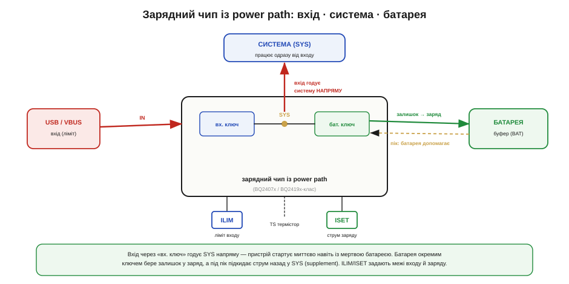

# 🔌 Power path у зарядних чипах: працювати з «мертвою» батареєю

> Компонентна вставка до теми [10.3.6 «Свій "павербанк"»](r03-usb-power.md). Там ми пояснили ідею power path; тут — як вона виглядає в реальному зарядному чипі, на рівні пінів і обв'язки.

### Клас пристрою

**Зарядний чип із power path** (*BQ2407x / BQ2419x-клас*) — це однокристальний зарядник літієвої комірки, що додатково має **окремий шлях живлення системи**. Усередині — два ключі: один пускає вхід (USB) на шину системи **SYS**, другий з'єднує SYS із батареєю. Завдяки цьому чип робить три речі заразом: заряджає батарею, живить систему **напряму від входу** й автоматично перемикається на батарею, коли вхід зник. Саме він дає пристрою стартувати миттєво навіть із геть розрядженою чи відсутньою коміркою (тема 10.3.6).

### Блок-схема плати


*Рис. 10.3.6c.1. Вхід через «вхідний ключ» потрапляє на вузол SYS, звідки живиться система. «Батарейний ключ» з'єднує SYS із коміркою: коли є надлишок — заряджає її, коли системі мало — підкидає струм назад у SYS (supplement). Резистори ILIM/ISET задають межі вхідного струму й струму заряду, термістор TS стереже температуру комірки.*

### Типова розпіновка

```
IN / VBUS    вхід від USB (із вхідним конденсатором)
SYS          шина системи — звідси живиться пристрій
BAT          комірка акумулятора
GND          нуль
ILIM         резистор: межа ВХІДНОГО струму (узгодити з портом!)
ISET / IPRG  резистор: струм заряду батареї
TS           термістор біля комірки — заряд за температурою
STAT / PG    статус заряду / «вхід у нормі» — у МК чи на світлодіод
CE           дозвіл заряду (enable), опційно
```

### Підключення

IN — на VBUS із вхідним конденсатором поруч. **SYS** — на живлення всієї системи, обов'язково зі своїм конденсатором (це жива шина, а не просто вихід заряду). BAT — на комірку, якомога коротшим товстим провідником. Резистор на **ILIM** виставляє вхідний ліміт — його **узгоджують із портом** (скільки дозволив BC1.2 чи PD, теми 10.3.5/10.3.3). Резистор на **ISET** задає струм заряду за паспортом комірки. **TS** — на термістор, приклеєний до батареї. **STAT/PG** зручно завести в МК, щоб знати, заряджається пристрій чи вже від батареї.

### «Перший байт»

Прості чипи цього класу **автономні**: жодного коду — усі режими задані резисторами ILIM/ISET і термістором, а power path і перемикання працюють самі. У версіях з I²C «перший байт» — це запис вхідного ліміту, напруги й струму заряду в регістри (зручно, коли ліміт треба міняти під різні джерела). Тобто або нуль коду, або короткий блок налаштування лімітів на старті.

### Типові граблі

- **ILIM не за портом.** Виставили вхідний ліміт більший, ніж дає джерело, — і система із зарядом разом просадять VBUS, аж до відключення. Ліміт має дорівнювати узгодженому (теми 10.3.3/10.3.5).
- **Забули конденсатор на SYS.** SYS — це робоча шина; без своєї ємності вона дзвенить на перемиканнях ключів і кидках навантаження.
- **Нема термістора (TS).** Без нього чип або не заряджає, або заряджає, не зважаючи на температуру, — а холодний чи гарячий літій так заряджати небезпечно (§7.4.6).
- **Недооцінили тепло.** На великому струмі заряду лінійний чип гріється відчутно; тепловідвід або перехід на імпульсний варіант — не зайве.
- **«Мертва» комірка стартує повільно.** З глибокого розряду чип іде в обережний передзаряд малим струмом — це нормально; саме power path тримає систему живою, поки комірка «приходить до тями».

### Варіації класу

Power path буває **лінійний** (простіше, але гріється) і **імпульсний** (ефективніший на більших струмах). У складніших **PMIC** (*power management IC*) цей вузол — лише частина чипа з кількома шинами. Базові варіанти **задаються резисторами**, гнучкіші — **по I²C**. А чипи для павербанків додають іще й **OTG-boost** (тема 10.3.6), щоб той самий порт умів не лише заряджати батарею, а й віддавати з неї 5 В назовні.
