# Розділ 10.4 — Батареї і заряд

Ми вже знаємо, як живлення **доходить** до пристрою — через перетворювачі (Розділи 10.1–10.2) і через USB (Розділ 10.3). Тепер — про те, що тримає енергію **всередині** автономного пристрою: про батареї та їхній заряд. Базову літієву хімію ми зачепили ще в §7.4; у цьому розділі підемо глибше й ширше — порівняємо хімії за реальними осями (крива розряду, питома енергія, температура, ціна циклу), розберемо внутрішній опір і просадку під навантаженням, спроєктуємо зарядний вузол із правильним CC/CV, навчимося чесно оцінювати залишок заряду, зрозуміємо, що вбиває батарею з часом, і як захистити і комірку, і пристрій від відмов. Мета — не «під'єднати акумулятор», а проєктувати з ним свідомо: під деградацію, під холод, під найгірший випадок.

> 📜 **Два століття до літію:** [свинець Планте, нікель Юнгнера і забута патентна боротьба](r04-history-plante-jungner.md) — звідки взялися перезаряджувані батареї й чому найвідоміший акумулятор названо чужим іменем.

---

## 10.4.1 Хімії порівняно: Li-ion/LiPo, LiFePO4, NiMH, свинець

Перше, що варто прийняти, обираючи акумулятор: **«найкращої» батареї не існує**. Літій із §7.4 — не універсальний переможець, а свинець із нашої історії (вставка 10.4.0) — не пережиток. Кожна хімія — це **компроміс** на кількох осях одразу, і виграючи на одній, вона неминуче програє на іншій. Інженерова робота — не знайти «найкращу», а свідомо зважити ці осі під свою задачу. Тому замість заучувати, «що краще», навчімося **порівнювати** — за тими самими шістьма мірками, що визначають придатність будь-якого акумулятора: напруга елемента, питома енергія, форма кривої розряду, ресурс циклів, температурне вікно й безпека.

Розглянемо чотири хімії, що покривають майже всі практичні випадки embedded-розробки: **Li-ion** (і його конструктивний різновид **LiPo**), **LiFePO4** (скорочено LFP), **NiMH** і добрий старий **свинець**. Пройдемося осями по черзі — і наприкінці складемо карту, яка хімія під яку роботу.

### Напруга елемента: фундамент, з якого все починається

Найперша й найфундаментальніша характеристика — **номінальна напруга** одного елемента. Вона задається самою хімією й визначає, скільки комірок доведеться з'єднати послідовно, щоб дістати потрібну напругу шини.


*Рис. 10.4.1.1. Номінал і робочий діапазон одного елемента: свинець ~2.0 В (1.75–2.4), NiMH ~1.2 В (1.0–1.4), Li-ion ~3.7 В (3.0–4.2), LiFePO4 ~3.2 В (2.5–3.65). Що вища напруга елемента, то менше їх треба послідовно на цільову напругу.*

Числа варто тримати в голові: **Li-ion** дає ~3.7 В номіналу й «гуляє» від 3.0 (порожній) до 4.2 (повний); **LiFePO4** — ~3.2 В у вужчому діапазоні 2.5–3.65; **NiMH** — лише ~1.2 В; **свинець** — ~2.0 В на елемент. Звідси прямий практичний наслідок. Щоб зібрати звичні 12 В, треба **шість** свинцевих елементів, або **десять** NiMH, або всього **три-чотири** літієвих. А популярна «одна літієва комірка» (3.7 В) сама по собі вже живить багато 3.3-вольтових пристроїв через простий стабілізатор — тоді як на NiMH для того ж довелося б ставити три елементи. Висока напруга елемента — це менше комірок, простіша збірка й менше місць, де щось піде не так.

Діапазон напруги має й другий, менш очевидний наслідок — для **перетворювача** після батареї. Одна літієва комірка гуляє від 4.2 до 3.0 В, тобто цільові 3.3 В опиняються то нижче входу, то вище: щоб тримати їх стабільними весь розряд, потрібен або малопадінний LDO (працює, лише поки вхід вищий за вихід), або **buck-boost** (тема 10.1.4), що однаково тягне і з 4.2, і з 3.0 В. На NiMH картина не легша: три елементи дають близько 3.6 В свіжими й 3.0 В сівшими — знову той самий клопіт переходу через цільову напругу. Тож вибір хімії й кількості комірок — це одразу й вибір топології живлення, а не лише питання «скільки вольтів».

### Питома енергія: чому це перша вісь для мобільного

Якщо пристрій носять, возять чи піднімають у повітря, **питома енергія** (*specific energy*, Вт·год/кг) стає віссю номер один: скільки енергії вдається запхати в кожен грам ваги. Тут різниця між хіміями не у відсотках, а в **разах**.

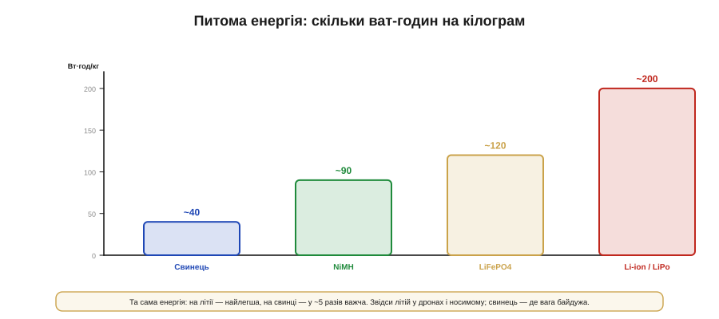
*Рис. 10.4.1.2. Грубі орієнтири: свинець ~40 Вт·год/кг, NiMH ~90, LiFePO4 ~120, Li-ion/LiPo ~200. Літій тримає вп'ятеро більше енергії на грам, ніж свинець, — тому панує там, де вага критична.*

**Приклад (вага батареї під 50 Вт·год).** Порахуймо, скільки важитимуть самі комірки, щоб запасти ту саму енергію — 50 Вт·год — на різних хіміях.

```
маса ≈ енергія / питома_енергія      (лише комірки, без корпусу)

Li-ion  (~200 Вт·год/кг):  50 / 200 = 0.25 кг   (250 г)
LiFePO4 (~120):            50 / 120 ≈ 0.42 кг   (420 г)
NiMH    (~90):             50 / 90  ≈ 0.56 кг   (560 г)
Свинець (~40):             50 / 40  = 1.25 кг   (+ важкий корпус, ще більше)
```

Розкид — **уп'ятеро**, від чверті кілограма до півтора. Для дрона, де кожен грам віднімається від корисного навантаження й часу польоту, відповідь очевидна — Li-ion. А для метеостанції, що нерухомо стоїть біля стовпа, зайвий кілограм нічого не вартий, зате інші осі (ціна, ресурс, безпека) переважують — і там часто виграє LiFePO4 чи навіть свинець. Питома енергія — перша вісь, але не єдина.

Поряд із енергією на вагу існує й енергія на **об'єм** (Вт·год/л), і для маленького корпусу вона часом важливіша за грами. Тут літій теж попереду, хоч розрив із рештою менший. А LiPo додає окремий козир — **форму**: його плаский пакет роблять майже будь-яких пропорцій і втискають у тонкий корпус годинника чи навушника, тоді як свинець і циліндричні елементи диктують свою геометрію. Тобто «скільки енергії влізе» залежить не лише від хімії, а й від того, наскільки ви вільні у виборі форми.

Варто розрізняти й дві речі, які легко плутають: **енергію** (скільки всього запасено, ват-години) і **потужність** (як швидко її можна віддати, обмежену допустимим струмом). Хімії різняться й тут: свинець і деякі «силові» літієві елементи віддають великі струми, тоді як «енергоємні» комірки тримають багато заряду, але не люблять різких ривків. Для стартера авто головна — потужність, для метеостанції — енергія; і та сама вісь «потужність проти ємності» знову постане, коли в наступній темі візьмемося за внутрішній опір.

### Криві розряду: чи видно заряд по напрузі

Тепер тонша, але дуже практична відмінність — **форма кривої розряду**: як падає напруга елемента в міру того, як з нього беруть заряд. Здавалося б, технічна дрібниця, та саме вона визначає, чи зможемо ми згодом оцінити залишок заряду «на око», по вольтметру.

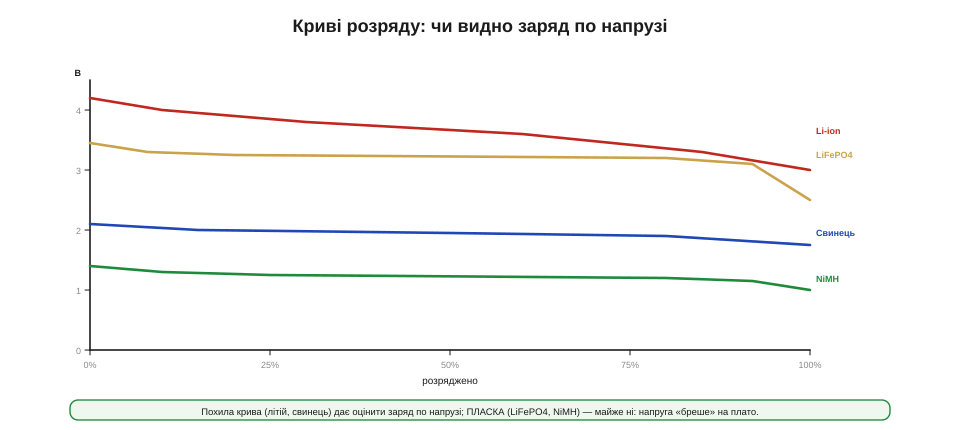
*Рис. 10.4.1.3. Li-ion і свинець розряджаються **похило** — напруга помітно падає від повного до порожнього, тож по ній можна грубо судити про залишок. LiFePO4 і NiMH мають **пласке плато**: майже весь розряд напруга тримається сталою й «бреше» про заряд, різко падаючи лише в кінці.*

У **Li-ion** напруга плавно сповзає з 4.2 до 3.0 В — за нею, знаючи хімію й навантаження, можна прикинути відсоток заряду. У **свинцю** теж похило (а ще й густина кислоти підказує). А от **LiFePO4** і **NiMH** мають підступне **пласке плато**: майже весь розряд напруга стоїть майже незмінна (у LFP — близько 3.2 В), і лише наприкінці обвалюється. Це чудово для навантаження (стабільне живлення), але жахливо для оцінки заряду: 80% і 20% залишку виглядають по напрузі майже однаково. Запам'ятаймо цей наслідок — він стане центральним, коли в розділі дійдемо до того, **як чесно виміряти залишок заряду**: на пласкій хімії самої напруги мало, потрібен облік відданих ампер-годин.

Форма кривої б'є й по **корисній** ємності. Пристрій вимикається не на нулі, а на своєму порозі — коли перетворювачу вже бракує входу. На **похилій** кривій частина заряду лишається «під порогом» недосяжною: останні відсотки віддаються вже на надто низькій напрузі, до якої схема не дотягне. На **пласкій** же хімії майже вся ємність віддається на робочій напрузі, а тоді різкий обвал, — тож корисною стає чи не вся паспортна ємність, зате попередження «скоро сяду» приходить пізно й раптово. Це ще один бік того самого компромісу: рівна напруга зручна для схеми, але підступна для прогнозу залишку.

### Скільки циклів і за яку ціну

Батарея старіє: з кожним циклом «заряд-розряд» її ємність потроху тане. **Ресурс циклів** — скільки таких циклів вона витримає, поки ємність не впаде, скажімо, до 80%, — пряма економічна вісь, але рахувати її треба правильно.


*Рис. 10.4.1.4. Орієнтовний ресурс: свинець ~300 циклів, NiMH ~500, Li-ion ~800, LiFePO4 ~3000 і більше. LFP живе у рази довше — тому, дорожчий за штуку, на ціну одного циклу він часто найдешевший.*

Тут криється поширена помилка — дивитися лише на **ціну за штуку**. LiFePO4 коштує дорожче за звичайний Li-ion, але витримує у три-десять разів більше циклів. Якщо поділити ціну на кількість циклів, тобто рахувати **за весь термін служби**, LFP нерідко виявляється найдешевшим. Свинець дешевий на касі, але його скромний ресурс (надто якщо його глибоко розряджати) робить «дешеву» батарею дорогою в перерахунку на роки. Тому для стаціонарної системи, що працюватиме десятиліття, рахують не чек у магазині, а **вартість одного циклу** — і ця арифметика часто перевертає інтуїцію з ніг на голову.

Саме поняття «цикл» хитріше, ніж здається, і це варто розуміти, щоб не помилитися в розрахунку. Ресурс сильно залежить від **глибини розряду** (*depth of discharge*, DoD): якщо щоразу розряджати літій лише наполовину, циклів буде в рази більше, ніж за розрядів «у нуль». Тому, проєктуючи «під деградацію», часто навмисне беруть більшу батарею й користуються тільки її серединою. Додається й **календарне** старіння: батарея потроху втрачає ємність просто від часу й температури, навіть якщо лежить без діла, — тож для систем, які циклюють рідко, рахують не лише цикли, а й роки. Усе це ми ще розкладемо детальніше, дійшовши до старіння далі в розділі.

### Температура: вузьке вікно заряду

Батарея жива на морозі й у спеку по-різному, і — що критично — **заряд** має набагато вужче температурне вікно, ніж розряд. Сплутати ці два вікна — класична й небезпечна помилка.


*Рис. 10.4.1.5. Вузька кольорова смуга — дозволений діапазон заряду, ширша сіра — розряду. Для всіх літієвих хімій заряд починається від 0°C; розряджати ж можна й добряче нижче нуля. Свинець і NiMH трохи терпиміші до холодного заряду, LiFePO4 — найстійкіший до спеки.*

Найважливіше правило тут стосується **літію** й варте того, щоб закарбувати його: **не заряджати нижче 0°C**. На холоді під час заряду літій не встигає зайти в електрод і осідає на ньому металевими голками (дендритами) — це незворотно вбиває ємність, а в гіршому разі проколює сепаратор і коротить комірку. Розряджати літій на морозі можна (хіба що ємність тимчасово падає), а ось заряджати — категорично ні, доки комірка не відігріється. Свинець і NiMH до холодного заряду трохи терпиміші, а LiFePO4 з усіх літієвих найкраще зносить **спеку**. Саме тому грамотний зарядний вузол завжди має давач температури (ми бачили його як вивід TS у зарядних чипах) і блокує заряд за межами вікна.

Що ж робити, коли заряджати треба, а надворі мороз? Рішень кілька: або **гріти** комірку перед зарядом (власним тепловиділенням чи окремим нагрівачем), або тимчасово **обмежити струм** заряду до крихітного, безпечного навіть на холоді, доки батарея не відігріється. А на іншому кінці шкали підступна **спека**: висока температура майже не заважає роботі, зате різко прискорює старіння — особливо якщо тримати літій гарячим **і** повністю зарядженим. Тому довговічні системи уникають саме цього поєднання; інколи батарею навмисне недозаряджають, щоб подовжити їй життя. Температурна вісь, отже, керує не лише безпекою «тут і зараз», а й тим, скільки років батарея проживе.

### Безпека й норов: чотири характери

Нарешті — **безпека** й загальний «характер» кожної хімії, бо за однаковими вольтами ховаються дуже різні норови. Пройдімося коротко по чотирьох.

**Li-ion / LiPo** — чемпіон за енергією, але й найвимогливіший: боїться перезаряду, переохолодженого заряду й проколу, а при відмові здатен на **тепловий розгін** (*thermal runaway*) — самопідігрів аж до займання. Тому він **ніколи** не ходить без захисної електроніки. LiPo в м'якому пакеті ще й механічно вразливий: надувся — на спокій і утилізацію. **LiFePO4** — спокійний родич літію: трохи менше енергії, зате помітно **безпечніший** (тепловий розгін значно важче спровокувати, кисень при розкладі не виділяється), довговічний і витриваліший до спеки; плата — пласка крива й нижча напруга. **NiMH** — добродушний трудяга: безпечний, не потребує складного захисту, продається готовими «пальчиками», але енергії мало й саморозряд історично великий (сучасні «low self-discharge» це полагодили). **Свинець** — дешевий силач: віддає шалений пусковий струм, прощає перезаряд краще за літій, але важкий і **смертельно боїться глибокого розряду** (сульфатація, про яку ми говорили в історії).

Окрема, часто вирішальна вісь для embedded — **саморозряд**: як швидко батарея «худне» просто лежачи. Тут літієві елементи хороші: втрачають одиниці відсотків на місяць. NiMH класично були ненажерливі (сідали за кілька місяців), поки «low self-discharge» різновиди це не виправили. Свинець розряджається помірно, але його не можна лишати **розрядженим** надовго — засульфатується. Тож для пристрою, що місяцями дрімає в режимі сну (а таких в автономній електроніці більшість), саме саморозряд раптом стає головною віссю, важливішою за питому енергію: батарея має пережити простій, а не лише робочі години.

### Карта вибору

Зведімо всі осі в одне практичне рішення.


*Рис. 10.4.1.6. Максимум енергії на мінімумі ваги — Li-ion/LiPo (ціна — обов'язковий захист). Довге життя й безпека — LiFePO4 (ціна — пласка крива, складніша оцінка заряду). Дешево, безпечно, з готових елементів — NiMH (мало енергії). Дешева об'ємна енергія з потужним пусковим струмом — свинець (важко, боїться розряду).*

Логіка проста, щойно осі розкладено. **Носимий, літаючий, мобільний** пристрій, де вага — усе → Li-ion/LiPo. **Стаціонарна, сонячна, відповідальна** система, де цінують роки служби й спокій → LiFePO4. **Простий, дешевий** прилад із малим апетитом, для якого хочеться готових елементів із магазину → NiMH. **Великий запас енергії за малі гроші** плюс величезний миттєвий струм, коли вага байдужа → свинець. Жоден вибір не «правильний» сам по собі — він правильний **під конкретні осі**, які важать саме у вашій задачі.

Одне застереження наостанок: цифри в цій темі — це **орієнтири порядку величини**, а не паспорт конкретної комірки. Усередині кожної хімії елементи різняться за версією (енергоємні проти силових), за якістю й виробником, тож остаточний вибір завжди звіряють із даташитом саме тієї комірки, яку купують. Карта каже, **куди дивитися** й що з чим зважувати, але не звільняє від читання паспорта — як і всюди в інженерії.

### Підсумок теми

Порівнювати акумулятори означає зважувати **компроміс на шести осях**: напруга елемента (скільки комірок на потрібні вольти), питома енергія (вага під задану енергію — літій вп'ятеро легший за свинець), форма кривої розряду (похила в Li-ion і свинцю дає судити про заряд, пласка в LiFePO4 і NiMH — ні), ресурс циклів (LFP живе в рази довше, тож дешевший «за весь термін»), температурне вікно (заряд вужчий за розряд; літій — **ніколи нижче 0°C**) і безпека (Li-ion вимагає захисту й здатен на тепловий розгін; LiFePO4, NiMH і свинець спокійніші). «Найкращої» хімії нема — є найкраща під конкретні осі: літій для ваги, LiFePO4 для життя й безпеки, NiMH для простоти, свинець для дешевої об'ємної енергії. А коли хімію обрано, постає наступне інженерне питання — як вона поводиться **під навантаженням**: чому під різким стрибком струму напруга просідає й від чого це залежить.

## 10.4.2 Внутрішній опір і просадка: батарея під імпульсним навантаженням

Є класична загадка, об яку спотикається кожен, хто вперше живить пристрій від акумулятора: вольтметр показує бадьорі 3.9 В, заряд начебто є, — а варто радіо вийти в ефір чи мотору смикнутися, як пристрій раптом перезавантажується. Куди дівається напруга? Відповідь у тому, що реальна батарея — **не ідеальне джерело**. Усередині неї, послідовно з хімічною «електрорушійною силою», сидить **внутрішній опір** (*internal resistance*, Rвн), і щойно крізь комірку йде струм, частина напруги осідає на цьому опорі, не доходячи до клем. Ми вже стикалися з цим явищем у §7.4.5; тепер розберемо його як слід — бо саме воно, а не запас енергії (тема 10.4.1), часто вирішує, чи виживе пристрій під піком.

Це і є вододіл між **енергією** (скільки запасено) і **потужністю** (як швидко можна віддати), про який ми говорили в минулій темі. Батарея може бути повна по енергії, але якщо її Rвн завеликий, потрібну потужність вона видасть лише ціною глибокої просадки напруги. Розберемося, звідки береться ця просадка, як виміряти Rвн, від чого він залежить — і як проєктувати так, щоб імпульс струму не валив пристрій.

### Модель: ідеальне джерело плюс опір

Найпростіша й напрочуд робоча модель батареї — це **ідеальне джерело** напруги (його значення в спокої називають напругою розімкненого кола, *open-circuit voltage*, OCV) **послідовно** з внутрішнім опором Rвн. Усе, що бачить пристрій на клемах, описується одним рядком.

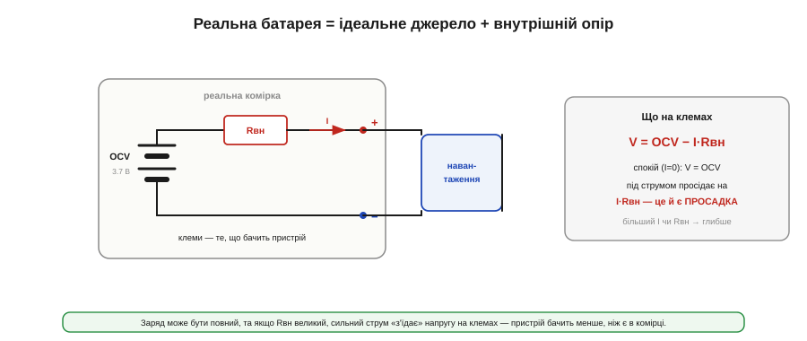
*Рис. 10.4.2.1. Реальну комірку моделюють як ідеальну OCV послідовно з Rвн. На клемах: V = OCV − I·Rвн. У спокої (I=0) видно повну OCV; під струмом напруга просідає рівно на I·Rвн. Що більший струм або опір — то глибша просадка.*

Формула гранично проста, і її варто закарбувати:

```
V_клем = OCV − I · Rвн

  OCV  — напруга в спокої (що «хоче» дати хімія)
  I    — струм, який тягне навантаження
  Rвн  — внутрішній опір комірки
```

Це той самий закон Ома (§1.3), просто застосований до «прихованого» опору всередині джерела. У спокої струму нема, і на клемах повна OCV — тому розряджена на вигляд батарея «відпочиває» й показує вищу напругу. А під навантаженням з'являється член I·Rвн — **просадка** (*voltage sag*), і чим більший струм чи опір, тим вона глибша. Уся подальша тема — це наслідки цього однорядкового рівняння.

Чесно кажучи, один-єдиний резистор — це спрощення. Реальна комірка поводиться як **кілька** опорів і ємностей разом: є миттєвий, чисто омічний спад (на металі, контактах, електроліті), що з'являється й зникає вмить разом зі струмом, і повільніша складова від дифузії іонів, яка «доганяє» за частки секунди. Тому на осцилограмі видно не лише глибокий стрибок на початку піку, а й те, як напруга трохи **відновлюється** після зняття навантаження, не миттєво. Для більшості інженерних прикидок одного Rвн досить; та коли точність важлива, пам'ятають, що за ним ховається ціла RC-поведінка з кількома сталими часу.

### Імпульсне навантаження кусає глибиною

Чому це особливо болить саме з **імпульсним** навантаженням? Бо багато вузлів сучасного пристрою споживають не рівно, а **різкими піками**: радіомодуль під час передачі (LoRa, стільниковий, Wi-Fi) смикає сотні міліампер чи й ампери на короткі спалахи; мотор у момент пуску бере кратний струм; спалах камери розряджає все й одразу. Середній струм при цьому може бути скромний — але саме під час **піку** просадка найглибша.

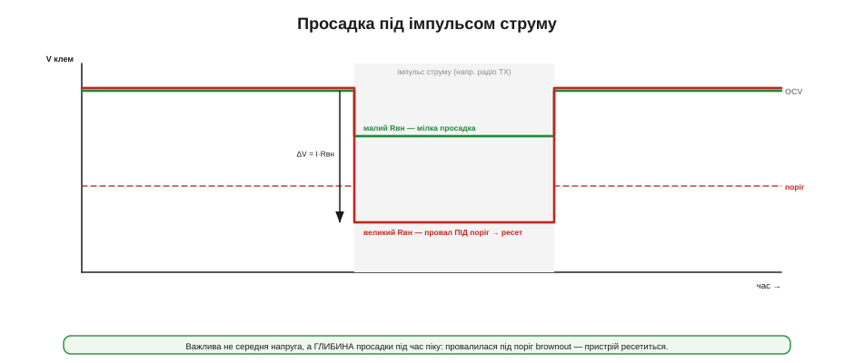
*Рис. 10.4.2.2. Поки навантаження мале, на клемах майже OCV. У момент імпульсу напруга стрибком падає на ΔV = I·Rвн. Із малим Rвн (зелена) просадка мілка й лишається над порогом; із великим (червона) — провалюється ПІД поріг brownout, і пристрій ресетиться, хоч у комірці ще повно заряду.*

Ключовий висновок: важлива не середня напруга, а **глибина просадки в момент піку**. Якщо вона провалює напругу на клемах нижче порогу brownout (того рівня, на якому процесор чи перетворювач уже не тримаються, §4.1.8) — пристрій перезавантажується, втрачає зв'язок чи скидає стан. І трапляється це підступно: середнє споживання мізерне, батарея «майже повна», а пристрій усе одно гине щоразу, коли радіо виходить в ефір. Винна не нестача енергії, а нестача **потужності** — завеликий Rвн на шляху піку.

> 🔧 **Навіщо це.** Якщо пристрій ресетиться саме в момент передачі даних, увімкнення мотора чи спалаху — перша підозра має падати не на «глюк прошивки», а на **просадку**. Поставте осцилограф на клеми батареї й гляньте, що з напругою під час піку: якщо вона стрибком провалюється — ви знайшли винного. Лікується це або меншим Rвн (краща комірка), або буфером (конденсатор), або нижчим порогом brownout — про що далі.

Корисно відокремити дві геть різні мірки. Енергію визначає **середній** струм: радіо, що смикає 2 А лише 5% часу, у середньому бере якихось 0.1 А, і батареї за енергією вистачить надовго. А ось виживе пристрій під піком чи ні — визначає **миттєвий** струм і Rвн, незалежно від того, який середній. Саме тому буває, що батарея «тримає тиждень» за енергією, але пристрій ресетиться щогодини під час передачі: довговічність і стійкість до піку — це дві окремі властивості, і плутати їх не можна.

### Як виміряти Rвн

Rвн — не містична величина, його легко **виміряти** двоточковим методом: зняти напругу на клемах під двома різними струмами й поділити різницю напруг на різницю струмів.

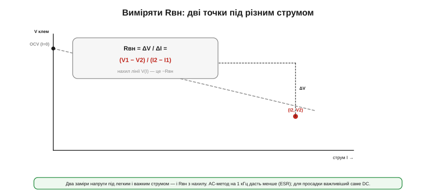
*Рис. 10.4.2.3. Виміряли напругу під легким струмом (I1, V1) і під важким (I2, V2). Rвн — це нахил прямої V(I): Rвн = (V1 − V2)/(I2 − I1). Продовжена до I=0 пряма дає OCV. AC-метод на 1 кГц показує менший «ESR»; для просадки під реальним піком важливіший саме повільний DC-опір.*

**Приклад (вимір Rвн і прогноз просадки).** Зміряймо опір свіжої теплої комірки, а тоді спрогнозуймо, як вона поведеться під піком 2 А — у нормі й у найгіршому куті.

```
Двоточковий вимір (свіжа, тепла комірка):
   I1 = 0.2 А → V1 = 3.82 В
   I2 = 2.0 А → V2 = 3.55 В
   Rвн = (V1 − V2)/(I2 − I1) = (3.82 − 3.55)/(2.0 − 0.2) = 0.27/1.8 ≈ 0.15 Ом

Просадка під пік 2 А:
   свіжа, тепла (OCV 3.7):    ΔV = 2 × 0.15 = 0.30 В → 3.70 − 0.30 = 3.40 В   ✓ живий
   майже порожня + мороз + стара (Rвн ≈ 0.45 Ом, OCV ≈ 3.4):
                              ΔV = 2 × 0.45 = 0.90 В → 3.40 − 0.90 = 2.50 В   ✗ brownout!
```

Той самий пік 2 А: у добрих умовах пристрій живий, а в найгіршому куті напруга провалюється до 2.5 В — нижче порога, ресет. Зверніть увагу й на тонкість методу: вимірюваний опір залежить від того, **як** міряти. Швидкий AC-метод на 1 кГц дає менший «ESR» (опір на змінному струмі), а повільний DC-метод — більший. Для нашої задачі — просадки під реальним, не миттєвим піком — важливіший саме **DC-опір**, той, що в формулі вище. Детальніше прогноз просадки через C-rate і Rвн ми розкладемо в математичній вставці розділу.

На практиці кілька дрібниць псують вимір, якщо їх не врахувати. Напругу спокою (OCV) читають **не одразу** після навантаження — комірці треба час «відпочити» й розслабитися, інакше OCV вийде заниженою. Навпаки, напругу під струмом знімають **швидко**, поки SoC і нагрів іще не змінились. І весь вимір прив'язаний до температури та заряду: той самий опір при +25 і при 0 °C, на повній і напівпорожній комірці буде різний — тож умови заміру треба фіксувати, а не міряти «як вийде». Інакше два «виміри Rвн» тієї самої комірки чесно дадуть різні числа й тільки заплутають.

> 🧮 **Розрахунок просадки — у вставці.** Як зв'язати Rвн, C-rate і глибину провалу напруги, і скільки запасу закладати, — у математичній вставці цього розділу про просадку під імпульсним навантаженням (далі за чергою).

### Від чого Rвн залежить: заряд

Якби Rвн був сталий, життя було б простим. Та він **гуляє** — і перша вісь цього гуляння — стан заряду (SoC). Опір найменший десь у середині діапазону й помітно **зростає, коли комірка наближається до порожньої**.

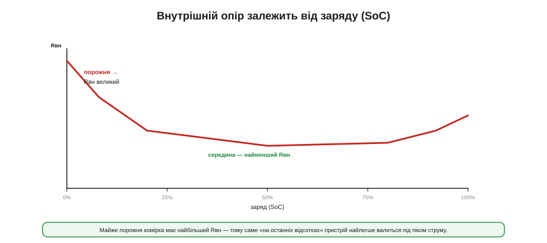
*Рис. 10.4.2.4. Rвн мінімальний у середині заряду й круто росте на «останніх відсотках». Тому майже порожня батарея просідає під піком найглибше — навіть якщо тих відсотків іще ніби вистачає.*

Звідси практичний наслідок, що ламає інтуїцію: пристрій найімовірніше впаде під піком **не тоді, коли батарея сіла в нуль, а трохи раніше** — на тих самих «останніх 10–15%», де Rвн уже злетів, а напруга й так знизилась. Дві біди складаються: нижча OCV плюс вищий Rвн дають подвійно глибоку просадку. Тому, проєктуючи пристрій з піковим навантаженням, корисно вважати «порожнім» не нуль, а той рівень заряду, нижче якого просадка вже небезпечна, — і зупинятися там.

### ...і від температури

Друга вісь — **температура**, і вона ще драматичніша. Хімічні реакції на холоді сповільнюються, іони рухаються неохоче — і Rвн на морозі зростає **в рази**.

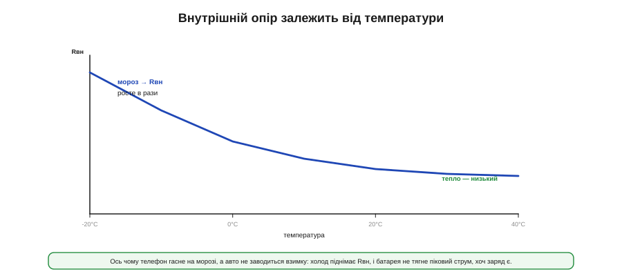
*Рис. 10.4.2.5. Rвн круто росте на холоді й малий у теплі. Та сама комірка на морозі може мати втричі-вчетверо більший опір, ніж у кімнаті, — і тому не тягне піковий струм, хоч заряд нікуди не подівся.*

Це пояснює дві щоденні загадки: чому телефон раптом гасне на холоді (показавши перед тим 40% заряду) і чому авто не заводиться морозного ранку. Заряд є, енергія є — але Rвн виріс настільки, що під піковим струмом (стартера чи радіо) напруга провалюється під робочу. Тепло повертає опір у норму, і та сама батарея «оживає». Для пристрою, що працюватиме надворі, це означає просте правило: розраховувати просадку треба **на найхолодніший** робочий ранок, а не на лабораторні +25 °C.

### ...і від старіння

Третя вісь — **вік**. З роками й циклами всередині комірки наростають паразитні шари, активна маса деградує — і Rвн повільно, але невпинно **зростає**. Стара батарея просідає глибше за нову навіть за однакового заряду й температури.

Це має й корисний бік: зростання Rвн саме по собі — **індикатор здоров'я** батареї (*state of health*, SoH). Якщо періодично міряти внутрішній опір, його повзуче збільшення підкаже, що комірка старіє, задовго до того, як вона почне відверто підводити. До цього — як оцінювати здоров'я й залишок ресурсу — ми ще повернемося в темі про старіння далі в розділі. А головний інженерний висновок звучить так: три осі — **низький заряд, холод і вік — складаються**. Свіжа тепла комірка тримає пік легко; та сама комірка наприкінці заряду, на морозі й через два роки служби має втричі більший Rвн — і той самий пік уже валить пристрій (як у нашому прикладі: 3.40 В перетворилися на 2.50 В). Проєктувати треба не на «типову» комірку, а на її **найгірший кут**.

Варто знати й те, як цей опір трапляється в документах. Даташит комірки зазвичай наводить типовий Rвн (нерідко окремо DC і AC на 1 кГц) за певних умов — і вже від цих умов відштовхуються, додаючи запас на холод, розряд і старіння. А в готових батареях стежити за опором на ходу може система керування (BMS, тема далі в розділі): зрослий Rвн однієї комірки видає її як слабшу за сусідів, а отже — кандидата на заміну. Тобто внутрішній опір — це не лише ворог, якого терплять, а й величина, яку **читають**, щоб судити про стан батареї.

### Що з цим робити

Знаючи механізм, маємо чіткий набір ходів, щоб імпульс не валив пристрій.

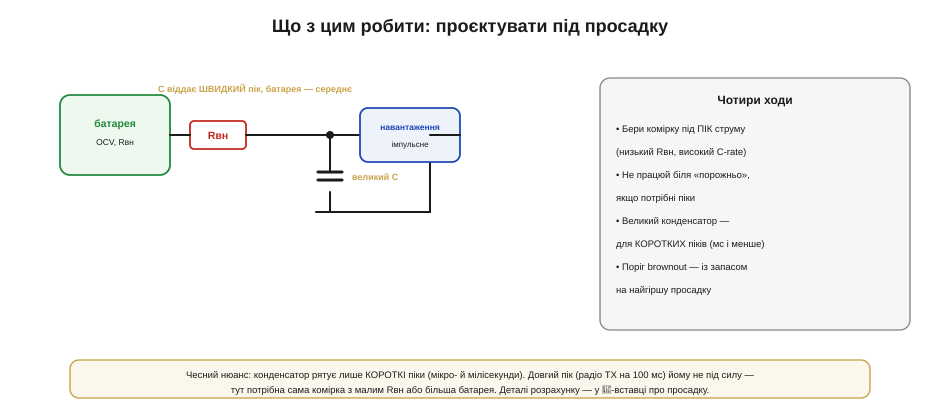
*Рис. 10.4.2.6. Чотири ходи: брати комірку під піковий струм (низький Rвн, високий C-rate); не працювати біля «порожньо», якщо потрібні піки; ставити великий конденсатор для коротких піків; і закладати поріг brownout із запасом на найгіршу просадку. Конденсатор поряд із батареєю віддає швидкий пік, а батарея — середній струм.*

Ходів чотири, і вони доповнюють один одного. Перший — **брати правильну комірку**: під пікове навантаження потрібен низький Rвн і високий допустимий струм (C-rate), навіть ціною трохи меншої питомої енергії (та сама вісь «потужність проти ємності» з теми 10.4.1). Другий — **не заходити в зону високого Rвн**: якщо пристрій смикає піки, не висаджувати батарею до останніх відсотків, де опір злітає. Третій — **буфер**: великий конденсатор поряд із навантаженням бере на себе швидкий кидок струму, поки батарея віддає лише середній (це та сама логіка вхідного конденсатора з тем 10.2.4 і розв'язки живлення). Четвертий — **запас по brownout**: поріг, на якому пристрій ще тримається, виставляють із запасом на найглибшу очікувану просадку в найгіршому куті.

Між «звичайним конденсатором» і «кращою коміркою» є й проміжний прийом для важких, але нечастих піків — **суперконденсатор** поряд із батареєю. Він тримає набагато більше заряду за звичайний конденсатор, тож перекриває й довші ривки (десяті частки секунди), розвантажуючи комірку з великим Rвн; натомість він громіздкий і має власні втрати. Це знову та сама вісь «потужність проти ємності» з теми 10.4.1, тільки вже на рівні всього вузла живлення: батарея відповідає за енергію, буфер — за пік, і кожному дістається те, що він уміє найкраще.

Про буфер — чесний нюанс, щоб не покладатися на нього марно. Конденсатор рятує лише **короткі** піки — мікросекунди й одиниці мілісекунд. Довгий пік (як стовідсоткова передача радіо на сотні мілісекунд) розрядить будь-який розумний конденсатор ще на початку — тут конденсатор безсилий, і вся надія на саму комірку з малим Rвн або на більшу батарею. Тобто конденсатор — це ліки від **різких коротких** ривків, а не від тривалого великого споживання; плутати ці випадки — поширена й дорога помилка.

Нарешті, Rвн можна не лише терпіти, а й **використати**. Якщо прошивка вміє раз у раз робити свій маленький двоточковий замір — навмисне вмикаючи відоме навантаження й читаючи провал, — вона дістає дешевий датчик здоров'я й температури батареї без жодних зайвих деталей. Багато готових паливних лічильників так і роблять усередині, оцінюючи Rвн на ходу, щоб точніше передбачити, скільки пристрій іще протримається саме під реальним, а не лабораторним навантаженням. Так той самий опір, що валить пристрій під піком, стає й корисним джерелом інформації про батарею.

### Підсумок теми

Реальна батарея — це **OCV послідовно з внутрішнім опором Rвн**, тож на клемах завжди V = OCV − I·Rвн, і під струмом напруга **просідає** на I·Rвн. Болить це найбільше з **імпульсним** навантаженням (радіо, мотор, спалах): важлива не середня напруга, а глибина провалу під час піку — провалився під поріг brownout, і пристрій ресетиться, хоч заряд є. Rвн **міряють** двоточково (нахил V(I)), і він не сталий: круто росте **на низькому заряді**, **на морозі** й **з віком**, причому ці три осі **складаються** в найгірший кут, де просадка втричі глибша за типову. Тому проєктують під цей найгірший кут чотирма ходами: комірка під піковий струм (низький Rвн), робота подалі від «порожньо», конденсатор-буфер для коротких піків і поріг brownout із запасом. А зростання Rвн принагідно слугує індикатором старіння — місток до того, як цю батарею **правильно заряджати**, чим і займемося далі.

## 10.4.3 Заряд правильно: CC/CV глибоко, термінація, температурні межі

Розряд батареї пробачає багато; **заряд** — майже нічого. Залити в літієву комірку забагато напруги, забагато струму чи зробити це на морозі — означає в кращому разі вбити ємність, у гіршому — влаштувати пожежу. Тому заряд літію — це не «під'єднати до 5 В», а точний алгоритм із жорсткими межами. Ми вже бачили його контури в §7.4.6; тепер розберемо як слід — бо в цьому розділі ми вже не просто користуємось зарядкою, а **проєктуємо зарядний вузол** і маємо розуміти кожну його дію. А ставки тут високі: помилка в зарядному вузлі коштує не «глюка», а зіпсованої батареї чи навіть пожежі, тож саме тут цінується розуміння механізму, а не копіювання навмання.

Канонічний алгоритм заряду літію зветься **CC/CV** — constant current / constant voltage, сталий струм, потім стала напруга. За ним же, з варіаціями, заряджають і свинець; а от нікелеві хімії живуть за іншими правилами, про що теж скажемо. Пройдемо алгоритм по фазах, розберемо, чому точність 4.2 вольта критична, чому літій **не доливають** нескінченно, як заряд залежить від температури — і складемо практичний зарядний вузол.

### CC/CV: дві фази одного заряду

Серце алгоритму — дві фази, що змінюють одна одну. Спершу **CC** (*constant current*): зарядник ллє в комірку **сталий струм**, а напруга на ній сама поволі росте в міру наповнення. Коли напруга дотягується до цільових 4.2 В, починається **CV** (*constant voltage*): тепер зарядник **тримає сталі 4.2 В**, а струм, навпаки, сам спадає, бо комірка вже майже повна й бере дедалі менше.

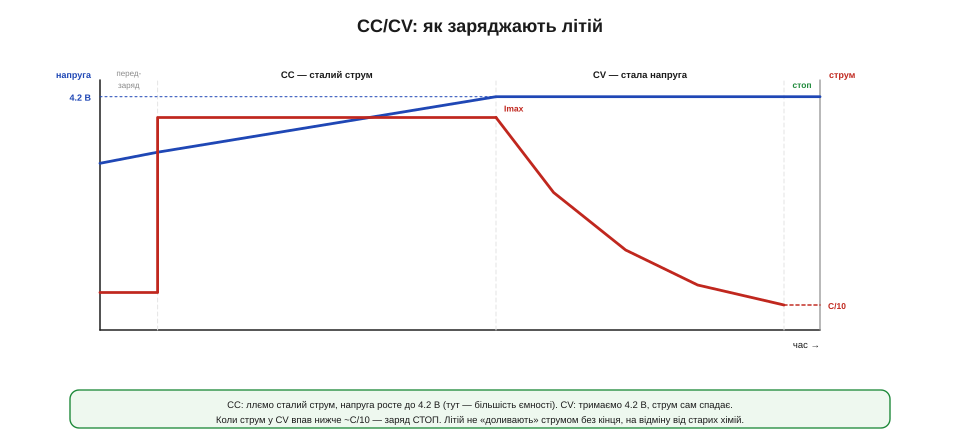
*Рис. 10.4.3.1. У фазі CC струм сталий (синя крива напруги росте до 4.2 В); у фазі CV напруга зафіксована на 4.2 В, а струм (червона крива) спадає. Більшість ємності входить саме у CC; CV доливає «хвіст». Коли струм у CV впав нижче ~C/10 — заряд зупиняють.*

Інтуїція проста, якщо думати про комірку як про посудину. У фазі CC ми **наповнюємо її з постійним напором** — рівень (напруга) росте. Щойно рівень сягнув краю (4.2 В), даліше лити з тим самим напором не можна — переллється (перезаряд). Тож переходимо в CV: **тримаємо рівень рівно по край**, а потік сам стихає, бо посудина майже повна. Цей поділ і робить заряд безпечним: струм обмежений у CC (не спалити), напруга обмежена у CV (не перезарядити). Два прості обмеження замість одного складного контролю — та сама ідея, що в керуванні перетворювачем (тема 10.2.5), тільки тут об'єкт — батарея.

Варто розуміти, що за фразою «зарядник тримає струм чи напругу» стоїть звичайний перетворювач (Розділи 10.1–10.2), лише керований по-особливому: його петля зворотного зв'язку в CC обмежує струм, а в CV — напругу. Реалізують його двояко. **Лінійний** зарядник — це по суті керований резистор: простий і дешевий, але всю різницю між входом і напругою комірки він розсіює теплом (з 5 В у комірку 3.7 В при струмі 1 А це понад ват — і чип помітно гріється). **Імпульсний** зарядник ефективніший і холодніший, бо не палить надлишок, та складніший і дорожчий. Вибір між ними — той самий компроміс «просто проти ефективно», що й у звичайних перетворювачах.

### Повний цикл і скільки це триває

До двох головних фаз додається ще одна, на початку, — **передзаряд** (*precharge*, або trickle). Якщо комірка розряджена **глибоко** (нижче ~3 В, а то й у нуль), лити в неї одразу повний струм небезпечно: пошкоджений літій може перегрітися. Тому зарядник спершу дає **крихітний** струм, щоб обережно підняти напругу до безпечної зони, і лише тоді переходить у нормальний CC.

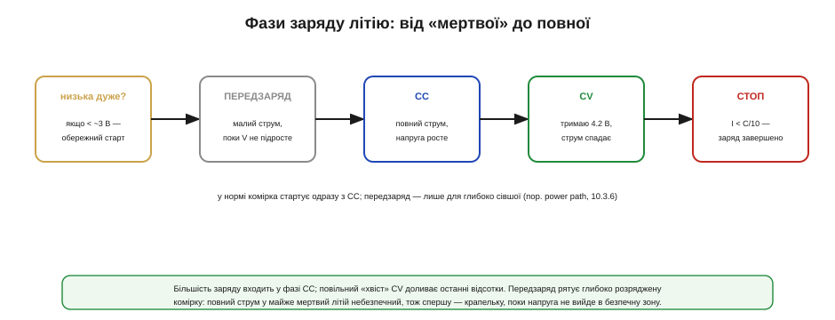
*Рис. 10.4.3.2. Повний цикл: глибоко сіла комірка → передзаряд малим струмом → CC повним струмом (напруга росте) → CV (тримаємо 4.2 В, струм спадає) → стоп, коли струм < C/10. У нормі комірка стартує одразу з CC; передзаряд — лише для глибоко розрядженої (пор. оживлення «мертвої» батареї через power path, 10.3.6).*

Скільки ж це все триває? Тут є важлива несподіванка: фази дуже **нерівні** за часом.

**Приклад (час заряду комірки 2000 мА·год).** Заряджаємо струмом 0.5C, тобто 1.0 А.

```
Фаза CC (струм 1.0 А, поки напруга не дійде 4.2 В):
   входить ~70% ємності ≈ 0.7 × 2000 = 1400 мА·год
   час ≈ 1400 / 1000 ≈ 1.4 год

Фаза CV (тримаємо 4.2 В, струм спадає від 1.0 А до C/10 = 0.2 А):
   доливає решту ~30%, але ПОВІЛЬНО → ще ~0.7–1.0 год

Разом до «повної»:  ~2.3–2.4 год
   …хоча перші 70% було вже за 1.4 год

На холоді (0–10 °C) струм CC ріжуть удвічі (0.5 А) → фаза CC ~2.8 год.
```

Висновок промовистий: **CC — швидка й продуктивна**, а «хвіст» CV — повільний і дає мало. Саме тому «швидка зарядка до 80%» — це переважно фаза CC, яку обривають, не чекаючи на хвіст; а останні відсотки до справжніх 100% коштують непропорційно багато часу. І відразу видно, як температура втручається: знижений на холоді струм прямо подовжує заряд (а нижче 0 °C його взагалі не починають — про це далі).

Який же струм CC брати? Це окремий компроміс. Більший струм (ближче до 1C і вище) заряджає швидше, але дужче гріє комірку й помітніше скорочує її ресурс; менший (0.2–0.5C) лагідніший і до батареї, і до тепла, та повільніший. Для більшості embedded-пристроїв розумний вибір — десь **0.5C**: удвічі повільніше за «годинний» заряд, зате відчутно довше живе батарея. Гнатися за максимальним струмом «бо швидше» — поширена помилка: для пристрою, що заряджається вночі, зайва швидкість нічого не дає, а ресурс відбирає.

### Точність 4.2 В: ємність проти життя

Чому в усьому алгоритмі так наполягають на **точному** значенні напруги CV? Бо літій тут разюче чутливий: десяті частки вольта вирішують долю комірки.

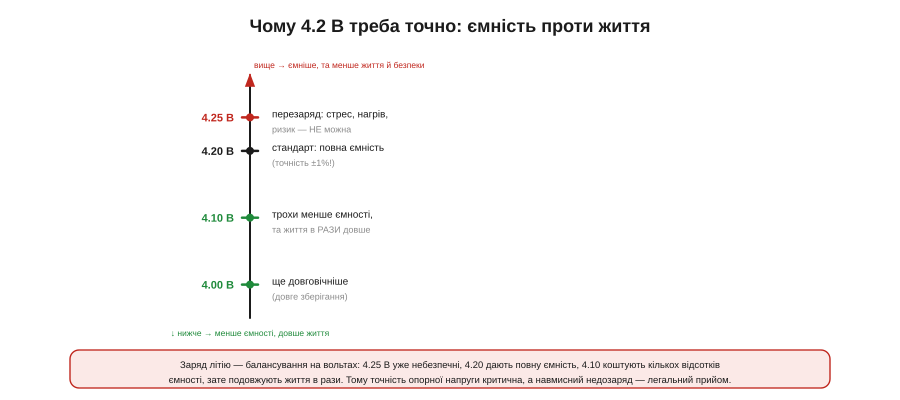
*Рис. 10.4.3.3. Зарядити до 4.25 В — це стрес, нагрів і ризик (так не можна); 4.20 В — стандарт, повна ємність, але вимагає точності ±1%; 4.10 В — кілька відсотків ємності втрачено, зате життя комірки в рази довше. Вище — ємніше, але небезпечніше й коротше; нижче — довговічніше.*

Картина така. Перевищити — скажімо, зарядити до **4.25 В** — означає загнати в комірку забагато: вона гріється, всередині йдуть небажані реакції, ресурс падає, а ризик теплового розгону зростає. Тому **4.25 В — це «не можна»**, і саме тому опорна напруга зарядника має бути точна в межах десь **±1%**: дешевий неточний зарядник, що замість 4.20 дає 4.30, поволі вбиває батарею. А ось у інший бік точність грає на нас: зарядивши свідомо **менше** — до 4.10 чи навіть 4.0 В — ми втрачаємо кілька відсотків ємності, але подовжуємо життя комірки **в рази**. Тому навмисний недозаряд — не помилка, а **легальний інженерний прийом** для пристроїв, де довговічність важливіша за останні відсотки заряду (до цього ми ще повернемося, говорячи про старіння). Заряд літію — це балансування на вольтах між «ємніше» і «довше».

Окремо ускладнюється все, коли комірок **кілька послідовно** (2S, 3S і більше). Тоді 4.2 В має дістати **кожна** комірка окремо, а не лише пакет загалом: якщо стежити тільки за сумарною напругою, одна слабша комірка легко перезарядиться, поки сусіди ще не повні. Тому багатокоміркові батареї **балансують** — вирівнюють заряд комірок, зливаючи надлишок із тих, що вже повні (пасивно), або переливаючи його (активно). Стежить за цим окрема система керування (BMS), до якої ми ще дійдемо в розділі. Для одинарної комірки (1S) цього клопоту нема — і саме тому 1S такий популярний у простих пристроях.

### Термінація: чому літій не «доливають»

Є фундаментальна різниця між літієм і старими хіміями, на якій легко обпектися. Свинець і нікель-кадмій можна тримати на **підзаряді** (*trickle/float*) — підливати малий струм нескінченно, компенсуючи саморозряд. З **літієм так не можна**.

Літій заряджають до повного — і **зупиняють**. Момент зупинки (термінація) визначають за струмом: коли у фазі CV він, спадаючи, падає нижче приблизно **C/10** (десятої частки ємності за годину), комірку вважають повною й заряд **вимикають**. Далі її не підживлюють: тримати повністю заряджений літій під постійною напругою — означає прискорювати його старіння, а підливати струм у вже повну комірку небезпечно. Якщо ж напруга з часом сама просіла (від саморозряду), зарядник просто **перезапускає** цикл наново, а не «доливає» потихеньку. Ця відмінність — одна з найчастіших пасток для тих, хто переносить звички зі свинцевих чи нікелевих систем на літій: те, що рятувало там, тут шкодить.

З тієї ж причини окремо стоїть **зберігання**. Якщо пристрій надовго лягає «на полицю», тримати його батарею зарядженою на повні 100% — чи не найгірше, що можна зробити: повний літій старіє найшвидше, надто в теплі. Тому для тривалого зберігання його лишають зарядженим **приблизно наполовину** — десь до 3.7–3.8 В на комірку, — і це помітно подовжує життя. Деякі розумні зарядники й самі вміють виставляти такий «зберігаючий» рівень замість повного, коли пристроєм довго не користуються.

### Температурні межі

Заряд має **вузьке** температурне вікно — значно вужче за розряд (ми бачили це в темі 10.4.1). І зарядний вузол зобов'язаний це вікно стерегти, бо саме на заряді холод і спека найнебезпечніші.

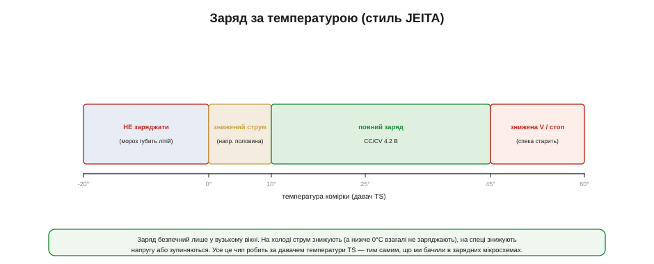
*Рис. 10.4.3.4. Типова температурна логіка (її формалізують настанови JEITA): нижче 0 °C — заряд заборонено; 0–10 °C — зниженим струмом (скажімо, половинним); 10–45 °C — повний заряд; вище ~45 °C — знижена напруга або стоп. Усім керує давач температури комірки (TS).*

Правил тут кілька, і всі — за температурою **самої комірки**, яку міряє термістор. Нижче **0 °C заряджати не можна взагалі** (на холоді літій осідає металом — незворотно, ми це розбирали). У холодній зоні над нулем (приблизно 0–10 °C) заряд ведуть **зниженим струмом** — звідси й подовження часу з нашого прикладу. У **спеці** (вище ~45 °C) або знижують напругу CV, або зупиняють заряд узагалі, бо гарячий заряд різко старить комірку. Цю логіку «струм і напруга залежно від температури» галузь звела в настанови **JEITA**, і добрий зарядний чип реалізує її сам — за тим самим давачем TS, що ми вже зустрічали на виводах зарядних мікросхем. Для розробника висновок простий: **термістор на батареї — не опція, а частина безпеки**.

Тут є й тонкість розміщення: щоб давач казав правду, його тулять **до самої комірки**, а не абикуди на платі, — інакше він міряє температуру повітря чи сусіднього чипа, а не літію. І ще: комірка під час заряду трохи **гріється сама**, тож той самий термістор заодно ловить ненормальний перегрів (ознаку біди) — ще одна причина тримати його в щільному тепловому контакті з батареєю, а не «десь поруч».

### Кожна хімія по-своєму

Дотепер ми говорили про літій, але варто чітко усвідомити: **алгоритм заряду — це частина хімії**, і переносити його з однієї на іншу не можна.

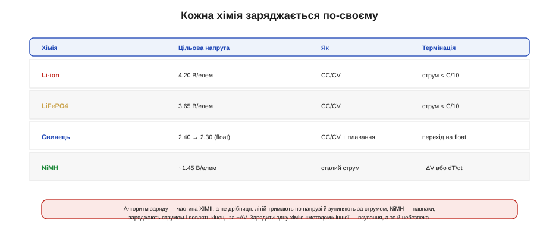
*Рис. 10.4.3.5. Li-ion заряджають CC/CV до 4.20 В і зупиняють за струмом (< C/10). LiFePO4 — так само CC/CV, але до 3.65 В. Свинець — CC/CV до ~2.4 В на елемент, а тоді переходять на підзаряд (float) ~2.3 В. NiMH — навпаки: ллють сталий струм і ловлять кінець за крихітним спадом напруги (−ΔV) чи зростанням температури (dT/dt).*

Відмінності принципові. **LiFePO4** — той самий CC/CV, але цільова напруга інша, **3.65 В**, і зарядити його «методом Li-ion» на 4.2 — це грубий перезаряд. **Свинець** теж CC/CV, але після заповнення переходить у **плавання** (float) — той самий підзаряд, якого літій не терпить. А **NiMH** живе зовсім інакше: його заряджають **сталим струмом** і ловлять момент повноти не за напругою-стелею, а за тонкими ознаками — крихітним **спадом** напруги наприкінці (−ΔV) або стрибком температури (dT/dt). Тобто там, де літій тримають по напрузі й зупиняють за струмом, NiMH тримають по струму й зупиняють за напругою — дзеркально. Сплутати ці алгоритми — це не «трохи неоптимально», а псування батареї, а з літієм — і пряма небезпека.

### Зарядний вузол на практиці

Складімо тепер усе в реальний **зарядний вузол**. Хороша новина: розробнику рідко доводиться будувати CC/CV-логіку з нуля — її вже містить готовий зарядний чип.

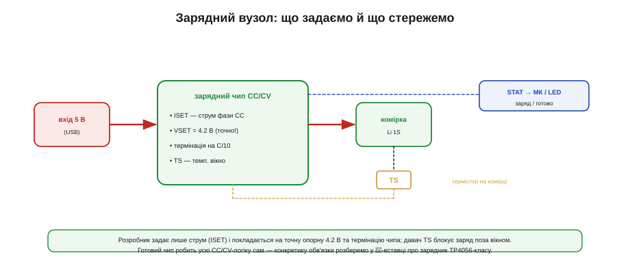
*Рис. 10.4.3.6. Вхід (5 В з USB) → зарядний чип → комірка. Розробник задає лише струм CC (резистором ISET) і покладається на точну вбудовану опорну 4.2 В та термінацію на C/10. Давач TS на комірці блокує заряд поза температурним вікном. Сигнал STAT повідомляє МК чи світлодіоду стан: заряджається / готово.*

На практиці ваша робота зводиться до кількох рішень. Вибрати **струм CC** під ємність комірки (типово 0.5–1C, менше — лагідніше до батареї) і задати його одним резистором ISET. Покластися на чип у тому, що він точно тримає **4.2 В** і правильно **термінує** на C/10. Повісити **термістор TS** на комірку, щоб заряд блокувався поза вікном (а часом — щоб струм знижувався на холоді автоматично). І завести **STAT** у мікроконтролер чи на світлодіод, щоб знати стан. Усе важке — таймінги фаз, опорна напруга, логіка JEITA — лишається всередині чипа. Конкретну обв'язку такого зарядника на рівні ніжок і номіналів ми розберемо в компонентній вставці розділу.

Один практичний нюанс вибору вузла — **тепло**. Найпоширеніші дешеві зарядні чипи лінійні, і на великому струмі вони відчутно гріються (той самий понадватний розсів із прикладу вище). Тому або обмежують струм заряду, щоб чип не перегрівся, або дбають про тепловідвід — полігон міді під корпусом, — або беруть імпульсний зарядник там, де струми великі. Усе це варто прикинути ще до розведення плати: перегрітий лінійний зарядник зазвичай сам ріже струм, тож «номінальний» заряд на гарячій тісній платі легко виявиться вдвічі повільнішим, ніж обіцяє даташит.

> 🔌 **Зарядник зблизька — у вставці.** Розбір зарядного чипа TP4056-класу — як задати струм резистором, куди вішати термістор, як читати STAT — у компонентній вставці цього розділу про TP4056-клас (далі за чергою).

### Підсумок теми

Заряд літію — точний алгоритм **CC/CV**: спершу сталий струм (напруга росте, входить більшість ємності), тоді стала напруга 4.2 В (струм сам спадає). Глибоко сіла комірка спершу проходить обережний **передзаряд**. Фаза CC швидка, «хвіст» CV повільний — тому «80% швидко» це CC, а повні 100% коштують довгого хвоста. Точність **4.2 В критична** (±1%): 4.25 небезпечні, а навмисний недозаряд до 4.1 в рази подовжує життя ціною кількох відсотків ємності. Літій **термінують** за струмом (< C/10) і **не доливають** нескінченно, на відміну від свинцю й нікелю. Заряд має **вузьке температурне вікно** (нижче 0 °C — зась; на холоді менший струм, у спеку менша напруга — логіка JEITA за давачем TS). І головне: **алгоритм заряду — частина хімії** (LiFePO4 до 3.65, свинець із float, NiMH за −ΔV), плутати їх не можна. На практиці все це робить готовий зарядний чип, а розробник задає струм, вішає термістор і читає статус. Маючи заряджену батарею, постає дзеркальне питання — **скільки в ній лишилось** і як це чесно виміряти, надто коли напруга «бреше».

## 10.4.4 Скільки лишилось: SoC, кулонометрія, фьюжн напруги і струму

Кожен користувач хоче бачити «скільки відсотків лишилось», а кожен розробник знає, що дати цю цифру чесно — на диво важко. Стан заряду (*state of charge*, **SoC**) — не те, що батарея показує сама: усе, що видно ззовні, — це напруга й струм на клемах, а скільки заряду всередині, доводиться **обчислювати**. І тут немає одного ідеального способу: є три прийоми, кожен зі своєю вадою, і мистецтво в тому, щоб поєднати їх так, аби сильні сторони перекрили слабкі.

Корисно почати з того, чому це взагалі важко. Бензобак має поплавець, що прямо показує рівень; у батареї такого поплавця нема — заряд захований у хімії, і жоден провід не виводить його назовні. Ба більше, «повний» бак завжди той самий, а «повна» батарея з роками вміщає дедалі менше. Тож паливомір батареї — це не сенсор, а **оцінювач**: він будує здогад про невидиму величину з того дрібного, що видно на клемах. І як кожен здогад, він буває кращим чи гіршим залежно від того, скільки розуму в нього вкласти.

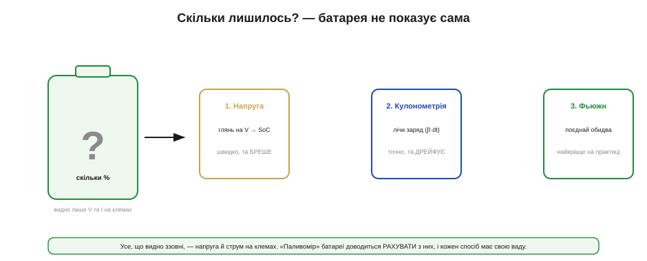
*Рис. 10.4.4.1. Зсередини батарея непрозора: видно лише напругу й струм на клемах. Звідси три способи оцінити заряд: за напругою (швидко, але бреше), лічбою заряду (точно коротко, але дрейфує) і їхнім поєднанням (фьюжн — найкраще на практиці). Кожен ми зараз розберемо.*

Розглянемо ці три методи по черзі — метод напруги, кулонометрію та їхній фьюжн, — а тоді додамо два практичні стовпи надійного паливоміра: перекалібрування на краях і поправку на те, що сама ємність із часом тане.

Навіщо взагалі ця точність? Бо від оцінки SoC залежать конкретні рішення пристрою: коли попередити користувача, коли коректно завершити роботу й зберегтися (поки ще є енергія), коли вимкнути ненайважливіше, щоб дотягти довше. Груба оцінка тут — не дрібниця: показати «20%», коли насправді 5%, означає вимкнутись посеред справи без попередження. Тому в SoC вкладають зусиль рівно стільки, скільки коштує помилка: десь досить грубого індикатора на три поділки, а десь — точного відсотка з прогнозом часу.

### Метод напруги: швидко, але бреше

Найдешевший спосіб — за **напругою**. У темі 10.4.1 ми бачили, що крива розряду пов'язує напругу зі станом заряду; отже, вимірявши напругу, можна по цій кривій (її звуть OCV-кривою) прочитати приблизний SoC. Спокусливо просто — і саме тому так часто підводить.

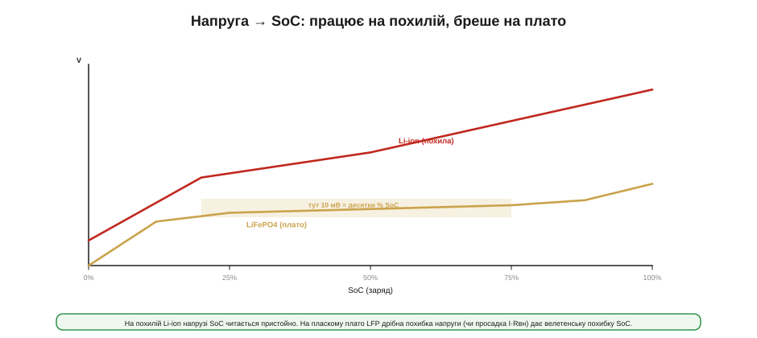
*Рис. 10.4.4.2. На похилій кривій Li-ion напруга помітно міняється зі станом заряду, тож SoC читається пристойно. На пласкому плато LiFePO4 напруга майже стала на більшості діапазону: 10 мВ похибки тут означають десятки відсотків SoC. Та сама біда — від просадки I·Rвн під навантаженням.*

Вад одразу дві. Перша — **просадка** (тема 10.4.2): під навантаженням напруга на клемах нижча за справжню OCV на I·Rвн, тож читати SoC по напрузі можна лише **у спокої**, давши комірці відпочити, — а в робочому пристрої такого спокою часто немає. Друга, фатальна для пласких хімій, — **саме плато**. Полічімо, щоб відчути масштаб.

**Приклад (скільки SoC «коштує» 10 мВ похибки).** Порівняймо похилу Li-ion і пласку LiFePO4.

```
Li-ion (похила): 20–80% SoC ≈ 3.5–4.0 В → 0.5 В на 60% SoC ≈ 8 мВ на 1%
   10 мВ похибки → ~1.2% SoC          (стерпно)

LiFePO4 (плато): 20–80% SoC ≈ 3.20–3.30 В → 0.1 В на 60% SoC ≈ 1.7 мВ на 1%
   10 мВ похибки → ~6% SoC
   а легка просадка під струмом 2 А × 0.05 Ом = 0.1 В → «помилка» ~60% SoC!
```

Висновок жорсткий: на похилому Li-ion напруга — пристойний орієнтир, а на **пласкому LiFePO4 (чи NiMH) самої напруги для SoC майже досить лише на самих краях** — у середині вона «бреше» на десятки відсотків від дрібниці. Тому для пласких хімій потрібен інший, незалежний від напруги метод.

Додає клопоту й те, що сама OCV-крива **повзе** з умовами. Вона трохи різна на холоді й у теплі, тож точний перерахунок напруги в SoC мав би враховувати ще й температуру. А «спокій», потрібний для чесного читання, — це не мить: після помітного струму комірці треба десятки хвилин, щоб напруга **розслабилась** до справжньої OCV (та сама повільна дифузійна складова, що ми бачили в Rвн, тема 10.4.2). Пристрій, який майже весь час під навантаженням, такого спокою не має, — ще одна причина не покладатися на саму напругу.

Є й тонший ефект — **гістерезис**: напруга комірки за того самого SoC трохи різна залежно від того, щойно її заряджали чи розряджали. У Li-ion він невеликий, а от у LiFePO4 помітний — і це додаткова причина, чому пласке плато так погано читається напругою: до майже сталої напруги додається ще й невизначеність, з якого боку ми до неї прийшли.

### Кулонометрія: лічимо заряд

Цей інший метод — **кулонометрія** (*coulomb counting*): не вгадувати заряд за напругою, а **рахувати** його напряму. Заряд — це інтеграл струму за часом, тож якщо безперервно міряти струм, що тече в батарею й з неї, можна точно вести облік: скільки ампер-годин узяли — на стільки SoC і зменшився.

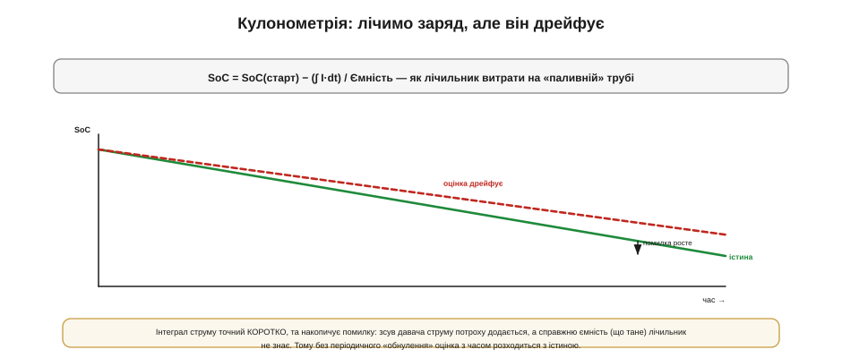
*Рис. 10.4.4.3. SoC = SoC(старт) − (∫ I·dt)/Ємність — як лічильник витрати на паливній трубі. Коротко це точно й гладко, але оцінка повільно **дрейфує**: дрібний зсув давача струму інтегрується в дедалі більшу помилку, а справжню ємність (що тане) лічильник наперед не знає.*

Формула проста й чесна:

```
SoC = SoC(старт) − (∫ I·dt) / Ємність
```

Кулонометрія чудова **коротко**: вона гладка, не боїться просадки й однаково працює на пласких і похилих хіміях. Та має дві свої вади. Перша — їй потрібна **відома точка старту**: інтеграл лічить *зміну* заряду, а не абсолютний рівень, тож якщо не знати, з якого SoC почали, уся лічба «висить у повітрі». Друга — **дрейф**: будь-який сталий зсув у вимірі струму (а він завжди є) інтегрується в помилку, що невпинно росте. Скажімо, зсув лише 1 мА за добу дає 24 мА·год хибної лічби — на комірці 2000 мА·год це понад відсоток за день, який накопичується далі. Сама по собі кулонометрія без періодичної прив'язки поволі «з'їжджає» з істини.

Звідки беруться ці помилки лічби, варто розуміти. Струм зазвичай міряють як падіння на маленькому **шунті** (резисторі) у силовій лінії, і будь-який сталий зсув підсилювача чи похибка номіналу шунта дають той самий невеликий, але **постійний** зсув, що інтегрується в дрейф. Додає й **частота опитування**: якщо лічильник зчитує струм рідко, він проґавить короткі піки (радіо, мотор) і недорахує відданого заряду. Тому добра кулонометрія потребує точного давача струму з малим зсувом і досить частих замірів — або спеціальної мікросхеми, заточеної саме під це (а деякі обходяться й зовсім без шунта, оцінюючи струм інакше).

### Фьюжн: поєднати сильні сторони

Кожен метод має ваду, якої немає в іншого — і це підказує розв'язок. Напруга **абсолютна** (не дрейфує), але шумна й бреше на плато. Кулонометрія **гладка й точна коротко**, але дрейфує й потребує старту. Поєднаймо їх — це й зветься **фьюжн** (злиття).


*Рис. 10.4.4.4. Кулонометрія дає гладку короткострокову оцінку, а напруга (надто на краях кривої та у спокої) — абсолютну прив'язку, що **не дає дрейфу накопичитись**. Разом вони точніші за кожен окремо. Саме так і влаштовані сучасні «паливоміри» (fuel gauge), нерідко ще й із моделлю конкретної комірки.*

Ідея проста: **коротко довіряємо лічбі заряду** (вона гладка й не залежить від просадки), а **напругою повільно підправляємо** її дрейф, коли умови дозволяють — комірка відпочила, або ми на крутій ділянці кривої, де напруга надійна. Так дрейф кулонометрії не встигає накопичитись, а шум напруги згладжується лічбою. Сучасні мікросхеми-паливоміри роблять цей фьюжн усередині, часто маючи ще й **модель** конкретної хімії (як крива поводиться за різних струмів і температур), — тому й дають куди кращу оцінку, ніж будь-який метод поодинці.

Важливо, щоб напругова корекція була **м'якою**. Якби паливомір різко «смикав» оцінку SoC щоразу, коли напруга не збіглася з лічбою, відсотки стрибали б, і користувач бачив би, як вони скачуть туди-сюди. Тому корекцію вносять **поступово**, довіряючи їй більше там, де напруга надійна (спокій, крутий край кривої), і менше там, де ні (під навантаженням, на плато). По суті це проста форма того, що в теорії оцінювання звуть злиттям зашумлених джерел: кожному джерелу — рівно стільки довіри, скільки воно заслуговує в цю мить. Власне поєднання струму й напруги ми ще розкладемо детальніше в окремих вставках розділу.

> ⚙️ **Лічба заряду в прошивці — у вставці.** Як інтегрувати струм у коді, звідки береться дрейф і як його гасити корекціями — в алгоритмічній вставці цього розділу про coulomb counting (далі за чергою).

### Перекалібрування на краях

Фьюжн гасить дрейф, але є ще потужніший прийом — **обнуляти** його на **відомих точках**. Найкраща така точка дається нам безкоштовно — це **повний заряд**.


*Рис. 10.4.4.5. На краях розрядної кривої напруга крута й надійна, у пласкій середині — ні. Тому SoC «прибивають» до відомих точок: повний заряд (термінація CC/CV, тема 10.4.3) = 100%, відсічка розряду = 0%. Кожен повний заряд заодно перекалібровує паливомір, а в пласкій середині покладаються на лічбу заряду.*

Логіка така. Коли зарядник дійшов термінації (струм впав нижче C/10, тема 10.4.3), ми **точно знаємо**: комірка повна, SoC = 100%. Це ідеальний момент **скинути** накопичений дрейф кулонометрії — «прибити» лічильник до 100%. Так само нижній край: коли напруга під час розряду доходить відсічки, це надійний 0%. На цих краях напруга **крута** (а отже, надійна як орієнтир), на відміну від пласкої середини. Тому золоте правило паливоміра: **кожен повний заряд перекалібровує оцінку**, а між калібруваннями вона тримається на лічбі заряду. Звідси й практичний наслідок для пристрою, який *ніколи* не заряджають до повного, — його паливомір ризикує поволі з'їхати, бо не має де перевіритись.

Це реальна біда пристроїв, що живуть «у середині» заряду й рідко бачать повний цикл: їхній паливомір не має нагоди перекалібруватись і поволі бреше — типовий «застряглий» індикатор, що показує те саме тижнями. Інженерні відповіді тут різні: від навмисного періодичного повного заряду «для калібрування», до опори на крутіші ділянки кривої чи температурну поправку, до простого визнання більшої похибки на таких пристроях. Головне — усвідомлювати, що **точність паливоміра не дається задарма**: вона тримається на тому, що пристрій час від часу потрапляє в умови, де оцінку можна звірити з істиною. Нема таких умов — нема й точності, хоч би який розумний був чип.

### Ємність тане: «100%» — рухома ціль

Лишається остання, підступна тонкість. Усі формули вище ділять заряд на **ємність** — а вона **не стала**: з віком і циклами реальна ємність комірки **зменшується** (про це детально — у наступній темі про старіння). Якщо паливомір рахує відсотки від *початкової* паспортної ємності, то на старій батареї його «100%» буде брехнею: насправді повна стара комірка тримає, скажімо, лише 80% колишнього заряду.

Тому добрий паливомір **навчається**: спостерігаючи за повними циклами заряд-розряд, він оновлює свою оцінку *справжньої* поточної ємності й рахує відсотки вже від неї. Це робить «100%» чесними навіть на постарілій батареї — ціною того, що паливоміру треба час від часу бачити досить повний цикл, щоб «переучитись». Тут SoC (скільки лишилось) і здоров'я батареї (скільки взагалі вміщає) сходяться разом, і одне без іншого працює погано.

Користувачу ж зазвичай цікаві не абстрактні відсотки, а **час**: скільки ще пропрацює пристрій. Його прикидають, поділивши залишковий заряд на поточне споживання, — але оскільки споживання стрибає (особливо з імпульсним радіо чи мотором), чесний прогноз згладжують і подають обережно. Звідси й знайомий «стрибучий» відсоток на ґаджетах: під великим навантаженням оцінка раптом падає, бо і просадка напруги, і висока миттєва витрата разом кажуть «лишилось менше, ніж здавалося», а коли навантаження спадає — почасти відіграє назад. Тому добрий паливомір не просто видає число, а й розумно ним розпоряджається: округлює, згладжує й перестраховується ближче до нуля, де ціна помилки найбільша.

### Який метод обрати

Зведімо все в практичне рішення.


*Рис. 10.4.4.6. Похила Li-ion і дешевизна — досить оцінки за напругою у спокої. Пласка LFP або потрібна точність — паливомір із кулонометрією та напругою. Складна система з телеметрією — паливомір із моделлю (дає ще й здоров'я та прогноз часу). Унизу — три залізні правила.*

Вибір простий, щойно розкладено осі. Для **похилого Li-ion**, де висока точність не критична, часто досить дешевої оцінки **за напругою у спокої** — без жодного окремого чипа. Для **пласких хімій** (LiFePO4, NiMH) або там, де потрібна справжня точність, ставлять **паливомір** — мікросхему, що веде кулонометрію з напруговою корекцією. А в складних системах беруть паливомір **із моделлю**, який заодно оцінює здоров'я й прогнозує час роботи. І над усім цим — три залізні правила: **перекалібровуй на повному заряді** (і на відсічці), **не вір останнім ~10%** (там найбільша невизначеність — звідси й звичка показувати «<10%» замість точної цифри) і **враховуй спад ємності** з віком. Конкретний паливомір на рівні ніжок ми розберемо в компонентній вставці.

Варто додати й тверезу ноту про складність: повноцінний паливомір — це додатковий чип, шунт, прошивка й калібрування, і він виправданий не завжди. Для багатьох простих пристроїв чесніше показати грубий індикатор на три-чотири поділки за напругою у спокої, ніж удавати точність, якої насправді нема. Як завжди в інженерії — рівно стільки розуму, скільки коштує помилка: десь треба точний відсоток із прогнозом, а десь вистачить чесного «повна / середня / сідає / замінити».

> 🔌 **Паливомір зблизька — у вставці.** Розбір мікросхеми-паливоміра MAX17048-класу, що оцінює SoC без зовнішнього шунта, — у компонентній вставці цього розділу про fuel gauge (далі за чергою).

### Підсумок теми

Стан заряду (**SoC**) батарея не показує сама — його **обчислюють** з напруги й струму на клемах, і кожен спосіб має ваду. **Метод напруги** дешевий, але бреше: під навантаженням заважає просадка I·Rвн, а на **пласкому плато** LiFePO4/NiMH дрібна похибка напруги дає десятки відсотків SoC (на похилому Li-ion — стерпно). **Кулонометрія** рахує заряд як інтеграл струму: гладко й точно коротко, але **дрейфує** й потребує відомого старту. **Фьюжн** поєднує їх — лічба дає гладкість, напруга прибиває дрейф, — і саме так працюють мікросхеми-паливоміри, часто з моделлю комірки. Дрейф додатково **обнуляють на краях**: повний заряд = 100%, відсічка = 0%, де напруга крута й надійна, тож кожен повний заряд перекалібровує оцінку. Нарешті, ділити заряд треба на **поточну** ємність, бо вона тане з віком, — тож паливомір ще й «навчається» справжньої ємності. Практично: похилий Li-ion — досить напруги у спокої; пласкі хімії й точність — паливомір; завжди перекалібровуй на повному й не вір останнім відсоткам. А те, чому ємність узагалі тане й що батарею старить, — тема наступної розмови.

## 10.4.5 Старіння: цикли, календар, SoH

Батарея — єдиний компонент пристрою, що **гарантовано зношується** просто від того, що існує. Резистор через рік той самий, мікроконтролер через п'ять — теж, а от акумулятор невпинно втрачає ємність і набирає внутрішнього опору, хоч би як дбайливо з ним поводитись. Питання не в тому, **чи** він постаріє, а в тому, **як швидко** — і тут між «два роки» й «десять років» лежать наші інженерні рішення. Ми вже не раз згадували старіння — як зростання Rвн (тема 10.4.2) і спад ємності, що збиває паливомір (тема 10.4.4); тепер зберемо це докупи: що саме старить літій, як міряти зношеність і, найважливіше, як проєктувати так, щоб батарея прожила довго.

Головна теза теми проста й мобілізує: **деградацію не можна відвернути, але можна сповільнити в рази й спланувати наперед**. Розберемо два механізми старіння (циклічне й календарне), поняття здоров'я батареї (SoH), список того, що старіння пришвидшує, і набір прийомів проєктування «під деградацію».

### Два старіння: від циклів і від часу

Старіння приходить **двома** незалежними шляхами, і це варто чітко розрізняти. Перший — **циклічне** (*cycle aging*): кожен повний цикл заряд-розряд трохи зношує комірку, бо активні матеріали при цьому розширюються, стискаються й потроху руйнуються. Другий — **календарне** (*calendar aging*): комірка старіє **просто від часу**, навіть якщо лежить без діла в шухляді й жодного разу не циклювалась. Тобто навіть невживана батарея з роками втрачає ємність.

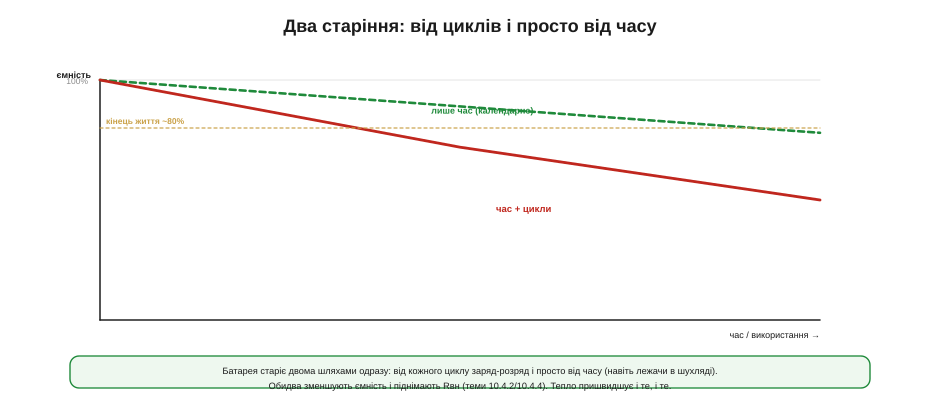
*Рис. 10.4.5.1. Календарне старіння (від часу) йде повільно навіть без використання; циклічне (від заряд-розрядів) додає до нього зверху. Разом вони ведуть ємність донизу, а внутрішній опір — догори. Обидва механізми пришвидшуються теплом.*

На практиці обидва механізми діють **одночасно** й складаються: реальний спад ємності — це сума календарної та циклічної частин. Для пристрою, що цілий день працює, переважає циклічне; для того, що роками чекає в режимі сну, — календарне. А спільний знаменник у них один: за обома стоять повільні хімічні реакції всередині комірки, і всі вони підкоряються головному прискорювачу — **температурі**. Тому ту саму батарею в прохолоді й у спеці чекає геть різна доля, незалежно від того, скільки її циклюють.

Це розрізнення прямо впливає на проєкт. Якщо пристрій більшу частину часу **дрімає** (давач, що раз на годину прокидається), його доля — **календарна**: тут не поможе ні менший струм, ні мілкі цикли, бо циклів і так мало; рятує лише прохолода й помірний заряд. А якщо пристрій **інтенсивно циклюють** (щодня в нуль і назад), переважає **циклічне** старіння, і головними важелями стають глибина розряду та режим заряду. Тому перший крок — чесно спитати: моя батарея помре **від часу чи від використання**? Відповідь визначає, які саме прийоми з цієї теми спрацюють, а які — марні.

### SoH: міра зношеності

Щоб говорити про старіння кількісно, вводять **здоров'я батареї** (*state of health*, **SoH**) — на відміну від SoC (скільки заряду *зараз*), SoH каже, скільки комірка взагалі **здатна** вмістити проти того, що могла новою. Зазвичай SoH виражають як відсоток ємності, що лишилась від початкової.

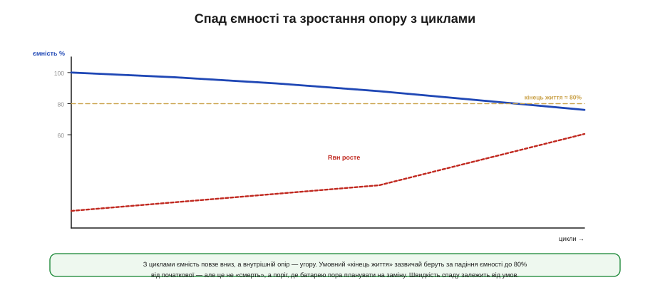
*Рис. 10.4.5.2. З циклами й роками ємність повзе вниз, а внутрішній опір — угору; обидва — знаки зношеності. Умовний «кінець життя» традиційно беруть за падіння ємності до **80%** від початкової — це не «смерть» комірки, а поріг, де її пора планувати на заміну.*

Чому саме 80%? Це **умовність**, а не фізична межа: комірка з 80% ємності ще працює, просто галузь домовилась вважати цей рівень кінцем «повноцінного» життя (*end of life*, EoL). Нижче — ємності помітно бракує, опір уже високий, і батарея стає ненадійною під піками (пригадаймо, як зрослий Rвн валить пристрій у темі 10.4.2). Тож EoL = 80% — це інженерний орієнтир для планування, а не момент відмови. Два знаки здоров'я ми вже знаємо в обличчя: **спад ємності** (його «вчить» паливомір, тема 10.4.4) і **зростання Rвн** (його легко зміряти, тема 10.4.2). Добра система стежить за обома — і за впалою ємністю, і за зрослим опором, бо інколи один випереджає інший.

Варто розрізняти й **дві смерті** батареї. Перша — поступове в'янення, яке й описує SoH: ємність повільно сповзає, опір росте, усе передбачувано. Друга — **раптова відмова**: внутрішнє коротке, обрив, різке падіння — комірка гине не поступово, а враз. SoH добре передбачає перше й геть не ловить друге, тож надійні системи стежать не лише за плавним трендом, а й за **аномаліями** (несподіваний стрибок опору, дивна напруга однієї комірки в збірці). А ще SoH — це мова **гарантії й планової заміни**: саме за ним вирішують, коли батарею час міняти за графіком, а не чекати, доки вона підведе в полі.

### Що вбиває літій

Тепер найпрактичніше — **що саме** пришвидшує старіння. Тут немає містики: є кілька добре відомих «убивць», і майже всі вони в наших руках.

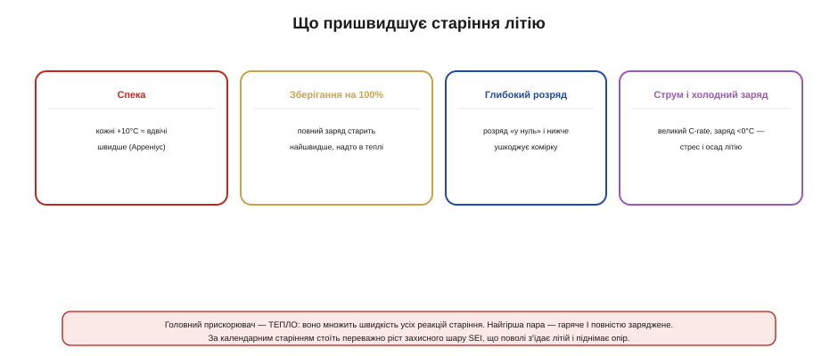
*Рис. 10.4.5.3. Чотири головні прискорювачі: спека (кожні +10 °C приблизно подвоюють швидкість старіння), зберігання на 100%, глибокий розряд і поєднання великого струму з холодним зарядом. За календарним старінням стоїть переважно ріст шару SEI.*

Перший і найголовніший — **тепло**. Швидкість хімічних реакцій (а старіння — це реакції) росте з температурою приблизно за правилом Арреніуса: кожні **+10 °C** грубо **подвоюють** темп старіння. Тому гаряча батарея старіє в рази швидше за прохолодну — і це найдешевший важіль, який у нас є: тримати комірку холодною. Другий — **високий заряд**: повністю заряджений літій (4.2 В) старіє швидше за напівзаряджений, бо за високої напруги електроліт розкладається активніше. Тому тримати батарею повною — погано, а тримати її повною **й** гарячою — найгірше з усього. Третій — **глибокий розряд**: висадити комірку «в нуль» і нижче небезпечно, бо запускаються руйнівні процеси (а в нашій історії ми бачили дзеркальну біду свинцю — сульфатацію, вставка 10.4.0). Четвертий — **режим струму**: дуже швидкий заряд чи розряд (високий C-rate) механічно напружує комірку, а **заряд на холоді** осаджує металевий літій (тема 10.4.3) — обидва прискорюють знос.

За кадром усього цього, надто за **календарним** старінням, стоїть один тихий процес — ріст **SEI** (*solid electrolyte interphase*), захисного шару на електроді. Він потрібен комірці, але має ваду: він **постійно наростає**, повільно з'їдаючи запас літію й піднімаючи опір. Саме тому навіть ідеально збережена батарея поволі марніє — SEI росте сам собою, лише повільніше в холоді й при невисокому заряді. Знати назву цього механізму корисно: коли в даташиті чи статті трапляється «SEI growth», ідеться саме про цей невідворотний податок часу.

Дві тонкощі роблять старіння підступнішим, ніж здається. Перша: воно **нелінійне**. Спершу ємність сповзає повільно, а під кінець життя падіння часто **прискорюється** — у комірки буває «коліно», за яким вона деградує стрімко. Тому «80% за два роки» не означає «60% за чотири»: останній відрізок коротший, ніж підказує лінійна інтуїція. Друга: стреси **перемножуються**, а не складаються. Гаряче плюс повне плюс глибокі цикли — це не сума трьох бід, а їхній добуток, і саме на перетині кількох поганих умов комірки вмирають найшвидше. Звідси й проста стратегія: прибрати бодай **один** множник (найдешевший — тепло) уже відчутно подовжує життя.

### Глибина розряду: користуйся серединою

Окремо варто виділити **глибину розряду** (*depth of discharge*, DoD), бо це найпотужніший важіль циклічного ресурсу — і його легко проґавити. Ми вже бачили в темі 10.4.1, що ресурс залежить від DoD; тепер подивімося, наскільки сильно.

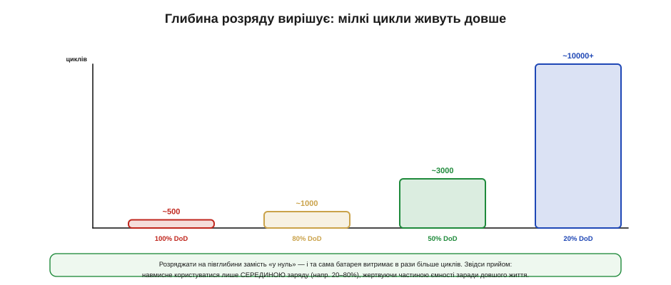
*Рис. 10.4.5.4. Ресурс різко росте, якщо не розряджати комірку глибоко: повний цикл (100% DoD) дає сотні циклів, а мілкі (50%, 20% DoD) — тисячі й десятки тисяч. Звідси прийом «користуйся серединою»: циклювати лише, скажімо, 20–80%, жертвуючи частиною ємності заради багатократно довшого життя.*

Цифри вражають: розряджати комірку «у нуль» щоразу — це сотні циклів, а користуватися лише її **серединою** (наприклад, 20–80%) — це тисячі. Звідси контрінтуїтивний, але потужний прийом: навмисне **не використовувати всю ємність**. Беруть батарею з запасом і циклюють лише її середню частину, ніколи не заряджаючи до повного й не висаджуючи в нуль. Ми жертвуємо частиною ємності — зате багатократно подовжуємо життя. Полічімо, що це означає для розміру батареї.

**Приклад (розмір батареї «під деградацію»).** Пристрою треба 1000 мА·год **наприкінці життя** (а не лише новим).

```
Запас на деградацію (кінець життя = 80% ємності):
   свіжа ємність ≥ 1000 / 0.80 = 1250 мА·год

Якщо ще й циклювати лише серединою 20–80% (60% корисних):
   паспортна ємність ≥ 1250 / 0.60 ≈ 2080 мА·год

Підсумок: «під деградацію» батарея вийшла вдвічі більша за наївні 1000 —
зате служить у рази довше й до самого кінця тягне потрібні 1000.
```

Висновок промовистий: чесний розрахунок дає батарею десь **удвічі більшу** за наївну оцінку «треба 1000 — беру 1000». Ця надбавка — не марнотратство, а **плата за довговічність**: вона забезпечує і запас на спад ємності, і мілкі цикли. Для одноразового ґаджета це зайве, а для приладу, що має пропрацювати роками без обслуговування, — обов'язкове.

І ще одна тонкість поверх глибини: важить не лише, **наскільки** глибоко розряджати, а й **навколо якого рівня**. Цикл у верхній частині (скажімо, 80–100%) старить дужче за такий самий за глибиною цикл нижче (40–60%), бо до циклічного зносу додається шкода від високого **середнього** заряду. Тому ідеальне «робоче вікно» не просто вузьке, а ще й зміщене **донизу** від повного: користуватися, наприклад, 30–70% краще, ніж 60–100%. Це той самий компроміс «ємність проти життя», лише тепер на рівні вибору, *якою саме частиною* заряду користуватись.

### Зберігання: наполовину й прохолодно

Окрема глава — **зберігання**, бо багато пристроїв більшу частину життя не працюють, а лежать. І тут правила інші, ніж для роботи.

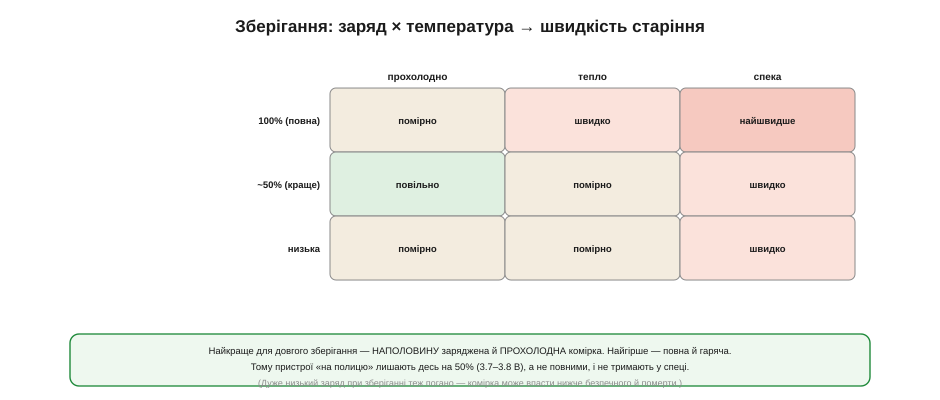
*Рис. 10.4.5.5. Швидкість старіння при зберіганні залежить від заряду й температури разом. Найкраще — комірка, заряджена приблизно наполовину (~50%, 3.7–3.8 В) і прохолодна. Найгірше — повна й гаряча. Дуже низький заряд при зберіганні теж поганий: комірка може просісти нижче безпечного й померти.*

Два правила прості. Перше — **не зберігати повною**: повний літій старіє найшвидше, тож для тривалого спокою його лишають десь на **50%** (3.7–3.8 В на комірку). Друге — **тримати прохолодно**: тепло множить усе. Найгірша комбінація — повна гаряча батарея (наприклад, ноутбук, що місяцями стоїть на 100% увімкненим у мережу в теплій кімнаті); найкраща — напівзаряджена в прохолоді. Є й третій бік: зберігати **надто розрядженою** теж не можна — за місяці саморозряду напруга може впасти нижче безпечної, і комірка вже не оживе. Тому золота середина буквально посередині: ~50% і прохолода. Розумні пристрої й зарядники інколи самі виставляють «зберігаючий» рівень замість повного, коли бачать, що ними довго не користуються.

На практиці підготувати батарею до тривалого зберігання нескладно: зарядити приблизно до половини, прибрати в прохолодне сухе місце й, якщо строк дуже довгий, раз на кілька місяців перевіряти напругу — щоб саморозряд не завів комірку нижче безпечного. Виробники літію недарма часто й продають комірки саме в «зберігаючому» стані, близько 50%. А пристрій, відправлений на склад надовго з **повною** батареєю, — це тиха міна, що зустріне вас просадженою ємністю вже за рік.

### Проєктувати під деградацію

Зберімо все в практику. **Проєктувати під деградацію** — означає прийняти спад як даність і закласти його в конструкцію наперед, а не вдавати, що батарея вічна.

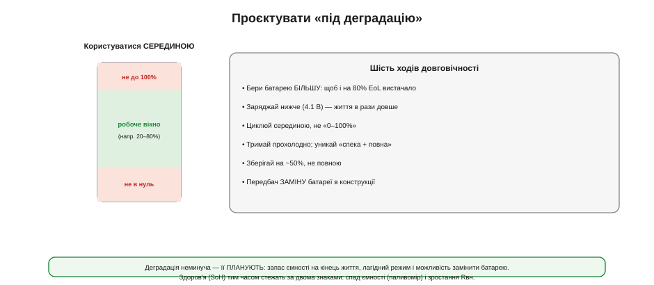
*Рис. 10.4.5.6. Шість ходів довговічності: брати батарею з запасом (щоб і на 80% EoL вистачало), заряджати нижче 4.2 В, циклювати серединою, тримати прохолодно й уникати «повна + спека», зберігати на ~50% і — передбачити заміну батареї в конструкції. Праворуч — ідея «робочого вікна» в середині заряду.*

Ходів кілька, і всі вони випливають з уже сказаного. **Брати батарею більшу**, ніж потрібно новій, — щоб і на 80% EoL вистачало (наш приклад). **Заряджати нижче** — 4.1 замість 4.2 В дає кілька відсотків менше ємності, зате в рази довше життя (тема 10.4.3). **Циклювати серединою**, не «0–100%». **Тримати прохолодно** й уникати поєднання спеки з повним зарядом. **Зберігати на ~50%**. І, нарешті, для довговічних виробів — **передбачити заміну** батареї: акумулятор майже завжди помре раніше за решту пристрою, тож конструкція, де його легко поміняти, продовжує життя всьому виробу (а запаяний намертво літій робить пристрій одноразовим). Над усім цим — **стежити за SoH** (спад ємності + ріст Rвн), щоб знати, коли та заміна потрібна.

Окремо варте уваги **місце** батареї в пристрої. Оскільки тепло — головний прискорювач старіння, акумулятор тулять подалі від гарячих вузлів: лінійних стабілізаторів, силових перетворювачів, потужного процесора. Батарея, притиснута до гарячого чипа, старітиме помітно швидше за ту, що дихає в прохолодному кутку. І це рішення **компонування**, яке нічого не коштує, якщо подумати про нього вчасно, та дорого обходиться, якщо згадати вже після розведення плати, — переставляти комірку тоді пізно. Тож «де ляже батарея» — питання не лише механіки, а й довговічності.

> 🔧 **Навіщо це.** Різниця між «спроєктовано під деградацію» й «ні» — це різниця між приладом, що працює п'ять років, і таким самим, що через рік скаржиться на коротке життя від батареї. Жоден з цих прийомів не коштує дорого на етапі проєктування: трохи більша комірка, трохи нижча напруга заряду, продумане місце під неї подалі від гарячих вузлів і доступ для заміни. А виграш — роки надійної роботи замість передчасних рекламацій. І найкраще, що ці прийоми не виключають один одного, а **складаються**: батарея більша, заряджена нижче, у прохолоді й циклована серединою живе не «трохи», а в рази довше за ту, з якою поводяться навмання.

### Підсумок теми

Батарея неминуче **старіє** двома шляхами: **циклічно** (від заряд-розрядів) і **календарно** (просто від часу), і обидва зменшують ємність та піднімають Rвн. Зношеність міряють через **SoH** — зазвичай відсоток ємності від початкової, з умовним «кінцем життя» на **80%**. Старіння пришвидшують **тепло** (кожні +10 °C ≈ вдвічі швидше — головний важіль), **зберігання на 100%**, **глибокий розряд** і **високий струм / холодний заряд**; за календарною частиною стоїть невідворотний ріст **SEI**. Найпотужніший важіль ресурсу — **глибина розряду**: користуючись лише серединою заряду (20–80%), дістають у рази більше циклів. Звідси проєктування **під деградацію**: брати батарею з запасом (щоб вистачало й на 80% EoL — часто це вдвічі більше за наївну оцінку), заряджати нижче, циклювати серединою, тримати прохолодно, зберігати на ~50% і передбачити заміну. Деградацію не відвернути, та її **планують** — і саме це відрізняє пристрій, що служить роками, від того, що скоро проситься на смітник. А щоб батарея взагалі дожила до старості, її треба ще й **захистити** від відмов — про пороги захисту й BMS поговоримо далі.

## 10.4.6 Захист і BMS: від комірки до батареї

Усе, що ми досі казали про правильний заряд (тема 10.4.3) і дбайливий режим (10.4.5), справджується, **поки все йде як слід**. Але зарядник може вийти з ладу й погнати в комірку забагато; навантаження — закоротити; користувач — устромити батарею навпаки. Літій таких подій не пробачає: перезаряд здатен спричинити пожежу, глибокий розряд — убити комірку, коротке замикання — розжарити її до займання. Тому кожна літієва батарея потребує **вартового** — електроніки, що нічого не робить у нормі, але **аварійно відрубує** комірку, щойно щось вийшло за безпечні межі. Ми торкалися цього в §7.4.6; тепер розберемо як слід: які пороги стереже захист, як влаштована найпростіша захисна плата, навіщо балансувати багатокоміркові збірки й де закінчується «плата за долар» і починається повноцінна **BMS**.

Ключова думка теми: **захист — це окремий, незалежний рівень оборони**, а не частина зарядника чи паливоміра. Зарядник дбає про норму, паливомір рахує заряд, а захист — це останній рубіж, що спрацьовує, коли все інше відмовило. Плутати ці ролі — типова й небезпечна помилка.

### Чотири загрози і вартовий

Захист стереже комірку від чотирьох головних бід, і кожна має свою абревіатуру, яку варто впізнавати в даташитах.


*Рис. 10.4.6.1. Чотири загрози й вартовий, що відрубує комірку на межі: **OVP** (перенапруга — перезаряд, ризик пожежі), **UVP** (зниження напруги — глибокий розряд, смерть комірки), **OCP** (надструм) і **SCP** (коротке замикання). Захист — це не зарядник, а останній рубіж, що рятує, коли решта відмовила.*

Перелічимо їх. **OVP** (*over-voltage protection*) ловить **перезаряд**: якщо напруга комірки перевищила безпечну (десь 4.25–4.35 В), захист **розмикає заряд**, поки несправний зарядник не спалив комірку. **UVP** (*under-voltage protection*) ловить **глибокий розряд**: коли напруга впала нижче ~2.5 В, захист **розмикає розряд**, рятуючи комірку від незворотного пошкодження (саме тому глибоко розряджений пристрій інколи «не вмикається й не заряджається» — захист його від'єднав). **OCP** (*over-current*) реагує на надмірний струм, а **SCP** (*short-circuit*) — на миттєвий стрибок при короткому замиканні, відрубуючи комірку **вмить**. Спільне в усіх чотирьох — захист **не керує** нормальною роботою, він лише **обриває** ланцюг на аварії й знову з'єднує, коли загроза минула.

Корисно уявляти, що саме фізично коїться за кожною абревіатурою. **Перезаряд** заганяє в комірку забагато заряду: на електроді осідає металевий літій, електроліт розкладається з виділенням газу й тепла — звідси здуття й ризик займання. **Глибокий розряд** руйнує структуру: за надто низької напруги починає розчинятися мідний струмознімач, і комірка деградує незворотно. **Надструм і коротке** — це просте джоулеве тепло (I²R): великий струм миттєво розжарює комірку й провідники. У всіх випадках кінцева біда — **неконтрольований нагрів**, тож завдання захисту по суті одне: не дати комірці перейти межу, за якою тепло вже не спинити.

### Захисна плата за долар

Найдешевше втілення цього вартового висить буквально на кожному літієвому акумуляторі — це крихітна **захисна плата** (*protection board*, PCB/PCM). Усередині неї всього два класи компонентів, і знати їх корисно.

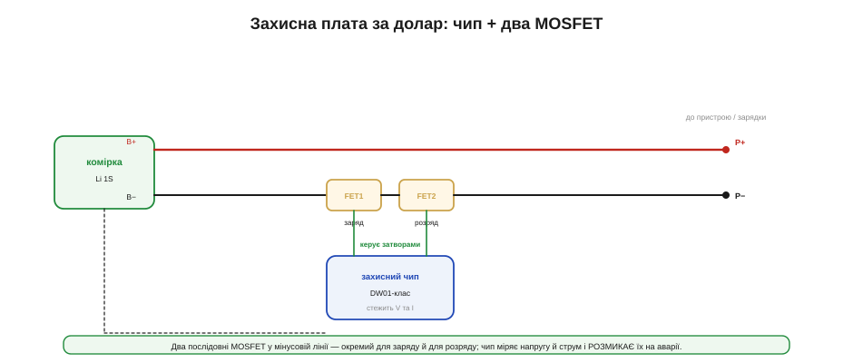
*Рис. 10.4.6.2. Захисна плата вмикає в мінусову лінію комірки **два послідовні MOSFET** (окремий для заряду й для розряду) і **захисний чип** (DW01-клас), що міряє напругу комірки та струм (через опір самих ключів) і керує затворами. Вийшла напруга чи струм за межі — чип розмикає відповідний ключ, від'єднуючи комірку.*

Працює це елегантно просто. Два **MOSFET** (зазвичай у спареному корпусі, 8205-клас) стоять послідовно в лінії комірки — один відповідає за шлях заряду, другий за шлях розряду, тож кожен напрям можна обірвати **окремо**. Захисний чип (DW01-клас) увесь час міряє напругу комірки та струм (зручно — прямо за падінням на відкритих MOSFET, які заразом служать шунтом) і порівнює з порогами. Норма — обидва ключі відкриті, струм тече вільно. Перевищення OVP — чип закриває ключ заряду; UVP — ключ розряду; надструм чи КЗ — обриває все. Жодної прошивки, жодного налаштування: уся логіка зашита в аналоговий чип, і коштує таке копійки.

Є один підступний наслідок UVP, об який спотикаються новачки. Коли захист спрацював на глибокому розряді й розімкнув ключ, на **клемах** пакета напруга падає до нуля — хоча сама комірка ще жива на своїх ~2.5 В. Звичайний зарядник, побачивши «0 В», вирішує, що батарея мертва чи відсутня, і відмовляється заряджати. Через це «захищена» батарея здається безнадійно сівшою, хоч насправді це лише спрацював захист. Виходів кілька: деякі зарядники вміють дати короткий «будильний» імпульс, щоб захист відпустив; інколи комірку оживляють обережним малим струмом. Головне — пам'ятати, що 0 В на клемах захищеного пакета означають не «смерть», а «захист від'єднав».

> 🔌 **Плата зблизька — у вставці.** Розбір захисної плати на DW01 і спареному MOSFET 8205 — які пороги, як читати її «за долар» — у компонентній вставці цього розділу про DW01+8205 (далі за чергою).

### Пороги: вікно напруги й струму

Уся робота захисту зводиться до кількох **порогів**, і їх варто уявляти як «вікно», поза яким комірку від'єднують.


*Рис. 10.4.6.3. Захист тримає комірку у вікні: вище OVP (~4.3 В) — обрив заряду, нижче UVP (~2.5 В) — обрив розряду, між ними — вільна робота. До напруги додаються пороги за струмом (OCP — тривалий надструм, SCP — миттєве КЗ) і в складніших платах за температурою (OTP). Вмикає назад захист із **гістерезисом**.*

Важлива деталь — **гістерезис**: пороги ввімкнення й вимкнення **не збігаються**. Захист спрацьовує на 4.3 В, але знову дозволяє заряд лише коли напруга впала помітно нижче; так само після UVP розряд відновлюється не на тому самому порозі, а вище. Без цього зазору захист «деренчав» би — вмикав і вимикав комірку на самій межі. Пороги за струмом теж мають свою логіку: **OCP** терпить помірне перевищення короткий час (щоб не реагувати на законні піки, тема 10.4.2), а **SCP** на справжнє коротке замикання відповідає миттєво. Складніші плати додають ще й **OTP** (захист за температурою). Усе це разом і є те «вікно» безпеки, у якому комірці дозволено жити.

Самі пороги — теж частина **хімії**, не універсальна константа. Усі числа вище (4.3 / 2.5 В) — для звичайного Li-ion. У **LiFePO4** робоче вікно інше (заряд лише до 3.65 В), тож і захист має інші пороги — OVP близько 3.8, UVP близько 2.0–2.5 В. Поставити «літієву» захисну плату на LiFePO4 (чи навпаки) — означає або дозволити перезаряд, або відрубати комірку завчасно. Тому захист добирають **під конкретну хімію**, рівно як і зарядник (тема 10.4.3): цифри порогів — не дрібниця, а паспорт безпеки саме цієї комірки.

### Захист — не зарядник і не паливомір

Варто окремо й твердо засвоїти межі ролей, бо їх постійно плутають. **Захисна плата не заряджає** комірку — вона лише дозволяє чи забороняє струм; зарядом керує окремий зарядний чип (тема 10.4.3) за алгоритмом CC/CV. **Захисна плата не рахує заряд** — для «скільки відсотків» є паливомір (тема 10.4.4). Захист — це **запобіжник**, а не менеджер: він мовчить, поки все гаразд, і втручається лише в аварії.

Звідси практичний висновок: повний вузол живлення літієвого пристрою — це **три окремі речі**, що працюють разом: зарядник (нормальний заряд), захист (аварійний обрив) і, за потреби, паливомір (облік). У дешевих пристроях зарядник і захист можуть жити на різних платках, у дорожчих — інтегруватися в один чип, але **функції лишаються трьома**. Покладатися на захист як на «зарядник, що сам зупиниться на 4.2» — груба помилка: захист спрацює аж на 4.3, а це вже стрес для комірки. Захист — страхувальна сітка, а не нормальний робочий механізм.

Поза цими чотирма порогами трапляються й інші біди, від яких боронять окремо. **Переполюсування** (вставили батарею навпаки) здатне спалити і пристрій, і захист, тож на вході часто ставлять діод чи інший бар'єр — про такі захисти живлення ми ще говоритимемо далі в модулі. А механічне **пошкодження** комірки електроніка вже не врятує: проколений чи розчавлений літій горить незалежно від того, що каже захисний чип, — тут до справи стає конструкція, до якої ми переходимо в наступній темі.

### Балансування: коли комірок кілька

Доки комірка одна (1S), захисту досить. Та щойно їх з'єднують **послідовно** (2S, 3S, 4S — щоб дістати вищу напругу, тема 10.4.3), виникає нова біда: комірки **дрейфують** одна від одної. Навіть однакові спершу, з часом вони заряджаються трохи по-різному — і пакет потребує **балансування**, що вирівнює їхній заряд.

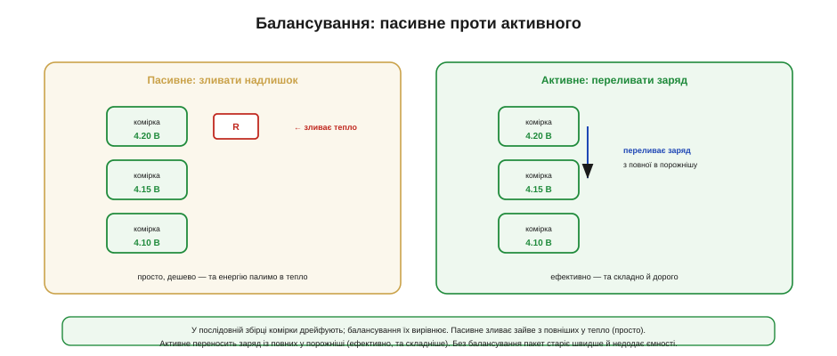
*Рис. 10.4.6.4. **Пасивне** балансування зливає надлишок із повніших комірок через резистори в тепло — просто й дешево, та марнотратно й повільно. **Активне** переносить заряд із повних комірок у порожніші — ефективно, але складно й дорого. Без балансування послідовний пакет старіє нерівномірно й недодає ємності.*

Способів два, і вони — класичний компроміс «просто проти ефективно». **Пасивне** балансування на комірках, що зарядилися першими, **зливає** надлишок крізь резистори, перетворюючи його на тепло, поки відстаючі дотягнуться. Це просто й дешево (резистор плюс ключ на комірку), але енергію ми марнуємо, та й вирівнювання повільне. **Активне** балансування натомість **переносить** заряд із повних комірок у порожніші, нічого не палячи, — це ефективно, але потребує куди складнішої електроніки й коштує дорожче. У масовій техніці частіше бачимо пасивне (його досить); активне беруть там, де кожен відсоток і кожен джоуль на рахунку, — у великих тягових пакетах.

Варто знати й **коли** та **скільки** балансують. Найзручніший момент — кінець заряду (фаза CV, тема 10.4.3): комірки близькі до повного, і дрейф між ними найвидніший, тож пасивні балансири саме тоді й зливають надлишок із тих, що вирвалися вперед. Струми балансування зазвичай **скромні** — десятки міліампер, — бо вирівнюють невелику різницю, накопичену за один цикл; через це повне вирівнювання сильно розбалансованого пакета може зайняти не один цикл. Тому балансування — це повільне, але невпинне підтримання ладу, а не разовий ривок: воно щодня потроху тримає комірки разом, а не «лагодить» пакет за раз.

### Найслабша диктує обидва краї

Чому ж балансування таке важливе? Бо в послідовному пакеті **найслабша комірка диктує поведінку всього пакета** — і на заряді, і на розряді.


*Рис. 10.4.6.5. У послідовній збірці найслабша (чи найповніша) комірка першою впирається в межу: на заряді вона перша сягає OVP — і заряд спиняється, лишивши решту недозарядженими; на розряді вона перша падає до UVP — і пакет стає, хоч у сильніших ще є заряд. Тому корисна ємність пакета дорівнює найслабшій комірці.*

**Приклад (що відбирає розбаланс).** Візьмемо 4S пакет із комірок по 2000 мА·год, де одна трохи слабша.

```
Комірки: 2000, 2000, 1700 (слабша), 2000 мА·год

Без балансування — слабша диктує обидва краї:
   заряд:  слабша перша впирається в OVP → решта недозаряджені
   розряд: слабша перша впирається в UVP → пакет стає
   корисна ємність пакета ≈ 1700 (а не 2000) — мінус 15%

З балансуванням:
   заряд комірок вирівняно → пакет працює близько до 2000
   слабшу не «продавлюють» за межі → вона ще й старіє повільніше
```

Висновок подвійний. По-перше, **без балансування пакет недодає ємності** — він обмежений найслабшою ланкою, як конвой швидкістю найповільнішого. По-друге (і це важливіше), розбаланс **прискорює старіння**: слабшу комірку щоразу заганяють до самих меж, а робота на межі — це саме той стрес, що вбиває літій (тема 10.4.5). Тому балансування не лише повертає ємність, а й продовжує життя всьому пакету. До того ж самі комірки в збірку варто **добирати однаковими** — близькими за ємністю й опором, — щоб дрейф був меншим від початку.

### Спектр: від плати за долар до BMS

Зведімо все в єдину картину — **спектр** засобів захисту, від найпростішого до найскладнішого.

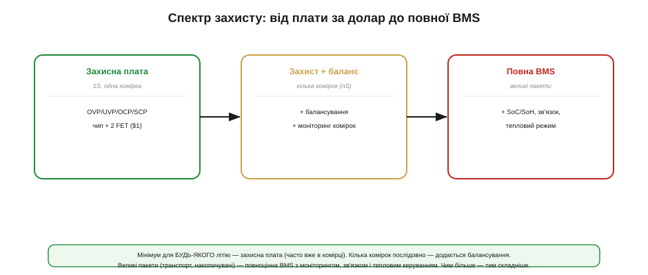
*Рис. 10.4.6.6. Зліва направо: проста **захисна плата** (1S, чип + 2 FET, ~$1); **захист із балансуванням** для кількох комірок (плюс моніторинг кожної); і повноцінна **BMS** для великих пакетів — з обліком SoC/SoH, зв'язком (телеметрія) і тепловим керуванням. Чим більший і відповідальніший пакет — тим складніший потрібен рівень.*

Логіка вибору проста. Для **однієї комірки** (1S — переважна більшість малих пристроїв) досить простої захисної плати, яка часто вже **вбудована** в саму комірку (особливо в LiPo-пакетах). Для **кількох комірок послідовно** до захисту обов'язково додається **балансування** й помірний моніторинг кожної комірки. А для **великих пакетів** (транспорт, накопичувачі енергії) потрібна повноцінна **BMS** (*Battery Management System*) — система, що поєднує захист, балансування, облік SoC/SoH (теми 10.4.4–5), зв'язок із рештою системи (телеметрія, аварійні відключення) і нерідко керування охолодженням чи підігрівом. По суті BMS — це «мозок» батареї, тоді як захисна плата — лише її рефлекс. Чим більший і відповідальніший пакет, тим вище по цьому спектру доводиться підніматись.

У повноцінній BMS додається й те, чого нема в простій платі, — **зв'язок**. Розумна батарея вміє доповісти системі свій заряд, здоров'я, температуру й помилки (часто по шині на кшталт I²C чи SMBus — так звана *smart battery*), а у великих пакетах BMS ще й керує силовим **контактором**, що від'єднує всю батарею в аварії чи на стоянці. Тобто з ростом пакета захист із пасивного рефлексу перетворюється на активного учасника системи, який не лише обриває струм, а й **розмовляє** з рештою пристрою. Саме цим — обліком, зв'язком і керуванням — повноцінна BMS і відрізняється від мовчазної плати за долар, хоч коріння в них спільне.

> 🔧 **Навіщо це.** Практичне правило одне: **жодного «голого» літію без захисту**. Навіть найдешевший пристрій із LiPo мусить мати захисну плату — це питання не зручності, а безпеки. Для багатокоміркових збірок до захисту обов'язково додають балансування, інакше пакет і ємність втратить, і швидко постаріє. А коли бачите в специфікації «BMS», уточніть, що саме вона вміє: просту захисну плату теж інколи гучно звуть BMS, хоча до справжнього менеджера батареї їй далеко.

### Підсумок теми

Кожен літій потребує **захисту** — вартового, що в нормі мовчить, а в аварії **відрубує** комірку. Він стереже чотири пороги: **OVP** (перезаряд), **UVP** (глибокий розряд), **OCP** (надструм) і **SCP** (коротке), з **гістерезисом** на ввімкнення. Найпростіше втілення — **захисна плата за долар**: чип (DW01-клас) плюс два послідовні MOSFET (8205-клас), що обривають заряд чи розряд окремо. Захист — це **окрема роль**, не зарядник (той веде CC/CV, 10.4.3) і не паливомір (той рахує, 10.4.4); повний вузол поєднує всі три. Коли комірок **кілька послідовно**, додається **балансування** (пасивне — зливає надлишок у тепло; активне — переливає заряд), бо інакше **найслабша комірка** диктує обидва краї, відбираючи в пакета ємність і прискорюючи його старіння. А весь арсенал лягає в **спектр**: проста плата (1S) → захист із балансом (nS) → повна **BMS** із моніторингом, зв'язком і теплом (великі пакети). Залізне правило — **ніколи не лишати літій без захисту**. Лишилося розглянути батарею не лише як електрику, а й як **фізичний об'єкт** — її механіку, конектори та поведінку при відмові, чим завершимо розділ.
