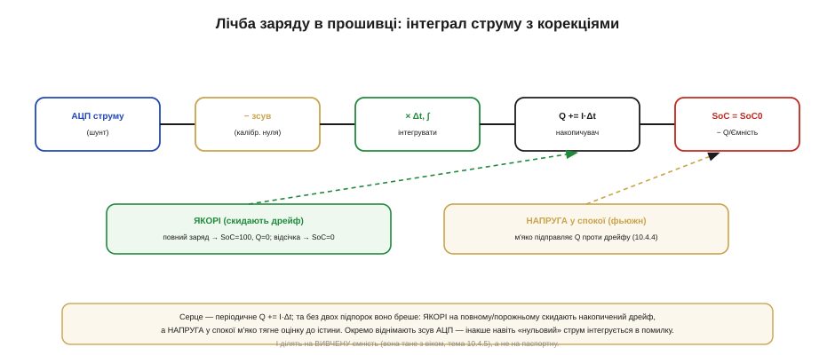

# ⚙️ Лічба заряду (coulomb counting) у прошивці

> Алгоритмічна вставка до теми [10.4.4 «Скільки лишилось»](r04-batteries-charging.md). Там ми пояснили ідею кулонометрії та її дрейф; тут — як реалізувати її в коді МК і чим гасити той дрейф на практиці.

### Задача

Маємо АЦП, що міряє струм батареї (через шунт), і хочемо в прошивці вести **паливомір** — рахувати SoC як інтеграл струму (тема 10.4.4): `SoC = SoC(старт) − (∫I·dt)/Ємність`. Наївна реалізація «просто інтегруй струм» **бреше** з трьох причин: вона потребує відомої точки старту, нескінченно накопичує помилку від зсуву АЦП, а ще ділить на ємність, яка з віком тане. Завдання — написати лічбу так, щоб ці три біди приборкати.

### Ідея

Серце — періодичне накопичення заряду: кожні Δt беремо струм, множимо на крок і додаємо до накопичувача Q. Поверх цього — **три підпорки**, що рятують від дрейфу.


*Рис. 10.4.4a.1. Основний конвеєр: АЦП струму → відняти зсув нуля → проінтегрувати (×Δt) → накопичувач Q → SoC = SoC0 − Q/Ємність. Дві підпорки знизу: **якорі** (повний заряд → SoC=100%, Q=0; відсічка → SoC=0%) скидають накопичений дрейф, а **напруга у спокої** м'яко підправляє Q (фьюжн). Окремо — віднімання зсуву АЦП і ділення на вивчену ємність.*

Перша підпорка — **якорі** на відомих точках (повний заряд і відсічка): там SoC точно відомий, тож скидаємо накопичений дрейф. Друга — **напругова корекція** у спокої: коли комірка відпочила, її напруга надійна, і ми м'яко тягнемо Q до напругової оцінки. Третя — **калібрування зсуву** АЦП: віднімаємо «нульове» показання, інакше навіть без струму інтеграл повзе.

### Псевдокод

```
const Δt   = 100 мс              # крок інтегрування
I_zero     = калібр_нуля()       # зсув АЦП при нульовому струмі
ємність    = вивчена_ємність     # А·с, оновлюється на повних циклах
Q          = SoC0 · ємність      # накопичений заряд, А·с

кожні Δt:                        # періодично (таймер / ISR)
    I = read_adc_current() − I_zero    # струм зі знаком (+заряд / −розряд)
    Q = clamp(Q + I·Δt, 0, ємність)    # інтеграл з обмеженням
    SoC = Q / ємність · 100%

on_full_charge():                # термінація (10.4.3) — надійний якір
    Q = ємність;  SoC = 100%
    if був_повний_цикл: оновити вивчену_ємність     # 10.4.5

on_cutoff():                     # відсічка розряду
    Q = 0;  SoC = 0%

when at_rest():                  # комірка відпочила → напруга надійна
    SoC_v = ocv_to_soc(read_voltage())          # модель / таблиця
    Q += k · (SoC_v·ємність − Q)                 # м'яка корекція, 0 < k ≪ 1
```

### Складність і пастки на МК

- **Зсув — головний ворог.** Сталий зсув АЦП інтегрується в помилку, що росте без кінця: навіть міліампери уявного струму за годину дають відчутний дрейф. Тому `I_zero` калібрують (читають при гарантовано нульовому струмі) і віднімають **щоразу**.
- **Одиниці й переповнення.** Інтегруючи струм×час, тримайте накопичувач у **сталих** одиницях (ампер-секунди чи кулони), акуратно масштабуйте у фіксованій комі й стежте за переповненням цілого на довгих пробігах.
- **Частота опитування.** Опитуйте струм досить **часто**, щоб упіймати піки (тема 10.4.2); рідкісні заміри проґавлять сплеск і недорахують заряд. Де можливо — усереднюйте апаратно.
- **Знак.** Струм **двонапрямний**: заряд додає, розряд віднімає. Помилка зі знаком псує все — звіряйте полярність шунта.
- **Ємність не стала.** Діліть на **вивчену** ємність (вона тане з віком, тема 10.4.5), а не на паспортну, інакше «100%» старої батареї бреше; оновлюйте її на повних циклах.
- **Якорі обов'язкові.** Без скидання на повному/порожньому дрейф накопичується вічно. Кожен повний заряд — нагода перекалібрувати (тема 10.4.4).
- **Сон МК.** У сні струм усе одно тече (саморозряд, спокій схеми). Або продовжуйте лічбу через періодичні пробудження, або довірте облік окремому **апаратному** кулонометру, що рахує й під час сну, — інакше прокинетесь із заниженим Q.
- **Точність Δt.** Джитер циклу додає помилку в інтеграл: беріть **стабільний** таймер, а не «приблизно раз на 100 мс» у головному циклі.
