# Розділ 10.5 — Сонячна енергія і MPPT

Ми вже вміємо живити пристрій від мережі (USB, Розділ 10.3) і тримати енергію в батареї (Розділ 10.4). Лишилося джерело, що не потребує ні розетки, ні заміни, — **сонце**. Цей розділ про те, як перетворити світло на струм і зробити це **розумно**: як влаштований фотоелемент, чому в панелі є «точка максимальної потужності» й чому коло неї весь час доводиться танцювати, коли MPPT (стеження за цією точкою) справді окупається, а коли вистачить простішого, і як порахувати автономну систему «панель + батарея + споживач», що переживе найгірший місяць. Особливу увагу приділимо **малим** панелям для embedded — від калькулятора до автономної метеостанції, де збирають уже не вати, а мілівати.

> 📜 **Звідки взялося сонячне живлення:** [Bell Labs 1954 і перший супутник на сонці](hist-bell-solar.md) — як троє в одній лабораторії зробили перший практичний кремнієвий елемент, ставши на плечі століття попередників, і як Vanguard I зробив сонце штатним джерелом космічної техніки.

---

## 10.5.1 Фотоелемент: PN-перехід назустріч світлу

Найкраще в фотоелементі те, що ми вже знаємо більшу частину його фізики — просто з іншого боку. Сонячний елемент — це **той самий p-n перехід**, що ми вивчали як діод у §2.5, тільки повернутий не для випрямлення струму, а **назустріч світлу**. Жодної нової магії: усе, що робить елемент, випливає з уже знайомого вбудованого поля переходу. У цій темі ми пройдемо ланцюжок «фотон → струм» крок за кроком, побачимо, чому навіть ідеальний кремній не перетворює на електрику все сонце, і зрозуміємо, чому один елемент дає завжди приблизно пів вольта незалежно від розміру.

Мета — не вивести рівняння (це зробить математична вставка про модель діода), а збудувати **інтуїцію**: що саме коїться в кремнії під променем і чому з цього виходить джерело струму. З цієї інтуїції далі виросте все практичне — і крива панелі (тема 10.5.2), і стеження за максимумом потужності, і розрахунок системи.

### Той самий перехід — коротка згадка

Почнімо з того, що вже знаємо. У звичайному діоді (§2.5) зустрічаються дві області кремнію: **p** з надлишком «дірок» (позитивних носіїв) і **n** з надлишком електронів. На їхній межі виникає **збіднена зона**, а в ній — **вбудоване електричне поле**, що дивиться з n у p.

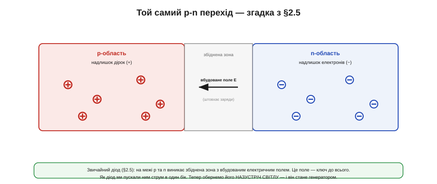
*Рис. 10.5.1.1. На межі p- та n-областей утворюється збіднена зона з вбудованим електричним полем (§2.5). Як діод ми пускали цим переходом струм лише в один бік. Тепер обернемо його назустріч світлу — і це саме поле перетворить його на генератор.*

Це поле — головний герой усієї теми. У ролі діода воно відповідало за «однобічність»: пропускало струм в один бік і не пускало в інший. Тепер ми ним скористаємося інакше — як **сортувальником зарядів**. Усе, що нам потрібно, — це якось народити в кремнії вільні заряди поблизу переходу, а далі поле зробить решту. І народжує їх саме **світло**.

Варто наголосити на цьому «оберненні» ролей, бо воно й заплутує новачка. Той самий перехід, увімкнений як **діод**, ми використовували, щоб **керувати** чужим струмом; як **фотоелемент** — щоб **виробляти** свій. Фізика одна, застосування протилежні. Більше того, цей самий освітлений перехід, зроблений маленьким і чутливим, працює **фотодіодом** — давачем світла (з нього роблять датчики освітленості й приймачі в оптоволокні). Фотодіод і сонячний елемент — рідні брати: перший масштабовано **під вимір** світла, другий — **під його збір** у потужність. Тож, розбираючись із фотоелементом, ви заразом розумієте й фотодіод.

### Від фотона до пари

Світло, як показав Айнштайн (історія 10.5.0), приходить **порціями-квантами** — фотонами. Коли фотон із достатньою енергією влучає в кремній, він віддає цю енергію електронові й **вибиває** його зі зв'язку в кристалі. На місці електрона лишається порожнеча — **дірка**. Так народжується **електронно-діркова пара**: один вільний негативний заряд і одне вільне позитивне місце.

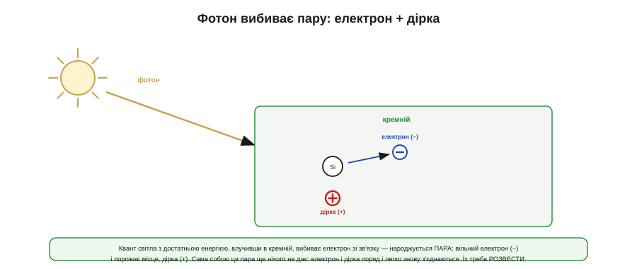
*Рис. 10.5.1.2. Квант світла, влучивши в кремній, вибиває електрон зі зв'язку — народжується пара: вільний електрон (−) і дірка (+). Та сама собою ця пара ще марна: електрон і дірка поряд і за мить можуть знову з'єднатися (рекомбінувати), віддавши енергію назад у тепло. Щоб дістати струм, пару треба РОЗВЕСТИ.*

І тут криється тонкість, без якої елемент не працював би. Сама по собі народжена пара **нічого не дає**: вільні електрон і дірка стоять поряд, притягуються одне до одного й за мить можуть **рекомбінувати** — знову з'єднатися, віддавши свою енергію назад у вигляді тепла. Якби так ставалося з кожною парою, уся енергія світла просто грала б кристал. Щоб дістати з пари **струм**, її половинки треба встигнути **розтягнути** в різні боки, перш ніж вони возз'єднаються. І ось де знадобиться вбудоване поле.

А скільки то — «достатня енергія»? Поріг кремнію (~1.1 еВ) лежить в інфрачервоному, тож **усе видиме світло** — від червоного (~1.8 еВ) до фіолетового (~3.1 еВ) — енергійніше за поріг і здатне народжувати пари. Саме тому елемент працює не лише під прямим сонцем, а й у кімнаті від лампи — просто слабше, бо фотонів менше. А ось чисте тепло (далеке інфрачервоне) кремнієвий елемент не «бачить»: його фотони надто кволі. Звідси поширена помилка — чекати від панелі струму від «тепла»: вона живиться **світлом**, а не теплом, і в темряві мовчить, хоч би яка тепла була.

### Поле розводить — ось і струм

Уся суть фотоелемента — в одному реченні: пара має народитися **біля переходу**, де її одразу підхопить вбудоване поле й **розведе** половинки в протилежні боки.

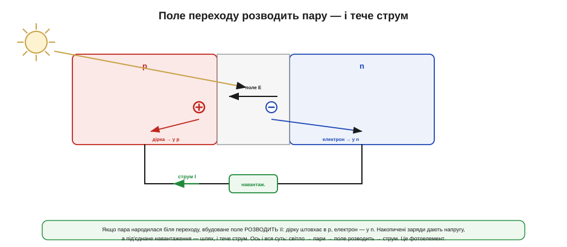
*Рис. 10.5.1.3. Фотон народжує пару поблизу переходу — і вбудоване поле негайно її розводить: дірку штовхає в p-область, електрон — у n. Розділені заряди накопичуються на двох боках і створюють напругу; під'єднане навантаження дає їм шлях замкнутися — і тече струм. Ось і весь фотоелемент: світло → пари → поле розводить → струм.*

Подивімося, як це працює. Поле в збідненій зоні штовхає позитивні заряди в один бік, негативні — в інший. Тож щойно поблизу переходу з'являється пара, поле **негайно** жене дірку в **p**-область, а електрон — у **n**, не давши їм рекомбінувати. Заряди накопичуються на двох протилежних сторонах елемента, і між його контактами виникає **напруга** — точно як між полюсами батареї. А якщо до контактів під'єднати навантаження, розділені заряди дістають шлях замкнути коло — і **тече струм**. Це і є фотоелемент: світло безперервно народжує пари, поле безперервно їх розводить, і доки світить сонце — доти йде струм. Жодної рухомої частини, жодного палива — лише квантова механіка кремнію.

Чому ж так важливо, щоб пара народилася саме **біля** переходу? Бо поле сильне лише у вузькій збідненій зоні; пара, що виникла далеко від неї, найімовірніше рекомбінує раніше, ніж поле встигне її дотягти. Тому елемент роблять **тонким**, а перехід — близько до освітленої поверхні: так більшість пар народжується там, де їх одразу підхопить поле. Якість кремнію теж важить: що менше в ньому дефектів, на яких заряди гинуть передчасно, то більша частка пар доживає до контактів. Уся боротьба за ККД елемента — це, по суті, боротьба за те, щоб **зібрати** якнайбільше народжених пар, перш ніж вони рекомбінують.

### Чому не 100%: заборонена зона

Якби кремній перетворював на електрику **все** сонячне світло, фотоелементи були б фантастично ефективні. Та реальність скромніша, і причина — у тому, що кремній бере не будь-який фотон, а лише той, чия енергія перевищує певний **поріг**, який звуть забороненою зоною (*bandgap*).


*Рис. 10.5.1.4. Кремній поглинає лише фотони з енергією понад свій поріг (~1.1 еВ). Інфрачервоні (надто «слабкі») проходять крізь нього намарно. Енергійні сині й ультрафіолетові поглинаються, та їхній **надлишок** над порогом не йде в струм, а губиться теплом. Через цю невідповідність спектру навіть ідеальний кремній перетворює лише частину сонця.*

Тут дві втрати, і обидві принципові. Фотон **слабший** за поріг (інфрачервоне світло) кремнієві не «по зубах» — він просто проходить наскрізь, не народивши пари, і його енергія втрачена. Фотон **сильніший** за поріг (синій, ультрафіолетовий) пару народжує, але весь його **надлишок** енергії над порогом одразу перетворюється на тепло, а не на струм: у діло йде лише «порогова» порція. Сонячне світло — це суміш усіх цих фотонів, тож хоч би яким досконалим був елемент, частину спектру він проґавить знизу, а частину змарнує зверху. Саме через цю **невідповідність спектру** навіть теоретична межа кремнію далека від 100%, а перші елементи Bell давали лише ~6% (історія 10.5.0); сучасні — більше, але теж не диво. Знати про цю межу корисно, щоб не чекати від панелі неможливого.

Якщо скласти обидві спектральні втрати докупи, виходить принципова **стеля** ефективності одного кремнієвого переходу — близько третини сонячної енергії (це відома межа Шоклі–Квайссера). Обійти її можна, лише поставивши **кілька** переходів із різними порогами один за одним, щоб кожен ловив свою частину спектру, — так роблять дорогі багатоперехідні елементи, якими живлять супутники й концентраторні станції. Для нас же, у звичайній embedded-техніці, важливо інше: кремній — це розумний компроміс ціни й ефективності, і його «скромні» десятки відсотків — не недоробка інженерів, а фундаментальна межа фізики, з якою просто живуть.

### Елемент — це джерело струму

Тепер найважливіше для практики: як поводиться елемент **на клемах**. На відміну від діода, що лише пропускає чужий струм, **освітлений елемент сам його виробляє** — він поводиться як **джерело струму**, тим сильніше, чим яскравіше світло.

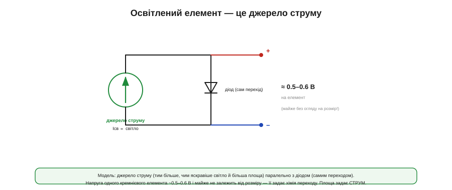
*Рис. 10.5.1.5. Освітлений елемент моделюють як джерело струму (тим більше, чим яскравіше світло й більша площа) паралельно з діодом — самим переходом. Напруга одного кремнієвого елемента — лише ~0.5–0.6 В і майже не залежить від його розміру: її задає хімія переходу. А ось площа задає СТРУМ.*

Звідси два висновки, що визначають усе подальше. По-перше, **напруга** одного кремнієвого елемента — це завжди приблизно **пів вольта** (0.5–0.6 В), і вона майже **не залежить від розміру**: хоч маленький елемент із нігтик, хоч велика панель — кожен елемент дає ту саму півв'язку вольта, бо її диктує сама хімія переходу, а не площа. По-друге, площа задає **струм**: більший елемент ловить більше світла й дає більший струм за тієї самої напруги. Ця проста модель — джерело струму паралельно з діодом — і є зерном, з якого в наступній темі виросте **крива панелі** (ВАХ), з її точкою максимальної потужності.

Одна тонкість про ту «постійну» напругу: вона трохи **спадає з нагрівом**. Що гарячіший елемент, то нижча його напруга — на пару мілівольтів на градус. Дрібниця для одного елемента, та в панелі з десятків послідовних вона додається, і гаряча на сонці панель віддає помітно меншу напругу, ніж холодна. Це парадокс, що дивує новачків: яскравіше сонце водночас і гріє панель, з'їдаючи частину виграшу. Докладніше — у темі про реальне сонце (10.5.3); поки що просто майте на увазі, що ті ~0.5 В — за помірної температури.

А ще корисно подумати, що робить елемент **у темряві**. Без світла джерело струму «вимикається», і лишається сам **діод** — тобто елемент стає звичайним переходом, який може навіть **споживати** струм у зворотний бік, якщо до нього прикладено напругу ззовні. Саме тому панель, під'єднану до батареї, вночі треба **відсікати**: інакше заряджена батарея потихеньку розряджатиметься назад крізь темну панель. Як це робити — простим діодом чи розумним контролером — розберемо далі (тема 10.5.4); тут досить запам'ятати правило: на світлі елемент дає, у темряві може й брати.

**Приклад (скільки елементів на потрібну напругу).** Хочемо живити зарядник літієвої комірки, якому треба ~5 В на вході.

```
Один кремнієвий елемент:  ~0.5 В (майже незалежно від площі)

Скільки послідовно на 5 В:
   N = 5 В / 0.5 В = 10 елементів послідовно

Площа елемента задає СТРУМ (більший елемент → більший струм,
   але все та сама ~0.5 В на елемент).

Отже «панель» — це решітка елементів:
   послідовно → набираємо НАПРУГУ,   паралельно → набираємо СТРУМ.
```

Висновок практичний: оскільки пів вольта мало для будь-чого корисного, елементи майже завжди з'єднують **послідовно**, щоб набрати напругу (точно як комірки батареї, тема 10.4.1), а за потреби й паралельно — для струму. Те, що ми звемо «сонячною панеллю», — це і є така впорядкована решітка елементів. Саме тому навіть найменша корисна панель фізично складається з багатьох елементів: із пів вольта однієї нічого путнього не зібрати, а от десяток послідовно вже живить реальний вузол.

### Будова й послідовне з'єднання

Залишилося глянути, як цей елемент виглядає **фізично**, бо конструкція прямо випливає з фізики.


*Рис. 10.5.1.6. Елемент — тонка кремнієва пластина: зверху, до світла, тонкий n-шар і сітка металевих контактів (тонких, щоб менше затуляти світло), знизу — товстий p-шар і суцільний задній контакт, а синій антивідблисковий шар не дає світлу відбитися. Один елемент дає ~0.5 В, тож для напруги їх з'єднують послідовно: десяток — і вже ~5 В.*

Кожна деталь конструкції має сенс. Перехід роблять **близько до поверхні** (тонкий n-шар зверху), бо саме там світло народжує пари, а ми хочемо, щоб вони виникали в полі переходу. Контакти зверху — це **тонка сітка пальців**, а не суцільна пластина: метал не пропускає світло, тож його роблять якомога тоншим, лишаючи максимум поверхні відкритою. Знизу контакт може бути суцільним — туди світло й так не дістає. А характерний **синій колір** панелей — це антивідблисковий шар: без нього частина світла просто відбивалася б, не встигнувши спрацювати. І, нарешті, оскільки один елемент дає лише пів вольта, у панелі їх з'єднують **послідовно** — десяток елементів дає вже ~5 В, достатньо, щоб заряджати літій. Так фізика одного переходу масштабується в робочу панель.

Варто розрізняти й **елемент** та **модуль** (панель). Елемент — це одна кремнієва пластинка на пів вольта; **панель** — це багато елементів, з'єднаних і **запаяних** між склом та захисним шаром, щоб пережити роки під дощем, сонцем і морозом. Саме модуль ми зрештою купуємо й ставимо. Бувають елементи **монокристалічні** (з єдиного кристала — трохи дорожчі й ефективніші) і **полікристалічні** (зі зрощених зерен — дешевші, з характерним «візерунком»); для embedded різниця зазвичай несуттєва, та назви варто впізнавати. Головне — пам'ятати, що «панель» — це впорядкована, захищена від погоди решітка тих самих півв'язкових елементів.

Ще одне, що варто знати наперед: коли панель підписана «на 5 Вт», ця цифра — за **стандартних умов** (яскраве полуденне сонце, близько 1000 Вт/м², помірна температура). У реальному житті — під кутом, крізь хмару, на спеці — вона видасть менше, часом помітно менше. Тому паспортна потужність панелі — це **стеля за ідеалу**, а не те, на що варто розраховувати щодня. Цей розрив між «паспортом» і «полем» ми ще не раз згадаємо, а порахуємо його як слід у темі про автономну систему (10.5.6).

### Підсумок теми

Фотоелемент — це **p-n перехід із §2.5, повернутий назустріч світлу**. Механізм у три кроки: фотон із достатньою енергією **народжує** в кремнії електронно-діркову пару; якщо це сталося біля переходу, вбудоване **поле розводить** половинки пари в p- та n-області; розділені заряди дають напругу, а під'єднане навантаження — **струм**. Не все сонце йде в діло: фотони **слабші** за поріг (заборонену зону ~1.1 еВ) проходять намарно, а в **сильніших** надлишок енергії губиться теплом — звідси межа ККД навіть для ідеального кремнію. На клемах освітлений елемент поводиться як **джерело струму** паралельно з діодом; його напруга — завжди ~0.5–0.6 В (майже без огляду на розмір), а **площа задає струм**. Тому елементи з'єднують **послідовно** для напруги (десяток → ~5 В) і паралельно для струму — так із одного переходу постає панель. А з моделі «джерело струму ‖ діод» уже в наступній темі виросте **крива панелі** з її точкою максимальної потужності — звідки й уся подальша наука про MPPT.

## 10.5.2 ВАХ панелі: Isc, Voc і точка максимальної потужності

Минула тема дала нам модель: освітлена панель — це **джерело струму паралельно з діодом**. Тепер перетворимо цю модель на найкорисніший інструмент усього розділу — **вольт-амперну характеристику** (ВАХ, англійською I-V curve): графік, що показує, який струм панель віддасть за кожної напруги. Уся практика сонячного живлення — від прямого заряду до розумного MPPT — читається саме з цієї кривої, тож варто навчитися бачити її «внутрішнім зором».

Головне відкриття теми звучить так: у панелі є **одна найкраща робоча точка** — точка максимальної потужності (*maximum power point*, MPP), — і вона не там, де найбільший струм, і не там, де найбільша напруга, а посередині, «на горбі». Зрозумівши, **чому** цей горб існує і **чому** він гуляє, ми вже наполовину зрозуміємо MPPT.

### Крива з двома кінцями: Isc і Voc

Почнімо з двох крайніх точок кривої — їх найлегше уявити. Що буде, якщо виходи панелі **закоротити** (напруга 0)? Увесь фотострум потече назовні — це **струм короткого замикання** (*short-circuit current*, **Isc**), максимальний струм, який панель здатна дати, і він прямо пропорційний освітленості. А що буде, якщо лишити виходи **розімкненими** (струм 0)? На клемах з'явиться повна напруга переходу — **напруга холостого ходу** (*open-circuit voltage*, **Voc**), та сама ~0.5 В на елемент, помножена на кількість елементів.

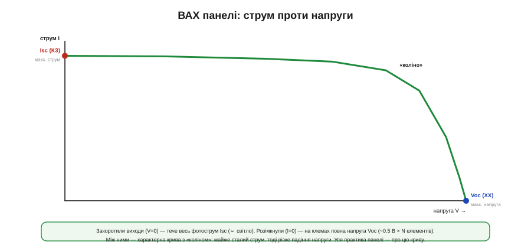
*Рис. 10.5.2.1. Між коротким замиканням (V=0, струм = Isc) і холостим ходом (I=0, напруга = Voc) ВАХ панелі має характерну форму з «коліном»: спершу струм майже сталий (панель поводиться як джерело струму), а біля коліна різко падає до нуля, віддаючи місце напрузі. Уся подальша практика — про цю криву.*

Між цими двома кінцями ВАХ має дуже характерну **форму**, і зрозуміти її просто з нашої моделі. Доки напруга мала, діод «закритий» і весь фотострум іде в навантаження — крива майже **горизонтальна** на рівні Isc: панель тут поводиться як джерело струму. Та коли напруга підбирається до Voc, діод «відкривається» й починає відбирати струм собі — крива круто **завертає вниз**, до нуля. Місце цього завороту й звуть **«коліном»**. Запам'ятаймо цю форму: пласка «поличка» струму, тоді коліно, тоді обрив напруги — і все подальше стане очевидним.

Між цими кінцями є й важлива **несиметрія**, яку варто запам'ятати. Струм Isc майже **прямо пропорційний** освітленості: удвічі менше світла — удвічі менший струм. А ось напруга Voc від яскравості залежить **дуже слабко** (логарифмічно): навіть у похмурий день чи в кімнаті панель тримає майже повну свою напругу, просто віддає крихітний струм. Практичний наслідок: у тіні чи всередині приміщення панель не «гасне» за напругою — вона радше **знесилюється за струмом**. Тому маленька панель у кімнаті ще покаже свої вольти на вольтметрі, та зарядити нею щось буде важко — бо ампер обмаль.

### Чому є горб: P = V·I

Тепер головне питання: де на цій кривій панель віддає **найбільше потужності**? Потужність — це **добуток** напруги на струм (P = V·I), і саме добуток народжує горб.


*Рис. 10.5.2.2. Накладемо на ВАХ криву потужності P = V·I. На обох краях вона нульова: при короткому замиканні (V=0) добуток нуль, при холостому ході (I=0) — теж нуль. Тож десь усередині, біля коліна, потужність сягає максимуму — це і є точка максимальної потужності (MPP) при напрузі Vmp.*

Логіка проста й неспростовна. На лівому кінці кривої струм великий, але напруга **нульова** — отже, потужність V·I теж нуль (закорочена панель гріє сама себе, але назовні нічого не дає). На правому кінці напруга велика, але струм **нульовий** — і знову P = 0 (розімкнена панель тримає напругу, та не віддає струму). А якщо на обох краях потужність нульова, то десь **посередині** вона мусить сягнути максимуму. Цей максимум і лежить біля коліна — у точці максимальної потужності (MPP). Ось чому MPP не там, де найбільший струм чи напруга: бо потужність — це їхній **добуток**, а не кожне окремо.

Корисно зрозуміти й **чому коліно саме там**. Доки напруга панелі низька, внутрішній діод закритий і не заважає — увесь фотострум іде назовні. Та щойно напруга наближається до Voc, діод починає **відкриватися** й жадібно відбирати струм собі, у нагрів. Коліно — це і є та напруга, на якій діод «прокидається». Тому MPP завжди трохи **нижче** Voc: треба зупинитися рівно перед тим, як діод почне красти струм. Це та сама експонента діода з §2.5, тільки тепер вона визначає, де панель найщедріша.

**Приклад (скільки втрачаємо не на MPP).** Панель: Voc = 6.0 В, Isc = 0.50 А; її MPP — у точці Vmp = 4.8 В, Imp = 0.45 А.

```
Максимум, що панель може дати:
   P_mpp = Vmp × Imp = 4.8 × 0.45 = 2.16 Вт

Заряджаємо літій 3.7 В НАПРЯМУ (панель змушена сидіти на 3.7 В):
   3.7 В — лівіше коліна, тож струм ще майже Isc ≈ 0.49 А
   P = 3.7 × 0.49 ≈ 1.81 Вт          ← на ~16% МЕНШЕ за можливе

MPPT (перетворювач 4.8 В → 3.7 В) тримає панель на MPP:
   бере 2.16 Вт і віддає ≈ 2.16 × ККД у батарею
```

Висновок промовистий: просто під'єднати панель до батареї — означає **подарувати** частину потужності (тут ~16%, а буває й більше), бо батарея силоміць стягує панель з її MPP. І що далі напруга батареї від Vmp панелі, то більший цей подарунок — а отже, і виграш від MPPT тим ваговитіший, чим гірше «природно» збігаються панель із батареєю. Саме цей розрив і прибирає MPPT — про що теми 10.5.4–5. Докладне рівняння самої кривої (звідки береться її форма) ми винесемо в математичну вставку.

> 🧮 **Рівняння кривої — у вставці.** Звідки математично береться форма ВАХ — модель «одного діода», що зв'язує фотострум, діодний струм і опори, — у математичній вставці цього розділу про модель одного діода (далі за чергою).

### MPP, Vmp, Imp і «квадратність»

Назвімо точку максимуму як належить. Її напругу звуть **Vmp**, струм — **Imp**, і обидва трохи менші за крайні Voc та Isc. А наскільки «повну» потужність дає панель, показує проста й корисна міра.

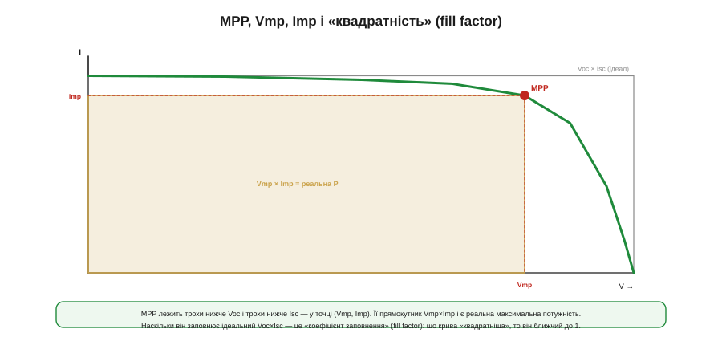
*Рис. 10.5.2.3. MPP лежить у точці (Vmp, Imp), трохи нижче Voc і Isc. Її прямокутник Vmp×Imp — це реальна максимальна потужність. Наскільки він заповнює «ідеальний» прямокутник Voc×Isc — це коефіцієнт заповнення (fill factor): що крива «квадратніша» (різкіше коліно), то FF ближчий до одиниці й то краща панель.*

Уявімо два прямокутники під кривою. Великий — Voc×Isc — це **недосяжний ідеал**: добуток найбільшої напруги на найбільший струм, якби їх можна було взяти одночасно (а їх не можна). Менший — Vmp×Imp — це **реальна** максимальна потужність у точці MPP. Відношення цих площ і звуть **коефіцієнтом заповнення** (*fill factor*, FF): він показує, наскільки «квадратна» крива, тобто наскільки різке в неї коліно. Добра панель має FF близько 0.7–0.8: чим квадратніша крива, тим ближче реальний максимум до ідеалу. Низький FF — ознака поганого елемента або великих внутрішніх втрат. Для нас FF — зручний однопоглядовий показник якості панелі.

Звідки беруть ці числа на практиці? Криву **знімають**, повільно змінюючи навантаження від короткого замикання до холостого ходу й записуючи V та I в кожній точці (так само, як ми робили сітку для перетворювача в §10.2.7). У даташиті ж панелі одразу наводять ключові точки — Voc, Isc, Vmp, Imp і Pmax — за стандартних умов (STC, тема 10.5.1). Пам'ятаймо лише, що це **паспортні** числа за ідеального сонця: у полі і Pmax буде меншим, і точка MPP стоятиме інакше, ніж у таблиці.

### Навантаження вирішує робочу точку

Дотепер ми говорили про криву **самої панелі**. Та де саме на ній панель опиниться, вирішує **навантаження** — і це ключ до розуміння, навіщо взагалі потрібен MPPT.

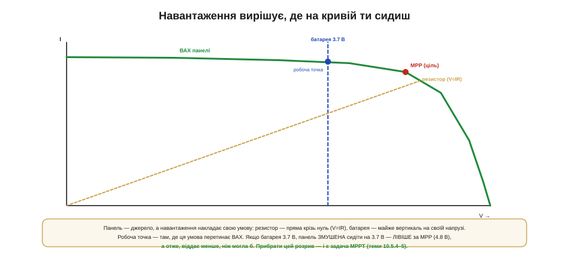
*Рис. 10.5.2.4. Навантаження накладає на панель свою умову — «навантажувальну пряму». Резистор дає пряму крізь початок координат (V=IR, §1.3), батарея — майже вертикальну лінію на своїй напрузі. Робоча точка — там, де ця пряма ПЕРЕТИНАЄ ВАХ панелі. Якщо батарея 3.7 В, панель змушена сидіти ліворуч від MPP (4.8 В) і віддає менше, ніж могла б.*

Панель — це джерело, але вона не сама обирає, де працювати: робочу точку задає **перетин** її кривої з умовою навантаження. Резистор накладає умову V = I·R (§1.3) — пряму крізь початок координат; де ця пряма перетне ВАХ, там панель і опиниться. Батарея ж тримає **майже сталу** напругу, тож її «навантажувальна пряма» — це майже **вертикаль** на напрузі батареї; панель, під'єднана до неї напряму, **змушена** працювати саме на цій напрузі, хоч би де була її MPP. І якщо напруга батареї (3.7 В) не збігається з Vmp панелі (4.8 В) — а вона майже ніколи не збігається, — панель сидить **не на горбі** й віддає менше. Уся ідея MPPT у тому, щоб **розв'язати** напругу панелі від напруги батареї — поставити між ними перетворювач (Розділ 10.2), який дозволить панелі лишатися на своєму Vmp, а батареї живитися своїм.

Звідси й відповідь на спокусливе питання: «а чи не можна просто підібрати резистор, щоб панель сиділа на MPP?». Можна — але лише для **однієї** освітленості: щойно сонце зміниться, крива зсунеться, а фіксована резисторна пряма лишиться на місці — і робоча точка знову з'їде з горба. MPP рухається, а резистор — ні. Саме тому статичного навантаження замало: потрібен **активний** вузол, що підлаштовує умову під поточну криву. Це знайома з електротехніки задача узгодження для максимуму потужності, тільки тут «опір», який бачить панель, доводиться весь час підкручувати під погоду.

Варто й застерегти від звички, винесеної з батарей. Батарею ми зручно уявляли як джерело напруги з малим внутрішнім опором (тема 10.4.2); із панеллю так **не вийде**. Її крива надто нелінійна: ліворуч від коліна вона тримає струм майже сталим (поводиться як джерело струму), а праворуч — обвалює напругу. Тож думати про панель треба не «напруга мінус I·R», а **в термінах усієї ВАХ**: робоча точка живе на кривій, а не на прямій. Хто переносить «батарейну» інтуїцію на панель, той раз у раз дивується, чому вона «не тримає напругу під навантаженням», — а вона її й не повинна тримати.

### Крива не стоїть на місці

І остання, найважливіша для практики річ: ВАХ панелі **не стала** — вона весь час **рухається** з умовами, а разом із нею мандрує й MPP.


*Рис. 10.5.2.5. Більше світла піднімає Isc (крива вгору), менше — опускає її. Нагрів знижує Voc (крива вліво). Тож MPP не стоїть на місці: вона гуляє з хмарами, сонцем і температурою. Саме тому її не можна виставити раз — за нею треба безперервно СТЕЖИТИ (це й робить MPPT).*

Дві сили рухають криву. **Освітленість** керує переважно струмом: яскравіше сонце — вище Isc, крива піднімається; набігла хмара — струм просів, крива опустилася. **Температура** керує переважно напругою: що гарячіша панель, то нижча її Voc, і крива зсувається **вліво** (це той самий спад напруги з нагрівом, що ми бачили в темі 10.5.1). А оскільки рухаються і висота, і ширина кривої, разом із ними **переїжджає** й точка MPP. Звідси головний практичний висновок усієї теми: **MPP не можна знайти раз і назавжди** — вона безперервно гуляє з погодою, тож за нею треба **стежити в реальному часі**. Це і є завдання MPPT (теми 10.5.4–5): не просто знайти горб, а весь час на ньому втримуватися, поки він мандрує.

Масштаби цих зсувів варто відчувати. Напруга падає приблизно на **три десятих відсотка на кожен градус** нагріву, тож панель, розжарена на сонці до +60 °C, легко втрачає десяту частину напруги проти прохолодної — і це б'є по врожаю відчутно. Є й приємна закономірність, на якій тримається спрощений MPPT: точка Vmp майже завжди лежить десь на **рівні ~0.75–0.8 від Voc**, і це співвідношення тримається сталим попри зміну світла. Тож грубо «влучити» в MPP можна, навіть не шукаючи горба, — просто тримаючи панель на цій частці її Voc. Цим і користуються прості **«квазі-MPPT»** рішення, до яких ми ще дійдемо (тема 10.5.4).

### Будуємо панель: послідовно й паралельно

Лишилося зв'язати криву одного елемента з кривою цілої панелі — і тут усе просто, бо діє та сама арифметика, що з комірками батареї (тема 10.4.1).

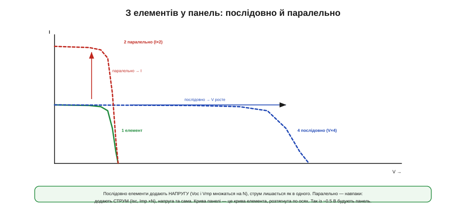
*Рис. 10.5.2.6. Елементи **послідовно** додають напругу: Voc і Vmp множаться на кількість, а струм лишається як в одного (крива розтягується праворуч). **Паралельно** — додають струм: Isc і Imp множаться, а напруга та сама (крива розтягується вгору). Крива панелі — це крива елемента, розтягнута по осях.*

Правило дзеркальне. З'єднати елементи **послідовно** — означає додати їхні **напруги**: десять елементів по 0.5 В дають Voc ~5 В, а струм лишається таким, як в одного елемента. На графіку це **розтягує** криву праворуч. З'єднати **паралельно** — означає додати **струми**: Isc множиться на число гілок, а напруга не міняється; крива розтягується вгору. Реальну панель набирають комбінацією: стільки елементів послідовно, щоб дістати потрібну напругу, і стільки паралельних рядів, скільки треба струму. Тому ВАХ будь-якої панелі — це просто **масштабована** крива одного елемента, і всі поняття (Isc, Voc, MPP, FF) переносяться на неї без змін.

Скільки ж елементів брати послідовно? Тут є практичне правило: напруги панелі має **вистачати з запасом** над напругою батареї, щоб понижувальному MPPT-перетворювачу було куди опускатися. Якщо Vmp панелі лише трохи вищий за напругу батареї, то в спеку (коли Voc просяде) панель може вже й не дотягувати — і MPPT втратить владу над точкою. Тому беруть помітно більше елементів, ніж «рівно під батарею», лишаючи запас на нагрів і просадку. Важлива й засторога з іншого боку: у послідовному ряду всі елементи мусять давати **однаковий** струм, інакше найслабший (затінений) тягне весь ряд донизу — але це вже історія наступної теми про реальне сонце.

### Підсумок теми

ВАХ панелі — це крива «струм проти напруги» з двома кінцями: **Isc** (струм короткого замикання, ∝ світло) і **Voc** (напруга холостого ходу, ~0.5 В × N елементів), а між ними — характерне **«коліно»**. Оскільки потужність — це **добуток** V·I, на обох кінцях вона нульова, а максимуму сягає посередині, у **точці максимальної потужності (MPP)** з координатами Vmp, Imp; наскільки повну потужність дає панель, показує **fill factor**. Робочу точку задає **навантаження** (його «пряма» перетинає ВАХ): батарея силоміць тримає панель на своїй напрузі, тож напряму панель майже завжди сидить **не на MPP** і віддає менше — звідси й потреба в MPPT. Найголовніше: крива **не стоїть на місці** — світло рухає Isc вгору-вниз, тепло зсуває Voc вліво, і MPP **гуляє**, тож за нею треба стежити, а не виставляти раз. А сама панель — це крива елемента, **розтягнута** послідовним (напруга) і паралельним (струм) з'єднанням. Тепер, маючи криву й знаючи, що MPP мандрує, перейдімо до того, що псує цю криву в реальному світі: кута, спеки й, найпідступнішого, — **тіні**.

## 10.5.3 Реальне сонце: кут, температура, затінення

Паспортні числа панелі (Pmax, Vmp, Imp із теми 10.5.2) — це обіцянка за **ідеального** сонця: яскравого, прямого, з прохолодною панеллю. У полі ця ідилія не справджується ніколи. Сонце світить **під кутом** і весь час рухається; панель на сонці **гріється** й через те втрачає напругу; а найгірше — на неї час від часу падає **тінь**. Кожен із цих трьох чинників відкушує від паспортної потужності, причому останній, затінення, кусає так боляче й так неочевидно, що заслуговує окремого, докладного розгляду.

Ця тема — про розрив між «паспортом» і «полем», і про головну зброю проти найпідступнішого з трьох злодіїв — **bypass-діод**. Зрозумівши, чому мала тінь коштує великої частки врожаю, ви вже не поставите панель абияк і не здивуєтеся, чому «5-ватна» панель ледь живить пристрій.

### Три злодії паспортної потужності

Окинемо оком усіх трьох ворогів одразу, перш ніж розбирати кожного.

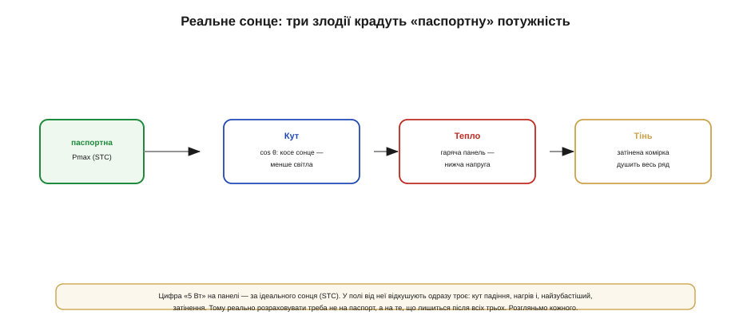
*Рис. 10.5.3.1. Від паспортної Pmax (за стандартних умов) у полі відкушують троє: **кут** падіння (світло йде як cos θ), **нагрів** (гаряча панель — нижча напруга) і **затінення** (одна затемнена комірка душить увесь послідовний ряд). Розраховувати треба не на паспорт, а на те, що лишиться після всіх трьох.*

Спільне в усіх трьох — вони **не виняток, а норма**: коса орієнтація триває майже весь день, нагрів супроводжує будь-яке яскраве сонце, а тінь рано чи пізно падає від стовпа, гілки, антени чи бруду на склі. Тому грамотний розрахунок системи (тема 10.5.6) ніколи не бере паспортну цифру за чисту монету, а закладає на всіх трьох злодіїв запас. Пройдімося по кожному.

Варто відчувати й **характер** їхньої шкоди, бо він різний. Кут — злодій **постійний** і передбачуваний: він діє щодня й закладається в розрахунок наперед. Нагрів — **сезонний**: улітку кусає відчутно, узимку майже ні. А затінення — злодій **раптовий і нерівномірний**: більшу частину часу його може й не бути, та коли тінь падає, вона забирає не відсотки, а половину чи більше. Тому до кута й тепла ставляться як до **сталого податку** (зменшують очікувану потужність на коефіцієнт), а тінь намагаються просто **усунути** — бо проти неї коефіцієнтом не відкупишся.

Підступність ще й у тому, що троє діють **разом**, і їхні втрати радше **перемножуються**, ніж складаються. Коса панель, та ще й гаряча, та ще й приперчена тінню віддасть не «паспорт мінус трохи», а малу частку паспорта. Саме тому між гарною цифрою на наклейці й реальним добовим врожаєм лежить прірва, і досвідчений інженер ділить паспортну потужність на пристойний коефіцієнт, перш ніж щось на неї планувати. Скільки саме — порахуємо в темі про автономну систему (10.5.6); тут головне — звикнути не вірити наклейці на слово.

### Кут: косинус крадькома

Перший злодій — **кут падіння**. Панель збирає рівно стільки світла, скільки проєктується на її поверхню, а це — **косинус** кута між сонячним променем і нормаллю (перпендикуляром) до панелі.

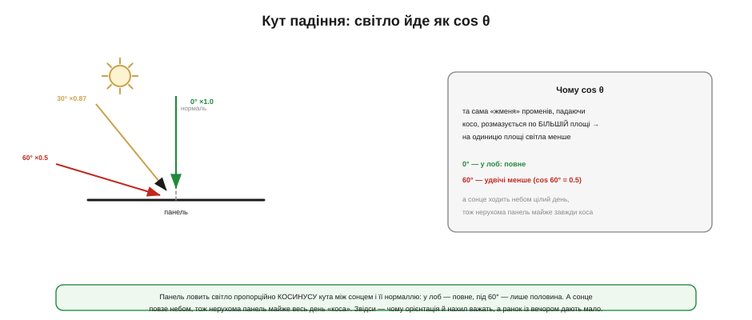
*Рис. 10.5.3.2. Світло, що падає під кутом θ до нормалі панелі, дає лише cos θ від повного: у лоб (0°) — повне, під 30° — 0.87, під 60° — рівно половина. Та сама «жменя» променів, падаючи косо, розмазується по більшій площі, тож на одиницю площі світла менше.*

Інтуїція проста: та сама порція світла, падаючи **косо**, розмазується по більшій площі панелі, тож на кожен квадратний сантиметр його дістається менше — рівно у cos θ разів. Прямо в лоб (0°) — повне світло; під 60° — лише половина (cos 60° = 0.5); під ковзним кутом — майже нічого. А підступність у тому, що сонце **весь час рухається** небом: нерухома панель «дивиться в лоб» сонцю хіба що кілька хвилин на день, а решту часу ловить його косо. Звідси й практика: панель **орієнтують і нахиляють** так, щоб ловити сонце якнайпряміше в середньому за день (для нерухомої — на південь під кутом, близьким до широти місцевості), і змиряються, що ранок та вечір дають мало. Механічне **стеження** за сонцем повертає цей косинус, але для малих embedded-систем воно майже завжди не варте складності — простіше поставити трохи більшу панель.

Кут важить не завжди однаково, і це варто розуміти. У **ясний** день світло переважно **пряме**, від диска сонця, і косинус б'є на повну: панель, повернута не туди, втрачає багато. А в **похмурий** день світло **розсіяне** — приходить з усього неба потроху, — і залежність від кута майже зникає (зате й самого світла в рази менше). Для нерухомої embedded-панелі звідси простий компроміс: нахилити її під середнє денне сонце й не гнатися за ідеалом, бо досконало «вистежити» сонце нерухома пластина однаково не може. А зовсім **горизонтальна** панель, спокуслива простотою монтажу, у наших широтах помітно програє нахиленій — і ще й збирає на собі більше пилу та води, що вже підводить нас до третього злодія.

### Температура: іронія яскравого сонця

Другий злодій ми вже знаємо в обличчя з теми 10.5.2 — **нагрів**. Гаряча панель має нижчу Voc (приблизно −0.3% на кожен градус), а з напругою тане й потужність.

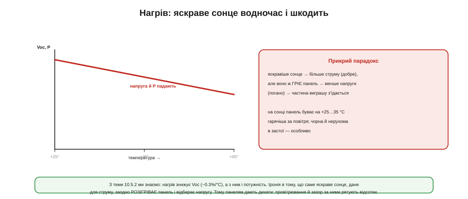
*Рис. 10.5.3.3. Нагрів знижує напругу панелі (~0.3%/°C), а з нею — потужність. Прикра іронія: яскраве сонце, дане для струму, заразом РОЗІГРІВАЄ панель і відбирає напругу. На сонці панель буває на +25…35 °C гарячіша за повітря, надто чорна й нерухома в застої. Провітрювання рятує відсотки.*

Тут криється прикра **іронія**, про яку варто знати. Здавалося б, що яскравіше сонце, то більше енергії — і за струмом це справді так. Та те саме яскраве сонце **розігріває** панель, а нагрів **відбирає напругу**, з'їдаючи частину виграшу. Чорна нерухома панель на сонці легко буває на 25–35 градусів гарячіша за повітря, а кожен такий градус — це втрачені частки відсотка. Тому, хоч як парадоксально, **прохолодна панель під помірним сонцем** іноді віддає не менше за розпечену під палючим. Практичний висновок простий: панелі дають **дихати** — лишають зазор за нею, ставлять так, щоб обдувало вітром, не топлять у глухому корпусі. Це безкоштовно рятує помітні відсотки врожаю, особливо влітку.

Через цей нагрів панелі часто характеризують не лише за ідеальних лабораторних +25 °C, а й за реалістичнішої **робочої** температури (її звуть NOCT — номінальна температура елемента в роботі, десь близько +45 °C на відкритому сонці). Розумний розрахунок системи (тема 10.5.6) бере саме «гарячі» числа, а не лабораторні, бо в полі панель майже завжди тепліша за ті +25. Простіше кажучи, на температуру закладають **поправку вниз** — і тим більшу, чим спекотніший клімат і глухіший монтаж. Це не дрібниця: різниця між паспортною та реальною робочою напругою цілком може з'їсти той запас, на який ви розраховували, тож тепло варто закладати в кошторис, а не списувати на «трохи».

### Тінь: одна комірка душить весь ряд

І ось найпідступніший, найголовніший злодій — **затінення**. Його шкода настільки непропорційна, що варта окремого осмислення, бо ламає наївну інтуїцію «затінив десяту частину — втратив десяту частину».

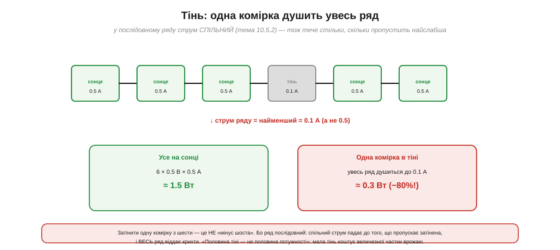
*Рис. 10.5.3.4. У послідовному ряду струм СПІЛЬНИЙ для всіх комірок (тема 10.5.2). Тож якщо одна комірка затінена й може пропустити лише 0.1 А, увесь ряд змушений текти цими 0.1 А — і віддає крихти, хоч решта комірок купаються в сонці. Затінення однієї комірки з шести коштує не «шостої», а ~80% потужності.*

Згадаймо залізне правило послідовного з'єднання (тема 10.5.2): усі комірки в ряду несуть **той самий струм**. А тепер затінимо **одну**. Затінена комірка народжує мало пар, тож може пропустити лише малий струм — скажімо, 0.1 А замість 0.5. Але ж ряд послідовний, і струм у ньому **спільний**: він не може бути більшим за те, що пропускає найслабша ланка. Тож **уся** низка змушена текти цими нещасними 0.1 ампера, хоч решта комірок готові дати в п'ять разів більше. Одна тінь — і весь ряд задихнувся.

**Приклад (мала тінь — велика втрата).** Ряд із 10 комірок, повне сонце: кожна 0.5 В / 0.5 А.

```
Повне сонце:  ряд = 10 × 0.5 В = 5 В,  струм 0.5 А → P = 2.5 Вт

Затінили ОДНУ комірку, тепер вона пропускає лише 0.1 А:
   ряд послідовний → струм УСЬОГО ряду падає до 0.1 А
   P ≈ 5 В × 0.1 А ≈ 0.5 Вт        ← затінили 10%, втратили ~80%!
```

Ось чому **«половина тіні — не половина потужності»**: затемнити навіть малу частину панелі — означає обвалити майже весь її врожай, бо найслабша ланка диктує струм усього ряду. І це ще не вся біда: інші комірки **проштовхують** свій струм крізь затінену, а та опиняється під **зворотною** напругою й починає розсіювати чужу енергію теплом — виникає **«гаряча пляма»** (*hot spot*), що може й фізично пошкодити комірку. Тінь не просто краде потужність — вона ще й загрожує панелі.

Для **малих** пристроїв затінення особливо злюще з двох причин. По-перше, маленька панель має мало комірок, тож одна затінена — це вже велика частка всього врожаю. По-друге, джерел тіні безліч, і вони підступні: гілочка, що гойдається, послід птаха, власна антена чи стійка пристрою, тінь від якої повільно повзе панеллю протягом дня, ба навіть налиплий **пил** і висохлі патьоки — це «м'яке» затінення, що поволі душить струм, не залишаючи чіткої межі. Тому для embedded головне правило не «поставити розумний контролер», а **знайти панелі чисте, незатінюване місце** й тримати її скло чистим. Жоден алгоритм не поверне світла, якого просто немає, — а ось рівномірно освітлена панель віддасть усе, на що здатна.

### Bypass-діод: шлях в обхід

На щастя, проти цієї біди є просте й елегантне рішення — **bypass-діод** (обхідний діод), той самий p-n перехід із §2.5, але в захисній ролі.

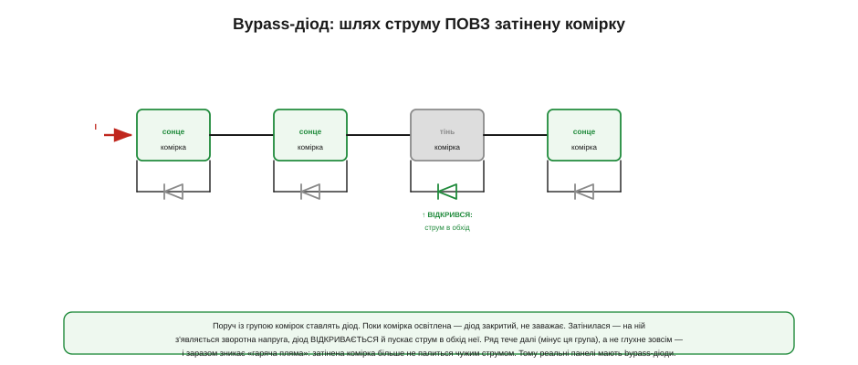
*Рис. 10.5.3.5. Паралельно групі комірок ставлять діод. Поки комірка освітлена, діод закритий і не заважає. Затінилася — на ній з'являється зворотна напруга, діод відкривається й пускає струм ряду в **обхід** неї. Ряд тече далі (втративши лише напругу цієї групи), а не глухне зовсім, — і «гаряча пляма» зникає.*

Ідея така. Паралельно кожній комірці (а на практиці — групі комірок) під'єднують діод **назустріч** робочому струму. У нормі, коли комірка освітлена й сама штовхає струм, цей діод закритий і ніяк не заважає. Та щойно комірка затінюється й стає **перепоною** на шляху чужого струму, на ній виникає зворотна напруга — і саме вона **відкриває** обхідний діод. Тепер струм решти ряду тече не крізь задушену комірку, а **повз** неї, через діод. Ряд утрачає лише напругу цієї однієї групи (а не весь струм!) і працює далі. У нашому прикладі з bypass-діодом замість 0.5 Вт ряд віддав би близько 2.25 Вт — утрата лише десь у розмір самої затіненої комірки, а не катастрофа. Та ще й «гаряча пляма» зникає: затінена комірка більше не палиться чужим струмом, бо той іде в обхід. Саме тому **всі реальні панелі мають bypass-діоди** — зазвичай по одному на кожні кілька десятків комірок; це дешева страховка, що перетворює «втратив усе» на «втратив затінену частину».

У bypass-діода є й своя ціна, яку чесно знати. По-перше, він обходить не одну комірку, а цілу **групу**, до якої під'єднаний: затінилася одна — на час обходу випадає вся група, тож дрібніше розбиття рятує більше, але дорожче. По-друге, відкритий діод сам має падіння напруги й трохи гріється, тож обхід — це не «безкоштовно», а «менша з двох бід»; через це часто беруть діоди Шоткі (з §2.5) з малим падінням. І все ж арифметика однозначна: втратити кілька відсотків на діоді незрівнянно краще, ніж обвалити струм усього ряду й ризикнути гарячою плямою. Тому bypass — це не розкіш, а стандарт, і питання лише в тому, на скільки груп поділено панель.

### Часткова тінь і кілька горбів

Лишилася одна тонкість, що сполучає цю тему з MPPT і пояснить, чому стеження за максимумом буває хитрим. Коли частина панелі в тіні, а bypass-діоди то відкриваються, то закриваються, рівна крива потужності з теми 10.5.2 **спотворюється**.

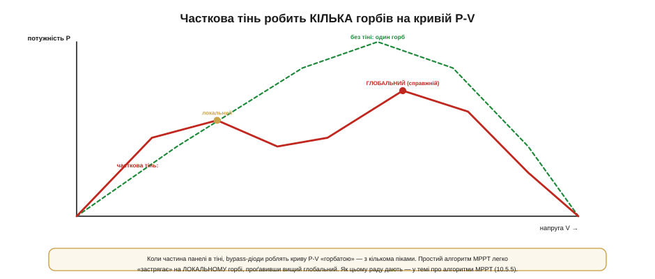
*Рис. 10.5.3.6. Без тіні крива потужності P-V має один чіткий горб. За часткового затінення bypass-діоди роблять її «горбатою» — з кількома піками: одним нижчим (локальним) і одним вищим (глобальним). Простий алгоритм MPPT легко «застрягає» на локальному, проґавивши справжній максимум.*

Замість одного охайного горба з'являється **кілька піків**: ділянки, де частина рядів працює, а частина обійдена діодами, дають свої локальні максимуми. І тут чигає пастка на стеження за MPP: простий алгоритм, що просто «лізе вгору схилом», легко **застрягає** на найближчому, **локальному** горбі, не побачивши вищого **глобального**. Тобто часткова тінь не лише краде потужність прямо — вона ще й **заплутує** MPPT. Як алгоритми дають цьому раду (періодично перескануючи всю криву в пошуках справжнього максимуму), розберемо в темі про алгоритми MPPT (10.5.5); тут досить запам'ятати, що тінь — це не лише втрата, а й ускладнення для розумного контролера.

Для нашої, embedded-практики з цієї «горбатої» кривої випливає тверезий висновок. Дороге стеження за глобальним максимумом, із періодичним перескануванням усієї кривої, виправдане на великих сонячних станціях, де на кону кіловати. На маленькій же панелі простіше й надійніше **не допускати** часткової тіні взагалі, ніж сподіватися, що контролер у ній якось розбереться. Інакше кажучи, проти тіні найкращий «алгоритм» — це **компонування**: чисте небо над панеллю, відсутність стовпів, гілок і власних деталей пристрою в її полі зору. А вже як стежити за MPP, коли крива поводиться чемно й має один горб, — тема наступних розмов про контролери та алгоритми.

### Підсумок теми

Паспортна потужність панелі — за **ідеального** сонця; у полі від неї відкушують троє. **Кут** падіння віднімає cos θ: косе сонце дає менше (під 60° — половину), а нерухома панель «коса» майже весь день, тож її орієнтують і нахиляють під середнє сонце. **Нагрів** знижує напругу (~0.3%/°C), і виходить іронія: яскраве сонце, дане для струму, заразом гріє панель і відбирає вольти — тож панелям дають провітрюватися. А **затінення** — найпідступніше: у послідовному ряду струм спільний, тож одна затінена комірка душить **увесь** ряд (затінив 10% — утратив ~80%) і ще й ризикує «гарячою плямою». Рятує **bypass-діод**: він пускає струм в обхід затіненої комірки, тож ряд утрачає лише її частку, а не все, і не перегрівається. Платою за обхідні діоди є **кілька горбів** на кривій потужності за часткової тіні, що заплутує просте стеження за MPP. Звідси два практичні правила: ставте панель так, щоб її **не затінювало** частинами, і ніколи не плануйте систему під паспортну цифру — діліть її на пристойний коефіцієнт, бо реальний денний врожай завжди помітно нижчий. А далі — як від панелі дійти до зарядженої батареї: прямий заряд, PWM- і MPPT-контролери.
