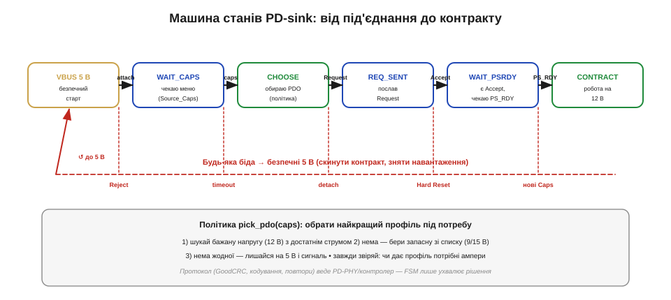

# ⚙️ Машина станів PD-sink: capabilities → request → accept

> Алгоритмічна вставка до теми [10.3.3 «USB Power Delivery»](usb-power.md). Там ми описали рукостискання як розмову; тут — як оформити цю розмову в надійну машину станів, що сама веде політику живлення й безпечно падає, коли щось іде не так.

### Задача

Наш пристрій хоче дістати з PD-джерела певну напругу (скажімо, 12 В). Рукостискання з теми 10.3.3 — це не один обмін, а **послідовність з умовами**: дочекатися меню профілів (`Source_Capabilities`), обрати потрібний, надіслати `Request`, дочекатися `Accept`, потім `PS_RDY` — і лише тоді на VBUS буде потрібна напруга. Але по дорозі все може піти не так: джерело може **відмовити** (`Reject`), **не відповісти** вчасно, **переукласти** контракт новим меню, або зв'язок узагалі обірветься (від'єднали кабель, джерело зробило Hard Reset). Потрібна логіка, що проводить пристрій крізь усі ці випадки й **за будь-якої біди безпечно повертається на 5 В**. Це і є «мозок» МК-шляху з теми 10.3.4.

### Ідея

Оформимо sink як **скінченну машину станів** (*finite state machine*, FSM). Кожен стан — це «де ми зараз у розмові», кожна подія (прийшло повідомлення, вийшов таймер, від'єднали) — перехід. Окремо живе **політика** `pick_pdo(caps)` — чиста функція, що з меню профілів вибирає найкращий під нашу потребу (з пріоритетом і запасними варіантами). Машина рухається вперед на успішних подіях і **відкочується на 5 В** на будь-якій проблемній.


*Рис. 10.3.3a.1. Уперед: VBUS 5 В → WAIT_CAPS → CHOOSE → REQ_SENT → WAIT_PSRDY → CONTRACT, кожен крок за своєю подією (caps, Request, Accept, PS_RDY). Униз — спільна «червона шина»: Reject, таймаут, від'єднання, Hard Reset чи нове меню скидають усе в безпечні 5 В і знімають навантаження. Політика pick_pdo обирає профіль за пріоритетом і звіряє струм.*

### Псевдокод

```
стан    = VBUS_5V             # старт: на шині лише безпечні 5 В
бажані  = [12.0, 9.0]         # профілі за пріоритетом (вольти)
Iпотр   = 2.0                 # потрібний струм

on_attach():                  # побачили джерело по CC
    стан = WAIT_CAPS
    timer(SinkWaitCap, 500мс) # не прийшло меню → відкат

on_message(msg):
    if msg == Source_Capabilities:        # прийшло (чи оновилось) меню
        i = pick_pdo(msg.pdos)
        if i == NONE:
            fall_to_safe("нема потрібного профілю"); return
        send(Request(i)); стан = REQ_SENT
        timer(SenderResponse, 30мс)       # нема відповіді → відкат
    elif msg == Accept  and стан == REQ_SENT:
        стан = WAIT_PSRDY
        timer(PSTransition, 550мс)
    elif msg == Reject  and стан == REQ_SENT:
        fall_to_safe("відмова — пробую далі/лишаюсь 5 В")
    elif msg == PS_RDY  and стан == WAIT_PSRDY:
        стан = CONTRACT
        enable_load()                     # АЖ ТЕПЕР вмикаємо навантаження

on_timeout(_):   fall_to_safe("таймаут")
on_detach():     fall_to_safe("від'єднано")
on_hard_reset(): fall_to_safe("hard reset")

fall_to_safe(reason):
    disable_load()                        # навантаження геть
    стан = VBUS_5V                        # лишаємось на безпечних 5 В
    signal(reason)

pick_pdo(pdos):                           # ПОЛІТИКА
    for V in бажані:                      # за пріоритетом
        if exists fixed-PDO(V) with Iмакс >= Iпотр:
            return його_індекс
    return NONE                           # нічого не підходить
```

### Складність і пастки на МК

- **Таймери — обов'язкові, не опційні.** Кожен крок має дедлайн: відповідь (`Accept`) — десятки мілісекунд, перехід живлення до `PS_RDY` — сотні, очікування меню — теж сотні. Прострочив — `fall_to_safe()`, а не «чекаю далі». FSM без таймерів зависає назавжди, якщо джерело замовкло на півслові.
- **Не блокуй.** Машина має бути **подієвою** — крутитися на перериваннях і черзі подій, а не в `busy-wait`. На МК сотні мілісекунд активного очікування `PS_RDY` вб'ють решту роботи пристрою. Стан зберігаємо у змінній, а не в стеку викликів.
- **Не пиши сам PD-PHY.** Бітове кодування, `GoodCRC`, повтори, точний тайминг на рівні символів — це робота PD-PHY чи контролера (тема 10.3.4). Наша FSM працює з **уже розкодованими** повідомленнями. Спокуса зробити весь стек на голому МК велика — і майже завжди марна.
- **Навантаження — лише по контракту.** `enable_load()` викликаємо аж у `CONTRACT`, після `PS_RDY`. До того на шині тільки 5 В (тема 10.3.4), і вмикати на них пристрій, розрахований на 12, не можна.
- **Джерело переукладає на ходу.** `Source_Capabilities` можуть прийти **знову** під час контракту — меню змінилося, треба переобрати, а не ігнорувати. А `Hard Reset` будь-коли скидає все в 5 В — обробляй його як повний відкат.
- **Звіряй не лише напругу, а й струм.** Контракт — це напруга **й** струм (тема 10.3.4), тож `pick_pdo` мусить перевіряти, що профіль дає потрібні ампери, інакше дістанеш «правильні» вольти, але замало потужності.
- **За замовчуванням — безпечно.** Будь-який несподіваний стан чи подія → `fall_to_safe()`. У живленні «коли сумніваюся — повертаюсь на 5 В» завжди дешевше за «спробую вгадати».
