# Розділ 10.3 — USB-живлення і розумна зарядка

Маючи за плечима топології (Розділ 10.1) і вміння спроєктувати та виміряти перетворювач (Розділ 10.2), звернімося до найпоширенішого джерела живлення сучасності — **USB**. Сьогодні той самий роз'єм заряджає телефон, годинник, павербанк і ноутбук, а живлення по ньому з'являється не само, а через **домовленість** між пристроєм і джерелом. У цьому розділі ми розберемо, що насправді тече по USB, як пристрій просить більше вольтів і ампер, чому «розумний» кабель має всередині чип — і як зробити власний пристрій, що бере живлення з USB правильно й безпечно.

> 📜 **Звідки взявся «один дріт»:** [історія стандартизації зарядки](hist-one-charger.md) — від зоопарку роз'ємів через меморандум ЄС 2009 і народження USB-C до обов'язкової директиви 2022-го, що дотиснула навіть останнього холдаута.

---

## 10.3.1 Від 500 мА до 240 Вт: карта живлення через USB

Ми вже бачили USB як джерело живлення мимохідь (§4.12.7) — звідти бралися 5 вольтів для пристрою. Тепер настав час повної картини, бо за останнє десятиліття USB з кволого «джерела для мишки» перетворився на серйозний інтерфейс живлення, здатний нагодувати ноутбук. І найдивовижніше: роз'єм фізично майже не змінився, а потужність зросла **на два порядки** — з 2.5 до 240 ват. Як? Бо змінилося не так залізо, як **домовленості** про те, скільки можна взяти. Ця тема — карта тих домовленостей: драбина потужності, покоління роз'ємів і три різні способи спитати джерело «скільки даси?».

Тут варто одразу перелаштувати мислення. Звична розетка чи батарея — **тупе** джерело: на ній завжди стоїть напруга, бери скільки хочеш (до межі). USB — інше: це **домовлене** джерело, де напруга й дозволений струм залежать від **розмови** між пристроєм і портом. Сам по собі USB-порт обережний — він тримає лише безпечні 5 вольтів і малий струм, доки пристрій не доведе, що має право на більше. Тому проєктувати живлення з USB означає не просто «під'єднати 5 В», а навчити пристрій вести цю розмову: спершу запитати, тоді взяти. Решта розділу — про мову цієї розмови; ця тема дає її загальну карту, щоб подальші деталі (резистори, контракти, профілі) лягали в зрозумілий каркас.

### Драбина потужності: від 2.5 до 240 Вт

Почнімо з масштабу. Живлення через USB пройшло цілу драбину, і кожен її щабель — це нова межа струму чи напруги.


*Рис. 10.3.1.1. Той самий роз'єм — на два порядки більша потужність. USB 2.0 давав 2.5 Вт (5 В × 0.5 А), USB 3.0 — 4.5 Вт, Battery Charging — 7.5 Вт, базовий USB-C — 15 Вт, USB PD — 100 Вт, а новітній PD EPR — аж 240 Вт. Зросло не залізо, а домовленість про те, скільки можна взяти.*

Найнижчий щабель — **USB 2.0**: 5 вольтів і всього 500 міліампер, тобто **2.5 Вт**. Цього вистачало на мишку чи флешку, заради яких живлення й додали до шини даних. **USB 3.0** підняв ліміт до 900 мА (**4.5 Вт**). Спеціальна угода **Battery Charging** дозволила брати до 1.5 А (**7.5 Вт**) — уже щось для телефона. Далі прийшов **USB-C**, який і без жодного протоколу дає 5 В × до 3 А = **15 Вт**. А вже **USB Power Delivery** (PD) зніс стелю: спершу до 100 Вт (20 В × 5 А), а в новітній версії з розширеним діапазоном (EPR) — до **240 Вт** (48 В × 5 А), чого досить навіть потужному ноутбуку.

Ключове спостереження: уся ця драбина живе на **тому самому** фізичному кабелі. Між 2.5 і 240 ватами немає нового заліза — є дедалі розумніша **розмова** між пристроєм і джерелом про напругу й струм. Опанувати USB-живлення означає опанувати саме цю розмову.

Чому ж потужність нарощують переважно **напругою**, а не струмом? Бо струм у тонкому кабелі впирається в тепло. Згадаймо §1.3: дріт гріється як I²·R, і подвоївши струм, учетверо збільшуєш втрати на ньому. Тонкий USB-кабель фізично не протягне 48 А — він би розплавився. А от **підняти напругу** дешево: щоб віддати 240 Вт, на 5 вольтах потрібні немислимі 48 А, а на 48 вольтах — лише 5 А, цілком підйомні для дроту. Тому вся драбина PD — це насамперед драбина **напруг**: більше ват беруть вищими вольтами при помірному струмі. Це та сама логіка, що гнала високовольтні лінії електропередач, тільки в мініатюрі роз'єму.

### Покоління роз'ємів і їхні межі

Перш ніж говорити про домовленості, варто впізнавати самі роз'єми — бо їхнє покоління одразу каже, на що здатне живлення.

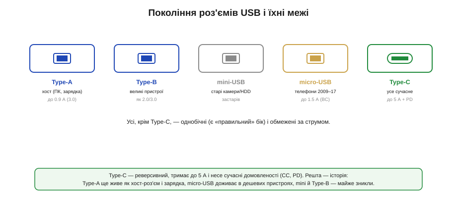
*Рис. 10.3.1.2. Type-A — класичний хост-роз'єм (ПК, зарядки), до 0.9 А. Type-B — для великих пристроїв. Mini- і micro-USB — телефони й камери 2000-х, до 1.5 А і вже застарілі. Type-C — сучасний реверсивний роз'єм, що тримає до 5 А й несе всі нові домовленості (CC, PD). Усі, крім Type-C, однобічні й обмежені за струмом.*

**Type-A** — той самий прямокутний штекер, що десятиліттями стирчав із ПК; він і досі живе як **хост**-роз'єм і як вихід зарядних блоків, але обмежений струмом і однобічний. **Type-B** (та його mini- й micro-варіанти) ішов на «пристрій» — принтери, телефони, камери; **micro-USB** був тим самим спільним зарядним 2009-го й доживає в дешевій техніці. А **Type-C** — сучасний роз'єм, що змінив усе: він **реверсивний** (втикається будь-яким боком), компактний, тримає до **5 А** і, головне, несе всередині лінії для нових домовленостей (CC, PD). Тому практичне правило: побачили Type-C — можливі і високий струм, і PD; побачили micro чи A — живлення скромне й за старими правилами.

Та роз'єм — лише половина історії: важить і сам **кабель**. Не кожен USB-C-шнур однаковий. Дешевий кабель розрахований на 3 А, і протягти крізь нього повні 5 А (100 Вт і вище) не можна — він перегріється. Тому кабелі на великий струм містять усередині крихітний чип — **e-marker**, що «доповідає» джерелу, скільки ампер витримує. Без нього система свідомо обмежить струм безпечним рівнем. Звідси буденна загадка «чому з цим кабелем заряджає повільно»: часто винен не пристрій і не зарядка, а кабель, що не вміє заявити про свою спроможність. Цей чип у кабелі ми розберемо в темі 10.3.7; поки що запам'ятайте, що повну потужність несуть лише **відповідні** кабелі.

### USB-C без розуму: 5 В і резистори CC

Найприємніше в USB-C те, що базове живлення він дає **зовсім без протоколу** — самими резисторами. Це той випадок, коли «розумний» роз'єм працює тупо й надійно.


*Рис. 10.3.1.3. Без жодного PD джерело вішає на лінію CC резистор Rp, пристрій — резистор Rd, і за напругою на CC пристрій читає, скільки ампер дозволено: стандартні ~0.9/1.5 А, або 1.5 А, або 3 А (15 Вт). Ніякого чипа й протоколу — лише два резистори. Більше за 15 Вт? Тоді потрібен PD.*

Працює це так. На роз'ємі Type-C є спеціальна лінія — **CC** (*Configuration Channel*). Джерело вішає на неї резистор **Rp**, пристрій — резистор **Rd**, і за рівнем напруги, що утворюється на їхньому дільнику, пристрій **зчитує**, скільки струму джерело готове дати: стандартний рівень, 1.5 А чи повні 3 А (тобто до **15 Вт** при 5 В). Жодного протоколу, жодного чипа — лише два резистори й трохи напруги. Цей механізм ми розберемо детально в наступній темі (10.3.2); тут досить запам'ятати, що базовий USB-C дає до 15 ват майже задарма, і для багатьох простих пристроїв цього цілком вистачає.

У цій простоті — справжня інженерна елегантність, і варто оцінити її логіку. Резистори CC роблять три речі задарма: визначають, що пристрій узагалі **під'єднано** (без них джерело тримає VBUS вимкненим — безпека), задають **орієнтацію** (який із двох симетричних боків устромлено), і кажуть **дозволений струм**. Усе це — пасивно, без живлення й коду, тому працює навіть у найдешевшому пристрої й навіть до того, як його процесор прокинувся. І ще тонкість безпеки: поки пристрій не прочитав CC, він **не має права** припускати більше за стандартні 5 В і малий струм — інакше перевантажить слабке джерело. Тверезий USB-C-пристрій спершу читає резистори, а вже тоді бере струм.

### USB Power Delivery: домовитися про більше

А коли 15 ват замало — телефон хоче швидкої зарядки, ноутбук просить 60 чи 100 Вт — вступає в дію **USB Power Delivery** (PD): повноцінний **протокол** переговорів по тій самій лінії CC.


*Рис. 10.3.1.4. PD дає не лише 5 В: пристрій просить профіль, і джерело піднімає напругу. Фіксовані щаблі — 5/9/15/20 В (SPR, до 100 Вт). PPS — програмована напруга, що плавно міняється кроком ~20 мВ. EPR — високовольтні 28/36/48 В аж до 240 Вт. Усе по тому самому дроту, через цифрові повідомлення.*

Замість тупих резисторів PD веде справжню **розмову**: пристрій питає, які профілі живлення джерело пропонує, і просить потрібний. Профілі бувають **фіксовані** — 5, 9, 15, 20 вольтів (це класичний діапазон SPR, до 100 Вт при 20 В × 5 А). Є **PPS** (*Programmable Power Supply*) — режим, де напругу можна плавно підкручувати дрібним кроком (~20 мВ), що дуже зручно для розумної зарядки батареї прямо. А найновіший **EPR** (*Extended Power Range*) додає високовольтні щаблі — 28, 36, 48 вольтів — і доводить межу до **240 Вт**. Усе це — цифрові повідомлення по лінії CC; ми розберемо їх у темах 10.3.3–10.3.4. Поки що головне: PD — це спосіб **підняти напругу** на вимогу, бо віддати 100 ват на 5 вольтах означало б 20 ампер і розплавлений кабель, а на 20 вольтах — лише 5 ампер.

Тут критична деталь безпеки, на яку спирається весь PD: **до укладення контракту на лінії VBUS завжди лише 5 вольтів**. Джерело не подає 20 чи 48 В «про всяк випадок» — воно чекає, поки пристрій явно попросить, і лише тоді піднімає напругу. Інакше встромлений у потужну зарядку дешевий пристрій, розрахований на 5 В, миттєво згорів би від 20. Тому PD — це не просто «дай більше», а ретельний рукостискання з підстраховкою: спершу безпечні 5 В, тоді переговори, і тільки за згодою — висока напруга. PD домовляється навіть про те, **хто кого живить** (адже з USB-C і ноутбук, і телефон можуть бути джерелом), — але це вже тонкощі наступних тем.

### Один роз'єм, різні ролі: живлення окремо від даних

Чому ж той самий роз'єм возить і 5 міліампер мишки, і 240 ват ноутбука, і відео на монітор — і нічого не плутається? Бо в USB-C **живлення й дані розв'язані**.

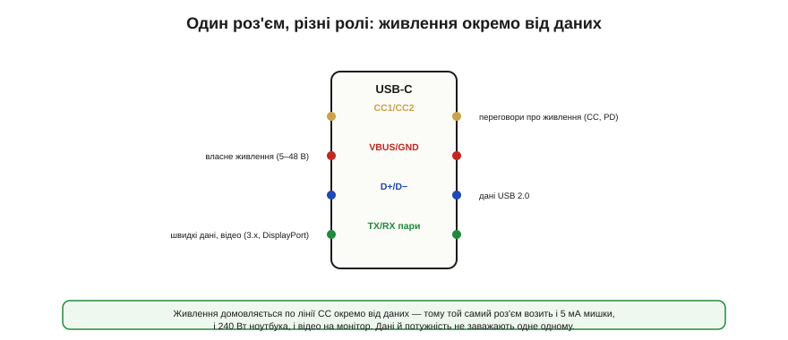
*Рис. 10.3.1.5. У роз'ємі Type-C різні лінії роблять різне: CC1/CC2 ведуть переговори про живлення (резистори, PD); VBUS/GND несуть саму потужність (5–48 В); D+/D− — дані USB 2.0; швидкі пари TX/RX — високошвидкісні дані й відео. Живлення домовляється окремо від даних, тому вони не заважають одне одному.*

Це принципова ідея. Переговори про живлення йдуть по **окремій** лінії CC, сама потужність — по VBUS, а дані — по своїх лініях (D+/D− для USB 2.0, швидкі пари TX/RX для USB 3.x і відео). Тому пристрій може домовлятися про 100 ват, не чіпаючи передачу даних, а проста зарядка взагалі не використовує лінії даних. Один роз'єм грає багато ролей одночасно, бо кожна роль сидить на своїх контактах. Саме ця розв'язка й зробила USB-C універсальним: він не «зарядка з даними» чи «дані з зарядкою», а набір незалежних каналів в одному штекері.

Розв'язка сягає ще далі: по тих самих швидких парах USB-C уміє пускати **взагалі не USB**-протоколи — це звуть **альтернативними режимами** (*alt-mode*). Так по USB-C ходить **DisplayPort** (тому з одного роз'єму йде відео на монітор) чи **Thunderbolt**. Роз'єм наче «здає в оренду» свої високошвидкісні лінії іншому стандарту, домовившись про це по тій самій CC. Для нас, людей живлення, це нагадування: USB-C — не один протокол, а **контейнер** для багатьох, де живлення (наша тема) — лише одна зі співмешканок. Тому, проєктуючи живлення з USB-C, тримаються своєї смуги (CC, VBUS) і не плутають її з даними чи відео, що ділять той самий штекер.

### «Скільки можу взяти?»: карта рішення

Зведімо все в одне практичне питання, яке ставить будь-який пристрій, увіткнутий у USB: **скільки струму я можу безпечно взяти?** Бо взяти наосліп не можна — або недобереш (заряджатимешся годинами), або перевантажиш джерело (воно вимкнеться чи згорить).

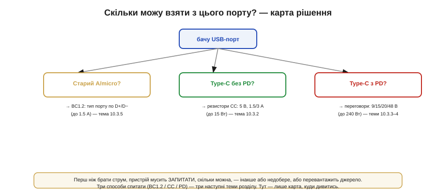
*Рис. 10.3.1.6. Три способи спитати джерело. Старий порт (A чи micro) — за угодою BC1.2 пристрій визначає тип порту по лініях даних (до 1.5 А, тема 10.3.5). Type-C без PD — читає резистори CC (5 В, 1.5/3 А, тема 10.3.2). Type-C із PD — веде переговори (9/15/20/48 В, до 240 Вт, теми 10.3.3–4). Тут — лише карта, куди дивитись.*

Відповідь залежить від того, **який** порт. Якщо це старий **Type-A чи micro-USB**, пристрій користується угодою **BC1.2**: за тим, як з'єднані лінії даних D+/D−, він визначає тип порту (звичайний, зарядний, і скільки той дає — до 1.5 А). Якщо це **Type-C без PD**, пристрій читає **резистори CC** і дізнається дозволений струм при 5 В. А якщо це **Type-C із PD**, пристрій **домовляється** протоколом і може підняти напругу аж до 48 В. Три порти — три різні способи спитати, і кожен ми розберемо окремо: BC1.2 у темі 10.3.5, резистори CC у 10.3.2, PD у 10.3.3–10.3.4. Ця ж тема — лише карта, що показує, куди дивитися й чого очікувати.

Чому це не дрібниця? Бо ціна помилки реальна з обох боків. Візьмеш **більше**, ніж порт дозволяє, — слабке джерело просяде, піде в захист чи вимкнеться, і пристрій узагалі не запуститься (а в гіршому разі щось перегріється). Візьмеш **менше** — зарядка повзтиме годинами, хоч поруч стоїть потужна зарядка, готова дати вп'ятеро більше. Тому «розумна» зарядка — це не маркетинг, а необхідність: пристрій мусить спершу **дізнатися** межі, а вже тоді брати. На практиці цю розмову рідко пишуть руками: за неї відповідає окремий **контролер CC/PD** — спеціалізований чип (або блок усередині МК), що веде переговори й каже перетворювачу, на яку напругу налаштуватися. Його ми зустрінемо в наступних темах і у вставці про готові sink-контролери. Головне ж тут — звичка: перш ніж брати струм із USB, спитай, скільки можна.

### Підсумок теми

USB-живлення — це драбина від 2.5 до 240 ват **на тому самому роз'ємі**, бо зростала не апаратура, а **домовленість** про напругу й струм. Покоління роз'ємів одразу підказують межі: Type-A й micro — скромне живлення за старими правилами, Type-C — до 5 А і всі нові механізми. Базовий USB-C дає до 15 Вт **самими резисторами CC**, без протоколу; коли треба більше, вступає **PD** — протокол, що піднімає напругу до фіксованих 5/9/15/20 В, програмованої PPS чи високовольтної EPR (до 240 Вт). А працює це все тому, що в USB-C **живлення розв'язане з даними**: переговори по CC, потужність по VBUS, дані окремо. Звідси й головне практичне питання пристрою — «скільки можу взяти?» — на яке є три відповіді залежно від порту: BC1.2 (старі), резистори CC (Type-C базово) і PD (Type-C повноцінно). З цією картою в голові перейдімо до першого механізму впритул — резисторів CC, якими Type-C задає роль і струм навіть без жодного протоколу.

---

## 10.3.2 Type-C без PD: резистори CC і 5 В / 3 А

У попередній темі ми сказали: базовий USB-C дає до 15 ват **самими резисторами**, без жодного протоколу. Це варто розглянути впритул, бо тут — зразок інженерної дотепності: цілих три речі (виявлення, орієнтація, дозволений струм) роблять **два пасивні резистори**, без коду, чипа й навіть увімкненого процесора. Зрозумівши лінію CC, ви зрозумієте, як влаштований будь-який USB-C-роз'єм у його найпростішому, найнадійнішому режимі.

### Лінія CC і дільник Rp/Rd

Серце механізму — спеціальна лінія **CC** (*Configuration Channel*) у роз'ємі Type-C і простий **дільник напруги** на ній.

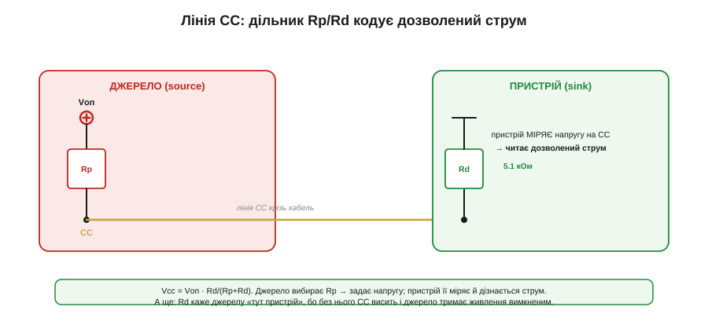
*Рис. 10.3.2.1. Джерело вішає на CC підтяжку Rp (до опорної напруги), пристрій — підтяжку вниз Rd = 5.1 кОм. Виходить дільник, і напруга на CC дорівнює Vоп·Rd/(Rp+Rd). Пристрій міряє цю напругу — і дізнається, скільки струму дозволено. А заразом Rd каже джерелу «тут пристрій»: без нього CC висить, і джерело тримає живлення вимкненим.*

Працює це як звичайний резистивний дільник (згадайте Розділ 1). Джерело (та сторона, що **дає** живлення) вішає на CC резистор **Rp** — підтяжку до відомої опорної напруги. Пристрій (той, що **бере**) вішає **Rd** — підтяжку вниз на землю, стандартного номіналу **5.1 кОм**. Разом вони утворюють дільник, і на лінії CC встановлюється напруга Vоп·Rd/(Rp+Rd). Пристрій просто **міряє** цю напругу своїм входом — і за нею дізнається все потрібне. Жодних команд, тактів чи рукостискань: статичні рівні, які можна прочитати навіть найдешевшим компаратором. У цьому й краса — найпростіший випадок USB-C не вимагає взагалі ніякого розуму.

Варто оцінити, **чому** статичні рівні тут кращі за протокол. Резистор не має програмних збоїв, не «зависає», не плутає таймінги й не потребує живлення, щоб працювати, — він просто є. Тому базове виявлення USB-C відбувається ще **до** того, як процесор пристрою прокинувся: щойло штекер у роз'ємі, дільник готовий, напруга стоїть, і будь-яка схема (хоч АЦП мікроконтролера, хоч копійчаний компаратор) її зчитає. Це робить найпростіший USB-C напрочуд **надійним**: менше деталей — менше того, що ламається. Складна цифрова розмова (PD) знадобиться лише тоді, коли резисторів справді бракне; а для величезної маси дрібних пристроїв уся «розумність» зводиться до двох опорів і вольтметра.

### Три рівні струму: джерело вибирає Rp

Найперше, що кодує ця напруга, — **скільки струму** джерело готове дати. Воно керує цим, вибираючи **значення Rp**.

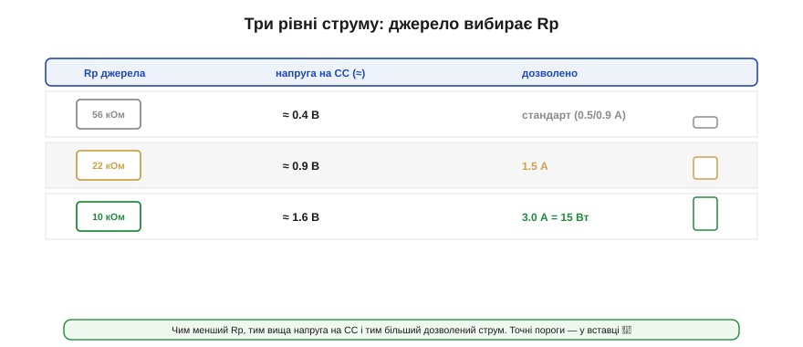
*Рис. 10.3.2.2. Джерело виставляє один із трьох Rp — і тим задає напругу на CC: 56 кОм → ≈0.4 В (стандарт, 0.5/0.9 А), 22 кОм → ≈0.9 В (1.5 А), 10 кОм → ≈1.6 В (3.0 А, тобто 15 Вт). Чим менший Rp, тим вища напруга на CC і тим більший дозволений струм.*

Логіка проста: менший Rp підтягує CC сильніше, отже вища напруга на дільнику — і це сигнал «можна більше». Канонічні три значення: **56 кОм** означає стандартний рівень USB (0.5 чи 0.9 А — як у звичайного порту), **22 кОм** — 1.5 А, **10 кОм** — повні **3 А** (тобто 15 Вт при 5 В). Пристрій, прочитавши напругу на CC, потрапляє в один із трьох діапазонів і **знає свою стелю**: 0.9, 1.5 чи 3 ампери. Він не «просить» — він **читає** те, що джерело вже виставило.

І тут важлива друга половина обов'язку — пристрій мусить цю стелю **поважати**. Прочитати «дозволено 3 А» мало; треба ще й **не перевищити**, бо інакше слабке джерело просяде або вимкнеться. На практиці це означає, що перетворювач за USB-входом (той самий buck чи buck-boost із Розділів 10.1–10.2) проєктують так, щоб його вхідний струм лишався в межах прочитаного рівня, а якщо порт дає лише 0.9 А — пристрій або задовольняється меншою потужністю, або заряджається повільніше. Тобто рівень на CC — це не довідка, а **контракт**: джерело пообіцяло стільки, і пристрій зобов'язаний у це вкластися. Гарний sink на старті дивиться на CC й сам обмежує свій апетит під побачений рівень. Точні граничні напруги для кожного рівня прописані в специфікації; ми зведемо їх у компонентній вставці, а тут важлива сама ідея: один резистор на боці джерела безмовно оголошує дозволений струм.

> 🔌 **Точні номінали — у вставці.** Звідки саме 56 / 22 / 10 кОм, які пороги напруги відповідають кожному рівню струму й як sink їх читає — у компонентній вставці [🔌 Резистори CC](comp-cc-resistors.md).

### Rd робить пристрій пристроєм

Друга річ, яку дає Rd, — **саме виявлення** під'єднання. Поки до порту нічого не ввімкнено, лінія CC «висить» у повітрі, і джерело тримає **VBUS вимкненим** — на роз'ємі немає небезпечних вольтів, поки нема чого живити (елегантна вбудована безпека). Щойно ви втикаєте пристрій, його **Rd = 5.1 кОм** притягує CC донизу, дільник «оживає», напруга падає в робочий діапазон — і джерело розуміє: **під'єднано пристрій**, можна вмикати живлення. Тобто той самий резистор Rd водночас і «дзвонить у двері» (я тут), і визначає роль (я — той, хто бере).

Це робить Rd **критичним**: пристрій без правильного Rd на CC для джерела **не існує** — VBUS просто не з'явиться. Звідси найчастіша помилка новачка з USB-C: зробити пристрій, забути 5.1-кілоомні резистори — і дивуватися, чому «немає 5 вольтів». Немає Rd — немає виявлення — немає живлення.

А «вимкнено, поки нема пристрою» — це не дрібниця, а свідома **безпека роз'єму**. У старому USB-A на контактах завжди стояли 5 вольтів, і відкритий роз'єм можна було закоротити чи замкнути на щось металеве. USB-C тримає VBUS **знеструмленим**, доки CC не побачить пристрій, тож голий роз'єм зарядки безпечний — на ньому просто нема напруги. А коли штекер виймають, зникнення Rd одразу каже джерелу **зняти** VBUS — живлення гасне ще до того, як контакти повністю роз'єдналися, що зменшує іскріння й знос. Та сама пара резисторів, що виявляє під'єднання, отже, керує й безпечним вмиканням-вимиканням живлення на роз'ємі.

### Хто кого живить: ролі

Узагальнімо: **сам резистор задає роль** у парі.

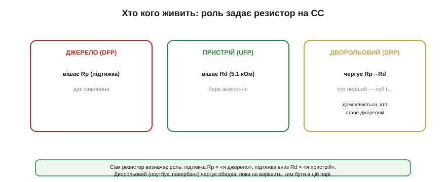
*Рис. 10.3.2.3. Підтяжка Rp = «я джерело» (DFP, дає живлення). Підтяжка вниз Rd = «я пристрій» (UFP, бере). Дворольовий порт (DRP) — ноутбук чи павербанк — почергово виставляє то Rp, то Rd, поки не вирішить, ким бути в цій конкретній парі.*

Той, хто вішає **Rp**, оголошує себе **джерелом** (у термінах USB — *DFP*, downstream-facing port): зарядка, ПК, павербанк-як-джерело. Той, хто вішає **Rd**, — **пристрій** (*UFP*, upstream-facing port): телефон, навушники. А найцікавіше — **дворольові** порти (*DRP*): сучасний ноутбук чи павербанк уміють і давати, і брати, тож вони почергово виставляють то Rp, то Rd, «питаючи» обидві ролі, аж поки інша сторона не відгукнеться, — і тоді пара домовляється, хто цього разу джерело. Саме завдяки цьому той самий USB-C-роз'єм павербанка вранці заряджає телефон, а ввечері сам заряджається від розетки — роль не зашита в залізо, а визначається резистором у кожному під'єднанні.

У дворольового порту зазвичай є й **уподобання**, ким стати за замовчуванням. Телефон налаштований радше **брати** живлення (бо найчастіше його заряджають), але вміє стати й джерелом, коли в нього встромляють, скажімо, флешку чи навушники, — це той самий «OTG», тепер уже без окремого роз'єму, лише грою резисторів на CC. Ноутбук, навпаки, частіше схиляється **давати**. Коли зустрічаються два дворольові пристрої, перемагає те уподобання, що склалося першим у їхньому «перемиганні» Rp↔Rd, — а далі, якщо обидва підтримують PD, вони можуть навіть **поміняти** ролі вже під час роботи (хто заряджає кого) цифровою командою. Тобто резистори вирішують **початкову** роль, а протокол PD — за бажання — дозволяє її потім переграти.

### Орієнтація: два піни CC

Тепер згадаймо, що Type-C **реверсивний** — втикається будь-яким боком. Як же система знає, яким саме? Знову через CC, бо пінів CC насправді **два**.

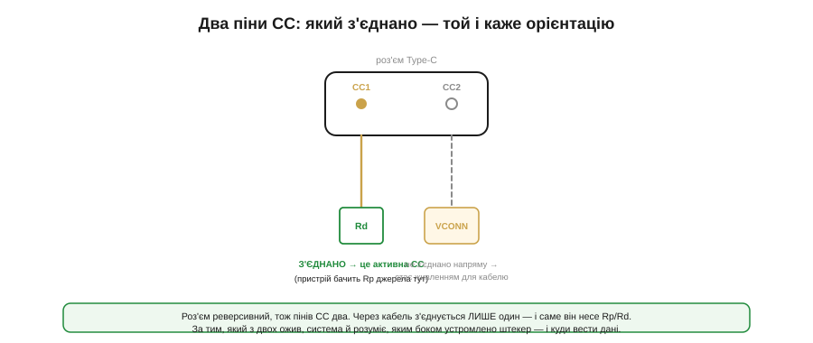
*Рис. 10.3.2.4. У роз'ємі два піни — CC1 і CC2. Кабель усередині штекера з'єднує наскрізь ЛИШЕ один із них, і саме він несе Rp/Rd. За тим, який із двох «ожив» (побачив дільник), система розуміє, яким боком устромлено штекер, — і відповідно скеровує лінії даних. Другий пін стає VCONN.*

У роз'ємі є **CC1** і **CC2**, симетрично з обох боків. Але кабель усередині штекера з'єднує наскрізь **лише один** із них (залежно від того, яким боком ви втикаєте). Тому дільник Rp/Rd «оживає» тільки на тому піні, що реально з'єднаний, а другий лишається осторонь. Система дивиться, **який** із двох CC побачив підтяжку, — і так дізнається **орієнтацію** штекера, а отже, як скерувати реверсивні лінії даних. Реверсивність роз'єму, що так тішить користувача, тримається на цій дрібниці: два піни CC замість одного й перевірка, котрий ожив.

Чому орієнтація взагалі важить, якщо живлення (VBUS і земля) дублюється з обох боків роз'єму й байдуже до повороту? Бо **дані** не дублюються повноцінно: швидкі пари в перевернутому штекері опиняються «не там», і їх треба **перемкнути**. Тому поряд із роз'ємом стоїть крихітний **мультиплексор** даних, який, дізнавшись орієнтацію з CC, скеровує сигнали на правильні контакти. Для нас, людей живлення, висновок простий і заспокійливий: **саме живлення байдуже до повороту** (VBUS і GND симетричні), морочитися з орієнтацією потрібно лише заради даних. Тому найпростіший зарядний пристрій може взагалі не зважати, який CC ожив, — йому досить факту під'єднання й рівня струму.

### VCONN і чип у кабелі

А що ж стається з **другим**, незадіяним піном CC? Він не марнується — він стає **VCONN**: лінією живлення для електроніки **самого кабелю**.

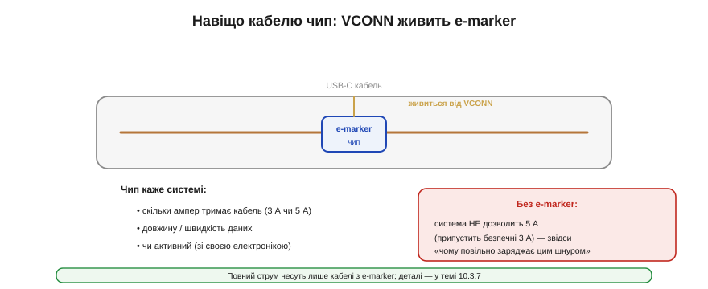
*Рис. 10.3.2.5. Незадіяний пін CC стає VCONN і живить чип усередині кабелю — e-marker. Той «доповідає» системі, скільки ампер кабель тримає (3 чи 5 А), його довжину й швидкість. Без e-marker система не дозволить 5 А (обмежиться 3) — звідси буденне «чому цим шнуром заряджає повільно».*

Ось і відповідь на питання з минулої теми — **чому «розумний» кабель має чип**. Потужні (на 5 А) й активні кабелі містять усередині крихітну мікросхему — **e-marker**, яку живить саме VCONN. Цей чип «доповідає» системі важливе: скільки ампер кабель витримує (3 чи 5 А), яка його довжина й на яку швидкість даних він розрахований. Без e-marker система **не ризикне** пустити 5 ампер — вона свідомо обмежиться безпечними 3, бо не знає спроможності кабелю. Тому повну потужність несуть лише **відповідні** кабелі з чипом, а дешевий шнур без e-marker зарядить повільніше, хоч би які потужні були пристрій і зарядка. Сам e-marker і протокол спілкування з ним ми розберемо в темі 10.3.7; тут досить знати, що другий пін CC годує цей чип.

VCONN живить не лише пасивний e-marker. Довгі чи дуже швидкі кабелі бувають **активними** — зі справжньою електронікою всередині, що підсилює сигнал, аби той не згас на метрах дроту (на високих швидкостях кабель без підсилення «глухне» вже за метр-два). Цю електроніку теж годує VCONN — тобто незадіяний пін CC перетворюється на повноцінну шину живлення для самого кабелю. Звідси й парадокс, що бентежить користувача: «активний» дорогий кабель може **гірше** заряджати простий пристрій чи взагалі не працювати без VCONN, бо без живлення його нутрощі мертві. Більшість зарядних шнурів, на щастя, пасивні й простіші, та знати про активні корисно — інакше «чому цей дорогий кабель не працює» лишиться загадкою.

### Найпростіший sink: рецепт і граблі

Зведімо все в практику. Що треба зробити, щоб ваш пристрій **правильно** брав живлення з USB-C без жодного PD?

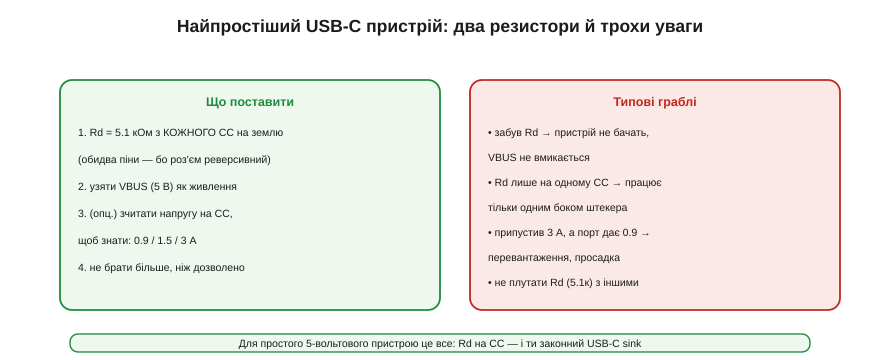
*Рис. 10.3.2.6. Рецепт простого 5-вольтового sink: Rd = 5.1 кОм з кожного CC на землю (обидва піни — бо роз'єм реверсивний), узяти VBUS як живлення, за бажання зчитати напругу на CC, щоб знати дозволений струм, і не брати більше за дозволене. Праворуч — типові граблі.*

Рецепт простий до краю: повісьте **Rd = 5.1 кОм** з **кожного** піна CC на землю (саме з обох — бо роз'єм реверсивний, і ви не знаєте наперед, який оживе), беріть **VBUS** як свої 5 вольтів, і — за бажання — зчитайте напругу на активному CC, щоб дізнатися, 0.9, 1.5 чи 3 ампери вам дозволено. От і все: два резистори роблять вас законним USB-C-пристроєм.

Коли ж самих резисторів **не** досить? Тоді, коли вам треба не 5 вольтів, а більше (9, 12, 20 В для потужнішого вузла) — резистори CC такого не вміють, потрібен PD (наступна тема), а з ним і керівний чип. Існує й зручний проміжний випадок: готові «**тригери**» — мікросхеми, що самі домовляються по PD про фіксовану напругу (скажімо, 12 В) і просто видають її вам, без жодного коду з вашого боку; для пристрою, якому треба стала вища напруга з USB-зарядки, це найпростіший шлях, і ми торкнемося його в наступних темах. Але якщо ваша межа — 5 В і до 3 А, тримайтеся резисторів: це найдешевше, найнадійніше й найменш ризиковане рішення, без жодної електроніки, що могла б зависнути. А типові граблі дзеркальні до кроків: **забув Rd** — пристрій не виявлять і VBUS не з'явиться; **поставив Rd лише на один CC** — пристрій працюватиме тільки одним боком штекера (і ви годинами шукатимете «плаваючий контакт»); **припустив 3 А там, де порт дає 0.9** — перевантажиш джерело й дістанеш просадку. Усі ці помилки — від нехтування простою істиною: у USB-C навіть «нічого не робити» означає **поставити правильні резистори**.

### Підсумок теми

Базовий USB-C — це майстер-клас із того, як **пасивні резистори** замінюють протокол. Лінія **CC** із дільником Rp (на джерелі) і Rd = 5.1 кОм (на пристрої) робить одразу три речі: **виявляє** під'єднання (без Rd джерело не вмикає VBUS), **визначає роль** (Rp = джерело, Rd = пристрій, DRP чергує) і **оголошує дозволений струм** — за значенням Rp (56/22/10 кОм → 0.9/1.5/3 А), яке пристрій просто читає як напругу. Два піни CC дають **орієнтацію** реверсивного роз'єму, а незадіяний пін стає **VCONN**, що живить **e-marker** кабелю — звідси й «розумний» шнур, без якого не буде повних 5 ампер. А зробити простий sink — це лише повісити Rd на обидва CC й не брати більше дозволеного; для величезної маси дрібних 5-вольтових пристроїв цього цілком досить, і це найнадійніший варіант, бо ламатися там майже нічому. Та коли 15 ват замало й треба підняти **напругу** — самих резисторів не вистачить: починається справжня цифрова розмова. Це наступна тема — USB Power Delivery.

---

## 10.3.3 USB Power Delivery: контракти, профілі, PPS

Резистори CC дають 5 вольтів і до 3 ампер — стелю в 15 ват. Коли цього замало (швидка зарядка телефона, живлення ноутбука), вступає **USB Power Delivery** (PD) — повноцінний **протокол** переговорів по тій самій лінії CC. Тут уже не статичні рівні, а справжня **розмова** цифровими повідомленнями: джерело пропонує меню напруг, пристрій вибирає й просить, джерело погоджується й піднімає VBUS. Розберімо цю розмову **якісно** — без бітів і пакетів, на рівні «хто кому що каже», бо саме ця логіка визначає, як спроєктувати пристрій, що бере з USB більше за базові 15 ват.

### Розмова замість резисторів: рукостискання

Серце PD — коротке **рукостискання** з кількох повідомлень, що йдуть по лінії CC одразу після під'єднання. І тут варто оцінити, як ощадливо влаштовано USB-C: та сама лінія **CC** робить **подвійну** роботу. Спершу на ній живуть статичні резистори (Rp/Rd з минулої теми), що виявляють під'єднання й задають базовий струм; а далі, коли потрібні переговори, по тій самій лінії **поверх** цього йдуть цифрові пакети PD (закодовані спеціальним способом, щоб не заважати резисторам). Тобто не довелося додавати окремий дріт під протокол — стандарт «дописав» розмову на вже наявну сигнальну лінію. Тому навіть найскладніша PD-розмова не потребує жодного зайвого контакту в роз'ємі: усе вміщається на CC, яку ми вже знаємо.


*Рис. 10.3.3.1. Після під'єднання (резистори CC) на VBUS — лише 5 В. Тоді джерело шле **Source_Capabilities** (меню профілів), пристрій відповідає **Request** («хочу профіль такий-то»), джерело каже **Accept**, плавно піднімає VBUS до запитаної напруги й завершує **PS_RDY** («готово»). Так укладається **контракт**, який можна переукласти будь-коли.*

Послідовність така. Спершу спрацьовують резистори CC (минула тема): джерело бачить пристрій і подає безпечні **5 вольтів**. Далі джерело надсилає по CC повідомлення **Source_Capabilities** — своє «меню» того, що воно вміє дати. Пристрій вивчає меню й відповідає **Request** — просить конкретний профіль (скажімо, 20 В на 3 А). Джерело відповідає **Accept**, **плавно** піднімає напругу на VBUS до запитаної й завершує повідомленням **PS_RDY** — мовляв, нова напруга стоїть, бери. Від цієї миті діє **контракт** — узгоджена пара «напруга + максимальний струм». Уся ця розмова — це акуратне рукостискання: ніхто не подає високу напругу навмання, усе тільки за явною згодою обох.

Розмова до того ж **надійна за побудовою**. Кожне повідомлення PD підтверджується, а на кожен крок є **таймаут**: не дочекався відповіді — повтори, а зовсім не вийшло домовитися — тихо лишайся на 5 вольтах. Тому PD-пристрій і не-PD-зарядка чудово співіснують: якщо зарядка взагалі не вміє PD, вона просто не відповідає на Source_Capabilities, і пристрій без драми задовольняється базовими 5 В з резисторів CC. Жодного «зависання» чи небезпечного стану: протокол спроєктований так, що **відсутність** згоди завжди означає безпечний мінімум, а не хаос. Ця звичка «не домовився — впади в безпечне» проходить через увесь PD, і саме вона робить його придатним для масового вжитку, де поряд мільярди несумісних пристроїв.

### Меню джерела: профілі PDO

Ключове в цій розмові — те саме «меню», яке джерело пропонує. Кожен його рядок зветься **PDO** (*Power Data Object*) — один профіль живлення.

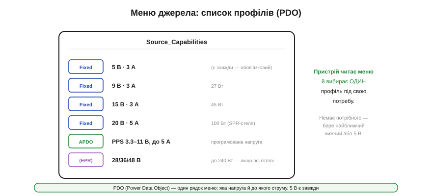
*Рис. 10.3.3.2. Source_Capabilities — це список PDO: кожен каже одну напругу й до якого струму. Типово 5 В/3 А (обов'язковий, є завжди), 9 В/3 А, 15 В/3 А, 20 В/5 А (стеля SPR — 100 Вт). Окремий рядок APDO — це PPS (програмована напруга). Пристрій читає меню й вибирає ОДИН профіль під свою потребу.*

PDO — це просто рядок «така напруга, до такого струму». Джерело виставляє кілька: обов'язковий **5 В** (він є завжди — щоб усе хоч якось працювало), а далі — те, що вміє: 9, 15, 20 вольтів, кожен зі своїм лімітом струму. Пристрій читає це меню й **вибирає один** PDO, що найкраще лягає на його потребу: ноутбуку — 20 В, телефону — 9. Якщо точно потрібного профілю в меню нема, пристрій бере найближчий **нижчий** (краще менше, ніж згоріти) або лишається на 5 В. Тобто джерело не нав'язує напругу — воно **пропонує асортимент**, а вибирає завжди пристрій, бо лише він знає, що йому треба й що він витримає.

Важлива риса цієї моделі — переговори **веде пристрій** (sink), а не джерело. Джерело лише викладає вітрину; рішення «беру оце» завжди за тим, хто споживає. У своєму запиті пристрій каже не лише **який** профіль, а й скільки струму збирається брати (робочий струм у межах ліміту PDO), щоб джерело могло розподілити потужність — адже одна зарядка з кількома портами не безмежна. А ще меню **не висічене в камені**: якщо ситуація змінилася (інший порт зарядки забрав потужність, джерело перегрілося), воно може надіслати **нове** Source_Capabilities, і пристрій мусить перепогодити контракт під новий асортимент. Тому добрий sink не «домовився раз і забув», а готовий, що меню колись зміниться, і вміє ввічливо на це відреагувати.

### Фіксовані профілі проти PPS

Окрім звичайних фіксованих профілів є особливий, найрозумніший — **PPS** (*Programmable Power Supply*). Це не одна напруга, а цілий **діапазон**.

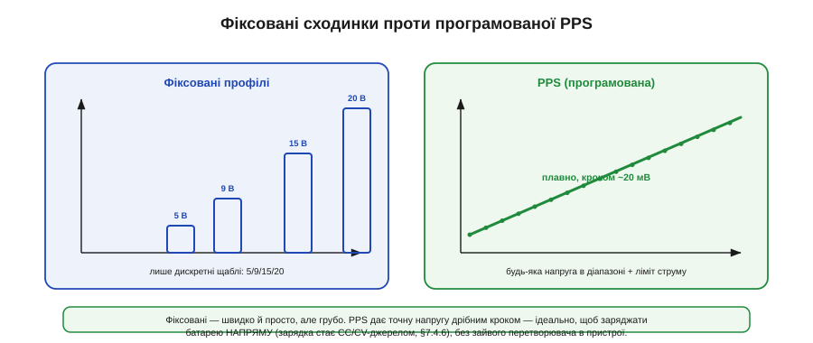
*Рис. 10.3.3.3. Фіксовані профілі дають лише дискретні щаблі (5/9/15/20 В) — швидко, але грубо. PPS пропонує неперервний діапазон, який пристрій підкручує дрібним кроком (~20 мВ), плюс ліміт струму. Це ідеально, щоб заряджати батарею НАПРЯМУ: зарядка сама стає CC/CV-джерелом (§7.4.6), і пристрою не треба великого перетворювача всередині.*

Фіксовані профілі — це грубі сходинки: дають рівно 9 чи 20 вольтів, і все. **PPS** натомість пропонує напругу **в діапазоні** (скажімо, 3.3–11 В) із дрібним кроком близько 20 мВ та керованим **лімітом струму**. Навіщо така точність? Заради **прямої зарядки батареї**. Згадаймо §7.4.6: літій заряджають за профілем CC/CV — спершу сталим струмом, тоді сталою напругою. З PPS цим керує **сама зарядка**: пристрій просить у неї рівно ту напругу й струм, які потрібні батареї **просто зараз**, і зарядка їх видає. Тоді телефонові майже не треба власного потужного перетворювача — він з'єднує PPS-вихід майже напряму з батареєю, а всю роботу CC/CV робить зарядний блок. Менше тепла й втрат у тонкому телефоні, бо потужне перетворення винесене назовні. Це і є технічна суть «розумної швидкої зарядки».

Тонкість PPS у тому, що це режим **з обмеженням струму**: пристрій задає не лише напругу, а й стелю струму, і коли навантаження впирається в неї, джерело само **просідає** напругою, тримаючи струм, — тобто веде себе як справжнє CC/CV-джерело, а не просто «розетка на 9 В». Це й дозволяє перекласти зарядну логіку на блок живлення. Чому ж тоді не всі профілі — PPS? Бо фіксовані **простіші** й їх достатньо для більшості: ноутбуку байдуже до 20 мВ точності, йому потрібні стабільні 20 В, і фіксований профіль дає їх без зайвого клопоту. PPS — спеціалізований інструмент для прямої зарядки, а не заміна всьому; тому реальне джерело пропонує і кілька фіксованих, і (часто) один-два PPS-діапазони поряд.

### Контракт: до згоди — лише 5 В

Уся безпека PD тримається на одному простому правилі, яке варто закарбувати: **поки не укладено контракт, на VBUS лише 5 вольтів**.


*Рис. 10.3.3.4. До контракту джерело тримає безпечні 5 В, хоч би що воно вміло дати. Лише після того, як пристрій явно попросив профіль і джерело погодилося, напруга піднімається до узгодженої (напр. 20 В × 5 А). Це й рятує: висока напруга з'являється тільки за згодою, інакше дешевий 5-вольтовий пристрій згорів би від 20 В.*

Джерело **ніколи** не подає 20 чи 48 вольтів «про всяк випадок». Спершу — завжди безпечні 5, і лише коли пристрій **явно** попросив вищий профіль, а джерело погодилося, напруга піднімається. Уявіть протилежне: ви втикаєте в потужну 100-ватну зарядку дешеву USB-лампочку, розраховану на 5 В, а та подає їй 20 — і лампочка згоряє за мить. Саме щоб цього не сталося, PD починає з 5 В і піднімає напругу **тільки за домовленістю** з тим, хто доведе, що її витримає. А ще контракт **не вічний**: пристрій може будь-коли переукласти його — попросити іншу напругу, коли змінилася потреба (батарея зарядилася, увімкнувся потужний режим). Тобто живлення по PD — це не «виставив і забув», а жива угода, яку сторони перепогоджують стільки разів, скільки треба.

А що, як **щось пішло не так** посеред контракту — збій, помилка зв'язку, дивна поведінка? На цей випадок PD має аварійний хід — **hard reset**: система рвучко скидає напругу назад до безпечних 5 В і починає переговори з нуля. Тобто будь-яка плутанина в розмові завжди має безпечний вихід — повернутися до того самого мінімуму, з якого все починалося. Це робить високовольтний PD не страшнішим за звичайні 5 В: у разі сумніву система не «застрягає» з 20 чи 48 вольтами на виході, а скидає їх. Така архітектура «при будь-якій біді — впади в безпечне» проходить через увесь стандарт і є головною причиною, чому йому довірили десятки ват у руках пересічного користувача.

### EPR: до 240 Вт

Класичний PD (його звуть **SPR** — Standard Power Range) сягає 100 ват (20 В × 5 А). Для ноутбуків цього інколи замало, тож новіша версія PD 3.1 додала **EPR** (*Extended Power Range*) — високовольтні щаблі.


*Рис. 10.3.3.5. EPR додає профілі 28, 36 і 48 вольтів і доводить межу до 240 Вт (48 В × 5 А) — досить навіть потужному ноутбуку. Але вмикається лише тоді, коли EPR підтримують УСІ троє: джерело, пристрій і кабель (з e-marker). Бракує когось — лишаються звичні SPR-щаблі до 100 Вт.*

EPR піднімає напругу аж до **48 вольтів** і так доводить потужність до **240 ват** — рівня, на якому USB-C нарешті годує найненажерливіші ноутбуки (саме цю межу й зафіксувала директива ЄС для ноутбуків, §історія). Та з вищою напругою зростають і вимоги до безпеки, тож EPR вмикається лише за збігу **трьох** умов: EPR має підтримувати **джерело**, **пристрій** і **кабель** (обов'язково з e-marker, бо 48 В на абикому дроті небезпечні). Бракує бодай однієї ланки — система чемно лишається на звичних SPR-профілях до 100 ват. Це знову та сама обережність PD: що вища напруга, то ретельніше система переконується, що **всі** учасники до неї готові.

Чому саме e-marker у кабелі тут **обов'язковий**, а не бажаний, як на 5 амперах? Бо 48 вольтів — це вже напруга, на якій ізоляція, контакти й розведення кабелю мають бути розраховані відповідно, а дешевий 5-вольтовий шнур до такого не призначений. Без чипа, що засвідчить «я витримаю EPR», система просто **не має права** ризикнути: вона не знає, що в кабелі. Тому EPR-кабель завжди «розумний» — він активно заявляє про свою спроможність, а не мовчить, як простий шнур. І ще нюанс: навіть на самих контактах роз'єму EPR вимагає трохи іншої перевірки перед підняттям напруги. Усе це — ціна за те, щоб 240 ват їхали тим самим тонким кабелем безпечно.

### Як дати пристрою PD

Нарешті — практика. Як зробити так, щоб **ваш** пристрій умів цю розмову?


*Рис. 10.3.3.6. Три шляхи. «Тригер»-чип просить ОДНУ фіксовану напругу (напр. 12 В) і просто видає її — без жодного коду (тема 10.3.4). PD-контролер — окремий чип, що веде всі переговори й керується по шині від МК. МК + PD-стек — мікроконтролер сам говорить PD (потрібні PHY і програма), найгнучкіше й найскладніше.*

Є три рівні складності. Найпростіший — **«тригер»** (*PD trigger*): мікросхема, що сама домовляється про **одну** наперед задану напругу (скажімо, 12 чи 20 В) і просто видає її на вихід, без жодного рядка коду з вашого боку. Для пристрою, якому треба стала вища напруга з USB-зарядки, це ідеал простоти; ми розберемо такий чип у наступній темі (10.3.4). Середній шлях — **PD-контролер**: окрема мікросхема веде всі переговори, а ваш мікроконтролер лише командує нею по шині (хочу те, дай це). Найскладніший і найгнучкіший — **МК із PD-стеком**: процесор сам говорить протокол PD, маючи відповідний інтерфейс (PHY) і програму. Вибір залежить від потреби: стала напруга — тригер; складна політика живлення (різні режими, перепогодження, роль джерела) — контролер чи МК.

Варто пам'ятати й те, що PD **двонапрямний**: ваш пристрій може бути не лише тим, хто бере, а й тим, хто **дає**. Власний павербанк, що заряджає телефон по USB-C, — це PD-**джерело**, і реалізують його тими ж засобами, лише з іншого боку розмови: пристрій виставляє меню профілів і відповідає на чужі запити. Для більшості ж проєктів роль скромніша — бути sink'ом, що ввічливо просить потрібну напругу. І тут діє те саме інженерне правило, що скрізь у розділі: **не ускладнюйте без потреби**. Якщо вам досить 5 В — резистори CC (минула тема). Потрібна одна вища напруга — тригер. І лише коли логіка живлення справді складна, беріть контролер чи повний стек. Кожен зайвий рівень розуму — це ще щось, що може зламатися. А саму логіку sink-політики (як читати меню, що просити, як реагувати) ми викладемо машиною станів у ⚙️-вставці цього розділу.

> ⚙️ **Машина станів у вставці.** Покрокова політика sink — capabilities → request → accept, із псевдокодом і реакцією на відмову — у алгоритмічній вставці цього розділу про машину станів PD-sink (далі за чергою).

### Підсумок теми

USB Power Delivery — це **цифрова розмова** по лінії CC, що піднімає живлення понад базові 15 ват. Рукостискання просте: джерело шле **меню профілів** (PDO), пристрій **вибирає й просить** один (Request), джерело **погоджується** (Accept) і піднімає VBUS (PS_RDY) — так укладається **контракт** «напруга + струм». Профілі бувають **фіксовані** (5/9/15/20 В — грубі сходинки) і **PPS** (програмований діапазон дрібним кроком — ідеал для прямої CC/CV-зарядки батареї, §7.4.6). Уся безпека тримається на правилі «**до контракту — лише 5 В**»: висока напруга з'являється тільки за явною згодою того, хто її витримає, а контракт можна переукладати будь-коли. **EPR** додає 28/36/48 В і 240 ват — але лише коли готові всі троє (джерело, пристрій, кабель). А реалізують PD трьома шляхами: «тригер» на одну напругу (без коду), PD-контролер чи МК зі стеком — і не ускладнюють без потреби, бо кожен зайвий рівень розуму додає того, що може зламатися. Уся розмова до того ж тулиться на ту саму лінію CC і за будь-якого збою падає в безпечні 5 В. Тепер, знаючи розмову, перейдімо до її найпростішого втілення в залізі — sink-контролера, що домовляється про потрібну напругу майже без участі процесора.

## 10.3.4 PD у власному пристрої: sink-контролер чи МК

Уявімо, що ми спроєктували пристрій, якому потрібні стабільні 12 вольтів — скажімо, на якийсь рушій чи вузол із вищою напругою живлення. Поряд лежить сучасна USB-C-зарядка, яка **вміє** видати 12 В. Здавалося б, з'єднай — і готово. Та якщо просто увіткнути штекер, на VBUS буде рівно 5 В, і ні вольтом більше: зарядка тримає безпечну напругу, доки хтось її явно не **попросить** змінити. Попросити має наш пристрій. Минула тема показала саму **розмову** — як влаштоване рукостискання PD. Ця тема про інше, суто інженерне питання: **хто саме** в нашому залізі цю розмову веде, наскільки складним має бути той «хтось» — і що робити, коли у відповідь на прохання ми чуємо «ні».

Чесне формулювання задачі звучить не як «розберімося в PD», а як «**скільки якнайменше** треба побудувати, щоб надійно дістати свої вольти — і як поводитися, коли зарядка відмовила». Бо відмова — то не виняток, а штатна ситуація: пристрій носять від зарядки до зарядки, і далеко не кожна з них має саме потрібний профіль. Тому правильний sink (*приймач*, той бік, що бере живлення) — це не той, що «вміє попросити 12 В», а той, що наперед **передбачив, що 12 В може й не дати**, і не зламався від цього. Усе в цій темі крутиться навколо двох речей: як з найменшими зусиллями попросити потрібну напругу — і як гідно пережити відмову.

### Три шляхи дати пристрою PD

У минулій темі ми назвали три рівні складності; тепер подивімося на них як на **архітектурне рішення** — де саме в платі сидить «переговорник» і яким шляхом узгоджена напруга доходить до навантаження. Це і є та розвилка, що винесена в назву теми: робити sink на автономному чипі — чи доручати переговори мікроконтролеру (МК).

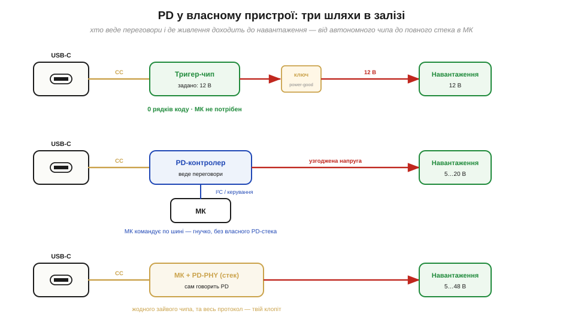
*Рис. 10.3.4.1. Три архітектури PD-приймача. Зверху — **тригер**: автономний чип сам веде всю розмову по CC й через ключ (по сигналу power-good) подає на навантаження одну задану напругу; МК взагалі не потрібен. Посередині — **PD-контролер**: окрема мікросхема веде переговори, а МК лише командує нею по шині (напр. I²C). Знизу — **МК зі стеком**: сам мікроконтролер говорить PD через вбудований інтерфейс (PHY). У всіх трьох узгоджена напруга з'являється на VBUS — різниця лише в тому, хто тримає розмову й скільки свободи лишається в реальному часі.*

Спільне в усіх трьох — найважливіше, і його легко проґавити. Хоч би хто вів переговори, **результат однаковий**: на VBUS з'являється узгоджена напруга, а доти там безпечні 5 В. Відрізняються вони не «силою», а **гнучкістю**: тригер ухвалює одне рішення раз і назавжди, контролер дає МК свободу командувати, повний стек віддає МК усе. Звідси й практичне правило вибору: брати **найпростіший** із трьох, що ще покриває потребу, — бо кожен наступний рівень додає коду, чипів і способів помилитися. Спершу розберемо найпростіший шлях до кінця, а тоді піднімемося складнішими — рівно настільки, наскільки це справді потрібно.

### Тригер: PD без жодного рядка коду

Найприємніше відкриття для розробника таке: щоб дістати з PD-зарядки сталу вищу напругу, **процесор зовсім не обов'язковий**. Існує клас мікросхем — їх називають PD-**тригерами** (*PD trigger*) або sink-контролерами, — які несуть усю розмову PD в апаратному вигляді, усередині себе. Ви один раз кажете чипу, яку напругу просити, — і більше нічого не програмуєте.

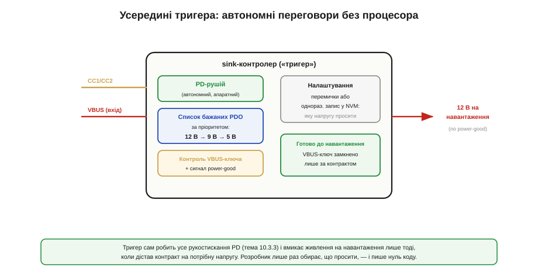
*Рис. 10.3.4.2. Що всередині тригера. Зліва входять лінії CC1/CC2 і VBUS. Усередині — апаратний **PD-рушій**, який сам робить рукостискання; **список бажаних PDO за пріоритетом** (напр. 12 В → запасні 9 В → 5 В), заданий перемичками чи одноразовим записом у незалежну пам'ять (NVM); і **контроль VBUS-ключа** з сигналом power-good. Праворуч чип замикає ключ і пускає узгоджену напругу на навантаження — але лише після того, як дістав контракт. Розробник раз обирає, що просити, і пише нуль коду.*

Працює це так. На під'єднанні чип чесно проходить усю послідовність із 10.3.3 — виставляє свій Rd, бачить меню `Source_Capabilities`, шле `Request` на запрограмований профіль, чекає `Accept` і `PS_RDY`. Коли контракт укладено й на VBUS піднялася потрібна напруга, тригер **замикає вихідний ключ** (часто це зовнішній MOSFET, яким він керує) — і аж тепер живлення доходить до решти плати. Доти навантаження від'єднане й «бачить» хіба що ті стартові 5 В, та й ті часто притримані. Уся ваша робота — підтягнути кілька конфігураційних ніжок до потрібного коду або один раз залити в NVM таблицю бажаних напруг. Жодної прошивки, жодного протокольного стека, жодного налагодження тимчасових діаграм.

> 🔌 **Конкретне залізо — у вставці.** Розбір тригера на рівні ніжок і обв'язки — який код відповідає 9/12/15/20 В, як вішати ключ навантаження й читати power-good — винесено в компонентну вставку цього розділу про PD-sink-тригери (далі за чергою). Там і канонічне сімейство таких чипів, і типова схема «контракт без жодного рядка коду».

Геніальність тригера — водночас і його межа. Він **детермінований і непробивний** там, де треба «дай мені стабільні X вольтів і не думай»: нема прошивки — нема й програмних багів, нема станів, що зависають. Але це **одне рішення, ухвалене раз**: тригер не вміє ні передумати, ні відреагувати на нагрівання чи рівень заряду, ні попросити плавну PPS, щоб живити батарею напряму. Він просить **фіксований** профіль — і все. Саме тому назва теми ставить його в пару з «чи МК»: щойно потрібна не стала напруга, а **політика**, простого тригера вже замало.

### Коли контракту не дали

Це серцевина теми — і те, про що найлегше забути на щасливому шляху, коли все працює. Контракту на потрібну напругу може **не бути** з купи буденних причин. Зарядка виявилася звичайним 5-вольтовим блоком без PD взагалі. Або це PD-джерело, але дешеве, і в його меню просто **нема** ваших 12 В (типова «дев'ятивольтова» зарядка до телефона дає 5 і 9 — і крапка). Або потрібний профіль є, але джерело **слабке** й не тягне ваш струм. Або кабель не той — без e-marker, тож понад 3 А чи EPR-напругу система не пустить. У будь-якому з цих випадків відповідь на ваше прохання — «ні».

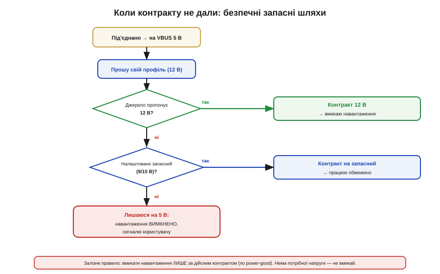
*Рис. 10.3.4.3. Дерево безпечних відкатів. Просимо свій профіль (12 В). Дало джерело — контракт, вмикаємо навантаження. Не дало — пробуємо **запасний** профіль зі списку (9 чи 15 В) і працюємо обмежено. Нема й того — **лишаємося на 5 В, навантаження не вмикаємо взагалі** й сигналимо користувачу. Залізне правило внизу: живлення на навантаження подавати ЛИШЕ за дійсним контрактом — по сигналу power-good.*

Гідна відповідь на «ні» складається з чотирьох звичок. Перша — тримати **список запасних профілів** за спаданням, а не один-єдиний: не дали 12 — спробуй 9, не дали 9 — лишається 5. Друга, найголовніша, — **не вмикати навантаження, доки контракт не дійсний**: між роз'ємом і рештою плати має стояти ключ, що замикається лише по power-good. Третя — **повідомити людину**: блимнути світлодіодом «потрібна 12-вольтова PD-зарядка», бо мовчазний мертвий пристрій гірший за пристрій, що пояснює, чого йому бракує. Четверта — там, де доречно, **деградувати плавно**: якщо на урізаній напрузі частина функцій усе ж можлива, працювати урізано, а не падати в нуль.

Є й окремий, підступніший випадок — коли джерело **дало** потрібну напругу, але **меншим струмом**, ніж ви розраховували. Контракт-бо це не лише вольти, а й стеля ампер: попросили 12 В / 3 А, а слабенька зарядка погодилась тільки на 12 В / 1.5 А. Перевищите цю стелю — і джерело або просадить напругу, або взагалі скине контракт у захист, і ви провалитеся назад у 5 В саме в найгірший момент. Тому розважливий sink читає не лише напругу, а й **узгоджений максимальний струм**, і сам себе обмежує: бере рівно стільки, скільки дозволив контракт, навіть якщо схема апетитом здатна й на більше. «Контракту не дали» — це, виявляється, не тільки про напругу, якої нема, а й про потужність, якої менше, ніж хотілось.

> 🔧 **Навіщо це.** Наївний пристрій «припускає», що 12 В будуть, і веде навантаження прямо від VBUS. У найкращому разі він просто мертвий на 5-вольтовому блоці; у найгіршому — тригер ще домовляється про 12, а навантаження вже тягне струм зі стартових 5 В і просідає в перехідний момент, ловлячи brownout саме тоді, коли напруга стрибає. Дисциплінований пристрій натомість трактує «контракту нема» як **повноцінний робочий стан**, а не як прикру помилку, яку можна знехтувати. Різниця між цими двома — це різниця між «іноді не вмикається» й «працює завжди, а коли не може — чесно про це каже».

### Приймати, що дали: широкий вхід замість точної вимоги

Є архітектурний прийом, що робить пристрій майже нечутливим до того, яку напругу дала зарядка. Замість вимагати **рівно** 12 В поставте одразу після VBUS **широковхідний перетворювач** — buck-boost, що приймає, скажімо, 5–20 В і робить із них рівні 12 В (його ми розбирали в темі 10.1.4). Тоді **будь-який** профіль, який вдалося узгодити, — навіть голі 5 В — дає вам потрібну шину; вища PD-напруга означає лише більше доступної потужності, а не «працює / не працює».

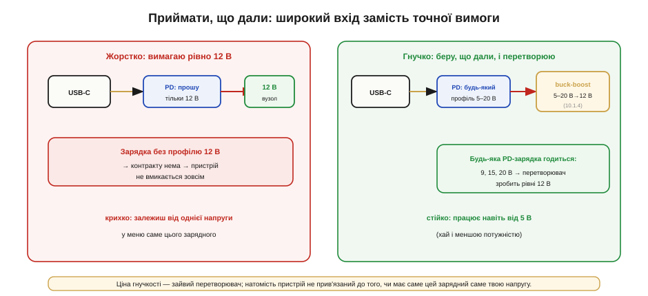
*Рис. 10.3.4.4. Дві архітектури. Ліворуч — **жорстка**: навантаження висить просто на VBUS і потребує саме 12 В; нема в меню зарядки 12 В — пристрій не вмикається зовсім. Праворуч — **гнучка**: просимо будь-який профіль 5–20 В, а широковхідний buck-boost робить із нього рівні 12 В. Така схема працює навіть від простого 5-вольтового блока (хай і меншою потужністю). Ціна гнучкості — зайвий перетворювач; натомість пристрій більше не прив'язаний до того, чи має саме ця зарядка саме твою напругу.*

Прийом цей розв'язує дві речі, що раніше були сплетені: **«що дала зарядка»** і **«що треба моїй схемі»**. Тригер чи контролер тоді ловлять найвигідніший профіль, а перетворювач згладжує різницю. Платимо за це ефективністю й місцем на платі — зайвий вузол гріється й коштує, — але виграємо стійкість: пристрій оживає від чого завгодно. Часто це поєднують із тригером: тригер тягне напругу якомога вищу (щоб струм по кабелю був меншим), а buck-boost доводить її до робочої. Подивімося на числах, що це дає.

**Приклад (12-вольтовий пристрій на трьох різних зарядках).** Пристрій бере 12 В × 2 А = 24 Вт. Перевіримо три типові джерела — для гнучкої схеми з широким входом (ККД η ≈ 0.90) і для жорсткої схеми без нього.

```
Пристрій: 12 В × 2 А = 24 Вт;  широкий вхід η ≈ 0.90
На вході треба:  Pвх = 24 / 0.90 ≈ 26.7 Вт

Зарядка A — 5 В / 3 А, без PD:     Pmax = 5 × 3 = 15 Вт  < 26.7 Вт
   жорстка:  контракту на 12 В нема  → навантаження НЕ вмикаємо
   гнучка:   12 В є, та лише ~13–14 Вт → працюємо на ~1 А (урізано, але живий)

Зарядка B — PD 5/9 В, 9 В / 3 А:   просимо 12 В → нема → запасні 9 В
   Iвх = 26.7 / 9 ≈ 2.97 А          (упритул до межі 3 А)
   гнучка:   9 В → 12 В × 2 А = повні 24 Вт   ✓
   жорстка:  на навантаженні треба 12, є 9 → недобір, не працює як слід

Зарядка C — PD 12 В / 3 А:         просимо 12 В → дають
   жорстка:  12 В × 2 А = 24 Вт прямо, без втрат на перетворювачі  ✓
   гнучка:   те саме; Iвх = 24 / 12 = 2.0 А
```

Висновок промовистий: широкий вхід перетворює «A мертва, B недогодована» на «C — повні ватти, B — повні ватти, A — живий, хай і на третині сили». Помітьте й побічний урок: та сама потужність із вищої напруги йде **меншим струмом** (24 Вт — це 2.97 А від 9 В, але лише 1.33 А від 20 В), а менший струм — це менше падіння на кабелі (тема 10.3.1, §1.3) і менший нагрів. Тому, коли є вибір, вигідно просити напругу **вищу**, а вже на платі зводити її до робочої.

### Коли потрібен розум: МК і PD-контролер

Тригера досить, поки напруга **стала**. Та щойно рішення про живлення має залежати від обставин — у гру входить мікроконтролер. У середньому варіанті переговори веде окремий **PD-контролер**, а МК командує ним по шині: «прочитай меню», «попроси цей профіль», «перейди на той». У найскладнішому — МК сам говорить PD через вбудований інтерфейс і програмний стек. У будь-якому з них з'являється те, чого тригер не вміє в принципі: **вибір і перевибір у реальному часі**.

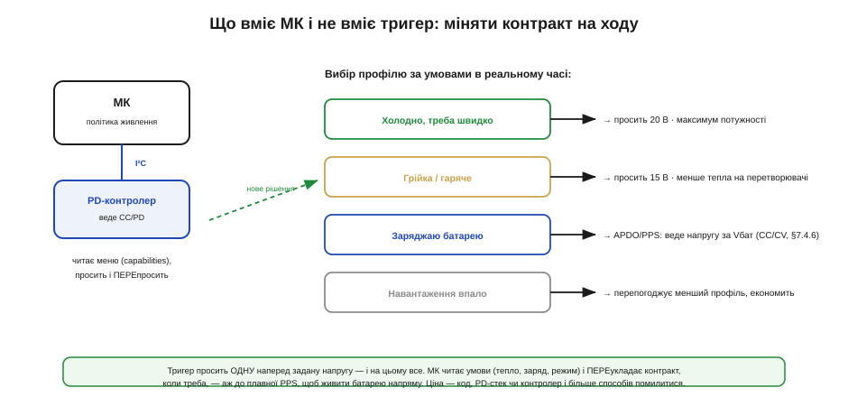
*Рис. 10.3.4.5. Що дає розум. МК читає меню профілів через контролер (I²C) і вибирає напругу за умовами: холодно й треба швидко — просить 20 В і максимум потужності; гаряче — переходить на 15 В, щоб менше гріти перетворювач; заряджає батарею — бере APDO/PPS і веде напругу за станом комірки (CC/CV, §7.4.6); навантаження впало — перепогоджує менший профіль і економить. Тригер натомість просить одну задану напругу — і на цьому все.*

Найяскравіший приклад «розуму» — пряма зарядка батареї. Замість фіксованого профілю МК бере **PPS** і веде вихідну напругу зарядки крок за кроком за напругою комірки, перетворюючи саме джерело на CC/CV-зарядник (теми §7.4.6) і прибираючи зайвий перетворювач у пристрої. Так само МК може **знижувати** напругу, коли вузол перегрівся, або переукладати дрібніший контракт, коли споживання впало. Усе це — динаміка, яку фіксований тригер не подужає.

> ⚙️ **Машина станів — у вставці.** Покрокову політику sink — як читати `capabilities`, що й коли просити, як реагувати на відмову й перепогодження — викладено псевдокодом в алгоритмічній вставці цього розділу про машину станів PD-sink (далі за чергою). Там видно, що навіть «розумний» шлях зобов'язаний реалізувати той самий безпечний відкат «нема контракту → 5 В, навантаження вимкнене» — тільки тепер у коді.

Платимо за гнучкість сповна: прошивка, PD-стек чи окремий чип, тестування часових діаграм і станів — і кожен із них додає способів зламатися. Тому розум беруть **не тому, що можна**, а тому, що задача без нього не розв'язується: змінні режими, пряма зарядка, роль джерела. Якщо ж усе, що треба, — це стала напруга, повертаємося на крок назад, до тригера.

### Що обрати: тригер, контролер чи МК

Зведемо вибір в одне просте дерево рішень — і в два правила, що діють незалежно від обраного шляху.

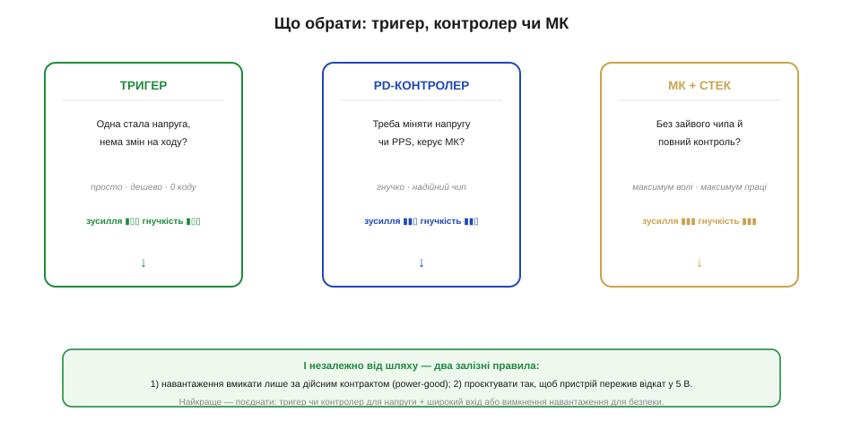
*Рис. 10.3.4.6. Карта вибору. Потрібна одна стала напруга без змін на ходу — **тригер** (просто, дешево, нуль коду). Треба міняти напругу чи вести PPS під керуванням МК — **PD-контролер** (гнучко, надійний чип бере протокол на себе). Хочеш без зайвого чипа й повний контроль — **МК зі стеком** (максимум волі ціною максимуму праці). Унизу — два залізні правила: вмикати навантаження лише за дійсним контрактом (power-good) і проєктувати так, щоб пристрій пережив відкат у 5 В.*

Два правила варті того, щоб їх повторити, бо вони не залежать від рівня складності. Перше: **навантаження вмикається тільки за дійсним контрактом** — між роз'ємом і рештою плати завжди стоїть ключ по power-good, хоч на тригері, хоч у коді МК. Друге: **пристрій має пережити 5 В** — якщо потрібний профіль не дали, він або працює урізано, або чесно мовчить, але не згоряє й не зависає. Найнадійніші пристрої поєднують ці думки: тригер чи контролер тягне напругу, широкий вхід або вимкнення навантаження стереже безпеку.

І остання, наскрізна для всього розділу думка: **не додавайте розуму понад потребу**. Тригер простіший за контролер, контролер — за повний стек, і та сторона, що менше «думає», менше й ламається. Беріть найменш здатний варіант, який ще покриває задачу: це не економія заради економії, а пряме зменшення кількості того, що може піти не так у руках користувача з випадковою зарядкою.

### Підсумок теми

Дістати з PD-зарядки потрібну напругу можна трьома шляхами, і вони відрізняються не силою, а **гнучкістю**: автономний **тригер** просить одну задану напругу без жодного коду; **PD-контролер** під керуванням МК дає вибір і перевибір профілю; **МК зі стеком** віддає процесору весь протокол. У всіх трьох узгоджена напруга з'являється на VBUS, тож наскрізне правило одне — **навантаження вмикати лише за дійсним контрактом**, по сигналу power-good. Не менш важливо передбачити **відмову**: контракту на потрібний профіль може й не бути, тому тримаємо список запасних напруг, за потреби ставимо **широковхідний перетворювач** (тоді годиться будь-який профіль, аж до голих 5 В) і чесно сигналимо, коли живлення замало. А вибір рівня складності підкоряється тому ж правилу, що й увесь розділ: брати найпростіше, що працює, бо кожен зайвий рівень розуму — це ще щось, що здатне зламатися. Розібравшись із сучасним PD, повернімося до того, як живляться **старі** пристрої та порти, які PD не знають зовсім, — до легасі-зарядки й кодування по лініях даних.

## 10.3.5 Легасі-зарядка: BC1.2 і кодування D+/D−

Перш ніж CC-резистори й Power Delivery навели лад, заряджання по USB було царством здогадок. Уявімо пристрій років п'ятнадцять тому: телефон, що його однаково вмикають і в USB-порт комп'ютера, і в маленький блок у розетку. Роз'єм той самий — micro-USB, — а от **скільки струму можна взяти**, пристрій наперед не знає. Сама шина USB 2.0 тут не помічник: за її правилами пристрій має право лише на **100 мА**, доки не «відрекомендується» хостові й не випросить більше (зазвичай 500 мА). Але в зарядному блоці хоста нема — нема кому рекомендуватися. Виходить глухий кут: пристрій або несміливо бере мізерні 100–500 мА навіть від потужного блока (і заряджається пів дня), або нахабно тягне більше — і ризикує просадити чи перегріти дешеву зарядку.

Цю прогалину закрив окремий стандарт — **USB Battery Charging**, у зрілій версії **BC1.2** (узгоджений у консорціумі USB-IF близько 2010 року). Його ідея проста й елегантна: дати пристрою спосіб **самому впізнати тип порту** за тими ж двома лініями даних D+/D−, навіть коли по них ніхто не «розмовляє». Ця тема — про те, як саме влаштоване це впізнавання, чому світ до BC1.2 був зоопарком несумісних «фірмових» кодувань і чому через них старий пристрій часто не бере повний струм із нового зарядного — і навпаки.

### Чому «тупий» блок — це проблема

Щоб відчути задачу, протиставмо два джерела, у які встромляють той самий штекер. Перше — **хост-порт** комп'ютера: за ним стоїть процесор, і пристрій із ним **домовляється**. Лінії D+/D− тут несуть дані; під час так званої енумерації (*enumeration* — коли хост опитує щойно під'єднаний пристрій) узгоджується і дозволений струм: 500 мА для USB 2.0, 900 мА для USB 3.0. Усе чесно: є з ким говорити — беремо рівно те, що дозволили.

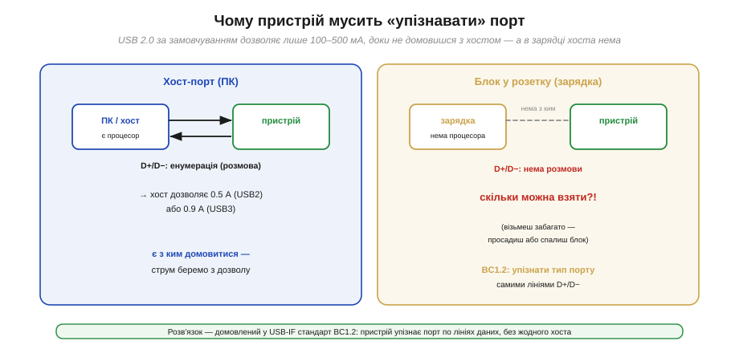
*Рис. 10.3.5.1. Ліворуч — хост-порт: пристрій енумерується по D+/D− і бере дозволений хостом струм (0.5/0.9 А). Праворуч — блок у розетку: процесора нема, говорити нема з ким, а USB 2.0 за замовчуванням дозволяє лише 100–500 мА. Звідси й задача: упізнати тип порту самими лініями D+/D−, без хоста. Це й робить стандарт BC1.2.*

Друге джерело — **виділений зарядний блок**. У ньому жодного процесора: це по суті перетворювач 230 В → 5 В з роз'ємом. Сказати пристрою «можеш брати 1.5 А» нікому. Якщо пристрій тупо дотримає букви USB 2.0, він візьме копійчані 500 мА й заряджатиметься годинами, хоча блок спокійно дав би втричі більше. Якщо ж пристрій навмання потягне півтора ампера з блока, не розрахованого на стільки, напруга просяде, блок перегріється, а в гіршому разі — вимкнеться в захист. Потрібен якийсь **сигнал без слів**: спосіб, яким навіть безмозкий блок повідомив би «я зарядка, з мене можна брати багато», а пристрій цей сигнал прочитав би. Саме таким безсловесним сигналом і став стан ліній D+/D−.

### Три типи портів: SDP, CDP, DCP

BC1.2 ділить усі порти на три види — і весь подальший фокус у тому, щоб пристрій умів їх розрізнити. Назви варто запам'ятати, бо вони раз у раз трапляються в даташитах зарядних чипів.

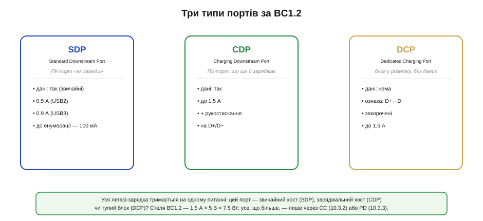
*Рис. 10.3.5.2. SDP (Standard Downstream Port) — звичайний хост-порт: дані як завжди, струм 0.5/0.9 А після енумерації. CDP (Charging Downstream Port) — хост-порт, що ще й заряджає: дані працюють, але дозволено до 1.5 А, і це підтверджується рукостисканням на D+/D−. DCP (Dedicated Charging Port) — тупий блок без даних: упізнається за закороченими наскрізь D+ і D−, дає до 1.5 А.*

**SDP** (*Standard Downstream Port*) — це знайомий порт комп'ютера «як завжди». Лінії даних несуть дані, струм скромний: до енумерації 100 мА, після неї 500 (USB 2.0) чи 900 мА (USB 3.0). **CDP** (*Charging Downstream Port*) — теж порт комп'ютера, але посилений: він і дані возить, і заряджає струмом аж до 1.5 А. Щоб пристрій повірив, що це справді CDP, а не звичайний SDP, порт проходить коротке рукостискання на D+/D−. **DCP** (*Dedicated Charging Port*) — це наш блок у розетку: даних нема взагалі, а ознака, що це зарядка, гранично проста — лінії D+ і D− **замкнені** одна на одну. DCP теж дозволяє до 1.5 А.

> 🔧 **Навіщо це.** Ці три літери — SDP/CDP/DCP — це словник, яким говорять зарядні мікросхеми. Коли в даташиті чипа-зарядника написано «автоматичне визначення SDP/CDP/DCP», це означає рівно одне: чип сам зробить усе нижчеописане впізнавання й виставить пристрою максимальний безпечний струм, не питаючи у вашого процесора жодного слова. Знати ці типи треба, щоб правильно вибрати такий чип і зрозуміти, чому від одного порту пристрій бере 1.5 А, а від іншого — лише 0.5.

Помітьте стелю всього цього світу: 1.5 А при 5 В — це 7.5 ват, не більше. BC1.2 свідомо лишається в межах безпечних п'яти вольтів і помірного струму. Усе, що потужніше, — це вже інша ліга: резистори CC дають 15 ват (тема 10.3.2), а Power Delivery — аж до 240 (теми 10.3.3–4). Легасі-зарядка — це саме про те, як вичавити максимум **у старому 5-вольтовому світі**.

### Підпис зарядки: D+ замкнено на D−

Найгеніальніше в BC1.2 — те, як виявляють «тупий» DCP. Здавалося б, як безмозкий блок може щось «сказати»? А він і не каже — він просто **замикає** дві лінії даних між собою через малесенький опір (стандарт дозволяє до 200 Ом). Це і є весь його «підпис»: D+ з'єднано з D−.

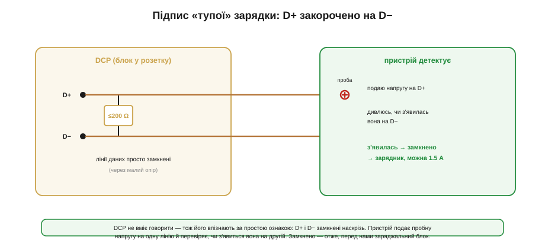
*Рис. 10.3.5.3. У DCP лінії D+ і D− замкнені наскрізь через малий опір (≤200 Ом). Пристрій робить пробу: подає невелику напругу на D+ і дивиться, чи з'явиться вона на D−. З'явилася — значить, лінії замкнені, перед нами зарядний блок, і можна сміливо брати до 1.5 А. Так пристрій «чує» те, чого блок не вміє сказати словами.*

Виявлення з боку пристрою — дзеркальне до цього підпису. Пристрій подає на одну лінію (D+) невелику пробну напругу й вимірює, що робиться на іншій (D−). Якщо лінії замкнені, як у DCP, напруга «перетече» й з'явиться на D−; якщо ні — D− лишиться біля нуля. За цією простою пробою пристрій і робить висновок: бачу перетікання — це зарядний порт, не бачу — це звичайний SDP, з якого без енумерації можна лише крихту. Жодного протоколу, жодних бітів — сама фізика замкнених чи розімкнених ліній. У цьому й краса: щоб тебе впізнали як зарядку, достатньо припаяти всередині блока одну перемичку між D+ і D−.

А як тоді відрізнити тупий DCP від розумного CDP, якщо «зарядними портами» при пробі виглядають обидва? Різниця — у **характері** відповіді. DCP замикає лінії пасивно, наче шматок дроту, тож пробу пристрою він лише німо «віддзеркалює». CDP натомість має всередині **активну** схему, що відповідає на пробу вживу — сама подає на лінію напругу в потрібну мить, а не повертає пасивне відлуння замкнутого дроту. Пристрій помічає цю різницю в поведінці й розуміє, з ким має справу: з мовчазним блоком, що вміє лише живити, чи з повноцінним портом комп'ютера, який і струм дасть, і дані пильнуватиме. Саме тому CDP трохи «дорожчий» за DCP — у ньому є та невеличка активна електроніка, якої тупому блоку не треба.

### Кроки розпізнавання

Повне впізнавання BC1.2 — це коротка послідовність із двох перевірок, які пристрій робить одразу після того, як з'явилася VBUS. Логіка та сама, що й у житті: спершу з'ясувати «це взагалі зарядка?», а тоді вже «зарядка розумна чи тупа?».

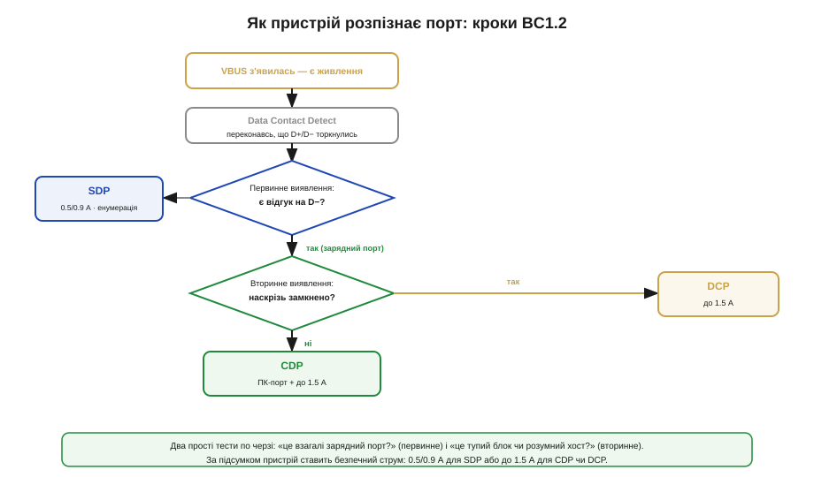
*Рис. 10.3.5.4. Послідовність BC1.2. Після появи VBUS пристрій переконується, що лінії торкнулись (Data Contact Detect), і робить первинне виявлення — «є відгук на D−?». Нема відгуку — це SDP (0.5/0.9 А, треба енумерація). Є — порт заряджальний, і йде вторинне виявлення: «лінії замкнені наскрізь?». Так — це DCP; ні — це CDP. За підсумком пристрій ставить безпечний струм.*

Спершу — **первинне виявлення** (*primary detection*): тією самою пробою на D+/D− пристрій питає «чи це взагалі зарядний порт?». Якщо відгуку нема, перед ним звичайний SDP — і далі все за класикою USB: хочеш більше за 100 мА, проходь енумерацію в хоста. Якщо ж відгук є, порт заряджальний, і лишається уточнити, який саме. Це робить **вторинне виявлення** (*secondary detection*): воно розрізняє наскрізь замкнений DCP і «розумніший» CDP, який відповідає на пробу інакше. Підсумок завжди один — пристрій виставляє собі **безпечний струм**: 0.5/0.9 А для SDP або до 1.5 А для CDP чи DCP. Уся ця процедура займає мілісекунди й відбувається до того, як почнеться власне заряджання, — тож користувач її навіть не помічає.

Варто розуміти й те, що діється з живленням під час цих мілісекунд. VBUS з'являється **першою**, ще до будь-якого висновку, тож поки детекція триває, пристрій зобов'язаний поводитися скромно — тримати **вхідний обмежувач струму** (*input current limit*) зарядного чипа на найнижчому, гарантовано безпечному рівні. І лише коли тип порту визначено, чип **піднімає** цю межу до дозволеної — 0.9 чи 1.5 ампера. Через те грамотний зарядний вузол ніколи не «кидається» на повний струм у першу ж мить під'єднання: він спершу слухає, а вже потім бере. Порушити цей порядок — означає ризикнути просадити слабке джерело саме тоді, коли про нього ще нічого не відомо, а просадка VBUS під час старту здатна збити з пантелику й сам процес детекції. Тому послідовність «живлення є → визнач тип → лише потім підніми струм» — не формальність, а той самий принцип обережності, що проходить крізь увесь розділ.

> 🔧 **Навіщо це.** На практиці цю послідовність за вас виконує зарядний чип або PMIC (мікросхема керування живленням) — від вашого процесора потрібно хіба що іноді прочитати по шині, який тип порту визначено. Але розуміти кроки варто: коли пристрій уперто бере лише 0.5 А від явно потужного блока, це майже завжди означає, що детекція **не вдалася** — порт не впізнано як заряджальний, і чип з обережності лишився на найнижчому струмі. Знаючи, де саме ламається ланцюжок, легше зрозуміти, що чинити (часто річ у кабелі без потрібних ліній або в несумісному кодуванні — про це далі).

### Фірмові коди й чому «не заряджає»

BC1.2 з'явився не на порожньому місці й не миттєво став єдиним. До нього — і деякий час паралельно з ним — великі виробники мали **власні** способи сказати «з мене можна брати багато». Замість простого замикання ліній вони тримали на D+ і D− певні **фіксовані напруги**, і вже за комбінацією цих напруг пристрій розумів дозволений струм.

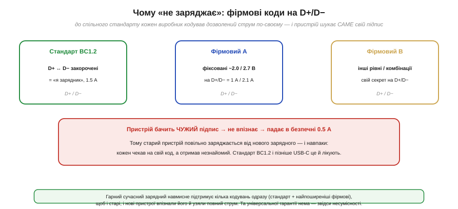
*Рис. 10.3.5.5. Три способи закодувати дозволений струм на D+/D−. Стандарт BC1.2 — просто замкнути лінії. Фірмові схеми — тримати на лініях певні напруги (наприклад, близько 2.0 і 2.7 В у різних комбінаціях кодували 1 А чи 2.1 А). Біда в тому, що пристрій шукає САМЕ свій підпис: побачивши чужий, він не впізнає зарядку й відкочується в безпечні 0.5 А. Звідси й буденне «новим зарядним заряджає повільно».*

Тут і ховається відповідь на головне питання теми: **чому старий пристрій не бере повний струм із нового порту — і навпаки**. Кожен пристрій навчений шукати **свій** підпис. Старий телефон чекає, скажімо, фірмових напруг свого виробника; новий зарядний натомість виставляє стандартний BC1.2-підпис (замкнені лінії) або чужу фірмову схему. Підписи не збіглися — пристрій не впізнав зарядку й, щоб не нашкодити, обмежився жалюгідними 0.5 А. Дзеркально й навпаки: новий пристрій, який чекає замкнених ліній BC1.2, на старому фірмовому блоці бачить незнайомі напруги й теж відкочується в мінімум. Зарядка справна, кабель цілий, струму блок дав би вдосталь — а заряджання повзе, бо дві сторони говорять різними «діалектами» одного коду.

**Приклад (та сама батарея, різні порти).** Візьмемо батарею 3000 мА·год і грубо оцінимо час заряду як «ємність / струм» (без урахування фінальної фази CC/CV, §7.4.6).

```
Батарея 3000 мА·год;  час ≈ ємність / струм

Пристрій БЕЗ детекції (бере типові 0.5 А звідусіль):
   будь-який порт → 0.5 А → ~6 год   (навіть від потужного блока!)

Пристрій З детекцією BC1.2:
   SDP (порт ПК)       → 0.5 А → ~6 год
   CDP (ПК + заряд)    → 1.5 А → ~2 год
   DCP (блок у розетку)→ 1.5 А → ~2 год

Той самий потужний блок, але пристрій шукав ЧУЖИЙ фірмовий код:
   підпис не впізнано → відкат 0.5 А → ~6 год   ← оце і є «повільно»
```

Висновок промовистий: правильна детекція — це різниця між **двома й шістьма годинами** на тій самій залізяці. А коли кодування не збігаються, уся перевага потужного блока випаровується, і ми повертаємося в ті самі повільні 0.5 А, від яких BC1.2 і мав би врятувати. Саме тому виробники зарядних чипів навчають їх упізнавати **одразу кілька** діалектів — і стандартний BC1.2, і найпоширеніші фірмові — щоб догодити і старим, і новим пристроям. Універсальної гарантії це не дає, але різко зменшує кількість пар «пристрій + зарядка», що не порозумілися.

### Два світи: D+/D− і CC

Може скластися враження, ніби з приходом USB-C і його ліній CC уся ця історія з D+/D− відмерла. Це не так — обидва механізми **співіснують** в одному роз'ємі, і добрий зарядний свідомо говорить обома мовами.

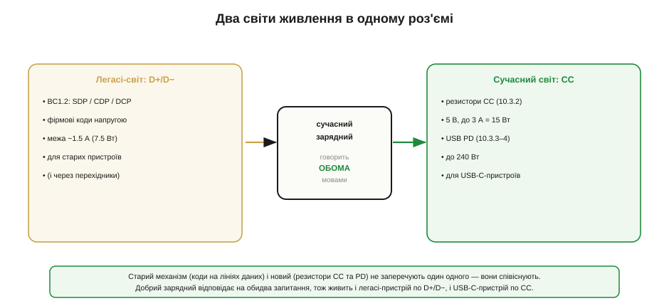
*Рис. 10.3.5.6. Старий механізм (коди на лініях даних D+/D−) і новий (резистори CC та PD) не заперечують один одного. Легасі-світ — BC1.2 та фірмові коди, межа близько 1.5 А. Сучасний світ — резистори CC (тема 10.3.2) на 15 ват і PD (теми 10.3.3–4) аж до 240. Добрий сучасний зарядний відповідає на обидва запитання, тож живить і старий пристрій по D+/D−, і USB-C-пристрій по CC.*

Чому так і має бути? Бо в полі досі повно пристроїв, які про CC нічого не знають, — їх вмикають через перехідники (наприклад, кабель USB-C → micro-USB), і єдина мова, якою вони здатні спитати про струм, — це BC1.2 чи фірмовий код на D+/D−. Тому сучасний зарядний блок зазвичай виставляє **і** підтяжку Rp на лінії CC (для USB-C-пристроїв), **і** BC1.2-підпис на D+/D− (для легасі). Кожен пристрій бере те запитання, яке розуміє, й ігнорує інше. Тут варто памʼятати й зворотний випадок: коли USB-C-пристрій під'єднують до старого порту Type-A простим кабелем, усередині такого кабелю зашитий резистор 56 кОм (тема 10.3.2), що чесно повідомляє «це звичайний USB, бери стандартний струм», — і вже поверх цього може спрацювати BC1.2, якщо порт виявиться DCP. Два світи не воюють, а доповнюють один одного: новий механізм покриває високу потужність, старий лишається запобіжною сіткою для всього, що молодший стандарт не застав.

### Підсумок теми

Легасі-зарядка — це відповідь на питання «скільки струму брати», коли поряд нема хоста, з яким можна домовитися. Стандарт **BC1.2** (USB-IF) дав пристрою впізнавати порт за станом ліній **D+/D−**: **SDP** — звичайний порт ПК (0.5/0.9 А), **CDP** — порт ПК із зарядкою до 1.5 А, **DCP** — тупий блок, який упізнають за **закороченими наскрізь** D+ і D−. Впізнавання — це коротка проба на лініях даних у два кроки: спершу «це зарядний порт?», тоді «тупий чи розумний?». Уся ця ліга обмежена 5 вольтами й приблизно 1.5 ампера (7.5 Вт) — більше дають уже CC (10.3.2) і PD (10.3.3–4). До спільного стандарту виробники кодували струм **своїми** напругами на D+/D−, і саме розбіжність цих «діалектів» досі стоїть за буденним «новим зарядним заряджає повільно»: пристрій шукає свій підпис, не знаходить — і про всяк випадок відкочується в 0.5 А. Нарешті, старий механізм D+/D− і новий механізм CC мирно **співіснують** в одному роз'ємі, тож добрий зарядний навмисне говорить обома мовами. Розібравшись, як пристрій *бере* живлення з чужого порту, природно поставити дзеркальне питання — як зробити так, щоб наш власний пристрій сам *роздавав* енергію іншим: про своє «джерело», дворольові порти й power path — наступна тема.

## 10.3.6 Свій «павербанк»: source, dual-role і power path

Дотепер наш пристрій був тим, хто **просить** і **бере** живлення, — sink'ом. Тепер перевернемо задачу: зробімо пристрій таким, що сам **дає** енергію іншим. Це не екзотика, а буденна потреба. Власний переносний акумулятор, що заряджає телефон. Пристрій, який живить під'єднану до нього периферію — давач, модуль, ще один пристрій. Ноутбук, що то заряджається сам, то віддає заряд телефону. У всіх цих випадках наша коробочка стає **джерелом** (*source*), і це міняє все: ролі на лінії CC, наявність підвищувача, поведінку під час обміну ролями — і, найголовніше, внутрішню архітектуру живлення, бо тепер у пристрої одночасно живуть троє — вхід, батарея й власна система.

Ця тема — про те, як грамотно стати джерелом. Спершу розберемо мінімум, що робить пристрій джерелом по USB-C. Тоді побачимо, чому будь-який «павербанк» від однієї літієвої комірки **мусить** мати boost. Далі — дворольовість, коли той самий порт і бере, і дає. І нарешті — серце теми, **power path**: архітектура, що дозволяє водночас живити систему й заряджати батарею, працювати навіть із розрядженою чи відсутньою батареєю і чисто переходити з мережі на батарею, коли живлення зникло.

### Стати джерелом: дзеркальна роль

Найперше, що треба зрозуміти: бути джерелом по USB-C — це **дзеркало** того, що ми вже знаємо про sink. Усі механізми ті самі, лише сторони помінялися місцями.

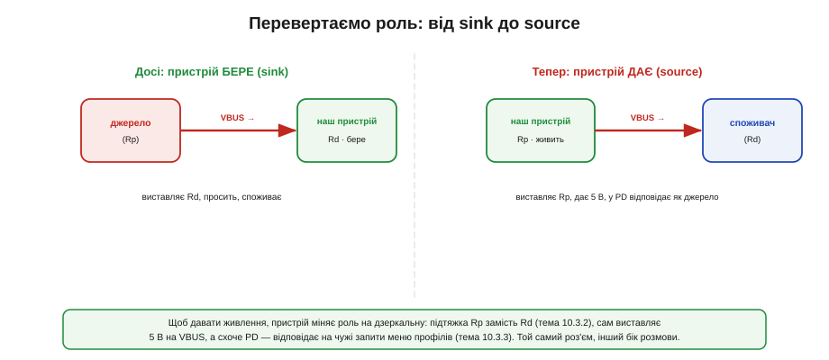
*Рис. 10.3.6.1. Ліворуч — звична картина: джерело виставляє підтяжку Rp, наш пристрій — Rd і бере живлення (sink). Праворуч — нова: тепер наш пристрій виставляє Rp, сам подає 5 В на VBUS і живить чужий пристрій, що висить на Rd (source). Той самий роз'єм, той самий протокол — лише інший бік розмови.*

Згадаймо тему 10.3.2: роль на USB-C задає резистор на лінії CC. Хто вішає підтяжку вгору (Rp) — той джерело; хто вішає Rd — той споживач. Отже, щоб стати джерелом, наш пристрій має виставити **Rp** (а не Rd), подати на VBUS 5 вольтів і бути готовим живити того, хто під'єднається. Якщо ми хочемо не просто 5 В, а повноцінний PD, додається ще обов'язок поводитися як джерело в протоколі (тема 10.3.3): не просити меню, а **виставляти** його — відповідати на чужі запити списком профілів, які ми готові дати, і вмикати узгоджену напругу. Уся розмова з 10.3.3 лишається, просто реплики міняються місцями: тепер ми ті, хто пропонує й погоджується.

> 🔧 **Навіщо це.** Практична користь — будь-який пристрій із власною батареєю можна перетворити на зарядку для інших, не докладаючи майже нічого, окрім правильних резисторів і трохи логіки. Давач, що роздає живлення сусідньому модулю; контролер, який підживлює підключений ґаджет; службовий порт, з якого можна «прикурити» розряджений пристрій. Розуміння, що джерело — це лише дзеркальний sink, прибирає страх перед задачею: ви вже знаєте всі її частини.

### Чому павербанку потрібен boost

Тут криється фізичний нюанс, який легко проґавити. USB вимагає на VBUS рівно **5 вольтів** (а в PD — і більше). Але звідки їх узяти, якщо джерело живиться від **однієї** літієвої комірки? Її напруга — від 4.2 В у повному заряді до ~3.0 В у розрядженому. Тобто **завжди нижча за 5 В**. Просто «прокинути» батарею на вихід не вийде — напруги забракне.

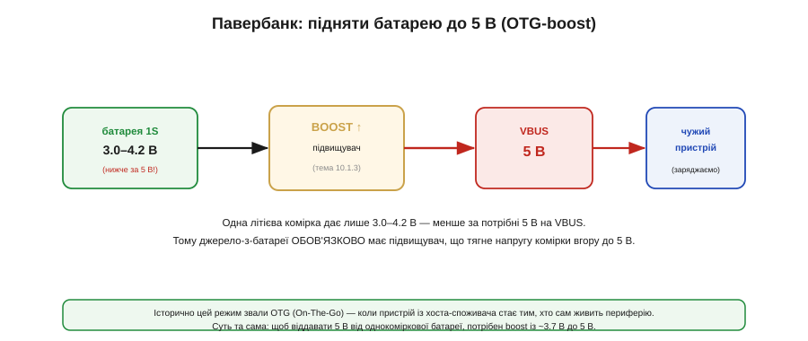
*Рис. 10.3.6.2. Одна літієва комірка дає 3.0–4.2 В — менше за потрібні 5 В на VBUS. Тому будь-яке джерело з однокоміркової батареї обов'язково містить підвищувач (boost, тема 10.1.3), що тягне напругу комірки вгору до 5 В. Цей режим історично називали OTG (On-The-Go) — коли пристрій із споживача стає тим, хто сам живить периферію.*

Звідси непохитне правило: **джерело-з-батареї містить boost** (підвищувальний перетворювач, тема 10.1.3). Він бере 3.0–4.2 В комірки й піднімає до стабільних 5 В на VBUS, незалежно від того, повна батарея чи майже сіла. Цей режим часто звуть **OTG-boost** — за абревіатурою On-The-Go, якою колись позначали здатність пристрою стати з простого споживача тим, хто сам керує шиною й живить периферію. Назва прижилася, а суть проста: щоб віддавати 5 В від однієї комірки, треба її напругу підвищити. Якщо ж пристрій живиться від кількох комірок послідовно (скажімо, 2S — близько 7–8 В), то для 5 В уже потрібен, навпаки, понижувач, — але масовий «павербанк» — це майже завжди одна комірка плюс boost.

Підвищення напруги не безкоштовне — і це чудово видно на класичному споживчому непорозумінні з ємністю.

**Приклад (чому «10000 мА·год» не заряджають телефон 3.3 раза).** Павербанк підписаний «10000 мА·год». Це ємність **комірки** при її напрузі ~3.7 В, а не при 5 В на виході.

```
Енергія комірки:   10000 мА·год × 3.7 В = 37 Вт·год
Boost до 5 В, ККД η ≈ 0.90:
   корисно на виході:  37 × 0.90 ≈ 33.3 Вт·год
   у перерахунку на 5 В:  33.3 / 5 ≈ 6.66 А·год ≈ 6660 мА·год

Телефон: акумулятор 3000 мА·год × 3.8 В ≈ 11.4 Вт·год
   скільки зарядів:  33.3 / 11.4 ≈ 2.9 → насправді ще менше
   (втрати в зарядці телефона) → реально ~2.3–2.5 заряду
```

Висновок: «10000 мА·год» на боці павербанка й «3000 мА·год» у телефоні — це ємності при **різних** напругах, тому ділити одне на одне («мало б вистачити на 3.3 заряду») — помилка. Чесний рахунок ведеться в **ват-годинах** (§7.4), і після підвищення напруги та двох перетворень корисними лишаються десь дві з половиною зарядки. Це не «обман виробника», а фізика: енергію перепаковують з 3.7 В у 5 В, і кожне перетворення бере свій відсоток.

Підвищення напруги має й інший, фізичний бік — **струм і тепло**. Потужність зберігається, тож коли джерело віддає, скажімо, 5 В × 2 А = 10 ват, із комірки на 3.7 В воно тягне вже близько 2.7 ампера, а з урахуванням ККД boost — і всі три. Такий струм помітно **просаджує** комірку (через її внутрішній опір, §7.4.5) і гріє перетворювач. Ось чому маленьке джерело на одній комірці не може віддавати багато: обмежує його не «бажання», а нагрів boost і просадка батареї під чималим струмом розряду. Що більше ват ми хочемо роздати, то товщі доріжки, більший перетворювач і серйозніший тепловідвід доведеться закласти — і то лише доти, доки вистачає самої комірки.

### Дворольовість: і бери, і дай

Багато пристроїв не обирають раз і назавжди, ким бути, — вони **то беруть, то віддають**. Телефон заряджається від розетки, але живить навушники. Ноутбук бере заряд від доку, а сам живить мишку, телефон, диск. Для таких випадків USB-C має поняття **дворольового** порту.

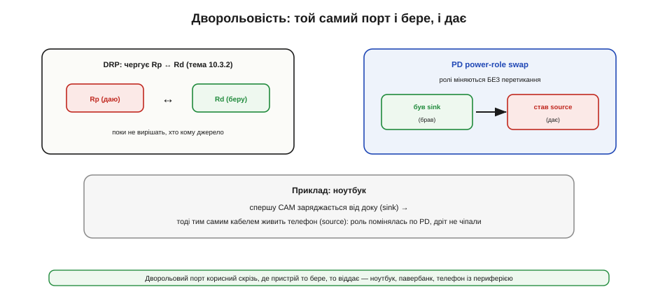
*Рис. 10.3.6.3. Ліворуч — DRP (тема 10.3.2): порт почергово виставляє то Rp, то Rd, поки не вирішить із сусідом, хто кому джерело. Праворуч — PD power-role swap: уже під час роботи ролі можна поміняти БЕЗ перетикання кабелю — той, хто брав, починає давати. Приклад: ноутбук спершу заряджається від доку, а тоді тим самим дротом живить телефон.*

Перший рівень дворольовості ми вже бачили в темі 10.3.2 — це **DRP** (*Dual-Role Power*): порт не має наперед заданої ролі, а почергово виставляє то Rp, то Rd, доки не з'ясує з під'єднаним пристроєм, хто з них стане джерелом. Це вирішується **на під'єднанні**. Але PD додає сильнішу річ — **power-role swap**: ролі можна поміняти **під час роботи**, не висмикуючи кабель. Пристрій, що був споживачем, за домовленістю стає джерелом, і живлення на VBUS розвертається у зворотний бік. Саме завдяки цьому ноутбук, під'єднаний до доку одним кабелем, може спершу сам зарядитися, а потім почати живити периферію — кабель при цьому ніхто не чіпає, помінялася лише домовленість. Для розробника це означає, що «джерело» й «споживач» — не намертво припаяні ярлики, а **режими**, між якими пристрій за потреби перемикається.

### Power path: працювати з «мертвою» батареєю

Тепер — серце теми. Пристрій із власною батареєю має всередині **трьох** учасників: зовнішній вхід (USB), батарею й власну систему (те, що споживає). Питання — як їх з'єднати. Найочевидніша схема виявляється поганою.

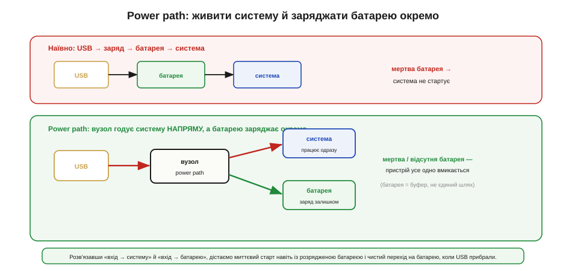
*Рис. 10.3.6.4. Угорі — наївна схема: USB заряджає батарею, а вже батарея живить систему. Біда: якщо батарея геть розряджена або вийнята, системі нема від чого стартувати. Унизу — power path: окремий вузол годує систему НАПРЯМУ від входу, а батарею заряджає тим, що лишилось. Тоді пристрій вмикається миттєво навіть із мертвою батареєю, а сама батарея стає буфером, а не єдиним шляхом живлення.*

Наївно живлення з'єднують ланцюжком: USB заряджає батарею, а система живиться від батареї. Поки батарея жива — усе гаразд. Та варто їй сісти **в нуль** (чи бути вийнятою), і пристрій у халепі: системі нема від чого вмикатися, а заряд мертвої батареї з нуля йде повільно й обережно, тож і чекати доведеться довго. Знайома картина — телефон, який «не вмикається, поки трохи не зарядиться».

Архітектура **power path** (буквально «шлях живлення») розриває це порочне коло. Між входом, батареєю й системою ставлять окремий розумний вузол, який веде **дві незалежні** лінії: одну — від входу **просто в систему**, другу — від входу **в батарею** на заряд. Тепер, щойно з'явилося зовнішнє живлення, система отримує його **напряму** й оживає **миттєво** — байдуже, у якому стані батарея, хоч її й зовсім нема. А батарея заряджається окремо, тим струмом, що лишився після системи. Вона перетворюється з єдиного джерела на **буфер**: бере надлишок, коли він є, і віддає, коли вхід зник. До речі, саме цей вузол забезпечує й **безшовний перехід**: вийняли USB — живлення системи плавно підхоплюється з батареї, без провалу й перезавантаження.

Окремо варто сказати про **оживлення геть розрядженої батареї** — те, заради чого power path часто й ставлять. Коли комірка сіла глибоко, кидати в неї повний струм заряду небезпечно, тож зарядний вузол починає з обережного **передзаряду** малим струмом (§7.4.6), повільно піднімаючи напругу комірки до робочої. Усе б нічого, але це довго — і тут якраз рятує power path: поки батарея мляво «приходить до тями», система вже працює, бо живиться **напряму від входу**, а не чекає на батарею. Без цього вузла пристрій із мертвою коміркою завис би в глухому куті: щоб увімкнутися, йому потрібна заряджена батарея, а щоб зарядити батарею — увімкнений зарядний тракт. Power path розриває і цю залежність.

> 🔌 **Чипи power path — у вставці.** Як саме влаштований такий вузол усередині зарядних мікросхем — окремі ключі для системи й батареї, режим load sharing, «прикурювання» мертвої батареї — розберемо в компонентній вставці цього розділу про power path (далі за чергою). Там і типова обв'язка, і чому без цього вузла пристрій із глибоко розрядженою батареєю буває важко навіть «привести до тями».

### Розподіл струму: хто кого годує

Power path ставить руба питання бюджету: вхідний струм **обмежений** тим, що дозволив порт (BC1.2 чи PD, теми 10.3.3–5), а претендентів на нього двоє — система й заряд батареї. Хто перший?

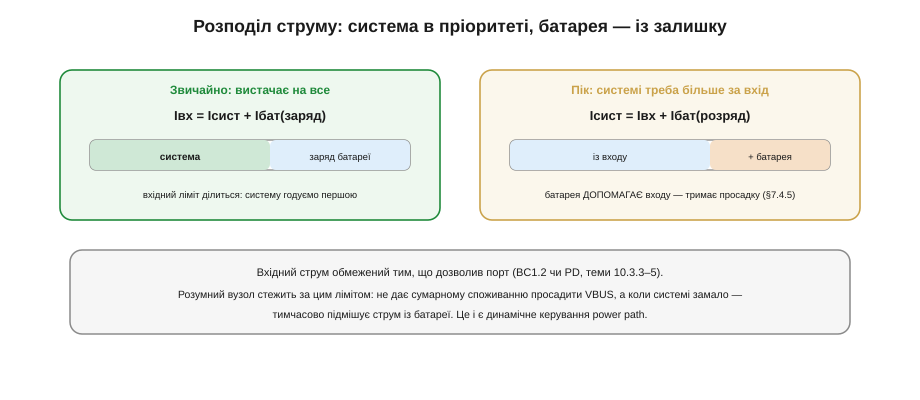
*Рис. 10.3.6.5. Ліворуч — звичайний режим: вхідний струм ділиться, система годується першою (пріоритет), батарея бере залишок на заряд: Iвх = Iсист + Iбат. Праворуч — піковий: коли системі раптом треба більше, ніж дає вхід, батарея ДОПОМАГАЄ входу й тримає просадку: Iсист = Iвх + Iбат. Це і є динамічний розподіл (load sharing) у power path.*

Правило просте й розумне: **система в пріоритеті**, батарея бере те, що лишилось. У спокійному режимі вхідного струму вистачає на все: частина йде в систему, решта — на заряд батареї (`Iвх = Iсист + Iбат`). Але буває й навпаки: системі раптом потрібен сплеск, більший за весь вхідний ліміт. Тоді розумний вузол не дає просадити VBUS — він **підмішує** струм із батареї, і та на пік стає **другим** джерелом поряд із входом (`Iсист = Iвх + Iбат`). Це той самий механізм буфера, що ми бачили у фізиці батареї (просадка під імпульсним навантаженням, §7.4.5), тільки тут ним керують свідомо. Завдяки цьому пристрій під power path тримає важкі піки, навіть живлячись від слабенької зарядки: середнє споживання бере вхід, а гострі стрибки гасить батарея.

> 🔧 **Навіщо це.** Без керування розподілом легко зробити пристрій, що «вимикається, коли працює й заряджається одночасно»: система й заряд разом перевищують вхідний ліміт, VBUS просідає, спрацьовує захист. Power path із пріоритетом системи прибирає цю хворобу: заряд автоматично пригальмовується, коли системі треба більше, і прискорюється, коли та відпочиває. Користувач просто бачить, що пристрій «і працює, і заряджається» — без таємничих перезавантажень.

### Бути добрим джерелом

Стати джерелом — це не лише технічно подати 5 В, а й узяти на себе **відповідальність**. Споживач на тому кінці може виявитися жадібним або несправним, і саме джерело мусить це пережити, не нашкодивши ні собі, ні йому.

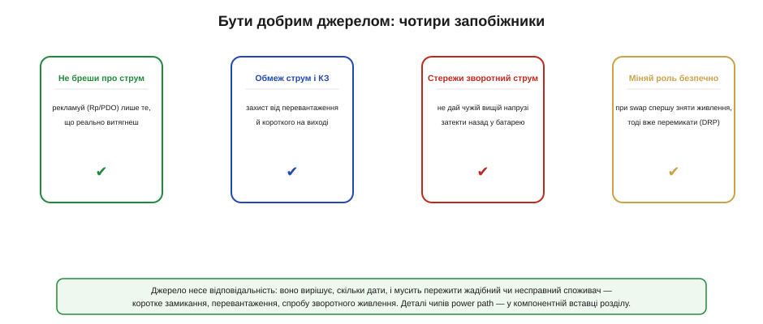
*Рис. 10.3.6.6. Чотири обов'язки джерела. Не брехати про струм — рекламувати (Rp чи PDO) лише те, що реально витягнеш. Обмежувати струм і витримувати коротке замикання на виході. Стерегти зворотний струм — не дати чужій вищій напрузі затекти назад у твою батарею. І, для дворольових, безпечно міняти роль: спершу зняти живлення, тоді перемикати.*

Перший обов'язок — **чесність**. Скільки б ми не виставили на CC (Rp) чи в меню профілів (PDO), стільки споживач і спробує взяти. Пообіцяти 3 А, маючи boost на 1 А, — означає напроситися на просадку й перегрів власного перетворювача. Тому рекламувати треба **рівно** свою реальну спроможність. Другий — **захист виходу**: споживач може закоротити VBUS або потягти надміру, тож джерело має обмежувати струм і коректно переживати коротке замикання, а не згоряти. Третій, особливо підступний, — **зворотний струм**: якщо до нашого виходу під'єднають щось із вищою напругою, воно спробує «затекти» назад, у нашу батарею, а заряджати літій неконтрольованим зворотним струмом небезпечно. Тому на виході джерела ставлять захист, що пропускає струм лише **назовні**. Четвертий стосується дворольових пристроїв: під час обміну ролями спершу прибирають живлення з шини й лише тоді перемикають, щоб дві сторони на мить не виявилися обидві джерелами.

### Підсумок теми

Зробити пристрій **джерелом** — це дзеркало того, що ми знали про sink: виставити Rp замість Rd (тема 10.3.2), самому подати VBUS, а в PD — відповідати як джерело (10.3.3). Будь-який «павербанк» від однієї літієвої комірки обов'язково містить **boost** (OTG-boost), бо 3.0–4.2 В комірки треба підняти до 5 В, — і саме через ці перетворення «10000 мА·год» дають телефону лише близько двох з половиною зарядів (чесний рахунок — у ват-годинах, §7.4). **Дворольовий** порт і бере, і дає: DRP вирішує роль на під'єднанні, а PD power-role swap міняє її на ходу, без перетикання. Серце теми — **power path**: окремий вузол годує систему напряму від входу, а батарею заряджає окремо, тож пристрій вмикається миттєво навіть із мертвою батареєю, чисто переходить на батарею при зникненні входу, а під пік **підмішує** струм батареї до обмеженого вхідного (load sharing із пріоритетом системи). І над усім цим — відповідальність джерела: не брехати про струм, захищати вихід від КЗ і зворотного струму, безпечно міняти роль. Лишився останній практичний клопіт цього розділу — кабелі та сумісність у полі: чому навіть справний пристрій і справна зарядка часом «не дружать», і як це діагностувати.

## 10.3.7 Кабелі і сумісність у полі: e-marker, падіння на дроті, типові несумісності

Уся попередня машинерія розділу — резистори CC, профілі PD, коди BC1.2 — працює за однієї мовчазної умови: між зарядкою й пристроєм лежить **гідний кабель**. У реальному полі це припущення раз у раз хибне. Користувач бере перший-ліпший шнур із шухляди, тицяє в перший-ліпший блок — і пристрій то заряджається повільно, то не заряджається зовсім, то працює один раз із трьох. Для розробника це не «магія» й не «погана карма», а звичайна **інженерна задача з діагностикою**: у системі є кілька конкретних місць, де щось може піти не так, і їх можна перевірити по черзі.

Ця тема — про останню ланку, яку легко недооцінити: про сам **кабель** і про **сумісність у полі**. Спершу розберемо, чому кабелі такі різні й що ховається в чипі e-marker. Тоді — чому на тонкому довгому шнурі п'ять вольтів перетворюються на чотири з гаком і заряд гальмує. Далі складемо **карту типових несумісностей** — короткий каталог причин «не заряджає». І нарешті перетворимо все це на **системну діагностику** й на кілька звичок, що роблять наш власний пристрій стійким до випадкового заліза в руках користувача.

### Кабель — не просто дріт

Перше, що варто усвідомити: USB-C кабелі **дуже різні** всередині, хоча штекери однакові. Те, що фізично з'єднує два роз'єми, може бути як повним джгутом з усіма лініями й чипом, так і двома мідними жилками «аби заряджалось».

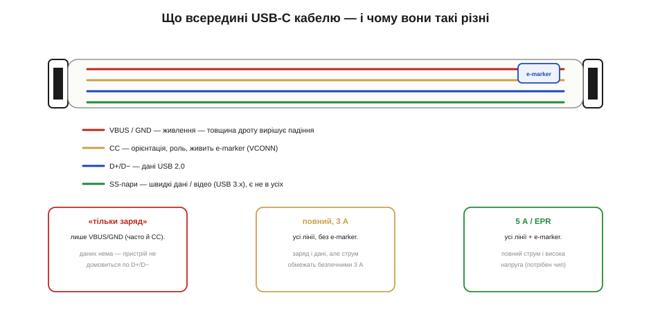
*Рис. 10.3.7.1. У кабелі живуть кілька груп провідників: VBUS/GND (живлення — і саме їхня товщина вирішує падіння напруги), CC (орієнтація, роль, живлення e-marker через VCONN), D+/D− (дані USB 2.0) і швидкі SS-пари (USB 3.x, є не в усіх). Звідси й три типові «класи» кабелів: «тільки заряд» (часто без даних), повний на 3 А (усі лінії, та без чипа) і повний на 5 А / EPR (з e-marker).*

Розгляньмо ці класи, бо вони прямо визначають, що пристрій узагалі **зможе** зробити. **«Тільки заряд»** — найдешевший: у ньому є VBUS і GND, іноді CC, але нема ліній даних. Заряджати по 5 В він дасть, але **домовитися** по D+/D− (BC1.2, тема 10.3.5) пристрій уже не зможе — нема чим. **Повний кабель на 3 А** несе всі лінії й годиться і для даних, і для зарядки, але без чипа e-marker система обмежить струм безпечними трьома амперами. **Кабель на 5 А / EPR** має всередині e-marker і лише він пускає повний струм та високу напругу. Один зовнішній вигляд тут не підказує нічого — два однакові на око шнури можуть належати до різних класів, і саме звідси народжується половина польових загадок.

> 🔧 **Навіщо це.** Коли пристрій поводиться дивно — заряджається повільно, не бачить даних, не бере високу напругу, — перша підозра має падати на **кабель**, а не на пристрій чи зарядку. Найдешевший і найшвидший крок діагностики — замінити шнур на свідомо повноцінний. Дуже часто на цьому історія й закінчується: винним був «зарядний» кабель без потрібних ліній.

Окрема, часто забута частина «кабелю» — самі **роз'єми**. Контакти USB-C пружинні, і з часом вони зношуються, а в кишеньковому пристрої ще й збирають пил, ворс і вологу. Усе це додає **опору контакту**, який стає в один ряд з опором жил і так само з'їдає напругу, а в гіршому разі робить з'єднання **переривчастим**: пристрій то бачить зарядку, то ні, варто кабелю ледь поворухнутися. Тому в діагностиці «не заряджає» поряд із товщиною дроту завжди стоїть і **чистота та цілість роз'ємів** — інколи проблему лікує не новий шнур, а звичайне прочищення гнізда від ворсу.

### e-marker: чип, що дозволяє більше

Ми вже коротко зустрічали e-marker у темі 10.3.2. Тепер подивімося на нього з боку **вибору кабелю**, бо саме він стоїть за буденним «цим шнуром заряджає швидко, а тим — ні».

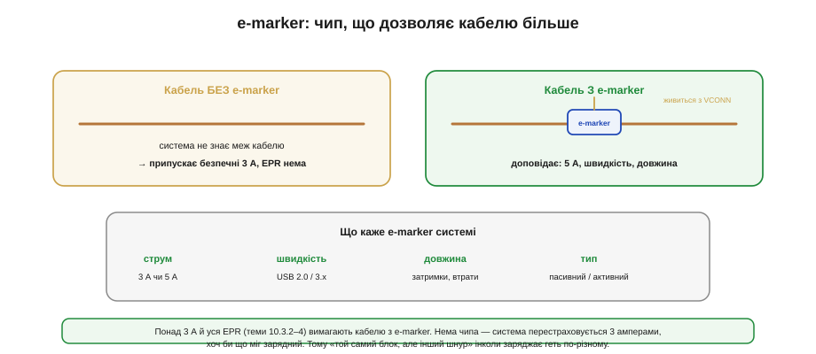
*Рис. 10.3.7.2. Без e-marker система не знає меж кабелю й перестраховується трьома амперами (а EPR не вмикає взагалі). З e-marker — чип, живлений від VCONN, доповідає системі реальні дані: який струм кабель тримає (3 чи 5 А), яку швидкість, яку довжину. Тому понад 3 А й уся висока напруга EPR можливі лише з e-marker.*

Логіка тут оборонна. Кабель — теж компонент, і він має межу: тонкі жили не витримають 5 ампер, не перегрівшись, а на велику напругу потрібна відповідна ізоляція. Якщо система **не знає** меж кабелю, вона не має права ризикувати — і чесно припускає найгірше: безпечні 3 ампери, жодної EPR. Знати межі вона може лише від **e-marker** — крихітного чипа всередині штекера, що живиться від лінії VCONN (той самий незадіяний пін CC, тема 10.3.2) і на запит повідомляє паспорт кабелю: струм, швидкість, довжину, тип. Тому правило просте: хочеш понад 3 ампери чи високу напругу EPR (теми 10.3.3–4) — потрібен кабель **з e-marker**, і це не забаганка, а вимога безпеки. «Той самий блок, але інший шнур заряджає по-іншому» — майже завжди саме про це: один кабель має чип і паспорт на 5 А, інший — ні.

Варто розрізняти й **пасивні та активні** кабелі — це теж зашито в e-marker. Короткий пасивний шнур чудово несе і живлення, і повільні дані USB 2.0 без жодного чипа. Та що довший кабель і що швидші дані, то більше сигнал слабшає в міді — і для високих швидкостей USB 3.x чи 4 потрібен або короткий якісний пасивний кабель з e-marker, або взагалі **активний**, із підсилювачами всередині. Звідси буденний сюрприз: двометровий USB-C шнур може чудово заряджати, але не тягнути швидку передачу даних чи відео. Живлення й швидкі дані — різні вимоги до того самого кабелю, і e-marker існує почасти саме щоб система знала, на що цей конкретний шнур здатен.

### Падіння на дроті

Навіть найдоброякісніший кабель — це **опір**, а опір під струмом з'їдає напругу. Це та сама фізика, що й закон Ома з §1.3, тільки тепер вона прямо вирішує, зарядиться пристрій чи ні.

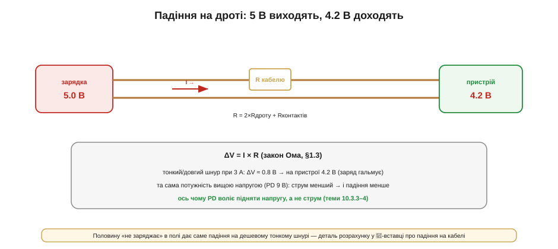
*Рис. 10.3.7.3. Кабель має опір R (двічі довжина жили плюс опір контактів). Під струмом I на ньому падає ΔV = I × R, тож із 5 В на зарядці до пристрою доходить, скажімо, 4.2 В — і заряд гальмує. Та сама потужність, передана вищою напругою (PD 9 В), іде меншим струмом, тож і падіння менше: ось чому PD воліє підняти напругу, а не струм.*

Механізм прямий: повний струм біжить по VBUS до пристрою й по GND назад, тож працює **подвоєна** довжина жили, плюс опір контактів у двох роз'ємах. На цьому сумарному опорі за законом Ома (§1.3) падає ΔV = I × R, і ця напруга **не доходить** до пристрою. Що тонший дріт (більший калібр AWG) і що довший шнур, то більший опір — і то більша втрата. Полічімо, щоб відчути масштаб.

**Приклад (той самий блок, два різні шнури).** Зарядка дає чесні 5.0 В. Порівняймо короткий товстий і довгий тонкий кабель при струмі заряду 3 А.

```
ΔV = I × R,   R ≈ 2×(довжина×опір жили) + Rконтактів

Шнур A — 1 м, товста жила (~24 AWG):
   R ≈ 2 × 0.085 + 0.1 ≈ 0.27 Ом
   ΔV = 3 А × 0.27 ≈ 0.8 В  → на пристрої 5.0 − 0.8 = 4.2 В  (ще терпимо)

Шнур B — 2 м, тонка жила (~28 AWG):
   R ≈ 2 × (2×0.21) + 0.1 ≈ 0.95 Ом
   ΔV = 3 А × 0.95 ≈ 2.0 В  → на пристрої 5.0 − 2.0 = 3.0 В  (заряд СТАЄ)

Та сама потужність 15 Вт, але вищою напругою PD 9 В:
   I = 15 / 9 ≈ 1.67 А  (струм менший!)
   на шнурі A: ΔV = 1.67 × 0.27 ≈ 0.45 В  → лише 5% від 9 В
```

Висновок видно очима: на тонкому довгому шнурі при 3 амперах пристрій бачить уже не 5, а **3 вольти** — і заряджання просто зупиняється, хоча і зарядка, і пристрій справні. А той самий ват можна доставити **меншим струмом**, піднявши напругу через PD, — і тоді падіння на тому ж кабелі стає майже непомітним. Це і є глибинна причина, чому Power Delivery воліє підвищувати напругу, а не струм (теми 10.3.3–4): висока напруга «прощає» поганий кабель.

> 🧮 **Розрахунок — у вставці.** Повне виведення падіння на кабелі — звідки беруться опір жили, опір контактів і чому половина проблем «не заряджає» родом саме звідси — у математичній вставці розділу про падіння на кабелі (далі за чергою). Там і таблиця опорів за калібром AWG, і як прикинути втрату для свого шнура.

### Карта типових несумісностей

Зберемо тепер усі причини «не заряджає» в один каталог. Корисно бачити, що їх **скінченна** кількість і що кожна належить до одного з трьох доменів: кабель, зарядний або переговори.

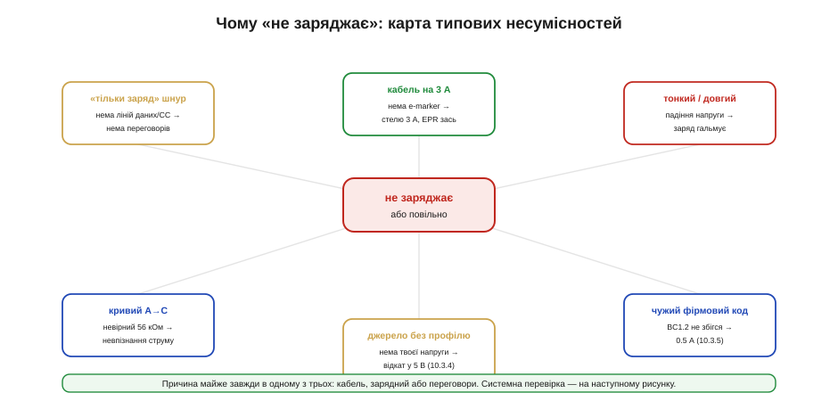
*Рис. 10.3.7.4. Шість найчастіших причин: шнур «тільки заряд» (нема ліній — нема переговорів), кабель без e-marker (стеля 3 А), тонкий/довгий (падіння напруги), кривий A→C-перехідник з невірним резистором 56 кОм (тема 10.3.2), джерело без потрібного PD-профілю (відкат у 5 В, тема 10.3.4) і чужий фірмовий код BC1.2 (відкат у 0.5 А, тема 10.3.5). Майже все зводиться до трьох доменів: кабель, зарядний, переговори.*

Пройдімося по них, бо кожну ми вже десь зустрічали. **Шнур «тільки заряд»** не має ліній даних чи CC — пристрій не може провести переговори й лишається на голих 5 В або взагалі ні з чим. **Кабель без e-marker** обмежує струм трьома амперами, хоч би що міг блок. **Тонкий чи довгий** шнур з'їдає напругу падінням (щойно порахували). **Кривий A→C-перехідник** із неправильним резистором (замість потрібних 56 кОм, тема 10.3.2) збиває визначення струму, а в поганих випадках змушує пристрій тягнути з порту більше, ніж той дає. **Джерело без потрібного профілю** PD відкочує пристрій у 5 В (тема 10.3.4). **Чужий фірмовий код** легасі-зарядки не збігається — і пристрій падає в обережні 0.5 А (тема 10.3.5). Шість причин, три домени — і жодної містики.

Підступність поля ще й у тому, що причини **складаються**. Кабель на 3 А без e-marker сам по собі лише обмежить струм, але разом зі слабким блоком без потрібного профілю дасть уже подвійний недобір; тонкий шнур плюс брудний роз'єм складуть свої падіння в одне. Через це «полагодив одне, а легше не стало» — звична картина: насправді винних було двоє, і відсікати їх треба по черзі, а не сподіватися на єдину чарівну причину. Саме тому діагностика далі — це **послідовність**, а не один постріл навмання.

### Діагностика по кроках

Тепер головне вміння теми: перетворити невиразну скаргу «не заряджає» на **впорядковану перевірку**. Замість тицяти навмання, інженер іде по дереву рішень, відсікаючи домени один за одним.

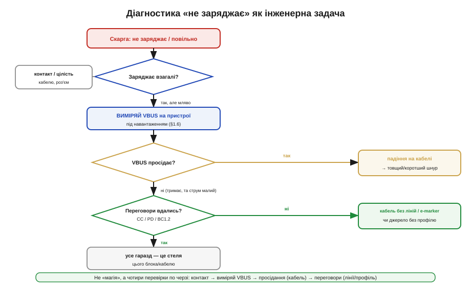
*Рис. 10.3.7.5. Чотири перевірки по черзі. Заряджає взагалі? Ні — дивись контакт і цілість кабелю. Заряджає, але мляво — ВИМІРЯЙ VBUS на пристрої під навантаженням (§1.6). Просідає — це падіння на кабелі (товщий/коротший шнур). Тримається, але струму мало — не вдалися переговори (лінії чи профіль). Усе гаразд, а більше не дає — це чесна стеля цього блока й кабелю.*

Ключ до всього — **виміряти VBUS на боці пристрою, під навантаженням** (а не на блоці й не без струму, §1.6). Це одне вимірювання одразу розділяє дві зовсім різні хвороби. Якщо напруга під струмом **просідає** — винен **кабель** (тонкий, довгий чи поганий контакт), і лікується це товщим або коротшим шнуром. Якщо ж VBUS **тримається**, а струму все одно мало — справа не в дроті, а в **переговорах**: не вдалося домовитися по CC/PD/BC1.2, бо кабель без потрібних ліній чи e-marker, або джерело не має нашого профілю. І лише коли і напруга тримається, і переговори пройшли, а більше пристрій не бере — це чесна **стеля** саме цього блока з цим кабелем, і шукати тут більше нема чого. Така послідовність економить години: вона щоразу каже, **де саме** копати, замість навмання міняти то шнур, то блок, то пристрій.

> 🔧 **Навіщо це.** Та сама логіка стане в пригоді й тоді, коли скаржитимуться на **ваш** пристрій. Замість приймати «не заряджається» на віру, попросіть виміряти VBUS на пристрої під навантаженням — і ви за одну цифру відрізните проблему кабелю від проблеми переговорів, не тримаючи виріб у руках. Це перетворює підтримку з ворожіння на діагностику.

Найпідступніший клас скарг — не «ніколи», а «**раз із трьох**»: пристрій то заряджається, то ні. Такі переривчасті відмови майже завжди означають, що система працює **на межі** — гранична просадка чи граничний контакт, який перехиляється від дрібниці. Варто змінитися струму (а він міняється сам по собі, бо батарея в міру заряду бере його то більше, то менше), ледь нагрітися роз'єму чи поворухнутися кабелю — і хитка рівновага падає в «не заряджає». Лікують це не пошуком одного винного, а **збільшенням запасу**: товщий шнур, чистий роз'єм, нижчий поріг brownout — усе, що відсуває систему від краю, де дрібна випадковість вирішує результат. Переривчасте — це майже завжди «впритул», а не «зламано».

### Проєктувати під поле

Знаючи всі ці пастки, грамотний розробник проєктує пристрій так, щоб той **прощав** користувачеві випадкове залізо. Кілька звичок із попередніх тем складаються тут у єдину настанову.

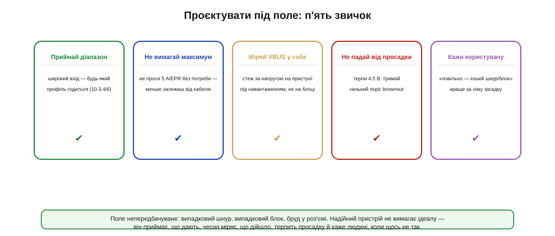
*Рис. 10.3.7.6. П'ять звичок надійного пристрою: приймай діапазон напруг (широкий вхід, теми 10.3.4/6); не вимагай максимуму (не проси 5 А чи EPR без потреби — менше залежиш від кабелю); міряй VBUS у себе під навантаженням; терпи просадку (низький поріг brownout, не падай від 4.5 В); і чесно кажи користувачу «повільно — спробуй інший шнур чи блок», а не мовчи загадково.*

Кожна звичка б'є по конкретній пастці. **Приймай діапазон** — широкий вхід (теми 10.3.4 і 10.3.6) робить пристрій байдужим до того, який саме профіль дала зарядка. **Не вимагай максимуму** — якщо вистачає 3 А й 9 В, не проси 5 А чи EPR, бо тоді менше шансів спіткнутися об кабель без e-marker. **Міряй VBUS у себе**, а не покладайся на напис на блоці, — лише так дізнаєшся, що насправді **дійшло**. **Не падай від просадки** — тримай низький поріг brownout, щоб тимчасові 4.5 В не валили пристрій. І **кажи користувачу** правду: коротке «заряджаю повільно, спробуй інший шнур» рятує і його нерви, і вашу репутацію куди краще за німу загадку. Усе це разом коштує дрібниць на етапі проєктування, а в полі обертається на пристрій, що «просто працює» з чим завгодно.

### Підсумок теми

Кабель — повноцінний компонент системи, а не випадковий дріт: він буває «тільки заряд» (без переговорів), на 3 А (без e-marker) чи на 5 А/EPR (з чипом), і на око їх не розрізнити. **e-marker** — це паспорт кабелю: без нього система перестраховується 3 амперами й не дає EPR. Будь-який шнур має **опір**, і під струмом на ньому падає ΔV = I × R (§1.3) — на тонкому довгому кабелі 5 В легко стають 4 чи навіть 3, і заряд гальмує; вища напруга PD рятує, бо несе ту саму потужність меншим струмом. Причин «не заряджає» — скінченний каталог із трьох доменів (кабель, зарядний, переговори), а розплутує їх одне вимірювання: **VBUS на пристрої під навантаженням** ділить хворобу на «падіння в кабелі» та «невдалі переговори». І, нарешті, надійний пристрій проєктують **під поле**: приймати діапазон, не вимагати максимуму, міряти напругу в себе, терпіти просадку й чесно говорити з користувачем.

На цьому Розділ 10.3 завершено: від драбини живлення USB і резисторів CC через Power Delivery, власне джерело з power path і легасі-зарядку — аж до кабелів і польової діагностики. Тепер USB для вас не «просто роз'єм для зарядки», а зрозуміла система домовленостей, у якій ви вмієте і брати потрібну потужність, і роздавати її, і лагодити, коли щось не зрослося. Далі — від того, як живлення **доходить** до пристрою, до того, що тримає енергію всередині нього: до батарей і їхнього заряду.

> ▶️ Далі: [Розділ 10.4 — Батареї і заряд](../batteries-charging/batteries-charging.md)
