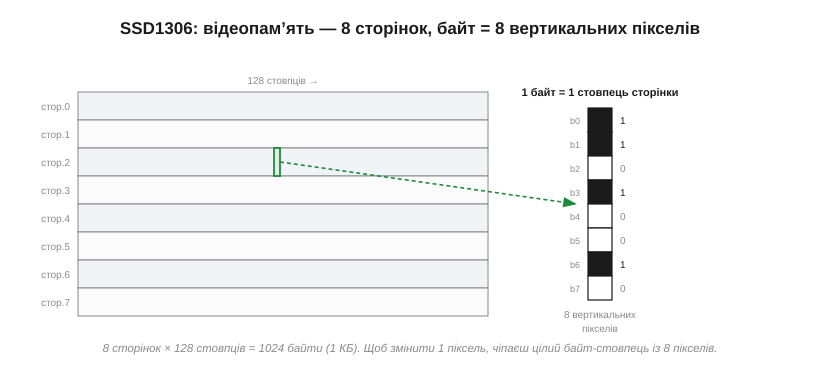

# 🔌 OLED SSD1306-класу: сторінкова організація відеопам'яті

> Це компонентна вставка до теми [§13.1.1 «Класи дисплеїв»](displays-touch.md). Тема показала, що OLED світиться сам і має власну памʼять кадру. Тут візьмемо найпоширеніший аматорський і приладовий дисплейчик — монохромний OLED на контролері **SSD1306** — і пройдемо практичний шлях: як він влаштований, чим до нього заговорити й чому його памʼять організована **сторінками** з вертикальних байтів, а не звичними рядками.

### Що це за клас

SSD1306-клас — це крихітні (0.96″ чи 1.3″) **монохромні** OLED-модулі, зазвичай 128×64 або 128×32 пікселі, що під'єднуються двома-чотирма дротами по I²C або SPI. Вони дешеві, яскраві, з ідеальним чорним (це ж OLED) і не потребують підсвітки — тому їх ставлять усюди, де треба показати кілька рядків тексту чи простий графік: у приладах, годинниках, налагоджувальних консолях.

### Плата й розпіновка

На модулі — саме OLED-скло, контролер **SSD1306** із вбудованою памʼяттю кадру (GRAM) і **зарядна помпа** (*charge pump*), що сама піднімає 3.3 В живлення до ~7–9 В, потрібних органіці; плюс кілька конденсаторів обвʼязки. Жодного зовнішнього високовольтного джерела не треба — у цьому зручність класу.

Розпіновка залежить від шини. Версія I²C виводить лише **VCC, GND, SCL, SDA** (іноді з перемичкою вибору адреси). Версія SPI додає **DC** (команда/дані), **RES** (скидання) і **CS** (вибір): більше дротів, зате швидше. Живлять модуль здебільшого від 3.3 В (багато плат толерантні й до 5 В завдяки вбудованому стабілізатору); на I²C-лінії потрібні підтяжки.

### Як заговорити: перший байт

Контролер розрізняє команди й пікселі за **керувальним байтом** на початку посилки. По I²C спершу шлють адресу (типово **0x3C**), потім керувальний байт — **0x00** означає «далі йдуть команди», **0x40** — «далі йдуть дані пікселів». Команди — це, наприклад, увімкнути дисплей (0xAF) чи задати яскравість. Після ввімкнення живлення модуль треба **ініціалізувати** короткою послідовністю команд — і серед них конче ввімкнути зарядну помпу, інакше скло лишиться чорним, хоч контролер і відповідає.

### Чому памʼять — сторінками

Ось головна особливість класу, на якій спотикаються новачки. Памʼять кадру SSD1306 організована не рядками, а **сторінками** (*pages*): екран 128×64 ділиться на **8 горизонтальних сторінок** по 8 пікселів заввишки, і кожен байт у сторінці — це **вертикальний** стовпчик із 8 пікселів (кожен біт — свій піксель).

*Рис. 13.1.1c.1. Екран — 8 сторінок × 128 стовпців. Один байт задає не вісім сусідніх пікселів у рядку, а **стовпчик** із восьми пікселів по вертикалі. Усього 8 × 128 = 1024 байти, тобто рівно 1 КБ на весь кадр.*

Наслідок практичний: щоб змінити **один** піксель, доводиться чіпати цілий байт — вісім вертикальних пікселів одразу. Тому такі дисплеї майже завжди ведуть із **кадрового буфера в RAM** мікроконтролера: тримають свою копію 1 КБ, малюють у ній як завгодно, а потім виштовхують сторінки в контролер. Горизонтальну лінію так малювати легко (вмикаєш по біту в кожному стовпці), вертикальну — теж (один байт у кількох сторінках); а от «поставити піксель» означає прочитати-змінити-записати цілий байт-стовпець.

### Типові граблі

- **Чорний екран після старту** — забули ввімкнути зарядну помпу в ініціалізації. Класична перша помилка.
- **Зсув на 2 пікселі / сміття з боків** — під виглядом SSD1306 трапляється близнюк **SH1106**, у якого GRAM на 132 стовпці, тож зображення зсунуте; драйвер треба перемкнути в режим SH1106.
- **Не озивається по I²C** — переплутана адреса (0x3C проти 0x3D) або немає підтяжок на шині.
- **Вигоряння** — це OLED: статичний напис (рамка, етикетка) за місяці пропалюється; для постійних елементів варто зрушувати картинку.

### Варіації класу

Той самий клас має кілька облич: **128×32** (нижчий), версії під **I²C** та **SPI**, згаданий **SH1106** як майже-сумісний родич. А коли треба колір — беруть уже інші, споріднені SPI-контролери: **SSD1331** чи **SSD1351** (маленькі кольорові OLED), що працюють схоже, але адресують памʼять звичними рядками, а не сторінками.

> 🔧 **Навіщо це.** SSD1306 — дисплей-«робоча конячка» для пари рядків тексту: два дроти I²C, 1 КБ кадрового буфера в RAM, проста модель «керувальний байт → команди/дані». Памʼятайте три речі: увімкнути зарядну помпу в ініціалізації, тримати кадр у RAM і виштовхувати сторінками (бо памʼять вертикальна), і перевірити, чи це справді SSD1306, а не SH1106 зі зсувом. Для кольору й рядкової памʼяті — це вже SSD1331/1351-клас.
