# Розділ 13.1 — Дисплеї і дотик як компоненти

Дисплей — це обличчя виробу. Користувач не бачить ні вашої прошивки, ні плати, ні архітектури задач — він бачить екран і торкається його пальцем, і саме за цими двома відчуттями судить про весь пристрій. Та перш ніж малювати на екрані гарні інтерфейси (а цим займеться решта цього модуля), треба зрозуміти екран як **компонент** — таку саму фізичну деталь, як давач чи мікросхема пам'яті: з власною фізикою, інтерфейсом, споживанням, ціною й пастками. Цей розділ іде знизу вгору — від **фізики окремого пікселя** до вибору готової панелі під конкретний виріб, а заразом розбирає дотик: як шматок скла розуміє, що його торкнулися.

> 📜 **Перед матеріалом — історія:** [Рідкі кристали: дисплей, який RCA зробила — і не схотіла](hist-lcd.md). Вона показує, **чому** пласкоекранний дисплей узагалі з'явився, і знайомить із самим поняттям «керована цятка світла», з якого тут усе виросте.

---

## 13.1.1 Класи дисплеїв: TFT, OLED, e-ink

Будь-який дисплей — від годинникового циферблата до 4K-телевізора — це, по суті, **сітка цяток**, кожну з яких можна засвітити чи погасити окремо. Уся складність — у тому, **як зробити одну таку керовану цятку**. І тут природа дає не один, а кілька зовсім різних фізичних відповідей. Вони й діляться на класи дисплеїв, які ми щодня називаємо TFT, OLED та e-ink, навіть не замислюючись, що за цими буквами стоїть фундаментально різна фізика пікселя.

Перш ніж тонути в параметрах панелей (це наступна тема) чи в способах їх під'єднати, варто засвоїти головне питання, що організовує всю цю різноманітність. Воно навдивовижу просте — і відповідь на нього визначає геть усе: скільки дисплей їстиме енергії, який у нього буде чорний колір, чи видно його на сонці, чи добре він покаже відео. Питання таке: **звідки береться світло, що долітає до ока?**

### Дисплей — це сітка керованих цяток

Один **піксель** (*pixel*, від *picture element*) — найменша незалежно керована цятка зображення. Майже завжди він складається з трьох **підпікселів** (*subpixel*) — червоного, зеленого й синього (*R·G·B*), бо око змішує ці три кольори в будь-який інший. Засвітивши підпікселі в різних пропорціях, піксель показує потрібний відтінок; засвітивши всі три на повну — білий; погасивши всі — чорний. Дисплей роздільністю, скажімо, 320×240 — це 320·240 = 76 800 пікселів, тобто **230 400** окремих керованих цяток. Завдання електроніки — задати яскравість кожної.

Але «задати яскравість цятки» можна трьома принципово різними способами, і саме вони розводять дисплеї по класах.

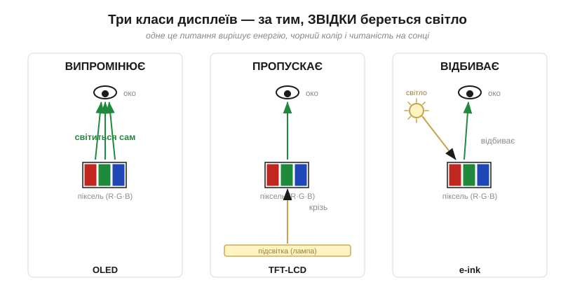
*Рис. 13.1.1.1. Те саме питання — «звідки світло?» — дає три родини. **Випромінювальний** піксель (OLED) світиться сам. **Пропускний** (TFT-LCD) працює як заслінка перед лампою-підсвіткою позаду. **Відбивний** (e-ink) не має власного світла зовсім — він, як папір, відбиває те, що довкола. Усе подальше — наслідки цього вибору.*

- **Випромінювальний** (*emissive*) піксель **сам народжує світло** — як крихітна лампочка. Це OLED.
- **Пропускний** (*transmissive*) піксель світла не робить — він лише **заслінка**, що дозує, скільки світла від лампи позаду крізь нього пройде. Це TFT-LCD.
- **Відбивний** (*reflective*) піксель не має ні власного світла, ні лампи — він **відбиває навколишнє** світло, як звичайний папір. Це e-ink.

Розгляньмо кожен спосіб як фізику окремого пікселя.

### TFT-LCD: заслінка перед лампою

Рідкий кристал з історії цього розділу — це, по суті, **керована світлом заслінка**: подаси напругу — закрут молекул випрямиться, і пара поляризаторів або пропустить світло, або перекриє. Та одна заслінка — ще не дисплей. Щоб зробити кольоровий екран, навколо рідкого кристала вибудовують цілий **стос шарів**.

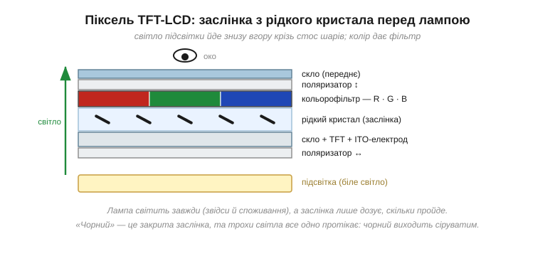
*Рис. 13.1.1.2. Піксель TFT-LCD у розрізі. Знизу світить **підсвітка** (*backlight*) білим світлом. Воно проходить нижній поляризатор, шар **рідкого кристала** (заслінку, якою керує напруга), **кольорофільтр**, що ділить піксель на R·G·B-підпікселі, верхній поляризатор — і виходить до ока вже забарвленим і дозованим. Заслінка не робить світла — вона лише вирішує, скільки його пройде.*

Колір тут виходить **відніманням**: підсвітка біла, а кольорофільтр кожного підпікселя пропускає лише свою частину спектра — червону, зелену чи синю. Яскравість підпікселя задає рідкокристалічна заслінка: відкрита навстіж — підпіксель яскравий, прикрита — тьмяний. Змішуючи три підпікселі, дістаємо будь-який відтінок.

Лишається питання, заради якого в назві стоять літери **TFT**. Пікселів сотні тисяч, а дротів до кожного не підведеш. Тому їх вмикають **матрицею** — рядками й стовпцями. Але якщо просто подавати напругу на перетин рядка й стовпця, то поки електроніка добіжить до наступних рядків, цей піксель уже згасне: рідкий кристал сам напругу не тримає. Розв'язок — **активна матриця** (*active matrix*): на кожному підпікселі сидить власний крихітний **тонкоплівковий транзистор** (*thin-film transistor*, **TFT**) із маленьким конденсатором.

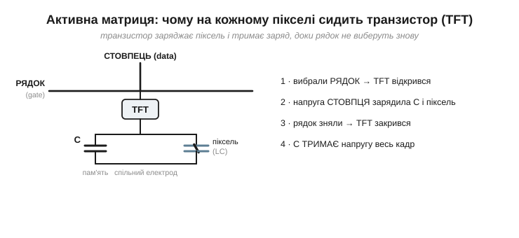
*Рис. 13.1.1.3. Чому «TFT». Щоб засвітити піксель, контролер вибирає його **рядок** (відкриває транзистор) і подає потрібну напругу по **стовпцю** — вона заряджає конденсатор C і саму рідкокристалічну комірку. Тоді рядок знімають, транзистор закривається — і C **тримає** напругу весь кадр, доки не дійде черга оновити цей піксель знову. Транзистор-засувка перетворює мерехтливе сканування на стійку картинку.*

Така будова має чіткі наслідки, які варто відчути наперед. Підсвітка горить **завжди**, поки екран увімкнено, — і саме вона з'їдає більшу частину енергії, незалежно від того, що на екрані. «Чорний» колір — це заслінка, закрита до краю; але повністю світло вона не перекриває, трохи завжди протікає, тож чорний на TFT-LCD виходить **сіруватим**, особливо помітно в темряві. Зате технологія дешева, зріла, дає яскраву картинку в освітленому приміщенні й **не вигоряє** від статичного зображення.

Варто оцінити, якою ціною дається ця яскрава картинка. Підсвітка світить білим, а кольорофільтр кожного підпікселя **викидає** дві третини цього світла, лишаючи тільки свою смугу спектра; додайте два поляризатори, що разом гасять більш як половину, та тонкі дроти й транзистори, які затуляють частину площі, — і до ока доходить лише кілька відсотків того, що випромінила лампа. Звідси парадокс: щоб екран **здавався** яскравим, підсвітка мусить бути в рази потужнішою за саму картинку. А навіщо взагалі транзистори, видно, якщо уявити просту, **пасивну** матрицю — без них, де піксель живиться лише в ту мить, коли сканування дійшло до його рядка. При сотнях рядків кожен світиться мізерну частку часу, картинка тьмяніє й розпливається в сусідні комірки. Активна матриця знімає це обмеження: транзистор-засувка тримає піксель увімкненим **весь** кадр, тож контраст і чіткість не падають зі зростанням роздільності — за це й платимо транзистором на кожному підпікселі.

> 🔧 **Навіщо це.** Коли в характеристиках виробу бачите «2.4″ TFT, 240×320» — одразу думайте про **дві речі**: підсвітку (її струм увійде в енергетичний бюджет як постійна стаття, хоч би що було на екрані) і про те, що глибокого чорного не буде. Для приладу з акумулятором це означає: великий яскравий TFT — це або товстіша батарея, або коротший час роботи. Часто саме дисплей, а не процесор, виявляється головним споживачем у пристрої.

### OLED: піксель, що світиться сам

Зовсім інакше влаштований **OLED** — органічний світлодіод (*organic LED*). Зі звичайним світлодіодом ви вже знайомі з §2.5.7: це діод, чий p-n-перехід під струмом **випромінює світло**. OLED — той самий принцип, тільки замість кристалічного напівпровідника тут тонесенькі шари **органічних** (вуглецевих) молекул, а сам випромінювач можна зробити мікроскопічним і вкрити ним поверхню мільйонами штук. Кожен підпіксель стає власною крихітною лампочкою.

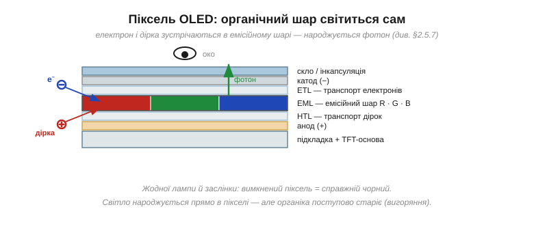
*Рис. 13.1.1.4. Піксель OLED у розрізі. Між катодом (−) і анодом (+) — стос органічних шарів. Транспортні шари підводять до середнього, **емісійного** шару електрони з одного боку й «дірки» (брак електрона) з іншого. Зустрічаючись, електрон і дірка **рекомбінують**, і надлишок енергії вилітає **фотоном**. Колір задає сам матеріал емісійного шару (свій для R, G, B). Лампи й заслінки немає — світло народжується прямо в пікселі.*

Оскільки кожен підпіксель світиться сам, OLED не потребує ні підсвітки, ні кольорофільтра, що ділить чуже біле світло. (Транзисторна основа під пікселями тут теж є — її називають AMOLED, активноматричний OLED, — але транзистор тепер керує **струмом** крізь органіку, а не заслінкою.) Наслідки знову прямо випливають із фізики. Вимкнений піксель **не світить зовсім** — це **справжній, ідеальний чорний**, а отже, разючий контраст. Темний інтерфейс на OLED **економить енергію**: гасиш пікселі — гасиш споживання, на відміну від TFT, де підсвітка горить однаково. Панель виходить тонша й може бути гнучкою.

Та є й зворотний бік. Органічні молекули **старіють** від світіння, причому нерівномірно: синій вицвітає швидше за інші, а пікселі, що довго показують те саме (годинник у кутку, рядок статусу, логотип), вигоряють сильніше за сусідів. Так виникає **вигоряння** (*burn-in*) — примарний слід статичної картинки, що лишається назавжди. Для інтерфейсу приладу, де часто є незмінні елементи, це реальна інженерна турбота, а не дрібниця.

Кольори OLED робить двома різними шляхами, і їх варто розрізняти. Або поряд ставлять три окремі емітери — червоний, зелений, синій, кожен зі свого матеріалу, — або беруть один білий OLED і ділять його кольорофільтром, як у LCD. Перший шлях ефективніший, бо світло не викидається у фільтр, зате складніший у виробництві. І саме тут корінь вигоряння: **синій** підпіксель випромінює найенергійніші фотони, його органіка зношується найшвидше, тож із роками панель не просто тьмяніє, а й **відпливає** в кольорі, бо синього стає дедалі менше. Натомість відсутність підсвітки дарує OLED те, чого LCD не вміє: панель виходить тонкою, як плівка, її можна **згинати** й навіть робити частково прозорою. Звідси й мода на гнуті та безрамкові екрани — вона виросла не з дизайнерської примхи, а прямо з цієї фізики «світла без лампи».

> 🔧 **Навіщо це.** OLED спокусливий для HMI: глибокий чорний, тонкість, економія на темному UI. Але якщо ваш інтерфейс має **статичні елементи** (постійна шкала, піктограми режиму, фірмовий напис), закладайте захист від вигоряння — легкий зсув картинки, згасання за бездіяльності, уникання яскравих незмінних плям. Те, що красиво виглядає на demo, за рік безперервної роботи може лишити на екрані привид меню.

> 🔌 **Компонент.** Маленькі монохромні OLED-дисплейчики (клас SSD1306) надзвичайно популярні в аматорській і приладовій електроніці — їх чіпляють по I²C двома дротами. Як влаштована їхня відеопам'ять і як вивести перший піксель — у компонентній вставці до цієї теми (`r01-s1-c-ssd1306.md`).

### E-ink: дзеркальний піксель, що тримає картинку без струму

Третій клас не схожий на перші два нічим. **E-ink** (електронне чорнило, *electronic ink*) — технологія **електрофоретична** (*electrophoretic*): вона рухає в полі заряджені порошинки пігменту. Уявіть мільйони крихітних прозорих **мікрокапсул**, у кожній — каламутна рідина з білими й чорними частинками. Білі заряджені, скажімо, додатно, чорні — від'ємно. Прикладемо до капсули електричне поле в один бік — білі частинки спливуть до поверхні, і піксель стане **білим**; перевернемо поле — догори підніметься чорне, і піксель **почорніє**.

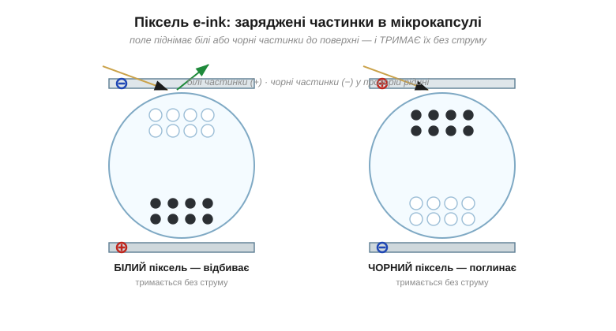
*Рис. 13.1.1.5. Піксель e-ink. Ліворуч поле підняло **білі** частинки (+) до прозорого верхнього електрода — піксель відбиває падаюче світло й виглядає білим. Праворуч поле перевернули, нагору вийшли **чорні** (−) — піксель поглинає світло й чорніє. Найважливіше: коли поле прибрати, частинки **лишаються на місці**. Картинка тримається роками без жодного струму.*

Тут одразу впадають в око дві риси, яких не мають ні TFT, ні OLED. По-перше, e-ink **відбивний**: він не має власного джерела світла й користується навколишнім, як папір. Тому він чудово читається на яскравому **сонці** (де TFT і OLED сліпнуть від бліків) — і зовсім невидимий у темряві без підсвітки. По-друге, він **бістабільний** (*bistable*): обидва стани пікселя стійкі самі собою, тож після перемикання частинки нікуди не дінуться й **тримають зображення без живлення**. Енергія потрібна лише в **мить зміни** картинки; між оновленнями споживання — практично **нуль**.

Платою за це є повільність (частинки повзуть у рідині мляво), типова відсутність повноцінного кольору (здебільшого відтінки сірого) і «привиди» попереднього зображення — **ghosting**, з яким окремо розбиратимемося у темі 13.1.7.

Чому ж e-ink настільки схожий на папір, що зблизька його легко сплутати з друком? Бо він, як і папір, **відбиває світло розсіяно**, на всі боки: нема ні власного сяйва, ні дзеркального блиску підсвіченого скла, тож очі не втомлюються й не ловлять бліків під лампою. Колір цій технології дається важко: щоб додати барв, поверх чорно-білих капсул кладуть кольоровий фільтр або беруть кілька різних пігментів в одній капсулі — але палітра виходить блякла, а оновлення ще повільніше, тож кольоровий e-ink досі радше виняток. Зате бістабільність дарує по-справжньому незвичну рису: картинка лишається на екрані, **навіть якщо взагалі вийняти живлення**. Цінник на полиці магазину показує ціну роками від крихітної батарейки, а знеструмлена читалка застигає на останній сторінці — для решти дисплеїв таке просто немислиме.

> 🔧 **Навіщо це.** E-ink створений для пристроїв, що **рідко** змінюють картинку й мусять жити **довго**: цінники на полицях, кімнатні датчики з показом раз на хвилину, читалки, бейджі. Такий пристрій може місяцями працювати від маленької батарейки, бо екран споживає лише під час оновлення. Але спробуйте показати на ньому анімацію чи плавний графік — і вся перевага зникне: e-ink не для руху.

### Карта компромісів: коли що

Тепер видно, що **«найкращого» класу немає** — кожен виграє в одному й програє в іншому, бо все це наслідки тієї самої початкової розвилки «звідки світло». Зведімо різницю в одну карту.

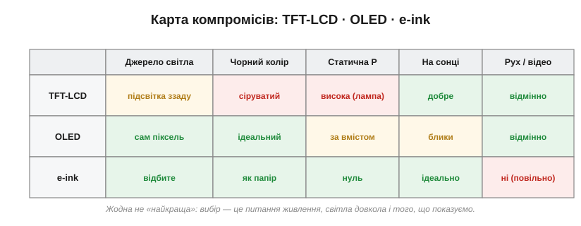
*Рис. 13.1.1.6. Класи поруч. Зелене — сильний бік, червоне — слабкий, жовте — «залежить». Видно, що профілі майже дзеркальні: e-ink панує там, де треба економність і сонце, OLED — де контраст і відео, TFT-LCD — недорогий яскравий універсал для освітлених приміщень.*

Найчастіше вирішальною віссю вибору стає **енергія разом зі світловим середовищем**. Щоб відчути масштаб різниці, гляньмо на споживання в часі для типового випадку — екрана, що показує майже незмінну інформацію.

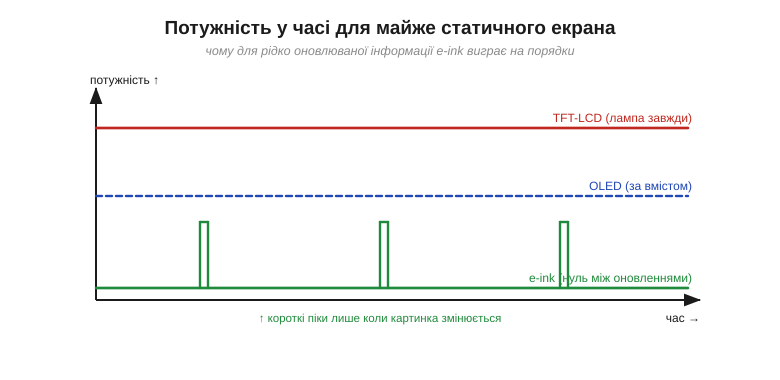
*Рис. 13.1.1.7. Потужність майже статичного екрана. У TFT-LCD підсвітка горить рівно й безперервно. OLED споживає менше на темному вмісті, але теж постійно, поки світиться. А e-ink між оновленнями лежить на нулі й бере енергію лише короткими піками, коли картинка справді змінюється.*

**Приклад (бюджет енергії статичного екрана).** Невеликий екран показує інформацію, що оновлюється раз на хвилину. Порахуймо, скільки енергії кожен клас витратить за цю хвилину (60 с) на той самий показ. Візьмемо грубі, але типові за порядком цифри:

```
TFT-LCD:  підсвітка ≈ 100 мВт, горить увесь час
          E = 100 мВт × 60 с            = 6.00 Дж

OLED:     темний UI ≈ 25 мВт, світиться весь час
          E = 25 мВт × 60 с             = 1.50 Дж

e-ink:    ≈ 0 мВт у спокої + одне оновлення ≈ 30 мВт впродовж 1 с
          E = 30 мВт × 1 с + 0 × 59 с   = 0.03 Дж
                                          ────────
          e-ink проти TFT-LCD:  6.00 / 0.03 ≈ у 200 разів менше
```

За хвилину різниця здається дрібницею в джоулях, але помножте її на дні автономної роботи — і саме вона вирішує, що ваш датчик житиме від однієї батарейки тиждень чи рік. Ось чому фізику пікселя варто тримати в голові ще на етапі задуму виробу, а не згадувати про неї, коли батарея вже не вміщається в корпус.

Ми розклали три класи дисплеїв на їхню першооснову — спосіб, у який народжується керована цятка світла, — і побачили, як із цієї однієї відмінності випливають усі практичні наслідки. Це фундамент, на якому стоятиме решта розділу: маючи карту класів, далі ми навчимося міряти панель числами (роздільність, яскравість, кути, мерехтіння) і розмовляти з нею по шині.

---

## 13.1.2 Параметри панелі: роздільність, яскравість, кути, ШІМ-мерехтіння

Обравши клас дисплея, ви відкриваєте даташит — і впираєтесь у стовпчик цифр: «320×240», «350 cd/m²», «кут огляду 70/70/60/70», «частота ШІМ 240 Hz». Саме ці числа, а не гарне слово «TFT» чи «IPS» у назві, вирішують, чи буде ваш екран читабельним **у тих умовах, де працюватиме виріб**: під лампою в цеху, на вулиці під сонцем, під косим поглядом водія, від пригашеної заради економії підсвітки. Біда в тому, що даташити **лестять**: цифру міряють у найвигідніших умовах, а ви житимете в реальних. Тож навчімося читати ці параметри тверезо — по черзі, від найочевиднішого.

### Роздільність: не скільки пікселів, а які вони на оці

**Роздільність** (*resolution*) — це кількість пікселів по ширині й висоті, як-от 320×240. Здавалося б, що більше — то краще. Але сама по собі ця цифра неповна: 320×240 на годинниковому циферблаті й на двометровому щиті — геть різна чіткість. Важить не кількість пікселів, а їхня **щільність** — і, зрештою, **кутовий розмір** одного пікселя на оці глядача.

Щільність міряють у **PPI** (*pixels per inch*, пікселів на дюйм): скільки пікселів припадає на дюйм екрана. А чи побачить око окремий піксель — залежить ще й від відстані. Людське око розрізняє деталі приблизно до **однієї кутової мінути** (1′ = 1/60°): дрібніше зливається в суцільне. Тому той самий екран зблизька показує «драбинку» пікселів, а здалеку — гладку картинку.

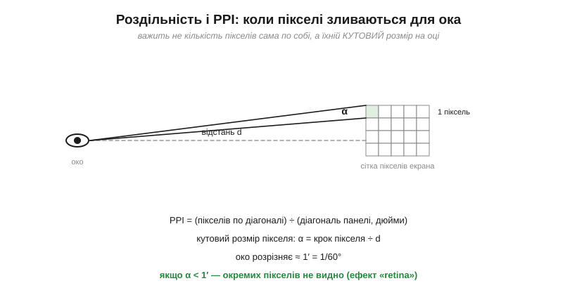
*Рис. 13.1.2.1. Один піксель видно під кутом α = (крок пікселя) ÷ (відстань d). Око розрізняє приблизно 1′; щойно α стає меншим за цю межу, окремі пікселі зливаються — це й називають «retina»-щільністю. Тож «достатня» роздільність залежить від того, з якої відстані дивитимуться.*

З цього випливає практичний висновок: **роздільність не безкоштовна**. Кожен зайвий піксель — це більше відеопам'яті на кадр, більше даних щокадру проганяти по шині й трохи дорожча панель. Гнатися за щільністю, якої око однаково не побачить із робочої відстані, — означає марно палити ці ресурси.

**Приклад (PPI і «retina»-відстань).** Невелика панель 2.4″ з роздільністю 320×240. Порахуймо її щільність і відстань, з якої пікселі зіллються:

```
пікселів по діагоналі = √(320² + 240²) = √160000   = 400 px
PPI = 400 ÷ 2.4″                                    ≈ 167 PPI
крок пікселя = 25.4 мм ÷ 167                        ≈ 0.152 мм

«retina»-відстань, де α = 1′ = 0.000291 рад:
d = крок ÷ α = 0.152 мм ÷ 0.000291                  ≈ 520 мм ≈ 52 см
```

Отже, з відстані понад ~півметра пікселі цієї панелі вже зливаються, і вищу роздільність око не оцінить; ближче — «драбинку» буде видно. Якщо ваш прилад дивляться з витягнутої руки, 167 PPI достатньо, і нарощувати їх немає сенсу.

Скільки коштує роздільність, найкраще видно з підрахунку пам'яті. Один кадр кольорового зображення — це приблизно два байти на піксель: 320×240 × 2 байти ≈ **150 КБ** лише на одну копію картинки. Для багатьох мікроконтролерів це більше за всю їхню вбудовану швидку пам'ять — тож саме роздільність, помножена на глибину кольору, диктує, чи вміститься кадр у чипі, чи доведеться брати зовнішню пам'ять або тримати зображення прямо в панелі. Подвойте лінійну роздільність — і площа, а з нею й розмір кадру, зросте **вчетверо**: перехід з 320×240 на 640×480 коштує не вдвічі, а вчетверо більше пам'яті й стільки ж разів більшого потоку даних щокадру. Через цю квадратичну ціну в embedded усталилися кілька зручних роздільностей — як-от 320×240 (її звуть QVGA) чи 480×320, — що дають пристойну чіткість на діагоналях у кілька дюймів, не роздуваючи ні пам'ять, ні шину.

Варто пам'ятати й про будову самого пікселя. Він не суцільна цятка, а трійця кольорових смужок-підпікселів поряд, і вони мають **скінченний розмір**: між сусідніми пікселями завжди є темний проміжок (його частку від площі звуть коефіцієнтом заповнення, *aperture ratio*). Тому, як не нарощуй роздільність, на близькій відстані можна вловити не лише «драбинку», а й саму сітку — ефект «москітної сітки» (*screen-door effect*), особливо помітний в окулярах віртуальної реальності, де екран майже впритул до ока. І навпаки: оскільки підпікселі рознесені по горизонталі, дрібних кольорових переходів по ширині можна показати трохи більше, ніж буквально каже число пікселів, — на цьому й ґрунтуються хитрощі згладжування тексту.

> 🔧 **Навіщо це.** Перш ніж брати панель «з запасом» по роздільності, прикиньте робочу відстань і потрібний PPI — і звіртеся, чи потягне її ваша система по пам'яті та швидкості шини. Часто розумніше взяти скромнішу роздільність і витратити зекономлені кілобайти й такти на плавність інтерфейсу, а не на пікселі, яких ніхто не побачить.

### Яскравість і контраст: нити проти сонця і відблиску

**Яскравість** (*luminance*, *brightness*) міряють у **нітах** (*nit* = кандела на квадратний метр, кд/м²). Сама цифра ні про що не каже, доки не назвати середовище: те, що сліпуче в темній кімнаті, зникає під сонцем.

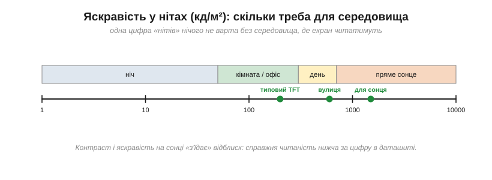
*Рис. 13.1.2.2. Скільки нітів треба. Для кімнати вистачає 200–300 кд/м², типовий TFT стільки й дає. На вулиці треба 400–700, а щоб читати під прямим сонцем — понад 1000. Шкала логарифмічна: «вуличний» екран яскравіший за кімнатний у рази, а не на відсотки.*

Поруч із яскравістю йде **контраст** (*contrast ratio*) — відношення яскравості білого до чорного. Це він робить картинку «соковитою» чи «вилинялою». І тут знову повертається фізика пікселя з попередньої теми: у LCD заслінка протікає, тож чорний — насправді темно-сірий, і контраст конечний (типово близько 1000:1); в OLED вимкнений піксель не світить зовсім, тож чорний ідеальний, а контраст фактично нескінченний.


*Рис. 13.1.2.3. Контраст — це білий, поділений на чорний. У LCD чорний сіруватий (≈0.3 кд/м²) → контраст близько 1000:1; в OLED чорний нульовий → контраст необмежений. Але є пастка: на світлі **відблиск** від поверхні додає яскравості й чорному, і реальний контраст просідає — найболючіше саме для LCD.*

Ось чому паспортний контраст «1000:1» чи «∞» — це лабораторна цифра в темряві. У реальному освітленні поверхня екрана відбиває частину навколишнього світла, додаючи його **і білому, і чорному**. Білому це майже не шкодить, а чорний з ідеального стає сіруватим — і весь контраст осідає. Тому для вуличного приладу важать не лише ніти, а й антивідблискове покриття та поведінка панелі на світлі.

Щоб ці цифри не лишалися абстракцією, варто прив'язати їх до знайомих величин. Один **ніт** — це яскравість приблизно однієї свічки, розмазаної по квадратному метру; аркуш білого паперу в добре освітленому офісі віддає в око близько сотні нітів, тож кімнатний екран на 200–300 кд/м² і робить картинку «яскравішою за папір». А тепер уявіть, скільки світла довкола надворі: у похмурий день — тисячі люксів, під прямим сонцем — десятки тисяч. Проти такого потоку навіть 500-нітовий екран здається сірою плямою, бо власне світло панелі тоне у відбитому. Звідси й вимога «понад 1000 кд/м²» для вуличних приладів — не примха, а боротьба з фоном, який у сотні разів яскравіший за кімнатний.

Є й третій, гібридний шлях, про який часто забувають: **трансфлективні** (*transflective*) панелі, що поєднують підсвітку з частковим відбиттям. У приміщенні вони світять, як звичайний TFT, а на сонці підмішують відбите світло, як e-ink, — тож що яскравіше довкола, то краще їх видно. Платять за це приглушенішими барвами й нижчим контрастом у тіні, але для приладу, який мусить читатися й у цеху, і надворі, це нерідко найрозумніший компроміс. Запам'ятаймо цю ідею «використати вороже світло собі на користь» — вона ще зустрінеться, коли йтиметься про [датчики освітленості](book:components/light-sensors) й автояскравість.

> 🔧 **Навіщо це.** Задавайте яскравість і контраст **під середовище експлуатації**, а не «щоб гарно на столі». Для приладу, який працюватиме надворі, 300 кд/м² без антивідблиску — це нечитабельний екран опівдні, хай навіть у кімнаті він сяє. І навпаки: ставити 1000-нітову панель у затемнений корпус — марно палити енергію й гроші.

### Кути огляду: TN, IPS, VA

**Кут огляду** (*viewing angle*) каже, наскільки можна відхилитися від перпендикуляра до екрана, доки картинка не зблякне, не зінвертується чи не змінить колір. Для OLED проблеми майже немає: піксель випромінює сам, тож із будь-якого боку видно те саме (хіба легкий зсув кольору). А от у LCD кут — болюче місце, і залежить він від **типу панелі**, тобто від того, як саме в ній рухаються молекули рідкого кристала.


*Рис. 13.1.2.4. У TN-панелі молекули перемикаються, нахиляючись **з площини** скла; дивлячись збоку, ви бачите крізь них зовсім іншу ефективну «товщину» — звідси різка зміна яскравості й кольору. В IPS молекули обертаються **в площині** скла, тож вид збоку майже симетричний — і кут широкий.*

Звідси три поширені родини LCD-панелей, які варто впізнавати в даташитах:

- **TN** (*twisted nematic* — той самий твіст-нематик з історії розділу): найдешевший і найшвидший, але **вузький** кут, із помітним зсувом кольору й навіть інверсією збоку.
- **IPS** (*in-plane switching*): молекули обертаються в площині, кут **широкий** (часто ~178°), кольори стабільні — ціною трохи дорожчого виробництва й вищого споживання.
- **VA** (*vertical alignment*): проміжний варіант із глибоким чорним і середніми кутами.


*Рис. 13.1.2.5. Відносний контраст проти кута огляду. TN валиться вже після 30–40°, VA тримається середньо, а IPS і OLED зберігають контраст майже до краю. Саме ця крива, а не маркетингове слово в назві, каже, чи годиться панель для перегляду збоку.*

> 🔧 **Навіщо це.** Питайте себе, **з якого боку** дивитимуться на екран. На прилад, який бачить кілька людей одразу або який вмонтований під кутом (панель на стіні, приладова дошка), беріть IPS — інакше половина глядачів побачить вилинялу або перекручену картинку. Для ручного пристрою, що його тримають перед собою прямо, заощадливий TN часто цілком прийнятний.

У TN-панелі деградація з кутом має ще одну підступну рису, варту окремого слова, — **інверсію градацій сірого** (*gray-scale inversion*). Якщо дивитися на дешевий TN-екран знизу, з-під «невдалого» краю, темне й світле можуть **помінятися місцями**: картинка перетворюється на негатив. Це не уявний дефект, а пряма фізика — нахилені молекули дають таку залежність повороту світла від кута, що за певного нахилу яскравість іде в зворотний бік. Саме тому в дешевих приладах виробник зазвичай орієнтує панель так, щоб «гарний» бік дивився туди, звідки на неї найчастіше дивляться, а «поганий» ховався. Кольоровий зсув має ту саму причину: різні довжини хвиль зміщуються з кутом неоднаково, тож збоку білий може відливати то жовтим, то синім.

Корисно знати й типові «домівки» кожного типу, бо вони не випадкові. TN живе там, де головне — ціна і швидкість: прості індикатори, бюджетні прилади, ігрові монітори, де цінують малу затримку. IPS став стандартом для всього, на що дивляться зблизька й під різними кутами, — смартфонів, планшетів, якісних приладових екранів. VA облюбував телевізори й монітори, де цінують глибокий чорний, а збоку на них дивляться рідко. Тримаючи в голові цю карту, ви з самої абревіатури в даташиті вже наполовину вгадаєте, на що панель здатна.

### ШІМ-мерехтіння: як дешевий димінг псує очі

Останній параметр непомітний у статичних характеристиках, зате відчутний очима. Щоб **притишити** підсвітку (зробити екран темнішим), найдешевший спосіб — **ШІМ** (*PWM*, широтно-імпульсна модуляція): світлодіоди підсвітки швидко вмикають і вимикають, а яскравість задають **шпаруватістю** (*duty cycle*) — часткою часу, коли вони ввімкнені. Хочеш 30% яскравості — світи 30% часу. Око усереднює миготіння й бачить пригашене світло.

Проблема — у **частоті** цього миготіння. Якщо вона низька (сотні герців), мозок і око починають його **відчувати**: втома, різь, головний біль за тривалого дивлення, а на відео й фото — рухомі смуги (камера з її построковим затвором ловить світлі й темні фази). Найгірше поєднання — **низька частота плюс низька яскравість**: тоді спалахи стають рідкими й короткими, і мерехтіння найпомітніше.


*Рис. 13.1.2.6. Угорі — низькочастотний ШІМ: рідкі широкі імпульси, око бачить мерехтіння, а камера — смуги. Унизу — той самий duty (та сама яскравість), але висока частота: спалахи зливаються в рівне світло. Лікування — ШІМ понад кілька кілогерців або аналоговий (струмовий) димінг зовсім без миготіння.*

Зауважте: яскравість в обох випадках **однакова** — її задає шпаруватість, а не частота. Частота вирішує лише, чи помітне миготіння. Тому, обираючи панель чи модуль підсвітки, варто глянути на частоту ШІМ у даташиті, а як її там немає — перевірити просто: помахати перед екраном олівцем (на низькій частоті він «розсиплеться» на окремі образи) або навести камеру телефона й пошукати смуги. (Як саме влаштований драйвер підсвітки й керування струмом — окрема тема 13.1.5; тут нам важить сам параметр.)

> 🔧 **Навіщо це.** Мерехтіння — не косметика, а питання здоров'я й комфорту, надто для приладу, на який дивляться годинами. Якщо виріб даватиме змогу пригашувати екран, переконайтеся, що димінг іде на високій частоті або аналогово; інакше на низькій яскравості користувач отримає непомітне свідомо, але втомливе миготіння — і не зрозуміє, чому від вашого пристрою болить голова.

Чому ж 240 Гц — це мало, адже око начебто не бачить мерехтіння вже з 50–60 Гц? Бо «зливання в рівне світло» (поріг злиття мерехтінь, *flicker fusion*) — це лише про **нерухомий** погляд у центр. Периферійний зір чутливіший, а головне — варто оку **ковзнути** по екрану чи об'єкту перед ним рушити, як мозок розкладає спалахи в часі назад: швидкий рух ока «розмазує» окремі імпульси по сітківці в пунктир. Звідси два неприємні ефекти. Перший — **стробоскопічний**: рука, що махнула перед екраном, чи курсор, що швидко їде, двоїться на низці примарних копій (*phantom array*). Другий — та сама втома й біль голови, бо зорова система раз у раз ловить переривчастість, хай свідомість її й не помічає. Саме тому за комфортний поріг беруть не 60, а кілька тисяч герців — із добрячим запасом над усіма цими тонкими механізмами.

Альтернатива ШІМу — **аналоговий**, або **струмовий**, димінг: яскравість міняють не часткою часу, а самою величиною струму крізь світлодіоди, які тоді світять рівно й безперервно. Мерехтіння зникає в корені. Платою буває легкий зсув кольору підсвітки на малих струмах і складніша схема керування, тож на практиці часто йдуть на **гібрид**: аналогово тримають струм у комфортному діапазоні, а далі, для зовсім глибокого пригашення, додають ШІМ — але вже на високій частоті. Як саме збудувати такий драйвер і чому світлодіодом керують струмом, а не напругою, — це окрема, суто схемотехнічна тема 13.1.5; тут нам досить розуміти сам параметр і його ціну для очей.

Роздільність, яскравість із контрастом, кути й мерехтіння — це чотири лінійки, якими панель міряють **поверх** її класу. Дві «IPS 320×240» можуть відрізнятися як небо і земля, щойно зазирнути в ці цифри й чесно прикласти їх до умов виробу. Тепер, коли ми вміємо і вибрати клас, і оцінити конкретну панель, лишається питання суто інженерне: як цю панель **під'єднати** до мікроконтролера й погнати в неї пікселі — і чому вибір інтерфейсу впирається в ту саму роздільність, яку ми щойно рахували.

---

## 13.1.3 Інтерфейси панелей: SPI, паралельний 8080, RGB, MIPI-DSI

Панель вибрано — тепер її треба фізично під'єднати до мікроконтролера й **погнати в неї пікселі**. І тут постає інженерна проблема, яку легко недооцінити: пікселів дуже багато, а оновлювати їх треба десятки разів на секунду, тож зображення — це **потужний потік даних**, а інтерфейс між МК і панеллю — труба скінченної ширини. Уся ця тема — про напругу між тим, скільки пікселів за скільки кадрів ви хочете показати, і тим, наскільки широку трубу можете собі дозволити: у **пінах** мікроконтролера, у **мегагерцах** шини, у складності схеми. Розгляньмо чотири поширені труби — від тонкої й простої до широкої й швидкої, — і побачимо, чому вибір щоразу впирається в роздільність.

### Скільки даних треба гнати: бюджет пікселів

Перш ніж порівнювати інтерфейси, порахуймо сам **попит** — скільки бітів за секунду треба пропхати, щоб картинка жила. Це добуток чотирьох чисел: скільки пікселів по ширині, скільки по висоті, скільки бітів на колір кожного пікселя й скільки разів на секунду все це оновлюється.


*Рис. 13.1.3.1. Логарифмічна шкала Мбіт/с. Угорі — скільки **потрібно** для різних роздільностей при 60 кадрах/с; унизу — стеля кожного інтерфейсу. Видно одразу: SPI ледь дотягується до дрібних панелей, а великі роздільності годує лише RGB або MIPI-DSI. Це й є головна вісь усієї теми.*

**Приклад (бюджет пікселів).** Порахуймо потік для двох типових панелей при 16 бітах на піксель і 60 кадрах за секунду:

```
дані = ширина × висота × (біт/піксель) × (кадрів/с)

320×240:  320 × 240 × 16 × 60 = 73 728 000  ≈ 73.7 Мбіт/с
800×480:  800 × 480 × 16 × 60 = 368 640 000 ≈ 369 Мбіт/с
```

Запам'ятайте ці порядки: збільшення площі екрана вп'ятеро множить потік теж **уп'ятеро**. Дрібну панель нагодує навіть скромна послідовна шина, а більша вже вимагатиме широкої паралельної або диференційної. Важлива тонкість: ця цифра — попит на **безперервне** годування. Як ми побачимо, частина інтерфейсів справді мусить гнати весь кадр щоразу, а частина — лише зміни; та закладатися варто на гірший випадок.

У цій формулі ховається ще один важіль, яким часто крутять, — **глибина кольору** (біт на піксель). Перейти з 16 біт (звичні «65 тисяч кольорів») на 24 (повні «мільйони») — це півтора раза більше даних на той самий екран; піти навпаки, на 8 біт чи на палітру, — стільки ж разів менше. Тож коли труба не тягне, інженер торгується не лише роздільністю й частотою кадрів, а й кольором. І останнє застереження: реальна пропускна здатність завжди **нижча** за цей теоретичний добуток, бо частину тактів з'їдають службові витрати — паузи між байтами, перемикання «команда/дані», синхросигнали й порожні поля між рядками кадру. Закладати інтерфейс упритул до бюджету не можна — потрібен запас, інакше панель не встигатиме оновлюватися й картинка почне «гальмувати».

> 🧮 **Порахувати точно.** Як зважити цей бюджет під конкретну панель — роздільність × глибина × FPS проти реальної швидкості шини, із запасом на службові такти, — у математичній вставці до цієї теми (`r01-s3-m-bandwidth-budget.md`).

### SPI: два-три дроти, найпростіша труба

Найтонша й найпопулярніша в аматорстві труба — **SPI** (*serial peripheral interface*). Даних тут лише один провід (MOSI), плюс такт (SCK) і вибір кристала (CS); до них додають лінію DC (*data/command* — каже панелі, байт це команда чи піксель), скидання RST і зрідка зворотний MISO. Усього три-п'ять дротів — мрія для МК із дефіцитом пінів.


*Рис. 13.1.3.2. Підключення SPI-дисплея. Хост шле біти по MOSI під такт SCK; лінія DC розрізняє команди й дані. Сама панель несе **контролер із власною памʼяттю кадру** (GRAM): вона тримає зображення й освіжає скло без участі МК. Тому по SPI можна слати лише ЗМІНИ — і це рятує вузьку шину.*

За простоту платять шириною: SPI **послідовний**, тобто жене по одному біту за такт. Навіть на щедрих 40–80 МГц це лише 40–80 Мбіт/с — якраз стеля для дрібних панелей, як показав наш бюджет. Рятує SPI-дисплеї одна архітектурна риса: майже завжди вони мають **власний контролер із памʼяттю кадру** (*GRAM*, графічна RAM). МК шле туди команди й дані пікселів, а контролер сам, без участі процесора, безперервно освіжає скло з тієї памʼяті. Отже, хосту не треба гнати кадр 60 разів на секунду — досить надіслати те, що **змінилося**. Перемалювати весь екран по SPI повільно, а от посунути стрілку годинника чи оновити рядок цифр — миттєво.

Щоб відчути межу на числах: один повний кадр 320×240 по 16 біт — це близько 1.2 Мбіт, і навіть на 40 МГц SPI віддасть його приблизно за **30 мс**. Отже, суцільний перемальунок усього екрана — це від сили 30 кадрів за секунду, та й то якщо процесор тим часом не робить більше нічого. Ось чому на SPI-дисплеях так бережуть кожен зайвий піксель і чіпають лише ту ділянку, що справді змінилася. Саму передачу майже завжди віддають на **DMA** (прямий доступ до памʼяті): процесор лише каже «вижени цей шматок у дисплей» і вертається рахувати наступний кадр, а біти йдуть самі, без його участі. Без цього прийому навіть скромний інтерфейс зʼїв би весь процесорний час на саме «штовхання байтів».

> 🔧 **Навіщо це.** SPI — стандартний вибір, коли пінів мало, а екран невеликий: давачі, кишенькові прилади, носимі пристрої. Але закладаючи SPI-панель, чесно прикиньте, чи витримає вона потрібну **частоту оновлення** того, що в вас рухається: для статичного інтерфейсу з рідкими змінами — ідеально, для плавної анімації на весь екран — задихнеться.

### Паралельний 8080: ціле слово за один строб

Хочеться більше швидкості, зберігши просту «командно-даних» логіку? Тоді беруть **паралельний інтерфейс 8080** (названий за стилем шини процесора Intel 8080). Замість одного дроту даних тут їх вісім або шістнадцять, а керують ними кількома лініями: WR (запис), RD (читання), CS (вибір), DC/RS (команда чи дані).


*Рис. 13.1.3.3. Шина 8080. Хост виставляє ціле слово на лініях даних і смикає строб **WR**; на його фронті контролер «защіпає» це слово. За один строб проходить 8 чи 16 біт — у стільки ж разів швидше за SPI, що жене по біту.*

Виграш прямий: якщо SPI віддає біт за такт, то 8080 віддає **ціле слово за строб** — байт чи два байти за одне смикання лінії WR. При тих самих тактових частотах це у 8 чи 16 разів ширша труба. Платять, звісно, пінами: вісім-шістнадцять ліній даних плюс керування — це вже 12–24 проводи проти трьох у SPI. Архітектурно 8080-панель така сама «розумна», як SPI: усередині той самий контролер із GRAM, що сам освіжає скло, тож і тут хост шле лише зміни, тільки швидше. Багато контролерів дисплеїв розуміють **обидва** інтерфейси — SPI й 8080, — і вибір між ними стає простим компромісом «піни проти швидкості».

На залізі 8080 лягає напрочуд природно. Багато мікроконтролерів мають апаратний блок, що вміє виставляти такий паралельний інтерфейс сам — наче звичайний запис у зовнішню памʼять; і тоді надіслати слово в дисплей коштує процесору **однієї** інструкції запису за адресою, а решту — лінії даних, строб WR, утримання рівнів — залізо зробить без нього. Між 8- і 16-розрядним варіантом теж є торг: шістнадцять ліній удвічі швидші, але зʼїдають удвічі більше пінів, а на дрібному корпусі їх може просто не вистачити. Тому 8-бітний 8080 — частий компроміс там, де пінів обмаль, а SPI вже не встигає за тим, що рухається на екрані.

> 🔧 **Навіщо це.** 8080 — золота середина для панелей середнього розміру на звичайному МК: помітно швидше за SPI, та сама проста модель «команда/дані», і часто його можна повісити на апаратний паралельний порт мікроконтролера. Беріть його, коли SPI вже не встигає перемальовувати екран, а тягти повноцінний RGB-інтерфейс зарано.

### RGB-паралельний (DPI): гнати щокадру без упину

Коли панель велика, з'являється геть інша порода інтерфейсу — **паралельний RGB** (*DPI*, *display parallel interface*). Тут немає жодних «команд»: хост напряму, безперервно виставляє на шину **колір кожного пікселя** по черзі. Лінії — це власне дані кольору (зазвичай 16, 18 або 24 біти на R/G/B разом), піксельний такт **PCLK** (на кожен його фронт — новий піксель) і синхросигнали: HSYNC (кінець рядка), VSYNC (кінець кадру) і DE (*data enable* — позначка, що зараз ідуть справжні видимі пікселі, а не службове «гасіння»).


*Рис. 13.1.3.4. RGB-інтерфейс. Панель **не має GRAM** — вона «дурна» й лише засвічує те, що зараз на лініях. Тому контролер мусить безперервно сканувати кадр рядок за рядком, видаючи пікселі під PCLK, а між видимими ділянками — порожні «поля» (porch) для гасіння. Зупиниш потік — картинка розсиплеться.*

Ключова відмінність — у тому, чого тут **немає**: памʼяті в панелі. RGB-панель «дурна», вона не запамʼятовує нічого, а лише в цю мить засвічує те, що бачить на лініях. Отже, хтось мусить **безперервно**, кадр за кадром, видавати їй увесь растр — рівно той потік у сотні Мбіт/с, що ми порахували в бюджеті. У мікроконтролері це робить спеціальний апаратний блок — **контролер дисплея** (з §4.9), який сам, через DMA, без упину вичитує кадровий буфер із памʼяті хоста й женеться ним у панель. Звідси й подвійна ціна RGB: широка й безперервна шина (28–40 пінів) **плюс** памʼять під кадровий буфер у самому хості. Зате й роздільності тут — ті, що SPI і не снилися.

Дві деталі роблять RGB особливо вимогливим. По-перше, контролер гонить не лише видимі пікселі, а й уже згадані **порожні поля** (porch) — службові паузи в кінці кожного рядка й кожного кадру, потрібні, щоб «перевести промінь» на початок наступного; через них реальна частота PCLK відчутно вища за голий добуток пікселів, а отже, і навантаження на шину більше, ніж здається з бюджету. По-друге, кадровий буфер у памʼяті хоста — це той самий рахунок, що ми вели в темі про роздільність: 800×480 по 16 біт — це ~0.75 МБ лише на одну копію картинки, а для плавної мальовки хочеться дві. Стільки швидкої памʼяті є далеко не в кожному МК, тож RGB-панель часто диктує і вибір самого контролера — з достатньою вбудованою або зовнішньою RAM.

> 🔧 **Навіщо це.** RGB-інтерфейс бери лише тоді, коли твій МК має апаратний контролер дисплея й досить памʼяті під кадровий буфер; інакше процесор просто не встигне годувати панель і захлинеться. Це межа, за якою «причепити екран» перестає бути дрібницею і стає окремою підсистемою, що зважено впливає на вибір самого мікроконтролера.

### MIPI-DSI: швидкість по диференційних парах

На верхньому щаблі — **MIPI-DSI** (*display serial interface*), стандарт зі світу смартфонів. Він знову послідовний, як SPI, але влаштований зовсім інакше: дані біжать по **диференційних парах** (згадайте §6.3 — пара проводів із протифазними сигналами, стійка до завад і здатна на шалені швидкості). Є одна тактова пара й від однієї до чотирьох смуг даних, і кожна смуга несе **гігабіти за секунду**.

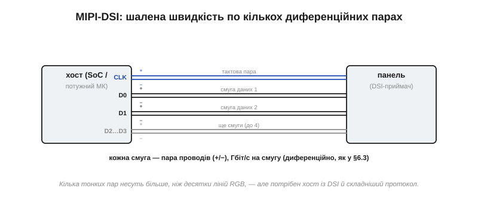
*Рис. 13.1.3.5. MIPI-DSI. Кілька тонких диференційних пар (тактова + смуги даних) переганяють більше, ніж десятки ліній паралельного RGB. Платня — потрібен хост із підтримкою DSI й помітно складніший, пакетний протокол.*

Парадокс DSI в тому, що, маючи **менше** дротів за паралельний RGB (кілька пар замість сорока ліній), він несе **набагато більше** даних — саме завдяки диференційній передачі на дуже високій частоті. Це робить його ідеальним для телефонних роздільностей. Ціна — складність: пакетний протокол, жорсткі вимоги до розведення пар, і головне — DSI вміють лише потужні мікроконтролери та системи-на-кристалі, а не звичайні МК. Для більшості embedded-проєктів на скромному контролері DSI лишається недосяжним верхом, про який корисно знати, але до якого рідко доходить.

Варто знати й те, що сам DSI буває двох норовів — і це повертає нас до знайомого поділу. У **відеорежимі** (*video mode*) панель, як RGB, власної памʼяті не має, тож хост мусить безперервно слати кадри. У **командному** (*command mode*) панель несе свою памʼять кадру, як SPI-дисплей, тож хост шле лише зміни, а між ними процесор і шина можуть спати. Тобто навіть на цьому найшвидшому інтерфейсі знову зринає те саме питання — чи є в панелі власна памʼять, — яким ми закриємо тему. Для приладів на батареї командний режим особливо цінний саме цією змогою «замовкнути», поки картинка нерухома.

### Чому вибір упирається в роздільність

Тепер видно наскрізну логіку всієї теми. Попит на пропускну здатність росте з добутком ширини, висоти й частоти кадрів — тобто **прямо з роздільності**, яку ми обирали в попередній темі. А кожен інтерфейс має свою стелю. Тож вибір труби — це не питання смаку, а просте узгодження: труба мусить пропустити той потік, що його вимагає ваша картинка.


*Рис. 13.1.3.6. Чотири інтерфейси поруч. Видно закономірність: що ширша труба, то або більше дротів (RGB), або складніший хост (DSI). Дешеві SPI й 8080 перекладають клопіт на власний контролер панелі; широкі RGB і DSI — на хост, що мусить сам тримати кадр і безупинно його гнати.*

Звідси й практичне правило вибору, що майже однозначно випадає з розміру екрана. Дрібна панель — бери SPI, трьох дротів досить. Середня, де SPI вже не встигає, а МК простий — 8080, доплативши пінами за швидкість. Велика, з апаратним контролером дисплея на борту — паралельний RGB. А телефонна роздільність на потужній системі — MIPI-DSI. Безкоштовної пропускної здатності не буває: за кожен крок угору платять або пінами, або складністю хоста, або і тим, і тим.

Ми простежили, як пікселі течуть від мікроконтролера до скла й чому ширина цієї труби нерозривно повʼязана з роздільністю. Та в розмові раз у раз зринало одне слово — **памʼять кадру**: у SPI й 8080 вона живе в самій панелі, у RGB і DSI — у хості. Де саме тримати зображення і хто його освіжає — це окреме інженерне рішення з власними наслідками для памʼяті, швидкості й складності, і йому присвячена наступна тема.

---

## 13.1.4 Контролер дисплея: framebuffer «на склі» чи в МК

У попередній темі раз у раз зринало одне слово — **памʼять кадру**. Настав час із ним розібратися, бо за ним ховається, мабуть, найважливіше архітектурне рішення всієї дисплейної підсистеми. Річ у тім, що будь-який живий екран потай робить **дві** окремі роботи. По-перше, він мусить десь **зберігати** поточне зображення — по одному значенню на кожен піксель; цю памʼять і звуть кадровим буфером (*framebuffer*). По-друге, він мусить **безперервно**, десятки разів на секунду, перечитувати цю памʼять і наново засвічувати нею скло — бо піксель сам собою картинку не тримає й швидко гасне. Питання теми — де живе той кадровий буфер і хто виконує освіження: усе це може взяти на себе **панель** («на склі») або **мікроконтролер**. І вибір розходиться відлунням по всьому виробу.

### Дві роботи, які хтось мусить робити

Почнімо з фізичної причини, чому освіження взагалі потрібне. Звичайний піксель — рідкокристалічна заслінка чи органічний світлодіод — утримує свій стан лише доти, доки на нього подано напругу; зніми її, і за частки секунди він повернеться у спокій. Тому матрицю доводиться **переписувати наново** рядок за рядком, знов і знов, зазвичай близько 60 разів на секунду. (Виняток — бістабільний e-ink із теми 13.1.1, що тримає картинку без живлення; але він тут радше рідкісне щастя, ніж правило.) Ця невпинна робота й зветься **освіженням** (*refresh*).

Скільки разів на секунду? Та сама межа, що й для мерехтіння з теми 13.1.2: нижче ~50–60 разів око починає ловити блимання, тож типова частота освіження — 60 герц, інколи вище. І тут ховається тонка, але важлива різниця двох понять, які легко сплутати. **Освіження** (*refresh*) — це як часто двигун перечитує памʼять і перемальовує скло; воно йде безперервно, навіть якщо картинка завмерла намертво. А **оновлення** (*update*) — це коли ми, програма, **міняємо** щось у самій памʼяті кадру. Можна освіжати екран 60 разів на секунду, а оновлювати його раз на хвилину — або навпаки, ледь устигати з бурхливою анімацією. Розрізняти їх конче треба, бо за освіження відповідає двигун (панель чи периферія), а за оновлення — ваш код; і весь подальший поділ архітектур — це, по суті, про те, кому віддати перше, лишивши собі друге.

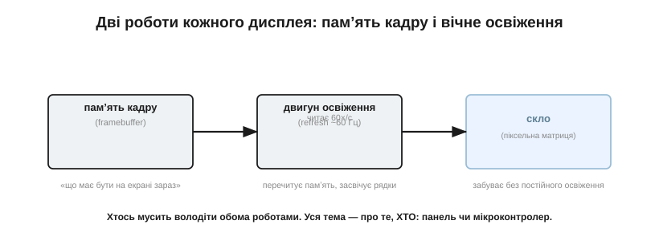
*Рис. 13.1.4.1. Будь-який дисплей робить дві речі: тримає **памʼять кадру** («що має бути на екрані зараз») і має **двигун освіження**, що перечитує цю памʼять і ~60 разів на секунду засвічує нею скло, яке інакше все забуває. Питання архітектури — хто володіє цими роботами: панель чи мікроконтролер.*

Отже, маємо дві відмінні роботи: **зберігати** зображення (памʼять) і **гнати** його на скло без упину (двигун освіження). Хтось мусить узяти на себе обидві. І тут історія роздвоюється: або їх бере панель, перетворюючись на самодостатній «розумний» модуль, або їх бере мікроконтролер, а панель лишається пасивним склом. Розгляньмо обидва шляхи — вони визначають геть різні вироби.

### Варіант А: framebuffer «на склі» — розумна панель

Найпоширеніший у світі дрібних екранів шлях — перекласти **обидві** роботи на саму панель. Такий модуль несе на собі власну мікросхему-**контролер** із вбудованою памʼяттю кадру (*GRAM*, графічна RAM). Мікроконтролер лише надсилає контролерові команди й дані пікселів; той складає зображення у свою GRAM і далі **самотужки**, на власному такті, без жодної участі МК, безперервно освіжає скло.


*Рис. 13.1.4.2. Framebuffer «на склі». Памʼять кадру і двигун освіження сховані в самому модулі панелі; мікроконтролер шле туди лише команди й зміни, а далі вільний. Так влаштовані типові SPI- та 8080-дисплеї (контролери класу ST7789/ILI9341) і DSI у командному режимі.*

Принада цього шляху — у тому, чого мікроконтролерові робити **не** треба. Йому майже не потрібна власна RAM під зображення: воно цілком лежить у панелі. Між оновленнями процесор геть вільний — надіслав зміну й може поринути в сон чи інші справи, бо освіження — не його клопіт. Для дрібного, ощадливого до памʼяті й енергії пристрою це ідеально. Платою є межі контролера: ви можете лише те, що дозволяє його набір команд; суцільний перемальунок обмежений (часто скромною) шиною; а розмір GRAM кладе стелю на роздільність панелі.

> 🔧 **Навіщо це.** Розумна панель — стандартний вибір, коли мікроконтролер дешевий і має кілька десятків кілобайтів RAM. Ви отримуєте робочий екран, не віддавши під нього ні памʼяті, ні безперервної роботи процесора. Для приладів на батареї це подвійно цінно: між рідкими оновленнями і МК, і шина просто сплять.

> 🔌 **Компонент.** Конкретику найпоширенішого класу таких панелей — контролери ST7789/ILI9341, їхнє підключення по SPI, швидкість і робота через DMA — винесено в компонентну вставку до цієї теми (`r01-s4-c-spi-tft.md`).

### Що дає контролер панелі: вікна, прокрутка, синхронізація

Контролер у панелі — не проста памʼять, а маленький помічник із корисними операціями, і головна з них — **вікно адрес** (*address window*). Замість лити пікселі підряд від кута екрана, МК спершу задає прямокутник (x0,y0)…(x1,y1), а тоді шле в нього пікселі — і оновлюється **лише цей прямокутник**. Це і є той трюк, що робить розумні панелі економними: перемальовуй не весь екран, а саму змінену ділянку.

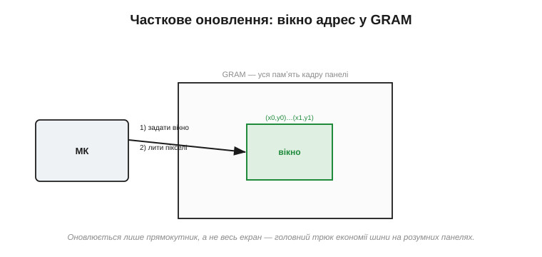
*Рис. 13.1.4.3. Часткове оновлення. МК задає контролерові прямокутне вікно в GRAM і ллє туди пікселі; решта кадру не чіпається. Замість гнати весь екран щоразу, по вузькій шині йде тільки те, що справді змінилося, — звідси й уся швидкодія дрібних дисплеїв.*

Як це виглядає в коді, варто побачити конкретно, бо воно на диво просте. Щоб оновити прямокутник, мікроконтролер шле панелі коротку послідовність команд: спершу «задати діапазон стовпців» (у контролерів цього класу це часто команда з кодом 0x2A) із межами x0…x1, потім «задати діапазон рядків» (0x2B) із y0…y1, а тоді команду «писати в памʼять» (0x2C) — і слідом ллє підряд кольори пікселів, які контролер сам розкладе по заданому вікні, рядок за рядком, аж доки воно не заповниться. Усього три команди й потік даних; жодної арифметики адрес на боці МК. Саме ця простота й зробила такі панелі улюбленцями навіть восьмибітних мікроконтролерів, де кожен зайвий такт на рахунку.

До вікна додаються й інші зручності. **Апаратна прокрутка** дає посунути показувану ділянку, не переписуючи пікселів, — задарма гортати списки чи текст. Сигнал **TE** (*tearing effect*) — окрема ніжка, якою контролер підказує мікроконтролерові: «зараз я між освіженнями, писати безпечно», щоб новий кадр не наклався на старий якраз посеред промальовування й картинка не «розірвалася». Сюди ж належить апаратний **поворот і дзеркалення**: одним регістром орієнтації панель можна змусити вважати «верхом» будь-який зі своїх боків і навіть поміняти порядок кольорових компонент (RGB ↔ BGR), тож той самий код малює однаково, хоч як фізично повернуто екран у корпусі. А режими зниженого споживання дають панелі дрімати, коли нічого не змінюється. Усі ці дрібні послуги й зробили контролери в панелі негласним стандартом світу невеликих екранів.

### Варіант Б: framebuffer у МК — дурна панель плюс периферія

Тепер переверньмо все навпаки. Памʼять кадру лежить у **власній RAM мікроконтролера**, а роль двигуна освіження бере на себе спеціальний апаратний блок усередині МК — **контролер дисплея** (*LTDC* та подібні, з §4.9). Він сам, через DMA, без упину вичитує кадровий буфер із памʼяті хоста й женеться ним у «дурну» RGB- чи DSI-панель, що пасивно засвічує те, що отримала.

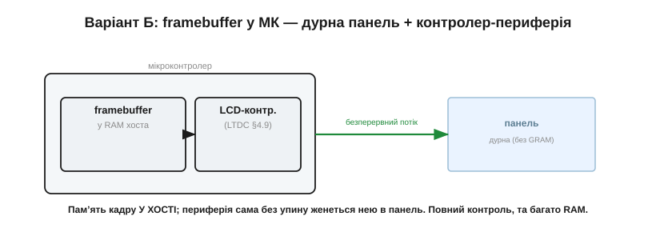
*Рис. 13.1.4.4. Framebuffer у МК. Кадр лежить у RAM хоста; вбудована периферія (LTDC) безперервно потоком віддає його дурній панелі без власної памʼяті. Натомість мікроконтролер дістає повний контроль над кожним пікселем — ціною великого шматка швидкої RAM і безупинної шини.*

Навіщо взагалі брати на себе цей клопіт? Заради **повного контролю**. Коли кадр — це твоя власна памʼять, ти малюєш у ній що завгодно й як завгодно швидко, накладаєш шари, змішуєш напівпрозорість (деякі периферії вміють це апаратно), тягнеш великі роздільності, яких розумна панель не подужала б. Ціна цьому пряма: треба віддати чималий кусень **швидкої** RAM під кадровий буфер — а для плавної мальовки бажано аж два кадри, — і часто це вже зовнішня мікросхема памʼяті; треба безперервна шина; і треба мікроконтролер, що взагалі **має** таку периферію. Це вже не «причепити екранчик», а спроєктувати дисплейну підсистему.

А чому бажано аж **два** кадрові буфери, а не один? Бо якщо малювати новий кадр прямо в ту саму памʼять, з якої периферія цієї ж миті годує панель, глядач побачить напівдомальоване — половина екрана нова, половина стара. Тому роблять подвійну буферизацію: в один буфер периферія спокійно віддає готовий кадр на скло, а програма тим часом малює наступний у другий; коли той готовий — буфери міняють ролями. Звідси й та подвоєна вимога до памʼяті: гладка анімація на весь екран коштує не одного, а двох повних кадрів швидкої RAM — ось чому хост-буфер такий ненажерливий і так часто тягне за собою зовнішню SDRAM.

> 🔧 **Навіщо це.** Хост-буфер бери, коли потрібні великий екран, плавна анімація на весь кадр чи складна графіка — і коли твій МК має і контролер дисплея, і досить RAM. Інакше задум розіб'ється об брак памʼяті або об нестачу пропускної здатності, яку ми рахували минулої теми.

### Вбудований проти зовнішнього контролера

Тепер прямо про підзаголовок теми. **Вбудований контролер** (*embedded*) — це контролер усередині самого модуля панелі: рівно варіант А, де панель «розумна». **Зовнішній контролер** має два обличчя. Перше — це згадана периферія LTDC у самому мікроконтролері: вона зовнішня щодо панелі й гонить дурне скло (варіант Б). Друге, і найцікавіше, — **окрема мікросхема-контролер** на вашій платі (класу RA8875 чи SSD1963), що сидить між слабким МК і чималою панеллю.


*Рис. 13.1.4.5. Той самий контролер можна поставити в трьох місцях. У ПАНЕЛІ (розумний модуль, SPI/8080) — МК майже не напружується. У МК (периферія LTDC) — повний контроль, та потужний хост. ОКРЕМИМ ЧИПОМ на вашій платі — золота середина: чип тримає GRAM і освіжає велику панель, а МК шле йому зміни простою шиною.*

Цей третій шлях — справжній порятунок у проміжних випадках. Окрема мікросхема несе власну GRAM і сама освіжає панель, тож навіть мікроконтролер **без** дисплейної периферії й із крихтою RAM може кермувати доволі великим екраном — він просто шле чипові зміни простою паралельною чи послідовною шиною, точно як розумній панелі. Фактично це пересаджує зручність варіанта А («памʼять — не моя турбота») на більший екран, поставивши контролер не в панель, а на власну плату.

> 🔧 **Навіщо це.** Якщо хочеться екран більший, ніж тягне розумна SPI-панель, але МК не має ні LTDC, ні мегабайтів RAM, — окремий контролер-чип часто дешевший і простіший за перехід на дорожчий мікроконтролер. Це проміжна сходинка, про яку варто памʼятати, перш ніж переписувати півпроєкту заради дисплея.

### Як рішення розходиться по всьому виробу

Найважливіше — усвідомити, що вибір місця для кадрового буфера **не локальний**: він тягне за собою сам мікроконтролер. Розумна панель — і вистачить дешевого МК на кілька десятків кілобайтів RAM із простою шиною. Хост-буфер — і потрібен МК із контролером дисплея та мегабайтами швидкої памʼяті, нерідко зовнішньої. Окремий чип — щось посередині. Те саме й із пропускною здатністю з попередньої теми: розумна панель просить лише **зміни**, а хост-буфер вимагає того **безперервного** потоку, що ми рахували.


*Рис. 13.1.4.6. Кадр «на склі» проти кадру «в МК». Розумна панель майже не їсть RAM хоста й шле лише зміни, та обмежує гнучкість і розмір; хост-буфер дає повний контроль і великі екрани, але вимагає багато памʼяті, безперервної шини й потужного МК. Безкоштовного варіанта немає — є відповідний задачі.*

**Приклад (ціна кадру в RAM хоста).** Порахуймо, у що обходиться хост-буфер для панелі 480×272 при 16 бітах на піксель:

```
один кадр = 480 × 272 × 2 байти = 261 120 байт ≈ 255 КБ
подвійна буферизація (2 кадри)  ≈ 510 КБ
```

Для мікроконтролера з кількома десятками кілобайтів вбудованої RAM це неможливо — кадр просто нікуди покласти, потрібна зовнішня памʼять. А та сама панель із вбудованим контролером забрала б у хоста під зображення майже **нуль** байтів, бо кадр живе в її GRAM. Ось наочно, чому місце кадрового буфера визначає клас мікроконтролера, а не навпаки.

Проілюструймо це двома знайомими образами. Кишеньковий термометр із крихітним екранчиком, що показує число й оновлюється раз на секунду, візьме найдешевший мікроконтролер і розумну SPI-панель: кадр — у панелі, RAM хоста — лічені байти, споживання — мінімальне, плата — копійчана. А бортовий пульт із плавними стрілками приладів і анімованими переходами на семидюймовому екрані вимагатиме мікроконтролера з контролером дисплея й зовнішньою SDRAM під подвійний кадровий буфер, та ще й широкої RGB-шини на сорок ліній. Це той самий «дисплей» як поняття — і дві геть різні плати, два різні бюджети, дві різні складності монтажу, і вся ця прірва виростає з одного-єдиного рішення: де живе кадр.

Звідси й проста логіка вибору. Дрібний, дешевий, ощадливий до енергії прилад зі здебільшого статичною картинкою — кадр «на склі», розумна панель. Великий екран із плавною анімацією й рясною графікою на потужному МК — кадр «у МК», хост-буфер. Проміжний випадок або бажання повісити велику панель на слабкий МК — окремий контролер-чип. Памʼять кадру — це хребет усієї дисплейної архітектури: визначившись, де вона лежить, ви фактично окреслюєте і мікроконтролер, і шину, і половину собівартості.

Панель ми обрали, виміряли, під'єднали й вирішили, де тримати її кадр. Та для пропускних, як-от TFT-LCD, лишається ще одна фізична деталь, без якої все це не видно оком: **підсвітка**. Скло із заслінками саме світла не дає — його дає лампа позаду, і керувати нею треба з розумом. Саме до неї — і до того, чому світлодіодом керують струмом, а не напругою, — ми переходимо далі.

---

## 13.1.5 Підсвітка: LED-драйвер і димінг ШІМом

Згадаймо найголовніше з теми про класи дисплеїв: пропускна панель, як-от TFT-LCD, сама світла не випромінює — вона лише **заслінка**, що дозує світло лампи позаду. Ця лампа, **підсвітка** (*backlight*), — аж ніяк не дрібниця наприкінці списку. Зазвичай саме вона — найбільший пожирач енергії у всьому пристрої, і саме від неї залежить, чи буде екран читабельним під лампою денного світла чи на сонці. Майже завжди підсвітка — це нитка **білих світлодіодів**, і керування ними ховає підступ, на якому спотикаються початківці: яскравість світлодіода задають **не напругою, а струмом**. Цей єдиний факт визначає всю підсистему підсвітки — від найпростішого резистора до повноцінного перетворювача, — і саме з нього ми почнемо.

### Що ховається за склом: нитка білих світлодіодів

Зазирнімо за панель. Там світять білі світлодіоди, і розташувати їх можна двома способами. У **боковій** підсвітці (*edge-lit*) світлодіоди стоять уздовж краю, а спеціальна прозора пластина — **світловод** (*light guide*) — ловить їхнє світло й рівномірно розганяє його по всій площині, виводячи вгору крізь розсіювач. Так роблять майже всі тонкі екрани: світлодіодів небагато, а конструкція пласка. У **прямій** підсвітці (*direct-lit*) світлодіоди вистелені масивом просто позаду панелі — товстіше, зате яскравіше й із можливістю гасити окремі зони.

Та можливість гасити зони — не дрібниця: вимикаючи світлодіоди там, де на екрані темно, пряма підсвітка піднімає контраст і економить енергію (це й звуть локальним димінгом). Варто згадати й те, що білі світлодіоди прийшли в підсвітку не одразу: донедавна екрани підсвічували тонкими **газорозрядними лампами** (CCFL, холодними катодами), що світили рівно, але потребували високовольтного перетворювача, гірше пригашувалися й боялися холоду. Світлодіоди витіснили їх скрізь — вони ощадливіші, довговічніші, вмикаються миттєво й легко димляться, — тож сьогодні «підсвітка» практично завжди означає світлодіодну.

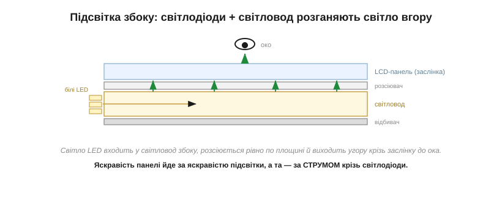
*Рис. 13.1.5.1. Бокова підсвітка в розрізі. Світло кількох білих світлодіодів входить у світловод збоку, багаторазово відбивається, рівномірно виходить угору крізь розсіювач і заслінку — до ока. Яскравість панелі йде за яскравістю підсвітки, а та, як побачимо, — прямо за струмом крізь світлодіоди.*

Хоч як розташовані світлодіоди, головне для нас одне: яскравість панелі визначається яскравістю підсвітки, а яскравість підсвітки — **струмом** крізь світлодіоди. Звідси й та сумна цифра з теми про класи: підсвітка горить, поки горить екран, і її струм входить у енергетичний бюджет постійною статтею. Керувати цим струмом — і означає керувати і яскравістю, і споживанням дисплея.

### Світлодіодом керують струмом, а не напругою

Тепер про той підступ. Світлодіод — це діод, а отже, його вольт-амперна характеристика (з §2.5.7) **експоненційна**: доки прикладена напруга менша за поріг, струму майже немає, а щойно її перевищено, струм злітає майже вертикально. Така крута крива має руйнівний наслідок для того, хто надумав керувати яскравістю напругою.

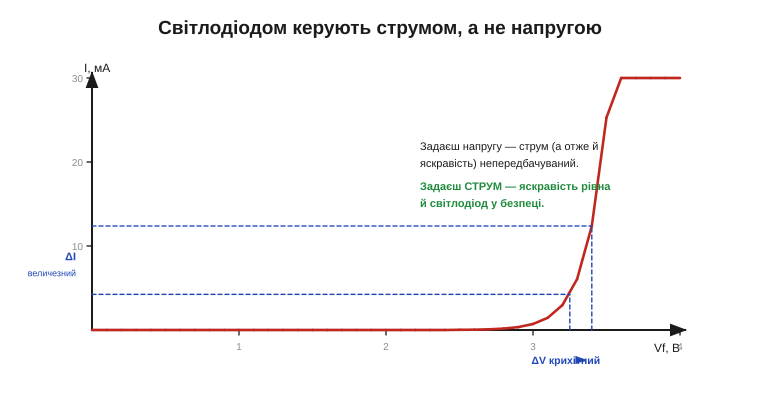
*Рис. 13.1.5.2. Чому не напругою. На робочій ділянці характеристика майже вертикальна: зміна напруги на якісь 0.1 В міняє струм — а отже, і яскравість — у рази. Задаси напругу — струм непередбачуваний; задаси струм — яскравість рівна, а світлодіод у безпеці.*

Уявіть, що ви силкуєтеся виставити яскравість, задаючи світлодіодові напругу. Похибка в нещасні 0.1 В — а стільки «гуляє» вже від екземпляра до екземпляра — і струм подвоюється або світлодіод згоряє. Два начебто однакові світлодіоди при тій самій напрузі візьмуть геть різний струм, бо їхні характеристики трохи різняться від народження. Гірше: коли світлодіод гріється, його поріг **знижується**, тож при сталій напрузі струм сам собою росте, гріє ще дужче, поріг падає ще нижче — це **тепловий розгін** (*thermal runaway*), зачароване коло, що вбиває деталь.

Вихід один — керувати не напругою, а **струмом**. Світловий потік світлодіода майже прямо пропорційний струмові, тож, задавши струм, ви дістаєте передбачувану яскравість; а **джерело струму** само собою береже світлодіод, бо більше за задане крізь нього не пропустить, хоч би як грілася й «пливла» характеристика. Уся подальша схемотехніка підсвітки — це різні способи зробити кероване джерело струму.

Що ж таке те «джерело струму» по суті? Це схема, яка **сама підправляє** напругу на світлодіоді так, щоб струм лишався заданим, хоч би що довкола мінялося. Найпростіший варіант — той самий резистор, але він пасивний і неточний. Краще — **активний** регулятор: керований транзистор, що безперервно порівнює виміряний струм із заданим і підправляє себе, аби втримати ціль. Саме ця петля «виміряй — порівняй — підправ» лежить в основі всіх серйозних драйверів, від найпростіших до імпульсних, які ми зараз і розглянемо по черзі — від найдешевшого до канонічного.

> 🔧 **Навіщо це.** Запамʼятайте раз і назавжди: світлодіод — пристрій **струмовий**. Хоч у даташиті й пишуть «пряма напруга 3.2 В», це не та величина, якою ви керуєте, а та, що сама встановиться при заданому струмі. Скрізь, де є світлодіод — підсвітка, індикатор, ліхтарик, — шукайте те, що задає йому струм; немає такого — деталь працює на удачу й довго не проживе.

### Найпростіший струмовий регулятор: баластний резистор

Найдешевший спосіб задати струм — поставити послідовно зі світлодіодом **баластний резистор** (*ballast resistor*). Він «зʼїдає» різницю між напругою живлення й напругою світлодіода, а оскільки сам по собі лінійний, ще й трохи стабілізує струм: підскочив струм — зросло падіння на резисторі — і воно ж його й осадило назад.

**Приклад (баластний резистор).** Живимо один білий світлодіод (≈ 3.2 В при 20 мА) від 5 В. Який потрібен резистор і скільки на ньому гріється?

```
R = (V₊ − V_LED) ÷ I = (5 − 3.2) ÷ 0.02   = 90 Ом
потужність на R = (5 − 3.2) × 0.02         = 36 мВт
потужність на LED = 3.2 × 0.02             = 64 мВт
```

Тобто понад третину всієї енергії розсіюється в резисторі **дарма**, на тепло. Це й перша вада баласту. Друга — струм «гуляє»: змінилася напруга живлення чи нагрівся світлодіод (а з ним зсунулась його напруга) — і струм поплив разом. Третя й найжорсткіша — резистор працює, тільки якщо живлення **вище** за напругу світлодіода; для довгої нитки, що просить більше, ніж дає батарея, він безсилий.

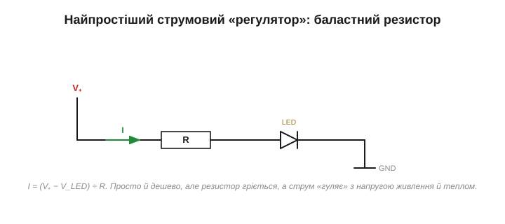
*Рис. 13.1.5.3. Баласт: послідовний резистор R задає струм за простою формулою I = (V₊ − V_LED) ÷ R. Дешево й сердито для одного-двох світлодіодів при сталому живленні, та неощадно (гріється) і ненадійно (струм залежить від напруги й тепла).*

Тож баласт годиться для індикаторного світлодіода чи дрібної підсвітки при фіксованому живленні, але для серйозного, ощадливого до батареї екрана потрібен кращий, активний регулятор струму.

### Коли треба вище за живлення: boost-драйвер

Один білий світлодіод просить близько 3 В. А підсвітка — це часто **нитка** з кількох послідовних світлодіодів, і її сумарна напруга легко переростає живлення: шість штук — це вже ~18–20 В, тоді як батарея дає 3.7. Резистором тут не зарадиш — спершу треба **підняти** напругу. Цим займається **boost-перетворювач** (*boost converter*) із зворотним звʼязком по струму, який разом і є справжнім драйвером підсвітки.

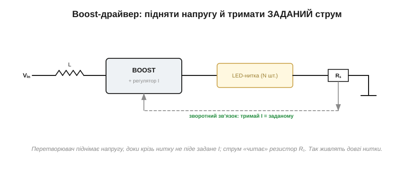
*Рис. 13.1.5.4. Boost-драйвер. Перетворювач піднімає напругу настільки, щоб крізь нитку йшов **заданий** струм; величину струму «читає» маленький резистор Rₛ і повертає в регулятор, який підправляє роботу ключа. Так живлять довгі нитки з напругою, вищою за живлення, ще й ощадливо.*

Працює це так: перетворювач піднімає напругу рівно до тієї, за якої крізь нитку тече **задане** значення струму — не більше й не менше. Щоб знати поточний струм, у коло вставляють крихітний **вимірювальний резистор** Rₛ; падіння на ньому — це сигнал струму, і регулятор безперервно підправляє роботу ключа, щоб утримати струм на цілі, хоч би як мінялися напруга нитки чи живлення. Виходить ефективне (на відміну від резистора, що грів повітря) джерело струму, здатне нагодувати довгу нитку. Це й є канонічна підсвітка сучасного приладу.

Чому саме імпульсний boost, а не простий лінійний регулятор? Бо лінійний, як і резистор, мусив би «спалити» всю зайву напругу на собі у вигляді тепла — а коли треба ще й **підняти** напругу вище за живлення, він узагалі безсилий. Імпульсний перетворювач натомість не палить різницю, а перекачує енергію порціями через котушку, тримаючи високий ККД — нерідко за 85–90 %. Для приладу на батареї це прямо означає довший час роботи: та сама яскравість коштує менше струму від акумулятора, бо менше енергії йде в тепло, а не у світло.

> 🔌 **Компонент.** Як такий boost-драйвер влаштований усередині, як вибрати котушку й вимірювальний резистор і чому він керує саме струмом, — у компонентній вставці до цієї теми (`r01-s5-c-backlight-drivers.md`).

> 🔧 **Навіщо це.** Побачивши в схемі підсвітки котушку й мікросхему з ніжкою «FB» чи «ISET», знайте: це струмовий boost-драйвер, а не просто «подати живлення на лампу». Саме він визначає і яскравість, і ККД підсвітки, і те, як вона поводитиметься на сідаючій батареї.

### Димінг: ШІМ проти аналогового

Світити на повну потрібно не завжди — екран хочеться **пригашувати**: заради економії, заради комфорту вночі, заради автояскравості. Зробити це можна двома principово різними шляхами, і ми вже торкалися їхньої відмінности в темі про мерехтіння.

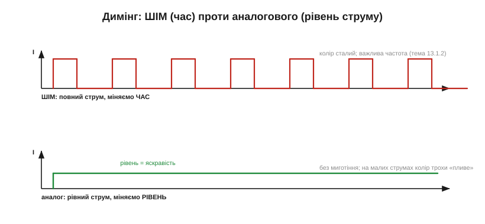
*Рис. 13.1.5.5. Угорі — **ШІМ-димінг**: струм увесь час повний, але його швидко вмикають і вимикають, а яскравість задають часткою часу (шпаруватістю). Унизу — **аналоговий**: струм рівний і безперервний, а яскравість задають самим його рівнем.*

**ШІМ-димінг** (*PWM*) вмикає й вимикає **повний** струм нитки з великою частотою, а яскравість задає шпаруватістю — часткою часу у ввімкненому стані. Його велика перевага в тому, що світлодіод завжди працює або на повному струмі, або зовсім без нього, тож його колір і ефективність **не міняються** з яскравістю. Платня — те саме мерехтіння з теми 13.1.2: якщо частота ШІМу низька, око й камера ловлять блимання, тож гнати його треба швидко (кілогерци й вище). **Аналоговий димінг** натомість міняє сам **рівень** струму — світло рівне, без жодного миготіння, але на малих струмах білий світлодіод трохи «пливе» в кольорі (бо змінюється баланс люмінофора й ефективність), та й нижче певного струму поводиться нестабільно. Тому на практиці часто беруть **гібрид**: у комфортному діапазоні димлять аналогово, а для зовсім глибокого пригашення додають швидкий ШІМ.

Чому взагалі морочитися з гібридом? Бо вимоги до **глибини** димінгу бувають жорсткі. Екран, яскравий удень, уночі має пригасати в сотні разів — інакше в темряві він сліпить. Чистого аналогового димінгу на такий діапазон не вистачає (на дуже малих струмах світлодіод гасне нерівно й міняє колір), а самий ШІМ на глибокому пригашенні дає такі куці імпульси, що мерехтіння лізе в очі навіть на пристойній частоті. Гібрид бере найкраще з обох світів: широкий, чистий діапазон без миготіння згори — і глибоке пригашення знизу.

> 🔧 **Навіщо це.** Вибираючи спосіб димінгу, зважте, що важливіше для вашого виробу: сталий колір на всіх рівнях (тоді ШІМ, але швидкий) чи цілковита відсутність мерехтіння (тоді аналог, змирившись із легким зсувом кольору). Для приладу, на який дивляться годинами, мерехтіння низькочастотного ШІМу — реальна причина втоми очей, а не вигадка.

### Рівномірність, тепло й захист

Лишаються три практичні турботи, без яких драйвер на папері й підсвітка в житті — різні речі. Перша — **рівномірність**. У боковій підсвітці все тримається на якості світловода: поганий — і по краях яскравіше, ніж посередині, або проступають окремі «гарячі» плями навпроти світлодіодів. А ще світлодіоди мусять світити **однаково**, тож їх вмикають **послідовною** ниткою: один струм крізь усіх — однакова яскравість. Паралельні нитки спокусливі нижчою напругою, але струм між ними ділиться нерівно (через розкид характеристик), і їх доводиться балансувати.

Сюди ж — непомітна, та важлива дрібниця: світлодіоди для підсвітки **сортують** на виробництві за яскравістю й відтінком білого (це звуть бінуванням, *binning*), бо навіть «однакові» діоди з різних партій дали б помітно різні плями. У серйозному виробі беруть світлодіоди з одного біна, щоб підсвітка була рівною і за яскравістю, і за кольором по всій площі — інакше око одразу вихопить, що один кут екрана тепліший чи яскравіший за інший.

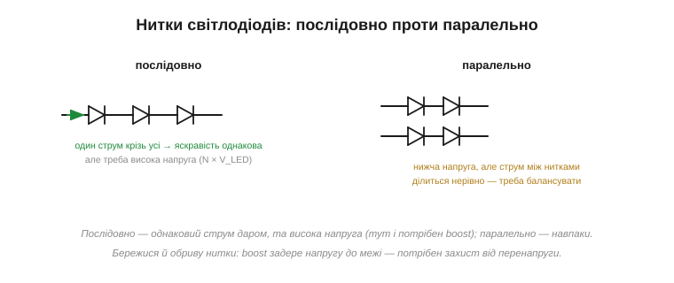
*Рис. 13.1.5.6. Послідовна нитка дає однаковий струм усім світлодіодам задарма — ціною високої напруги (тут і потрібен boost). Паралельні нитки знижують напругу, та струм ділиться між ними нерівно, тож їх треба балансувати. І стережися обриву: boost задере напругу до межі, шукаючи струм, — потрібен захист від перенапруги.*

Друга турбота — **тепло**: яскравість і строк життя світлодіода падають з нагрівом, тож і сам струм, і відведення тепла треба тримати в межах даташита. Третя — **захист**. Boost-драйвер, наткнувшись на **обрив** нитки (перегорів один світлодіод), у відчайдушних спробах проштовхнути струм задере напругу до максимуму — і без обмежувача перенапруги може попалити сам себе чи обвʼязку. Тому добрі драйвери мають захист від обриву (перенапруги), короткого замикання й перегріву. Це те, що відрізняє схему, яка працює на столі, від тієї, що виживе в полі.

Ці турботи звучать дрібно — аж доки не вилазять у серії. Перегрітий чи перевантажений струмом світлодіод не гасне відразу: він **тьмяніє** роками швидше за розрахунок, і екран, що торік сяяв, стає блідим. Тому досвідчений розробник свідомо **недовантажує** підсвітку — бере струм трохи нижчий за гранично допустимий і дбає про тепловідвід, виторговуючи дрібку яскравості сьогодні на роки рівного світла завтра. Підсвітка, зрештою, — це деталь, що працює без упину весь строк життя виробу, і ставитися до неї варто як до силового вузла, а не як до «лампочки».

Отак за непримітним склом ховається ціла силова підсистема, і керує нею один закон — **струм, а не напруга**, від копійчаного баласта до розумного boost-драйвера. Ми завершили все, що стосується панелі, яка **показує**: від фізики пікселя до лампи, що його підсвічує. Та сучасне скло вміє не лише показувати, а й **відчувати** дотик — і саме до того, як шматок скла розуміє, що до нього торкнулися пальцем, ми переходимо в наступній темі.

---

## 13.1.6 Дотик: резистивний проти ємнісного

Те саме скло, що показує картинку, навчилося ще й **відчувати** палець — і саме це перетворило прилади з кнопкових на ті, якими керуєш прямим дотиком до зображення. Та як шматок прозорого скла розуміє, що його торкнулися й де саме? Тут панують дві зовсім різні фізики. **Резистивний** дотик відчуває механічний натиск — палець (чи будь-що) притискає два провідні шари один до одного. **Ємнісний** відчуває саму електричну присутність пальця, навіть без зусилля. Вони по-різному відчуваються в руці, по-різному коштують і годяться для різних виробів; розібратися в них означає почати, як завжди, з фізики.

### Дотик як давач: дві фізики

Поставмо задачу чесно: треба визначити, у якій точці двовимірної прозорої поверхні над екраном опинився палець. Прозорість тут принципова — давач лежить **поверх** зображення, тож мусить пропускати світло. І природа дає на цю задачу дві відповіді, протилежні за самою ідеєю.

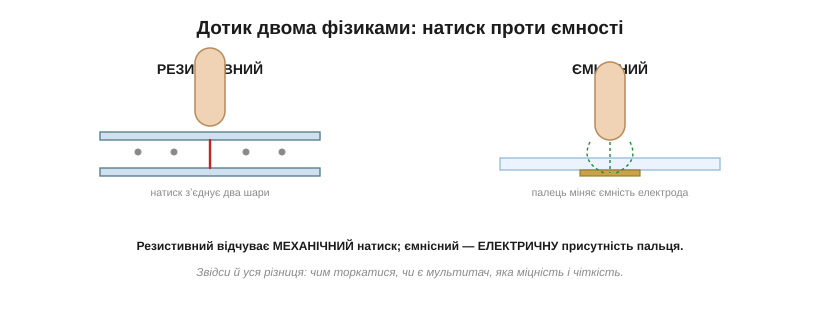
*Рис. 13.1.6.1. Дві фізики дотику. Ліворуч — резистивний: натиск пальця притискає верхній гнучкий шар до нижнього, і в точці контакту вони змикаються. Праворуч — ємнісний: палець, сам бувши провідником, змінює електричне поле прозорого електрода під склом, навіть не тиснучи. Звідси й уся подальша різниця.*

Перша відповідь — **механічна**: зробити поверхню з двох провідних шарів і ловити мить, коли натиск їх замкне. Друга — **електрична**: скористатися тим, що палець людини сам по собі провідник, і ловити, як він спотворює поле електрода. Перша не знає, чим її натиснули, — їй байдуже, палець це чи олівець. Друга прискіплива — їй потрібен саме провідний доторк. Розгляньмо кожну окремо.

Перш ніж занурюватися, оцінімо спільний для обох виклик — **прозорість**. Провідник, що пропускає світло, — річ нетривіальна: метал непрозорий. Тому електроди дотику роблять із особливих прозорих провідних плівок (найвідоміша — оксид індію-олова, *ITO*), та ще й наносять їх тонким візерунком так, щоб і струм проводити, і світло пропускати, і не муарити з пікселями екрана під ними. Сенсор дотику — це окремий шар, що лягає поверх дисплея й мусить бути майже невидимим; чимало інженерної мороки в дотику — саме про те, як залишитися прозорим, відчуваючи палець.

### Резистивний: дотик як подільник напруги

Резистивна панель — це два прозорі провідні шари (тонка плівка оксиду на склі чи плівці), розділені дрібнесенькими **дистанційними крапками**; верхній шар гнучкий. У спокої шари не торкаються. Натиснув пальцем — верхній прогнувся й торкнувся нижнього **рівно в точці натиску**. Лишилося прочитати, де ця точка.

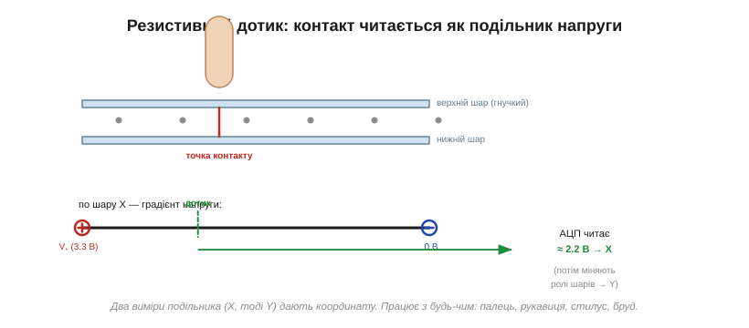
*Рис. 13.1.6.2. Резистивне зчитування. По одному шару пускають градієнт напруги (зліва 3.3 В, справа 0 В), а другим шаром у точці контакту знімають напругу, що випала, — і АЦП перетворює її на координату X. Потім шари міняють ролями й так само читають Y. Натиснути можна будь-чим.*

Хитрість зчитування — у тому, що кожен шар працює як **подільник напруги**. Прикладімо до лівого й правого країв одного шару, скажімо, 3.3 В і 0 В — уздовж шару виникне рівний градієнт напруги. Тоді в точці контакту другий шар «намацає» ту напругу, що випала на цій відстані, — а вона прямо відповідає **координаті** дотику. Один вимір аналого-цифровим перетворювачем (з §4.8) дає X; поміняймо ролі шарів (тепер градієнт по вертикалі) — і другий вимір дає Y. Дві швидкі оцифровки — і маємо точку (x, y).

**Приклад (зчитування X).** Палець натиснув на третині ширини від плюсового краю. Яку напругу прочитає АЦП?

```
точка на f = 1/3 від краю «+»
U = V₊ · (1 − f) = 3.3 · (1 − 1/3) = 3.3 · 2/3   ≈ 2.20 В
→ АЦП оцифровує 2.20 В і перераховує у X-координату
```

Велика чеснота резистивного дотику випливає прямо з його механіки: замкнути шари можна **будь-чим** — голим пальцем, пальцем у рукавиці, стилусом, навіть кінчиком викрутки чи краплею бруду. Платять за це теж механікою: потрібен реальний **натиск**; гнучкий верхній шар із часом протирається; зайві шари трохи гасять яскравість і чіткість; а базова, чотиридротова схема бачить лише **один** доторк за раз — справжнього мультитачу вона не вміє.

Ще дві практичні риси варто знати. По-перше, резистивний екран майже завжди потребує **калібрування**: градієнт напруги по дешевій плівці не ідеально рівний, краї «пливуть», тож при налаштуванні користувачеві дають тицьнути в кілька хрестиків, і прошивка запамʼятовує, як сирі напруги лягають на справжні координати. По-друге, чотиридротова схема — не єдина: пʼяти- й восьмидротові варіанти точніші й стійкіші до зносу, бо інакше розподіляють функції підведення напруги й зчитування, але коштують дорожче. Для більшості простих приладів вистачає чотирьох дротів і одного калібрування на заводі.

> 🔧 **Навіщо це.** Резистивний дотик — досі найкращий вибір там, де працюють **у рукавицях**, де бруд, волога чи мороз, де треба тицяти стилусом і де важить дешевизна: промислові пульти, медичні та польові прилади. Те, що споживач вважає «застарілим», в індустрії часто єдине, що взагалі працює в реальних умовах.

### Ємнісний: палець як обкладка конденсатора

Ємнісний дотик повертає нас до §2.1.2 — до **ємності**. Згадаймо: два провідники, розділені діелектриком, утворюють конденсатор, і його ємність залежить від геометрії та того, що поруч. А палець людини — це теж провідник (солона вода всередині нас чудово проводить). Піднесімо його до прозорого електрода під склом — і він втрутиться в поле цього електрода, змінивши ємність. Лишилося цю зміну виміряти.

Сучасні екрани роблять це **проєктивно-ємнісними** (*projected capacitive*, PCAP): під склом лежить **сітка** прозорих електродів — рядки в одному напрямку, стовпці в іншому. Палець, що наблизився до певного місця сітки, міняє ємність саме там, і контролер, проскановуючи сітку, знаходить це місце. Найважливіше: палець торкається **скла**, а електроди сховані під ним — тому поверхня тверда, гладка, прозора й довговічна, на відміну від мʼякої резистивної плівки.

Варто згадати, що ємнісний дотик не одразу став таким. Ранні ємнісні екрани були **поверхневими** (*surface capacitive*): суцільний провідний шар, із кутів якого міряли витік струму через палець, — вони знали лише одну точку дотику й боялися геть усього. Прорив дав саме **проєктивний** підхід зі схованою під склом сіткою: він і зробив можливими мультитач, тонке міцне скло й ту чутливість, яку ми сьогодні вважаємо звичною. Геометрію сітки при цьому роблять хитрою (ромби, містки між ними), щоб поле рядків і стовпців гарно «бачило» палець по всій площі, без сліпих зон між електродами.

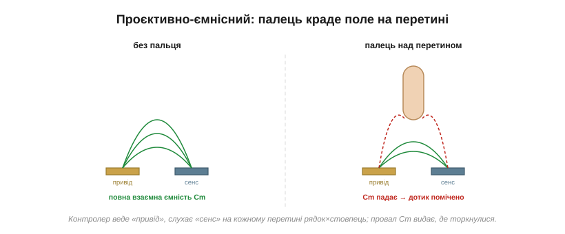
*Рис. 13.1.6.3. Як сітка чує палець. На кожному перетині рядка й стовпця є невелика взаємна ємність Cm — поле, що «перестрибує» з електрода привода на електрод сенсу. Палець, наблизившись, **відтягує частину цього поля на себе**, і Cm падає. Контролер бачить цей провал — і знає, де торкнулися.*

Звідси й переваги: реагує на **легкий** дотик без жодного натиску, поверхня — міцне чисте скло, картинка яскрава, і — головне — можливий мультитач і жести. А недоліки дзеркальні до резистивного: потрібен саме **провідний** доторк (голий палець або спеціальний ємнісний стилус чи рукавиця), і панель чутлива до води й електричних завад, що теж міняють ємність і можуть прикинутися дотиком.

> 🔧 **Навіщо це.** Ємнісний дотик дає те «преміальне» відчуття, до якого звик користувач смартфона: легкий доторк, плавні жести, чисте скло. Але памʼятайте про його ахіллесову пʼяту — воду: крапля дощу чи мокрий палець здатні збити його з пантелику, тож для приладу, що мокне, це серйозний аргумент проти.

### Self проти mutual: звідки береться мультитач

Виміряти ємнісну зміну сітки можна двома способами, і різниця між ними вирішує, скільки пальців екран побачить одночасно.

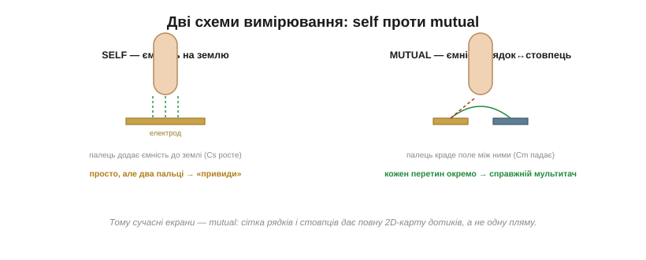
*Рис. 13.1.6.4. Ліворуч — **self**: міряють ємність кожного електрода **на землю**; палець її підвищує. Просто, та з двома пальцями виникають «привиди» — система не певна, які рядки з якими стовпцями склали реальні точки. Праворуч — **mutual**: міряють ємність **між** рядком і стовпцем на кожному перетині окремо; палець її знижує. Кожна точка незалежна — звідси справжній мультитач.*

У **власній ємності** (*self capacitance*) контролер міряє ємність кожного електрода відносно землі — палець її **збільшує**. Це просто, але має ваду: коли пальців два, система знає лише, які рядки й які стовпці «спрацювали», а не як їх правильно спарувати, — і породжує хибні «привидні» точки. У **взаємній ємності** (*mutual capacitance*) міряють ємність на кожному **перетині** рядок-стовпець окремо, а палець її **зменшує** (краде поле). Оскільки кожен перетин опитують незалежно, виходить повна двовимірна карта дотиків — а отже, **справжній мультитач**: система впевнено бачить десять пальців нараз. Тому сучасні екрани будують саме на взаємній ємності.

За кадром тут чимала боротьба за **сигнал**. Зміна ємності від пальця — це якісь фемтофаради на тлі завад від тієї ж підсвітки, зарядних пристроїв і мережі, тож контролер мусить опитувати сітку швидко (десятки разів на секунду — це **частота звіту**, *report rate*) і ще вправно фільтрувати шум, аби відрізнити справжній дотик від наведення. Від цієї частоти прямо залежить, наскільки «слухняно» лінія тягнеться за пальцем по екрану: низька — і слід відстає, рветься, відчувається вʼялим. Тому добрий ємнісний дотик — це не лише сітка, а й швидкий, тихий тракт вимірювання.

### Контролери дотику: від кількох ніжок до розумного чипа

Хто ж робить усі ці виміри? Тут резистивний і ємнісний дотик розходяться так само різко, як їхня фізика.

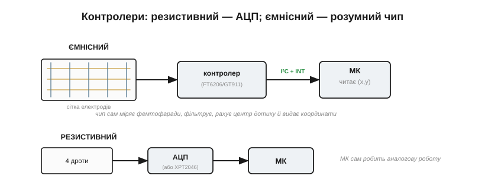
*Рис. 13.1.6.5. Угорі — ємнісний: сітку обслуговує спеціалізований **контролер дотику**, що сам веде й слухає електроди, ловить мізерні зміни ємності, фільтрує завади, рахує центр дотику й віддає готові координати по I²C з лінією переривання. Унизу — резистивний: вистачає АЦП на кілька ніжок (чи дрібного чипа), а аналогову роботу робить сам МК.*

Резистивному вистачить **АЦП** і кількох виводів мікроконтролера — або дешевого спеціального чипа (класу XPT2046), що сам робить виміри подільника й віддає (x, y) по простій шині. Аналогова робота тут проста. Ємнісному ж потрібен **розумний контролер**: він мусить заряджати й розряджати десятки електродів, ловити зміни ємності в **фемтофаради**, відсіювати шум, знаходити центр кожної плями дотику й перетворювати все це на координати. Така мікросхема (класу FT6206/GT911) сама проробляє цю важку роботу й віддає мікроконтролерові вже готові точки — а часто й розпізнані жести — по шині I²C, смикаючи лінію переривання, коли є новина. Мікроконтролер лише читає результат.

Ця зручність має й зворотний бік: ємнісний контролер треба **налаштовувати** під конкретне скло й корпус. Товщина накладки, повітряний зазор, заземлення приладу, ба навіть те, від мережі він живиться чи від батареї, — усе впливає на чутливість, тож виробник зазвичай підбирає десятки параметрів (пороги, посилення, відсікання води) у прошивці чипа. «Поставив і працює» тут радше виняток: ємнісний дотик, що добре поводиться крізь товсту накладку чи на мокрому склі, — це плід копіткого тюнінгу, а не самої лише вдалої мікросхеми.

> 🔌 **Компонент.** Конкретику ємнісних контролерів класу FT6206/GT911 — підключення по I²C, лінію переривання, формат координат і мультитач — винесено в компонентну вставку до цієї теми (`r01-s6-c-touch-controllers.md`).

### Від точок до жестів

Що б не стояло в основі, на виході контролер дає **потік подій дотику**: «палець опустився» в точці (x, y), «палець рухається» новими координатами, «палець піднявся» — а для мультитачу таких точок кілька водночас. Сам по собі цей потік — ще не жест.

**Жести** народжуються вже у програмі, з розбору цього потоку. Коротке торкання й відпускання на місці — це **тап**; затримка пальця — **довге натискання**; швидке проведення — **свайп**; а два пальці, що сходяться чи розходяться, — **щипок** для масштабування. Контролер дає сирі точки; перетворити їх на осмислені жести — окрема логіка, до якої ми ще дійдемо, коли говоритимемо про архітектуру інтерфейсу. Тут досить запамʼятати поділ праці: **залізо дає точки, програма впізнає в них наміри**.

Між сирими точками й чистим жестом стоїть ще чорнова робота, про яку легко забути, та без якої екран відчувається нервовим. Палець тремтить — координати дрібно «скачуть», тож їх згладжують. Долоня, що лягла на край екрана, чи крапля води дають хибні дотики — їх відсіюють (це звуть відхиленням долоні, *palm rejection*). А коротке тремтіння контакту на самій межі натиску треба «придушити», щоб один тап не порахувався двічі. Усе це — той самий шар між залізом і наміром: непомітний, коли зроблений добре, і дратівливий, коли про нього забули.

### Що обирати під виріб

Зведімо все до вибору, бо саме його доведеться робити над реальним приладом.

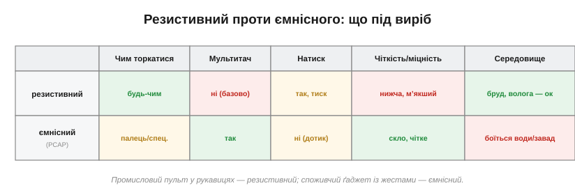
*Рис. 13.1.6.6. Профілі майже дзеркальні. Резистивний: тицяй будь-чим, працює в бруді й рукавицях, дешевий — але потребує натиску, без мультитачу, мʼякший і менш чіткий. Ємнісний: легкий дотик, мультитач і жести, міцне чисте скло — але потрібен голий (чи особливий) палець і боїться води.*

Логіка проста й випливає з фізики. Промисловий або медичний пульт, на який тицяють у рукавицях, у бруді чи під дощем, де важить ціна й не потрібен мультитач, — резистивний. Споживчий ґаджет, де цінують плавні жести, чисте яскраве скло й «той самий» легкий дотик, — ємнісний. Як і з класами дисплеїв, тут немає «кращої» технології — є та, що пасує середовищу й сценарію вашого виробу.

Тепер скло вміє і показувати, і відчувати — ми зібрали повноцінний людино-машинний інтерфейс на рівні заліза. Лишилася одна особлива порода дисплеїв, надто несхожа на решту, щоб не присвятити їй окремої розмови: **електронне чорнило**. Його бістабільність — дар, але вона ж приносить геть інші клопоти: повільне й часткове оновлення та «привиди» старого зображення. Саме до цих особливостей e-ink ми й переходимо далі.

---

## 13.1.7 E-ink особливо: часткове оновлення, ghosting, температура

E-ink ми вже зустрічали в темі про класи дисплеїв як білу ворону: відбивний, бістабільний, паперовий на вигляд. Та бістабільність — головний його дар: картинка тримається роками без краплі енергії. Але цей дар має тіньовий бік, і не один. Усі особливості e-ink, через які з ним мороки більше, ніж із будь-яким іншим екраном, виростають з одного простого факту: він перемикає піксель, **фізично переганяючи крихітні частинки крізь грузлу рідину**. А рух речовини — повільний, і в нього є память. Звідси все: і черепашача швидкість оновлення, і видиме блимання, і примарні сліди старого зображення, і дивовижна залежність від температури. Розберімо ці клопоти по черзі — бо саме з ними доведеться мати справу, ставлячи e-ink у виріб.

### Чому e-ink не такий, як усі: рух частинок займає час

Згадаймо механізм із теми 13.1.1: у мікрокапсулах плавають заряджені білі й чорні частинки пігменту, а електричне поле жене їх до того чи іншого боку. Тепер порівняймо це з рештою екранів. У рідкому кристалі молекула повертається полем за мілісекунди; у світлодіоді електрон і дірка дають фотон за мікросекунди. А в e-ink **тверда частинка** мусить проплисти крізь вʼязку рідину з одного краю капсули на інший — і це на порядки повільніше.

І ось що тут глибоко: повільність e-ink — не вада, яку колись «виправлять», а зворотний бік самої бістабільности. Те, що тримає картинку без енергії, — це інертність частинок, їхнє небажання рухатися; а небажання рухатися — це і є повільність. Швидкий екран мусив би безперервно витрачати енергію на утримання стану (як LCD з його вічним освіженням), повільний — ні. Тому, обираючи e-ink, ви свідомо міняєте швидкість на ту феноменальну ощадливість, яку бачили в темі про класи: пристрій місяцями живе від батарейки саме тому, що екран **лінивий**. Одне нерозривно випливає з іншого.


*Рис. 13.1.7.1. Час одного оновлення пікселя на логарифмічній шкалі. OLED перемикається за мікросекунди, LCD — за мілісекунди, а e-ink — за частки секунди й до кількох секунд. Різниця в тисячі разів, і причина проста: світло й заряд перемикаються миттєво, а частинки пігменту повзуть.*

Та повільність — не єдина дивина. Щоб перегнати частинки чисто й до кінця, мало просто «подати напругу» — потрібна ціла **послідовність** імпульсів, розкладена в часі. Саме ця послідовність і робить керування e-ink геть несхожим на решту.

### Хвилеформи: послідовність імпульсів, а не одне «увімкнути»

Щоб перевести піксель з одного стану в інший, e-ink-драйвер «програє» **хвилеформу** (*waveform*) — задану послідовність імпульсів напруги в часі. Чому не один імпульс? Бо частинки треба не лише зрушити, а й **дочиста** перегнати на місце, не лишивши на півдорозі, та ще й, якщо потрібні градації сірого, зупинити рівно там, де треба, — а це досягається точним дозуванням поштовхів туди-сюди.

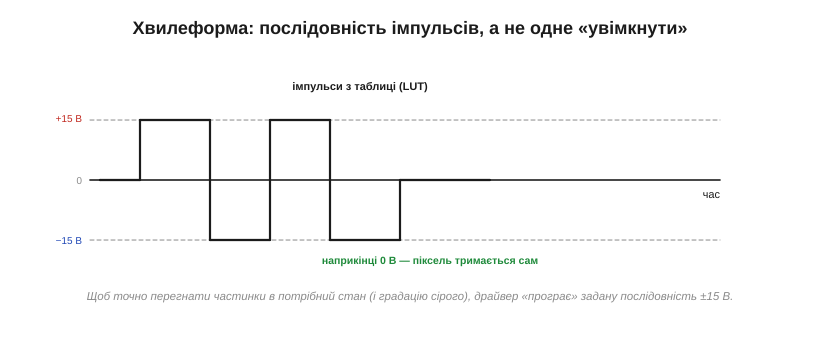
*Рис. 13.1.7.2. Хвилеформа одного переходу. Драйвер подає на піксель серію імпульсів то +15 В, то −15 В, переганяючи частинки в потрібний стан, і наприкінці повертає 0 В — далі піксель тримається сам. Саме така послідовність, а не одне ввімкнення, і коштує тих часток секунди.*

Ці хвилеформи не вигадуються на ходу — вони зберігаються в **таблицях пошуку** (*look-up tables*, LUT): для кожного переходу (зі старого відтінку в новий) і, як побачимо, для кожної температури — своя готова послідовність. Контролер бере з таблиці потрібну й відтворює її. Зверніть увагу й на напругу: щоб зрушити частинки, потрібні відносно високі **±15 В** — куди більше за логічні рівні, тож e-ink завжди тягне за собою високовольтну обвʼязку. А коли хвилеформа відіграла, напруга падає до нуля, і бістабільність робить свою справу — картинка застигає.

Дві тонкощі хвилеформ варто знати наперед. Перша: **градації сірого** коштують довших і складніших послідовностей — щоб зупинити частинки на півдорозі, у проміжному відтінку, треба тонше дозувати поштовхи, ніж для чистого чорного чи білого. Тому багатоградаційний e-ink оновлюється помітно довше за чорно-білий. Друга, прихована, але важлива: хвилеформи роблять **збалансованими за зарядом** (*DC-balanced*) — сумарний поштовх в один бік за повний цикл мусить дорівнювати поштовхові в інший. Інакше в рідині накопичується постійне зміщення, що з часом псує капсули. Ось чому в хвилеформі стільки симетричних коливань туди-сюди, а не один прямий поштовх: половина з них — не задля картинки, а задля довговічности.

### Повне оновлення: спалах, що чистить начисто

Найчистіший спосіб показати новий кадр — **повне оновлення** (*full refresh*). Контролер не просто малює нове поверх старого, а спершу проганяє весь екран через скидання: кілька разів інвертує його повністю — чорне, біле, чорне, біле, — «перемішуючи» частинки до повної однорідности, і лише тоді виставляє нове зображення.


*Рис. 13.1.7.3. Повне оновлення. Кілька інверсій усього екрана скидають частинки в чистий стан — звідси те характерне блимання читалки при гортанні сторінки. Воно найдовше, зате лишає кадр без жодних слідів попереднього.*

Саме це блимання ви бачили в електронних читалках, коли вони гортають сторінку. Воно дратує й триває найдовше з усіх режимів — частки секунди, а на холоді й більше. Але натомість дає те, чого не дасть жоден інший спосіб: **бездоганно чистий**, без найменшого привиду кадр. Повне оновлення — це генеральне прибирання екрана.

Коли ж його робити? Очевидно — при першому показі (екран після ввімкнення в невідомому стані) і коли вміст міняється цілком, як-от нова сторінка. А ще — як планове прибирання після певної кількости часткових оновлень, щоб не дати привидам розростися. Багато готових бібліотек для e-ink так і чинять: лічать часткові оновлення й самі вставляють повне кожні, скажімо, десять-двадцять разів. Розробникові лишається підібрати цей поріг під свій вміст — рідше блимати, але терпіти блідіший привид, чи частіше, та чистіше.

### Часткове оновлення: швидко, без спалаху — та копиться привид

Блимати щоразу нестерпно, тож для дрібних змін є **часткове оновлення** (*partial update*): контролер чіпає лише потрібне вікно й **пропускає** спалах-скидання. Виходить швидко (десятки-сотні мс), без блимання й без чіпання решти екрана — оновилася тільки та ділянка, що змінилася.


*Рис. 13.1.7.4. Часткове оновлення міняє лише вікно й без спалаху — ідеально для годинника чи лічильника. Платня: пропустивши скидання, частинки не сідають до кінця, і з кожним оновленням під новими цифрами проступають бліді сліди старих — привид накопичується, доки його не змиє повне оновлення.*

Платять за цю швидкість **привидом**. Пропустивши скидання, частинки не встають на місце ідеально, і слід попереднього стану лишається — спершу непомітний, та з кожним частковим оновленням він міцнішає, аж доки під свіжими цифрами не проступлять бліді тіні всіх попередніх. Лікування одне — час від часу таки робити **повне** оновлення, щоб змити накопичене. Звідси типова стратегія: багато швидких часткових оновлень, а кожне N-те — повне, для чистоти.

Варто згадати, що не всі e-ink однакові щодо часткових оновлень. Прості **сегментні** панелі (як цифри в електронному ціннику) міняють лише свої сегменти й майже не знають привида. А повноцінні графічні панелі часто мають кілька режимів: повільний і чистий — для гарного кадру, та «швидкий» — із помітно більшим привидом, але оновленням за десяток-другий мілісекунд, придатним навіть для грубої анімації чи рукописного вводу. Який режим доступний — питання до даташита конкретної панелі, і його варто зʼясувати ще до того, як ви пообіцяли замовникові «плавний» e-ink.

> 🔧 **Навіщо це.** Проєктуючи інтерфейс на e-ink, свідомо плануйте, що і **як** оновлюється. Те, що міняється часто (час, лічильник), — частковими оновленнями; а раз на скількись разів вганяйте повне, щоб прибрати привид. Спроба «просто перемальовувати весь екран щоразу» дасть нестерпне блимання, а «ніколи не робити повного» — болото з привидів. Тут темп оновлення — частина дизайну, а не дрібниця реалізації.

### Привиди (ghosting): чому старе зображення не зникає

Спинімося на привидах окремо, бо це найхарактерніша вада e-ink. **Привид** (*ghosting*) — це бліде залишкове зображення попереднього кадру, що проступає крізь новий. Корінь його — у тій самій фізиці: частинки мають своєрідну память, інерцію; неповна хвилеформа лишає їх трохи не там, де треба, а попередній стан зміщує те, де вони осядуть тепер. Накопичується це особливо охоче при часткових оновленнях, що навмисне економлять на скиданні.

Боротися з привидом можна трьома важелями: періодичним повним оновленням (найнадійніше), якіснішими хвилеформами, що повніше переганяють частинки (ціною часу), і — як побачимо — правильним вибором хвилеформи під температуру. Повністю позбутися його неможливо, це плата за бістабільність; можна лише тримати в прийнятних межах. Тому добрий e-ink-інтерфейс — це завжди компроміс між швидкістю, чистотою й частотою набридливих спалахів.

Є й крайній прояв привида, про який варто знати: якщо лишити на e-ink **той самий** кадр надовго — на тижні й місяці, — він може «приклеїтися» так, що навіть повне оновлення зітре його не з першого разу. Це нагадує вигоряння OLED із теми про класи, хоч причина інша — застояні частинки. Тому навіть статичні e-ink-вивіски інколи навмисне «розминають» екран повним інверсним оновленням раз на якийсь час, щоб картинка не закарбувалася назавжди.

### Температура командує всім

І ось найдивовижніша особливість, про яку легко забути на теплому столі. Рухливість частинок у рідині сильно залежить від **температури**, бо з холодом рідина густішає. На морозі частинки повзуть ледь-ледь, і та сама хвилеформа, що чудово працює в кімнаті, їх просто не догодить; нижче нуля e-ink часто **взагалі не оновлюється** до ладу. У спеку — навпаки, усе швидше.


*Рис. 13.1.7.5. Залежність від температури. У теплі оновлення коротке, на холоді — у рази довше, а нижче нуля часто не вдається зовсім. Тому хвилеформу беруть не одну на всі випадки, а під поточну температуру.*

Звідси й практичний наслідок, закладений у саму конструкцію: e-ink-модуль майже завжди має **термодавач**, а LUT-таблиці проіндексовані за температурою. Контролер перед оновленням зчитує температуру й бере **відповідну** хвилеформу. Застосувати «кімнатну» хвилеформу на морозі — означає дістати недооновлений кадр і густий привид. Це робить e-ink примхливим для приладів, що працюють надворі: розробник мусить рахуватися з тим, що екран на холоді оновлюється повільніше, гірше — а в лютий мороз може й зовсім завмерти.

Тут є й підступна асиметрія: **зберігати** e-ink можна в куди ширшому діапазоні, ніж **оновлювати**. Панель спокійно переживе мороз і спеку на складі чи у вимкненому приладі, а от спроба оновити її поза робочим вікном температур дасть зіпсований кадр. І не сподівайтеся, що екран сам себе підігріє: на відміну від ламп, e-ink майже не виділяє тепла, тож у холодному приладі він і буде холодним. Якщо оновлення на морозі критичне, доводиться або гріти панель, або змиритися з її повільністю — третього природа не дає.

> 🔧 **Навіщо це.** Якщо ваш e-ink-прилад житиме поза кімнатою, температура — перше, що варто перевірити в даташиті панелі: робочий діапазон оновлення зазвичай вужчий за діапазон зберігання. Закладайте, що на холоді оновлення буде довшим і рідшим, а нижче певної межі — недоступним, і не будуйте логіку, яка цього не переживе.

### Як цим керують: контролер, хвилеформи, високовольтні шини

Зберімо все докупи. Драйвити e-ink — означає мати чотири речі: контролер, що генерує хвилеформи для рядків і стовпців; **±15-вольтові** шини (їх дає зарядна помпа чи невеликий перетворювач); набір LUT, проіндексованих за температурою; і термодавач, що каже, яку LUT брати. Зазвичай усе це — крім хоста — живе в самому модулі: панель несе драйвери й контролер, з яким мікроконтролер спілкується по SPI.

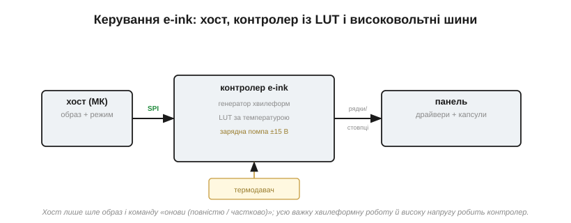
*Рис. 13.1.7.6. Поділ праці. Хост лише шле образ і команду «онови — повністю чи частково». Усю важку роботу — вибір хвилеформи за температурою, генерацію імпульсів, високу напругу — бере на себе контролер у модулі. Мікроконтролерові лишається проста роль.*

Для мікроконтролера це означає приємно мало клопоту: надіслати по SPI новий образ і скомандувати, як його показати — повним оновленням чи частковим. Решту — примхливу хвилеформну механіку й високу напругу — модуль робить сам.

Та один нюанс продуктивности лишається й на хості: образ цілого екрана — це чималий потік даних по SPI, а саме оновлення триває частки секунди, протягом яких панель краще не чіпати. Тому програму будують так, щоб довге оновлення не **блокувало** решту роботи: відправив образ, дав команду — і займайся своїм, поки модуль не смикне лінію «готово». Для приладу, де e-ink — лише один із багатьох обовʼязків, ця асинхронність не розкіш, а необхідність.

> 🔌 **Компонент.** Як саме виглядають послідовності оновлення e-ink-модуля по SPI, що таке LUT у конкретному чипі й як ним керувати — у компонентній вставці до цієї теми (`r01-s7-c-eink-modules.md`).

> 📜 **Історія.** Як електронне чорнило з мікрокапсул народилося в MIT Media Lab (і чим завдячує забутому попереднику з Xerox PARC) — в історичній вставці до цієї теми (`r01-s7-history-eink.md`).

Усі дивацтва e-ink, бачимо, зводяться до одного: він керує не світлом і не зарядом, а **речовиною**, а речовина повільна й має память. Прийнявши це, ви знаєте, чого від нього чекати: ощадливість і паперовий вигляд — в обмін на повільність, привиди й вереди на холоді. На цьому ми завершуємо знайомство з усіма класами дисплеїв і їхніми норовами — і можемо нарешті звести все докупи в останній темі розділу: як, маючи цю палітру, **обрати** дисплей під конкретний виріб.

---

## 13.1.8 Вибір дисплея під виріб: сонце, енергія, вартість, кабель

Ми перебрали всі класи екранів, їхню фізику, інтерфейси, контролери, підсвітку й дотик. Тепер — найважче й найпрактичніше питання, заради якого все це й вивчалося: над конкретним виробом доведеться **вибрати один**. І тут немає «найкращого дисплея» — є лише дисплей, що пасує **цьому** виробу. Гірше того: критерії вибору **воюють** між собою. Екран, читабельний на сонці, жере енергію; дешева панель тягне за собою дорогий мікроконтролер; розкішний дисплей не лізе в розʼєм чи в корпус. А найпідступніше — дисплей часто **домінує** над усім проєктом: вибрав його погано — і він потягне за собою весь виріб. Тому вибрати правильно й **рано**, виходячи зі сценарію, — одне з найважливіших рішень у всій розробці.

### Почни з того, ЯК і ДЕ ним користуватимуться

Найпоширеніша помилка — починати з вітрини дисплеїв і захоплюватися гарними. Правильно — починати зі **сценарію**: хто й де дивитиметься на екран, що саме він показує, як часто це міняється, скільки виріб має жити від заряду, за яку ціну й у якому корпусі. Відповіді на ці питання — не побажання, а **тверді обмеження**, що викидають більшість варіантів ще до того, як ви почнете порівнювати тонкощі.

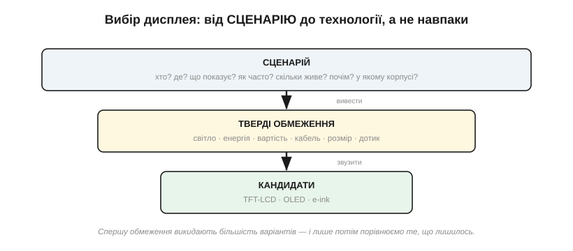
*Рис. 13.1.8.1. Правильний напрям вибору — згори вниз. Сценарій породжує тверді обмеження (світло, енергія, вартість, кабель, розмір, дотик); обмеження відсівають більшість технологій; і лише серед того, що лишилось, порівнюють деталі. Хто йде знизу — від уподобаної панелі — раз у раз упирається в те, що вона не лізе в його ж обмеження.*

Зверніть увагу на одне питання зі сценарію, що криється за всіма іншими, — **що саме** екран показує. Кілька великих цифр, що зрідка міняються, — це геть інша задача, ніж жива анімація чи мапа, яку гортають пальцем. Перше прощає повільність і просить ощадливости; друге вимагає швидкости, плавности й мультитачу. Тип вмісту — прихована вісь, що тихо тягне за собою і клас екрана, і його роздільність, і дотик, і навіть мікроконтролер. Тому, відповідаючи на питання сценарію, найперше чесно опишіть, **яку картинку** виріб показуватиме насправді, а не яку хотілося б.

Ці обмеження зручно згрупувати в чотири, винесені в назву теми: **сонце** (світлове середовище), **енергія** (бюджет живлення), **вартість** і **кабель** (фізична та електрична інтеграція). Пройдімо їх по черзі — кожне саме по собі здатне вирішити вибір.

### Сонце: світлове середовище вирішує клас

Перший і найжорсткіший фільтр — **де** на екран дивитимуться, бо світло довкола одразу відсіває цілі класи. Логіка випливає прямо з фізики пікселя (тема 13.1.1): там, де темно, виграє той, хто світить сам; там, де яскраво, — той, хто відбиває.


*Рис. 13.1.8.2. Від темряви до прямого сонця. У темряві блищить OLED зі своїм ідеальним чорним; у кімнаті добрий і TFT-LCD, і OLED; на яскравому дні потрібен дуже яскравий TFT з антивідблиском; а під прямим сонцем по-справжньому читається лише відбивний e-ink (чи трансфлектив). Світло довкола нерідко вирішує клас одразу.*

Прилад, що працює надворі під сонцем, майже напевно тягне до e-ink або трансфлективної панелі — як ми бачили в темі про яскравість, навіть тисяча нітів тоне в полудневому світлі, та й батареї на таку яскравість не напасешся. Прилад для темної кімнати виграє від OLED. А універсальний кімнатний — від звичайного TFT-LCD. Часто вже на цьому кроці список кандидатів коротшає до одного-двох.

До яскравости тут додаються дві речі, про які забувають. Перша — **відблиск**: глянцева поверхня під сонцем перетворюється на дзеркало, тож для вулиці важить не лише кількість нітів, а й антивідблискове покриття. Друга — **хто й під яким кутом** дивиться: якщо на прилад зиркають кілька людей збоку чи зверху (приладова панель, термінал), згадуйте кути огляду з теми про параметри й беріть IPS, а не дешевий TN. Світло довкола й геометрія погляду разом і складають реальну читаність, якої не видно з рядка «350 кд/м²» у даташиті.

> 🔧 **Навіщо це.** Перевіряйте дисплей **у тих умовах, де він житиме**, а не на столі в офісі. Гарна на демонстрації панель може бути сліпою плямою на сонці — і навпаки. Світлове середовище — не та річ, яку можна «доналаштувати потім»: воно диктує сам клас екрана.

### Енергія: бюджет живлення відсіває половину

Другий фільтр — **звідки живлення**. Тут вирішують дві осі: батарея чи мережа, і статичний вміст чи динамічний.

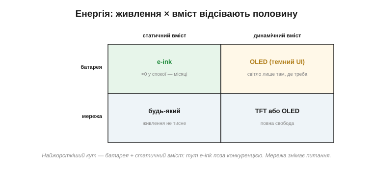
*Рис. 13.1.8.3. Найжорсткіший кут — батарея плюс статичний вміст: тут e-ink поза конкуренцією, бо в спокої не їсть нічого. Батарея плюс динаміка тягне до OLED із темним інтерфейсом (світло лише там, де треба). А мережа знімає питання енергії взагалі — бери що зручно за іншими критеріями.*

Згадаймо числа з теми про класи: підсвітка TFT горить завжди, OLED світить пропорційно вмісту, а e-ink між оновленнями лежить на нулі — різниця в сотні разів. Тож для приладу на батареї, що показує рідко змінювану інформацію, e-ink дає тижні й місяці автономності, недосяжні для інших. Для батарейного приладу з анімацією розумний вибір — OLED і темний інтерфейс. А якщо виріб живиться від мережі, енергія перестає тиснути, і вибір повертається до інших критеріїв.

Тонкість, яку легко проґавити: важить не лише, **який** екран, а й як часто він активний. Прилад, що прокидається на секунду раз на хвилину, а решту часу спить, поводиться зовсім інакше за той, що світить безперервно, — і тут e-ink з його нульовим спокоєм або OLED, що гасне між показами, дають величезну перевагу над TFT, чия підсвітка не вміє по-справжньому замовкнути. Тому перш ніж рахувати яскравість, прикиньте **робочий цикл** дисплея — яку частку часу він реально світить: саме вона, а не пікова яскравість, визначить, скільки протягне батарея.

> 🔧 **Навіщо це.** Порахуйте енергетичний бюджет дисплея **до** того, як обрали панель: часто саме екран, а не процесор, зʼїдає більшість струму, і саме він визначає розмір батареї. Вибрати яскравий TFT у батарейний прилад — це непомітно вписати в специфікацію або товсту батарею, або короткий час роботи.

### Вартість: ціна не лише в самій панелі

Третій фільтр — **гроші**, і тут чигає найтонша пастка. Дивлячись на ціну панелі в каталозі, легко забути, що сама панель — лише вершина айсберга витрат.

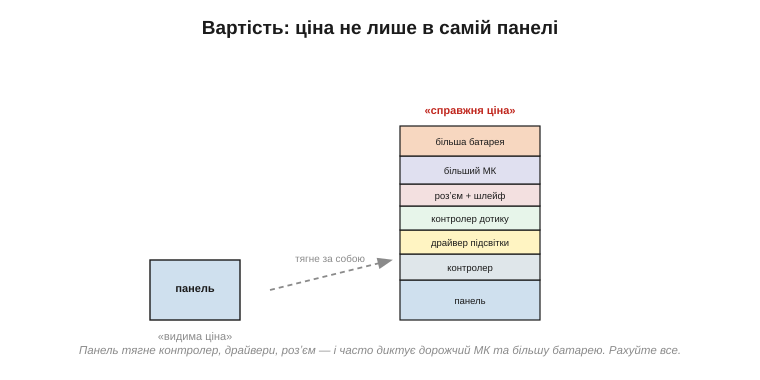
*Рис. 13.1.8.4. «Видима ціна» — це лише панель. «Справжня ціна» тягне за собою контролер, драйвер підсвітки, контролер дотику, розʼєм зі шлейфом — і, що найдорожче, часто диктує потужніший мікроконтролер (заради кадрового буфера) та більшу батарею. Рахувати треба весь стос.*

Згадайте все, що ми розбирали: великій RGB-панелі потрібен хост із контролером дисплея й мегабайтами RAM (тема 13.1.4); підсвітці — boost-драйвер (13.1.5); ємнісному дотику — окремий контролер (13.1.6); усьому цьому — розʼєм і шлейф. **Справжня** вартість дисплея у виробі — це сума всього стосу, а не цифра з прайса. До того ж ціни різко падають з обсягом: панель, дешева на десяти тисячах, може бути золотою на десятьох. І не забувайте про захисне скло, склеювання, складання.

А якщо панель кастомна — під ваш розмір, форму чи логотип на склі, — додаються ще дві статті, що вбивають дрібні серії: **NRE** (одноразова плата за розробку й оснастку) і **MOQ** (мінімальна партія, яку фабрика взагалі візьметься робити). Для виробу тиражем у сотні штук власна панель часто просто недосяжна за грошима, і доводиться вписувати проєкт у те, що вже випускають серійно. Тому стандартну панель з каталогу беруть не від бідности, а від тверезости: вона дешевша, доступніша й перевірена тисячами інших виробів.

> 🔧 **Навіщо це.** Рахуючи собівартість, беріть дисплей **разом з усім, що він тягне**: контролером, драйверами, розʼємом, а головне — з тим МК і батареєю, які він змушує поставити. Дешева на вигляд панель, що вимагає вдвічі дорожчого мікроконтролера, — насправді найдорожча.

### Кабель: інтерфейс, розʼєм і механіка

Четвертий фільтр найприземленіший, і про нього забувають найчастіше — **як панель фізично під'єднати й закріпити**. Електрично це той самий вибір інтерфейсу з теми 13.1.3: число контактів прямо випливає з того, SPI це, паралель чи RGB. А механічно — це гнучкий шлейф (*FPC*), розʼєм на платі, кріплення, рамка й ущільнення.

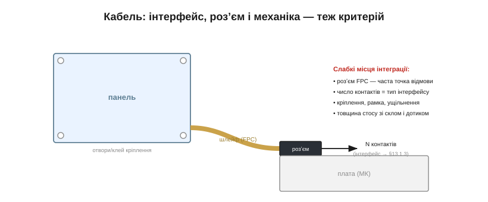
*Рис. 13.1.8.5. Дисплей під'єднується гнучким шлейфом (FPC) у розʼєм на платі; число контактів видає тип інтерфейсу. Слабкі місця інтеграції цілком приземлені: розʼєм FPC — часта точка відмови й морока на складанні; кріплення, рамка й ущільнення; товщина всього стосу зі склом і сенсором дотику.*

Дрібний з вигляду розʼєм FPC — насправді одна з найчастіших точок відмови й головний біль складання: його легко недотиснути, він ламається від вібрації, його контакти окислюються. А число контактів намертво звʼязане з інтерфейсом: вибрав RGB заради великого екрана — готуйся розводити сорок ліній і ставити відповідний розʼєм. Сюди ж — товщина стосу (панель + дотик + скло), що мусить улізти в корпус, і ущільнення, якщо виріб мокне.

І ще дві приземлені речі. По-перше, **склеювання**: сенсор дотику, скло й панель часто зʼєднують оптично прозорим клеєм (*OCA*), щоб між ними не лишалося повітряного прошарку з відблисками й конденсатом, — а це окрема технологія й окрема стаття вартости. По-друге, тип самого розʼєму: шлейфи бувають різні (скажімо, із защіпкою ZIF), і дешевий, невдало вибраний розʼєм підведе на складанні чи у вібрації не гірше за погану панель. Не кажучи вже про те, що довгий шлейф зі швидким паралельним інтерфейсом ще й випромінює завади, з якими доведеться рахуватися.

> 🔧 **Навіщо це.** Дивіться на даташит розʼєму й шлейфу так само уважно, як на саму панель. Скільки контактів, який крок, чи витримає розʼєм вібрацію й цикли складання — це впливає на надійність виробу не менше, ніж параметри екрана. Багато польових відмов дисплеїв — це не панель, а саме її розʼєм.

### Доступність і життєвий цикл — теж критерій

Є й пʼятий критерій, невидимий у лабораторії, та болючий у серії: **чи буде ця панель доступна тоді, коли вам треба, і весь час, поки живе виріб**. Дисплеї сумнозвісно швидко знімають з виробництва, у них довгі терміни постачання, а замінити панель іншою майже неможливо — кожна напівунікальна за розміром, інтерфейсом і розʼємом. Виріб нерідко переживає свій дисплей, і це треба передбачити заздалегідь. Практично це означає: при інших рівних обирайте панель, у якої є **друге джерело** або сумісні замінники з тим самим розміром і розпіновкою, — щоб зняття її з виробництва не зупинило весь ваш конвеєр. Унікальна панель без заміни — прихована міна під довговічністю продукту. Глибше планування постачання й керування життєвим циклом ми розберемо у відповідному модулі про продукт; тут досить запамʼятати: доступність — такий самий критерій вибору, як яскравість чи ціна, тільки про нього згадують надто пізно.

### Як це зводять докупи: метод і приклад

Складімо все докупи. Вибір — це не пошук «найкращого», а зважування кандидатів за всіма критеріями під ваги **вашого** сценарію. Найкраще це показати на двох виробах, де той самий метод дає протилежні відповіді.

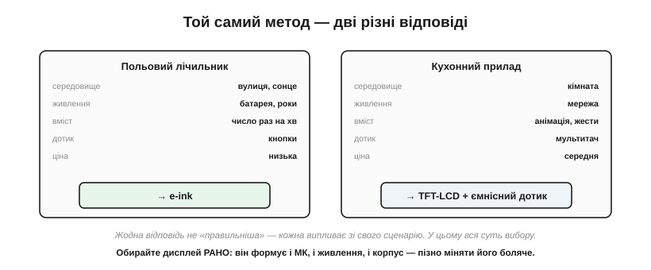
*Рис. 13.1.8.6. Зліва — польовий лічильник: вулиця й сонце, роки від батареї, число раз на хвилину, кнопки, дешево — усе вказує на **e-ink**. Справа — кухонний прилад: кімната, мережа, анімація й жести, мультитач — це **TFT-LCD з ємнісним дотиком**. Жодна відповідь не «правильніша»; кожна випливає зі свого сценарію.*

**Приклад (два вироби — два рішення).** Пройдімо метод швидко. Польовий лічильник води: середовище — вулиця під сонцем (→ відбивний), живлення — батарея на роки (→ нульове споживання в спокої), вміст — число раз на хвилину (→ повільність не страшна), ввід — кнопки (дотик не потрібен), ціна — низька. Усі стрілки сходяться на **e-ink**, і це рішення майже безальтернативне. Кухонний таймер-комбайн: середовище — освітлена кухня, живлення — від мережі (енергія не тисне), вміст — плавні анімації й жести (→ швидкий екран і мультитач), ціна — середня. Тут природний вибір — **TFT-LCD з ємнісним дотиком**. Той самий перелік питань — протилежні висновки, бо різні сценарії.

Формалізувати це можна простою **матрицею рішень**: випишіть критерії, дайте кожному вагу за важливістю для вашого виробу, оцініть кандидатів — і зважена сума підкаже фаворита, а заразом убереже від спокуси вибрати «бо гарне». І стережіться трьох класичних пасток. Перша — обрати дисплей **останнім**, коли плата вже розведена, а корпус відлитий, і втиснути його силоміць. Друга — обрати за **демонстрацією** в офісі, а не за реальним середовищем, і дістати сліпий екран на сонці. Третя — забути про **розʼєм і кабель**, згадавши про них аж на складанні. Кожна з цих пасток коштує дорогих переробок, і кожної легко уникнути, якщо йти згори — від сценарію.

Наостанок — головна засторога цього розділу. Дисплей рідко буває «просто екраном»: він формує і мікроконтролер (через кадровий буфер та інтерфейс), і живлення (через підсвітку), і корпус (через розмір, шлейф і кріплення). Тому обирайте його **рано** й виходьте зі сценарію, а не з краси на вітрині. Помилитися тут — означає переробляти пів виробу, коли плата вже розведена, а корпус відлитий.

На цьому ми закінчуємо знайомство з дисплеями й дотиком **як компонентами** — фізичними деталями, що їх обирають і під'єднують. Та обрана й під'єднана панель — це ще порожнє скло; щоб на ньому зʼявилося зображення, його треба **намалювати**. Як влаштована вся машинерія малювання пікселів — від кадрового буфера до примітивів і шрифтів — ми й розберемо в наступному розділі.

> ▶️ Далі: [Розділ 13.2 — Графічний конвеєр](../graphics-pipeline/graphics-pipeline.md)
