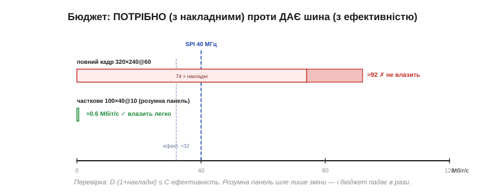

# 🧮 Бюджет пропускної здатності: чи влізе картинка в шину

> Це математична вставка до теми [§13.1.3 «Інтерфейси панелей»](displays-touch.md). Тема ввела думку «попит на дані проти ширини труби». Тут зведемо її в простий **рахунок із запасом**: скільки бітів за секунду вимагає картинка, скільки реально дає шина, і як перевірити, чи одне влазить в інше — для повного кадру й для розумної панелі, що шле лише зміни.

### Означення: попит і пропускна здатність

**Пропускна здатність** (*bandwidth*) — це скільки бітів за секунду здатна пронести шина. А **попит** дисплея — скільки бітів за секунду треба, щоб картинка жила. Для безперервного годування повного кадру попит — це добуток чотирьох чисел:

```
D = ширина × висота × (біт/піксель) × (кадрів/с)
D = 320 × 240 × 16 × 60 = 73 728 000  ≈ 73.7 Мбіт/с
```

### Інтуїція: потік проти труби

Думайте про це як про воду: пікселі — це потік, шина — труба. Труба мусить бути **ширша за потік**, та ще й із запасом, бо ні потік, ні труба не бувають «чистими». До попиту додаються **накладні витрати** (порожні поля між рядками, паузи команда/дані), а в труби частину перерізу зʼїдають службові такти. Тому порівнювати треба не голі числа, а попит *із накладними* проти ємности *з ефективністю*.


*Рис. 13.1.3m.1. Повний кадр 320×240@60 просить ≈92 Мбіт/с (74 плюс накладні) — і не влазить у SPI на 40 МГц (ефективно ≈32). А розумна панель, що шле лише змінене вікно, просить менш ніж мегабіт — і влазить із величезним запасом.*

### Формальний апарат

Накладні витрати зручно врахувати множником (типово +20…30%):

```
D' = D × (1 + накладні) = 73.7 × 1.25  ≈ 92 Мбіт/с
```

Ємність шини рахують за її природою, а тоді знижують на ефективність (паузи DMA, перемикання — типово ×0.8):

```
SPI:         C = f_такт           (1 біт/такт)   →  40 МГц = 40 Мбіт/с
8080 N-біт:  C = N × f_строб       (16 × 20 МГц)  →  320 Мбіт/с
RGB:         C = (біт/піксель) × f_PCLK
ефективна:   C' = C × 0.8
```

І весь бюджет зводиться до однієї перевірки:

```
влазить, якщо   D' ≤ C'
```

**Приклад 1 (повний кадр на SPI).** Чи прогодує SPI на 40 МГц наш екран?

```
D' = 92 Мбіт/с
C' = 40 × 0.8 = 32 Мбіт/с
92 > 32   →  НЕ влазить: треба ширша шина (8080 чи RGB)
```

**Приклад 2 (часткове оновлення розумної панелі).** Та сама панель, але з власною GRAM: шлемо лише змінене вікно 100×40 пікселів десять разів на секунду.

```
D = 100 × 40 × 16 × 10 = 640 000 = 0.64 Мбіт/с
0.64 ≪ 32   →  влазить легко, з тисячократним запасом
```

Ось чисельно та сама думка з теми про контролери: памʼять кадру «на склі» дозволяє слати **зміни**, і бюджет падає в рази.

**Приклад 3 (максимум кадрів із шини).** Скільки повних кадрів на секунду витисне SPI на 40 МГц?

```
1 кадр = 320 × 240 × 16 = 1.23 Мбіт
FPS_max = C' / кадр = 32 / 1.23  ≈ 26 кадрів/с
```

Тобто суцільний перемальунок усього екрана по SPI — це від сили ~26 fps, та й то якщо процесор більше нічого не робить. Для плавної анімації цього мало — звідси й уся економія на часткових оновленнях.

### Де в курсі це працює

Ця єдина нерівність D′ ≤ C′ і стоїть за вибором інтерфейсу (§13.1.3): дрібний екран влазить у SPI, великий вимагає паралельної чи диференційної шини. Вона ж пояснює, навіщо «розумна» панель із власним кадровим буфером (§13.1.4): вона переводить попит із *повного кадру щоразу* на *самі зміни*, і вузька шина раптом стає достатньою. А ще ця перевірка — перше, що варто зробити, прикидаючи нову панель: порахувати D′ під потрібні роздільність, глибину кольору й частоту, і звірити з C′ обраної шини, **перш ніж** замовляти залізо.

> 🔧 **Навіщо це.** Перед вибором панелі й шини полічіть бюджет: D′ = ширина × висота × біт × FPS × 1.25, C′ = ємність шини × 0.8, і перевірте D′ ≤ C′. Не влазить — або берете ширшу шину, або знижуєте роздільність/глибину/FPS, або переходите на розумну панель із частковими оновленнями. Закладайте запас: рахунок упритул на папері в житті не працює.
