# Розділ 13.2 — Графічний конвеєр

Панель ми обрали, під'єднали й навчилися живити — але це ще порожнє скло. Щоб на ньому з'явилося зображення, хтось мусить **вирішити значення кожного пікселя** й скласти з них картинку. Цей розділ — про всю машинерію, що перетворює наміри («намалюй лінію», «покажи текст») на пікселі: від кадрового буфера в пам'яті до растеризації примітивів, шрифтів, кольору й апаратних помічників. Починаємо з фундаменту, на якому стоїть усе решта, — з **кадрового буфера**, тобто з того, що екран у глибині своїй є просто масивом пам'яті.

---

## 13.2.1 Framebuffer: екран як масив пам'яті

Перш ніж малювати лінії чи літери, треба зрозуміти, **де** вони малюються. А малюються вони в **кадровому буфері** (*framebuffer*) — області пам'яті, яка, по суті, **і є** зображенням: кожному пікселю екрана відповідає своя комірка, і значення в ній задає колір цього пікселя. Змінив значення в пам'яті — змінився піксель на склі (при наступному освіженні). Тобто «малювати» означає просто **писати числа в пам'ять**, а екран — це вікно, крізь яке ми бачимо вміст цього масиву. Засвоївши цю одну думку, ви розумієте основу всієї комп'ютерної графіки.

### Кадр — це просто шматок пам'яті

Згадаймо з §3.6, що пам'ять — це **лінійний масив** комірок, кожна зі своєю адресою. Кадровий буфер — один такий неперервний шматок пам'яті, тільки ми домовляємося читати його як **двовимірну** сітку пікселів. Жодної магії: та сама стрічка байтів, лише складена подумки в рядки.

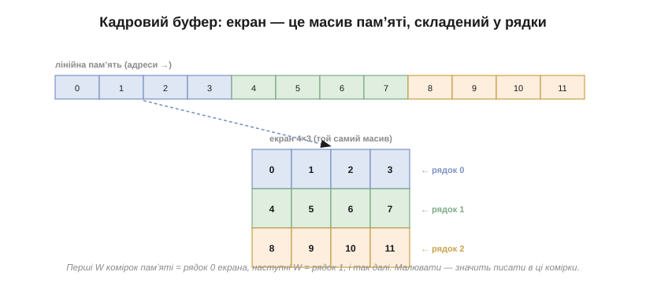
*Рис. 13.2.1.1. Зліва — пам'ять як лінійна стрічка комірок з адресами. Справа — той самий масив, складений у рядки екрана: перші W комірок стають рядком 0, наступні W — рядком 1, і так далі. Екран — це не «щось окреме», а спосіб **дивитися** на масив пам'яті.*

Ось чому графіка така проста в основі й така могутня в надбудовах: усе зводиться до читання й запису комірок пам'яті. Лінія, коло, літера, фотографія — для пам'яті це лише різні візерунки записаних чисел. Лишається домовитися про дві речі: **як** піксель (x, y) перетворюється на адресу й **що** означає число в комірці. Перше — зараз; друге (колір) — у наступній темі.

Варто на мить спинитися на тому, наскільки це проста й сильна ідея. Екран перестає бути загадковим пристроєм і стає **звичайною пам'яттю**, з якою ви вже вмієте працювати: ті самі адреси, ті самі читання й записи, що й у будь-якому масиві даних. Уся комп'ютерна графіка, від першого растрового екрана до сучасних рушіїв, виростає з цього зведення «зображення = масив чисел». І хоч сьогодні над тим масивом громадяться шари бібліотек, у самому низу завжди лежить він — кілька кілобайтів пам'яті, що їх ми домовилися бачити як картинку.

### Як піксель лягає в адресу: рядок за рядком

Найприродніший спосіб укласти двовимірну картинку в одновимірну пам'ять — **рядок за рядком** (так звана рядкова, *row-major*, розкладка): спершу всі пікселі рядка 0 зліва направо, тоді всі пікселі рядка 1, і далі вниз. Тоді адресу будь-якого пікселя легко порахувати.

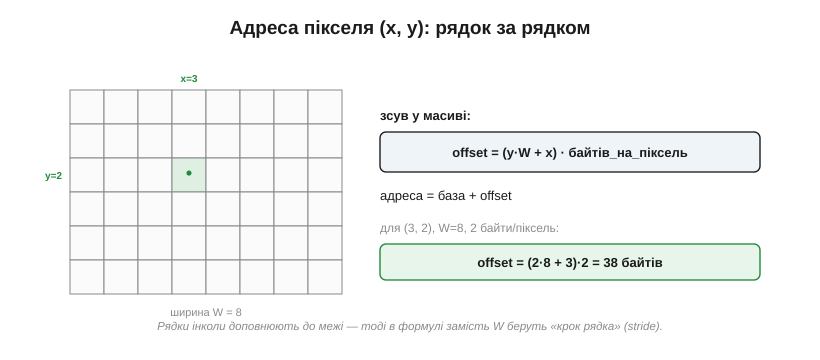
*Рис. 13.2.1.2. Щоб дістатися пікселя (x, y), пропускаємо y повних рядків (по W пікселів кожен) і ще x пікселів у своєму рядку: зсув = (y·W + x), помножений на кількість байтів на піксель. Тут піксель (3, 2) у 8-широкому буфері по 2 байти лежить за зсувом 38 байтів від початку.*

Формула, яку варто запам'ятати назавжди:

```
offset = (y · W + x) · (байтів на піксель)
адреса = база_буфера + offset
```

**Приклад (адреса пікселя).** Де в пам'яті лежить піксель (10, 5) на екрані шириною 320, якщо на піксель іде 2 байти?

```
offset = (5 · 320 + 10) · 2 = (1600 + 10) · 2 = 1610 · 2 = 3220 байтів
```

Є тонкість, через яку формула інколи трохи інша: рядок у пам'яті часом **доповнюють** до зручної межі (скажімо, до цілого числа машинних слів), щоб адресація була швидшою. Тоді відстань між початками сусідніх рядків — не W, а більша величина, яку звуть **кроком рядка** (*stride*, *pitch*); у формулі замість W беруть саме її. Для щільно впакованого буфера крок дорівнює ширині, і про це можна не думати.

Чому саме рядок за рядком, а не стовпець за стовпцем? Це лише угода, але всюди однакова, і вона невипадкова: вона збігається з тим, як панель сканується (теж рядками), тож послідовний обхід пам'яті дає послідовний обхід екрана — а пам'ять читається найшвидше саме поспіль. Зворотна задача теж буває потрібна: за зсувом відновити координати — y = зсув ÷ крок, x = зсув mod крок. І ще одне суто практичне: перш ніж писати за порахованою адресою, варто переконатися, що (x, y) **в межах** екрана. Піксель за краєм — це запис у чужу пам'ять, класична причина дивних, важко вловних збоїв.

### Скільки RAM зʼїдає один кадр

Тепер найпрактичніше питання теми, винесене в її назву. Розмір кадрового буфера — це просто число пікселів, помножене на байти на піксель:

```
розмір = ширина × висота × (біт на піксель ÷ 8)
320×240, 16 біт/піксель:  320 × 240 × 2 = 153 600 байтів ≈ 150 КБ
```

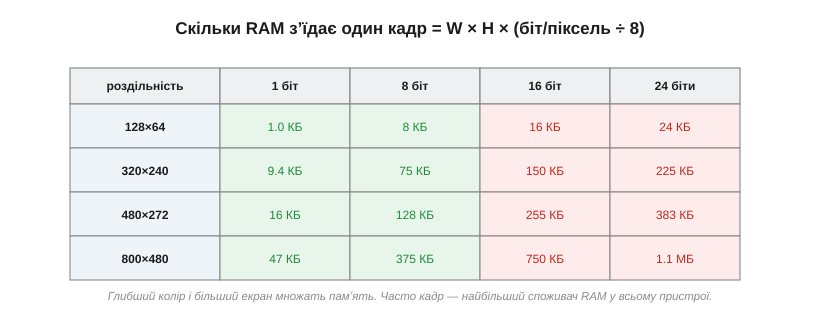
*Рис. 13.2.1.3. Розмір кадру росте і з роздільністю, і з глибиною кольору. Дрібний монохромний екран — це кілобайти, а кольоровий 800×480 — уже близько мегабайта. Часто саме кадровий буфер — найбільший поодинокий споживач RAM у всьому пристрої.*

Звідси прямий зв'язок із вибором заліза, який ми бачили раніше (теми 13.1.4 і 13.1.8): кадр на сотні кілобайтів просто **не вміститься** у вбудовану пам'ять скромного мікроконтролера, і доведеться або брати зовнішню RAM, або обходитися «розумною» панеллю з власною пам'яттю, якій шлють лише зміни. Глибина кольору тут — важіль: 8 біт замість 16 удвічі зменшують кадр (ціною кольорів), а монохромний 1 біт стискає його в рази.

Щоб відчути це наочно, варто покласти розмір кадру поруч із пам'яттю типових мікроконтролерів.

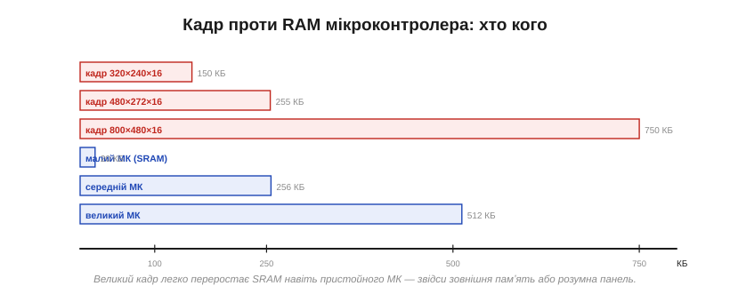
*Рис. 13.2.1.6. Кольоровий кадр легко переростає вбудовану SRAM навіть пристойного мікроконтролера: 800×480 по 16 біт — це 750 КБ, тоді як скромний МК має десятки кілобайтів, а й непоганий — кількасот. Звідси або зовнішня пам'ять, або розумна панель, що тримає кадр у себе.*

Видно сувору арифметику: дрібний монохромний екран вписується куди завгодно, а кольоровий середнього розміру вже вимагає або зовнішньої SDRAM, або відмови від повного кадру в хості. Це не вада конкретного чипа, а фундаментальне обмеження: пікселів багато, пам'ять скінченна, і кадр — велика, негнучка її стаття, яку доводиться закладати чи не найперше.

На практиці це породжує кілька звичних розвʼязків. Хочеш повний кольоровий кадр на великому екрані — закладай мікроконтролер із зовнішньою пам'яттю (SDRAM), та ще й швидкою, бо периферія читатиме її щокадру, а для плавної мальовки треба й **два** кадри. Не хочеш зовнішньої пам'яті — лишається менший екран, менша глибина кольору, панель із власною GRAM або малювання смугами. Усі ці шляхи ми вже називали в темі про вибір дисплея; тепер видно їхнє спільне коріння — звичайний розмір масиву в байтах. Памʼять — це перше, об що спотикається будь-яка графіка на мікроконтролері, і рахувати її варто ще до першої намальованої лінії.

> 🔧 **Навіщо це.** Перш ніж проєктувати графіку, порахуйте розмір кадру (W × H × бпп ÷ 8) і звірте з RAM вашого мікроконтролера. Не вміщається — це проектне рішення, а не дрібниця: або зовнішня пам'ять, або менша глибина кольору, або панель із власною GRAM, або малювання частинами. Кадровий буфер часто диктує сам клас потрібного МК.

### Малювання — це запис у пам'ять

Тепер з'єднаймо все: якщо екран — це масив, то **малювання — це запис** у нього. Атомарна операція всієї графіки — «постав піксель»: за координатами (x, y) порахуй адресу, поклади туди значення кольору.

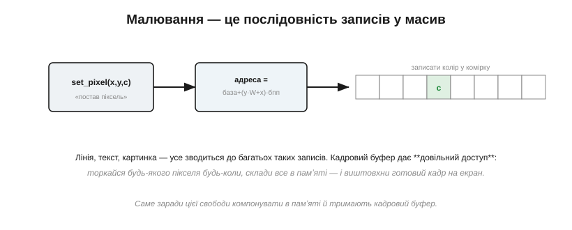
*Рис. 13.2.1.4. Уся графіка стоїть на одній операції: set_pixel(x, y, c) рахує адресу (y·W+x)·бпп і пише туди колір c. Лінія, текст, картинка — це багато таких записів. Кадровий буфер дає **довільний доступ**: торкайся будь-якого пікселя будь-коли.*

Саме **довільний доступ** і є головною цінністю кадрового буфера. Маючи всю картинку в пам'яті, ви можете чіпати будь-який піксель у будь-якому порядку, накладати елементи один на одного, скільки завгодно разів перемальовувати чернетку — а тоді, коли кадр готовий, одним махом виштовхнути його на екран. Без буфера, малюючи прямо в «дурну» панель, такої свободи немає: що намалював, те й видно негайно, і виправити складно. Тому буфер — це **полотно**, на якому художник вільно компонує, перш ніж показати результат.

Та за цю свободу є й ціна, про яку варто знати наперед. Кожен виклик «постав піксель» — це обчислення адреси й окремий запис; коли таких викликів на кадр мільйони, накладні витрати ростуть. Тому розумні бібліотеки графіки не ставлять пікселі поодинці там, де можна **гуртом**: заповнити цілий рядок прямокутника одним проходом, скопіювати смугу одним блоковим переписом пам'яті. Та сама операція по суті, але без повторного рахунку адреси на кожен піксель — і це в рази швидше. До цих оптимізацій ще дійдемо; поки що важливо бачити під ними той самий, єдиний на всю графіку, запис у масив.

### Біт на піксель і пакування

Доки на піксель іде **байт або більше**, адресація проста: кожен піксель — це ціла кількість байтів за своєю адресою. Та коли пікселю вистачає **менше** байта — 1, 2 чи 4 біти, — кілька пікселів пакують в один байт, і це міняє спосіб запису.

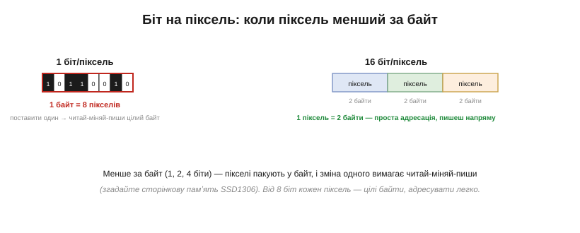
*Рис. 13.2.1.5. У монохромному режимі (1 біт) один байт несе вісім пікселів, тож, щоб змінити один, треба прочитати байт, поправити потрібний біт і записати назад — «читай-міняй-пиши». Від 8 біт кожен піксель займає цілі байти, і його пишуть напряму.*

Цей нюанс ми вже зустрічали: сторінкова пам'ять SSD1306 (компонентна вставка до теми 13.1.1) — це той самий монохромний 1-біт-на-піксель з пакуванням, тільки байт у ній **вертикальний**. Загальне правило: що менша глибина, то щільніше пакування й то більше мороки зі зміною одного пікселя; що більша — то простіша адресація ціною пам'яті. Це ще один бік того самого компромісу «глибина проти розміру», що визначає розмір кадру.

Варто розуміти, чим пакування обертається на практиці. «Читай-міняй-пиши» — це не один доступ до пам'яті, а **три** (прочитати байт, поправити в ньому потрібний біт, записати назад), та ще й небезпечний, якщо той самий байт чіпають дві задачі нараз. Тому монохромні буфери часто оновлюють не по пікселю, а цілими байтами чи рядками одразу. А ще пакування означає, що адреса пікселя більше не лягає рівно на байт: у формулі поряд із байтовою адресою з'являється ще й **номер біта** всередині байта, і код мусить виділяти його зсувами й масками. Усе це — звичайна плата за щільність, і саме тому глибокий монохром економний на пам'ять, але марудніший у малюванні.

### Де живе цей масив

Лишилося згадати, що кадровий буфер як масив пам'яті може жити у двох місцях, і ми це вже розбирали в темі про контролери (13.1.4). У «розумної» панелі він лежить у її власній GRAM, і хост шле туди зміни; у «дурної» — у RAM самого мікроконтролера, звідки його безперервно гонить периферія. Для нас зараз важливо, що **в обох випадках це той самий масив** із тією самою адресною арифметикою — різниця лише в тому, чий це шматок пам'яті й хто його освіжає. А коли повний кадр не вміщається в доступну RAM, його ділять на смуги (тайли) й малюють-виштовхують частинами — прийом, до якого ми ще повернемося, говорячи про часткові оновлення.

Цей поділ на смуги — типовий компроміс убогої пам'яті: замість одного великого кадру тримають малий буфер на кілька рядків, малюють у нього шматок картинки, виштовхують на панель — і так смуга за смугою, доки не складеться весь екран. Пам'яті треба в рази менше, зате губиться той самий довільний доступ до всього кадру: малювати доводиться з оглядкою на те, яка смуга зараз у буфері, а елемент, що ліг на межу двох смуг, обробляють двічі. Як майже завжди в embedded, економію пам'яті купують ускладненням коду — і це свідомий вибір, а не дрібниця реалізації.

### Полотно для всього подальшого

Підсумуймо головне, бо на цьому стоятиме весь розділ. Кадровий буфер — це **масив пам'яті, що є зображенням**: піксель (x, y) лежить за адресою база + (y·крок + x)·бпп, розмір кадру — це W × H × бпп ÷ 8, а малювати означає писати числа в цей масив із довільним доступом. Усі подальші теми — кольори, лінії, шрифти, анімація — це лише дедалі розумніші способи **вирішувати, що саме** записати в комірки цього полотна.

І це не просто гарна метафора, а буквальний план усього розділу. Спершу домовимося, що означає число в комірці, — це формати кольору. Тоді навчимося ефективно заповнювати багато комірок осмисленими візерунками — лініями, прямокутниками, текстом, — і робити це швидко, не рахуючи адресу на кожен піксель. Потім — як показувати готовий кадр без рваної картинки й як не перемальовувати зайвого. Та під кожним із цих кроків, хоч би яким розумним він був, лежатиме та сама проста дія, з якої ми почали: запис числа за адресою (y·крок + x)·бпп у масив, що ми звемо екраном. Тримаючи цю дію в голові, ви ніколи не загубитеся в надбудовах — бо знатимете, до чого вони всі зрештою зводяться.

> 📜 **Історія.** Як у Xerox PARC у 1970-х наважилися малювати **кожен піксель окремо** — і народили растровий екран та все, що з нього виросло (комп'ютер Alto), — в історичній вставці до цієї теми (`r02-s1-history-alto.md`).

Ми домовилися, де живуть пікселі й як до них дістатися. Лишилося друге питання, яке ми відклали: а що, власне, означає **число** в комірці — як у ньому закодовано колір? Саме до форматів кольору в пам'яті — RGB565, RGB888, палітр і прозорості — ми й переходимо далі.

---

## 13.2.2 Колір у пам'яті: RGB565/RGB888, палітри, альфа

Минула тема лишила одне питання відкритим. Кадровий буфер — масив чисел, але що означає кожне **число**? Воно кодує **колір** свого пікселя. А ось як саме — на це є два різні підходи, плюс окремий вимір прозорості, і вибір між ними щоразу торгує кольорами проти пам'яті проти швидкости. Розберімося, бо від цього залежить і розмір кадру (а отже й вибір МК із минулих тем), і вигляд картинки.

### Що означає число в комірці

Є два принципово різні способи прочитати значення пікселя. Перший — **прямий** (*direct color*): біти числа **самі є** інтенсивностями червоного, зеленого й синього. Другий — **індексований** (*indexed*, *palette*): число — це не колір, а **номер рядка** в окремій таблиці кольорів, де вже й лежить справжній RGB. Перший каже колір просто; другий — через довідник.

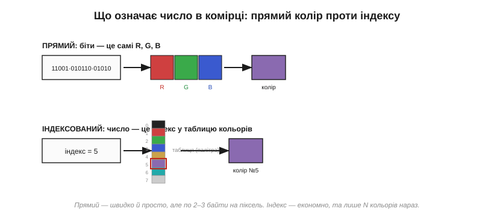
*Рис. 13.2.2.1. Угорі — прямий колір: біти комірки безпосередньо розкладаються на R, G, B. Унизу — індексований: число (тут 5) — це індекс у палітру, і колір береться з її пʼятого рядка. Прямий простіший і швидший, зате по 2–3 байти на піксель; індекс заощаджує пам'ять ціною обмеженого числа кольорів.*

Який обрати — це і є головне рішення теми, і ми пройдемо обидва. Почнімо з прямого, бо він найпоширеніший.

Цей поділ — не випадковість реалізації, а вічний компроміс пам'яті проти гнучкости, що тягнеться з ранніх комп'ютерів. Коли пам'ять була дорога, панував індекс: ціла епоха ігор і графіки 1980-х жила на палітрах, бо інакше картинка просто не вмістилася б у пам'ять. Коли пам'ять подешевшала, прямий колір витіснив індекс майже звідусіль — простіше, та й кольорів без ліку. А у вбудованих системах, де пам'ять знову на вагу золота, обидва підходи живі й сьогодні, і вибір між ними — справжній, а не історичний.

### Прямий колір: біти — це R, G, B

У прямому форматі біти числа поділені на три поля — для червоного, зеленого й синього каналів; значення в кожному полі задає яскравість свого кольору, а око змішує їх у підсумковий відтінок (згадайте підпікселі з теми 13.1.1). Що більше бітів на канал — то більше відтінків. Поширені три формати:

- **RGB888** (24 біти) — по 8 бітів на канал, 16.7 мільйона кольорів, 3 байти на піксель. Це «справжній колір», як на гарному моніторі.
- **RGB565** (16 бітів) — 5 бітів червоного, **6** зеленого, 5 синього, 65 536 кольорів, 2 байти на піксель. Це робоча конячка embedded.
- **RGB332** (8 бітів) — 3/3/2 біти, грубих 256 кольорів, 1 байт; згодиться, коли пам'яті геть обмаль.

Варто зрозуміти, чому такий поділ узагалі працює. Око не бачить «числа» — воно бачить суміш трьох світел, червоного, зеленого й синього (підпікселі з теми 13.1.1), і будь-який відтінок — це їхня пропорція. Тому колір і кодують трьома числами-яскравостями. А нерівний поділ 5-6-5 у RGB565 — не лінощі дизайнерів: 16 біт не діляться на три порівну, тож зайвий біт треба комусь віддати, і його логічно дати **зеленому**, до якого око найприскіпливіше. Червоному й синьому по 5 бітів цілком досить, бо їхні градації око розрізняє гірше — отже, віддавши зелену чутливість, виграємо найбільше за той самий байт.

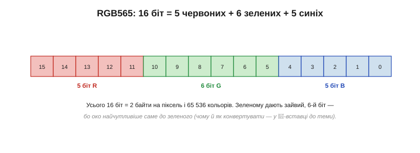
*Рис. 13.2.2.2. RGB565 укладає колір рівно в 16 біт = 2 байти. Зеленому дістається зайвий, 6-й біт — бо око найчутливіше саме до зелених відтінків, тож на ньому помітніша кожна градація. Чому так і як перетворювати кольори — у математичній вставці до теми.*

**Приклад (упакувати колір у RGB565).** Маємо колір із 8-бітних каналів R=200, G=100, B=50. Утиснемо в RGB565, відкинувши зайві молодші біти:

```
R: 200 ÷ 8 = 25   (5 біт, діапазон 0…31)
G: 100 ÷ 4 = 25   (6 біт, діапазон 0…63)
B: 50  ÷ 8 = 6    (5 біт, діапазон 0…31)
RGB565 = (25 « 11) | (25 « 5) | 6 = 0xCB26
```

> 🧮 **Порахувати точніше.** Чому зеленому саме 6 біт, як рахувати зсуви й чисто перетворювати RGB888 ↔ RGB565 без зайвої втрати — у математичній вставці до цієї теми (`r02-s2-m-rgb565.md`).

### Скільки кольорів проти скільки пам'яті

Чому ж не завжди беруть найкращий RGB888? Бо глибина кольору — це прямо й **розмір кадру** з минулої теми: що більше бітів на піксель, то більше пам'яті з'їдає буфер. Вибір формату — це торг між багатством кольорів і ціною в байтах.

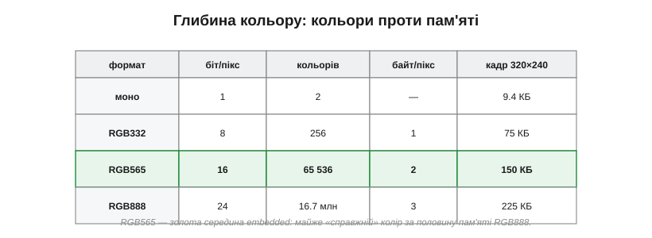
*Рис. 13.2.2.3. Що глибший колір, то більше відтінків — і то більший кадр. RGB565 — золота середина embedded: 65 тисяч кольорів (для ока майже «справжній колір») за **половину** пам'яті RGB888. Тому 16 біт на піксель — фактичний стандарт кольорових екранів на мікроконтролерах.*

Видно, чому саме **RGB565** запанував у вбудованих системах: він дає вдосталь кольорів, щоб картинка виглядала повноцінною, але коштує лише два байти на піксель замість трьох — а на сотнях тисяч пікселів та третина економії вирішальна. RGB888 лишають для систем із зовнішньою пам'яттю, де можна не рахувати кожен байт, а монохром і RGB332 — для зовсім скромних.

Цікаво, що 16 і 24 біти колись мали навіть власні назви — «high color» і «true color». «True», тобто «справжній», 24-бітний колір названо так невипадково: 16.7 мільйона відтінків — це вже **більше**, ніж око здатне розрізнити, тож додавати бітів далі немає сенсу. А «high color» на 65 тисяч відтінків око сприймає майже як суцільний, спотикаючись хіба на дуже плавних градієнтах. Ось чому RGB565 — такий вдалий компроміс: він стоїть рівно на тій межі, де економія вже відчутна, а втрата кольорів — ще майже ні.

> 🔧 **Навіщо це.** Обираючи глибину кольору, ви водночас обираєте розмір кадру. Для більшости кольорових екранів на МК відповідь — RGB565: він майже не поступається оку RGB888, зате вдвічі ощадливіший. Бережіть 24-бітний колір на той випадок, коли є зовнішня RAM і потрібні плавні фотографічні градієнти; для інтерфейсу 16 бітів вистачає з головою.

### Палітра: число як індекс у таблицю кольорів

А якщо кольорів треба небагато, але хочеться платити лише **один** байт на піксель? Тоді беруть **індексований** колір. Кожна комірка кадру тримає не сам колір, а **індекс** у невелику **таблицю кольорів** (*CLUT*, *color look-up table*) — скажімо, на 256 рядків, де кожен рядок — повноцінний RGB888. Піксель займає 1 байт, а виглядати може будь-яким із 256 наперед обраних кольорів.

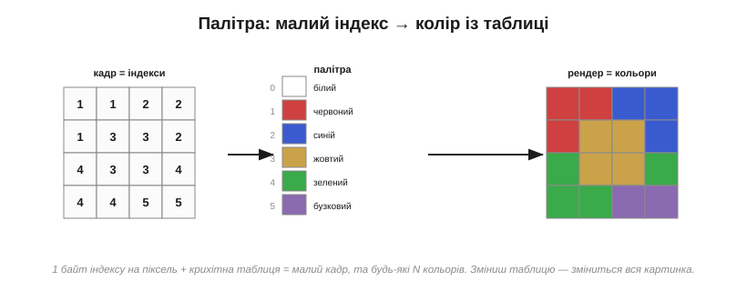
*Рис. 13.2.2.4. Кадр зберігає лише **індекси**; справжні кольори лежать у крихітній палітрі. Так піксель коштує 1 байт замість 2–3, а палітра — лічені байти на всю картинку. Бонус: змінивши таблицю, ви вмить перефарбовуєте все зображення, не чіпаючи жодного пікселя кадру.*

Виграш подвійний: кадр стає в рази меншим (один байт на піксель проти двох-трьох), а сама палітра займає дрібницю. До того ж індексований колір дає гарний трюк: щоб **перефарбувати** всю картинку — зробити фейд, миготіння, зміну теми — досить підмінити таблицю, а величезний масив пікселів лишається недоторканим. Розплата одна: на екрані одночасно живе лише стільки кольорів, скільки рядків у палітрі. Для фотографій це замало, а для інтерфейсу з обмеженою гамою — саме те.

Старий цей прийом подарував графіці чимало хитрощів. Плавно зсуваючи кольори в палітрі, робили **анімацію без перемальовування** — мерехтіння води, біг вогників, поступове затемнення екрана; усе це коштувало лише підміни кількох рядків таблиці замість тисяч пікселів. Окремий випадок палітри — **відтінки сірого**: та сама індексація, де всі рядки таблиці сірі, дає економний градаційний монохром, корисний для e-ink чи простих графіків. Палітра — це, по суті, ще один рівень непрямости між пікселем і кольором, а непрямість, як відомо, у програмуванні розв'язує майже все.

> 🔧 **Навіщо це.** Палітра — ваш друг, коли пам'яті обмаль, а кольорів треба небагато: піктограми, схеми, інтерфейс у фірмовій гамі. Вона ділить розмір кадру навпіл проти RGB565 і дарує дешеві ефекти перефарбування. Але щойно знадобиться багата фотографічна картинка — палітра тісна, і доведеться вертатися до прямого кольору.

### Альфа: прозорість для накладання

Прямий та індексований колір кажуть, **який** піксель. Лишається ще один корисний вимір — наскільки він **прозорий**. Для цього додають **альфа-канал** (*alpha*): значення, що каже, яка частка пікселя видима, а яка пропускає те, що під ним. Формат ARGB8888 (32 біти) — це RGB888 плюс 8 бітів альфи.


*Рис. 13.2.2.5. Альфа працює під час **накладання** шарів: піксель джерела з прозорістю α змішується з тим, що під ним, за простою формулою. На сам екран іде вже **готовий**, змішаний колір — адже скло прозорости не має. Дешевша заміна повної альфи — **колірний ключ**: один умовний колір оголошують прозорим, і він просто не малюється.*

Ключова тонкість: альфу використовують **під час малювання**, а не зберігають у фінальному кадрі — екран не вміє бути напівпрозорим, тож у буфер екрана лягає вже **змішаний** колір. Саме змішування (*alpha blending*) робить за формулою:

```
out = src·α + dst·(1 − α)
```

де src — колір того, що накладаємо, dst — того, що під ним, а α — від 0 (невидимо) до 1 (непрозоро).

**Приклад (накладання при α=0.5).** Накладемо червоний (255, 0, 0) з напівпрозорістю на синє тло (0, 0, 255):

```
R = 255·0.5 + 0·0.5   = 128
G = 0·0.5   + 0·0.5   = 0
B = 0·0.5   + 255·0.5 = 128
результат = (128, 0, 128) — фіолетовий
```

Для дрібних систем повна альфа дорога (зайвий байт на піксель і множення на кожен), тож часто беруть дешеву заміну — **колірний ключ** (*color key*): один умовний колір (скажімо, яскравий пурпур) оголошують «прозорим», і при малюванні спрайта пікселі цього кольору просто пропускають. Жодного зайвого каналу — а вирізаний по контуру значок виходить. (Апаратне змішування й заливку ми ще зустрінемо, говорячи про 2D-прискорювачі.)

Варто розуміти й **коли** відбувається це змішування. Якщо елементи відомі наперед, їх часто змішують **заздалегідь** і зберігають уже готовими — тоді під час малювання альфа взагалі не потрібна. Якщо ж шари рухаються один щодо одного (вікно над тлом, спрайт над сценою), змішувати доводиться **на льоту**, на кожен кадр, — і тут кожне множення на рахунку, тож на дрібних МК часто й рятуються колірним ключем замість повної альфи. Є й технічна тонкість — «попередньо помножена альфа», коли колір уже зберігають домноженим на прозорість, щоб пришвидшити накладання; але в неї тут заглиблюватися не будемо.

### Дрібні пастки: порядок байтів і втрата відтінків

Наостанок — дві приземлені пастки, на яких легко обпектися. Перша — **порядок байтів** (*endianness*). Піксель RGB565 займає два байти, RGB888 — три, і питання, у якому порядку вони лежать у пам'яті й чекаються контролером, аж ніяк не пусте.

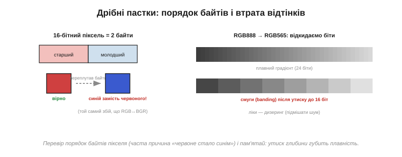
*Рис. 13.2.2.6. Ліворуч: переплутав старший і молодший байти пікселя — і червоне стає синім (той самий клас збою, що RGB↔BGR з компонентної вставки про SPI-TFT). Праворуч: утискаючи 24-бітний градієнт у 16 біт, відкидаємо біти — і плавний перехід розпадається на видимі **смуги**.*

Якщо мікроконтролер кладе байти пікселя в одному порядку, а контролер дисплея чекає в іншому, кольори виходять перекручені — класичне «червоне стало синім», споріднене з плутаниною RGB/BGR із теми про SPI-дисплеї. Друга пастка — **втрата відтінків** при утиску глибини: переходячи з 24 біт на 16, ми відкидаємо молодші біти каналів, і там, де був плавний градієнт, проступають **смуги** (*banding*). Лікують це **дизерингом** — підмішуванням дрібного шуму, що «розмазує» межі смуг і обманює око плавністю. Ще варто пам'ятати, що значення пікселя зазвичай **не лінійне** щодо яскравости світла (гама-крива), але в це заглиблюватися тут не будемо.

Через ці пастки конвертацію кольору варто робити з розумом. Утискаючи 8 біт каналу в 5, не досить просто відкинути молодші три біти: тоді найяскравіше значення вийде трохи тьмянішим за чистий максимум, бо верхній рівень не дотягнеться до краю. Правильніше — **продублювати старші біти вниз**, щоб діапазон лишився повним від нуля до максимуму. Дрібниця, та саме через неї «біле» інколи виходить ледь сіруватим, а градієнти — нерівними. Як зробити це чисто, з формулами, — у математичній вставці до теми.

### Підсумок: число стало кольором

Отже, число в комірці кадру — це **код кольору**, і прочитати його можна трьома укладами: прямо (біти — це R, G, B, як у RGB565 чи RGB888), через **палітру** (число — індекс у таблицю) або з **альфою**-супутником для накладання. Кожен вибір — це знайомий торг: більше кольорів проти меншого кадру проти простішого й швидшого коду. Тримаючи в голові цей торг, ви свідомо добиратимете формат під свій екран і свою пам'ять, а не братимете «який трапиться».

І ще одне на завершення: формат кольору — не лише ваш внутрішній вибір, а й те, що мусить **збігтися** з тим, чого чекає панель та її контролер. Намалювали кадр в RGB565, а контролер налаштований на іншу глибину чи інший порядок байтів — і картинка попливе барвами. Тож формат узгоджують уздовж усього ланцюга: від того, як ви пишете піксель у пам'ять, до того, як його зрештою читає скло.

Тепер ми знаємо і **де** лежить піксель (тема 13.2.1), і **що** означає його значення (ця тема). Лишилося навчитися заповнювати багато пікселів **осмисленими візерунками** — не ставити їх по одному, а малювати лінії, прямокутники, текст. Саме до цих примітивів — і до того, як швидко їх растеризувати, — ми переходимо далі.

---

## 13.2.3 Малювання примітивів: лінії, прямокутники, текст (растеризація)

Ми вміємо поставити один піксель (тема 13.2.1) і знаємо, що означає його колір (тема 13.2.2). Та ніхто не малює інтерфейс цяткою за цяткою — ми мислимо **формами**: лінія, прямокутник, коло, рядок тексту. Завдання перетворити абстрактну форму (дві кінцеві точки, чотири кути, літеру) на той **набір пікселів**, що передає її на сітці екрана, зветься **растеризацією** (*rasterization*). Ця тема — про мистецтво робити це правильно й швидко, бо саме растеризація стоїть між «я хочу лінію» і реальними записами в кадровий буфер.

Саме слово «растр» (*raster*) походить від латинського «граблі» — і влучно: растеризація наче «прочісує» форму граблями сітки, лишаючи від неї рядок засвічених клітинок. Цей перехід від гладкої геометрії до зернистої сітки й робить екранну графіку одночасно простою в основі та сповненою дрібних хитрощів, які ми зараз і розберемо.

### Від пікселя до примітива: що таке растеризація

Корінь усієї задачі — у зіткненні двох світів. Форми, якими ми мислимо, **неперервні**: ідеальна лінія нескінченно тонка, коло гладке. А пікселі — **дискретні** квадратики жорсткої сітки. Растеризувати — означає чесно вибрати, які саме клітинки засвітити, щоб вони якнайкраще передали неперервну форму.


*Рис. 13.2.3.1. Зліва — ідеальна лінія, нескінченно тонка. Справа — її растр: набір клітинок, що складаються в «сходинки», бо інакше передати косу лінію на квадратній сітці неможливо. Уся растеризація — це пошук найкращого такого наближення.*

Через цю дискретність растеризація завжди **наближення**, і в нього є ціна — ті самі «сходинки», до яких ми ще повернемося. Але спершу — від простого до складного: прямокутники, потім лінії, кола й текст.

Варто відразу зрозуміти, що ця задача не зникає з ростом потужности — вона лише ховається глибше. І на крихітному монохромному екранчику, і на величезному щільному моніторі дилема та сама: неперервну форму треба вкласти в дискретну сітку, обравши клітинки. Різниця тільки в тому, що на густішій сітці сходинки дрібніші й менш помітні. Тож прийоми, які ми зараз розберемо, — не «милиці для бідного заліза», а сама основа комп'ютерної графіки; просто на мікроконтролері вони оголені до кістки, без апаратних помічників, що ховають їх у дорогих системах.

### Прямокутники й заливки: найлегше

Найпростіший примітив — **заповнений прямокутник**. Здавалося б, нічого думати: пройди подвійним циклом по всіх (x, y) у межах прямокутника й постав кожен піксель. Це працює, та коли так заливати весь екран, мільйони окремих викликів «постав піксель» гальмують. Хитрість — заливати **спанами**: оскільки рядок прямокутника — це суцільна горизонтальна смуга однакового кольору, її заповнюють **одним проходом**, як заповнюють ділянку пам'яті (memset), а не піксель за пікселем.


*Рис. 13.2.3.2. Той самий прямокутник: ліворуч — шість спанів по вісім пікселів, тобто шість швидких операцій; праворуч — сорок вісім окремих set_pixel. Горизонтальний спан — заповнити цілий рядок одним махом — найшвидший будівельний блок графіки, на якому стоїть і заливка, і очищення екрана.*

Контур прямокутника — це просто його чотири сторони, тобто чотири лінії (дві горизонтальні — ті ж спани, дві вертикальні). Тож щойно ми навчимося малювати **лінію**, прямокутники й заливки виходять майже задарма. А от лінія — це вже цікаво.

Заливка, до речі, не конче суцільна. Тим самим спаном можна класти не один колір, а **візерунок** чи **градієнт** — просто значення в рядку рахують на льоту замість копіювати одне. А контур буває не в один піксель завтовшки: товсту рамку малюють або кількома вкладеними прямокутниками, або заливкою смуги по периметру. Та хоч як ускладнюй, прямокутник лишається найдешевшим примітивом — рівні, осьові межі дозволяють працювати цілими рядками, без жодної косої арифметики.

**Приклад (спан проти пікселя).** Залиймо прямокутник 100×60 пікселів:

```
по пікселю:  100 × 60 = 6 000 викликів «постав піксель»
спанами:     60 рядків     = 60 операцій заповнення
виграш:      у ~100 разів менше окремих дій
```

На цьому й видно, чому «думати спанами» — не дрібна оптимізація, а зміна **порядку величини** роботи.

### Лінії: непроста простота

Як вирішити, які пікселі складають лінію від (x0, y0) до (x1, y1)? Шкільна відповідь — рівняння y = k·x + b: крокуй по x, рахуй y, округлюй до клітинки. Воно й працює, але має дві біди. Перша — **дробові числа**: множення й округлення з плаваючою комою на дрібному мікроконтролері повільні, а то й геть недоступні. Друга, підступніша: якщо лінія крута (йде більше вгору, ніж убік), крок по x лишає в ній **діри** — на один x припадає кілька y, і пікселі не змикаються.

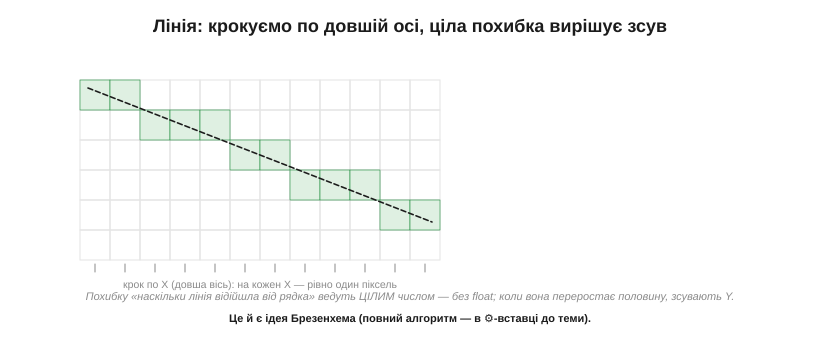
*Рис. 13.2.3.3. Секрет рівної лінії — крокувати по **довшій** осі (тут X), даючи на кожен її крок рівно один піксель. А коли зсувати другу координату, вирішує **ціле** число-похибка: «наскільки лінія вже відійшла від поточного рядка». Переросла половину клітинки — зсунули Y, відняли назад. Жодного float.*

Розв'язок, що став класикою, оминає обидві біди. По-перше, крокують завжди по **довшій** осі — так на кожен крок припадає рівно один піксель, і дір не буває. По-друге, замість дробового y ведуть **цілу похибку** — накопичену відстань лінії від поточного рядка; коли вона переростає півклітинки, координату зсувають на піксель і похибку коригують. Усе на цілих числах, самими додаваннями й порівняннями. Це й є знаменитий алгоритм Брезенхема — настільки ощадливий, що ліг в основу графіки на найскромнішому залізі.

Реальні лінії бувають товсті й пунктирні, та обидва ускладнення лягають на той самий кістяк. Товсту лінію малюють або кількома паралельними тонкими, або як видовжений прямокутник під кутом; пунктир — просто пропускаючи частину пікселів за лічильником. Головне ж, заради чого вся ця хитрість, — швидкість: наївний спосіб на кожен піксель робить множення й округлення з комою, а Брезенхем — лише пару цілих додавань. На лінії в кількасот пікселів, ще й тисячі ліній на кадр, ця різниця й відділяє «плавно» від «гальмує».

> ⚙️ **Алгоритм.** Повний алгоритм Брезенхема для лінії й кола — з покроковою похибкою, цілими числами й псевдокодом — в алгоритмічній вставці до цієї теми (`r02-s3-a-bresenham.md`).

### Кола й дуги: симетрія на поміч

Коло растеризують спорідненою ідеєю — теж цілою похибкою, що веде криву по клітинках без тригонометрії на льоту. Та коло дарує ще й чудовий подарунок — **симетрію**. Воно однакове в усіх восьми октантах, тож порахувати треба лише **одну восьму** дуги, а решту сім дістати простим **відображенням** координат по осях і діагоналі.

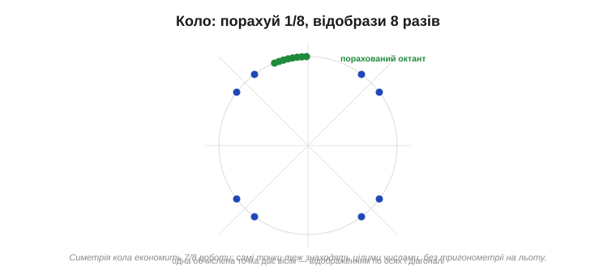
*Рис. 13.2.3.4. Кожна обчислена точка одного октанта дає одразу вісім точок кола — дзеркальним відображенням по горизонталі, вертикалі й діагоналі. Так симетрія економить сім восьмих роботи, а самі точки знаходять цілими числами.*

Цей прийом — рахувати малий шматок і **тиражувати симетрією** — наскрізний у графіці: він економить і час, і код, і його варто впізнавати скрізь, де форма має осі симетрії.

Із цього октанта легко дістати й більше, ніж контур. **Залитий** круг виходить, якщо між симетричними точками протягти горизонтальні спани — знову той самий спан, наш найшвидший інструмент. **Дугу** малюють, обчислюючи не весь октант, а лише потрібний діапазон кутів. А **еліпс** — це те саме коло, тільки з різними кроками по двох осях. Усе сімейство круглих форм виростає з однієї цілочислової ідеї плюс симетрія — і жодної тригонометрії в гарячому циклі.

### Текст: літера — це маленький бітмап

Найуживаніший примітив інтерфейсу — **текст**, і влаштований він простіше, ніж здається. Кожна літера зберігається як крихітний **бітмап** — **гліф** (*glyph*) у складі шрифту: маленький візерунок пікселів, що зображає саме цей символ. Намалювати рядок означає поставити гліф кожної літери в поточну позицію **курсора** — а це не що інше, як **бліт**, той самий BitBlt, що його винайшли для Alto (історія до теми 13.2.1), — і зсунути курсор на ширину літери.


*Рис. 13.2.3.5. Кожна літера — маленький бітмап-гліф; малювання тексту блітить їх один за одним і щоразу посуває курсор. У **моноширинному** шрифті крок однаковий для всіх літер; у **пропорційному** — свій для кожної (вузьке «i» зсуває курсор менше за широке «H»), і текст виглядає природніше.*

Тут і ховається різниця між **моноширинним** шрифтом, де кожна літера займає однакову ширину (зручно, та «i» висить у завеликій порожнечі), і **пропорційним**, де ширина своя в кожної літери, і рядок виглядає як друкований. А **як саме** влаштований гліф усередині, як його роблять гладким і звідки беруть форми, — це окрема, велика тема, до якої перейдемо далі; тут досить бачити, що текст зводиться до тих самих блітів пікселів.

Сам шрифт при цьому — це просто **таблиця** гліфів, проіндексована кодом символу: щоб намалювати літеру, беруть її код (скажімо, ASCII), знаходять у таблиці потрібний бітмап і блітять його. Звідси й практичні турботи, що зринуть у наступній темі: скільки символів покласти в таблицю (сама латиниця — це близько сотні гліфів, а кирилиця чи юнікод — куди більше, і всі вони їдять Flash), якої висоти їх тримати й чи рівняти проміжки між парами літер. Текст здається дрібницею — аж доки не порахуєш, скільки пам'яті з'їдає гарний великий шрифт.

Через цю вагу текст часто й стає найгарячішим місцем графіки — адже на екрані інтерфейсу літер зазвичай більше, ніж будь-чого іншого. Тому гліфи тримають у швидкій пам'яті наперед готовими, а не рахують щоразу; а незмінний текст (підписи, шкали) розумно не перемальовувати взагалі, доки він не змінився. Тут знову зринає те саме правило, що й зі спанами: найдешевша літера — та, яку не довелося малювати наново.

### Сходинки й межі: аліасинг і відсікання

Повернімося до ціни дискретности. Косі лінії й кола на квадратній сітці неминуче виходять **ступінчастими** — це **аліасинг** (*aliasing*), ті самі «драбинки» (*jaggies*). Око їх помічає, надто на плавних кривих. Лікують їх **згладжуванням** (*anti-aliasing*): крайові пікселі роблять не суто чорними чи білими, а **сірими** — пропорційно тому, яку частку клітинки накриває форма. Око зливає ці півтони в гладку межу. (Деталі згладжування — у темі про шрифти, де воно найважливіше.)

Чому згладжування найважливіше саме для тексту? Бо літери — це маса дрібних косих і круглих штрихів, і на малому розмірі без згладжування вони розсипаються на нечитабельні сходинки. Великій діагональній лінії аліасинг лише псує вигляд, а дрібному шрифту відбирає **читабельність**, заради якої екран і існує. Тому в дисплеях, де багато тексту, згладжування гліфів — не косметика, а необхідність; на грубому ж монохромному екранчику від нього відмовляються, бо проміжного сірого там просто немає.


*Рис. 13.2.3.6. Ліворуч: та сама коса лінія — ступінчаста й згладжена сірими крайовими пікселями. Праворуч: **відсікання** — усе, що виходить за межу екрана чи вікна, відрізають заздалегідь і не малюють.*

Друга турбота меж — **відсікання** (*clipping*). Малюючи примітив, треба не вийти за край екрана чи поточного вікна — інакше, як ми вже знаємо з теми 13.2.1, запис за межі кадру псує чужу пам'ять. Тому примітив **відсікають** до прямокутника видимої ділянки: або обрізають його геометрично ще до растеризації (швидко), або перевіряють кожен піксель на належність межам (просто, але повільніше). Відсікання — не дрібниця, а обов'язкова страховка кожної операції малювання.

### Швидкість: думати спанами, а не пікселями

Зведімо докупи наскрізну думку. Будь-який примітив зрештою розпадається на записи в кадровий буфер — але **як** ці записи робити, вирішує швидкість. Три правила, що проходять через усю тему: заповнюй **спанами** (цілий рядок за раз), а не пікселями; рахуй **цілими** числами (Брезенхем), а не дробовими; рухай готові шматки **блоками** (бліт), а не цяткою. Саме на цих трьох прийомах і стоїть швидка графіка на скромному залізі — а в потужніших системах їх роблять уже апаратно, у 2D-прискорювачах, про які піде мова згодом.

Є й четвертий, стратегічний прийом, що стоїть над усіма трьома: не перемальовувати того, що **не змінилося**. Найшвидший піксель — той, якого ти не торкнувся. Замість гнати весь кадр щоразу, відстежують, які ділянки справді оновилися, і чіпають лише їх — про цю «економію бездіяльністю» докладніше йтиметься далі в розділі. Та закласти її в голову варто вже зараз: часто найбільший виграш дає не швидше малювання, а **відмова малювати** зайве.

> 🔧 **Навіщо це.** Коли картинка «гальмує», винні майже завжди не самі пікселі, а **спосіб** їх ставити. Перш ніж оптимізувати алгоритм, спитайте: чи заливаю я спанами, а не подвійним циклом? чи цілі в мене обчислення, без float? чи блічу готові спрайти замість малювати їх щоразу? Найбільший виграш дає не хитрий код, а перехід від «по пікселю» до «гуртом».

Озирнімося: усе розмаїття форм — пряма, прямокутник, коло, літера — звелося до жменьки прийомів над одним масивом пам'яті. Лінію й коло веде ціла похибка, прямокутник заливають спанами, текст і спрайти переносять блоками, а зайвого не малюють зовсім. Засвоївши ці чотири рухи, ви вмієте намалювати на екрані будь-що — бо складніша графіка є лише їхньою комбінацією.

Ми навчилися перетворювати форми на пікселі — лінії, прямокутники, кола й текст. Та текст ми лише ледь зачепили, а він — найважливіший і найхитріший примітив інтерфейсу: від нього залежить, чи буде ваш екран читабельним. Як влаштовані шрифти, чим бітмапні відрізняються від векторних і як зробити літери гладкими — про це наступна тема.

---

## 13.2.4 Шрифти: бітмапні проти векторних (кернінг, юнікод, вага шрифтів у Flash)

Минула тема лишила текст як «бери гліф зі шрифту й блітай його». Але що таке цей гліф і як зберігається шрифт? Тут — два протилежні підходи з геть різною ціною: **бітмапний** (наперед намальовані пікселі) і **векторний** (контури, які растеризують). А поверх них — кернінг, охоплення символів і та сама турбота, що переслідує embedded від першої теми: скільки **Flash** з'їдає гарний шрифт. Розберімо все по черзі, бо вибір шрифту на дрібному залізі — це майже завжди битва за пам'ять.

### Гліф: дві філософії зберігання

**Гліф** (*glyph*) — це накреслення одного символу, його форма. Зберегти цю форму можна двома принципово різними способами. Перший — **як пікселі**: просто намалювати літеру на маленькій сітці й запам'ятати, які клітинки чорні. Другий — **як контур**: описати геометрію форми лініями й кривими, не прив'язуючись до жодного розміру.


*Рис. 13.2.4.1. Ліворуч — бітмап: готова сітка пікселів одного конкретного розміру. Праворуч — вектор: контур із точок і кривих, з якого літеру можна намалювати будь-якого кегля. Перший підхід зберігає **результат**, другий — **рецепт**.*

Ця відмінність — між збереженим результатом і збереженим рецептом — і визначає всі їхні переваги та вади. Розгляньмо кожен.

Ця пара «результат проти рецепта» — наскрізна в техніці, і варто впізнавати її скрізь. Зберегти готовий результат — швидко читати, та негнучко й об'ємно, коли результатів багато (тут — багато розмірів). Зберегти рецепт — компактно й гнучко, та треба щоразу «готувати» (растеризувати). Історично першими були **бітмапні** шрифти: на ранніх екранах інакше й не могло бути, бо обчислювати контури не було чим. Векторні прийшли, коли з'явилися процесори, здатні растеризувати на льоту; а в embedded, де процесор знову скромний, бітмап нерідко вертається — історія робить коло.

### Бітмапні шрифти: піксель готовий наперед

У бітмапному шрифті кожен гліф — це **фіксований візерунок пікселів** одного розміру, що лежить у Flash як масив бітів. Намалювати літеру — означає просто **блітнути** цей візерунок (тема 13.2.3); жодних обчислень, жодної математики.

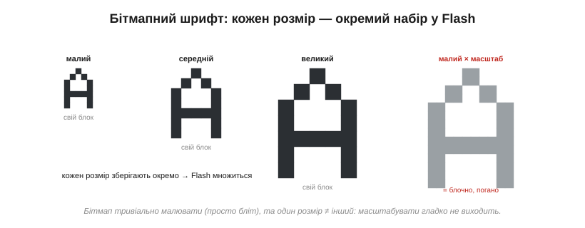
*Рис. 13.2.4.2. Бітмап тривіально малювати — але один збережений розмір не перетворити гладко на інший: спроба масштабувати дрібний гліф дає блочну, негарну літеру. Тому кожен потрібний кегль зберігають **окремим** набором, і Flash множиться на число розмірів.*

Звідси чіткий баланс. Плюси бітмапного шрифту — простота, швидкість і передбачуваність: блітнути готові пікселі вміє найскромніший мікроконтролер, без жодної RAM під обчислення. Мінуси прямо випливають із того, що збережено саме пікселі одного розміру: **масштабувати** їх гладко не вийде (збільшений гліф блочний, зменшений — каша), тож кожен потрібний кегль доводиться **зберігати окремо**, а великі розміри з'їдають багато Flash. Через це бітмапні шрифти панують на дрібних МК, і часто їх **наперед готують** із векторного шрифту під час збирання — рівно на ті розміри, що знадобляться.

Сам гліф у шрифті — це не лише прямокутник пікселів, а й кілька **мірок** довкола нього. Базова лінія (*baseline*), на якій «стоять» літери; виноси вгору й униз (для літер із хвостиком, як «р» чи «ц»); і **крок** (*advance*) — на скільки зсунути курсор після цієї літери. Саме ці мірки роблять рядок рівним, а не стрибучим, і відрізняють моноширинний шрифт (однаковий крок) від пропорційного (свій крок у кожної). Готуючи бітмапний шрифт із векторного на етапі збирання, інструмент розраховує всі ці мірки наперед і пакує їх поряд із пікселями, тож у рантаймі лишається тільки блітати й зсувати курсор.

> 🔧 **Навіщо це.** Для більшости екранів на мікроконтролері бітмапний шрифт — правильний вибір: він дешевий, миттєвий і не потребує ні растеризатора, ні RAM. Тільки пам'ятайте, що кожен **розмір** і кожне **накреслення** (звичайне, жирне) — це окремий набір гліфів у Flash, тож не плодьте їх без потреби: три кеглі замість одного — це втричі більше пам'яті під шрифт.

### Векторні шрифти: форма, яку растеризують

Векторний (контурний) шрифт зберігає не пікселі, а **контури** літери — її обриси, задані кривими (зазвичай Безьє), незалежно від розміру. Щоб намалювати гліф, його **растеризують** на льоту: беруть контур, масштабують під потрібний кегль і заливають — тією самою растеризацією з теми 13.2.3.


*Рис. 13.2.4.3. З одного опису контуру малюють літеру будь-якого розміру — і всі виходять гладкими. Ціна цієї гнучкости — потрібен растеризатор: код, процесорний час і трохи RAM на кожен гліф.*

Переваги дзеркальні до бітмапних: **будь-який** розмір з одного опису, завжди гладкий (зі згладжуванням), а один файл шрифту покриває всі кеглі й навіть дозволяє вивести жирне чи похиле накреслення з тієї ж геометрії. Розплата — складність: потрібен **растеризатор** (рушій на кшталт відомого FreeType), а це і код, і процесорний час, і RAM під проміжний гліф. Тому повноцінний векторний рендеринг тримають для потужніших мікроконтролерів; на скромних задовольняються бітмапом.

Варто згадати дві речі, без яких векторні шрифти не були б такими гарними. Перша — **гінтинг** (*hinting*): підказки в шрифті, що на дрібних розмірах «притягують» контур до сітки пікселів, аби тонкі штрихи не зникали й не двоїлися; без нього малий векторний текст виходить розмитим. Друга — самі формати: контурні шрифти, які ви бачите щодня, — це **TrueType** і **OpenType**, де гліф описано кривими плюс гінти й таблиці кернінгу. Саме такий файл і «переварює» растеризатор, видаючи пікселі під ваш конкретний екран і кегль.

> ⚙️ **Алгоритм.** Як саме з гліфа роблять пікселі — крок растеризації з контуру чи бітмапа й згладжування на 4 біти/піксель — в алгоритмічній вставці до цієї теми (`r02-s4-a-font-render.md`).

### Гладкі літери: 1 біт проти згладжування

Окремий вимір — **наскільки гладкі** краї літер. Якщо піксель гліфа зберігати одним **бітом** (чорний або білий), малі літери виходять різкими й ступінчастими — ті самі сходинки з теми 13.2.3. Якщо ж відвести пікселю кілька **бітів** (скажімо, 4 біти = 16 рівнів сірого), краї можна **згладити**: проміжні пікселі роблять сірими пропорційно тому, як форма накриває клітинку, і око зливає їх у плавну лінію (згадайте сірі рівні з теми 13.2.2).

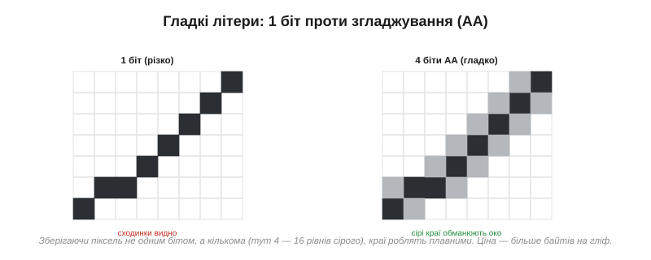
*Рис. 13.2.4.4. Той самий косий штрих: ліворуч 1 біт — видно сходинки; праворуч 4 біти — сірі краєві пікселі обманюють око плавністю. Згладжування коштує більше байтів на гліф (кілька бітів замість одного), зате робить дрібний текст читабельним.*

Це прямий компроміс: згладжування коштує **в кілька разів** більше пам'яті на гліф (бо піксель тепер не біт, а 2–4 біти), зате дрібний текст із ним читається легко, а без нього розсипається. На кольорових екранах згладжування майже обов'язкове; на грубому монохромному від нього відмовляються, бо проміжного сірого там немає.

Цікаво, що згладжування буває й хитрішим за прості сірі краї. На кольорових екранах інколи грають окремими червоним, зеленим і синім підпікселями (тема 13.1.1), додаючи ще більше уявної роздільности по горизонталі, — це **субпіксельне** згладжування. Але воно прив'язане до конкретної розкладки підпікселів і на embedded-екранах рідкісне. А там, де сірого справді немає — на чисто чорно-білому e-ink чи символьному дисплеї, — гладкого тексту не буде взагалі, хоч як старайся: фізика пікселя не дозволяє проміжних рівнів, тож лишається тільки добирати чіткий, спеціально мальований під цей розмір бітмапний шрифт.

### Кернінг: відстань між парами літер

Просте «зсунь курсор на ширину літери» з теми 13.2.3 дає прийнятний, але не ідеальний текст. Деякі пари літер за рівних проміжків виглядають розхристано: класичний приклад — «AV» чи «To», де похилі форми лишають між собою завелику дірку. **Кернінг** (*kerning*) — це підгін відстані для конкретних **пар**: окрема таблиця поправок, що каже «після A перед V підсунь ближче».


*Рис. 13.2.4.5. Без кернінгу між A і V зяє дірка; з кернінгом V «підтикають» під навислий край A, і пара виглядає рівно. Це окрема таблиця пар — додаткова пам'ять, тож у дрібних embedded-шрифтах кернінг часто пропускають.*

Кернінг робить текст професійним на вигляд, але коштує тієї самої валюти — пам'яті під таблицю пар і трохи коду. На великому гарному інтерфейсі він доречний; на крихітному екранчику з парою рядків ним зазвичай нехтують.

Не плутаймо кернінг із кількома сусідніми поняттями. **Крок** (advance) — це базова ширина-зсув кожної окремої літери; **кернінг** — поправка для конкретної пари поверх кроку; а **трекінг** (*tracking*) — рівномірне розрідження чи ущільнення всього рядка одразу. У бідному embedded-тексті живе зазвичай лише перше — простий крок; решта починається там, де за типографіку вже взялися серйозно, а на це є і пам'ять, і потреба.

### Юнікод: які символи взагалі є у шрифті

Дотепер ми мовчки припускали, що потрібна літера у шрифті є. Та шрифт містить рівно стільки гліфів, скільки в нього **поклали**, і кожен символ, що ви покажете, мусить мати свій гліф. Латиниця — це близько сотні знаків; додайте кирилицю — вже за дві сотні; а повний **юнікод** (*Unicode*) із усіма писемностями світу, включно з десятками тисяч ієрогліфів, — це гігантський набір, якому в дрібному МК просто немає місця.

Тому в embedded майже завжди роблять **підмножину** (*subset*): кладуть у шрифт лише ті символи, що реально знадобляться, — вашу мову, цифри, потрібні знаки, — і викидають решту. Перетворення «код символу → потрібний гліф» робить невелика таблиця відповідности всередині шрифту. Брати повний юнікодний шрифт у мікроконтролер — означало б віддати під нього всю Flash, тож субсетинг тут не примха, а необхідність.

Корисно знати й масштаб проблеми. Та внутрішня таблиця відповідности «код → гліф» зветься *cmap*, і саме вона перетворює, скажімо, юнікодний код української «ї» на номер потрібного гліфа в шрифті. А чому повний юнікод такий страшний для МК, видно на прикладі китайської, японської та корейської писемностей (CJK): лише вживаних ієрогліфів там десятки тисяч, і кожен — окремий складний гліф. Шрифт, що покриває CJK, важить мегабайти й у дрібний мікроконтролер не вміщається в принципі — для таких мов або беруть зовнішню пам'ять, або кладуть лише потрібну жменю символів.

### Вага у Flash: головна турбота embedded

Усі ці вибори — бітмап чи вектор, 1 біт чи згладжування, який кегль, чи з кернінгом, скільки символів — зрештою сходяться в одне число: **скільки Flash з'їсть шрифт**. І воно вражає.


*Рис. 13.2.4.6. Дрібний 1-бітний латинський шрифт — лічені кілобайти; великий, згладжений, з повним кириличним набором — уже сотні кілобайтів. Кожен множник (більший кегль, згладжування, ширший набір, ще одне накреслення) накладається на інші.*

**Приклад (вага шрифту у Flash).** Порахуймо шрифт 16×16 пікселів для латиниці з кирилицею (~200 символів):

```
1 біт/піксель:       16 × 16 = 256 біт = 32 байти/гліф
                     200 × 32  = 6 400 байтів    ≈ 6.4 КБ

4 біти/піксель (АА): 16 × 16 × 4 = 1024 біти = 128 байтів/гліф
                     200 × 128 = 25 600 байтів  ≈ 25.6 КБ
```

Одне лише згладжування вчетверо роздуло шрифт; великий кегль роздув би його ще на порядок (48-піксельний — це вже ~9× площі), а окреме жирне накреслення — подвоїло б. Звідси наскрізне правило економії: бери **лише потрібні** символи (субсет), **лише потрібні** розміри й накреслення, а згладжування додавай там, де воно справді треба для читабельности, а не всюди.

> 🔧 **Навіщо це.** Шрифт у вбудованому виробі — часто один із найбільших споживачів Flash, і легко непомітно з'їсти ним сотні кілобайтів. Перш ніж додати ще один кегль, накреслення чи згладжування, прикиньте їхню ціну за формулою «символів × байтів на гліф». Найдешевший шрифт — субсет лише вашої мови, у потрібному розмірі, без зайвого; найдорожчий — повний юнікод великим згладженим кеглем «про всяк випадок».

Є й технічні способи приборкати цю вагу. Гліфи **стискають** (вони ж переважно порожні поля), тримають шрифт у зовнішній Flash чи на картці пам'яті, а в оперативну тягнуть лише потрібні зараз символи. Та найдієвіший важіль усе одно простий і нудний: **не клади того, що не покажеш**. Зайвий кегль «про всяк випадок», згладжування там, де його однаково не видно, повний набір символів заради десятка чужих знаків — ось звідки беруться ті несподівані сотні кілобайтів, що раптом не вміщаються в чип.

### Підсумок: шрифт — це теж компроміс пам'яті

Отже, шрифт — не «просто літери», а ще один знайомий торг. Бітмап дешевий, швидкий і фіксований; вектор гнучкий, гладкий і важкий обчислювально. Згладжування купує читабельність за байти; кернінг купує охайність за таблицю; охоплення юнікоду купує мови за Flash. На скромному залізі майже завжди перемагає бітмап-субсет — мінімум символів, мінімум розмірів, згладжування за потреби; на потужному можна дозволити векторний рушій із повним набором. Як завжди в цьому розділі, правильний вибір диктує не смак, а доступна пам'ять.

І ще одне, що варто винести: текст — це не «безкоштовний» елемент інтерфейсу, як його іноді сприймають. За кожним рядком на екрані стоїть і пам'ять під гліфи, і робота з їх малювання, і десятки дрібних рішень — розмір, накреслення, згладжування, охоплення мов. Підійшовши до шрифту як до повноцінного компонента з власним бюджетом, ви уникнете і роздутого Flash, і блідого нечитабельного тексту, який однаково псує навіть найкращий виріб.

Ми навчилися малювати все, що складає інтерфейс, — форми, текст, кольори — у кадровому буфері. Та лишилося питання, як **показати** намальоване глядачеві так, щоб картинка не рвалася й не мерехтіла під час оновлення. Саме до подвійної буферизації, синхронізації й розривів зображення ми переходимо далі.

---

## 13.2.5 Подвійна буферизація, tearing і vsync (чому картинка рветься)

Ми навчилися малювати в кадровому буфері все, що завгодно. Та між «намалювати в пам'яті» й «показати глядачеві» ховається підступна пастка. Згадаймо з теми 13.1.4: панель **безперервно читає** кадровий буфер, щоб освіжати скло, — десятки разів на секунду. А ми в той самий час пишемо в нього новий кадр. Що, як наш запис застане читання на півдорозі? Глядач побачить **склеєний** кадр: верх новий, низ старий. Цей дефект зветься **розривом зображення** (*tearing*), і ця тема — про те, як його позбутися, показуючи кадри чисто. Від цього прямо залежить, чи буде анімація плавною, чи смикатиметься рваними клаптями.

### Чому картинка рветься: запис під час читання

Корінь біди — у тому, що малювання й показ ділять **одну** пам'ять. Ми пишемо кадровий буфер, панель його читає рядок за рядком згори вниз. Поки вона дочитала до середини екрана, ми встигли підмінити в буфері об'єкт — і нижня половина панелі візьме вже **новий** вміст, а верхня лишиться зі **старим**. На екрані з'являється горизонтальна **лінія розриву**, де об'єкт «розколовся» навпіл. Місце цієї лінії — там, де сканування панелі застало наш запис, тож вона «плаває» згори вниз від кадру до кадру, а на швидкому русі їх може бути й кілька водночас. Це й робить розрив таким помітним: не статичний дефект, а живе, мерехтливе тремтіння межі, що його око вловлює навіть краєм зору.

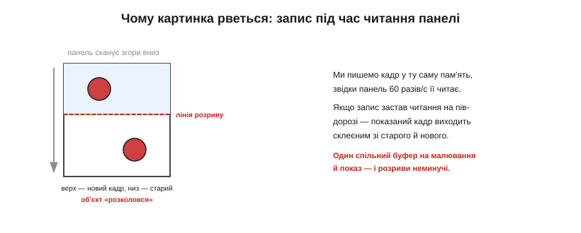
*Рис. 13.2.5.1. Панель сканує буфер згори вниз. Якщо посеред цього сканування ми змінили вміст, показаний кадр виходить склеєним: над лінією розриву — новий стан, під нею — старий, і рухомий об'єкт ніби розривається. Один спільний буфер на малювання й показ робить такі розриви неминучими.*

Найпомітніший розрив на **русі**: коли об'єкт швидко їде екраном, його «зламана» навпіл копія кидається в очі щокадру. Статичні ж оновлення (змінилася цифра, блимнув значок) рвуться рідко — там просто нема чому розколюватися. Але для будь-якої плавної анімації розрив — справжня напасть, і її треба лікувати.

Варто зрозуміти, чому ця колізія взагалі виникає. Панель освіжається у своєму, **незалежному** ритмі — близько шістдесяти разів на секунду, не питаючи нашого коду. А ми малюємо, коли нам треба: у відповідь на дотик, на нові дані, на крок анімації. Два незалежні ритми рано чи пізно перетнуться — наш запис припаде на чиєсь читання. Якби малювання й освіження йшли в ногу, розриву б не було; але змусити їх іти в ногу — це і є та синхронізація, заради якої затіяна вся тема.

### Подвійна буферизація: малюй у тіньовий, показуй готовий

Класичні ліки — **подвійна буферизація** (*double buffering*). Замість одного буфера тримають **два**. В один, **передній** (*front*), панель дивиться — його показують. У другий, **задній** (*back*), малюють новий кадр, поки глядач його не бачить. Коли задній кадр готовий **повністю**, буфери **міняють місцями** (*swap*): тепер показується свіжонамальований, а малюють уже в той, що звільнився.

Цей обмін ще звуть **гортанням сторінок** (*page flipping*) — за аналогією з книжкою, де показують лише одну сторінку, перегортаючи на готову. Назва прижилася ще з часів ігрових приставок, де подвійна буферизація й стала стандартним прийомом плавної анімації. Принцип незмінний відтоді: дві «сторінки», одна на показ, одна на малювання, і миттєве перегортання між ними.

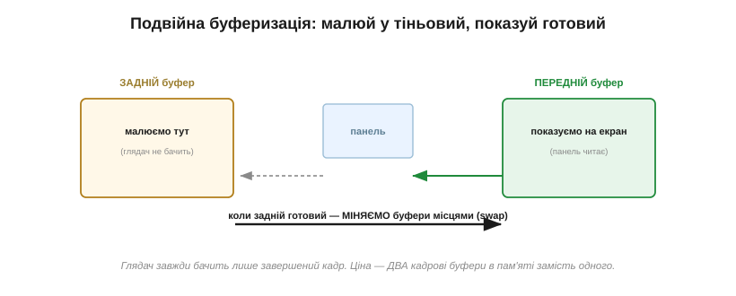
*Рис. 13.2.5.2. Глядач завжди бачить лише **завершений** кадр із переднього буфера; усе чорнове малювання йде в заднім, схованому. Готовий — поміняли буфери ролями. Розриватися нема чому, бо панель ніколи не читає той буфер, у який ми пишемо.*

Розрив зникає в корені: панель **ніколи** не читає той буфер, у який ми зараз пишемо, тож не може спіймати півнамальований кадр. Платня очевидна й знайома — **вдвічі більше** пам'яті, два повні кадрові буфери замість одного (згадайте їхній розмір із теми 13.2.1). Саме ця ціна часто й вирішує, по кишені вам подвійна буферизація чи ні.

Прийом «малюй у тінь, показуй чисте» — наскрізний у графіці й поза нею. Той самий принцип ховається за подвійним буфером у будь-якій анімації, за «пінг-понгом» двох буферів у потоковій передачі даних, за чернеткою, яку показують лише дописаною. Скрізь ідея одна: **ніколи не показуй незавершене**. Глядачеві (чи споживачеві даних) віддають лише цілісний результат, а вся метушня правок ховається в тіньовій копії. Упізнавши цей патерн раз, ви бачитимете його всюди — від екрана до мережевих протоколів.

> 🔧 **Навіщо це.** Подвійна буферизація — стандарт плавної анімації, але закладайте її в бюджет пам'яті заздалегідь: вона **подвоює** найбільшу статтю — кадровий буфер. Для дрібного МК це нерідко неможливо, і тоді бережуть плавність іншими засобами (про них — далі). Перш ніж обіцяти гладку анімацію, перевірте, чи влізуть два кадри в RAM.

### Обмін: перекинути вказівник чи скопіювати

Сам **обмін** буферів роблять двома способами, і вони різняться ціною. Перший — **перекинути вказівник**: якщо контролер дисплея вміє читати то з одного, то з іншого буфера, обмін — це лише зміна того, на яку адресу він дивиться. Миттєво, без жодного копіювання. Другий — **скопіювати**: блітнути весь задній буфер у передній. Працює завжди, навіть із панеллю, що має лише один буфер, але коштує повної копії кадру на кожен показ.

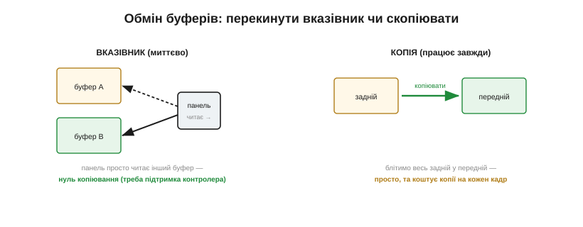
*Рис. 13.2.5.3. Ліворуч — обмін вказівником: панель просто починає читати інший буфер, нуль копіювання (потрібна підтримка контролера). Праворуч — копія: задній буфер блітять у передній; просто й універсально, та витрачає копію щокадру.*

Перекидання вказівника — ідеал, але вимагає, щоб контролер умів гортати буфери; це вміють, скажімо, вбудовані дисплейні периферії. Копіювання — запасний шлях для «розумних» панелей із власною GRAM, куди новий кадр щоразу заливають заново. Який спосіб доступний — залежить від архітектури, що ми вже розбирали в темі про контролери.

Зверніть увагу, наскільки кращий перший спосіб. Перекидання вказівника — це **нуль** роботи: жодного байта не переписано, обмін стається за один такт. Копіювання ж щокадру переганяє весь кадр з місця на місце — на 750-кілобайтному екрані це сотні тисяч байтів шістдесят разів на секунду, відчутне навантаження на шину пам'яті. Тому архітектуру, де контролер уміє гортати буфери сам, цінують недарма: вона робить плавність майже безкоштовною за процесорним часом. Копіювання ж лишають на той випадок, коли іншого вибору немає, — і навіть тоді його перекладають на апаратний блок переносу пам'яті (DMA чи 2D-блітер), щоб не вантажити процесор перегоном байтів, до яких ми ще повернемося.

### Vsync: міняти буфери в потрібну мить

Та й сам обмін не можна робити будь-коли. Якщо перемкнути буфери **посеред** того, як панель сканує кадр, розрив однаково вискочить — тільки тепер у місці перемикання. Обмін мусить статися у **щілині між кадрами** — короткій паузі, коли панель уже дочитала один кадр і ще не почала наступний. Цю паузу звуть **вертикальним гасінням** (*vertical blanking*), а синхронізацію обміну з нею — **вертикальною синхронізацією** (*vsync*).

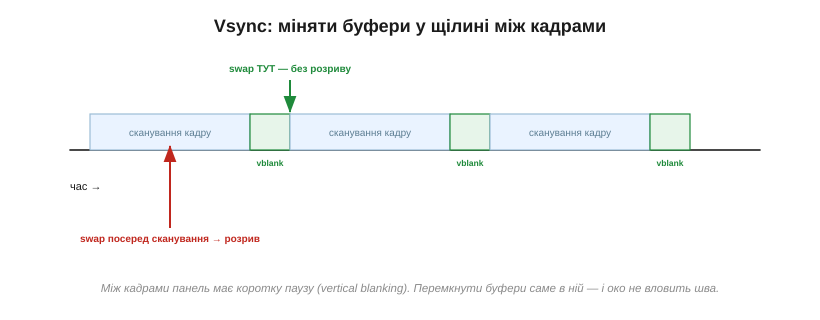
*Рис. 13.2.5.4. Освіження йде циклами: сканування кадру, коротка пауза (vblank), знову сканування. Перемкнути буфери саме в паузі — і шва не буде; зробити це посеред сканування — знову дістати розрив, лише в іншому місці.*

Звідки знати, коли настала пауза? Панель сама про це **сигналить**. У RGB-панелей є сигнал VSYNC; у «розумних» — та сама ніжка **TE** (*tearing effect*), яку ми зустрічали в темі 13.1.4, що каже «зараз я між освіженнями, писати безпечно». Прив'язавши обмін чи запис до цього сигналу, ви потрапляєте точно в щілину — і розрив зникає.

З vsync пов'язана й сама **частота кадрів**. Якщо ваша анімація встигає малювати рівно стільки кадрів, скільки панель освіжає (скажімо, 60 на секунду), усе гладко. Малюєте повільніше — панель просто кілька разів покаже той самий кадр (рух смикнеться, але без розриву). Малюєте швидше за освіження — зайві кадри марні, їх однаково ніхто не побачить, тож розумно й не малювати більше, ніж панель здатна показати. Прив'язка до vsync заразом і вирівнює темп анімації під реальний ритм екрана, аби код не молотив кадри даремно.

### Розумні панелі та LTDC: хто синхронізує

На практиці синхронізація лягає по-різному залежно від того, де живе кадровий буфер (знову тема 13.1.4). Для **розумної** панелі з власною GRAM мікроконтролер **чекає сигналу TE** й лише тоді шле новий кадр — так запис потрапляє в безпечну паузу. Для **дурної** RGB-панелі справу бере на себе вбудований контролер дисплея (**LTDC**): він сам тримає передній і задній буфери й сам гортає їх на vsync, без участи коду — програма лише малює в задній і каже «готово».

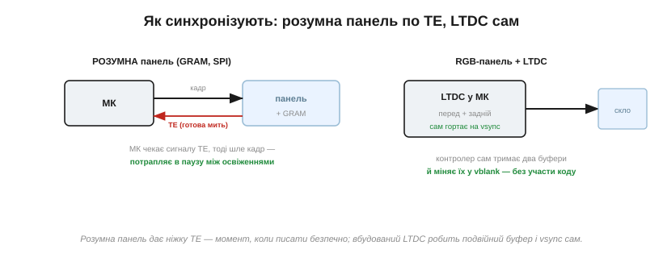
*Рис. 13.2.5.5. Зліва: розумна панель дає ніжку TE — момент, коли писати безпечно, і МК під неї підлаштовує відправлення кадру. Справа: вбудований LTDC сам тримає два буфери й міняє їх у vblank, тож подвійна буферизація з vsync дістається майже задарма.*

Звідси й практичний висновок: мати на борту контролер дисплея з апаратною подвійною буферизацією — велике полегшення, бо вся ця морока з vsync робиться сама. Без нього доводиться вручну ловити TE й самотужки слідкувати, щоб не написати в кадр, який зараз показують.

Є й тонкий проміжний прийом для розумних панелей з одним буфером — «гнатися за променем». Якщо писати в GRAM трохи **позаду** того місця, яке панель саме зчитує, оновлення завжди лишається в уже показаній частині кадру й розриву не дає. Це вимагає точно знати, де зараз «промінь» (та сама TE плюс відлік часу), і тому крихке; але там, де другого буфера нема, а оновити треба весь екран, цей трюк інколи єдиний вихід. Згадаймо його як приклад того, що проти розривів воюють не лише пам'яттю, а й точним відчуттям часу.

### Коли подвійний буфер не по кишені

А якщо двох кадрів у пам'яті нема? Тоді бережуть картинку інакше. Можна лишитися з **одним** буфером, але писати в нього **лише в паузі** vblank — встиг намалювати зміни в щілину, поки панель не сканує, і розриву не буде. Біда в тому, що щілина коротка, і весь екран у неї перемалювати не встигнеш — цей шлях годиться лише для малих змін.

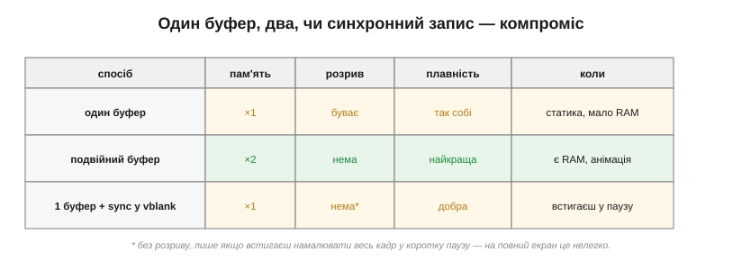
*Рис. 13.2.5.6. Три стратегії поруч. Один буфер — найдешевший по пам'яті, та може рватися. Подвійний — без розривів і найплавніший, але коштує вдвічі більше RAM. Один буфер із записом у vblank — компроміс: пам'яті як за один, розриву нема, проте треба встигнути намалювати зміни в коротку паузу.*

Існує й проміжний варіант для тих, кому й подвійного буфера замало, — **потрійна** буферизація, що згладжує ще й нерівний темп малювання, але коштує вже трьох кадрів пам'яті й у дрібному embedded майже не трапляється. Здебільшого ж вибір зводиться до тих трьох рядків таблиці: скільки в тебе RAM — стільки й плавности можеш собі дозволити.

**Приклад (ціна подвійного буфера).** Порахуймо для панелі 800×480 при 16 бітах на піксель:

```
один кадр  = 800 × 480 × 2 байти ≈ 750 КБ
два кадри (подвійна буферизація)  ≈ 1.5 МБ
```

Півтора мегабайта швидкої RAM — це далеко за межами більшости мікроконтролерів; ось чому на великих екранах подвійну буферизацію тягне лише МК із зовнішньою SDRAM. Звідси й найпоширеніший вихід для скромного заліза: оновлювати не весь кадр, а **тільки те, що змінилося** — тоді й переписувати треба мало, і розрив виходить таким дрібним та коротким, що око його не ловить. Цей прийом «не чіпай незмінного» — тема вже наступної розмови.

> 🔧 **Навіщо це.** Подвійна буферизація — не єдиний шлях до плавности, а найдорожчий по пам'яті. Якщо двох кадрів не вмістити, питайте: чи можу я оновлювати лише змінені ділянки? чи встигаю записати їх у паузу vblank? Часто чистої картинки досягають не подвоєнням пам'яті, а тим, що чіпають екран **мало й вчасно**.

### Підсумок: показати кадр чисто

Звівши все докупи: розрив виникає, бо ми пишемо кадр, поки панель його читає; лікують це тим, що **малюють в окремий буфер** і міняють його на показуваний **у паузі між кадрами** (vsync), а сигналом про паузу служить VSYNC чи TE. Хто має апаратну подвійну буферизацію (LTDC) — дістає це майже задарма; хто ні — або платить пам'яттю за два буфери, або синхронізує дрібні оновлення вручну. І завжди в основі той самий ресурс, що тисне на нас від першої теми розділу, — **пам'ять**: чистий показ коштує або зайвого буфера, або дисципліни оновлювати ощадливо.

Тому, проєктуючи плавний інтерфейс, рішення про буфери ухвалюйте **рано** — разом із вибором мікроконтролера й панелі. Апаратна подвійна буферизація на борту контролера змінює все: вона перетворює боротьбу з розривами з ручної мороки на дрібницю, що вирішується сама. А дізнатися про брак пам'яті під другий буфер, коли інтерфейс уже написаний, — болюче й до прикрости типове розчарування.

Ми згадали прийом «оновлювати лише змінене» вже двічі — як ліки і від повільної мальовки, і від розривів. Він заслуговує власної розмови: як відстежити, що саме на екрані змінилося, і перемалювати тільки ці клаптики, не чіпаючи решти. Саме до часткових оновлень і «брудних» регіонів ми переходимо далі.
