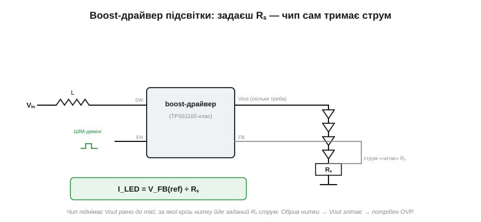

# 🔌 Boost-драйвери підсвітки: керування струмом, а не напругою

> Це компонентна вставка до теми [§13.1.5 «Підсвітка»](r01-displays-touch.md). Тема довела головне: світлодіодом керують струмом, а довгу нитку треба живити напругою, вищою за живлення. Тут візьмемо конкретний клас мікросхем, що це робить, — boost-драйвер світлодіодної підсвітки — і пройдемо практичний шлях: як він влаштований, як йому задати струм і як ним димати.

### Що це за клас

Це спеціалізовані мікросхеми — **підвищувальні (boost) драйвери світлодіодів** для підсвітки (канонічний приклад — клас **TPS61165**). Вони беруть низьку напругу живлення (3.3–5 В), піднімають її до тієї, що потрібна нитці послідовних білих світлодіодів (часом 15–25 В), і — головне — тримають крізь нитку **заданий струм**, а не напругу. По суті це готове кероване джерело струму з усією силовою частиною всередині.

### Плата й розпіновка

Навколо мікросхеми — класична boost-обвʼязка: **котушка** L від входу до вузла комутації, вбудований (або зовнішній) ключ і діод, вихідний конденсатор, нитка світлодіодів — і **вимірювальний резистор Rₛ** знизу нитки, спадання на якому й каже драйверу поточний струм.


*Рис. 13.1.5c.1. Драйвер качає енергію через котушку L, піднімаючи Vout рівно настільки, щоб крізь нитку йшов заданий струм. Струм «читає» резистор Rₛ на ніжці FB; ніжка EN вмикає драйвер і приймає ШІМ-димінг. Напругу Vout чип виставляє сам — стільки, скільки просить нитка.*

Типові виводи: **VIN** (живлення), **SW** (до котушки), **GND**, **FB** (вхід зворотного звʼязку — сюди заводять Rₛ), **EN/CTRL** (увімкнення й димінг), нерідко окремий вхід захисту від перенапруги (**OVP**).

### Як задати струм

Тут і захована вся суть, обіцяна темою. Драйвер прагне втримати на ніжці FB свою опорну напругу (типово близько 0.2 В) — а вона падає на Rₛ. Звідси струм нитки задається **одним резистором**:

```
I_LED = V_FB(ref) / Rₛ
наприклад:  I_LED = 0.2 В / 10 Ом = 20 мА
```

Ви **не задаєте напругу** — ви ставите Rₛ під потрібний струм, а драйвер сам піднімає Vout до тієї величини, якої просить нитка (хай скільки в ній світлодіодів). Це й є струмове керування в залізі.

### Як димати

Яскравість міняють через ніжку **EN/CTRL**. Найпростіше — подати на неї **ШІМ**: драйвер вмикається й вимикається з нею, і середня яскравість іде за шпаруватістю (тут діє вся пересторога про частоту з теми про параметри — гнати ШІМ треба швидко, щоб не мерехтіло). Багато драйверів приймають і складніші способи: відфільтрований ШІМ як аналоговий рівень або навіть однопровідний **серійний код яскравости** на тій самій ніжці (схеми типу EasyScale). Який саме — дивись у даташиті конкретної мікросхеми.

### Типові граблі

- **Обрив нитки → перенапруга.** Перегорів світлодіод — драйвер у спробах проштовхнути струм задирає Vout до межі. Без **OVP** (вбудованого чи зовнішнього) це палить мікросхему й конденсатор.
- **Котушка.** Замала індуктивність чи замалий струм насичення котушки — драйвер «захлинається», гріється, шумить. Беруть L і її струм за рекомендаціями даташита.
- **Вхідний струм більший за вихідний.** Boost піднімає напругу, тож по входу тече **більше** струму, ніж у нитці; джерело й доріжки входу мусять це тягнути.
- **Шум і layout FB.** FB — це крихітні десяті вольта; довга чи зашумлена доріжка до Rₛ збиває регулювання. Rₛ ставлять близько до ніжки.
- **Низькочастотний ШІМ-димінг** дає видиме мерехтіння — те саме, про що тема 13.1.2.

### Варіації класу

Для зовсім дрібних дисплеїв (один-два світлодіоди) замість котушкового boost іноді ставлять **зарядну помпу** — простішу й тихішу, та слабшу. Для кількох ниток є **багатоканальні** драйвери з вирівнюванням струму між нитками. А контролери дисплеїв вищого класу нерідко мають драйвер підсвітки **вбудованим**, керованим тими ж командами, що й сама панель.

> 🔧 **Навіщо це.** Boost-драйвер підсвітки — це готове джерело струму: ставите Rₛ під потрібний I_LED (I = V_FB/Rₛ), даєте котушку за даташитом, димаєте швидким ШІМом по EN. Три обовʼязкові перевірки: захист від обриву нитки (OVP), достатній вхідний струм (boost бере по входу більше, ніж віддає) і чистий, короткий FB до Rₛ. Напругу не чіпаєте взагалі — її чип виставить сам.
