# Розділ 2.11 — Силова комутація змінного струму

Дотепер усі наші ключі жили в затишному світі **постійного струму** низької напруги. Біполярний транзистор ([Розділ 2.6](../bjt/bjt.md)) і польовий MOSFET ([Розділ 2.7](../mosfet/mosfet.md)) чудово вмикали моторчик на 12 В, світлодіодну стрічку на 5 В чи реле на 24 В. Та варто підійти до звичайної **розетки** — і всі ці прилади раптом виявляються безпорадними. У розетці не плавні 5 чи 12 вольт, а **синусоїда** ([§1.7](../../block-1-circuits-physics/ac-signals/ac-signals.md)), що сто разів на секунду перекидається з плюса в мінус і сягає піка в **±325 В**. Прикласти до неї транзистор, розрахований на десятки вольт однієї полярності, — це гарантований миттєвий пробій.

А керувати потужністю з розетки доводиться постійно: ввімкнути нагрівач, приглушити лампу, запустити насос, увімкнути двигун. Для цього є **окремий клас приладів** — силові ключі змінного струму: **тиристор** *(thyristor, SCR)*, **симістор** *(triac)*, **твердотільне реле** *(solid-state relay, SSR)* і **IGBT**. Усі вони народилися з однієї потреби — слабким сигналом від логіки керувати великою потужністю мережі, не з'єднуючи при цьому крихкий мікроконтролер із небезпечними сотнями вольт.

У цьому розділі ми розберемо, **чому** звичні транзистори не годяться для мережі ([§2.11.1](ac-power-switching.md)); як влаштована **защіпка** тиристора, що вмикається одним імпульсом і гасне сама ([§2.11.2](ac-power-switching.md)); як симістор віддає навантаженню **обидві** півхвилі ([§2.11.3](ac-power-switching.md)); як працює **димер** із фазовим керуванням ([§2.11.4](ac-power-switching.md)) і чому розумніше комутувати **в нулі** напруги ([§2.11.5](ac-power-switching.md)). Далі — **твердотільне реле** як готовий ізольований ключ ([§2.11.6](ac-power-switching.md)), **IGBT** для справді великих потужностей ([§2.11.7](ac-power-switching.md)), захисні **снабери** проти самовмикання ([§2.11.8](ac-power-switching.md)) — і, нарешті, **безпека** робіт із мережею ([§2.11.9](ac-power-switching.md)), бо ціна помилки тут зовсім інша, ніж на макетці з батарейкою. Як ця галузь почалася — від газового тиратрона до кремнієвого тиристора General Electric — у [📜 історії до розділу](hist-thyristor.md).

## 2.11.1 Чому ключі з §2.6/§2.7 не пасують мережі

Перш ніж знайомитися з новими приладами, варто чітко зрозуміти **задачу**, яку вони розв'язують. А задача ця — наслідок того, що мережа влаштована геть інакше, ніж акуратне джерело живлення на лабораторному столі. Тож почнімо з простого питання: що саме станеться, якщо взяти знайомий MOSFET, яким ми вмикали мотор, і поставити його в коло розетки? Відповідь — «нічого доброго», і причин рівно три. Розберемо кожну.

### Мережа — двополярна синусоїда, а не «плюс і мінус»

Згадаймо, що таке напруга в розетці ([§1.7](../../block-1-circuits-physics/ac-signals/ac-signals.md)). Це не стала величина, а **синусоїда**: напруга весь час змінюється, причому періодично переходить через нуль і **міняє знак**. Та сама пара проводів то стає «плюсом» відносно іншого, то «мінусом» — п'ятдесят разів на секунду (в Європі 50 Гц; у деяких країнах 60 Гц). Це не примха: змінний струм виграв історичну «війну струмів» саме тому, що його напругу легко підвищувати й знижувати трансформатором ([§2.2.6](../inductor/inductor.md)), а отже — передавати на сотні кілометрів із малими втратами. Зворотний бік цієї зручності для нас із вами в тому, що **кінцевий споживач** отримує напругу, яка сто разів на секунду перевертається й переходить через нуль. Прилад, що цю напругу комутує, мусить жити саме з такою формою — а не з рівним «плюсом», як на лабораторному джерелі.

Цифра «230 В», написана на розетці, — це **діюче значення** *(RMS, root mean square)*, тобто еквівалент постійної напруги за нагрівом ([§1.7](../../block-1-circuits-physics/ac-signals/ac-signals.md)). Це важлива тонкість: 230 В — **не** максимум синусоїди, а її «теплова» рівнодійна. Сама ж синусоїда сягає **амплітуди** значно більшої:

```
Uпік = Urms × √2 = 230 В × 1.414 ≈ 325 В
```

Отже, миттєва напруга в розетці гуляє від **+325 В до −325 В** — повний розмах майже **650 вольт**. Це і є перша проблема: напруга **двополярна**, та ще й її пік помітно вищий за «номінал» на табличці. Хто проєктує ключ «на 230 В», той насправді мусить тримати **325 В піку** — і це ще без урахування кидків, до яких дійдемо в [§2.11.9](ac-power-switching.md).

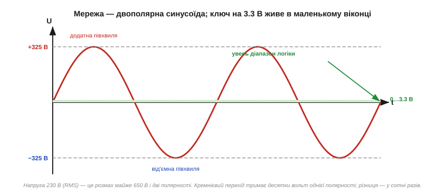
*Рис. 2.11.1.1. Мережа — синусоїда з піками ±325 В і двома полярностями. Увесь робочий діапазон логіки (0…3.3 В) — це нескінченно тонка смужка біля нуля. Прилад, що працює в цій смужці, не має жодного шансу витримати сотні вольт обох знаків.*

Чому це вбиває звичайний транзистор? Бо і біполярний, і польовий — прилади **односторонні**. У них є вбудований PN-перехід ([§2.5.3](../diode-pn-junction/diode-pn-junction.md)), а MOSFET ще й несе **паразитний body-діод** ([§2.7.2](../mosfet/mosfet.md)), що проводить у зворотному напрямку. Коли синусоїда йде в «правильну» полярність, транзистор іще якось працює; коли вона перекидається — той самий body-діод відмикається й пропускає струм неконтрольовано. Прилад просто не вміє блокувати напругу **в обидва боки**, а мережа цього вимагає щопівперіоду.

Можна заперечити: а якщо поставити **діодний міст** ([§2.5.6](../diode-pn-junction/diode-pn-junction.md)) перед транзистором, щоб «випрямити» синусоїду й годувати ключ завжди однією полярністю? Так іноді й роблять, але це не безкоштовно: міст додає чотири діоди, подвійний спад напруги (а отже, тепло) і не розв'язує двох інших проблем — ні високої напруги, ні ізоляції. Простіше й надійніше взяти прилад, який **сам** двобічний за природою. Саме такий — симістор, до якого ми дійдемо в [§2.11.3](ac-power-switching.md).

> 🔧 **Навіщо це.** Саме звідси випливає головна вимога до мережевого ключа: він має **блокувати напругу обох полярностей** і, бажано, вміти **проводити обидві півхвилі**. Жоден одиночний транзистор так не вміє — і це перша причина, чому для мережі знадобився цілий окремий клас приладів. Тримайте цю думку: симетрія синусоїди — корінь усього подальшого.

### Сотні вольт проти десятків

Друга проблема — **сам рівень напруги**. Розгляньмо типовий силовий MOSFET, яким ми вмикали навантаження від 12-вольтового джерела. У його даташиті ([§2.9.2](../reading-datasheets/reading-datasheets.md)) стоїть гранична напруга стік–витік, скажімо, **Vds(max) = 30 В** або **60 В**. Це абсолютний максимум: перевищив — пробій, прилад мертвий.

А пік мережі — **325 В**. Це у **п'ять-десять разів** більше за межу такого транзистора. Прикласти 325 В до приладу на 30 В — однаково що подати 230 В на лампочку від кишенькового ліхтарика: спалах і тиша. Перехід пробивається лавинно ([§2.5.8](../diode-pn-junction/diode-pn-junction.md)), кристал перегрівається в одній точці й вигоряє за частки секунди.

Звісно, є транзистори і на 600, і на 1200 вольт — але це вже **інші прилади**, спеціально спроєктовані для високої напруги, з товстими збідненими шарами й особливою геометрією. Звичайний логічний чи дрібний силовий транзистор для мережі не годиться **за визначенням**. Потрібен прилад, у паспорті якого стоїть запас над піком мережі: для 230 В беруть ключі **щонайменше на 400 В**, а на практиці — на **600 В і вище**, щоб пережити ще й кидки напруги ([§2.11.9](ac-power-switching.md)).

Звідки взагалі береться запас «600 В на мережу 325 В піку»? Річ у тім, що пік синусоїди — це лише номінальна верхівка в ідеальній мережі. Реальна розетка час від часу видає **кидки** *(surges)*: комутаційні сплески від сусідніх потужних споживачів, наведення від далеких блискавок, перехідні процеси. Вони можуть короткочасно сягати кіловольта й більше. Тому інженерне правило — брати ключ із напругою приблизно **вдвічі** вищою за пік мережі (звідси й типові 600 В для побутових 230 В): половина запасу йде на сам пік, половина — на кидки. Прилад, обраний «впритул» до 325 В, проживе до першого ж серйозного сплеску.

### Логіку й мережу треба розділити — гальванічна ізоляція

Третя проблема найпідступніша, бо вона не про сам ключ, а про **безпеку всієї системи**. Уявімо, що ми все ж знайшли транзистор на 600 В і двополярний. Щоб ним керувати, треба з'єднати його керівний вивід із виходом мікроконтролера. І ось тут криється пастка.

У мережі один із проводів — **фаза**, другий — **нейтраль**, причому нейтраль на підстанції з'єднана із землею. «Землі» мережі й «землі» (загального проводу, GND) нашої плати — це **різні** точки з різними потенціалами; між ними легко може опинитися повна напруга мережі. Якщо просто з'єднати схему керування з мережевим ключем напряму, потенціал мережі **прийде на плату** — на той самий GND, якого торкаються пальці, до якого підключено USB-кабель від комп'ютера. Дотик до плати стане дотиком до фази.

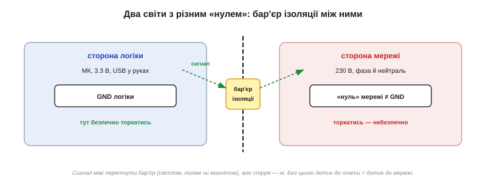
*Рис. 2.11.1.2. Сторона логіки (3.3 В, GND, USB у руках) і сторона мережі (230 В, свій «нуль») мусять лишатися гальванічно розділеними. Сигнал керування перетинає бар'єр (світлом, полем чи магнітом), а струм і небезпечний потенціал — ні.*

Розв'язання — **гальванічна розв'язка** *(galvanic isolation)*: керівний сигнал передають через бар'єр, який пропускає **інформацію**, але не пропускає **струм**. Найчастіше це **оптопара** ([§2.5.10](../diode-pn-junction/diode-pn-junction.md)): світлодіод на боці логіки спалахує, фотоприймач на боці мережі цей спалах ловить — і між двома сторонами лишається тільки промінь світла крізь прозорий ізолятор, жодного спільного проводу. Так логіка керує мережею, лишаючись від неї електрично відрізаною.

Світло — не єдиний спосіб перенести сигнал крізь бар'єр. Той самий принцип «передаю інформацію, не передаю струм» реалізують і **магнітним** полем (мініатюрний трансформатор, як у §2.2.6, тільки сигнальний), і **ємнісним** зв'язком (заряд крізь крихітний конденсатор). Але для силової комутації змінного струму історично прижилася саме оптика — вона дешева, проста й дає велику напругу ізоляції (одиниці кіловольт між сторонами). Важлива не конкретна фізика бар'єра, а сам факт: між «небезпечним» і «безпечним» світами немає суцільного проводу, яким міг би пройти струм.

> 🔧 **Навіщо це.** Гальванічна розв'язка — не «приємне доповнення», а **обов'язкова умова** будь-якої роботи з мережею від цифрової схеми. Без неї перша ж несправність (або просто інша фаза в розетці) виносить мережеву напругу на плату й на руки. Тому майже всі прилади цього розділу — твердотільне реле, оптодрайвери симістора, модулі детектора нуля — несуть розв'язку **всередині**. Запам'ятаймо це правило; ми повернемося до нього в [§2.11.9](ac-power-switching.md), де воно стане частиною загальної культури безпеки.

### Три вимоги — і новий клас приладів

Складімо три проблеми докупи — і вийде технічне завдання на «правильний» мережевий ключ.

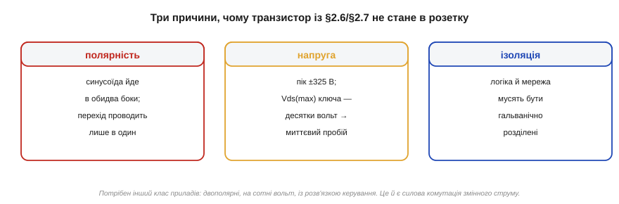
*Рис. 2.11.1.3. Полярність (синусоїда йде в обидва боки), напруга (пік ±325 В проти десятків вольт ключа) та ізоляція (логіка й мережа мусять бути розділені). Кожна вимога окремо вже виводить за межі звичайного транзистора; разом вони визначають цілий клас силових приладів змінного струму.*

Отже, мережевий ключ має:

- **проводити й блокувати обидві полярності** — бо синусоїда симетрична;
- **витримувати сотні вольт** із запасом над піком 325 В;
- **керуватися через гальванічну розв'язку** — щоб логіка не зустрілася з мережею.

Жодному з цих пунктів звичайний BJT чи MOSFET сам по собі не відповідає. Тому інженери ще в 1950-х створили прилади спеціально під цю задачу. Найперший і досі базовий — **тиристор**: чотиришарова кремнієва структура, що працює зовсім не як транзистор. Замість плавно «прочинятися» струмом бази чи напругою затвора, вона працює як **защіпка**: спить, доки не дадуть короткий імпульс, після чого вмикається повністю й тримається сама. Як саме влаштована ця защіпка — у наступній темі.

Корисно вже зараз уявити, як виглядає типовий **вузол комутації мережі** в реальному пристрої, бо до нього ми збиратимемо деталі весь розділ. На «гарячому» боці — силовий ключ (симістор чи тиристор), послідовно з навантаженням у розрив фази; перед ним — запобіжник і варистор як перший рубіж ([§2.11.9](ac-power-switching.md)). Між «гарячим» боком і логікою — обов'язковий ізоляційний бар'єр: оптодрайвер або оптопара. На «холодному» боці — мікроконтролер, що видає команди, і часто детектор переходу нуля ([§2.11.5](ac-power-switching.md)), який повертає логіці інформацію про фазу мережі — теж через розв'язку. Уся ця архітектура — пряме рішення трьох наших проблем: двобічний силовий ключ (полярність), його висока напруга (запас над піком), оптична розв'язка (ізоляція). Кожна наступна тема додаватиме до цієї картини один елемент.

Один важливий нюанс наостанок. Усе сказане не означає, що MOSFET «гірший» — він просто з іншого світу. На постійному струмі низької напруги MOSFET поза конкуренцією, і ми ще побачимо ([§2.11.7](ac-power-switching.md)), що навіть у силовій техніці є межа, де він знову бере гору. Річ не в якості приладу, а у **відповідності задачі**: мережа ставить свої умови, і під них потрібні свої ключі.

### Що далі

Ми сформулювали задачу: мережа двополярна, висока за напругою й вимагає ізоляції, тож звичайний транзистор тут безсилий. Далі — перший спеціальний прилад під цю задачу, **тиристор**: розберемо, чому чотири шари поводяться як защіпка, що таке утримуючий струм і чому в мережі такий ключ зручно гасне сам наприкінці кожної півхвилі.

> ▶️ Далі: [§2.11.2 Тиристор (SCR): защіпка, що вмикається імпульсом](ac-power-switching.md)

## 2.11.2 Тиристор (SCR): защіпка, що вмикається імпульсом

У [§2.11.1](ac-power-switching.md) ми побачили, що мережі потрібен особливий ключ. Перший такий прилад — **тиристор**, він же **SCR** *(silicon controlled rectifier — кремнієвий керований випрямляч)*. Назва натякає на головне: це **випрямляч** (тобто діод, що проводить в один бік), але **керований** — він починає проводити не сам по собі, а лише після команди. І поводиться тиристор не як кран, який можна прочинити наполовину, а як **защіпка дверей**: або зачинено намертво, або відчинено навстіж, а перемикає між цими станами короткий поштовх.

### Чотири шари = два транзистори навхрест

Зсередини тиристор — це **чотири шари** напівпровідника поспіль: p–n–p–n. У нього три виводи: **анод** *(anode, A)* — від крайнього p-шару, **катод** *(cathode, K)* — від крайнього n-шару, і **затвор** *(gate, G)* — від внутрішнього p-шару (його ще звуть керівним електродом).

Сама собою структура p–n–p–n виглядає загадково, але є чудовий прийом, щоб її зрозуміти: подумки **розрізати її по діагоналі** на два транзистори, що перекриваються середніми шарами. Тоді верхні три шари p–n–p утворюють **PNP-транзистор**, а нижні n–p–n — **NPN-транзистор**. Причому вони з'єднані хитро: **колектор кожного живить базу іншого**.


*Рис. 2.11.2.1. Ліворуч — чотири шари p–n–p–n із виводами анод, затвор, катод. Праворуч — той самий прилад як пара транзисторів: PNP і NPN, де колектор одного годує базу другого. Це перехресне з'єднання й створює защіпку.*

Це перехресне з'єднання — класичний **додатний зворотний зв'язок**. Згадаймо, що в транзисторі струм бази керує більшим струмом колектора ([§2.6.3](../bjt/bjt.md)). Тепер простежмо за колом: колектор NPN-транзистора живить базу PNP, отже відмикає PNP; а колектор PNP живить базу NPN, отже відмикає NPN. Кожен підтримує другого. Це **самопідсилювана** петля: варто їй розкрутитися — і вона себе тримає.

Тут варто на мить спинитися, бо це протилежність усьому, що ми знали про підсилювачі. У [§2.8.2](../opamp-comparator/opamp-comparator.md) ми бачили **від'ємний** зворотний зв'язок — він стабілізує, утримує систему в рівновазі, гасить відхилення. **Додатний** зворотний зв'язок робить навпаки: будь-яке мале відхилення він **підсилює**, і система зривається в один із крайніх станів — або повністю відкрита, або повністю закрита, без спокою посередині. Саме тому тиристор — не підсилювач і не регулятор, а **тригер**, защіпка: проміжного стану в нього фізично нема, бо петля його туди не пускає. Та сама математика додатного зв'язку, до речі, керує й тригером Шмітта ([§2.8.8](../opamp-comparator/opamp-comparator.md)) — лише там вона робить чіткий поріг, а тут — необоротну защіпку.

### Як спрацьовує защіпка

У спокої обидва транзистори закриті: бази не отримують струму, колекторного струму нема, годувати один одного нема чим. Тиристор блокує — між анодом і катодом висока напруга, а струму майже нема (одиниці мікроампер витоку). Це стан **«вимкнено»**.

Тепер подамо короткий **імпульс струму в затвор** — тобто в базу NPN-транзистора. Він трохи відкривається, його колектор починає тягти струм, цей струм іде в базу PNP, той теж відкривається, його колектор додає струму в базу NPN — і петля **лавиноподібно** розкручується. За якісь мікросекунди обидва транзистори входять у **насичення** ([§2.6.5](../bjt/bjt.md)), тиристор повністю відкритий, від анода до катода тече великий струм, а спад на приладі падає до ~1…1.5 В.


*Рис. 2.11.2.2. Імпульс у затвор трохи відкриває NPN; його струм відмикає PNP; той підсилює NPN — і петля замикається в насичення. Розкрутившись, цикл тримає себе сам.*

І ось ключове: **щойно защіпка замкнулася, затвор більше не потрібен**. Транзистори годують одне одного власними колекторними струмами, без жодної допомоги ззовні. Можна прибрати сигнал із затвора — тиристор лишиться відкритим. Саме тому керування **імпульсне**: не треба тримати сигнал, досить короткого поштовху. Це різко відрізняє тиристор від транзистора, якому базу чи затвор треба тримати під дією весь час, поки він відкритий.

> 🔧 **Навіщо це.** Імпульсне керування — велика практична зручність. Щоб увімкнути потужне навантаження, мікроконтролеру досить видати **коротку голку** струму в затвор (через розв'язку), а не тримати лінію активною весь час. Це економить енергію керування й спрощує схему. Але є й зворотний бік: якщо защіпка вже замкнулася, **звичайним сигналом її не розімкнути** — затвор уміє лише вмикати, не вимикати. Як же тоді гасити тиристор? Відповідь — у понятті утримуючого струму, до якого ми переходимо.

### Утримуючий струм: як тиристор гасне

Якщо затвор не вміє вимикати, то що вимикає тиристор? Згадаймо, на чому тримається защіпка: на тому, що крізь неї тече **достатній струм**, аби транзистори годували одне одного. А що, як цей струм **зменшити**? У якийсь момент колекторних струмів стане замало, щоб підтримувати бази відкритими, петля **розірветься**, і прилад закриється сам.

Той мінімальний струм, нижче якого защіпка вже не тримається, називають **утримуючим струмом** *(holding current, Iн)*. Правило просте:

```
I через тиристор > Iн   →  лишається відкритим (защіпка тримається)
I через тиристор < Iн   →  закривається сам    (защіпка зривається)
```

Утримуючий струм зазвичай невеликий — одиниці чи десятки міліампер. Щоб вимкнути тиристор, треба тимчасово **знизити струм крізь нього нижче Iн** — наприклад, перервати коло чи дочекатися, поки джерело саме перестане давати струм.

З утримуючим струмом тісно пов'язаний ще один параметр — **струм відмикання** *(latching current, Iл)*: мінімальний струм, який має встигнути потекти **в момент запуску**, щоб защіпка надійно замкнулася й трималася далі вже сама. Iл завжди трохи більший за утримуючий Iн. Практична різниця між ними така: Iл важливий **на старті** (короткий імпульс затвора має «розкрутити» струм хоча б до Iл), а Iн важливий **потім** (поки струм вище Iн, прилад тримається). Якщо навантаження дуже мале або вмикається повільно (індуктивне), струм може не встигнути дійти до Iл за час імпульсу — і тиристор «не схопиться», згасне одразу по знятті імпульсу. Це типова причина, чому потужний ключ іноді відмовляється вмикати мале навантаження від короткої голки керування.


*Рис. 2.11.2.3. Вольт-амперна характеристика. На прямій напрузі тиристор спершу блокує (струму майже нема), а імпульс затвора (або перевищення напруги Vbo) перекидає його на круту провідну гілку зі спадом ~1…1.5 В. Між гілками — нестійка ділянка, де прилад не затримується. Зворотну напругу тиристор блокує до лавинного пробою.*

ВАХ добре показує «двостанність» приладу: є гілка «блокує» і гілка «проводить», а між ними прилад не може спокійно стояти — він стрибає з одної на другу. Це й робить тиристор **ключем**, а не регулятором: проміжного, напіввідкритого стану в нього практично нема.

Зверніть увагу на ще одну точку на ВАХ — **напругу перемикання** *(breakover voltage, Vbo)*. Це та пряма напруга анод–катод, за якої тиристор **вмикається сам**, навіть без імпульсу затвора. Фізично це означає, що петля додатного зв'язку розкручується не від затвора, а від того, що сама прикладена напруга стала такою великою, що внутрішні переходи почали пропускати достатній струм. У звичайному режимі це **небажано** — тиристор має вмикатися лише за командою, а не від випадкового сплеску напруги в мережі. Тому Vbo беруть із запасом вище піка мережі. Але в одному класі приладів самовмикання від напруги — це **корисна функція**: саме так навмисно вмикається на заданому порозі **DIAC**, з яким ми зустрінемося в наступній темі ([§2.11.3](ac-power-switching.md)); по суті, DIAC — це двобічний прилад, у якого керування **тільки** через Vbo, без окремого затвора.

### Чому саме в мережі тиристор такий зручний

Тепер сполучімо дві речі: тиристор гасне, коли струм падає нижче Iн, — а **в мережі струм синусоїдний** і **сам щопівперіоду проходить через нуль** ([§1.7](../../block-1-circuits-physics/ac-signals/ac-signals.md)). Це означає, що наприкінці кожної півхвилі струм природно сходить до нуля, отже неминуче падає нижче утримуючого, — і тиристор **закривається сам**, без жодних зусиль із нашого боку. Це явище звуть **природною (мережевою) комутацією** *(natural / line commutation)*.

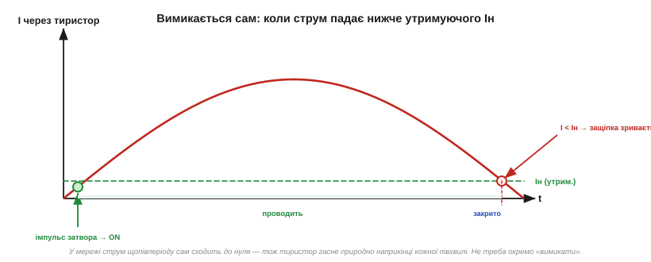
*Рис. 2.11.2.4. Струм крізь тиристор протягом півхвилі. Імпульс затвора на початку відмикає прилад; струм наростає й спадає за синусоїдою; щойно він опускається нижче утримуючого Iн — наприкінці півхвилі — защіпка зривається, і тиристор закривається сам аж до наступного імпульсу.*

Ось чому тиристор так природно ліг у мережеву техніку. Не треба вигадувати схему вимикання — мережа гасить прилад **сама**, сто разів на секунду. Наша робота зводиться до одного: вирішувати, **коли в межах кожної півхвилі** дати імпульс на запуск. Дамо рано — тиристор проведе майже всю півхвилю; дамо пізно — лише її хвостик. Саме на цьому побудоване фазове керування потужністю, до якого ми прийдемо в [§2.11.4](ac-power-switching.md).

А якби тиристор стояв не в мережі, а в колі **постійного** струму? Тоді все було б значно гірше. Постійний струм не проходить через нуль самостійно, тож раз увімкнений тиристор так і лишався б відкритим **назавжди** — звичайним зняттям сигналу його не вимкнути. Щоб погасити тиристор на постійному струмі, доводиться застосовувати спеціальні хитрощі — **примусову комутацію** *(forced commutation)*: наприклад, заздалегідь заряджений конденсатор на мить підкидає зустрічну напругу, що збиває струм нижче утримуючого. Це громіздко й незручно — і саме тому тиристор розквітнув передусім у техніці **змінного** струму, де мережа гасить його задарма. На постійному струмі його давно витіснили транзистори, яким вимикання дається легко.

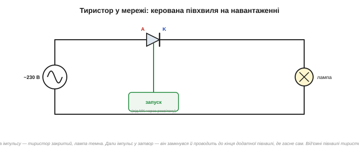
*Рис. 2.11.2.5. Найпростіше коло: тиристор послідовно з навантаженням у мережі. Поки нема імпульсу — він закритий, навантаження знеструмлене. Імпульс у затвор вмикає тиристор, і той проводить до кінця додатної півхвилі, після чого гасне сам. Від'ємні півхвилі тиристор блокує.*

**Приклад (мережеве реле на тиристорі).** Тиристор тримає в мережі 230 В навантаження 2 А. Затвор потребує імпульсу 15 мА протягом 10 мкс, утримуючий струм Iн = 30 мА. Оцінимо потужність керування проти безперервного утримання.

```
Енергія одного імпульсу запуску (грубо):
Vg ≈ 1 В, Ig = 15 мА, t = 10 мкс
Wзапуск = Vg · Ig · t = 1 × 0.015 × 10·10⁻⁶ = 1.5·10⁻⁷ Дж = 0.15 мкДж

За секунду (50 Гц, тобто 50 запусків — лише додатні півхвилі):
Pкер = Wзапуск × 50 = 0.15 мкДж × 50 ≈ 7.5 мкВт

Для порівняння — якби довелось ТРИМАТИ струм керування весь час,
як у транзисторі (умовно 15 мА · 1 В): Pтрим ≈ 15 мВт.
```

Імпульсне керування дешевше за безперервне у **тисячі разів** (мікровати проти міліватів). А вимикається тиристор задарма — мережа гасить його сама в кінці кожної півхвилі, щойно струм 2 А спадає нижче Iн = 30 мА.

### Що далі

Тиристор — наша перша «защіпка»: вмикається імпульсом, тримається сам, гасне, коли струм падає нижче утримуючого, а в мережі це стається природно щопівперіоду. Але він однобокий — проводить лише одну полярність, тобто половину синусоїди марнується. Далі візьмемо прилад, який цю ваду усуває: **симістор**, що вміє проводити **обидві** півхвилі одним затвором.

> ▶️ Далі: [§2.11.3 Симістор (TRIAC): ключ для обох півхвиль](ac-power-switching.md)

## 2.11.3 Симістор (TRIAC): ключ для обох півхвиль

Тиристор із [§2.11.2](ac-power-switching.md) має одну прикру ваду: він **однобокий**. Проводить лише одну полярність — додатну півхвилю, — а від'ємну блокує. Для випрямляча це чудово, але якщо ми хочемо віддати навантаженню **повну** потужність мережі, половина енергії (від'ємні півхвилі) пропадає даремно. Можна, звісно, поставити **два тиристори назустріч** один одному — і тоді один оброблятиме додатні півхвилі, другий від'ємні. Саме з цієї ідеї й виріс **симістор**.

### Два тиристори в одному кристалі

**Симістор** *(triac, від TRIode for Alternating Current — тріод для змінного струму)* — це, по суті, **два тиристори, з'єднані антипаралельно** (назустріч), але виконані в **одному** кристалі й керовані **одним** затвором. Завдяки цьому він проводить струм в **обидва** боки: коли «верхній» вивід додатний — працює одна половина структури, коли від'ємний — друга.

Виводи в симістора звуться інакше, ніж у тиристора, і це невипадково. Замість «анода» й «катода» — **MT1** і **MT2** *(main terminal 1 і 2 — головні виводи)*. Слово «анод/катод» означало б, що в приладу є «правильний» напрямок струму; а в симістора напрямок будь-який, тож обидва силові виводи **рівноправні**. Третій вивід — той самий **затвор (G)**.

Слово «антипаралельно» варто розшифрувати, бо воно описує сам спосіб з'єднання. Якщо два діоди (чи тиристори) увімкнути **паралельно**, але «головами» в різні боки — анод одного до катода іншого, — то для струму однієї полярності працює перший, для протилежної — другий. Разом така пара пропускає струм **в обидва боки**, тоді як кожен поодинці — лише в один. Це загальний прийом: антипаралельну пару діодів ми по суті вже бачили у двонапрямних обмежувачах і захисті входів. Симістор — це та сама ідея, доведена до кінця: не два окремі прилади, а **один** кристал, де обидва «напрямки» виконані разом і керуються спільним затвором. Тому симістор компактніший і дешевший за пару тиристорів та ще й потребує лише одного кола керування замість двох.

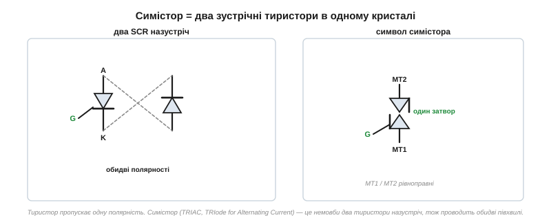
*Рис. 2.11.3.1. Ліворуч — два тиристори назустріч: разом вони охоплюють обидві полярності. Праворуч — символ симістора: два зустрічні трикутники й один затвор. Виводи MT1 і MT2 рівноправні — «правильного» напрямку струму немає.*

Результат на навантаженні очевидний: симістор може віддавати **повну синусоїду**, обидві півхвилі. Якщо вмикати його одразу на початку кожної півхвилі — навантаження отримає всю потужність мережі; якщо із затримкою — частину (це знову буде фазове керування, [§2.11.4](ac-power-switching.md)). Головне — на відміну від одиночного тиристора, жодна півхвиля не пропадає **обов'язково**.

Працює симістор за тією самою логікою защіпки, що й тиристор ([§2.11.2](ac-power-switching.md)): імпульс у затвор вмикає його, далі він тримається сам, а гасне, коли струм падає нижче утримуючого — тобто в кінці кожної півхвилі, у переході струму через нуль. Різниця лише в тому, що тепер це повторюється **двічі** за період: на додатній півхвилі працює одна половина структури, гасне в нулі; на від'ємній вмикається друга половина, гасне в наступному нулі. Тож мікроконтролеру треба давати імпульс запуску **на кожну** півхвилю окремо — а не один раз на період.


*Рис. 2.11.3.2. Напруга на навантаженні з симістором: відкривається й на додатній, і на від'ємній півхвилі (тут — із невеликою затримкою на кожній). На відміну від тиристора, який віддав би лише додатні півхвилі, симістор охоплює весь період.*

> 🔧 **Навіщо це.** Симістор — робоча конячка побутової силової електроніки саме тому, що він **двобічний і керується одним затвором**. Один дешевий прилад замість двох тиристорів зі складною обв'язкою — ось чому всередині димерів, регуляторів швидкості вентиляторів, паяльних станцій і твердотільних реле стоїть саме симістор. Він робить «повне» керування потужністю простим і компактним.

### Квадранти запуску: чотири комбінації полярностей

Тут з'являється тонкість, якої не було в тиристора. У тиристора все однозначно: анод додатний, імпульс у затвор додатний — запуск. А в симістора **обидва** силові виводи бувають то плюсом, то мінусом, та й затвор можна штовхати струмом як у плюс, так і в мінус. Виходить **чотири** комбінації полярностей — їх називають **квадрантами запуску** *(triggering quadrants)*.

Квадрант визначають за двома знаками: полярність MT2 (відносно MT1) і полярність затвора (відносно MT1). Позначають їх римськими цифрами I, II, III, IV.


*Рис. 2.11.3.3. Квадранти за знаками MT2 і затвора. Симістор запускається в усіх чотирьох, але неоднаково легко: квадрант I (обидва «+») — найчутливіший, а квадрант IV («+» на MT2, «−» на затворі) — найвередливіший і потребує найбільшого струму запуску.*

Чому це важливо на практиці? Бо симістор запускається в усіх чотирьох квадрантах, **але по-різному легко**. У квадранті I потрібен найменший струм затвора, у квадранті IV — найбільший, і там запуск найненадійніший. Тому розробники драйверів часто **уникають** найгіршого квадранта, влаштовуючи керування так, щоб працювати лише в найкращих. Це одна з причин, чому деякі симістори (особливо чутливі, «logic-level» та «snubberless») мають у даташиті позначку про **робочі квадранти** — і чому буває, що схема працює надійно в трьох квадрантах із чотирьох.

Звідки взагалі береться нерівноправність квадрантів, якщо симістор «симетричний»? Бо симетричний він **електрично** (проводить обидві полярності), але **геометрично** його кристал несиметричний: затвор фізично розташований ближче до однієї половини структури, ніж до іншої. Тому в одних комбінаціях полярностей імпульс затвора діє «напряму» й запускає легко (мала чутливість потрібна), а в інших — мусить запускати «в обхід», через додатковий внутрішній перехід, і потребує більшого струму. Квадрант IV — саме той незручний випадок «в обхід». Практичний наслідок: якщо схема має працювати від драйвера, який дає лише один знак затворного струму, її свідомо проєктують так, щоб обидві півхвилі потрапляли в зручні квадранти (наприклад, I і III), а не в I і IV.

Симістори різняться й за **загальною чутливістю затвора**. «Звичайні» симістори потребують десятків міліампер запуску — їх ганяють потужним драйвером. **Чутливі** *(sensitive-gate)* запускаються від одиниць міліампер — такий можна штовхнути майже напряму з логіки, але він і вразливіший до хибних запусків від наводок та dv/dt ([§2.11.8](ac-power-switching.md)). Це знайомий нам компроміс: що чутливіший вхід, то легше керувати, але то більший ризик зреагувати на завади. Вибір симістора за чутливістю — це вибір між простотою керування й завадостійкістю.

### DIAC у колі керування: поріг для чіткого запуску

Залишається питання: як саме сформувати імпульс у затвор симістора, та ще й однаковий для обох полярностей? Найпростіше — узяти прилад, який сам по собі **мовчить, доки напруга на ньому не перевищить поріг**, а тоді різко «прострілює». Такий прилад є — це **DIAC** *(diode for alternating current — діод для змінного струму)*.

DIAC — це, грубо кажучи, **симістор без затвора**: двобічний прилад, який блокує напругу обох полярностей, доки вона не сягне напруги перемикання (зазвичай ~30…35 В). Як тільки поріг перевищено — DIAC лавиноподібно відмикається й пропускає різкий сплеск струму. Оскільки він симетричний, поводиться так само в обидва боки.

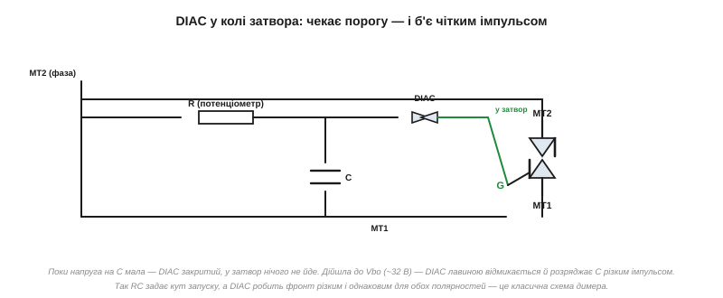
*Рис. 2.11.3.4. Класична схема керування: фаза заряджає конденсатор C через резистор (потенціометр) R. Поки напруга на C мала — DIAC закритий, у затвор нічого не йде. Коли напруга дійшла до порогу Vbo — DIAC «прострілює» й розряджає C різким імпульсом у затвор симістора. R задає момент запуску, DIAC робить фронт різким і однаковим для обох півхвиль.*

Класична схема димера складається саме з цих трьох елементів: **R, C і DIAC**. На початку кожної півхвилі конденсатор C заряджається від мережі через резистор R; швидкість заряду залежить від R (це регулятор — потенціометр). Коли напруга на C дійде до порогу DIAC, той відмикається й розряджає C коротким імпульсом прямо в затвор симістора — той вмикається. Чим більший опір R, тим **повільніше** заряджається C, тим **пізніше** в межах півхвилі настане запуск — і тим менша потужність дістанеться навантаженню.

Цей крихітний RC-вузол — гарний приклад того, як знайома нам експонента заряду конденсатора ([§2.1.4](../capacitor/capacitor.md)) виконує цілком конкретну роботу: вона **перетворює** положення ручки потенціометра на затримку в часі. Поки C доповзає до порогу DIAC, минає час, пропорційний сталій τ = R·C, — і саме цей час стає кутом відсікання. Один резистор, один конденсатор і один пороговий прилад дають повноцінний фазовий регулятор без жодної мікросхеми й живлення — тому така схема десятиліттями стоїть у найдешевших димерах і регуляторах обертів.

А коли керувати симістором хоче не людина з ручкою, а **мікроконтролер**, RC-DIAC замінюють на **оптодрайвер симістора** *(optotriac)* — оптопару, в якої на виході вже стоїть маленький світлочутливий симістор. Логічний сигнал засвічує світлодіод драйвера, той відмикає вихідний симісторик, а він уже дає імпульс у затвор силового симістора — і все це **через гальванічну розв'язку** ([§2.11.1](ac-power-switching.md)). Так мікроконтролер отримує контроль над квадрантами запуску й моментом вмикання, лишаючись відрізаним від мережі.

> 🔧 **Навіщо це.** DIAC розв'язує одразу дві проблеми. По-перше, він дає **чіткий, різкий фронт** запуску — без нього симістор відмикався б мляво, з нагрівом і нестабільністю. По-друге, оскільки DIAC **симетричний**, він автоматично формує однакові імпульси для додатної й від'ємної півхвиль, тож обидві півхвилі відсікаються однаково й навантаження не отримує постійної складової. Простіше кажучи, RC задає «скільки», а DIAC гарантує «чисто й однаково в обидва боки».

**Приклад (оцінка моменту запуску RC-DIAC).** У димері R — потенціометр, C = 100 нФ, поріг DIAC Vbo = 32 В. Прикинемо, на якому куті півхвилі спрацює запуск при R = 100 кОм.

```
Стала часу: τ = R · C = 100·10³ × 100·10⁻⁹ = 0.01 с = 10 мс

Тривалість півперіоду мережі 50 Гц:
Tпів = 1 / (2 · 50) = 0.01 с = 10 мс

Конденсатор заряджається до Vbo, коли вже минула помітна частина
півперіоду (τ співмірне з Tпів) → запуск ближче до середини
півхвилі → приблизно половина потужності.

Зменшимо R (відкрутимо потенціометр) → τ менша →
C заряджається швидше → запуск раніше → більша потужність.
```

Підбираючи R у межах від кількох кОм до сотень кОм, ми зсуваємо момент запуску майже від початку півхвилі до її кінця — і так плавно регулюємо потужність від майже повної до майже нуля. Точну залежність потужності від кута розберемо в [§2.11.4](ac-power-switching.md).

### Що далі

Симістор дав нам двобічний ключ для всієї синусоїди, керований одним затвором, а DIAC — простий спосіб формувати чіткі імпульси запуску. Ми вже кілька разів згадували, що момент запуску **в межах півхвилі** визначає віддану потужність. Час розібрати це явище як слід: що таке кут відсікання, як із нього порахувати потужність і чому одне навантаження димерується чудово, а інше — категорично ні.

> ▶️ Далі: [§2.11.4 Фазове керування потужністю: димер](ac-power-switching.md)

## 2.11.4 Фазове керування потужністю: димер

Ми вже двічі підходили до цієї ідеї: і тиристор ([§2.11.2](ac-power-switching.md)), і симістор ([§2.11.3](ac-power-switching.md)) гаснуть у кінці кожної півхвилі самі, а вмикаються тоді, **коли ми дамо імпульс**. Отже, регулюючи **момент** запуску в межах півхвилі, ми регулюємо, **скільки** синусоїди дістанеться навантаженню. Цей спосіб керування потужністю називають **фазовим** *(phase control)*, а пристрій на його основі — **димером** *(dimmer)*, бо найчастіше ним приглушують світло. Розберемо, як він працює і де його межі.

### Кут відсікання

Уявімо одну півхвилю синусоїди. Якщо ввімкнути ключ на самому її початку, навантаження отримає всю півхвилю — повну потужність. Якщо ж зачекати й увімкнути ключ, скажімо, на середині півхвилі, навантаження отримає лише її **другу половину** — менше енергії. Те, наскільки ми затримуємося з вмиканням, природно міряти не часом, а **кутом**: повна півхвиля — це 180°, тож затримку запуску виражають **кутом відсікання** *(firing angle, α)* від 0° (вмикаємо одразу) до 180° (не вмикаємо зовсім).


*Рис. 2.11.4.1. Та сама синусоїда при трьох кутах запуску. Малий α — ключ відмикається рано, навантаженню дістається майже вся півхвиля (повна потужність). α = 90° — запуск посередині, навантаженню йде половина. Великий α — ключ відмикається пізно, проходить лише хвостик півхвилі (тьмяно). Закрашена частина — те, що реально дісталося навантаженню.*

Симістор у димері відмикається із затримкою α **на кожній** півхвилі — і на додатній, і на від'ємній (бо він двобічний). Доки запуску нема — симістор закритий, напруга на навантаженні нуль; після запуску він проводить до кінця півхвилі, де гасне сам. Виходить, що навантаження бачить не плавну синусоїду, а її **обрізані шматки** — і чим пізніше запуск, тим менші ці шматки.

Описаний спосіб — коли симістор вмикається **посеред** півхвилі й проводить до її кінця — називають **відсіканням переднього фронту** *(leading-edge dimming)*: відрізається початок кожної півхвилі. Саме так працює класичний симісторний димер, і саме тому він любить навантаження, яке витримує різкий стрибок напруги на старті провідності (лампа розжарення). Існує й зворотний підхід — **відсікання заднього фронту** *(trailing-edge dimming)*: ключ вмикається в нулі (м'яко), проводить початок півхвилі, а потім **обриває** струм десь усередині. Такий димер не можна збудувати на простому симісторі, бо симістор сам не вимикається посеред півхвилі ([§2.11.2](ac-power-switching.md)) — потрібен прилад із примусовим вимиканням (транзистор, MOSFET). Зате trailing-edge м'якший до електроніки й тихіший — тому в сучасних димерах для світлодіодних ламп частіше саме він.

> 🔧 **Навіщо це.** Фазове керування — найдешевший спосіб регулювати потужність із мережі **без втрат на тепло**. Можна було б приглушити лампу й послідовним резистором — але той розсіював би відрізану потужність у себе, гріючись. Симістор натомість просто **не пропускає** частину синусоїди: відрізана енергія не виділяється ніде, бо в закритому стані струму нема, а у відкритому спад на симісторі мізерний. Тому димер на симісторі холодний і ефективний — у цьому вся його принада.

У фазового керування є й приємний побічний ефект — **плавний пуск** *(soft start)*. Лампа розжарення в холодному стані має малий опір ([§1.3](../../block-1-circuits-physics/resistance-power-heat/resistance-power-heat.md)) і в першу мить тягне струм у кілька разів більший за робочий — це **пусковий струм** *(inrush)*, від якого нитки часто й перегоряють саме при ввімкненні. Якщо ж димером плавно піднімати потужність від нуля (поступово зменшуючи кут α за кілька секунд), нитка прогрівається м'яко, без кидка струму, — і служить помітно довше. Той самий прийом рятує й двигуни від ривка при пуску. Тобто фазове керування — це не лише «приглушити», а й «увімкнути обережно»; багато промислових регуляторів використовують його саме як плавний пускач, а не як димер.

### Скільки потужності дає кут α

Інтуїція підказує: α = 90° (запуск посередині) має давати половину потужності. І це майже правда — але треба бути обережним, бо залежність **нелінійна**. Потужність визначається не висотою синусоїди в точці запуску, а **площею під квадратом** напруги по всій провідній частині півхвилі (бо потужність на резисторі ∝ U²). Інтегруючи синусоїду в квадраті від кута α до 180°, отримують частку повної потужності:

```
P(α) / Pмакс = (1/π) · [ (π − α) + sin(2α)/2 ]      (α у радіанах)

α = 0°    →  P/Pмакс = 1.00   (повна потужність)
α = 90°   →  P/Pмакс = 0.50   (рівно половина)
α = 180°  →  P/Pмакс = 0.00   (вимкнено)
```

Цікаве саме те, що **рівно половина** потужності припадає на 90° — середину півперіоду. Але навколо цього значення крива йде полого, а ближче до країв (малі й великі α) — круто. Тобто однакова зміна кута дає різну зміну потужності залежно від того, де ми на кривій.

Звідки в цій формулі взявся **квадрат** напруги і чому потужність — це площа під U²? Згадаймо, що миттєва потужність на резисторі p = u²/R ([§1.3](../../block-1-circuits-physics/resistance-power-heat/resistance-power-heat.md)). Якщо ми відрізали початок півхвилі, то на відрізаній ділянці u = 0, отже й потужність там нуль; а на провідній ділянці потужність змінюється як квадрат миттєвої напруги. Середня потужність за період — це **середнє від u²**, тобто площа під кривою u² на провідній ділянці, поділена на період. Саме тому залежність нелінійна: біля краю півхвилі (де синусоїда мала) ми відрізаємо ділянки з **малим** u², майже не зменшуючи потужність; а посередині, де синусоїда на піку, кожен градус відрізає ділянку з **великим** u² — і потужність падає круто. Це той самий зв'язок «потужність ∝ квадрат величини», що дав нам і означення RMS ([§1.7](../../block-1-circuits-physics/ac-signals/ac-signals.md)), і точку −3 дБ як «половину потужності» ([§2.4.6](../frequency-response/frequency-response.md)).


*Рис. 2.11.4.2. P/Pмакс як функція α. Крива S-подібна: біля 0° і 180° положиста, в середині крута. Половина потужності — рівно на 90°. Через цю нелінійність дешеві димери з лінійним потенціометром регулюють яскравість нерівномірно: ручка «майже не діє» на краях і «різко діє» в середині.*

**Приклад (потужність лампи при α = 90°).** Лампа розжарення 100 Вт увімкнена через димер на симісторі. Який ефект дасть установлення кута відсікання 90° на обох півхвилях?

```
P(90°) / Pмакс = (1/π) · [ (π − π/2) + sin(π)/2 ]
              = (1/π) · [ π/2 + 0 ]
              = 1/2 = 0.50

Потужність лампи: P = 0.50 × 100 Вт = 50 Вт
```

Лампа світитиме приблизно вдвічі тьмяніше за повну яскравість. Зауважмо: половина потужності — це **не** половина положення ручки регулятора, бо залежність нелінійна; на практиці «півяскравості» опиняється ближче до середини ходу ручки, але точно туди потрапити можна лише обчисленням або підбором.

### Чому лампа димерується, а імпульсний блок — ні

Тепер найважливіше практичне застереження. Фазове керування **чудово** працює з **резистивним** навантаженням — насамперед із **лампою розжарення** й **нагрівачем**. Чому? Бо такому навантаженню байдуже до форми напруги: воно перетворює на тепло будь-який поданий шматок синусоїди, а теплова інерція нитки розжарення згладжує миготіння, тож око бачить рівне (хай і тьмяніше) світло.

А от сучасну електроніку — **імпульсний блок живлення** *(SMPS)*, що стоїть у світлодіодних лампах, зарядних, комп'ютерах, — фазовим димером керувати **не можна**. Причина у тому, як влаштований вхід такого блока: там стоїть **діодний міст і конденсатор** ([§2.5.6](../diode-pn-junction/diode-pn-junction.md)), який заряджається короткими **голками струму** біля піка синусоїди й тримає напругу між піками. Такому входу потрібна саме **верхівка** синусоїди — а димер часто саме її й відрізає або спотворює.

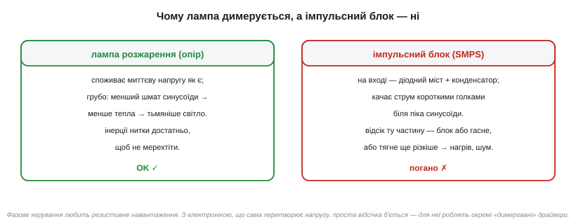
*Рис. 2.11.4.3. Лампа розжарення (зліва) бере будь-який шматок синусоїди й рівно гріється — димерується чудово. Імпульсний блок (справа) качає струм голками біля піка й має власний конденсатор; відсічена синусоїда збиває його з пантелику — він мерехтить, гуде або вимикається. Для такої електроніки роблять окремі «димеровані» драйвери.*

Що буде, якщо все ж під'єднати звичайний димер до світлодіодної лампи? У кращому разі вона блиматиме, гудітиме чи світитиме ривками; у гіршому — димер узагалі не зможе її «запустити», бо струм навантаження надто малий і нестабільний, щоб утримати симістор вище утримуючого струму ([§2.11.2](ac-power-switching.md)). Саме тому продають окремі **димеровані** *(dimmable)* LED-лампи зі спеціальними драйверами, що вміють працювати з обрізаною синусоїдою, — і звичайні, які з димером несумісні.

Є й системний наслідок фазового керування, про який варто знати. Обрізана синусоїда — це вже **не чистий синус**: у її спектрі з'являються вищі **гармоніки** (складові на кратних частотах), а струм із мережі тече не плавно, а ривками, зсунутими відносно напруги. Інженери описують це через **коефіцієнт потужності** *(power factor)*: у фазового димера він гірший за одиницю навіть на чисто резистивному навантаженні — не через зсув фаз, як у котушки ([§2.3.4](../reactance-resonance/reactance-resonance.md)), а через **спотворення форми** струму. Для однієї настільної лампи це дрібниця, але тисячі димерів і дешевих блоків живлення разом «бруднять» мережу гармоніками — тому для потужних пристроїв існують норми на гармоніки й окремі схеми **корекції коефіцієнта потужності**. Нам зараз досить розуміти причину: різати синусоїду — означає псувати її форму, а зіпсована форма має ціну на рівні всієї мережі.

> 🔧 **Навіщо це.** Це правило рятує від типової помилки: «куплю димер і приглушу будь-що». Ні — фазовий димер любить **резистивне** навантаження (лампа розжарення, нагрівач, іноді колекторний двигун). Для всього, що має власний імпульсний перетворювач, потрібен або сумісний драйвер, або зовсім інший спосіб керування. Перевіряйте позначку «dimmable» — інакше отримаєте мерехтіння, гудіння й перегрів.

### Скільки коштує тепло на самому симісторі

Раз ми наголошуємо, що димер «холодний», варто перевірити це числом — і заразом побачити межу. Симістор у відкритому стані має спад ~1…1.5 В ([§2.11.2](ac-power-switching.md)), і весь струм навантаження тече крізь нього. Отже, навіть «холодний» симістор виділяє трохи тепла — спад × струм, — і на великих струмах це «трохи» стає відчутним. Це принципово менше, ніж розсіював би послідовний резистор (який узяв би на себе **всю** відрізану потужність — десятки чи сотні ват), але не нуль.

**Приклад (тепло на симісторі димера).** Димер на повній потужності живить навантаження 5 А, спад на відкритому симісторі 1.2 В. Скільки тепла він виділяє і чи треба радіатор?

```
Розсіювана потужність: P = Uспад × I = 1.2 В × 5 А = 6 Вт

Порівняння: якби ту саму потужність «прикручували» резистором
на половину напруги, він би грів ~575 Вт — абсурд.
Симістор гріє лише 6 Вт.

Але 6 Вт — це вже відчутно: потрібен невеликий радіатор.
На струмах 1…2 А (≈1.5…2.5 Вт) часто обходяться без нього.
```

Звідси видно і принаду, і межу фазового керування: воно не марнує **відрізану** потужність (вона просто не тече), але «робочий» струм усе одно платить дещицю спадом на ключі. Тому потужні димери все ж мають радіатор — хоч і несумірно менший, ніж довелося б для резистивного регулювання.

### Що далі

Фазове керування дало нам плавне й нежарке регулювання потужності, але має приховану ціну: різкий фронт у момент запуску посеред синусоїди породжує електромагнітні завади, а ще псує життя електроніці. Логічно спитати: а що, як вмикати ключ не посеред синусоїди, де напруга велика, а **в момент її переходу через нуль**, де вмикати нема чого? Цей розумніший спосіб комутації — наступна тема.

> ▶️ Далі: [§2.11.5 Перехід через нуль: комутація без сплесків і завад](ac-power-switching.md)

## 2.11.5 Перехід через нуль: комутація без сплесків і завад

Фазовий димер із [§2.11.4](ac-power-switching.md) має тіньовий бік. Коли симістор раптом відмикається посеред півхвилі, напруга на навантаженні **стрибком** скаче з нуля до миттєвого значення синусоїди — а це можуть бути сотні вольт за частки мікросекунди. Такий різкий фронт — джерело сильних **електромагнітних завад** *(EMI)*, які розлітаються проводами й ефіром, заважаючи радіо, іншій електроніці й навіть самому мікроконтролеру. Існує елегантний спосіб цього уникнути — **комутувати в момент переходу напруги через нуль**.

### Дві стратегії: будь-де чи в нулі

Є два принципово різні моменти, коли можна ввімкнути мережевий ключ.

Перший — **random-phase** *(у будь-якій фазі)*: вмикаємо тоді, коли захотіли, незалежно від того, де зараз синусоїда. Саме так працює фазовий димер: момент запуску визначає потужність, тож вмикати доводиться **посеред** півхвилі, де напруга велика. Наслідок — різкий стрибок і завади.

Другий — **zero-cross** *(у переході нуля)*: ключ навмисно чекає **моменту, коли напруга мережі сама проходить через нуль**, і вмикається саме там. У цю мить вмикати **нема чого** — напруга й так нуль, стрибка не виникає, струм починає текти плавно з нуля за синусоїдою.

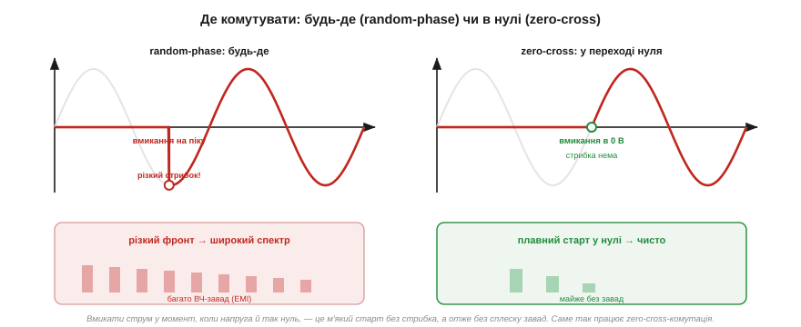
*Рис. 2.11.5.1. Зліва — random-phase: ключ вмикається на схилі синусоїди, напруга стрибає миттєво → різкий фронт → широкий спектр ВЧ-завад. Справа — zero-cross: ключ вмикається в переході нуля, напруга наростає плавно з нуля → завад майже нема. Внизу — спектр завад: різкий фронт «бризкає» енергією по багатьох частотах, плавний старт — майже ні.*

Чому різкий фронт дає так багато завад? Бо, як ми бачили в темі про спектри й фронти ([§2.4.6](../frequency-response/frequency-response.md)), **що крутіший фронт сигналу, то ширший його частотний спектр**: миттєвий стрибок напруги містить складові аж до дуже високих частот. Ці складові й випромінюються як завади. Плавний же старт із нуля має пологий фронт — а отже, вузький спектр і мало завад.

Тут видно глибокий зв'язок із усім, що ми вивчали про частоту. Стрибок напруги «з нуля до 300 В за частку мікросекунди» — це фактично дуже короткий фронт, а короткий фронт за формулою смуги ([§2.4.6](../frequency-response/frequency-response.md)) еквівалентний сигналу з частотами в десятки мегагерц. Ці мегагерцові складові чудово випромінюються проводами-антенами й наводяться на сусідні кола. Вмикання ж у нулі розтягує наростання струму на цілий міліметр синусоїди — фронт стає пологим, високочастотних складових майже нема. Тобто zero-cross не «прибирає завади фільтром», а **не створює** їх із самого початку — це завжди дешевше, ніж потім ловити.

> 🔧 **Навіщо це.** Zero-cross-комутація — стандартне рішення там, де важлива **чистота** (мало EMI) і де навантаженню байдужа дрібна затримка ввімкнення: нагрівачі, лампи, теплові процеси. Менше завад означає простіший мережевий фільтр, легше пройти сертифікацію на електромагнітну сумісність і менше ризику, що силовий ключ «насвистить» перешкоду у власний мікроконтролер. Тому твердотільні реле для нагріву майже завжди роблять саме zero-cross.

Чому завади — це не дрібниця, через яку можна заплющити очі? Бо різкий фронт комутації б'є **по всіх фронтах** одразу. По-перше, він випромінюється в ефір і проводами — і сусіднє радіо чи бездротовий модуль ловлять тріск. По-друге, він наводиться прямо на доріжки власної плати — і той самий мікроконтролер, що керує симістором, може від цього скидатися чи помилково спрацьовувати. По-третє, будь-який серійний пристрій мусить пройти **сертифікацію на електромагнітну сумісність** *(EMC)*, і брудна комутація — найчастіша причина її провалити. Тож вибір на користь zero-cross — це не «акуратність заради акуратності», а економія на фільтрах, надійність власної логіки й перепустка на ринок. Random-phase лишають тільки там, де він **потрібен** по суті (фазове керування, миттєва реакція), і тоді платять за фільтр від завад.

### Детектор переходу нуля

Щоб вмикатися в нулі, систему треба **синхронізувати з мережею** — тобто знати, коли саме настає перехід нуля. Для цього служить **детектор переходу нуля** *(zero-cross detector)*. Його завдання просте: із плавної синусоїди 230 В зробити короткі **логічні імпульси**, кожен з яких каже мікроконтролеру «ось зараз напруга проходить через нуль».

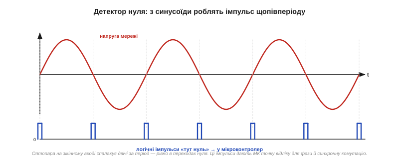
*Рис. 2.11.5.2. Угорі — напруга мережі. Внизу — імпульси на виході детектора: короткий логічний сплеск у кожному переході нуля, тобто двічі за період (на 50 Гц — кожні 10 мс). Ці імпульси дають мікроконтролеру точку відліку для синхронної комутації й для відліку кута фазового керування.*

Реалізують детектор зазвичай через **оптопару** на змінному вході ([§2.5.10](../diode-pn-junction/diode-pn-junction.md)): мережева напруга через резистор живить світлодіод оптопари, той світиться майже весь період і **гасне лише поблизу нуля**, коли напруги бракує. На виході виходять імпульси, синхронні з мережею, — і все це **через гальванічну розв'язку** ([§2.11.1](ac-power-switching.md)), тож мікроконтролер залишається відрізаним від мережі.

У цій простій схемі ховається тонкість, важлива для точності фази. Світлодіод оптопари гасне не точно в нулі, а тоді, коли напруга падає **нижче його порогу** (приблизно 1.2 В прямого падіння плюс запас). Тому імпульс «нуля» виходить не нескінченно тонким, а має певну **ширину** навколо справжнього переходу — і що більший резистор перед світлодіодом, то ширший цей імпульс. Для грубого керування нагрівачем це байдуже, а от для рівної яскравості димера ширину імпульсу й затримку детектора доводиться враховувати, інакше фаза «попливе». Звідси й існують точніші (але дорожчі) детектори нуля на компараторі ([§2.8.7](../opamp-comparator/opamp-comparator.md)), що дають вужчий і стабільніший імпульс. Знов-таки компроміс: проста оптопара дешева, але «розмазує» нуль; компараторна схема точна, але складніша.

Ці імпульси корисні **двояко**. По-перше, для zero-cross-комутації: дочекався імпульсу — увімкнув ключ синхронно з нулем. По-друге, парадоксально, для **фазового** керування з [§2.11.4](ac-power-switching.md): імпульс нуля дає **точку відліку**, від якої мікроконтролер відмірює потрібну затримку α (у мілісекундах від нуля) і тоді запускає симістор. Без точного знання, де нуль, кут відсікання задати неможливо. Тож детектор нуля — спільний фундамент обох стратегій.

З програмного боку детектор нуля зазвичай під'єднують до входу **зовнішнього переривання** мікроконтролера: кожен імпульс «тут нуль» викликає переривання, у якому МК запускає таймер. Для фазового керування таймер відмірює затримку α і в кінці видає імпульс у затвор; для zero-cross — ключ вмикають прямо в перериванні. Точність тут критична: на 50 Гц півперіод триває рівно **10 мс**, тож щоб задати кут із похибкою хоча б у градус, таймер має відмірювати десятки мікросекунд. Звідси й вимога до детектора — давати **різкий і стабільний** імпульс саме в нулі, без «розмазування», бо будь-яке тремтіння точки відліку стане тремтінням яскравості чи потужності.

**Приклад (затримка запуску для заданого кута).** Мережа 50 Гц, треба фазове керування з кутом α = 90° (половина потужності, [§2.11.4](ac-power-switching.md)). Скільки чекати від імпульсу нуля до запуску симістора?

```
Тривалість півперіоду:  Tпів = 1 / (2 · 50 Гц) = 10 мс  (це 180°)

Затримка на кут α:       tα = Tпів · (α / 180°)
                         tα = 10 мс · (90 / 180) = 5 мс

Алгоритм у МК: спіймав імпульс нуля → запустив таймер на 5 мс →
по таймеру видав імпульс у затвор → симістор проводить решту півхвилі.
Повторити на кожній півхвилі (кожні 10 мс).
```

Отже, увесь «розум» фазового керування зводиться до точного відліку часу від нуля. Для 60 Гц півперіод був би 8.33 мс, і та сама логіка дала б іншу затримку — тому програма має знати частоту мережі, яку, до речі, можна виміряти тим самим детектором нуля (відстань між його імпульсами).

### Burst-керування: цілі півперіоди замість шматків

Zero-cross дає чисту комутацію, але як тоді **регулювати потужність**, якщо ми зобов'язані вмикатися лише в нулі й віддавати цілу півхвилю? Адже фазову відсічку (півхвилю «обрізати») робити вже не можна — це знову random-phase із завадами.

Відповідь — **burst-керування** *(burst firing, цілими циклами)*: ми не ріжемо окремі півхвилі, а пропускаємо **цілі** півперіоди одні повністю, інші зовсім, регулюючи потужність **співвідношенням** увімкнених і пропущених періодів. Хочемо 50% — даємо половину періодів і половину пропускаємо; хочемо 75% — три з чотирьох.

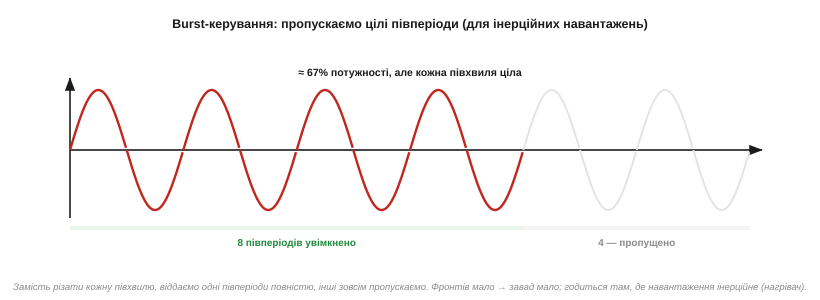
*Рис. 2.11.5.3. Замість різати кожну півхвилю, віддаємо одні півперіоди цілими, інші пропускаємо (тут ≈ 8 із 12, тобто близько 67% потужності). Кожна півхвиля — повна, вмикання й вимикання — лише в нулі, тож фронтів мало й завад майже нема. Годиться для інерційних навантажень.*

У burst-керування є чітка межа застосовності: воно годиться лише для **інерційних** навантажень, які не встигають зреагувати на те, що потужність «пульсує» пакетами. Нагрівач із його тепловою сталою в секунди й хвилини всереднює пакети ідеально — температура виходить рівна. А от **лампу** так регулювати не можна: вона помітно **миготітиме** з частотою пакетів, бо світло реагує миттєво. Тому burst — це метод для теплових процесів (нагрів, температурні регулятори), а не для світла.

Варто зробити й застереження про **індуктивні** навантаження та zero-cross загалом. Уся ідея «вмикати в нулі **напруги**» бездоганна для резистивного навантаження, де струм і напруга збігаються у фазі. Але на індуктивному навантаженні струм відстає від напруги ([§2.3.4](../reactance-resonance/reactance-resonance.md)), і вмикання в нулі напруги означає вмикання тоді, коли струм хотів би бути не нульовим, — а це знову стрибок струму й кидок. Тому zero-cross-комутацію проєктують насамперед під резистивні навантаження (нагрівачі, лампи розжарення). Для двигунів і трансформаторів картина тонша, і там часто доречніший random-phase зі снабером ([§2.11.8](ac-power-switching.md)). Запам'ятаймо: «вмикати в нулі» — це про нуль **напруги**, і виграш повний лише там, де струм у фазі з напругою.

> 🔧 **Навіщо це.** Burst-керування поєднує чисту zero-cross-комутацію (мало завад) із плавним регулюванням потужності — але ціною того, що потужність подається пакетами. Для нагрівача це ідеально: він однаково усереднить, а ми отримаємо й мало завад, і простий алгоритм («увімкни N періодів зі 100»). Для освітлення — навпаки, неприйнятно. Вибір між фазовим і burst-керуванням — це завжди вибір між «плавно, але з завадами» і «чисто, але пакетами».

**Приклад (потужність нагрівача через burst).** Нагрівач 1000 Вт керують burst-методом: із кожних 100 півперіодів вмикають 30. Яка середня потужність?

```
Частка увімкнених півперіодів: 30 / 100 = 0.30

Середня потужність: P = 0.30 × 1000 Вт = 300 Вт

Період пульсації потужності: 100 півперіодів = 50 повних періодів
                              = 50 / 50 Гц = 1 секунда

Теплова стала нагрівача (десятки секунд) ≫ 1 с → температура рівна.
```

Нагрівач віддаватиме в середньому 300 Вт, а його інерція згладить секундні пульсації в рівне тепло. Якби це була лампа — вона блимала б раз на секунду, що неприйнятно; нагрівачу ж однаково.

### Що далі

Ми розібрали два способи комутації — фазовий (плавно, але з завадами) і zero-cross/burst (чисто, але цілими періодами), — і навчилися синхронізуватися з мережею через детектор нуля з розв'язкою. Усі ці хитрощі — детектор, оптопара, симістор, керування — інженери давно зібрали в **один готовий компонент**, який ставлять у схему як «чорну скриньку». Це твердотільне реле, і саме до нього ми тепер переходимо.

> ▶️ Далі: [§2.11.6 Твердотільне реле (SSR)](ac-power-switching.md)

## 2.11.6 Твердотільне реле (SSR)

Усе, що ми зібрали в попередніх темах — двобічний симістор ([§2.11.3](ac-power-switching.md)), оптична розв'язка ([§2.11.1](ac-power-switching.md)), детектор переходу нуля ([§2.11.5](ac-power-switching.md)), — інженери давно об'єднали в один компонент, яким користуються, не заглядаючи всередину. Це **твердотільне реле** *(solid-state relay, SSR)*. Воно робить те саме, що й звичайне електромеханічне реле з [§2.6.9](../bjt/bjt.md) — слабким сигналом вмикає потужне навантаження, — але **без жодної рухомої частини**: ні котушки, ні контактів, ні клацання. Усе всередині — напівпровідники.

### Що всередині: світло замість котушки

Зсередини типове SSR для змінного струму складається з кількох знайомих нам блоків, з'єднаних у ланцюжок від керування до силового виходу.

- **Вхід керування** — звичайний світлодіод (через обмежувальний резистор), що засвічується від низької напруги, як-от 3…32 В постійного струму. Це аналог котушки в електромеханічному реле, але споживає він мізер — одиниці міліампер.
- **Оптична розв'язка** — той самий прозорий бар'єр ([§2.5.10](../diode-pn-junction/diode-pn-junction.md)): світло від керівного діода перетинає його й потрапляє на фотоприймач силової сторони. Струму крізь бар'єр нема — лише промінь.
- **(Для zero-cross версій) детектор нуля** — схема, що дозволяє ввімкнути силовий ключ лише в момент переходу напруги через нуль ([§2.11.5](ac-power-switching.md)).
- **Силовий ключ** — **симістор** (для змінного струму) або пара **MOSFET** (у реле для постійного струму), що власне й комутує навантаження мережі.

Зверніть увагу, як акуратно SSR повторює всю логіку розділу в одному корпусі: вхід — це світлодіод керування (§2.5.7), бар'єр — оптична розв'язка (§2.5.10), синхронізація — детектор нуля (§2.11.5), а силова частина — симістор (§2.11.3) чи MOSFET (Розділ 2.7). По суті, інженери взяли все, що ми проходили окремими темами, і спаяли в готовий блок. Тому розуміти SSR «зсередини» — означає вже володіти всім розділом; а користуватися ним «зовні» можна як простим вимикачем із логічним керуванням.

Вхід SSR розрахований на широкий діапазон керівної напруги — типово **3…32 В постійного струму**. Усередині послідовно зі світлодіодом стоїть або резистор, або джерело струму, тож реле однаково спрацьовує і від 3.3 В логіки, і від 24 В промислового сигналу. Споживає вхід дрібницю — одиниці міліампер, тобто його легко тягне навіть ніжка мікроконтролера напряму, без жодного транзистора-підсилювача. Це різкий контраст із електромеханічним реле, котушка якого вимагає десятків міліампер і власного ключа з flyback-діодом ([§2.6.9](../bjt/bjt.md)).

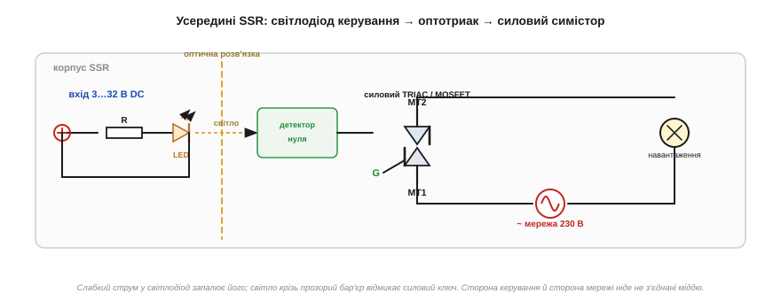
*Рис. 2.11.6.1. Усередині SSR: слабкий струм у керівний світлодіод; його світло крізь прозорий бар'єр запускає (через детектор нуля) силовий симістор, що комутує мережу. Сторона керування й сторона мережі ніде не з'єднані міддю — лише променем світла.*

Ось чому SSR — це фактично **готовий, запакований розв'язаний ключ**. Розробнику не треба самому добирати оптодрайвер, рахувати резистор світлодіода, ловити перехід нуля й боятися, що десь проб'ється ізоляція: усе це вже зроблено й перевірено в одному корпусі. Подав «логічну» напругу на вхід — навантаження ввімкнулося; зняв — вимкнулося.

SSR бувають **двох сімейств** за способом вмикання, і це прямий спадок [§2.11.5](ac-power-switching.md). **Zero-cross** (з детектором нуля всередині) вмикається лише в переході напруги через нуль — це більшість реле для нагріву й освітлення, мало завад. **Random-phase** (без детектора) вмикається миттєво, щойно надійшов сигнал, у будь-якій точці синусоїди — таке реле потрібне, коли важлива саме **миттєва** реакція або коли SSR використовують для фазового керування. Купуючи реле, дивляться на цю позначку: zero-cross-реле не підходить туди, де треба ввімкнути точно посеред півхвилі, а random-phase даремно «бруднитиме» мережу завадами там, де вистачило б zero-cross.

Окремо стоять **SSR для постійного струму** *(DC SSR)*. У них силовий ключ — не симістор (той на постійному струмі не вимкнути, [§2.11.2](ac-power-switching.md)), а **MOSFET** ([Розділ 2.7](../mosfet/mosfet.md)) або пара MOSFET. Решта — той самий світлодіод і оптична розв'язка. DC-реле має полярність (його не можна вмикати «навпаки»), зате MOSFET дає менший спад, ніж симістор, а отже менше тепла. Сплутати DC- і AC-реле легко за виглядом, але вони невзаємозамінні: AC-реле на постійному струмі не вимкнеться, а DC-реле на змінному працюватиме лише половину періоду.

> 🔧 **Навіщо це.** SSR — найшвидший і найбезпечніший спосіб увімкнути мережеве навантаження з мікроконтролера. Один компонент дає і гальванічну розв'язку, і двобічну комутацію, і (часто) zero-cross — усе те, що інакше довелося б збирати з розсипу. Тому в саморобній автоматиці — теплицях, інкубаторах, паяльних печах, контролерах нагріву — SSR став стандартним «вихідним каскадом» на 230 В.

### Чим SSR кращий і гірший за електромеханічне реле

Спокусливо вирішити, що SSR в усьому переважає старе електромеханічне реле *(electromechanical relay, EMR)* з [§2.6.9](../bjt/bjt.md). Але це не так — у кожного свої сильні й слабкі сторони, і вибір залежить від задачі.

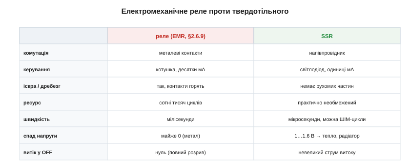
*Рис. 2.11.6.2. Електромеханічне реле (метал, котушка, контакти) проти твердотільного (напівпровідник, світлодіод). SSR виграє у швидкості, ресурсі, відсутності іскри й дребезгу; EMR — у нульовому спаді напруги, нульовому витоку в закритому стані й повному гальванічному розриві контактів.*

Сильні сторони **SSR**:

- **Немає рухомих частин** — отже, немає **дребезгу контактів** ([§2.6.9](../bjt/bjt.md)), немає іскри й вигоряння, немає механічного зносу. Ресурс практично необмежений.
- **Швидкість** — вмикається за мікросекунди, може перемикатися тисячі разів на секунду (для burst-керування нагрівом — те, що треба).
- **Тиша** — жодного клацання.
- **Мала потужність керування** — світлодіод замість котушки.

Слабкі сторони **SSR**, про які треба пам'ятати:

- **Спад напруги у відкритому стані.** Симістор у відкритому стані має спад ~1…1.6 В ([§2.11.2](ac-power-switching.md)). При струмі 10 А це **10…16 Вт тепла**, які треба кудись подіти — звідси **обов'язковий радіатор** на сильнострумних SSR. Електромеханічне реле своїми металевими контактами втрачає майже нуль.
- **Струм витоку в закритому стані.** Напівпровідник навіть «закритий» пропускає невеликий струм (одиниці міліампер) — повного розриву, як у механічних контактів, немає. Тому SSR **не можна вважати засобом аварійного відключення**: навантаження під ним усе ще «трохи під напругою».
- **Чутливість до перенапруг і dv/dt.** Силовий симістор можна пробити кидком напруги або хибно ввімкнути різким стрибком ([§2.11.8](ac-power-switching.md)) — механічним контактам це байдуже.

> 🔧 **Навіщо це.** Практичний висновок: SSR беруть, коли треба **часто** й **тихо** комутувати (нагрів із burst-керуванням, регулятори), і обов'язково рахують його **тепло** ([§2.9.4](../reading-datasheets/reading-datasheets.md)) та ставлять радіатор. Електромеханічне реле лишають там, де потрібен **справжній розрив** (аварійне відключення, безпека) або де спад і тепло SSR неприйнятні. І ще: ніколи не покладайтеся на закрите SSR як на гарантію, що навантаження знеструмлене, — там є витік.

Є й типова **відмова** SSR, про яку варто знати заздалегідь: силовий симістор найчастіше виходить з ладу **в короткому замиканні**, тобто «залипає увімкненим». Це протилежно інтуїції від механічного реле, яке при перегорянні зазвичай розмикається. Залиплий SSR продовжує живити навантаження, хоч мікроконтролер давно дав команду «вимкнути», — і якщо це нагрівач, наслідки можуть бути серйозні. Тому у відповідальних системах (нагрів, де перегрів небезпечний) за SSR ставлять **незалежний** аварійний рубіж: механічне реле або термозапобіжник, що розірве коло, навіть коли SSR залипло. Покладатися на один-єдиний напівпровідниковий ключ там, де його відмова небезпечна, — погана інженерія.

**Приклад (керування SSR прямо з мікроконтролера).** Вхід SSR — світлодіод із вбудованим джерелом струму ~10 мА, керівна напруга 3…32 В. Чи можна ввімкнути його ніжкою МК на 3.3 В безпосередньо?

```
Струм входу:      Iвх ≈ 10 мА (задано вбудованою схемою реле)
Допустимий струм
ніжки МК:         зазвичай 20…40 мА на вивід

10 мА < 20 мА → ніжка тягне вхід SSR напряму ✓
Напруга 3.3 В входить у діапазон 3…32 В ✓
```

Отже, SSR підключають до МК просто послідовним проводом (іноді з невеликим резистором для надійності) — без транзистора, без flyback-діода, без розрахунку котушки. Уся складність силового боку схована всередині реле, а логіці лишається тривіальне «подав 3.3 В — увімкнулося».

**Приклад (тепло на SSR і потреба в радіаторі).** SSR комутує нагрівач, через нього тече 12 А, спад на симісторі 1.4 В. Скільки тепла виділяється і чи потрібен радіатор?

```
Розсіювана потужність: P = Uспад × I = 1.4 В × 12 А = 16.8 Вт

16.8 Вт — це як невеликий паяльник. Без радіатора кристал
миттєво перегріється (Tj(max) зазвичай ~125 °C).

Тепловий розрахунок (як у §2.7.6 для MOSFET):
потрібен радіатор із тепловим опором, що утримає перегрів у нормі.
Орієнтовно для 16.8 Вт — масивний алюмінієвий радіатор,
часто з тепловою пастою; інколи з обдувом.
```

Майже 17 Вт тепла означають, що радіатор тут **обов'язковий** — це типова причина, чому сильнострумні SSR продають уже з металевою підошвою під радіатор. Електромеханічне реле на ті самі 12 А не гріло б майже нічого.

З тепла випливає й головне правило **вибору** SSR — щедрий запас за струмом. Номінал «40 А» на корпусі реле справедливий лише **з належним радіатором** і часто за невисокої температури довкілля; без радіатора чи в гарячому корпусі допустимий струм падає в рази (це класичний приклад **derating**, [§2.9.4](../reading-datasheets/reading-datasheets.md)). Тому для навантаження 10 А беруть реле на 25 чи 40 А — не від жадібності, а щоб і тепла було менше, і пережити пусковий кидок струму. Особливо це стосується навантажень із великим **пусковим струмом**: лампа розжарення в холодному стані має малий опір і в перші мілісекунди тягне струм у рази більший за робочий; двигун при пуску — так само. SSR має пережити цей кидок, тож його номінал орієнтують саме на пусковий, а не на сталий струм.

### Як SSR ставлять і чого від нього не чекають

Кілька практичних деталей завершують картину. **Монтаж і радіатор**: сильнострумне SSR кріплять металевою підошвою до радіатора через тонкий шар теплопровідної пасти — саме підошва відводить ті ват тепла, що ми рахували вище. Без щільного теплового контакту навіть гарний радіатор не врятує: тепло має кудись піти з кристала. **Орієнтація**: радіатор із ребрами ставлять так, щоб повітря між ребрами підіймалося вільно (ребра вертикально), інакше природна конвекція не працює.

Чого від SSR **не варто** чекати, крім уже названого витоку й тепла? По-перше, воно погано тримає **сильно реактивні** чи нелінійні навантаження без додаткових заходів — індуктивне навантаження повертає нас до dv/dt і снаберів ([§2.11.8](ac-power-switching.md)). По-друге, дешеві SSR без zero-cross або з кепською ізоляцією трапляються на ринку, і їхня «гальванічна розв'язка» може не витримати заявленої напруги — для відповідальних застосувань беруть реле з підтвердженою напругою ізоляції. По-третє, SSR **не комутує постійний струм**, якщо це AC-версія (симістор не вимкнути на DC), і навпаки. Підсумок простий: SSR — чудовий ключ у своїй ніші (часта тиха комутація змінного струму з логічним керуванням), але його межі — тепло, витік, реактивні навантаження й чітке розділення AC/DC — треба знати наперед.

### Що далі

SSR дало нам зручний ізольований ключ для побутових потужностей на симісторі чи MOSFET. Але є межа, за якою ні симістор, ні звичайний MOSFET уже не тягнуть: дуже великі струми **та** високі напруги одночасно, ще й на високих частотах перемикання — приводи двигунів, інвертори, індукційний нагрів. Там панує особливий прилад, що поєднав польове керування з біполярною провідністю. Це IGBT, і ним ми займемося далі.

> ▶️ Далі: [§2.11.7 IGBT: гібрид MOSFET і BJT](ac-power-switching.md)

## 2.11.7 IGBT: гібрид MOSFET і BJT для великих потужностей

Дотепер у силовій техніці ми мали два табори. Біполярний транзистор ([Розділ 2.6](../bjt/bjt.md)) — провідність чудова, спад малий навіть на великих струмах, але керується **струмом**, якого на потужному приладі треба багато. MOSFET ([Розділ 2.7](../mosfet/mosfet.md)) — керується **напругою**, майже задарма, але на високій напрузі його опір у відкритому стані Rds(on) ([§2.7.5](../mosfet/mosfet.md)) стає завеликим, і прилад надто гріється. А що, як **поєднати** найкраще з обох — польове керування **і** біполярну провідність? Саме це робить **IGBT** *(insulated-gate bipolar transistor — біполярний транзистор з ізольованим затвором)*.

### Польовий вхід, біполярний вихід

Назва IGBT — це майже повний опис будови. «Insulated-gate» (ізольований затвор) — це **вхід від MOSFET**: керівний електрод відділений від кристала шаром оксиду ([§2.7.2](../mosfet/mosfet.md)), тож керується прилад **напругою** й у статиці струму в затвор не споживає. «Bipolar transistor» — це **вихід від BJT**: силова частина проводить струм біполярно, з впорскуванням носіїв, як у звичайному біполярному транзисторі.

Сполучаються вони так: вхідний польовий «каскад» не сам комутує силовий струм, а лише **відмикає** внутрішній біполярний транзистор, який і несе все навантаження. Виходить прилад, яким керують легко, як MOSFET, а проводить він з малим спадом, як BJT.


*Рис. 2.11.7.1. Вхід IGBT влаштований як у MOSFET (затвор–оксид–канал, керує напруга, струм затвора ≈ 0), а силова частина проводить біполярно — з впорскуванням дірок, що дає малий спад навіть на сотнях вольт. Виводи звуть, як у біполярного: затвор (G), колектор (C), емітер (E).*

Виводи IGBT називають за біполярною частиною: **затвор** *(gate, G)* — як у MOSFET, а силові — **колектор** *(collector, C)* і **емітер** *(emitter, E)*, як у BJT. Це гарне нагадування про подвійну природу приладу: G — від польового світу, C і E — від біполярного.

Що означає «польове керування» на практиці? Те саме, що ми знаємо про MOSFET ([§2.7.7](../mosfet/mosfet.md)): затвор IGBT — це **ємність**, і керувати ним треба не струмом, а **напругою**, заряджаючи й розряджаючи цю ємність. У статиці струм у затвор не тече — тримати IGBT відкритим задарма. Але перемикати швидко означає раз у раз перезаряджати немалу ємність затвора, а для цього потрібен окремий **драйвер затвора** ([§2.7.7](../mosfet/mosfet.md)) — мікросхема, здатна видати короткі імпульси струму в кілька ампер. Просто з ніжки мікроконтролера потужний IGBT не «розгойдати»: вона не дасть струму, щоб швидко зарядити затвор, і прилад перемикатиметься мляво, перегріваючись на фронтах. Тому між логікою й затвором IGBT майже завжди стоїть драйвер — часто ще й ізольований, бо емітер силового IGBT «плаває» під мережевою напругою.

> 🔧 **Навіщо це.** IGBT розв'язує болючий компроміс силової техніки. Раніше доводилось вибирати: або легке керування (MOSFET), але з великими втратами на високій напрузі, або малі втрати (BJT), але з важким струмовим керуванням. IGBT дає **і те, і те**: затвором керують напругою (легко гнати навіть від драйвера логіки), а спад на відкритому приладі лишається малим попри сотні вольт. Тому IGBT — серце майже всієї великої силової електроніки.

### Чому біполярна провідність виграє на високій напрузі

Щоб зрозуміти, навіщо взагалі гібрид, треба згадати, чому MOSFET «здає» на високій напрузі. Аби MOSFET витримував, скажімо, 600 В, його канал мусить мати **товстий, слабо легований** збіднений шар — а саме він і створює опір. Що вища робоча напруга, то товщий шар і **тим більший Rds(on)** — зростає різко, мало не як квадрат напруги. Високовольтний MOSFET виходить «опірним» і гарячим на великому струмі.

Біполярна ж провідність працює інакше: у відкритому стані область наповнюється **впорснутими носіями обох знаків** (і електронами, і дірками — це звуть **модуляцією провідності**), і завдяки цьому навіть товстий шар проводить добре. Спад напруги на IGBT майже **не залежить** від струму так сильно, як у MOSFET, — він лишається в районі ~1.5…2.5 В у широкому діапазоні струмів. Тому на високій напрузі й великому струмі IGBT віддає набагато менше тепла, ніж MOSFET тих самих габаритів.

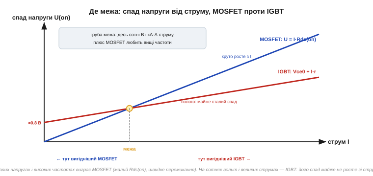
*Рис. 2.11.7.2. У MOSFET спад U = I·Rds(on) — пряма від нуля, що круто росте зі струмом (особливо у високовольтних). У IGBT спад починається з порогу ~0.8 В, але далі майже не росте. Тому на малих струмах вигідніший MOSFET (нема початкового порогу), а на великих — IGBT (спад не злітає).*

### Де проходить межа MOSFET / IGBT

З двох кривих на рисунку випливає проста картина вибору. На **малих** струмах MOSFET кращий: його спад починається з нуля, тоді як IGBT має «вступний внесок» ~0.8 В, який треба сплатити завжди. Але зі зростанням струму пряма MOSFET круто йде вгору й перетинає пологу криву IGBT — і далі IGBT вже вигідніший. Додаймо ще напругу й частоту — і межа окреслюється так:

- **MOSFET** панує там, де **нижча напруга** (приблизно до кількох сотень вольт) і **вищі частоти** перемикання (десятки кГц і вище). Він перемикається швидше й чисто, бо не має повільного «хвоста» вимикання.
- **IGBT** панує там, де **висока напруга** (сотні вольт — кіловольти) **і** великий струм одночасно, а частоти помірні (одиниці — десятки кГц). Це приводи двигунів, інвертори сонячних станцій, зварювальні апарати, індукційні плити, тягові перетворювачі електротранспорту.

Варто згадати, що ця межа останніми роками **зрушується**. З'явилися силові ключі на **широкозонних напівпровідниках** — карбіді кремнію *(SiC)* і нітриді галію *(GaN)* — замість звичайного кремнію. Їхня перевага саме там, де кремнієвий MOSFET «здавав»: вони тримають високу напругу з малим опором і перемикаються швидко й чисто. Фактично SiC-MOSFET відвойовує в IGBT частину його території — високовольтні застосування на підвищених частотах (зарядні станції електромобілів, сонячні інвертори), де він дає вищий ККД. Це нагадування, що «межа MOSFET/IGBT» — не закон природи, а інженерний компроміс **для конкретних матеріалів**: зміниться матеріал — зміститься й межа. Кремнієвий поділ, який ми описали, лишається базовим орієнтиром, але світ силових приладів не стоїть на місці.

Чому IGBT не любить дуже високих частот? Бо біполярна провідність має зворотний бік: при вимиканні впорснуті носії не зникають миттєво — лишається **«хвіст струму»** *(tail current)*, що тягнеться ще якийсь час і додає втрат на кожному перемиканні. На низьких частотах це дрібниця, на дуже високих — суттєвий нагрів. MOSFET такого хвоста не має, тому й виграє на високих частотах.

Тут варто розрізнити два роди втрат, бо саме їхній баланс і визначає межу. **Втрати провідності** *(conduction losses)* — це тепло, поки ключ відкритий (спад напруги × струм); вони залежать від навантаження, а не від частоти. **Втрати перемикання** *(switching losses)* — це енергія, що згоряє на кожному фронті вмикання й вимикання, поки напруга й струм на ключі одночасно ненульові; вони множаться на **частоту**, бо що частіше перемикаєш, то більше таких фронтів за секунду. У IGBT втрати провідності малі (біполярна перевага), зате втрати перемикання великі (хвіст струму). У MOSFET навпаки: провідність на високій напрузі дорога, зате перемикання чисте й швидке. Тому на низьких частотах перемагає той, у кого менші втрати провідності (IGBT на високій напрузі), а на високих — той, у кого менші втрати перемикання (MOSFET). Межа MOSFET/IGBT — це, по суті, точка, де ці дві статті витрат міняються місцями.

Ще одна деталь, без якої IGBT у мережі не працює, — **зворотний (антипаралельний) діод** *(freewheeling diode)*. Сам по собі IGBT, як і біполярний транзистор, проводить лише в один бік. А в інверторах і приводах навантаження майже завжди індуктивне (обмотки двигуна), і струму котушки треба десь текти в проміжках, коли ключ закритий, — інакше викид напруги (V = L·di/dt, [§2.2.5](../inductor/inductor.md)) пробив би прилад. Тому паралельно кожному IGBT ставлять швидкий діод, що дає струмові котушки замкнутий шлях. У силових модулях цей діод уже вбудований поруч із кристалом IGBT — так само, як body-діод «вшито» в кожен MOSFET ([§2.7.2](../mosfet/mosfet.md)), тільки тут його додають навмисно й роблять швидким.

> 🔧 **Навіщо це.** Коли проєктувальник бачить «300 В, 50 А, привід двигуна» — він тягнеться до IGBT; коли «48 В, 30 А, перетворювач на 100 кГц» — до MOSFET. Це не питання «що сучасніше», а питання робочої точки: напруга, струм і частота разом вказують, чий компроміс вигідніший. Знати цю межу — означає не ставити дорогий IGBT туди, де чудово впорається MOSFET, і навпаки.

Де ми зустрічаємо IGBT у житті? Майже скрізь, де велика потужність бере свій початок із мережі або з високовольтної батареї. **Частотні перетворювачі** *(inverters)*, що керують швидкістю асинхронних двигунів на заводах, — це батареї IGBT, які «нарізають» постійну напругу на потрібну змінну. **Зварювальні апарати**, **індукційні плити**, **джерела безперебійного живлення** — теж IGBT. Найвидовищніше — **електротранспорт**: тягові перетворювачі електропоїздів, трамваїв і електромобілів живлять двигуни сотнями ампер при сотнях вольт, і саме IGBT (часто в масивних модулях із вбудованими діодами й датчиками) тягнуть цей струм. Коли потяг плавно набирає хід під ледь чутне виття — це перемикаються IGBT тягового інвертора. Малопотужна ж електроніка, навпаки, IGBT майже не використовує: там панує MOSFET.

Історія появи IGBT — окрема й повчальна: над ним майже одночасно працювали кілька груп (RCA, Stanford, General Electric, Toshiba), а батьківство приладу й досі предмет суперечок. Її варто прочитати в [📜 окремій вставці](hist-igbt-baliga.md) — там і про те, як IGBT зрештою «сів за кермо» електропоїздів і електромобілів.

**Приклад (вибір ключа за втратами).** Інвертор працює від 400 В, комутує 40 А. Порівняємо втрати провідності у високовольтному MOSFET (Rds(on) = 0.1 Ом) і в IGBT (спад 2.0 В).

```
MOSFET: Pпров = I² · Rds(on) = 40² × 0.1 = 1600 × 0.1 = 160 Вт (!)

IGBT:   Pпров = Uспад · I    = 2.0 × 40             = 80 Вт

Висновок: на 40 А високовольтний MOSFET віддає вдвічі більше тепла.
А на 400 В Rds(on) MOSFET ще й зростає з напругою —
реальна різниця ще більша на користь IGBT.
```

При таких струмі й напрузі IGBT очевидно вигідніший: 80 Вт проти 160 Вт — це вдвічі менший радіатор і вищий ККД. Якби струм був, скажімо, 3 А, картина перевернулася б: MOSFET дав би 0.9 Вт проти 6 Вт IGBT — і тоді вибрали б MOSFET.

### Що далі

IGBT закрив верхній край силової шкали — великі напруги й струми. Тепер повернімося до проблеми, спільної для всіх ключів змінного струму, надто на індуктивному навантаженні: різкий стрибок напруги здатен **увімкнути симістор сам по собі**, без жодної команди. Чому так стається і як від цього захищаються снабером — остання технічна тема перед розмовою про безпеку.

> ▶️ Далі: [§2.11.8 Снабери й dv/dt](ac-power-switching.md)

## 2.11.8 Снабери й dv/dt: чому симістор самовмикається

Уявімо прикру несправність: симістор у схемі вмикається **сам**, без жодного імпульсу на затворі. Навантаження то вмикається невпопад, то взагалі не вимикається. Особливо часто це трапляється на **індуктивному** навантаженні — двигуні, трансформаторі, котушці клапана. Причина не в поломці, а у фундаментальній властивості приладу: симістор реагує не лише на струм затвора, а й на **швидкість зміни напруги** на ньому. Розберемо це явище й захист від нього.

### Звідки береться небезпечний стрибок напруги

Згадаймо, що на індуктивному навантаженні **струм відстає від напруги** ([§2.3.4](../reactance-resonance/reactance-resonance.md)): коли напруга мережі вже пройшла нуль і росте, струм ще тільки доганяє. А тепер сполучімо це з тим, як гасне симістор ([§2.11.2](ac-power-switching.md)): він закривається, коли **струм** падає нижче утримуючого. На індуктивному навантаженні струм проходить нуль **пізніше** за напругу — отже, у момент, коли симістор гасне (струм = 0), напруга мережі **вже встигла відійти від нуля** й має помітне значення.

І ось що відбувається: щойно симістор закрився, до нього **миттєво** прикладається ця ненульова напруга мережі. Виникає різкий **стрибок напруги** на закритому приладі — велика **швидкість зміни напруги**, яку позначають **dv/dt** *(швидкість наростання напруги, вольт за мікросекунду)*.

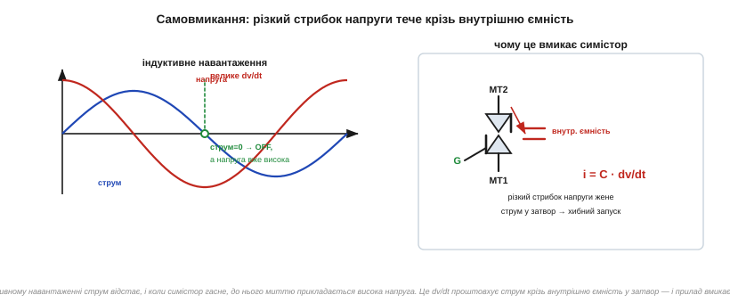
*Рис. 2.11.8.1. Зліва: на індуктивному навантаженні струм відстає від напруги; коли симістор гасне (струм = 0), напруга мережі вже велика → до приладу різко прикладається висока напруга (велике dv/dt). Справа: цей стрибок жене струм крізь внутрішню ємність приладу прямо в затвор (i = C·dv/dt) — і симістор хибно вмикається сам.*

### Механізм самовмикання: i = C·dv/dt

Чому стрибок напруги вмикає прилад? Бо всередині симістора, як і будь-якого напівпровідникового переходу, є **паразитна ємність** ([§2.5.3](../diode-pn-junction/diode-pn-junction.md)) — зокрема між силовим виводом і затвором. А через будь-яку ємність протікає струм, пропорційний **швидкості зміни напруги** на ній ([§2.1.2](../capacitor/capacitor.md)):

```
i = C · dv/dt
```

Якщо dv/dt досить велике, цей ємнісний струм, потрапляючи в затвор, виявляється **достатнім, щоб запустити защіпку** — так само, як зробив би справжній імпульс керування. Прилад вмикається «думаючи», що отримав команду, хоча насправді це лише наслідок різкого стрибка напруги. Звідси й параметр у даташиті — **критичне dv/dt** *(critical rate of rise of off-state voltage)*: максимальна швидкість наростання напруги, яку прилад витримає, **не** ввімкнувшись.

> 🔧 **Навіщо це.** Це пояснює одну з найзагадковіших несправностей у силовій електроніці: «симістор вмикається сам, особливо коли навантаження індуктивне». Новачок шукає поломку або наводку, а причина — фізична: dv/dt у момент природного вимикання. Знаючи механізм i = C·dv/dt, інженер не «бореться з привидом», а ставить снабер — і проблема зникає. Те саме dv/dt, до речі, загрожує й силовому ключу в SSR ([§2.11.6](ac-power-switching.md)).

### RC-снабер: сповільнити стрибок

Захист від dv/dt — **снабер** *(snubber)*: найчастіше це послідовне з'єднання **резистора й конденсатора** *(RC-снабер)*, увімкнене **паралельно** силовому ключу. Ідея проста й спирається прямо на властивість конденсатора: **напруга на конденсаторі не може змінитися стрибком** ([§2.1.4](../capacitor/capacitor.md)). Підключивши конденсатор паралельно симістору, ми **не даємо напрузі на приладі підскочити миттєво** — вона тепер наростає плавно, поки заряджається C. Тобто dv/dt **зменшується** до безпечного рівня.

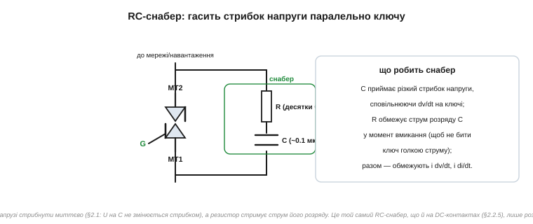
*Рис. 2.11.8.2. RC-снабер (резистор послідовно з конденсатором) увімкнено паралельно симістору. Конденсатор приймає різкий стрибок напруги, сповільнюючи dv/dt на ключі; резистор обмежує струм розряду конденсатора в момент вмикання, щоб той не вдарив ключ голкою струму. Разом вони стримують і dv/dt, і di/dt.*

Навіщо в снабері **резистор**, чому не самий конденсатор? Бо коли симістор усе ж вмикається (за командою), заряджений конденсатор снабера **розрядиться** крізь нього — і без обмеження це був би різкий кидок струму (велике di/dt), здатний пошкодити ключ. Резистор обмежує цей розрядний струм. Виходить розумний компроміс: конденсатор гасить **стрибок напруги** при вимиканні, резистор гасить **кидок струму** при вмиканні. Типові номінали для мережі — конденсатор близько 0.1 мкФ і резистор у десятки ом, обов'язково на мережеву напругу.

Тут є тонкий баланс, який варто розуміти, а не лише запам'ятати номінали. **Більший** конденсатор сильніше згладжує dv/dt (краще захищає від самовмикання), але водночас запасає більше заряду, який при вмиканні вдарить крізь резистор у ключ. **Менший** резистор краще гасить кидок напруги, але гірше стримує розрядний струм. Тож снабер — це завжди компроміс між захистом від dv/dt (хочеться більше C, менше R) і захистом від di/dt розряду (хочеться більше R). Класичні «0.1 мкФ + кілька десятків ом» — це усереднена точка, що годиться для більшості побутових навантажень; для конкретного приладу й струму номінали уточнюють розрахунком за параметрами з даташита (критичні dv/dt і di/dt).

Ще важливо, **де** снабер фізично стоїть. Підключати його треба **прямо до виводів симістора**, короткими провідниками: якщо снабер віднести від ключа довгими доріжками, їхня власна паразитна індуктивність ([§2.2.2](../inductor/inductor.md)) зведе нанівець захист — стрибок напруги встигне «вистрелити» на самому ключі, перш ніж дійде до віддаленого конденсатора. Те саме правило ми вже зустрічали з розв'язувальними конденсаторами «біля кожної ніжки живлення» ([§2.1.6](../capacitor/capacitor.md)): захисний елемент діє лише там, де він **поруч**.

### Один знайомий механізм — два прояви

Варто помітити, що снабер ми вже зустрічали — у [§2.2.5](../inductor/inductor.md), коли гасили **іскру на контактах** при комутації індуктивного навантаження **постійного** струму. Там механізм був дзеркальний: розмикання котушки давало стрибок напруги (V = L·di/dt), що пробивав іскрою контакти, і RC-снабер поглинав цей викид. Тут, у мережі змінного струму, снабер бореться не з іскрою на механічних контактах, а із **самовмиканням напівпровідникового ключа** від dv/dt. Але **фізична ідея та сама**: конденсатор не дає напрузі стрибнути, резистор стримує струм його розряду.

Різниця лише в тому, **проти чого** ми захищаємось. На **DC-контактах** ([§2.2.5](../inductor/inductor.md)) ворог — іскра, що випалює метал. У **мережі AC** ворог — хибне вмикання ключа стрибком напруги. Снабер — спільна відповідь на обидві біди, бо обидві біди — це той самий різкий стрибок напруги на щойно розімкненому ключі з індуктивним навантаженням позаду.

Корисно побачити, що «снабер» — це ширша ідея, ніж один конкретний RC-вузол. Будь-де, де **різка зміна** напруги чи струму загрожує приладу, ставлять елемент, що цю зміну **сповільнює або поглинає**: конденсатор проти стрибка напруги (бо U на ньому не скаче, §2.1.4), котушка проти стрибка струму (бо I в ній не скаче, §2.2.2), резистор, щоб розсіяти запасену енергію в тепло. RC-снабер симістора, RC на DC-контактах, flyback-діод на котушці реле ([§2.5.9](../diode-pn-junction/diode-pn-junction.md)), TVS на вході ([§2.5.8](../diode-pn-junction/diode-pn-junction.md)) — усе це різні втілення однієї думки: **гасити різкі перехідні процеси біля джерела**. Зрозумівши снабер тут, ви впізнаєте його родичів у будь-якій силовій схемі.

А що з різким **наростанням струму** при вмиканні — di/dt? Тиристор і симістор бояться не лише стрибка напруги, а й надто швидкого зростання струму на старті провідності: струм спершу тече лише через крихітну ділянку кристала біля затвора, і якщо він наростає блискавично, ця ділянка перегрівається й вигоряє, перш ніж провідність встигне розповзтися по всьому кристалу. Захист дзеркальний до снабера напруги — невелика **котушка послідовно** з ключем: вона не дає струмові стрибнути миттєво (V = L·di/dt стримує наростання). У м'яких мережевих схемах власної індуктивності проводів і навантаження зазвичай вистачає, тож окрему котушку di/dt ставлять лише в жорстких силових перетворювачах; але знати про обидва боки — і dv/dt, і di/dt — корисно.

> 🔧 **Навіщо це.** Снабер — обов'язковий елемент будь-якої схеми з симістором на **індуктивному** навантаженні (двигун, трансформатор, котушка). Без нього прилад вмикатиметься сам і поводитиметься непередбачувано. Для резистивного навантаження снабер часто не потрібен — там струм і напруга збігаються у фазі, і стрибка при вимиканні нема. Тому в даташитах симісторів є окремий клас **«snubberless»** *(без снабера)* — приладів із підвищеною стійкістю до dv/dt, спеціально для індуктивних навантажень; але навіть із ними снабер часто лишають для надійності.

Як розпізнати, що в реальній схемі коїться саме самовмикання від dv/dt, а не щось інше? Є кілька характерних ознак. Проблема з'являється або посилюється **на індуктивному навантаженні** (двигун, трансформатор, котушка клапана) і зникає на резистивному (лампа розжарення, нагрівач). Симістор вмикається **сам**, без команди від мікроконтролера, причому часто саме в момент, коли навантаження мало б вимикатися. Додавання RC-снабера паралельно ключу проблему усуває. Якщо всі три ознаки збігаються — діагноз майже певний: це dv/dt. Новачок у такій ситуації часто підозрює збій програми чи наводку на лінію керування й місяцями шукає не там; знання механізму i = C·dv/dt одразу скеровує до правильного рішення — снабер або snubberless-симістор. Це гарний приклад того, як розуміння **фізики** приладу економить дні налагодження.

**Приклад (оцінка ефекту снабера).** Симістор без снабера бачить стрибок напруги 200 В за 1 мкс при вимиканні. Його критичне dv/dt — 50 В/мкс. Чи ввімкнеться він сам, і як допоможе конденсатор 0.1 мкФ?

```
Без снабера: dv/dt = 200 В / 1 мкс = 200 В/мкс
             200 В/мкс > 50 В/мкс (критичне) → САМОВМИКАННЯ ✗

Зі снабером (грубо): конденсатор розтягує наростання.
Якщо снабер сповільнить фронт, скажімо, до 20 В/мкс:
             20 В/мкс < 50 В/мкс → ключ НЕ вмикається сам ✓
```

Снабер «розмазав» різкий стрибок у часі — і dv/dt упало нижче критичного. Симістор тепер вимикається коректно й більше не запускається сам. (Точний підбір номіналів — за струмом навантаження й параметрами приладу; тут показано лише принцип.)

Наостанок — про **snubberless-симістори**, бо назва обманлива. Вона не означає, що такий прилад узагалі не потребує захисту від dv/dt; вона означає, що його зроблено **стійкішим до dv/dt зсередини** — підвищили критичне dv/dt самого кристала, тож для багатьох індуктивних навантажень зовнішній снабер уже не обов'язковий. Досягають цього особливою геометрією кристала, яка гірше «ловить» ємнісний струм у затвор. Це зручно: менше деталей, менша плата. Але межа в нього все одно є, і в жорстких умовах (дуже швидкі стрибки, сильна індуктивність) снабер додають навіть до snubberless-приладу. Тобто «snubberless» — це «зазвичай можна без снабера», а не «снабер не діє». Розуміючи механізм, ви легко вирішите, коли можна заощадити деталь, а коли краще не ризикувати.

### Що далі

Ми закрили технічну частину розділу: від чому-не-можна-транзистор аж до снаберів, що рятують ключ від самовмикання. Лишилося найважливіше — те, що стоїть **над** усією технікою й чого не можна вивчати між іншим: **безпека** роботи з мережею. Сотні вольт не пробачають недбалості, тож остання тема — про правила, прилади й звички, які тримають розробника живим.

> ▶️ Далі: [§2.11.9 Безпека робіт із мережею](ac-power-switching.md)

## 2.11.9 Безпека робіт із мережею

Усі попередні теми були про те, **як** комутувати мережу. Ця тема — про те, як при цьому **лишитися неушкодженим**. Це не формальність і не «розділ для галочки»: між макеткою з батарейкою і схемою в розетці лежить якісна прірва. Батарейка на 5 В у найгіршому разі зіпсує компонент; мережа на 230 В у найгіршому разі **вбиває**. Тому культуру безпеки треба засвоїти **до** того, як уперше торкнутися мережевої схеми, а не після першого удару струмом. Зберемо тут усе, що стосується безпеки, в одне місце.

### Чому мережа смертельна: справа в струмі крізь тіло

Перше, що треба зрозуміти: убиває не «напруга сама по собі», а **струм, що проходить крізь тіло**, надто крізь серце. Тіло людини між мокрими руками має опір порядку кількох кілоом; за законом Ома ([§1.3](../../block-1-circuits-physics/resistance-power-heat/resistance-power-heat.md)) напруга мережі здатна прогнати крізь нього струм у **десятки міліампер**. А вже **~30 мА**, що тече крізь грудну клітку, може спричинити **фібриляцію серця** — хаотичне тремтіння, яке не жене кров. Це смертельно. Для порівняння: світлодіод ми живили струмом 10…20 мА — тобто струм, безпечний для світлодіода, проходячи крізь серце, лежить уже біля смертельної межі.

Звідси випливає вся подальша логіка безпеки: треба або **не дати** мережевій напрузі дістатися до людини (ізоляція, рубежі захисту), або, якщо контакт усе ж стався, **не дати** струму пройти крізь серце (правило однієї руки).

Корисно тримати в голові й грубу шкалу впливу струму крізь тіло, щоб розуміти, чому межі саме такі. Близько **1 мА** — поріг відчуття, легке поколювання. Близько **10 мА** — м'язи руки судомить так, що людина **не може розтиснути** долоню й відпустити провід (звідси й правило хапати підозрілий провід тилом руки, а не долонею). Близько **30 мА** крізь грудну клітку — поріг фібриляції серця, далі небезпека для життя. Сотні міліампер — опіки й зупинка серця. Як ми вже прикидали, мережа здатна прогнати крізь мокрі руки **понад сто** міліампер — тобто вона із запасом перекриває смертельний поріг. Тому до неї ставляться зовсім не так, як до 5 В на макетці.

### Рубежі захисту: ізоляція, запобіжник, варистор

Між розеткою й крихкою логікою має стояти не один, а **кілька рубежів** захисту, кожен від своєї біди.

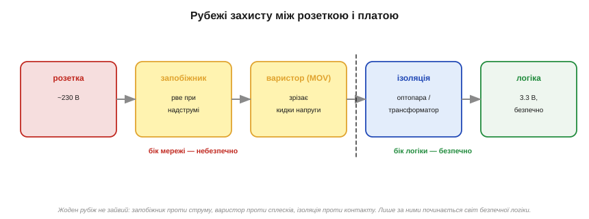
*Рис. 2.11.9.1. Послідовні рубежі: запобіжник (проти надструму) → варистор (проти кидків напруги) → гальванічна ізоляція (проти контакту з мережею) → і лише за ними починається безпечна логіка на 3.3 В. Зліва від бар'єра ізоляції — небезпечний бік мережі, справа — безпечний бік керування.*

**Гальванічна розв'язка скрізь** ([§2.11.1](ac-power-switching.md)). Це головне правило: між мережею й усім, чого торкається людина чи що з'єднане з комп'ютером, мусить бути ізоляційний бар'єр — оптопара, трансформатор чи ізольований модуль. Сторона логіки **ніколи** не повинна мати спільної міді з мережею. Саме тому всі прилади цього розділу несуть розв'язку всередині.

**Запобіжник** *(fuse)* — захист від **надструму**. Це тонка плавка вставка, що згоряє й розриває коло, коли струм перевищує норму (коротке замикання, пробій ключа). Запобіжник ставлять **першим**, одразу від фази, — щоб будь-яка аварія в схемі знеструмила її, а не спричинила пожежу. Він захищає не стільки прилад, скільки **проводку й людину** від наслідків короткого замикання.

**Варистор** *(MOV, metal-oxide varistor)* — захист від **перенапруги**. Це прилад, опір якого **різко падає**, коли напруга на ньому перевищує поріг. У нормі варистор «невидимий» (величезний опір, струму нема), але щойно прилітає кидок напруги — від блискавки, від комутації потужного сусіднього навантаження — варистор миттю «коротить» його, поглинаючи енергію сплеску й не пускаючи його далі в схему. Ставлять варистор паралельно входу, зазвичай **за** запобіжником, щоб у разі сильного кидка варистор «закоротив» його, а запобіжник тоді розірвав коло. Поводиться варистор, по суті, як двобічний аналог TVS-діода ([§2.5.8](../diode-pn-junction/diode-pn-junction.md)), тільки на куди більші енергії й напруги мережі.

**Захисне заземлення й пристрій захисного вимкнення.** У стаціонарних приладах є ще два рубежі, які варто згадати, бо вони рятують саме людину. Третій провід — **захисне заземлення** *(protective earth, PE)* — з'єднує металевий корпус приладу із землею; якщо фаза через пробій торкнеться корпусу, струм піде в землю, а не чекатиме, поки його замкне людина. А **пристрій захисного вимкнення** *(ПЗВ; RCD / GFCI)* стежить за тим, чи струм, що **витік** у фазу, повністю **повертається** нейтраллю. Якщо частина струму «зникла» (потекла кудись повз — наприклад, крізь людину в землю), різниця навіть у ~30 мА змушує ПЗВ за мілісекунди розірвати коло. Це останній автоматичний рубіж, що рятує життя при прямому дотику, — і саме на той поріг ~30 мА, що ми назвали небезпечним для серця.

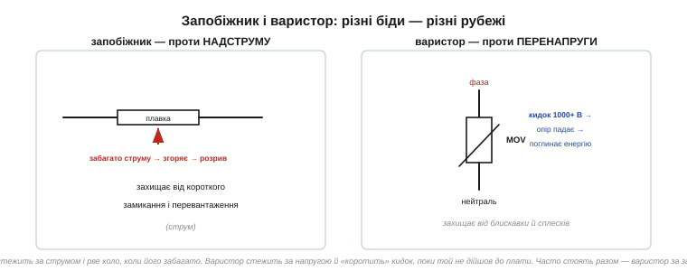
*Рис. 2.11.9.2. Дві різні біди — два різні рубежі. Запобіжник стежить за струмом і рве коло, коли струму забагато (коротке замикання). Варистор стежить за напругою й «коротить» кидок, поки той не дійшов до схеми (блискавка, сплеск). Часто стоять разом: варистор за запобіжником.*

> 🔧 **Навіщо це.** Ці три рубежі — не взаємозамінні, кожен ловить свою аварію. Запобіжник не захистить від стрибка напруги (струм іще в нормі), варистор не захистить від повільного перевантаження (напруга в нормі), а ізоляція не захистить від пожежі при короткому. Тому в будь-якому мережевому пристрої вони стоять **разом**: запобіжник + варистор на вході, гальванічна розв'язка перед логікою. Проєктуючи мережевий вузол, перевір, що є всі три.

Кілька слів про **фізичне** виконання, бо безпека — це не лише схема, а й конструкція. Мережеву частину розміщують **окремо** від низьковольтної, із чіткою «лінією поділу» на платі; між доріжками «гарячого» боку й боку логіки витримують достатній **повітряний і поверхневий зазор** (бо інакше висока напруга «перестрибне» по поверхні плати чи крізь повітря). Усе, що під мережею, ховають у **корпус**, який не дає торкнутися струмовідних частин пальцем. Запобіжник ставлять у тримач, доступний для заміни, але не для випадкового дотику. Ці конструктивні правила здаються нудними, доки не згадаєш, що саме вони стоять між пальцем користувача й трьомастами вольтами. Гарна мережева схема й погана конструкція разом дають небезпечний прилад.

### Правило однієї руки

Останній рубіж — коли всі інші не спрацювали і ви все ж опинилися біля **живої** схеми (наприклад, налагоджуєте її під напругою). Тут діє **правило однієї руки** *(one-hand rule)*: працювати з мережею **лише однією рукою**, а другу тримати за спиною або в кишені.

Логіка проста й випливає прямо з того, що вбиває струм крізь серце. Якщо торкнутися мережі **двома** руками — однією фази, іншою чогось заземленого, — струм піде **від руки до руки**, тобто **через грудну клітку й серце**. Це найнебезпечніший шлях. Якщо ж працювати **однією** рукою, то навіть випадковий дотик замкне коло хіба що через ту саму руку (або зовсім не замкне) — і струм не пройде поперек грудей.

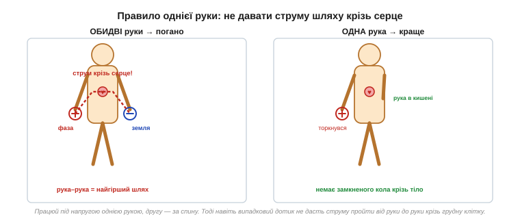
*Рис. 2.11.9.3. Зліва — обидві руки на схемі: дотик фази однією рукою й землі іншою замикає струм через серце (найгірший шлях). Справа — одна рука працює, друга за спиною: навіть випадковий дотик не створює кола крізь грудну клітку. Звідси й правило: під напругою — лише однією рукою.*

До правила однієї руки додають здоровий набір звичок: **знеструмлювати** схему перед будь-якою правкою (а не правити «на гарячу»); пам'ятати, що **конденсатори** на вході можуть лишатися зарядженими й після вимкнення ([§2.1.6](../capacitor/capacitor.md)) — їх розряджають перед роботою; не працювати з мережею **наодинці**; стояти на сухому й не торкатися заземлених предметів вільною рукою.

Окремо варто наголосити на **конденсаторах**, бо це найпідступніша пастка для того, хто звик до низьковольтних схем. У блоці живлення після діодного мосту стоїть великий згладжувальний конденсатор ([§2.5.6](../diode-pn-junction/diode-pn-junction.md)), заряджений до піка мережі — ~325 В. Вимкнули прилад із розетки — а конденсатор **тримає** ці 325 В іще секунди чи хвилини, бо розряджатися йому нікуди (стала часу RC може бути великою, [§2.1.4](../capacitor/capacitor.md)). Людина, упевнена, що «прилад вимкнено, отже безпечно», лізе всередину — і отримує удар від зарядженого конденсатора. Саме тому у відповідальних блоках ставлять **bleeder-резистор** — резистор, що повільно розряджає конденсатор після вимкнення; а перед роботою конденсатор додатково розряджають вручну через резистор (не закорочуючи навпростець — заряджений конденсатор дасть іскру й може вибухнути). «Вимкнено з розетки» ≠ «безпечно»: спершу переконайся, що велика ємність розряджена.

> 🔧 **Навіщо це.** Усі ці звички коштують нуль і не потребують жодної деталі — це просто **порядок дій**: знеструмив → розрядив конденсатори → перевірив, що напруги нема → працюєш однією рукою. Інженер, що зробив цей порядок автоматичним, працює з мережею роками без пригод. Той, хто «зекономить» один крок («та воно ж вимкнене»), рано чи пізно знаходить заряджений конденсатор або не ту фазу. Безпека з мережею — це не страх, а дисципліна послідовності.

> 🔧 **Навіщо це.** Правило однієї руки — це остання лінія оборони, коли техніка вже не рятує (схема жива, ізоляцію знято для налагодження). Воно безкоштовне, його не треба паяти — це просто звичка тримати другу руку подалі. Разом зі знеструмленням перед правкою й розрядом конденсаторів це ті кілька навичок, що відрізняють інженера, який роками працює з мережею, від того, кого вдарило на першому ж тижні. Засвойте їх раніше, ніж знадобляться.

**Приклад (чому 230 В небезпечні, а 5 В — ні).** Порівняємо струм крізь тіло (опір рук ≈ 2 кОм) від мережі й від логічного джерела.

```
Від мережі 230 В:   I = U / R = 230 / 2000 = 0.115 А = 115 мА
                    115 мА ≫ 30 мА (поріг фібриляції) → СМЕРТЕЛЬНО

Від джерела 5 В:    I = U / R = 5 / 2000 = 0.0025 А = 2.5 мА
                    2.5 мА — ледь відчутно, безпечно

Та сама людина, та сама рука — різниця лише в напрузі джерела,
але наслідок протилежний. Ось чому мережа вимагає іншої культури.
```

Той самий дотик, що від батарейки не дає навіть поколювання, від мережі жене крізь тіло струм, який у рази перевищує смертельний поріг. Уся ця тема — про те, щоб такого дотику **ніколи не сталося**, а якщо станеться — щоб струм не пройшов крізь серце.

### Підсумок розділу

Ми пройшли весь шлях силової комутації змінного струму. Почали з того, **чому** звичайні транзистори безсилі перед мережею: вона двополярна, висока за напругою й вимагає ізоляції ([§2.11.1](ac-power-switching.md)). Далі — **тиристор** як защіпка, що вмикається імпульсом і гасне сама в нулі струму ([§2.11.2](ac-power-switching.md)), і **симістор**, що охоплює обидві півхвилі одним затвором ([§2.11.3](ac-power-switching.md)). Навчилися регулювати потужність **фазово** ([§2.11.4](ac-power-switching.md)) і чистіше — **в нулі** напруги ([§2.11.5](ac-power-switching.md)). Зустріли **SSR** як готовий ізольований ключ ([§2.11.6](ac-power-switching.md)) і **IGBT** для великих потужностей ([§2.11.7](ac-power-switching.md)), розібрали **снабери** проти самовмикання ([§2.11.8](ac-power-switching.md)) — і завершили **безпекою**, без якої все попереднє небезпечне. Тепер мережа з її сотнями вольт — уже не загадковий і страшний світ, а керована частина системи, до якої є правильний інструмент і правильні правила.

> ▶️ Далі: [Розділ 2.12 — Легендарні аналогові ІМС](../legendary-analog-ics/legendary-analog-ics.md)
