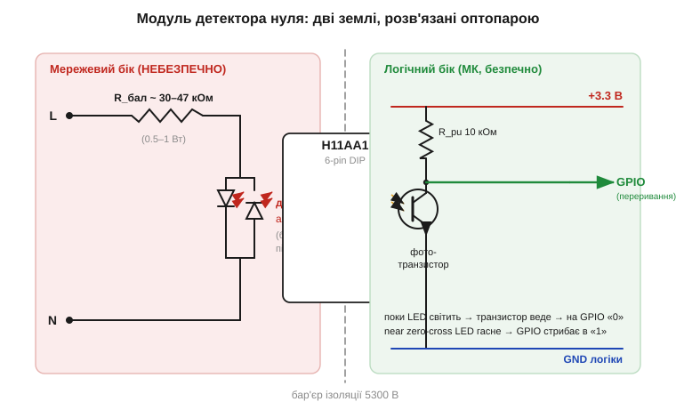
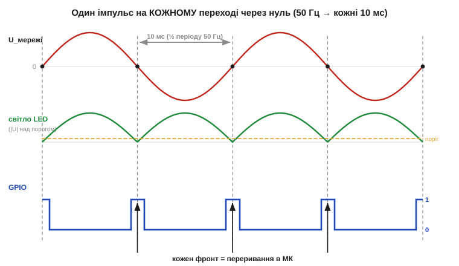

# 🔌 Модуль детектора нуля: оптопара H11AA1-класу як годинник мережі

> Це компонентна вставка до теми [2.11.5 «Перехід через нуль»](ac-power-switching.md). Тема пояснює, **навіщо** ловити момент, коли мережева синусоїда проходить через нуль. Тут — про конкретну цеглинку, якою цей момент ловлять у реальних платах: маленький модуль на оптопарі з **двонапрямленим входом** (H11AA1-клас). Він під'єднується прямо до мережі, та віддає мікроконтролеру чистий логічний імпульс **щопівперіоду** — той самий «тик», від якого все фазове керування й рахує час. Пройдемо клас пристрою, блок-схему, розпіновку, підключення, «перший байт» у прошивці й типові граблі.

### Клас пристрою: оптопара, що бачить обидві півхвилі

Звичайна оптопара на кшталт PC817 ([§2.5.10](../diode-pn-junction/diode-pn-junction.md)) має на вході **один** світлодіод. Подаси на нього змінну напругу — він засвітиться лише на тій півхвилі, що збігається з його полярністю, а в зворотну півхвилю не лише мовчить, а й ризикує пробитися: світлодіоди погано тримають зворотну напругу. Для мережі це нікуди не годиться: синусоїда ([§1.7](../../block-1-circuits-physics/ac-signals/ac-signals.md)) симетрично гойдається в обидва боки.

H11AA1-клас розв'язує це одним конструктивним ходом: на вході стоять **два світлодіоди, увімкнені зустрічно-паралельно** (*inverse-parallel*) — анод одного до катода іншого. Куди б не текла півхвиля, один зі світлодіодів завжди ввімкнений «у правильний бік» і світить, а другий його ж і захищає, перебираючи на себе зворотну напругу. Тому вхід **байдужий до полярності** (*AC / polarity insensitive input*) і має **вбудований захист від зворотної напруги** — рівно те, що треба, щоб дивитися на мережу напряму. Світло обох діодів падає на один спільний фототранзистор на боці логіки.

> 🔧 **Навіщо це.** H11AA1 — це «давач присутності напруги» через ізоляцію: поки на вході є достатня змінна напруга, фототранзистор веде; коли вона падає до нуля — на мить гасне. Саме ця мить гасіння й дає мікроконтролеру відмітку нуля, не з'єднуючи його з мережею жодним мідним дротом.

### Блок-схема модуля

Сама оптопара ще не годиться, щоб приставити її до мережі: їй потрібне скромне оточення. Готовий модуль детектора нуля — це сама оптопара плюс кілька пасивних деталей довкола неї. Усе зведено так, щоб з одного боку були дві мережеві клеми, а з іншого — три виводи до плати: живлення, земля й сигнал.


*Рис. 2.11.5c.1. Зліва (червона зона) — мережевий бік: баластний резистор обмежує струм, дві зустрічно-паралельні LED світять по черзі щопівхвилі. Праворуч (зелена зона) — бік логіки: фототранзистор із підтягувальним резистором до 3.3 В. Між ними — фізичний бар'єр ізоляції (десятки сотень вольт витримки). Поки LED світить, транзистор притягує вивід до «0»; коло нуля LED гасне — вивід стрибає в «1».*

Ключова деталь на мережевому боці — **баластний (обмежувальний) резистор** послідовно зі світлодіодами. Світлодіоду треба лише кілька міліампер, а в мережі сотні вольт ([§1.7](../../block-1-circuits-physics/ac-signals/ac-signals.md)), тож резистор гасить майже всю напругу. Звідси й типові номінали: десятки кілоом і потужність 0.5–1 Вт, бо на резисторі розсіюється помітне тепло. На боці логіки все знайоме з [§2.5.10](../diode-pn-junction/diode-pn-junction.md): фототранзистор працює ключем, а **підтягувальний резистор** (*pull-up*, типово 10 кОм) задає логічну «1», коли транзистор закритий.

### Розпіновка

Щоб зібрати таке оточення самотужки чи розібратися в готовій платі, треба знати, де в оптопари що. Сама мікросхема H11AA1 — це шестививідний корпус DIP-6. Виводи розкидані звичним для оптронів чином: вхід ліворуч, вихід праворуч.

```
            H11AA1 (DIP-6), вид зверху
        ┌───────────────────────────┐
 LED ──1│ анод/катод            C  6│── колектор (вихід)
 LED ──2│ катод/анод            B  5│── база (зазвичай не чіпають)
        │ (ні до чого)        3   E 4│── емітер (вихід)
        └───────────────────────────┘
 1,2 — двонапрямлений вхід (дві LED антипаралельно)
 4,6 — фототранзистор;  5 — база (можна лишити вільною)
```

Виводи 1 і 2 — це і є той самий двонапрямлений вхід: два світлодіоди між ними, тож **який із двох вважати «плюсом», не має значення**. Виводи 6 (колектор) і 4 (емітер) — фототранзистор. Вивід 5 (база) виведений назовні для тонких застосувань, але в ролі детектора нуля його майже завжди лишають **непідключеним**. Третій вивід корпусу конструктивно вільний.

### Підключення

Підключення розпадається на дві незалежні половини — рівно як у будь-якої оптопари, бо її суть і є в розділенні цих половин.

**Мережевий бік (1–2).** Послідовно зі входом ставлять баластний резистор і заводять це коло на дві точки мережі — фазу й нейтраль (чи дві фази). Порядок виводів неважливий. Орієнтовний розрахунок струму через світлодіод — звичайний закон Ома по діючому значенню ([§1.7](../../block-1-circuits-physics/ac-signals/ac-signals.md)), з огляду на падіння ~1.2 В на ввімкненому світлодіоді (на тлі сотень вольт ним можна знехтувати):

```
I_LED ≈ U_мережі(RMS) / R_бал = 230 В / 47 кОм ≈ 4.9 мА
P_R   ≈ U_мережі(RMS)² / R_бал = 230² / 47000 ≈ 1.1 Вт   → резистор 1–2 Вт
```

Кілька міліампер достатньо, щоб упевнено засвітити світлодіод (мінімальний коефіцієнт передачі CTR у H11AA1 — близько 20%, тобто з 5 мА входу транзистор пропустить хоча б ~1 мА). Резистор беруть із доброю **робочою напругою** й часто розбивають на два послідовні — щоб розподілити і тепло, і напругу.

**Бік логіки (4, 6).** Емітер (4) — на землю мікроконтролера, колектор (6) — на вивід порту з підтяжкою до 3.3 В. Коли світлодіод світить, транзистор відкритий і притягує вивід до нуля; коли гасне — підтяжка піднімає вивід у «1». Дві землі — мережева й логічна — **ніде не з'єднуються**, у цьому й уся цінність розв'язки ([§2.5.10](../diode-pn-junction/diode-pn-junction.md)).

### «Перший байт»: як прочитати тик

Заговорити з модулем — означає не передати йому байт, а **впіймати його фронти**. Вихід неперервно повторює форму мережі, перетворену на прямокутник: широка «полиця» там, де напруга велика (транзистор відкритий), і вузький сплеск у протилежний рівень коло кожного нуля.


*Рис. 2.11.5c.2. Згори — напруга мережі. Посередині — світіння світлодіодів: воно йде за модулем синусоїди |U|, бо світить будь-яка півхвиля, і падає під поріг лише в момент нуля. Знизу — вивід мікроконтролера: вузький імпульс на кожному переході через нуль. На 50 Гц нулі йдуть кожні 10 мс — це **подвоєна** мережева частота (100 подій за секунду).*

Звідси головне число: оскільки світять обидві півхвилі, відмітка нуля з'являється **двічі за період** — на 50 Гц кожні 10 мс, на 60 Гц кожні ≈ 8.33 мс. У прошивці вивід заводять на **зовнішнє переривання** і ловлять фронт; обробник лише ставить часову мітку «ось зараз був нуль». Найпростіший каркас:

```
налаштувати вивід ZC як вхід (зовнішнє переривання по фронту)

ISR zero_cross():            // спрацьовує на кожному переході через нуль
    t_zc = micros()          // запам'ятати момент нуля
    flag_zc = true           // позначити подію для основного циклу

// перевірка живучості: між сусідніми нулями має минати ≈10 мс (50 Гц)
```

Цей «тик» — фундамент, на якому тема [2.11.5](ac-power-switching.md) будує синхронну комутацію. Сам модуль нічого не вмикає; він лише **каже, котра зараз мить синусоїди**, а що з цим робити — вирішує логіка теми.

### Типові граблі

Підключити модуль і впіймати фронт — нескладно, але кілька речей псують справу регулярно, і про них варто знати наперед. Перша й найнебезпечніша пастка — **забути, що мережевий бік під смертельною напругою**. Модуль розв'язує логіку, але його власні вхідні клеми, баластний резистор і доріжки до них — це повноцінна мережа. Поки схема ввімкнена, до цього боку не торкаються; між мережевими й логічними доріжками тримають належний зазор.

Друга — **ширина імпульсу плаває**. Транзистор «відпускає» вивід не точно в нулі, а коли напруга падає нижче порога світіння світлодіода; що вищий баластний опір, то ширший провал коло нуля і то раніше/пізніше формується фронт. Тому за «момент нуля» беруть **середину** провалу або один обраний фронт — і не очікують від дешевого модуля наносекундної точності.

Третя — **мережеві завади** дають хибні спрацювання: голка перешкоди може на мить «погасити» транзистор серед півхвилі. Лікують це невеликим конденсатором на виході (фільтр) і програмною перевіркою: справжні нулі йдуть рівно через 10 мс (чи 8.33 мс), тож імпульс, що прийшов «не за розкладом», відкидають.

Четверта стосується **логіки рівня**: вихід **інвертований** і має відкритий колектор, тож без підтягувального резистора він не дасть чіткої «1» — частина модулів цей резистор уже містить, частина покладається на внутрішню підтяжку мікроконтролера.

### Варіації класу

Усе сказане крутилося навколо H11AA1, та сам прийом ширший за одну мікросхему. H11AA1 — лише одна з кількох взаємозамінних оптопар із двонапрямленим входом: близькі за призначенням K3023P, LTV-814/816 та подібні. Усі вони про одне — дивитися на змінну напругу через ізоляцію. Якщо потрібен не сам нуль, а лише ізольований «увімк/вимк» повільного сигналу, беруть звичайний однодіодний оптрон ([§2.5.10](../diode-pn-junction/diode-pn-junction.md)); коли ж потрібна гальванічна розв'язка від **брудного** силового кола з його клацанням і викидами — той самий прийом працює і в реле-модулях ([§2.6.9](../bjt/bjt.md)). А ось чим відрізняється модуль, що **сам** перемикає мережу від того, що лише її **спостерігає**, — це вже наступні теми розділу.

> 🔧 **Навіщо це.** Детектор нуля на H11AA1-класі — це ізольований «годинник мережі»: вхід рахуйте як два антипаралельні світлодіоди з баластним резистором (струм ~5 мА, потужність резистора 1–2 Вт), вихід — як інвертований ключ із підтяжкою. У прошивці заведіть його на переривання й ловіть фронт: на 50 Гц нулі йдуть кожні 10 мс (подвоєна частота). Пам'ятайте про три речі: мережевий бік небезпечний і його не торкаються під напругою; ширина імпульсу плаває, тож беріть середину провалу; хибні спрацювання від завад відсівайте перевіркою «чи прийшов нуль за розкладом».
