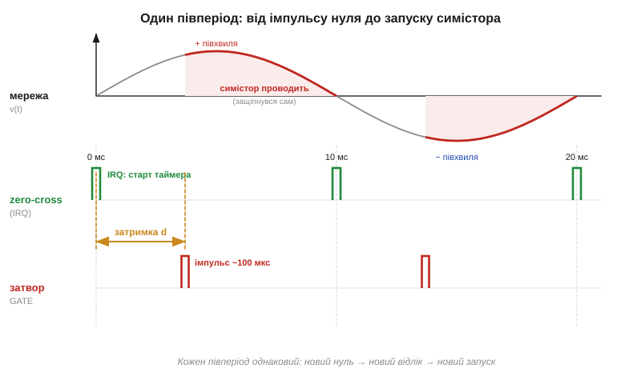
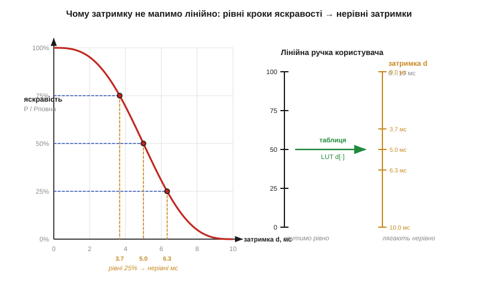

# Алгоритм димера: від імпульсу нуля до затримки запуску

> ⚙️ Алгоритмічна вставка до теми [§2.11.4 «Фазове керування потужністю: димер»](ac-power-switching.md). Там ми побачили *ідею* фазового відсікання: симістор підмикає лампу не з початку півхвилі, а із затримкою — і що пізніше, то менше енергії дістанеться навантаженню. Тут перетворимо цю ідею на код, що працює на мікроконтролері: як від кожного переходу мережі через нуль відрахувати потрібну затримку й точно у свій момент дати імпульс на затвор. А скільки саме відсотків потужності дає той чи інший кут — рахуємо в сусідній вставці [§2.11.4 (🧮 інтеграл півхвилі)](math-phase-power.md); тут нас цікавить **час і керування**, а не площа під кривою.

## Задача

Мережа — двополярна синусоїда (§1.7), що проходить через нуль **двічі за період**: для 50 Гц це кожні **10 мс**, для 60 Гц — кожні ≈ 8.33 мс. Симістор (§2.11.3) — защіпка: він **сам** перестає проводити, коли струм півхвилі спадає до нуля, тож на початку кожної півхвилі ключ завжди закритий і чекає команди. Уся наша свобода — це **один момент** на кожну півхвилю: коли саме подати імпульс на затвор. Подамо рано — симістор защіпнеться майже на початку, і навантаження дістане майже повну півхвилю; подамо ближче до кінця — провідним лишиться короткий хвостик, лампа ледь жевріє.

Отже, задача мікроконтролера така: **зловити кожен перехід через нуль**, від нього відрахувати затримку запуску `d` (від нуля до повної довжини півперіоду — 0…10 мс при 50 Гц), у потрібну мить **видати короткий імпульс** на затвор симістора — і повторювати це бездоганно рівно, півхвиля за півхвилею, поки ручка яскравості стоїть на місці. Збоїти не можна: пропустиш момент — півхвиля «провалиться» (лампа смикне), затримаєш на частку мілісекунди більше, ніж сусідні, — отримаєш мерехтіння на оці.

## Ідея

Усе впирається в той самий нуль, тож із нього й почнемо. Сигнал «ось нуль» дає окремий вузол — **детектор переходу через нуль** (*zero-cross detector*), який на кожному переході мережі видає короткий логічний імпульс (його будову розбираємо далі, у §2.11.5). Заводимо цей імпульс на вхід зовнішнього переривання (*external interrupt, IRQ*) мікроконтролера. Тоді алгоритм розпадається на дві маленькі, майже миттєві події замість одного довгого очікування:

1. **Переривання від нуля** — «точка відліку». Тут ми лише перезапускаємо апаратний таймер на інтервал `d` і виходимо. Жодних затримок у самому обробнику.
2. **Переривання від таймера** (через `d` після нуля) — «час стріляти». Тут даємо короткий імпульс на затвор; симістор защіпається і далі тримається сам до кінця півхвилі.


*Рис. 2.11.4a.1. Три доріжки одного періоду. Угорі — мережа з нулями кожні 10 мс. Імпульс zero-cross (зелений) запускає таймер на затримку `d`; коли таймер спливає, на затвор іде короткий імпульс ~100 мкс (червоний). Симістор защіпається й проводить решту півхвилі сам (підсвічена ділянка). Наступний нуль — новий відлік: кожен півперіод обробляється однаково й незалежно.*

Між собою події нічого не «утримують»: уся гаряча робота — це перезапуск таймера й коротке смикання вивода. Процесор увесь час вільний. Це і є головна перевага прив'язки до нуля: ми не міряємо абсолютний час, а щоразу стартуємо від свіжого, апаратно-точного орієнтира, тож дрейф частоти мережі сам собою компенсується.

Лишається питання, **як із яскравості дістати `d`**. Спокусливо відобразити її лінійно: 0 % → 10 мс, 100 % → 0 мс. Але потужність від кута запуску — **нелінійна** (§2.11.4 🧮): біля країв півхвилі (малий і великий кут) крива полога, а посередині крута. Лінійна ручка дала б майже мертву зону вгорі шкали і стрибок яскравості посередині. Тому з лінійного відсотка яскравості беремо `d` **не прямо, а через перерахунок** — заздалегідь порахованою таблицею (*lookup table, LUT*) або тією ж формулою частки потужності, оберненою чисельно.


*Рис. 2.11.4a.2. Ліворуч — частка потужності від затримки `d`: рівні кроки яскравості по 25 % лягають на нерівні затримки (6.3, 5.0, 3.7 мс). Праворуч — те саме як перетворення: рівні поділки ручки користувача проходять крізь таблицю `d[·]` і виходять нерівними мілісекундами. Без цього перерахунку «лінійна» ручка крутилася б нерівномірно на око.*

## Псевдокод

Складемо все докупи: таблицю затримок готуємо один раз на старті, а далі живуть лише два коротких обробники — від нуля й від таймера, як ми й розклали ідею.

```
T_півпер  = 10000 мкс        # 50 Гц; для 60 Гц ≈ 8333 мкс
PULSE     = 100 мкс          # довжина імпульсу на затвор
GUARD     = 200 мкс          # поля: не стріляти впритул до країв
яскравість = 0…100           # лінійна ручка користувача

# Підготовка (раз): таблиця затримок під лінійну шкалу яскравості.
# brightness_to_alpha(b) обертає частку потужності p=b/100 у кут α∈[0,π]
# (та сама крива, що в §2.11.4 🧮), далі кут → час.
for b in 0…100:
    alpha   = brightness_to_alpha(b / 100)      # 0 % → π, 100 % → 0
    d_tab[b] = clamp(alpha/π * T_півпер, GUARD, T_півпер - GUARD)

on_zero_cross():                 # IRQ від детектора нуля — КОРОТКО
    d = d_tab[яскравість]
    if яскравість == 0:          # повний нуль — взагалі не стріляти
        return
    timer_start_oneshot(d)       # відлік від ЦЬОГО нуля

on_timer():                      # спливла затримка d — час стріляти
    gate_high()                  # імпульс на затвор
    timer_start_oneshot(PULSE)   # тримаємо рівно PULSE…
    state = HOLDING

on_timer_hold():                 # …і прибираємо
    gate_low()
    state = IDLE
```

Зміна яскравості — це просто новий індекс у `d_tab`; ані таймери, ані прив'язку до нуля чіпати не треба, новий рівень підхопиться з наступної півхвилі. Той самий каркас однаково обслуговує обидві півхвилі: симістор керується з одного затвора в обох полярностях (§2.11.3), тож код не розрізняє «плюсову» й «мінусову» півхвилю — кожен нуль для нього однаковий.

## Складність і пастки на МК

Обчислень — мінімум: на кожен нуль одне читання з таблиці (O(1)), решта — апаратний таймер. Та простота оманлива, бо все вирішує **точність часу**, і саме тут чигають характерні пастки:

- **Нічого не роби в обробнику.** І `on_zero_cross`, і `on_timer` мусять бути на одиниці мікросекунд: перезапустив таймер, смикнув вивід — і вийшов. Будь-яка затримка (`delay`, друк у лог, повільна шина) зсуває момент запуску — і яскравість «дихає». Сам імпульс теж кращий **апаратний** (таймер у режимі формування імпульсу), а не «підняв-почекав-опустив» у коді.
- **Джитер = мерехтіння.** Око помічає коливання яскравості вже від часток відсотка. Якщо момент запуску гуляє на десятки мікросекунд від півхвилі до півхвилі (через те, що IRQ нуля інколи відкладається важливішим перериванням), лампа візуально тремтить. Дай перериванню нуля високий пріоритет і не блокуй переривання надовго деінде.
- **Детектор нуля «дзвенить».** Реальний перехід через нуль не ідеально чистий: біля самого нуля сигнал малий і може дати кілька імпульсів поспіль (брязкіт). Постав програмний «глухий час» (*lockout*) — після першого імпульсу нуля ігноруй наступні якісь ~1 мс, щоб не запустити таймер двічі за півхвилю.
- **50 чи 60 Гц — не вгадуй.** Жорстко «зашити» 10 мс — помилка: у мережі 60 Гц півперіод ≈ 8.33 мс, і та сама затримка дасть зовсім іншу яскравість. **Виміряй** період між двома сусідніми нулями таймером на старті (а краще — усереднюй на ходу) і масштабуй `T_півпер` під фактичну частоту.
- **Не стріляй упритул до країв.** Затримка `0` (запуск точно в нулі) ненадійна — симістору треба, щоб струм встиг перевищити струм утримання, інакше він зразу відпустить. А затримка майже на повний півперіод ризикує «перестрибнути» наступний нуль через джитер. Тому тримай `GUARD`-поля з обох боків і окремо обробляй «повний нуль» (взагалі не стріляти) та «повну яскравість» (стріляти з мінімальною затримкою).
- **Індуктивне навантаження потребує не одного імпульсу.** На резистивній лампі розжарення струм іде в фазі з напругою, і короткого імпульсу досить — симістор защіпнеться. Та на індуктивному навантаженні (двигун, трансформатор) струм відстає, на момент імпульсу його може ще бракувати для утримання — симістор відпустить. Зарадити цьому можна **довшим імпульсом** або **пачкою коротких** (*pulse train*) аж до моменту, коли струм надійно перевищить утримання. Сам факт, чому індуктивність так псує життя симістору (і як його боронити), — це вже §2.11.8.
- **Гальванічна розв'язка — не на вибір.** Затвор симістора сидить у мережі під сотнями вольт; вивід мікроконтролера — ні. Між ними завжди оптична розв'язка (оптодрайвер), тож «імпульс на затвор» у коді фізично означає «увімкнути світлодіод оптопари». Підключення такого драйвера й чому без нього не можна — §2.11.3 та §2.11.9.

Підсумок: фазовий димер у коді — це дві крихітні події навколо одного апаратного орієнтира. Перехід через нуль дає точку відліку, таймер відмірює нелінійно перераховану затримку, короткий імпульс защіпає симістор — і так бездоганно рівно щопівперіоду. Уся складність не в арифметиці, а в тому, щоб час був залізно стабільним і щоб алгоритм чесно рахувався з реальною мережею: її частотою, її брудним нулем і характером навантаження.
