# Розділ 2.6 — Біполярний транзистор (BJT)

[Розділ 2.5](../diode-pn-junction/diode-pn-junction.md) дав нам діод — перший напівпровідниковий прилад, однобічний клапан, що вміє лише **реагувати**. Тепер — прилад, який змінив світ: **транзистор**. Його суть в одному реченні: він дозволяє **малому** електричному впливові керувати **великим** струмом. З цієї простої здатності виростають дві суперсили — **підсилення** й **перемикання**, — а з них уся активна електроніка, від радіо до процесора.

Усе потрібне в нас уже є: ми знаємо PN-перехід, пряме й зворотне зміщення, носії й рекомбінацію ([Розділ 2.5](../diode-pn-junction/diode-pn-junction.md)). Транзистор — це, по суті, **два** переходи поряд, хитро влаштовані так, щоб один струм керував іншим. Цей розділ ми почнемо з головної **ідеї** (ця тема), а далі зазирнемо всередину: будова, робота, підсилення, режими й застосування.

> 📜 **Перед матеріалом — історія:** [1947, Bell Labs — винахід транзистора](hist-transistor.md). Вона показує, *навіщо* його шукали (лампа була завелика й гаряча), *як* його зробили Бардін, Браттейн і Шоклі й *чому* він відкрив цифрову епоху.

---

## 2.6.1 Транзистор: ідея керованого «крана» струму

Перш ніж відкривати транзистор і дивитися, що в нього всередині, схопімо головну **ідею** — без неї деталі будови нічого не варті. А ідея напрочуд проста: транзистор — це **кран для струму**, яким керують електрично. Невеликий сигнал на одному виводі **відчиняє або причиняє** великий струм через інші. Мала дія керує великою — оце і вся суть, з якої народилася ціла індустрія.

### Кран для струму

Уявіть водопровідний кран. Легкий поворот руки — і потужний потік води то ллється, то спиняється. Зверніть увагу на дві речі. По-перше, **ви не даєте воді енергії** — її дає тиск у трубі; ваша рука лише **керує** потоком, не створюючи його. По-друге, мале зусилля керує великим потоком: пальцем ви спиняєте струмінь, що збив би вас із ніг.

Транзистор робить **точно те саме**, але зі струмом і без жодних рухомих частин. Слабкий керувальний сигнал відчиняє чи причиняє сильний струм, що тече від джерела живлення крізь прилад. Кран — рукою; транзистор — електрикою.

Та сама ідея живе в багатьох образах. Засувка греблі: мала лебідка піднімає щит, а крізь нього суне ціла ріка. Важіль: легким натиском на довге плече зрушуєш величезну вагу. Спільне всюди — **керування**, а не створення: маленький вплив **спрямовує** велику силу, що вже напоготові. Транзистор — найчистіше втілення цього принципу в електриці: ні важелів, ні щитів, лише слабкий сигнал, що править сильним струмом. І в цьому його головна перевага над механічним краном чи реле: керувати можна **блискавично** й **без зносу**, бо рухається не залізо, а самі заряди в кристалі. Те, що рукою робиться за секунди, транзистор робить електрикою мільярди разів за ту саму секунду.

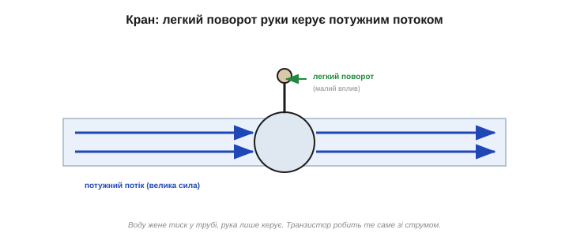
*Рис. 2.6.1.1. Як легкий поворот крана керує потужним потоком води (а воду жене тиск у трубі, не рука), так слабкий сигнал у транзисторі керує сильним струмом (а струм жене джерело живлення). Мала дія — великий наслідок.*

### Три виводи: два для потоку, один для керування

У діода було **два** виводи. У транзистора — **три**, і це принципово. Два з них утворюють шлях для **головного, великого** струму (наче вхід і вихід труби), а третій — **керувальний**: те, на що ми діємо слабким сигналом. Подаси трохи на керувальний вивід — і великий струм слухняно міняється.

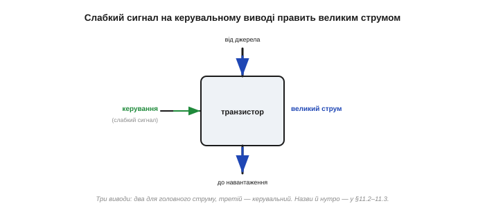
*Рис. 2.6.1.2. Транзистор має три виводи. Крізь два тече головний (великий) струм від джерела до навантаження; третій — керувальний. Слабкий сигнал на ньому задає, наскільки відкрито «кран». Як саме виводи звуться й що всередині — у §2.6.2–2.6.3.*

Як саме ці виводи звуться (база, колектор, емітер) і що діється в кристалі між ними — розберемо в наступних темах ([§2.6.2](bjt.md), [§2.6.3](bjt.md)). Поки тримаймо в голові лише схему: **два виводи — потік, один — кермо**.

Чому саме три, а не два, як у діода? Бо двома виводами можна хіба пропускати чи не пропускати струм (клапан — це й є діод). А щоб струмом **керувати ззовні**, потрібен третій вивід — той, що «стоїть на дорозі» головного потоку й вирішує, скільки його пройде. Цей третій вивід і відрізняє транзистор від діода: керування, а не просто проходження. У крана теж три «виводи»: вода входить, вода виходить, а ручка керує. Транзистор — той самий пристрій, лише замість води струм, а замість ручки — електричний сигнал. Тримаючи цей образ, ви легко читатимете будь-яку транзисторну схему.

### Дві суперсили: підсилення й перемикання

З однієї здатності «мале керує великим» виростають **дві** речі, на яких стоїть уся електроніка.

**Підсилення.** Якщо слабкий сигнал змушує великий струм точно **повторювати** себе, то на виході маємо більшу, потужнішу копію входу. Тихий звук із мікрофона стає гучним у динаміку; ледь чутний радіосигнал — придатним до вжитку. Транзистор робить **більший образ** маленького сигналу.

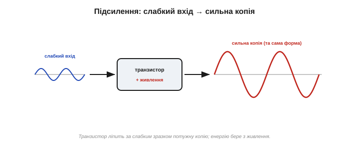
*Рис. 2.6.1.3. Слабкий вхідний сигнал керує великим струмом так, що той повторює його форму — виходить підсилена копія. Енергію для «гучнішого» бере джерело живлення; транзистор лише ліпить за слабким зразком сильну подобу.*

Підкреслимо слово **повторює**: добрий підсилювач робить копію, що відтворює форму входу без спотворень, лише більшу. Слабкий голос у телефоні, ледь чутна станція в антені, кволий сигнал давача — усе це транзистор робить достатньо сильним, щоб з ним можна було працювати: почути в динаміку, передати далі, виміряти. Від слухового апарата до радіотелескопа — скрізь та сама дія: маленьке робимо великим, не змінюючи його суті.

Як це виглядає в числах, побачимо в [§2.6.4](bjt.md): там виявиться, що крихітний керувальний струм породжує в десятки чи сотні разів більший головний — і це відношення зветься коефіцієнтом підсилення. Поки досить образу: повернув кран на крихту — потік змінився сильно, і та «крихта» та «сильно» зв'язані сталим множником.

**Перемикання.** А якщо керувати не плавно, а «навстіж»: малим сигналом **повністю** відчиняти й причиняти великий струм? Тоді транзистор стає **електронним ключем** — вимикачем без рухомих контактів, що клацає мільйони разів за секунду й не зношується. А ключ, що означає «увімкнено/вимкнено», — це **0 і 1**: атом усієї цифрової логіки. З мільярдів таких крихітних ключів складено кожен процесор.


*Рис. 2.6.1.4. У режимі ключа транзистор не плавно регулює, а повністю відчиняє чи причиняє великий струм за малим сигналом. Це електронний вимикач без рухомих частин — і водночас «0/1» цифрової техніки.*

Перемикання здається скромнішим за підсилення — а насправді саме воно змінило цивілізацію. Електронний ключ не має контактів, що іскрять і зношуються; він спрацьовує за **мільярдні частки секунди** й витримує безліч перемикань. А коли «ввімкнено» назвати одиницею, а «вимкнено» — нулем, із таких ключів складають логіку («і», «або», «не»), з логіки — суматори, пам'ять, процесори. Сучасний чип — це **мільярди** транзисторів-ключів, що перемикаються мільярди разів за секунду. Уся цифрова техніка, по суті, — велетенський хор крихітних транзисторних вимикачів. Тож наступного разу, почувши про «штучний інтелект» чи «хмару», згадайте: під усім цим — фізичні транзистори-ключі, що мільярдами клацають нулі та одиниці. Уся нематеріальна на вигляд цифра стоїть на цьому матеріальному фундаменті.

### Активний прилад: енергію бере джерело

Тут — важлива межа. Усі компоненти, які ми знали досі (резистор, конденсатор, котушка, діод), — **пасивні**: вони лише реагують. Вони можуть розсіювати, запасати, ділити чи спрямовувати енергію, але **ніколи не віддають сигналу більше, ніж у них увійшло**. Транзистор — **активний**: на виході сигнал може нести **більше** потужності, ніж керувальний сигнал на вході.

Звідки ж береться «зайва» потужність? Не з нічого — із **джерела живлення**. Транзистор не створює енергії (це порушувало б закон збереження); він слабким сигналом лише **модулює** великий потік, що його дає джерело, — як кран не створює воду, а керує потоком під тиском труби. Саме ця здатність — керувати великою потужністю малою — і відрізняє активну електроніку від пасивної.

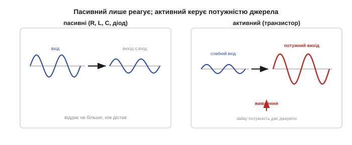
*Рис. 2.6.1.5. Пасивні R, L, C, діод тільки реагують — не дають більше, ніж дістали. Транзистор активний: слабкий сигнал керує великою потужністю від джерела, тож вихід може бути потужнішим за вхід. Енергію дає джерело, не транзистор.*

> 🔧 **Навіщо це.** «Активність» — не магія, а керування чужою силою. Транзистор-підсилювач не «додає» енергію в сигнал із повітря — він бере її з блока живлення й ліпить із неї потужну копію слабкого входу. Тому будь-який підсилювач потребує **живлення**: без нього транзисторові нічим керувати. Запам'ятайте це — і ніколи не чекатимете «підсилення» від схеми, у якій нема джерела потужності.

Кількісно цю «активність» вимірюють **коефіцієнтом підсилення**: у скільки разів вихідний сигнал більший за вхідний. Пасивний елемент має «підсилення» менше за одиницю (самі втрати); активний — більше за одиницю. Ця проста межа — чи може прилад дати на виході **більше**, ніж дістав на вході (за рахунок живлення), — і ділить усю електроніку на пасивну й активну. Транзистор — перший прилад по активний бік цієї межі.

Найнаочніший приклад — радіоприймач. Сигнал, що антена ловить з ефіру, мізерний: його потужності не стане навіть ворухнути мембрану навушника, не те що динаміка. Транзистор (із батареєю!) бере цей кволий сигнал за зразок і ліпить його потужну копію, здатну гриміти на всю кімнату. Енергію звуку дає батарея, форму — антена, а транзистор їх **поєднує**. Без активного приладу радіо лишилося б ледь чутним шепотом — власне, таким і був детекторний приймач без підсилення ([§2.5.6](../diode-pn-junction/diode-pn-junction.md)): чути лише в навушник, притиснутий до вуха.

### Чим керують: струмом чи напругою

Наостанок — розвилка, яку варто знати наперед. Транзистори бувають двох великих родин, і різняться вони тим, **що** саме є керувальним сигналом. **Біполярний** транзистор (BJT) — герой цього розділу — керується невеликим **струмом**: крізь керувальний вивід має текти струмок, що й задає великий струм. **Польовий** транзистор (FET/MOSFET, Розділ 2.7) керується **напругою**, майже не споживаючи струму на керування. Обидва роблять те саме «мале керує великим» — лише кермо різне. Ми починаємо з біполярного.

Це не дрібниця: керування **струмом** означає, що біполярний транзистор постійно «з'їдає» трохи струму на саме керування, тоді як польовий керується майже задарма — самим полем, як натякає його назва ([§2.5.1](../diode-pn-junction/diode-pn-junction.md) нагадає, що поле розводить заряди без споживання струму). Звідси й різні сфери їхнього вжитку — але це вже тема наступного розділу.

### Чому це революція

Згадаймо, чим керували великим струмом **до** транзистора. Або механічним **реле** чи вимикачем — повільним, із рухомими контактами, що іскрять і зношуються. Або **електронною лампою** — гарячою, великою, крихкою (історія розділу). Транзистор робить те саме, але **твердотільно**: він крихітний, холодний, швидкий, надійний і — головне — його можна штампувати мільйонами на одному кристалі. Та сама робота, але незрівнянно дешевше, менше й надійніше — ось чому транзистор, а не його попередники, дав нам комп'ютери й смартфони.


*Рис. 2.6.1.6. Керувати великим струмом за малим сигналом уміли й реле (рухомі контакти — повільно, зношується), і лампа (гаряча, велика, крихка). Транзистор робить це твердотільно: малий, холодний, швидкий, дешевий, складаний мільйонами. Звідси й перемога.*

Щоб відчути масштаб: одна лампа була завбільшки з палець, а в сучасний чип розміром із ніготь уміщають **десятки мільярдів** транзисторів. Якби кожен був лампою, такий «процесор» зайняв би не одну будівлю, споживав би потужність міста й перегорав би щосекунди. Транзистор не просто замінив лампу — він зробив можливим те, про що з лампами годі було й мріяти.

Транзистори всюди, хоч їх і не видно: у підсилювачі навушників, у радіомодулі телефона, у кожному логічному вентилі процесора, у драйвері, що крутить мотор. Здебільшого вони сховані всередині мікросхем — мільярди заразом, — але це ті самі «крани для струму», які ми розбираємо тут поодинці. І ще одне, головне: доти електроніка вміла лише **обробляти** наявне — ділити, фільтрувати, випрямляти; транзистор дав їй змогу **підсилювати** й **вирішувати**, а отже — обчислювати, запам'ятовувати, реагувати. Усе «розумне» довкола починається саме тут, із простого «мале керує великим».

### Що далі

Отже, транзистор — це керований електрикою кран для струму: мала дія керує великою, а з цього ростуть підсилення й перемикання. Це **ідея**. Тепер відкриймо прилад і подивімося, **як** він її втілює: з чого він зроблений (два PN-переходи) і чому слабкий сигнал на одному виводі змушує текти великий струм через інші. Виявиться, що весь секрет — у двох близьких переходах і тонесенькому шарі між ними; а оскільки PN-перехід ми вже знаємо ([Розділ 2.5](../diode-pn-junction/diode-pn-junction.md)), зрозуміти транзистор буде легше, ніж здається. Тримаючись образу крана, рушаймо досередини.

> ▶️ Далі: [§2.6.2 Будова BJT: два p-n переходи (NPN/PNP)](bjt.md)

---

## 2.6.2 Будова BJT: два p-n переходи (NPN/PNP)

[§2.6.1](bjt.md) дав ідею: транзистор — це кран, де мала дія керує великою. Тепер відкриймо прилад і подивімося, з чого він зроблений. Виявиться, що будова **біполярного** транзистора (BJT, *bipolar junction transistor*) напрочуд проста: це **сендвіч** із трьох легованих шарів напівпровідника. Уся магія народжується саме з цього бутерброда — точніше, з двох переходів і тонесенького прошарку між ними. Це той рідкісний випадок, коли всесвітньо важливий прилад має майже тривіальну будову: три шматки кремнію різного «ґатунку», складені стосиком. Складність не в геометрії, а в тому тонкому шарі посередині — і у фізиці, що в ньому коїться.

### Сендвіч із трьох шарів

Згадаймо легування з [§2.5.2](../diode-pn-junction/diode-pn-junction.md): кремній буває **n-типу** (надлишок електронів) і **p-типу** (надлишок дірок). Біполярний транзистор — це три такі шари поспіль: **два** одного типу й **тонкий** прошарок протилежного **між** ними. Складають їх двома способами:

- **NPN** — n-p-n: дві n-області, а між ними тонка p.
- **PNP** — p-n-p: дві p-області, а між ними тонка n.

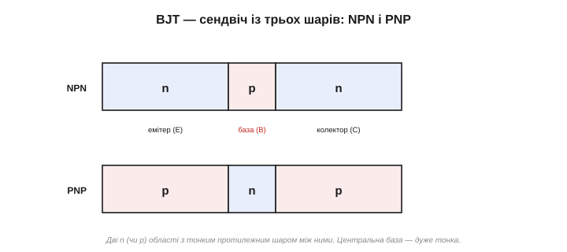
*Рис. 2.6.2.1. Дві структури BJT. NPN: n-p-n (дві n-області, тонка p посередині). PNP: p-n-p (дзеркально). Центральний шар — дуже тонкий; саме він, як побачимо, і робить транзистор транзистором.*

Важливо: ці три шари — не три склеєні шматочки, а **один** суцільний кристал, у якому сусідні області легували по-різному (точно як PN-перехід, [§2.5.2](../diode-pn-junction/diode-pn-junction.md)). Лише так межі виходять бездоганні, на рівні ґратки. А «**біполярним**» транзистор зветься тому, що в його роботі беруть участь **обидва** сорти носіїв — і електрони, і дірки (на відміну від польового, де працює лише один; «бі» — два). А розміри цього сендвіча мікроскопічні: у дискретному транзисторі кристалик менший за макове зерня, а в мікросхемі таких структур мільярди на площі нігтя. Великі шари на наших рисунках — лише для наочності; насправді це частки міліметра.

### Три виводи: емітер, база, колектор

Кожен із трьох шарів має вивід і власну назву та роль:

- **Емітер** (*emitter*, E) — сильно легований шар, що «**випускає**» (емітує) у прилад основну масу носіїв. Це джерело головного потоку.
- **База** (*base*, B) — той самий **тонкий** середній прошарок, легований слабко. Це **керувальний** вивід — кермо з §2.6.1.
- **Колектор** (*collector*, C) — шар, що «**збирає**» носії, які пройшли крізь базу. Зазвичай він найбільший — бо мусить розсіювати тепло.

Назви прозорі й самі підказують ролі: емітер **емітує** (випускає) носії, колектор їх **колекціонує** (збирає), а база історично була «основою» (*base*) першого, точкового транзистора, на якій трималася решта конструкції. Запам'ятати, хто є хто, легко просто з цих слів. До речі, саме через колектор транзистори так різняться розміром: малосигнальний (для слабких сигналів) крихітний, а потужний (керувати мотором чи лампою) великий і часто на радіаторі — бо крізь його колектор течуть ампери й виділяється чимало тепла.


*Рис. 2.6.2.2. Три області несиметричні навмисно: емітер сильно легований (щоб упорснути багато носіїв), база дуже тонка й слабко легована (щоб носії пролетіли її майже без втрат), колектор великий (щоб зібрати їх і відвести тепло). Ця асиметрія — не примха, а умова роботи.*

Зверніть увагу на важливе: навіть у NPN дві n-області — емітер і колектор — **не однакові** й **не взаємозамінні**. Емітер сильно легований, колектор більший і легований слабше, база — дуже тонка. Помінявши емітер із колектором місцями, ви дістанете кепський транзистор (або взагалі не транзистор). Чому саме така асиметрія потрібна — пояснить [§2.6.3](bjt.md); поки досить запам'ятати, що три шари **різні за призначенням**.

Навіщо ж аж три різні шари? Натякнімо наперед (повний розбір — [§2.6.3](bjt.md)). Емітер легують **сильно**, щоб він упорснув у базу якнайбільше носіїв. Базу роблять **тонкою й слабко легованою**, щоб ці носії пролетіли її майже без втрат на рекомбінацію — і майже всі дісталися колектора. А колектор роблять **великим**, бо крізь нього тече весь головний струм і виділяється тепло. Кожен шар заточено під свою роль — і лише разом вони дають підсилення.

Що буде, як усе ж поміняти емітер із колектором — увімкнути транзистор «навпаки»? Він працюватиме, але кепсько: слабко легований «емітер» упорсне мало носіїв, і підсилення впаде в рази. Тому, хоч обидва шари й однотипні, переплутати їх — означає зіпсувати прилад. Несиметрія тут не випадкова, а ретельно прорахована під роль кожного шару.

### Два PN-переходи

Де три леговані області стикаються, там — переходи ([§2.5.3](../diode-pn-junction/diode-pn-junction.md)). У транзисторі їх **два**:

- **база–емітер** (B-E),
- **база–колектор** (B-C).

Тож, якщо дивитися грубо, біполярний транзистор схожий на **два діоди, з'єднані спина до спини** через спільну базу. У NPN база (p) — спільний анод, а емітер і колектор (n) — два катоди; виходять ніби два діоди, що дивляться анодами всередину.

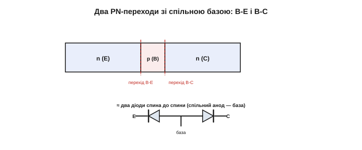
*Рис. 2.6.2.3. У транзисторі два PN-переходи зі спільною базою: B-E і B-C. Грубо це схоже на два діоди спина до спини. Але — увага — справжній транзистор це **не** просто два діоди, і зараз побачимо, чому.*

Ця «двадіодна» картина зручна для **перевірки**: мультиметром у режимі прозвонки діода ([§2.5.5](../diode-pn-junction/diode-pn-junction.md)) транзистор і справді дзвониться як два діоди від бази — так знаходять базу й визначають тип (NPN чи PNP). У PNP усе дзеркально: база (n) — спільний катод, а емітер і колектор (p) — аноди. Та затямимо: ця модель добра лише, щоб перевірити цілість приладу, а не щоб зрозуміти його **роботу** — про неї далі.

З двадіодної картинки видно й іще одне: між колектором і емітером (через базу) стоять два **зустрічні** діоди, тож сам по собі транзистор постійного струму між ними не пропускає — хоч би якої полярності. Це й правильно: щоб потік пішов, потрібен керувальний сигнал на базу. Без нього транзистор замкнений — як і має бути «кран», поки за нього не взялися.

### Але це **не** просто два діоди

Ось ключова осторога. Якщо взяти два **окремі** діоди й з'єднати їх дротом, транзистора **не вийде** — хоч переходи й ті самі. Чому? Бо весь секрет — у **тонкості спільної бази**. Обидва переходи поділяють той самий тонюсінький середній шар, тож носії, що їх упорскує емітер, устигають **пролетіти** базу наскрізь і дістатися колектора, перш ніж рекомбінують. А в двох окремих діодах «бази» товсті й роз'єднані — жоден носій із одного не долетить до іншого. Саме спільна тонка база перетворює два переходи на транзистор. (Як саме це дає підсилення — у [§2.6.3](bjt.md).)

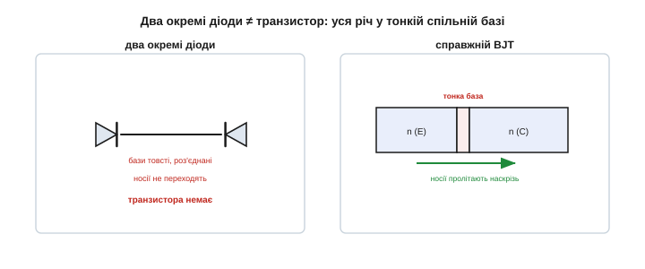
*Рис. 2.6.2.4. Ліворуч — два окремі діоди, з'єднані дротом: товсті бази, носії не переходять — транзистора немає. Праворуч — справжній BJT: спільна **тонка** база, крізь яку носії пролітають з емітера в колектор. Уся магія — у тонкості цього прошарку.*

Наскільки тонка та база? Часто це **частки мікрона** — тонша за довжину, яку носій устигає пробігти до рекомбінації. Саме тому впорснутий емітером носій не встигає «загинути» в базі, а проскакує її й потрапляє в полі колектора. Зробіть базу товстою — і носії порекомбінують, не долетівши; транзисторного ефекту не буде. Тонкість бази — буквально питання життя і смерті носіїв, і саме її неможливо відтворити, з'єднавши два готові діоди дротом.

Саме цієї тонкої бази й не мав перший, точковий транзистор (історія розділу): там два контакти лише дотикались до кристала. Плоскісний транзистор Шоклі тим і переміг, що в ньому база — рівний, контрольовано тонкий шар у самій товщі кристала. Те, що ми вивчаємо в цьому розділі, — і є цей **плоскісний** BJT, який заполонив світ.

> 📜 **Історія до теми:** [Шоклі, «зрадницька вісімка» і народження Кремнієвої долини](hist-traitorous-eight.md). Винайшли транзистор на сході США — а індустрію зробили на заході: як Шоклі привіз кремній у каліфорнійську долину (1956), став нестерпним босом, і вісім його інженерів утекли заснувати Fairchild (1957), з якої виросли Intel, венчурний капітал і вся Кремнієва долина.

### Символи: NPN і PNP

На схемах транзистор малюють так: вертикальна риска (база), до неї під кутом — емітер (зі **стрілкою**) і колектор. Уся різниця між NPN і PNP — у напрямку стрілки на емітері:

- **NPN** — стрілка дивиться **назовні** (від бази). Зручна підказка: «**N**PN — **N**ot **P**ointing i**N**» (стрілка не всередину).
- **PNP** — стрілка дивиться **всередину** (до бази).

Стрілка показує напрямок умовного струму через емітер — тобто куди «дивиться» діод база–емітер.


*Рис. 2.6.2.5. Символи транзистора. NPN — стрілка емітера назовні («Not Pointing iN»), PNP — усередину. Три виводи: база (кермо), колектор і емітер (головний струм). Стрілка показує напрямок струму емітера.*

На практиці стрілку читають як маленький діод бази–емітера: куди вона вказує, туди крізь емітер і тече умовний струм у відкритому транзисторі. Тому, лише глянувши на схему, за самою стрілкою видно і **тип** приладу (NPN чи PNP), і як його належить живити — плюсом чи мінусом до колектора. Це найшвидший спосіб «прочитати» транзистор у незнайомій схемі.

### NPN проти PNP

Дві структури — **доповняльна пара** (*complementary*): та сама ідея, лише дзеркально. У **NPN** головні носії — електрони, і працює він із **плюсом** на колекторі. У **PNP** головні носії — дірки, і полярність обернена (мінус на колекторі). На практиці **NPN поширеніший**: електрони рухливіші за дірки, тож NPN-транзистори трохи швидші й дешевші. PNP беруть там, де зручніша обернена полярність (наприклад, ключ «згори», у парі з NPN).


*Рис. 2.6.2.6. NPN і PNP роблять те саме дзеркально: NPN несе струм електронами (плюс на колекторі), PNP — дірками (мінус на колекторі). NPN швидший і поширеніший; разом вони утворюють зручні доповняльні пари.*

Чому ж електрони рухливіші за дірки? Бо дірка «рухається» лише як естафета перескоків зв'язаних електронів ([§2.5.2](../diode-pn-junction/diode-pn-junction.md)), а вільний електрон мчить сам — тож NPN на тих самих розмірах виходить трохи прудкішим. А доповняльність NPN+PNP — велика зручність: парою таких транзисторів будують симетричні підсилювачі та вихідні каскади, де один «штовхає» струм, а другий «тягне». До цих схем ми ще дійдемо.

У перших дослідах новачки майже завжди беруть NPN — популярні BC547, 2N2222, BC337 і подібні; це робоча конячка аматорської електроніки. PNP (як-от BC557) тримають напоготові, коли треба керувати навантаженням «згори», від плюса. Маючи пару NPN+PNP, ви впораєтеся майже з будь-яким простим завданням комутації чи підсилення.

> 🔧 **Навіщо це.** Дві практичні звички. Перша: не плутати **емітер і колектор** — вони не симетричні, і «перевернутий» транзистор працює погано; на корпусі й у даташиті виводи завжди підписані. Друга: за стрілкою символу миттєво впізнавати тип (назовні — NPN, усередину — PNP) і напрямок струму. Це позбавить половини помилок у транзисторних схемах ще до того, як ви візьметеся рахувати.

У реального транзистора три ніжки (наприклад, у поширеному корпусі TO-92 — три виводи в ряд), і яка з них емітер, база, колектор — каже **тільки даташит**: розкладка в різних приладів різна. Тому перше, що роблять, узявши незнайомий транзистор, — дивляться його розкладку (або «дзвонять» мультиметром), а не вгадують. Переплутаєте виводи — у кращому разі схема не запрацює, у гіршому транзистор згорить.

### Що далі

Отже, ми маємо будову: три леговані шари, два переходи, **тонка спільна база** й несиметричні емітер–база–колектор, у двох варіантах NPN/PNP. Та сама структура ще не пояснює дива — чому кволий струм бази керує потужним струмом колектора. Це і є **транзисторний ефект**, і саме до нього — як тонка база творить підсилення — ми переходимо. Тримаймо в голові головну підказку: емітер **упорскує** носії, тонка база їх **майже не затримує**, колектор **збирає**. Лишилося побачити, як кволий струм у базу керує цим потоком — і чому його стільки разів примножує. Це найдивовижніша частина історії транзистора — і, на щастя, цілком зрозуміла, варто лише пам'ятати про ту тонесеньку базу, крізь яку все й коїться.

> ▶️ Далі: [§2.6.3 Як працює: малий струм бази керує великим струмом колектора](bjt.md)

---

## 2.6.3 Як працює: малий струм бази керує великим струмом колектора

Ось ми й дійшли до серця розділу — до самого **транзисторного ефекту**. Будову ми знаємо ([§2.6.2](bjt.md)): три шари, два переходи, тонка база. Лишилося зрозуміти диво: чому **кволий** струм у базу породжує **потужний** струм через колектор. Простежмо це крок за кроком, ідучи за носіями в NPN-транзисторі (у PNP усе дзеркально).

### Налаштування: один перехід відкритий, другий замкнений

Щоб транзистор запрацював підсилювачем, два його переходи зміщують **протилежно**:

- перехід **база–емітер** — у **прямому** напрямку (база приблизно на 0.7 В позитивніша за емітер), тож він **відкритий** ([§2.5.4](../diode-pn-junction/diode-pn-junction.md));
- перехід **база–колектор** — у **зворотному** (колектор сильно позитивний щодо бази), тож він **замкнений**.

Така комбінація зветься **активним режимом** (повний перелік режимів — [§2.6.5](bjt.md)). Саме в ньому коїться вся магія.

На перший погляд налаштування дивне: один перехід відкрили, другий **замкнули** — то як же струм піде наскрізь? Якби це й справді були два окремі діоди ([§2.6.2](bjt.md)), струм би й не пішов — замкнений B-C усе перекрив би. Уся хитрість у тому, що база **спільна й тонка**: електрони, упорснуті відкритим переходом, дістаються другого переходу **зсередини бази**, а його зворотне поле їх не відштовхує, а навпаки **затягує** в колектор. Те, що для звичайного діода — глуха стіна, для електронів із бази — відчинені ворота. (Якщо ж і другий перехід відкрити — подати на колектор замало напруги, — транзистор «захлинеться» й перестане підсилювати; це режим **насичення**, до якого повернемося в [§2.6.5](bjt.md). Поки тримаймо B-C замкненим — у цьому й суть активного режиму.)

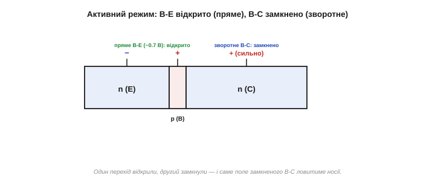
*Рис. 2.6.3.1. Налаштування NPN: перехід база–емітер зміщено прямо (відкритий, ~0.7 В), перехід база–колектор — зворотно (замкнений, але під сильним полем). Здавалося б, зворотний B-C мав би все перекрити — та саме його поле й «вловлюватиме» носії.*

### Емітер упорскує потік носіїв

Відкритий перехід база–емітер означає, що сильно легований **емітер** жене у базу **повінь** електронів — багато й охоче (на те він і «емітер»). Це той самий прямий струм діода, лише носіїв тут особливо багато, бо емітер легований сильно.


*Рис. 2.6.3.2. Прямо зміщений перехід база–емітер відкриває шлюз: сильно легований емітер упорскує в базу велику кількість електронів. Це початок головного потоку.*

Чому емітер легують **сильно**? Бо що більше в ньому вільних електронів, то потужніший потік він упорсне в базу за тієї самої прямої напруги. Сильний емітер — це повноводе джерело носіїв, з якого й живиться весь головний струм транзистора. Власне, тому головний потік і зветься струмом **емітера** та **колектора**, а не бази: база лише керує, а несуть потік емітер із колектором.

### Тонка база: майже всі проскакують у колектор

А тепер — ключ. Електрони, що зайшли в базу (p-тип), там **неосновні** ([§2.5.2](../diode-pn-junction/diode-pn-junction.md)) — і за звичайних умов мали б рекомбінувати з дірками й зникнути. Та база **така тонка**, що електрони долітають до її дальнього краю — до переходу база–колектор — **перш ніж** устигнуть рекомбінувати. А там на них чекає **сильне поле** зворотно зміщеного B-C, яке миттю **підхоплює** їх і втягує в колектор.

Через те що база тонка, переважна більшість упорснутих електронів — десь **99 із 100** — проскакують її наскрізь і стають **струмом колектора**. І лише жалюгідний відсоток встигає рекомбінувати в базі.

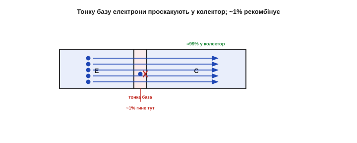
*Рис. 2.6.3.3. Майже всі електрони пролітають тонку базу, не встигнувши рекомбінувати, і їх підхоплює поле зворотного переходу B-C — це струм колектора. Лише дрібна частка (≈1 із 100) гине в базі на рекомбінацію.*

Тут ідуть справжні **перегони**: упорснутий електрон або встигне пролетіти базу й бути спійманим колектором, або загине в рекомбінації по дорозі. Тонка база робить перші перегони майже завжди виграшними. Частку електронів, що долітають, позначають α (альфа), і в доброго транзистора вона дуже близька до одиниці (0.99 і вище). Саме ця близькість α до одиниці — «майже всі долітають» — і є першопричиною великого підсилення, як побачимо за мить.

Образно, для електрона, що долетів до краю бази, зворотне поле колектора — це **обрив**, з якого він радо «скочується». Потрапивши в збіднену область переходу B-C, він уже не повернеться, а покотиться полем у колектор ([§2.5.3](../diode-pn-junction/diode-pn-junction.md)). Тому колектор і «збирає» геть усе, що до нього долетіло, — звідси й майже стовідсоткова ефективність переносу.

### Звідки береться струм бази

А що ж той нещасний ~1 %, що таки рекомбінував? Кожна рекомбінація «з'їдає» в базі одну дірку. Щоб база лишалася нейтральною (і перехід B-E — відкритим), ці витрачені дірки треба **поповнювати** — і саме це поповнення, що притікає крізь вивід бази, і є **струмом бази**. Інакше кажучи, струм бази — це маленький «податок на рекомбінацію», і він **малий** саме тому, що база тонка й рекомбінує мало.

Зверніть увагу, чому саме струм бази став **кермом**. Він нерозривно зв'язаний із прямою напругою на переході база–емітер: відкриєш перехід сильніше — побільшає і впорснутих електронів, і їхньої рекомбінації, тобто струм бази й струм колектора зростуть **разом**, в одній пропорції. Тому, керуючи маленьким струмом бази, ви насправді керуєте тим, наскільки відчинено шлюз емітера, — а отже, і всім потоком у колектор. База мала, але владна.

А що, як струму в базу не дати взагалі — лишити її ні до чого не під'єднаною? Тоді нема кому поповнювати рекомбіновані дірки, перехід B-E зачиняється — і великий струм колектора **спиняється**. Нема струмка бази — нема й потоку: керування справді в руках бази, і саме тому в схемах базу ніколи не лишають «висіти в повітрі».


*Рис. 2.6.3.4. Дірки, що згинули на рекомбінацію з тим ~1 % електронів, поповнюються струмом, який притікає крізь базу. Це і є струм бази — малесенький, бо рекомбінує лише крихта носіїв. Тонка база → мало рекомбінації → крихітний струм бази.*

### Мале керує великим: Ic ≈ β·Ib

Ось і розв'язка. Великий потік (струм колектора) і крихітний «податок» (струм бази) пов'язані **сталим відношенням**, що його задають геометрія й легування транзистора:

```
Ic ≈ β · Ib       (β — коефіцієнт підсилення, типово ≈ 100)
Ie = Ic + Ib      (емітер = колектор + база)
```

Тобто струм колектора в **сотню разів** більший за струм бази. А оскільки відношення стале, то, **трохи** піднявши струмок бази, ви в стільки ж разів піднімаєте могутній струм колектора. Маленьке на вході — велике на виході: це і є **підсилення**, тепер уже на рівні фізики. Енергію для «великого» дає, звісно, джерело в колі колектора ([§2.6.1](bjt.md)) — база лише **керує**, не живить.

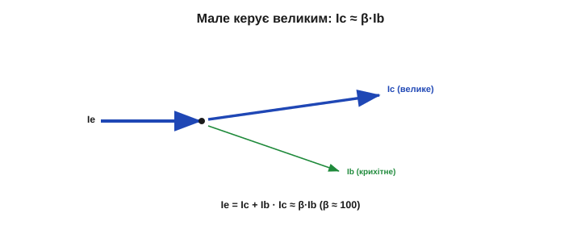
*Рис. 2.6.3.5. Майже весь струм іде емітер → колектор (товста стрілка); у базу відгалужується лише тонкий струмок. Їхнє відношення стале: Ic ≈ β·Ib (β ≈ 100). Тому кволий струм бази керує струмом колектора, у сто разів більшим.*

> 🔧 **Навіщо це.** Звідси — головне практичне правило роботи з BJT: щоб пустити великий струм через колектор, у базу треба подати приблизно в β разів менший струм. Хочете ввімкнути навантаження на 100 мА транзистором із β = 100 — досить ~1 мА в базу. Це і робить транзистор «підсилювачем струму»: дрібним керуєш великим. (А саме число β й те, як його читати з даташита, — у [§2.6.4](bjt.md).)

Прикиньмо числом. Хай β = 100. Подали в базу 0.5 мА — у колекторі потече ≈ 50 мА. Підняли базу до 1 мА — колектор стрибнув до 100 мА. Бачите: **зміна** входу віддзеркалюється стократ більшою зміною виходу — і саме це використовують у підсилювачі, подаючи на базу слабкий сигнал і знімаючи з колектора потужну його копію. Інженери так і кажуть: BJT — це **джерело струму, кероване струмом** (струм колектора підкоряється струмові бази). А в ключовому режимі ту саму властивість беруть грубіше: є струмок у базі — колектор «увімкнено», нема — «вимкнено».

Є й другий, рівноправний погляд на те саме. Можна вважати, що струмом колектора керує не стільки сам струм бази, скільки **напруга** база–емітер: трохи підняв U_BE — і струм колектора зріс (експоненційно, як у діода, [§2.5.5](../diode-pn-junction/diode-pn-junction.md)). Обидва погляди правильні й корисні: «керування струмом» зручне для ключів і швидких прикидок, «керування напругою» — для тонкого аналізу підсилювачів. Ми переважно триматимемося першого, простішого.

### Чому саме тонка база й сильний емітер

Тепер видно, навіщо була вся та несиметрія з [§2.6.2](bjt.md). **Тонка база** — щоб рекомбінувало якнайменше носіїв: мало рекомбінації → крихітний струм бази → велике β (підсилення). Зробіть базу товстою — і більшість електронів рекомбінують, не долетівши; струм бази розбухне, β впаде до одиниць, підсилення зникне. **Сильно легований емітер** — щоб потік крізь B-E несли переважно «потрібні» носії (електрони з емітера), а не марні (дірки з бази); це теж піднімає ефективність. Отже, дивна на вигляд будова транзистора — це рецепт великого β. Щоб відчути роль тонкості: подвойте товщину бази — і вдвічі (чи більше) зросте частка електронів, що рекомбінують, тобто струм бази; β відповідно впаде. Тому виробники женуться за якомога тоншою, але ще керованою базою — це прямий шлях до більшого підсилення.

І ще раз нагадаймо: у **PNP** усе те саме, лише дзеркально — емітер упорскує **дірки**, полярності обернені, а ролі електронів і дірок міняються місцями. Принцип незмінний: тонка база, мало рекомбінації, велике β. Тож, зрозумівши NPN, ви автоматично розумієте й PNP.

Зведімо подорож носія в один ланцюжок: **відкритий B-E** → емітер упорскує електрони в базу → **тонка база** пропускає майже всі → **зворотне поле B-C** затягує їх у колектор → лише ~1 % рекомбінує, і цей відсоток притікає як струм бази. Уся фізика біполярного транзистора, по суті, вміщається в це одне речення.

### Аналогія: турнікет із крихітним керуванням

Уявіть турнікет на стадіоні: крізь нього суне величезний натовп (струм колектора), а контролер біля нього лише **дозволяє** прохід легким рухом (струм бази). Маленьке зусилля керує великим потоком — і що «легше» влаштовано керування (що тонша база), то менше зусилля потрібно на той самий натовп. Транзистор — саме такий турнікет для струму: крихітний керувальний струмок пропускає в сто разів більший.

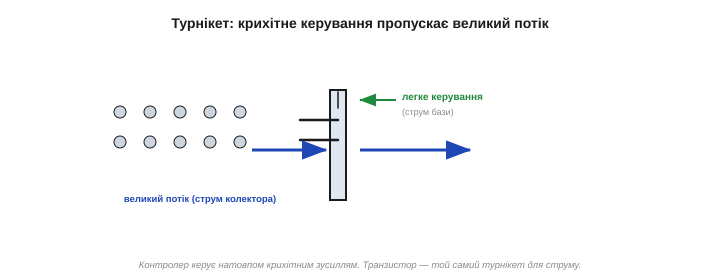
*Рис. 2.6.3.6. Образ транзистора: великий потік проходить турнікет, а контролер керує ним крихітним зусиллям. Що «тонша база» (легше керування), то менший керувальний струм на той самий потік — то більше підсилення.*

Найяскравіше це працює в підсилювачі звуку: кволий струм від мікрофона, поданий у базу, керує в сто разів більшим струмом колектора, що живить динамік від батареї. Форму звуку задає мікрофон, силу — батарея, а транзистор їх **поєднує**. Це рівно та «активність» із [§2.6.1](bjt.md), тепер пояснена зсередини: транзистор не додає енергії, а слабким сигналом ліпить із енергії джерела потужну копію.

Порівняймо з реле ([§2.5.9](../diode-pn-junction/diode-pn-junction.md)): там малий струм котушки теж керує великим струмом контактів. Але реле — або повністю ввімкнено, або вимкнено, повільне й з рухомими частинами; транзистор же керує **плавно**, миттєво й без зносу. Тому він і витіснив реле всюди, де потрібні швидкість або підсилення, лишивши йому хіба що комутацію дуже великих чи високовольтних навантажень.

### Що далі

Отже, транзисторний ефект розкрито: емітер упорскує носії, тонка база майже їх не затримує, колектор збирає, а крихітний струм бази (податок на рекомбінацію) керує всім потоком за правилом Ic ≈ β·Ib. Лишилося придивитися до самого **β** — що це за число, від чого залежить і як його брати з даташита. Цим і займемося, а далі побачимо, як із цієї єдиної властивості зробити дві найкорисніші схеми — ключ і підсилювач.

> ▶️ Далі: [§2.6.4 Коефіцієнт підсилення β (hFE): Ic = β·Ib](bjt.md)

---

## 2.6.4 Коефіцієнт підсилення β (hFE): Ic = β·Ib

У [§2.6.3](bjt.md) ми вже зустріли відношення Ic ≈ β·Ib. Тепер придивімося до самого **β** — коефіцієнта підсилення струму. Це найчастіше згадуване число транзистора — і водночас найпідступніше: воно гуляє в широких межах і залежить мало не від усього. Уміти користуватися β (і знати, коли йому **не** довіряти) — основа роботи з BJT.

### Що таке β

**β** (бета) — це у скільки разів струм колектора більший за струм бази:

```
β = Ic / Ib       →       Ic = β · Ib
```

Тобто транзистор **множить** струм бази на β. Типове значення — близько **100** (а взагалі від кількох десятків до кількох сотень). У даташитах це число позначають **hFE**.

Згадаймо й сусідні співвідношення з [§2.6.3](bjt.md): емітер несе суму, Ie = Ic + Ib = (β + 1)·Ib. А оскільки β велике, струм бази на тлі колекторного — крихта: Ic та Ie майже однакові (різняться лише на ~1 %). Тому в грубих прикидках часто пишуть Ic ≈ Ie, нехтуючи струмом бази, — і майже не помиляються. А ще β пов'язане з тією часткою α, що долітає до колектора:

```
β = α / (1 − α)
```

Ось чому β таке велике й таке примхливе водночас: коли α близьке до одиниці (0.99), мала зміна α дає величезну зміну β. Полічімо: α = 0.99 → β = 99; α = 0.995 → β = 199. **Удвічі** змінилося β від крихітної зміни α! Саме ця чутливість і робить β нестабільним числом.

До речі, β можна й **множити**: з'єднавши два транзистори так, щоб колектор першого живив базу другого (схема Дарлінгтона), дістають сумарне підсилення β₁·β₂ — десятки тисяч. Тоді вже зовсім крихітний струм керує великим навантаженням. Платня — більше падіння напруги й повільніша робота, тож дарма така зв'язка не дається.

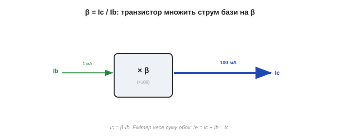
*Рис. 2.6.4.1. Коефіцієнт β — це множник: струм колектора у β разів більший за струм бази (Ic = β·Ib). Типово β ≈ 100. У даташиті його звуть hFE. Емітер несе суму обох: Ie = Ic + Ib.*

Що означає β практично? Що, керуючи **одним** міліампером у базі, ви рухаєте **сто** міліампер у колекторі: один «робітник» керування зрушує сотню «робітників» навантаження — звідси й слово «підсилення». Уточнімо одразу: β — це підсилення **струму**, а не напруги чи потужності. Велике β означає, що малий струм керує великим; а вже схема навколо транзистора перетворює це на підсилення напруги чи потужності — залежно від того, як його ввімкнути ([§2.6.7](bjt.md)). Тож «β = 100» саме по собі каже лише, у скільки разів більший струм, а не наскільки «гучніший» вийде сигнал. Можна думати про β і як про «ціну керування»: щоб дістати ампер у колекторі, треба «заплатити» струмом бази в β разів меншим. Велике β — дешеве керування (мало струму бази на багато колекторного), мале β — дорожче. Цю ціну інженер завжди прикидає, добираючи струм бази.

### β — зовсім не точна стала

І ось головна пересторога: **β не можна вважати надійною сталою**. Вона розкидана й мінлива одразу з кількох причин.

**Розкид між екземплярами.** Навіть транзистори з **однаковою** маркою мають дуже різні β: даташит на той самий BC547 може обіцяти β десь від 110 до 800. Тому в паспорті завжди стоїть **діапазон**, а не одне число. Узяли два «однакові» транзистори — і вони запросто відрізняються вдвічі.

Звідки такий розкид? Бо β залежить від найтонших деталей виготовлення — точної товщини бази, рівнів легування, чистоти, — а їх неможливо витримати ідеально однаковими від кристала до кристала. Виробники навіть **сортують** готові транзистори за β на групи (скажімо, BC547A, B, C — з різними діапазонами β) і продають окремо. Та навіть усередині однієї групи розкид лишається помітним. Звідси висновок: число β у голові тримайте, але як **орієнтир**, а не як точну константу.

> ⚙️ **Практична вставка:** [виміряти β самому](proj-measure-hfe.md). Два способи: швидке гніздо hFE на мультиметрі (і чому його число оманливе — фіксовані умови) та чесний метод «двох точок» (задав Ib резистором, виміряв Ic, поділив — перевіривши активний режим), що дає β саме на робочому струмі, а на кількох струмах — і всю криву β(Ic).

**Залежність від струму.** β не однакове на всіх струмах колектора: воно росте від малих струмів, сягає піка десь посередині робочого діапазону й знову падає на дуже великих струмах.

**Залежність від температури.** З нагріванням β зазвичай **зростає** — і це буває небезпечно. На потужних транзисторах гарячіше → більше β → більший струм → ще гарячіше: така петля зветься **тепловим розгоном** і може спалити прилад. Тому в потужних каскадах ставлять емітерний резистор чи інші заходи, що стримують цей самопідсил.

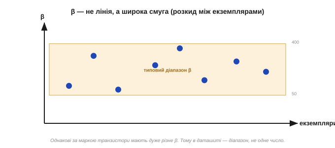
*Рис. 2.6.4.2. β — не лінія, а широка смуга. Навіть однакові за маркою транзистори мають β, що різниться в рази; до того ж воно повзе зі струмом і температурою. Тому проєктувати, спираючись на точне β, — погана ідея.*

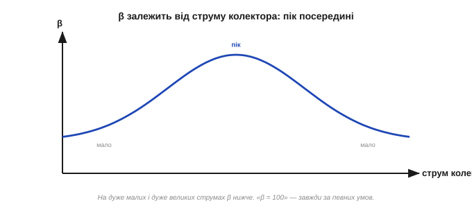
*Рис. 2.6.4.3. β залежно від струму колектора. На дуже малих і дуже великих струмах воно помітно нижче, а біля середини діапазону — найбільше. Тому «β = 100» — це завжди «за певних умов», а не на всі випадки.*

Чому β падає на краях діапазону? На дуже **малих** струмах більшу роль грають побічні витоки й рекомбінація, тож «корисна» частка носіїв меншає. На дуже **великих** струмах база ніби «захлинається» носіями, і ефективність переносу падає. Виходить, у транзистора є «улюблений» діапазон струмів, де він найефективніший, — і даташит недарма наводить β саме для типового робочого струму, а не абищо.

### Як читати β з даташита

У даташиті hFE наводять не одним числом, а **таблицею**: мінімум / типове / максимум — і обов'язково **за вказаних умов** (конкретний струм колектора Ic та напруга Uce). Золоте правило: для надійного розрахунку беріть **мінімальне** значення hFE — тоді схема працюватиме навіть із «найгіршим» екземпляром.

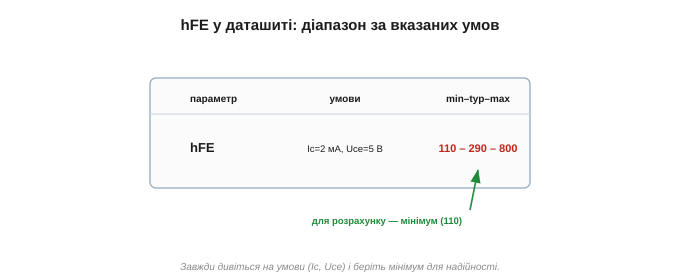
*Рис. 2.6.4.4. У даташиті hFE — це діапазон (min–typ–max) за заданих Ic та Uce. Для безпечного розрахунку завжди беруть **мінімум**: якщо схема працює з найгіршим β, спрацює з будь-яким.*

Для прикладу візьмімо реальний BC547: його hFE паспортно лежить між 110 і 800 — розкид майже у **вісім разів**! Тому в розрахунку беруть, скажімо, 110 (мінімум), а не «типове» 290. І зверніть увагу на умови поряд із числом: hFE міряють за конкретного струму колектора (наприклад, 2 мА) і напруги Uce (5 В); на інших струмах воно інакше. Звичка читати ці умови, а не лише саме число, — частина культури роботи з даташитами ([§2.6.8](bjt.md)).

(Дрібна тонкість: hFE — це підсилення для **постійного** струму, Ic/Ib; для слабкого змінного сигналу вживають близький, але окремий параметр hfe — ΔIc/ΔIb. На нашому рівні їх можна вважати майже однаковими; обидва називають «бета». Велику літеру в індексі (hFE) ставлять для постійного струму, малу (hfe) — для змінного сигналу; різниця між ними помітна лише в точних аудіо- чи вимірювальних схемах, а в звичайній практиці нею нехтують.)

### Розрахунок: скільки струму подати в базу

β найчастіше потрібне, щоб порахувати **струм бази** під заданий струм колектора.

**Приклад. Треба пропустити Ic = 100 мА через транзистор із β = 100. Який струм бази потрібен?**
```
Ib = Ic / β = 100 мА / 100 = 1 мА
```
Тобто в базу досить подати лише 1 мА, щоб у колекторі потекло 100 мА. А далі під цей Ib добирають **резистор бази**: якщо керуємо сигналом 5 В, то R = (5 − 0.7)/0.001 ≈ 4.3 кОм (0.7 В — падіння на відкритому переході база–емітер, [§2.6.3](bjt.md)).

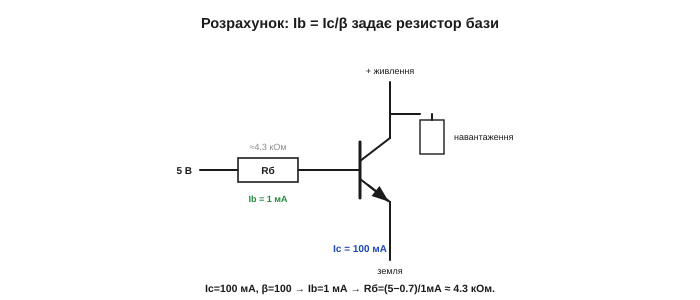
*Рис. 2.6.4.5. Коло з прикладу: щоб дістати Ic = 100 мА при β = 100, у базу пускають Ib = 1 мА; під цей струм і сигнал 5 В резистор бази виходить ≈4.3 кОм (мінус 0.7 В на переході). Так число β перетворюється на конкретний номінал.*

Другий приклад. Хай керуємо тим самим транзистором від виходу 3.3 В мікроконтролера, а ввімкнути треба 50 мА. Тоді Ib = 50/100 = 0.5 мА, а резистор бази R = (3.3 − 0.7)/0.0005 ≈ 5.2 кОм. Але якщо β «найгіршого» екземпляра лише 50, на ті самі 50 мА знадобиться вже 1 мА — тож резистор беруть менший, **із запасом**. Ось як непевність β відразу впливає на номінали. Перевірка здорового глузду: струм бази завжди має бути в рази менший за струм колектора (на те й підсилення). Якщо в розрахунку Ib вийшов співмірний з Ic — десь помилка або транзистор працює не в активному режимі.

> 🔧 **Навіщо це.** Розрахунок Ib = Ic/β — це хліб насущний транзисторних схем. Та пам'ятайте про підступність β: візьміть для розрахунку **мінімальне** β з даташита, інакше з «слабким» екземпляром струму бази не вистачить. А ще краще — будуйте схему так, щоб точне β було неважливе; як саме, читайте далі.

### Не довіряй β — проєктуй із запасом

Це, мабуть, найважливіша думка теми. Оскільки β таке непевне, **добрі схеми не залежать від його точного значення**. Два прийоми:

- **Транзистор-ключ.** Щоб надійно відкрити транзистор «навстіж», у базу подають **завідомо більше** струму, ніж Ic/β (так званий надлишок, *overdrive*) — тоді навіть екземпляр із малим β відкриється повністю. Це режим насичення ([§2.6.6](bjt.md)).
- **Підсилювач.** Підсилення роблять незалежним від β за допомогою **зворотного зв'язку**: коефіцієнт задають **резистори**, а не примхливе β транзистора ([§2.6.7](bjt.md)).

Конкретно для ключа базу зазвичай «перекачують» у кілька разів — типово в ×5…×10 проти Ic/β: цей надлишок гарантує повне відкриття за будь-якого β й температури. Кілька зайвих міліампер у базі — мала ціна за певність, що ключ справді замкнувся.

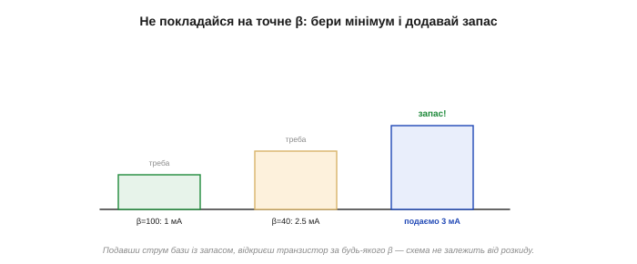
*Рис. 2.6.4.6. Мудрість роботи з β: розраховуй за мінімальним значенням і ще додай запас. У ключі — «перекачай» базу струмом, щоб відкрити напевно; у підсилювачі — віддай керування підсиленням резисторам через зворотний зв'язок. Тоді розкид β не зашкодить.*

Мантра інженера: «β — це приблизно сто, але може бути будь-чим; зроби так, щоб це не мало значення». Запам'ятайте її — вона рятуватиме ваші схеми частіше, ніж будь-яка точна формула. Звучить парадоксально для «коефіцієнта підсилення», та саме так і будують надійні схеми.

Чи не дивно це — мати «коефіцієнт підсилення», якому не можна довіряти? Зовсім ні, і в цьому мудрість інженерії. Покладатися на точну, але непевну величину — крихко; куди надійніше збудувати схему, що працює в **усьому** діапазоні β. Тому досвідчений інженер, побачивши розрахунок, де результат сильно залежить від β, одразу насторожується: десь схема вийшла ламкою. Добрий транзисторний каскад майже байдужий до того, чи β = 80, чи 400.

Покажемо думку на ключі. Якщо для ввімкнення 100 мА за β = 100 треба 1 мА в базу, то, подавши 3 мА (надлишок ×3), ви відкриєте навіть екземпляр із β = 40 — адже йому вистачить 2.5 мА. Зайвий струм бази тут не шкодить (транзистор просто йде в насичення, [§2.6.6](bjt.md)), зате схема працює з **будь-яким** транзистором «із коробки», не питаючи його точного β. Оце і є «проєктування із запасом» на ділі.

### Що далі

Отже, β — це множник Ic = β·Ib, типово ≈100, але непевний; беремо мінімум і проєктуємо із запасом. Досі ми мовчки припускали, що транзистор працює в **активному** режимі. Та насправді він має **три** робочі стани — закритий, активний і повністю відкритий, — і саме від них залежить, як його вживати: ключем чи підсилювачем. Адже режим вирішує, чи рахувати нам Ic = β·Ib (активний), чи махнути на β рукою (насичений ключ), — і це геть міняє підхід. До цих трьох режимів і переходимо.

> ▶️ Далі: [§2.6.5 Режими: відсічка, активний, насичення](bjt.md)

---

## 2.6.5 Режими: відсічка, активний, насичення

Досі ми мовчки припускали, що транзистор працює в **активному** режимі ([§2.6.3](bjt.md)). Та насправді BJT має **три** робочі стани — і від того, у якому з них він зараз, залежить геть усе: чи справджується Ic = β·Ib, чи транзистор закритий, чи відкритий навстіж. Знати ці три режими — означає розуміти, коли транзистор працює **підсилювачем**, а коли **ключем**.

### Три режими — за станом двох переходів

Режим транзистора визначає те, як зміщено два його переходи ([§2.6.2](bjt.md)):

- обидва переходи **зворотно** (чи B-E нижче ~0.7 В) → **відсічка**: транзистор закритий;
- B-E **прямо**, B-C **зворотно** → **активний**: пропорційне керування (підсилення);
- обидва переходи **прямо** → **насичення**: транзистор відкритий навстіж.

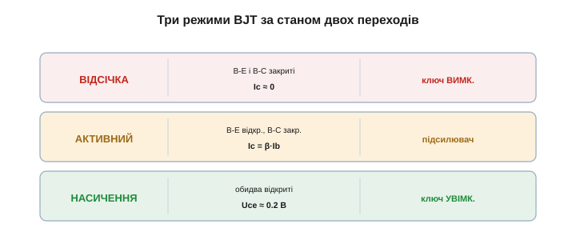
*Рис. 2.6.5.1. Три режими залежно від зміщення переходів B-E і B-C. Відсічка (обидва закриті) — транзистор «вимкнено». Активний (B-E відкрито, B-C закрито) — Ic = β·Ib, підсилення. Насичення (обидва відкриті) — транзистор «увімкнено навстіж».*

Уважний читач спитає: два переходи, по два стани кожен — це ж **чотири** комбінації, а не три? Так, є й четверта (B-E зворотно, B-C прямо — «інверсний активний»), та через несиметрію будови ([§2.6.2](bjt.md)) вона працює кепсько, і на практиці її не вживають. Тож робочих режимів — три: закрито, лінійно, відкрито навстіж.

На практиці режим легко впізнати за напругою колектор–емітер: висока Uce (близька до живлення) — транзистор **закритий** (відсічка); середня — **активний**; маленька (~0.2 В) — **насичення**. Тому, ткнувши вольтметром у колектор, інженер одразу бачить, що коїться з транзистором.

### Відсічка: транзистор закритий

Якщо на базу не подати достатньої прямої напруги (нижче ~0.7 В), струму бази немає — а отже, немає й струму колектора (Ic ≈ 0, [§2.6.3](bjt.md)). Транзистор **закритий**, як розімкнений вимикач: між колектором і емітером струм практично не тече (хіба що мізерний витік). Це стан «вимкнено».

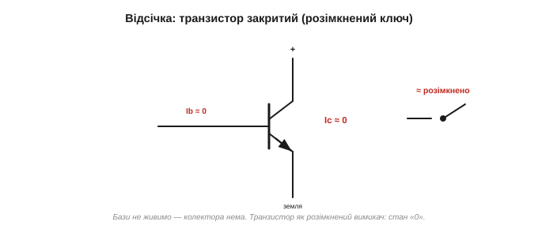
*Рис. 2.6.5.2. Відсічка: струму бази нема (B-E не відкрито) → струму колектора теж нема. Транзистор поводиться як розімкнений вимикач. Це стан «0» для ключа.*

Наскільки «закрито»? Майже ідеально: тече лише крихітний витік (нано- чи мікроампери), яким зазвичай нехтують. Тому транзистор у відсічці — чудовий розімкнений ключ. Важлива дрібниця: щоб надійно тримати його закритим, базу не лишають «висіти в повітрі», а притягують до емітера (через резистор) — інакше випадкова наводка могла б його прочинити. У цифрових схемах саме відсічка дає «логічний нуль» на вході: транзистор закритий, колектор підтягнутий резистором до живлення — і на виході висока напруга. Відкрився (насичення) — колектор сів майже на нуль, на виході низька. Так із одного транзистора-ключа й народжується інвертор — найпростіший логічний вентиль.

### Активний: пропорційне керування

Відкриваємо перехід база–емітер (пряме зміщення), а база–колектор тримаємо зворотно — це вже знайомий нам [§2.6.3](bjt.md) **активний** режим. Тут і працює золоте правило **Ic = β·Ib**: струм колектора **пропорційний** струмові бази. Транзистор поводиться як кероване базою джерело струму, що вірно відтворює форму вхідного сигналу, лише в β разів сильніше. Саме активний режим — домівка **підсилення**.

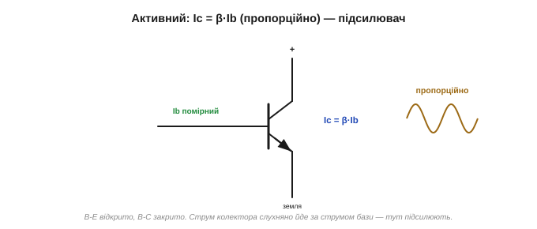
*Рис. 2.6.5.3. Активний режим: B-E відкрито, B-C закрито. Струм колектора слухняно дорівнює β·Ib — піднімаєш струм бази, пропорційно росте струм колектора. Тут транзистор підсилює.*

Активний режим ще звуть **лінійним** — бо вихід (Ic) лінійно йде за входом (Ib). Саме лінійність і потрібна підсилювачеві: щоб гучніша копія звуку не спотворювалася. Транзистор тут поводиться як **джерело струму**: за фіксованого Ib він жене в навантаження сталий Ic майже незалежно від напруги на колекторі (доки не настане насичення). Щоб утримати транзистор у цьому режимі, його заздалегідь «зміщують» — задають робочу точку десь посередині, про що [§2.6.7](bjt.md).

Властивість «сталий струм незалежно від навантаження» корисна й сама собою: на транзисторі будують **джерела стабільного струму** — наприклад, щоб світлодіод світив рівно, хоч би як мінялася його напруга чи живлення. Тож активний режим — це не лише про підсилення сигналів. А коли йдеться про підсилення, ту саму лінійність застосовують так: на базу подають слабкий **змінний** сигнал поверх постійного зміщення — і струм колектора повторює його, лише в β разів більший. Деталі — у [§2.6.7](bjt.md).

### Насичення: транзистор відкритий навстіж

А тепер нарощуймо струм бази далі. Спершу струм колектора слухняно росте (β·Ib) — але рано чи пізно він упирається в **межу**, яку дозволяє зовнішнє коло: більше за (живлення ÷ опір навантаження) крізь транзистор просто не пройде. Коли Ic досягає цієї стелі, напруга на колекторі Uce **просідає** так низько, що й перехід база–колектор відкривається. Тепер **обидва** переходи прямі — це **насичення**. Тут діють інші правила:

- струм колектора більше **не дорівнює** β·Ib — його тепер задає **коло** (навантаження й живлення), а не транзистор. Додавай струм у базу скільки хочеш — Ic уже не зросте;
- напруга колектор–емітер падає до маленької **Uce(нас) ≈ 0.2 В**. Транзистор фактично замкнений — як увімкнений вимикач із крихітним падінням.

Це стан «увімкнено» для ключа: транзистор відкритий навстіж, крізь нього тече весь дозволений колом струм, а втрачається на ньому лише ~0.2 В.

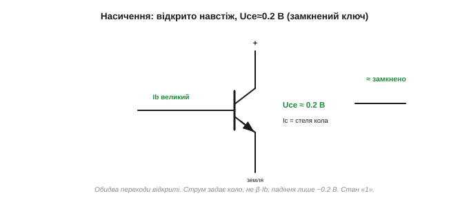
*Рис. 2.6.5.4. Насичення: обидва переходи прямі, транзистор «увімкнено навстіж». Uce падає до ≈0.2 В, а струм колектора обмежує вже не β·Ib, а зовнішнє коло. Це стан «1» для ключа.*

Чому струм упирається в стелю? Бо в колі колектора стоїть навантаження (скажімо, резистор), і весь струм мусить пройти крізь нього, впавши на ньому певною напругою (закон Ома). Що більший Ic, то більше падає на навантаженні — і то менше лишається транзисторові (Uce). Кінець кінцем майже все живлення опиняється на навантаженні, Uce падає до ~0.2 В, і більший струм коло просто не пропустить. Тоді хоч заливай базу струмом — Ic стоїть на стелі «живлення ÷ опір навантаження». Транзистор уже не керує — керує коло.

Звідки саме ~0.2 В? У насиченні відкриті **обидва** переходи, але ввімкнені вони назустріч — і падіння на них **різні** (база–емітер ~0.7 В, база–колектор трохи менше). Uce(нас) — це саме їхня **різниця**, ті самі ~0.1–0.3 В: не нуль (бо переходи не однакові), але й набагато менше за окреме падіння. Це й є мінімум, нижче якого напруга на відкритому BJT не падає. Щоб транзистор надійно **сидів** у насиченні (а не з'їхав в активний за слабкого β), у базу й подають струм із запасом ([§2.6.4](bjt.md)): надлишок гарантує, що Uce впаде до мінімуму, а ключ буде повністю відкритий і холодний.

### Перехід: від відсічки до насичення

Простежмо все разом, плавно нарощуючи струм бази від нуля:

```
Ib = 0           →  відсічка:   Ic ≈ 0           (закрито)
Ib помірний      →  активний:   Ic = β·Ib        (пропорційно росте)
Ib великий       →  насичення:  Ic = стеля кола  (далі не росте; Uce≈0.2 В)
```

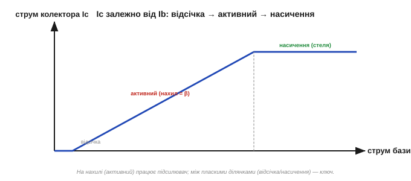
*Рис. 2.6.5.5. Як струм колектора відповідає на струм бази: спершу нуль (відсічка), далі прямо пропорційний підйом (активний, нахил = β), а тоді — насичення: струм упирається в стелю кола й більше не росте, хоч скільки додавай у базу.*

Запам'ятайте цю форму: пласко по нулю (відсічка) → прямий нахил із кутом β (активний) → горизонтальна стеля (насичення). Підсилювач працює на **нахилі**, де є пропорційність; ключ натомість **стрибає** між пласкими ділянками внизу й угорі, проскакуючи нахил якомога швидше — щоб не затримуватися в проміжному стані, де на транзисторі грілося б найбільше. Чому саме там грілося б? Бо посередині (активний режим) на транзисторі **водночас** і помітна напруга, і помітний струм — отже, велика потужність P = Uce·Ic. У крайніх станах одне з двох майже нуль (струм у відсічці або напруга в насиченні), тож і тепла мало. Тому добрий ключ перемикається швидко, не зависаючи в гарячій середині.

### Ключ чи підсилювач — два способи вжитку

Звідси випливають **два** головні застосування транзистора:

- **Ключ** (цифрова техніка): користуються лише крайніми режимами — **відсічкою** (вимкнено) і **насиченням** (увімкнено навстіж). Два стани, як у реле, але без рухомих частин і блискавично швидко. Щоб надійно «вкинути» транзистор у насичення за будь-якого β, у базу подають струм **із запасом** ([§2.6.4](bjt.md)); докладно — у [§2.6.6](bjt.md).
- **Підсилювач** (аналогова техніка): транзистор тримають у **активному** режимі, де Ic = β·Ib, і він плавно відтворює сигнал ([§2.6.7](bjt.md)).

Помітьте філософську різницю. Ключ нехтує точним β (аби лиш загнати транзистор у насичення) і живе у **двох** станах — це **цифровий** світ нулів і одиниць. Підсилювач, навпаки, дбайливо тримається лінійної ділянки, де кожна дрібниця важить, — це **аналоговий** світ плавних величин. Один прилад — дві геть різні культури проєктування, і вибір режиму вирішує, у якій ви зараз.

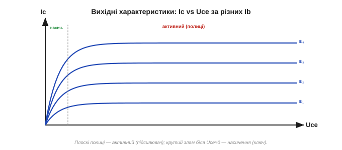
*Рис. 2.6.5.6. Сімейство вихідних характеристик (Ic залежно від Uce за різних Ib). Майже горизонтальні «полиці» — активний режим (підсилювач працює тут). Крутий злам біля Uce ≈ 0 — насичення. Ключ стрибає між кутами: «вимкнено» (внизу) і «насичення» (ліворуч угорі).*

Ці криві варто навчитися читати: на них накладають «**лінію навантаження**» — пряму, що її задає резистор у колі колектора, — і точка її перетину з кривою показує, у якому режимі й за якого струму працює транзистор. Для нас зараз досить інтуїції: майже горизонтальні «полиці» — це підсилення (де Ic майже не залежить від Uce), а лівий крутий злам — насичений ключ. (Насправді «полиці» ледь нахилені вгору — на більшій Uce струм трохи росте, це т. зв. ефект Ерлі, — та для нас вони практично горизонтальні. Саме ця майже-горизонтальність і робить транзистор добрим джерелом струму й підсилювачем.)

### Vce(нас) і невеликі втрати

Зверніть увагу: насичений транзистор — це не **ідеальний** замкнений ключ із нулем на ньому, а ключ із падінням **Uce(нас) ≈ 0.2 В**. На цьому падінні виділяється потужність P = Uce·Ic, тобто трохи тепла; на великих струмах це помітно, і потужний ключ садять на радіатор. (Діод Шотткі чи польовий транзистор тут «гублять» менше — [§2.5.8](../diode-pn-junction/diode-pn-junction.md); до польових дійдемо в Розділі 2.7.)

Прикиньмо числом: ключ проводить 1 А за Uce(нас) = 0.2 В → на транзисторі гріється P = 0.2 · 1 = 0.2 Вт. Дрібниця на малому струмі, та за 10 А це вже 2 Вт — потрібен радіатор. Саме тому для сильнострумової комутації часто беруть польовий транзистор, що у відкритому стані поводиться як крихітний опір і гріється менше.

Є в насичення й прихована вада: загнавши транзистор **глибоко** в насичення, ви накопичуєте в базі надлишок носіїв — і щоб його потім **закрити**, цей заряд треба спершу вимести, тож ключ вимикається трохи помалу. У дуже швидкісних схемах насичення тому навмисне обмежують. Та для звичайного перемикання простий насичений ключ служить чудово.

Зведімо три режими в табличку, яку варто тримати в голові:

```
відсічка:   B-E і B-C закриті    Ic ≈ 0           Uce ≈ живлення  → ключ «вимк.»
активний:   B-E відкр., B-C закр. Ic = β·Ib        Uce середня     → підсилювач
насичення:  B-E і B-C відкриті    Ic = стеля кола  Uce ≈ 0.2 В     → ключ «увімк.»
```

Глянувши на неї, ви за станом переходів (або за виміряною Uce) миттєво визначите, у якому режимі транзистор і чого від нього чекати. Ці три рядки — практично весь «характер» BJT; решта розділу лише показує, як ним користуватися на ділі — спершу ключем, а потім підсилювачем.

### Що далі

Отже, три режими: **відсічка** (закрито), **активний** (Ic = β·Ib, підсилення), **насичення** (відкрито навстіж, Uce ≈ 0.2 В). Крайні два дають ключ, середній — підсилювач. Почнімо з простішого й найпоширенішого застосування — **транзистора як ключа**: однієї копійчаної деталі, що вмикає реле, мотор чи лампу за сигналом крихітного виводу мікроконтролера.

> ▶️ Далі: [§2.6.6 BJT як ключ](bjt.md)

---

## 2.6.6 BJT як ключ

[§2.6.5](bjt.md) дав нам два крайні стани — **відсічку** (закрито) і **насичення** (відкрито навстіж). З них народжується найпоширеніша на практиці схема: транзистор як **електронний ключ**. Крихітний сигнал — наприклад, із виводу мікроконтролера — вмикає й вимикає велике навантаження: реле, мотор, лампу. Цю схему ви збиратимете чи не найчастіше, тож розберімо її ґрунтовно. Якщо колись керуватимете чимось «справжнім» — лампою, мотором, реле — з плати чи мікроконтролера, почнете саме з неї; вона того варта, щоб запам'ятати її назубок.

### Навіщо транзистор-ключ

Вивід мікроконтролера видає логічний сигнал (0 чи 3.3/5 В), але **струму** дає мало — щонайбільше десятки міліампер. Цього вистачить хіба що на світлодіод, але не на реле (десятки мА на грані), мотор (ампери!) чи яскраву лампу. Спроба живити їх просто з виводу спалить вивід або просто не зрушить навантаження. Тут і потрібен транзистор: слабкий струм виводу він перетворює на потужний струм навантаження. Транзистор — це **м'яз** між «мозком» (мікроконтролером) і навантаженням.

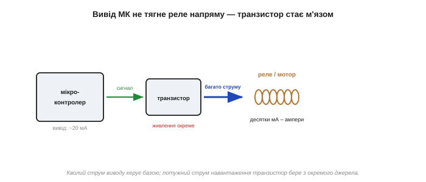
*Рис. 2.6.6.1. Вивід мікроконтролера дає сигнал, але мало струму — реле чи мотор йому не до снаги. Транзистор-ключ підсилює: кволий струм виводу керує потужним струмом навантаження від окремого джерела.*

Скільки ж дає вивід? Типовий вивід мікроконтролера віддає щонайбільше ~20–40 мА, і то на межі. Світлодіод (кілька мА) він потягне сам, а от реле (40–70 мА), невеликий мотор (сотні мА чи ампери), потужний світлодіод, нагрівач чи лампу — уже ні: або вивід перегріється й вийде з ладу, або просто не вистачить сили. Транзистор-ключ розв'язує це елегантно: вивід керує лише **базою** (1–2 мА), а потужний струм навантаження йде через колектор від **окремого** джерела. Мозок думає — м'яз тягне. Саме тому транзистор-ключ — перша «силова» схема, яку опановує кожен, хто переходить від світлодіодиків до керування справжніми пристроями: моторами, реле, освітленням.

Загалом транзистор-ключ — це **буфер** між слабким світом логіки й сильним світом навантажень: він приймає кволу команду й виконує її потужно. Майже в кожному пристрої, де мікроконтролер чимось «керує» — увімкнув підсвітку, крутнув мотор, клацнув реле, — за лаштунками стоїть такий ключ.

### Базова схема ключа (NPN, нижнє плече)

Найпростіший ключ на NPN-транзисторі збирають так: **навантаження** вмикають між плюсом живлення й колектором; **емітер** саджають на землю; **базу** живлять через резистор від керувального сигналу.

- Сигнал **високий** → крізь базу йде струм → транзистор **насичується** → навантаженням тече струм (від плюса крізь навантаження й транзистор на землю). **Увімкнено.**
- Сигнал **низький** → струму бази нема → **відсічка** → навантаження знеструмлено. **Вимкнено.**

Простежмо струм у ввімкненому ключі: він виходить із плюса живлення, проходить **навантаження**, далі крізь відкритий транзистор (колектор → емітер) і повертається на землю. Транзистор стоїть **знизу**, біля землі, — звідси й назва «нижнє плече». Навантаження ж верхнім кінцем завжди сидить на плюсі. Така схема найпростіша, бо емітер на землі, і керувати базою легко: подав на неї плюс відносно землі — відкрив. До бази сигнал заводять саме **через резистор**, а не напряму: інакше вивід і база з'єдналися б «накоротко» через відкритий перехід (≈0.7 В), і вивід тягнув би непомірний струм. Резистор бази — обов'язковий посередник між логікою й транзистором.

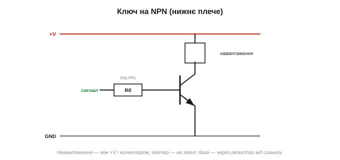
*Рис. 2.6.6.2. Класичний ключ нижнього плеча. Навантаження — між «+» і колектором; емітер — на землі; база — через резистор від сигналу. Транзистор замикає або розмикає шлях навантаження на землю. Це найпоширеніша конфігурація.*

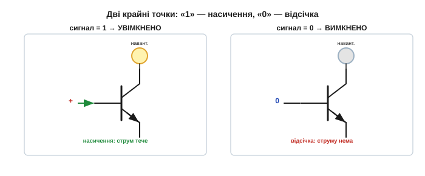
*Рис. 2.6.6.3. Ключ працює лише у двох станах (§2.6.5): сигнал «1» → насичення (транзистор як замкнений вимикач, навантаження ввімкнено), сигнал «0» → відсічка (як розімкнений, навантаження вимкнено). Проміжний активний режим тут проскакують.*

Чому ключ працює лише у двох крайніх станах, а не «трохи відкритий»? Бо саме в крайніх станах транзистор майже не гріється ([§2.6.5](bjt.md)): у відсічці немає струму, у насиченні майже немає напруги (Uce ≈ 0.2 В), тож добуток U·I — мала потужність. А «напіввідкритий» (активний) ключ розсіював би велику потужність і грівся. Тому ключ проскакує проміжний стан якнайшвидше — клац, і все. Власне, той характерний «клац» реле, увімкнутого транзистором, — це звук саме цієї схеми в дії.

### Розрахунок резистора бази

Головне в розрахунку — **гарантувати насичення**, а не точно потрапити в активний режим. Тому базу свідомо **перекачують** струмом.

1. Знаємо потрібний струм навантаження Ic.
2. Мінімальний струм бази: Ib(мін) = Ic / β(мін) — беремо **мінімальне** β з даташита ([§2.6.4](bjt.md)).
3. **Надлишок**: подаємо в кілька разів більше, Ib ≈ 3…10 × Ib(мін) (зручне правило для маленьких ключів — просто Ib ≈ Ic/10).
4. Резистор бази: R = (U(сигналу) − 0.7) / Ib.

**Приклад. Керуємо реле на 60 мА від виводу 5 В; β(мін) = 50.**
```
Ib(мін) = Ic / β(мін) = 60 мА / 50 = 1.2 мА
Ib (із запасом ×3)    ≈ 3.6 мА
R = (U − 0.7)/Ib = (5 − 0.7)/3.6 мА ≈ 1.2 кОм
```
Резистор ~1.2 кОм надійно заганяє транзистор у насичення навіть із «найгіршим» β.

Звідки той запас ×3…10? Бо β непевне ([§2.6.4](bjt.md)) і падає на великих струмах, а нам потрібне **глибоке** насичення (низька Uce, мало тепла). Із запасом транзистор сидить у насиченні твердо, а зайвий струм бази не шкодить — лише трохи глибше відкриває ключ. Простіший другий приклад: щоб засвітити яскравий світлодіод на 20 мА від виводу 5 В, досить Ib ≈ 2 мА (із запасом), тобто R ≈ (5 − 0.7)/2 мА ≈ 2 кОм; а в коло колектора зі світлодіодом ставлять ще й струмообмежувальний резистор ([§2.5.7](../diode-pn-junction/diode-pn-junction.md)). На практиці для дрібних навантажень часто й не рахують точно: резистор бази 1 кОм на 5-вольтовий сигнал дає ~4 мА — з головою на будь-який маленький ключ. Точний розрахунок потрібен, лише коли струми великі або сам сигнал слабкий.

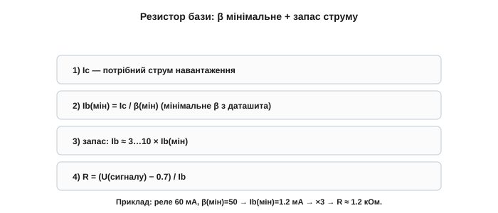
*Рис. 2.6.6.4. Розрахунок резистора бази: Ib = Ic/β (за мінімальним β), помножений на запас ×3…10 для певного насичення; далі R = (U(сигналу) − 0.7)/Ib. Надлишок струму бази не шкодить — він лише глибше відкриває ключ.*

> 🔧 **Навіщо це.** Резистор бази обов'язковий: він обмежує струм бази, інакше відкритий перехід база–емітер (≈0.7 В) майже закоротив би вивід керування й спалив би його чи базу. А «перекачування» струмом — це і є те «проєктування із запасом» із [§2.6.4](bjt.md): беремо мінімальне β, додаємо кратність — і ключ працює з будь-яким екземпляром, не питаючи його точного підсилення.

> 🧮 **Математична вставка:** [розрахунок резистора бази — насичення з запасом](math-base-resistor.md). Чому в ключі забувають паспортне β й беруть **примусове** β_forced ≈ 10, звідки це число (компроміс «недонасичення гріється» проти «забагато бази — повільне вимикання»), повне виведення Rб з прикладом — і два запобіжники: струм виводу й Vce(sat).

### Не забути гасний діод!

Найважливіше попередження теми. Якщо навантаження **індуктивне** — котушка реле, мотор, соленоїд, — паралельно йому **обов'язково** ставлять **гасний (flyback) діод** ([§2.5.9](../diode-pn-junction/diode-pn-junction.md)). У мить вимкнення котушка вистрелює сплеском напруги (V = L·di/dt), і без діода цей сплеск **пробиває транзистор**. Це чи не найчастіша помилка початківця: зібрав ключ на реле, забув діод — і транзистор гине з перших же перемикань. Діод дає струмові котушки безпечний обхід, зрізаючи сплеск.

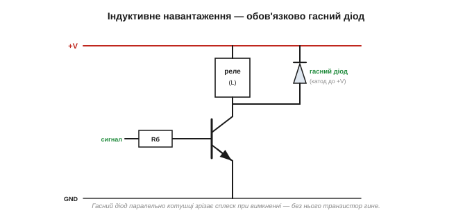
*Рис. 2.6.6.5. Реле, мотор, соленоїд — індуктивні. Паралельно такому навантаженню ставлять гасний діод (катодом до «+»). Без нього сплеск при вимкненні пробиває транзистор. Це правило не має винятків для індуктивних навантажень.*

Орієнтація діода важлива: його ставлять паралельно котушці **катодом до плюса** (у нормі він замкнений, [§2.5.9](../diode-pn-junction/diode-pn-junction.md)); коли ключ розмикається й напруга на котушці перевертається, діод відкривається й замикає струм котушки на себе. Для **неіндуктивних** навантажень (резистор, лампа розжарення, світлодіод) діод не потрібен — сплеску нема. Та якщо є хоч найменший сумнів щодо індуктивності (а в моторах і реле вона є завжди), діод ставлять: він не завадить, а може врятувати ключ. Нагадаймо масштаб загрози: сплеск від котушки реле сягає сотень вольтів — більш ніж досить, щоб пробити транзистор, розрахований на десятки. Тому забутий гасний діод — не дрібний недогляд, а майже гарантована смерть ключа на індуктивному навантаженні.

### Притягувальний резистор бази

Ще одна корисна звичка: між базою та емітером ставлять **притягувальний резистор** (кілька десятків кілоом). Він тримає транзистор **закритим**, коли керувальний сигнал «висить у повітрі» — наприклад, поки мікроконтролер скидається чи вивід ще не налаштовано. Без нього випадкова наводка могла б самочинно ввімкнути навантаження. Копійчана деталь — а рятує від несподіванок. Номінал тут зовсім не критичний: десятки кілоом — досить, щоб надійно стягнути базу до нуля, але не марнувати струм, коли сигнал високий. Особливо це важить у перші частки секунди після ввімкнення живлення, поки мікроконтролер ще не «прокинувся», а його виводи в невизначеному стані: без притягувального резистора реле чи мотор могли б на мить самочинно смикнутися.

### Нижнє плече проти верхнього

Описаний ключ — **нижнього плеча** (*low-side*): транзистор стоїть **між навантаженням і землею** й комутує «мінусовий» шлях. Це найпростіше й найпоширеніше. Та інколи навантаження мусить одним кінцем сидіти на землі (так зручніше чи безпечніше) — тоді комутують **верхнє плече** (*high-side*) транзистором **PNP**: він стоїть між плюсом і навантаженням. Керувати верхнім плечем трохи складніше (база PNP має йти **нижче** плюса, щоб відкрити), але принцип той самий.

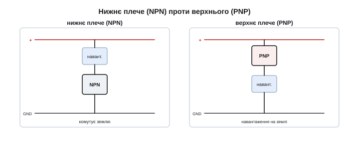
*Рис. 2.6.6.6. Дві конфігурації. Нижнє плече: NPN між навантаженням і землею (просто, поширено). Верхнє плече: PNP між плюсом і навантаженням (коли навантаження має сидіти на землі). Обидва — той самий ключ, лише з різного боку.*

Навіщо взагалі верхнє плече? Уявіть, що навантаження одним кінцем мусить сидіти на спільній землі (так часто буває заради безпеки чи зручності розведення). Тоді комутувати землю не можна — доводиться розмикати плюс, а це робота для PNP у верхньому плечі. Складність у тому, що базу PNP, аби відкрити, треба **опустити** нижче плюса, а сигнал мікроконтролера зазвичай ходить між нулем і плюсом, — тому верхнє плече часто керують через ще один, маленький NPN. На практиці новачки починають із нижнього плеча, а верхнє опановують згодом.

> 🔌 **Компонентна вставка:** [ключ у плюсовому проводі — PNP high-side](comp-high-side-pnp.md). Чому простої заміни NPN на PNP замало: мікроконтролер не дістає до повної напруги живлення, щоб **закрити** PNP, тож той потрібен маленький NPN-«перекладач рівня». Повна схема з підтягувальним резистором, неінвертована логіка — і навіщо взагалі розривати «плюс» (спільна земля, безпека).

### Який транзистор і для чого

Добираючи транзистор-ключ, дивляться насамперед на **струм**: максимальний струм колектора Ic(макс) із даташита має із запасом перекривати струм навантаження ([§2.6.8](bjt.md)). Для дрібниць (світлодіод, мале реле) досить копійчаного BC547 чи 2N2222 (до ~100–800 мА); для моторів і потужних реле беруть міцніші (TIP120, BD139) на радіаторі. Дивляться й на максимальну напругу колектор–емітер (щоб витримала живлення плюс можливий сплеск) і на потужність. А коли струми великі, дедалі частіше замість BJT беруть **польовий** транзистор — він у відкритому стані гріється менше (Розділ 2.7).

А якщо струм навантаження великий, а β малого транзистора замало (потрібен надто великий струм бази)? Тоді ставлять два транзистори каскадом — пару **Дарлінгтона** ([§2.6.4](bjt.md)) — і сумарне β сягає тисяч, тож база задовольняється мізерним струмом виводу. Платня — трохи більше падіння напруги на ключі.

Що зазвичай вмикають таким ключем? Реле (а через нього — будь-що потужне), мотори й вентилятори, соленоїди й електромагніти, потужні чи численні світлодіоди, зумери, нагрівачі, ще один транзисторний каскад. Майже все, що «вмикається/вимикається» за командою, у дрібній електроніці комутують саме транзистором-ключем — він дешевий, малий і безвідмовний. Опанувавши цю одну схему, ви вмикатимете з мікроконтролера будь-що — від світлодіода до промислового реле.

### Що далі

Отже, транзистор-ключ — це проста, але всюдисуща схема: навантаження, транзистор, резистор бази, а для індуктивних — обов'язково гасний діод. Запам'ятайте цей короткий список — навантаження зверху, транзистор за струмом, резистор бази з запасом, гасний діод для котушок, притягувальний резистор для певності — і зберете надійний ключ майже не думаючи. Ми використали **крайні** режими (відсічку й насичення). Друге велике застосування — це **активний** режим, де транзистор не клацає, а плавно підсилює сигнал. До підсилювача й переходимо.

> ▶️ Далі: [§2.6.7 BJT як підсилювач](bjt.md)

---

## 2.6.7 BJT як підсилювач

Ключ ([§2.6.6](bjt.md)) користувався двома крайніми режимами. А тепер — друге велике застосування транзистора, заради якого його, власне, і винайшли: **підсилювач**. Тут транзистор не клацає, а тримається в **активному** режимі ([§2.6.5](bjt.md)) і **плавно** перетворює слабкий сигнал на сильну копію. Це світ аналогової електроніки — і він трохи тонший за ключ, тож рушаймо обережно.

### Завдання й перешкода

Мета проста: зробити з кволого сигналу велику, але **вірну** його копію. Активний режим, де Ic = β·Ib, ніби готовий це дати — пропорційність є. Але є й перешкода. Реальні сигнали (звук, радіо) гойдаються **в обидва боки** — то плюс, то мінус. А струм бази не може бути від'ємним: перехід база–емітер проводить лише в один бік. Якщо подати «сирий» змінний сигнал просто на базу, то додатні півхвилі він підсилить, а від'ємні — **зріже** (транзистор закриється), і вийде не підсилювач, а випрямляч ([§2.5.6](../diode-pn-junction/diode-pn-junction.md)).

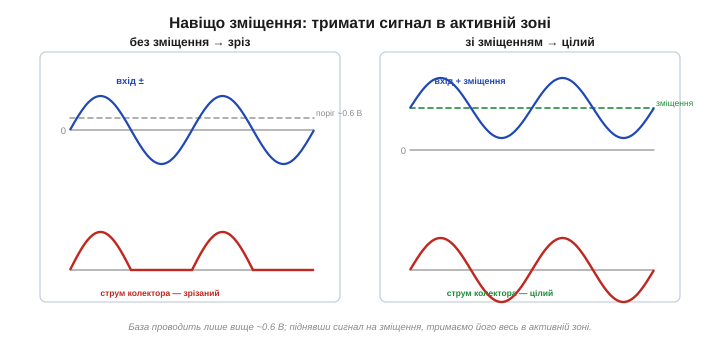
*Рис. 2.6.7.1. Якщо подати змінний сигнал прямо на базу, від'ємні півхвилі закриють транзистор, і він їх зріже — вийде спотворення. Розв'язок — підняти сигнал на постійне «зміщення», щоб він увесь лишався в активній зоні (праворуч).*

Підкреслимо слово **вірну**: підсилювач має дати більшу, але **точну** копію — інакше музика звучала б спотворено. Тому й потрібен лінійний (активний) режим, де вихід пропорційний входу. А спроба підсилити «в лоб» дала б лише половину сигналу — той самий ефект, що в діода-випрямляча ([§2.5.6](../diode-pn-junction/diode-pn-junction.md)): одна півхвиля пройшла, друга зникла. Підсилювач без зміщення — це насправді кепський випрямляч.

А ще зауважте: підсилення «безкоштовне» лише на вигляд. Енергію могутнішого вихідного сигналу дає **джерело живлення** ([§2.6.1](bjt.md)); транзистор лише ліпить за слабким зразком потужну подобу, черпаючи силу з живлення. Тому й підсилювач, і ключ потребують окремого живлення — без нього підсилювати нічим.

### Розв'язок: зміщення (робоча точка)

Хитрість — у **зміщенні** (*bias*). Спершу задають **постійний** струм бази, що тримає транзистор посередині активного режиму — у так званій **робочій точці** (*Q-point*): скажімо, такий, щоб струм колектора був на половині свого діапазону. А вже **поверх** цього постійного зміщення накладають слабкий змінний сигнал. Тепер струм бази гойдається **навколо** робочої точки, та ніколи не падає до нуля — і весь сигнал, обидві його півхвилі, лишається в активній зоні й чесно підсилюється.

Образно: ми підняли «гойдалку» сигналу на поміст, щоб вона не вдарялась об землю на нижньому розмаху. Зміщення — це той поміст.

Як саме виставляють робочу точку? Постійним струмом у базу — найчастіше через **дільник напруги** з двох резисторів, що задає сталу напругу на базі, а отже, і сталий струм колектора. Цей постійний струм тече **завжди**, навіть без сигналу, — ось чому класичний підсилювач у спокої постійно щось споживає (на відміну від ключа, що вимкнений майже не їсть). Точку ставлять так, щоб напруга на колекторі була десь **посередині** між живленням і нулем: тоді є простір гойдатися і вгору, і вниз.

> 🧮 **Математична вставка:** [робоча точка й навантажувальна пряма](math-load-line.md). Графічний інструмент, що знаходить «середину» точно: пряма Vce = Vcc − Ic·Rc на сімействі вихідних характеристик, її перетин із кривою зміщення — робоча точка Q; видно, чому Q посередині дає найбільший чистий розмах, звідки інверсія й як із нахилу прямої читається підсилення. До того ж той самий емітерний резистор Re, що задасть підсилення, ще й **утримує** робочу точку: підросте струм випадково (скажімо, від нагріву) — на Re впаде більше напруги, це трохи прикриє транзистор і поверне струм назад. Один зворотний зв'язок працює і на стабільність точки, і на стабільність підсилення воднораз.

Корисний образ: робоча точка — це постійний «приплив», а сигнал — невеликі **хвильки** поверх нього. Транзистор увесь час відкритий приблизно наполовину (приплив тримає його там), а слабкий вхід лише трохи розгойдує його туди-сюди навколо цієї точки. На виході виходить та сама хвилька, але велика. Тому, до речі, на вході й на виході ставлять **розділові конденсатори** ([Розділ 2.1](../capacitor/capacitor.md)): вони пропускають змінну «хвильку» сигналу, але не дають постійному припливу зміщення витекти до сусідніх кіл чи зіпсувати їхні власні робочі точки. Сигнал їде «верхи» на зміщенні всередині каскаду — і сходить із нього на виході чистим.

### Схема зі спільним емітером

Найпоширеніший підсилювальний каскад — **зі спільним емітером** (*common-emitter*). Його кістяк:

- резистор колектора **Rc** — від плюса живлення до колектора (на ньому й «проявиться» підсилений сигнал);
- емітер — на землю (зазвичай через невеликий резистор **Re**);
- база **зміщена** (наприклад, дільником напруги), щоб задати робочу точку;
- вхідний сигнал заводять на базу **через конденсатор** — він пропускає змінний сигнал, але блокує постійне зміщення ([§2.1.6](../capacitor/capacitor.md));
- вихід знімають із колектора, теж через конденсатор.

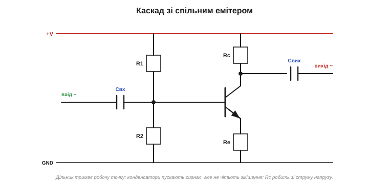
*Рис. 2.6.7.2. Каскад зі спільним емітером. Дільник задає робочу точку на базі; вхідний конденсатор пускає сигнал, але не чіпає зміщення; Rc перетворює струм колектора на напругу; вихід знімають із колектора. Re стабілізує роботу.*

> 🔌 **Компонентна вставка:** [найпростіший підсилювач на макетці — спільний емітер](comp-common-emitter.md). Зберемо цей каскад руками: конкретні номінали (BC547, 9 В, R1/R2, Rc, Re, конденсатори), як виставити робочу точку мультиметром (Vc ≈ половина живлення), що покаже осцилограф (більший перевернутий сигнал, кліп) — і пастки макетки (фон 50 Гц, земля, контакти).

Навіщо тут конденсатори? Бо сигнал змінний, а зміщення постійне, і їх треба **розв'язати**. Вхідний конденсатор пропускає змінний сигнал на базу, але не дає джерелу сигналу збити ретельно виставлене постійне зміщення (він блокує постійку, [§2.1.6](../capacitor/capacitor.md)). Вихідний так само віддає назовні лише змінну складову, не випускаючи постійної напруги колектора. Дільник на базі, Rc у колекторі, Re в емітері та два конденсатори зв'язку — ось і весь типовий каскад.

### Як воно підсилює (і перевертає)

Стежмо за подіями. Напруга на базі трохи **зросла** → струм бази зріс → струм колектора зріс у β разів → крізь Rc потекло більше струму → на Rc впало більше напруги → отже, напруга на колекторі **впала**. Маленький підйом на вході — велике падіння на виході. Тобто каскад **підсилює** і водночас **перевертає** сигнал (вхід угору — вихід униз). Уся магія перетворення «струм → напруга» — у резисторі Rc: зміна струму колектора, помножена на Rc, і дає велику зміну вихідної напруги.

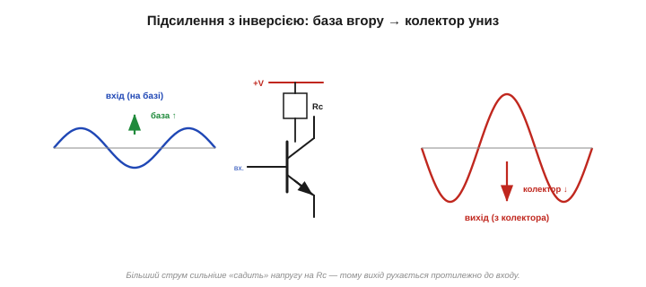
*Рис. 2.6.7.3. Маленький підйом напруги на базі викликає велике падіння на колекторі (бо більший струм сильніше «садить» напругу на Rc). Вихід — підсилена й **перевернута** копія входу. Резистор Rc перетворює зміну струму на зміну напруги.*

Чому саме інверсія? Бо вихід ми знімаємо з колектора, а напруга там — це «живлення мінус падіння на Rc». Більший струм колектора — більше падіння на Rc — менше лишається на колекторі. Тож коли вхід штовхає струм **угору**, вихідна напруга йде **вниз**, і навпаки. Інверсія — природний наслідок того, що сигнал ми читаємо «згори» резистора. (У повторювачі, де вихід беруть з емітера, інверсії якраз немає.)

### Підсилення = −Rc/Re

Наскільки сильно підсилює? Коефіцієнт підсилення за напругою — це відношення зміни виходу до зміни входу. Для каскаду з емітерним резистором він напрочуд простий:

```
Підсилення ≈ − Rc / Re
```

Мінус — це інверсія. А головне диво: підсилення задають **резистори** Rc і Re, а **не** примхливе β транзистора! Хочете підсилення 10 — беріть Rc у десять разів більший за Re. Це і є та хитрість зі [§2.6.4](bjt.md): емітерний резистор створює **від'ємний зворотний зв'язок**, який стабілізує і робочу точку, і підсилення, роблячи їх незалежними від розкиду β. Платимо за це частиною підсилення — зате схема працює передбачувано з будь-яким транзистором.

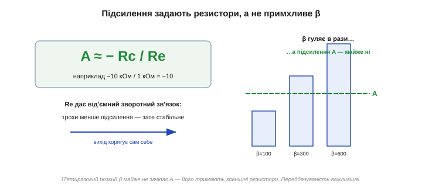
*Рис. 2.6.7.4. Коефіцієнт підсилення ≈ −Rc/Re — його задають два резистори, а не β. Емітерний резистор Re дає від'ємний зворотний зв'язок: трохи жертвуємо підсиленням заради того, щоб воно не «плавало» від екземпляра до екземпляра. Передбачуваність важливіша за голу величину.*

> 🔧 **Навіщо це.** Ось чому реальні підсилювачі майже завжди мають емітерний резистор (або глибший зворотний зв'язок): без нього підсилення дорівнювало б β й «плавало» б у рази між транзисторами та з температурою. Зі зворотним зв'язком підсилення задане резисторами — стабільне, повторюване, передбачуване. Це той самий принцип, на якому стоятиме й операційний підсилювач (Розділ 2.8): не довіряй точному підсиленню приладу — задай його зовнішніми резисторами.

Покажемо стабільність на числах. Хай Rc = 10 кОм, Re = 1 кОм — підсилення ≈ −10, і воно таке і для транзистора з β = 80, і для β = 400: різниця β у п'ять разів майже не зачіпає підсилення, бо його тримають резистори. Без Re підсилення дорівнювало б приблизно β — і стрибало б у ті самі п'ять разів від екземпляра до екземпляра, що для якісного звуку неприйнятно. Ось чому жертва частиною підсилення заради зворотного зв'язку — майже завжди вигідний обмін. А бракує підсилення — ставлять **кілька** каскадів поспіль, і їхні підсилення перемножуються. Саме так, нарощуючи каскади й обплітаючи їх зворотним зв'язком, зрештою дійшли до **операційного підсилювача** — мікросхеми з велетенським власним підсиленням, якій лишилося тільки задати зовнішніми резисторами, скільки того підсилення використати (про це Розділ 2.8).

### Обмеження сигналу: кліпування

Підсилювати безкарно можна лише **малий** сигнал. Якщо вхід завеликий, вихідний розмах упреться в «стелю» (живлення) чи «підлогу» (насичення), і верхівки сигналу **зріжуться** — це **кліпування** (*clipping*), грубе спотворення. Тому сигнал тримають достатньо малим, щоб транзистор увесь час лишався в активній зоні, не зриваючись у насичення чи відсічку.

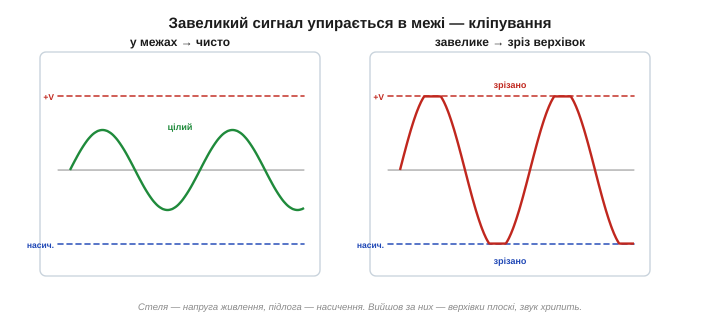
*Рис. 2.6.7.5. Якщо розмах на виході перевищує межі (живлення згори, насичення знизу), верхівки зрізаються — кліпування. Підсилений сигнал спотворюється. Тому в підсилювачі тримають сигнал у межах лінійної ділянки.*

Простір, у якому вихід може гойдатися без кліпування, звуть **запасом** (*headroom*). Що ближче робоча точка до середини й що менший сигнал, то більший запас. У звуці кліпування чути як хрипке спотворення на гучних місцях — знак, що підсилювачеві забракло запасу. Тому потужні підсилювачі живлять вищою напругою: більше «стелі» — більший неспотворений розмах. Тож «слабкий сигнал» — поняття відносне: слабкий **проти** запасу. Мілівольти на вході каскаду з підсиленням 100 дадуть на виході вольти — і якщо запас лише кілька вольтів, навіть такий «слабкий» вхід уже близько до межі.

### Повторювач: підсилювач, що не підсилює напругу

Згадаймо ще одну корисну схему — **емітерний повторювач** (*emitter follower*), де вихід знімають не з колектора, а з **емітера**. Він **не** підсилює напругу (коефіцієнт ≈ 1!) — навіщо ж він? Бо підсилює **струм/потужність** і служить **буфером**: має великий вхідний опір (майже не навантажує джерело сигналу) і малий вихідний (легко жене потужне навантаження). Це «перетворювач опорів»: ставлять його, коли слабке джерело має розкачати важке навантаження, не просівши.

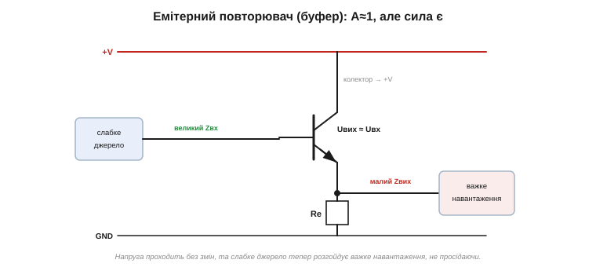
*Рис. 2.6.7.6. Емітерний повторювач: вихід із емітера, напруга та сама (підсилення ≈1), зате великий вхідний опір і малий вихідний. Це буфер: слабке джерело крізь нього розгойдує важке навантаження, не просідаючи.*

Навіщо буфер на ділі? Уявіть слабке джерело сигналу (давач чи попередній каскад із великим вихідним опором) і важке навантаження (динамік, довгий кабель). Під'єднай їх напряму — навантаження «просадить» кволе джерело, і сигнал зів'яне. Повторювач стає між ними: великим вхідним опором він майже не вантажить джерело, а малим вихідним — легко гойдає навантаження. Напруга та сама, але тепер за нею стоїть «сила».

### Три способи ввімкнення

Залежно від того, який вивід спільний для входу й виходу, є три класичні схеми. **Спільний емітер** (наш головний) — підсилює і напругу, і струм, перевертає сигнал; робоча конячка. **Спільний колектор** (він же емітерний повторювач) — буфер, підсилення напруги ≈1. **Спільна база** — рідкісна, для дуже високих частот. На практиці майже всі каскади — це спільний емітер та повторювач; із них і складають складніші підсилювачі.

Підсилювачі на транзисторах — усюди, де слабкий сигнал треба зробити сильним: мікрофонний підсилювач, радіоприймач, аудіотракт, кола давачів. Сьогодні їх частіше будують на готових мікросхемах-операційниках (Розділ 2.8), але всередині тих мікросхем — ті самі транзисторні каскади, що ми щойно розібрали.

### Що далі

Отже, ми побачили обидва обличчя транзистора: **ключ** (крайні режими) і **підсилювач** (активний режим зі зміщенням і зворотним зв'язком). Лишилося звести практику докупи: як обрати транзистор під задачу й прочитати про нього в даташиті. Цим і завершимо знайомство з біполярним транзистором.

> ▶️ Далі: [§2.6.8 Практика: керування навантаженням, вибір за даташитом](bjt.md)

## 2.6.8 Практика: керування навантаженням, вибір за даташитом

Ми розібрали транзистор як ідею, як фізику, як ключ і як підсилювач. Лишився крок, заради якого все це й затівалося: **взяти конкретний транзистор у руку й увімкнути ним щось реальне** — реле, моторчик, стрічку світлодіодів, електромагніт — не випустивши «магічного диму». Цей розділ — місток від теорії до столу: як прочитати даташит *(datasheet)*, обрати прилад під задачу й розрахувати обв'язку, щоб працювало надійно, а не «поки не нагріється».

### Завдання: ввімкнути те, що сильніше за вивід мікроконтролера

Вивід мікроконтролера *(MCU pin)* — істота квола: він дає десь **5…20 мА** за 3.3 чи 5 В, і це майже стеля. А «споживачі» довкола ненажерливі: котушка реле просить 50…100 мА, моторчик — сотні міліампер чи й ампери, електромагніт-соленоїд *(solenoid)* — так само, лампа на 12 В чи довга світлодіодна стрічка — ще більше. Під'єднати таке навантаження прямо до виводу — спалити його (а часто й увесь чип).

Тут і виходить на сцену транзистор — **м'яз між мозком і навантаженням**. Мікроконтролер дає кволий сигнал на базу; транзистор пропускає крізь себе великий струм від окремого живлення. Ми вже бачили цю схему в [§2.6.6](bjt.md) як «ключ»; тепер навчимося **обирати** під неї транзистор за числами, а не навмання.

### Що шукати в даташиті

Даташит на транзистор — це таблиця граничних параметрів *(maximum ratings)* і характеристик. Не треба читати всю; для драйвера навантаження вистачає семи рядків.

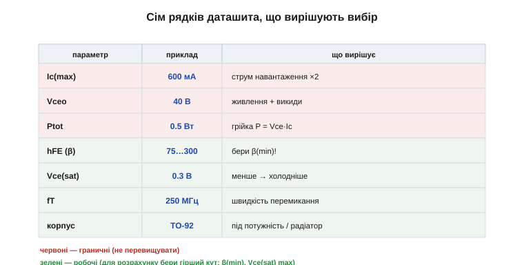
*Рис. 2.6.8.1. Сім параметрів, що вирішують вибір. Граничні (не перевищувати!) — зверху; робочі — нижче. Для розрахунку завжди беруть **гірший** кут: найменше β, найбільше Vce(sat).*

- **Ic(max)** — найбільший струм колектора *(collector current)*. Правило: бери транзистор, де Ic(max) **щонайменше вдвічі** більший за струм твого навантаження. Запас — на пускові кидки й на старіння.
- **Vceo (Vce(max))** — пробійна напруга колектор–емітер *(breakdown voltage)* при відкритій базі. Має **перевищувати** напругу живлення з добрим запасом — пам'ятай про викиди від індуктивних навантажень ([§2.2.5](../inductor/inductor.md)), що можуть у рази перевищити живлення.
- **hFE (β)** — коефіцієнт підсилення струму ([§2.6.4](bjt.md)). Найважливіше: у даташиті він даний **діапазоном** (напр. 75…300), і для розрахунку ключа беруть **β(min)** — найменше. Інакше один «слабкий» екземпляр не дотягне навантаження.
- **Vce(sat)** — напруга насичення *(saturation voltage)*, та невелика напруга, що лишається на відкритому ключі ([§2.6.5](bjt.md)). Чим менша — тим менше тепла й тим більше живлення дістається навантаженню.
- **Ptot (Pd)** — найбільша розсіювана потужність *(power dissipation)*, яку прилад витримує без перегріву. Її переходити не можна (ще й із поправкою на температуру).
- **fT** — гранична частота *(transition frequency)*: як швидко транзистор устигає перемикатися. Для реле байдуже, для ШІМ-керування моторчиком чи для підсилювача — важливо.
- **Корпус** *(package)* — TO-92 (маленький пластиковий, до ~0.5 А, без радіатора); TO-220 (силовий, з металевою пластиною під радіатор, на ампери).

Важливо тримати в голові: усе, що в даташиті позначене як «гранично» *(maximum ratings)*, — це межа **руйнування**, а не робоча точка. Проєктують завжди із запасом від цих чисел. Ба більше, дозволену потужність зі зростанням температури **знижують** *(derating)*: те, що при 25 °C прилад тримає як 1 Вт, при 100 °C витримає вже помітно менше — бо тепловідведення гірше. Тому «працює на столі» і «працює надійно в гарячому корпусі влітку» — не одне й те саме.

> 🔧 **Навіщо це.** Чому β(min), а не «типове» значення? Бо даташит гарантує лише мінімум. Якщо порахувати резистор бази на типове β=200, а в коробці трапиться екземпляр із β=80, ключ не ввійде в насичення — транзистор «недовідкриється», застрягне в активному режимі, де на ньому впаде багато напруги, і він **перегріється**. Проєктуй на гірший випадок — і працюватиме будь-який екземпляр.

### Приклад: драйвер реле з повним розрахунком

Зведімо все в один наскрізний приклад — найчастіший на практиці. Хай треба ввімкнути **реле з котушкою 5 В / 70 мА** сигналом із мікроконтролера (5 В на виводі).

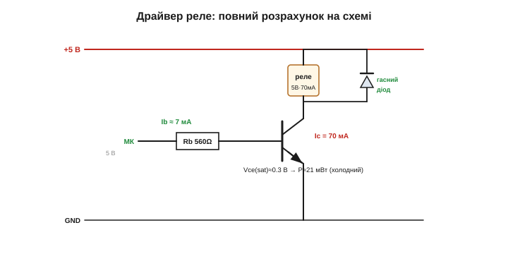
*Рис. 2.6.8.2. Драйвер реле крок за кроком: реле між +5 В і колектором, емітер на землю, база через резистор від виводу МК, гасний діод паралельно котушці.*

**Крок 1 — обрати транзистор.** Навантаження 70 мА → треба Ic(max) ≥ 140 мА. Беремо популярний **2N2222**: Ic(max) ≈ 600 мА ✓ (з добрим запасом), Vceo ≈ 40 В ✓ (живлення лише 5 В). Корпус TO-92 — без радіатора. Чому саме вдвічі із запасом по струму? Бо реальний струм буває більший за табличний: у перші мілісекунди ввімкнення котушка чи мотор тягнуть пусковий кидок, а з роками й від нагріву параметри «пливуть». Запас по Ic(max) — дешева страховка, що коштує копійки, а рятує від раптових відмов.

> 🔌 **Компонентна вставка:** [робочі конячки 2N2222, BC547, 2N3904](comp-bjt-families.md). Три малопотужні NPN, які лежать у кожного: чим різняться, як читати суфікси (BC547A/B/C — групи β, 2N2222A — версія), де PNP-пари — і головна пастка: розпіновка TO-92 у європейських і американських серій **дзеркальна**, тож виводи завжди звіряють із даташитом.

**Крок 2 — мінімальне β.** Даташит дає hFE(min) ≈ 75, але при більших струмах підсилення трохи провисає, тож візьмемо консервативно **β ≈ 50**. Тоді струм бази, щоб лише-лише провести 70 мА:

```
Ib(min) = Ic / β(min) = 70 мА / 50 = 1.4 мА
```

**Крок 3 — запас на насичення.** Ключ має не просто провести струм, а ввійти в **глибоке насичення** ([§2.6.5](bjt.md)), де Vce(sat) найменша. Для цього базу «перезаливають» — дають у 3…10 разів більше струму, ніж мінімум. Візьмемо ×5:

```
Ib = 5 × 1.4 мА = 7 мА
```

**Крок 4 — резистор бази.** На переході база–емітер падає ~0.7 В, решта напруги сигналу лягає на резистор:

```
Rb = (U(сигналу) − 0.7) / Ib = (5 − 0.7) / 0.007 ≈ 614 Ом → беремо стандартні 560 Ом
```

**Крок 5 — гасний діод.** Котушка реле — індуктивність; при вимиканні вона «брикається» викидом напруги ([§2.2.5](../inductor/inductor.md)), що проб'є транзистор. Ставимо паралельно котушці **гасний діод** *(flyback diode)* катодом до +V — він замикає викид на себе ([§2.6.6](bjt.md), [§2.5.9](../diode-pn-junction/diode-pn-junction.md)). Підійде 1N4148 чи 1N4007.

**Крок 6 — перевірити грійку.** У насиченні Vce(sat) ≈ 0.3 В, тож на транзисторі розсіюється

```
P = Vce(sat) × Ic = 0.3 В × 0.07 А ≈ 21 мВт
```

— дрібниця, TO-92 лишається холодним. Готово: робочий драйвер реле на п'яти копійчаних деталях.

**Крок 7 — перевірити сам вивід.** Лишилось спитати: чи витримає вивід мікроконтролера ті 7 мА, що ми ллємо в базу? Типовий вивід віддає до ~20 мА, тож 7 мА — спокійно в межах бюджету. Якби база просила більше (потужніший ключ із меншим β), довелося б або взяти транзистор із вищим β, або поставити пару Дарлінгтона (нижче), або перейти на MOSFET — бо там керують напругою, і вивід майже не вантажиться.

### Скільки гріється ключ

Тепло — головний ворог силового транзистора, і рахується воно просто: **потужність на транзисторі = напруга на ньому × струм крізь нього**, `P = Vce · Ic`.

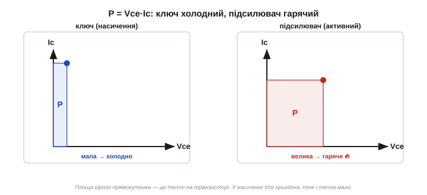
*Рис. 2.6.8.4. Та сама формула P = Vce·Ic дає дрібну грійку в режимі ключа (Vce(sat) мале) і велику — в активному режимі (Vce посеред живлення). Ключ холодний, лінійний підсилювач — гарячий.*

Звідси ключове розуміння: **ключ гріється мало, підсилювач — багато**. Коли транзистор у насиченні, Vce(sat) крихітна, тож і добуток малий — як у нашому реле, 21 мВт. А коли транзистор «застряг» посередині (активний режим, як у підсилювачі [§2.6.7](bjt.md)), на ньому падає половина живлення при повному струмі — і та сама формула дає вже вати. Тому лінійні підсилювачі потужності й гарячі, і їх садять на радіатори.

Окрема небезпека біполярного транзистора — **тепловий розгін** *(thermal runaway)*: нагрівся → пропускає більший струм → нагрівся ще дужче. Емітерний резистор Re ([§2.6.7](bjt.md)) гасить цю петлю від'ємним зворотним зв'язком. І завжди: розсіювана потужність має лишатися **нижче Ptot** із даташита (ще й зі знижкою на робочу температуру).

> 🔧 **Навіщо це.** Приклад на відчуття масштабу: силовий TIP120 жене моторчик на 2 А, а Vce(sat) у нього (це пара Дарлінгтона, див. нижче) аж ~2 В. Тоді P = 2 В × 2 А = **4 Вт** — це вже маленький паяльник. Без радіатора такий транзистор за секунди піде в перегрів і захист. Завжди множ Vce на Ic — і дивись, чи не вийшло «грілки».

### Коли струм великий: пара Дарлінгтона

Що як навантаження жадібне (ампери), а сигнал кволий і β звичайного транзистора не дає потрібного струму бази? Складають **два транзистори в пару Дарлінгтона** *(Darlington pair)*: вихід першого годує базу другого, і їхні підсилення **перемножуються** — сумарне β сягає тисяч. Тоді навіть мікроамперна база керує амперами.

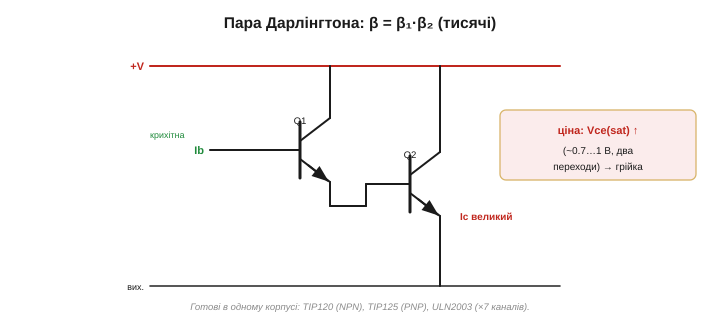
*Рис. 2.6.8.5. Два транзистори: емітер першого живить базу другого. Підсилення перемножуються (β ≈ β₁·β₂ — тисячі), зате Vce(sat) удвічі більша, бо тепер два переходи поспіль.*

Плата за велике β — **підвищена Vce(sat)** (≈0.7…1 В замість 0.2…0.3), бо у відкритому стані «стоять» уже два переходи. Звідси більше тепла — як ми щойно бачили на TIP120. Готові Дарлінгтони в одному корпусі — TIP120 (NPN), TIP125 (PNP); є й збірки на кілька каналів (ULN2003) для драйва кількох реле відразу.

> 🔌 **Компонентна вставка:** [Дарлінгтон і ULN2003 — сім ключів в одному корпусі](comp-darlington-uln.md). Готовий драйвер на 7 каналів із вбудованими резисторами баз і гасними діодами: як він улаштований (відкритий колектор, спільний COM), класична зв'язка з кроковим двигуном 28BYJ-48, чому всі канали разом на максимум вантажити не можна — і коли пора по MOSFET-масив.

### Коли тягнутися по MOSFET

У біполярного ключа є вроджена вада: щоб тримати навантаження ввімкненим, у базу треба **постійно лити струм** `Ib = Ic / β`. Для амперних навантажень це десятки міліампер, що гріють резистор бази й розряджають батарею **весь час**, поки ключ відкритий. Для економних чи дуже сильнострумових схем це марнотратство.

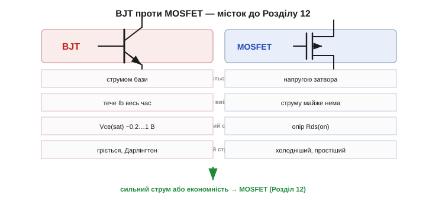
*Рис. 2.6.8.6. Біполярний керується **струмом** бази (тече весь час), польовий — **напругою** на затворі (струму майже не треба). Для сильнострумового перемикання частіше виграє MOSFET. Детально — у Розділі 2.7.*

Саме тут на сцену виходить інший транзистор — **польовий** *(MOSFET)*. Ним керують **напругою** на затворі, а не струмом: відкрив полем — і тримай майже задарма, струму в затвор практично не треба. У відкритому стані в нього не «напруга насичення», а малесенький **опір** Rds(on) — тож на великих струмах він часто холодніший за біполярний. Через це для сильнострумового перемикання (моторчики, перетворювачі живлення, силові кола) сьогодні зазвичай беруть MOSFET. Біполярний лишається там, де він зручний: дрібні ключі, реле, лінійні підсилювачі, аналогові тонкощі. Інакше кажучи, біполярний нікуди не зник — він просто поступився троном у силовому перемиканні. У дрібній логіці керування, де струми мирні, він і досі чи не найпростіший вибір.

> 🔧 **Навіщо це.** Одне речення на запам'ятовування: **BJT керують струмом, MOSFET — напругою**. Якщо ключ вмикається рідко й струм невеликий — біполярний простий і дешевий. Якщо струм великий, перемикань багато або важлива економність — бери MOSFET. Чому саме так він влаштований — у наступному розділі.

### Чек-ліст вибору транзистора

Звівши все докупи, ось рецепт, яким можна користуватися як шаблоном.

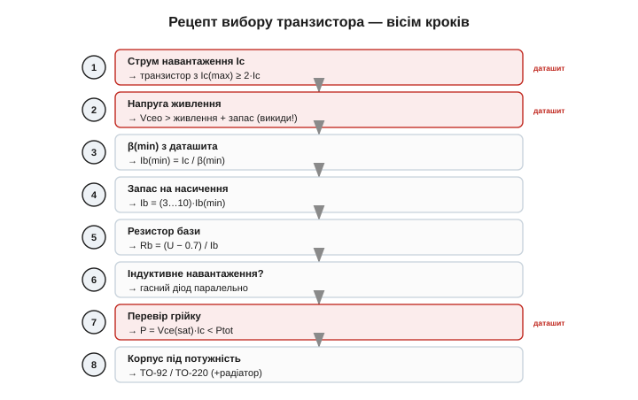
*Рис. 2.6.8.3. Сім кроків від «що вмикаю» до готової обв'язки. Червоні вилки — місця, де перевіряють граничні параметри з даташита.*

1. **Струм навантаження Ic** → транзистор із Ic(max) ≥ 2·Ic.
2. **Напруга живлення** → Vceo > живлення + запас (особливо при індуктивному навантаженні!).
3. **β(min) з даташита** → Ib(min) = Ic / β(min).
4. **Запас на насичення** ×3…×10 → робочий Ib (для ключа).
5. **Резистор бази** Rb = (U(сигналу) − 0.7) / Ib.
6. **Індуктивне навантаження** (реле, мотор, соленоїд) → гасний діод паралельно.
7. **Перевір грійку** P = Vce(sat)·Ic < Ptot; великий струм → радіатор або MOSFET.
8. **Корпус** під потужність: TO-92 для дрібниці, TO-220 для сили.

### Перехід до практики

> 📜 **Історія до теми:** [Regency TR-1 і шлях Sony — транзистор, що поклав радіо в кишеню](hist-tr1-sony.md). Як ті самі копійчані транзистори, що ми вчилися вибирати, у 1954 році вийняли радіо з вітальні: перший кишеньковий приймач (американський Regency TR-1) — і чому масовий ринок виграла японська Sony з її сорочками-«кишеньками». Урок: винайти перший — не те саме, що виграти ринок.

На цьому ми розібрали біполярний транзистор як деталь: від ідеї керованого крана ([§2.6.1](bjt.md)) через фізику переходів і β до двох його ремесел — **ключа** й **підсилювача** — і до чек-листа вибору за даташитом. Лишилося зібрати все це в одну живу схему й побачити, як вона зшиває цілий модуль. Найкращий приклад — драйвер **реле**: тут транзистор-ключ керує котушкою, котушка брикається при вимкненні, а діод її приборкує. Одна скромна схема — а в ній сходяться три різні теми. Нею і завершимо розділ.

---

## 2.6.9 Реле і його драйвер

Дотепер транзистор у нас вмикав абстрактне «навантаження». Тепер поставимо на його місце конкретний і дуже поширений прилад — **реле** — і зберемо повну, робочу схему керування. Ця тема особлива: вона нічого нового про транзистор не додає, зате **зшиває** докупи три речі, які ми вивчали нарізно. Транзистор-ключ ([§2.6.6](bjt.md)) керуватиме котушкою реле — а котушка це індуктивність ([§2.2.1](../inductor/inductor.md)), яка при вимкненні **брикається** викидом ([§2.2.5](../inductor/inductor.md)), і той викид доведеться гасити **діодом** ([§2.5.9](../diode-pn-junction/diode-pn-junction.md)). Три теми, що жили окремо, тут складаються в одну схему — і саме на ній найкраще видно, як інженерія збирається з цеглинок.

### Що таке реле

**Реле** (*relay*) — це вимикач, яким керує не палець, а **електромагніт**. Усередині — котушка на залізному осерді, рухомий важіль-**якір** і набір контактів:

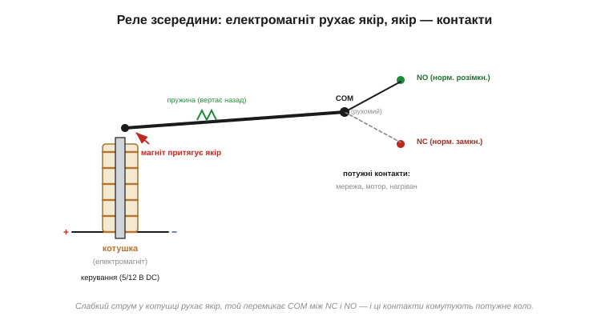
*Рис. 2.6.9.1. Пропустіть струм крізь котушку — осердя намагнічується й притягує якір; той перемикає рухомий контакт COM з нормально замкнутого (NC) на нормально розімкнутий (NO). Виключіть струм — пружина вертає якір назад. Слабкий струм котушки керує потужними контактами.*

Контактів зазвичай три: **COM** (спільний, рухомий), **NO** (*normally open*, нормально розімкнутий) і **NC** (*normally closed*, нормально замкнутий). У спокої COM притиснутий до NC; під струмом котушки якір перекидає COM на NO. Тобто реле — це звичайний перемикач, тільки натискає на нього магнітне поле котушки, а не людина. Звідси й уся його суть: **кволий струм у котушці комутує потужне коло на контактах**, фізично нічого не торкаючись руками.

### Навіщо реле, коли є транзистор

Резонне питання: ми ж щойно навчилися вмикати навантаження транзистором — навіщо ще й реле? Бо реле вміє те, чого транзистор не може. По-перше, його контакти **гальванічно відділені** від котушки — між колом керування й комутованим колом немає електричного з'єднання, лише магнітний зв'язок:

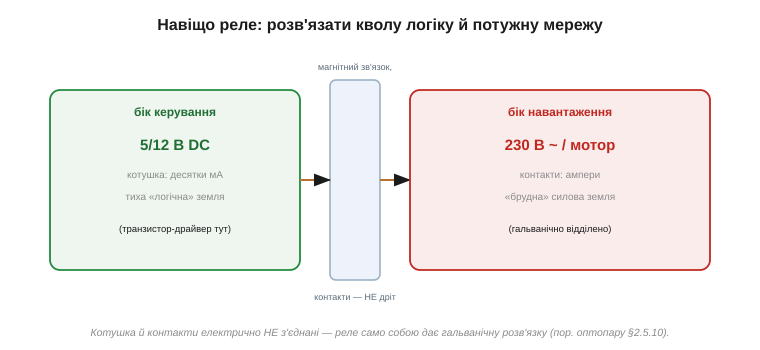
*Рис. 2.6.9.2. Котушка живиться тихими 5–12 вольтами логіки, а контакти комутують 230 вольт мережі чи мотор — і ці два світи електрично не з'єднані. Реле само собою дає гальванічну розв'язку, як оптопара ([§2.5.10](../diode-pn-junction/diode-pn-junction.md)), лише магнітом.*

По-друге, металеві контакти однаково легко комутують і постійний струм, і **змінну мережу**, і високу напругу — те, з чим простий транзистор не впорається без складної обв'язки. Тому реле досі скрізь: умикати мережевий нагрівач, мотор, лампу, перемикати лінії — усе це класична робота реле, де воно поза конкуренцією за простотою й ціною. Транзистор натомість потрібен **перед** реле — як підсилювач струму, бо саму котушку слабкий вивід мікроконтролера не потягне.

### Чому котушці потрібен драйвер

Котушка реле тягне десятки, а то й сотні міліампер при своїх 5 чи 12 вольтах — куди більше, ніж дає ніжка мікроконтролера (одиниці міліампер). Підключити реле прямо до виводу не можна: або вивід не потягне, або згорить. Між ними ставлять **транзистор-ключ** ([§2.6.6](bjt.md)) — той самий «підсилювач струму», що бере кволий сигнал у базу й пропускає потужний струм колектора крізь котушку. Мікроконтролер ледь ворушить базою — транзистор живить котушку з окремого джерела.

### Повна схема: усе модуля разом

Зберемо драйвер цілком — і подивимося, скільки вивченого в ньому сходиться:

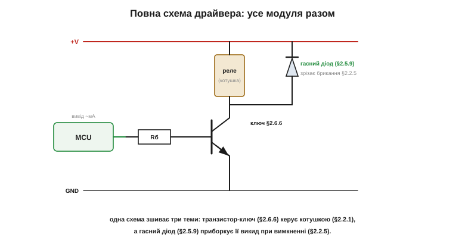
*Рис. 2.6.9.3. Мікроконтролер через резистор бази керує NPN-ключем (§2.6.6); котушка реле — між «плюсом» і колектором; гасний діод — паралельно котушці, катодом до «плюса». Три теми в одній схемі: ключ, котушка, гасіння викиду.*

Прочитаймо схему зліва направо. Мікроконтролер подає логічну «1» — через **резистор бази** (його рахуємо на насичення з запасом, [§2.6.6](bjt.md)) струм заходить у базу й **насичує** транзистор ([§2.6.5](bjt.md)). Відкритий ключ з'єднує нижній кінець котушки з землею — котушка під повним струмом, осердя намагнічується, якір клацає, контакти перемикаються. Подали «0» — транзистор замикається, струм котушки уривається.

І ось тут на сцену виходить третя тема. Котушка — індуктивність, а індуктивність **не дозволяє** урвати свій струм миттєво ([§2.2.5](../inductor/inductor.md)): у мить розмикання вона «брикається» високовольтним викидом, що легко пробив би транзистор. Рятунок — **гасний діод** (*flyback*, [§2.5.9](../diode-pn-junction/diode-pn-junction.md)), увімкнений паралельно котушці катодом до «плюса». У нормальній роботі він зворотно зміщений і мовчить; у мить викиду — відкривається й дає струму котушки безпечно стекти по колу, зрізавши сплеск. Без цього діода драйвер реле живе недовго — тому в кожній такій схемі він обов'язковий. Погляньте на схему ще раз: транзистор-ключ, котушка, гасний діод, резистор бази — і кожен елемент прийшов зі своєї теми. Оце і є інженерія: не нові закони, а звичні цеглинки, складені під задачу.

### Драйвер у числах

Пройдімо розрахунок цілком, на типовому реле. Хай котушка живиться 5 вольтами й тягне 70 мА, а ми керуємо нею звичайним NPN-транзистором (скажімо, BC547 чи 2N2222) від виводу мікроконтролера на 3.3 В:

```
струм навантаження:  Ic = 70 мА (струм котушки)
β(мін) з даташита:    візьмемо обережно 50
Ib(мін) = Ic/β =      70/50 = 1.4 мА
запас на насичення ×3: Ib ≈ 4 мА
резистор бази:        Rб = (3.3 − 0.7)/4мА ≈ 650 Ом → беремо 470 Ом
гасний діод:          1N4148 (швидкий) або 1N4007 — катодом до +5 В
```

Кілька зауваг до чисел. Транзистор беремо так, щоб його гранична Ic була щонайменше вдвічі більша за струм котушки (70 мА — то малопотужний BC547 ще годиться). Резистор бази округлюємо **вниз** (470 замість 650 Ом) — зайвий струм бази не шкодить, а от недосвічена база лишила б транзистор у «напіввідкритому» стані, де він гріється. І перевіримо грійку: у насиченні на транзисторі падає ≈0.2 В, тож P = 0.2 В · 70 мА ≈ 14 мВт — мізер, радіатор не потрібен. Уся обв'язка — три копійчані деталі, а керує мережевим приладом.

### Реле має свій характер

Реле — прилад механічний, і це накладає особливості, яких нема в чистій електроніці:

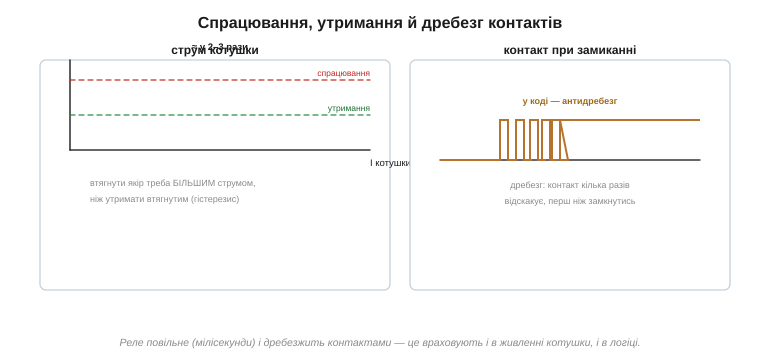
*Рис. 2.6.9.4. Втягнути якір треба більшим струмом (спрацювання), ніж утримати втягнутим (утримання) — у рази більшим. А замикаючись, контакт кілька разів відскакує — «дребезжить», перш ніж застигнути.*

Дві риси варто знати. Перша — **гістерезис струму**: щоб якір рушив і втягнувся, потрібен помітний струм спрацювання, а щоб утримати його втягнутим — значно менший. Тому реле має чітко визначену напругу спрацювання, нижче якої воно «не бере». Друга — реле **повільне** (спрацьовує мілісекундами, а не наносекундами, як транзистор) і **дребезжить контактами**: у мить замикання контакт кілька разів відскакує, перш ніж застигнути. Якщо реле комутує сигнал, який далі читає логіка, цей дребезг доводиться прибирати — апаратно або в коді (антидребезг). Дрібниця, про яку забувають новачки, і яка потім дається взнаки химерними збоями.

### Найслабша ланка — контакти

Транзистор у драйвері захищено діодом, а от самі **контакти** реле зношуються — і це їхня головна вада:

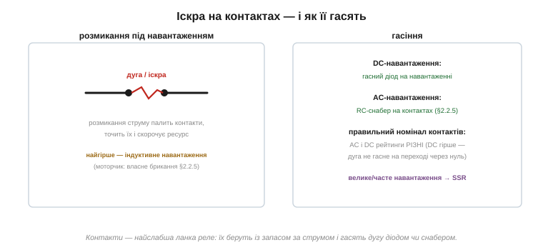
*Рис. 2.6.9.5. Розмикаючи струм, контакти тягнуть за собою маленьку дугу-іскру, що поступово їх випалює. Найгірше — індуктивне навантаження (мотор з його власним бриканням): його викид роздуває дугу. Гасять її діодом (на DC) чи RC-снабером (на AC, [§2.2.5](../inductor/inductor.md)).*

Щоразу, як контакти розмикають струм, між ними проскакує крихітна **дуга** — і потроху випалює метал. Що більший струм і що індуктивніше навантаження, то гірше: мотор чи інша котушка на контактах брикається власним викидом, роздуваючи іскру. Звідси кілька правил. Контакти беруть **із запасом** за струмом. На постійному навантаженні їх боронять гасним діодом (просто на боці навантаження); на змінному — **RC-снабером** ([§2.2.5](../inductor/inductor.md)), бо діод у мережі не годиться. І окрема пастка для початківця: **номінали контактів для AC і DC різні**, причому постійний струм комутувати важче — дуга на ньому не гасне сама, тоді як змінний струм сто разів на секунду проходить через нуль і дугу обриває. Тому реле, розраховане на «10 А ~230 В», на постійному струмі може витримати лише частку цього.

> 🔌 **Компонентна вставка:** [реле зсередини — контакти, ресурс і номінали AC/DC](comp-relay-inside.md). Як читати числа на корпусі (паспортна «10 А» — резистивна; для лампи/мотора/ємності в рази менше), два різні ресурси (механічний проти електричного), чому DC важчий за AC — і навіщо для слабких сигналів золочені контакти (змочувальний струм).

### Реле бувають різні

Доти ми мали на увазі одне найпростіше реле, та сімейство ширше — і вибір моделі впливає і на схему, і на можливості:

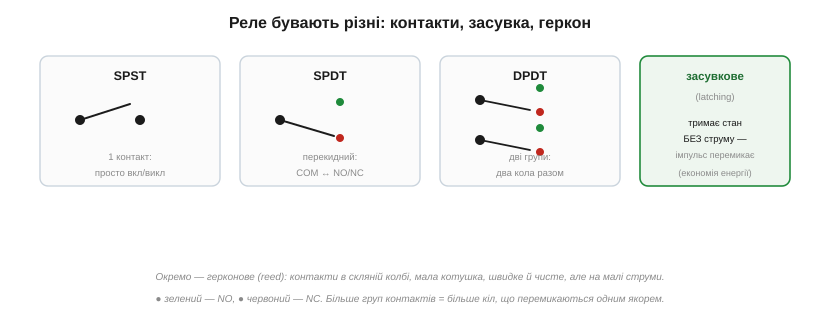
*Рис. 2.6.9.7. За контактами: SPST (просто вкл/викл), SPDT (перекидний COM↔NO/NC, як на Рис. 2.6.9.1), DPDT (дві групи контактів, що перемикаються разом). Окремо — засувкове (latching) реле, що тримає стан без струму, і герконове.*

Розрізняють реле передусім **за контактами**. Найпростіше — SPST: один контакт, лише вмикає й вимикає. SPDT (те, що на наших рисунках) — перекидний, із трьома виводами COM/NO/NC, уміє переключати лінію з одного кола на інше. DPDT — це фактично **два** перекидні контакти, що рухаються разом від одного якоря: ним перемикають одразу два кола (наприклад, обидва дроти живлення). Що більше груп — то більше кіл під одним керуванням.

Окремо стоять два цікаві різновиди. **Засувкове** (*latching*) реле має два стійкі стани й тримає контакти без струму: короткий імпульс перекидає його в один бік, інший імпульс — назад, а між тим котушка знеструмлена. Це велика економія енергії там, де реле має місяцями стояти ввімкненим (живлення від батареї, розумні лічильники) — але драйвер тоді складніший, бо мусить давати імпульси обох полярностей. А **герконове** (*reed*) реле — це контакти в запаяній скляній колбі, які замикає магнітне поле крихітної котушки: воно швидке, чисте, довговічне, але комутує лише малі струми. Для слабких сигналів — ідеальне; для мережі — ні.

### Чим замінити реле

Електромеханічне реле дешеве й універсальне, але механіка — це знос, дребезг і клацання. Тому в нього є суперники:

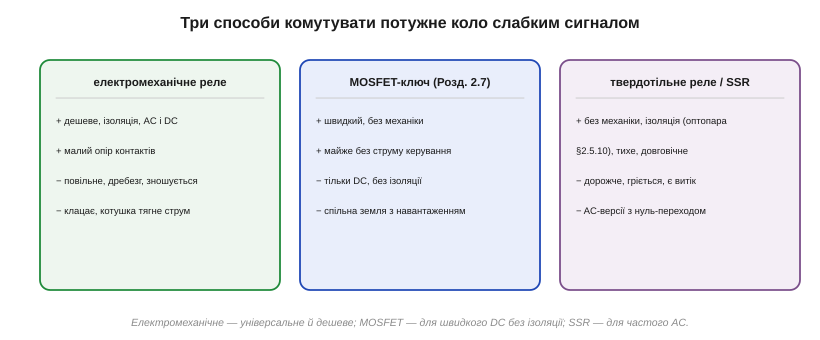
*Рис. 2.6.9.6. Електромеханічне реле — універсальне, з ізоляцією, комутує і AC, і DC, але повільне й зношується. MOSFET-ключ — швидкий і майже без струму керування, але лише DC і без ізоляції. Твердотільне реле (SSR) — без механіки, з оптичною ізоляцією, для частого AC.*

Якщо комутувати треба **постійний** струм і без гальванічної розв'язки — частіше беруть **MOSFET-ключ** (наступний розділ): він швидкий, не зношується й майже не потребує струму керування. Якщо ж треба часто й тихо вмикати **змінну мережу** — ставлять **твердотільне реле** (SSR): усередині оптопара ([§2.5.10](../diode-pn-junction/diode-pn-junction.md)) розв'язує керування, а вмикає мережу симістор; механіки нема зовсім, тож воно безшумне й довговічне, хоч і дорожче та гріється. А просте електромеханічне реле з транзисторним драйвером лишається там, де треба дешево, з ізоляцією й «щоб працювало з будь-чим» — у платах автоматики, побутовій техніці, реле-модулях для тих самих мікроконтролерів.

> 🔌 **Компонентна вставка:** [модуль реле — що на платі, крім самого реле](comp-relay-module.md). Готовий реле-модуль — це весь драйвер цієї теми вже зібраний (ключ + діод + часто оптопара + індикатор); чому багато модулів вмикаються логічним «нулем» (active-low) і клацають на старті, і навіщо джампер живлення VCC/JD-VCC, що вирішує — справжня ізоляція чи фіктивна.

> 🔧 **Навіщо це.** Драйвер реле — обряд посвяти вбудованої електроніки, бо в ньому сходиться все: транзистор-ключ із резистором бази на насичення ([§2.6.6](bjt.md)), **обов'язковий** гасний діод на котушці ([§2.5.9](../diode-pn-junction/diode-pn-junction.md)), окреме живлення котушки, гальванічна розв'язка контактами. Збираючи його: не забудьте діод (без нього транзистор гине), беріть транзистор і контакти з запасом за струмом, на змінному навантаженні додайте снабер, а в логіці передбачте антидребезг. Знаєте цю схему — вмієте безпечно ввімкнути мікроконтролером будь-що: від лампи до мотора.

### Підсумок розділу

Реле-драйвер гарно завершує розділ, бо показує біполярний транзистор у його найприроднішій ролі — **підсилювача струму між кволою логікою й потужним світом**. Ми пройшли весь шлях: від ідеї керованого крана ([§2.6.1](bjt.md)) через фізику двох переходів і коефіцієнт β до двох ремесел транзистора — **ключа** ([§2.6.6](bjt.md)) і **підсилювача** ([§2.6.7](bjt.md)) — і до практики вибору за даташитом ([§2.6.8](bjt.md)), що зійшлася в живому драйвері реле. Та в останніх темах уже не раз визирав суперник: **польовий транзистор**, яким керують не струмом, а полем. Він влаштований інакше, гріється менше на сильних струмах, майже не потребує струму керування — і саме тому лежить в основі всієї цифрової техніки й сучасного силового перемикання. З нього й почнемо наступний розділ.

> ▶️ Далі: [Розділ 2.7 — Польовий транзистор (MOSFET)](../mosfet/mosfet.md)
