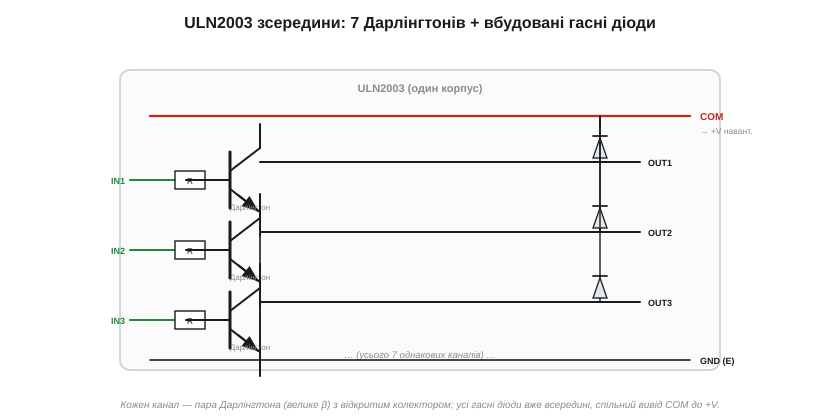

# 🔌 Дарлінгтон і ULN2003: сім ключів в одному корпусі

> Це компонентна вставка до теми [2.6.6 «BJT як ключ»](bjt.md). Тема навчила збирати ключ із транзистора, резистора й гасного діода. Коли таких ключів треба не один, а сім чи вісім — реле, соленоїди, обмотки крокового двигуна, — їх не паяють поодинці, а беруть готову мікросхему-масив. Найвідоміша — **ULN2003**: сім Дарлінгтон-ключів із вбудованими діодами в одному корпусі. Розберемо, що в ній і чим за неї платять.

### Що таке Дарлінгтон — коротко

**Пара Дарлінгтона** — це два транзистори, з'єднані так, що вихід першого живить базу другого; їхні підсилення **перемножуються**, тож сумарне β сягає тисяч (докладніше — у [§2.6.8](bjt.md)). Практичний наслідок: крихітний струм бази — одиниці мікроампер від виводу мікроконтролера — керує сотнями міліампер навантаження. Ціна за велике β — підвищене падіння у відкритому стані: у парі стоять **два** переходи поспіль, тож Vce(sat) ≈ 1 В замість 0.2 В у одиночного ([§2.6.6](bjt.md)). Це падіння гріє ключ і відбирає вольт у навантаження — головна вада Дарлінгтона.

### ULN2003 зсередини

ULN2003 пакує сім таких пар в один корпус — готовий драйвер на сім каналів:

*Рис. 2.6.6c.1. Кожен канал — пара Дарлінгтона з резистором у базі й **відкритим колектором** на виході. Усі сім гасних діодів уже всередині, їхні катоди зведено на спільний вивід COM, який під'єднують до «плюса» навантажень.*

Три речі варто помітити. По-перше, **резистор бази вже вбудований** — на вхід можна подавати логічний сигнал прямо, нічого не рахуючи. По-друге, виходи — це **відкриті колектори**: вони не дають напруги, а лише **притягують** свій вивід до землі (sink, нижнє плече). Тому навантаження вішають між «плюсом» і виходом OUTx; коли вхід «1», транзистор відкривається й притискає OUT до землі — струм тече крізь навантаження. По-третє, найзручніше — **сім гасних діодів уже всередині** ([§2.5.9](../diode-pn-junction/diode-pn-junction.md)): їхній спільний вивід COM заводять на «плюс» котушок, і будь-яке індуктивне навантаження (реле, соленоїд, обмотка двигуна) захищене без жодної зовнішньої деталі. Уся обв'язка драйвера реле з теми тут уже зібрана — і помножена на сім.

### Навіщо, чим і де межа

*Рис. 2.6.6c.2. Одна мікросхема керує масивом реле, соленоїдами, світлодіодними матрицями — і класично кроковим двигуном 28BYJ-48. Кожен канал тягне до 500 мА при напрузі до 50 В.*

Параметри типові: **до 500 мА на канал**, до 50 В на виході. Канали можна **з'єднувати паралельно** для більшого струму. Найвідоміше застосування — драйвер дешевого крокового двигуна 28BYJ-48: чотири обмотки двигуна заводять на чотири канали ULN2003, і мікроконтролер крутить мотор, перемикаючи входи (самі крокові двигуни — тема пізніших розділів). А масив реле, гірлянда соленоїдів чи світлодіодна матриця — задача, наче створена під цю мікросхему.

Родина: **ULN2003** (7 каналів), **ULN2803** (8 каналів) — той самий принцип, більше ключів. А межі прямо випливають із Дарлінгтона. Падіння ≈1 В на відкритому ключі **гріє** мікросхему, тож працює обмеження **сумарної потужності корпусу**: усі сім каналів **одночасно** на повному струмі ввімкнути не можна — корпус перегріється; в даташиті є графік, скільки каналів і за якого струму допустимо. І ще: ULN — тільки **нижнє плече** (sink), до «плюса» він навантаження не вмикає. Там, де падіння Дарлінгтона задороге (сильний струм, економність), сьогодні беруть **MOSFET-масиви** (TBD62083-клас і подібні) — у них замість Vce(sat) малий опір каналу, тож падіння й нагрів у рази менші.

> 🔧 **Навіщо це.** Треба ввімкнути кілька реле, соленоїдів чи обмоток одним чипом — беріть ULN2003/2803: резистори баз і гасні діоди вже всередині, лишається завести навантаження між «плюсом» і виходами, а COM — на «плюс». Пам'ятайте три речі: це **нижнє плече** (тягне до землі, вхід «1» вмикає), на ключі падає ≈1 В (Дарлінгтон гріється — не вантажте всі канали на максимум разом), а для сильнострумових чи економних задач сучасний MOSFET-масив випередить старий біполярний ULN.
