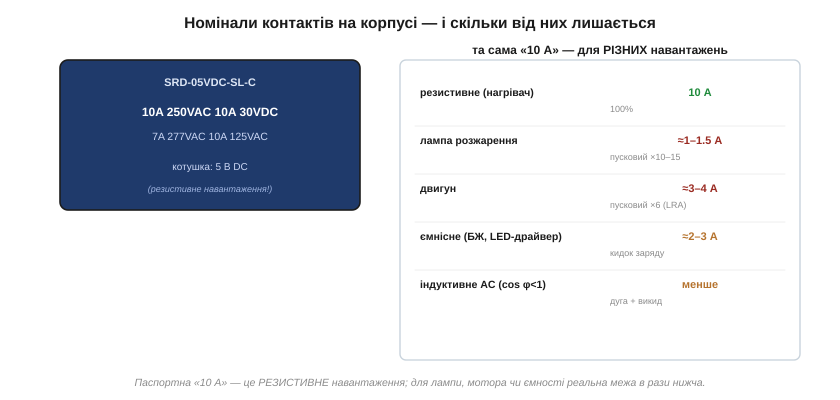
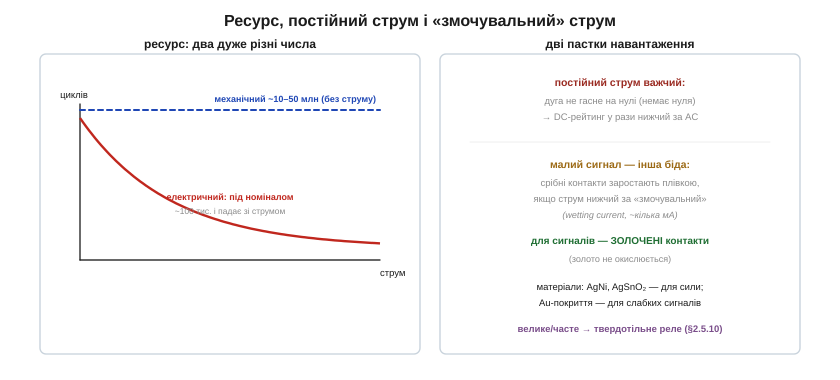

# 🔌 Електромеханічне реле зсередини: контакти, ресурс і номінали AC/DC

> Це компонентна вставка до теми [2.6.9 «Реле і його драйвер»](bjt.md). Тема показала, як реле влаштоване й чому контакти — його найслабша ланка. Тут поглянемо на саме реле як на **компонент**, що його треба обрати: як читати номінали на корпусі (і чому «10 А» — це майже завжди менше за 10 А), скільки реле живе, чому постійний струм для нього важчий за змінний, і коли потрібні золочені контакти.

### Як читати номінали на корпусі

На реле друкують ряд чисел, і кожне щось означає:

*Рис. 2.6.9c.3. Типове реле: «10A 250VAC / 10A 30VDC». Перше число — струм контактів, друге — напруга, окремо для змінного й постійного. Котушка — окремий рядок. Але ця «10 А» — для **резистивного** навантаження; для лампи, мотора чи ємності реальна межа в рази нижча.*

Головна пастка новачка: паспортна цифра — це **резистивне** навантаження (нагрівач, лампа розжарення в усталеному режимі). Для інших навантажень її треба ділити:

- **Лампа розжарення** холодною ниткою тягне пусковий струм у 10–15 разів більший за робочий ([§1.3 про залежність опору від температури](../../block-1-circuits-physics/resistance-power-heat/resistance-power-heat.md)) — реле на «10 А» лампового навантаження потягне лише ~1 А.
- **Двигун** при пуску бере струм загальмованого ротора (LRA) у ~6 разів вищий за номінал.
- **Ємнісне навантаження** (вхід імпульсного блока, LED-драйвер) дає різкий кидок заряду в момент замикання.
- **Індуктивне AC** (cos φ < 1) додає до іскри ще й власний викид ([§2.2.5](../inductor/inductor.md)).

Тому реле беруть **із запасом** під реальний характер навантаження, а не під табличну цифру; у даташиті часто є окремі рядки «resistive / motor / lamp».

### Два ресурси: механічний і електричний

У реле **два** дуже різні числа довговічності, і плутати їх не можна:

*Рис. 2.6.9c.4. Механічний ресурс (скільки разів клацне без струму на контактах) — десятки мільйонів циклів. Електричний (під номінальним струмом) — лише сотні тисяч, і він стрімко падає зі зростанням комутованого струму.*

**Механічний ресурс** — десятки мільйонів спрацювань: це межа самої механіки (пружина, якір), без струму на контактах. **Електричний ресурс** — на порядки менший (сотні тисяч під номіналом), бо щоразу контакти трохи випалює дуга ([§2.6.9](bjt.md)); і що більший струм, то швидше вони зношуються. Тому, проєктуючи довговічний пристрій, дивляться саме на електричний ресурс **за свого** струму й типу навантаження, а не на «красиве» механічне число.

### Чому постійний струм важчий

Тема вже згадала, що DC-рейтинг нижчий за AC, — варто зрозуміти чому. Змінний струм сто разів на секунду проходить через **нуль**, і в цю мить дуга між контактами гасне сама. Постійний струм нуля не має — дуга, раз виникнувши при розмиканні, **тримається**, тягнеться за контактами й випалює їх куди сильніше. Тому реле на «10 А 250 В AC» постійного струму комутує лише, скажімо, «10 А 30 В DC»: при вищій постійній напрузі дугу вже не розірвати. У серйозних DC-реле контакти роблять із більшим розльотом або додають **магнітне гасіння дуги** (магніт відтягує дугу вбік, де вона рветься). Звідси правило: для постійного струму завжди звіряйтеся з **DC**-рядком даташита, не з ефектним AC-числом.

### Малий сигнал: інша біда й золочені контакти

Парадокс: для контактів небезпечний не лише великий струм, а й **надто малий**. Срібні контакти (матеріали AgNi, AgSnO₂ — стандарт для сили) із часом заростають тонкою плівкою оксиду й бруду; пробити її допомагає сам струм, що трохи «припікає» місце контакту. Але якщо струм нижчий за **змочувальний** (*wetting current*, типово кілька міліампер), плівка не пробивається — і контакт починає «не контактити»: опір стрибає, сигнал пропадає. Тому для **слабких сигналів** (логіка, давачі, аудіо) беруть реле із **золоченими** контактами: золото не окислюється, тож надійно замикає й мікроампери. Сплутати призначення легко: силове реле зі срібними контактами в сигнальному колі з роками почне глючити саме через це.

> 🔧 **Навіщо це.** Обираючи реле: читайте номінал як **резистивний** і ділите його під своє навантаження (лампа, мотор, ємність — у рази менше); дивіться **електричний** ресурс за свого струму, а не механічний; для постійного струму беріть **DC**-рядок, а не AC; для слабких сигналів — реле із **золоченими** контактами, інакше «змочувального» струму не набереться й контакт заросте. А коли комутувати треба часто, тихо й без зносу — згадайте про твердотільне реле ([§2.5.10](../diode-pn-junction/diode-pn-junction.md)): у нього контактів нема взагалі.
