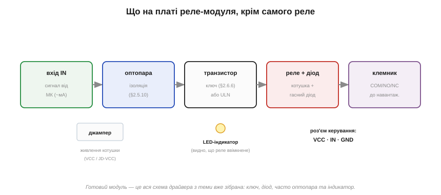
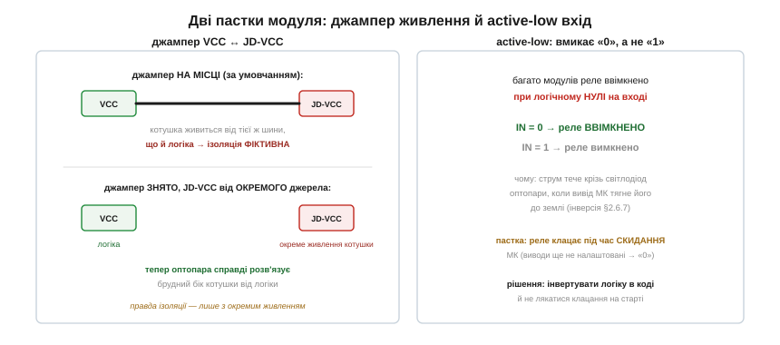

# 🔌 Модуль реле: що на платі, крім самого реле

> Це компонентна вставка до теми [2.6.9 «Реле і його драйвер»](bjt.md). Тема навчила збирати драйвер реле з транзистора, резистора й діода. На практиці ж його рідко паяють із нуля — беруть готовий **реле-модуль** (для Arduino, ESP та інших плат). Тут — що на тій платі насправді, чому модуль часто вмикається логічним «нулем», і навіщо на ньому загадковий джампер, який вирішує, справжня ізоляція чи фіктивна.

### Уся схема теми — вже зібрана

Реле-модуль — це не «просто реле», а **весь драйвер із теми**, розведений на платі й виведений на зручні роз'єми:

*Рис. 2.6.9c.1. Ланцюг: вхід IN → (часто) оптопара для ізоляції → транзистор-ключ (або збірка ULN) → реле з гасним діодом → клемник COM/NO/NC. Плюс світлодіод-індикатор і джампер живлення котушки.*

Розберемо, що тут є. **Транзистор-ключ** із резистором бази ([§2.6.6](bjt.md)) — той самий, що рахували в темі; у багатоканальних модулях замість окремих транзисторів часто стоїть збірка кількох ключів в одному корпусі. **Гасний діод** ([§2.5.9](../diode-pn-junction/diode-pn-junction.md)) на котушці — обов'язковий, він уже припаяний. **Світлодіод-індикатор** ([§2.5.7](../diode-pn-junction/diode-pn-junction.md)) світить, коли реле ввімкнене — зручно для налагодження. Часто додають **оптопару** ([§2.5.10](../diode-pn-junction/diode-pn-junction.md)) між входом і ключем — для гальванічної розв'язки керування від силового боку. І клемник із гвинтами, куди заводять COM/NO/NC потужного кола. Тобто все, що ми збирали по цеглинці, на модулі вже зведено — лишається подати сигнал.

### Active-low: вмикає «нуль»

Перша несподіванка для новачка: багато реле-модулів вмикаються логічним **нулем**, а не одиницею. Подали на вхід «0» — реле клацнуло; подали «1» — вимкнулося. Це **active-low** вхід, і він збиває з пантелику тих, хто звик «1 = ввімкнено». Причина — у схемі з оптопарою: світлодіод оптопари засвічується, коли вивід мікроконтролера **притягує** його катод до землі (тобто видає «0»), — інверсія, знайома з [§2.6.7](bjt.md).

*Рис. 2.6.9c.2. Праворуч — логіка active-low: реле вмикає «0», вимикає «1». Звідси неприємна пастка: при скиданні мікроконтролера його виводи ще не налаштовані й «висять» близько нуля — і реле може **клацнути саме собою** на старті.*

Звідси два практичні наслідки. У коді логіку для такого модуля **інвертують** (щоб «увімкнути» означало видати «0»). І не лякайтеся, якщо реле клацає в момент увімкнення живлення чи скидання плати: поки мікроконтролер стартує, його виводи ще в невизначеному стані близько нуля — для active-low входу це «увімкнено». Там, де таке клацання небезпечне, додають зовнішній підтягувальний резистор, що тримає вхід у «1» до того, як прошивка візьме керування.

### Джампер живлення: справжня ізоляція чи вдавана

Найважливіша й найменш зрозуміла деталь — джампер біля живлення, підписаний на кшталт **VCC / JD-VCC**. Він вирішує, **звідки живиться котушка реле**, а від цього залежить, чи працює оптопара насправді.

За умовчанням джампер **стоїть** і з'єднує живлення логіки з живленням котушки — модуль працює від одного джерела, зручно. Але тоді обидва боки оптопари сидять на **спільному** живленні, і ніякої справжньої розв'язки нема — оптопара стоїть «для галочки». Щоб ізоляція запрацювала по-справжньому, джампер **знімають** і живлять котушку (вивід JD-VCC) від **окремого** джерела, а керування — від мікроконтролера. Тепер брудний бік котушки з її викидами й клацанням справді відділений від тихої логіки, як і обіцяла оптопара ([§2.5.10](../diode-pn-junction/diode-pn-junction.md)). Хто хоче від модуля чесної ізоляції — мусить зняти цей джампер і дати котушці окреме живлення; інакше оптопара на платі нічого не ізолює.

> 🔧 **Навіщо це.** Беручи реле-модуль: пам'ятайте, що це вже готовий драйвер із теми (ключ + діод + часто оптопара), тож паяти нічого не треба — лише подати сигнал. Перевірте, **active-high чи active-low** вхід (багато — low, вмикають «0»), і будьте готові до клацання при старті. Якщо потрібна справжня розв'язка — **зніміть джампер живлення** й живіть котушку окремо. І рахуйте струм: одна котушка — десятки міліампер, а модуль на 4–8 реле тягне вже чималий струм, який беруть **не з виводу плати**, а від окремого живлення.
