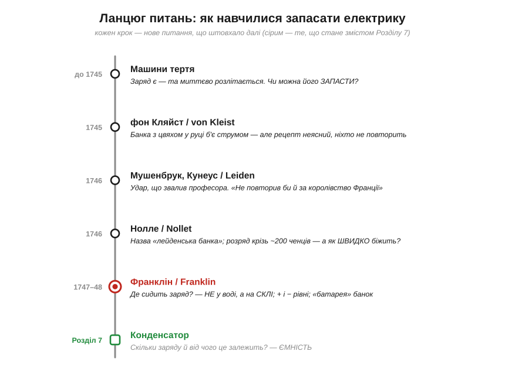
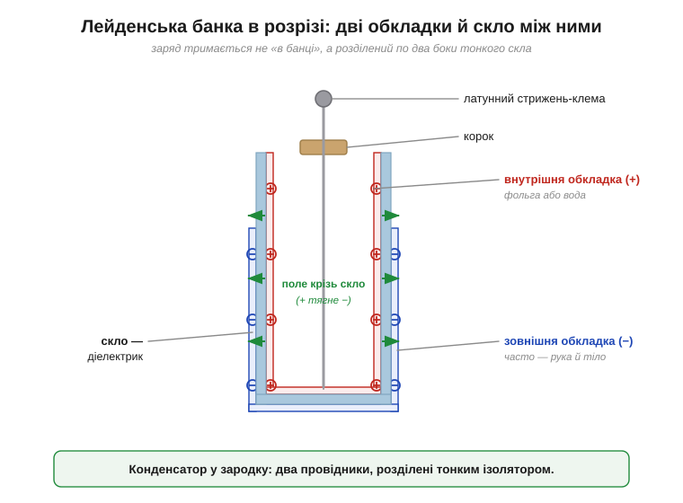
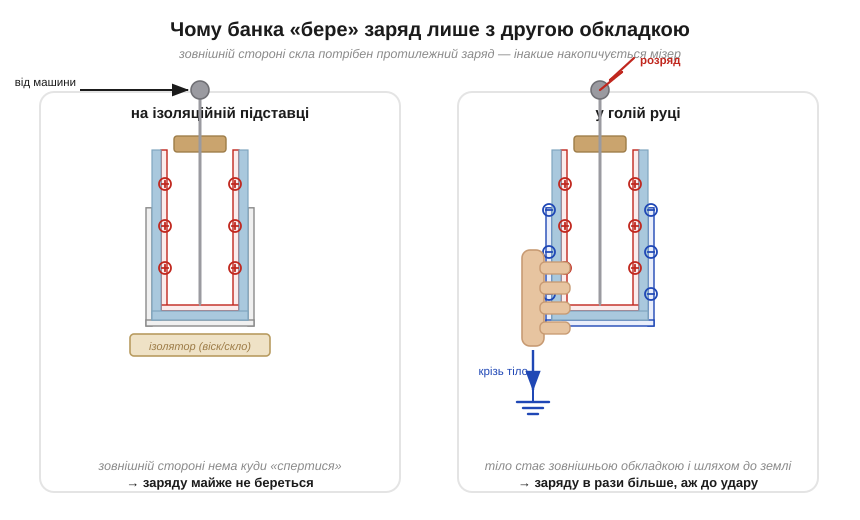
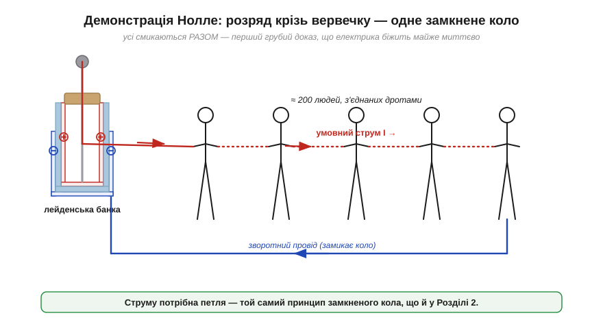
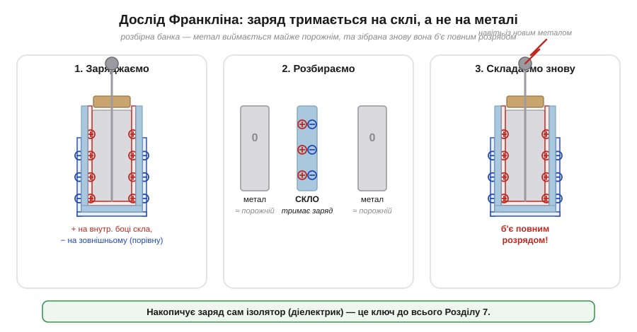
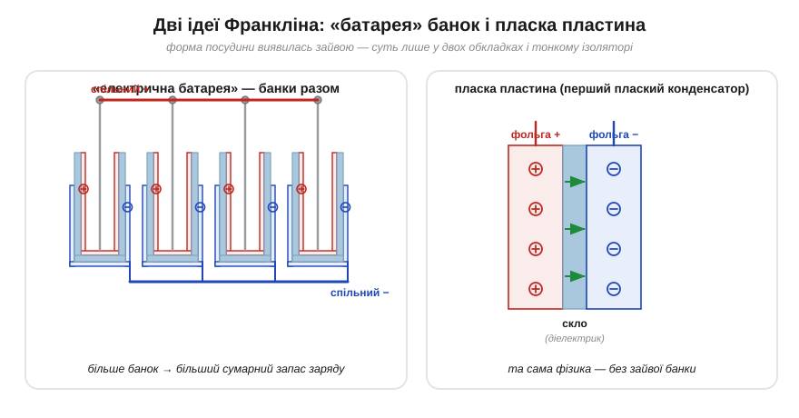

# 📜 Історія до Розділу 2.1 — лейденська банка: як уперше «зловили» електрику в банку

> Це історична вставка до [Розділу 2.1 «Конденсатор»](capacitor.md). Вона не перелічує «хто що відкрив» — вона веде **ланцюгом питань** навколо однієї речі: скляної банки, що першою навчилася **запасати** електрику. Кожне непорозуміння на цьому шляху — банка, яку ніхто не міг повторити; удар, що звалив професора; суперечка, де ж сидить заряд — це вже зерно того, що ми сьогодні називаємо **конденсатором**. А заодно — пряме походження слова **«батарея»**, яке ви бачите на кожному акумуляторі.

До цього моменту в [історії Розділу 1.1](../../block-1-circuits-physics/charge-field-potential/hist-electricity.md) електрика була **швидкоплинною**: натер бурштин — він кілька секунд тягне пушинки — і все згасло. Машина тертя сипала іскрами, та варто було її спинити, як заряд розчинявся в повітрі. Уся ця електрика жила мить. І тут постало питання, без якого не було б ані спалаху лампи, ані живлення мікросхеми: **чи можна електрику запасти?** Накопичити, як воду в глеку, щоб узяти, коли треба? Відповідь, знайдена майже випадково й майже одночасно у двох країнах, перевернула науку — і коштувала винахідникам кількох добрячих ударів струмом.

*Рис. 2.1.0.1. Шлях від «електрика розлітається» до «заряд сидить на склі». Кожен щабель — це не просто дата, а нове **питання**, на яке попередня відповідь не давала спокою. Сірим — те, що стане змістом самого Розділу 2.1 (чому й скільки банка тримає заряду).*

---

## Електрика, що розлітається: навіщо її взагалі запасати

На початку 1740-х електростатична машина була вже не дивиною. Скляна куля чи диск, що оберталися й терлися об подушечку, давали заряд **на вимогу**: іскри в палець, волосся дибки, тріск і запах озону. Демонстратори — **Георг Бозе** (*Georg Matthias Bose*) у Віттенберзі, **Йоганн Вінклер** (*Johann Winkler*), абат **Жан-Антуан Нолле** (*Jean-Antoine Nollet*) у Парижі — збирали повні зали. Та всі вони впиралися в одну стіну: щойно машину спиняли, **електрика зникала**. Її не можна було ні відкласти на потім, ні взяти більше, ніж машина видавала цієї секунди.

Електрику тоді уявляли як невидимий **флюїд** — «електричний вогонь», рідину, що перетікає з тіла в тіло (ця картинка живе в [історії Розділу 1.1](../../block-1-circuits-physics/charge-field-potential/hist-electricity.md)). А якщо це рідина — напрошувалася зухвала думка: **її можна налити в посудину**. Бозе навіть мріяв уголос: добути електрику в склянку й закоркувати. Думка була наївна — флюїд не вода, його не втримаєш корком, — але вона штовхала експериментаторів пробувати найпростіше: підвести заряд від машини до якоїсь банки й подивитися, чи він там **залишиться**.

Найприроднішим здавалося електризувати **воду**: налити в скляну посудину, опустити в неї дріт від машини й накопичувати «вогонь» прямо в рідині. Саме ця проста, навіть трохи дитяча ідея — «наллємо електрику у воду в банці» — і привела, через випадок і добрячий струс, до першого в історії **накопичувача заряду**.

> 🔧 **Навіщо це.** Питання «де взяти заряд, коли джерело саме його не дає просто зараз?» нікуди не зникло — воно живе в кожному пристрої. Спалах фотокамери, дефібрилятор, імпульсний зварювальний апарат накопичують енергію поволі, а віддають миттєвим ривком — і роблять це **конденсатором**, прямим нащадком лейденської банки. Навіть скромний конденсатор біля мікросхеми робить те саме в мініатюрі: тримає запас заряду напохваті, щоб віддати його тієї миті, коли чіп різко його потребує.

---

## Кляйст і банка, яку ніхто не міг повторити

Першим, хто справді «зловив» електрику, був не фізик, а **священник**. **Евальд Юрґен фон Кляйст** (*Ewald Georg von Kleist*, ~1700–1748), декан собору в померанському містечку Каммін, восени **1745 року** взяв невелику аптекарську пляшечку, налив трохи спирту (чи води), застромив крізь корок цвях і, **тримаючи пляшку в руці**, торкнув цвях до працюючої машини. Коли він потім узявся за цвях вільною рукою — його так ударило, що, за власними словами, він не зважився б повторити це й за всі скарби.

Кляйст одразу зрозумів, що натрапив на щось велике, і в листопаді 1745-го розіслав опис кільком ученим у Німеччині. І тут сталося прикре: **майже ніхто не зміг повторити дослід**. Листи лягали на стіл, експериментатори ставили банку на стіл або на ізоляційну підставку — і нічого не виходило, удару не було. Кляйст у захваті проґавив **головну деталь**: пляшку треба було **тримати в голій руці**, і вона мала бути малою. Без цієї умови дослід мовчав. Тому Кляйста, хоч він і був першим у часі, історія надовго відсунула вбік: він зробив відкриття, але не зумів **передати рецепт**.

Це не дрібниця історії, а урок, що повторюватиметься в курсі знову й знову: відкриття без **відтворюваного опису** — наполовину не відкриття. Та сама плутанина — чому в одних виходить, а в інших ні — за пів року розіграється вдруге, уже в Нідерландах, і саме там банка дістане своє ім'я.

---

## Лейден: удар, що звалив професора

У місті **Лейден** (*Leiden*) при тамтешньому університеті фізику викладав поважний **Пітер ван Мушенбрук** (*Pieter van Musschenbroek*, 1692–1761). На початку **1746 року** в його колі повторювали досліди з електризації води в банці — але, як належить акуратним людям, ставили банку на **ізоляційну** підставку, щоб «нічого не витікало». І нічого не виходило, як і в німців.

Випадок дав знати про себе через помічника на ім'я **Андреас Кунеус** (*Andreas Cunaeus*). Той вирішив повторити дослід удома, без лабораторного начиння, — і, природно, просто **тримав банку в руці**, поки заряджав. Коли він другою рукою торкнувся дроту, його так шарпнуло, що він ледь устояв. Кунеус приніс звістку про дивовижу до Мушенбрука; той повторив усе сам, теж тримаючи банку, — і дістав удар, який, за його ж знаменитим зізнанням у листі до паризького академіка **Реомюра** (*René-Antoine Réaumur*), він **«не погодився б пережити вдруге й за все королівство Франції»**. Поважний професор, кажуть, на дві доби втратив бадьорість.

Так наосліп намацали ту саму умову, яку проґавив Кляйст: **банку треба тримати в руці**. Лист Мушенбрука пролетів академічною Європою як блискавка, і прилад — на честь міста — назвали **лейденською банкою** (*Leyden jar*, або *Leidse fles*). Каммін лишився ні з чим: ім'я дісталося Лейдену, бо звідти прийшов **зрозумілий, відтворюваний** опис.

Що ж це за пристрій і чому в ньому ключова саме рука? Розберімо його будову — бо тут історія вперше торкається фізики **конденсатора**.

*Рис. 2.1.0.2. Лейденська банка в розрізі. Усередині — провідне покриття (фольга або вода), зовні — інше провідне покриття (часто роль зовнішнього грала **рука й тіло** людини). Між ними — тонке **скло**. Заряд **+** на внутрішній обкладці притягує **−** на зовнішній **крізь скло**; протилежні заряди утримують одне одного — і саме тому банка вбирає його в рази більше, ніж самотній провідник. Це і є зародок **конденсатора**: два провідники, розділені ізолятором.*

---

## Чому її треба тримати в руці

Ось де ховалася розгадка всіх невдалих повторень. Банка накопичує заряд не сама по собі — їй потрібні **дві** провідні «обкладки» (*plates*, або покриття) з тонким ізолятором між ними. Внутрішнє покриття (вода чи фольга) — одна обкладка; її заряджали від машини. А **другою обкладкою служила рука й тіло** експериментатора: тіло — провідник (згадаймо Грея з [Розділу 1.1](../../block-1-circuits-physics/charge-field-potential/hist-electricity.md)), і через нього зовнішня сторона скла з'єднувалася із землею.

Поки на внутрішній стороні накопичувався, скажімо, **надлишок** (+), він **притягував** протилежний заряд (−) на зовнішню сторону скла — крізь тонке скло, не перескакуючи його. Ці два розділені шари протилежних зарядів **тримали одне одного**: кожен не давав другому розлетітися. Тому в банку влізало заряду набагато більше, ніж у самотній провідник тих самих розмірів, — і напруга росла, аж доки розряд не пробивав повітря крізь людину.

А якщо банку ставили на **ізоляційну** підставку (як робили в Лейдені до випадку Кунеуса), зовнішній обкладці **не було куди подітися**: другий шар заряду не міг зібратися, протитягу не виникало, і банка вбирала жалюгідну дещицю. Ось чому в обережних виходило гірше, ніж у того, хто недбало тримав банку в руці. **Випадковість і неакуратність** тут зіграли на руку науці.

*Рис. 2.1.0.3. Та сама банка у двох ситуаціях. Ліворуч — на ізоляційній підставці: зовнішній стороні нема куди «спертися», протилежний заряд не збирається, накопичується мізер. Праворуч — у руці: тіло стає **зовнішньою обкладкою** та шляхом до землі, на зовнішній стороні скла збирається рівний і протилежний заряд, і банка вбирає його в рази більше. Звідси й удар.*

> 🔧 **Навіщо це.** Це перший в історії натяк на головне правило конденсатора: він зберігає заряд **не на одній пластині, а як розділення двох протилежних зарядів** на двох обкладках через ізолятор. Конденсатор без другої обкладки — без протилежного провідника, на якому збереться рівний і протилежний заряд, — не конденсатор. (Друга обкладка не конче «земля»: у самій банці нею випадково стали рука й тіло, але загалом це просто **другий провідник**.) Те саме ви побачите на платі: конденсатор завжди має **два** виводи, і один із них дуже часто йде на спільний провід (землю) — пряме відлуння руки Мушенбрука.

---

## Нолле дає ім'я — і ланцюг ченців завдовжки з милю

Сенсацію підхопив той самий паризький абат **Нолле** — блискучий демонстратор, що умів перетворити дослід на виставу. Саме він закріпив за приладом назву «лейденська банка» й узявся показувати його силу публічно та видовищно.

Найвідоміший його номер увійшов у легенду. Нолле вишикував **сотні ченців-картезіанців** у довжелезну вервечку — завдовжки, за переказами, **майже з милю** (≈1.6 км), — поз'єднавши сусідів залізними дротами, які вони тримали в руках (точне число джерела подають по-різному, від двохсот до семисот). Потім крайнім дав замкнути коло на заряджену лейденську банку — і **вся вервечка підстрибнула тієї самої миті**. Подібний дослід Нолле повторив і перед королем Людовіком XV у Версалі, пропустивши розряд крізь шеренгу зі **180 королівських гвардійців**, — з тим самим разючим ефектом. Видовище мало й науковий сенс: воно показувало, що електрика проходить крізь людську вервечку **практично миттєво**, хоч би якою довгою та була. Питання «**а як швидко?**» з кумедного перетворилося на серйозне — і даватиме про себе знати ще століття, аж до телеграфу й радіо.

*Рис. 2.1.0.4. Демонстрація Нолле. Заряджена банка, вервечка людей, з'єднаних дротами, — і **єдине замкнене коло**: розряд проходить крізь усіх послідовно (про потребу петлі для струму — [Розділ 1.2](../../block-1-circuits-physics/voltage-current-conduction/voltage-current-conduction.md)). Усі смикаються **разом**: ось перший грубий «вимір» того, що електрика біжить крізь провідники майже без затримки.*

Поза видовищем визрівало незручне запитання, яке Нолле з його шоу обходив. Усі бачили, **що** банка б'ється. Та ніхто ще не розумів, **де** в ній сидить накопичений заряд. У воді? У металі? І чому вода в банці важить більше за просто воду? Відповідь знайде людина по той бік океану.

---

## Де ж сидить заряд? Франклін і скло

Поки Європа підстрибувала від Нолле, у Філадельфії за лейденську банку взявся **Бенджамін Франклін** (*Benjamin Franklin*) — той самий, чию модель «одного флюїду» зі знаками **+** і **−** ми вже знаємо з [Розділу 1.1](../../block-1-circuits-physics/charge-field-potential/hist-electricity.md). Спершу думали, що заряд накопичується **у воді**. Франклін поставив низку акуратних дослідів **1747–1748 років** — і дійшов несподіваного: заряд сидить **не у воді й не на металі, а в самому склі**.

Він зробив банку з **рухомими** обкладками: металевий стакан усередину можна було вийняти, зовнішнє покриття — зняти. Зарядивши банку, Франклін розібрав її: вийняв внутрішній метал, зняв зовнішній — і виявив, що на самих **металевих частинах майже нема заряду**, вони ледь іскрять. Але варто було скласти банку знову (хоч би навіть із **чистими** обкладками!) — і вона **знову била повним розрядом**. Висновок неминучий: заряд весь цей час **тримався на склі**, на його двох поверхнях, а метал лише підводив і збирав його. Електрику накопичує **ізолятор** між обкладками.

*Рис. 2.1.0.5. Розбірна банка Франкліна. (1) Заряджаємо: на внутрішній поверхні скла — надлишок (+), на зовнішній — нестача (−), рівно стільки ж. (2) Розбираємо: метал виймається майже **порожнім**. (3) Складаємо знову (навіть із новим металом) — банка **б'є повним розрядом**. Отже, заряд жив **на склі**, а не на металі. Так уперше зрозуміли роль **діелектрика** в накопиченні.*

І ще одне, тонше: Франклін виміряв, що **скільки + збирається на одному боці скла, рівно стільки − збирається на іншому**. Заряд не береться нізвідки — машина просто **переганяє** його з зовнішньої обкладки на внутрішню (це його ж закон збереження заряду з [Розділу 1.1](../../block-1-circuits-physics/charge-field-potential/charge-field-potential.md)). Банка не «створює» електрику — вона **розділяє** наявний заряд і тримає половинки нарізно, по два боки тонкого скла. Це і є точне, фізичне визначення того, що згодом назвуть **конденсатором**.

Одне сучасне уточнення до Франклінового «заряд на склі». За нинішніми уявленнями **вільний** заряд сидить на поверхнях провідників-обкладок, а скло-діелектрик між ними **поляризується** — і саме ця поляризація утримує заряд та запасає енергію в **полі** ([§2.1.3](capacitor.md)). У реальної ж банки чимало заряду таки чіпляється просто на поверхню скла — тому дослід Франкліна й вийшов аж таким наочним. Тобто «заряд живе на склі» — правильний історичний висновок, що сучасною мовою звучить як «енергія — у полі поляризованого діелектрика».

> 🔧 **Навіщо це.** Здогад Франкліна — що накопичувач це **два провідники з ізолятором між ними**, а заряди на них рівні й протилежні, — це і є каркас усього Розділу 2.1. Чому деякі діелектрики дають банці вбирати більше за інші, чому тонше скло «бере» більше заряду, скільки саме — усе це вже **кількісна** історія ємності, до якої ми переходимо в [§2.1.1](capacitor.md) і далі.

---

## Батарея банок і перша пласка пластина

Одна банка била добряче, але Франкліну хотілося **більше**. Природний хід: з'єднати кілька заряджених банок разом — внутрішні виводи між собою, зовнішні покриття між собою — щоб накопичити сумарно більший запас і видати потужніший розряд. Цю шеренгу з'єднаних банок він назвав, за військовою аналогією, **«електричною батареєю»** (*electrical battery*) — від батареї гармат, вишикуваних у ряд.

Тут і захований корінь слова, яке ви читаєте на кожному акумуляторі й пальчиковому елементі. **«Батарея»** спершу означала не хімічне джерело (того ще й близько не було — вольтів стовп з'явиться аж 1800-го), а саме **гроно з'єднаних лейденських банок**. Слово прижилося й перейшло потім на будь-яку збірку однакових накопичувачів енергії, поставлених разом. Отже, коли в наступних розділах ітиметься про «батарею конденсаторів» на платі живлення — це буквально та сама ідея Франкліна, лише в мініатюрі.

Зробивши висновок, що працює саме скло, Франклін відкинув і саму **форму банки** як зайву. Навіщо посудина, якщо суть — у двох провідниках по боках тонкого ізолятора? Він узяв звичайну **шибку**, наклеїв на обидва боки металеву фольгу — і дістав **пласку пластину** (її називали «франкліновим квадратом»), що накопичувала заряд незгірш за банку. Це був перший **плаский конденсатор** в історії: ідею звели до голої сутності — **дві обкладки, тонкий діелектрик між ними**.

*Рис. 2.1.0.6. Дві ідеї Франкліна. Ліворуч — **«батарея»**: кілька банок із поз'єднаними внутрішніми й зовнішніми обкладками накопичують більший сумарний заряд (звідси й слово «батарея»). Праворуч — **пласка пластина**: шибка з фольгою на обох боках, перший плаский конденсатор. Форма посудини виявилася зайвою — суть лише у двох провідниках і тонкому ізоляторі.*

---

## Сила, що вбиває: електрика стала серйозною

Лейденська банка зробила ще одну, моторошнішу послугу науці: вона показала, що електрика — **небезпечна сила**, а не салонний фокус. Розряд великої банки чи батареї міг убити дрібну тварину; Франклін у дослідах валив струмом курей та індиків (а одного разу, переплутавши з'єднання, добряче приклав і самого себе, зізнавшись, що бачив спалах і почув тріск «у голові»). До лейденської банки електрика лоскотала й тріщала; **після неї** з нею почали поводитися з осторогою.

Це теж урок наперед. Те, що небезпечний саме **струм** крізь тіло (а не «висока напруга» сама по собі), курс розбирав у [Розділі 1.2](../../block-1-circuits-physics/voltage-current-conduction/voltage-current-conduction.md); лейденська банка дала перший наочний доказ цієї думки — бо саме **накопичений і випущений ривком** заряд, тобто короткий потужний струм, валить із ніг. Накопичувач, що віддає енергію миттєво, небезпечний саме цією миттєвістю — і це назавжди лишиться в техніці безпеки: великий заряджений конденсатор треба **розряджати** перед тим, як братися руками, навіть коли прилад давно вимкнено.

---

## Що з цього лишилось нам

Озирнімося на цей короткий, але буремний ланцюг. За якихось три-чотири роки — від пляшки Кляйста (1745) до франклінового скла (1748) — людство пройшло від «електрика розлітається» до **першого накопичувача заряду** й до правильного розуміння, як він улаштований. І майже все, чим ми користуватимемося в Розділі 2.1, — це закам'янілі сліди тих дослідів:

- сам **конденсатор** (*capacitor*) — прямий нащадок лейденської банки; стара назва **«конденсатор»** (*condenser*) походить від італійського *condensatore*, яким пристрій згодом охрестив Вольта, уявляючи, ніби той «згущує» електричний флюїд;
- **дві обкладки** (*plates*) й **діелектрик** (*dielectric*) між ними — будова, яку намацали рука Мушенбрука й скло Франкліна;
- слово **«батарея»** (*battery*) — від грона з'єднаних банок Франкліна, а зовсім не від хімії;
- правило, що заряди на обкладках **рівні й протилежні**, а накопичувач лише **розділяє** заряд, не створюючи його, — це збереження заряду з [Розділу 1.1](../../block-1-circuits-physics/charge-field-potential/charge-field-potential.md);
- здорова осторога: заряджений конденсатор **тримає удар** навіть після вимкнення.

Лейденська банка більш як століття лишалася незамінним приладом будь-якої електричної лабораторії, а потім — серцем **іскрових радіопередавачів**, де накопичений у конденсаторі заряд зривався в антену потужним розрядом. Радіо народилося не з однієї голови: **Генріх Герц** довів існування електромагнітних хвиль (1887), а далі до бездротового зв'язку доклалися **Олівер Лодж**, **Нікола Тесла**, **Александр Попов**, **Джаґдіш Чандра Бозе** і **Ґульєльмо Марконі**, який звів усе докупи в робочу комерційну систему. Згодом і суд розставив акценти інакше, ніж реклама: **Верховний суд США 1943 року** визнав ключові широкі претензії патенту Марконі недійсними як **випереджені** ранішими патентами Джона Стоуна, Лоджа й Тесли. Та головне для нас попереду: ми зрозуміли **що** банка робить (запасає розділений заряд), але ще не вміємо сказати **скільки** саме й **від чого** це залежить. Перетворити «вона тримає багато заряду» на число — на **ємність** — і є завдання самого Розділу 2.1.

> ▶️ Далі: [§2.1.1 Що таке конденсатор — два провідники, що тримають розділений заряд](capacitor.md)
