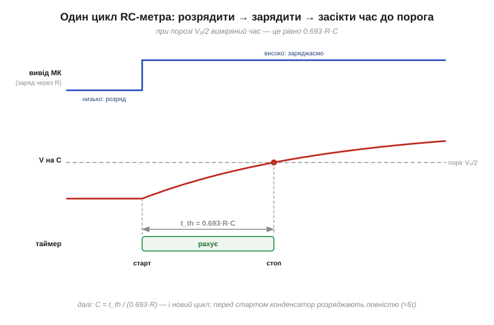
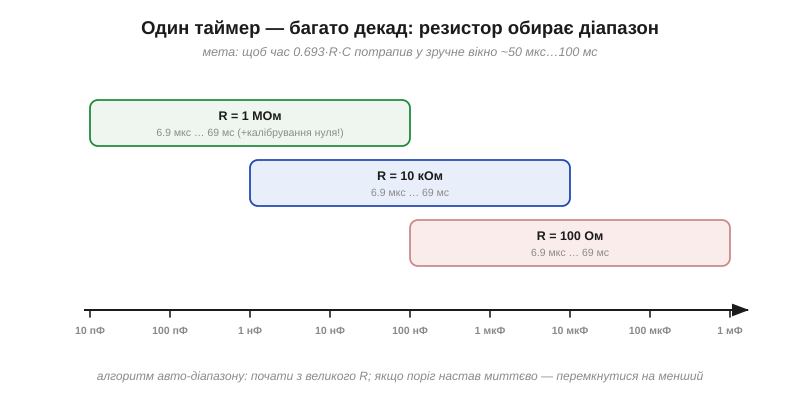

# ⚙️ RC-метр: вимірюємо ємність часом заряду до порога

> Це алгоритмічна вставка до теми [2.1.4 «Зарядка й розрядка: стала часу RC»](capacitor.md). Уся фізика вже на руках: τ = R·C і крива заряджання. Перевернімо її: якщо резистор **відомий**, а час заряджання можна **виміряти**, то ємність обчислюється. Саме так працює режим вимірювання ємності в мультиметрі й у саморобних тестерах компонентів.

### Задача

Дано: невідомий конденсатор, відомий резистор R, цифровий вивід мікроконтролера (вміє видавати «низько/високо»), вхід, що спрацьовує на певному порозі напруги, і таймер. Знайти C з точністю в кілька відсотків — від пікофарад до сотень мікрофарад.

### Ідея

Крива заряджання з [§2.1.4](capacitor.md): V(t) = V₀·(1 − e^(−t/τ)). Час, за який напруга доросте до порога V_th, прямо пропорційний τ, а отже й C:

```
t_th = τ · ln( V₀ / (V₀ − V_th) ) = k · R · C
```

Коефіцієнт k залежить лише від **частки**, яку поріг становить від живлення. Найзручніший випадок — поріг на половині живлення:

```
V_th = V₀/2:   k = ln 2 ≈ 0.693     →     C = t_th / (0.693 · R)
```

Тож увесь вимір — це «розрядити, ввімкнути заряд крізь R, засікти час до порога»:


*Рис. 2.1.4a.1. Три доріжки одного циклу: вивід мікроконтролера спершу тримає конденсатор розрядженим, потім подає високий рівень через R; напруга на конденсаторі повзе вгору експонентою; таймер рахує від старту заряду до перетину порога. Виміряний час ділимо на 0.693·R — і маємо C.*

### Псевдокод

```
// відомі: R, поріг = V₀/2  →  k = 0.693
функція виміряти_C():
    вивід ← НИЗЬКО                    // розряд конденсатора
    чекати, поки вхід не "низько", і ще трохи   // повний розряд ≈ 5τ
    таймер ← 0;  вивід ← ВИСОКО       // старт заряду крізь R
    доки вхід нижче порога:
        нічого                        // чекаємо перетину
    t ← таймер
    повернути t / (0.693 · R)
```

Складність — O(1) на вимір; сам вимір триває ≈ 0.7·R·C плюс розряд. Для усереднення шуму цикл повторюють кілька разів і беруть середнє.

### Вибір R: одна формула — вісім декад

Час t_th мусить потрапити у вікно, яке таймер міряє зручно: надто короткий (одиниці мікросекунд) тоне в похибці старту, надто довгий — дратує. Вихід — **авто-діапазон**: кілька резисторів на вибір.


*Рис. 2.1.4a.2. Той самий алгоритм покриває вісім декад ємності — резистор лише зсуває вікно часу: 1 МОм для пікофарад і нанофарад, 10 кОм для середини, 100 Ом для великих електролітів. Початок із найбільшого R: якщо поріг настав «миттєво» — конденсатор великий, перемикаємось на менший R і міряємо знову.*

**Приклад (перевірка масштабів).** R = 10 кОм, виміряний час t = 7.6 мс:

```
C = t / (0.693 · R)
C = (7.6×10⁻³ с) / (0.693 · 10⁴ Ом)
C ≈ 1.1×10⁻⁶ Ф ≈ 1.1 мкФ
```

### Пастки на мікроконтролері

- **Розряд великого конденсатора напряму на вивід.** Порожній конденсатор — «коротке» ([§2.1.4](capacitor.md)): заряджений електроліт, замкнений виводом на землю, дає кидок струму понад допустимий для ніжки. Розряджати теж через резистор (сотні ом).
- **Очікування в циклі з перериваннями.** Якщо процесор відволікся між перетином порога й зупинкою таймера, час «пливе». Правильний шлях — апаратний таймер, що сам фіксує момент події; програмний цикл годиться лише для повільних діапазонів.
- **Паразитна ємність плати.** Доріжки й вивід самі мають десятки пікофарад ([§2.1.1](capacitor.md)) — для діапазону пікофарад це порівнянне з вимірюваним. Ліки прості: виміряти «порожній» вхід без конденсатора й віднімати цей нуль (калібрування).
- **Поріг, що «плаває».** Якщо поріг входу — фіксована частка живлення, система самокомпенсується: у k входить лише відношення V_th/V₀, і коливання живлення скорочуються. А от поріг, заданий незалежним джерелом, цю властивість ламає.
- **Неідеальні конденсатори.** Великий витік електроліта занижує видиму ємність (частина струму тече повз заряд), а кераміка класу 2 покаже різні значення за різної амплітуди (DC bias — [вставка про MLCC](comp-mlcc.md)). RC-метр чесно міряє «ємність у цих умовах», а не напис на корпусі.

### Де ще працює цей прийом

Та сама схема «час заряду до порога» живе всюди, де треба дешево оцифрувати аналогову величину без АЦП: виміряти опір (поміняти місцями відоме й невідоме — відомий C, невідомий R), зчитати резистивний давач, і навіть відчути дотик пальця — про це наступна алгоритмічна вставка цього розділу, про ємнісну кнопку.
