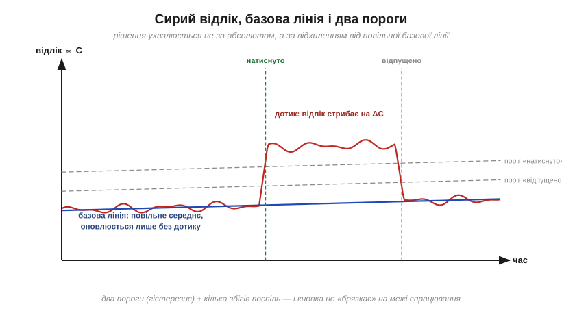

# ⚙️ Ємнісна сенсорна кнопка: побачити пікофаради пальця

> Це алгоритмічна вставка до теми [2.1.2 «Ємність: Q = C·V»](capacitor.md). У [§2.1.1](capacitor.md) ми зауважили: будь-які два провідники — уже конденсатор, і палець — теж провідник. Підносячи його до мідного майданчика на платі, ми додаємо тому кілька пікофарад. Кнопка без жодної механіки, що працює крізь пластик, — це алгоритм, який уміє цю крихту надійно помітити.

### Задача

Мідний майданчик на платі (накритий панеллю чи лаком — металу ніхто не торкається) має власну ємність на землю C₀ ≈ 10–30 пФ. Палець поруч додає ΔC ≈ 1–10 пФ — лічені відсотки, а то й менше. Треба видавати чисте «натиснуто/відпущено» попри шум, наведення мережі та повільний дрейф від температури й вологості.


*Рис. 2.1.2a.1. Майданчик уже має ємність C₀ на навколишню землю. Палець за пластиком стає другою «обкладкою» додаткового конденсатора ΔC, замкненого на землю через тіло. Поле проходить крізь ізолятор — тому кнопка працює без контакту, як і тачскрін із §2.1.1.*

### Ідея: міряти не раз, а тисячу разів

Як перетворити ємність на число, ми вже знаємо з [RC-метра](proj-capacitance-meter.md): час заряду до порога пропорційний C. Але тут різниця, яку треба побачити, — відсотки, а одиничний вимір пікофарад шумить сильніше. Вихід — **накопичення**: ганяти цикл заряд–розряд сотні разів поспіль і підсумовувати час (або рахувати, скільки циклів вкладається у фіксоване вікно). Шум від циклу до циклу випадковий і усереднюється; систематична різниця від пальця — накопичується.

```
функція сирий_відлік():                  // викликається кожні ~10 мс
    сума ← 0
    повторити N разів:                   // N ~ 100…1000
        розрядити майданчик
        зарядити через R, лічити такти до порога в суму
    повернути сума                       // ∝ C, шум поділено на √N
```

### Рішення: базова лінія, два пороги, кілька збігів

Сирий відлік ніколи не стоїть на місці: температура, вологість, рука на корпусі — усе повільно зсуває C₀. Тому рішення ухвалюють не за абсолютним значенням, а за **відхиленням від базової лінії** (*baseline*) — повільного середнього «стану без дотику»:

```
кожні 10 мс:
    s ← сирий_відлік()
    якщо стан = ВІДПУЩЕНО:
        базова ← базова + (s − базова)/64     // повільно повзе за дрейфом
    d ← s − базова
    якщо стан = ВІДПУЩЕНО і d > поріг_вкл  М разів поспіль:  стан ← НАТИСНУТО
    якщо стан = НАТИСНУТО і d < поріг_викл:                  стан ← ВІДПУЩЕНО
```

Тут три захисні механізми разом. **Базова лінія** оновлюється лише без дотику — інакше за кілька секунд вона «з'їла б» притиснутий палець, і кнопка сама б відпустилася. **Два пороги** (увімкнення вище, вимкнення нижче) — це гістерезис, та сама ідея, що в тригері Шмітта ([§2.8.8](../opamp-comparator/opamp-comparator.md)): на межі спрацювання кнопка не «брязкає». **М збігів поспіль** відсіює поодинокі викиди.


*Рис. 2.1.2a.2. Сирий відлік шумить і повільно дрейфує — базова лінія повзе слідом. Дотик дає сходинку понад поріг увімкнення; відпускання фіксується за нижчим порогом. Усе вимірюється відносно базової, тож дрейф не накопичує хибних спрацювань.*

### Складність і числа

На кнопку йде N циклів по кілька мікросекунд: при N = 200 і циклі 5 мкс — **1 мс на опитування**, тобто десяток кнопок спокійно опитується сто разів за секунду. Пам'яті — кілька байтів стану на кнопку. Виграш точності від накопичення — корінь із N: чотириста циклів замість ста вдвічі зменшують шум.

### Пастки на мікроконтролері

- **Наведення мережі 50 Гц.** Палець — ще й антена ([§2.1.1](capacitor.md)): сирий відлік «дихає» в такт мережі. Ліки — вікно накопичення, кратне періоду 20 мс, або принаймні усереднення за кілька періодів.
- **Довга доріжка до майданчика.** Це плюс до C₀ (менша відносна вага пальця) і зайва антена. Доріжку ведуть короткою, тонкою й подалі від силових кіл.
- **Волога й краплі.** Крапля води на панелі теж змінює ємність — звідси «привидні» натискання. Допомагають вищий поріг, кільце землі довкола майданчика й логіка «кілька кнопок одразу = хибне».
- **Надто спритна базова лінія.** Якщо вона повзе швидко, то наздоганяє повільний дотик — кнопка відпускається сама. Темп оновлення — компроміс між стійкістю до дрейфу й «терплячістю» до довгого натискання.
- **Метал поряд.** Корпус чи гвинт біля майданчика зсуває C₀ — калібрування при старті обов'язкове, а механіка довкола сенсора має бути сталою.

Принцип цей настільки ходовий, що в багатьох мікроконтролерах він «залитий у кремній»: в ESP32, наприклад, є апаратні сенсорні канали, які самі ганяють цикли й повертають готовий відлік. Але всередині них працює рівно той самий алгоритм — заряд, розряд, лічба й базова лінія.
