# Розділ 7 — Конденсатор

Досі весь Модуль 1 говорив про заряд, що **тече** (струм) і **штовхається** (поле, напруга). Конденсатор — перший компонент, який робить дещо принципово інше: він **запасає** розділений заряд і повертає його назад. Це той самий фокус, що його майже три століття тому випадково відкрила лейденська банка, лише вкладений у крихітну деталь, яких на будь-якій платі — десятки. Без конденсаторів не було б ані стабільного живлення мікросхем, ані фільтрів, ані відліку часу, ані запуску двигуна. Цей розділ будує конденсатор від першопричин: спершу **що** він робить (ця тема), потім **скільки** (ємність), скільки в ньому **енергії**, як швидко він **заряджається** — і де його застосовують.

Усе, що знадобиться, ми вже маємо з Модуля 1: **заряд** і його збереження ([§1.1](../../block-1-circuits-physics/ch01-charge-field-potential/ch01-charge-field-potential.md)), **поле** як посередник між зарядами ([§1.3](../../block-1-circuits-physics/ch01-charge-field-potential/ch01-charge-field-potential.md)), **потенціал і напругу** ([§1.5](../../block-1-circuits-physics/ch01-charge-field-potential/ch01-charge-field-potential.md)), поділ на **провідник/ізолятор**. Конденсатор — це просто гарна композиція цих чотирьох ідей.

> 📜 **Перед матеріалом — історія:** [лейденська банка — як уперше «зловили» електрику в банку](ch07-history-leyden-jar.md). Вона показує, *чому* виникло саме питання «чи можна запасти заряд», звідки слово «батарея» й чому заряд тримається на склі, а не на металі.

---

## 7.1 Що таке конденсатор: два провідники, що тримають розділений заряд

Уявіть просту річ: дві металеві пластини поруч, які **не торкаються**. Між ними — повітря або тонкий шар ізолятора. Жодного дроту з пластини на пластину, коло **розірване** проміжком. На перший погляд — некорисна порожнеча: струм крізь неї не пройде. І все ж саме ця «некорисна» пара пластин уміє те, чого не вміє жоден резистор: **тримати в собі запас заряду** й віддавати його, коли треба. Розберімо, як порожнеча між двома провідниками стає коміркою пам'яті для електрики.

### Будова: дві обкладки й діелектрик

**Конденсатор** (*capacitor*; стара назва — *condenser*, звідси «конденсатор») — це **два провідники, розділені ізолятором**. Провідники називають **обкладками** (*plates*), ізолятор між ними — **діелектриком** (*dielectric*). Оце й уся конструкція; усе інше — варіації форми (пласкі пластини, згорнута в рулон плівка, дві фольги на склі лейденської банки).


*Рис. 7.1.1. Конденсатор у найпростішому вигляді: дві провідні обкладки площею A на відстані d, між ними — діелектрик. Виводи йдуть від кожної обкладки назовні. Жодного провідного містка між обкладками немає — їх розділяє ізолятор.*

Зверніть увагу, наскільки це схоже на лейденську банку з історії розділу: внутрішня фольга — одна обкладка, зовнішня (рука) — друга, скло — діелектрик. Франклін, розібравши банку, довів, що заряд тримається саме на межі з діелектриком; ту саму ідею ми зараз розгорнемо строго.

### Заряд не накопичується, а розділяється

Найперше непорозуміння, яке варто прибрати одразу: конденсатор **не накопичує заряд, як відро воду**. Він тримає на одній обкладці надлишок (+Q), а на другій — рівно такий самий **брак** (−Q). Сумарний заряд усього пристрою лишається **нульовим** — рівно стільки ж **+**, скільки **−**, як у будь-якого нейтрального тіла з [§1.1](../../block-1-circuits-physics/ch01-charge-field-potential/ch01-charge-field-potential.md).


*Рис. 7.1.2. «Зарядити конденсатор» означає не долити заряду, а **перекласти** його з однієї обкладки на іншу: скільки електронів пішло з правої обкладки (вона стала +Q), стільки прийшло на ліву (−Q). Пристрій загалом лишається нейтральним — це прямий наслідок збереження заряду.*

Тому правильні слова — не «накопичити», а **розділити** заряд. Конденсатор — це машинка для **розділення** заряду й утримання половинок нарізно, по два боки тонкого діелектрика. Саме розділені, вони «хочуть» возз'єднатися (різнойменні притягуються), але діелектрик їм не дає — і в цьому напруженні весь сенс.

### Поле в зазорі — ось де «сидить» запас

Що тримає половинки нарізно й чому вони так тягнуться одна до одної? Між обкладками виникає **електричне поле** (*field*) — точно те саме, що в [§1.3](../../block-1-circuits-physics/ch01-charge-field-potential/ch01-charge-field-potential.md): надлишок **+** на одній обкладці створює поле, спрямоване через зазор до **−** на іншій. Для двох близьких пластин це поле напрочуд **рівномірне** — однакові за густиною лінії, що йдуть прямо від + до −, і лише скраю трохи «вибухають» назовні (крайовий ефект).

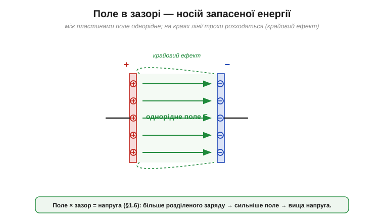
*Рис. 7.1.3. Між пластинами — однорідне поле (рівні стрілки від + до −); на краях лінії трохи розходяться. Саме це поле в діелектрику й «тримає» розділений заряд — і саме в ньому, як ми побачимо в §7.3, запасено енергію. Це строге втілення Франклінового відкриття: запас живе не в металі, а в полі між обкладками.*

Поле в зазорі — це місток до напруги. Згадаймо з [§1.6](../../block-1-circuits-physics/ch01-charge-field-potential/ch01-charge-field-potential.md): поле, помножене на відстань, дає **різницю потенціалів**, тобто **напругу**. Отже, розділений заряд породжує поле, а поле — напругу між виводами конденсатора. Що більше заряду ми розвели по обкладках, то сильніше поле й то більша напруга на конденсаторі. Точне співвідношення «скільки заряду на скільки вольтів» — це вже **ємність**, героїня наступної теми ([§7.2](ch07-capacitor.md)); тут нам важлива сама причинність: **більше розділеного заряду → вища напруга**.

### Як конденсатор заряджається

Звідки беруться ці +Q і −Q? Їх **переганяє джерело** (батарея чи інший конденсатор). Під'єднаймо обкладки до батареї. Її поле жене вільні електрони провідником: з обкладки, з'єднаної з **+** клемою, електрони витягуються (обкладка стає **+Q**), а на обкладку, з'єднану з **−**, — напихаються (вона стає **−Q**).

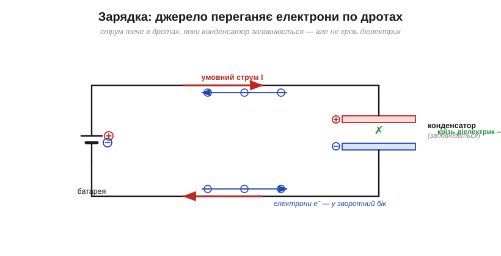
*Рис. 7.1.4. Батарея відкачує електрони з правої обкладки й накачує на ліву. Струм тече **в дротах** (заряд рухається до обкладок і від них), але **не крізь діелектрик** — там заряду не перейти. Конденсатор заповнюється, поки його напруга не зрівняється з напругою джерела.*

Ключове спостереження: струм у дротах **є**, поки конденсатор заряджається, хоча крізь сам зазор не проходить жоден заряд. Електрони не перестрибують діелектрик — вони лише збираються на обкладках. Зовні це виглядає так, ніби «струм пройшов крізь конденсатор», та насправді з одного боку заряд притік, а з іншого — рівно стільки ж відтік. *Як швидко* йде це заповнення (і чому крива саме така) — тема [§7.4](ch07-capacitor.md); тут досить знати, що заряджання **не миттєве** й що під кінець струм спадає до нуля.

### Чому конденсатор «не пропускає» постійний струм

Коли конденсатор зарядився до напруги джерела, переганяти заряд більше нікуди — струм **припиняється**. Підключений до сталої (постійної) напруги, заряджений конденсатор поводиться як **розрив**: крізь нього **постійний струм не тече**. А от поки напруга **змінюється** — заряд доводиться щоразу доганяти, і струм у дротах є.

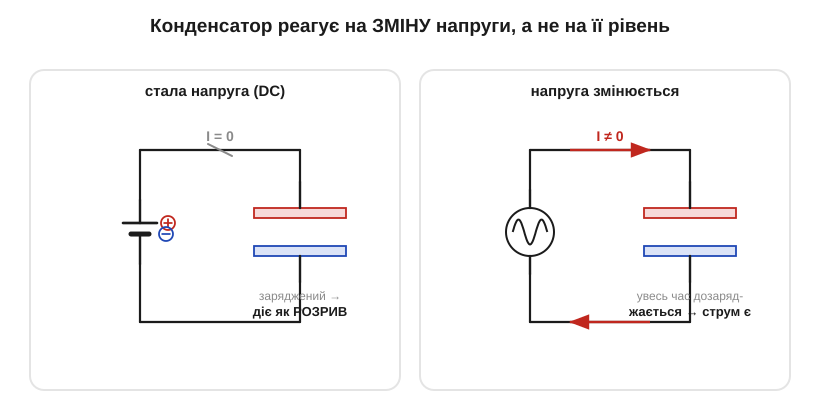
*Рис. 7.1.5. Зліва — стала напруга: конденсатор зарядився, струм = 0, він діє як розрив кола. Справа — напруга змінюється: конденсатор увесь час дозаряджається/розряджається, тож у дротах тече струм. Звідси правило: конденсатор реагує на **зміну** напруги, а не на її рівень.*

> 🔧 **Навіщо це.** Це властивість, на якій тримається половина аналогової схемотехніки. Конденсатор **пропускає зміни й блокує сталу складову** — тож ним «зрізають» постійний рівень, лишаючи тільки коливання сигналу (так звана розв'язка по змінному струму). На цьому ж стоїть **розв'язувальний конденсатор** біля кожної мікросхеми: для повільних, «постійних» процесів він невидимий, а на швидкий стрибок струму миттєво віддає свій запас. Як саме реакція залежить від частоти зміни — кількісно в [Розділі 9](ch07-capacitor.md); поки достатньо інтуїції «реагує на зміну».

### Аналогія: пружна перетинка в трубі

Щоб відчути це нутром, уявіть водогінну аналогію (струм — потік води, напруга — тиск). Конденсатор — це **пружна гумова перетинка**, що перекриває трубу впоперек. Вода крізь неї не проходить **ніколи** (мембрана суцільна). Та коли з одного боку піднімають тиск, перетинка **вигинається**, відштовхуючи трохи води з іншого боку, — і запасає енергію в своєму натягу. Перестали тиснути — мембрана розправляється й **повертає** воду назад.

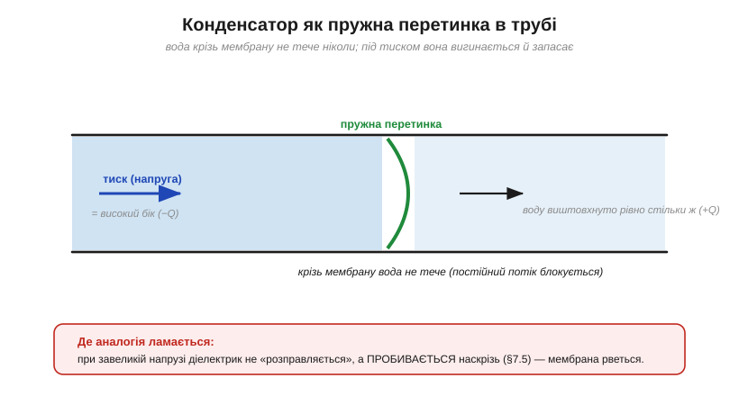
*Рис. 7.1.6. Пружна перетинка: під тиском вигинається (запасає), штовхає воду по інший бік — рівно стільки, скільки прийшло (рівні +Q і −Q). Крізь саму мембрану вода не тече (постійний потік блокується), але «гойдання» тиску туди-сюди проганяє воду в трубі. Де аналогія ламається: справжній конденсатор не має суцільної «стінки», що рветься від тиску, — натомість при завеликій напрузі **пробивається діелектрик** (про межу напруги — §7.5).*

Аналогія точна там, де нам треба: **постійний потік — ні, зміни — так; запасає й повертає; має рівні «надлишок» і «брак» з двох боків**. Як завжди, корисно знати й межу: модель пружної мембрани нічого не каже про те, що буде, коли «продавити» діелектрик, — а він, на відміну від ідеальної гуми, при перевищенні напруги просто **пробивається** наскрізь (це вже [§7.5](ch07-capacitor.md)).

### Конденсатор пам'ятає: чим він не схожий на резистор

Ось найважливіша різниця між конденсатором і резистором. **Резистор не має пам'яті**: прибрали напругу — і струму миттєво нема, він нічого не зберіг (енергію він безповоротно перетворив на тепло, [§3.6](../../block-1-circuits-physics/ch03-resistance-power-heat/ch03-resistance-power-heat.md)). **Конденсатор має пам'ять**: якщо зарядити його й **від'єднати**, розділений заряд нікуди не дінеться — діелектрик не дає половинкам зійтися, і напруга на виводах **лишається** надовго.


*Рис. 7.1.7. Той самий дослід для обох. Від'єднали джерело — на резисторі напруга миттєво нуль (він «забув»), а заряджений конденсатор тримає напругу й готовий віддати струм (він «пам'ятає»). Резистор енергію **витрачає** на тепло; конденсатор — **запасає** й повертає.*

> 🔧 **Навіщо це.** Та сама «пам'ять» — це і користь, і небезпека. Користь: конденсатор згладжує провали живлення, бо тримає запас напоготові. Небезпека — пряме відлуння удару Мушенбрука: **великий конденсатор лишається зарядженим і після вимкнення приладу**. У блоках живлення, спалахах, підсилювачах він може тримати небезпечну напругу годинами. Тому в сервісі діє правило: перш ніж лізти руками — **розрядити** конденсатори. Заряджений конденсатор — це маленька лейденська банка у вас на платі.

### Як його малюють на схемі

На принциповій схемі (мова схем — [§6.2](../../block-1-circuits-physics/ch06-schematics-measurement/ch06-schematics-measurement.md)) конденсатор зображають двома рисками — буквально дві обкладки із зазором між ними. Це один із найнаочніших символів: малюнок прямо повторює будову.

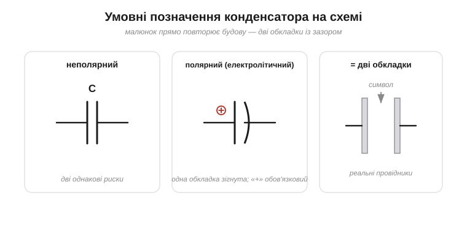
*Рис. 7.1.8. Ліворуч — **неполярний** конденсатор: дві однакові прямі риски (символ ємності — велика латинська C, типові виводи без знака). Праворуч — **полярний** (електролітичний): одна обкладка зігнута або зафарбована, поряд — знак **+**; такий не можна вмикати «навпаки» (чому — у §7.5). Посередині показано, як символ відповідає реальним обкладкам.*

### Будь-які два провідники — це вже трохи конденсатор

Означення нічого не каже про спеціальну деталь — лише «два провідники й ізолятор між ними». А отже, конденсатор виникає **скрізь**, де поряд опинились два провідники, навіть якщо ми його туди не ставили. Дві сусідні доріжки на платі, дві жили в кабелі, вивід мікросхеми й металевий корпус, навіть провід над землею — це все пари провідників, розділені повітрям чи пластиком, тобто крихітні **ненавмисні** конденсатори. Їх називають **паразитними** (*parasitic capacitance*).

Зазвичай вони мізерні й непомітні. Та згадаймо головну властивість: конденсатор реагує на **зміну** напруги. Тому на швидких сигналах паразитна ємність прокидається — різкий перепад напруги на одній доріжці наводить струм у сусідній через їхню взаємну ємність. Це **наведення** (*crosstalk*): доріжки ніби й не з'єднані, а сигнал «протікає» з однієї в іншу саме крізь повітряний конденсатор між ними. Так само будь-який довгий неекранований провід має ємність на землю й поводиться не як ідеальний дріт, а як дріт із «розмазаним» уздовж нього конденсатором. Цю фізику не можна вимкнути — лише врахувати.

> 🔧 **Навіщо це.** Коли схема, що чудово працювала на макеті, на готовій платі раптом «дзвенить» чи ловить завади, перший підозрюваний — паразитна ємність між доріжками. Але та сама ідея працює й на користь: **ємнісний сенсор дотику** (екран телефона, кнопка без жодної механіки) — це просто вимірювання того, як ваш палець, ще один провідник, змінює ємність між двома доріжками під склом. Та сама лейденська банка з історії розділу — тепер у вигляді тачскрина в кишені.

**Приклад (скільки електронів розділяє конденсатор).** Нехай конденсатор тримає розділений заряд Q = 1 мкКл (мікрокулон) — типова величина для невеликого конденсатора в колі. Скільки електронів довелося перегнати з однієї обкладки на іншу? Користуємося лише елементарним зарядом з [§1.1](../../block-1-circuits-physics/ch01-charge-field-potential/ch01-charge-field-potential.md):

```
N = Q / e
N = (1 × 10⁻⁶ Кл) / (1.602 × 10⁻¹⁹ Кл)
N ≈ 6.2 × 10¹²  електронів
```

Понад шість трильйонів електронів переїхали з правої обкладки на ліву — і саме стільки ж «дірок» (нестачі) лишилось на правій. Завважте: це **мізерна частка** від усіх електронів металу обкладок (їх там астрономічно більше) — конденсатор, як і вся електрика з [§1.1](../../block-1-circuits-physics/ch01-charge-field-potential/ch01-charge-field-potential.md), грає на **малому дисбалансі** величезних протилежних зарядів.

Отже, конденсатор — це **два провідники з ізолятором між ними**, що **розділяють** заряд (рівні +Q і −Q), тримають його полем у зазорі, реагують лише на **зміну** напруги й **пам'ятають** свій стан. Усе це — якісно. Тепер пора зробити з «більше заряду — більша напруга» точну формулу й одиницю: переходимо до **ємності**.

---

## 7.2 Ємність: Q = C·V

У попередній темі ми дійшли інтуїції: що більше заряду розвести по обкладках, то вища напруга на конденсаторі. Тепер зробімо це **числом**. Виявляється, зв'язок між розділеним зарядом і напругою — найпростіший з можливих: **прямо пропорційний**. Скільки разів збільшили напругу — стільки ж разів зросте й запасений заряд. Коефіцієнт цієї пропорції — головна характеристика конденсатора, яку ви читатимете на кожному його боці й у кожному даташиті: **ємність**.

### Ємність — це «скільки заряду на вольт»

Прикладемо до конденсатора напругу V і поміряємо, який заряд Q він при цьому розділив. Прикладемо вдвічі більшу напругу — заряд теж стане вдвічі більшим. Утричі — утричі. Відношення заряду до напруги **лишається сталим**, і саме воно називається **ємністю** (*capacitance*, позначають **C**):

```
C = Q / V        →        Q = C · V
```

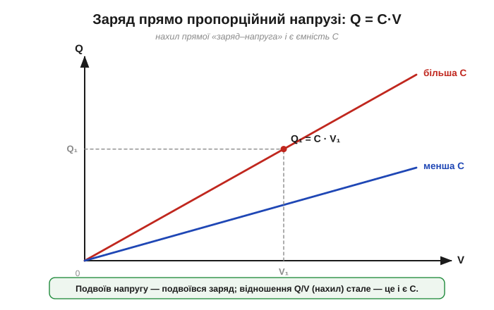
*Рис. 7.2.1. Якщо відкладати запасений заряд Q проти прикладеної напруги V, виходить **пряма крізь початок координат**. Її нахил і є ємність C. Більша ємність — крутіша пряма: той самий вольт «садить» на обкладки більше заряду.*

Читати це слід так: **ємність — це міра «місткості»** конденсатора, скільки кулонів заряду він розділяє на кожен прикладений вольт. Конденсатор у 2 одиниці ємності за тієї самої напруги тримає вдвічі більший заряд, ніж конденсатор в 1 одиницю. Слово підказує саме це: «ємність» — як місткість посудини, лише міряємо не літри води, а кулони розділеного заряду на вольт «тиску».

### Чому зв'язок саме лінійний

Звідки впевненість, що Q і V ростуть рівно пропорційно, а не якось хитріше? Корінь — у незмінності будови. Розділений заряд на обкладках створює поле в зазорі, і це поле **прямо пропорційне** заряду: удвічі більше заряду — удвічі густіші лінії поля ([§1.3](../../block-1-circuits-physics/ch01-charge-field-potential/ch01-charge-field-potential.md)). А напруга — це поле, помножене на (незмінну) відстань між обкладками: V = E·d ([§1.6](../../block-1-circuits-physics/ch01-charge-field-potential/ch01-charge-field-potential.md)). Ланцюжок виходить простий: більше заряду → пропорційно сильніше поле → пропорційно вища напруга. Кожна ланка лінійна, тож і вся залежність Q від V — **пряма крізь нуль**.

Важливо, що ця лінійність тримається, лише поки **будова стала**: площа, зазор і діелектрик не змінюються. Для більшості конденсаторів у робочому діапазоні так і є — вони близькі до лінійних: подвоїв напругу — приблизно подвоїв заряд. Та є важливий **виняток**, про який варто знати наперед: сегнетоелектрична **кераміка класу 2** (X5R, X7R) міняє свою проникність εr залежно від прикладеного поля, тож її ємність помітно **падає з напругою** (ефект *DC bias*) — реальні «10 мкФ» під робочою напругою можуть просісти до 6–7 мкФ. Стабільна кераміка класу 1 (C0G/NP0) і плівка цього майже не мають. Тому «заряд пропорційний напрузі» — добра робоча модель, але для точних розрахунків треба знати ще й тип діелектрика (докладніше — [§7.5](ch07-capacitor.md)). А якщо перевищити допустиму напругу, діелектрик не витримає й картина зруйнується зовсім (про цю межу — теж [§7.5](ch07-capacitor.md)).

### Фарад — і чому він велетенський

Одиниця ємності — **фарад** (*farad*, **Ф** / **F**), названий на честь Майкла Фарадея (того, що подарував нам поле, [§1.3](../../block-1-circuits-physics/ch01-charge-field-potential/ch01-charge-field-potential.md)). З означення C = Q/V одразу видно, **що** таке фарад:

```
1 фарад = 1 кулон / 1 вольт
1 Ф = 1 Кл / 1 В
```

Тобто конденсатор у 1 Ф — це той, що при напрузі лише 1 В розділяє цілий **кулон** заряду. А ми вже знаємо з [§1.1](../../block-1-circuits-physics/ch01-charge-field-potential/ch01-charge-field-potential.md): кулон — це **колосальний** заряд (понад 6·10¹⁸ електронів). Тому фарад — неосяжно велика одиниця: справжній конденсатор на цілий фарад донедавна годі було уявити. Реальні деталі мають ємності в **мільйони й мільярди разів менші**, тож їх записують із приставками:

```
1 пФ (пікофарад) = 10⁻¹²  Ф      (дрібні керамічні, ВЧ-кола)
1 нФ (нанофарад) = 10⁻⁹   Ф      (фільтри, розв'язка)
1 мкФ (мікрофарад) = 10⁻⁶ Ф      (живлення, згладжування)
1 мФ (міліфарад) = 10⁻³   Ф      (великі електролітичні)
1 Ф                              (суперконденсатор — окремий клас)
```

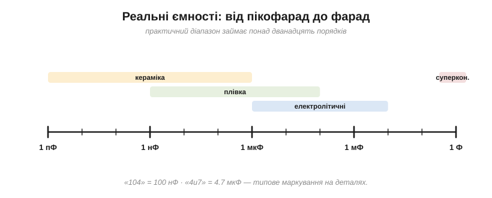
*Рис. 7.2.2. Практичний діапазон ємностей займає понад **дванадцять порядків**. Левова частка деталей — від одиниць пікофарад до тисяч мікрофарад; цілий фарад — це вже окрема порода «суперконденсаторів». Коли в схемі бачите «100n» чи «4u7» — це 100 нФ і 4.7 мкФ.*

> 🔧 **Навіщо це.** Маркування ємності варто читати з льоту. На дрібних деталях пишуть код із трьох цифр у пікофарадах: «104» означає 10 та ще 4 нулі пікофарад = 100 000 пФ = 100 нФ (улюблений розв'язувальний конденсатор). На більших — прямо «10µF 25V». А позначення на кшталт «4n7» чи «2u2» — це європейський стиль, де буква-приставка стоїть замість коми: 4.7 нФ і 2.2 мкФ. Це той самий навик, що й читання номіналу резистора, тільки для ємностей.

**Приклад (скільки заряду тримає реальний конденсатор).** Конденсатор 100 мкФ під напругою 5 В — звична пара в колі живлення. Який заряд він розділяє?

```
Q = C · V
Q = (100 × 10⁻⁶ Ф) · (5 В)
Q = 5 × 10⁻⁴ Кл  =  0.5 мКл  =  500 мкКл
```

Пів-мілікулона — у **п'ятсот разів** більше за 1 мкКл із прикладу [§7.1](ch07-capacitor.md), хоча напруга цілком помірна. Ось що дає велика ємність: навіть за скромних вольтів конденсатор розділяє відчутний заряд — а отже, готовий віддати помітний струм тієї миті, коли він знадобиться колу.

### Ємність задається будовою, а не зарядом

Найважливіше, що варто зрозуміти про C: вона **не залежить** від того, скільки заряду ви наразі в конденсатор завели чи яку напругу приклали. Подвоїли напругу — подвоївся й заряд, а їхнє відношення Q/V лишилось тим самим. Ємність — це **властивість самого пристрою**, закладена його **будовою**: розміром обкладок, відстанню між ними й тим, який ізолятор стоїть у зазорі. Це як місткість відра: вона задана формою відра, а не тим, скільки води ви туди налили.

Тож запитаймо конкретно: **від чого** залежить ємність? Три важелі, кожен — пряме продовження фізики поля з [§7.1](ch07-capacitor.md).

### Більша площа — більша ємність

Перший важіль — **площа обкладок A**. Що більша площа, то більше місця, куди «розкласти» заряд, не підвищуючи напруги. Удвічі більші пластини за тієї самої напруги приймуть удвічі більший заряд — отже, ємність **прямо пропорційна площі**.

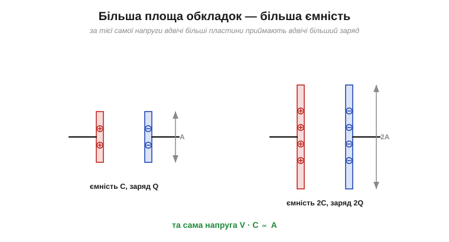
*Рис. 7.2.3. Дві обкладки більшої площі за тієї самої напруги розділяють більше заряду — заряд просто «розкладається» вільніше. Ємність зростає прямо пропорційно площі: C ∝ A.*

### Менший зазор — більша ємність

Другий важіль — **відстань між обкладками d**. Тут залежність **обернена**: що тонший зазор, то **більша** ємність. Інтуїція — у полі. Напруга й поле в зазорі пов'язані як V = E·d ([§1.6](../../block-1-circuits-physics/ch01-charge-field-potential/ch01-charge-field-potential.md)): за тієї самої напруги тонший зазор дає **сильніше** поле. А сильніше поле здатне втримати більше розділеного заряду. До того ж близькі обкладки сильніше притягують протилежні заряди одна одної — їм «легше» утриматися нарізно. Тому, зменшивши зазор удвічі, ємність **подвоюємо**.

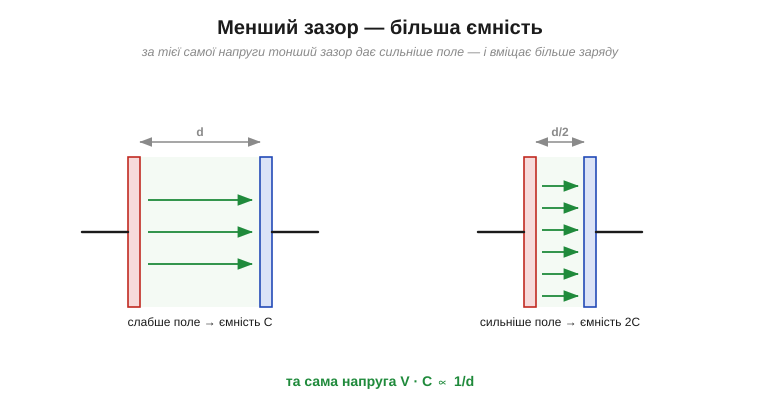
*Рис. 7.2.4. За однакової напруги у вузькому зазорі поле густіше (E = V/d), і протилежні заряди обкладок тримають одне одного міцніше — тож конденсатор приймає більше заряду. Ємність обернено пропорційна зазору: C ∝ 1/d.*

### Діелектрик: чому він збільшує ємність

Третій важіль — **матеріал діелектрика**. Заміна повітря в зазорі на інший ізолятор (скло, кераміку, плівку) може підняти ємність у десятки, сотні й навіть тисячі разів — за тих самих розмірів. Чому?

Молекули діелектрика під дією поля **поляризуються**: їхні заряди трохи зміщуються, і кожна молекула стає крихітним диполем, що вишиковується **вздовж** зовнішнього поля (плюсом — у бік мінусової обкладки). Через це на двох поверхнях діелектрика проступають **зв'язані заряди**, і поле, яке *вони* створюють, спрямоване **проти** зовнішнього — тож сумарне поле в зазорі частково **гаситься**. А слабше поле означає нижчу напругу за того самого заряду — отже, при тій самій напрузі конденсатор тепер вміщає **більше** заряду. Саме у стільки разів, у скільки діелектрик послаблює поле, і зростає ємність.

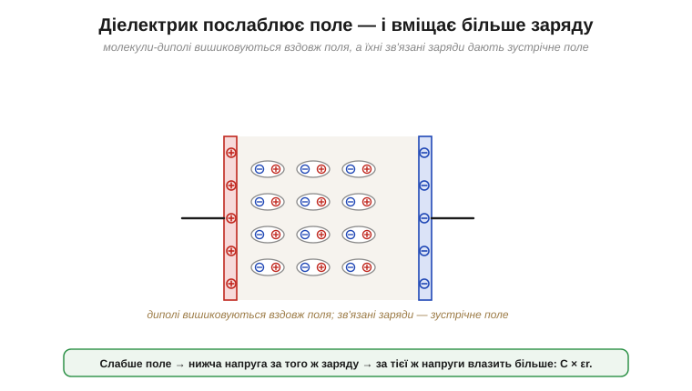
*Рис. 7.2.5. Молекули діелектрика повертаються диполями вздовж поля; зв'язані заряди, що проступають на поверхнях діелектрика, створюють **зустрічне** поле — і воно частково гасить поле обкладок. Поле слабшає → за тієї самої напруги влазить більше заряду → ємність більша. Це й кодує **відносна діелектрична проникність** εr.*

Цей множник називають **відносною діелектричною проникністю** (*relative permittivity*, або *dielectric constant*, **εr**, інколи κ). Для вакууму εr = 1 (гасити нема чому), для повітря — майже 1, а для твердих діелектриків — помітно більше:

```
вакуум            εr = 1      (за означенням)
повітря           εr ≈ 1.0006
тефлон (PTFE)     εr ≈ 2.1
плівка (поліестер) εr ≈ 3.2
папір             εr ≈ 3.5
скло, слюда       εr ≈ 5…7
кераміка (NP0)    εr ≈ 30
кераміка (X7R)    εr ≈ 2000…4000
```

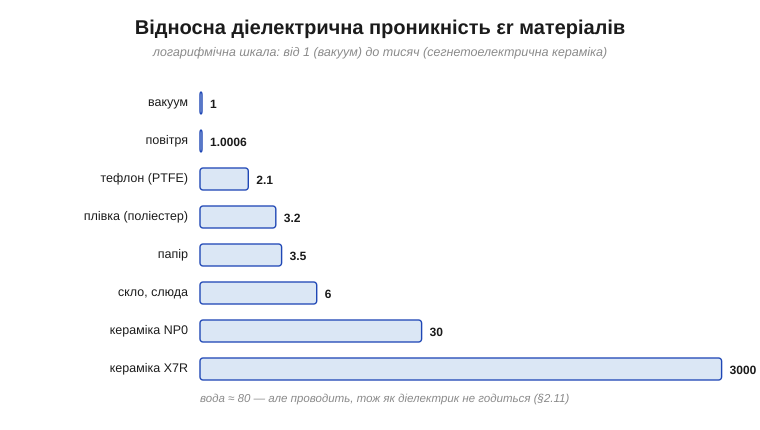
*Рис. 7.2.6. Відносна проникність εr на логарифмічній шкалі: від 1 (вакуум) до тисяч (сегнетоелектрична кераміка). Саме завдяки таким діелектрикам у крихітну деталь вдається втиснути мікрофаради. Вода має εr ≈ 80, але як діелектрик не годиться — вона проводить (з [§2.11](../../block-1-circuits-physics/ch02-voltage-current-conduction/ch02-voltage-current-conduction.md)).*

> 🔧 **Навіщо це.** Який саме діелектрик стоїть усередині — це не дрібниця: від нього залежить не тільки ємність, а й стабільність, втрати й допустима напруга. Тому конденсатори й діляться на «класи» за діелектриком (кераміка NP0/X7R, плівка, електроліт), у кожного — свій компроміс. Ці типи й те, як їх обирати, — окрема тема [§7.5](ch07-capacitor.md); поки досить запам'ятати: **більша εr → більша ємність, але часто гірша стабільність**.

### Формула плаского конденсатора

Зведімо три важелі в одну формулу. Для двох пласких обкладок площею A на відстані d з діелектриком εr ємність дорівнює:

```
C = ε₀ · εr · A / d
```

де **ε₀** (*permittivity of free space*) — та сама діелектрична проникність вакууму, що з'явилась у законі Кулона ([§1.2](../../block-1-circuits-physics/ch01-charge-field-potential/ch01-charge-field-potential.md)):

```
ε₀ = 8.854 × 10⁻¹²  Ф/м
```

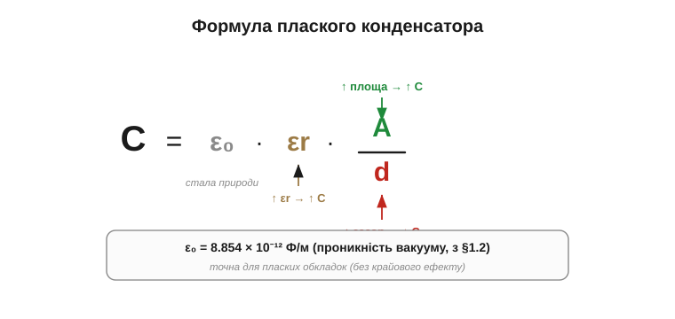
*Рис. 7.2.7. Уся фізика тем вище — в одному рядку. ↑ площа A та ↑ проникність εr підіймають ємність; ↑ зазор d її знижує. ε₀ — стала природи. Формула точна для пласких обкладок (нехтуючи крайовим ефектом з §7.1).*

Ця формула — пряме пояснення всіх хитрощів лейденської банки з історії розділу. Чому банку робили високою й широкою? Щоб збільшити площу A фольги. Чому скло брали тонке? Щоб зменшити зазор d. А Франклінова пласка пластина — шибка з фольгою з обох боків — це буквально C = ε₀·εr·A/d у металі: велика площа скла, тонкий зазор, та ще й діелектрик εr ≈ 5 замість повітря. Не знаючи ні формули, ні самого слова «ємність», експериментатори XVIII століття навпомацки крутили саме ті три ручки, що стоять у цьому рядку.

**Приклад (ємність простого конденсатора).** Дві квадратні пластини зі стороною 1 см (площа A = 1 см² = 1×10⁻⁴ м²), повітряний зазор d = 0.1 мм = 1×10⁻⁴ м. Знайдемо ємність:

```
C = ε₀ · εr · A / d
C = (8.854×10⁻¹² Ф/м) · 1 · (1×10⁻⁴ м²) / (1×10⁻⁴ м)
C = 8.854×10⁻¹² Ф
C ≈ 8.9 пФ
```

Сантиметрові пластини дають лише ≈ 9 пікофарад — мізер. А тепер замінімо повітря керамікою з εr = 1000: ємність зросте рівно в 1000 разів, до ≈ 8.9 **нанофарад**, не змінивши й міліметра розмірів. Ось навіщо потрібні діелектрики.

### Чому 1 фарад — це багато

Тепер відчуймо масштаб фарада «зсередини» формули. Скільки треба пластин, щоб дотягти до **1 Ф** із тим самим тонким повітряним зазором 0.1 мм?

```
A = C · d / (ε₀ · εr)
A = (1 Ф) · (1×10⁻⁴ м) / (8.854×10⁻¹² Ф/м · 1)
A ≈ 1.13 × 10⁷  м²
```

Понад **одинадцять квадратних кілометрів** обкладки заради одного фарада! Ось чому реальні конденсатори йдуть на хитрощі: беруть якнайбільшу площу й **згортають** її в малий об'єм, а зазор роблять якнайтоншим (плівка в кілька мікрометрів) і ставлять діелектрик із високою εr. Сукупно ці три прийоми й дозволяють втиснути мікрофаради й навіть фаради в деталь розміром із горошину.

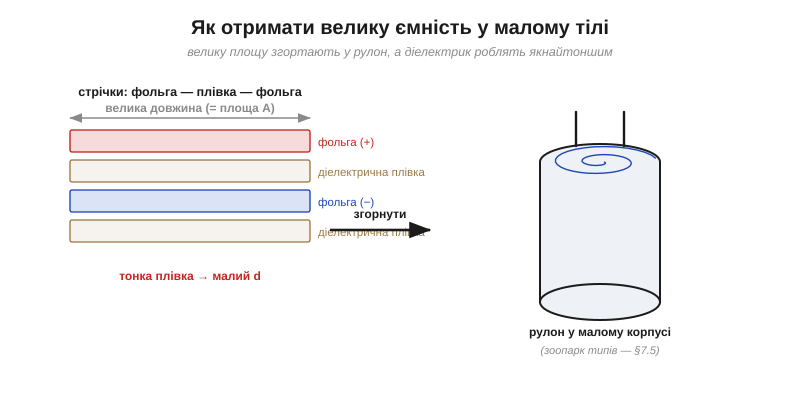
*Рис. 7.2.8. Дві довгі стрічки фольги з тонкою діелектричною плівкою між ними згортають у рулон: так велику площу A ховають у малий об'єм, а тонка плівка дає малий d. Велика A, малий d, добра εr — усі три важелі формули працюють разом. (Зоопарк конструкцій і матеріалів — у §7.5.)*

### Дві ручки до запасеного заряду

З Q = C·V випливає практичний висновок: заряду в конденсаторі можна запасти більше **двома** способами — узяти **більшу ємність** або підняти **напругу**. Обидві ручки реальні, але різні за ціною. Ємність коштує об'єму: більша C — це більша площа (а отже, більший корпус) або тонший чи кращий діелектрик. Напруга ж обмежена згори: тонкий діелектрик, що дає велику ємність, водночас легше **пробивається**, тож кожен конденсатор має позначену **граничну напругу**, перевищувати яку не можна (це окрема важлива тема — [§7.5](ch07-capacitor.md)).

Звідси типовий компроміс, який ви побачите в даташитах: деталі на велику ємність зазвичай розраховані на невелику напругу, і навпаки. «100 мкФ 6.3 В» і «1 мкФ 100 В» можуть бути однакові за розміром, бо за тієї самої технології велика ємність і висока напруга тягнуть конструкцію в різні боки. Тому вибір конденсатора — це завжди погляд одразу на **дві** цифри: скільки фарад і до скількох вольт.

Підсумуймо. **Ємність C = Q/V** — це стала властивість конденсатора, що каже, скільки заряду він розділяє на вольт; міряється у **фарадах** (на практиці — пФ…мФ). Вона задається будовою за формулою **C = ε₀·εr·A/d**: більша площа й проникність піднімають її, менший зазор — теж. Маючи C, ми вже можемо порахувати запасений заряд за будь-якої напруги. Наступний крок — порахувати, скільки в цьому розділеному заряді **енергії**.

---

## 7.3 Енергія в конденсаторі й полі

Заряджений конденсатор тримає не лише заряд — він тримає **запас енергії**, готовий зробити роботу. Саме ця енергія валила з ніг Мушенбрука біля лейденської банки, вона ж за тисячну частку секунди спалахує у фотоспалаху й рятує життя в дефібриляторі. У попередніх темах ми рахували, *скільки заряду* розділяє конденсатор; тепер порахуймо, *скільки джоулів* у ньому захована — і, що важливіше, зрозуміймо, **де** ця енергія сидить і **звідки** береться.

### Звідки береться енергія: робота проти зростання напруги

Енергія в конденсаторі не виникає з нічого — її **вкладає джерело**, поки заряджає. Згадаймо з [§1.5](../../block-1-circuits-physics/ch01-charge-field-potential/ch01-charge-field-potential.md): щоб перенести заряд через різницю потенціалів, треба виконати роботу (вольт — це джоуль на кулон). Заряджаючи конденсатор, джерело весь час переносить заряд із однієї обкладки на іншу — проти напруги, що **сама росте** в міру накопичення.

Ось ключ до загадкового множника ½. На самому початку конденсатор порожній, напруга на ньому **нуль** — перші порції заряду переносяться майже «задарма». Та що більше заряду накопичилось, то вища напруга й то **важче** доганяти наступну порцію. Останню порцію доводиться тягти вже проти **повної** напруги V. Тобто заряд переноситься не проти сталої напруги, а проти такої, що лінійно росте від 0 до V.


*Рис. 7.3.1. Заряджання — це перенесення заряду проти напруги, що сама зростає від 0 до V. Перша порція йде «задарма» (напруга ще нульова), остання — проти повної напруги. Тому середня «вартість» переносу — це напруга на середині шляху, V/2.*

Якщо напруга рівномірно зростала від 0 до V, то **середня** напруга, проти якої переносився весь заряд Q, дорівнює просто V/2. А енергія — це заряд, помножений на напругу, проти якої його тягли. Звідси:

```
W = Q · V_середнє
W = Q · (V / 2)
W = ½ · Q · V
```


*Рис. 7.3.2. Та сама ½ — геометрично. На графіку «заряд–напруга» (з §7.2) енергія дорівнює площі під прямою. Оскільки пряма йде з нуля, ця площа — **трикутник** з катетами Q і V, а його площа = ½·Q·V. Якби напруга була стала (прямокутник), вийшло б Q·V; але вона росла, тож рівно половина.*

Множник ½ — не випадковий коефіцієнт, а пряме відлуння того, що напругу довелося піднімати **з нуля**. Якби заряд переносили проти вже наявної сталої напруги (як у звичайному переносі через батарею), множника ½ не було б.

### Три рівноцінні форми

Маючи W = ½·Q·V і пам'ятаючи зв'язок Q = C·V із [§7.2](ch07-capacitor.md), легко отримати ще дві форми тієї самої енергії — підставивши Q = C·V або V = Q/C:

```
W = ½ · Q · V          (через заряд і напругу)
W = ½ · C · V²          (через ємність і напругу)
W = ½ · Q² / C          (через заряд і ємність)
```

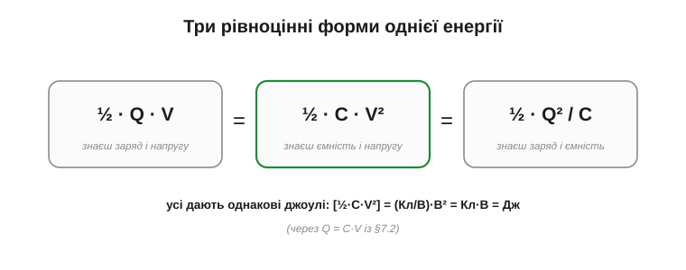
*Рис. 7.3.3. Три записи однієї величини. Обирають той, де відомі потрібні величини: знаєш C і V — бери ½·C·V²; знаєш заряд — інші форми. Усі дають однакові джоулі.*

Перевірмо, що це справді **джоулі**. Візьмемо ½·C·V²: ємність у фарадах (Кл/В), напруга у вольтах, а вольт — це джоуль на кулон ([§1.5](../../block-1-circuits-physics/ch01-charge-field-potential/ch01-charge-field-potential.md)):

```
[C·V²] = (Кл / В) · В² = Кл · В = Кл · (Дж / Кл) = Дж   ✓
```

Одиниці сходяться — енергія конденсатора вимірюється в джоулях, як і належить будь-якій енергії.

**Приклад (енергія невеликого конденсатора).** Той самий конденсатор 100 мкФ під напругою 5 В із [§7.2](ch07-capacitor.md). Скільки в ньому енергії?

```
W = ½ · C · V²
W = ½ · (100 × 10⁻⁶ Ф) · (5 В)²
W = ½ · (100 × 10⁻⁶) · 25
W = 1.25 × 10⁻³ Дж  =  1.25 мДж
```

Усього міліджоулі — крихта (стільки ж енергії має мураха, що проповзла кілька сантиметрів). Конденсатори в логіці й живленні тримають **мало** енергії; їхня сила — не в запасі, а в готовності віддати його **миттєво** (про це нижче).

### Конденсатор як електрична пружина

Множник ½ і квадрат можуть здатися знайомими — і недарма. Згадаймо звичайну пружину: щоб стиснути її на x, потрібна сила, що сама росте зі зміщенням (F = k·x), а запасена в стиску енергія виходить ½·k·x². Конденсатор поводиться **точнісінько так само**, лише замість зміщення x — напруга V, а замість жорсткості k — ємність C:

```
пружина:      W = ½ · k · x²
конденсатор:  W = ½ · C · V²
```

Аналогія напрочуд глибока. Як і пружину, конденсатор треба «натягувати» проти зростального опору (напруги); він запасає енергію в «натягу» (полі) і **повертає** її повністю, коли його відпустити (розрядити). Жорсткіша пружина (велика k) накопичує більше енергії за те саме зміщення; «жорсткіший» конденсатор (велика C) — за ту саму напругу. І ламається ця аналогія там само, де й гумова перетинка з [§7.1](ch07-capacitor.md): пружину можна перетягнути й зламати, а конденсатор за завеликої напруги — пробити наскрізь по діелектрику ([§7.5](ch07-capacitor.md)).

### Чому напруга важливіша за ємність: квадрат

У формулі ½·C·V² ємність входить у **першому** степені, а напруга — у **квадраті**. Це означає, що напруга набагато «важливіша» для енергії: подвоїти ємність — подвоїти енергію, а подвоїти напругу — **вчетверо** її збільшити.

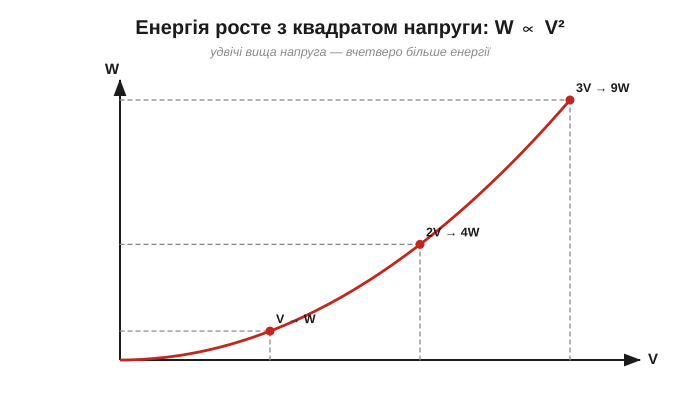
*Рис. 7.3.4. Залежність енергії від напруги — парабола W ∝ V². Удвічі вища напруга дає вчетверо більше енергії, утричі — у дев'ять разів. Ось чому небезпека зарядженого конденсатора зростає з напругою стрімкіше, ніж здається.*

**Приклад (конденсатор фотоспалаху).** Спалах накопичує енергію в конденсаторі ≈ 200 мкФ, зарядженому до ≈ 300 В:

```
W = ½ · C · V²
W = ½ · (200 × 10⁻⁶ Ф) · (300 В)²
W = ½ · (200 × 10⁻⁶) · 90 000
W = 9 Дж
```

Дев'ять джоулів — у **сім тисяч разів** більше за попередній приклад, хоча ємність лише вдвічі більша. Уся різниця — у напрузі: 300 В замість 5 В, а вона у квадраті. Саме тому потужні накопичувачі енергії працюють на **високій** напрузі, а заряджений високовольтний конденсатор смертельно небезпечний навіть за помірної ємності.

**Приклад (та сама ємність, інша напруга).** Візьмемо знову 100 мкФ, але піднімемо напругу з 5 В лише вдесятеро — до 50 В:

```
W = ½ · (100 × 10⁻⁶ Ф) · (50 В)²
W = ½ · (100 × 10⁻⁶) · 2500
W = 0.125 Дж  =  125 мДж
```

Енергія підскочила зі 1.25 мДж до 125 мДж — у **сто разів** від десятикратної напруги. Той самий конденсатор, та сама ємність — а запас визначає передусім напруга, бо вона у квадраті.

### Де насправді сидить енергія: у полі

А тепер — питання, відповідь на яке дав ще Франклін, розібравши лейденську банку (історія розділу). Де фізично **зберігається** ця енергія? Спокусливо сказати «на обкладках, у заряді». Але правильна відповідь глибша: енергія захована в **електричному полі** в зазорі між обкладками.

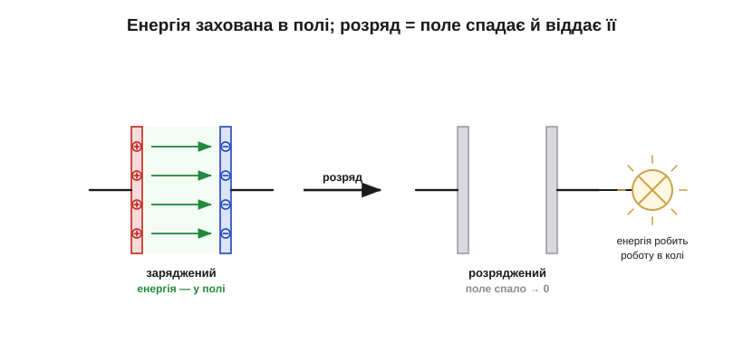
*Рис. 7.3.5. Заряд лише «тримає» поле напнутим у діелектрику — а сама енергія розлита в цьому полі (з §7.1). Коли конденсатор розряджається, поле **спадає до нуля**, і запасена в ньому енергія виходить назовні, женучи струм розряду. Це те саме Франклінове відкриття: запас живе не в металі, а в полі між обкладками.*

Ця думка спершу дивує, та вона глибоко правильна й колись виявиться всюди: енергія взагалі любить «жити» в полях. Поки поле напнуте — енергія є; зникло поле — енергію віддано. Конденсатор у цьому сенсі — машинка, що **запасає енергію в електричному полі** (а котушка, яку ми зустрінемо в наступному розділі, робитиме те саме з магнітним полем).

І ще один наслідок цього «зберігання в полі»: оскільки енергія просто **лежить** у полі, нічого не витрачаючи на тепло, ідеальний конденсатор повертає її назад **до останнього джоуля**. Він не «протікає», як дірява бочка, — він чесна скарбничка. Реальний конденсатор, щоправда, поволі саморозряджається крізь неідеальний діелектрик, але це вже дрібні втрати, а не принцип (неідеальності — тема [§7.5](ch07-capacitor.md)).

### Запас, який повертається: конденсатор проти резистора

Тут — принципова різниця в долі енергії. **Резистор** енергію **спалює**: проганяючи струм, він безповоротно перетворює електричну енергію на тепло (P = I²R, [§3.6](../../block-1-circuits-physics/ch03-resistance-power-heat/ch03-resistance-power-heat.md)) — повернути її вже не можна. **Конденсатор** енергію не витрачає, а **запасає** й **повертає**: зарядили — енергія в полі; розрядили — вона повністю вийшла назад у коло (в ідеалі — до останнього джоуля).


*Рис. 7.3.6. Доля вкладеної енергії. У резисторі вона вся йде в тепло й розсіюється безповоротно (необоротно). У конденсаторі вона зберігається в полі й повертається при розряді (оборотно). Тому конденсатор називають **реактивним** елементом, а резистор — таким, що **розсіює**.*

> 🔧 **Навіщо це.** Ця оборотність — причина, чому конденсатори стоять усюди в живленні. Вони не гріються від запасання енергії (на відміну від резистора), тож можуть тримати запас «про запас» без втрат і миттєво підставити його, коли напруга живлення на мить просіла. Енергію, яку резистор спалив би на тепло, конденсатор лише позичає колу й бере назад. Це й робить його ідеальним маленьким буфером енергії.

### Енергія й потужність: повільно накопичити, миттєво віддати

Запас енергії в конденсаторі зазвичай скромний (міліджоулі, рідко — джоулі). Уся хитрість у тому, **як швидко** його можна віддати. Потужність — це енергія за секунду ([§3.5](../../block-1-circuits-physics/ch03-resistance-power-heat/ch03-resistance-power-heat.md)); якщо ту саму енергію віддати в тисячу разів швидше, потужність буде в тисячу разів більшою.


*Рис. 7.3.7. Конденсатор накопичує енергію **повільно** (слабке джерело, частки секунди чи секунди), а віддає її **ривком** за мікро- чи мілісекунди. Енергія та сама, але потужність у момент розряду — у тисячі разів вища за потужність зарядки. Звідси сліпучий спалах і потужний імпульс дефібрилятора.*

> 🔧 **Навіщо це.** Ось чому фотоспалах живиться від крихітної батарейки, а світить як прожектор: батарейка кілька секунд **поволі** заряджає конденсатор (мала потужність), а він віддає накопичені джоулі за тисячну частки секунди — і миттєва потужність сягає кіловатів. Дефібрилятор робить те саме з сотнями джоулів. Конденсатор — це не велике «відро» енергії, а радше **пружина**, яку довго натягують і відпускають умить.

### Конденсатор — не батарея: багато потужності, мало енергії

Звідси — головне, чим конденсатор відрізняється від акумулятора. Порахуймо запас модного **суперконденсатора** на 1 Ф, зарядженого до 2.7 В:

```
W = ½ · C · V²
W = ½ · 1 Ф · (2.7 В)²
W ≈ 3.6 Дж
```

Цілих 3.6 джоуля — і для конденсатора це вже чимало (а суперконденсатори на тисячі фарад тримають і десятки кілоджоулів: комірка 3000 Ф на 3 В — це ≈ 13 кДж). Та порівняно з хімічним джерелом навіть це мало: скромна пальчикова батарейка тримає **тисячі** джоулів, у кілька тисяч разів більше за наш приклад. За **запасом** енергії конденсатор безнадійно програє акумулятору.

Зате конденсатор б'є батарею за **потужністю**: він віддає весь запас за мілісекунди, тоді як батарея сточує його поволі, годинами. Кажуть, що конденсатор має малу **щільність енергії**, але величезну **щільність потужності**, а батарея — навпаки. Тому їх не протиставляють, а **поєднують**: батарея дає витривалість, конденсатор — миттєвий ривок струму, коли той раптом потрібен (запуск двигуна, спалах, імпульс зв'язку). Докладніше про акумулятори й цей поділ ролей — у Розділі 45; поки тримаймо в голові сам контраст: **конденсатор — для потужності, батарея — для запасу**.

Отже, енергія конденсатора — це **W = ½·C·V²** джоулів, вкладених джерелом проти зростання напруги, захованих у **полі** зазору й готових повністю повернутися при розряді — хоч повільно, хоч блискавично швидко. Лишилося питання, яке ми досі обходили: а **скільки часу** триває те заряджання й розряджання, і за яким законом? Це — наступна тема.

---

## 7.4 Зарядка й розрядка: стала часу RC

У [§7.1](ch07-capacitor.md) ми зауважили, що конденсатор заповнюється **не миттєво**, і відклали питання «як довго». Тепер відповімо на нього строго. Виявляється, заряджання й розряджання йдуть за однією-єдиною кривою — **експонентою**, — яка трапляється в природі всюди: від охолодження чаю до розпаду атомів. А темп цієї кривої задає одна проста величина — **стала часу**, що дорівнює добутку опору на ємність. Зрозумівши її раз, ви читатимете час у будь-якій схемі з конденсатором: від мерехтіння світлодіода до затримки скидання мікроконтролера.

### Чому в колі потрібен резистор

Спробуймо під'єднати конденсатор прямо до ідеального джерела напруги без жодного опору. Тоді в перший момент уся напруга джерела впала б на порожньому конденсаторі, а струм, за законом Ома I = V/R із R = 0, був би **нескінченним**. Це фізична нісенітниця: насправді струм завжди чимось обмежений — внутрішнім опором джерела, опором дротів, навмисно поставленим резистором. Тому реальне коло заряджання — це завжди **резистор і конденсатор разом**, RC-коло.

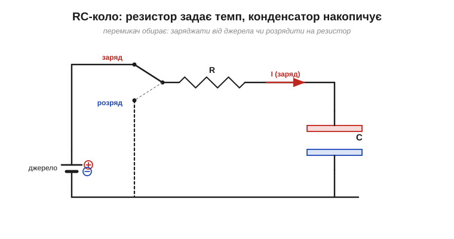
*Рис. 7.4.1. Резистор R обмежує струм, конденсатор C накопичує заряд. Перемикач у положенні «заряд» під'єднує джерело; у положенні «розряд» — замикає конденсатор на резистор, і він віддає запас. Саме пара R і C визначає, **як швидко** все відбувається.*

Резистор тут — не завада, а **регулятор темпу**: він задає, наскільки великий струм потече й, отже, як швидко конденсатор набере чи віддасть заряд.

### Заряджання: струм спадає, напруга росте

Простежмо за заряджанням від миті замикання. На самому початку конденсатор порожній, напруги на ньому нема — отже, **вся** напруга джерела припадає на резистор, і струм найбільший: I₀ = V/R. Цей струм жене заряд на обкладки, напруга на конденсаторі **росте**. Але щойно вона зросла, на резистор лишається вже менше напруги (їхня сума завжди дорівнює напрузі джерела, [§4.3](../../block-1-circuits-physics/ch04-kirchhoff-circuit-analysis/ch04-kirchhoff-circuit-analysis.md)) — а отже, **струм меншає**. Менший струм повільніше доносить заряд, напруга підіймається все млявіше. Процес сам себе гальмує. Образно: конденсатор схожий на склянку, яку наповнюють, занурюючи в неї воду, — що вища вода всередині, то менший перепад і то слабший доплив, тож останні краплі ледь сочаться. Тому конденсатор ніколи не «клацає» в заряджений стан умить, а плавно під'їжджає до напруги джерела.

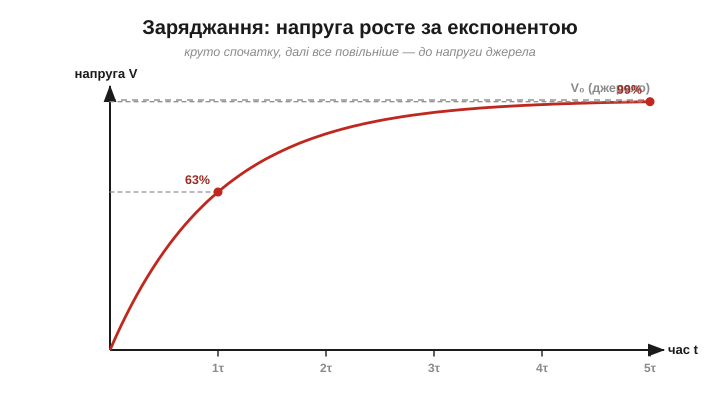
*Рис. 7.4.2. Напруга на конденсаторі при заряджанні: круто росте спочатку (струм великий), далі все повільніше, асимптотично наближаючись до напруги джерела. За одну сталу часу досягає 63% мети, за п'ять — практично всієї (99%).*

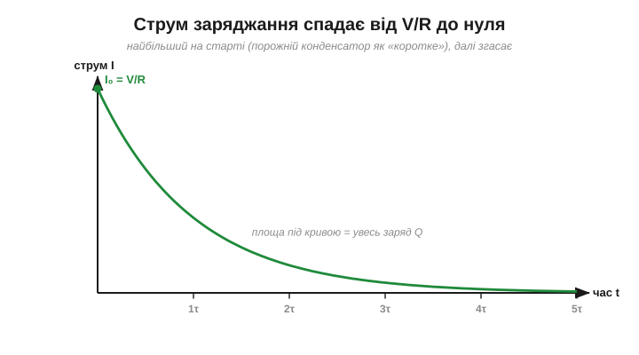
*Рис. 7.4.4. Дзеркальна картина для струму: він найбільший у перший момент (I₀ = V/R, конденсатор як «коротке») і спадає за тією самою експонентою до нуля, коли конденсатор заряджений і струму більше нема куди текти. Площа під цією кривою — увесь перенесений заряд Q.*

Зверніть увагу на красиву симетрію з [§7.1](ch07-capacitor.md): на самому початку порожній конденсатор поводиться як **коротке замикання** (бере великий струм, напруги на ньому нема), а наприкінці заряджений — як **розрив** (струму нема, вся напруга на ньому). Конденсатор за час заряджання плавно переходить з одного стану в інший.

### Стала часу τ = R·C

Темп усього процесу задає єдина величина — **стала часу** (*time constant*), яку позначають грецькою **τ** (тау):

```
τ = R · C
```

Найкраще в ній те, що вона одразу виходить у **секундах**. Перевірмо: опір в омах (В/А), ємність у фарадах (Кл/В):

```
[R·C] = (В/А) · (Кл/В) = Кл/А = Кл/(Кл/с) = с   ✓
```

(тут ампер — це кулон за секунду, [§2.1](../../block-1-circuits-physics/ch02-voltage-current-conduction/ch02-voltage-current-conduction.md)). Отже, добуток опору на ємність — це **час**, і саме він каже, швидко чи повільно працює коло.

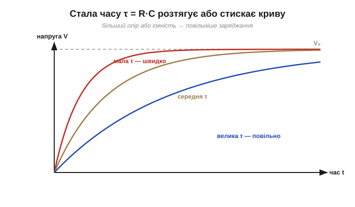
*Рис. 7.4.5. Стала часу розтягує або стискає всю криву в часі. Більший резистор обмежує струм сильніше — заряджання повільніше; більша ємність вимагає більше заряду — теж повільніше. τ — це характерний «масштаб часу» кола.*

**Приклад (стала часу).** Резистор 10 кОм і конденсатор 100 мкФ:

```
τ = R · C
τ = (10 × 10³ Ом) · (100 × 10⁻⁶ Ф)
τ = 1 с
```

Рівно секунда. Це означає: за 1 с конденсатор зарядиться на 63%, а повністю (на практиці) — приблизно за 5 секунд. Якби резистор був 1 кОм, а конденсатор 1 мкФ, вийшло б τ = 1 мс — те саме коло, але в тисячу разів швидше.

### Експонента: 63% за кожну сталу часу

Точний закон заряджання — це **зростальна експонента** до напруги джерела V₀:

```
V(t) = V₀ · (1 − e^(−t/τ))
```

де **e ≈ 2.718** — основа натурального логарифма, та сама стала, що керує будь-яким «природним» зростанням і згасанням. Підставляючи кратні τ, дістаємо універсальну таблицю, яку варто пам'ятати:

```
за 1·τ  →  63%   (точно 1 − 1/e)
за 2·τ  →  86%
за 3·τ  →  95%
за 4·τ  →  98%
за 5·τ  →  99.3%  ≈ «повністю»
```

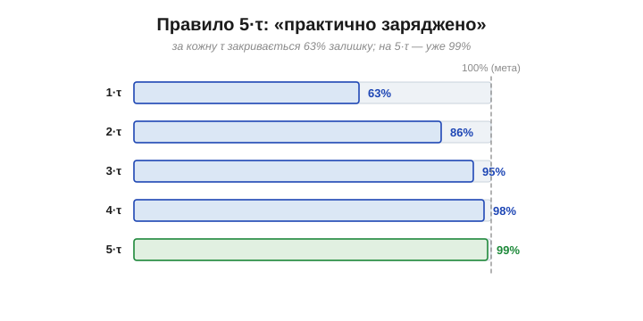
*Рис. 7.4.7. За кожну наступну сталу часу конденсатор закриває 63% того, що лишалося. Тому формально він заряджається «вічно» (асимптота), але на практиці за **5·τ** доходить до 99% — це й беруть за «повністю заряджено».*

Звідси найкорисніше інженерне правило: **за 5 сталих часу процес практично завершено**. Якщо τ = 1 мс, то через 5 мс конденсатор можна вважати зарядженим. А якщо потрібна не повна зарядка, а до певного рівня, придається й зворотний відлік: до 90% коло доходить приблизно за 2.3·τ, до 99% — за 4.6·τ (це просто τ·ln того, у скільки разів зменшився проміжок до мети). Наприклад, за τ = 1 мс конденсатор сягне 86% напруги джерела через 2 мс, 95% — через 3 мс, а «повністю» (99%) — через 5 мс: таблиця читається прямо в мілісекундах, варто лише знати τ.

### Розряджання: дзеркальна крива

Якщо заряджений конденсатор замкнути на резистор (положення «розряд» на Рис. 7.4.1), піде зворотний процес. Тепер напруга конденсатора жене струм крізь резистор, конденсатор віддає заряд, його напруга **спадає** — спершу швидко (напруга велика, струм великий), потім усе повільніше. Закон — **спадна** експонента:

```
V(t) = V₀ · e^(−t/τ)
```

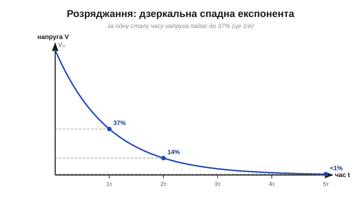
*Рис. 7.4.3. Розряджання — дзеркало заряджання. За одну сталу часу напруга падає до 37% початкової (це 1/e), за 5·τ — практично до нуля. Та сама τ = R·C керує і спадом.*

Числа теж дзеркальні: за 1·τ лишається **37%** (а не 63%), за 2·τ — 14%, за 5·τ — менш як 1%. Зверніть увагу: розряджаючись «у самого себе» через резистор, конденсатор перетворює всю запасену в полі енергію (½·C·V², [§7.3](ch07-capacitor.md)) на тепло в резисторі — оборотний запас стає необоротним теплом рівно тоді, коли ми пускаємо його крізь опір.

**Приклад (розрядний резистор).** Великий конденсатор 1000 мкФ небезпечно тримає заряд і після вимкнення приладу ([§7.3](ch07-capacitor.md)). Щоб запас безпечно стікав сам, паралельно ставлять «розрядний» (*bleeder*) резистор — скажімо, 1 кОм:

```
τ  = R · C = 1000 Ом · 1000×10⁻⁶ Ф = 1 с
5·τ = 5 с
```

Отже, через ≈ 5 секунд після вимкнення напруга впаде нижче 1% і конденсатор стане безпечним. Більший резистор розряджав би повільніше (зате менше «з'їдав» би струму під час роботи), менший — швидше: вибір τ тут — це знову компроміс між безпекою та втратами.

### Чому саме експонента

Звідки впевненість, що крива саме така, а не пряма чи якась інша? Корінь — у простому самопосиланні. Швидкість зміни напруги залежить від струму, а струм — від того, **скільки напруги ще лишилося до мети**: що більший проміжок, то більший струм, то швидша зміна. Формально темп зростання пропорційний відстані, яка ще лишилася:

```
швидкість зміни  ∝  (скільки ще лишилося до мети)
```

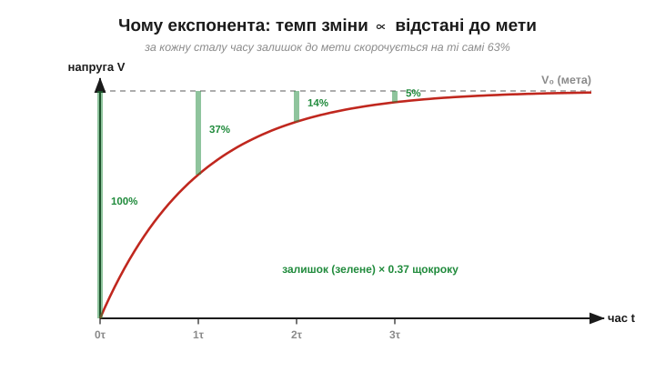
*Рис. 7.4.6. Велика відстань до мети → великий струм → швидка зміна → відстань зменшується → струм спадає → зміна сповільнюється. Величина, що змінюється тим повільніше, чим ближче вона до мети, завжди йде експонентою. Тому крива «самоподібна»: за кожну τ долає однакову частку (63%) залишку.*

Це й робить криву **самоподібною**: байдуже, у який момент почати лічити, — за наступну сталу часу проміжок до мети скоротиться на ті самі 63%. Така поведінка — універсальний підпис природи: так само за законом e остигає гарячий чай, розряджається атмосфера, розпадаються радіоактивні ядра. Конденсатор із резистором — просто наочний електричний приклад цього всюдисущого закону.

**Приклад (початковий струм і час).** Джерело 5 В, резистор 1 кОм, конденсатор 1 мкФ. Який струм у перший момент і коли коло «заспокоїться»?

```
I₀ = V / R = 5 В / 1000 Ом = 5 мА        (найбільший струм, на старті)
τ  = R · C = 1000 · 1×10⁻⁶ = 1 мс         (стала часу)
5·τ = 5 мс                                 (практично заряджено)
```

Тобто струм стартує з 5 мА, спадає до нуля, і через ≈ 5 мс конденсатор заряджений. Хочемо швидше — зменшуємо R або C; хочемо повільніше (скажімо, секундну затримку) — беремо більші.

### Половина енергії завжди гріє резистор

Гарний і несподіваний факт ховається в заряджанні крізь резистор. Порахуймо енергетичний баланс. Заряджаючи конденсатор до напруги V, джерело проганяє крізь себе заряд Q = C·V, причому весь час під своєю повною напругою V, тож віддає енергію:

```
W_джерела = Q · V = C · V²
```

А в конденсаторі в підсумку запасається лише **половина** цього — ½·C·V² ([§7.3](ch07-capacitor.md)). Куди ж поділася друга половина? Вона **згоріла на резисторі**:

```
W_резистора = C·V² − ½·C·V² = ½·C·V²
```

Найдивовижніше тут — що цей результат **не залежить від опору**. Хоч резистор величезний, хоч крихітний, рівно половина енергії джерела осідає в конденсаторі, а половина перетворюється на тепло в резисторі. Малий опір не зменшує втрат — він лише робить заряджання швидшим (мала τ), а нагрів — коротшим, зате інтенсивнішим; великий опір — навпаки. Ця «половина» — фундаментальна ціна заряджання конденсатора від джерела напруги через простий резистор. Там, де ця втрата критична (енергоощадні перетворювачі живлення), заряджають хитріше — не крізь опір, а через котушку, але це вже історія наступних розділів.

### Навіщо це: час у схемі

RC-коло — це найдешевший спосіб **відміряти час** і **згладити різкі зміни** в електроніці, тож воно трапляється на кожному кроці.

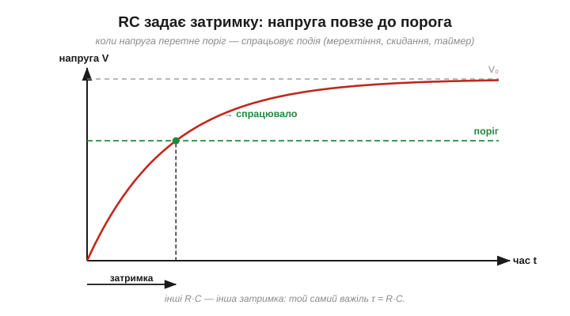
*Рис. 7.4.8. Підбираючи R і C, задають потрібний інтервал: повільне наростання напруги до порога дає затримку (мерехтіння світлодіода, плавний старт), а коротка τ згладжує брязкіт контакту. Усюди один важіль — стала часу τ = R·C.*

> 🔧 **Навіщо це.** Стала часу — щоденний робочий інструмент. Хочете блимати світлодіодом раз на секунду — берете R і C так, щоб τ давала потрібний ритм. Кнопка «брязкає» контактами під час натискання — невеличке RC згладжує сплеск, і мікроконтролер бачить чисте натискання (антидребезг). Лінія скидання мікроконтролера тримається в нулі перші мілісекунди після ввімкнення саме завдяки RC, щоб дати живленню встановитися. А ще RC лежить в основі найпростішого фільтра, що пропускає повільні зміни й гасить швидкі, — але як саме він діє на сигнали різної частоти, ми розберемо аж у [Розділі 9](ch07-capacitor.md). Поки головне: **τ = R·C — це годинник вашого кола**.

Підсумуймо. Конденсатор заряджається й розряджається за **експонентою** з характерним часом **τ = R·C** (у секундах): за одну τ долається 63% шляху (при розряді лишається 37%), а за **5·τ** процес практично завершено. Резистор задає темп, струм найбільший на старті й спадає до нуля. Маючи в руках і ємність, і енергію, і час, ми майже все знаємо про ідеальний конденсатор. Час глянути на **реальний** — з його типами, паразитними опорами й межею напруги.

---

## 7.5 Типи, паразити й гранична напруга

Досі ми мали справу з **ідеальним** конденсатором: чиста ємність, що тримає напругу вічно й заряджається без втрат. Такого в природі нема. Реальна деталь — це та сама ємність, але з «бородавками»: вона має невеликий власний опір, повільно сама розряджається, псується від перегрітої напруги, а деякі типи ще й вибухають, якщо ввімкнути їх задом наперед. Знати ці вади — не педантизм, а вміння **обрати правильний** конденсатор і не спалити схему. Адже саме на цих неідеальностях найчастіше «горять» новачки: поставив не той тип, переплутав полярність, узяв напругу без запасу — і схема або не працює, або димить. Розберімо реальний конденсатор без прикрас.

### Реальний конденсатор: ідеал плюс паразити

Якщо намалювати чесну еквівалентну схему конденсатора, до самої ємності C додасться три непрохані гості: невеликий **послідовний опір**, крихітна **послідовна індуктивність** і великий **паралельний опір витоку**.

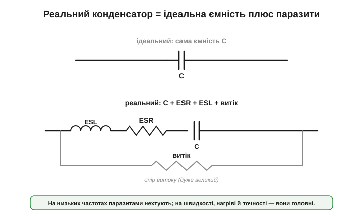
*Рис. 7.5.1. Еквівалентна схема реального конденсатора: ідеальна ємність C, послідовно з нею — **ESR** (опір обкладок, виводів, контактів) і **ESL** (індуктивність виводів), а паралельно — великий опір **витоку** (недосконалий діелектрик трохи проводить). На низьких частотах і для грубих оцінок цими паразитами нехтують; та коли важливі швидкодія, нагрів чи точність — вони стають головними.*

Розгляньмо цих гостей по черзі — але спершу найголовніше, бо воно про безпеку: **скільки напруги конденсатор узагалі витримає**.

### Гранична напруга й пробій

Кожен конденсатор має **граничну (номінальну) напругу** (*voltage rating*) — її пишуть просто на корпусі поряд з ємністю: «25 V», «6.3 V», «450 V». Це не порада, а **межа**: діелектрик між обкладками витримує лише певну напруженість поля. Перевищили — і поле **пробиває** діелектрик наскрізь (*breakdown*): у тонкому ізоляторі прокладається провідний канал, обкладки замикаються, конденсатор гине (а часто й ефектно — з димом чи хлопком).

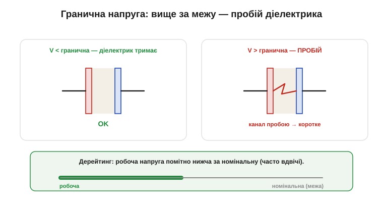
*Рис. 7.5.5. Поки напруга нижча за граничну, діелектрик тримає поле. Перевищення пробиває його — крізь ізолятор б'є іскра, обкладки замикаються. Тому конденсатор беруть із **запасом**: робоча напруга помітно нижча за номінальну.*

Це та сама межа, про яку попереджала гумова перетинка з [§7.1](ch07-capacitor.md): мембрану можна продавити до розриву. І згадаймо квадратичну небезпеку з [§7.3](ch07-capacitor.md) — енергія росте з V², тож пробій високовольтного конденсатора особливо лютий. Звідси практичне правило: **дерейтинг** (*derating*) — конденсатор обирають із номінальною напругою з запасом над робочою. Скільки саме запасу — залежить від типу: **танталові** дерейтять найсуворіше (часто аж удвічі — вони капризні до перенапруги), електролітичні й плівкові — помірно, а кераміку класу 2 беруть із запасом ще й тому, що під напругою в неї падає ємність (DC bias, [§7.2](ch07-capacitor.md)). Тому конденсатор на 5-вольтову шину зазвичай беруть не «5 V», а 10 чи 16 V — це запас на стрибки, старіння й надійність.

**Приклад (запас за напругою).** Маємо шину живлення 12 В. Який конденсатор брати? Робоча напруга — 12 В, тож за правилом «приблизно вдвічі» цілимось у ≥ 24 В і беремо найближчий стандартний номінал — **25 В** (а для відповідальних вузлів інколи й 35 В). А от «16 V» на 12-вольтову шину — погана ідея: перший же стрибок чи перехідний процес з'їсть увесь куций запас, і деталь почне старіти прискорено.

> 🔧 **Навіщо це.** Запас за напругою — перше, на що дивляться, добираючи конденсатор. Поставити «6.3 V» на шину 5 В формально можна (це в межах номіналу), але запас крихітний: помітний викид чи перехідний процес легко вискочить за 6.3 В, та й кераміка класу 2 під майже повною напругою помітно втрачає ємність. Тому здебільшого беруть наступний щабель (10 або 16 V) — невелика доплата за трохи більший корпус в обмін на надійніший і довговічніший конденсатор.

### Полярність: чому електроліт не можна «навпаки»

Найпідступніша пастка реального світу — **полярність**. Конденсатори великої ємності (електролітичні — алюмінієві й танталові) **полярні**: у них є «плюсовий» і «мінусовий» вивід, і вмикати їх можна лише в один бік. Причина — у тому, як зроблено їхній діелектрик: це найтонша оксидна плівка, яку **електрохімічно нарощує** сама прикладена напруга, але тільки в правильній полярності. Подайте напругу навпаки — і плівка-діелектрик руйнується, конденсатор починає проводити, перегрівається, і алюмінієвий **роздувається й вибухає**, а танталовий може **спалахнути**.

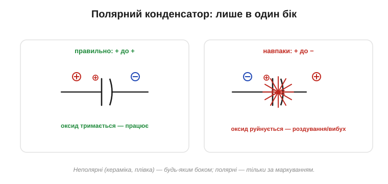
*Рис. 7.5.6. Електролітичний конденсатор працює лише в одній полярності: оксидний діелектрик тримається, поки «плюс» там, де належить. Увімкнений навпаки — оксид руйнується, тече великий струм, і деталь роздувається чи вибухає. Тому корпус має чітке маркування (смуга «−» на алюмінієвому, риска «+» на танталовому).*

> 🔧 **Навіщо це.** Переплутаний полярний конденсатор — класична причина «бах» на свіжозібраній платі. Неполярні (керамічні, плівкові) можна ставити будь-яким боком; полярні — **тільки за маркуванням**. Запам'ятайте символ із [§7.1](ch07-capacitor.md): зігнута обкладка й знак «+» на схемі означають полярну деталь, із якою жарти погані.

### Послідовний опір ESR

Обкладки, виводи й контакти мають невеликий, але ненульовий опір. Сукупно його звуть **еквівалентним послідовним опором** (*ESR, equivalent series resistance*) — він ніби увімкнений **послідовно** з ідеальною ємністю (Рис. 7.5.1). У хорошого керамічного конденсатора ESR — це міліоми, у старого електролітичного — омиці.

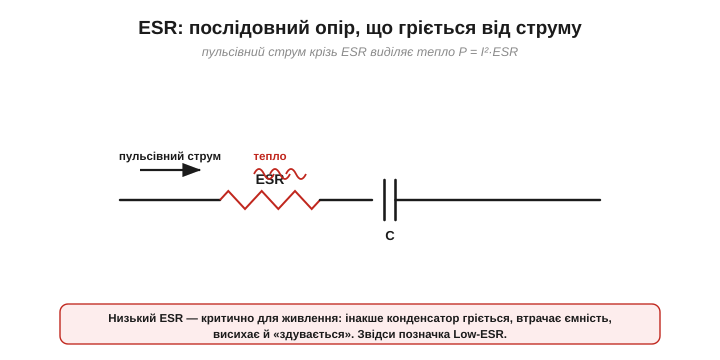
*Рис. 7.5.3. Через ESR при кожному заряді-розряді тече струм, і цей опір **гріється** за законом Джоуля (P = I²·ESR, [§3.6](../../block-1-circuits-physics/ch03-resistance-power-heat/ch03-resistance-power-heat.md)). Чим більший пульсівний струм крізь конденсатор, тим важливіший низький ESR: інакше деталь гріється, втрачає ємність і швидко старіє.*

> 🔧 **Навіщо це.** ESR — головна причина, чому в блоках живлення гинуть саме електролітичні конденсатори: пульсівний струм гріє їхній чималий ESR зсередини, електроліт висихає, ESR росте ще більше — і деталь «здувається». Тому для згладжування живлення обирають конденсатори з позначкою **Low-ESR**, а поряд часто ставлять керамічний (у нього ESR мізерний) — про таку пару докладніше в [§7.6](ch07-capacitor.md) і [§7.7](ch07-capacitor.md).

**Приклад (нагрів від ESR).** Крізь згладжувальний конденсатор тече пульсівний струм 1 А (діюче значення), а його ESR = 0.1 Ом. Скільки тепла виділяється всередині деталі?

```
P = I² · ESR = (1 А)² · 0.1 Ом = 0.1 Вт
```

Десята вата гріє конденсатор **зсередини** — і це за дрібного на вигляд ESR. Помножте на роки роботи, додайте тепло від сусідів на платі — і стане зрозуміло, чому електролітичні конденсатори висихають першими.

А найвідоміша ілюстрація цієї біди — «**конденсаторна чума**» (*capacitor plague*) початку 2000-х: через украдену й неповну рецептуру електроліту мільйони материнських плат, моніторів і телевізорів дістали електролітичні конденсатори, що масово здувалися вже за рік-два. Поганий електроліт давав завеликий ESR, конденсатор грівся сам себе, тиск зростав — і кришечка розкривалася по насічці зверху. Відтоді **здутий електроліт з опуклою верхівкою** — найперший підозрюваний, коли стара техніка раптом «не вмикається». Гарне нагадування, що паразит на ім'я ESR — цілком реальна, а не паперова вада.

### Послідовна індуктивність ESL

Виводи й внутрішня структура конденсатора мають ще одну ваду — крихітну **послідовну індуктивність** (*ESL*), теж увімкнену послідовно (Рис. 7.5.1). Що таке індуктивність і чому довгий провідник їй опирається — тема вже **наступного розділу** ([Розділ 8](../ch08-inductor/ch08-inductor.md)); поки достатньо знати її наслідок: на **дуже високих** частотах конденсатор перестає поводитися як конденсатор — заважає індуктивність виводів.

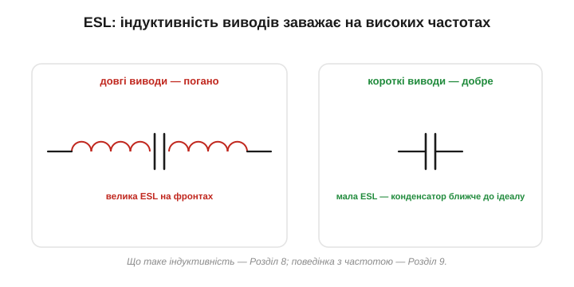
*Рис. 7.5.4. Довгі виводи додають паразитну індуктивність ESL. На повільних сигналах вона невидима, та на швидких фронтах — заважає. Звідси практичні правила: **короткі виводи**, розташування конденсатора **впритул** до споживача, кілька конденсаторів різного номіналу поряд. Як саме індуктивність опирається швидкій зміні струму — у Розділі 8, а поведінка з частотою — у Розділі 9.*

### Не лише ємність: витік, дрейф і допуск

Навіть «здоровий» конденсатор не точно дорівнює числу на корпусі. По-перше, **струм витоку**: діелектрик не ідеальний ізолятор, трохи проводить, тож від'єднаний конденсатор поволі **сам розряджається** (ми вже згадували це в [§7.4](ch07-capacitor.md)). У плівкових і керамічних витік крихітний, в електролітичних — помітний.

По-друге, **дрейф ємності**. Найпоширеніша кераміка класу 2 (маркування X5R, X7R, а найдешевша — Y5V) має велику ємність, але та помітно **падає** з прикладеною напругою (ефект *DC bias*), а ще **гуляє** з температурою — у X7R в межах ±15%, а в Y5V узагалі в широких межах (десятки відсотків). Через це реальні «10 мкФ» під робочою напругою легко стають 6–7 мкФ. Стабільна кераміка класу 1 (C0G/NP0) майже всього цього не має, але дає лише дрібні номінали. По-третє, **допуск** (*tolerance*): ±10%, ±20%, а в електролітів і −20…+80% — фактична ємність гуляє навколо номіналу.

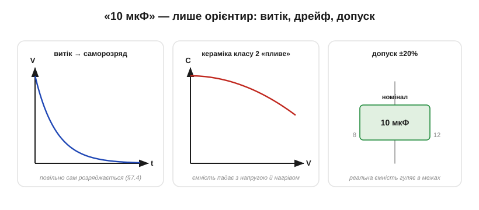
*Рис. 7.5.7. Три причини, чому «10 мкФ» — це лише орієнтир: повільний саморозряд через витік; падіння ємності кераміки класу 2 під напругою (DC bias) і її дрейф від температури; широкий допуск. Для точних кіл (фільтри, таймери) беруть стабільні типи (C0G/NP0, плівка), для грубого накопичення — будь-які.*

Чому цей дрейф важливий на практиці? Згадаймо таймер на RC з [§7.4](ch07-capacitor.md): його період задає стала часу τ = R·C. Якщо ємність «пливе» на третину від напруги й температури (кераміка класу 2) або має допуск −20…+80% (електроліт), то й відлік часу попливе рівно так само — годинник почне брехати, частота генератора попливе, фільтр зрушить. Тому для **точного** часу, фільтрів і генераторів беруть стабільні діелектрики (C0G/NP0 або плівку), а кераміці класу 2 й електролітам лишають грубі ролі — розв'язку та накопичення, де «приблизно стільки-то мікрофарад» цілком достатньо. Одне й те саме число «10 мкФ» на двох різних деталях може означати геть різну придатність до задачі — і це теж частина вибору конденсатора.

### Основні типи й коли який

Усі ці властивості й визначають **тип** конденсатора, бо задаються діелектриком і конструкцією. Чотири головні родини покривають майже все:

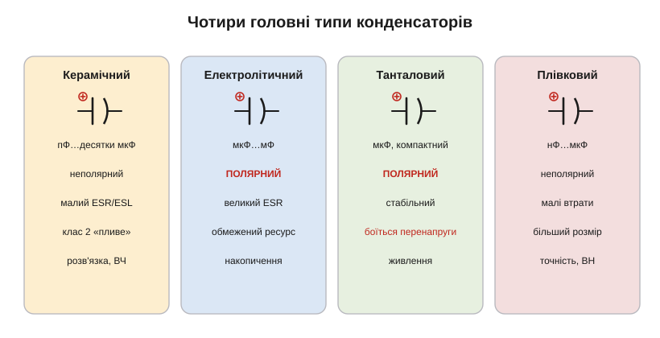
*Рис. 7.5.2. Керамічний — дрібний, дешевий, неполярний, малий ESR/ESL, але кераміка класу 2 «пливе»; пФ…десятки мкФ. Електролітичний алюмінієвий — велика ємність (мкФ…мФ), полярний, чималий ESR, обмежений ресурс; для накопичення й згладжування. Танталовий — стабільніший і компактніший за алюмінієвий, теж полярний, але боїться перевищення напруги. Плівковий — стабільний, малі втрати, неполярний, більший за розміром; для точності й високих напруг.*

Поза цією четвіркою стоїть окрема порода — **суперконденсатор** (*supercapacitor*): ємність у цілі фаради, а в окремих комірок — і тисячі фарад, незрівнянно більша за звичайні деталі, але гранична напруга однієї комірки мізерна (зазвичай ~2.5–3.0 В), а ESR — чималий. Він не для сигналів, а для **запасу енергії**: підстрахувати живлення під час провалу, утримати годинник реального часу чи пам'ять при заміні батареї, віддати короткий потужний імпульс. Це рівно той контраст із [§7.3](ch07-capacitor.md): багато потужності, мало енергії проти акумулятора. Щоб підняти робочу напругу, кілька суперконденсаторів з'єднують послідовно — але про послідовне з'єднання та його тонкощі поговоримо в [§7.7](ch07-capacitor.md).

На практиці більшість плат обходяться лише **двома** типами: **керамікою** для розв'язки живлення біля кожної мікросхеми (дрібна, дешева, швидка) і **електролітами** для накопичення на вході (велика ємність, тримає запас). Плівку й тантал додають точково — там, де потрібні стабільність, мала втрата чи компактність. Ця проста пара покриває чи не 90% задач, а решта приходить із досвідом і даташитами.

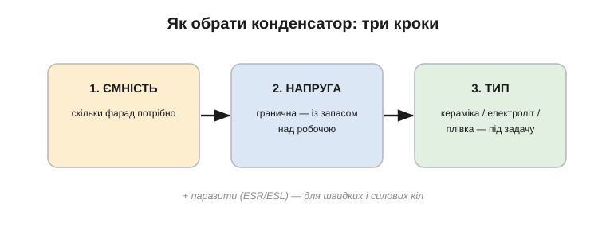
*Рис. 7.5.8. Добір у три кроки: (1) потрібна ємність; (2) гранична напруга — з запасом над робочою; (3) тип під задачу — кераміка для розв'язки й високих частот, електроліт для накопичення енергії, плівка чи C0G для точності й стабільності.*

> 🔧 **Навіщо це.** Вибір конденсатора — це не лише «скільки мікрофарад». Це чотири питання разом: яка **ємність**, до якої **напруги** (з запасом), якого **типу** (під задачу) і з якими **паразитами** терпимо (ESR/ESL для швидких і силових кіл). Той самий номінал «10 мкФ» може бути крихітною керамікою для розв'язки чи великим електролітом для накопичення — і поміняти їх місцями означає зіпсувати схему.

Підсумуймо. Реальний конденсатор — це ідеальна ємність плюс **ESR** (гріється від струму), **ESL** (заважає на високих частотах), **витік** (повільний саморозряд) і **дрейф** ємності, а ще — **гранична напруга**, яку не можна перевищувати (пробій), і в електролітів — **полярність**, яку не можна плутати. Тип конденсатора (керамічний, електролітичний, танталовий, плівковий) обирають під задачу. Три речі рятують найчастіше: брати напругу із запасом, не плутати полярність і пам'ятати про ESR у силових колах. Тепер, знаючи і фізику ідеального конденсатора, і реальні межі справжнього, нарешті відповімо системно на питання: **навіщо** конденсатори взагалі ставлять у схеми.

---

## 7.6 Навіщо конденсатори: розв'язка, згладжування, накопичувач

Розгляньте будь-яку плату — і ви побачите, що конденсаторів на ній **десятки**, більше за майже будь-який інший компонент. Чому їх так багато й навіщо вони всюди? Відповідь у тому, що конденсатор виконує не одну роботу, а **кілька різних**, і всі вони випливають із того, що ми вже вивчили: він **тримає запас заряду** ([§7.2](ch07-capacitor.md)), **віддає його миттєво** ([§7.3](ch07-capacitor.md)), **реагує лише на зміну** напруги й блокує постійну ([§7.1](ch07-capacitor.md)), а через резистор **відмірює час** ([§7.4](ch07-capacitor.md)). Ця тема — без нових формул, суто про застосування: подивімося, як ті самі властивості перетворюються на конкретні ролі в схемі.

### Чотири властивості — багато ролей

Перш ніж розбирати ролі поодинці, корисно побачити карту: кожне застосування — це просто та чи інша грань уже відомої фізики.

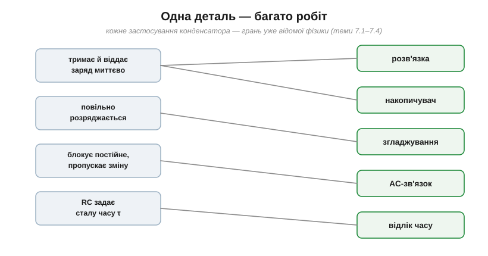
*Рис. 7.6.1. Один компонент, багато робіт. «Тримає й миттєво віддає заряд» → розв'язка й накопичувач. «Засипає провали, бо повільно розряджається» → згладжування. «Пропускає зміну, блокує постійне» → розв'язка сигналу (AC-зв'язок). «Через резистор задає τ» → відлік часу. Усі ролі — це грані тем 7.1–7.4.*

### Розв'язка: локальний запас біля мікросхеми

Найпоширеніша робота конденсатора — **розв'язка** (*decoupling*, або *bypass*). Уявіть цифрову мікросхему: щомиті, перемикаючись, вона **ривками** споживає струм. А живлення приходить до неї довгими доріжками, які мають якийсь опір (і паразитну індуктивність). Коли чип раптом смикає великий струм, на цих доріжках напруга **просідає** — і живлення на чипі на мить падає, аж до збою.

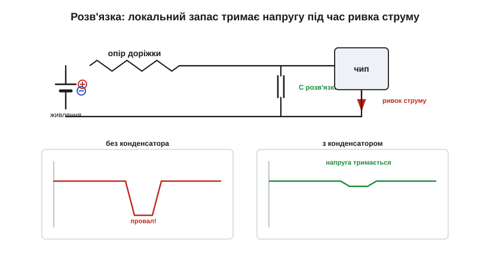
*Рис. 7.6.2. Без конденсатора різкий стрибок струму чипа просаджує напругу на довгій доріжці живлення (вона має опір). Локальний конденсатор поруч тримає **запас заряду** напоготові й віддає його миттєво ([§7.3](ch07-capacitor.md)), тож напруга на чипі лишається рівною. Просідання згладжено.*

Розв'язувальний конденсатор — це **маленьке локальне джерело** прямо біля чипа: для повільного, «постійного» живлення він невидимий (заряджений, струму не бере, [§7.1](ch07-capacitor.md)), а на швидкий ривок умить віддає накопичений заряд, не даючи напрузі впасти. Підживившись, він спокійно дозаряджається від основного живлення між ривками.

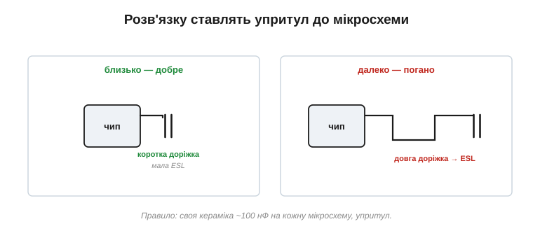
*Рис. 7.6.3. Щоб запас доходив миттєво, розв'язувальний конденсатор ставлять **якнайближче** до виводів живлення чипа короткими доріжками — інакше паразитна індуктивність виводів (ESL, [§7.5](ch07-capacitor.md)) звела б користь нанівець. Звідси правило: «свій конденсатор на кожну мікросхему».*

> 🔧 **Навіщо це.** Ось чому біля кожної цифрової мікросхеми стоїть конденсатор, найчастіше **100 нФ** керамічний (малий ESR/ESL, [§7.5](ch07-capacitor.md)): це його робота — гасити просідання живлення від власних ривків чипа. Пропустити ці конденсатори — класична помилка початківця: плата начебто зібрана правильно, а працює нестабільно, «глючить», ловить скиди. Правило просте: **кожній мікросхемі — свій розв'язувальний конденсатор, упритул і короткими доріжками** (а точні номінал і кількість для відповідальних чи швидких чипів дивляться в даташиті — там часто радять кілька конденсаторів різних номіналів).

**Приклад (наскільки просідає живлення).** Чип на коротку мить (Δt ≈ 10 нс) смикає додаткові ΔI ≈ 100 мА. Якщо весь цей заряд віддасть локальний конденсатор C = 100 нФ, на скільки впаде його напруга? Заряд, що пішов: ΔQ = ΔI·Δt; просідання напруги ΔV = ΔQ/C (із Q = C·V, [§7.2](ch07-capacitor.md)):

```
ΔV = (ΔI · Δt) / C
ΔV = (0.1 А · 10×10⁻⁹ с) / (100×10⁻⁹ Ф)
ΔV = (1×10⁻⁹ Кл) / (100×10⁻⁹ Ф) = 0.01 В = 10 мВ
```

Лише 10 мілівольтів — для чипа дрібниця. А без конденсатора той самий ривок мусив би пройти всю довгу доріжку від джерела, і просідання було б у рази більшим (аж до збою). Ось чисто арифметично, чому розв'язка працює: маленький запас поруч гасить великий ривок крихітним падінням напруги.

Це, звісно, **спрощена оцінка**. На таких швидкостях (наносекунди) усе вирішує вже не сама ємність, а паразитні **ESR/ESL** конденсатора й індуктивність доріжок ([§7.5](ch07-capacitor.md)) — саме тому конденсатор ставлять упритул, короткими доріжками, а часто додають по кілька штук різного номіналу поряд. Точний інженерний розрахунок розв'язки враховує всю мережу живлення; але порядок величини наша оцінка дає правильний — і пояснює суть.

### Згладжування: засипати провали напруги

Друга робота — **згладжування** (*smoothing*, фільтрація пульсацій). Багато джерел живлення видають не рівну напругу, а **пульсівну**: вона ритмічно то піднімається, то провалюється. (Як саме з мережі роблять таку пульсівну напругу — це робота випрямляча на діодах, а діод — аж [Розділ 10](../ch10-diode-pn-junction/ch10-diode-pn-junction.md); тут нам важливий лише результат: на вході маємо «горбисту» напругу.) Завдання конденсатора — зробити її **гладкою**.

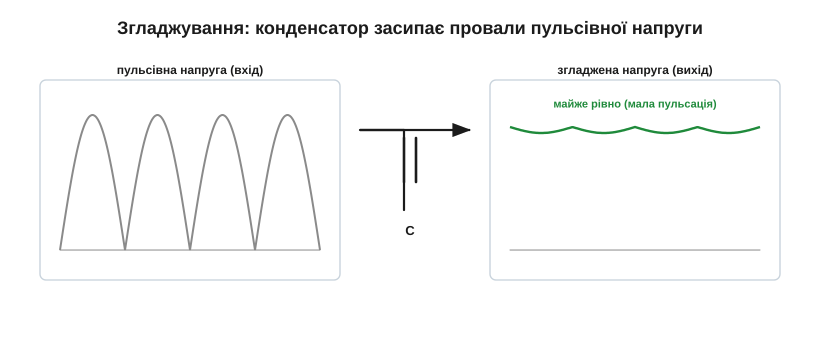
*Рис. 7.6.4. На піках пульсівної напруги конденсатор заряджається, а в провалах — підживлює навантаження своїм запасом, повільно розряджаючись ([§7.4](ch07-capacitor.md)). Гострі провали «засипаються», і на виході виходить майже рівна напруга з невеликою лишковою пульсацією (ripple).*

Механіка точно та сама, що й у RC-розряді з [§7.4](ch07-capacitor.md): між піками конденсатор встигає віддати лише трохи заряду (його стала часу велика проти періоду пульсацій), тож напруга майже не падає. Що більша ємність — то менша лишкова пульсація, але то більший конденсатор. Тому на вході живлення зазвичай стоїть **великий електролітичний** конденсатор (мкФ…мФ): йому потрібен саме об'єм запасу, а не швидкість.

> 🔧 **Навіщо це.** Великий «банка»-конденсатор на вході майже кожного блока живлення — це згладжувач. Саме він перетворює пульсівну напругу після випрямляча на рівне живлення. Якщо такий конденсатор висох (згадаймо ESR і «чуму» з [§7.5](ch07-capacitor.md)), пульсація проривається далі — і пристрій починає гудіти, гріти, збоїти. Заміна одного здутого електроліта часто оживляє «мертву» техніку.

Скільки лишкової пульсації залишиться — залежить від ємності: за той самий струм навантаження більший конденсатор віддає менше відносного заряду між піками, тож і просідає менше (той самий зв'язок ΔV = I·Δt/C). Тому згладжувачі бувають чималі — сотні й тисячі мікрофарад. А щоб погасити заразом і повільну пульсацію, і швидкі сплески, поряд із великим електролітом часто ставлять дрібну кераміку: електроліт бере на себе **об'єм** запасу, а кераміка — **швидкість** (малий ESR/ESL). Цю пару «великий плюс маленький» ви бачитимете на вході живлення раз у раз.

### Накопичувач: пережити провал, видати ривок

Третя роль — **накопичувач енергії** (*reservoir, bulk storage*). Тут конденсатор використовують саме за його запас енергії (½·C·V², [§7.3](ch07-capacitor.md)): тримати живлення на плаву, коли основне джерело на мить зникло, або віддати короткий потужний імпульс, який джерело саме дати не встигає.

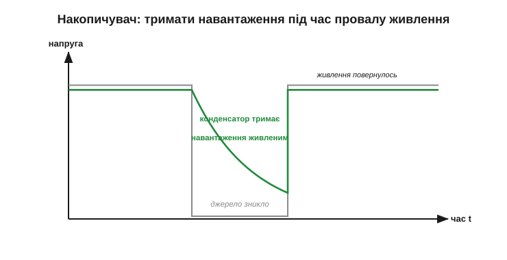
*Рис. 7.6.5. Коли живлення на мить зникає (просадка, перемикання), накопичувальний конденсатор віддає запас і тримає навантаження живленим ще певний час — поки його напруга повільно спадає ([§7.4](ch07-capacitor.md)). Так система «переживає» короткі провали без перезавантаження.*

Це той самий принцип «повільно накопичити — миттєво віддати» з [§7.3](ch07-capacitor.md): фотоспалах, що збирає енергію секундами й віддає за мілісекунди; конденсатор, що допомагає запустити двигун ривком струму; суперконденсатор ([§7.5](ch07-capacitor.md)), що утримує годинник чи пам'ять під час заміни батареї. Скрізь конденсатор — це **буфер** між повільним джерелом і споживачем, якому раптом треба багато й одразу.

> 🔧 **Навіщо це.** Коли якийсь вузол час від часу «смикає» багато струму (радіопередавач у момент відправки, мотор на старті, світлодіодний спалах), поряд ставлять накопичувальний конденсатор — він бере ці піки на себе, розвантажуючи джерело й проводи. Без нього кожен такий ривок просаджував би все живлення (та сама розв'язка, але вже на рівні цілого вузла, а не одного чипа).

**Приклад (як довго протримає накопичувач).** Конденсатор C = 1000 мкФ живить вузол, що бере I = 50 мА, поки основне джерело зникло. Скільки він протримає, доки напруга впаде на дозволені ΔV = 0.5 В? Із того самого зв'язку ΔQ = C·ΔV = I·Δt:

```
Δt = C · ΔV / I
Δt = (1000×10⁻⁶ Ф · 0.5 В) / (0.05 А)
Δt = (5×10⁻⁴ Кл) / (0.05 А) = 0.01 с = 10 мс
```

Десять мілісекунд автономності — цього досить, щоб пережити коротку просадку мережі чи встигнути перемкнутися на резервне джерело. Хочемо довше — беремо більшу ємність (або миримося з більшим падінням ΔV). Так само рахують, скільки протримає суперконденсатор годинник реального часу під час заміни батареї.

### Розв'язка по змінному: пропустити сигнал, відсікти постійне

Четверта роль випливає прямо з властивості «**блокує постійне, пропускає зміну**» ([§7.1](ch07-capacitor.md)). Часто треба передати з одного каскаду в інший лише **коливання** сигналу, а сталий рівень (зміщення) лишити позаду. Конденсатор, поставлений послідовно в сигнальний шлях, робить саме це: постійну складову він не пропускає (через нього не тече постійний струм), а змінну — передає, бо для неї він увесь час дозаряджається.

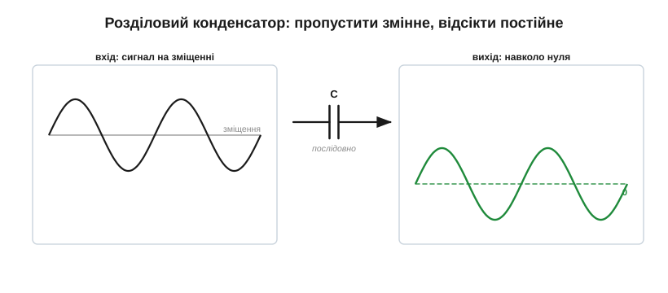
*Рис. 7.6.6. Сигнал «сидить» на сталому зміщенні. Послідовний конденсатор (розділовий, *coupling*) блокує постійну складову й пропускає лише коливання — на виході та сама форма, але вже навколо нуля. Так каскади з'єднують, не передаючи одне одному зайвого постійного рівня.*

Навіщо взагалі відсікати постійне? Бо кожен каскад зазвичай працює навколо **власного** робочого рівня напруги (зміщення), і нав'язувати цей рівень сусідові немає сенсу — потрібен лише сам сигнал. Розділовий конденсатор дає кожному каскаду спокійно тримати своє постійне зміщення, а між собою вони обмінюються самими коливаннями. Так стикують мікрофон із підсилювачем, один підсилювальний каскад з іншим, плату з платою — усюди, де треба передати сигнал, але не передати постійний рівень.

> 🔧 **Навіщо це.** Розділовий (coupling) конденсатор — звичайна річ на вході підсилювача чи між каскадами: він дає кожному каскаду тримати власний робочий рівень напруги, а між собою вони обмінюються лише сигналом. Те, наскільки добре він пропускає повільні й швидкі коливання, залежить від частоти — а це вже частотний погляд, який ми розгорнемо в [Розділі 9](ch07-capacitor.md). Поки досить ідеї: **послідовний конденсатор = «пропускач змінного, блокувач постійного».**

### Відлік часу

П'ята роль нам уже знайома з [§7.4](ch07-capacitor.md): конденсатор із резистором задають **час**. Це теж застосування, та ще й одне з найчастіших.

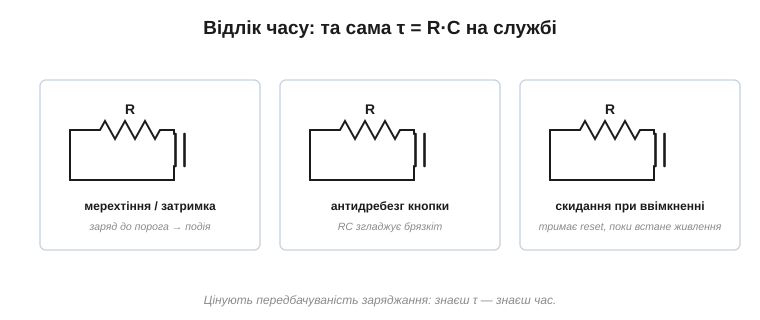
*Рис. 7.6.7. Та сама стала часу τ = R·C на службі: повільне заряджання до порога дає затримку чи ритм мерехтіння; коротке RC згладжує брязкіт кнопки (антидребезг); RC у лінії скидання тримає мікросхему в нулі, поки встановиться живлення.*

Тут конденсатор цінують не за запас і не за блокування постійного, а за **передбачуваність** його заряджання: знаючи τ = R·C, ми точно знаємо, скільки мине часу. Звідси таймери, генератори ритму, затримки ввімкнення, антидребезг — усе на копійчаній парі резистор-конденсатор.

Конкретні числа ми вже бачили в [§7.4](ch07-capacitor.md): стала часу τ = R·C задає інтервал, а п'ять сталих часу — це «практично готово». Хочете блимати світлодіодом раз на секунду — підбираєте R і C так, щоб τ дала потрібний ритм; хочете чисте натискання кнопки — берете маленьке RC, що згладжує брязкіт за мілісекунди; хочете, щоб мікроконтролер стартував не раніше, ніж устоїться живлення, — RC у лінії скидання тримає його в нулі потрібний час. Те, що в §7.4 було абстрактною кривою заряджання, тут перетворюється на таймер, генератор ритму чи ланку скидання — і саме тому RC-пара трапляється на платах чи не так само часто, як розв'язка.

### Де живуть конденсатори на платі

Зберімо все докупи. Якщо глянути на типову плату очима того, хто прочитав цей розділ, конденсатори перестають бути загадковими «бочечками» — кожен сидить на своєму місці й робить зрозумілу роботу.

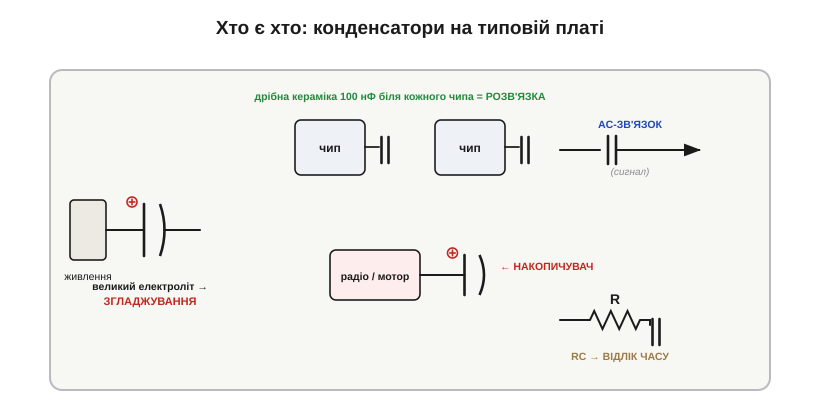
*Рис. 7.6.8. Хто є хто на платі: великий електроліт на вході живлення — згладжування; розсип дрібної кераміки 100 нФ біля кожного чипа — розв'язка; конденсатор побільше біля «ненажерливого» вузла — накопичувач; послідовний у сигнальному шляху — розділовий (AC-зв'язок); RC біля входу мікроконтролера — затримка чи антидребезг.*

> 🔧 **Навіщо це.** Уміння з першого погляду сказати, **навіщо** тут конденсатор, — ознака того, що ви розумієте схему, а не просто бачите деталі. Великий полярний біля роз'єму живлення — згладжує; дрібний керамічний упритул до чипа — розв'язує; конденсатор у розриві сигнального дроту — розділяє постійне від змінного. Це читання плати знадобиться і коли ви проєктуєте власну, і коли ремонтуєте чужу.

Підсумуймо. Конденсатор — найуніверсальніший «дрібний» компонент саме тому, що його прості властивості дають **багато ролей**: **розв'язка** (локальний запас біля чипа), **згладжування** (засипати пульсації живлення), **накопичувач** (пережити провал, видати ривок), **розділення** сигналу (пропустити змінне, відсікти постійне) і **відлік часу** (RC). Усе це — грані тем 7.1–7.4, тепер прикладені до реальних задач. Лишилося розібрати останнє суто «конденсаторне» питання: що буде, якщо конденсатори **з'єднати** — послідовно чи паралельно.

---

## 7.7 Послідовно й паралельно (на відміну від резисторів)

Конденсатори, як і резистори, часто з'єднують по кілька — щоб дістати потрібну ємність, підняти допустиму напругу чи поєднати швидкий і ємний. І тут на нас чекає сюрприз: правила додавання для конденсаторів **дзеркальні** до правил для резисторів. Там, де резистори додаються просто, конденсатори додаються через обернені — і навпаки. Зрозумівши, *чому* так (а не визубривши формули), ви більше ніколи їх не сплутаєте. Це той самий прийом комбінування, що й з резисторами в Модулі 1, — лише з протилежними знаками; і саме цей контраст найкраще все й прояснює.

### Паралельно: ємності додаються

З'єднаймо два конденсатори **паралельно** — обидва виводи до тих самих двох точок. Тоді на обох однакова напруга V, а кожен набирає свій заряд (Q₁ = C₁·V і Q₂ = C₂·V). Сумарний розділений заряд — це сума, тож і сумарна ємність — сума:

```
паралельно:   C = C₁ + C₂ + C₃ + …
```


*Рис. 7.7.1. Паралельно — спільна напруга, заряди складаються. Два конденсатори поводяться як один із сумарною ємністю C₁ + C₂. Чим більше паралельних — тим більша загальна ємність.*

Чому так — видно прямо з формули ємності [§7.2](ch07-capacitor.md). Поставити два конденсатори поряд — це майже те саме, що **збільшити площу обкладок**: сумарна площа стала більшою, а зазор і діелектрик ті самі, тож C зростає. Паралельне з'єднання — це спосіб «домалювати площі».

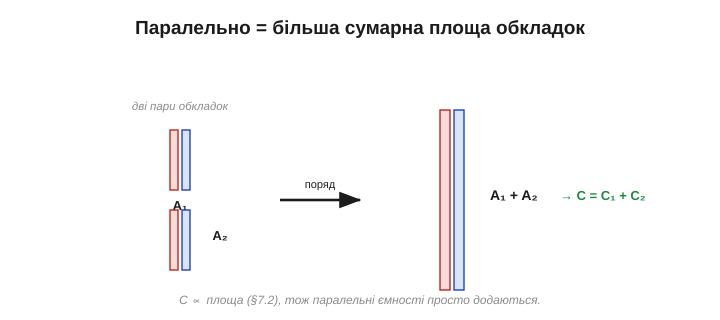
*Рис. 7.7.4. Паралельні конденсатори — це фактично одна пара обкладок більшої сумарної площі A. Оскільки C ∝ A ([§7.2](ch07-capacitor.md)), ємності просто складаються.*

**Приклад (паралельно).** 10 мкФ паралельно з 1 мкФ:

```
C = C₁ + C₂ = 10 мкФ + 1 мкФ = 11 мкФ
```

Просто сума. Саме так нарощують ємність, коли одного конденсатора замало.

Паралель — це й спосіб набрати **велику** ємність, коли однієї деталі бракує: банк із десяти конденсаторів по 1000 мкФ дає 10 000 мкФ (10 мФ). Бонус — кожен бере на себе частину пульсівного струму, тож і нагрів від ESR ділиться між усіма ([§7.5](ch07-capacitor.md)), а не лягає на одну деталь. Тому в потужних блоках живлення часто бачимо не один велетенський конденсатор, а **гроно** менших паралельно — так і дешевше, і надійніше, і прохолодніше.

### Послідовно: додаються обернені

Тепер з'єднаймо два конденсатори **послідовно** — ланцюжком, один за одним. Тут навпаки: через обидва проходить **однаковий** заряд Q (заряд, що пішов з лівої обкладки одного, осів на правій другого), а **напруга ділиться** між ними (V = V₁ + V₂).

Чому заряд той самий? Внутрішні обкладки сусідніх конденсаторів з'єднані ізольованою ділянкою, на якій сумарний заряд зберігається ([§1.1](../../block-1-circuits-physics/ch01-charge-field-potential/ch01-charge-field-potential.md)): скільки заряду джерело зняло із зовнішньої обкладки крайнього конденсатора — рівно стільки навелося на кожній наступній парі. Тож усі конденсатори ланцюжка несуть **той самий** заряд Q, хай якою буде їхня ємність. А от напруга на кожному виходить своя: V = Q/C, тож на меншій ємності осідає більша напруга (це нам ще знадобиться нижче).

Оскільки V = Q/C, складання напруг дає складання **обернених** ємностей:

```
послідовно:   1/C = 1/C₁ + 1/C₂ + 1/C₃ + …
```

Для двох конденсаторів це зручно переписати як:

```
C = (C₁ · C₂) / (C₁ + C₂)
```

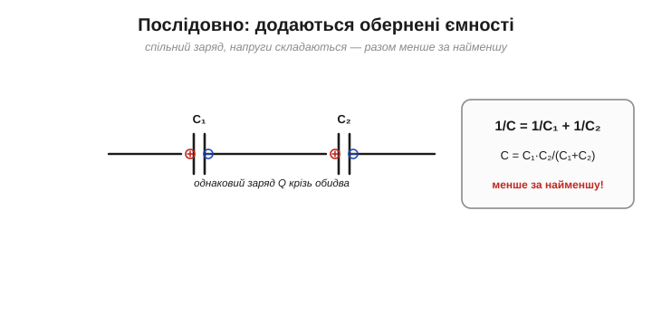
*Рис. 7.7.2. Послідовно — спільний заряд, напруги складаються. Загальна ємність **менша за найменшу** з конденсаторів: додавання обернених завжди дає менше. Внутрішні обкладки сусідів несуть рівні протилежні заряди й «не рахуються».*

Знову зазирнімо у формулу [§7.2](ch07-capacitor.md). З'єднати конденсатори послідовно — це майже те саме, що **збільшити зазор**: заряд тепер мусить «перестрибувати» через сумарну товщину двох діелектриків. А оскільки C ∝ 1/d, більший ефективний зазор дає **меншу** ємність.

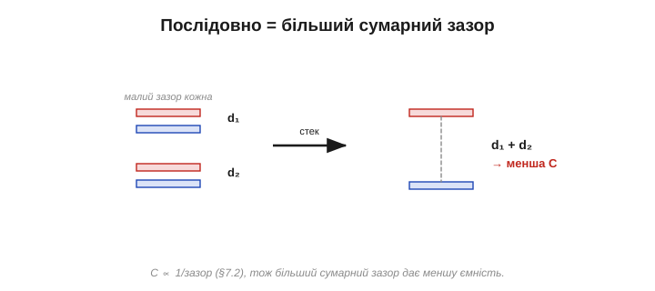
*Рис. 7.7.5. Послідовні конденсатори — це фактично один із більшим сумарним зазором d. Оскільки C ∝ 1/d ([§7.2](ch07-capacitor.md)), загальна ємність падає нижче за найменшу.*

**Приклад (послідовно).** Два однакові по 10 мкФ:

```
1/C = 1/10 + 1/10 = 2/10        →   C = 5 мкФ
```

Удвічі менше! А 10 мкФ послідовно з 1 мкФ:

```
1/C = 1/10 + 1/1 = 1.1          →   C ≈ 0.91 мкФ
```

Загальна ємність майже дорівнює **меншому** конденсатору — менший «вузьке місце», як і в будь-якому ланцюжку.

### Дзеркало резисторів

Тепер головне порівняння. Згадаймо резистори з Модуля 1: **послідовно** опори **додаються** ([§4.4](../../block-1-circuits-physics/ch04-kirchhoff-circuit-analysis/ch04-kirchhoff-circuit-analysis.md)), **паралельно** — складаються їхні обернені ([§4.5](../../block-1-circuits-physics/ch04-kirchhoff-circuit-analysis/ch04-kirchhoff-circuit-analysis.md)). У конденсаторів усе **точно навпаки**.


*Рис. 7.7.3. Дзеркало. Резистор: послідовно — сума, паралельно — обернені. Конденсатор: послідовно — обернені, паралельно — сума. Те, що для резисторів «послідовно», для конденсаторів поводиться як «паралельно», і навпаки.*

Це не випадковий збіг, а глибша **двоїстість**. Опір резистора каже, як сильно той опирається усталеному струму; ємність конденсатора каже, скільки заряду він тримає на вольт. Ролі протилежні — одна про потік, друга про запас, — тому й комбінуються дзеркально. Є й зручний місток: ємності паралельних конденсаторів додаються **так само**, як провідності (величини, обернені до опору) паралельних резисторів. А провідність — це і є «легкість проводити». Тож конденсатор у паралелі поводиться, як провідність у паралелі: просто складається. Хто запам'ятає цей зв'язок, той зі знаком уже не помилиться.

> 🔧 **Навіщо це.** Не заучуйте чотири формули — тримайте в голові **фізику**, і знак ніколи не сплутаєте. Конденсатор — це про **площу й зазор**: паралельно нарощуєш площу (більше C), послідовно нарощуєш зазор (менше C). Резистор — це про **довжину провідника** опору: послідовно довший шлях (більше R), паралельно ширший (менше R). Дзеркальність випливає з того, що ємність обернено залежить від зазору, а опір — прямо від довжини. Зрозумів причину — формула згадається сама.

### Як ділиться заряд і напруга

З'єднання впливає не лише на загальну ємність, а й на те, як між конденсаторами розподіляються заряд і напруга.


*Рис. 7.7.7. Паралельно (спільна напруга): більший конденсатор бере пропорційно **більший заряд** (Q ∝ C). Послідовно (спільний заряд): на меншому конденсаторі осідає **більша напруга** (V ∝ 1/C) — бо V = Q/C, а заряд однаковий.*

**Приклад (розподіл напруги).** З'єднаймо послідовно 1 мкФ і 10 мкФ під 11 В. Заряд на обох однаковий, а напруга ділиться обернено до ємності: на 1 мкФ припадуть аж **10 В**, а на 10 мкФ — лише **1 В**. Менша ємність хапає левову частку напруги! Тому слабка ланка ланцюжка — саме маленький конденсатор: легко не помітити й перевищити його межу. (Паралельно все навпаки: за спільної напруги більший конденсатор просто візьме більший заряд, нікому не загрожуючи.)

Друга половина — про напругу в послідовному ланцюжку — має пряму практичну вагу. Оскільки на меншій ємності падає більша напруга, у ланцюжку **нерівних** конденсаторів один може отримати небезпечно багато й пробитися ([§7.5](ch07-capacitor.md)). Тому послідовні конденсатори або беруть однаковими, або ставлять поряд вирівнювальні (балансувальні) резистори, щоб напруга ділилася порівну.

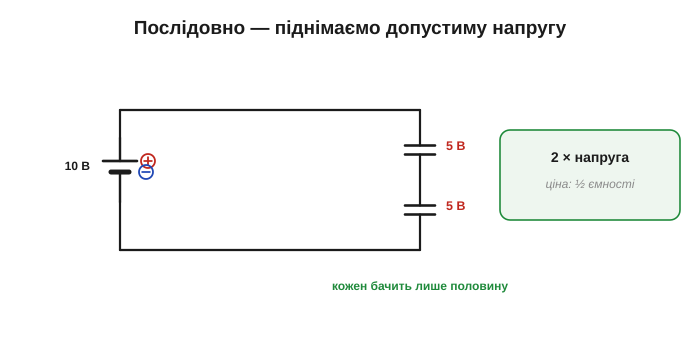
*Рис. 7.7.6. Два однакові конденсатори послідовно ділять прикладену напругу навпіл — отже, разом витримують удвічі більшу. Так із низьковольтних деталей складають вузол на вищу напругу (наприклад, суперконденсатори, [§7.5](ch07-capacitor.md)); вирівнювальні резистори стежать, щоб поділ був рівним.*

### Несподіванка: поєднав заряджені — і втратив половину енергії

Ось факт, що дивує навіть досвідчених. Візьмімо заряджений конденсатор C (напруга V, енергія ½·C·V², [§7.3](ch07-capacitor.md)) і з'єднаймо його паралельно з **таким самим, але порожнім**. Заряд перетече й поділиться нарівно, напруга впаде вдвічі (заряд той самий, ємність подвоїлась: V = Q/C). Порахуймо енергію після:

```
W_після = ½ · (2C) · (V/2)² = ¼ · C · V²  =  половина від початкової
```

**Половина енергії зникла** — хоча ми просто з'єднали два конденсатори, без жодного резистора на видноті! Куди вона поділася? У неминучі втрати при перетіканні заряду — на опорі дротів, на іскрі, на випромінювання. Це той самий урок, що й «половина гріє резистор» із [§7.4](ch07-capacitor.md): переганяння заряду між ємностями завжди чогось коштує. Практичний висновок: не можна думати, ніби заряд вільно «переливається» між конденсаторами без втрат — саме тому акуратні схеми заряджають ємності керовано, а не коротким замиканням однієї на іншу.

### Навіщо це на практиці

Обидва з'єднання — щоденний інструмент, і кожне вирішує свою задачу.

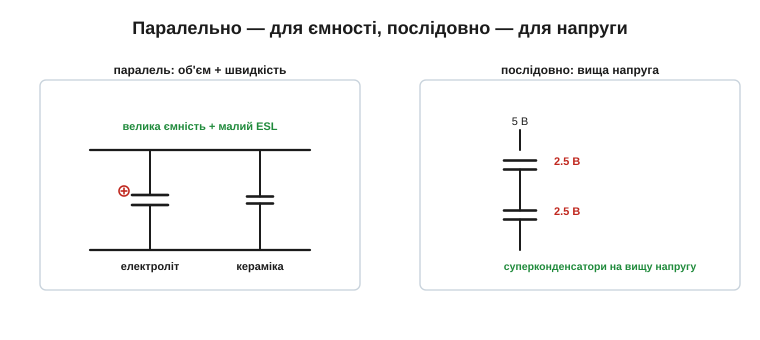
*Рис. 7.7.8. Паралельне з'єднання нарощує ємність і поєднує властивості (великий електроліт + дрібна кераміка з [§7.6](ch07-capacitor.md) — це паралель: об'єм плюс швидкість). Послідовне з'єднання піднімає робочу напругу ціною меншої сумарної ємності.*

**Приклад (зібрати проміжний номінал).** Потрібно 15 мкФ, а під рукою лише 10-мікрофарадні. Комбінуємо, як із резисторами: два по 10 мкФ послідовно дають 5 мкФ (1/C = 1/10 + 1/10), а ця пара паралельно з ще одним 10 мкФ — рівно 10 + 5 = **15 мкФ**. Так із кількох однакових деталей складають потрібну ємність.

**Приклад (підняти напругу).** Маємо суперконденсатори по 2.7 В, а живлення — 5 В. Один такого не витримає (пробій, [§7.5](ch07-capacitor.md)). Два **послідовно** ділять напругу навпіл — по 2.5 В на кожному за 5 В на парі, у межах норми. Ціна — удвічі менша сумарна ємність: два по 1 Ф дають лише 0.5 Ф. Це стандартний прийом для суперконденсаторних збірок, і поряд завжди ставлять вирівнювальні резистори, щоб поділ напруги був точно рівним.

На практиці паралельне з'єднання трапляється на кожному кроці, а послідовне — рідко й обережно. Причина проста: паралель лише додає ємності й нічим не загрожує, тоді як послідовне коло вимагає стежити за поділом напруги (нерівні конденсатори — і слабший пробивається). Тому, побачивши на платі кілька однакових конденсаторів поряд, майже напевно матимете паралель заради більшої ємності; а послідовні збірки — прикмета високовольтних або суперконденсаторних вузлів, де інакше деталі не витримали б напруги.

> 🔧 **Навіщо це.** Паралель — найчастіший хід: коли треба більше ємності, ставлять кілька конденсаторів поряд (та й сама пара «електроліт + кераміка» біля живлення з [§7.6](ch07-capacitor.md) — це паралельне з'єднання, де великий дає об'єм, а малий — швидкість завдяки низькому ESL). Послідовне з'єднання рідкісніше й хитріше: до нього вдаються, щоб із доступних низьковольтних конденсаторів зібрати вузол на вищу напругу — але тоді стежать за рівним поділом напруги, інакше слабша ланка пробʼється. Як завжди: спершу — фізика, потім — формула.

Підсумуймо. **Паралельно ємності додаються** (більша сумарна площа), **послідовно складаються їхні обернені** (більший сумарний зазор), і це **дзеркало** правил для резисторів. Паралельне з'єднання дає більше ємності, послідовне — вищу робочу напругу. Розподіл теж дзеркальний: паралельно заряд ділиться пропорційно ємності, послідовно напруга — обернено до неї. І не забуваймо про дрібний, але повчальний сюрприз: саме лише з'єднання двох конденсаторів уже означає десь розгубити частину запасеної енергії — заряд не «переливається» між ємностями задарма.

На цьому ми закриваємо конденсатор — і варто озирнутися на пройдений шлях. Ми почали з лейденської банки, що першою «зловила» електрику, і з простої ідеї: два провідники, розділені ізолятором, **розділяють** заряд ([§7.1](ch07-capacitor.md)). Далі зробили це числом — **ємністю** C = Q/V ([§7.2](ch07-capacitor.md)); порахували запасену в полі **енергію** ½·C·V² ([§7.3](ch07-capacitor.md)); виміряли **час** заряджання через сталу τ = R·C ([§7.4](ch07-capacitor.md)); глянули на **реальну** деталь із її паразитами й межами ([§7.5](ch07-capacitor.md)); розібрали, **навіщо** конденсатори всюди ([§7.6](ch07-capacitor.md)); і нарешті — як їх **з'єднувати**. Наскрізна думка одна: конденсатор **запасає енергію в електричному полі** й реагує на **зміну напруги**.

Та є дзеркальний до нього компонент — що запасає енергію в полі **магнітному** й опирається, навпаки, **зміні струму**. Дуже багато з того, що ми тут вивели, повториться там у дзеркальному вигляді (½·L·I² замість ½·C·V², стала часу L/R замість R·C). Це **котушка**, і до неї ми переходимо.

> ▶️ Далі: [Розділ 8 — Котушка та індуктивність](../ch08-inductor/ch08-inductor.md)
