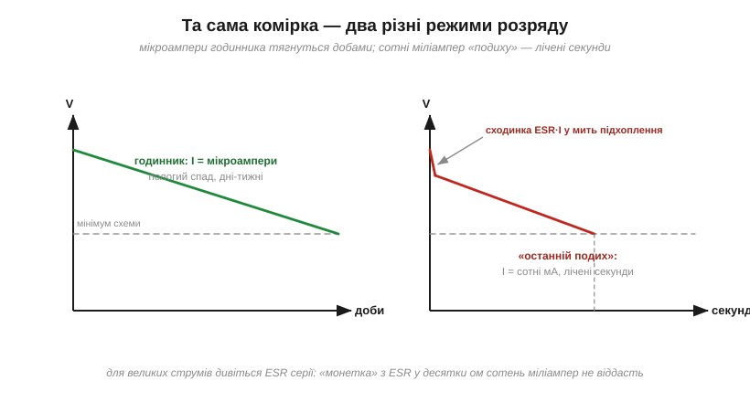

# 🔌 Іоністор як резервне живлення: годинник і «останній подих»

> Це компонентна вставка до теми [2.1.8 «Суперконденсатор»](ch07-capacitor.md). Фізика там уже розібрана; тут — конкретна схемотехніка: як підвісити іоністор на живлення, щоб він непомітно заряджався в роботі, а в мить зникнення мережі підхопив годинник на дні або дав усій системі кілька секунд попрощатися.

### Два сценарії — два класи задач

**Сценарій «годинник»:** після зникнення живлення мусить вижити мізерний споживач — годинник реального часу, лічильник, невелика пам'ять. Струми — одиниці-десятки мікроампер, час — години й доби. **Сценарій «останній подих» (*last gasp*):** система мусить пропрацювати ще кілька секунд на повному ході — встигнути записати дані, надіслати повідомлення «мене вимкнули», коректно згаснути. Струми — десятки-сотні міліампер, час — секунди. Обидва закриває іоністор, але **різний** іоністор — і це головна пастка вставки.

### Базова схема: діодне «АБО» плюс зарядний резистор


*Рис. 2.1.8c.1. Поки мережа є, схема живиться через D1, а іоністор тихо доряджається через резистор R. Щойно мережа зникла — напруга на шині просідає, D2 відкривається, і запас іоністора підхоплює навантаження. D1 при цьому не пускає заряд назад у вимкнене джерело.*

Кожен елемент тут не випадковий. **Резистор R** обмежує кидок струму: розряджений іоністор для джерела — майже коротке замикання ([§2.1.4](ch07-capacitor.md)), і без R увімкнення плати просаджувало б усе живлення на хвилини. **D1 і D2** — діоди Шотткі з малим прямим падінням ([§2.5.8](../ch10-diode-pn-junction/ch10-diode-pn-junction.md)): D1 відсікає шлях назад у джерело, D2 дає запасу оминути зарядний резистор при розряді. Ціна діода — украдені ~0.3 В: на шині 3.3 В іоністор зарядиться лише до ≈3.0 В, і це треба врахувати в розрахунку запасу.

**Приклад (скільки заряджається).** R = 100 Ом, C = 10 Ф. Стала часу заряджання τ = R·C = 1000 с ([§2.1.4](ch07-capacitor.md)), повний заряд за 5τ ≈ **1.4 години** після ввімкнення. Резервне живлення готове не одразу — і прошивка не повинна обіцяти «останній подих» у перші хвилини роботи.

### Скільки протримає: рахуємо чесно

Оцінка та сама, що в темі: t = C·ΔV/I, де ΔV — від стартової напруги до мінімуму, нижче якого споживач непрацездатний.

**Приклад (годинник на «монетці»).** Іоністор-«таблетка» 0.47 Ф 5.5 В, заряджений до 5.0 В; годинник споживає 2 мкА і працює до 2.0 В:

```
t = C · ΔV / I = (0.47 Ф · 3.0 В) / (2×10⁻⁶ А)
t = 705 000 с  ≈  8 діб
```

Вісім діб на папері — на практиці менше: власний саморозряд іоністора ([§2.1.8](ch07-capacitor.md)) і витік діода «їдять» запас разом із годинником. Чесна цифра для монетки — **дні, не місяці**; на місяці потрібна вже літієва батарейка.

**Приклад («останній подих»).** Низько-ESR іоністор 1 Ф, заряджений до 5.0 В; системі треба 150 мА і вона працює до 3.5 В:

```
t = C · ΔV / I = (1 Ф · 1.5 В) / (0.15 А) = 10 с
```

Десять секунд — досить, щоб записати дані й вимкнутися. Але зверніть увагу на **ESR**: у мить підхоплення напруга миттєво просідає на ESR·I ще до всякого розряду. Для низько-ESR комірки (40 мОм) це непомітні 6 мВ; а от поширена «монетка» 5.5 В має ESR у **десятки ом** — 150 мА просадили б її нижче нуля, тобто вона фізично не може віддати такий струм.


*Рис. 2.1.8c.2. Зліва — режим годинника: пологий лінійний спад, дні-тижні. Справа — «останній подих»: одразу сходинка ESR·I, далі швидкий спад до мінімуму за секунди. Та сама ємність на папері — зовсім різні вимоги до ESR.*

### Чому «монетка» — 5.5 В

Поширений резервний форм-фактор — плоска «таблетка» 0.1–1.5 Ф на **5.5 В**. Це не порушення стелі комірки з [§2.1.8](ch07-capacitor.md): усередині дві комірки **послідовно** ([§2.1.7](ch07-capacitor.md)), 2×2.75 В. Платою за компактність є якраз великий ESR — тож монетки створені для мікроамперних годинників, не для силових подвигів.

### Типові граблі

- **Забутий зарядний резистор:** при кожному старті плати розряджений іоністор «коротить» шину — стабілізатор іде в захист, плата не стартує.
- **Чекати від монетки місяців:** саморозряд і витік обмежують реальний резерв днями.
- **Монетка на «останній подих»:** десятки ом ESR не віддадуть сотень міліампер — для цього сценарію беруть низько-ESR серії.
- **Одна комірка 2.7 В на шині 5 В:** перевищення хімічної стелі — повільна смерть; беруть збірку 5.5 В або дві комірки з балансуванням ([§2.1.8](ch07-capacitor.md)).
- **Розрахунок без мінімальної напруги:** лінійний спад означає, що частина запасу нижча за поріг схеми й недосяжна — рахуйте ΔV, а не «всю» енергію.

### Варіації

У багатьох годинникових мікросхем є окремий вивід резервного живлення — іоністор вішають просто на нього, а перемикання «мережа/резерв» чип робить сам. Для серйозніших резервів існують гібридні літій-іонні конденсатори (вища напруга комірки і щільність енергії) та спеціалізовані мікросхеми-зарядники з обмеженням струму й балансуванням збірок. Але в основі кожного такого рішення — та сама трійця з Рис. 2.1.8c.1: зарядний опір, розділові діоди й чесний розрахунок t = C·ΔV/I.
