# Розділ 8 — Котушка та індуктивність

Конденсатор із [Розділу 7](../ch07-capacitor/ch07-capacitor.md) запасав енергію в **електричному** полі між обкладками й опирався зміні **напруги**. Тепер — його дзеркальний двійник. **Котушка** (*inductor*, або соленоїд) запасає енергію в **магнітному** полі й опирається зміні **струму**. Майже все, що ми вивели для конденсатора, повториться тут у дзеркалі: замість Q = C·V буде потік від струму, замість ½·C·V² — ½·L·I², замість сталої R·C — стала L/R. Цей розділ будує котушку від першопричин: спершу як струм робить магнітне поле (ця тема), потім — індуктивність, енергія, перехідні процеси, «брикання» при комутації та трансформатор.

Усе, що знадобиться, частково вже є з історії розділу: струм робить магнітне поле (Ерстед), котушка поводиться як магніт (Ампер), а зміна поля наводить струм (Фарадей). Тут ми перетворимо ці факти на робочий компонент.

> 📜 **Перед матеріалом — історія:** [рух магніту народжує струм — Ерстед, Фарадей, Генрі](ch08-history-induction.md). Вона показує, *звідки* взялося поняття індукції, чому одиницю названо «генрі» й чому котушка завжди опирається зміні.

---

## 8.1 Котушка й магнітне поле струму

Котушка — це, на перший погляд, найнудніша деталь у світі: просто намотаний дріт. Жодного переходу, жодного хитрого матеріалу — мідна спіраль, та й годі. І все ж саме ця спіраль крутить електродвигуни, ловить радіо, перетворює напругу й запускає половину силової електроніки. Уся її магія починається з одного факту, відкритого Ерстедом: **струм робить магнітне поле**. А котушка — це машинка, що **збирає** це поле в одному місці й робить його сильним. Розберімо, як саме.

### Струм робить магнітне поле

Найперше й найважливіше: будь-який **струм** оточений **магнітним полем** (*magnetic field*, позначають **B**). Навколо прямого дроту зі струмом це поле має несподівану форму — воно не тягнеться вздовж дроту й не б'є від нього навсібіч, як електричне поле від заряду ([§1.3](../../block-1-circuits-physics/ch01-charge-field-potential/ch01-charge-field-potential.md)), а **обвиває** провідник замкненими **кільцями**.

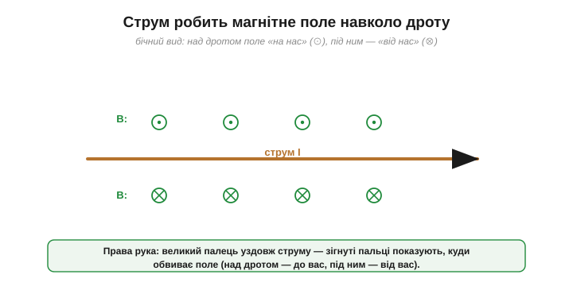
*Рис. 8.1.1. Магнітне поле прямого струму — концентричні кільця навколо дроту. Напрямок дає **правило правої руки**: великий палець уздовж струму (умовного, + → −), зігнуті пальці показують, куди «крутиться» поле.*

Щоб не плутатися з напрямком, користуються **правилом правої руки** (*right-hand rule*): якщо охопити дріт правою рукою так, щоб великий палець дивився вздовж струму, то зігнуті пальці вкажуть напрямок магнітного поля навколо дроту. Це не закон природи, а зручний мнемонічний прийом — але користуватися ним доведеться щодня, читаючи й проєктуючи будь-що з котушками. Поміняли напрямок струму — поле обернеться в протилежний бік; вимкнули струм — поле зникає. Магнітне поле живе рівно стільки, скільки тече струм, і миттєво слухається його напрямку та величини.

Силу поля міряють у **теслах** (*tesla*, **Тл** / **T**). Щоб відчути масштаб: магнітне поле Землі — близько 50 мікротесла (50 мкТл), побутовий магніт на холодильник — кілька мілітесла, а апарат МРТ у лікарні — цілих 1–3 тесла.

Чому саме кільця? Це підказує сама природа магнітного поля: воно не «витікає» зі струму, як електричне з заряду, а **кружляє** навколо нього (нижче побачимо, що магнітні лінії взагалі завжди замкнені). Практичний наслідок: два сусідні дроти зі струмом діють один на одного через свої поля (це й виміряв Ампер), а будь-яка доріжка на платі оточена слабким полем — зазвичай непомітним, та на високих частотах і великих струмах із ним уже доводиться рахуватися. Поле навколо одного тонкого дроту слабеньке — і ось тут на сцену виходить котушка.

### Магнітні лінії — завжди замкнені

Перш ніж мотати дріт, відзначмо глибоку відмінність магнітного поля від електричного. Електричні лінії, які ми малювали в [§1.3](../../block-1-circuits-physics/ch01-charge-field-potential/ch01-charge-field-potential.md), **починаються** на додатних зарядах і **закінчуються** на від'ємних — у них є джерело й стік. Магнітні лінії **не мають** ні початку, ні кінця: вони завжди **замкнені** в петлі.

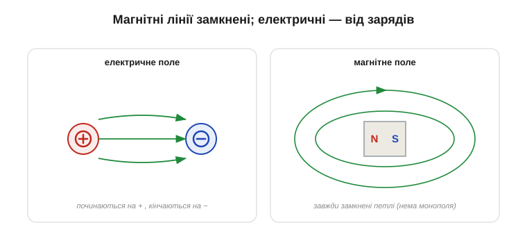
*Рис. 8.1.5. Ліворуч: електричні лінії йдуть від + до − (мають джерело й стік). Праворуч: магнітні лінії — завжди замкнені петлі, без початку й кінця. Це означає, що окремого магнітного «заряду» (монополя) не існує: розрізавши магніт, дістанете два магніти, а не окремі N і S.*

Звідси випливає відоме: не буває окремого магнітного полюса. Розламайте магніт навпіл — і отримаєте не окремий «N» і окремий «S», а **два** магніти, кожен зі своєю парою полюсів. Ця замкненість ліній — не абстракція: саме тому магнітне поле так зручно «ганяти» по кільцю із заліза (як у трансформаторі) і саме тому котушка робить поле, що виходить з одного її кінця й заходить в інший. Ця сама властивість — пряма причина, чому осердя трансформаторів і дроселів роблять **замкненими** (кільце чи рамка із заліза): магнітні лінії й так прагнуть замкнутися, тож їм прокладають зручний «рейковий» шлях по залізу, не випускаючи в повітря. Так майже все поле лишається в осерді, де від нього є користь, а не розсіюється навсібіч (докладніше про цей хід — коли дійдемо до трансформатора, [§8.6](ch08-inductor.md)).

### Виток: поле крізь петлю

Тепер зробімо перший крок до котушки — зігнімо дріт у **одну петлю** (виток). Кільцеві поля від усіх ділянок дроту всередині петлі **складаються** й дивляться в один бік — крізь отвір петлі. Зовні ж вони частково гасяться. У результаті проста петля зі струмом створює поле, дуже схоже на поле крихітного магніту: з одного боку петлі «виходить» поле (це наче північний полюс), з іншого «заходить» (південний).

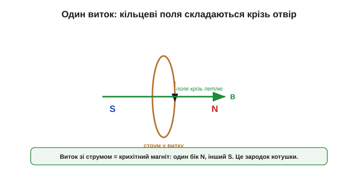
*Рис. 8.1.3. У витку поля окремих ділянок дроту всередині додаються (дивляться в один бік крізь отвір), а зовні слабшають. Виходить маленький магніт: один бік петлі — N, інший — S. Це вже зародок котушки.*

Один виток дає поле слабке. Але хто заважає намотати **багато** витків поряд?

### Котушка концентрує поле

Ось у чому суть котушки. Якщо скласти багато витків один за одним у спіраль (**соленоїд**), їхні поля **додаються**, і всередині котушки виникає сильне, майже **однорідне** поле, спрямоване вздовж осі. Зовні воно розходиться й замикається, точнісінько як у брускового магніту — з виразними N і S кінцями. Саме це й мав на увазі Ампер, кажучи, що котушка зі струмом — це магніт (історія розділу). Що довша й щільніша котушка, то однорідніше поле в її середині: у довгому соленоїді воно майже ідеально рівне по всьому перерізу, а «розмазується» лише біля самих кінців. Тому соленоїд — улюблений спосіб створити ділянку з відомим, рівним магнітним полем.

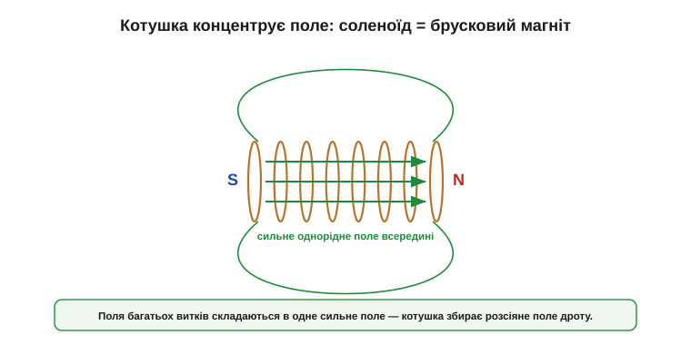
*Рис. 8.1.4. Багато витків поряд: їхні кільцеві поля складаються в єдине сильне поле всередині котушки (однорідне, уздовж осі) і замикаються зовні, як у брускового магніту. Один кінець котушки стає N, інший — S. Котушка **концентрує** розсіяне поле одного дроту в одну сильну ділянку.*

Слово «концентрує» тут ключове. Поле одного прямого дроту — кволе й розмазане по всьому простору. Намотавши дріт у котушку, ми **збираємо** внески багатьох витків у компактний об'єм усередині — і дістаємо сильне, кероване поле там, де нам треба. Напрямок полюсів знов дає права рука, лише тепер навпаки: зігнути пальці за напрямком струму у витках — і **великий палець** покаже, де північний полюс котушки.

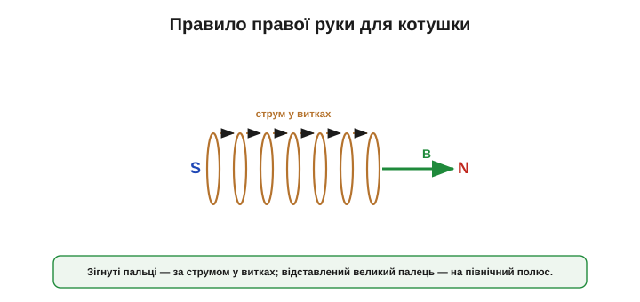
*Рис. 8.1.2. Для котушки: зігнуті пальці правої руки — за напрямком струму у витках, відставлений великий палець — на північний полюс (туди, куди поле виходить із котушки). Поміняли напрямок струму — полюси помінялися місцями.*

> 🔧 **Навіщо це.** Котушка трапляється всюди, де електрика зустрічається з рухом чи з магнітним полем: обмотки двигунів і генераторів, електромагніти реле, котушки гучномовців і мікрофонів, дроселі в живленні, антени й контури радіоприймачів, котушки індукційних плит і безконтактних зарядок. Скрізь працює та сама ідея §8.1 — намотаний дріт концентрує магнітне поле струму саме туди, де воно потрібне. Решта розділу лише уточнює, *скільки* поля й *як* воно поводиться.

### Від чого залежить сила: ампер-витки

Наскільки сильне поле дає котушка? Двома очевидними важелями: **скільки струму** через неї тече і **скільки витків** намотано. Подвоїти струм — подвоїти поле; подвоїти кількість витків — теж подвоїти. Тому силу «магнітного зусилля» котушки міряють їхнім **добутком** — **ампер-витками** (*ampere-turns*, N·I):

```
магнітне «зусилля»  ∝  N · I        (кількість витків × струм)
```

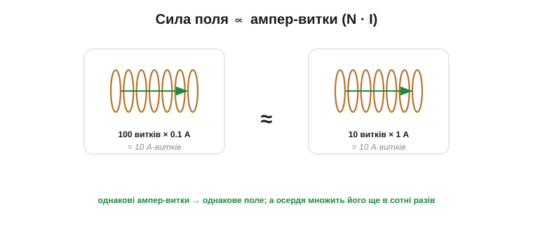
*Рис. 8.1.7. Три важелі сили поля: більше витків N, більший струм I (разом — ампер-витки N·I) та осердя з магнітного матеріалу. Сто витків зі струмом 0.1 А дають ті самі 10 ампер-витків, що й десять витків зі струмом 1 А.*

Звідси практичний висновок: однакове поле можна отримати або багатьма витками за малого струму, або кількома витками за великого. 1000 витків по 10 мА і 10 витків по 1 А дають однакові 10 ампер-витків — а отже, приблизно однакове поле. Який варіант обрати — залежить від того, що в схемі дешевше: струм чи місце під обмотку.

### Осердя: як підсилити поле в сотні разів

Є й третій, найпотужніший важіль — **осердя** (*core*). Якщо всередину котушки вставити стрижень із магнітного матеріалу (зазвичай заліза чи фериту), поле зростає не на відсотки, а в **десятки й сотні разів**. Чому? Залізо складається з безлічі мікроскопічних магнітиків (доменів), які зазвичай дивляться врізнобіч і гасять одне одного. Зовнішнє поле котушки **вишиковує** їх в один бік — і вони додають своє власне, набагато сильніше поле до поля котушки.

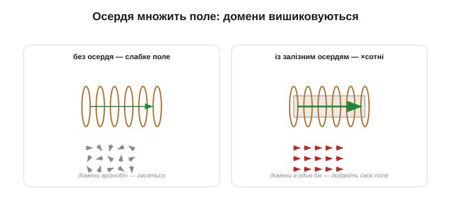
*Рис. 8.1.6. Без осердя поле котушки — лише від струму. Із залізним осердям домени-магнітики, доти спрямовані хаотично, вишиковуються полем котушки й додають своє — поле зростає в сотні разів. Здатність матеріалу підсилювати поле звуть проникністю (*permeability*, μ).*

Здатність матеріалу підсилювати магнітне поле називають **магнітною проникністю** (*permeability*, μ). У повітря вона майже одинична, у заліза — сотні й тисячі. Саме осердя перетворює кволу котушку на потужний **електромагніт**.

Та осердя не всемогутнє. Доменів у залізі скінченна кількість, і коли **майже всі** вони вже вишикувані полем, додавати далі майже нема чим — настає **насичення** (*saturation*). Воно приходить не стрибком, а **поступово**: що ближче до межі, то менше поля додає кожен новий ампер, аж поки залізо не «віддасть майже все, що мало». Це важлива практична межа: у насиченні індуктивність дроселя помітно **падає**, і він дедалі гірше обмежує струм. (У даташиті струм насичення I_sat зазвичай означають як струм, за якого L впала на задані кілька десятків відсотків, — а не магічну точку, де котушка зникає; детальніше в [§8.7](ch08-inductor.md).) Тому осердя завжди беруть із запасом за струмом, а інколи навмисне роблять у ньому тонкий **повітряний зазор**, щоб відсунути насичення подалі.

**Приклад (ампер-витки й осердя).** Котушка реле має N = 500 витків і струм I = 50 мА. Її «магнітне зусилля» — це N·I = 500 × 0.05 = **25 ампер-витків**. Саме повітря дало б від цього кволеньке поле; але із залізним осердям воно зростає в сотні разів — і тих 25 ампер-витків уже досить, щоб притягнути якір і клацнути контактом. (Точний множник — не «гола» проникність матеріалу μ ≈ 1000, а **ефективна** проникність усього магнітного кола: її задають геометрія, форма й передусім будь-який повітряний зазор, тож реально вона зазвичай помітно менша за μ матеріалу.) Ось чому реле спрацьовує від скромного струму: разом працюють і багато витків, і осердя.

> 🔧 **Навіщо це.** Осердя — причина, чому реле, контактори, електромагнітні замки й підіймальні крани на брухтному дворі тримають величезну вагу від скромного струму: залізне осердя множить поле обмотки в сотні разів. Те саме осердя стоїть у трансформаторах і дроселях живлення. А ще запам'ятайте: вставивши чи вийнявши осердя, ви сильно міняєте властивості котушки — це і спосіб підлаштування, і прихована пастка (нагріте чи насичене осердя поводиться інакше).

### Дзеркало конденсатора

Завершимо тим, із чого почали розділ. Котушка — дзеркальний двійник конденсатора, і їх корисно бачити поруч.

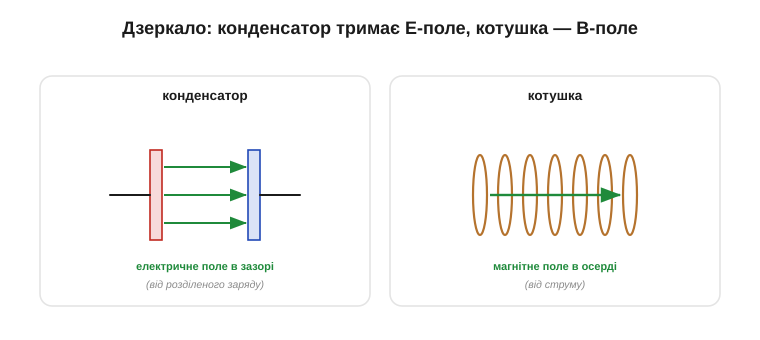
*Рис. 8.1.8. Конденсатор концентрує **електричне** поле в зазорі між обкладками (його робить розділений заряд). Котушка концентрує **магнітне** поле у своєму осерді (його робить струм). Два компоненти, два поля — далі ми побачимо, що й поводяться вони дзеркально.*

Цю дзеркальність варто тримати в голові від самого початку: де в конденсаторі стояв **заряд**, у котушці стоятиме **струм**; де була **напруга** — буде **швидкість зміни струму**; де ємність **C** — буде індуктивність **L**. Майже кожну формулу Розділу 7 можна «перекласти» в Розділ 8, помінявши ці пари місцями. Тому, добре засвоївши конденсатор, ви вже наполовину знаєте котушку — лишається наповнити дзеркало числами.

Конденсатор концентрує електричне поле там, де є розділений заряд; котушка концентрує магнітне поле там, де тече струм. Конденсатор не любить, коли різко міняють **напругу** на ньому; котушка, як ми скоро побачимо, не любить, коли різко міняють **струм** крізь неї. Ця симетрія — не випадковість, а глибока риса електромагнетизму, і вона веде нас прямо до головного питання наступної теми: якщо струм робить поле, а поле «тримає» в собі енергію й чинить опір змінам, то як це описати **числом** — однією величиною, що каже, наскільки сильно дана котушка «чіпляється» за свій струм? Саме так, як ємність C відповіла на питання «скільки заряду на вольт», нова величина відповість на питання «скільки опору зміні струму». Так ми приходимо до **індуктивності**.

---

## 8.2 Індуктивність і самоіндукція: V = L·di/dt

У попередній темі котушка робила магнітне поле зі сталого струму. А що станеться, коли струм **змінити**? Тоді зміниться й поле — а зміна поля, як навчив нас Фарадей (історія розділу), наводить напругу. Найдивовижніше: ця напруга наводиться в **тій самій** котушці, що й створила поле. Котушка реагує на власну зміну струму — це **самоіндукція**, і саме вона робить котушку котушкою. (Тут ідеться саме про **само**індукцію — реакцію котушки на власну зміну струму. Коли ж поле однієї котушки наводить струм в **іншій** — це взаємоіндукція, основа трансформатора, до якої дійдемо в [§8.6](ch08-inductor.md).)

### Самоіндукція: котушка наводить напругу сама в собі

Простежмо ланцюжок. Тече струм → котушка робить магнітне поле ([§8.1](ch08-inductor.md)). Міняємо струм → міняється поле → міняється магнітний потік крізь витки котушки. А за законом індукції Фарадея зміна потоку наводить напругу — причому, за законом Ленца, таку, що **протидіє** зміні, яка її породила. Тобто котушка наводить у собі напругу, яка намагається **зберегти** свій струм незмінним.

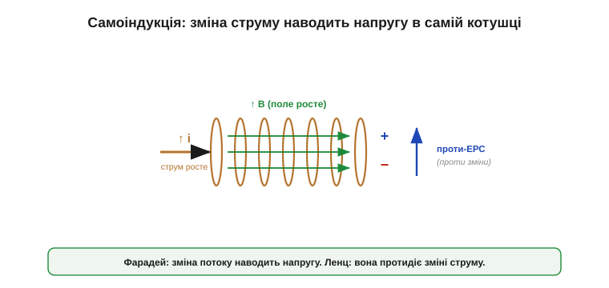
*Рис. 8.2.1. Міняємо струм у котушці → міняється її поле → змінний потік наводить напругу в самій котушці (Фарадей), причому **проти** зміни (Ленц). Намагаєшся наростити струм — котушка «гальмує»; намагаєшся обірвати — котушка «підштовхує», аби струм тривав.*

Цю наведену напругу часто звуть **проти-ЕРС** (*back-EMF*): вона спрямована проти того, що робить джерело. Намагаєтеся **збільшити** струм — котушка наводить напругу, яка цьому опирається; намагаєтеся **обірвати** струм — котушка наводить напругу, яка штовхає струм далі, аби той не зникав. Котушка поводиться вперто: завжди **за збереження** свого поточного струму.

У реальному колі ця проти-ЕРС додається до напруги джерела за правилом Кірхгофа ([§4.3](../../block-1-circuits-physics/ch04-kirchhoff-circuit-analysis/ch04-kirchhoff-circuit-analysis.md)): поки струм наростає, частину напруги джерела «з'їдає» подолання впертості котушки, тому струм набирається не миттєво. А коли джерело вимикають, накопичене поле не зникає враз — котушка сама стає джерелом, підтримуючи струм своєю проти-ЕРС, аж поки запас поля не вичерпається. Саме це робить котушку такою норовливою при вмиканні-вимиканні.

### Закон котушки: V = L·di/dt

Скільки саме напруги наводиться? Вона тим більша, чим **швидше** міняється струм. Точний зв'язок — основний закон котушки:

```
V = L · (di/dt)
```

де **di/dt** — швидкість зміни струму (амперів за секунду), а коефіцієнт **L** і є **індуктивність** (*inductance*). Читати слід так: напруга на котушці пропорційна не струму, а **швидкості його зміни**. Тече сталий струм (di/dt = 0) — напруги на ідеальній котушці немає взагалі. Струм ринув різко (велике di/dt) — котушка відповідає великою напругою. (Про знак: тут **V** — це *спад* напруги на котушці в пасивній згоді знаків; та сама величина як **наведена ЕРС**, що протидіє зміні, записується з мінусом — ε = −L·di/dt, — і цей мінус і є закон Ленца з історії розділу. Далі ми користуємось формою V = L·di/dt, пам'ятаючи, що напрямок цієї напруги — завжди *проти* зміни струму.)

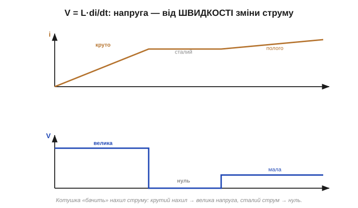
*Рис. 8.2.2. Поки струм наростає рівномірно (стале di/dt) — на котушці стала напруга. Крутіший нахил струму (швидша зміна) → більша напруга. Струм застиг (горизонтальна ділянка) → напруга падає до нуля. Котушка «бачить» лише нахил струму, а не його рівень.*

Індуктивність L — це **міра впертості** котушки: за тієї самої швидкості зміни струму більша L дає більшу протидійну напругу. Зверніть увагу на красиву дзеркальність до конденсатора з [§7.1](../ch07-capacitor/ch07-capacitor.md): там струм у колі залежав від швидкості зміни **напруги** (i = C·dV/dt), тут напруга залежить від швидкості зміни **струму** (V = L·di/dt). Помінялися місцями струм і напруга — і вийшов інший компонент.

### Котушка — це електрична інерція

Найкраща інтуїція для котушки — **інерція**. Згадайте важкий маховик: він опирається будь-якій зміні швидкості обертання. Підштовхуєте — він розганяється неохоче; гальмуєте — він за інерцією крутиться далі. Котушка робить те саме зі **струмом**: опирається його розгону й не дає різко спинити.

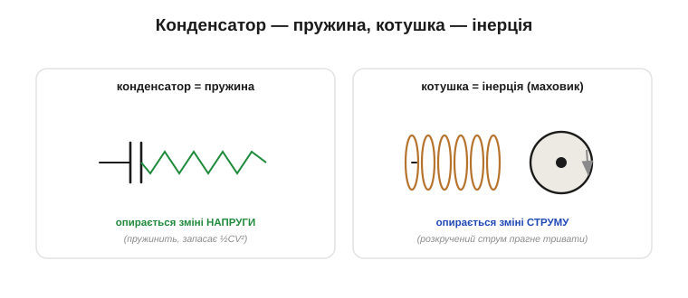
*Рис. 8.2.3. Конденсатор — це «електрична пружина» (запасає, пружинить проти зміни напруги, §7.3). Котушка — це «електрична інерція»: як важкий маховик опирається зміні швидкості, так котушка опирається зміні струму. Раз розігнаний струм вона «хоче» втримати.*

Ця аналогія точна й дуже корисна. Конденсатор ми вже бачили як **пружину** (запасає енергію в полі, пружинить проти зміни напруги). Котушка — це **маса/маховик**: вона теж запасає енергію (про це — наступна тема), але опирається зміні **струму**, а раз «розкручений» струм прагне зберегти. Звідси й уся поведінка котушки: повільне наростання струму, інерційне «доживання» струму після вимкнення, потужний сплеск при різкому обриві.

Аналогія підказує й те, чого очікувати далі. Маховик не спинити вмить — і струм у котушці не обірвати вмить без наслідків. Маховик, який гальмують, мусить кудись віддати накопичену енергію обертання — і котушка, якій перекрили струм, теж мусить кудись подіти запас свого магнітного поля. Як саме струм наростає й спадає в часі — тема [§8.4](ch08-inductor.md), а що буває при різкому обриві — [§8.5](ch08-inductor.md). Поки тримаймо образ: котушка — це **інерція струму**.

### Генрі: одиниця індуктивності

Одиниця індуктивності — **генрі** (*henry*, **Гн** / **H**), названий на честь Джозефа Генрі, що відкрив самоіндукцію (історія розділу). З формули V = L·di/dt одразу видно, що таке генрі:

```
1 генрі = 1 вольт / (1 ампер за секунду)
1 Гн = 1 В·с / А
```

Тобто котушка в 1 Гн — це така, у якій зміна струму на 1 ампер за секунду наводить рівно 1 вольт. Генрі — велика одиниця; реальні котушки частіше мають частки її:

```
1 мкГн (мікрогенрі) = 10⁻⁶ Гн   (дрібні ВЧ-котушки, дроселі)
1 мГн (мілігенрі)   = 10⁻³ Гн   (фільтри, живлення)
1 Гн                            (великі дроселі, обмотки з осердям)
```

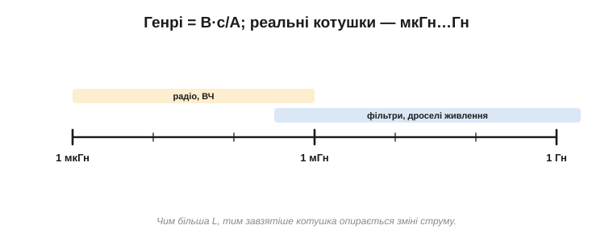
*Рис. 8.2.4. Генрі = вольт-секунда на ампер. Практичні котушки — від мікрогенрі (радіо) до одиниць генрі (дроселі живлення з осердям). Чим більша L, тим завзятіше котушка опирається зміні струму.*

> 🔧 **Навіщо це.** У даташиті котушки чи дроселя індуктивність — головна цифра, як ємність у конденсатора: «10 µH», «100 mH». Поряд завжди стоїть **максимальний струм** (бо за великого струму осердя насичується, [§8.1](ch08-inductor.md), і L падає) та опір обмотки. Читати котушку — це дивитися одразу на L і на допустимий струм, так само як конденсатор — на ємність і напругу. А ще в каталогах котушки розрізняють за призначенням — дроселі живлення, ВЧ-котушки, обмотки трансформаторів, — про що окремо буде в [§8.7](ch08-inductor.md).

### Від чого залежить L: витки в квадраті

Як і ємність, індуктивність задається **будовою**, а не струмом. Важелі знайомі з [§8.1](ch08-inductor.md): кількість витків, площа й довжина котушки, матеріал осердя. Але один із них поводиться несподівано: індуктивність росте з квадратом числа витків.

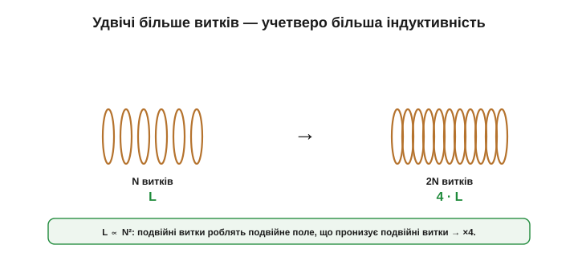
*Рис. 8.2.5. Чому N²? Удвічі більше витків створюють удвічі сильніше поле (більший потік), і водночас цей потік пронизує вдвічі більше витків. Двічі по два — учетверо. Тому індуктивність дуже чутлива до числа витків: L ∝ N².*

Чому саме квадрат? Дві причини множаться. По-перше, удвічі більше витків роблять удвічі **сильніший** потік (більше ампер-витків, [§8.1](ch08-inductor.md)). По-друге, цей потік тепер пронизує удвічі більше витків, наводячи напругу в кожному. Двічі по два — учетверо. Тому щоб підняти індуктивність, найвигідніше **домотати витків**, а не міняти струм.

**Приклад (вплив витків).** Котушка зі 100 витків має індуктивність, скажімо, 1 мГн. Домотаємо до 200 витків (удвічі), не міняючи більше нічого. Індуктивність зросте не вдвічі, а **вчетверо** — до 4 мГн, бо L ∝ N². А 300 витків (утричі) дали б уже ×9 — цілих 9 мГн. Ось чому навіть невелика зміна кількості витків помітно зсуває індуктивність, і чому котушки на велику L мають густі багатошарові обмотки. (Зверніть увагу: «не міняючи більше нічого» — це **ідеалізація** «та сама геометрія, лінійне осердя». Насправді, домотуючи витки, ви заодно подовжуєте дріт, піднімаєте опір DCR і паразитну ємність, міняєте розмір обмотки, а інколи й насичення осердя — тож рівно ×4 виходить лише на папері, а в залізі — приблизно.)

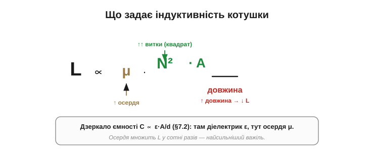
*Рис. 8.2.6. Індуктивність котушки: L росте з квадратом числа витків N², з площею перерізу та проникністю осердя μ, і падає з довжиною котушки. Магнітне осердя (велика μ) — найпотужніший важіль, як діелектрик для ємності.*

Якісно: **L ∝ μ · N² · A / довжину**. Порівняйте з ємністю C ∝ ε·A/d ([§7.2](../ch07-capacitor/ch07-capacitor.md)) — знову дзеркало: там діелектрик (ε), тут магнітне осердя (μ); там площа й зазор, тут площа й довжина обмотки. Осердя з великою проникністю множить L у сотні разів — тому потужні дроселі завжди мають залізне чи феритове осердя.

Осердя — найсильніший важіль, але й найхитріший. Воно множить L за тих самих витків, та приносить і вади: насичується за великого струму (L раптом падає, [§8.1](ch08-inductor.md)), гріється й додає втрат на високих частотах. Тому в силових дроселях беруть осердя з тонким повітряним зазором (стабільніше, пізніше насичується), у радіочастотних котушках — спеціальний ферит або взагалі **повітряне** осердя (мала L, зате без втрат і насичення). Вибір осердя — це завжди компроміс між великою індуктивністю та чесною поведінкою, точно як вибір діелектрика для конденсатора ([§7.5](../ch07-capacitor/ch07-capacitor.md)).

### Для постійного струму котушка — просто дріт

Із V = L·di/dt випливає важливий висновок, дзеркальний до конденсатора. Якщо струм **сталий** (di/dt = 0), напруга на ідеальній котушці — **нуль**. Тобто для постійного струму **ідеальна** котушка поводиться як звичайний **шматок дроту** (коротке замикання): пропускає його без спротиву. Реальна, звісно, не ідеальна: її мідна обмотка має опір DCR, на якому губиться напруга й виділяється тепло ([§8.7](ch08-inductor.md)), а великий постійний струм ще й підштовхує осердя до насичення ([§8.1](ch08-inductor.md)). Тож «просто дріт» — це про *ідеальну* котушку або коли DCR і насиченням можна знехтувати.

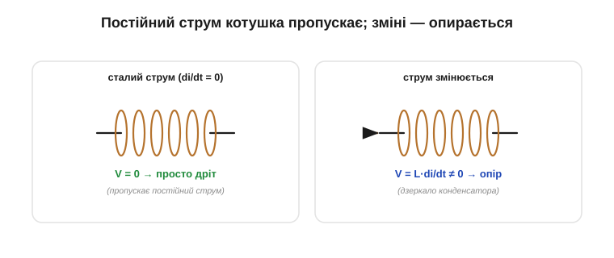
*Рис. 8.2.7. Сталий струм — на котушці нуль напруги, вона просто дріт (пропускає DC). Струм змінюється — котушка наводить напругу, що опирається. Це точне дзеркало конденсатора: той блокує постійне й пропускає зміну, котушка пропускає постійне й опирається зміні.*

Запам'ятайте цю пару протилежностей: **конденсатор блокує постійний струм, котушка його пропускає**; зате конденсатор легко пропускає швидкі зміни, а котушка їм опирається. Саме на цій протилежності згодом будуються фільтри (як саме — залежить від частоти, це [Розділ 9](ch08-inductor.md)); поки досить чіткого правила: котушка — друг постійного струму й ворог різких змін.

Звідси й типова роль котушки в живленні — **дросель** (*choke*): він вільно пропускає корисний постійний струм, але «затирає» накладену на нього швидку пульсацію чи шум, бо різким змінам опирається. Це знову дзеркало конденсатора з [§7.6](../ch07-capacitor/ch07-capacitor.md): розв'язувальний конденсатор пропускав пульсацію в землю, а постійне тримав; дросель — навпаки, пропускає постійне, а пульсацію гальмує. Разом котушка й конденсатор утворюють найпоширеніший фільтр живлення (як він розділяє частоти — [Розділ 9](ch08-inductor.md)).

### Дзеркало конденсатора

Зведімо дзеркальність докупи — її варто бачити цілою, бо вона економить половину зусиль на вивчення котушки.

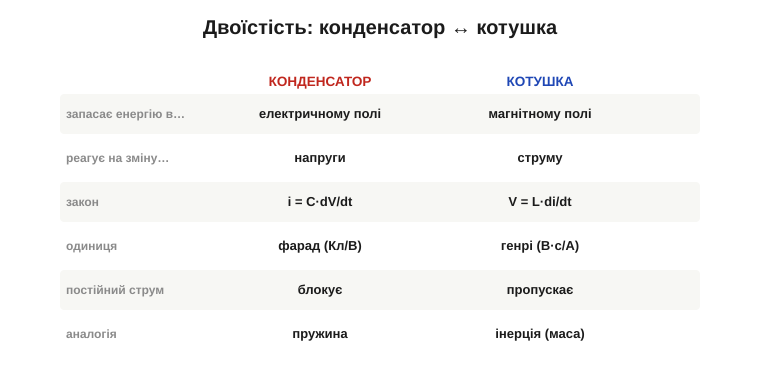
*Рис. 8.2.8. Конденсатор і котушка — двійники. Заряд Q ↔ потік (струм I); напруга ↔ швидкість зміни струму; i = C·dV/dt ↔ V = L·di/dt; фарад ↔ генрі; блокує постійне ↔ пропускає постійне; запас у E-полі ↔ запас у B-полі.*

Ця таблиця — не просто гарна симетрія, а робочий інструмент. Зустрівши котушку в незнайомій схемі, подумки перекладіть її на конденсатор, згадайте, як поводився б той, і поверніть висновок назад через дзеркало. Двоїстість економить половину міркувань — нею ми ще не раз скористаємося в наступних темах.

**Приклад (напруга від зміни струму).** Котушка L = 10 мГн, струм у ній зростає з 0 до 2 А за 1 мс. Яка напруга на ній під час наростання?

```
di/dt = 2 А / 0.001 с = 2000 А/с
V = L · (di/dt) = 0.010 Гн · 2000 А/с = 20 В
```

Двадцять вольтів від скромної котушки — лише тому, що струм мінявся швидко. А тепер уявімо різкий **обрив**: той самий струм 2 А зникає не за мілісекунду, а за мікросекунду (di/dt у тисячу разів більше) — і напруга підскочить до **тисяч вольтів**. Це і є те «брикання» котушки, що вдарило Генрі; докладно, чим воно небезпечне й як його приборкати, — у [§8.5](ch08-inductor.md).

Підсумуймо. **Індуктивність L** каже, наскільки сильно котушка опирається зміні свого струму, за законом **V = L·di/dt**: напруга пропорційна швидкості зміни струму. Міряється в **генрі** (В·с/А; на практиці — мкГн…Гн), задається будовою (**L ∝ μ·N²·A/довжину**, особливо чутлива до числа витків). Котушка — це **електрична інерція**: пропускає постійний струм як дріт, але впирається будь-якій його зміні. Тепер, знаючи закон котушки, порахуймо, скільки **енергії** вона запасає у своєму полі.

---

## 8.3 Енергія в магнітному полі

Котушка зі струмом тримає **запас енергії** — захований у її магнітному полі. Найкращий доказ цього ви бачите щоразу, коли висмикуєте з розетки потужний прилад чи розмикаєте коло з обмоткою: між контактами проскакує **іскра**. Це котушка вивергає свій запас, не бажаючи розлучатися зі струмом. Порахуймо, скільки енергії в ній сидить, де вона захована і чому при обриві струму вона виходить так бурхливо. Як завжди в цьому розділі, відповідь — дзеркало того, що ми вже знаємо про конденсатор. І саме на цій енергії тримається половина силової електроніки: імпульсні перетворювачі живлення, системи запалювання, зварювальні апарати — усі вони раз у раз ганяють енергію крізь магнітне поле котушки.

### Звідки енергія: робота проти проти-ЕРС

Енергія в котушці не виникає з нічого — її вкладає джерело, поки **розганяє** струм від нуля до робочого значення. Згадаймо [§8.2](ch08-inductor.md): поки струм наростає, котушка наводить проти-ЕРС, що цьому опирається. Щоб усе ж наростити струм, джерело мусить долати цю проти-ЕРС — тобто **виконувати роботу**. Ця робота й осідає в магнітному полі як запас енергії.


*Рис. 8.3.1. Розгін струму від 0 до I: на початку струму нема, наприкінці — повний I. Джерело весь час долає проти-ЕРС котушки, виконуючи роботу. Оскільки струм наростає від нуля, середня «вартість» — на половині шляху, тож енергія виходить ½·L·I² (рівно як ½·C·V² для конденсатора, що заряджався проти зростання напруги).*

Той самий множник ½, що й у конденсатора, і з тієї самої причини: струм наростав **з нуля**. На початку розгону його ще мало, наприкінці — повний; у середньому джерело «платило» за половину. Звідси й половина у формулі.

Зверніть увагу на дзеркальність самої бухгалтерії. У конденсаторі джерело переганяло заряд проти зростання **напруги**; у котушці воно розганяє струм проти зростання **проти-ЕРС**. Там накопичувалося розділення заряду, тут — «розгін» струму; там енергія осідала в електричному полі, тут — у магнітному. Та сама механіка вкладання енергії, лише з поміняними ролями струму й напруги.

### Закон: W = ½·L·I²

Енергія, запасена в котушці з індуктивністю L, по якій тече струм I:

```
W = ½ · L · I²
```


*Рис. 8.3.2. Звідки ½: якщо відкладати магнітний потік проти струму, виходить пряма крізь нуль (Φ = L·I). Енергія — площа під нею, тобто **трикутник** ½·Φ·I = ½·L·I². Якби «вартість» була стала, вийшов би прямокутник Φ·I; та струм наростав із нуля, тож рівно половина. Точне дзеркало ½·C·V² із [§7.3](../ch07-capacitor/ch07-capacitor.md).*

Перевірмо, що це **джоулі**. Індуктивність у генрі (В·с/А), струм в амперах:

```
[L·I²] = (В·с/А) · А² = В·А·с = (В·А)·с = Вт·с = Дж   ✓
```

(вольт-ампер — це вата потужності, помножена на секунди — джоулі). Одиниці сходяться. Є й інші записи тієї самої енергії — через магнітний потік (W = ½·Φ·I), точно як у конденсатора були ½·Q·V і ½·Q²/C, — але на практиці майже завжди користуються формою **½·L·I²**.

Саме цю енергію вперше відчув на собі Джозеф Генрі (історія розділу): його потужні електромагніти запасали її стільки, що при розмиканні били іскрою й чутливим ударом струму. Зручно мислити так: ½·L·I² — це «магнітний капітал» котушки, накопичений струмом і готовий повернутися тієї ж миті, щойно струмові щось загрожує.

**Приклад (енергія в котушці).** Дросель L = 10 мГн зі струмом I = 2 А:

```
W = ½ · L · I²
W = ½ · (10 × 10⁻³ Гн) · (2 А)²
W = ½ · 0.01 · 4 = 0.02 Дж = 20 мДж
```

Двадцять міліджоулів — небагато (приблизно як у зарядженому конденсаторі середніх розмірів). Та вся хитрість, як і в конденсаторі, не в обсязі запасу, а в тому, **як швидко** його можна віддати — про що нижче.

### Чому струм важливіший: квадрат

У формулі ½·L·I² індуктивність входить лінійно, а струм — у **квадраті**. Тому струм для запасу енергії набагато «важливіший»: подвоїти індуктивність — подвоїти енергію, а подвоїти струм — збільшити її **вчетверо**.

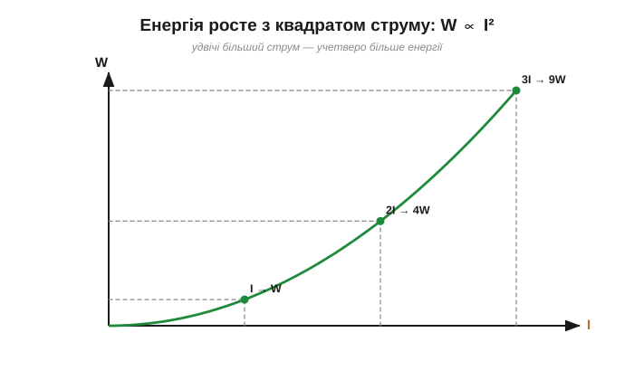
*Рис. 8.3.3. Запас енергії W ∝ I² — парабола. Удвічі більший струм дає вчетверо більше енергії, утричі — у дев'ять разів. Тому котушку для накопичення енергії «розганяють» струмом, а небезпека при обриві стрімко зростає зі струмом.*

**Приклад (квадрат струму).** Той самий дросель 10 мГн, але струм уже 4 А (удвічі більший):

```
W = ½ · 0.01 · (4)² = ½ · 0.01 · 16 = 0.08 Дж = 80 мДж
```

Вчетверо більше за попередні 20 мДж — від лише вдвічі більшого струму. Це точне дзеркало того, як енергія конденсатора залежала від квадрата напруги ([§7.3](../ch07-capacitor/ch07-capacitor.md)).

Цей квадрат має пряму ціну в проєктуванні. Дросель, розрахований на певний запас енергії, мусить витримувати відповідний струм — бо саме струм визначає і запас, і наближення осердя до насичення ([§8.1](ch08-inductor.md)). Подвоїти робочий струм означає не подвоїти, а **вчетверо** збільшити енергію в полі — а отже, куди суворіші вимоги і до осердя, і до захисту кола від сплесків при обриві.

### Де сидить енергія: у магнітному полі

Де фізично захований цей запас? Не «у дроті» й не «у струмі» — а в **магнітному полі**, що наповнює котушку та її осердя. Це точне дзеркало конденсатора, де енергія жила в електричному полі зазору ([§7.3](../ch07-capacitor/ch07-capacitor.md)).


*Рис. 8.3.4. Поки тече струм, поле напнуте — енергія є. Перервеш струм — поле **спадає до нуля**, і запасена в ньому енергія мусить вийти назовні (наводячи проти-ЕРС, женучи струм далі, спалахуючи іскрою). Енергія живе в полі, а не в металі.*

Поки струм тече — поле напнуте, енергія є. Зник струм — спало поле, енергію віддано. Конденсатор запасав енергію в електричному полі й віддавав її при розряді; котушка запасає в магнітному й віддає, коли поле спадає. Два компоненти, два поля — і та сама ідея: **енергія любить жити в полях**.

Корисно знати й тонкість: щільність енергії в полі росте з квадратом його сили (∝ B²), тож більша частина запасу зосереджена там, де поле найгустіше — всередині котушки та її осердя. Це й причина, чому осердя не лише множить індуктивність, а й «вміщає» левову частку енергії; і чому **насичене** осердя ([§8.1](ch08-inductor.md)) раптом перестає її запасати — полю більше нема куди рости в металі.

### Котушка — це кінетична енергія струму

Аналогія інерції з [§8.2](ch08-inductor.md) тут стає буквальною й прекрасною. Згадаймо механіку: пружина запасає **потенціальну** енергію ½·k·x², а рухоме тіло — **кінетичну** ½·m·v². Тепер погляньте на пари:

```
пружина:       ½·k·x²        конденсатор:   ½·C·V²
рухоме тіло:   ½·m·v²        котушка:       ½·L·I²
```


*Рис. 8.3.5. Конденсатор — як стиснута пружина (потенціальна енергія ½·k·x², запас у «натягу» поля). Котушка — як розкручений маховик (кінетична енергія ½·m·v², запас у «русі» струму). Індуктивність грає роль маси, струм — роль швидкості.*

Збіг не випадковий: індуктивність грає роль **маси**, а струм — роль **швидкості**. Котушка запасає енергію саме тому, що струм «рухається», як маховик запасає її, бо обертається. І так само, як маховик не спинити вмить (інакше куди подіти його кінетичну енергію?), струм у котушці не обірвати вмить без бурхливого виходу енергії. Ця аналогія — не просто гарна картинка: вона дозволяє переносити всю механічну інтуїцію на електричні кола.

Звідси правило, яке варто закарбувати: **струм у котушці не можна обірвати миттєво**, як не можна вмить спинити важкий маховик. Спробуєш — і котушка, обстоюючи свій струм, нажене скільки завгодно високу напругу (V = L·di/dt з величезним di/dt, [§8.2](ch08-inductor.md)), аби струм усе ж протік бодай крізь іскру. Маса віддає кінетичну енергію через гальмівний шлях; котушка — через шлях для струму. Дай їй цей шлях завчасно — і приборкаєш сплеск (саме так працює захисний діод із [§8.5](ch08-inductor.md)).

### Запас, що повертається

Як і конденсатор, котушка енергію **не витрачає, а запасає й повертає**. Ідеальна котушка (без опору обмотки) накопичує енергію, поки струм наростає, і повністю віддає її назад, коли струм спадає, — нічого не перетворюючи на тепло. Цим вона відрізняється від резистора, що енергію безповоротно **спалює** ([§3.6](../../block-1-circuits-physics/ch03-resistance-power-heat/ch03-resistance-power-heat.md)).

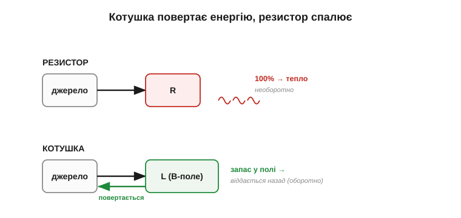
*Рис. 8.3.6. Доля вкладеної енергії. Резистор увесь час перетворює її на тепло (необоротно). Котушка запасає її в полі й повертає в коло, коли поле спадає (оборотно). Тому котушка, як і конденсатор, — реактивний елемент, а не той, що розсіює.*

Різниця з конденсатором — лише у **способі** віддачі. Заряджений конденсатор небезпечний напругою на роз'єднаних виводах — його боїшся чіпати; котушка зі струмом — навпаки, сплеском при роз'єднанні — її боїшся обривати. Перший тримає енергію в розділеному заряді й віддає її, коли йому дають шлях для струму (розряд); друга тримає енергію в русі струму й віддає, коли цей рух намагаються спинити. Дзеркало й тут повне.

> 🔧 **Навіщо це.** Ця оборотність — основа **імпульсних перетворювачів** живлення. Котушку накачують енергією, поки відкритий ключ, а потім перенаправляють цей запас у потрібний бік — і так піднімають чи знижують напругу майже без втрат (на відміну від лінійного стабілізатора, що зайве просто гріє). Саме тому котушка — серце будь-якого ефективного блока живлення. Як це збирають із ключа, котушки й діода — побачимо в системному розділі про живлення; тут важливо, що котушка позичає енергію колу, а не марнує її.

### Енергії треба кудись подітися

А тепер — найдраматичніший наслідок. Раз у котушці є запас енергії, то при **різкому обриві** струму ця енергія мусить кудись вийти за дуже короткий час. Потужність — це енергія за секунду ([§3.5](../../block-1-circuits-physics/ch03-resistance-power-heat/ch03-resistance-power-heat.md)); якщо 20 мДж віддати не за секунди, а за мікросекунди, миттєва потужність буде колосальною.


*Рис. 8.3.7. Котушку накопичують поволі (мала потужність), а при різкому розмиканні вона віддає весь запас за мікросекунди — миттєва потужність підскакує в тисячі разів. Енергії «нема куди дітися», тож вона проривається сплеском напруги чи іскрою на контактах.*

**Приклад (потужність при обриві).** Повернімося до дроселя з 20 мДж запасу. Якщо вимикач обриває струм за 1 мкс, середня потужність викиду:

```
P = W / Δt = 0.02 Дж / (1×10⁻⁶ с) = 20 000 Вт = 20 кВт
```

Двадцять кіловатів — із котушки, що тримала лише 20 міліджоулів! Енергія мала, та віддана за мікросекунду — і потужність колосальна. Насправді обрив не миттєвий: напруга підскакує рівно настільки, щоб знайти, куди скинути струм (іскра в повітрі, пробій ключа), і цим розтягує час. Та сам масштаб пояснює, чому котушку не можна розмикати «насухо».

> 🔧 **Навіщо це.** Ось чому розмикання котушки (реле, мотор, обмотка) дає іскру на вимикачі й сплеск напруги, здатний пробити транзистор-ключ: накопичена в полі енергія за частку мікросекунди шукає вихід — і знаходить його у вигляді високовольтного спалаху. Це те саме «брикання», що вдарило Генрі (історія розділу). Чим саме воно небезпечне й як його приборкати (діод, снабер) — наступні теми; зараз головне зрозуміти **причину**: енергія поля нікуди не зникає, її треба кудись подіти.

Підсумуймо. Котушка запасає в магнітному полі енергію **W = ½·L·I²** (у джоулях), вкладену джерелом під час розгону струму проти проти-ЕРС. Запас росте з **квадратом струму**, живе в **полі** й повністю **повертається**, коли поле спадає. Найкращий образ — **кінетична енергія**: котушка це маховик струму (½·L·I² ↔ ½·m·v²). А оскільки енергія поля нікуди не дівається, різкий обрив струму виштовхує її ривком — і це підводить нас до питання, як саме струм у котушці наростає й спадає **в часі** та за яким законом. Адже саме час визначає, чи встигне котушка накопичити цей запас і наскільки бурхливо віддасть його при розмиканні. Так ми приходимо до перехідних процесів RL — прямого дзеркала RC-заряджання з [§7.4](../ch07-capacitor/ch07-capacitor.md), лише зі струмом замість напруги.

---

## 8.4 Перехідні процеси RL: стала часу L/R

У [§7.4](../ch07-capacitor/ch07-capacitor.md) ми бачили, як конденсатор заряджається не миттєво, а за експонентою зі сталою часу R·C. У котушки все дзеркальне: не миттєво змінюється не напруга, а **струм**, і темп задає інша стала — **L/R**. Зрозумівши цю тему, ви знатимете, чому котушка «розганяє» струм поступово, чому її не можна різко спинити й звідки береться сумнозвісний сплеск при вимиканні. І знову більшість роботи вже зроблено: математика експоненти, правило 5τ, інтуїція «що далі від мети — то швидша зміна» переносяться з конденсатора майже без змін. Нове тут — лише дзеркальні ролі струму, напруги й резистора.

### Струм не стрибає

Головний принцип, дзеркальний до конденсатора: **струм у котушці не може змінитися миттєво**. Згадаймо чому — це інерція з [§8.2](ch08-inductor.md) і [§8.3](ch08-inductor.md): миттєва зміна струму означала б нескінченне di/dt, а отже (за V = L·di/dt) нескінченну напругу, що неможливо. Тому струм крізь **ідеальну** котушку завжди наростає й спадає **плавно**, без стрибків. Це правило — прямий близнюк конденсаторного «напруга не стрибає» з [§7.4](../ch07-capacitor/ch07-capacitor.md): обидва реактивні компоненти роблять свою величину неперервною в часі. (Точніше — неперервний саме струм *крізь саму котушку*. У реальному вузлі з його паразитними ємностями та перемиканнями струми в *гілках* можуть і різко перерозподілятися: коли ключ раптом рве коло, струм котушки миттю «перестрибує» в інший шлях — діод чи іскру, — а не зникає; це і є сплеск із [§8.5](ch08-inductor.md).)

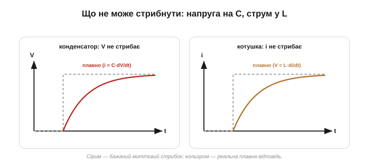
*Рис. 8.4.6. Дзеркало конденсатора. На конденсаторі не може стрибнути **напруга** (бо i = C·dV/dt), у котушці не може стрибнути **струм** (бо V = L·di/dt). Який би різкий не був перемикач, струм котушки повзе плавно — миттєвий стрибок вимагав би нескінченної напруги.*

Ця «незмінність умить» — те саме, що інерція маси: важкий маховик не розкрутити й не спинити вмить. Звідси й уся поведінка RL-кола.

Практично це означає, що котушка **згладжує** будь-який ривок струму: різкий стрибок напруги джерела вона перетворює на плавне наростання струму, а спробу різко обірвати струм — на сплеск напруги. Скрізь, де є котушка, струм поводиться інерційно, з «розгоном» і «вибігом», а не клацає миттєво. Ця інерційність буває і дуже корисною (згладжування пульсацій, м'який старт), і небезпечною (сплеск при обриві) — залежно від того, чи дали ми струмові куди подітися.

### Увімкнення: струм наростає

Зберімо найпростіше коло: джерело, резистор R і котушка L послідовно. Замкнімо вимикач. У перший момент струм був нульовий — і він **не може** стрибнути, тож лишається близьким до нуля. Уся напруга джерела при цьому падає на котушці (вона щосили опирається наростанню струму). Та потроху струм наростає; що більший він стає, то більша частина напруги припадає на резистор і то менша лишається котушці, — тож наростання сповільнюється. Зрештою струм виходить на сталий рівень **I = V/R**, коли вся напруга вже на резисторі, а на котушці — нуль (сталий струм, котушка як дріт, [§8.2](ch08-inductor.md)). Простежте за «передачею естафети»: на старті вся напруга на котушці, а струму нема; наприкінці вся напруга на резисторі, а струм повний. Котушка плавно «віддає» напругу резистору в міру того, як струм наростає. Це точне дзеркало конденсатора, де навпаки — напруга поступово переходила з резистора на конденсатор, поки спадав зарядний струм.


*Рис. 8.4.1. Резистор R і котушка L послідовно з джерелом. R обмежує кінцевий струм (I = V/R), а пара L і R задає, **як швидко** він установлюється. Окремий шлях (через діод чи резистор) потрібен, щоб струм мав куди податися при розмиканні (§8.5).*


*Рис. 8.4.2. Струм у котушці при вмиканні: круто росте спочатку, далі все повільніше, асимптотично наближаючись до I = V/R. За одну сталу часу досягає 63% кінцевого, за п'ять — практично всього. Дзеркало напруги на конденсаторі з §7.4.*

А що з напругою на котушці? Дзеркально до струму: на старті вона максимальна (вся напруга джерела), а в міру наростання струму спадає до нуля.


*Рис. 8.4.3. Напруга на котушці при вмиканні: найбільша в перший момент (струм рветься змінитися найшвидше), далі спадає за тією самою експонентою до нуля, коли струм установився. Точне дзеркало струму заряджання конденсатора.*

### Стала часу τ = L/R

Темп усього процесу задає **стала часу** RL-кола:

```
τ = L / R
```

Вона теж одразу виходить у **секундах**. Перевірмо: індуктивність у генрі (В·с/А), опір в омах (В/А):

```
[L/R] = (В·с/А) / (В/А) = с   ✓
```

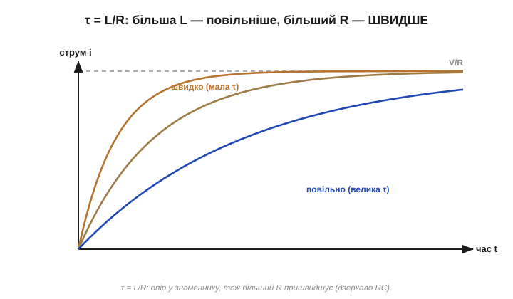
*Рис. 8.4.5. Стала часу RL. Більша індуктивність L — повільніше наростання (більша інерція). Але більший R — навпаки, **швидше**! Бо τ = L/R: опір у знаменнику. Це тонке дзеркало RC, де більший R **сповільнював** заряджання (там τ = R·C).*

Тут ховається тонка, але важлива відмінність від RC. У конденсатора більший резистор **сповільнював** процес (τ = R·C росте з R). У котушки більший резистор його **пришвидшує** (τ = L/R спадає з R). Інтуїція: більший опір швидше «гасить» струм до його кінцевого рівня — щоправда, і сам цей кінцевий рівень V/R стає меншим. Тобто «швидше» тут означає швидше дійти до **нового, меншого** усталеного струму, а не швидше набрати той самий струм: якщо вам потрібне конкретне значення струму, більший R його лише зменшить (а то й зробить недосяжним), хоч і встановиться воно хутчіше. Опір у RL-колі грає роль, дзеркальну до RC.

Чому так дзеркально? У RC резистор обмежує струм, яким **заряджається** конденсатор: більший R — менший зарядний струм — повільніше заповнення. У RL же кінцевого струму котушка досягає, коли вся напруга перейде на резистор; більший R «забирає» цю напругу раніше (менший кінцевий струм досягається швидше), тож і котушка встановлюється хутчіше. Корінь дзеркальності — у тому, що в RC ми ганяємо **заряд**, а в RL «розганяємо» **струм**, і резистор стоїть у цих двох процесах по-різному.

**Приклад (стала часу RL).** Котушка L = 10 мГн послідовно з резистором R = 10 Ом:

```
τ = L / R = (10 × 10⁻³ Гн) / (10 Ом) = 0.001 с = 1 мс
```

Одна мілісекунда: за 1 мс струм набере 63% кінцевого значення, а повністю встановиться (≈ 99%) приблизно за 5 мс. Якби той самий дросель стояв із меншим опором 1 Ом, стала часу зросла б до 10 мс — процес у десять разів повільніший (зате кінцевий струм був би в десять разів більший).

На практиці стала L/R зазвичай дуже мала — мікро- чи мілісекунди, бо індуктивності невеликі, а опори чималі. Тому в звичайних колах котушка «розганяє» струм майже миттєво, і RL-затримку помічають хіба що в потужних обмотках із малим опором (електромагніти, мотори, реле) або там, де її навмисне роблять великою. Це теж дзеркало: у RC легко дістати секунди (ємності й опори бувають великими), а в RL секунди — рідкість.

### Та сама експонента: 63% і правило 5τ

Закон наростання струму — зростальна експонента до кінцевого I = V/R:

```
i(t) = (V/R) · (1 − e^(−t/τ)),   τ = L/R
```

Це той самий вигляд, що й заряджання конденсатора, тож і знайома таблиця наближення тут чинна без змін:

```
за 1·τ  →  63%        за 4·τ  →  98%
за 2·τ  →  86%        за 5·τ  →  99% ≈ «повністю»
за 3·τ  →  95%
```

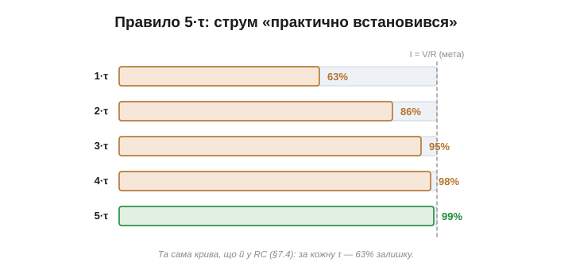
*Рис. 8.4.7. Та сама універсальна крива, що й у RC: за кожну сталу часу струм закриває 63% залишку до мети, а за **5·τ** доходить до 99% — це й беруть за «встановлено». Уся математика експоненти переноситься з §7.4 один в один.*

Причина експоненти — теж знайома: швидкість зміни струму пропорційна тому, скільки ще лишилося до кінцевого значення (велика різниця → велика напруга на котушці → швидка зміна), тож процес самоподібний і за кожну τ долає однакову частку залишку.

**Приклад (коли струм досягне рівня).** За τ = 1 мс струм набере 86% кінцевого за 2 мс, 95% — за 3 мс, а «практично весь» (99%) — за 5 мс. Якщо потрібно, скажімо, 90% — це приблизно 2.3·τ ≈ 2.3 мс (той самий зворотний відлік через τ·ln, що й у [§7.4](../ch07-capacitor/ch07-capacitor.md)). Таблиця читається прямо в мілісекундах, щойно відома τ = L/R.

### Вимкнення: струм спадає (і шукає шлях)

Тепер найцікавіше. Якщо в усталеному RL-колі замкнути котушку з резистором на петлю (а джерело від'єднати), струм почне спадати — теж за експонентою, з тією ж сталою L/R, віддаючи накопичену енергію поля в резистор:

```
i(t) = I₀ · e^(−t/τ)
```

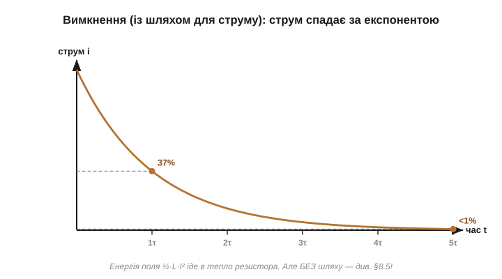
*Рис. 8.4.4. Якщо струму дати куди текти (петля з резистором), він спадає плавно за експонентою: за 1·τ лишається 37%, за 5·τ — майже нуль. Енергія поля ½·L·I² перетворюється на тепло в резисторі. Але якщо шляху НЕ дати — починається §8.5.*

Числа дзеркальні до розряду конденсатора: за 1·τ лишається 37%, за 5·τ — менш як 1%. Уся накопичена енергія поля ½·L·I² ([§8.3](ch08-inductor.md)) під час цього спаду перетворюється на тепло в резисторі — рівно як заряджений конденсатор віддавав ½·C·V² у свій розрядний резистор. Та є критичне «але». Усе це справедливо, **якщо струму є куди текти**. А коли ви просто **розриваєте** коло вимикачем, котушка опиняється без шляху для свого струму — і, обстоюючи його (струм не стрибає!), наводить скільки завгодно високу напругу, аж поки не проб'є повітря іскрою чи не спалить ключ. Це і є «брикання» котушки — тема [§8.5](ch08-inductor.md), куди ми зараз і йдемо.

> 🔧 **Навіщо це.** Стала L/R — це реальний годинник у багатьох вузлах. Реле спрацьовує й відпускає не миттєво, а за кілька L/R своєї обмотки, тож має відчутну затримку. Котушка запалювання навмисне накопичує струм, а потім різко його рве, щоб дати високовольтну іскру (це кероване «брикання» з [§8.5](ch08-inductor.md)). А плавне наростання струму через дросель рятує живлення від кидків струму при ввімкненні. Загальне правило: хочете швидшого встановлення — більший послідовний опір (менша τ); хочете згладити різкі зміни — більша індуктивність.

### Дзеркало RC

Зведімо перехідні процеси обох компонентів поруч — половину з цього ви вже знаєте з [§7.4](../ch07-capacitor/ch07-capacitor.md).

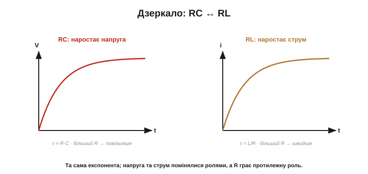
*Рис. 8.4.8. RC: не стрибає напруга, вона наростає до V зі сталою τ = R·C; більший R — повільніше. RL: не стрибає струм, він наростає до V/R зі сталою τ = L/R; більший R — швидше. Та сама експонента, ті самі 63% і 5τ — лише напруга та струм помінялися ролями, а R грає протилежну роль.*

Ця дзеркальність — не випадковість, а наслідок глибокої двоїстості з [§8.2](ch08-inductor.md). Кожне твердження про RC має близнюка про RL: «напруга на конденсаторі неперервна» ↔ «струм у котушці неперервний»; «конденсатор заряджається струмом, що спадає» ↔ «у котушці наростає струм, поки спадає напруга на ній»; «за 5·τ практично готово» — однаково для обох. Засвоївши одне коло, ви фактично знаєте й друге.

**Приклад (час vs кінцевий струм).** Хочемо швидкого встановлення струму — беремо більший R (мала τ = L/R), але миримося з меншим кінцевим струмом V/R. Хочемо більшого струму — менший R, та чекаємо довше. Цей компроміс між швидкістю й рівнем — дзеркало того, як у RC більший R давав повільніше заряджання, але не міняв кінцевої напруги. Деталі завжди підказує τ = L/R.

Підсумуймо. У RL-колі **струм не стрибає**: він наростає до V/R (і спадає) за **експонентою** зі сталою часу **τ = L/R**. За одну τ долається 63% шляху, за 5·τ процес практично завершено — та сама математика, що й у RC. Тонка відмінність: більший опір тут **пришвидшує** установлення (бо R у знаменнику), а не сповільнює. Цю інерційність струму інженер використовує на свою користь — для згладжування пульсацій і м'якого старту, — а там, де вона небезпечна, мусить її приборкувати. І головне практичне попередження: якщо при вимкненні струму не дати йому шляху, котушка відповість небезпечним сплеском напруги, бо струм не може зникнути вмить. Саме цей сплеск — «брикання» котушки — ми тепер і розберемо детально: чим він небезпечний і як його приборкати.

---

## 8.5 «Брикання» котушки: викиди напруги при комутації

Це найпрактичніша тема всього розділу — і найчастіша причина загадкових поломок у схемах із котушками, реле й моторами. Ми вже знаємо все потрібне: котушка опирається зміні струму (V = L·di/dt, [§8.2](ch08-inductor.md)), струм у ній не стрибає ([§8.4](ch08-inductor.md)), а в полі захована енергія ½·L·I² ([§8.3](ch08-inductor.md)). Зведімо це докупи й подивімося, що буде, коли струм котушки **різко обірвати** — і як це приборкати. Той самий сплеск, що колись ударив Генрі (історія розділу), тепер або псуватиме ваші схеми, або служитиме вам — залежно від того, чи розумієте ви його. І знову нічого нового вигадувати не доведеться: ми лише складемо разом три вже відомі факти про котушку й побачимо, як із них випливає і небезпека, і її ліки.

### Звідки сплеск: di/dt і незмінність струму

Уявімо звичну ситуацію: ключ (вимикач чи транзистор) подає струм у котушку — обмотку реле, соленоїд, мотор. Тече струм I, у полі сидить запас ½·L·I². Тепер ключ **розмикається**. Котушка, обстоюючи свій струм (він не може стрибнути до нуля), наводить напругу V = L·di/dt. А оскільки розмикання дуже швидке, di/dt **колосальне** — і напруга підскакує до сотень чи тисяч вольтів, хоч живлення було лише кілька вольтів.

Зверніть увагу на **полярність** сплеску. Поки ключ був замкнений, один кінець котушки сидів на живленні, інший — на ключі. У мить розмикання котушка, аби втримати струм у тому самому напрямку, **перевертає** свою напругу: тепер вона додається до живлення й женеться вгору. Тому точка, що була біля ключа, злітає до сотень вольтів — і весь цей перепад лягає саме на щойно розімкнений ключ. Сплеск завжди б'є по тому, хто обірвав струм.

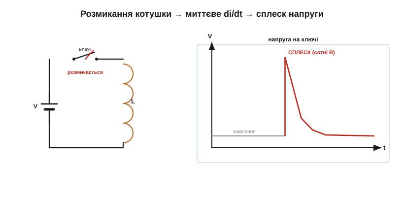
*Рис. 8.5.1. Поки ключ замкнений — тече струм I. Розмикаємо: струм рветься зникнути за мікросекунди, di/dt величезне, і котушка наводить сплеск V = L·di/dt у сотні вольтів. Полярність — така, щоб проштовхнути струм далі: напруга «перевертається» й додається до живлення.*

**Приклад (величина сплеску).** Реле зі струмом I = 1 А й індуктивністю L = 100 мГн; ключ обриває струм за ≈ 1 мкс:

```
di/dt = 1 А / (1×10⁻⁶ с) = 1 000 000 А/с
V = L · (di/dt) = 0.1 Гн · 10⁶ А/с = 100 000 В (!)
```

Сто тисяч вольтів від 12-вольтового реле — звісно, насправді стільки не виходить, бо напруга підскакує лише доти, доки не знайде, куди скинути струм: проб'є повітряний проміжок ключа іскрою або проколе сам ключ. Але порядок показує, **наскільки** відчайдушно котушка тримається за струм.

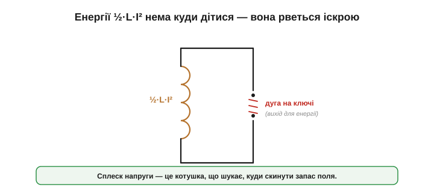
*Рис. 8.5.2. Енергетичний бік (з §8.3): у полі сидить ½·L·I². При обриві без шляху для струму вся ця енергія мусить вийти за мікросекунди — і проривається іскрою/дугою на ключі. Сплеск напруги — це котушка, що шукає, куди подіти свій запас.*

Цей сплеск ви бачили не раз у побуті: блакитна іскра в розетці, коли висмикуєте ввімкнений пилосос чи дриль, — це «брикання» їхніх моторів-котушок. Та сама фізика, лише на мережевій напрузі: обмотка не хоче відпускати струм і пробиває розширюваний проміжок між контактами вилки. У слабкій електроніці така ж іскра непомітна оку, зате легко вбиває напівпровідниковий ключ.

### Чим він небезпечний

Цей сплеск — справжній убивця електроніки. По-перше, він **випалює механічні контакти**: іскра при кожному розмиканні реле чи вимикача поступово випалює й окислює контакти, аж поки вони не перестануть проводити. По-друге, і головне в сучасних схемах, він **пробиває напівпровідниковий ключ**. Коли котушкою керує транзистор (детально про транзистори — Розділи 11–12), сплеск у сотні вольтів перевищує його допустиму напругу — і пробиває його наскрізь, миттєво й безповоротно.

Підступність у тому, що сплеск **сам себе** робить рівно таким, щоб пробити найслабшу ланку: котушка піднімає напругу, доки не знайде, куди скинути струм. Якщо найслабше місце — повітряний проміжок контактів, буде іскра; якщо транзистор — станеться його лавинний пробій. Тому навіть транзистор «із запасом» за напругою не рятує: котушка легко перевищить будь-який розумний запас, якщо їй не дати іншого виходу. Боротися треба не запасом міцності ключа, а **шляхом для струму**.

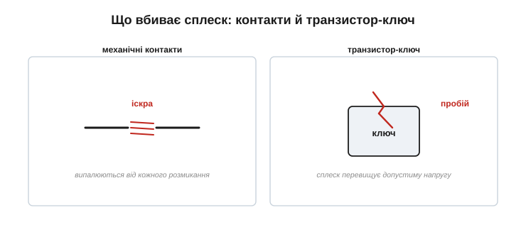
*Рис. 8.5.3. Дві жертви «брикання». Механічні контакти — іскра при розмиканні поступово їх випалює. Транзистор-ключ — сплеск перевищує його гранично допустиму напругу й пробиває наскрізь. Класична причина, чому «згорів транзистор, що керував реле».*

> 🔧 **Навіщо це.** Це чи не найпоширеніша пастка для початківця: зібрав схему, де мікроконтролер через транзистор керує реле чи мотором, усе начебто правильно — а транзистор згорає за кілька вмикань. Винен сплеск котушки. Запам'ятайте залізне правило: **будь-яке індуктивне навантаження (реле, соленоїд, мотор, обмотка), яким керує електронний ключ, потребує захисту від сплеску.** Без нього ключ — приречений.

### Приборкання: дати струму шлях (flyback-діод)

Розв'язок випливає прямо з [§8.4](ch08-inductor.md): сплеску не буде, якщо **дати струмові куди текти** при розмиканні. Найпростіше — поставити **односпрямований клапан** паралельно котушці так, щоб у звичайній роботі він струму не пропускав, а в мить розмикання — замкнув котушку саму на себе. Цей клапан називають **зворотним (flyback) діодом** (*flyback / freewheeling diode*). Як саме одностороння провідність улаштована всередині — це діод із [Розділу 10](../ch10-diode-pn-junction/ch10-diode-pn-junction.md); тут нам важлива його **роль**: пропускати струм лише в той бік, у який його штовхає сплеск.

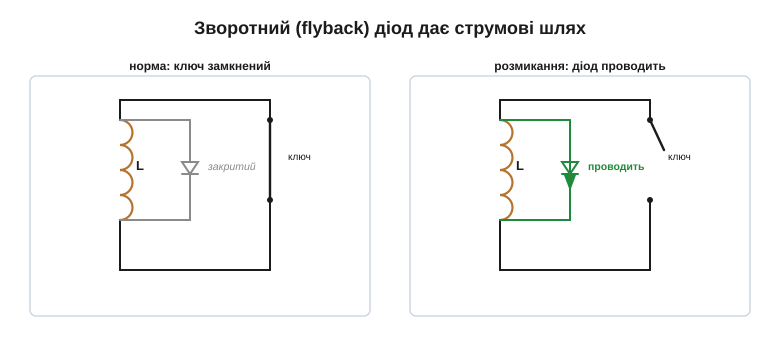
*Рис. 8.5.4. Зворотний діод паралельно котушці. У звичайній роботі (ключ замкнений) він увімкнений «проти» струму й не проводить — котушка живиться нормально. У мить розмикання котушка наводить зворотну напругу, діод відкривається й замикає струм у петлю «котушка–діод», де той спокійно згасає.*

Тепер при розмиканні струм не обривається, а плавно **циркулює** крізь діод і згасає за знайомою сталою L/R ([§8.4](ch08-inductor.md)), віддаючи енергію ½·L·I² потроху, а не вибухом. Напруга на ключі при цьому не перевищує живлення більш ніж на падіння діода (≈ 0.7 В) — замість сотень вольтів. Ключ урятовано.

Цей режим так і звуть — **вільне обертання струму** (*freewheeling*): струм, мов маховик за інерцією, докручується крізь діод, поки «тертя» (опір кола) його не спинить. Діод беруть на повний струм навантаження. А ось наскільки **швидкий** — залежить від задачі: для реле чи соленоїда, що перемикаються повільно, цілком досить звичайного випрямного діода (як-от 1N4001); швидкий або Шотткі потрібен лише там, де котушку рвуть часто й різко — у ШІМ-драйверах моторів, імпульсних перетворювачах, на високих частотах.

**Приклад (захищений випадок).** Те саме реле (L = 100 мГн, I = 1 А, опір обмотки R = 12 Ом) зі зворотним діодом. Замість 100-кіловольтового сплеску напруга на ключі тепер лише ≈ живлення + 0.7 В. Струм згасає за сталою τ = L/R = 0.1 / 12 ≈ 8 мс, тобто практично зникає за ≈ 40 мс (5·τ). Реле відпускає на ці 40 мс повільніше — невелика ціна за врятований ключ. Хочете швидше — потрібен клапан із вищим клампом (нижче).

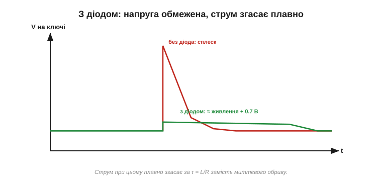
*Рис. 8.5.5. Без діода (червоне) — гострий сплеск у сотні вольтів. З діодом (зелене) — напруга обмежена живленням плюс ≈ 0.7 В, а струм плавно згасає за L/R. Енергія поля йде в тепло поступово, а не пробиває ключ.*

> 🔧 **Навіщо це.** Зворотний діод паралельно котушці реле чи мотора — це обов'язковий, копійчаний елемент будь-якої схеми керування індуктивним навантаженням. Полярність критична: у нормальному струмі діод має бути закритий, відкриватися лише для сплеску. Поставите його правильно — і транзистор живе роками; забудете — згорить. Багато готових драйверів і реле вже мають вбудований такий діод саме з цієї причини. І навпаки: побачивши на чужій схемі діод, увімкнений «навпаки» паралельно обмотці, знайте — це не помилка, а захист від «брикання».

### Інші приборкувачі та компроміс

Простий діод має одну ваду: він тримає струм майже без опору, тож той згасає **повільно** (велика L/R), а це затримує, скажімо, відпускання реле. Тому є й інші приборкувачі, кожен зі своїм компромісом:

- **Стабілітрон (Zener) або супресор (TVS)** паралельно котушці чи ключу: вони **обмежують** (клампують) напругу на вищому, але безпечному рівні (скажімо, 30–60 В). Струм при цьому згасає **швидше**, бо котушка віддає енергію проти більшої напруги. Що таке стабілітрон — окрема тема [§10.8](../ch10-diode-pn-junction/ch10-diode-pn-junction.md); тут важливо, що це керований клапан-обмежувач.
- **RC-снабер** (*snubber*) — конденсатор із резистором паралельно ключу: конденсатор приймає енергію сплеску (згадаймо, він любить зміну напруги, [§7.1](../ch07-capacitor/ch07-capacitor.md)), а резистор гасить дзвін. Застосовують там, де простий діод не годиться (зокрема в колах змінного струму).

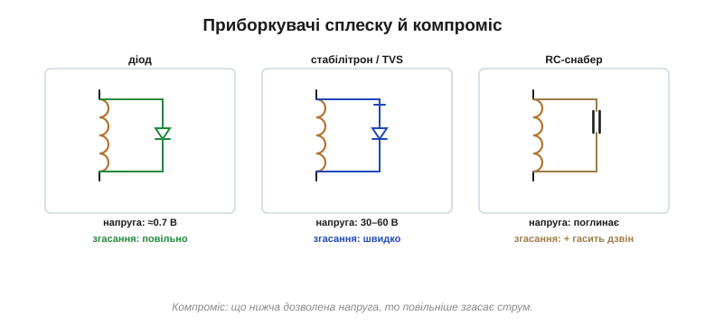
*Рис. 8.5.6. Три способи приборкати сплеск. Простий діод — найнижча напруга (≈ 0.7 В над живленням), але найповільніше згасання. Стабілітрон/TVS — вища напруга клампа, зате швидке згасання. RC-снабер — поглинає й гасить дзвін. Компроміс: що нижча дозволена напруга, то повільніше згасає струм.*

Чому стабілітрон згасає швидше? Із [§8.4](ch08-inductor.md): швидкість спаду струму задає напруга, проти якої він тече. Простий діод тримає лише ≈ 0.7 В, тож di/dt малий — струм згасає мляво. Стабілітрон тримає, скажімо, 40 В — у десятки разів більша «гальмівна» напруга, отже, у десятки разів швидше згасання струму (і поля). Платою є те, що ключ мусить витримувати ці 40 В. Звідси й правило: дозволь котушці вищу напругу — і вона швидше віддасть свою енергію.

Вибір залежить від задачі: для реле, де байдужа швидкість, — простий діод; для швидких ключів і моторів, де важлива швидкість згасання, — стабілітрон чи TVS; для змінного струму — снабер. Якщо сумніваєтесь, для звичайного навантаження постійного струму простий зворотний діод — майже завжди безпечний вибір за замовчуванням; складніші приборкувачі ставлять лише там, де простий діод не задовольняє за швидкістю чи типом струму.

### Корисний бік: коли сплеск потрібен

Сплеск котушки — не лише біда. Та сама фізика «обірвав струм → дістав високу напругу» лежить в основі цілого класу пристроїв, де її використовують **навмисне**.

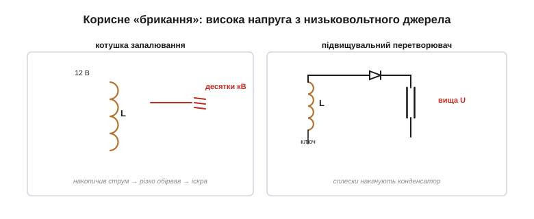
*Рис. 8.5.7. Корисне «брикання». Котушка запалювання: накопичує струм від 12 В і різко рве його, даючи десятки кіловольтів на свічку. Підвищувальний (boost) перетворювач: ключ ритмічно перериває струм дроселя, і сплески накачують вищу напругу. Та сама фізика V = L·di/dt — лише прирученою.*

У підвищувальному перетворювачі це роблять ритмічно, тисячі разів на секунду: ключ накопичує струм у дроселі, тоді перериває його — і кожен сплеск через діод «перекачує» порцію енергії в конденсатор на виході, піднімаючи там напругу вище за вхідну. Котушка стає **насосом енергії**: бере її порціями з низьковольтного джерела й складає під вищою напругою. Те саме «брикання», яким реле вбивало транзистор, тут свідомо поставлене на службу.

> 🔧 **Навіщо це.** Котушка запалювання авто, електрична «мухобійка», електропастух, газова запальничка-п'єзо (ні, та інша — але індукційні теж є) і, найважливіше, **підвищувальні перетворювачі живлення** — усі вони добувають високу напругу, ритмічно перериваючи струм у котушці. Тобто інженер то приборкує сплеск діодом, то навпаки — плекає його. Як на цьому будують перетворювачі напруги, побачимо в системному розділі про живлення (Модуль 7); там котушка, ключ і діод разом творять майже всю сучасну силову електроніку.

Підсумуймо. Різкий обрив струму котушки дає **сплеск напруги** V = L·di/dt у сотні-тисячі вольтів, бо струм не може зникнути вмить, а енергії ½·L·I² треба кудись подітися. Цей сплеск **випалює контакти й пробиває ключі**, тож індуктивне навантаження завжди захищають — найчастіше **зворотним діодом**, що дає струмові плавно згаснути; для швидкості беруть стабілітрон/TVS, для змінного струму — снабер. А приручений, той самий сплеск служить у системах запалювання й перетворювачах напруги. Так одне й те саме явище буває то ворогом, якого приборкують діодом, то інструментом, який плекають, — і різниця лише в тому, дали ви струмові потрібний шлях чи ні. Лишилося розглянути, що буває, коли поле однієї котушки наводить струм в **іншій**, — і так ми приходимо до взаємоіндукції й трансформатора.

---

## 8.6 Взаємоіндукція й трансформація

Досі котушка реагувала на власну зміну струму — самоіндукція. Та поле котушки сягає простору навколо неї, і якщо поруч є **друга** котушка, змінне поле першої наведе напругу й у ній. Це **взаємоіндукція**, і на ній стоїть один із найважливіших винаходів електротехніки — **трансформатор**, прилад, що передає енергію з кола в коло без жодного дроту між ними й попутно змінює напругу. Саме він колись вирішив «війну струмів» на користь змінного (історія далі). Розберімо його принцип — якісно, але до самої суті. І знову вся потрібна фізика вже в руках: зміна поля наводить напругу (Фарадей), осердя проводить потік ([§8.1](ch08-inductor.md)), енергія зберігається ([§3.5](../../block-1-circuits-physics/ch03-resistance-power-heat/ch03-resistance-power-heat.md)). Лишається скласти це докупи.

> 📜 **Історія до теми:** [трансформатор і перемога змінного струму](ch08-s6-history-transformer.md) — як здатність легко міняти напругу зробила змінний струм переможцем над постійним.

### Взаємоіндукція: одна котушка наводить напругу в іншій

Поставмо дві котушки поруч. Пустимо в першу (**первинну**) змінний струм — її поле теж змінюється. Якщо це змінне поле пронизує другу (**вторинну**) котушку, то, за законом Фарадея (історія розділу), у ній наводиться напруга. Одна котушка «розмовляє» з іншою через спільне магнітне поле, без електричного контакту. Це і є **взаємоіндукція** (*mutual induction*); її міру — наскільки добре поле однієї котушки пронизує іншу — звуть **взаємною індуктивністю** M.

По суті трансформатор — це **дві котушки, навмисне зв'язані** так, щоб поле однієї якнайповніше пронизувало іншу. Якщо самоіндукція з [§8.2](ch08-inductor.md) описувала, як котушка діє сама на себе (через L), то взаємоіндукція M описує, як вона діє на сусідку. Що тісніше вони зв'язані — спільне осердя, близьке розташування, — то більша M і то ефективніша передача.

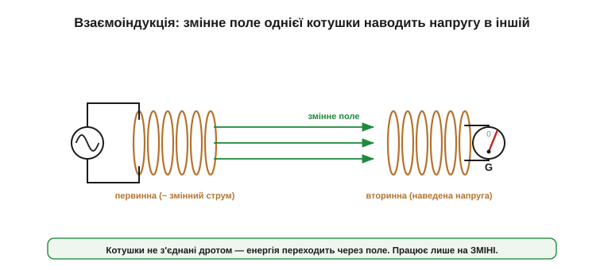
*Рис. 8.6.1. Змінний струм у первинній котушці робить змінне поле; те пронизує вторинну котушку й наводить у ній напругу (Фарадей). Котушки не з'єднані дротом — енергія переходить **через поле**. Ключове слово — «змінне»: сталий струм поля не міняв би, і вторинна мовчала б.*

### Трансформатор: дві обмотки на спільному осерді

Щоб передача була ефективною, обидві котушки намотують на **спільне осердя** (замкнене кільце чи рамку із заліза або фериту). Осердя збирає майже все поле первинної обмотки й проводить його крізь вторинну — адже магнітні лінії й так прагнуть замкнутися по залізу ([§8.1](ch08-inductor.md)). Так виходить **трансформатор**: первинна обмотка, вторинна обмотка й осердя, що їх магнітно зв'язує.

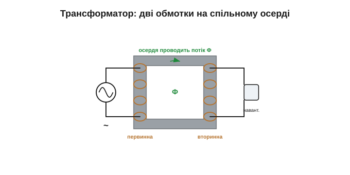
*Рис. 8.6.2. Трансформатор. Змінний струм у первинній обмотці робить змінний потік; замкнене осердя проводить його крізь вторинну, наводячи в ній напругу. Обмотки електрично роз'єднані — їх зв'язує лише потік в осерді. Наскільки добре — задає коефіцієнт зв'язку k (в ідеалі ≈ 1).*

Наскільки добре потік первинної обмотки доходить до вторинної, описує **коефіцієнт зв'язку** k: близький до 1 у тісно зв'язаних обмоток на доброму осерді й менший, коли частина поля «тікає» повз вторинну (потік розсіювання). Добрий трансформатор прагне k якомога ближчого до одиниці.

Як саме енергія переходить із кола в коло? Спільний потік в осерді наводить напругу у вторинній обмотці. Щойно до неї під'єднують навантаження, у вторинній тече струм — і той за законом Ленца ([§8.2](ch08-inductor.md)) намагається **погасити** спільний потік. Первинна обмотка це «відчуває» (потік просів) і бере з джерела більше струму, щоб потік відновити. Так навантаження на виході автоматично «замовляє» рівно стільки потужності на вході, скільки споживає: енергія перетікає крізь поле саме туди, де її беруть. Не навантажений трансформатор бере лише невеликий **намагнічувальний** струм (на підтримку потоку в осерді) плюс трохи на власні втрати в осерді — тобто майже не бере, але й не «зовсім нуль».

### Чому трансформатор живе тільки на змінному струмі

Ось найважливіше, що варто винести з цієї теми. Наводить напругу лише **зміна** потоку. Тож якщо в первинну обмотку пустити **сталий** (постійний) струм, потік буде сталий, його зміна — нуль, і у вторинній обмотці в усталеному режимі **не наведеться нічого**. (Самі **миті** вмикання й вимикання — це ж зміна потоку, тож вони дають у вторинній короткі поодинокі імпульси; але поки струм тече рівно — тиша.) Гірше того: сталий струм у первинній нічим, окрім малого опору обмотки, не обмежений — тож буває **великим**, марно гріє мідь і ще й заганяє осердя в насичення. Тому трансформатор передає лише **змінний** струм, а постійного «не любить» удвічі.

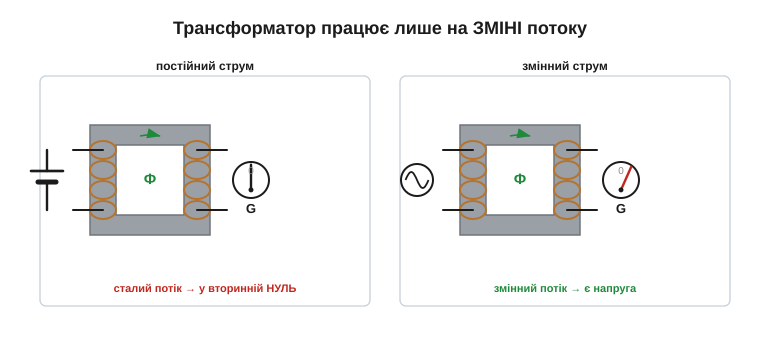
*Рис. 8.6.3. Постійний струм у первинній → сталий потік → у вторинній нуль. Змінний струм → потік весь час міняється → у вторинній наводиться напруга. Трансформатор за самою своєю природою працює лише зі **зміною** — тобто зі змінним струмом.*

Звідси важливий наслідок для практики: щоб передати трансформатором енергію **постійного** джерела (батареї чи випрямленої мережі), її спершу перетворюють на змінну — електронний ключ ритмічно вмикає й вимикає струм первинної обмотки. Саме так влаштовані **імпульсні** блоки живлення: вони «рубають» постійний струм на високочастотний змінний, проганяють крізь маленький трансформатор, а тоді знову випрямляють. Сам по собі трансформатор постійного струму не визнає.

> 🔧 **Навіщо це.** Саме ця властивість колись вирішила «війну струмів» (історія до теми): постійний струм Едісона не можна було легко перетворити на іншу напругу, а змінний — можна, трансформатором, майже без втрат. Це дозволило передавати енергію на сотні кілометрів під дуже високою напругою (де втрати малі), а біля споживача знижувати її до безпечної. Через те весь світ і живиться змінним струмом. А ще звідси випливає: щоб трансформатором передати енергію постійного джерела, її спершу «нарубують» на змінну (ключем) — на цьому стоять імпульсні блоки живлення.

### Співвідношення витків

Трансформатор не лише передає енергію, а й **змінює напругу** — у стільки разів, у скільки відрізняються кількості витків обмоток. Це **співвідношення витків**:

```
V_вторинна / V_первинна = N_вторинна / N_первинна
```

Більше витків у вторинній — напруга **підвищується** (підвищувальний трансформатор); менше — **знижується** (знижувальний). Усе тому, що наведена напруга пропорційна числу витків, які пронизує спільний потік.

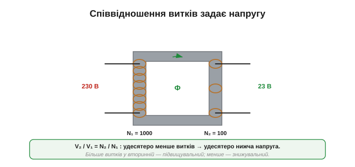
*Рис. 8.6.4. Той самий потік пронизує обидві обмотки. Якщо у вторинній удесятеро менше витків — напруга на ній удесятеро менша (знижувальний). Більше витків — вища напруга (підвищувальний). Напругу задає просте відношення чисел витків.*

**Приклад (знижувальний трансформатор).** Первинна обмотка на 230 В має 1000 витків, вторинна — 100 витків:

```
V_вторинна = V_первинна · (N_вторинна / N_первинна)
V_вторинна = 230 В · (100 / 1000) = 23 В
```

Удесятеро менше витків — удесятеро нижча напруга. Так із мережевих 230 В роблять безпечні 23 В. Зверніть увагу: відношення витків задає лише **напругу**; струм же визначиться навантаженням і збереженням потужності (далі). Підвищувальний трансформатор підіймає напругу ціною струму, знижувальний — навпаки, віддає більший струм за нижчої напруги.

### Енергію задарма не дають: V·I зберігається

Трансформатор змінює напругу — але не створює енергії. В ідеальному трансформаторі потужність на вході дорівнює потужності на виході (P = V·I, [§3.5](../../block-1-circuits-physics/ch03-resistance-power-heat/ch03-resistance-power-heat.md)). А отже, якщо напруга **підвищилась**, то струм у стільки ж разів **зменшився**, і навпаки:

```
V_первинна · I_первинна = V_вторинна · I_вторинна
```

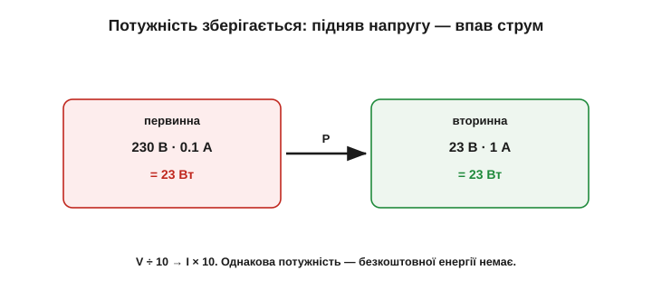
*Рис. 8.6.5. Трансформатор «обмінює» напругу на струм за сталої потужності. Підвищив напругу вдесятеро — струм упав удесятеро (і навпаки). Безкоштовної енергії немає: скільки потужності зайшло, стільки й вийшло (мінус невеликі втрати).*

**Приклад (обмін напруги на струм).** Той самий знижувальний трансформатор: на вході 230 В і 0.1 А, тобто P = 23 Вт. На виході 23 В, тож струм:

```
I_вторинна = P / V_вторинна = 23 Вт / 23 В = 1 А
```

Напруга впала вдесятеро (230 → 23 В) — струм виріс удесятеро (0.1 → 1 А). Потужність незмінна.

Цей обмін напруги на струм — основа всієї енергетики. Електростанція через підвищувальний трансформатор віддає енергію в лінію під сотнями тисяч вольтів: за тієї самої потужності струм у проводах малий, а втрати на їхній нагрів (I²R, [§3.6](../../block-1-circuits-physics/ch03-resistance-power-heat/ch03-resistance-power-heat.md)) — мізерні. Біля міста знижувальні трансформатори поетапно опускають напругу до безпечних 230 В. Без трансформатора передавати енергію на сотні кілометрів було б неможливо — майже все пішло б у тепло дротів. Саме тому світ обрав змінний струм.

### Гальванічна розв'язка

Є в трансформатора й друга цінна якість, що випливає з відсутності електричного контакту між обмотками. Енергія переходить **лише через поле**, тож між первинним і вторинним колами немає прямого провідного шляху. Це **гальванічна розв'язка** (*galvanic isolation*).

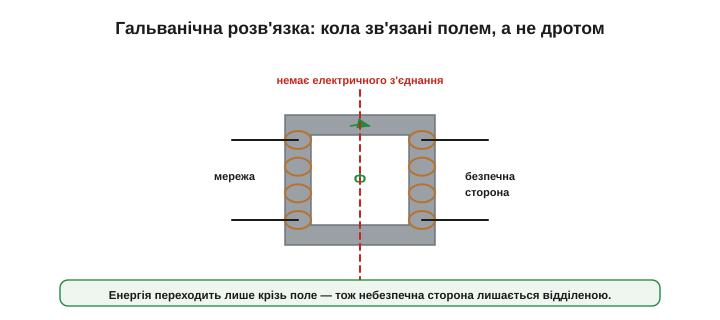
*Рис. 8.6.6. Між первинним і вторинним колами немає електричного з'єднання — лише магнітний зв'язок крізь осердя. Тому небезпечна мережева сторона лишається «по той бік», а вторинне коло можна зробити безпечним і незалежним від землі мережі.*

> 🔧 **Навіщо це.** Розв'язка — важлива складова безпеки. Трансформатор у блоці живлення розриває прямий провідний шлях від мережі до вторинного кола: ви не отримаєте мережевого потенціалу **крізь трансформатор**, і це справді рятує життя (на тому ж принципі — ізоляційні трансформатори в медтехніці й розв'язувальні бар'єри). Але розв'язка **не робить вторинний бік автоматично безпечним**: там теж може бути висока напруга чи чималий запас енергії, один його полюс часто навмисне заземлюють, а на високих частотах лишаються паразитна ємність і витоки. Тож «гальванічно розв'язано» означає «нема прямого кола до мережі», а не «можна сміливо хапатися руками».

### Реальний трансформатор не ідеальний

Усе вище — про ідеальний трансформатор. Справжній має втрати, через які виходить трохи менше потужності, ніж зайшло. По-перше, обмотки з міді мають опір і гріються (I²R) — це «мідні» втрати. По-друге, гріється саме осердя, від двох явищ: **вихрових струмів** (змінне поле наводить струми в металі осердя — тому осердя роблять із тонких ізольованих пластин або з фериту, щоб ці струми приборкати) і **перемагнічування** (домени з [§8.1](ch08-inductor.md) щоразу перевертаються не без «тертя»). По-третє, не весь потік доходить до вторинної — частина «тікає» повз неї (потік розсіювання, k < 1). Тому ККД реального трансформатора хоч і високий (часто 95–99%), та не стовідсотковий, і під навантаженням деталь відчутно теплішає.

### Навіщо трансформатори

Зведімо застосування. Трансформатор робить три речі: **змінює напругу**, **розв'язує** кола й (рідше) **узгоджує** опори.

Трансформатори трапляються всюди, де є змінний струм: від мережевих підстанцій (сотні тисяч вольтів) до зарядки телефона (одиниці вольтів), від зварювальних апаратів (низька напруга, величезний струм) до аудіотехніки й високовольтних блоків.

Про третю, тоншу роль варто сказати окремо. Оскільки трансформатор міняє і напругу, і струм, він міняє й їхнє відношення — тобто **«видимий» опір** навантаження з боку первинної обмотки (він масштабується квадратом відношення витків). Це використовують для **узгодження опорів**: наприклад, щоб низькоомний динамік «здавався» підсилювачу зручнішим навантаженням. Докладніше про опір у колах змінного струму — [Розділ 9](ch08-inductor.md); тут досить знати, що трансформатор уміє й це.

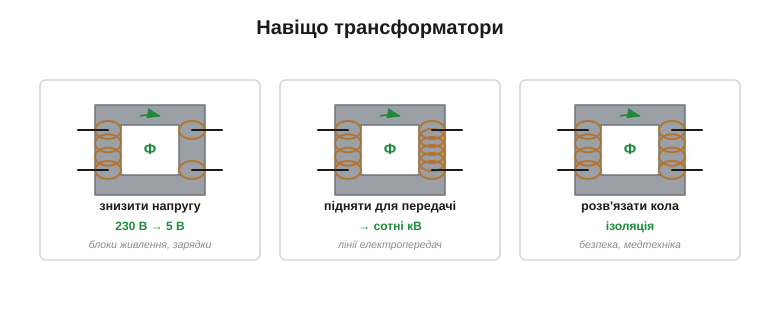
*Рис. 8.6.7. Головні ролі: знизити мережеву напругу до робочої (блоки живлення, зарядки); підняти напругу для передачі енергії на відстань; гальванічно розв'язати небезпечну й безпечну сторони. В імпульсних блоках живлення трансформатор працює на високій частоті, тож стає крихітним.*

> 🔧 **Навіщо це.** Класичний «важкий» трансформатор на залізному осерді ви бачили в старих зарядках і блоках живлення. У сучасних — він теж є, але крихітний і на феритовому осерді, бо працює на високій частоті (десятки-сотні кГц): що частіше міняється потік, то більша наведена напруга за тих самих витків, тож і осердя потрібне менше. Чому саме частота так впливає — це вже частотний погляд [Розділу 9](ch08-inductor.md); тут досить знати, що високочастотний трансформатор робить сучасні зарядки маленькими.

Підсумуймо. **Взаємоіндукція** — змінне поле однієї котушки наводить напругу в іншій; на ній стоїть **трансформатор**: дві обмотки на спільному осерді передають енергію **через поле**, без дроту. Він працює лише на **змінному** струмі (бо наводить лише зміна потоку), **змінює напругу** за відношенням витків, **зберігає потужність** (підняв напругу — впав струм) і дає **гальванічну розв'язку**. Це робить його незамінним у живленні, передачі енергії та безпеці. Найглибше, що варто винести: трансформатор передає лише **зміну** — і саме ця прискіпливість до зміни, спільна для всієї котушкової фізики, зробила змінний струм основою світової енергетики. Лишилося оглянути, які взагалі бувають котушки й де їх застосовують, — і на цьому закрити розділ.

---

## 8.7 Типи й застосування котушок

Фізику котушки ми вже знаємо досконало. Лишилось познайомитися з нею як із **реальною деталлю**: які бувають котушки, які в них вади поза ідеалом і де їх шукати на платі. Це дзеркало того, що ми робили для конденсатора в [§7.5](../ch07-capacitor/ch07-capacitor.md)–[§7.6](../ch07-capacitor/ch07-capacitor.md), — і так само корисно для практики, бо обрати чи впізнати котушку треба вміти не гірше, ніж конденсатор. Дзеркальність триває й тут: де в конденсатора були ESR, гранична напруга й тип діелектрика, у котушки будуть опір обмотки, струм насичення й тип осердя.

### Типи за будовою й осердям

Котушки різняться передусім **осердям** — саме воно задає, скільки індуктивності вміститься в деталь і як вона поводиться (з [§8.1](ch08-inductor.md): осердя множить L, але насичується).

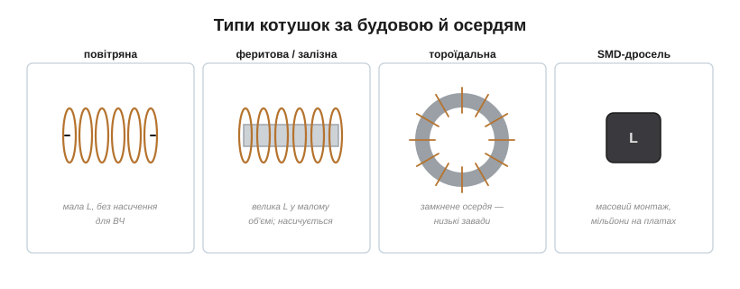
*Рис. 8.7.1. Повітряна (без осердя) — мала L, зате стабільна й без насичення, для високих частот. Феритова/залізна — велика L у малому об'ємі, для живлення й фільтрів. Тороїдальна (кільце) — замкнене осердя майже не випромінює поле назовні, низькі завади. Дрібна SMD-котушка — масовий дросель для плат.*

Коротко про головні родини. **Повітряна** котушка (без осердя) має малу індуктивність, зате не насичується й не має втрат **в осерді** (його просто нема) — її стихія радіочастоти. (Зовсім без втрат вона, звісно, не буває: лишаються опір міді, скін- і проксиміті-ефекти на ВЧ, паразитна ємність і випромінювання поля назовні.) **Феритова** й **залізна** дають велику L у малому об'ємі — для живлення, фільтрів, дроселів. **Тороїдальна** (намотана на кільце) тримає майже все поле в замкненому осерді, тож майже не випромінює завад назовні й не ловить їх — улюблениця якісного живлення. А **SMD-дроселі** — крихітні котушки в корпусі для поверхневого монтажу — стоять мільйонами в кожному гаджеті.

Котушки бувають **екранованими** (осердя оточує обмотку й майже не випускає поле — менше завад сусідам) і **неекранованими** (дешевші, та «світять» полем навколо). Є й **підлаштовувані**: у них осердя можна вкручувати, змінюючи L, — так колись налаштовували радіоприймачі на станцію. Та найчастіше індуктивність фіксована, як номінал резистора, і просто написана на корпусі чи задана кодом. За технологією розрізняють **намотані** (дріт на каркасі — точні, потужні) і **пресовані/багатошарові** (металевий порошок з обмоткою всередині — дешеві, дрібні, для масового монтажу). Як і з конденсаторами, тип підказує, для чого деталь призначена.

### Реальна котушка: опір і паразитна ємність

Як і конденсатор, реальна котушка — це не чиста індуктивність. До неї додаються дві головні вади.

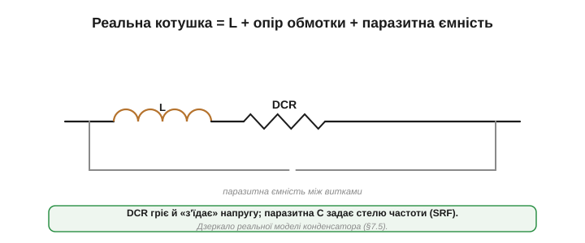
*Рис. 8.7.2. Реальна котушка: ідеальна L, послідовно з нею — **опір обмотки** (DCR, бо дріт мідний і має опір), а паралельно — **паразитна ємність** між сусідніми витками. Дзеркало реальної моделі конденсатора (§7.5), лише вади інші.*

По-перше, обмотка з міді має **опір** (його звуть DCR — опір постійному струму). Він гріється під струмом (I²R, [§3.6](../../block-1-circuits-physics/ch03-resistance-power-heat/ch03-resistance-power-heat.md)) і псує ідеальність котушки. По-друге, сусідні витки розділені тонким ізолятором — а отже, між ними є **паразитна ємність** (так, та сама ємність із [Розділу 7](../ch07-capacitor/ch07-capacitor.md): два провідники з ізолятором). Зазвичай вона крихітна, та на високих частотах стає вирішальною.

> 🔧 **Навіщо це.** DCR — перше, на що дивляться в дроселі живлення: великий струм на ньому гріє котушку й «з'їдає» напругу. Тому силові дроселі мотають товстим дротом (малий DCR). А паразитна ємність між витками — причина, чому котушка на дуже високих частотах перестає бути котушкою (нижче).

Якість котушки часто описують одним числом — **добротністю** Q: грубо, це відношення «корисної» індуктивної дії до «шкідливих» втрат в опорі. Висока Q означає малі втрати — і це критично для радіочастотних **контурів**, де котушка має бути якомога «чистішою», щоб гостро виділяти частоту. Що таке добротність строго — у [Розділі 9](../ch09-reactance-resonance/ch09-reactance-resonance.md). Тут лише застереження: висока Q — добре **не завжди**. Для резонансних і ВЧ-кіл — так; а от для подавлення завад (феритові намистини, «втратні» дроселі) корисні якраз **втрати** — там деталь має заваду поглинати й гасити, тож низька Q буває саме тим, що треба.

### Струм насичення

Найважливіша межа котушки з осердям — **струм насичення** (*saturation current*, I_sat). Згадаймо [§8.1](ch08-inductor.md): осердя множить поле, лише поки його доменам ще є куди вишиковуватися. Коли струм надто великий, осердя **насичується** — і індуктивність **падає**. На практиці I_sat у даташиті означає не точку, де котушка зникає, а струм, за якого L просіла на задані кілька десятків відсотків (часто 20–30%) від номіналу.

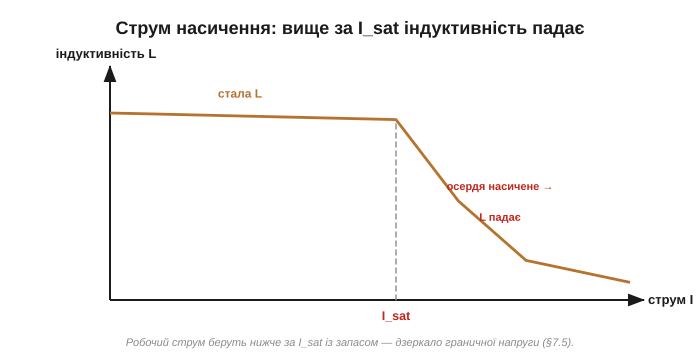
*Рис. 8.7.3. Доти, доки струм нижчий за I_sat, індуктивність майже стала. За насичення осердя L падає (за I_sat — на задані кілька десятків відсотків від номіналу), і котушка дедалі гірше опирається струму. Тому робочий струм завжди тримають нижче за I_sat із запасом.*

Насичений дросель — небезпека: він раптом перестає обмежувати струм, і той може злетіти до руйнівного. Тому в даташиті поряд з індуктивністю завжди стоїть **допустимий струм**: робочий струм беруть із запасом нижче за I_sat. Це пряме дзеркало граничної напруги конденсатора ([§7.5](../ch07-capacitor/ch07-capacitor.md)): там не можна перевищувати напругу, тут — струм.

Насичення буває різким (осердя «обвалюється» раптово) і м'яким (L спадає поступово). М'якше поводяться осердя з навмисним **повітряним зазором** (з [§8.2](ch08-inductor.md)): вони тримають менше індуктивності, зате насичуються плавно й за більшого струму. Саме тому в дроселях імпульсних перетворювачів, де струм щомиті змінюється й має піки, осердя часто роблять із зазором — краще трохи менша L, ніж раптовий обвал під піком струму й аварія.

> 🔧 **Навіщо це.** Струм насичення — часта причина, чому імпульсний блок живлення «гріється й вимикається» під навантаженням: дросель насичується, втрачає індуктивність, струм злітає. Тому дросель беруть із запасом за струмом (як конденсатор — за напругою), і в каталозі дивляться саме на **I_sat**, а не лише на номінал L: котушка «10 µH 5 A» і «10 µH 0.5 A» — геть різні деталі під різні задачі.

### Власна резонансна частота

Через ту саму паразитну ємність котушка має ще одну межу — **власну резонансну частоту** (*self-resonant frequency*, SRF). На низьких частотах деталь поводиться як котушка; та що вища частота, то сильніше дається взнаки паразитна ємність між витками. На певній частоті (SRF) котушка й її власна ємність «зрівноважуються», а **вище** за неї деталь поводиться вже не як котушка, а як **конденсатор**.

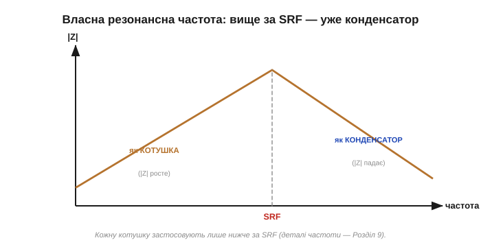
*Рис. 8.7.4. До SRF деталь — котушка (опирається зростанню частоти). На SRF власна ємність і індуктивність зрівноважуються. Вище — перемагає паразитна ємність, і «котушка» поводиться як конденсатор. Тому як **індуктивність** котушку застосовують нижче за її SRF.*

Чому саме так і що таке резонанс — це вже частотний погляд наступного розділу ([Розділ 9](../ch09-reactance-resonance/ch09-reactance-resonance.md)); тут досить практичного висновку: **кожна котушка має «стелю» частоти**, вище за яку вона перестає бути котушкою. Якщо деталь потрібна саме як **індуктивність** (контури, дроселі), працюють із добрим запасом нижче за SRF, бо біля неї реактивність злітає й поводиться непередбачувано. (А от деякі завадопридушувальні деталі — ті самі феритові намистини — навмисне ставлять працювати *поблизу й вище* їхньої SRF, у втратній зоні, де вони вже не котушка, а поглинач ВЧ-енергії.) Дрібні високоіндуктивні котушки мають низьку SRF (багато витків — велика паразитна ємність між ними), тож для високих частот беруть малу L і малу паразитну ємність — часто повітряні котушки.

### Дросель: пропустити постійне, спинити змінне

Найпоширеніша роль котушки — **дросель** (*choke*). З [§8.2](ch08-inductor.md) ми знаємо: котушка пропускає постійний струм, а зміні опирається. Тому дросель ставлять, щоб **пропустити корисний постійний (чи повільний) струм, а швидку пульсацію й шум — затримати**.

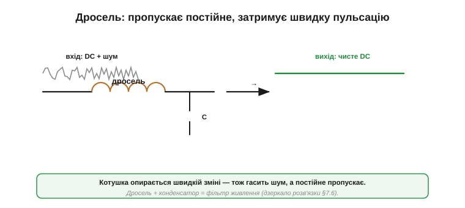
*Рис. 8.7.5. Дросель послідовно з живленням: постійний струм іде вільно, а накладений на нього високочастотний шум котушка «гасить», бо опирається швидкій зміні. Окремий випадок — синфазний (common-mode) дросель: дві обмотки на спільному осерді душать спільну заваду в обох проводах, не заважаючи корисному сигналу.*

Це дзеркало розв'язувального конденсатора ([§7.6](../ch07-capacitor/ch07-capacitor.md)): конденсатор відводив пульсацію в землю, а дросель — не пускає її далі по дроту. Часто їх ставлять разом: дросель + конденсатор утворюють фільтр, що чистить живлення набагато краще, ніж кожен окремо.

Найпростіший дросель — **феритова намистина** (*ferrite bead*): просто кільце фериту на дроті, тобто котушка з одного-двох витків. На постійному й повільному струмі вона майже невидима, а високочастотну заваду перетворює на тепло у фериті. Їх ставлять там, де треба прибрати ВЧ-шум, не чіпаючи корисний сигнал, — на лініях живлення, портах, шлейфах.

> 🔧 **Навіщо це.** Маленький дросель або феритове кільце на кабелі (те потовщення на USB- чи моніторному шнурі) — це **синфазний дросель** проти завад: він не заважає сигналу, але душить високочастотний шум, що наводиться на обидва проводи разом. Та сама фізика — котушка опирається швидкій зміні струму — рятує від перешкод у живленні, у радіо й у цифрових лініях.

### Де живуть котушки

Зведімо застосування. Котушка — деталь не така всюдисуща, як конденсатор, зате незамінна там, де треба запасати енергію в полі, опиратися зміні струму чи зв'язувати кола магнітно.

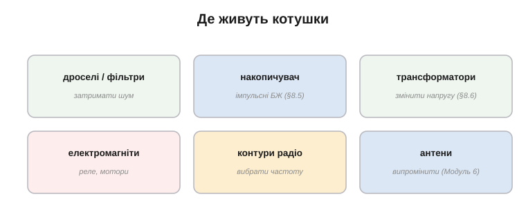
*Рис. 8.7.6. Головні ролі: дроселі й фільтри живлення (затримати шум); накопичувач енергії в імпульсних перетворювачах (§8.3, §8.5); трансформатори (§8.6); електромагніти — реле, соленоїди, мотори; налаштовані контури радіо й антени (§8.1 + Розділ 9). Скрізь працює одна з трьох ідей: поле, опір зміні струму або взаємоіндукція.*

Приклад із життя: у блоці живлення ноутбука дросель накопичує енергію для імпульсного перетворювача; феритові намистини на USB-портах душать завади; у радіомодулі крихітні котушки утворюють контури, що виділяють потрібну частоту; а трансформатор (котушки на спільному осерді) відділяє електроніку від мережі. П'ять різних котушок в одному пристрої — і кожна служить одній із трьох ідей розділу.

> 🔧 **Навіщо це.** На відміну від конденсатора, котушку на платі впізнати легко: це або помітна намотка дроту, або «брусок»/кільце з ферита, часто більший і важчий за сусідів. Біля мікросхеми живлення майже завжди є дросель (накопичувач імпульсного перетворювача); на вході — феритові намистини проти завад; у радіочастинці — крихітні котушки контурів. Уміючи їх розпізнати, ви читаєте призначення вузла з першого погляду.

### Як читати котушку

Нарешті — на що дивитися, обираючи котушку. Як конденсатор описували ємністю й напругою, так котушку описують чотирма числами.

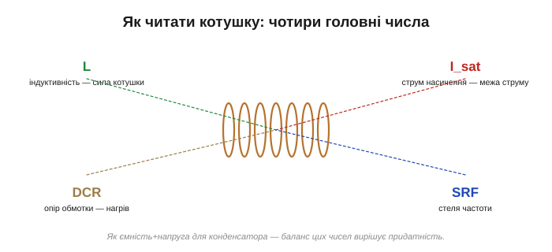
*Рис. 8.7.7. Чотири головні параметри котушки: індуктивність **L** (скільки опору зміні струму), допустимий струм **I_sat** (вище — насичення), опір обмотки **DCR** (нагрів і просідання) і власна резонансна частота **SRF** (стеля робочої частоти). Разом вони кажуть, чи годиться котушка для задачі.*

Перші два — як ємність і напруга конденсатора: **L** каже, наскільки сильна котушка, а **I_sat** — скільки струму вона витримає, не насичуючись. **DCR** важливий у силових колах (нагрів), а **SRF** — у високочастотних (стеля частоти). Обрати котушку — це збалансувати ці чотири числа під задачу, точно як ми балансували ємність, напругу, ESR і тип у конденсатора.

**Приклад читання.** Запис «10 µH, 3 A, 25 mΩ, SRF 40 MHz» означає: індуктивність 10 мкГн; тримає до 3 А без насичення; опір обмотки 25 міліом (гріється мало); годиться приблизно до 40 МГц. Для дроселя живлення на 1 А це чудовий вибір; для кола на 100 МГц — ні (вище за SRF). Усе, що треба для рішення, — у цих чотирьох числах. Навчившись їх читати, ви добиратимете котушку так само впевнено, як уже вмієте добирати резистор і конденсатор.

Підсумуймо розділ. Ми пройшли котушку від поля до готової деталі: струм робить магнітне поле, котушка його **концентрує** ([§8.1](ch08-inductor.md)); **індуктивність** L міряє опір зміні струму (V = L·di/dt, [§8.2](ch08-inductor.md)); у полі запасено **½·L·I²** енергії ([§8.3](ch08-inductor.md)); струм наростає й спадає за **експонентою** зі сталою L/R ([§8.4](ch08-inductor.md)); різкий обрив дає небезпечний **сплеск** ([§8.5](ch08-inductor.md)); змінне поле наводить струм у сусідній обмотці — **трансформатор** ([§8.6](ch08-inductor.md)); а реальна котушка має DCR, насичення й SRF (ця тема). Наскрізна думка: **котушка живе зміною струму** — дзеркало конденсатора, що живе зміною напруги.

Досі і конденсатор, і котушка по-різному реагували на «швидко» й «повільно», але ми обходили головне питання: а як саме їхній «опір» залежить від **частоти** змінного сигналу? Що означає «швидко» в герцах? І що буде, якщо поставити котушку з конденсатором разом? Відповіді — у наступному розділі, де народжуються реактивність, фази й резонанс. Там два наші компоненти нарешті зустрінуться на змінному струмі — і ми побачимо, як разом вони творять фільтри й налаштовані контури, здатні вибрати з ефіру одну-єдину частоту.

> ▶️ Далі: [Розділ 9 — Реактивність, фази й резонанс](../ch09-reactance-resonance/ch09-reactance-resonance.md)
