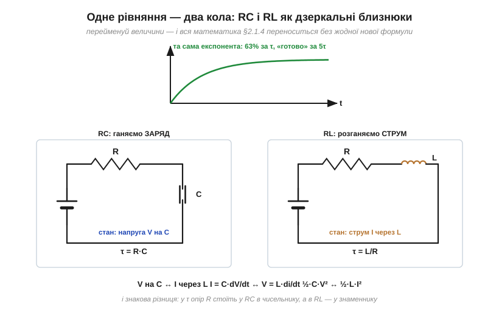

# 🧮 Диференціальне рівняння RL: розв'язок, дзеркальний до RC

> Це математична вставка до теми [2.2.4 «Перехідні процеси RL»](ch08-inductor.md). Увесь математичний апарат — що таке похідна, диференціальне рівняння, чому розв'язок експонента і як його знайти трьома способами — уже зібрано у [вставці до §2.1.4](../ch07-capacitor/ch07-s4-m-exponential-ode.md). Тут не буде жодної нової математики: лише швидкий прохід, який показує, що RL-коло описується **тим самим рівнянням** з перейменованими літерами — і чому τ = L/R випливає з нього так само неминуче, як τ = R·C.

### Виводимо рівняння вмикання

Джерело V₀, резистор R і котушка L послідовно; у момент t = 0 замкнули перемикач. Напруги в контурі складаються ([§1.4.3](../../block-1-circuits-physics/ch04-kirchhoff-circuit-analysis/ch04-kirchhoff-circuit-analysis.md)): частина V₀ падає на резисторі (i·R), решта — на котушці, а напруга котушки — це її закон V = L·di/dt ([§2.2.2](ch08-inductor.md)):

```
V₀ = i·R + L · di/dt        →        di/dt = (V₀ − i·R) / L
```

Винесемо R за дужки й позначимо кінцевий струм I_кінц = V₀/R (це струм, коли котушка вже «невидима», [§2.2.2](ch08-inductor.md)):

```
di/dt = (R/L) · (I_кінц − i)
```

Прочитаймо словами: **швидкість зміни струму пропорційна залишку шляху до кінцевого значення**. Це точнісінько та сама форма «темп ∝ залишок», що й у заряджання конденсатора, — лише там до мети повзла напруга, а тут повзе струм.

### Розв'язок підстановкою — і звідки τ = L/R

Раз рівняння те саме, то й розв'язок вгадується одразу — зростальна експонента. Перевіримо здогад i(t) = I_кінц·(1 − e^(−t/τ)) підстановкою:

```
підставляємо:    di/dt = (I_кінц/τ) · e^(−t/τ) = (I_кінц − i)/τ
рівняння хоче:   di/dt = (I_кінц − i) · R/L
збіг можливий лише при    τ = L/R
```

Стала часу знову виявилася не означенням, а **наслідком** рівняння. І з цього ж рядка видно корінь «дзеркальної» поведінки R, яка дивувала в основній темі: коефіцієнт швидкості тут — R/L. Більший опір означає **більший** темп наближення до (меншої) мети — тож R стоїть у знаменнику τ, а не в чисельнику, як у RC.

Вимкнення розв'язується тим самим рухом: замкнули розігнану котушку на резистор — у контурі лишилося L·di/dt = −i·R, тобто di/dt = −i/τ, і струм тане як i(t) = I₀·e^(−t/τ). А якщо резистора немає (коло розірвали) — рівняння вимагає миттєвої зміни струму, di/dt → ∞, і напруга L·di/dt злітає: це строгий вигляд «брикання» з [§2.2.5](ch08-inductor.md).

### Словник перекладу RC ↔ RL

Решта — чиста заміна позначень. Уся таблиця 63%/5τ, розділення змінних, метод Ейлера і навіть «час до половини = 0.693·τ» з [вставки до §2.1.4](../ch07-capacitor/ch07-s4-m-exponential-ode.md) переносяться дослівно — треба лише перекладати літери за словником:

```
RC-коло                          RL-коло
─────────────────────────        ─────────────────────────
змінна стану: V на C             змінна стану: I через L
компонентний закон: I = C·dV/dt  компонентний закон: V = L·di/dt
стала часу: τ = R·C              стала часу: τ = L/R
порожній C — «коротке»           котушка без струму — «розрив»
заряджений C — «розрив»          розігнана котушка — «коротке»
енергія: ½·C·V²                  енергія: ½·L·I²
```


*Рис. 2.2.4m.1. Та сама експонента обслуговує обидва кола: у RC станом є напруга на конденсаторі, у RL — струм через котушку. Дзеркальність повна, аж до місця опору в сталій часу: R·C проти L/R.*

Чому словник такий симетричний — видно з самих компонентних законів: у конденсатора струм пропорційний похідній **напруги**, у котушки навпаки — напруга пропорційна похідній **струму**. Поміняти місцями V та I (а заразом «коротке» з «розривом») — і один компонент перетворюється на другий. Математики звуть таку пару **дуальною**; ми вже бачили її прояви в [§2.2.2](ch08-inductor.md) і ще не раз побачимо далі.

### Де це працює в курсі

Скрізь, де в колі є котушка з опором: оцінка часу «розгону» дроселя чи обмотки реле (τ = L/R обмотки), згасання струму через захисний діод після вимикання ([§2.2.5](ch08-inductor.md): там τ задає, як швидко реле відпустить), вимірювання індуктивності за сталою часу. А головний підсумок ширший: побачивши систему «темп пропорційний залишку», ви тепер маєте право не розв'язувати її заново — лише визначити, що тут «залишок» і чому дорівнює τ. RC і RL — перші два слова цієї універсальної мови.
