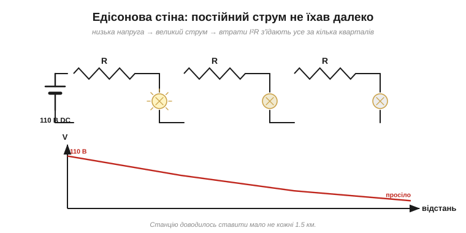
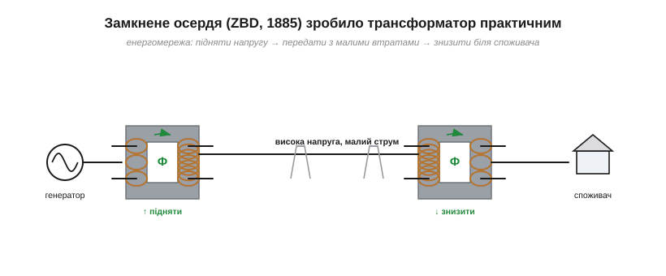
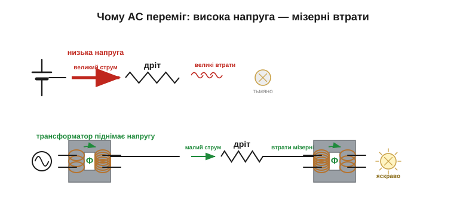

# 📜 Історія до §8.6 — трансформатор і перемога змінного струму

> Це історична вставка до [§8.6 «Взаємоіндукція й трансформація»](ch08-inductor.md). Загальну драму «війни струмів» — Едісон проти Тесли й Вестінгауза — ми вже окреслили в [історії Модуля 1](../../block-1-circuits-physics/ch02-voltage-current-conduction/ch02-s12-history-war-of-currents.md). Тут — погляд із іншого боку: на **технологію**, що цю війну й вирішила. Бо змінний струм переміг не гаслами й не страшилками, а одним непоказним пристроєм, який постійний струм просто не міг повторити, — **трансформатором**.

Уявіть суперечку, де обидві сторони мають рацію — і програє та, чия правда нікуди не масштабується. Постійний струм Едісона був простий, зрозумілий і вже працював. Та він уперся в стіну, яку не міг здолати фізично. А змінний струм мав джокер — здатність легко міняти напругу. Це історія про те, як скромна котушка на залізному осерді перемогла наймогутнішого винахідника епохи. А ще це історія про інженерний вибір узагалі: чому одні технології перемагають інші не за гучністю реклами, а за здатністю **масштабуватися**.

---

## Едісонова стіна: чому постійний струм застряг

1882 рік, Нью-Йорк. **Томас Едісон** (*Thomas Edison*) запускає першу електростанцію на Перл-стріт — і вона працює на **постійному** струмі, низькою напругою (близько 110 В), бо саме таку напругу терпить лампа розжарювання й безпечно подати в дім. Усе гаразд — поки не спробуєш віднести цю енергію **далеко**.

Ось де стіна. Передати потужність по дроту — означає гнати ним струм; а будь-який дріт має опір, на якому втрачається потужність I²R ([§3.6](../../block-1-circuits-physics/ch03-resistance-power-heat/ch03-resistance-power-heat.md)). Що більший струм, то більші втрати — квадратично. За низької напруги, щоб передати помітну потужність, потрібен **великий** струм, тож втрати з'їдають усе вже за кілька кварталів. Едісон був змушений ставити електростанцію приблизно **кожні півтори кілометри** — інакше напруга в кінці лінії просідала до нікчемної.

Можна було б, звісно, узяти товстіший дріт — менший опір, менші втрати. Та мідь коштує грошей, і щоб помітно зменшити опір ліній цілого міста, її знадобилися б **тонни й тонни**. Едісонова мережа задихалася від вартості міді й могла охопити хіба що щільний центр. Передати енергію в передмістя чи сусіднє місто було просто неможливо: або топи мідь у землю без кінця, або став ще одну станцію. Це була не дрібна незручність, а фундаментальна межа всієї ідеї постійного струму.

*Рис. 8.6і.1. Низька напруга → великий струм для тієї ж потужності → величезні втрати I²R на опорі дроту. Напруга просідає вздовж лінії, тож станцію доводилось ставити мало не на кожному кварталі. Підняти напругу постійного струму, щоб зменшити струм, Едісон не вмів — не було чим.*

Розв'язок напрошувався: передавати під **високою** напругою (тоді струм малий, а втрати мізерні), а біля споживача знижувати її до безпечної. Але як? Підняти, а потім опустити напругу постійного струму тодішня техніка просто **не вміла**. А для змінного — уже з'явився інструмент.

> 🔧 **Навіщо це.** Та сама арифметика діє й сьогодні, і не лише в енергетиці. Коли треба передати потужність дротом — піднімай напругу, щоб упав струм, і втрати на опорі падають квадратично. Це причина, чому магістральні лінії — високовольтні, чому потужні пристрої живлять вищою напругою, і чому «просідання» в довгому тонкому дроті — вічний головний біль. Едісонова стіна нікуди не зникла — її просто навчилися обходити трансформатором.

---

## Перші трансформатори: Ґолар, Ґіббс і команда Ґанца

Інструмент дозрівав у Європі. На початку 1880-х француз **Люсьєн Ґолар** (*Lucien Gaulard*) і англієць **Джон Ґіббс** (*John Gibbs*) показали систему розподілу змінного струму з «вторинними генераторами» — по суті, ранніми трансформаторами. Та їхня конструкція була незграбна: осердя розімкнене, обмотки ввімкнені послідовно — працювало погано й нестабільно. І все ж навіть незграбний, їхній прилад уперше показав ідею публічно: 1884 року систему Ґолара–Ґіббса демонстрували в Турині, освітлюючи змінним струмом через трансформатори ділянку вздовж залізниці. Думка «генерувати на одній напрузі, а роздавати на іншій» уже носилася в повітрі — бракувало лише довести її до робочого вигляду.

Вирішальний крок зробила угорська трійця з заводу **Ґанц** у Будапешті: **Зіперновскі, Блаті й Дері** (*Zipernowsky, Bláthy, Déri* — команда «ZBD»). **1885 року** вони збудували трансформатор у його сучасному вигляді: із **замкненим** осердям (магнітний потік біжить по залізному кільцю, не розсіюючись, [§8.1](ch08-inductor.md)) і обмотками, увімкненими **паралельно**. Саме вони, кажуть, і запровадили слово «трансформатор». Це вже був практичний прилад — ефективний, передбачуваний, готовий до масштабу.

Що саме виправили угорці? У відкритого осердя Ґолара–Ґіббса частина магнітного потоку «тікала» в повітря, тож зв'язок між обмотками виходив кволий і непередбачуваний, а послідовне ввімкнення означало, що лампи впливали одна на одну (вимкнеш одну — решта блимають). Замкнене осердя втримало майже весь потік у залізі (коефіцієнт зв'язку близький до одиниці, [§8.6](ch08-inductor.md)), а паралельне ввімкнення зробило споживачів незалежними. Оце й перетворило цікаву лабораторну іграшку на прилад, на якому можна будувати справжню мережу.

*Рис. 8.6і.2. Прорив ZBD: замкнене залізне осердя «замикає» потік усередині, майже не випускаючи його назовні (k ≈ 1). Це різко підняло ефективність і дало енергомережу, про яку мріяли: підняти напругу на станції → передати з малими втратами → знизити біля споживача.*

> 🔧 **Навіщо це.** Уся ієрархія напруг навколо вас — це Едісонова стіна, обійдена трансформатором: сотні кіловольт на магістралях, десятки кіловольт на районних лініях, 400/230 В у домі. Кожен перехід — підстанція з трансформатором. Розуміючи це, ви читаєте електромережу як інженер: магістральні лінії — високовольтні й «тонкі» за струмом, а низька напруга з'являється лише в останньому кроці, біля споживача.

---

## Стенлі й Великий Баррінгтон

Технологію підхопив за океаном **Джордж Вестінгауз** (*George Westinghouse*) — промисловець, що повірив у змінний струм. Він викупив права на систему Ґолара–Ґіббса, найняв талановитого інженера **Вільяма Стенлі** (*William Stanley*) і доручив довести трансформатор до пуття. Вестінгауз ризикував чималим: він уже зажив слави й статків на залізничних гальмах, а тепер ставив усе на технологію, яку наймогутніший винахідник Америки привселюдно називав смертельно небезпечною. Та Вестінгауз був інженером за складом розуму й бачив те саме, що бачимо й ми: фізику не обдуриш, а майбутнє — за тим, що масштабується.

**1886 року** в містечку **Великий Баррінгтон** (*Great Barrington*, Массачусетс) Стенлі зібрав першу в США повноцінну систему змінного струму. Генератор давав близько 500 В; трансформатори підвищували напругу для лінії, а біля крамниць і контор інші трансформатори знижували її до 100 В для ламп. Містечкова вулиця засвітилася — і це був перший наочний доказ, що схема «підвищив–передав–знизив» працює в реальному світі. Те, що для нас сьогодні буденність — світло в будинку за кілометри від станції, — тоді вважали мало не неможливим.

Лишався один серйозний закид до змінного струму: фабрики потребували не лише світла, а й **руху** — двигунів. Постійний струм крутив мотори легко, а зі змінним довго не виходило. Розв'язав це геніально **Нікола Тесла** (*Nikola Tesla*): кілька зсунутих у часі змінних струмів (багатофазна система) створювали в моторі **обертове магнітне поле**, що тягло ротор за собою без жодних щіток і ковзних контактів. Простий, надійний, потужний — асинхронний двигун Тесли й досі крутить більшу частину промисловості. Вестінгауз ліцензував цей винахід — і з ним зникла остання перевага постійного струму. Тепер у змінного було все: і світло, і рух, і легка зміна напруги.

---

## Війна струмів — коротко

Едісон не здавався. Маючи вкладені в постійний струм гроші й репутацію, він розгорнув кампанію страху: привселюдно вбивав струмом тварин, аби показати «небезпечність» змінного, і посприяв тому, щоб перший електричний стілець працював саме на AC — щоб у головах публіки змінний струм пов'язувався зі смертю. Дійшло до того, що вираз «to be Westinghoused» якийсь час означав «бути страченим на електричному стільці» — ось наскільки далеко зайшла кампанія страху. Цю гірку драму ми переказали окремо в [історії Модуля 1](../../block-1-circuits-physics/ch02-voltage-current-conduction/ch02-s12-history-war-of-currents.md); тут досить сказати, що жодні страшилки не могли скасувати **фізику**: постійний струм усе одно не їхав далеко, а змінний — їхав.

Технічна перевага виявилася сильнішою за піар. Поки Едісон лякав, Вестінгауз будував — і кожна нова лінія доводила, що змінний струм дешевший і досяжніший. Показово: навіть винахідник такого калібру, як Едісон, не зміг побороти невигідну фізику самою лише рекламою. Ринок зрештою обирає те, що працює дешевше й сягає далі.

---

## Ніагара ставить крапку

Дві події завершили суперечку. **1893 року** Вестінгауз виграв контракт освітити **Всесвітню виставку в Чикаго** — і залив її морем електричного світла на змінному струмі перед очима мільйонів. А **1895 року** на **Ніагарському водоспаді** запустили велику гідроелектростанцію (станцію Адамса). Спершу вона живила **місцеву** промисловість, а вже **1896 року** її енергію передали змінним струмом аж до міста **Буффало**, майже за 35 км, — те, чого постійний струм не зміг би й близько. Працювала вона на багатофазній системі **Вестінгауза–Тесли** (генератори на 25 герц, дві фази): Тесла дав ідею багатофазного струму, а Вестінгауз із інженерами втілили станцію.

*Рис. 8.6і.3. Ніагара як вирок. Трансформатор підіймає напругу до десятків тисяч вольтів — струм у лінії стає крихітним, а втрати I²R — мізерними, тож енергію можна нести за десятки кілометрів. Біля міста її знижують до безпечної. Постійний струм цього зробити не вмів — і програв.*

Масштаб Ніагари вражав сучасників: енергію могутнього водоспаду вперше вдалося не просто використати на місці, а **відправити** туди, де вона потрібна людям. Це був доказ не для інженерів — для всіх: якщо змінний струм здатен підкорити Ніагару й донести її силу до міста, суперечку скінчено.

Ніагара стала символом: енергію тепер можна було добувати там, де її дешево виробляти (біля водоспаду, вугільної шахти, річки), і нести туди, де вона потрібна. Ключем до цього був трансформатор — і тільки змінний струм давав йому працювати.

Прикметно, що Ніагара працювала саме на **багатофазній** системі Тесли — тій самій, що крутила й двигуни. Тобто остаточну перемогу здобув не просто «змінний струм», а зв'язка трьох винаходів: **трансформатор** (міняти напругу), **багатофазний генератор** (виробляти) і **асинхронний двигун** (споживати на рух). Кожен окремо був корисний; разом вони склали повну, самодостатню систему, якій постійному струму тих років не було чого протиставити.

---

## Що з цього лишилось

Озирнімося. Уся **світова енергомережа** дотепер працює на змінному струмі — не тому, що він у чомусь «кращий» за постійний сам собою, а тому, що його напругу легко міняти **трансформатором**, а постійного — ні (аж до появи сучасної силової електроніки). Сліди тієї перемоги — навколо нас щодня:

- розетка дає **змінний** струм (50 чи 60 герц — частоти, що **зрештою** закріпилися як стандарт: 60 Гц у Північній Америці, 50 Гц у Європі; а ранні AC-системи працювали на найрізніших частотах — сама Ніагара давала 25 Гц);
- високовольтні **лінії електропередач** через усю країну — це Едісонова стіна, обійдена трансформатором;
- **трансформатор** на підстанції біля вашого дому й крихітний трансформатор у зарядці телефона роблять ту саму роботу, що Стенлі показав 1886-го: міняють напругу між «зручно передавати» і «безпечно вживати».

Навіть частоти мережі — 50 чи 60 герц — це закам'янілий слід тих років. Спочатку єдиного стандарту не було: ранні системи крутилися на 25, 40, 60, 133 і ще багатьох частотах (та сама Ніагара — на 25 Гц), і лише згодом світ зійшовся на двох числах — 60 Гц у Північній Америці, 50 Гц у Європі. Вибір був компромісом: надто низька частота дає помітне мерехтіння ламп і громіздкі трансформатори (бо наведена напруга росте з частотою зміни потоку), надто висока — більші втрати в лініях та осердях. Кілька десятків герц виявилися золотою серединою, і світ досі живе на цих числах, хоч мало хто пам'ятає чому.

> 🔧 **Навіщо це.** Кожна зарядка, кожен блок живлення, кожна підстанція — це Стенлі 1886-го в мініатюрі: змінний струм, трансформатор, зміна напруги. Побачивши «важкий» адаптер чи гудучу скриню на стовпі, знайте, що дивитесь на пряме продовження тієї перемоги. А «легкі» сучасні зарядки виграли вагу, перенісши ту саму ідею на високу частоту, де трансформатор стає крихітним ([§8.6](ch08-inductor.md)).

Цікавий поворот наостанок: сьогодні, із сучасною силовою електронікою, **постійний** струм частково повертається — у вигляді високовольтних ліній HVDC, що передають енергію на тисячі кілометрів чи під морем, де вже вигідніші за змінний. Едісон, можна сказати, мав рацію — просто на сто років зарано: щоб піднімати й опускати напругу постійного струму, людству бракувало саме тих напівпровідникових ключів, до яких ми дійдемо в наступних розділах. Але звичайна мережа, у якій ви живете, досі переважно змінна — і це прямий спадок трансформатора.

Головний урок цієї історії — інженерний, а не лише історичний: **перемагає не та технологія, що простіша сьогодні, а та, що масштабується завтра**. Постійний струм був простіший — і вперся в стіну. Змінний приніс із собою трансформатор — і відчинив двері до електрифікації планети. Те, що почалося як суперечка двох підприємців за ринок, обернулося на інфраструктуру, без якої немислима сучасна цивілізація. А в основі того трансформатора — те саме явище взаємоіндукції, яке ми щойно розібрали: змінне поле однієї котушки наводить струм в іншій.

> ▶️ Повернутися до теми: [§8.6 Взаємоіндукція й трансформація](ch08-inductor.md)

---

### Пов'язані матеріали
- [Війна струмів: Едісон проти Тесли й Вестінгауза](../../block-1-circuits-physics/ch02-voltage-current-conduction/ch02-s12-history-war-of-currents.md) *(історія Модуля 1 — повна драма)*
- [Рух магніту народжує струм — Ерстед, Фарадей, Генрі](ch08-history-induction.md) *(історія до Розділу 8)*
