# Розділ 2.3 — Реактивність, фази й резонанс

Конденсатор ([Розділ 2.1](../ch07-capacitor/ch07-capacitor.md)) і котушка ([Розділ 2.2](../ch08-inductor/ch08-inductor.md)) ми вже знаємо як дзеркальних двійників: один реагує на зміну напруги, інший — на зміну струму, обидва запасають енергію в полі. Та досі ми описували їхню поведінку грубо — «блокує постійне», «пропускає швидку зміну». Цей розділ робить «швидко» й «повільно» **точними**, прив'язавши їх до **частоти**, і вводить нову, дуже корисну величину — **реактивність**: «опір», що залежить від частоти. А далі — фази (чому струм і напруга «не в ногу») і **резонанс**, на якому стоїть уся радіотехніка й кожен фільтр.

Усе потрібне вже в руках: закони конденсатора (i = C·dV/dt) і котушки (V = L·di/dt), енергія в полях, опір і закон Ома з Модуля 1. Лишається подивитися на них очима **частоти**.

> 📜 **Перед матеріалом — історія:** [налаштований контур — як навчилися «ловити» одну частоту](ch09-history-tuned-circuit.md). Вона показує, *звідки* взялося поняття резонансу, чому коло має «власну ноту» й як це дозволило радіо вибирати одну станцію з багатьох.

---

## 2.3.1 Чому «опір» C і L залежить від частоти

Резистор поводиться чесно й нудно: його опір однаковий, хоч який сигнал крізь нього пусти — постійний, повільний, швидкий. R — стала величина, і закон Ома працює завжди однаково ([§1.3.2](../../block-1-circuits-physics/ch03-resistance-power-heat/ch03-resistance-power-heat.md)). (Це про **ідеальний** резистор і про частоти, з якими ми тут працюємо. У реального резистора на дуже високих, радіочастотах прокидаються власні паразитна ємність і індуктивність виводів, тож і його імпеданс стає частотно-залежним — але для звичайних схем цим нехтують.) Конденсатор і котушка — інша справа. Їхня «протидія» струмові **залежить від того, як швидко міняється сигнал**. Конденсатор тим легше пропускає, чим швидші коливання; котушка — навпаки. Розберімо, чому так, і дамо цій частотно-залежній протидії ім'я — **реактивність**. Це одна з тих тем, де варто не заучувати формули, а відчути **напрямок**: хто пропускає швидке, хто повільне — і чому. Маючи це чуття, ви читатимете будь-який фільтр чи розв'язку з першого погляду.

### Що означає «частота»

Спершу домовмося, що таке «швидко». Найзручніший змінний сигнал — **синусоїда**: напруга, що плавно гойдається вгору-вниз. Її **частота** (*frequency*, f, у герцах) — це скільки повних коливань за секунду. Зворотна до неї величина — **період** T = 1/f, час одного коливання: висока частота — короткий період. І ось ключове: що вища частота, то **швидше** сигнал міняється — крутіші нахили, різкіші злети й падіння за ту саму секунду.

Діапазон частот вражає: освітлювальна мережа гойдається 50 разів на секунду (50 Гц), звук — від десятків до десятків тисяч разів (Гц–кГц), радіо й цифрові сигнали — мільйони й мільярди (МГц–ГГц). І хоча реальні сигнали бувають складними, будь-який із них можна розкласти на суму синусоїд (це доведуть у далекому розділі про спектр), тож синусоїда — природна «цеглинка», на якій усе й вивчають. Говоримо про одну частоту — а висновки переносяться на будь-який сигнал.

> 🔧 **Навіщо це.** Тримати в голові «де яка частота» дуже практично. Живлення й мережеві завади — десятки-сотні герц; звук — одиниці кілогерц; цифрові шини й перешкоди від них — мегагерци; радіо й Wi-Fi — сотні мегагерц і гігагерци. Та сама деталь поводиться на цих частотах геть по-різному, тож, добираючи конденсатор чи котушку, інженер завжди питає: «на якій частоті вона працюватиме?»


*Рис. 2.3.1.1. Та сама амплітуда, різна частота. Низька частота — сигнал міняється мляво, пологі нахили. Висока — ті самі піки, але досягаються набагато швидше, нахили круті. Саме «крутість» зміни (швидкість dV/dt чи di/dt) і відчувають конденсатор та котушка.*

Це і є місток до наших компонентів. Конденсатор реагує на **швидкість** зміни напруги (i = C·dV/dt, [§2.1.1](../ch07-capacitor/ch07-capacitor.md)), котушка — на швидкість зміни струму (V = L·di/dt, [§2.2.2](../ch08-inductor/ch08-inductor.md)). А частота — це і є міра тієї швидкості. Тож не дивно, що від частоти залежить усе.

### Конденсатор: чим швидше, тим легше пропускає

Згадаймо з [§2.1.1](../ch07-capacitor/ch07-capacitor.md): струм у конденсатор тече лише тоді, коли напруга на ньому **міняється**. На постійній напрузі (частота нуль) струму нема зовсім — конденсатор блокує. А тепер уявімо швидкі коливання: напруга весь час стрімко міняється, тож конденсатор увесь час жадібно заряджається-розряджається, і крізь нього тече **великий** струм. Виходить: що вища частота, то **більший** струм за тієї самої амплітуди напруги, а отже, то **менша** протидія.


*Рис. 2.3.1.2. Реактивність конденсатора Xc спадає з частотою. На постійному струмі (f → 0) — нескінченна (блокує). На високій частоті — мала (пропускає майже вільно). Конденсатор «любить» швидке й «не любить» повільне.*

Чому саме так — видно з закону конденсатора. Струм i = C·dV/dt пропорційний швидкості зміни напруги; а вища частота означає більшу швидкість зміни. Тож за тієї самої амплітуди напруги вищій частоті відповідає більший струм.

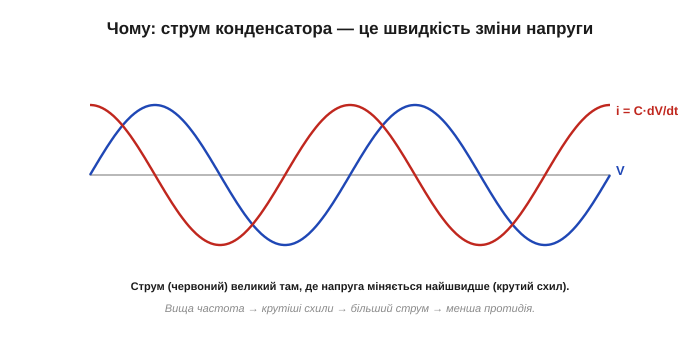
*Рис. 2.3.1.3. i = C·dV/dt: струм конденсатора — це швидкість зміни напруги, помножена на C. Круті (високочастотні) схили напруги дають великий струм; пологі (низькочастотні) — малий. Більший струм за тієї ж напруги й означає меншу протидію.*

Відчуймо це числами-орієнтирами (точні — у [§2.3.2](ch09-reactance-resonance.md)). Той самий конденсатор на постійному струмі — повний розрив; на звукових частотах — уже відчутно пропускає; а на радіочастотах — майже коротке замикання. Тому крихітний конденсатор, цілком невидимий для повільних сигналів, на високій частоті здатен «закоротити» їх у землю — на цьому й стоїть розв'язка живлення з [§2.1.6](../ch07-capacitor/ch07-capacitor.md): для постійної напруги конденсатор нічого не робить, а швидкий шумовий сплеск відводить убік. Та сама властивість стоїть і за розділовим конденсатором: постійне зміщення він не пропускає (нескінченна Xc на нулі), а змінний сигнал — тим краще, чим вища частота. Тепер видно, що звичне «пропускає зміну» означало саме «має малу реактивність на високих частотах».

### Котушка: чим швидше, тим важче пропускає

У котушки все дзеркально. З [§2.2.2](../ch08-inductor/ch08-inductor.md): котушка наводить напругу, що протидіє **зміні** струму (V = L·di/dt). На постійному струмі (частота нуль) вона не наводить нічого — поводиться як звичайний дріт, пропускає вільно. Та що швидше намагаємося гойдати струм (вища частота), то більшу протидійну напругу котушка наводить — а отже, то **сильніше** вона опирається.


*Рис. 2.3.1.4. Реактивність котушки XL росте з частотою. На постійному струмі (f → 0) — нульова (пропускає, як дріт). На високій частоті — велика (блокує). Котушка «любить» повільне й «не любить» швидке — точне дзеркало конденсатора.*

І знову причина — в законі компонента. Напруга V = L·di/dt пропорційна швидкості зміни струму; вища частота — швидша зміна — більша протидійна напруга. Щоб проштовхнути крізь котушку струм тієї самої амплітуди на вищій частоті, потрібна більша напруга — тобто котушка протидіє сильніше.

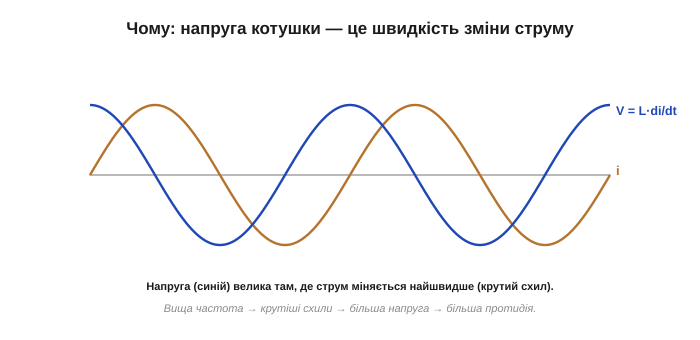
*Рис. 2.3.1.5. V = L·di/dt: напруга котушки — це швидкість зміни струму, помножена на L. Швидкий (високочастотний) струм наводить велику протидійну напругу; повільний — малу. Більша напруга за того ж струму й означає більшу протидію.*

І знову повне дзеркало: та сама котушка на постійному струмі — просто дріт; на звукових частотах — уже відчутно опирається; на радіочастотах — майже розрив. Тому феритова намистина, невидима для корисного постійного живлення, душить високочастотну заваду (з [§2.2.7](../ch08-inductor/ch08-inductor.md)). Одна й та сама деталь — геть різна поведінка на різних частотах, і саме в цьому її цінність. Зворотний бік тієї ж медалі: щоб **не пустити** високочастотний сигнал кудись, котушку ставлять послідовно — для нього вона стіна, а для живлення (постійного) прозора. Дросель у фільтрі живлення ([§2.2.7](../ch08-inductor/ch08-inductor.md)) — саме це.

### Реактивність — це «опір», що залежить від частоти

Цю частотно-залежну протидію називають **реактивністю** (*reactance*, позначають **X**). Її, як і опір, міряють в **омах** — бо це теж відношення напруги до струму. Реактивність конденсатора позначають **Xc**, котушки — **XL**. Точні формули для них ми виведемо в наступних темах ([§2.3.2](ch09-reactance-resonance.md) і [§2.3.3](ch09-reactance-resonance.md)); тут головне — сам **зміст** і **напрямок**: Xc спадає з частотою, XL росте.

Але реактивність — **не те саме**, що опір, і плутати їх не можна. Між ними дві принципові різниці:

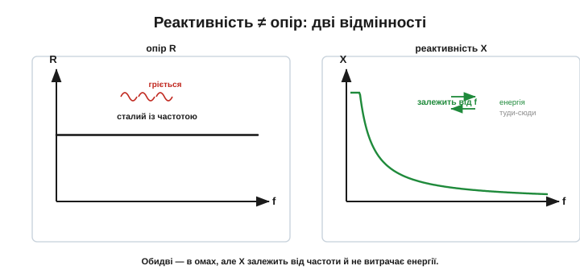
*Рис. 2.3.1.6. Опір R — сталий із частотою й **розсіює** енергію на тепло (§1.3.6). Реактивність X — **залежить** від частоти й енергію не витрачає, а лише тимчасово запасає в полі та повертає (§2.1.3, §2.2.3). Обидві міряють в омах, але це різні за природою величини.*

По-перше, опір **сталий** із частотою, а реактивність — **ні** (у цьому вся суть). По-друге, і це глибше: резистор енергію **спалює** на тепло, а конденсатор і котушка її не витрачають — вони лише **запасають** її в полі й повертають назад (з [§2.1.3](../ch07-capacitor/ch07-capacitor.md) і [§2.2.3](../ch08-inductor/ch08-inductor.md)). За кожен період реактивний елемент бере енергію з кола (напинаючи поле) і повністю віддає її назад (коли поле спадає) — у середньому за цикл він не споживає **нічого**. Резистор же щомиті безповоротно гріється. Тому **ідеальні** котушка чи конденсатор можуть «опиратися» чималому струмові, залишаючись холодними, — те, на що резистор не здатен. Саме через це конденсатори й котушки звуть **реактивними** елементами, а резистор — таким, що розсіює. (Наголос на «ідеальні»: реальні все ж трохи гріються — у конденсатора є ESR, у котушки опір обмотки DCR і втрати в осерді, [§2.1.5](../ch07-capacitor/ch07-capacitor.md), [§2.2.7](../ch08-inductor/ch08-inductor.md). Просто ці втрати малі проти того, що розсіяв би на тому самому місці резистор, тож у першому наближенні реактивний елемент вважають таким, що енергії не споживає.)

Попри ці відмінності, реактивність грає роль опору в законі Ома **для амплітуд**: амплітуда напруги дорівнює амплітуді струму, помноженій на реактивність (V = I·X), точно як V = I·R для резистора. Тож, знаючи Xc чи XL на даній частоті, ви рахуєте струм так само звично, як із резистором, — лише пам'ятаючи, що X залежить від частоти. Є й тонкість: реактивність не додається до опору так просто, як два резистори, бо реактивний елемент зсуває струм і напругу в часі (про це — [§2.3.4](ch09-reactance-resonance.md)). Їхню спільну дію називають **повним опором** (імпедансом), і до нього ми дійдемо, розібравшись із фазами.

**Приклад (без чисел, лише напрямок).** Маємо суміш «постійний струм + високочастотний шум» і хочемо їх розділити. Конденсатор пропустить шум і затримає постійне (його Xc для постійного — нескінченна, для шуму — мала). Котушка зробить навпаки: пропустить постійне, затримає шум. Тому, щоб очистити живлення, постійну складову ведуть **крізь котушку**, а шум скидають **конденсатором у землю** — кожна деталь робить рівно те, що їй «легше». Жодних обчислень — самі напрямки реактивності вже підказують схему.

Одне застереження. Говорити про реактивність має сенс лише **на конкретній частоті**. «Реактивність конденсатора 50 Ом» — неповне твердження, поки не сказано, на якій частоті, бо на іншій вона буде вже інша. Це не вада, а суть: реактивний елемент — це «опір із розкладом», що залежить від того, як швидко гойдається сигнал. Тому в розрахунках і даташитах реактивність завжди прив'язана до частоти, а резистор обходиться без цього уточнення.

### Дзеркальні близнюки

Зведімо головне. Конденсатор і котушка протидіють струмові **протилежно** залежно від частоти: реактивність конденсатора з частотою **падає**, котушки — **росте**.

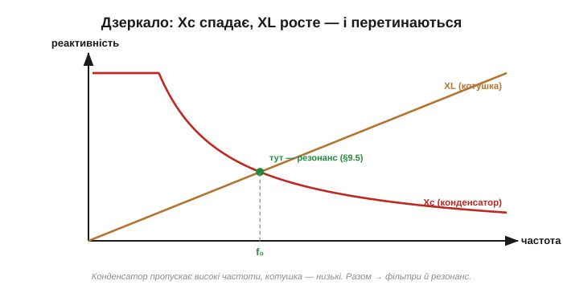
*Рис. 2.3.1.7. На одному графіку: Xc спадає, XL росте з частотою. Конденсатор пропускає високі частоти й блокує низькі; котушка — навпаки. Десь вони перетинаються — і там, де реактивності зрівнюються, ховається резонанс (§2.3.5).*

Ця протилежність — не просто симетрична краса, а основа двох найважливіших речей розділу. По-перше, **фільтрів**: ставлячи конденсатор чи котушку правильним боком, пропускають потрібні частоти й гасять зайві. Логіка проста: хочете пропустити високі частоти, а низькі зрізати — поставте конденсатор у шлях сигналу (він пропускає швидке); хочете навпаки — або котушку в шлях, або конденсатор у землю (він відведе високі вбік). Комбінуючи їх, дістають фільтри будь-якої форми; як це порахувати кількісно (частотну характеристику) — теж попереду в розділі. По-друге, **резонансу**: на одному графіку криві Xc і XL **перетинаються** — і та частота, де реактивності зрівнюються, виявиться особливою (саме там коло «дзвенить», [§2.3.5](ch09-reactance-resonance.md)).

> 🔧 **Навіщо це.** Реактивність — щоденний інструмент. «Конденсатор пропускає високі частоти, блокує постійне; котушка пропускає постійне, блокує високі» — це правило ви застосовуватимете щоразу, проєктуючи фільтр живлення, розв'язку, аудіотракт чи радіокаскад. Розв'язувальний конденсатор біля чипа ([§2.1.6](../ch07-capacitor/ch07-capacitor.md)) і дросель проти завад ([§2.2.7](../ch08-inductor/ch08-inductor.md)) — це і є реактивність у дії: кожен «бачить» сигнали різних частот по-своєму. Найкоротше правило, варте заучування: **C — для високих частот, L — для низьких**; конденсатор шунтує швидке в землю, котушка пропускає лише повільне. З цих двох протилежностей складається будь-який пасивний фільтр.

Підсумуймо. На відміну від сталого опору R, конденсатор і котушка протидіють струмові **частотно-залежно** — це **реактивність X** (в омах, але не розсіює енергії). Реактивність конденсатора **Xc спадає** з частотою (пропускає швидке, блокує постійне), котушки **XL росте** (пропускає постійне, блокує швидке) — бо обидва реагують на **швидкість** зміни сигналу, а частота і є мірою цієї швидкості. Тримайте в голові ці два напрямки — Xc вниз, XL вгору — і ви передбачите поведінку будь-якого реактивного кола з частотою, ще навіть не беручись рахувати. Тепер перетворимо ці «спадає» й «росте» на точні формули — почнемо з конденсатора. А вже маючи обидві, ми зможемо накреслити, як коло пропускає різні частоти, побачити зсув фаз між струмом і напругою і, нарешті, упіймати **резонанс** — ту саму «власну ноту» з історії розділу.

> 🧮 **Математична вставка:** [комплексні числа й фазори — вся змінна напруга однією стрілкою](ch09-s1-m-complex-phasors.md). Мова, якою інженери рахують усе в цьому розділі: число-стрілка, множення на j як поворот на 90°, синусоїда як фазор — і чому реактивності та зсуви фаз стають звичайним законом Ома з комплексними опорами.

---

## 2.3.2 Реактивний опір конденсатора Xc = 1/(2·π·f·C)

У [§2.3.1](ch09-reactance-resonance.md) ми з'ясували **напрямок**: реактивність конденсатора Xc спадає з частотою. Тепер — точна формула, яка каже **наскільки**. Вона проста й варта запам'ятовування, бо знадобиться щоразу, коли треба порахувати, як конденсатор поводиться на змінному струмі. Гарна новина: формула коротка й працює для **ідеального** конденсатора (а реальний слухається її аж до свого саморезонансу — про нього нижче). Підставив частоту й ємність — дістав відповідь. «Погана» (якщо це можна так назвати) — доведеться звикнути, що «опір» конденсатора прив'язаний до частоти й без неї не має сенсу.

### Формула

Реактивний опір конденсатора з ємністю C на частоті f:

```
Xc = 1 / (2 · π · f · C)
```


*Рис. 2.3.2.1. Xc = 1/(2πfC). І частота f, і ємність C стоять у **знаменнику** — тож більша частота **або** більша ємність дають **меншу** реактивність. Множник 2π перетворює частоту в герцах на кутову частоту (про це нижче).*

Прочитаймо її. І f, і C — у знаменнику, тож обидва діють однаково: **що більша частота — то менша Xc**, і **що більша ємність — то менша Xc**. Перше ми вже знали з §2.3.1; друге теж логічне — більший конденсатор пропускає легше (йому є куди прийняти більше заряду на кожен вольт, [§2.1.2](../ch07-capacitor/ch07-capacitor.md)). Подвоїте частоту — Xc удвічі менша; подвоїте ємність — те саме. А спрямуйте частоту до нуля — Xc злітає до нескінченності: ось чому конденсатор намертво блокує постійний струм, хоч би яким великим той був. І навпаки, на дуже високій частоті Xc прямує до нуля — **ідеальний** конденсатор стає майже дротом. (Реальний — лише до своєї **власної резонансної частоти**: вище за неї бере гору паразитна індуктивність виводів та обкладок, і конденсатор поводиться вже не як ємність, а як **котушка** — точне дзеркало SRF котушки з [§2.2.7](../ch08-inductor/ch08-inductor.md). Тому розв'язку на дуже високих частотах роблять кількома конденсаторами різного номіналу.) Усе те «блокує постійне, пропускає швидке» з [§2.1.1](../ch07-capacitor/ch07-capacitor.md) тепер уміщається в один рядок формули.

### Звідки 2π: кутова частота

Чому у формулі стоїть саме 2π·f, а не просто f? Це данина синусоїді. Одне повне коливання — це повний оберт «фазового кола» на 2π радіан. Тому зручно ввести **кутову частоту** (*angular frequency*) ω = 2π·f (омега, у радіанах за секунду): вона каже, як швидко «крутиться» фаза.

Чому «крутиться»? Синусоїду найзручніше уявляти як проєкцію точки, що рівномірно біжить по колу: один повний оберт (2π радіан) дає одне коливання. Якщо за секунду таких обертів f, то фаза намотує 2π·f радіан за секунду — це й є ω. Радіани, а не герци, — «рідна» міра швидкості для синусоїд, тому ω природно виринає в усіх формулах змінного струму (і в Xc тут, і в XL далі). Тримати в голові ω = 2πf варто: воно ще не раз трапиться. Через неї формула стає геть лаконічною:

```
ω = 2 · π · f          (кутова частота)
Xc = 1 / (ω · C)
```

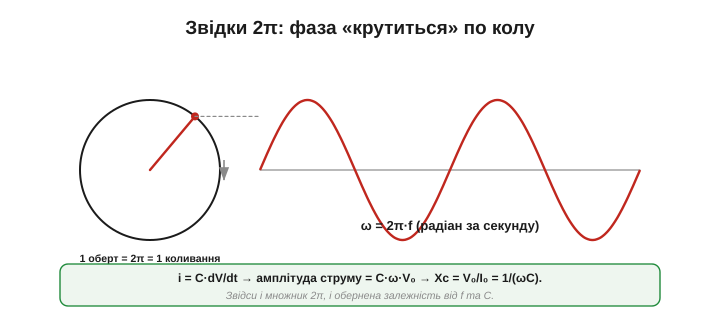
*Рис. 2.3.2.2. Для синусоїди V = V₀·sin(ωt) швидкість зміни (dV/dt) у ω разів більша за саму амплітуду. А струм конденсатора i = C·dV/dt, тож його амплітуда — це C·ω·V₀. Відношення напруги до струму V₀/I₀ = 1/(ωC) — це й є Xc. Звідси і 2π, і обернена залежність від f та C.*

Коротко, звідки взялася формула (не лякаючись похідної): для синусоїдної напруги V = V₀·sin(ωt) швидкість її зміни тим більша, чим швидше «крутиться» фаза, тобто пропорційна ω. А струм конденсатора i = C·dV/dt ([§2.3.1](ch09-reactance-resonance.md)) дорівнює цій швидкості, помноженій на C. Тож амплітуда струму виходить I₀ = C·ω·V₀, а відношення «напруга на струм» (тобто реактивність) — Xc = V₀/I₀ = 1/(ωC) = 1/(2πfC). Усі три риси — обернена залежність від f, від C і множник 2π — складаються самі собою.

### Одиниці — оми

Реактивність, як і опір, вимірюється в **омах** — і це не випадковість, а необхідність, бо нею ми користуватимемося замість опору. Перевірмо розмірність:

```
[1/(f·C)] = 1 / ( (1/с) · (Кл/В) ) = (В·с)/Кл = В / (Кл/с) = В/А = Ом   ✓
```

(тут ампер — кулон за секунду). Оми сходяться. Тепер Xc можна підставляти в закон Ома замість R — для **амплітуд** (чи діючих значень) напруги й струму:

```
V = I · Xc
```

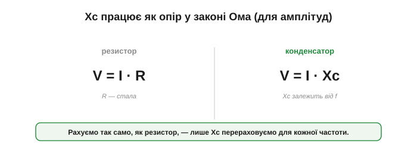
*Рис. 2.3.2.3. Знаючи Xc на заданій частоті, конденсатор рахують точно як резистор: амплітуда напруги = амплітуда струму × Xc. Різниця лише в тому, що Xc треба перерахувати для кожної частоти (і що тут є зсув фаз, про який — у §2.3.4).*

**Приклад (струм крізь конденсатор).** На конденсатор 1 мкФ подали змінну напругу амплітудою 5 В і частотою 1 кГц. Який струм потече? Спершу реактивність: Xc = 1/(2π·1000·1×10⁻⁶) ≈ 159 Ом. Тоді амплітуда струму:

```
I = V / Xc = 5 В / 159 Ом ≈ 31 мА
```

Підніміть частоту до 10 кГц — Xc упаде вдесятеро (≈ 16 Ом), а струм виросте вдесятеро (≈ 0.31 А). Той самий конденсатор, та сама напруга — удесятеро більший струм лише тому, що сигнал швидший.

Тут варто згадати тонкість із [§2.3.1](ch09-reactance-resonance.md): хоч крізь конденсатор тече струм і на ньому є напруга, активної потужності він **не споживає**. Струм і напруга зсунуті в часі (§2.3.4): коли одне максимальне, інше — нуль, тож їхній добуток у середньому за період дає нуль. Конденсатор то бере енергію (заряджаючись), то віддає (розряджаючись), майже не нагріваючись (ідеальний — зовсім; реальний трохи гріє свій ESR, [§2.1.5](../ch07-capacitor/ch07-capacitor.md)). Тому Xc — це «опір» лише в сенсі обмеження струму, а не втрат: реактивний елемент обмежує струм, майже не перетворюючи енергію на тепло.

### Як це виглядає на графіку

Оскільки Xc ∝ 1/f, графік реактивності від частоти — спадна крива (гіпербола): круто падає від нескінченності біля нуля й полого тягнеться вниз на високих частотах.

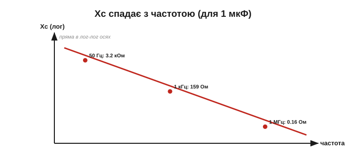
*Рис. 2.3.2.4. Xc(f) для конкретного конденсатора. На f → 0 (постійний струм) Xc прямує до нескінченності — конденсатор блокує. З ростом частоти Xc стрімко спадає. На графіку відмічено кілька порахованих точок для 1 мкФ.*

На практиці реактивність частіше малюють у **подвійно-логарифмічних** осях — тоді гіпербола Xc ∝ 1/f перетворюється на просту **пряму**, що спадає, і її легко читати на око. Саме такими графіками рясніють даташити конденсаторів і дроселів: пряма, що йде **вниз** із частотою, — це конденсатор; пряма **вгору** — котушка. Один погляд на нахил — і ясно, з якою деталлю маєш справу.

А якщо зафіксувати частоту й міняти ємність — Xc так само спадає (бо C теж у знаменнику): більший конденсатор має меншу реактивність на тій самій частоті.


*Рис. 2.3.2.5. На фіксованій частоті більший конденсатор дає меншу Xc. Тому для відведення низькочастотних пульсацій беруть великі ємності (мала Xc навіть на низьких f), а для високочастотних завад вистачає дрібних.*

Порахуймо для відчуття: на 50 Гц конденсатор 1 мкФ має Xc ≈ 3.2 кОм, а 100 мкФ — лише ≈ 32 Ом (у сто разів менша, бо ємність у сто разів більша). Тому згладжувальні конденсатори в живленні беруть великими: щоб на низькій частоті пульсацій їхня реактивність була мізерною й вони впевнено «закорочували» ту пульсацію.

### Приклади

Найкраще формула відчувається на числах. Візьмімо конденсатор 1 мкФ і подивімося, як його реактивність змінюється з частотою.

**Приклад (Xc на різних частотах).** C = 1 мкФ = 1×10⁻⁶ Ф.

```
на 50 Гц:    Xc = 1/(2π · 50 · 1×10⁻⁶)    ≈ 3 183 Ом   (≈ 3.2 кОм)
на 1 кГц:    Xc = 1/(2π · 1000 · 1×10⁻⁶)  ≈ 159 Ом
на 1 МГц:    Xc = 1/(2π · 1×10⁶ · 1×10⁻⁶) ≈ 0.16 Ом
на 0 Гц (DC):                              Xc → ∞   (блокує)
```

Той самий конденсатор: на мережевій частоті — кілька кілоом (помітна протидія), на радіочастоті — частки ома (майже коротке замикання), а для постійного струму — нескінченність. Одна деталь, чотири порядки різниці — і все за однією простою формулою.


*Рис. 2.3.2.6. Xc конденсатора 1 мкФ: від нескінченності на постійному струмі — до часток ома на радіочастотах. Та сама деталь по-різному «бачить» різні частоти.*

Зручне правило для прикидки в голові: щоразу, як частота **подвоюється**, Xc **зменшується вдвічі** (і навпаки). Тож, знаючи реактивність на одній частоті, легко оцінити її на сусідніх без калькулятора: на 100 Гц проти 50 Гц — удвічі менша, на 500 Гц — удесятеро. Це той самий обернений зв'язок 1/f, лише в зручній для пам'яті формі «октава вгору — удвічі менше».

> 🔧 **Навіщо це.** Тепер видно числами, чому розв'язувальний конденсатор працює ([§2.1.6](../ch07-capacitor/ch07-capacitor.md)). Керамічний 100 нФ на високій частоті шуму має реактивність у частки ома — тобто майже **коротке замикання** для завад, які він відводить у землю; а для постійного живлення (Xc нескінченна) він невидимий. Те саме й з розділовим конденсатором: великий номінал ставлять туди, де треба пропустити й низькі частоти (бо Xc мала лише коли C велике). Формула Xc = 1/(2πfC) — це робочий інструмент добору номіналу.

**Приклад (добір розв'язки).** Хочемо, щоб на частоті завади 1 МГц реактивність була не більша за 0.1 Ом. Яка потрібна ємність?

```
Xc = 1/(2πfC)   →   C = 1/(2πf·Xc)
C = 1 / (2π · 1×10⁶ · 0.1) ≈ 1.6×10⁻⁶ Ф ≈ 1.6 мкФ
```

Тобто для дуже низької реактивності на 1 МГц вистачає мікрофарадного конденсатора. На практиці ставлять кілька паралельно (велика ємність низом, дрібна керамічна — для найвищих частот, де велика «пливе» через ESL, [§2.1.5](../ch07-capacitor/ch07-capacitor.md)).

Ще одне щоденне застосування формули — **розділовий конденсатор** на вході підсилювача. Разом з опором навантаження він утворює частотно-залежний дільник: на низьких частотах Xc велика — сигнал слабшає; на високих Xc мала — сигнал проходить майже без втрат. Виходить **фільтр верхніх частот**, що пропускає корисний сигнал, але зрізає найнижчі частоти й постійне зміщення (саме те «блокує постійне, пропускає зміну» з §2.1.1, тепер кількісно). Де проходить межа — частота зрізу — задають C і опір кола; це найпростіший приклад того, як реактивність формує частотну характеристику, до якої ми ще повернемося в розділі.

### Частота, де Xc дорівнює опору

Особлива точка настає там, де реактивність конденсатора **зрівнюється** з опором кола: Xc = R. Прирівнявши 1/(2π·f·C) = R, дістаємо **частоту зрізу**:

```
f_c = 1 / (2π · R · C)
```

Нижче за неї переважає Xc (конденсатор «командує» поведінкою), вище — опір. І ось краса: у знаменнику стоїть рівно той самий добуток R·C, що й **стала часу** τ із [§2.1.4](../ch07-capacitor/ch07-capacitor.md)! Тобто f_c = 1/(2π·τ): швидкому RC-колу (мала τ) відповідає висока частота зрізу, повільному — низька. Часовий погляд (як швидко заряджається) і частотний (які частоти проходять) виявляються двома боками однієї монети — і це не випадковість, а глибокий зв'язок, який спливатиме знову й знову. Те, що в Розділі 2.1 ми вимірювали секундами, тут читається в герцах.

> 🔧 **Навіщо це.** Частота зрізу f_c = 1/(2πRC) — одна з найуживаніших формул в усій електроніці. За нею рахують межу будь-якого RC-фільтра: вхідного фільтра живлення, антидребезгу, частотної корекції, простого фільтра низьких чи високих частот. Запам'ятавши, що в ній той самий R·C, що й стала часу, ви вільно переходите між «скільки мілісекунд» і «до якої частоти» — а це дві мови, якими говорить уся аналогова схемотехніка.

Підсумуймо. Реактивний опір конденсатора **Xc = 1/(2πfC)** (в омах): обернено пропорційний і частоті, і ємності. Множник 2π — це перехід до кутової частоти ω = 2πf. Із Xc конденсатор рахують за законом Ома для амплітуд (V = I·Xc). На постійному струмі Xc нескінченна (блокує), на високих частотах — мала (пропускає). А де Xc зрівнюється з опором кола, настає частота зрізу **f_c = 1/(2πRC)** — той самий добуток R·C, що й стала часу з §2.1.4. Тепер — дзеркальна формула для котушки.

> 🔌 **Компонентна вставка:** [ємнісний баласт — реактивність як «резистор без тепла»](ch09-s2-c-capacitive-dropper.md). Як кілооми Xc живлять копійчані LED-лампи без жодного вата втрат, як упізнати цю схему за конденсатором X2 — і чому вона з'єднана з розеткою кожною своєю точкою, тож відкривати її ввімкненою не можна ніколи.

---

## 2.3.3 Реактивний опір котушки XL = 2·π·f·L

Реактивність котушки — пряме дзеркало конденсаторної. Якщо ви засвоїли [§2.3.2](ch09-reactance-resonance.md), то цю тему майже знаєте наперед: усе те саме, лише «догори ногами». Розберімо формулу, переконаємося в дзеркальності й попрактикуємося на числах.

### Формула

Реактивний опір котушки з індуктивністю L на частоті f:

```
XL = 2 · π · f · L  =  ω · L
```

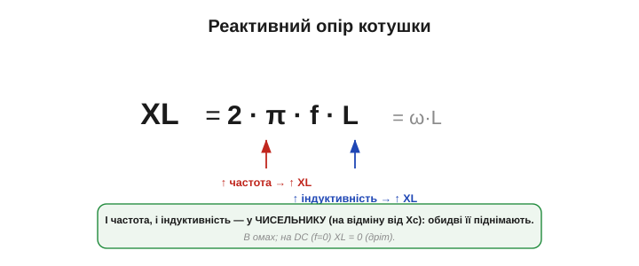
*Рис. 2.3.3.1. XL = 2πfL. І частота f, і індуктивність L стоять у **чисельнику** (на відміну від Xc, де вони в знаменнику) — тож більша частота **або** більша індуктивність дають **більшу** реактивність. Той самий множник 2π = ω.*

Прочитаймо. Тепер і f, і L — у **чисельнику** (а не в знаменнику, як у конденсатора). Тож обидва діють **навпаки** до випадку Xc: **що більша частота — то більша XL**, і **що більша індуктивність — то більша XL**. Перше ми знали з [§2.3.1](ch09-reactance-resonance.md); друге логічне — більша котушка сильніше опирається зміні струму ([§2.2.2](../ch08-inductor/ch08-inductor.md)). Подвоїте частоту — XL удвічі більша; подвоїте індуктивність — те саме. Жодних обернених залежностей чи нескінченностей, як у конденсатора, — усе просто й лінійно росте від нуля.

Чому в чисельнику, а не в знаменнику? Бо котушка протидіє **зміні** струму: чим швидша зміна (вища частота), тим більшу протидійну напругу вона наводить, тобто тим сильніше опирається. Конденсатор же навпаки — чим швидша зміна напруги, тим більший струм він пропускає, тобто тим **менше** опирається. Та сама частота діє на них у протилежні боки рівно тому, що один реагує на зміну струму, а інший — на зміну напруги.

### Звідки 2π: знову кутова частота

Множник 2π тут — той самий перехід до кутової частоти ω = 2πf, що й у конденсатора ([§2.3.2](ch09-reactance-resonance.md)). А виводиться формула дзеркально. Для синусоїдного струму i = I₀·sin(ωt) швидкість його зміни (di/dt) пропорційна ω. Напруга на котушці V = L·di/dt ([§2.2.2](../ch08-inductor/ch08-inductor.md)) дорівнює цій швидкості, помноженій на L, тож її амплітуда виходить V₀ = L·ω·I₀. А відношення «напруга на струм» — це й є реактивність:

```
XL = V₀ / I₀ = ω · L = 2πfL
```

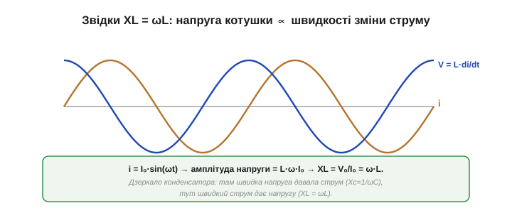
*Рис. 2.3.3.2. Для струму i = I₀·sin(ωt) напруга котушки V = L·di/dt має амплітуду L·ω·I₀. Відношення V₀/I₀ = ωL — це XL. Дзеркало конденсатора: там швидкість напруги давала струм (Xc = 1/ωC), тут швидкість струму дає напругу (XL = ωL).*

Порівняйте дві пари: у конденсатора швидка **напруга** породжувала великий **струм** (тож Xc = 1/ωC, мала), у котушки швидкий **струм** породжує велику **напругу** (тож XL = ωL, велика). Помінялися ролями струм і напруга — і обернена залежність стала прямою. Цю пару варто тримати в голові як ціле: конденсатор — «легкий для швидкого, важкий для повільного», котушка — точно навпаки. Засвоївши формулу однієї, другу ви фактично дістаєте безкоштовно, перевернувши дріб, — тому далі ми сміливо користуватимемося обома, не виводячи щоразу.

### Одиниці — теж оми

Реактивність котушки, як і конденсатора, вимірюється в **омах**. Перевірмо:

```
[f·L] = (1/с) · (В·с/А) = В/А = Ом   ✓
```

(індуктивність у генрі — це В·с/А, [§2.2.2](../ch08-inductor/ch08-inductor.md)). Оми сходяться, тож XL так само підставляють у закон Ома для амплітуд:

```
V = I · XL
```

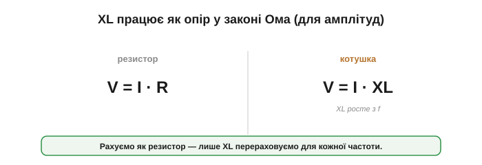
*Рис. 2.3.3.3. Знаючи XL на заданій частоті, котушку рахують як резистор: амплітуда напруги = амплітуда струму × XL. Як і в конденсатора, XL перераховують для кожної частоти, і тут теж є зсув фаз (§2.3.4).*

**Приклад (струм крізь котушку).** На котушку 10 мГн подали змінну напругу амплітудою 5 В частотою 1 кГц. Тоді XL = 2π·1000·0.01 ≈ 63 Ом, а струм:

```
I = V / XL = 5 В / 63 Ом ≈ 79 мА
```

Підніміть частоту до 10 кГц — XL зросте вдесятеро (≈ 630 Ом), а струм упаде вдесятеро (≈ 7.9 мА). Та сама котушка, та сама напруга — удесятеро **менший** струм, бо сигнал швидший. Це точне дзеркало конденсатора, де струм навпаки **зростав** із частотою.

Як і конденсатор, ідеальна котушка при цьому **не споживає** активної потужності: струм і напруга зсунуті в часі, тож у середньому за період добуток дає нуль. Це той самий запас енергії в магнітному полі (½·L·I², [§2.2.3](../ch08-inductor/ch08-inductor.md)), що гойдається туди-сюди: за півперіоду котушка вбирає енергію, за наступний — віддає, майже нічого не марнуючи (реальна гріє свій опір обмотки DCR і втрати в осерді, [§2.2.7](../ch08-inductor/ch08-inductor.md)). XL — це «опір» лише в сенсі обмеження струму, майже без нагріву.

### Як це виглядає на графіку

Оскільки XL ∝ f, графік реактивності від частоти — **зростальна** пряма (на відміну від спадної гіперболи Xc).

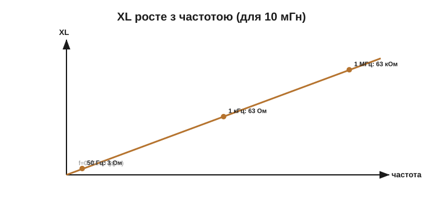
*Рис. 2.3.3.4. XL(f) для конкретної котушки. На f → 0 (постійний струм) XL = 0 — котушка просто дріт. З ростом частоти XL зростає лінійно. На графіку — кілька порахованих точок для 10 мГн.*

Зручне правило: щоразу, як частота **подвоюється**, XL теж **подвоюється** (прямий зв'язок — на відміну від конденсатора, де реактивність удвічі падала). На логарифмічних осях XL(f) — проста зростальна пряма, тоді як Xc(f) — спадна; у даташиті їх легко відрізнити просто за нахилом лінії.

А якщо зафіксувати частоту й міняти індуктивність — XL так само росте з L: більша котушка має більшу реактивність на тій самій частоті.

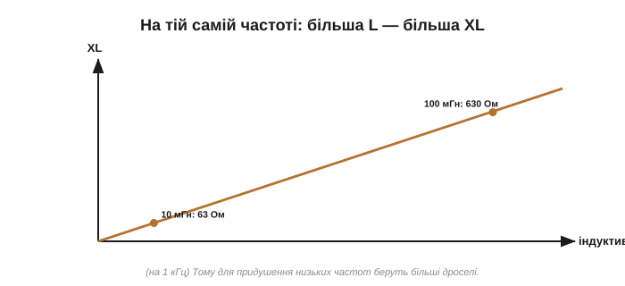
*Рис. 2.3.3.5. На фіксованій частоті більша котушка дає більшу XL. Тому щоб надійніше «задушити» шум на даній частоті, беруть більшу індуктивність — її XL для цього шуму вища.*

Порахуймо для відчуття: на 1 кГц котушка 10 мГн має XL ≈ 63 Ом, а 100 мГн — уже ≈ 630 Ом (удесятеро більша, бо індуктивність удесятеро більша). Тому для надійного придушення низькочастотної завади беруть більші дроселі: їхня XL відчутна навіть на невисоких частотах, де дрібна котушка ще «прозора».

### Приклади

Візьмімо котушку 10 мГн і подивімося, як росте її реактивність.

**Приклад (XL на різних частотах).** L = 10 мГн = 0.01 Гн.

```
на 0 Гц (DC):                              XL = 0       (дріт)
на 50 Гц:    XL = 2π · 50 · 0.01     ≈ 3.1 Ом
на 1 кГц:    XL = 2π · 1000 · 0.01   ≈ 63 Ом
на 1 МГц:    XL = 2π · 1×10⁶ · 0.01  ≈ 63 000 Ом   (≈ 63 кОм)
```

Той самий дросель: для постійного струму — нуль (прозорий), на мережевій частоті — кілька ом (майже не заважає), а на радіочастоті — десятки кілоом (стіна). Знову одна деталь, чотири порядки різниці — точне дзеркало конденсатора з [§2.3.2](ch09-reactance-resonance.md), лише в інший бік.

Подивімося на крайнощі. На постійному струмі (f = 0) XL = 0 — котушка зникає як перешкода, лишається тільки опір її обмотки (DCR, [§2.2.7](../ch08-inductor/ch08-inductor.md)). На дуже високій частоті XL злітає — котушка стає майже розривом (а реально ще раніше впирається у власну SRF, вище за яку взагалі починає поводитися як конденсатор, [§2.2.7](../ch08-inductor/ch08-inductor.md)). Між цими крайнощами XL росте рівномірно з частотою.

> 🔧 **Навіщо це.** Тепер видно числами, чому дросель і феритова намистина душать завади ([§2.2.7](../ch08-inductor/ch08-inductor.md)). На частоті завади XL котушки — десятки кілоом, тобто майже **розрив** для високочастотного шуму, який вона не пускає далі; а для постійного живлення (XL = 0) вона прозора. Формула XL = 2πfL — інструмент добору дроселя: щоб задушити шум на певній частоті, підбирають таку L, щоб її XL там була достатньо великою.

**Приклад (добір дроселя).** Хочемо, щоб на частоті завади 1 МГц котушка мала XL не менше за 1 кОм. Яка потрібна індуктивність?

```
XL = 2πfL   →   L = XL / (2πf)
L = 1000 / (2π · 1×10⁶) ≈ 1.6×10⁻⁴ Гн ≈ 160 мкГн
```

Тобто скромний дросель на 160 мкГн уже ставить кілоомну «стіну» перед мегагерцовою завадою, лишаючись практично прозорим для постійного живлення. Точно як у §2.3.2 ми добирали ємність за потрібною Xc — лише тут навпаки, за потрібною **великою** XL.

Те саме пояснює, чому **індуктивні навантаження** — мотори, трансформатори, обмотки реле — на змінному струмі поводяться як реактивність, а не чистий опір. Їхня котушка має чималу XL уже на мережевій частоті, тож обмежує струм навіть за мізерного омічного опору обмотки. Якби мотор увімкнути в мережу «по постійному», величезний струм спалив би обмотку; а на змінному струмі XL сама собою його стримує. (Звідси ж і великий пусковий струм мотора: поки він не розкрутився, картина складніша — але це вже тема систем керування.)

### Частота, де XL дорівнює опору

Як і в конденсатора, є особлива точка — де реактивність котушки зрівнюється з опором кола: XL = R. Прирівнявши 2πf·L = R, дістаємо частоту зрізу:

```
f_c = R / (2π·L)
```

І знову — глибокий зв'язок із часом. У знаменнику стоїть L (а в чисельнику R), тобто f_c = 1/(2π·(L/R)), а **L/R** — це рівно стала часу RL-кола з [§2.2.4](../ch08-inductor/ch08-inductor.md)! Тобто f_c = 1/(2π·τ), точно як у конденсатора (там було f_c = 1/(2π·RC)). Часовий і частотний погляди на котушку — знову дві мови одного й того самого: швидкому RL-колу (мала τ = L/R) відповідає висока частота зрізу.

### Дзеркало конденсатора

Зведімо обидві реактивності поруч — це найкорисніша картинка розділу.

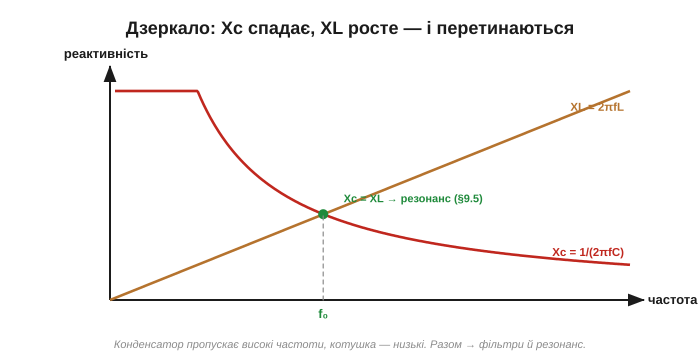
*Рис. 2.3.3.6. Xc = 1/(2πfC) спадає з частотою, XL = 2πfL росте. Конденсатор пропускає високі частоти, котушка — низькі. Там, де криві **перетинаються** (Xc = XL), реактивності зрівнюються — і саме там, як побачимо в §2.3.5, ховається резонанс.*

Ось уся дзеркальність на одній картинці. Реактивність конденсатора **спадає** з частотою, котушки — **росте**; вони перетинаються на одній особливій частоті. Це і є ключ до двох наступних великих ідей: **фільтрів** (вибирай, що пропустити) і **резонансу** (особлива частота, де Xc = XL).

Варто спинитися на точці перетину. Зліва від неї (низькі частоти) XL мала, а Xc велика; справа (високі) — навпаки. А рівно в точці, де Xc = XL, протидії конденсатора й котушки однакові — і, як ми побачимо, вони можуть взаємно **погаситися**. Це й є передчуття резонансу: дві криві, що сходяться, — серце всього, що буде далі в розділі.

> 🔧 **Навіщо це.** Пара «котушка послідовно + конденсатор у землю» — класичний LC-фільтр живлення. Тепер його дія прозора: на частоті завади котушка має велику XL (не пускає її вперед), а конденсатор — малу Xc (відводить у землю), тож шум давиться двічі. На постійному ж струмі котушка прозора (XL = 0), а конденсатор — стіна (Xc = ∞), і корисне живлення проходить недоторканим. Дві реактивності, що тягнуть у протилежні боки, і роблять такий фільтр напрочуд ефективним.

Перш ніж дійти до резонансу, треба розібратися ще з однією рисою реактивних елементів, яку ми весь час відкладали, — **зсувом фаз** між струмом і напругою.

Підсумуймо. Реактивний опір котушки **XL = 2πfL = ωL** (в омах): прямо пропорційний і частоті, і індуктивності — точне дзеркало конденсатора, де обидва множники були в знаменнику. На постійному струмі XL = 0 (дріт), на високих частотах — велика (блокує). Із XL котушку рахують за законом Ома для амплітуд (V = I·XL). А там, де XL зрівнюється з опором, лежить частота зрізу **f_c = R/(2πL)** — той самий L/R, що й стала часу з §2.2.4. Разом дві формули — Xc = 1/(2πfC) і XL = 2πfL — це робочий мінімум для всього змінного струму: з них рахують фільтри, дільники, контури й узгодження опорів. Маючи їх обидві, ми готові до наступного питання, яке весь час відкладали: чому в реактивних елементах струм і напруга «не в ногу»?

> 🔌 **Компонентна вставка:** [дросель і LC-фільтр у колі живлення — π-фільтр](ch09-s3-c-lc-supply-filter.md). Числа класичного π-фільтра (шум давиться в тисячу разів, корисний струм бачить міліоми), чому дросель у шині не гріється як резистор — і власний резонанс фільтра, через який «надто ідеальний» фільтр дзвонить.

---

## 2.3.4 Зсув фаз: струм і напруга «не в ногу»

Досі ми рахували лише **амплітуди** — у скільки разів струм менший за напругу (через X). Та реактивні елементи мають ще одну рису, яку ми весь час відкладали: у них струм і напруга **не збігаються в часі**. Коли напруга на піку, струм може бути нульовим, і навпаки. Цей зсув у часі називають **зсувом фаз**, і він — не дрібниця: саме через нього реактивність не гріється, саме він робить можливим резонанс, і саме він відрізняє реактивний елемент від резистора глибше за будь-яку формулу. Це остання велика ідея перед резонансом — і, як побачимо, саме вона все й уможливлює.

### У резисторі — в ногу

Почнімо з еталона. У резисторі струм щомиті пропорційний напрузі (закон Ома, [§1.3.2](../../block-1-circuits-physics/ch03-resistance-power-heat/ch03-resistance-power-heat.md)): більша напруга — одразу більший струм. Тож їхні синусоїди йдуть **синхронно**: разом досягають піків, разом перетинають нуль. Кажуть, що струм і напруга **у фазі** (зсув 0°).


*Рис. 2.3.4.1. На резисторі струм повторює напругу мить у мить: піки збігаються, нулі збігаються. Зсув фаз — нуль. Це еталон, із яким порівнюватимемо реактивні елементи.*

Чому це важливо запам'ятати? Бо лише там, де струм і напруга **в фазі**, елемент справді **споживає** потужність (нижче побачимо чому). Резистор — у фазі, тож гріється; реактивності — ні. Уже сам зсув фаз без жодних обчислень підказує, дисипативний елемент чи ні.

### У конденсаторі струм випереджає

У конденсатора все інакше. Згадаймо: його струм залежить не від самої напруги, а від **швидкості її зміни** (i = C·dV/dt, [§2.3.1](ch09-reactance-resonance.md)). А коли синусоїда напруги змінюється найшвидше? Не на піку (там вона на мить завмирає), а в момент **переходу через нуль** — там нахил найкрутіший. Тож струм конденсатора досягає максимуму саме тоді, коли напруга проходить нуль, — і виходить, що струм **випереджає** напругу на чверть періоду, тобто на 90°.


*Рис. 2.3.4.2. Струм конденсатора (червоний) досягає піка тоді, коли напруга (синій) проходить нуль (там вона міняється найшвидше). Тож струм **випереджає** напругу на 90° — «прибуває першим». Англійська підказка: у Capacitor — ICE, тобто I (струм) перед E (напругою).*

Інтуїтивно: щоб напруга на конденсаторі **зросла**, спершу має притекти заряд — тобто струм біжить **попереду**, готуючи напругу, яка лише потім підіймається. Струм тут — як кур'єр, що прибуває раніше за вантаж: спершу рух заряду, а напруга — його наслідок. Тому в конденсаторі струм і веде.

### У котушці струм відстає

У котушки — дзеркально. Її напруга залежить від швидкості зміни **струму** (V = L·di/dt, [§2.3.1](ch09-reactance-resonance.md)). Тож тепер навпаки: напруга на котушці максимальна, коли струм проходить нуль (міняється найшвидше). Виходить, що **напруга випереджає струм** на 90° — або, що те саме, **струм відстає** від напруги на 90°.

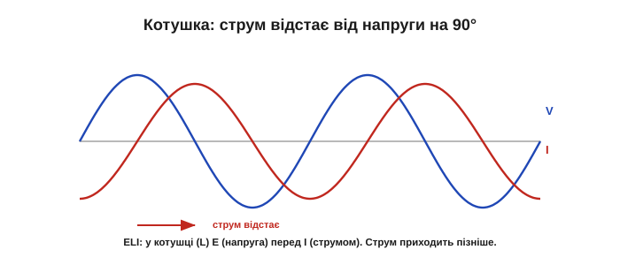
*Рис. 2.3.4.3. Напруга котушки (синій) досягає піка, коли струм (червоний) проходить нуль. Тож струм **відстає** від напруги на 90° — «приходить пізніше». Англійська підказка: у котушці (inductor, L) — ELI, тобто E (напруга) перед I (струмом).*

Інтуїтивно тут навпаки: щоб у котушці потік струм, спершу до неї треба **прикласти** напругу, яка поборе її інерцію ([§2.2.2](../ch08-inductor/ch08-inductor.md)); струм наростає лише згодом, наздоганяючи. Напруга — поштовх, струм — повільна реакція маховика, що розкручується із запізненням. Тому струм і відстає.

### Чому саме 90°, а не якось інакше

Звідки береться рівно чверть періоду? Це пряма властивість синусоїди: її **швидкість зміни** (нахил, похідна) — це теж синусоїда, але зсунута на 90°. Нахил синуса максимальний там, де сам синус нульовий (на переході через нуль), і нульовий там, де синус на піку. А оскільки струм конденсатора — це нахил напруги (а напруга котушки — нахил струму), вони неминуче зсунені рівно на чверть періоду.


*Рис. 2.3.4.4. Нахил (швидкість зміни) синусоїди максимальний на її переходах через нуль і нульовий на її піках. Тому «похідна» синуса — теж синус, але зсунений на 90°. Звідси й чверть періоду між струмом і напругою в C та L.*

Корисний образ — циферблат годинника. Якщо напруга «б'є» на 12-й годині, то струм конденсатора б'є на 3-й — на чверть кола раніше за наступний удар напруги (випереджає); а струм котушки — на 9-й, на чверть пізніше (відстає). Резистор же б'є точно разом із напругою, на 12-й. Чверть кола = 90° = чверть періоду; ось чому зсув саме такий, а не довільний. Цей зв'язок — між величиною та її швидкістю зміни — пронизує всю фізику коливань: він стоїть і за маятником (швидкість найбільша в нижній точці, де зміщення нульове), і за змінним струмом. Чверть періоду між «положенням» і «швидкістю» — універсальний підпис гармонічного руху, і реактивні елементи лише втілюють його в електриці.

### Мнемоніка: ELI the ICE man

Щоб не плутати, хто кого випереджає, інженери століттями користуються однією фразою-підказкою: **«ELI the ICE man»** (Елай — крижана людина).

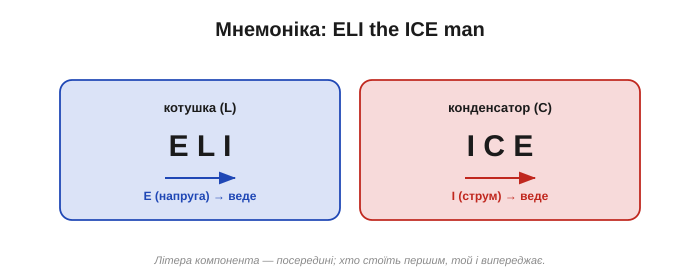
*Рис. 2.3.4.5. ELI: у котушці (L) напруга E випереджає струм I (струм відстає). ICE: у конденсаторі (C) струм I випереджає напругу E. Дві трибуквені «слова» — і ви ніколи не сплутаєте, хто веде.*

Розшифровка проста. **ELI**: літера L (котушка) — посередині, а навколо E…I, тобто **E** (напруга) перед **I** (струмом): у котушці напруга веде. **ICE**: літера C (конденсатор) — посередині, навколо I…E, тобто **I** (струм) перед **E** (напругою): у конденсаторі струм веде. Запам'ятали «ELI the ICE man» — і фази C та L назавжди на місці.

Це не педантизм. Переплутавши, хто веде, ви помилитеся зі знаком фази — а в колах зі зворотним зв'язком знак фази вирішує, працює схема чи **свистить** (самозбуджується). Тому цю коротку фразу інженери справді тримають у голові все життя.

### Фазори: реактивності під прямим кутом

Зручний спосіб тримати фази в голові — **фазорна діаграма**: кожну величину малюють стрілкою (фазором), а кут між стрілками показує зсув фаз. Чому стрілки? Бо синусоїду, як ми бачили в [§2.3.2](ch09-reactance-resonance.md), зручно уявляти проєкцією точки, що обертається по колу. Фазор — це і є той радіус-стрілка: довжина = амплітуда, кут = фаза. Дві величини «не в ногу» — це дві стрілки під кутом, що обертаються разом; складати їх треба як **вектори**, а не як числа. Опір кладуть уздовж осі (0°), а реактивності — **перпендикулярно** до нього: котушку вгору (+90°), конденсатор униз (−90°).


*Рис. 2.3.4.6. Фазорна діаграма: опір R — горизонтально (струм і напруга в фазі), реактивність котушки XL — під +90°, конденсатора Xc — під −90°. Реактивності спрямовані протилежно — тому вони можуть частково чи повністю **гасити** одна одну (звідси й резонанс, §2.3.5).*

Ця картинка одразу пояснює дві важливі речі. По-перше, чому реактивності C і L **протилежні**: їхні фазори дивляться в різні боки (вгору й вниз), тож у колі вони частково віднімаються — а коли зрівняються, повністю погасяться (це й буде резонанс, [§2.3.5](ch09-reactance-resonance.md)). По-друге, чому опір і реактивність не складаються просто числами: вони **перпендикулярні**, тож сумуються «за теоремою Піфагора» у **повний опір** (імпеданс) Z = √(R² + X²). Точну роботу з імпедансом ми тут не розгортатимемо — досить розуміти, що фази складаються геометрично, а не арифметично.

Звідси й важливий висновок: реальні кола рідко бувають чисто реактивними — у них завжди є й опір. Тоді зсув фаз не рівно 90°, а **десь між 0 і 90°**: що більша частка реактивності проти опору, то ближче до 90°; що більший опір — то ближче до 0°, до резисторної «синхронності». Цей проміжний кут і є фазою імпедансу, а його величину задає відношення X до R. Чистий конденсатор чи котушка — крайній випадок (рівно 90°), резистор — інший крайній (0°), а реальна схема — десь поміж.

Цей кут має й практичний слід. У RC- чи RL-фільтрі на частоті зрізу f_c (§2.3.2–§2.3.3) реактивність дорівнює опору — і зсув фаз там рівно **45°**, посередині між 0° і 90° (через це f_c інколи й звуть «точкою 45°»). А загалом, проходячи крізь фільтр, фаза сигналу плавно «повзе» від 0° далеко за смугою до 90° глибоко в ній. Ця зміна фази буває не менш важливою за зміну амплітуди: зайвий зсув фаз у петлі зворотного зв'язку — і підсилювач самозбуджується (до цього ще дійдемо в розділі про операційні підсилювачі).

### Чому реактивність не гріється

І нарешті — найважливіший наслідок зсуву фаз, який ми кілька разів обіцяли пояснити. Потужність — це добуток миттєвих струму й напруги (P = V·i, [§1.3.5](../../block-1-circuits-physics/ch03-resistance-power-heat/ch03-resistance-power-heat.md)). У резисторі вони в фазі, тож добуток завжди додатний — резистор увесь час споживає енергію (гріється). А в чистій реактивності струм і напруга зсунені на 90°: коли одне додатне, інше якраз переходить нуль, тож їхній добуток половину періоду додатний, половину — від'ємний, і **в середньому за період дорівнює нулю**.

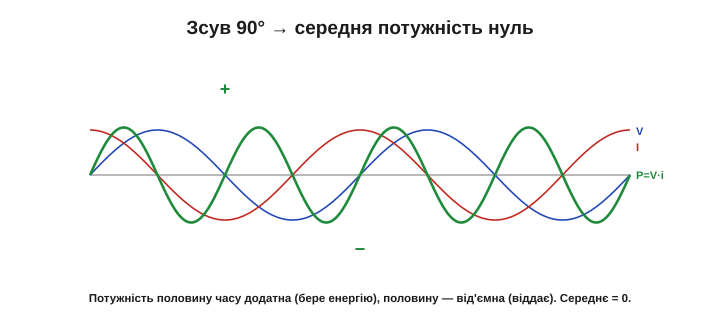
*Рис. 2.3.4.7. Миттєва потужність P = V·i для реактивного елемента половину часу додатна (елемент бере енергію), половину — від'ємна (віддає назад). Середнє за період — нуль: ідеальна реактивність не споживає активної потужності, лише «гойдає» енергію туди-сюди. Тому вона майже не гріється (реальна — трохи, через втрати в ESR/DCR).*

Точніше, середня потужність дорівнює ½·V₀·I₀·cos(φ), де φ — зсув фаз: для резистора φ = 0 і cos = 1 (уся потужність гріє), для чистої реактивності φ = 90° і cos = 0 (нуль). Цей множник cos(φ) і звуть **коефіцієнтом потужності** — він каже, яка частка «видимої» потужності справді витрачається.

Ось чому конденсатор і котушка можуть «опиратися» струму, лишаючись холодними: половину періоду вони беруть енергію з кола (заряджаючи поле), половину — повертають (поле спадає), у середньому не витрачаючи нічого. Цю «холосту» потужність, що гойдається туди-сюди, не роблячи роботи, звуть **реактивною** (вимірюють у варах, VAR — на відміну від ватів активної). Вона не фікція: реактивний струм справді тече дротами, навантажуючи генератор і лінії та гріючи їх своїм проходженням, хоч і не перетворюється на корисну роботу. Тому її прагнуть звести до мінімуму. Це той самий «реактивний» характер із [§2.1.3](../ch07-capacitor/ch07-capacitor.md) і [§2.2.3](../ch08-inductor/ch08-inductor.md), тепер пояснений через фазу: енергія гойдається, бо струм і напруга зсунені в часі.

> 🔧 **Навіщо це.** Цей зсув фаз — головний клопіт великої енергетики. Мотори й трансформатори індуктивні, тож тягнуть із мережі струм, що **відстає** від напруги; через зсув частина струму гойдається туди-сюди, не роблячи корисної роботи, але гріючи проводи. Міру цього зсуву звуть **коефіцієнтом потужності**. Щоб його виправити, на заводах і підстанціях ставлять батареї конденсаторів: їхній випереджальний струм компенсує відстаючий струм моторів, і фаза вирівнюється. Дзеркальність C і L тут працює буквально — випередження одного гасить відставання іншого. На осцилографі ([§1.6.7](../../block-1-circuits-physics/ch06-schematics-measurement/ch06-schematics-measurement.md)) цей зсув видно прямо очима: дві синусоїди, зсунені вбік.

Підсумуймо. У резисторі струм і напруга **в фазі** (0°); у конденсаторі струм **випереджає** напругу на 90°, у котушці — **відстає** (ELI the ICE man). Зсув рівно 90°, бо струм/напруга реактивного елемента — це **нахил** іншої величини, а нахил синуса зсунений на чверть. Фазори показують реактивності перпендикулярно до опору й протилежно одна одній — тож вони можуть гаситися (резонанс) і складаються з R геометрично (імпеданс). А головне — через зсув 90° реактивність **не споживає активної потужності**: не гріється, лише гойдає енергію. Тепер у нас є все, щоб зрозуміти найкрасивіше явище розділу. Адже якщо конденсатор тягне фазу в один бік (струм випереджає), а котушка — в інший (струм відстає), то, поставивши їх разом, можна змусити ці протилежні зсуви **погасити** одне одного. А коли реактивності C і L при цьому ще й зрівняються за величиною, станеться щось особливе — **резонанс**. До нього й переходимо.

> 🧮 **Математична вставка:** [похідні синуса й косинуса — чому зсув рівно 90°](ch09-s4-m-sine-derivative.md). Геометричний доказ (sin)′ = cos через дотичні, обертова стрілка, що пояснює одразу і 90°, і множник ω у реактивностях, — і чому синусоїда — єдина форма, яку лінійне коло не спотворює.

> ⚙️ **Алгоритмічна вставка:** [фігури Ліссажу — побачити зсув фаз у режимі XY](ch09-s4-a-lissajous.md). Режим XY перетворює фазу на форму петлі: пряма, еліпс чи коло читаються з одного погляду, sin φ = Y₀/B дає число, а напрям обходу показує, хто кого випереджає.

---

## 2.3.5 LC-резонанс: реактивності гасять одна одну (f₀)

Це кульмінація розділу — і явище, заради якого все будувалося. Поставмо конденсатор і котушку разом. Їхні реактивності тягнуть у протилежні боки: Xc спадає з частотою, XL росте ([§2.3.3](ch09-reactance-resonance.md)), а фази в них протилежні ([§2.3.4](ch09-reactance-resonance.md)). Тож знайдеться **одна-єдина** частота, де вони зрівняються за величиною й **повністю погасять** одна одну. Ця частота й зветься **резонансною**, а саме явище — **резонансом**. На ньому стоїть кожен радіоприймач, кожен генератор частоти й кожен налаштований контур з історії розділу. Якщо §2.3.1–§2.3.4 здавалися підготовкою — то ось заради чого вона була: усе сходиться тут, в одній особливій частоті.

### Умова резонансу: Xc = XL

Згадаймо «дзеркальну» картинку з [§2.3.3](ch09-reactance-resonance.md): криві Xc(f) і XL(f) перетинаються. Точка перетину — де реактивність конденсатора дорівнює реактивності котушки — і є резонанс.

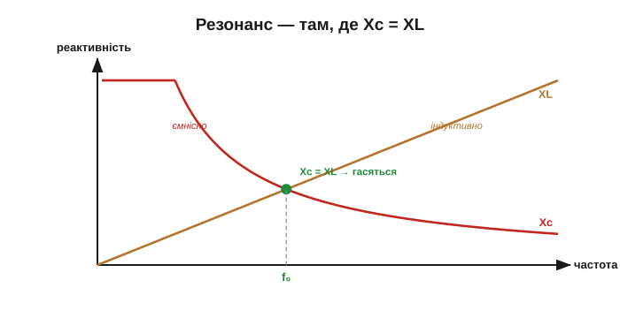
*Рис. 2.3.5.1. Xc спадає, XL росте; вони перетинаються на частоті f₀, де Xc = XL. Нижче f₀ переважає Xc (коло поводиться «ємнісно»), вище — XL («індуктивно»). Рівно на f₀ реактивності рівні й, маючи протилежні фази, взаємно гасяться.*

Нижче за f₀ більша Xc — коло поводиться як конденсатор; вище — більша XL, коло «індуктивне». А рівно на f₀ вони рівні: оскільки фази в них протилежні (одна тягне струм уперед, інша назад, [§2.3.4](ch09-reactance-resonance.md)), вони **знищують** реактивний вплив одне одного. Реактивність кола стає **нульовою** — лишається тільки опір.

А якщо реактивність нульова, то й зсув фаз із [§2.3.4](ch09-reactance-resonance.md) на f₀ зникає: струм і напруга знову **в фазі**, наче в чистому резисторі. Резонансна частота — єдина, де реактивне коло поводиться суто активно. Це й практичний спосіб її знайти: f₀ — там, де зсув фаз між струмом і напругою дорівнює нулю.

### Формула резонансної частоти

Знайти f₀ легко: прирівняймо реактивності, Xc = XL:

```
1/(2πf·C) = 2πf·L
```

Розв'язавши відносно f, дістаємо знамениту формулу резонансу:

```
f₀ = 1 / (2π · √(L·C))
```

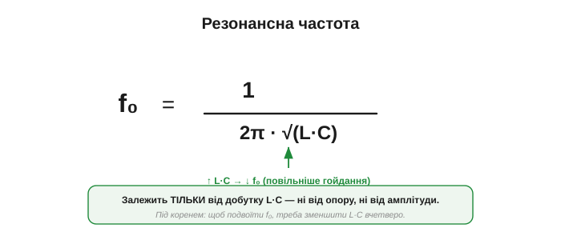
*Рис. 2.3.5.2. f₀ задається лише добутком L·C (і нічим більше). Більша індуктивність **або** більша ємність — нижча резонансна частота (повільніше «гойдання»). Корінь і 2π беруться з прирівнювання Xc = XL.*

Прочитаймо. Резонансна частота залежить **тільки** від добутку L·C: більші L чи C — нижча f₀, менші — вища. Жодного опору тут нема (він впливатиме не на f₀, а на гостроту резонансу — це вже [§2.3.6](ch09-reactance-resonance.md)). І зверніть увагу: під коренем, тож щоб **подвоїти** частоту, треба зменшити L·C **вчетверо**. Ще одна корисна риса: у цій базовій (ідеальній) формулі f₀ не залежить ні від амплітуди сигналу, ні від опору кола — лише від L і C. Тож резонансна частота стала й передбачувана (опір впливає головно на гостроту резонансу, не на саму f₀). Тонкість: це справедливо для **незгасальної** резонансної частоти. Якщо контур із помітними втратами «смикнути» й відпустити, його **власне згасальне** коливання йде на трішки **нижчій** частоті, що залежить від демпфування; для добротних контурів (висока Q, малі втрати) ця різниця мізерна. Тому f₀ = 1/(2π√(LC)) і лишається надійним «камертоном» для електроніки.

**Приклад (контур радіоприймача).** Котушка L = 100 мкГн і конденсатор C = 100 пФ:

```
f₀ = 1 / (2π · √(100×10⁻⁶ · 100×10⁻¹²))
f₀ = 1 / (2π · √(1×10⁻¹⁴))
f₀ = 1 / (2π · 1×10⁻⁷) ≈ 1.6 МГц
```

Якраз середина діапазону AM-радіо. Покрутіть змінний конденсатор — і f₀ попливе, по черзі збігаючись із частотами станцій. Це буквально та сама ручка налаштування з історії розділу, тепер у вигляді формули.

**Приклад (діапазон налаштування).** Лишімо ту саму котушку 100 мкГн, а конденсатор зробімо змінним від 40 до 400 пФ. Оскільки f₀ ∝ 1/√C, а ємність міняється в 10 разів, частота зміниться в √10 ≈ 3.2 раза: від ≈ 0.8 МГц (при 400 пФ) до ≈ 2.5 МГц (при 40 пФ). Один поворот ручки — і контур пробігає весь діапазон станцій. Саме так одним змінним конденсатором колись покривали цілу радіосмугу.

**Приклад (низька частота).** А візьмімо великі номінали — котушку 1 мГн і конденсатор 1 мкФ: f₀ = 1/(2π√(10⁻³·10⁻⁶)) = 1/(2π√(10⁻⁹)) ≈ 5 кГц, уже звукова частота. Великі L і C дають низьку f₀; дрібні — високу (радіо). Той самий контур, інші номінали — інша «нота».

### Аналогія гойдалки: коло має свою «ноту»

Чому реактивності, що гасяться, дають саме **резонанс** — бурхливий відгук? Бо LC-контур поводиться як **гойдалка** (історія розділу). У нього є власна частота f₀, і якщо «штовхати» його змінним сигналом саме на ній, відгук стрімко наростає — точно як розмах гойдалки, яку підштовхують у такт.

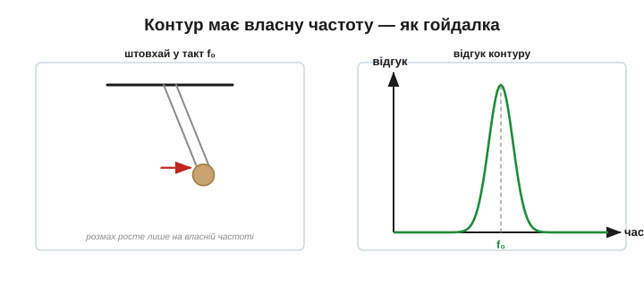
*Рис. 2.3.5.3. Гойдалку розгойдує лише штовхання в її ритмі; LC-контур бурхливо відгукується лише на сигнал своєї частоти f₀, а на чужих — майже ні. Власна частота кола = f₀ = 1/(2π√LC). Це й дозволяє «вихопити» з ефіру одну станцію.*

Чому відгук **наростає**, а не просто «проходить»? Бо на власній частоті кожен наступний поштовх додає енергію в такт із уже накопиченою — вони складаються. На чужій частоті поштовхи то додають, то віднімають, і амплітуда лишається малою. Тому контур на f₀ накопичує енергію багатьох циклів і відгукується в рази сильніше за вхідний сигнал — як гойдалка, що від легких поштовхів розгойдується високо. У цьому й сила резонансу: він **підсилює** свою частоту самим лише накопиченням.

### Енергія гойдається між C і L

Що саме «гойдається» в електричному маятнику? **Енергія** — між полем конденсатора й полем котушки. На резонансі конденсатор повністю розряджається в котушку (вся енергія переходить у магнітне поле, ½·L·I², [§2.2.3](../ch08-inductor/ch08-inductor.md)), потім котушка перезаряджає конденсатор у протилежний бік (енергія знову в електричному полі, ½·C·V², [§2.1.3](../ch07-capacitor/ch07-capacitor.md)) — і так туди-сюди, з частотою f₀.

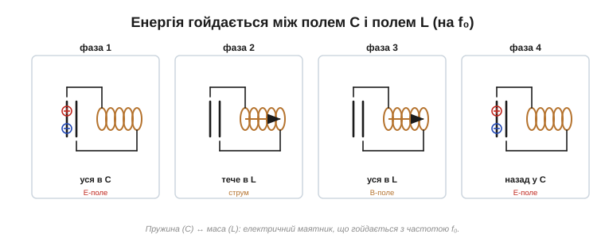
*Рис. 2.3.5.4. Чотири фази циклу: (1) уся енергія в полі C; (2) перетікає в L (струм максимальний); (3) уся в полі L, перезаряджаючи C навпаки; (4) повертається в C. Це точне дзеркало маятника, де енергія гойдається між потенціальною (пружина-C) і кінетичною (маса-L).*

Це пряме продовження дуальності з [Розділів 2.1](../ch07-capacitor/ch07-capacitor.md) і [2.2](../ch08-inductor/ch08-inductor.md): конденсатор — «пружина» (потенціальна енергія), котушка — «маса» (кінетична), а разом вони — **маятник**, що гойдається на своїй частоті. Резонанс — це коли зовнішній сигнал розгойдує цей маятник у такт.

І частота цього гойдання — рівно f₀ = 1/(2π√(LC)). Це та сама частота, з якою «дзвенів» розряд лейденської банки в досліді Кельвіна (історія розділу): заряджений конденсатор, замкнений на котушку, гойдає енергію туди-сюди саме на своїй резонансній частоті, аж поки опір її не згасить. Формула f₀ і описує цю власну ноту кола — байдуже, розгойдали його зовні чи «смикнули» раз і відпустили.

Зауважте красу: на резонансі джерелу майже не доводиться підкачувати енергію — вона вже гойдається в контурі, лише трохи поповнюючись замість тієї, що з'їв опір. Тому контур із малим опором дзвенить довго й відгукується гостро, а з великим — швидко глухне. Саме ця думка — наскільки добре контур тримає своє гойдання — і веде нас далі, до поняття добротності.

### Дві картини: послідовний і паралельний контур

Як саме виявляється резонанс, залежить від того, з'єднані C і L **послідовно** чи **паралельно**.

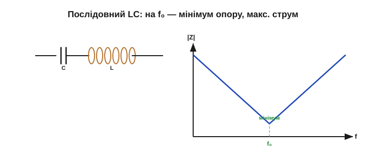
*Рис. 2.3.5.5. Послідовний LC. На f₀ реактивності Xc і XL рівні й протилежні, тож **сумарна реактивність нуль** — коло має мінімальний опір (лише активний) і пропускає максимальний струм. Поза резонансом — велика реактивність, струм малий. Це фільтр, що пропускає одну частоту.*

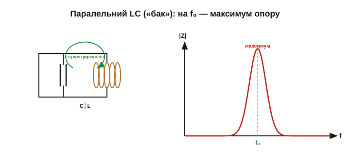
*Рис. 2.3.5.6. Паралельний LC («бак»). На f₀ струми в гілках C і L рівні й протифазні — вони **циркулюють по колу між C і L**, майже не беручи струму ззовні. Тож для джерела контур виглядає як **максимальний опір** (майже розрив). Це класичний «вибірковий» елемент радіо.*

У **послідовному** контурі на резонансі реактивності гасяться, тож коло стає майже **коротким замиканням** (мінімальний опір, максимальний струм) — він пропускає свою частоту найкраще. У **паралельному** («бак», *tank*) навпаки: на f₀ струм циркулює всередині між C і L, а для зовнішнього кола контур виглядає як майже **розрив** (максимальний опір). Обидва — вибіркові до f₀, лише по-різному; який обрати, залежить від задачі.

Цікавий і небезпечний наслідок послідовного резонансу: хоча реактивності гасяться й сумарна напруга мала, напруги на **самих** C і L при цьому не зникають — навпаки, вони можуть **набагато перевищити** вхідну, бо великий резонансний струм тече крізь їхню чималу реактивність. Так слабкий сигнал на f₀ здатен «накачати» на конденсаторі чи котушці у багато разів вищу напругу. Це водночас і використовують (резонансні перетворювачі, котушки запалювання), і остерігаються (несподівана перенапруга в колах живлення).

Якщо накреслити повний опір контуру від частоти, видно гостру особливість рівно на f₀: у послідовного там глибокий **провал** опору (мінімум), у паралельного — гострий **пік** (максимум). Чим вужчий цей провал чи пік, тим вибірковіший контур — тим точніше він відділяє свою частоту від сусідніх. А від чого залежить ця гострота — і є наступна тема ([§2.3.6](ch09-reactance-resonance.md)).

> 🔧 **Навіщо це.** Паралельний LC-контур — серце радіоприймача: налаштований на f₀ станції, він має на цій частоті величезний опір і виділяє саме її, ігноруючи решту ([§2.3.7](ch09-reactance-resonance.md) — як це дає вибірковість). Послідовний контур, навпаки, ставлять як «пастку», що закорочує одну небажану частоту в землю. А загалом, де треба **вибрати чи відкинути** конкретну частоту — там майже завжди LC-резонанс: радіо, генератори, фільтри, бездротові зарядки, RFID.

### Налаштування: керована f₀

Оскільки f₀ задана добутком L·C, її легко **зсувати**, зробивши L або C змінними — і саме так перемикаються між частотами.

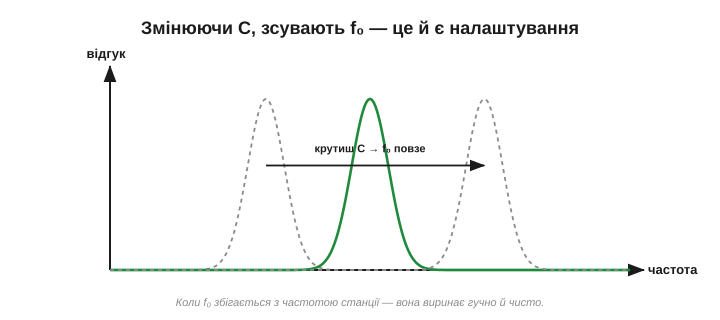
*Рис. 2.3.5.7. Міняючи ємність (змінний конденсатор) чи індуктивність, зсувають резонансну частоту контуру. Коли f₀ збігається з частотою станції, контур бурхливо відгукується саме на неї. Це і є та «ручка налаштування» з історії розділу.*

Покрутили ручку — змінили C — зсунули f₀ — упіймали іншу станцію. У сучасних пристроях замість механічного конденсатора часто використовують варикап (керований напругою), та принцип незмінний: налаштувати приймач — означає звести f₀ контуру до потрібної частоти.

> 🔌 **Компонентна вставка:** [резонанс, що живить картку — RFID і NFC як налаштовані LC-контури](ch09-s5-c-nfc-rfid.md). Як кілька витків і сотня пікофарад годують чип без батарейки (взаємоіндукція + розгойдування ×Q), як картка відповідає, смикаючи спільне поле, — і чому дві картки в гаманці «не читаються».

Насамкінець варто бачити ширшу картину. LC-резонанс — лише один представник великої родини. Та сама ідея власної частоти працює в кварцовому кристалі (механічний резонатор такої точності, що тактує годинники й процесори), в антені (резонує на своїй довжині хвилі — про це в радіорозділах), у струні гітари, навіть у корпусі приладу, що небажано «дзвенить» від вібрації. Скрізь, де є два сховища енергії й обмін між ними, чатує резонанс — корисний, якщо його приручити, і підступний, якщо проґавити. LC-контур — його найчистіше електричне втілення.

> 🔧 **Навіщо це.** Хочете виділити або згенерувати конкретну частоту — починайте з f₀ = 1/(2π√(LC)): підберіть L і C так, щоб їхній добуток дав потрібну частоту. Це перший крок у проєктуванні приймача, генератора, бездротової зарядки чи RFID-мітки. А якщо десь у схемі завівся небажаний «дзвін» — підозрюйте паразитний LC-резонанс (скажімо, дросель із паразитною ємністю, [§2.2.7](../ch08-inductor/ch08-inductor.md)) і шукайте його f₀ за тією самою формулою.

Підсумуймо. **Резонанс** настає на частоті, де реактивності конденсатора й котушки рівні (Xc = XL) і, маючи протилежні фази, гасять одна одну. Ця частота **f₀ = 1/(2π√(LC))** залежить тільки від L і C. Контур поводиться як **електричний маятник**: енергія гойдається між полями C і L з частотою f₀, і коло бурхливо відгукується лише на неї — як гойдалка на свій ритм. У послідовному контурі резонанс дає мінімальний опір (максимальний струм), у паралельному — максимальний. Це й дозволяє вибрати одну частоту з багатьох. Лишилося спитати: **наскільки гостро** контур вибирає свою частоту — і від чого це залежить. Адже станція виринає чисто лише тоді, коли контур озивається на вузьку смужку навколо f₀, а не на пів-діапазону одразу. Так ми приходимо до добротності Q.

> 🧮 **Математична вставка:** [формула Томсона — виведення й аналогія з маятником](ch09-s5-m-thomson-formula.md). Два шляхи до f₀ = 1/(2π√(LC)): за один рядок із рівності реактивностей і глибше — з рівняння d²v/dt² = −v/(LC), яке пише сама схема; плюс механічний словник «L — маса, 1/C — пружина», що пояснює і корінь, і добуток.

> ⚙️ **Алгоритмічна вставка:** [знайти резонанс свіпом — генератор, амплітуда, пошук максимуму](ch09-s5-a-resonance-sweep.md). Як спитати в реального контуру, де його f₀ і Q: покроковий свіп із псевдокодом, головна пастка часу встановлення (~Q періодів) і «привиди» третьої гармоніки меандра.

---

## 2.3.6 Добротність Q і смуга

Резонанс на f₀ буває **гострим** або **розмитим**. Один контур озивається лише на вузеньку смужку частот біля f₀ (і чітко відділяє одну станцію від сусідньої), інший — на широку (і пропускає їх упереміш). Цю гостроту описує одне число — **добротність** Q. Вона ж каже, як довго контур «дзвенить», скільки в ньому втрат і наскільки він вибірковий. Розберімо її з усіх боків. Q — одне з найуживаніших чисел у радіотехніці, і варто відчути його не як формулу, а як «дзвінкість»: висока Q — чистий довгий тон, низька — глухий короткий стук.

### Q — гострота резонансу

Накреслимо відгук контуру від частоти для кількох варіантів. Що менше в контурі втрат, то **вищий** і **вужчий** пік на f₀; що більше втрат, то нижчий і ширший.

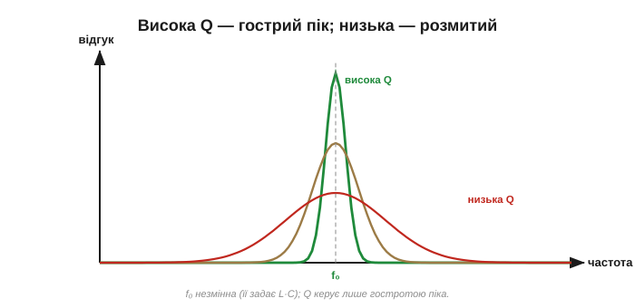
*Рис. 2.3.6.1. Що вища добротність Q, то гостріший і вищий резонансний пік: контур озивається лише на вузеньку смужку біля f₀. Низька Q дає широкий пологий горб — контур «розмитий». Сама частота f₀ при цьому майже не змінюється (її задає L·C, §2.3.5) — змінюється лише гострота. (У реальному навантаженому контурі помітні втрати й паразитики можуть трохи зсунути й центр, але в добротних колах цим нехтують.)*

Висока Q означає **гострий** резонанс: контур різко виділяє свою частоту й майже глухий до сусідніх. Низька Q — **розмитий**: відгук широкий і пологий. При цьому сама f₀ лишається на місці (її задає L·C); Q керує тільки тим, наскільки вузько контур навколо неї озивається. Уявіть це як «гостроту ока» контуру: висока Q — він бачить лише вузьку смужку частот, а решти не помічає; низька Q — дивиться широко, але розмито. Точка фокуса (f₀) при цьому не рухається — міняється лише різкість.

### Q і смуга пропускання

Гостроту вимірюють кількісно через **смугу пропускання** Δf — ширину піка (зазвичай на рівні половинної потужності, «−3 дБ»). Добротність — це відношення резонансної частоти до цієї ширини:

```
Q = f₀ / Δf
```

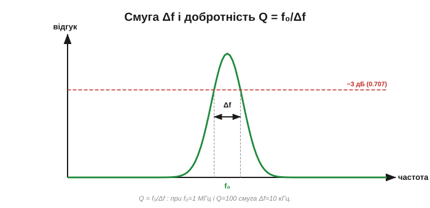
*Рис. 2.3.6.2. Смуга Δf — ширина резонансного піка на рівні −3 дБ (де відгук падає до ~0.7 від максимуму). Добротність Q = f₀/Δf: вузька смуга при тій самій f₀ означає високу Q. Q = 100 на 1 МГц — це смуга лише 10 кГц.*

**Приклад (смуга з Q).** Контур налаштовано на f₀ = 1 МГц і має Q = 100. Яка його смуга?

```
Δf = f₀ / Q = 1 000 000 / 100 = 10 000 Гц = 10 кГц
```

Десять кілогерц — досить вузько, щоб виділити одну радіостанцію з-поміж сусідніх. Хочете гостріше (вужчу смугу) — потрібна вища Q.

Чому саме «−3 дБ»? На цьому рівні відгук падає до ≈ 0.707 від максимуму за напругою — а за потужністю рівно вдвічі (звідси «половинна потужність»). Це загальноприйнята умовна межа «краю» смуги: усередині неї сигнал вважають пропущеним, поза нею — придушеним. Що таке децибели й чому вони логарифмічні — окрема тема радіорозділів; тут досить знати, що ширину Δf відлічують саме за цим рівнем.

### Q і втрати: опір гасить резонанс

Від чого ж залежить Q? Від **втрат** у контурі — насамперед від опору. Чим менший опір (активні втрати), тим вища добротність. Для послідовного контуру Q дорівнює відношенню реактивності до опору на резонансі:

```
Q = (ω₀·L) / R = XL / R   (на резонансі)
```

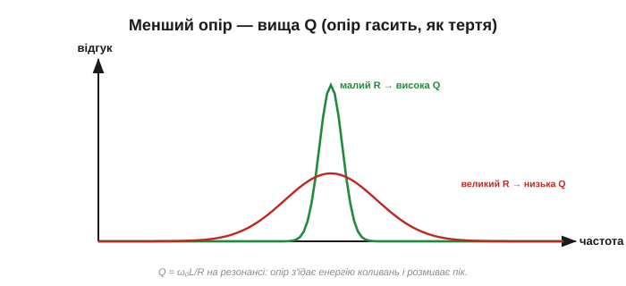
*Рис. 2.3.6.3. Опір R «гасить» резонанс, як тертя — маятник. Малий R → висока Q → гострий пік. Великий R → низька Q → розмитий. Тому для гострих контурів беруть котушки з малим опором обмотки й добрі (малих втрат) конденсатори.*

Опір грає роль **тертя**: він з'їдає енергію коливань, не даючи їм накопичитися. Тому для гострого контуру потрібні якомога менші втрати — котушка з малим опором обмотки (велика власна Q, [§2.2.7](../ch08-inductor/ch08-inductor.md)) і конденсатор без втрат. Будь-який зайвий опір у колі знижує Q й розмиває резонанс.

**Приклад (Q з опору).** Котушка 100 мкГн з опором обмотки R = 10 Ом у контурі на f₀ = 1.6 МГц. Реактивність на резонансі ω₀L = 2π·1.6×10⁶·100×10⁻⁶ ≈ 1000 Ом, тож Q = ω₀L/R = 1000/10 = **100**. Зменшіть опір до 1 Ом (товщий дріт, добротніша котушка) — і Q підскочить до 1000, резонанс стане вдесятеро гострішим. Ось чому в радіоконтурах так бережуть малий опір.

Важлива тонкість: Q **падає**, щойно до контуру під'єднати навантаження. Власна (ненавантажена) добротність може бути високою, та коло, що відбирає енергію (наступний каскад, антена), додає втрат — і «навантажена» Q стає нижчою. Тож реальна гострота залежить не лише від самого контуру, а й від того, що до нього під'єднано.

Орієнтири на практиці: проста повітряна котушка дає Q у кілька десятків, добра радіочастотна — сотні, кварц — десятки тисяч і вище. А фільтри живлення навмисне роблять із **низькою** Q (одиниці), щоб вони не «дзвеніли». Тож, почувши «контур із Q = 200», уявляйте гострий радіорезонанс, а «Q = 2» — м'який згладжувальний фільтр.

### Глибший сенс Q: запас проти втрат

За цими формулами стоїть одне фундаментальне означення, що пояснює їх усі. Добротність — це міра того, у скільки разів енергія, **запасена** в контурі, перевищує енергію, що **губиться за один цикл**:

```
Q = 2π · (запасена енергія) / (втрачена за цикл)
```

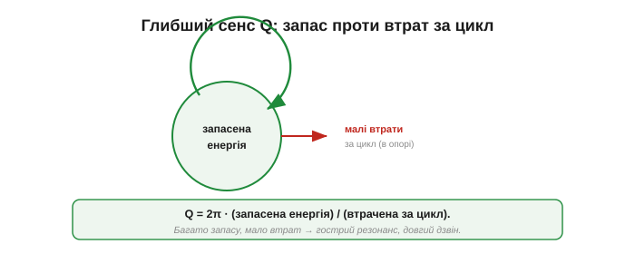
*Рис. 2.3.6.4. Глибший сенс: висока Q означає, що в контурі гойдається багато енергії, а втрачається за цикл — мало. Тому коливання тривають довго (контур «дзвінкий»), а на резонансі накопичується великий відгук. Низька Q — енергія швидко витікає в опір.*

Звідси все й випливає. Багато запасеної енергії проти малих втрат — це і гострий резонанс (бо мало демпфування), і довгий «дзвін» (бо енергія не швидко витікає), і вузька смуга. Усі прояви Q — це одна й та сама річ: наскільки добре контур **утримує** своє коливання.

Звідси й ще один яскравий прояв, який ми зустріли в [§2.3.5](ch09-reactance-resonance.md): у послідовному контурі на резонансі напруга на самих C і L перевищує вхідну рівно **в Q разів**. Контур із Q = 100, збуджений сигналом 1 В на f₀, дасть на конденсаторі цілих 100 В! Так слабкий сигнал «накачує» велику напругу — це і корисно (підсилення кволого радіосигналу, котушка запалювання), і небезпечно (несподівана перенапруга). Q — це і коефіцієнт цього накачування.

Варто оцінити, як усі означення Q сходяться в одне число. Q = f₀/Δf (через смугу), Q = ω₀L/R (через втрати), Q = 2π·запас/втрати (через енергію), Q ≈ число помітних коливань після поштовху (через час) — це **те саме** Q, побачене з різних боків. Гострота піка, вузькість смуги, малість втрат, тривалість дзвону, коефіцієнт накачування напруги — це шість облич однієї властивості. Зустрівши будь-яке, ви знаєте й решту.

### Q у часі: дзвін

У Q є й часовий бік. «Смикніть» контур — і високодобротний дзвенітиме **багато циклів**, повільно згасаючи, а низькодобротний змовкне майже відразу. Це та сама згасальна експонента, що в RC і RL ([§2.1.4](../ch07-capacitor/ch07-capacitor.md), [§2.2.4](../ch08-inductor/ch08-inductor.md)), лише накладена на коливання: Q каже, скільки коливань уміститься, поки амплітуда впаде.

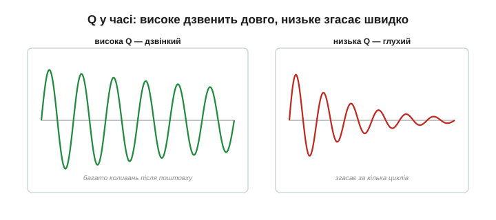
*Рис. 2.3.6.5. «Смикнутий» контур: за високої Q коливання тривають багато періодів, повільно згасаючи (дзвінкий); за низької — згасають за кілька циклів (глухий). Грубо, Q ≈ кількість помітних коливань після поштовху. Це той самий згасальний процес, що й RC/RL, лише накладений на резонанс.*

Є й зручна оцінка: добротність приблизно дорівнює числу коливань, за яке «дзвін» помітно згасає (точніше, за Q/π коливань амплітуда падає в e разів). Тому, побачивши на осцилографі «дзвін» після різкого фронту, можна на око прикинути Q контуру, просто полічивши коливання, перш ніж вони згаснуть.

Звідси й побутова інтуїція: дзвін, камертон, келих мають **високу** Q — тому й гудуть довго чистою нотою; а от шматок дерева чи подушка — низьку, тому «бухкають» глухо й коротко. Q — поняття не лише електричне: гойдалка має Q у десятки, а амортизатор авто навмисне роблять із низькою Q, щоб машина не розгойдувалася. Електричний контур поводиться так само — лише швидше.

### Компроміс: гостро чи широко

Висока Q — не завжди добре. Так, вона дає гостру вибірковість (виділити одну станцію), та водночас **вузьку** смугу — а в смугу має вміститися сам сигнал із його шириною. Радіостанція передає не одну частоту, а смугу навколо неї (бо несе інформацію); якщо контур надто гострий, він «обріже» краї сигналу й спотворить його.

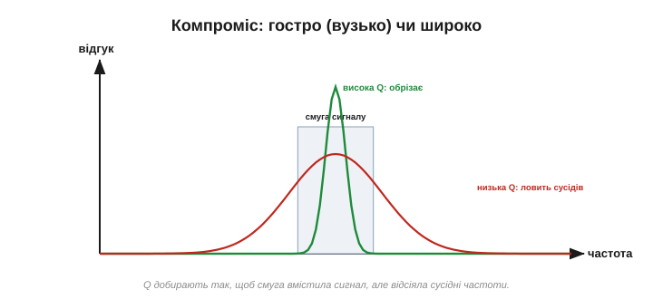
*Рис. 2.3.6.6. Висока Q — гостро відділяє сусідні станції, але вузька смуга може обрізати сам сигнал. Низька Q — пропускає весь сигнал, але гірше відділяє сусідів. Добротність добирають як компроміс: достатньо гостро, щоб відсіяти чуже, але досить широко, щоб пропустити своє.*

Тому Q добирають під задачу: достатньо високу, щоб відсіяти сусідні канали, але не настільки, щоб обрізати корисний сигнал. Це класичний компроміс **вибірковість ↔ смуга**, до якого ми ще повернемося, коли говоритимемо про фільтри ([§2.3.7](ch09-reactance-resonance.md)).

Конкретно: **канал** AM-радіо займає близько 10 кГц (саме так їх рознесено в ефірі). А оскільки амплітудна модуляція дає дві бічні смуги, ці 10 кГц радіосмуги відповідають лише близько **5 кГц аудіо** — звідси й «телефонна» якість звуку AM (точні цифри й правила різняться за регіонами). Контур приймача на 1 МГц із Q = 100 дає смугу якраз ~10 кГц — під один канал. А з Q = 1000 смуга була б лише 1 кГц: сусідні станції відсіялися б чудово, та звук обрізало б до глухого бубоніння. Тому Q беруть не «якомога вищою», а саме під ширину сигналу — це інженерне рішення, а не «що більше, то краще».

### Рекордсмен: кварц

Наскільки високою буває Q? У звичайного LC-контуру — десятки чи сотні. А от **кварцовий кристал** — механічний резонатор, що дзвенить на своїй частоті, — має Q у **десятки й сотні тисяч** (а спеціальні — мільйони). Тому його «нота» неймовірно чиста й стабільна.

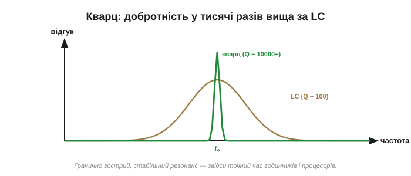
*Рис. 2.3.6.7. Кварцовий кристал має фантастично високу Q (десятки тисяч і більше) проти десятків-сотень у LC. Звідси гранично гострий, стабільний резонанс — ідеальний «камертон» для годинників і процесорів.*

> 🔧 **Навіщо це.** Саме надвисока Q кварцу дає точний час: його резонанс такий гострий і стабільний, що частота «пливе» мізерно — звідси кварцові годинники, тактові генератори процесорів, радіо з кварцовою стабілізацією. А в LC-колах Q — це те, на що дивляться, проєктуючи фільтр чи контур: висока Q для гострого вибору частоти (радіо), помірна — для фільтрів живлення, де важливіша широка смуга. «Добротна котушка» в даташиті ([§2.2.7](../ch08-inductor/ch08-inductor.md)) — це саме про малі втрати, тобто високу Q.

Чому кварц такий добротний? Бо втрати в коливанні кристалічної решітки мізерні — куди менші, ніж опір будь-якого дроту в LC-контурі. До того ж його частота майже не «пливе» від температури й часу. Тому кварц витіснив LC-контури всюди, де потрібна точна, стабільна частота: від наручного годинника до тактового генератора, що задає ритм мільярдам операцій процесора щосекунди.

Підсумуймо. **Добротність Q** — це гострота резонансу: висока Q дає вузький високий пік (Q = f₀/Δf), довгий «дзвін» і сильний відгук, низька — широкий пологий. Q визначається **втратами**: менший опір — вища Q (Q = ω₀L/R), бо опір гасить коливання, як тертя маятник. Глибинно Q — це відношення запасеної енергії до втрат за цикл. Висока Q — це і вибірковість, і стабільність (кварц), та її врівноважують потребою в достатній смузі. Найкоротше: Q — це «дзвінкість» кола, одне число для гостроти піка, ширини смуги, малості втрат і тривалості дзвону. Тепер, знаючи **f₀** (де резонанс) і **Q** (наскільки він гострий), ми маємо повний опис будь-якого контуру — і готові скласти останню картину розділу: як коло з R, L і C **вибирає** одні частоти й відкидає інші. Це частотна вибірковість, основа всіх фільтрів.

> 🧮 **Математична вставка:** [добротність Q математично — запасена енергія і швидкість згасання](ch09-s6-m-q-factor.md). Одне енергетичне означення Q = 2π·W/W_втрат, з якого за три рядки виходять і ω₀L/R, і правило «скільки коливань дзвону видно — така і Q», і зв'язок зі смугою f₀/Δf.

> 📜 **Історична вставка:** [міст Такома-Нерроуз (1940) — чому «класичний приклад резонансу» не резонанс](ch09-s6-history-tacoma.md). Галопуюча Герті, кадри з кожного підручника — і чесний розбір: вихори на ~1 Гц не могли резонансно гойдати моду 0.2 Гц; міст занапастив флатер — самозбудження з від'ємним згасанням, рідний брат свисту підсилювача.

## 2.3.7 RLC і частотна вибірковість

Ось ми й дійшли до того, заради чого був увесь Розділ 2.3. Ми з'ясували, що «опір» конденсатора й котушки залежить від частоти ([§2.3.1](ch09-reactance-resonance.md)–[§2.3.3](ch09-reactance-resonance.md)), що вони зсувають фазу ([§2.3.4](ch09-reactance-resonance.md)), що разом мають резонанс ([§2.3.5](ch09-reactance-resonance.md)) з певною гостротою Q ([§2.3.6](ch09-reactance-resonance.md)). Складімо тепер усе це докупи. Якщо «опір» компонента залежить від частоти, то коло з нього **по-різному пропускає різні частоти** — одні легко, інші притлумлює. Коло, що навмисне це робить, звуть **фільтром** (filter), а саму здатність — **частотною вибірковістю** (frequency selectivity). Це й є фінальна ідея розділу: схема, яка **обирає** частоти.

### Найпростіший фільтр: лише R і C

Цікаво, що для вибірковості навіть не потрібні всі три елементи — досить резистора й конденсатора. Згадаймо дільник напруги ([§1.5](../../block-1-circuits-physics/ch05-equivalent-circuits/ch05-equivalent-circuits.md)): два опори ділять напругу в пропорції своїх величин. А тепер замінімо нижнє плече конденсатором. Його реактивний опір Xc = 1/(2·π·f·C) ([§2.3.2](ch09-reactance-resonance.md)) **залежить від частоти** — отже, і коефіцієнт поділу залежатиме від частоти. Дільник перестає бути сталим: він пропускає одні частоти й тисне інші.

Поставмо резистор послідовно, а конденсатор — з виходу на землю, і знімімо вихід саме з конденсатора:

- На **низькій** частоті Xc велике (конденсатор — майже розрив): майже вся напруга лишається на ньому, вихід ≈ вхід. **Низькі частоти проходять.**
- На **високій** частоті Xc мале (конденсатор — майже коротке): він «садить» вихід на землю, напруга на ньому падає. **Високі частоти гасяться.**

Маємо **фільтр низьких частот** (ФНЧ, low-pass filter, LPF): пропускає повільне, ріже швидке.


*Рис. 2.3.7.1. Резистор послідовно, конденсатор на землю, вихід — з конденсатора. На низьких частотах велике Xc віддає майже всю напругу на вихід; на високих мале Xc замикає сигнал на землю. Характеристика: рівно «полиця» внизу, потім спад угорі — це фільтр низьких частот.*

> Інтуїція: конденсатор не встигає за швидкими змінами лишатися зарядженим до повного — це та сама млявість RC, що ми бачили в [§2.1.4](../ch07-capacitor/ch07-capacitor.md). Швидкий сигнал «розмазується» на R і не доходить до виходу.

Є й часовий погляд на той самий фільтр. Повільно заряджаючись і розряджаючись, конденсатор фактично **усереднює** сигнал — згладжує різкі стрибки, лишаючи плавну основу. Тому фільтр низьких частот і згладжувач пульсацій ([§2.1.6](../ch07-capacitor/ch07-capacitor.md)) — це **одне й те саме** коло, побачене з двох боків: у частотній мові воно ріже верх, у часовій — усереднює. Це варто закарбувати: для **цього самого** першопорядкового RC «фільтр низьких частот» і «згладжувач пульсацій» — дві назви одного кола, залежно від того, дивитесь ви на герци чи на секунди. (З двома застереженнями: «інтегратором» це коло працює лише у відповідному режимі — для частот **набагато вищих** за зріз, де воно справді усереднює; і не всякий згладжувач узагалі є RC — пульсації гасять і LC-фільтром, і активним стабілізатором.)

### Частота зрізу

Де саме «проходить» перетворюється на «гаситься»? Там, де реактивний опір конденсатора зрівнюється з опором резистора: Xc = R. Цю межу звуть **частотою зрізу** (cutoff / corner frequency, fc):

```
Xc = R   →   fc = 1 / (2·π·R·C)
```

На цій частоті вихід падає до 0.707 від входу — тих самих **−3 дБ**, що ми зустріли в смузі резонансу ([§2.3.6](ch09-reactance-resonance.md)). Нижче fc сигнал проходить майже без втрат; вище — спадає дедалі сильніше, приблизно **вдвічі на кожне подвоєння частоти** (6 дБ/октаву). Зверніть увагу: fc = 1/(2·π·R·C) — **обернена** до сталої часу τ = R·C ([§2.1.4](../ch07-capacitor/ch07-capacitor.md)). Швидке коло (мала τ) має високу частоту зрізу; повільне — низьку. Той самий RC, два погляди: у часі це швидкість заряду, у частоті — межа пропускання.


*Рис. 2.3.7.2. На частоті зрізу fc реактивний опір конденсатора дорівнює опору резистора, і вихід падає до 0.707 (−3 дБ) від входу. Нижче fc — смуга пропускання, вище — спад 6 дБ на октаву (удвічі на кожне подвоєння частоти).*

**Приклад. Де зріз у RC-кола з R = 1.6 кОм і C = 100 нФ?**
```
fc = 1 / (2·π·R·C)
   = 1 / (2·π · 1600 · 100·10⁻⁹)
   = 1 / (1.005·10⁻³)
   ≈ 995 Гц ≈ 1 кГц
```
Сигнали приблизно до 1 кГц пройдуть, вищі — притлумляться. Хочете зсунути межу вище — зменшіть R чи C.

Один такий RC-ступінь спадає доволі полого — 6 дБ на октаву. Якщо потрібен різкіший край (швидше відсікти небажане), ставлять кілька ланок поспіль або вводять резонанс: два каскади дають уже 12 дБ/октаву, три — 18, і так далі. Кількість таких ланок звуть **порядком** (order) фільтра. Тут і ховається інженерний компроміс: круте коліно коштує більше деталей, а надто агресивний фільтр псує форму сигналу на різких перепадах. Тому проста згладжувальна ланка часто й лишається одним RC, а гострий радіоконтур будують на резонансі з високою Q.

### Дзеркало: фільтр високих частот

Поміняймо R і C місцями (конденсатор — послідовно, вихід знімаємо з резистора) — і все перевертається. Тепер на низькій частоті велике Xc не пускає сигнал, а на високій мале Xc вільно його проводить. Виходить **фільтр високих частот** (ФВЧ, high-pass filter, HPF) із тією самою формулою зрізу. Власне, **розділовий конденсатор** ([§2.1.6](../ch07-capacitor/ch07-capacitor.md)), що пропускає сигнал, але блокує постійну складову, — це і є фільтр високих частот із дуже низькою частотою зрізу: «постійка» (0 Гц) не проходить, а корисний сигнал — так.

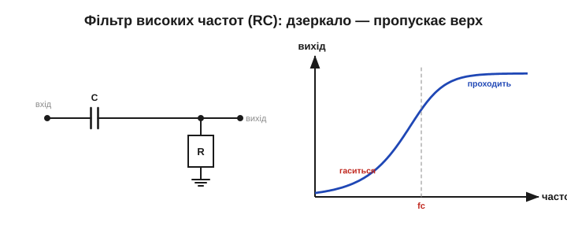
*Рис. 2.3.7.3. Поміняти R і C місцями — і характеристика перевертається: низ гаситься, верх проходить. Це фільтр високих частот. Розділовий (coupling) конденсатор — його окремий випадок: блокує постійну складову, пропускає змінний сигнал.*

### Додаємо котушку: смуговий фільтр

Поки що R і C дали нам «згори» або «знизу». Щоб вибрати **одну смугу** посередині, потрібен резонанс — а отже, котушка. Згадаймо послідовний LC-контур ([§2.3.5](ch09-reactance-resonance.md)): на резонансній частоті f₀ реактивності L і C гасять одна одну, і повний опір контуру падає до мінімуму (лишається тільки R). Тобто **саме частота f₀ проходить найлегше**, а сусідні — гірше, бо для них лишається непогашена реактивність. Це **смуговий фільтр** (band-pass filter, BPF): пропускає вузьку смугу навколо f₀ й тисне решту.

А наскільки вузьку? Рівно настільки, як каже добротність: ширина смуги Δf = f₀/Q ([§2.3.6](ch09-reactance-resonance.md)). Висока Q — гострий фільтр, що виділяє одну станцію; низька — широкий, що пропускає цілий діапазон. **Це і є радіоприймач** з історії розділу: змінним конденсатором рухаємо f₀ по діапазону, а Q задає, наскільки чисто відділяється сусідня станція.

**Приклад. Яку смугу пропустить контур на f₀ = 1 МГц із Q = 100?**
```
Δf = f₀ / Q
   = 1 000 000 / 100
   = 10 000 Гц = 10 кГц
```
Якраз ширина AM-**каналу** (~10 кГц рознесення; самого аудіо там близько 5 кГц через дві бічні смуги): фільтр пропустить цілу станцію й відітне сусідні за 10 кГц. Підняли б Q удесятеро — смуга звузилася б до 1 кГц: сусіди відділялися б краще, та краї сигналу вже обрізалися б. Знову той самий компроміс вибірковість↔смуга — лише тепер ми бачимо його як ширину **пропускання фільтра**.


*Рис. 2.3.7.4. Послідовний RLC на резонансі має мінімальний опір — тож смуга навколо f₀ проходить, а решта гаситься непогашеною реактивністю. Ширина смуги Δf = f₀/Q. Це фізика радіонастройки: f₀ задають L і C, гостроту — Q.*

> 🔧 **Навіщо це.** Смуговий фільтр — серце будь-якого приймача: радіо, Wi-Fi, мобільного. Антена ловить тисячі сигналів одночасно; смуговий контур пропускає лише потрібну смугу, відкидаючи решту, перш ніж сигнал піде на підсилення. Без частотної вибірковості радіозв'язку просто не існувало б — усі станції злилися б у суцільний шум.

### Навпаки: режекторний фільтр

Іноді треба не вибрати частоту, а **викинути** її. Поставмо резонансний контур так, щоб саме на f₀ він замикав сигнал на землю (або, навпаки, ставив максимальний опір на шляху сигналу). Тоді одна вузька смуга провалюється, а решта проходить. Це **режекторний фільтр** (band-stop / notch filter). Класичне застосування — прибрати фон мережі 50 Гц із чутливого підсилювача або забити одну заважальну несучу, не чіпаючи решти спектра. Глибина й вузькість провалу теж залежать від Q: висока Q дає глибокий, але тонкий «зуб», що вирізає рівно одну частоту, майже не торкаючись сусідніх. Тому режектор на 50 Гц можна зробити таким вузьким, що корисний звук поряд лишиться недоторканим.


*Рис. 2.3.7.5. Режекторний (notch) фільтр — дзеркало смугового: усе проходить, окрім вузької смуги навколо f₀, яка провалюється. Так вирізають одну заважальну частоту (наприклад, фон 50 Гц), не чіпаючи корисний сигнал.*

### Чотири типи — одна ідея

Отже, чотири базові фільтри — це чотири форми того, як коефіцієнт передачі залежить від частоти: ФНЧ (пропускає низ), ФВЧ (пропускає верх), смуговий (пропускає середину), режекторний (вирізає середину). Усі вони — лише різні комбінації того самого: частотозалежних реактивностей C і L та резистора, що задає затухання й гостроту коліна.

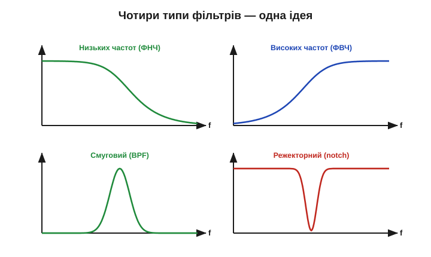
*Рис. 2.3.7.6. Чотири базові частотні характеристики. Низькочастотний і високочастотний відсікають половину спектра; смуговий і режекторний працюють навколо f₀ — один пропускає смугу, інший вирізає. Усе це — гра тих самих Xc, XL та R.*

> Що задає різкість «коліна»? Для простого RC — **порядок** фільтра (число полюсів): один RC дає пологий спад 6 дБ/октаву, два каскади — 12, і так далі. А **Q** окремо керує піком і демпфуванням у **резонансних** (другого порядку) ланках — для одного RC поняття Q взагалі не визначене. Тому край роблять різкішим двома способами: нарощують порядок (більше RC-ланок) або вводять резонанс, де високе Q дає гострий пік на коліні. Але надто гострий фільтр (висока Q) ризикує обрізати корисну смугу й «дзвеніти» на перехідних — той самий компроміс вибірковість↔смуга з [§2.3.6](ch09-reactance-resonance.md).

### Частотна вибірковість — велика ідея

Тепер видно, навіщо був увесь розділ. Здатність кола **обирати частоти** — усюди:

- **Радіо** — смуговий контур виділяє одну станцію з ефіру (історія розділу).
- **Звук** — регулятори тембру (бас/високі), кросовери в колонках, що шлють низькі частоти на динамік-бас, а високі — на твітер.
- **Живлення** — згладжування пульсацій ([§2.1.6](../ch07-capacitor/ch07-capacitor.md)) — це фільтр низьких частот: пропускає постійку, тисне змінну «брижу»; а фільтри завад (EMI) ріжуть високочастотний шум, не пускаючи його в мережу й з мережі.
- **Вимірювання й зв'язок** — виділити корисний сигнал із шуму, розкласти багатоканальну лінію на окремі смуги.

Усі ці фільтри ми зібрали з пасивних деталей — R, L, C. Ту саму вибірковість роблять і «активно», з підсилювачами: тоді можна обійтися без громіздких котушок і отримати кращу форму характеристики (до активних приладів ми дійдемо в наступних розділах). А в цифровій техніці фільтр узагалі стає **програмою**, що рахує над відліками сигналу. Та хоч би як його втілили — пасивно, активно чи в коді, — у основі лежить та сама ідея цього розділу: різні частоти зустрічають різний «опір».


*Рис. 2.3.7.7. Суть вибірковості: на вхід — мішанина частот (багато станцій, шум, завади), фільтр пропускає лише потрібну смугу. Той самий принцип — у радіо, кросовері колонок, згладжувачі живлення й фільтрі завад.*

> 🔧 **Навіщо це.** Сама ідея «розкласти все за частотами й працювати з кожною окремо» — фундамент техніки зв'язку. Перші **хвильові фільтри** в Bell System створив **Джордж Кемпбелл** (працював над ними з початку 1910-х, патент подав 1915-го, видали 1917-го) — саме щоб «упакувати» багато телефонних розмов в один дріт, рознісши їх по частотах. Трохи згодом **Отто Цобель** розвинув теорію складених фільтрів (класична праця — 1923 р.), додавши гнучкіші узгоджені ланки. Тобто Кемпбелл заклав, а Цобель розвинув — не одночасно. Та сама думка сьогодні дає тисячі каналів в одному оптоволокні й десятки мереж Wi-Fi в одній кімнаті — кожна на своїй смузі.

### Підсумок розділу

Ми пройшли всю реактивну природу C і L: реактивний опір, що залежить від частоти ([§2.3.1](ch09-reactance-resonance.md)–[§2.3.3](ch09-reactance-resonance.md)); зсув фаз ([§2.3.4](ch09-reactance-resonance.md)); резонанс, де реактивності гасяться ([§2.3.5](ch09-reactance-resonance.md)); добротність Q як гостроту й смугу ([§2.3.6](ch09-reactance-resonance.md)); і нарешті — фільтри й частотну вибірковість, де все це працює разом. Ми зібрали всі цеглинки **пасивної** електроніки: резистор, конденсатор, котушка вміють зберігати, ділити, зсувати фази, обирати частоти. Але говорили ми про це поки що саморобними словами — «передає стільки-то», «глушить удесятеро». У наступному розділі дамо цій грі частот професійну мову, якою підписано кожен графік у кожному даташиті: частотні характеристики, децибели й діаграму Боде — і доберемося до фільтрів крутіших, ніж один RC.

> ▶️ Далі: [Розділ 2.4 — АЧХ, децибели й фільтри](../r04-frequency-response/r04-frequency-response.md)
