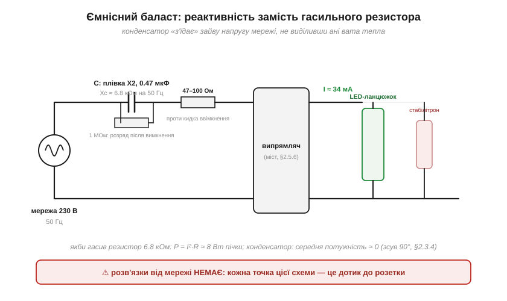
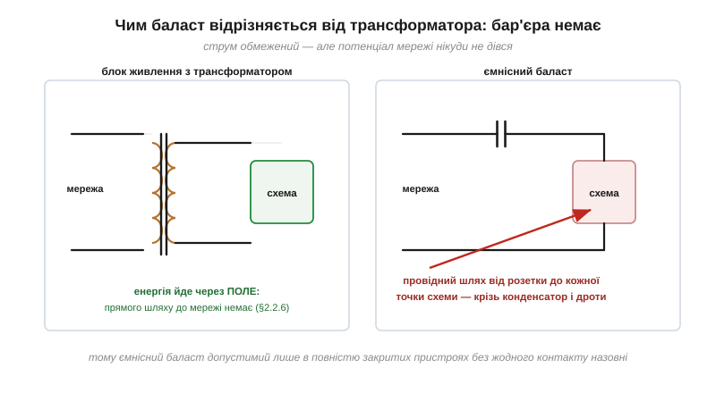

# 🔌 Ємнісний баласт: реактивність як «резистор без тепла» — і чому це небезпечно

> Це компонентна вставка до теми [2.3.2 «Реактивний опір конденсатора»](ch09-reactance-resonance.md). Тема порахувала: мікрофарад на 50 Гц — це кілооми протидії, які **не гріються**. Дешева промисловість зробила з цього спостереження цілу схему живлення — **ємнісний баласт**, що сидить у кожній копійчаній LED-лампі. Розберемо, як він працює, як його впізнати — і чому ця схема вимагає особливої поваги: вона з'єднана з розеткою кожною своєю точкою.

### Клас схеми

**Ємнісний баласт** (*capacitive dropper*, безтрансформаторне живлення) — це послідовний ланцюжок: мережа → плівковий конденсатор класу X2 → невеликий захисний резистор → випрямляч ([§2.5.6](../ch10-diode-pn-junction/ch10-diode-pn-junction.md)) → споживач зі стабілітроном ([§2.5.8](../ch10-diode-pn-junction/ch10-diode-pn-junction.md)). Плюс мегаомний резистор паралельно конденсатору — розряджати його після висмикування вилки ([§2.1.4](../ch07-capacitor/ch07-capacitor.md): та сама ідея bleeder-резистора).


*Рис. 2.3.2c.1. Конденсатор X2 працює гасильним «опором»: його реактивність обмежує струм до потрібних міліампер, не виділяючи тепла. Решта деталей — обслуга: резистор проти кидка ввімкнення, bleeder для розряду, стабілітрон проти холостого ходу. І головний напис — червоним.*

### Як працює: закон Ома з реактивністю

Уся схема — одне застосування формули з [§2.3.2](ch09-reactance-resonance.md). Візьмемо C = 0.47 мкФ:

```
Xc = 1/(2π·50·0.47×10⁻⁶) ≈ 6.8 кОм
I ≈ 230 В / 6.8 кОм ≈ 34 мА
```

Тридцять чотири міліампери — якраз на ланцюжок світлодіодів. А тепер головна принада. Якби ці 6.8 кОм були резистором, на ньому осідало б P = I²·R ≈ **8 Вт** — пічка, що потребує корпуса й вентиляції. Конденсатор же — чиста реактивність: струм і напруга на ньому зсунуті на 90°, і середня потужність **нуль** ([§2.3.4](ch09-reactance-resonance.md)). «Резистор без тепла»: обмежує струм, не платячи ватами. Звідси й економіка: без трансформатора (найдорожча й найважча деталь) і без імпульсного перетворювача лампочка складається з конденсатора та жмені копійчаних деталей.

### Чому це небезпечно

Тепер — друга половина назви, найважливіша. У трансформаторного живлення енергія переходить **через поле**, і провідного шляху від мережі до схеми немає — це гальванічна розв'язка з [§2.2.6](../ch08-inductor/ch08-inductor.md). У баласта **розв'язки немає взагалі**: кожна точка схеми з'єднана з розеткою через конденсатор і дроти.


*Рис. 2.3.2c.2. Зліва — трансформатор: між мережею і схемою лише магнітне поле, прямого шляху немає. Справа — баласт: провідний шлях від розетки до кожної точки схеми. Конденсатор обмежує струм, але потенціал мережі нікуди не дівається — «низьковольтна» частина низьковольтна лише відносно самої себе.*

Підступність у тому, що схема **виглядає** низьковольтною: на світлодіодах якихось кілька десятків вольтів. Але це напруга *між точками схеми*; відносно землі (а ви стоїте на землі) будь-яка точка може сидіти на повній фазі — залежно від того, яким боком увімкнена вилка. Додаткові пастки: без навантаження обмежувати напругу нікому, і вона злітає до повної мережевої (тому стабілітрон не опція, а необхідність); увімкнення в пік синусоїди жене через розряджений конденсатор кидок струму ([§2.1.4](../ch07-capacitor/ch07-capacitor.md): порожній конденсатор — «коротке») — його гасить захисний резистор.

Звідси залізні правила: схема допустима лише в **повністю закритих** пристроях без жодного контакту назовні (ні клем, ні роз'ємів, ні металевих частин); вимірювати її можна тільки через розділовий трансформатор; а вчитися електроніці на таких схемах — не можна взагалі.

### Як упізнати

Великий прямокутний плівковий конденсатор із написом **X2 275V~** одразу біля мережевих контактів — і жодного трансформатора поряд: це він. Ще один підпис — мерехтіння дешевої LED-лампи на 100 Гц (струм пульсує разом із мережею, накопичувати енергію майже нічому).

### Типові граблі

- **Замінити X2 на «звичайний» конденсатор.** Клас X2 створений жити прямо на мережі з її викидами й уміє самозагоюватися; звичайна плівка чи кераміка на цьому місці — питання часу до пробою.
- **Ємність X2 тане з роками.** Кожне самозагоєння з'їдає шматочок обкладки; ємність повзе вниз, струм меншає — лампа тьмяніє і блимає. Найчастіша несправність таких ламп — «висохлий» X2.
- **Обрив навантаження.** Перегорів ланцюжок світлодіодів — увесь струм пішов у стабілітрон, і тепер гріється (і вмирає) він.
- **Мультиметр відносно землі.** Спроба «поміряти, що там на виході» щупом на заземлений осцилограф закінчується феєрверком: ви щойно з'єднали фазу з землею.

### Варіації класу

Той самий трюк із гасінням без тепла існує в трьох поколіннях: **резистивний** баласт (гріється — старі гірлянди й нічники), **ємнісний** (наш герой), **індуктивний** — дросель послідовно з люмінесцентною лампою, дзеркальний випадок на реактивності котушки ([§2.3.3](ch09-reactance-resonance.md)). Сучасна альтернатива — мініатюрні імпульсні перетворювачі з розв'язкою, які вже майже зрівнялися в ціні; але сотні мільйонів ламп із конденсатором замість трансформатора ще довго висітимуть у патронах — тепер ви знаєте, що в них всередині і чому їх не можна розкривати ввімкненими.
