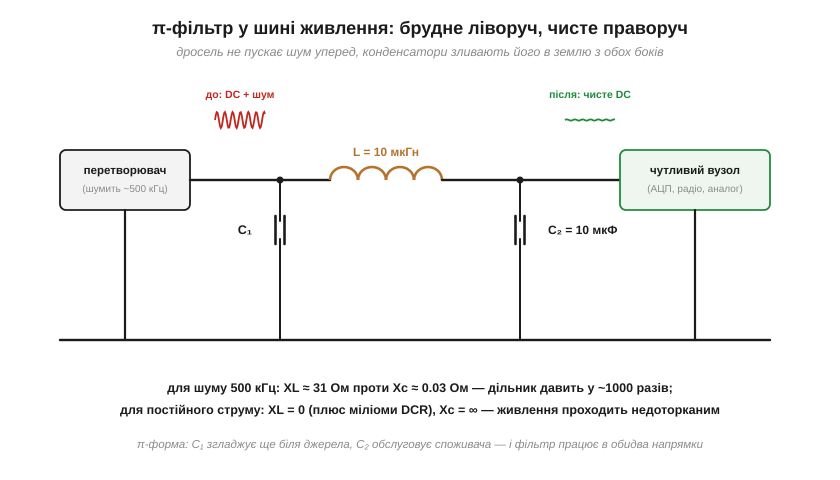
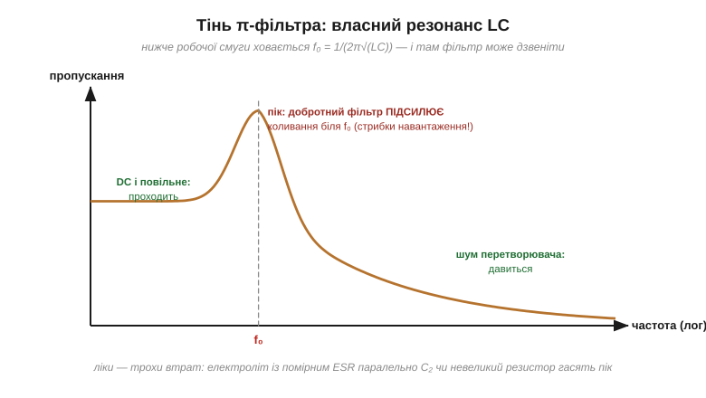

# 🔌 Дросель і LC-фільтр у колі живлення: π-фільтр

> Це компонентна вставка до теми [2.3.3 «Реактивний опір котушки»](ch09-reactance-resonance.md). Рамка наприкінці теми вже намалювала ідею «котушка послідовно + конденсатор у землю». Тут — її доросла форма, що стоїть чи не в кожному живленні: **π-фільтр**, цифри його роботи, причина, чому дросель в шині не гріється, — і власна тінь цього фільтра, про яку забувають найчастіше.

### Клас вузла

π-фільтр — це три деталі у формі грецької літери π: конденсатор у землю, **дросель послідовно** в шині, ще один конденсатор у землю. Стоїть він між шумним джерелом (найчастіше імпульсним перетворювачем, що смітить на своїй робочій частоті в сотні кілогерців) і чутливим споживачем — АЦП, радіотрактом, вимірювальним підсилювачем.


*Рис. 2.3.3c.1. Брудна шина ліворуч, чиста праворуч. Для шуму дросель — стіна (велика XL), конденсатори — зливи (мала Xc); для постійного струму дросель прозорий, конденсатори невидимі. Перший конденсатор працює на джерело, другий — на споживача.*

### Як працює: дільник із двох реактивностей

Уся дія — один частотно-залежний дільник напруги ([Розділ 1.5](../../block-1-circuits-physics/ch05-equivalent-circuits/ch05-equivalent-circuits.md)): зверху послідовна XL, знизу шунтуюча Xc. Підставимо типові числа — L = 10 мкГн, C = 10 мкФ, шум перетворювача 500 кГц:

```
XL = 2π·(5×10⁵)·(10×10⁻⁶) ≈ 31 Ом
Xc = 1/(2π·(5×10⁵)·(10×10⁻⁶)) ≈ 0.03 Ом
до споживача дійде:  Xc/(XL + Xc) ≈ 0.001  →  шум давиться в ~1000 разів
```

А для **постійного** струму той самий дільник вироджується: XL = 0 (лишаються міліоми DCR), Xc = ∞ — живлення проходить недоторканим. Один вузол, дві поведінки — рівно та дзеркальність Xc/XL, на якій стоїть уся тема [2.3.3](ch09-reactance-resonance.md).

### Чому дросель не гріється як резистор

Порівняймо чесно. Якби «31 Ом проти шуму» забезпечував резистор, він стояв би в шині й для корисного струму: при 1 А це 31 Вт пічки і 31 В просідання — абсурд. Дросель же чинить свої оми **лише змінному** струмові, а реактивність до того ж не розсіює енергії (зсув 90°, [§2.3.4](ch09-reactance-resonance.md)): шум він відбиває назад, а не палить. Корисному струмові дістаються самі міліоми обмотки — міливати втрат. Це той самий трюк «опір без тепла», що в [ємнісного баласта](ch09-s2-c-capacitive-dropper.md), лише навиворіт: там реактивність гасила корисну частоту, тут — пропускає її задарма.

### Тінь фільтра: власний резонанс

L і C поряд — це завжди контур, і π-фільтр не виняток: у нього є власна резонансна частота f₀ = 1/(2π√(LC)) ([вставка про Томсона](ch09-s5-m-thomson-formula.md)). Для наших номіналів — близько 16 кГц. Вище за неї фільтр давить дедалі краще; але **на самій f₀** добротний фільтр без втрат може коливання *підсилювати* — стрибок навантаження чи вмикання живлення «дзеленькає» шиною замість рівного переходу.


*Рис. 2.3.3c.2. Характеристика фільтра має три зони: постійне і повільне проходить, шум перетворювача давиться — а між ними стирчить пік власного резонансу. Той самий ефект, що в пари «бусина + конденсатори» з §2.2.9: ліки — трохи втрат поряд.*

Ліки прості й стандартні: додати втрат — електроліт із помірним ESR паралельно вихідному конденсатору або одиниці ом послідовно з ним. Та сама логіка, що з дзвоном бусини в [§2.2.9](../ch08-inductor/ch08-inductor.md): надто «ідеальний» фільтр гірший за злегка втратний.

### Дросель чи бусина?

Обидва стоять послідовно в живленні — але це різні інструменти ([§2.2.9](../ch08-inductor/ch08-inductor.md)). **Дросель** — накопичувальна деталь із великою L: давить кілогерци-мегагерци пульсацій перетворювача, тримає робочий струм (дивитися I_sat та I_rms — [вставка про силові дроселі](../ch08-inductor/ch08-s7-c-power-inductors.md)). **Бусина** — втратна дрібнота для десятків-сотень мегагерців радіосміття. У серйозному живленні чутливого вузла вони часто стоять **разом**: π-фільтр бере на себе пульсації, бусина за ним — ВЧ-хвости.

### Типові граблі

- **Недооцінений струм.** Дросель у насиченні втрачає L ([§2.2.7](../ch08-inductor/ch08-inductor.md)) — фільтр тихо зникає саме під повним навантаженням, коли найпотрібніший.
- **Надто добротний фільтр.** Жодних втрат — і кожен стрибок навантаження дзвонить на f₀ просіданнями й викидами. Перевіряйте перехідний процес, не лише «середній» шум.
- **Шум обходить фільтр землею.** π-фільтр чистить шину, але якщо зворотний струм шуму тече спільною землею повз фільтр — користі мало; розводка землі важить не менше за номінали (докладно — у темах про плати).
- **Сподівання на гігагерци.** Вище за власні резонанси компонентів (SRF дроселя [§2.2.7](../ch08-inductor/ch08-inductor.md), ESL конденсаторів [§2.1.5](../ch07-capacitor/ch07-capacitor.md)) фільтр перестає бути собою — для НВЧ працюють інші засоби.

### Варіації класу

LC-«півфільтр» (без першого конденсатора), багатоланкові π-π каскади для вимірювальної техніки, фільтри з феритовою бусиною замість дроселя (для суто ВЧ-задач), готові «фільтри живлення» в одному корпусі. Логіка скрізь одна, з цієї вставки: послідовна реактивність росте з частотою, шунтуюча — падає, і між ними шумові нема куди подітися — аби лиш ви пам'ятали про струм насичення і про пік на f₀.
